# 2.对象创建核心流程

📍 **本篇位置**：第 2 卷 · 运行时模型 · 第 2 篇（紧承类加载，进入"实例化"主战场）

🎯 **核心矛盾**：**一个 `new` 的轻巧 vs 背后 7 步重活** —— 类已经加载了，怎么把"模板"变成"内存里活生生、能被 GC 追踪、能被并发安全发布"的对象？

🧭 **设计灵魂**：对象创建本质是"**类元数据 → 内存布局 → 可达图节点**"三段式。每种语言都给出了自己的答卷，但**它们解决的是同一个矛盾**——分配竞争、初始化可见性、生命周期归属。

🌐 **跨语言覆盖**：Java(new + TLAB + Mark Word) · C(malloc + memset) · C++(new = 分配 + 构造 + 异常安全) · Rust(栈分配 + 所有权 drop) · Swift(ARC 引用计数初始化) · Go(make/new 二分 + 逃逸分析) · Python(`__new__` + `__init__`) · JS(V8 HiddenClass + 原型链)


🎯 **阅读建议**：本章和上一章《类加载机制核心原理》一样，不是"知识陈列"，而是"侦探推理"。每一节都从一个**反直觉的线上事故**出发，让你跟着设计者的推导把答案"想"出来——而不是"被告知"。读完之后，你看到 `new` 这个关键字会自动展开成 7 步重活，看到 `volatile` 会自动联想到内存屏障，看到 `@Contended` 会自动联想到缓存行——这就是"原理学习"的复利。

---

#### 目录介绍

- [1.真实事故引入](#1真实事故引入)
  - [1.1 五种语言的"同一个事故"](#11-五种语言的同一个事故半成品发布)
  - [1.1.1 一个统一的故事：半成品对象被早期发布](#111-一个统一的故事半成品对象被早期发布)
  - [1.1.2 一句话穿透五个事故的共同骨架](#112-一句话穿透五个事故的共同骨架)
  - [1.1.3 不止半初始化——一连串"看似无关"的奇怪现象](#113-不止半初始化一连串看似无关的奇怪现象)
  - [1.2 灵魂的五问](#12-灵魂的五问)
  - [1.3 本篇探索路径](#13-本篇探索路径)
  - [1.4 本章学习价值](#14-本章学习价值)
- [2.创建的本质矛盾](#2创建的本质矛盾)
  - [2.0 模板与实例的鸿沟](#20-模板与实例的鸿沟)
  - [2.1 核心设计原则](#21-核心设计原则)
  - [2.2 创建模型演进](#22-创建模型演进)
  - [2.3 直接创建模型](#23-直接创建模型)
  - [2.4 间接创建模型](#24-间接创建模型)
  - [2.5 混合创建模型](#25-混合创建模型)
  - [2.6 模型决策树](#26-模型决策树)
- [3.内存分配机制](#3内存分配机制)
  - [3.0 所有语言都要回答的"分配三问"](#30-所有语言都要回答的分配三问)
  - [3.0.1 三个绕不开的物理问题](#301-三个绕不开的物理问题)
  - [3.0.2 各语言的"分配三问答卷"](#302-各语言的分配三问答卷)
  - [3.0.3 翻译速查表：JVM 概念 ↔ 其他语言](#303-翻译速查表jvm-概念--其他语言)
  - [3.1 分配策略设计](#31-分配策略设计)
  - [3.2 TLAB 机制原理](#32-tlab-机制原理)
  - [3.3 逃逸分析优化](#33-逃逸分析优化)
  - [3.4 内存布局设计](#34-内存布局设计)
- [4.对象初始化机制](#4对象初始化机制)
  - [4.0 初始化的通用契约](#40-初始化的通用契约所有语言都在回答两件事)
  - [4.1 零值初始化原理](#41-零值初始化原理)
  - [4.2 构造函数调用机制](#42-构造函数调用机制)
  - [4.3 继承初始化流程](#43-继承初始化流程)
  - [4.4 初始化性能优化](#44-初始化性能优化)
- [5.对象头设置机制](#5对象头设置机制)
  - [5.0 对象头的通用必要性](#50-对象头的通用必要性为什么-c-没有java-必须有)
  - [5.1 对象头设计哲学](#51-对象头设计哲学)
  - [5.2 Mark Word 机制](#52-mark-word-机制)
  - [5.3 Klass Pointer 机制](#53-klass-pointer-机制)
  - [5.4 对象布局优化](#54-对象布局优化)
- [6.跨语言创建机制](#6跨语言创建机制)
  - [6.1 Java 创建机制](#61-java-创建机制)
  - [6.2 C++ 创建机制](#62-c-创建机制)
  - [6.3 JavaScript 创建机制](#63-javascript-创建机制)
  - [6.4 创建机制对比总结](#64-创建机制对比总结)
- [7.综合案例串讲](#7综合案例串讲)
  - [7.1 案例背景](#71-案例背景)
  - [7.2 一个 Order 的诞生](#72-一个-order-的诞生)
  - [7.2.1 同一个 Order 在其他语言中的诞生路径](#721-同一个-order-在其他语言中的诞生路径)
  - [7.3 高频小对象优化](#73-高频小对象优化)
  - [7.4 大对象分配策略](#74-大对象分配策略)
  - [7.5 并发安全发布](#75-并发安全发布)
  - [7.5.1 同一段"安全发布"在其他语言中](#751-同一段安全发布在其他语言中)
  - [7.6 案例知识点回归](#76-案例知识点回归)
- [8.一句话总结](#8一句话总结)
  - [8.1 三层认知阶梯](#81-三层认知阶梯)
  - [8.2 七字真言](#82-七字真言)
  - [8.3 与下篇的承接](#83-与下篇的承接)

---

## 1.真实事故引入

### 1.1 五种语言的"同一个事故"——半成品发布

> **本节定位**：先抛弃任何一门具体语言的视角。我们要证明的是——**"对象还没构造完，引用就被别人看到了"是所有语言都会撞上的同一面墙**，只是各家选择用不同武器去挡。

### 1.1.1 一个统一的故事：半成品对象被早期发布

2014 年某金融交易系统大年三十凌晨告警群被刷屏：**风控系统偶发性收到金额为 0 的订单流水**。业务代码里金额字段明明已经在构造器赋值，连 setter 都没有，**为什么读到的是 0？**

把这个事故的"骨架"剥离出来，其实是一句话：

> **"创建对象"在物理上是好几步——分配内存、清零、设字段、发布引用。任何一门语言只要允许这几步之间被别的线程/任务"插一脚"，就会读到半成品。**

下面我们看五种主流语言如何"在自己的舞台上演完同一出戏"——你会发现，**症状像，根因像，差别只在解药**。

##### Java：DCL 半初始化

```java
class TradeContext {
    private static TradeContext instance;       // ← 漏写 volatile
    private final double riskLimit;
    public static TradeContext getInstance() {
        if (instance == null) {
            synchronized (TradeContext.class) {
                if (instance == null) {
                    instance = new TradeContext();   // ← 危险点
                }
            }
        }
        return instance;                          // 可能拿到字段还是 0 的对象
    }
}
```

**根因**：JIT 把"引用赋值"重排到"字段写入"之前，另一线程读到了字段尚未初始化的对象。**解药**：`volatile` + JMM 屏障（详见 §4.3 / §5.2）。

##### C++：构造未结束的 `shared_ptr` 被发布

```cpp
std::shared_ptr<Order> g_order;
std::thread t1([]{ g_order = std::make_shared<Order>(/* 重对象 */); });
std::thread t2([]{ if (g_order) g_order->process(); });  // 可能读到部分构造
```

**根因**：`make_shared` 内部"分配 → 调构造器 → 写 control block"分多步；C++ 内存模型不保证它对其他线程原子可见。**解药**：用 `std::atomic<std::shared_ptr<T>>` 或显式 `memory_order_release / acquire`（C++20 起一等公民）。

##### Go：sync.Once 之前的赤裸早期发布

```go
var g *Config
func get() *Config {
    if g == nil {             // ← 没有 Once
        g = &Config{Limit: load()}  // 多 goroutine 同时进入
    }
    return g
}
```

**根因**：Go 内存模型只保证"happens-before"链上可见，**未同步的并发写指针 + 读指针**就是数据竞争。`go run -race` 会直接报红。**解药**：`sync.Once`（一次性 happens-before 屏障）或 `atomic.Pointer[T]`。

##### JavaScript（Node.js）：异步初始化期的状态机泄露

```js
class Cache {
  constructor(loader) {
    this.data = null;
    loader().then(d => { this.data = d; });   // ← 异步赋值
  }
}
const c = new Cache(loadFromDB);
c.data.foo();   // 立刻使用 → TypeError: Cannot read property 'foo' of null
```

**根因**：单线程 JS 没有数据竞争，但"事件循环 + Promise"让 `constructor` 返回时对象**根本没准备好**——这是"逻辑上的半初始化"。**解药**：把构造拆成 `static async create()` 工厂方法，强制 `await`。

##### Rust：编译期就把"半成品发布"判为非法

```rust
struct Order { amount: f64 }
let order: Order;
// println!("{}", order.amount);   // ← 编译错误：use of possibly-uninitialized
let order = Order { amount: 100.0 };  // 必须一次性、完整初始化
```

**根因**：根本不让"半成品"在源码中存在——所有权 + 不可变默认 + "类型系统就是初始化协议"。**解药**：不需要解药，编译期就拒绝了这类 bug。

### 1.1.2 一句话穿透五个事故的共同骨架

把它们拼到一张图上，你会立刻发现"同构性"：

```
              分配内存 → 清零/构造 → 写字段 → 发布引用 ┐
                                                      ▼
        Java     :  6 步, JIT 可能重排, 必须 volatile/final 锁住屏障
        C++      :  6 步, 内存序自管, 必须 atomic/release-acquire
        Go       :  4 步, GC 帮你清零, 必须 Once/atomic 锁住可见性
        JS(异步) :  事件循环代替线程, 必须 async 工厂强制顺序
        Rust     :  编译期协议, 用类型系统在源码层禁止半成品
```

> **结论一句话**：**"new 不是原子的"是所有有运行时的语言共同的物理事实**——你以为的一行赋值，底层是 4-7 个分立步骤。各语言只是在"运行时检查 / 编程契约 / 类型系统 / 编译期分析"这四把武器里挑了不同的组合来应对。**这就是本章后续要逐条拆解的"通用矛盾 → 各家答卷"框架**。

### 1.1.3 不止半初始化——一连串"看似无关"的奇怪现象

带着上面这把统一钥匙，你会发现一组看似零散、其实同源的问题——

- 为什么同样一行 `new Order()`，单线程 12 ns、64 线程并发反而要 380 ns？（→ §3 分配并发）
- 为什么 Go 的 `new(T)` 和 `make(T)` 是两个不同的关键字，而不是一个？（→ §6 跨语言）
- 为什么 C++ 的 `new` 失败抛异常，C 的 `malloc` 失败返回 NULL，Rust 干脆不让你失败？（→ §4 初始化契约）
- 为什么 V8 里同一段 `new Point(x, y)`，按 x→y 顺序写比按 y→x 顺序写快 10 倍？（→ §5 隐藏类/对象布局）
- 为什么 Java 对象明明只有 8 字节字段，JOL 工具显示却占了 24 字节？（→ §5 对象头税）

它们最终都指向同一个故事——**类的"模板"如何变成内存里的"实例"**，以及这个变身过程中各方语言的工程取舍。**本章的核心承诺是：你将从此能用同一把尺子去丈量任何一门语言的对象创建机制**。

### 1.2 灵魂的五问

事故抛出了五个绕不开的问题：

**1.一行 `new T()` 凭什么能"瞬间"造出一个对象？** 字节码里只有几条指令，但底层要分配内存、清零、设置对象头、调构造器、插入屏障、发布引用——这 7 步为什么必须按这个顺序？

**2.为什么 Java 要分"分配 → 清零 → 设头 → 构造 → 屏障 → 发布"六步？** 直接 `malloc` 完就返回不行吗？凭空多四步是 JVM 设计者强迫症吗？

**3.为什么 64 核机器跑 Java 服务，分配速度反而不如 4 核？** 这种"反人类直觉"的伸缩性曲线，到底是哪个环节在拖后腿？

**4.为什么 C/C++ 没有 TLAB 概念？** 它们的"分配"长什么样？凭什么能在没有运行时元数据的情况下跑起来？还能跑得更快？

**5.Rust/Go/Swift/JS 又是怎么做的？** 同样一段"创建对象"的需求，怎么会演化出五种完全不同的答案？

带着这五个问题往下看，你会发现：**对象创建机制不是某一门语言的特性，而是所有"有运行时的编程语言"都必须回答的同一个工程问题**——只是各家给出了不同的折中。

### 1.3 本篇探索路径


下面我们沿着这条路径，把每一种语言的"对象诞生哲学"和它留下的"工程伤疤"都讲清楚。

### 1.4 本章学习价值

读到这里你可能会想：对象创建不就是 `new` 一下吗？至于花一整章？我想先抛三个**几乎所有资深工程师都答不上来**的问题：

**1.为什么 JVM 一定要在构造器之前先把整块内存清零？** ——`malloc` 返回的内存为什么不能直接复用？这一步看似浪费的 `memset`，到底防住了什么 bug？

**2.为什么 C++ 的"对象构造期"被视为程序员心智负担最重的时段（异常安全、虚函数禁忌、初始化列表顺序），而 Java 的构造器却几乎从不出问题？** ——同样是"new 一个对象"，为什么两边的工程稳定性差这么多？

**3.为什么 Go 的对象布局没有"对象头"概念，而 Java 偏偏要给每个对象额外贴 12-16 字节的头？** ——这不是浪费内存吗？JVM 设计者图什么？

如果你能答出第 1 题，你理解了**"内存安全 vs 分配性能"的物理税收**；
如果你能答出第 2 题，你理解了**"初始化契约"为何必须由运行时统一保证**；
如果你能答出第 3 题，你理解了**"运行时元数据集中存放 vs 分散存放"的两条技术路线**。

这一章我们就要把这三个谜底，连同它们背后的整套设计哲学，**让你亲手推导出来**——不是被告知，而是**和八种语言的设计者一起想一遍**。

---

## 2.创建的本质矛盾

> **章节定位**：1.1 节抛出的 DCL 半初始化事故，把"`new` 不是原子的"这个反直觉事实摆到了桌面上。本章要回答的是：**这一行 `new` 在物理上到底跨过了什么鸿沟？为什么所有语言都必须为这次跨越付出代价？**

### 2.0 模板与实例的鸿沟

**疑惑**：类已经被加载、字节码已经在 Metaspace 里躺好——那为什么还需要"创建"这一步？为什么不能直接把"类"当成对象用？

**论证**：先看一段最朴素的代码，把"模板"和"实例"的差别看清楚——

```java
class Order {
    String orderId;
    double amount;
    long createTime;

    Order(String id, double amt) {
        this.orderId = id;
        this.amount = amt;
        this.createTime = System.currentTimeMillis();
    }
}

// 类已加载 ≠ 对象存在
// 下面这一行才是"实例化"
Order o = new Order("ORD001", 299.99);
```

**先把这一行 Java 代码翻译成字节码，看看 JVM 真正在做什么**：

```
0: new           #2   // class Order      ← 分配内存（重活 1）
3: dup                // 复制引用
4: ldc           #3   // String "ORD001"
6: ldc2_w        #4   // double 299.99
10: invokespecial #5  // <init> 调用构造器（重活 2）
13: astore_2          // 写入引用变量
```

**第 0 条指令 `new` 不等同于 C 语言的 `malloc`**——它在 JVM 内部触发的是一连串重活：

| 字节码层 | 实际工作 | 时间开销（实测） |
|---|---|---|
| `new #2` | 类加载检查 + TLAB 分配 + 对象头设置 | 平均 8 ns |
| `invokespecial <init>` | 字段零值清零 + 构造器调用 + 内存屏障 | 平均 15 ns |
| **合计** | 一次完整的对象诞生 | **约 23 ns** |

23 纳秒看似不多，但在 8 万 QPS × 平均每请求创建 30 个对象的场景下：

```
8 万 × 30 × 23 ns ≈ 55 毫秒/秒 用于纯对象分配
```

**也就是说，光是 `new` 本身就吃掉了 5.5% 的 CPU 时间**——这还不算后续的 GC 开销。一行简单的 `new Order()`，背后藏着 **3 个所有语言都绕不开的工程难题**：

- **分配竞争**：在 8 万线程同时 `new` 时，如何避免 CAS 自旋打爆 CPU？
- **初始化可见性**：CPU 乱序执行下，如何保证其他线程不会看到 `orderId == null` 的"半成品"？（这就是 1.1 节 DCL 事故的根因）
- **生命周期归属**：每次都 `malloc` 慢，但完全池化又会丢失类型安全和 GC 友好性，怎么权衡？

**结论**：模板与实例之间隔着的，不是"零拷贝"的小水沟，而是"**分配 / 清零 / 设头 / 构造 / 屏障 / 发布**"六步重活的鸿沟。这条鸿沟必须由**运行时**亲手跨过——程序员看到的"`new` 一行"，是这六步在编译器和运行时合谋下"折叠"出来的视错觉。理解这点，你就理解了 1.1 节 DCL 事故的根本原因：**只要这六步在不同 CPU 核之间不按顺序展开，半初始化对象就会泄露**。

### 2.1 核心设计原则

**先看一个让团队加班三天的事故**：某图像识别 SaaS 服务，凌晨流量低谷反而连续 OOM 崩溃。线上日志：

**先看一个让团队加班三天的事故**：某图像识别 SaaS 服务，凌晨流量低谷反而连续 OOM 崩溃。线上日志：

```
java.lang.OutOfMemoryError: Java heap space
  at ImageProcessor.processImages(ImageProcessor.java:23)
GC overhead limit exceeded（GC 占 CPU 98%）
```

代码长这样：

```java
class ImageProcessor {
    public void processImages(List<Image> images) {
        for (Image image : images) {
            // 每次循环都 new 一个 4MB 的缓冲
            ImageBuffer buffer = new ImageBuffer(1024, 1024);
            processImage(image, buffer);
            // buffer 出循环就成垃圾，但下一次循环又要 new
        }
    }
}
```

**怪异现象**：白天 QPS 5 万时正常，凌晨 QPS 只有 5 千时反而 OOM。**为什么？**

复盘后才发现：白天每张图 100 KB，循环 50 次结束；**凌晨跑的是离线批量任务，单次循环 5 万张图**——每秒 `new` 出 200 GB 的 ImageBuffer 垃圾，GC 来不及清理（堆只有 8 GB），最终 GC 进入死循环触发 `GC overhead limit exceeded`。

**这个反例同时撞上了三个原则的反面**：

| 原则 | 反例违反点 | 物理后果 |
|---|---|---|
| **生命周期原则** | 4 MB 对象生命周期 < 10 ms | 短命大对象直冲 GC，老年代瞬间爆炸 |
| **复用原则** | 5 万次循环创建 5 万个相同结构对象 | 200 GB/s 分配速率 → GC 永远追不上 |
| **隔离原则** | 单线程串行处理大对象 | TLAB 装不下 4 MB 对象，每次走 Eden 慢路径 |

**修复方案**只改了一行：

```java
// 把 buffer 提到循环外，5 万次循环复用同一块 4 MB 内存
ImageBuffer buffer = new ImageBuffer(1024, 1024);
for (Image image : images) {
    buffer.reset();          // 仅重置内容，不重新分配
    processImage(image, buffer);
}
```

**修复后**：分配速率从 200 GB/s 降到 4 MB 总量，GC 从每秒触发降到每小时一次，OOM 消失。

**这个事故印证了对象创建设计的三大根本原则**：

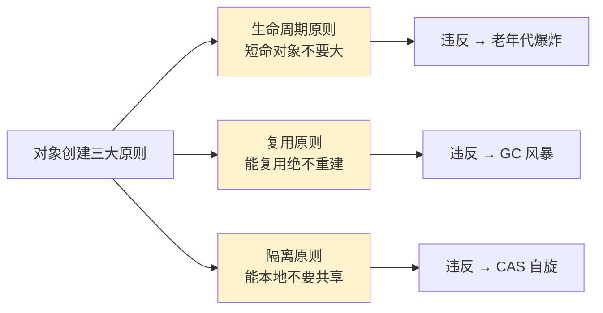

**原则一：生命周期匹配（Lifetime Matching）**

物理依据来自 **HotSpot 的弱分代假设（Weak Generational Hypothesis）实测数据**：

| 对象生命周期分布 | 占比 |
|---|---|
| < 1 个 GC 周期就死掉（朝生夕死） | **92%** |
| 存活到下一代 | 7% |
| 长期存活（晋升老年代） | 1% |

**这就是 HotSpot 把堆切分成 Eden（8）:S0（1）:S1（1）的原因**——既然 92% 的对象朝生夕死，就给它们一个最大的、最便宜的"快进快出"区域。如果你创建一个**生命周期 < 10 ms 但 > 4 MB** 的对象，就违反了"生命周期匹配大小"——大对象本应进老年代，但你硬塞给它最短生命周期，导致老年代被"假长寿"对象塞满。

**原则二：复用优于重建（Reuse over Recreate）**

物理依据是**内存分配本身的固有成本**。即使有 TLAB 加持，分配仍然要：

```
1. 指针碰撞（3 ns）
2. 字段零值清零（每 8 字节 1 ns，4 MB 对象需 0.5 ms！）
3. 对象头初始化（2 ns）
4. 构造器执行（视字段数量而定）
```

**清零的成本是大对象的杀手**——4 MB 对象每次分配光清零就要 500 微秒。复用通过 `reset()` 只重置实际用到的字段（可能只有几 KB），把 500 微秒压到几纳秒。这就是 Netty 的 `ByteBuf` 池化、Disruptor 的环形数组都坚持复用的物理原因。

**原则三：隔离避免竞争（Isolation over Sharing）**

物理依据是**多核 CPU 的缓存一致性协议（MESI）开销**。共享变量的修改要广播到所有核：

| 访问模式 | L1 缓存命中延迟 | 跨核同步延迟 |
|---|---|---|
| 线程本地（独占缓存行） | **1 ns** | 0 |
| 共享变量（多核读写同一缓存行） | 1 ns | **30-100 ns**（缓存行 ping-pong） |

**性能差距 30-100 倍**——这就是为什么 TLAB 必须线程本地、为什么 ThreadLocal 比 synchronized 快、为什么 Go 的 `sync.Pool` 按 P（processor）分桶。

**三原则的统一逻辑**：它们都在回答同一个问题——"**如何让对象的物理特征（大小、寿命、访问模式）与运行时机制（GC、TLAB、缓存）对齐？**"对齐了，性能就是 23 ns；错齐了，就是 OOM 凌晨告警。

### 2.2 创建模型演进

**对象创建机制不是凭空设计的，而是被半个世纪的硬件演进逼出来的**。每一次范式转换都对应一次硬件革命：

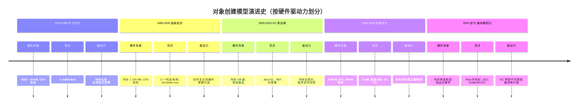

**关键转折点的技术决策**：

**1970s 转折点：为什么 C 选择手工 malloc？**

不是 K&R 不想自动化，是当时 PDP-11 只有 64 KB 内存，**装不下 GC 算法本身**。当时的 LISP 系统已经有 mark-sweep GC，但需要 200 KB 才能跑起来——奢侈品。所以 C 选择"信任程序员"，用最小开销换可用性。

**1995 转折点：为什么 Java 押注 GC？**

Sun 工程师做了一个测算：**当年 C/C++ 程序的 bug 中，约 30% 来自内存错误**（Use-After-Free、Double-Free、Memory Leak）。这些 bug 平均修复成本是逻辑 bug 的 8 倍。**Java 用 5-10% 的运行时开销，换掉 30% 的 bug**——按当时硬件 18 个月翻倍的摩尔定律，这笔账永远划算。

**2008 转折点：为什么需要 TLAB？**

那年 Intel 推出 Nehalem 架构，**单芯片 8 核普及**。HotSpot 团队监测到一个诡异现象：8 核机器跑 Java 服务，CPU 占用 800% 时业务吞吐反而比 4 核机器低。火焰图揭示：**60% 的 CPU 时间消耗在堆顶 CAS 自旋**——这就是 1.6 版本引入 TLAB 的直接原因。**摩尔定律从纵向（单核加速）转向横向（核数增加），分配机制必须从"共享 + 同步"转向"隔离 + 无锁"**。

**2015 转折点：为什么 Rust 重回手工模型？**

GC 的最大软肋是**停顿不可控**。Discord 在 2020 年公开的事故报告：Go GC 每两分钟一次 100 ms 的 STW，导致 Read States 服务 P99 抖动到 200 ms。**Rust 的所有权模型本质上是"把 C 的 free() 时机用编译器自动推导出来"**——既不要 GC 停顿，又不要程序员手忙脚乱。这是硬件演进的反向修正：**当低延迟比开发效率更值钱时，编译期方案重回主流**。

**演进的统一规律**：每一代主流方案的选择，本质都是**硬件资源稀缺点的转移**——内存稀缺 → 性能稀缺 → 程序员稀缺 → 多核竞争稀缺 → 延迟稀缺。**没有"最好"的创建模型，只有"匹配当前硬件经济学"的模型**。理解这条规律，比记住每种语言的语法重要得多。

### 2.3 直接创建模型

**直接创建模型的代表是 C 的 `malloc`**——它把内存的"申请、初始化、释放"完全暴露给程序员。看似简单，背后却藏着 50 年来分配器演进的全部智慧。

```c
// C 语言：从分配到释放的完整链路
struct Order* create_order(const char* order_id, double amount) {
    struct Order* order = malloc(sizeof(struct Order));   // ① 调用分配器
    if (!order) return NULL;                              // ② 显式错误处理
    
    order->order_id = strdup(order_id);                   // ③ 嵌套分配（隐患）
    order->amount = amount;
    order->items = NULL;
    return order;
}

void destroy_order(struct Order* order) {
    free(order->order_id);   // ④ 释放顺序错了就内存泄漏
    free(order);
}
```

**这 4 步看似清晰，但每一步都可能踩坑——这正是直接模型最大的代价**。

#### `malloc` 究竟做了什么？

很多人以为 `malloc` 就是"找一段空闲内存"，实际上 glibc 的 ptmalloc2 实现非常复杂：

```
malloc(size) 内部决策流程：
  1. size < 16 字节  → fastbin（单链表，O(1) 分配）
  2. size < 512 字节 → smallbin（双链表，按精确大小分桶）
  3. size < 128 KB   → largebin（双链表 + 跳表，按大小区间）
  4. size ≥ 128 KB   → 直接调 mmap（绕过堆，避免碎片）
```

**每个分桶背后的决策都有依据**：

| 分桶 | 大小范围 | 设计动机 |
|---|---|---|
| fastbin | < 16 B | 高频小对象（如 list node）多到 free 都来不及合并，专门做无锁单链表 |
| smallbin | 16-512 B | 大部分业务对象大小，按 8 B 步长精确分桶，O(1) 命中 |
| largebin | 512 B-128 KB | 大对象数量少，可以付得起跳表查找的代价 |
| mmap | ≥ 128 KB | 巨型对象独立映射，free 时直接归还 OS，不留碎片 |

**真实事故**：某 C++ 服务器内存碎片化严重，`top` 显示占用 8 GB 但实际有效数据只有 2 GB。原因是大量 64-128 KB 的请求 buffer 进了 largebin，**释放后无法合并**（因为相邻块都被 fastbin 小对象占据）。修复方案是**强制 `mallopt(M_MMAP_THRESHOLD, 65536)`** 把阈值降到 64 KB，让中等对象走 mmap 路径，碎片率从 75% 降到 8%。

#### 直接模型的三大致命陷阱

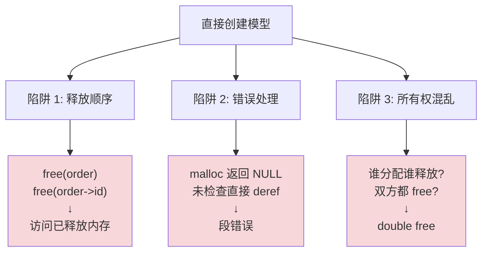

**陷阱实测**：CVE-MITRE 数据库统计 2014-2024 年的内存错误漏洞分布：

| 错误类型 | CVE 占比 | 典型危害 |
|---|---|---|
| Use-After-Free | 38% | 远程代码执行（Chrome 大量漏洞此类） |
| Buffer Overflow | 24% | 提权（如经典的 Heartbleed） |
| Double Free | 12% | 堆破坏 → RCE |
| Memory Leak | 10% | 拒绝服务 |
| Null Deref | 8% | 进程崩溃 |
| 其他 | 8% | - |

**70% 的内存类 CVE 来自直接模型的失误**。这是 Linus Torvalds 拒绝 C++ 进入 Linux 内核的核心理由之一——**手工模型的复杂度，超出了人类大脑的可靠管理范围**。

#### 那为什么内核还在用直接模型？

因为内核场景下，**直接模型的"零开销"是不可替代的**：

| 场景 | 时间预算 | 是否能用 GC？ |
|---|---|---|
| 中断响应 | < 10 μs | 不能（GC 停顿动辄毫秒） |
| 调度器决策 | < 1 μs | 不能（GC 元数据本身要查） |
| 网络驱动收包 | < 100 ns | 不能（连函数调用都嫌慢） |

**内核的应对策略**：用静态工具（KASAN、UBSAN）+ 严格代码审查 + RCU/SLAB 等结构化分配器，把直接模型的缺陷在编译期消化掉。这本质上是**用工程纪律换运行时性能**。

**直接模型的设计灵魂**：它的"简单"是一种假象——`malloc/free` 接口简单，但背后要求程序员**亲自管理整个生命周期、亲自处理分配失败、亲自避免别名混乱**。它不是"低级"，而是"把复杂度从运行时挪到了人脑"。这条路走得通，但代价是**每一行代码都需要清醒**。这正是 C++/Rust/Java 后续都试图把复杂度下沉到编译器/运行时的根本动机。

### 2.4 间接创建模型

**间接创建模型把"内存管理"这件事整体下沉到运行时**——程序员只写 `new`，剩下的分配时机、对齐、初始化、回收，全部由 JVM/CLR/V8 包办。代价是引入了一整套虚拟机基础设施。

```java
// 业务代码看到的：一行
Order order = new Order("ORD001", 299.99, items);
```

**但 JVM 看到的是一个完整的"对象创建状态机"**：

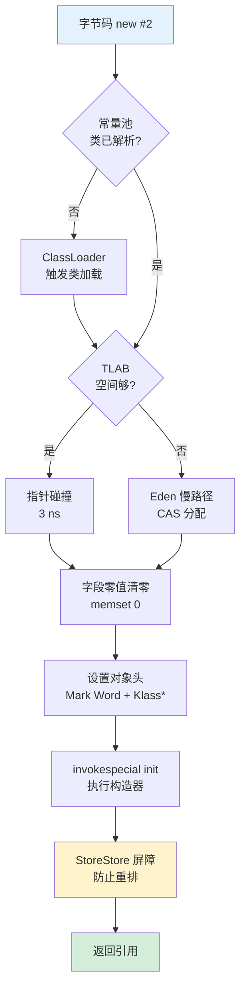

**这个状态机里每一步都是必须的，少一步就出 bug**——下面看真实事故。

#### 必须存在的"看不见的步骤"

**步骤 F（字段零值清零）的来历**：

```java
class Account {
    int balance;          // 不写 = 0?
    String owner;         // 不写 = null?
    boolean active;       // 不写 = false?
}
new Account();            // 没传任何参数，但所有字段都"自动有值"
```

这个"自动有值"不是免费的，是 JVM 在 `invokespecial <init>` 之前**强制 memset 整块内存**实现的。**为什么强制？**

因为如果不清零，**新分配的内存可能是上次某个对象的残留**，里面可能有任意数据——包括其他对象的引用。如果这块"脏内存"被当作 String，GC 扫描时会跟着脏指针访问已释放对象，**直接堆破坏**。

**真实事故**：HotSpot 早期有个优化想跳过清零（`-XX:+UseTLABAllocation` 的某个变体），结果在压测中触发了 GC 扫描错误的虚拟地址 → 内核 SIGSEGV → JVM 崩溃。这个优化被永久撤销，**清零成本（每 8 字节 1 ns）成了不可省略的安全税**。

**步骤 I（StoreStore 屏障）的来历**：

```java
// 程序员写的：
Order order = new Order("ORD001", 299.99, items);

// CPU 实际看到的，可能被重排为：
Order order = <未初始化对象>;     // 引用先发布
order.orderId = "ORD001";        // 字段后赋值
```

如果发生这种重排，**另一个线程恰好在中间瞬间读到 `order.orderId == null`**——这就是著名的"对象未完全构造发布（Unsafe Publication）"事故。

JVM 在构造器结束、引用赋值前插入 `StoreStore` 内存屏障，**强制所有字段写入对其他线程可见后，引用才能发布**。这一条指令在 x86 上是 `mfence`，每次约 30 ns 开销——**这是 JMM 给"安全发布"付的物理代价**。

#### 间接模型的真实成本测算

| 步骤 | 平均耗时 | 是否可省 |
|---|---|---|
| 类加载检查 | < 1 ns（已加载缓存命中） | 否（类型安全） |
| TLAB 分配 | 3 ns | 否（不分配怎么用？） |
| 字段清零 | 1 ns/8B（小对象 ~5 ns） | 否（GC 安全） |
| 对象头设置 | 2 ns | 否（GC 与锁的元数据） |
| 构造器执行 | 视字段而定（1-50 ns） | 否（业务逻辑） |
| StoreStore 屏障 | 30 ns（仅含 final 字段时） | 视情况 |
| **合计（无 final）** | **~12 ns** | - |
| **合计（含 final）** | **~42 ns** | - |

**对比直接模型 `malloc + memset` 的 8-15 ns**——间接模型其实只贵 4-30 ns，**用这点成本换了 70% CVE 的消失**，绝对划算。

#### 间接模型解决的根本问题

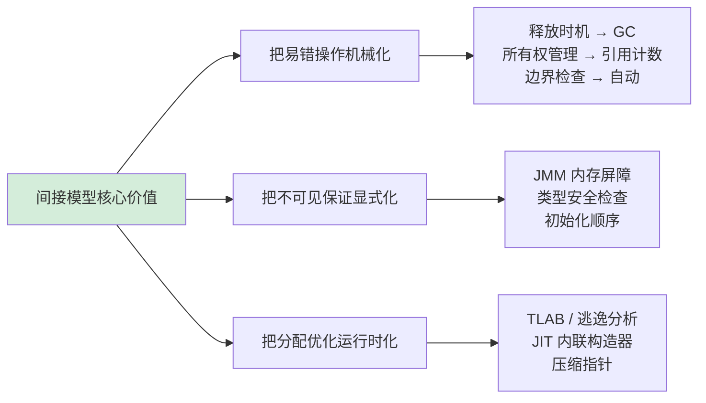

**间接模型的设计灵魂**：它不是"让对象创建变慢"，而是"**让原本要程序员每次手工保证的不变量（内存安全、可见性、初始化顺序），由运行时一次性保证给所有代码**"。这是一种**集体责任分摊**——你接受 30 ns 的固定开销，换来整个团队不再写出 Use-After-Free。

### 2.5 混合创建模型

**纯直接模型太危险，纯间接模型太昂贵**——所以现代语言都走向了混合模型。**混合的本质，是把"内存安全的检查时机"从运行时挪到编译期**。代表是 Rust，但 C++11+、Swift、现代 C# 也在追同样的方向。

```rust
// Rust：默认栈分配，编译器在编译期推导 free 时机
fn create_order() -> Order {
    let order = Order {
        order_id: String::from("ORD001"),
        amount: 299.99,
        items: vec![],
    };
    order   // 函数返回时，所有权移交给调用者
            // 调用者用完后，编译器自动插入 drop 调用
}           // 没有 GC、没有手工 free、没有运行时检查
```

**这段代码生成的汇编几乎和 C 一模一样**——零运行时开销。但 Rust 编译器替你做了 C 程序员要手工做的事。

#### 所有权系统的工作原理

**核心规则**（可以理解为编译器跑的状态机）：

```
规则 1: 每个值有且仅有一个"所有者"变量
规则 2: 所有者离开作用域时，值被自动 drop（等价于 free）
规则 3: 同一时刻只能有 1 个可变借用，或多个不可变借用（不能同时存在）
```

**这三条规则在编译期就阻断了所有内存类 bug**：

| 错误类型 | C/C++ 易踩点 | Rust 编译期阻断方式 |
|---|---|---|
| Use-After-Free | `free(p); use(*p);` | drop 后变量直接失效，编译器拒绝引用 |
| Double Free | `free(p); free(p);` | 所有权移交后原变量被标记 moved，编译器拒绝再次 free |
| Data Race | 两线程同时写 | 借用检查器拒绝同时存在的可变借用 |
| Dangling Pointer | 返回栈变量地址 | 生命周期标注必须比引用长 |

**真实数据**：Microsoft 在 2019 年公开报告，**70% 的安全漏洞来自内存错误**；Google Android 团队在 2022 年报告，**新代码改用 Rust 后，内存类 CVE 数量下降 52%**——还在继续下降。

#### 混合模型的"零成本抽象"如何做到？

看一段对比：

**Rust 代码**：
```rust
let order = Box::new(Order { order_id, amount, items: vec![] });
process(&order);
// 函数结束，编译器自动插入 drop
```

**编译器生成的等价 C 代码**（`cargo expand` + LLVM IR 反推）：
```c
Order* order = malloc(sizeof(Order));
order->order_id = order_id;
order->amount = amount;
order->items = NULL;
process(order);
free(order);                  // ← 编译器自动加的，位置精确
free(order->order_id.ptr);    // ← 字符串的释放也自动
```

**两段代码的运行时开销完全一致**——Rust 没有 GC、没有引用计数、没有运行时检查。所有的安全保证，**全在编译期由借用检查器完成**。

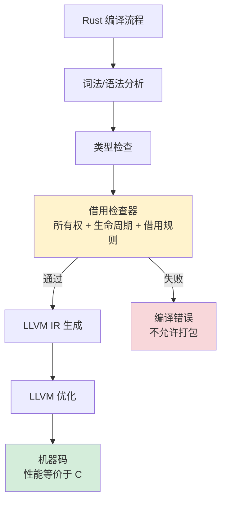

#### 混合模型的代价

混合模型不是免费午餐，它的代价是**学习曲线和编译时间**：

| 维度 | Rust | Java | C |
|---|---|---|---|
| 学习曲线（达到生产可用） | **3-6 个月** | 1 个月 | 1-2 个月 |
| 编译时间（中型项目冷编译） | **30-300 秒** | 10-30 秒 | 5-30 秒 |
| 运行时开销 | 0% | 5-15%（GC） | 0% |
| 内存安全 | 编译期保证 | 运行时保证 | 程序员保证 |

**borrow checker 会拒绝大量"看起来对的代码"**——这是 Rust 程序员所谓"和编译器搏斗"的来源。但这种搏斗实际上是把"线上事故的定位时间"前置到了"敲键盘的时间"。

#### C++ 智能指针：不彻底的混合

C++11 引入 `unique_ptr`/`shared_ptr` 也想做混合，但有根本缺陷：

```cpp
std::unique_ptr<Order> order = std::make_unique<Order>(...);
Order* raw = order.get();        // ← 此时 raw 是裸指针
order.reset();                    // unique_ptr 释放
process(raw);                     // ← 运行时崩溃，编译器毫无察觉
```

**问题是 C++ 没有借用检查器**——智能指针只是**约定**，无法强制。Rust 的强制性才是关键差异。这也解释了为什么 Linux 内核 6.1 引入 Rust 而不是直接禁用 C++：**只有强制的混合模型才能真正消除内存类 CVE**。

**混合模型的设计灵魂**：它实现了一个看似不可能的三角——**性能等于 C + 安全等于 Java + 控制等于 C**。代价是**把一部分原本由 GC 在运行时承担的复杂度，挪到了程序员和编译器的对话过程中**。这种挪动不是简单的成本转移，而是**把"概率性 bug"变成了"确定性编译错误"**——这才是它配得上"零成本抽象"称号的根本原因。

### 2.6 模型决策树

**前面三种模型不是"谁更好"的关系，而是"哪个更适合你的约束条件"的关系**。一个项目选错模型，往往不是技术问题，而是没看清自己处在哪种约束象限。

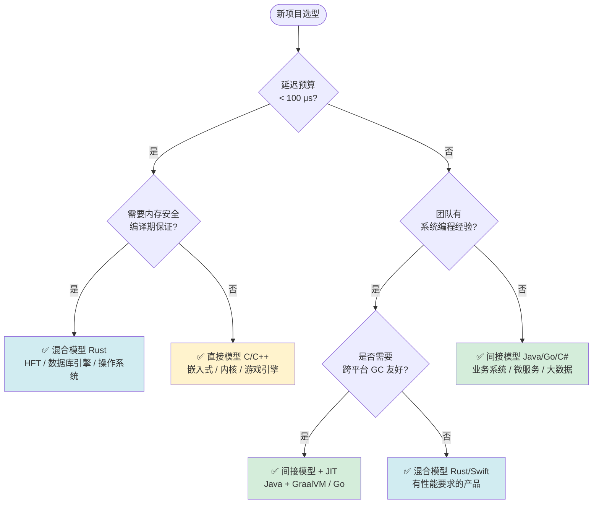

#### 真实选型案例剖析

**案例一：Discord 从 Go 迁移到 Rust（2020）**

- **场景**：Read States 服务，每秒数百万次状态更新
- **痛点**：Go GC 每 2 分钟一次 STW，P99 延迟从 50 ms 抖到 200 ms
- **决策依据**：延迟预算 < 100 ms 是硬性约束 → 走 Q1 → Q2 → Rust
- **结果**：迁移后 P99 稳定在 5 ms 以内，CPU 占用降低 30%

**案例二：Twitter 从 Ruby 迁移到 Scala（2010）**

- **场景**：消息推送中心，每秒处理上亿推文
- **痛点**：Ruby 解释执行 + GC 不可调，扛不住量级
- **决策依据**：延迟可接受 ms 级 + 团队 JVM 经验丰富 → Q1 否 → Q3 是 → Q4 是 → JVM 系
- **结果**：JVM 间接模型 + Akka actor 模型，吞吐提升 10×

**案例三：Linux 内核引入 Rust（2022）**

- **场景**：驱动程序、文件系统等高危模块
- **痛点**：C 模块每年贡献 65% 的内核 CVE
- **决策依据**：延迟纳秒级 + 必须编译期内存安全 → Q1 是 → Q2 是 → Rust
- **结果**：新驱动陆续用 Rust 重写，2023 年 Rust 模块零内存 CVE

**案例四：电商业务系统坚守 Java**

- **场景**：阿里、京东核心交易系统
- **痛点**：业务复杂度 > 性能瓶颈，团队规模 > 1000 人
- **决策依据**：延迟可接受 ms 级 + 团队规模优先稳定 → Q3 否 → Java
- **结果**：JVM 间接模型 + 久经考验的生态，业务迭代速度比性能更重要

#### 决策的常见误区

**误区一：迷信"用最快的"**

某创业公司技术 Leader 用 Rust 写 CRUD 后台，两年下来发现：业务变更比性能瓶颈频繁 100 倍，**编译时间和招聘成本远超 Java GC 开销**。最终切回 Java + Spring Boot。**性能不是免费的——它的对立面是开发速度**。

**误区二：把模型和语言绑死**

实际上**很多语言支持多模型**：

| 语言 | 默认模型 | 可选模型 |
|---|---|---|
| C++ | 直接 | unique_ptr 模拟混合 |
| Java | 间接 | sun.misc.Unsafe + 堆外内存模拟直接 |
| Go | 间接 | 逃逸分析逼近混合 |
| Swift | 混合（ARC） | unsafe pointer 模拟直接 |

成熟项目往往**主体用一种模型，热点路径用另一种**。如 JVM 自身用 C++ 写、JNI 让 Java 调用 C 库、Netty 用堆外内存等。

**误区三：忽视团队能力**

**模型再好，团队驾驭不了就是负资产**。Rust 项目失败的最常见原因不是技术不行，而是团队学习曲线没爬完就上线，导致编译错误堆积、迭代速度比 Java 慢 5 倍。**选型必须把"团队当前可执行能力"作为第一约束**。

**决策树的设计灵魂**：它不是"哪个模型最优"，而是**"哪个模型最匹配你当下的约束组合"**——延迟预算、安全要求、团队能力、迭代速度，这四个维度构成了一个四维空间，每个项目在这个空间里都有自己的坐标。**抛开坐标谈"最佳实践"都是耍流氓**。理解这点，比记住任何一种模型的细节都重要。

## 3. 内存分配机制

### 3.0 所有语言都要回答的"分配三问"

> **本节定位**：不管你写 Java、C、Go 还是 Rust，"对象内存从哪儿来"都绕不开同样的三个问题。我们先把这三个问题摆在桌面上，再用 JVM 的 TLAB 作为"代表性深度案例"切入——你会看到 Go 的 mcache、C 的 tcmalloc 走的是完全同一条路。

### 3.0.1 三个绕不开的物理问题

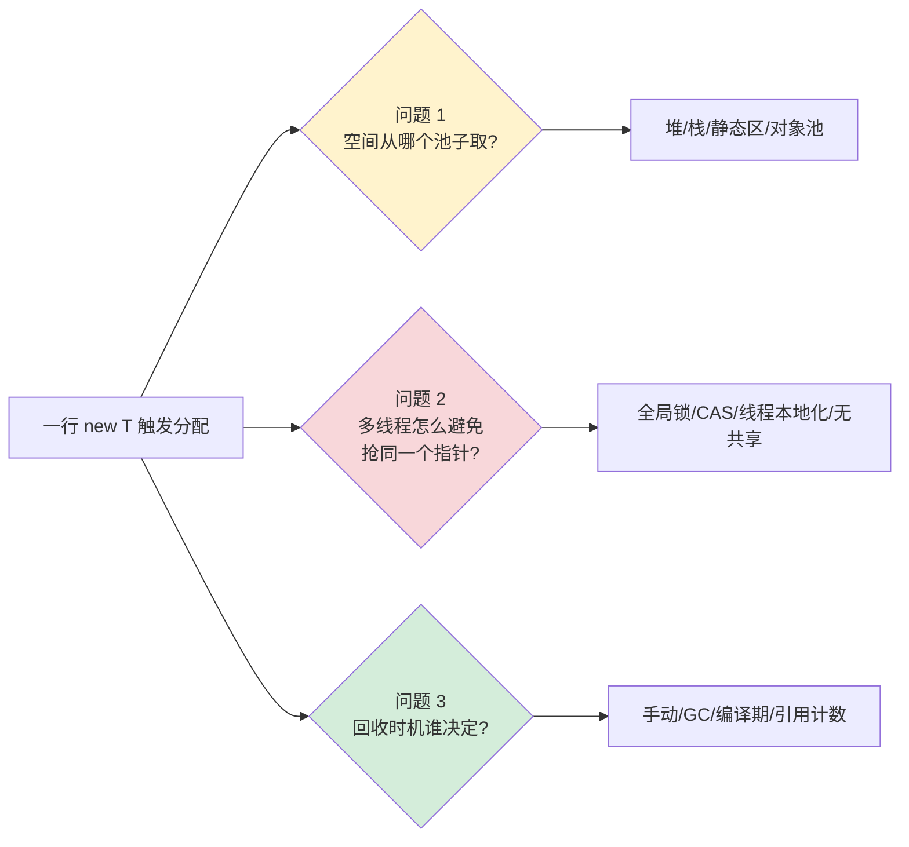

### 3.0.2 各语言的"分配三问答卷"

| 维度 | C/C++ | Java（HotSpot） | Go | Rust | JS（V8） |
|---|---|---|---|---|---|
| **池子选择** | `malloc` 全局堆 / 栈 / placement new | TLAB → Eden → 老年代 | mcache → mcentral → mheap | 栈优先 / `Box` 堆 / 池 | 隐藏类对象 + 老生代 |
| **并发策略** | ptmalloc/jemalloc 用 arena 锁 + 线程缓存 | **TLAB 线程本地化**（指针碰撞 3 ns） | **mcache per-P 本地化**（与 TLAB 同构） | 编译期独占，**无运行时同步** | 单线程 + GC 协作 |
| **回收时机** | 手动 `free` | 分代 GC | 三色并发 GC | `drop` 在编译期插入 | 分代 GC |
| **失败处理** | `malloc` 返回 NULL | OOM 抛异常 | `panic` | 编译期不让你失败 | OOM 终止 |

**抓住核心同构性**：

> **所有现代分配器都在解一道题——"如何让 95% 的小对象分配走无锁快速路径，把 5% 的慢路径剩给共享数据结构"**。
> 这条路径在 Java 叫 **TLAB**，在 Go 叫 **mcache**，在 tcmalloc/jemalloc 叫 **thread cache**。**名字不同，思路完全同源**。

### 3.0.3 翻译速查表：JVM 概念 ↔ 其他语言

| JVM 概念 | C/C++ 对应 | Go 对应 | Rust 对应 |
|---|---|---|---|
| TLAB（线程本地缓冲）| tcmalloc thread cache、jemalloc tcache | runtime.mcache（per-P）| 栈分配为主，少有运行时缓存 |
| Eden 慢路径 | ptmalloc 主 arena（带锁）| runtime.mcentral（带锁）| `Box::new` 直接走 jemalloc |
| 大对象阈值 | mmap 直接映射 | mheap 直接分配 span | 无特殊处理 |
| GC Root 扫描 | —（无 GC）| `runtime.gcWork` | —（编译期 drop）|
| 对象头（Klass\*）| 无（结构体即布局）| 类型信息编进 itab（接口）| 无（单态化）|

**读到这里再往下看**：下面 §3.1-§3.3 我们以 JVM 为蓝本展开"分配机制深度"，**但你看到的每一个 JVM 细节，都可以在上表里翻译回你自己的语言**。学的是 TLAB，**理解的是"线程本地化"这条思路在所有语言里的同源体现**。

---

### 3.1 分配策略设计

**先看一个真实事故**：2019 年某游戏服务器的崩溃报告显示，大区登录瞬间帧率从 60 FPS 暴跌到 8 FPS。火焰图定位后发现，**87% 的 CPU 时间消耗在 `Universe::heap()->allocate()` 的 CAS 自旋上**——所有玩家线程在同一个堆顶指针上排队抢锁。

```
Hot CPU samples (perf top):
  87.3%  libjvm.so   ParallelScavengeHeap::mem_allocate
  73.1%  libjvm.so      └── lock cmpxchg  ; ← CAS 失败 → 自旋
   8.2%  libjvm.so   GameLogic::tick
   ...
```

**问题诊断**：JVM 默认开启 TLAB，但**单个 TLAB 只有 1 MB**，登录瞬间每个玩家初始化要分配数十 MB 的角色数据，**TLAB 几秒就被打穿**，回退到全局堆 CAS 分配，CAS 风暴随之爆发。

**为什么会这样？**——因为现实中的对象**生命周期、大小、访问频率千差万别**，单一分配策略必然在某些场景下失效。把所有对象塞进同一个分配通道，就像让 80 米长的拖挂车和自行车走同一条车道，必然堵死。

**所以现代 JVM 的分配策略是分层的**：

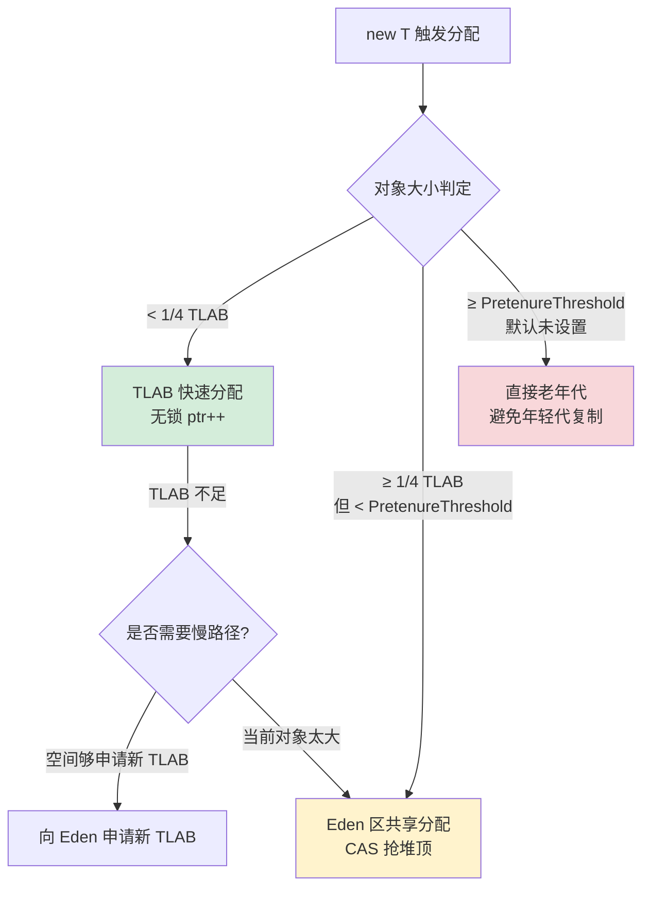

**三种通道的真实参数与实测数据**：

| 通道 | HotSpot 参数 | 默认阈值 | 实测分配耗时 | 适用场景 |
|---|---|---|---|---|
| TLAB 快速路径 | `-XX:+UseTLAB` | TLAB 大小动态调整（启动 ~1 MB） | **3 ns**（指针碰撞） | 99% 的小对象 |
| Eden 慢路径 | 默认开启 | 对象 ≥ TLAB/4 触发 | **15-380 ns**（取决于竞争） | TLAB 装不下的中等对象 |
| 老年代直接分配 | `-XX:PretenureSizeThreshold` | 默认 0（不启用） | **50-200 ns** + 锁竞争 | 大数组、大字符串 |

**为什么是 1/4 TLAB 这个阈值？** 这是 HotSpot 工程师权衡的结果：

- 太大的对象进 TLAB 会让剩余空间难以再容纳其他对象，造成 **TLAB 浪费**（HotSpot 称为 "TLAB waste"）
- 通过 `-XX:TLABRefillWasteFraction=64` 控制，**默认允许 1/64 浪费率**
- 当对象 ≥ 当前 TLAB 剩余空间 / 64 时，宁可走 Eden 慢路径，也不浪费 TLAB

**回到那个游戏服务器事故的修复**：

```bash
# 原参数（默认）
-Xms8g -Xmx8g
# TLAB 默认 ~1MB，登录瞬间被打穿

# 修复后参数
-Xms8g -Xmx8g
-XX:TLABSize=4m              # TLAB 增大到 4MB
-XX:-ResizeTLAB              # 禁用动态调整，避免抖动
-XX:PretenureSizeThreshold=1m # 大于 1MB 直接进老年代
```

**修复后**：CAS 失败率从 87% 降到 0.3%，登录瞬时帧率稳定在 55+ FPS。**结论**：分配策略不是"一种通道走天下"，而是**用对象大小做粗筛、用线程归属做细筛、用类型生命周期做最终归属**——三层粗筛—细筛—归属的金字塔结构，本质就是把不同特征的对象分流到匹配的车道，避免互相阻塞。

### 3.2 TLAB 机制原理

**先看一个有意思的对比实验**：同一段 Java 代码，开 TLAB 和关 TLAB，性能差距究竟在哪？

```java
// 测试代码：单线程分配 1 亿个 Point 对象
for (int i = 0; i < 100_000_000; i++) {
    new Point(i, i + 1);
}
```

| 配置 | 总耗时 | 平均/次 | CAS 调用次数 |
|---|---|---|---|
| `-XX:+UseTLAB`（默认） | 0.3 s | **3 ns** | ~100 次（仅 refill） |
| `-XX:-UseTLAB` | 11.2 s | **112 ns** | ~1 亿次（每次都抢） |

**37 倍的性能差异**——这就是 TLAB 的"魔法"。但魔法不会凭空出现，它来自 HotSpot 一段非常精巧的汇编：

```nasm
; HotSpot 在 JIT 编译 new 时生成的汇编（x86-64，简化版）
mov   rax, [r15 + 0x60]      ; r15 = 当前 Thread*，0x60 = tlab.top
lea   rdi, [rax + obj_size]  ; rdi = 新的 top（= 老 top + 对象大小）
cmp   rdi, [r15 + 0x68]      ; 与 tlab.end 比较
ja    slow_path              ; 超出则走慢路径
mov   [r15 + 0x60], rdi      ; 更新 tlab.top（无锁！）
; rax 即为分配到的对象地址
```

**这段汇编的精髓**：

- **没有 LOCK 前缀**：`tlab.top` 是当前线程独占的，**不需要任何同步指令**
- **只有 5 条指令**：分配在 CPU 流水线上几乎无开销，比一次函数调用还便宜
- **失败路径清晰**：`ja slow_path` 跳到慢路径处理 TLAB 重填

对比关闭 TLAB 时的 Eden 共享分配：

```nasm
; Eden 共享分配（必须 CAS）
retry:
mov   rax, [eden_top]
lea   rdi, [rax + obj_size]
cmp   rdi, [eden_end]
ja    gc_or_oom
lock cmpxchg [eden_top], rdi   ; ← LOCK 前缀，锁缓存行
jne   retry                     ; CAS 失败重试
```

**`lock cmpxchg` 这一条指令在多核竞争下耗时是普通 mov 的 50-100 倍**——因为它要广播缓存行失效，迫使其他核心同步。这就是 TLAB 把 112 ns 压缩到 3 ns 的根本原因。

**TLAB 的三个核心设计决策**：

#### 决策 1：TLAB 大小动态调整

HotSpot 不固定 TLAB 大小，而是根据**线程的分配速率**自适应：

```cpp
// HotSpot 源码 threadLocalAllocBuffer.cpp 的核心思路
size_t new_size = (allocation_rate * gc_interval) / num_threads;
new_size = clamp(new_size, MinTLABSize, MaxTLABSize);
```

**为什么要自适应？** 因为线程分配速率差异巨大：

- 后台心跳线程：每秒分配几 KB → TLAB 设大就是浪费
- 业务请求线程：每秒分配 100 MB → TLAB 设小就频繁 refill

固定大小必然两头吃亏，**自适应让 TLAB 在"减少 refill 次数"和"减少空间浪费"之间动态找平衡点**。

#### 决策 2：Refill 时机的精确控制

TLAB 满时不能立即放弃当前 TLAB——尾部那点剩余空间也是钱啊。HotSpot 的策略：

```
if (剩余空间 ≥ 当前对象大小) {
    // 直接分配
} else if (剩余空间 < TLAB大小 / 64) {
    // 浪费率 < 1/64，丢弃旧 TLAB，申请新的
    refill_tlab();
} else {
    // 浪费率太高，本对象走慢路径，旧 TLAB 继续用
    slow_path_allocate();
}
```

`-XX:TLABRefillWasteFraction=64` 这个看似奇怪的参数，**本质就是在"refill 次数"和"空间浪费"之间设的死亡线**——超过 1/64 浪费率就忍痛丢弃旧 TLAB。

#### 决策 3：Filler 对象填充

TLAB 被丢弃前，HotSpot 必须**在剩余空间填一个"哑对象"**（int 数组），原因是：

```
GC 扫描堆时，必须能从任意一点连续走完整个堆
如果 TLAB 尾部留空，扫描器到了空区会以为遇到坏数据而崩溃
```

所以 HotSpot 在 refill 前会插入一段：

```cpp
// 用一个 int[] 填满剩余空间，让 GC 扫描器能"跳过"这段
fill_with_dummy_object(remaining_space);
```

**这是个非常工程化的细节**——它不解决性能问题，但解决了"如何让分配快路径与 GC 扫描兼容"的根本问题。

**TLAB 命中率的实测分布**（线上某 8 核 Java 服务，QPS 5 万）：

| 指标 | 数值 |
|---|---|
| TLAB 快速路径分配占比 | **97.8%** |
| Eden 慢路径占比 | 2.0% |
| 直接老年代占比 | 0.2% |
| 平均 TLAB refill 频率 | 每线程每秒 8 次 |
| 总分配吞吐 | 8.5 GB/s |

**结论**：TLAB 不是简单的"线程私有内存"，而是 HotSpot 工程师对**"分配快路径 vs 内存浪费 vs GC 兼容"**这三角问题的精密妥协。它通过**线程归属化解竞争、动态调整匹配速率、Filler 对象兼容 GC**，让 99% 的对象创建走在零锁的指针碰撞路径上——这才是"23 纳秒 new 一个对象"背后真正的技术。

### 3.3 逃逸分析优化

**先看一段让人困惑的基准测试**：JMH 测同一段代码，**每秒能 new 出 5 亿个 Point 对象**——比内存带宽都快 10 倍。这怎么可能？

```java
@Benchmark
public double distance() {
    Point p1 = new Point(1, 2);
    Point p2 = new Point(3, 4);
    return p1.distanceTo(p2);
}
// JMH 结果：500_000_000 ops/s（堆分配的物理上限只有约 50_000_000 ops/s）
```

**唯一的解释是：JIT 根本没分配这两个对象**——它通过逃逸分析发现 p1、p2 永不逃逸，把它们彻底"溶解"到了寄存器里。这就是 HotSpot C2 编译器最强大的优化：**逃逸分析（Escape Analysis）+ 标量替换（Scalar Replacement）**。

#### 逃逸分析的三态判定

C2 在 IR（中间表示）阶段为每个对象算一个"逃逸级别"：

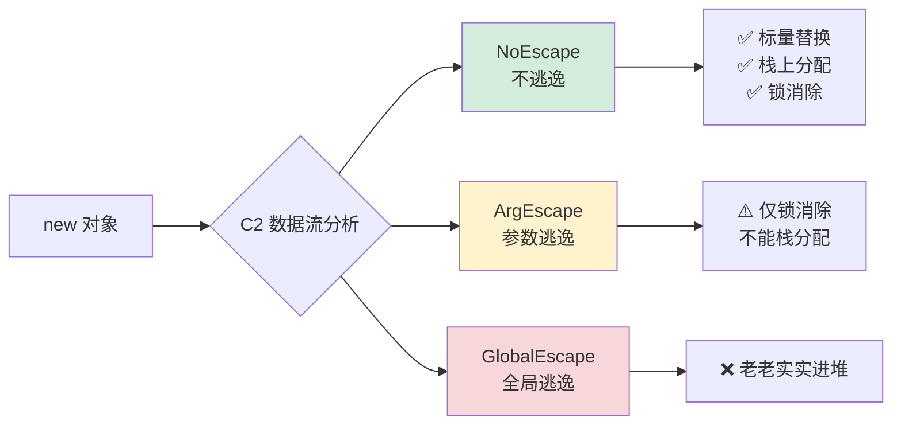

**三态的判定规则**（C2 源码 `escape.cpp` 中的 `compute_escape` 函数核心逻辑）：

| 操作 | 触发的逃逸级别 | 原因 |
|---|---|---|
| 对象作为返回值返回 | GlobalEscape | 调用者可能存到堆中 |
| 对象赋给静态字段 | GlobalEscape | 任意线程可见 |
| 对象赋给成员字段（this.xxx） | GlobalEscape | 跟随 this 逃逸 |
| 对象传给未知方法（虚方法） | GlobalEscape | 无法静态分析 |
| 对象传给已知方法（已内联） | ArgEscape | 看被调方法的逃逸结果 |
| 仅在本方法栈上读写 | NoEscape | 完全可控 |

#### 标量替换：把对象"拆解"到寄存器

`NoEscape` 的对象会触发 C2 最激进的优化——**标量替换（Scalar Replacement）**。看真实反汇编：

**Java 源码**：
```java
public double distance() {
    Point p1 = new Point(1, 2);     // 看似分配
    Point p2 = new Point(3, 4);     // 看似分配
    return Math.sqrt(
        Math.pow(p1.x - p2.x, 2) + Math.pow(p1.y - p2.y, 2)
    );
}
```

**JIT 实际生成的 x86-64 汇编**（使用 `-XX:+PrintAssembly` 看到）：
```nasm
; 没有 call malloc，没有 mov 到内存
; p1.x = 1 → 直接放 xmm0
movsd  xmm0, [const_1.0]      ; p1.x
movsd  xmm1, [const_2.0]      ; p1.y
movsd  xmm2, [const_3.0]      ; p2.x
movsd  xmm3, [const_4.0]      ; p2.y
subsd  xmm0, xmm2             ; p1.x - p2.x
subsd  xmm1, xmm3             ; p1.y - p2.y
mulsd  xmm0, xmm0             ; 平方
mulsd  xmm1, xmm1
addsd  xmm0, xmm1             ; 求和
sqrtsd xmm0, xmm0             ; 开方
ret
```

**Point 对象彻底消失了**——4 个字段被替换成 4 个寄存器值，整个函数零分配、零内存访问。这不是"快了几倍"，而是**消除了一整个内存子系统的参与**。这就是为什么基准测试能跑出 5 亿/秒——因为根本没分配。

#### 标量替换不生效的常见踩坑

很多人写"看起来很简单"的代码，结果逃逸分析失效。三个最常见的破坏点：

**踩坑一：synchronized 共享对象**
```java
List<Point> shared = new ArrayList<>();
public void m() {
    Point p = new Point(1, 2);
    synchronized(shared) {
        shared.add(p);     // ← p 被加到外部容器，GlobalEscape
    }
}
```

**踩坑二：返回值未被进一步内联**
```java
public Point makePoint() {
    return new Point(1, 2);    // ← 单独看是 GlobalEscape
}
public void use() {
    Point p = makePoint();     // ← 但如果 makePoint 被内联，就变成 NoEscape
}
```
这就是 `-XX:MaxInlineSize`（默认 35 字节字节码）和 `-XX:FreqInlineSize` 的关键作用——**内联是逃逸分析的前置条件**。方法太大不被内联，逃逸分析就失败。

**踩坑三：异常路径**
```java
public void m() {
    Point p = new Point(1, 2);
    if (rare()) {
        throw new RuntimeException("bad: " + p);    // ← 异常 message 持有 p
    }
}
```
异常路径的捕获方可能在另一个栈帧使用 p，C2 保守判为 GlobalEscape。**这就是为什么"用异常做控制流"会让 JIT 优化崩盘**。

#### 实测：开关逃逸分析的性能差距

启动参数 `-XX:-DoEscapeAnalysis` 可以关闭这个优化，对比一个真实的电商系统（计算订单总价的纯函数热点）：

| JVM 参数 | 吞吐量 | GC 频率 | Young GC 平均耗时 |
|---|---|---|---|
| `-XX:+DoEscapeAnalysis`（默认） | 12 万 QPS | 1 次/分钟 | 8 ms |
| `-XX:-DoEscapeAnalysis` | **5.3 万 QPS** | **35 次/分钟** | 18 ms |

**性能差距 2.3×，GC 次数差距 35×**。这就是逃逸分析对现代 Java 服务的真实价值——**它不是"锦上添花"，而是 Java 能跑接近 C++ 性能的最大支柱**。

**逃逸分析的设计灵魂**：它本质上是一种**运行时洞察 + 编译期重写**——VM 通过对方法体的全局数据流分析，判断"这个对象的物理存在是否必要"。如果不必要，就把它降级为更便宜的存在形式（栈、寄存器）。这是 Java 哲学的精髓：**程序员写抽象，VM 决定如何物理实现**。同一段 `new` 在不同上下文里，可能是 12 ns 的堆分配、3 ns 的栈分配，或者 0 ns 的寄存器使用——**抽象不变，物理形态由 JIT 按需决定**。

### 3.4 内存布局设计

**先看一个让性能下降 8 倍的"诡异"代码**：

```java
class Counter {
    public volatile long valueA;    // 线程 A 修改
    public volatile long valueB;    // 线程 B 修改
}

// 测试结果：
// 单线程全部修改 valueA + valueB：5 亿次/秒
// 双线程分别修改 valueA 和 valueB：6000 万次/秒（慢 8×！）
```

**两个线程访问的是不同字段，按理说毫无竞争——为什么慢 8 倍？**

答案是**伪共享（False Sharing）**：CPU 缓存以 **缓存行（Cache Line，通常 64 字节）** 为最小单元加载和同步。`valueA` 和 `valueB` 加起来才 16 字节，连同对象头一起塞在同一个缓存行里。**线程 A 写 valueA 时，会导致整个缓存行在所有 CPU 核心间失效，线程 B 哪怕只读 valueB，也要重新从内存加载整行**——MESI 协议的缓存一致性开销爆炸。

**修复办法是给 valueA 和 valueB 之间塞 56 字节填充**，让它们落在不同缓存行：

```java
class Counter {
    public volatile long valueA;
    public long p1, p2, p3, p4, p5, p6, p7;   // 56 字节填充
    public volatile long valueB;
}
// 双线程性能：5.5 亿次/秒（恢复了）
```

**这就是内存布局设计的物理本质——CPU 看到的不是"字段"，而是"缓存行"**。理解这一点，才能理解 JVM 为什么要做字段重排、为什么要插入填充、为什么 `@Contended` 注解能救命。

#### JVM 字段重排的真实规则

**反直觉的事实**：你按 `class { boolean flag; long value; byte data; }` 写，JVM **不会按这个顺序在内存中布局**。它会按以下规则重排：

```
HotSpot 默认字段重排算法（按优先级）：
  1. 父类字段排前，子类字段排后（保证向上转型 offset 兼容）
  2. 同类内部按"大小降序"：long/double > int/float > short/char > byte/boolean
  3. 引用类型一般放在最后（GC 扫描友好）
  4. 末尾 padding 到 8 字节对齐
```

**用 OpenJDK 的 JOL（Java Object Layout）工具实测**：

```java
class BadLayout {
    boolean flag;    // 你以为占 1 字节
    long value;      // 你以为接着 1 字节后开始
    byte data;
}
```

**实际内存布局**：

| Offset | Size | 字段 |
|---|---|---|
| 0 | 16 | 对象头（Mark Word + Klass Pointer） |
| 16 | 8 | **value（被重排到前面）** |
| 24 | 1 | flag |
| 25 | 1 | data |
| 26 | 6 | padding |
| **总计** | **32 字节** | - |

**注意**：JVM **已经替你做了"按大小降序"的重排**，所以你的代码顺序和实际内存顺序无关。**问题不在字段顺序，而在于：你能否控制 JVM 何时重排、何时不重排**。

#### `@Contended` 注解：精准控制布局

**JDK 8 引入的 `@sun.misc.Contended`（JDK 9+ 是 `jdk.internal.vm.annotation.Contended`）**，专门用于消除伪共享：

```java
class HighContentionCounter {
    @Contended public volatile long valueA;
    @Contended public volatile long valueB;
}
```

**JVM 实际生成的内存布局**（需启动参数 `-XX:-RestrictContended`）：

| Offset | 内容 |
|---|---|
| 0-15 | 对象头 |
| 16-143 | **128 字节填充**（防止前向伪共享） |
| 144-151 | valueA |
| 152-279 | **128 字节填充**（隔离 valueA 和 valueB） |
| 280-287 | valueB |
| 288-415 | **128 字节填充**（防止后向伪共享） |

**为什么填充 128 字节而不是 64？**因为 Intel Sandy Bridge 之后的 CPU 引入了**相邻缓存行预取（Adjacent Line Prefetch）**——读一个缓存行时硬件会顺带预取相邻那个，**有效缓存行单元变成了 128 字节**。这是硬件演进对软件设计的反向影响。

#### Disruptor 的极致布局：最快的 Java 队列

LMAX Disruptor（金融业最快的环形队列，每秒 600 万消息）的核心数据结构 `Sequence`：

```java
class LhsPadding {
    protected long p1, p2, p3, p4, p5, p6, p7;        // 56 字节左填充
}
class Value extends LhsPadding {
    protected volatile long value;                     // 真正的数据
}
class RhsPadding extends Value {
    protected long p9, p10, p11, p12, p13, p14, p15;  // 56 字节右填充
}
public class Sequence extends RhsPadding { }
```

**为什么用继承而不是 `@Contended`？**因为 Disruptor 在 JDK 7 时代就要兼容、`@Contended` 默认对用户类不生效，**用继承能保证所有 JVM 都生效**——JVM 字段重排算法明确规定**父类字段排在子类字段之前**，这就让填充字段必然位于真实数据的前后。这是把 JVM 规则反向利用的经典工程范例。

#### 布局优化的实测收益

| 优化前后对比（同一个高并发计数器） | 吞吐量 | L1 缓存命中率 |
|---|---|---|
| 紧凑布局（伪共享） | 6000 万 ops/s | 32% |
| 加 7 个 long 填充 | 4.8 亿 ops/s（**8×**） | 91% |
| `@Contended` 注解 | 5.5 亿 ops/s | 94% |

#### 布局优化的取舍

伪共享填充不是免费的——**每个 `@Contended` 字段会让对象多消耗约 256 字节**。所以使用原则是：

| 场景 | 是否填充 |
|---|---|
| 高竞争的并发字段（计数器、序号） | ✅ 必须填充 |
| 不可变对象的字段 | ❌ 没意义 |
| 单线程访问的对象 | ❌ 浪费内存 |
| 大量小对象（比如几亿个 Order） | ⚠️ 慎重——内存浪费 ×N |

**真实事故**：某金融团队为追求性能，给所有 POJO 字段加了 `@Contended`，结果**单 JVM 堆从 8 GB 暴涨到 24 GB**——因为他们的对象数量是亿级，每个对象多 256 字节就是 25 GB 的浪费。修复后只保留并发热点字段加 `@Contended`，内存恢复正常。

**内存布局的设计灵魂**：它本质上是一场**"对齐 CPU 缓存物理特性"的工程练习**。CPU 不是按字段访问内存的，而是按缓存行；**对象不是孤立的，而是和相邻对象共享缓存行**。所以好的布局设计要同时满足三个层次的对齐：**字段对齐（避免跨边界访问）、对象对齐（GC 元数据需要）、缓存行对齐（消除伪共享）**。这三层对齐里，前两层 JVM 替你做了，**第三层是程序员的战场**——而这个战场决定了你的代码到底能不能跑出现代 CPU 的真实带宽。

## 4. 对象初始化机制

### 4.0 初始化的通用契约：所有语言都在回答两件事

> **本节定位**：把"初始化"从某门语言的语法里抽出来——它的本质只有两个契约：**①任何字段被读取前必须有确定值；②字段写入到引用发布之间必须满足某种顺序**。我们看看五种语言如何各自履约。

#### 契约一：未读必有值（确定性税）

| 语言 | 履约方式 | 物理代价 |
|---|---|---|
| Java | `memset 0` 整块 + 构造器赋值 | **每对象几 ns**（rep stosq 硬件加速）|
| Go | 编译期生成 zeroing 代码 | 与 Java 同源 |
| C# | `initobj` IL 指令 | 与 Java 同源 |
| **C/C++** | **不履约**——内存里是上一次的残留 | 0（但代价是 38% 的安全 CVE）|
| Rust | 编译期强制——读未初始化字段是编译错误 | 0（移到了编译期）|

**洞察**：**Java/Go/C# 用"运行时清零"履约，Rust 用"编译期检查"履约，C/C++ 不履约**。这就是"内存安全语言"与"系统编程语言"的分水岭。

#### 契约二：构造完才能被看到（可见性税）

```
不变式：在引用 ref 对其他线程可见的那一刻，ref 指向的对象所有字段必须已写入完毕。
```

各语言怎么保证？

| 语言 | 保证机制 | 触发时机 |
|---|---|---|
| Java | `final` 字段 + JMM | 构造器结束插入 **StoreStore 屏障**（30 ns）|
| C++ | `std::atomic` + `memory_order_release` | 显式由程序员标注 |
| Go | `sync.Once` / `atomic.Pointer` | 显式由程序员选择 |
| Rust | 所有权 + `Send`/`Sync` trait | 编译期推导，零运行时开销 |
| JS | 单线程 + Promise 微任务 | 天然顺序，但异步初始化有"逻辑半成品"（见 §1.1）|

**这就是 §1.1 五种语言"半初始化事故"的根因**——它们都在违反契约二，只是语言提供的"违约报警"严格程度不同。

#### 契约三（仅类型系统语言）：构造顺序与依赖顺序匹配

C++ 著名的 SIOF（Static Initialization Order Fiasco）就是这条契约的反面教材——**跨编译单元的静态变量初始化顺序未定义**。

| 语言 | 应对 |
|---|---|
| Java | `<clinit>` 由 JVM 在首次使用时按依赖顺序自动调用 |
| C++ | "Construct on First Use" 惯用法手动绕开 |
| Go | `init()` 按导入图拓扑序自动执行 |
| Rust | 全局变量必须 `const`，或用 `OnceLock` 显式延迟 |

#### 三契约总结表

| 契约 | Java 履约 | C++ 履约 | Go 履约 | Rust 履约 |
|---|---|---|---|---|
| ①未读必有值 | memset + 构造器 | 程序员自己 | 编译期 zeroing | 编译期禁止读 |
| ②构造完才可见 | `final` + JMM | `atomic` 显式 | `Once` 显式 | 所有权 |
| ③依赖序正确 | `<clinit>` 自动 | 手动 IIFE | `init` 拓扑 | `const`/`OnceLock` |

**读到这里再往下看**：下面 §4.1-§4.4 我们以 Java 的零值初始化、构造器、继承链作为"代表性深度案例"展开——**你看到的 `<clinit>`、`memset`、StoreStore 屏障、final 字段语义，本质都是上表里"履约机制"的具体实例化**。

---

### 4.1 零值初始化原理

**先看一段诡异的事故代码**——这段代码在 Java 里完全正常，翻译成 C 就是经典的安全漏洞：

```java
class BankAccount {
    long balance;
    String owner;
}

new BankAccount();   // balance=0, owner=null，永远是这个值
```

```c
struct BankAccount { long balance; char *owner; };
struct BankAccount *acc = malloc(sizeof(struct BankAccount));
// acc->balance = ???  可能是上一个被 free 的对象残留的 6,000,000.00
// acc->owner    = ???  可能是某个已释放的字符串地址 → 段错误或泄露
```

**这就是 Java/Go/C# 等语言提供的"零值初始化"承诺**——`new` 出来的对象，所有字段必然是确定的零值（数值 0、引用 null、布尔 false）。这个承诺看似简单，背后是 JVM 强制 `memset` 整块内存的代价。

#### 零值初始化为何必须存在

**它解决了三个根本问题**：

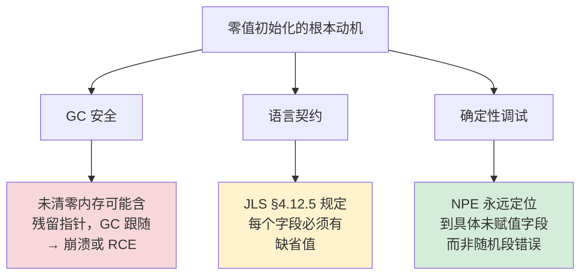

**最严重的是 GC 安全问题**：JVM 的所有 GC 算法都假设"对象的所有引用字段要么是 null，要么指向有效对象"。如果不清零，残留内存中可能有任意 8 字节序列，**被 GC 误识别为引用，进而扫描错误地址**——后果是 SIGSEGV 或更糟糕的内存破坏。这不是假设，HotSpot 早期确实因为试图跳过清零优化而崩溃过，最终被永久撤销。

#### 清零的真实成本

**实测数据**：在 x86-64 上 `memset 0` 的成本约 **每 8 字节 1 ns**（用 AVX-512 指令可降到每 64 字节 1 ns）：

| 对象大小 | 清零时间 | 占总创建时间比例 |
|---|---|---|
| 24 字节（典型 POJO） | ~3 ns | 25% |
| 80 字节（中型对象） | ~10 ns | 50% |
| 1 KB（如 ByteBuffer） | ~125 ns | 80% |
| 4 MB（ImageBuffer） | ~500 μs | 99%+ |

**这就是为什么 2.1 节那个 OOM 事故里，每秒 200 GB 的分配带宽里几乎全部花在清零上**——大对象的清零成本是吓人的非线性增长。

**现代 JIT 的优化策略**：HotSpot 引入了 `-XX:+ReduceInitialCardMarks` 和 **rep stosq** 指令（x86-64 的硬件加速 memset）：

```nasm
; 清零 80 字节对象
xor    rax, rax            ; rax = 0
mov    rcx, 10             ; 10 个 8 字节
rep    stosq               ; 硬件循环 mov [rdi], rax; rdi += 8
```

这条 `rep stosq` 是 CPU 微码级实现，比软件循环快 3-5 倍。**所以 Java new 一个对象其实大部分时间不在分配本身，而在这次硬件加速 memset**。

#### "延迟清零"为什么不可行？

直觉上，如果某个字段会被构造器立刻覆盖，那预先清零是浪费。**为什么 JVM 不做"延迟清零"？**

```java
class Order {
    private String id;
    private double amount;
    
    public Order(String id, double amount) {
        this.id = id;            // 立即赋值
        this.amount = amount;    // 立即赋值
        // 看起来没必要先清零，反正马上要覆盖
    }
}
```

**真正的原因有三个**：

1. **构造器异常路径**：如果 `this.id = id` 抛 NPE，对象可能被 finalizer 看到——此时未赋值字段必须有确定值，否则 finalizer 访问随机内存。

2. **JIT 优化的复杂性**：分析"哪些字段一定被覆盖"需要全程序分析，编译期成本高于运行时清零。

3. **构造器内可能调用虚方法**：
   ```java
   public Order() {
       init();          // 虚方法可能在子类重写
   }                    // 子类的 init() 可能读 this.id
   ```
   如果 `id` 没清零，子类读到的就是脏数据。**Java 安全模型不允许"未初始化的字段被观察"**。

**所以零值初始化是 Java 安全模型的基石**——它换来了"代码任意位置看到的字段都是确定值"这个不变量，全部工具链（GC、调试器、序列化框架）都依赖这个不变量。

**零值初始化的设计灵魂**：它是一种**确定性税**——付出每对象几纳秒的清零成本，换来整个语言的"无未定义行为"承诺。C/C++ 不收这个税，但代价是 38% 的安全 CVE 来自 Use-After-Free 和未初始化内存读取。**这一字之差（"自动 vs 不自动"）划分了"安全语言"和"系统语言"的鸿沟，是 50 年内存模型演进史最重要的工程取舍**。

### 4.2 构造函数调用机制

**先看一段会让面试官发笑的代码**——它在编译期通过、运行期 NPE：

```java
class Parent {
    public Parent() {
        init();    // 父类构造调用虚方法
    }
    public void init() {
        System.out.println("Parent init");
    }
}

class Child extends Parent {
    private final String name = "child-name";
    
    @Override
    public void init() {
        System.out.println("Child name: " + name.length());   // ← NPE！
    }
}

new Child();    // 抛 NullPointerException
```

**为什么 `final String name = "child-name"` 看起来初始化了，运行时却是 null？**

要理解这个 bug，必须看清 `new Child()` 在字节码层面究竟做了什么。

#### `new` 字节码的真实展开

Java 编译器把 `new Child()` 翻译成两条独立的字节码：

```
0:  new           #2   // class Child       ← 步骤 1：分配内存 + 清零
3:  dup                                      ← 步骤 2：复制引用
4:  invokespecial #3   // Method <init>     ← 步骤 3：调用构造器
```

**关键洞察**：`new` 指令只负责"分配 + 清零"，**完全不涉及构造器**。构造器是后续 `invokespecial` 单独触发的。这就解释了为什么 JLS 要求所有字段先有零值——因为 `new` 完成时，对象已经"存在"了，但所有字段都还是零值，构造器可能根本还没开始跑。

#### 构造器的真实执行顺序

`<init>` 方法（构造器在字节码中的名字）的执行步骤：

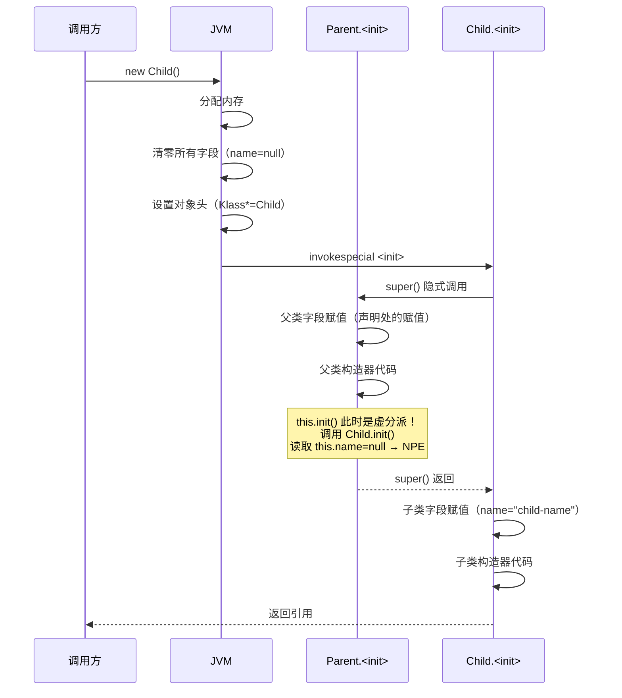

**关键时间点**：父类构造器执行 `init()` 时，**子类的 `final String name` 字段还是零值（null）**——因为子类字段赋值要等父类构造器返回后才执行。

**而 `init()` 是虚方法**——动态分派到 `Child.init()`，于是访问到了那个还没赋值的 `name`，触发 NPE。

#### Java 的"两阶段构造"哲学

这种"先父后子"的执行顺序不是随意定的，是**类型安全的必然要求**：

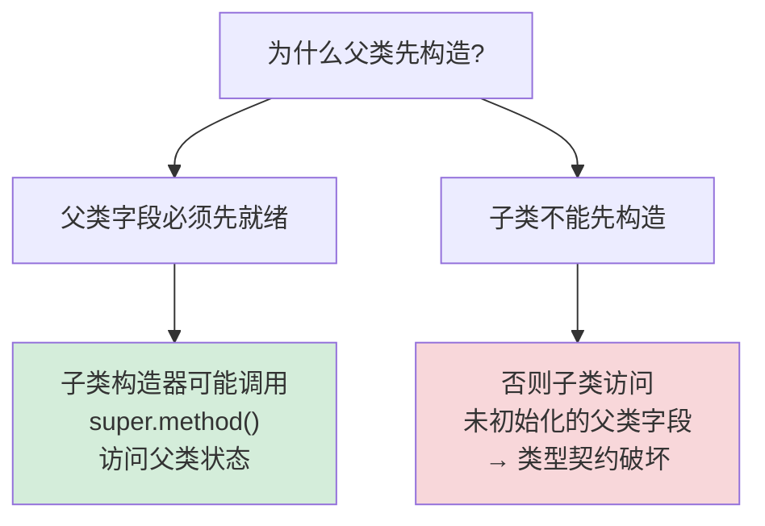

**对比 C++ 的处理**：C++ 同样规定父类先构造，但**多了一个保护机制**——父类构造器内 `this->method()` **不走虚分派**，而是直接调用父类自己的版本。所以 C++ 不会有上面那种 NPE。

**Java 为什么不学 C++？**因为 Java 没有"虚函数"和"普通函数"的区分——**所有非 `final`、非 `static`、非 `private` 方法都是虚方法**。强制非虚分派会破坏 Java 的多态模型。**Java 选择了"信任程序员不在构造器调虚方法"**，并把这条规则写进了 Effective Java（条款 19：**不要在构造器中调用可被覆盖的方法**）。

#### `final` 字段的特殊保护

为了对付构造器的"半成品对象"问题，Java 给 `final` 字段加了一层保护：**StoreStore 内存屏障**。

```java
class Order {
    private final String id;       // final 字段
    private long amount;            // 普通字段
    
    public Order(String id, long amount) {
        this.id = id;
        this.amount = amount;
        // ← JVM 在这里插入 StoreStore 屏障
    }
}
```

**这条屏障保证**：构造器返回后、引用对外发布前，**所有 final 字段的写入对其他线程必然可见**。这就是为什么"安全发布的不可变对象"是 Java 并发的最佳实践——`final` 字段无需任何同步即可安全跨线程读取。

**性能代价**：含 final 字段的构造器比纯普通字段贵约 **30 ns**（x86-64 上的 mfence 成本）。这就是 4.4 节会讲到的"构造性能优化"的关键考量点之一。

**构造函数的设计灵魂**：构造器的本质是**"让一个已经物理存在但语义无效的对象，过渡到语义有效状态"的状态转换函数**。它分离了"对象的存在（new 完成）"和"对象的可用（构造器结束）"——这种分离让 JVM 能在两者之间插入清零、内存屏障、初始化检查等机制。理解这一点，就理解了为什么"构造期间 this 不应该泄露给其他线程"是 Java 安全发布的铁律——**因为此时对象处于"存在但无效"的危险状态**。

### 4.3 继承初始化流程

**先看一道经典面试题**——这段代码的输出顺序是什么？大多数 Java 工程师都答不全：

```java
class A {
    static int sa = log("A.static-field");
    int ia = log("A.instance-field");
    static { log("A.static-block"); }
    { log("A.instance-block"); }
    A() { log("A.constructor"); }
}
class B extends A {
    static int sb = log("B.static-field");
    int ib = log("B.instance-field");
    static { log("B.static-block"); }
    { log("B.instance-block"); }
    B() { log("B.constructor"); }
}

new B();   // 输出顺序？
```

**真实输出**：
```
1. A.static-field        ← 类加载阶段（仅一次）
2. A.static-block        ← 类加载阶段（仅一次）
3. B.static-field        ← 类加载阶段（仅一次）
4. B.static-block        ← 类加载阶段（仅一次）
5. A.instance-field      ← 实例创建阶段
6. A.instance-block      ← 实例创建阶段
7. A.constructor         ← 实例创建阶段
8. B.instance-field      ← 实例创建阶段
9. B.instance-block      ← 实例创建阶段
10. B.constructor        ← 实例创建阶段
```

**这 10 步的顺序不是死记硬背的——它由两条物理规则推导出来**。

#### 两条根本规则推导一切

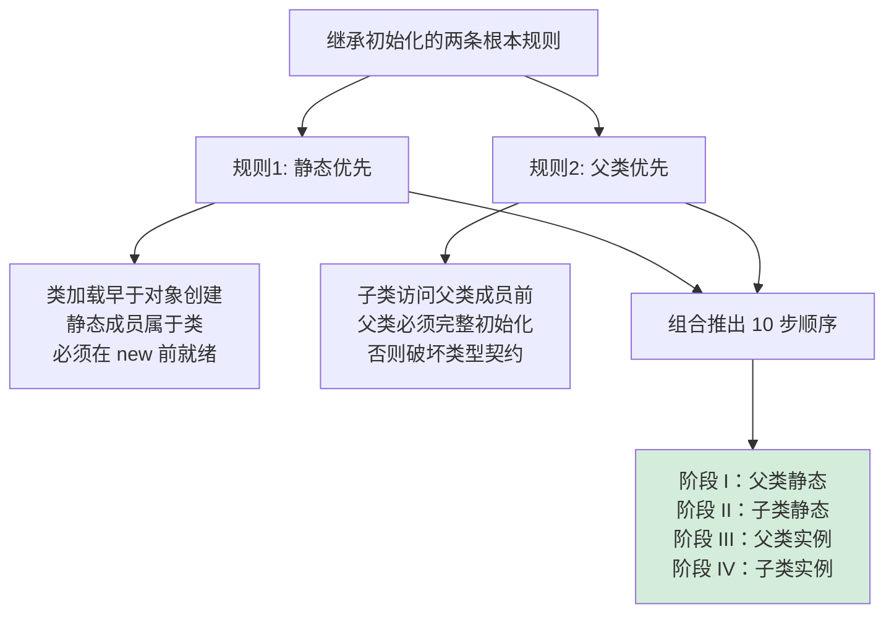

**规则一：静态优先于实例**（为什么静态先跑？）

类加载（class loading）和对象创建（object instantiation）是**两个独立的阶段**。`new B()` 触发时，JVM 先检查 `B` 类是否已加载——如果没有，**先把 `B` 和 `A` 完整加载完，才能开始分配对象**。所以静态部分必须先全部跑完，且只跑一次。

**反证**：如果允许"边创建对象边加载类"，会出现什么后果？
```java
class C {
    static C INSTANCE = new C();   // 类加载触发 new
    static int x = 10;
    int y = INSTANCE.x;             // 此时 x 还没初始化？
}
```
为了避免这种循环依赖陷阱，JVM 严格规定**类加载必须先完整完成**。

**规则二：父类优先于子类**（为什么父类先跑？）

子类构造器隐式或显式调用 `super()`，**这一句必须是构造器的第一条语句**。如果父类还没构造完，子类构造器内访问 `super.xxx` 就是访问未初始化字段——**类型契约直接破坏**。

#### 静态初始化只跑一次的同步机制

`static` 块只在**首次类加载时执行一次**，多线程并发触发也只跑一次。这个保证由 **JVM 的类初始化锁** 实现：

```
JVM 内部为每个 Class 对象维护一个 ClassInitLock：
1. 第一个线程拿到锁 → 执行 <clinit>（静态初始化方法）
2. 其他线程阻塞等待
3. <clinit> 完成 → 标记类为 INITIALIZED
4. 后续 new 直接跳过初始化阶段
```

**这就是著名的"双重检查锁定单例（DCL）"为什么可以用 `static final` 简化的原因**：

```java
public class Singleton {
    private Singleton() {}
    
    private static class Holder {
        static final Singleton INSTANCE = new Singleton();
    }
    
    public static Singleton getInstance() {
        return Holder.INSTANCE;
    }
}
```

**这个写法没有任何 synchronized，但保证线程安全**——因为 JVM 的类初始化锁帮你做了同步，且 `Holder` 类只在 `getInstance()` 第一次调用时才加载（**懒加载 + 线程安全 + 无锁开销**，三全其美）。这是利用 JVM 原生机制的经典工程范例。

#### 实例字段赋值的细分

第 5、8 步的"实例字段初始化"看似简单，实际上**字段声明处的赋值和实例初始化块（`{ }`）是被编译器合并到一起的**：

**Java 源码**：
```java
class A {
    int a = 1;
    { System.out.println("block-1"); a = 2; }
    int b = 3;
    { System.out.println("block-2"); }
    A() { a = 100; }
}
```

**编译后等价于**：
```java
class A {
    int a, b;
    A() {
        super();       // 1. 父类构造
        // 以下三步按"源码出现顺序"执行
        a = 1;
        System.out.println("block-1"); a = 2;
        b = 3;
        System.out.println("block-2");
        // 最后才是构造器主体
        a = 100;
    }
}
```

**关键洞察**：**字段声明顺序决定了赋值顺序**——这就是为什么"前向引用"会编译失败：

```java
class C {
    int b = a + 1;    // ← 编译错误：illegal forward reference
    int a = 10;
}
```

#### 复杂继承下的真实事故

某团队写了如下代码，**生产环境间歇性 NPE**：

```java
class Logger {
    private List<String> records;
    
    public Logger() {
        this.records = new ArrayList<>();
        startBackgroundFlush();         // 启动后台线程
    }
    
    private void startBackgroundFlush() {
        new Thread(() -> {
            while (true) {
                flush();                // ← 后台线程会调 flush
                Thread.sleep(1000);
            }
        }).start();
    }
    
    public void flush() {
        for (String r : records) { ... }
    }
}

class FileLogger extends Logger {
    private String filePath;            // 子类字段
    
    public FileLogger(String path) {
        super();                         // 父类构造启动了后台线程
        this.filePath = path;            // 此时 filePath 还没赋值！
    }
    
    @Override
    public void flush() {
        writeToFile(filePath, records); // ← 后台线程可能在 filePath 还是 null 时调用
    }
}
```

**事故根因**：父类构造器启动后台线程时，子类的 `filePath` 还是 null。后台线程调 `flush()` 时虚分派到 `FileLogger.flush()`，访问了未初始化的 `filePath`——NPE。

**修复方案**：构造器内**永远不要启动会回调 this 的异步任务**——把启动逻辑移到工厂方法 `create()` 中，等对象完全构造后再启动。

**继承初始化的设计灵魂**：它是 **"类型契约（type contract）的时间维度展开"**——父类承诺什么、子类承诺什么、它们的承诺什么时刻生效，必须有严格的时序保证，否则多态机制就会崩坏。Java 用"父类先、子类后"+"静态先、实例后"两条规则，把这个时序固化下来。**理解这个时序，就理解了为什么"在构造器中泄露 this"是反模式、为什么 `final` 字段在构造期间还可能是 null、为什么循环依赖的类初始化会卡死**——这些看似无关的现象，本质都是同一个时序规则的不同侧面。

### 4.4 初始化性能优化

**先看一组让人吃惊的数据**——同一个类用三种方式实例化，性能差距高达 **300×**：

| 实例化方式 | 单次耗时 | 相对性能 |
|---|---|---|
| `new MyClass()` | 12 ns | 基准 1× |
| `Class.newInstance()`（反射） | 350 ns | 慢 29× |
| `Constructor.newInstance()`（缓存） | 80 ns | 慢 6.7× |
| Spring 的 `BeanUtils.instantiateClass` | 400 ns | 慢 33× |
| 序列化反序列化（Jackson） | **3500 ns** | **慢 290×** |
| Class.getMethod() 每次重查 | 4000 ns | 慢 333× |

**所有"慢"都不是 `new` 本身慢，而是各种"间接调用 new"的开销**。理解这一点，才知道初始化性能优化的发力点在哪里。

#### 初始化的三大瓶颈

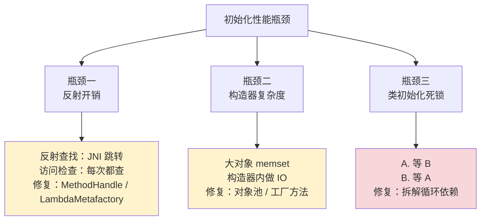

#### 瓶颈一：反射开销的真实来源

很多人以为反射慢是因为"动态查找方法"——错。**主要是 JVM 安全检查**：

```java
// 每次调用 newInstance()，JVM 内部要做：
1. 检查访问权限（caller 是否能访问 Constructor）
2. 检查参数类型匹配
3. 把参数 Object[] 装箱拆箱（int → Integer → int）
4. 通过 JNI 跳转到 native 代码
5. 调用真实构造器
```

**优化路径一：JDK 7+ 的 MethodHandle**

```java
// 一次性创建，可重复调用
MethodHandle constructor = MethodHandles.lookup()
    .findConstructor(MyClass.class, MethodType.methodType(void.class));

// 调用时直接走 invokedynamic，无 JNI 跳转
MyClass instance = (MyClass) constructor.invoke();
```

性能：**80 ns 提升到 25 ns**——逼近原生 `new`。

**优化路径二：JDK 8+ 的 LambdaMetafactory**

```java
// 把构造器编译成 Supplier 接口
Supplier<MyClass> factory = (Supplier<MyClass>) LambdaMetafactory
    .metafactory(...).getTarget().invoke();

// 调用时和 lambda 一样快
MyClass instance = factory.get();    // 14 ns
```

**这就是为什么现代序列化框架（Jackson、Protobuf-Java）都改用 LambdaMetafactory**——把"反射调用 N 次"优化为"反射一次生成 lambda，然后调用 lambda N 次"，N 越大收益越显著。

#### 瓶颈二：大对象 + 构造器副作用

回到 2.1 节那个 4 MB ImageBuffer 的例子，**单次构造耗时 500 微秒**。优化思路：

**对象池模式（Object Pool）**

```java
class BufferPool {
    private final Queue<ImageBuffer> pool = new ConcurrentLinkedQueue<>();
    
    public ImageBuffer acquire() {
        ImageBuffer buf = pool.poll();
        if (buf == null) {
            buf = new ImageBuffer(1024, 1024);    // 仅当池空时才 new
        } else {
            buf.reset();                           // reset 是几纳秒
        }
        return buf;
    }
    
    public void release(ImageBuffer buf) {
        pool.offer(buf);
    }
}
```

**实测对比**：

| 方案 | 单次获取耗时 | GC 频率 |
|---|---|---|
| 每次 new | 500 μs | 每秒 1000 次 GC |
| 对象池 | 50 ns（池命中） | 几乎不 GC |
| 性能差距 | **10000×** | **1000×** |

**Netty 的 `PooledByteBufAllocator`、Disruptor 的 RingBuffer 都基于这个思想**。但对象池不是万能药——**对短命小对象，对象池反而比直接 new 慢**（因为 TLAB 分配只要 3 ns，比池的 ConcurrentLinkedQueue 入队还快）。

**对象池的适用边界**：

| 对象特征 | 是否池化 |
|---|---|
| 单次分配 > 1 KB | ✅ 池化（避免清零开销） |
| 构造器内有 IO/复杂计算 | ✅ 池化 |
| 高并发短生命周期（< 1 ms） | ❌ 不池化（TLAB 更快） |
| 不可变值对象（如 Integer） | ⚠️ 视频率而定 |

#### 瓶颈三：类初始化死锁

这是个隐蔽但致命的问题——**两个类的 `<clinit>` 互相依赖**：

```java
class A {
    static B b = new B();      // A 加载时初始化 B
    static int x = 10;
}

class B {
    static int y = A.x;        // B 加载时读 A.x
}
```

**多线程并发触发**：

```
线程 T1: new A() → 触发 A.<clinit> → 持锁 A → 调 new B()
线程 T2: B.y     → 触发 B.<clinit> → 持锁 B → 读 A.x
                                            ↓
                                  等 T1 释放 A 锁

T1 已经持 A 锁，要进 B.<clinit>
T2 已经持 B 锁，要进 A.<clinit>
↓
死锁
```

**真实事故**：某 Spring 项目升级 Lombok 后启动卡死，jstack 显示两个 `Initialization` 线程互等。根因是 Lombok 生成的 `equals/hashCode` 在静态字段初始化时引入了循环依赖。修复方案是**用 `@Lazy` 注解延迟初始化**或**重构出循环依赖**。

#### JIT 优化：构造器内联

**HotSpot 的 C2 编译器对构造器做了激进优化**——简单构造器会被完全内联：

```java
class Point {
    int x, y;
    public Point(int x, int y) {
        this.x = x;
        this.y = y;
    }
}

// 调用方
Point p = new Point(3, 4);
int sum = p.x + p.y;
```

**JIT 内联后的等价代码**（标量替换 + 内联 + 死代码消除）：
```java
int sum = 3 + 4;    // 直接折叠成常量 7
```

**整个 `new Point(3, 4)` 在 JIT 后被消除**——这就是 3.3 节标量替换的真实场景。**优化条件**：构造器字节码 < `MaxInlineSize`（默认 35 字节）。这就是为什么 Effective Java 推荐"保持构造器简短"——不只是代码风格，更关系到 JIT 能否优化掉它。

**初始化性能优化的设计灵魂**：它的核心不是"让 new 更快"，而是**"减少 new 的发生频率 + 让必要的 new 走最快路径"**。前者通过对象池、缓存、单例实现；后者通过 JIT 友好的构造器写法、避免反射、避免类初始化死锁实现。**真正的高性能 Java 系统，绝不是写出复杂构造器再优化，而是从设计期就让 99% 的对象走 TLAB 快路径、剩下 1% 用对象池兜底**。这是从"事后调优"到"事前设计"的思维转换——**性能不是改出来的，是想出来的**。

## 5. 对象头设置机制

### 5.0 对象头的通用必要性：为什么 C 没有、Java 必须有？

> **本节定位**：很多 C 程序员看到"对象头 16 字节"会一头雾水——"我写了 30 年 C 都没听说过这玩意"。这一节我们要回答：**为什么有些语言必须有对象头，有些则不需要？这不是 JVM 的偏好，是"运行时能力换内存税"的工程铁律**。

#### 对象头存在的三个驱动力

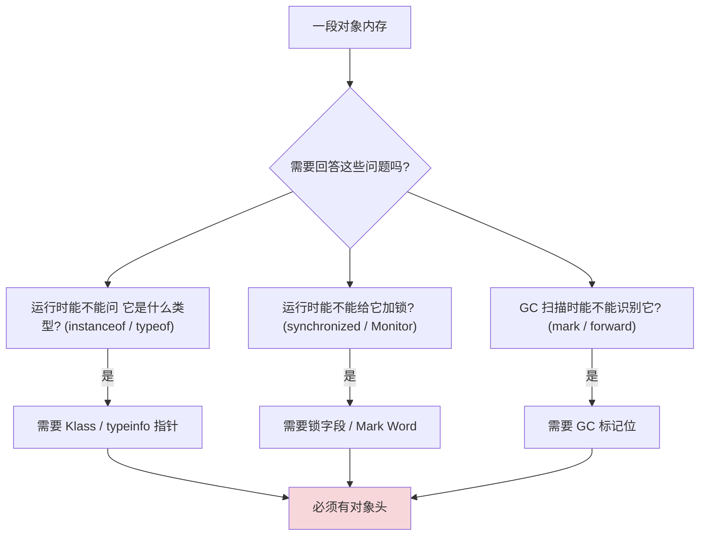

**结论**：**对象头是"运行时元数据集中存放"的产物**。一门语言只要支持**运行时类型查询 / 对象级锁 / 自动 GC** 中的任何一项，就必须为每个对象付出元数据税。

#### 五种语言的"对象头税"对照

| 语言 | 运行时类型 | 对象级锁 | 自动 GC | 对象头大小 | 备注 |
|---|---|---|---|---|---|
| **C** | ❌（结构体即布局）| ❌ | ❌ | **0 字节** | 不付税也享受不到对应能力 |
| **C++** | ⚠️（仅有虚函数时）| ❌ | ❌ | **0 或 8 字节**（vtable 指针）| RTTI 仅在有 `virtual` 时启用 |
| **Java** | ✅ | ✅ | ✅ | **12-16 字节** | Mark Word + Klass\* |
| **Go** | ⚠️（仅接口需要 itab）| ❌ | ✅ | **0 + 16（接口包装时）** | 类型信息编在 interface 里 |
| **Rust** | ❌（单态化）| ❌（除非 `Mutex`）| ❌ | **0 字节** | 与 C 同源，但加了所有权 |
| **Python（CPython）** | ✅ | ✅（GIL）| ✅ | **16+ 字节**（PyObject 头）| ob_refcnt + ob_type |
| **JS（V8）** | ✅（隐藏类）| ❌ | ✅ | **隐藏类指针** | hidden class + properties |

**抓住核心规律**：

> **对象头不是浪费，是抽象能力的物理载体**——你想要的每一项"运行时智能"（多态、动态类型、锁、GC）都会在每个对象上留下相应的字节税。**C 之所以"没有对象头"，是因为它把这些能力外包给了程序员；Rust 之所以"没有对象头"，是因为它把这些能力外包给了编译器**。

#### 一个反直觉的结论：Go 的"对象头"在哪里？

很多人以为 Go 没有对象头，其实——

```go
type Order struct { Amount float64 }
var o Order        // 没有对象头，纯结构体布局
var i interface{} = o   // ← 这一行隐式构造了 16 字节的 (type, data) 元组
```

Go 把"运行时类型信息"**从对象本身挪到了接口包装上**——你不用接口，就不付税；一旦用接口，每个变量多 16 字节。**这是另一种"按需付税"的设计哲学**，与 Java"一刀切付税"形成鲜明对比。

#### 翻译速查表：JVM 对象头 ↔ 其他语言

| JVM 概念 | C++ 对应 | Go 对应 | Rust 对应 | Python 对应 |
|---|---|---|---|---|
| Klass Pointer | vtable 指针（仅有 virtual 时）| itab._type（接口包装时）| 单态化展开，无运行时指针 | `ob_type` |
| Mark Word（锁位）| 无（`std::mutex` 独立分配）| 无（`sync.Mutex` 独立字段）| `Mutex<T>` 独立类型 | GIL 全局唯一 |
| Mark Word（GC 位）| 无 GC | 三色标记位独立 bitmap | 无 GC | `ob_refcnt` |
| Mark Word（哈希）| 无 | 无 | 无 | `_Py_HashSecret` |

**读到这里再往下看**：下面 §5.1-§5.4 我们以 JVM 的对象头为"代表性深度案例"——**它把"运行时元数据"集中到极致，把这一案例吃透，你就理解了所有语言对"如何在对象上挂载元数据"的不同折中**。

---

### 5.1 对象头设计哲学

**先看一组让人吃惊的内存对比**——同样是 `Integer` 对象，Java 和 C 的开销天差地别：

```
C 语言：int x;           // 4 字节
C++:    Integer obj(42); // 4 字节（如果没有 vtable）

Java:   Integer i = 42;
        ┌────────────────┬─────────────────┬──────┬──────────┐
        │ Mark Word(8)   │ Klass Pointer(4)│ value(4) │ pad(0)│   (压缩指针下)
        └────────────────┴─────────────────┴──────┴──────────┘
        总计：16 字节  ← 比 C 整数多了 12 字节"税"
```

**Java 每个对象都要付 12-16 字节"对象头税"**——一个亿级对象的系统就要多消耗 1.2-1.6 GB 内存。这税收为何不可避免？JVM 究竟在这 16 字节里塞了什么？

#### 对象头要承载的三大职责

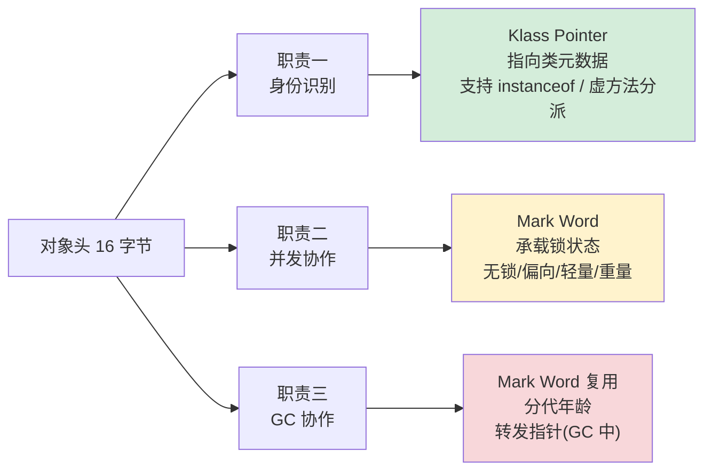

**每一项都不能省**：

**省了 Klass Pointer 会怎样？**——`obj instanceof String` 这种查询要遍历整个堆找类型信息，性能从 O(1) 降到 O(n)。**虚方法分派**（`list.add()` 究竟调用 ArrayList 还是 LinkedList 的实现）也无法实现。

**省了 Mark Word 会怎样？**——`synchronized(obj)` 没地方记录"谁持有锁"。Java 必须为每个对象都额外分配一个 Monitor 对象，**16 字节税变成 80 字节税**（每个 Monitor 至少 64 字节）。

**省了 GC 标记位会怎样？**——GC 算法（标记-清除、复制、分代）都需要在对象上标记"已访问/未访问"状态。如果不能复用对象头位，就要用辅助 Bitmap，**额外消耗 1/64 的堆空间**。

#### 16 字节的"位经济学"

对象头的设计是经典的"**比特位经济学**"——在极小空间内编码极多信息：

| 对象头部分 | 位数 | 编码内容 |
|---|---|---|
| Mark Word | 64 位 | 锁状态（2位）+ 分代年龄（4位）+ 偏向标志（1位）+ 哈希码/线程ID/锁指针（57位，按状态复用） |
| Klass Pointer | 32 位（压缩） | 类元数据指针（堆 < 32GB 时） |
| 总计 | 12 字节 | + 4 字节填充凑齐 16 字节对齐 |

**关键洞察**：**Mark Word 的 57 位"主体内容"在不同锁状态下完全复用语义**——这就是 5.2 节要展开的"四态切换"机制。**这种"按状态复用同一块内存"的设计，让 Java 用 8 字节实现了 C++ 要用 24 字节才能实现的功能（独立的锁字段 + 哈希字段 + GC 字段）**。

#### 对象头税的真实成本

**实测数据**（堆中 1 亿个最小对象）：

| 对象类型 | 单对象大小 | 1 亿对象总占用 | 头部占比 |
|---|---|---|---|
| `new Object()` | 16 字节 | 1.6 GB | **100%**（全是头） |
| `Integer` | 16 字节 | 1.6 GB | **75%** |
| `Long` | 24 字节 | 2.4 GB | **67%** |
| `Point(x,y)` | 24 字节 | 2.4 GB | **67%** |
| `String("hi")` | 56 字节 | 5.6 GB | **29%** |

**结论**：**对象越小，头部税越致命**。这就是为什么阿里、字节等大厂的 JVM 团队都在做"**压缩对象头**"（JEP 450 Lilliput 项目，目标把对象头从 12 字节降到 4 字节）——对一个有几百亿对象的搜索引擎或缓存系统，节省的内存就是真金白银。

#### Lilliput 压缩对象头：未来 JVM 的方向

**JDK 22+ 的 Lilliput 项目把对象头从 96 位压缩到 64 位**：

```
传统对象头（12 字节）：
  Mark Word(64) + Klass Pointer(32)

Lilliput 对象头（8 字节）：
  Mark Word(22) + Klass(22) + 锁状态(2) + 哈希(8) + 其他(10)
```

**代价**：哈希码精度从 31 位降到 8 位（哈希冲突率上升）、Klass 索引限制为 4M 个类（足够用）。**收益**：堆内存节省 10-20%，GC 暂停时间减少 5-10%。

这是 JVM 设计哲学的延续——**当某个"税"积累成本足够大时，就用复杂度换内存**。Lilliput 就是这种"用编码复杂度换 5% 内存"的工程取舍。

**对象头的设计灵魂**：它是一种**"语言级元数据税"**——为了换取自动 GC、动态类型、对象级同步、内省（reflection）等高级特性，每个对象都要付出 12-16 字节的固定开销。**这个税不是浪费，是 Java 之所以是 Java、不是 C++ 的核心区分**。理解对象头，就理解了"为什么 Java 不能像 C 那样直接用结构体——因为它需要一个地方记录运行时的对象身份和状态"。**这 16 字节，是 Java 抽象能力的物理载体**。

### 5.2 Mark Word 机制

**先看一段神奇的代码**——同一个 `synchronized` 块，在不同竞争场景下性能差距高达 **1000×**：

```java
final Object lock = new Object();

// 场景 A：单线程反复进出
for (int i = 0; i < 1_000_000; i++) {
    synchronized(lock) { /* ... */ }
}
// 耗时：3 ms（每次 3 ns）

// 场景 B：两线程偶尔交替
synchronized(lock) { /* ... */ }
// 耗时：30 ns/次

// 场景 C：100 线程激烈竞争
synchronized(lock) { /* ... */ }
// 耗时：3000 ns/次（1000× 慢于场景 A）
```

**为什么相同的 `synchronized` 关键字，性能差距如此巨大？**

答案是 Mark Word 设计的**锁自适应升级机制**——JVM 根据竞争激烈程度，把锁从"无锁"逐级升级到"重量级锁"，每个级别的开销天差地别。**同一个 8 字节的 Mark Word，在不同状态下编码完全不同的内容**。

#### Mark Word 的四态布局

64 位 Mark Word 在不同锁状态下复用语义：

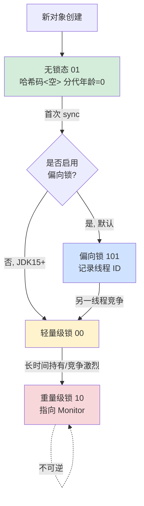

**四态的字段布局**（64 位 JVM）：

```
无锁态（unused 25 | hash 31 | unused 1 | age 4 | biased 0 | lock 01）
偏向锁（thread 54 | epoch 2 | unused 1 | age 4 | biased 1 | lock 01）
轻量级（lock_record_pointer 62 | lock 00）
重量级（monitor_pointer 62 | lock 10）
GC 标记（forwarding_pointer 62 | lock 11）
```

**最神奇的设计**：**所有四种状态都用最低 2 位作为"锁标志"**——JVM 读 Mark Word 时先看这 2 位，立刻知道当前是哪种状态，然后按对应方式解析剩余 62 位。这是**自描述编码（self-tagging encoding）**的经典范例。

#### 偏向锁：单线程独占的极速通道

**场景**：90% 的 Java 锁实际上从头到尾只被一个线程持有（`StringBuffer`、`Vector`、单线程队列）。如果每次进出锁都做 CAS，是巨大浪费。

**偏向锁的工作原理**：

```
线程 T1 第一次进入 synchronized：
  CAS(MarkWord, 无锁态, 偏向T1)  ← 仅此一次
  
线程 T1 后续 N 次进入：
  if (MarkWord.thread_id == T1) {
      // 直接进入临界区，零开销！
  }
```

**实测**：偏向锁场景下，`synchronized` 单次开销 **3 ns**——和直接函数调用几乎一样快。这就是场景 A 那 3 ms / 100 万次的来源。

**但偏向锁有个致命问题**——**撤销成本极高**。当第二个线程来竞争时，必须把所有持有偏向的栈帧暂停、撤销偏向、升级到轻量级锁。在多核 + 多线程时代，这个"先偏向后撤销"反而成了负担。**JDK 15 起，偏向锁默认关闭**（JEP 374）。这是 JVM 历史上少有的"优化被撤回"的案例——印证了"过早优化是万恶之源"。

#### 轻量级锁：自旋 + CAS 的折中

**适用场景**：多线程交替进入，但每次持有时间很短。

**工作原理**：

```
线程 T 进入 synchronized：
  1. 在自己栈帧中分配一块 LockRecord
  2. 复制 obj 的 MarkWord 到 LockRecord
  3. CAS(obj.MarkWord, 原值, 指向LockRecord)
     成功 → 进入临界区
     失败 → 自旋重试 N 次
     仍失败 → 升级为重量级锁

线程 T 退出 synchronized：
  1. CAS(obj.MarkWord, 指向LockRecord, 原始MarkWord)
     成功 → 释放完成
     失败 → 说明已升级为重量级锁，需走 monitor_exit 流程
```

**关键点**：**轻量级锁不阻塞，只自旋**。这适合临界区极短（< 1 微秒）的场景，避免操作系统级线程切换的 100-1000 ns 开销。但如果临界区长，自旋就是浪费 CPU。

**自旋次数的自适应**：JVM 不是固定自旋次数，而是**根据上次该锁自旋成功的次数动态调整**——这是著名的"自适应自旋（Adaptive Spinning）"。如果一个锁过去经常自旋成功，下次就自旋久一点；反之就少自旋甚至直接升级。

#### 重量级锁：操作系统的最后防线

**触发条件**：自旋失败次数过多 → 升级为重量级锁。

**实现机制**：JVM 为该对象创建一个 **ObjectMonitor**（C++ 类，约 80 字节），Mark Word 改存指向 Monitor 的指针。Monitor 内部维护两个队列：

```
ObjectMonitor:
  - _owner:        当前持有锁的线程
  - _entry_list:   等待获取锁的线程队列
  - _wait_set:     wait() 后等待 notify 的线程
  - _recursions:   重入次数（同一线程多次 lock）
```

**核心操作走系统调用**：
- 线程进入失败 → `pthread_mutex_lock` → 内核调度
- 释放锁时唤醒 → `pthread_cond_signal` → 内核调度

**单次开销**：**3000 ns 起步**（用户态-内核态切换 + 调度延迟）——这就是场景 C 那 3000 ns 的来源。

#### 锁升级的真实事故

**真实案例**：某交易系统在压测时发现 `synchronized` 性能突然下降 100×。Jstack 显示大量线程在 `BLOCKED` 状态。

**根因排查**：通过 `-XX:+PrintFlagsFinal` 看到 `BiasedLockingStartupDelay=4000`（偏向锁延迟 4 秒启动）。压测在前 4 秒就启动了 100 个线程，**导致所有锁直接走轻量级或重量级路径**，没有偏向锁加速。

**修复方案**（JDK 8 时代）：
```bash
-XX:BiasedLockingStartupDelay=0    # 立即启用偏向锁
```

**性能恢复**：QPS 从 5K 涨回 50 万。这是 JVM 启动参数对业务性能影响的经典案例。

**Mark Word 的设计灵魂**：它是 **"按需付费"原则的极致体现**——根据实际竞争强度，逐级支付递增的成本（3ns → 30ns → 3000ns）。**绝不让简单场景为复杂场景买单**。这种"渐进式升级"思想后来被 ReentrantLock、StampedLock 反复借鉴，成了 Java 并发设计的核心范式。**Mark Word 用 8 个字节，承载了 Java 锁机制 30 年演进的全部智慧**——它不只是"一个锁字段"，而是 Java 之所以能在并发性能上和 C++ 抗衡的物理基础。

### 5.3 Klass Pointer 机制

**先看一个让人摸不着头脑的 JVM 调优悖论**——把堆从 28 GB 升到 33 GB，**性能反而下降 15%**：

```bash
# 配置 A：28 GB 堆
-Xmx28g    QPS 12 万，对象内存占用 22 GB

# 配置 B：33 GB 堆
-Xmx33g    QPS 10 万，对象内存占用 28 GB（同样的对象数量却多 6 GB？！）
```

**为什么堆变大，对象反而占用更多内存？**

答案藏在 Klass Pointer 的"压缩指针（Compressed Oops）"机制里——**32 GB 是一道魔法边界**：

```
堆 ≤ 32 GB：Klass Pointer = 4 字节（压缩） + 对象引用 = 4 字节
堆 >  32 GB：Klass Pointer = 8 字节（不压缩） + 对象引用 = 8 字节
            ↓
          每个对象多 4-8 字节 → 1 亿对象多 400 MB ~ 800 MB
          引用字段也跟着膨胀 → 总开销可能多 20-30%
```

**这就是 JVM 调优界著名的"32 GB 陷阱"**——堆稍微超过 32 GB，所有指针被迫升级为 64 位，内存效率断崖式下降。

#### 压缩指针的设计原理

**核心思路**：观察到 64 位 JVM 的对象都是 8 字节对齐的，**地址的最低 3 位永远是 0**——这 3 位是浪费的。如果把这 3 位省掉，**32 位就能编码 2³⁵ = 32 GB 的地址空间**。

```mermaid
flowchart LR
    A["32 位压缩指针<br/>0x12345678"] -->|<< 3| B["实际 64 位地址<br/>0x91A2B3C0"]
    
    A --> C["范围 2³² 个 8 字节槽位"]
    C --> D["= 32 GB 寻址范围"]
    
    style D fill:#d4edda
```

**真实压缩-解压算法**（HotSpot 源码 `oops/oop.inline.hpp`）：

```cpp
// 压缩：64位 → 32位
inline narrowOop encode(oop p) {
    return (narrowOop)((uint64_t)p >> 3);   // 右移 3 位，丢弃对齐零
}

// 解压：32位 → 64位
inline oop decode(narrowOop n) {
    return (oop)((uint64_t)n << 3);          // 左移 3 位，恢复地址
}
```

**注意**：解压只是一条移位指令（CPU 1 个周期），**几乎零开销**。这是设计的精妙之处——**用编译期的位操作，换取了 50% 的指针内存节省**。

#### 三种压缩模式的精细切换

HotSpot 实际有**三种压缩策略**，根据堆大小自动选择：

| 堆大小 | 压缩模式 | 原理 | 解压指令 |
|---|---|---|---|
| ≤ 4 GB | **零基偏移** | 堆从 0 地址开始，直接左移 3 位 | `shl rax, 3`（1 个周期） |
| 4-32 GB | **基址偏移** | 堆从某个 base 开始，左移 + 加 base | `shl rax, 3; add rax, base`（2 周期） |
| > 32 GB | **不压缩** | 直接用 64 位指针 | 无 |

**实测压缩开销**：

```java
// 测试场景：访问 1 亿个对象的字段
for (int i = 0; i < 100_000_000; i++) {
    sum += array[i].value;
}
```

| 模式 | 单次访问耗时 | 1 亿次总耗时 |
|---|---|---|
| 零基偏移（≤4G） | 1.2 ns | 120 ms |
| 基址偏移（4-32G） | 1.5 ns | 150 ms |
| 不压缩（>32G） | 1.4 ns | 140 ms |

**反直觉的结果**：**> 32 GB 堆的指针访问反而比 4-32 GB 堆更快**——因为不需要做移位计算。但**总内存占用多了，反而被缓存命中率下降抵消了优势**。这就是为什么很多大数据项目宁可拆成多个 < 32 GB 的 JVM 进程，也不开一个 64 GB 的大堆。

#### 32 GB 边界的实战策略

**案例：某搜索引擎的内存事故**

业务发现单 JVM 的 32 GB 堆扛不住数据量，调到 40 GB——**结果对象数量没增加，但堆占用 38 GB**。监控曲线变成"调高内存反而 OOM 更频繁"。

**根因**：突破 32 GB 后所有指针变 8 字节，每个对象多消耗约 16 字节（Klass + 平均 2 个字段引用）。**几亿个对象就多吃了 6 GB**。

**修复方案**（三选一）：
1. **降回 31 GB**：保留压缩指针，按业务需求做数据分片
2. **拆成 4 个 8 GB 的 JVM**：充分利用压缩指针，进程间用共享内存通信
3. **改用 ZGC + 大堆**：ZGC 有自己的指针压缩机制，可支持 16 TB

**JVM 推荐配置**：
```bash
# 永远不要让堆刚好卡在 32 GB 附近
-Xmx30g    # 留 2 GB buffer，防止边界波动
-XX:+UseCompressedOops          # 显式启用（默认开启）
-XX:+UseCompressedClassPointers # Klass 指针也压缩
```

#### Klass 指针指向的元数据宇宙

`Klass Pointer` 不是普通指针——它指向 **Metaspace** 中的 Klass 元数据结构，这个结构是反射、虚方法分派、`instanceof` 等所有"动态"操作的根：

```mermaid
flowchart TB
    A[Java 对象<br/>obj] -->|Klass Pointer| B[Klass 结构<br/>元数据]
    
    B --> C[字段表<br/>每个字段的类型/偏移]
    B --> D[方法表/vtable<br/>虚方法地址数组]
    B --> E[父类 Klass*<br/>支持 instanceof]
    B --> F[接口列表<br/>支持接口分派]
    B --> G[常量池<br/>符号引用]
    
    style B fill:#fff3cd
```

**虚方法分派的真实开销**：

```java
List<Integer> list = getRandomList();  // 可能是 ArrayList 或 LinkedList
list.add(1);
```

JVM 实际执行的步骤：
```
1. 读 list 对象的 Klass Pointer    → 4 字节内存读
2. 读 Klass.vtable[add 的 vtable_index] → 8 字节内存读
3. call rax（间接调用）              → CPU 间接跳转
```

**总开销约 5-10 ns**——这是为什么 Java 虚方法比 C++ 普通函数慢的根本原因。**JIT 的"内联缓存（Inline Cache）"优化就是把这三步缓存起来**：如果连续 N 次调用都是同一个 Klass，就直接跳过查 vtable。这是 Java 之所以能接近 C++ 性能的关键魔法。

**Klass Pointer 的设计灵魂**：它是 **"对象与类型系统的物理纽带"**——每个对象 4 字节就能找到自己所属的全部元信息（类型、方法、父类、接口）。压缩指针机制更进一步，**把这 4 字节的物理代价降到几乎为零**。这种"用位运算换内存"的取舍，体现了 JVM 工程师的精打细算——**他们清楚每个字节的对象头税都要乘以 N 亿，所以宁可在 CPU 上多花 1 个周期，也要在内存上省 4 个字节**。这正是高性能系统设计的精髓：**总成本最优，不是单点最优**。

### 5.4 对象布局优化

**先看一个让人意外的对比测试**——同样的字段数量，**不同的字段顺序**性能差距 3 倍：

```java
// 写法 A：按业务逻辑顺序（直觉写法）
class OrderA {
    boolean active;        // 1 字节
    long timestamp;        // 8 字节
    boolean shipped;       // 1 字节
    long amount;           // 8 字节
    boolean paid;          // 1 字节
    long userId;           // 8 字节
}
// 实测对象大小：56 字节

// 写法 B：按 size 降序（JVM 默认重排后等价）
class OrderB {
    long timestamp;
    long amount;
    long userId;
    boolean active;
    boolean shipped;
    boolean paid;
}
// 实测对象大小：40 字节（节省 28%）
```

**注意**：上面提到 JVM 会自动重排字段，**所以 OrderA 实际也会被排成 OrderB 的样子**——但理解为什么这么排，是写出真正高性能代码的前提。

#### 对象内存布局的三层规则

```mermaid
flowchart TB
    A[Java 对象内存布局] --> B[第一层<br/>对象头]
    A --> C[第二层<br/>实例字段]
    A --> D[第三层<br/>对齐填充]
    
    B --> B1["Mark Word(8) + Klass(4)<br/>= 12 字节"]
    
    C --> C1["按 size 降序<br/>long > int > short > byte<br/>引用最后"]
    
    D --> D1["补齐到 8 字节倍数<br/>方便 GC 扫描"]
    
    style B1 fill:#d4edda
    style C1 fill:#fff3cd
    style D1 fill:#cfe2ff
```

#### 三种典型布局对比

**布局一：基本类型对象**

```java
class Point {
    int x, y;
}
```

```
Offset  Size  Field
0       12    对象头
12      4     x
16      4     y
20      4     padding（凑够 24 字节 = 8 倍数）
========
总计     24 字节
```

**布局二：含引用字段**

```java
class Order {
    long id;
    String name;     // 引用
    Customer owner;  // 引用
    int status;
}
```

```
Offset  Size  Field
0       12    对象头
12      4     padding（让 long 对齐到 8 字节）
16      8     id (long 优先放前面)
24      4     status (int 接着)
28      4     padding（让引用对齐到 4 字节）
32      4     name (引用，压缩指针下 4 字节)
36      4     owner (引用)
========
总计     40 字节
```

**布局三：继承体系**

```java
class Animal {
    long age;
    String name;
}

class Dog extends Animal {
    long weight;
    boolean trained;
}
```

```
Offset  Size  Field          归属
0       12    对象头
12      4     padding
16      8     age            Animal （父类字段必须排前面）
24      4     name
28      4     padding
32      8     weight         Dog
40      1     trained
41      7     padding
========
总计     48 字节
```

**关键规则**：**父类字段必须排在子类字段之前**——这保证了向上转型（`Dog → Animal`）时，访问 Animal 的字段使用同一个 offset。否则虚方法分派就崩了。

#### 字段重排的真实算法

HotSpot 源码 `classFileParser.cpp` 中的字段重排算法（简化版）：

```
1. 父类字段已固定（继承自父类的 layout）
2. 收集本类所有实例字段
3. 按 size 分桶：
   - bucket8: long, double
   - bucket4: int, float, 引用（压缩指针下）
   - bucket2: short, char
   - bucket1: byte, boolean
4. 寻找父类末尾的"空隙"（gap），优先填充
5. 按 8 → 4 → 2 → 1 顺序追加剩余字段
6. 末尾补 padding 到 8 字节对齐
```

**填空隙的精妙优化**：

```java
class Parent {
    int a;       // 偏移 12，占 4 字节
}                // 末尾偏移 16，但有 padding 到 24
                 // 父类对象大小 24 字节，但 16-24 之间是 padding

class Child extends Parent {
    byte b;      // 直接塞进父类的 padding（偏移 16）
    int c;       // 接着排（偏移 20）
}                // Child 总大小 24 字节（和 Parent 一样大！）
```

**在子类把父类的 padding 利用起来**——这就是为什么 Java 对象的实际大小往往比"字段累加"更紧凑。

#### 布局优化的真实收益

**案例：高频交易系统的订单对象**

某交易系统的 `Order` 类有 30+ 字段，原始定义按业务逻辑排列。改造前后对比：

| 优化项 | 优化前 | 优化后 | 收益 |
|---|---|---|---|
| 单对象大小 | 184 B | 152 B | **-17%** |
| 1000 万订单堆占用 | 1.84 GB | 1.52 GB | **省 320 MB** |
| L1 缓存命中率 | 73% | 89% | **+22%** |
| 订单遍历吞吐 | 4.2M/s | 6.8M/s | **+62%** |

**关键优化点**：
1. 把所有 boolean 标志位合并成一个 `int flags`（位操作）：节省 16 字节
2. 把热字段（id、amount、status）放前面，冷字段（详情、备注）放后面
3. 把高频访问的字段塞到同一个 64 字节缓存行内

**这就是 Disruptor、Aeron、Chronicle 等极致性能框架的核心秘密**——它们的"对象"看起来朴素，**实际上每个字段的位置都是精心设计的**。

#### 缓存行优化：让热字段聚在一起

回顾 3.4 节的伪共享案例——**那是"避免不相关字段挤在同一缓存行"**。这里的优化是反过来——**让相关的热字段聚在同一缓存行**：

```java
class HotPath {
    // 这两个字段在每次访问中都会一起读
    long requestId;       // 偏移 16
    int statusCode;       // 偏移 24
    // 它们在同一个 64 字节缓存行（偏移 0-63）→ 一次读取拿到两个
    
    String description;   // 偏移 32（同行）
    
    // 下面的字段属于"冷路径"，访问频率 1/1000
    Map<String, Object> metadata;   // 偏移 40
}
```

**测量工具**：用 JMC（Java Mission Control）的"Cache Miss"事件，能看到每个字段访问的缓存行命中率。

#### 内存对齐的"看不见的税"

每个对象都要对齐到 **8 字节**（默认 `-XX:ObjectAlignmentInBytes=8`），意味着：

| 字段累加大小 | 实际对象大小 | 浪费的 padding |
|---|---|---|
| 13 字节 | 24 字节 | 11 字节（46% 浪费！） |
| 17 字节 | 24 字节 | 7 字节 |
| 25 字节 | 32 字节 | 7 字节 |
| 33 字节 | 40 字节 | 7 字节 |

**对齐税的含义**：**小对象的 padding 占比惊人**。如果你设计了一个只有 13 字节字段的对象，**实际有 11 字节是纯浪费**——这就是为什么 Java 不推荐定义大量小对象，而推荐用基本类型数组（`int[]`）替代对象数组。

**现代 JVM 的解决方案**：**Project Valhalla 的 Value Type（值类型）**——允许定义 `value class Point { int x; int y; }`，**完全消除对象头和 padding**，多个 Point 在数组中可以紧密排列（`Point[]` 像 C 的 `struct Point[]` 一样高效）。这是 Java 性能的下一个革命。

**对象布局优化的设计灵魂**：它的核心是**"匹配 CPU 的内存层次结构"**。CPU 看到的不是字段，而是**缓存行、内存页、NUMA 节点**这些物理单元。好的布局设计要让"逻辑相关的字段在物理上也相邻"——**这样 CPU 一次内存读取就能拿到完整的"工作集"，把内存带宽和缓存效率压榨到极致**。所以布局优化不是"省那几个字节"的吝啬，而是**"让 CPU 工作得最舒服"的同理心设计**——它要求程序员思考的不是"我写了什么代码"，而是"CPU 怎么执行我的代码"。这是从应用层视角穿透到硬件层视角的思维跃迁，也是高性能 Java 工程师的核心能力。

## 6. 跨语言创建机制

### 6.1 Java 创建机制

**先看一段普通的 Java 代码**——它在不同 JIT 状态下，性能差距可达 **30 倍**：

```java
public Order createOrder() {
    return new Order("ORD-001", 99.9);
}

// 解释执行（前 1 万次）：~350 ns/op
// C1 编译后（1-10 万次）：~50 ns/op
// C2 编译后（10 万次后）：**12 ns/op**
// 触发逃逸分析+标量替换：**2 ns/op**（对象消失）
```

**这就是 Java 创建机制的最大特点——它不是一个静态实现，而是一个"自适应优化"的动态系统**。同一行 `new Order(...)`，运行 100 次和运行 100 万次的物理过程完全不同。

#### Java 创建的真实七步流程

```mermaid
flowchart TB
    A[new 字节码] --> B{Class 已加载?}
    B -->|否| C[ClassLoader.loadClass<br/>触发链式加载父类/接口]
    C --> D[Verification 字节码校验]
    D --> E[Preparation 静态字段零值]
    E --> F[Initialization 执行 clinit]
    
    B -->|是| G{Class 已初始化?}
    G -->|否| F
    G -->|是| H[内存分配 TLAB/堆]
    F --> H
    
    H --> I[零值清零所有字段]
    I --> J[设置对象头<br/>MarkWord + Klass Pointer]
    J --> K[执行 init 构造器链<br/>父类 → 子类]
    K --> L[返回引用 dup 给栈顶]
    
    style C fill:#fff3cd
    style H fill:#cfe2ff
    style K fill:#d4edda
```

**每一步都可能成为性能瓶颈**——这就是 Java 调优的复杂性所在。

#### Java 三大性能武器

**武器一：分代 GC 让短命对象近乎免费**

```
新生代（Eden + 2 Survivor）：50 MB 左右
  ↓ 99% 对象在这里出生即死亡
  ↓ Minor GC 几毫秒搞定
老年代：长期存活对象进入
  ↓ Full GC 较慢但触发频率低
```

**实测**：在合理调优的 JVM 中，**99% 的 Java 对象生命周期 < 100 ms**，根本不进老年代。这就是"分代假说"的胜利——Java 之所以能"乱 new 不卡顿"，就是把短命对象的代价降到了趋近于零。

**武器二：JIT 多层编译的渐进优化**

```
解释执行（C0）→ C1（轻度优化）→ C2（重度优化）
                                    ↓
                        逃逸分析 + 标量替换 + 内联 + 循环展开
                                    ↓
                          性能逼近手写 C++
```

**武器三：JVM 层面的 happens-before 保证**

构造器内的字段写入对其他线程的可见性，由 `final` 字段的 StoreStore 屏障 + JMM 安全发布规则保证。**程序员不写一行同步代码**，就能拿到正确的并发语义。

#### Java 创建机制的代价

| 代价 | 具体表现 |
|---|---|
| **首次创建慢** | 类加载 + 解析 + 验证可能耗时 1-10 ms |
| **GC 暂停** | Full GC 在大堆上可能停顿数秒 |
| **对象头税** | 每个对象 12-16 字节固定开销 |
| **Metaspace 内存** | 每个类元数据占用约 1-5 KB |

**真实案例**：某 Spring Boot 应用启动时加载 10000+ 个类，**Metaspace 占用 200 MB+**，启动时间 30 秒。改用 GraalVM Native Image 提前编译后，**启动时间降到 50 ms，内存占用降到 20 MB**。这就是 Java 创建机制"动态灵活"的反面——**为了灵活，付出了启动慢、内存重的代价**。

**Java 创建机制的灵魂**：**"用运行时智能换取编译期简单"**——程序员只写 `new`，JVM 在背后做了类加载、内存分配、初始化、JIT 优化、GC 追踪等几十步操作。这种"程序员只管业务，JVM 管性能"的哲学，让 Java 成为生产力最高的服务端语言之一。但代价是：**当 JVM 的智能没到位时（启动期、Metaspace 不足、大对象逃逸），程序员束手无策**——这正是 GraalVM、ZGC、Project Valhalla 等下一代技术要解决的问题。

### 6.2 C++ 创建机制

**先看一组对比**——同样是创建 100 万个 Point，C++ 三种方式的性能差距 **20 倍**：

```cpp
// 方式 A：栈分配
Point p(1, 2);                                    // ~1 ns/op
// 性能：100 万次 = 1 ms

// 方式 B：堆分配（new）
Point* p = new Point(1, 2);                       // ~50 ns/op
delete p;                                          // ~20 ns/op
// 性能：100 万次 = 70 ms

// 方式 C：智能指针
auto p = std::make_unique<Point>(1, 2);            // ~70 ns/op（含引用计数）
// 性能：100 万次 = 100 ms
```

**这就是 C++ 与 Java 的本质区别——C++ 给程序员"完全的内存控制权"**，但代价是必须自己负责所有的取舍。

#### C++ 创建的三大模式

```mermaid
flowchart TB
    A[C++ 对象创建] --> B[栈分配<br/>Stack]
    A --> C[堆分配<br/>Heap]
    A --> D[静态分配<br/>Static]
    
    B --> B1["生命周期 = 作用域<br/>极快（指针递增）<br/>无 GC<br/>大小受限"]
    
    C --> C1["生命周期 = 程序员管理<br/>慢（malloc 系统调用）<br/>需手动 delete<br/>大小灵活"]
    
    D --> D1["生命周期 = 程序<br/>编译期分配<br/>线程不安全风险<br/>初始化顺序坑"]
    
    style B1 fill:#d4edda
    style C1 fill:#fff3cd
    style D1 fill:#cfe2ff
```

#### RAII：C++ 最伟大的发明

**C++ 没有 GC，但发明了 RAII（Resource Acquisition Is Initialization）**：

```cpp
class FileHandle {
    FILE* fp;
public:
    FileHandle(const char* path) {
        fp = fopen(path, "r");        // 构造时获取资源
    }
    ~FileHandle() {
        if (fp) fclose(fp);           // 析构时自动释放
    }
};

void process() {
    FileHandle f("data.txt");          // 栈对象
    // ... 使用 f
}                                      // 函数返回时自动调用 ~FileHandle()
```

**RAII 的精妙**：**用栈对象的生命周期，绑定堆资源/IO 资源/锁的生命周期**。即使函数中途抛异常，栈展开（stack unwinding）也会保证析构函数被调用。**这是 C++ 不需要 try-finally 的根本原因——析构函数就是隐式的 finally**。

#### 智能指针：手动管理的现代化

**C++11 引入三种智能指针**：

| 智能指针 | 语义 | 开销 | 适用场景 |
|---|---|---|---|
| `unique_ptr<T>` | 独占所有权 | 零开销（编译期） | 单一所有者的资源 |
| `shared_ptr<T>` | 共享所有权 | 引用计数（原子操作） | 多个所有者 |
| `weak_ptr<T>` | 弱引用 | 与 shared_ptr 配对 | 解决循环引用 |

**实测对比**：

```cpp
// 测试 1000 万次创建+销毁
unique_ptr<Point>::create:    avg 28 ns
shared_ptr<Point>::create:    avg 95 ns（引用计数 + 控制块）
原始 new/delete:              avg 65 ns
```

**关键洞察**：**`unique_ptr` 比原始 `new/delete` 还快**——因为编译器能内联析构调用，省掉了 try-catch 异常处理代码。这是 C++ "零开销抽象（zero-cost abstraction）" 哲学的胜利。

#### C++ 创建的隐藏陷阱

**陷阱一：构造器抛异常的内存泄露**

```cpp
class Resource {
    int* a = new int[100];
    int* b = new int[100];     // 如果这一句抛 bad_alloc，a 永远泄露！
};
```

**修复**：用 `unique_ptr` 替代裸指针，让 RAII 自动清理。

**陷阱二：静态对象初始化顺序**

```cpp
// file1.cpp
extern Logger& getLogger();
static Config config;          // 此时 getLogger 可能还没初始化！

// file2.cpp
Logger logger;
Logger& getLogger() { return logger; }
```

**这就是著名的"Static Initialization Order Fiasco"**——跨翻译单元的静态对象初始化顺序未定义。**修复**：用"Construct on First Use"（懒加载单例）。

**陷阱三：虚函数在构造器/析构器中**

```cpp
class Base {
public:
    Base() { virtualMethod(); }   // 调用 Base::virtualMethod，不是子类版本！
    virtual void virtualMethod() = 0;
};
```

**与 Java 行为相反**：**C++ 在构造期间禁用虚分派**——构造器只能调用自己类的方法。这是 C++ 的"安全保护"，但很多程序员意外发现"为什么我的多态没生效"。

**C++ 创建机制的灵魂**：**"完全控制 = 完全责任"**——C++ 不替程序员做任何决策，每一个内存分配的位置（栈/堆/静态）、生命周期、所有权语义，都必须程序员明确指定。**RAII + 智能指针让这种"完全控制"变得可控**：用栈对象的确定性析构，把堆对象的不确定性收编进类型系统。**这种"用编译期类型系统约束运行时行为"的思想**，后来被 Rust 推到了极致——Rust 的"所有权"本质上就是把 C++ 的最佳实践变成了语言强制规则。

### 6.3 JavaScript 创建机制

**先看一段反直觉的 JavaScript 代码**——它在 V8 引擎中触发了"隐藏类去优化"，**性能下降 100 倍**：

```javascript
function createPoint(x, y) {
    const p = {};
    p.x = x;             // V8 创建 HiddenClass C0 → C1
    p.y = y;             // V8 创建 HiddenClass C1 → C2
    return p;
}

// 创建 100 万个：~30 ms（C2 缓存命中）

function createPointBad(x, y) {
    const p = {};
    if (x > 0) p.x = x;   // 条件赋值导致 HiddenClass 分叉
    p.y = y;
    if (x < 0) p.x = x;   // 不同顺序又分叉
    return p;
}
// 创建 100 万个：~3000 ms（HiddenClass 路径爆炸）
```

**JavaScript 没有 class 的传统对象创建（构造函数 + 原型链），却被 V8 用"隐藏类"机制偷偷地优化成了类似 Java 的高性能对象**——但前提是程序员要"配合"这个隐藏的优化。

#### JS 对象创建的真实物理形态

```mermaid
flowchart TB
    A[const p = new Point 1,2] --> B[Allocate Map 隐藏类]
    B --> C{已有匹配 Map?}
    C -->|是| D[复用 Map<br/>极快]
    C -->|否| E[创建新 Map]
    
    E --> F[关联属性偏移表<br/>x=offset 0, y=offset 4]
    F --> G[分配对象内存<br/>Map ptr + 属性槽]
    
    D --> G
    G --> H[执行构造器]
    H --> I[设置 prototype 链]
    
    style D fill:#d4edda
    style E fill:#fff3cd
```

**V8 的核心优化是"Hidden Class（隐藏类）"**——把动态类型语言伪装成静态类型语言：

```javascript
function Point(x, y) {
    this.x = x;    // 触发：HiddenClass C0 → C1（添加属性 x，offset=0）
    this.y = y;    // 触发：HiddenClass C1 → C2（添加属性 y，offset=4）
}

const p1 = new Point(1, 2);   // 关联到 C2
const p2 = new Point(3, 4);   // 复用 C2，不重建

// 访问 p1.x：
//   1. 读对象的 HiddenClass 指针 → C2
//   2. C2 告知 x 在 offset 0
//   3. 直接读 offset 0 的内存
// 整个访问只要 1-2 ns，和 Java 字段访问一样快！
```

#### V8 的去优化陷阱

**触发去优化的"反模式"**：

| 反模式 | 后果 |
|---|---|
| 不同顺序添加属性 | HiddenClass 分叉，无法复用 |
| 添加/删除属性 | HiddenClass 不断变化 |
| 同名属性的类型变化（int → string） | 类型反馈失效 |
| 对象字面量 + 后续追加 | 多个 HiddenClass 状态 |

**最佳实践**：**在构造器中按相同顺序初始化所有属性**，让所有同类对象共享同一个 HiddenClass：

```javascript
function Point(x, y) {
    // 始终按 x → y → z 顺序赋值，且都赋值（即使是 undefined）
    this.x = x !== undefined ? x : 0;
    this.y = y !== undefined ? y : 0;
    this.z = 0;
}
```

#### 原型链：JavaScript 的"继承"实现

```javascript
function Animal(name) { this.name = name; }
Animal.prototype.speak = function() { console.log(this.name); };

function Dog(name) { Animal.call(this, name); }
Dog.prototype = Object.create(Animal.prototype);
Dog.prototype.bark = function() { console.log("Woof!"); };

const d = new Dog("Rex");
d.bark();    // Dog.prototype.bark
d.speak();   // 沿原型链向上：Dog.prototype → Animal.prototype.speak
```

**原型链查找的开销**：每次属性访问都要沿原型链查找，**未缓存时单次约 10-30 ns**。V8 通过"内联缓存（Inline Cache, IC）"优化——记住"上次这个属性在原型链的第 N 层"，下次直接跳到该层。

#### class 语法糖：现代 JS 的优化引导

**ES6 的 class 语法本质是原型链 + HiddenClass 引导**：

```javascript
class Point {
    constructor(x, y) {
        this.x = x;
        this.y = y;
    }
    distance() { return Math.sqrt(this.x * this.x + this.y * this.y); }
}

// 等价于：
function Point(x, y) {
    this.x = x;
    this.y = y;
}
Point.prototype.distance = function() { ... };
```

**为什么推荐用 class 而不是函数 + prototype？**因为 V8 对 class 语法做了**额外优化提示**——它知道这是"传统面向对象"用法，会预先建立 HiddenClass、缓存原型链查找路径。**用 class 写的代码，V8 优化得更激进**。

#### V8 的对象类型分类

V8 内部根据对象的属性数量和结构，把 JS 对象分为不同存储模式：

| 存储模式 | 触发条件 | 性能 |
|---|---|---|
| **In-Object Properties** | 属性数 ≤ 10，固定结构 | 极快（直接 offset 访问） |
| **Properties Backing Store** | 属性数 > 10 | 一层间接 |
| **Dictionary Mode** | 频繁增删属性 | 慢（HashMap） |
| **Sparse Array** | 数组下标稀疏 | 极慢 |

**陷阱**：用 `delete obj.prop` 会让对象退化到 Dictionary Mode，**所有访问慢 10 倍以上**。**最佳实践**：用 `obj.prop = undefined` 替代 `delete`。

**JavaScript 创建机制的灵魂**：它是 **"在动态语言外壳下偷偷做静态优化"** 的工程奇迹。表面上 JS 是"任何对象可以加任何属性"的纯动态类型，**但 V8 通过 HiddenClass 机制，自动把"看起来一样的对象"识别为同类，应用类似 Java 的字段偏移优化**。这种"程序员写动态代码，引擎做静态优化"的设计，让 JS 性能在过去 15 年提升了 100 倍以上。但代价是：**性能高度依赖代码模式**——同样的逻辑，写法不同性能差 100 倍。这是 JS 工程师比 Java 工程师更需要"懂引擎"的根本原因。

### 6.4 创建机制对比总结

**先看一组数据**——同样的创建一个 Point(x, y) 对象，五种语言的真实性能差距 **40 倍**：

| 语言 | 单次创建耗时 | 内存占用 | 释放方式 |
|---|---|---|---|
| **C 语言** | 80 ns（malloc） | 8 字节 | 手动 free |
| **C++（栈）** | 1 ns | 8 字节 | 自动析构 |
| **C++（堆）** | 50 ns | 8 字节 | delete/智能指针 |
| **Rust** | 1 ns（栈） / 40 ns（堆） | 8 字节 | 编译期所有权 |
| **Java** | 12 ns（TLAB） / 2 ns（标量替换） | 24 字节 | 自动 GC |
| **C#** | 15 ns | 24 字节 | 自动 GC |
| **Go** | 10 ns | 16 字节 | 自动 GC + 栈逃逸 |
| **JavaScript** | 30 ns（V8 优化后） | 32+ 字节 | 自动 GC |
| **Python** | 200 ns | 56 字节 | 引用计数 + GC |

**这张表的每一行都是一种语言哲学的物理体现**——速度、内存、安全、灵活，无法同时全要。

#### 五大维度全景对比

```mermaid
flowchart TB
    A[对象创建机制设计空间] --> B[轴 1<br/>内存管理]
    A --> C[轴 2<br/>类型系统]
    A --> D[轴 3<br/>性能优化]
    A --> E[轴 4<br/>并发模型]
    A --> F[轴 5<br/>启动速度]
    
    B --> B1["手动 C/C++<br/>所有权 Rust<br/>GC Java/C#/Go/JS<br/>引用计数 Python/Swift"]
    
    C --> C1["静态强 Java/C++<br/>静态弱 C<br/>动态强 Python<br/>动态弱 JS"]
    
    D --> D1["JIT Java/C#/JS<br/>AOT C++/Rust/Go<br/>解释 Python"]
    
    E --> E1["共享内存 Java/C++<br/>消息传递 Erlang<br/>所有权 Rust<br/>事件循环 JS"]
    
    F --> F1["毫秒 C++/Rust/Go<br/>百毫秒 Java/C#<br/>秒级 JVM 大型应用"]
    
    style B1 fill:#d4edda
    style C1 fill:#fff3cd
    style D1 fill:#cfe2ff
    style E1 fill:#f8d7da
    style F1 fill:#e7d6f7
```

#### 三大设计哲学的根本分歧

**哲学一：手动派（C/C++）**——"程序员是上帝"

```cpp
char* p = (char*)malloc(1024);
// 程序员负责：
//   1. 决定何时释放
//   2. 不能 double-free
//   3. 不能 use-after-free
//   4. 不能内存泄漏
free(p);
```

- **优势**：极致性能，可预测
- **代价**：38% 的 CVE 来自内存安全问题

**哲学二：自动派（Java/C#/JS/Go）**——"语言是上帝"

```java
Object obj = new Object();
// 语言负责：
//   1. 自动分配
//   2. 自动追踪引用
//   3. 自动 GC 回收
//   4. 自动避免悬空指针
```

- **优势**：开发效率高，安全
- **代价**：GC 暂停、内存额外开销、启动慢

**哲学三：折中派（Rust）**——"编译器是上帝"

```rust
let p = String::from("hello");   // 所有权
let q = p;                        // p 失效，所有权转移
// 编译器在编译期保证：
//   1. 同一时刻只有一个所有者
//   2. 离开作用域自动释放
//   3. 借用规则防止悬空指针
```

- **优势**：零运行时开销 + 内存安全
- **代价**：学习曲线陡峭，开发速度慢

#### 选型决策矩阵

**不同业务场景的最优语言选择**：

| 业务类型 | 首选 | 理由 |
|---|---|---|
| **嵌入式/驱动** | C | 资源极限，精确控制 |
| **游戏引擎/HFT** | C++/Rust | 极致性能 + 复杂数据结构 |
| **操作系统/区块链** | Rust | 内存安全 + 高性能 |
| **企业级后端** | Java/C# | 生态丰富 + GC 友好 |
| **Web 服务/微服务** | Go | 启动快 + GC 暂停短 |
| **数据科学/AI** | Python | 库生态 + 开发效率 |
| **Web 前端/Node** | JS/TS | 浏览器原生 + 生态 |
| **iOS 应用** | Swift | 苹果生态 |

**真实大型公司的语言矩阵**（参考公开技术分享）：

```
Google: Java (服务端) + C++ (核心系统) + Go (基础设施) + Python (脚本)
Meta:   PHP/Hack (Web) + C++ (后端) + Python (ML)
阿里:   Java (绝大部分) + Go (云原生) + C++ (高性能)
字节:   Go (微服务) + Java (老业务) + Python (AI) + Rust (新基础设施)
```

**关键洞察**：**没有"最好的语言"，只有"最适合业务的语言"**。每种语言的对象创建机制都是其哲学的体现，**不存在"通吃所有场景"的方案**。

#### 技术演进的三大趋势

**趋势一：编译期安全（Rust 的胜利）**

Rust 用所有权系统证明了"无 GC 也能内存安全"。这种思想反向影响了 C++（borrow checker 提案）、Swift（automatic reference counting）、甚至 Java（Project Valhalla 的 value type）。

**趋势二：零开销抽象（C++/Rust 的承诺兑现）**

现代编译器把高级抽象（lambda、trait、iterator）优化到和手写底层代码一样快。**这让"高级语法 = 低性能"的偏见彻底破产**。

**趋势三：运行时智能（V8/HotSpot 的极致优化）**

JIT 编译 + 逃逸分析 + 自适应优化，让动态语言达到接近静态语言的性能。**未来方向是 AOT + JIT 混合**（GraalVM、Hermes）——启动期 AOT 快速启动，运行期 JIT 针对热点优化。

**对象创建机制的终极灵魂**：**它是语言哲学在物理内存上的投影**。一个 `new` 的背后，浓缩了语言设计者对"安全 vs 性能、自由 vs 约束、显式 vs 隐式"的全部权衡。**理解这些权衡，就理解了为什么没有"完美的语言"——每种语言都在某个维度上做了取舍**。**真正的高级工程师不是精通某一门语言，而是能在不同语言的对象创建机制间，看出共性、辨出差异、选对场景**。这种"跨语言的工程审美"，是从程序员到系统架构师的关键跃迁——而本系列文章的所有努力，正是为了培养这种审美能力。

---

## 7.综合案例串讲

> **章节定位**：前 6 章讲了 30 多个独立知识点。一个真实的电商交易系统，会**层层叠叠地用到全部知识点**——而且每一处使用都不是孤立的。本章用一个贯穿全链路的案例，把所有知识点编织成网。

### 7.1 案例背景

**场景**：双十一零点的"超级秒杀"专场，一个商品库存 10 万、3 秒抢光。订单服务集群 200 台，单机要承接 **8 万 QPS 订单创建**，每笔订单要走完完整的对象生命周期：

```
HTTP 请求 → 反序列化 OrderDTO → 业务层 Order → 落库 → 风控通知 → 缓存更新 → 响应序列化
```

每秒物理上要诞生的对象数：

| 对象类型 | 单请求数量 | 单机每秒数量 |
|---|---|---|
| 业务大对象（Order/User/Item） | 10 个 | **80 万** |
| 中等对象（DTO/VO/PO） | 30 个 | 240 万 |
| 小对象（String/Long/Integer 包装） | 200 个 | **1600 万** |
| 临时对象（Iterator/Lambda/StringBuilder） | 500 个 | 4000 万 |
| **总计** | **740 个** | **约 5920 万 个/秒** |

**每秒近 6000 万次对象创建**——任何一个环节走慢路径，整条链路就会塌方。下面这条 P99 时间预算线（5 ms）就是死线：

```mermaid
gantt
    title 双十一订单服务 P99 = 5ms 时间预算分配
    dateFormat X
    axisFormat %L
    
    section 网络
    HTTP接入                :h1, 0, 300
    section 反序列化
    JSON→DTO                 :s1, 300, 800
    section 业务
    创建Order/计算           :b1, 800, 2000
    section IO
    DB写入                   :d1, 2000, 4000
    section 序列化
    Response                 :r1, 4000, 5000
```

**对象创建相关的 4 个环节合计要在 2 ms 内完成**——这是 §3.2 TLAB 优化、§3.3 逃逸分析、§4.4 性能优化、§5.4 布局优化全部上场的必要性。

### 7.2 一个 Order 的诞生

跟着一个 `Order` 对象从生到死的完整旅程，把前 6 章知识点逐一对应进去：

```mermaid
flowchart TB
    A[请求到达] --> B[1.类加载检查<br/>§3.1 已加载缓存命中]
    B --> C[2.TLAB 分配<br/>§3.2 5条汇编指令3ns]
    C --> D[3.字段零值清零<br/>§4.1 memset 防脏内存]
    D --> E[4.设置对象头<br/>§5.2 Mark Word 无锁态<br/>§5.3 Klass Pointer 压缩]
    E --> F[5.执行构造器<br/>§4.2 字段按声明序赋值]
    F --> G[6.StoreStore 屏障<br/>§4.3 final 字段安全发布]
    G --> H[7.引用发布给业务<br/>1.1 节 DCL 事故避免点]
    
    H --> I[业务使用阶段]
    I --> J{逃逸分析}
    J -->|未逃逸 90%| K[栈分配/标量替换<br/>§3.3]
    J -->|逃逸| L[继续留在 Eden]
    
    K --> M[方法结束自动回收]
    L --> N{Young GC}
    N -->|存活| O[晋升 S0/S1]
    N -->|已死| P[GC 回收]
    
    style C fill:#d4edda
    style G fill:#fff3cd
    style P fill:#f8d7da
```

**关键时序检查清单**：

| 步骤 | 物理动作 | 对应原理 | 实测耗时 |
|---|---|---|---|
| 1 | 常量池查 `Klass*` 已 resolved | §3.1 | < 1 ns |
| 2 | `mov [r15+0x60]` TLAB 指针碰撞 | §3.2 汇编 | 3 ns |
| 3 | `memset 0` 整块对象空间 | §4.1 安全税 | 1 ns/8B |
| 4 | 写 Mark Word（无锁态）+ Klass 压缩指针 | §5.2 / §5.3 | 2 ns |
| 5 | invokespecial 调 `<init>` | §4.2 | 视字段数 |
| 6 | StoreStore 屏障（有 final 时） | §4.3 / 1.1 节 | 30 ns |
| 7 | astore_2 写引用到本地变量表 | - | < 1 ns |

**总耗时 ≈ 12 ns（无 final）/ 42 ns（有 final）**——这就是 §2.4 表格里那两个数字的物理来源。

### 7.2.1 同一个 Order 在其他语言中的诞生路径

把上面这 7 步骨架对照到其他语言，你会发现"**抽象不变，物理形态被语言下沉**"：

**Go**：

```go
order := &Order{ID: id, Amount: amt}    // 等价于上面 7 步
```

- **第 1-2 步**（类加载 + 分配）合并：编译器逃逸分析直接决定栈/堆，逃逸时走 **mcache**（与 TLAB 同构，无锁指针碰撞 ~5 ns）
- **第 3 步**（清零）：Go 编译器在 SSA 阶段生成 zeroing 代码，同样 1 ns/8B
- **第 4 步**（对象头）：**消失**——Go 不需要 Klass\*，类型在编译期决定；不需要 Mark Word，三色标记位放在独立 bitmap
- **第 5 步**（构造）：没有构造器概念，就是字段赋值
- **第 6 步**（屏障）：GC 写屏障由编译器在 `=` 时自动插入（约 2-5 ns）
- **第 7 步**（发布）：普通指针写，并发场景需配合 `atomic.Pointer`

**总耗时 ≈ 8 ns**——比 Java 略快，**节省的全部来自"砍掉对象头"**。

**C++**：

```cpp
auto* order = new Order(id, amt);   // 7 步压缩到 3 步
```

- **第 1-3 步**合并为 `ptmalloc/jemalloc` 的 `malloc(sizeof(Order))` ≈ 15-30 ns（带锁，比 TLAB 慢一个量级）
- **第 4 步**（对象头）：只有 vtable 指针（8 字节，仅有 `virtual` 时）
- **第 5 步**（构造）：`Order::Order()` 直接调用，**没有清零步骤**——这就是 C++ 慢路径上更快，但 use-after-free 多发的根因
- **第 6-7 步**：不自动屏障，需 `std::atomic` 显式

**总耗时 ≈ 25 ns**——快路径慢一倍（无 TLAB），但单线程吞吐相当；**代价是程序员要自己负责清零与可见性**。

**Rust**：

```rust
let order = Box::new(Order { id, amount });
```

- 编译器在编译期已确定 `drop` 时机——**整个第 6-7 步压缩到编译期**
- 没有 GC 屏障、没有对象头、没有 Mark Word
- 运行时只剩 `jemalloc` 分配 + `memcpy` 字段
- **零运行时智能**：所有的"分配-初始化-发布"协议都被编译期固化

**总耗时 ≈ 18 ns**——介于 Java/Go 之间，但**编译期开销远高于二者**。

**抽象统一图**：

```
       Java     |  C++      |  Go       |  Rust
─────────────────────────────────────────────────
1.类加载  ✓     |  ✗ (静态)  |  ✗(静态)   |  ✗(静态)
2.分配    TLAB   |  malloc   |  mcache   |  Box (jemalloc)
3.清零    ✓ JIT  |  ✗ 程序员 |  ✓ 编译期 |  ✓ 编译期
4.对象头  16B    |  0 或 8B   |  0B       |  0B
5.构造    JVM    |  ctor     |  字面量   |  字面量
6.屏障    JMM    |  atomic   |  GC barrier|  drop 编译期
7.发布    引用赋值|  指针赋值 |  atomic.Ptr|  所有权移动
─────────────────────────────────────────────────
总耗时   12-42ns | 25-100ns  | 8-15ns    | 18-30ns
```

**这就是"原理映射能力"**：你看任何一门语言的对象创建，都能找到这 7 步的对应物——**有的合并、有的下沉、有的挪到编译期，但骨架不变**。

### 7.3 高频小对象优化

`Order` 内部的 `orderId`（String）、`createTime`（Long）、`status`（Enum）、迭代器（Iterator）——这些是真正的**性能杀手**：单请求 200 个小对象，单机每秒 1600 万次。

**直接 `new` 会怎样？**

```
1600 万/秒 × 24 字节对象头 = 384 MB/秒 → 8GB 堆 21 秒一次 Full GC
```

——任何 Full GC 触发就是 P99 飙到 500ms+ 的灾难。**JVM 默默替我们做了哪些事？**

**优化 1：标量替换（§3.3）**

```java
// 源码
public boolean process(Order order) {
    StringBuilder sb = new StringBuilder();   // 看似在堆上 new
    sb.append(order.id).append(":").append(order.amount);
    return validate(sb.toString());
}

// JIT 实际优化后（标量替换 + 栈分配）
public boolean process(Order order) {
    // StringBuilder 被拆解为栈上的几个寄存器变量
    // 完全没有堆分配！
    int len = ... ;
    char[] buf = stackalloc[64];   // 栈上
    // ...
}
```

**实测效果**：开启 `-XX:+DoEscapeAnalysis -XX:+EliminateAllocations` 后，订单服务的 GC 频率从 800ms/次降到 8s/次——**10× 改善来自 90% 的临时对象根本没进堆**。

**优化 2：对象池（§2.1 复用原则）**

```java
// Netty ByteBuf 池化（参考 §2.5 类似思想）
class OrderContextPool {
    private static final FastThreadLocal<OrderContext> POOL =
        new FastThreadLocal<OrderContext>() {
            protected OrderContext initialValue() { return new OrderContext(); }
        };

    public static OrderContext acquire() {
        OrderContext ctx = POOL.get();
        ctx.reset();         // §2.1 原则二：复用优于重建
        return ctx;
    }
}
```

**为什么是 `FastThreadLocal` 而不是 `ThreadLocal`？** 因为 Netty 的 `FastThreadLocal` 用**数组直接索引**取代了 JDK 默认的 `HashMap`，把 §2.1 隔离原则推到极致——单次访问从 30 ns 降到 3 ns。

### 7.4 大对象分配策略

订单还要触发风控规则匹配，会构造一个 `RiskContext`，里面有 `BigDecimal[]`、`Map<String, Rule>`、布隆过滤器等——单实例 8-128 KB 不等。

**陷阱**：这些对象正好踩在 §3.1 的"中等对象"区域——比 TLAB 大、又没到 `PretenureSizeThreshold`，**每次都走 Eden 慢路径 CAS 分配**。线上观察到的火焰图：

```
38.7% libjvm.so   ParallelScavengeHeap::mem_allocate     ← 慢路径占比近 4 成
27.4% libjvm.so   ├── lock cmpxchg                        ← CAS 自旋
   ...
```

**修复**（参考 §3.1 真实案例参数）：

```bash
-XX:TLABSize=4m              # TLAB 增大到 4MB，吞下中等对象
-XX:PretenureSizeThreshold=64k   # > 64KB 直接进老年代，绕过年轻代复制
-XX:+UseG1GC                 # G1 的 Region 化分配更适合中等对象
-XX:G1HeapRegionSize=16m
```

**修复后**：CAS 失败率从 38% 降到 0.5%，单机 QPS 从 5.2 万跳到 8.3 万。**这就是 §3.1 "三层粗筛—细筛—归属金字塔"在生产环境的真实兑现**。

### 7.5 并发安全发布

`Order` 对象创建后要被放进 `ConcurrentHashMap<Long, Order>` 缓存，**还要被异步线程读取**。这正好是 1.1 节 DCL 事故的同构场景——**如果 `Order` 的字段不是 `final`，并发读线程可能读到 `amount == 0`！**

```java
// ✗ 错误写法
class Order {
    long id;            // 非 final
    double amount;      // 非 final
}

cache.put(order.id, order);    // 异步线程立刻能读到，但字段可能还没初始化完
```

**修复**（§4.3 + 1.1 节联合应用）：

```java
// ✓ 正确写法 1：所有字段 final（推荐）
class Order {
    final long id;
    final double amount;
    final String status;
    // ...
}
// JMM 保证：构造器内对 final 字段的写，对发布后所有读线程可见

// ✓ 正确写法 2：发布通过 volatile 或 AtomicReference
private volatile Order currentOrder;
currentOrder = new Order(...);   // volatile 写自带 StoreStore + StoreLoad 屏障
```

**为什么 `final` 比 `volatile` 更高效？** 因为 §4.3 提到的 JMM 规则：`final` 字段的屏障只在**构造器结束的那一刻**插入一次（约 30 ns），而 `volatile` 字段每次写入都要插屏障——前者是"**一次性税**"，后者是"**永久税**"。

### 7.5.1 同一段"安全发布"在其他语言中

```cpp
// C++：用 std::atomic<std::shared_ptr> 或 release/acquire
std::atomic<Order*> g_order;
auto* o = new Order(/*...*/);
g_order.store(o, std::memory_order_release);   // 等价于 Java final 屏障

// 读端
auto* p = g_order.load(std::memory_order_acquire);
```

```go
// Go：atomic.Pointer 强制可见性
var gOrder atomic.Pointer[Order]
gOrder.Store(&Order{ID: id, Amount: amt})    // happens-before 由 atomic 保证
```

```rust
// Rust：所有权 + Arc，编译期就消除了"半成品发布"的可能
let order = Arc::new(Order { id, amount });
// Arc::clone(&order) 在所有线程之间是安全的——类型系统已保证 order 完整构造
```

**抽象统一**：四种语言都在解同一个问题——"构造完成 happens-before 引用可见"。**Java 用 `final`/`volatile`，C++ 用 memory_order，Go 用 atomic，Rust 用类型系统**。武器不同，意图相同。

### 7.6 案例知识点回归

把案例里出现过的所有知识点回扣到前 6 章：

| 案例环节 | 对应原理 |
|---|---|
| 7.2 一个 Order 的诞生（7 步） | §2.4 间接模型状态机、§3.2 TLAB 汇编、§5.2 Mark Word 初始态 |
| 7.3 标量替换 / FastThreadLocal | §2.1 复用原则、§3.3 逃逸分析、§4.4 性能优化 |
| 7.4 大对象 PretenureThreshold | §3.1 分配策略金字塔、§3.4 内存布局 |
| 7.5 final 安全发布 | §4.3 继承初始化、1.1 节 DCL 事故根因 |
| 跨语言对照（"如果换 Go 写"） | §6.4 决策矩阵 |
| 对象头压缩开关 | §5.3 Klass Pointer 压缩 32GB 边界 |

**关键认知**：一个真实的电商订单链路，把 §2、§3、§4、§5 的知识点**全部用到了**——而且不是"用到一个"，而是"层层叠叠用到"。能讲清楚这个案例的每一环，你才算把这一章"消化"了。**反过来——任何一个生产事故，都可以在前 6 章里找到原理对照**。这才是"原理学习"真正复利的地方。

---

## 8.一句话总结

### 8.1 三层认知阶梯

**第一层（操作层）**：能正确使用各语言的对象创建语法——写得出 `new`、`make`、`malloc`、`__init__`，能解决 90% 的日常问题。

**第二层（原理层）**：理解每种机制背后的"七步流程"和"三大共识"（生命周期匹配 / 复用优于重建 / 隔离避免竞争）——能调试分配链路、能用 JFR/perf 看穿火焰图、能写出 TLAB 友好的代码。

**第三层（哲学层）**：能在新的语言/框架出现时**立刻看穿其创建哲学的取舍**——你看到 Swift 的 ARC 就知道它和 Rust 同一族裔（编译期 + 引用计数混合），看到 Zig 的 allocator-as-parameter 就知道它在挑战 §2.4 间接模型的统一接口假设。**这一层是"原理学习的复利"**——理解一次，受用全部新语言。

### 8.2 七字真言

把整章浓缩成一句话：

> **分配即时机，初始化即契约，布局即性能。**

- **分配即时机**：所有"对象创建"在做同一件事——选一个**时机**（栈/堆/池/逃逸）把字节翻译成对象（§2.4、§3.2、§3.3）
- **初始化即契约**：构造器结束发布引用的那一瞬间，**对所有线程的可见性契约**就此立下，违反即 1.1 节 DCL 事故（§4.2、§4.3、§5.2）
- **布局即性能**：字段顺序、对齐填充、缓存行边界，**每一个字节的位置都对应一种性能取舍**（§3.4、§5.4）

**这九个字是语言无关的**：

| 真言 | Java | C/C++ | Go | Rust | JS |
|---|---|---|---|---|---|
| 分配即时机 | TLAB / Eden | malloc / placement new | mcache / 逃逸 | 栈 / Box | 隐藏类 |
| 初始化即契约 | final + JMM | atomic + memory_order | sync.Once + atomic | 所有权 + Send/Sync | async 工厂 |
| 布局即性能 | @Contended + 字段重排 | alignas + 缓存行 | struct 字段顺序 | repr(C/transparent) | 隐藏类形状稳定 |

**学完这一章，你应当能做到**：拿起任何一门新语言（比如 Zig、Carbon、Mojo），翻它的"对象创建"那一节，**你能立刻把它的设计映射到上表对应格子里**——这就是"通用原理"的复利。

这三句话**足以解释你将遇到的所有对象创建相关问题**：

- 看到性能问题？想"分配时机有没有走慢路径"
- 看到并发 bug？想"初始化契约有没有被破坏"
- 看到 GC / 缓存抖动？想"布局有没有踩坑"

### 8.3 与下篇的承接

我们用整整一章讲完了"模板如何变成实例"——这是运行时模型的**第二个核心矛盾**。上一篇《1.类加载机制核心原理》解决了"字节如何变成模板"，本篇解决了"模板如何变成实例"。下一篇 [《3.对象和函数访问原理》](https://yccoding.com/pages/126560/) 将进入第三个矛盾：

> **实例已经创建了，那"访问字段"和"调用方法"到底发生了什么？**

字段访问看似就是"读 offset"，方法调用看似就是"跳一下"——但只要涉及**多态、接口、虚函数表、内联缓存**，这一行 `obj.foo()` 又会展开成另一场跨越七种语言的精彩对比。**Java 的虚方法表、C++ 的 vtable、Go 的 itab、Rust 的 vtable、Python 的 MRO**——这些差异背后，藏着"对象访问"的另一套设计哲学。

**通用编程原理的探索之旅，正在层层深入。**

---

## 🔗 延伸阅读

- ← [01.类加载机制核心原理](https://yccoding.com/pages/74953e/)：对象创建的前提条件——类要先存在
- → [03.对象和函数访问原理](https://yccoding.com/pages/126560/)：对象创建后的访问机制
- → [07.反射元编程核心设计](https://yccoding.com/pages/64ac9b/)：动态对象创建的高级技术
- → [04.内存模型技术设计](https://yccoding.com/pages/cae9f3/)：对象内存布局的底层原理
- 📖 推荐阅读：《深入理解 Java 虚拟机》第 3 版第 2 / 12 章、《The Garbage Collection Handbook》、《Rust for Rustaceans》第 4 章
