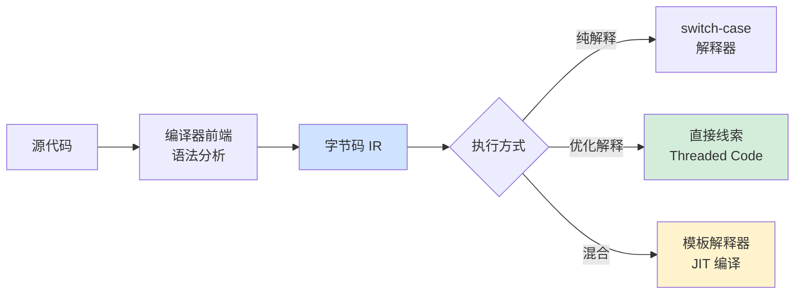
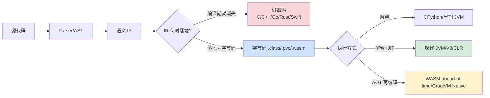
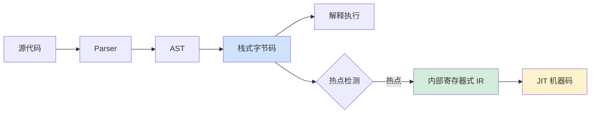
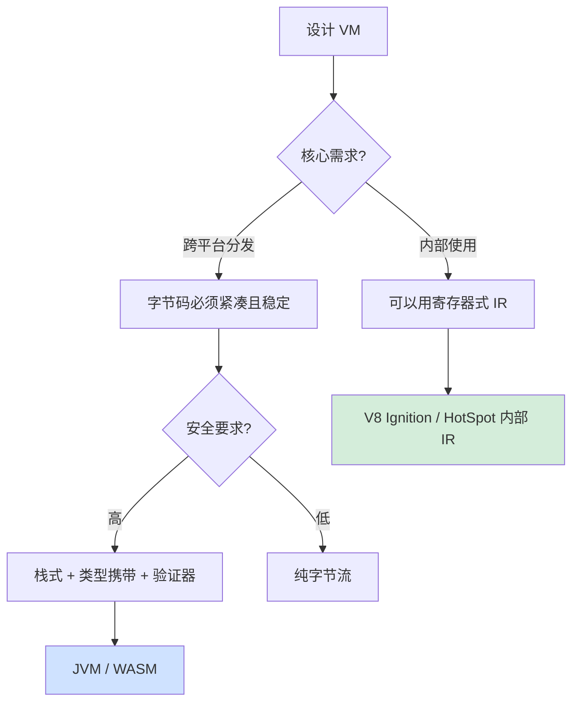

# 2.5 字节码虚拟机执行

> 📍 **本篇位置**：第 2 卷 · 运行时模型 · 第 5 篇
> 🎯 **核心矛盾**：**CPU 只认识机器码（一堆 0 和 1），那 Java、Python、JavaScript、Lua 这些"中间语言"凭什么能跑？为什么同一份字节码能在 x86、ARM、MIPS 上无缝运行？**
> 🧭 **设计灵魂**：虚拟机不是"虚拟出一台真机器"——它是**用软件搭建出的逻辑 CPU**，把"高级语言抽象"和"硬件指令现实"用一层中间表示（IR）解耦，从而获得**跨平台、可优化、可沙箱化**的三重红利
> 🌐 **跨平台覆盖**：JVM (栈式) · CPython (栈式) · V8 Ignition (寄存器式) · Lua VM (寄存器式) · Dalvik (寄存器式) · WebAssembly (栈式 + 验证型)
> 🔗 **延伸阅读**：← [2.4 调用栈与栈帧设计](https://yccoding.com/pages/dc94ae/) · → [2.6 JIT 与运行时优化](https://yccoding.com/pages/f551ab/) · → [2.7 反射元编程核心设计](https://yccoding.com/pages/64ac9b/) · → [2.1 类加载机制核心原理](https://yccoding.com/pages/74953e/)

---

> 我们已经看清"调用栈"如何承载一次函数调用。但还有一个更基础的问题没回答：**CPU 直接读懂的是机器指令，那 Java、Python、JavaScript、Lua 这些"中间语言"凭什么也能跑起来？为什么同一份字节码能在不同平台上无缝运行？**
>
> 答案藏在一个被广泛使用却鲜少被正确理解的概念里——**虚拟机（VM）**。本章从一个跨平台移植的真实案例切入，揭开字节码、解释器、栈式机/寄存器式机的本质。

> 📢 **语言无关声明**
> 本章讨论的是**所有现代语言运行时共通的"中间表示（IR）→ 执行机"模型**——它对以下语言一视同仁：
>
> - **JVM 系**（Java/Kotlin/Scala/Groovy）：bytecode + HotSpot/OpenJ9/Graal
> - **CLR 系**（C#/F#/VB.NET）：CIL/MSIL + RyuJIT
> - **Python**：`.pyc` bytecode + CPython 解释器
> - **JavaScript**：V8 Ignition bytecode + TurboFan
> - **Lua / LuaJIT**：寄存器式 bytecode
> - **WebAssembly**：栈式 + 验证型 bytecode
> - **C / C++ / Rust / Swift**：编译期 IR（GCC GIMPLE / LLVM IR）→ 机器码（**没有运行时字节码**——§3 会正面解释为什么）
> - **Go**：编译期 SSA IR → 机器码（同上，无字节码）
>
> 后面所有"IR / 操作数栈 / 解释器循环 / 验证器"概念，**只要语言运行时存在"源码 → 中间形式 → 执行"的流程**，结论都适用。差异之处会用"📌 跨语言差异"块单独标注。

### 目录介绍
- [00.真实事故引入](#00真实事故引入)
  - [0.1 ARM零成本迁移](#01-arm零成本迁移)
  - [0.2 Python程序员困惑](#02-python程序员困惑)
  - [0.3 灵魂三问解析](#03-灵魂三问解析)
  - [0.4 本篇的探索路径](#04-本篇的探索路径)
  - [0.5 问题价值解析](#05-问题价值解析)
  - [0.6 通用三问](#06-通用三问跨语言读者必须先想清楚的三件事)
- [01.虚拟机本质解析](#01虚拟机本质解析)
  - [1.0 IR 的通用必要性](#10-ir-的通用必要性任何语言都绕不开)
  - [1.1 中间表示需求](#11-中间表示需求)
  - [1.2 字节码vs机器码：本质差异](#12-字节码vs机器码本质差异)
  - [1.3 平台无关性的真正来源](#13-平台无关性的真正来源)
- [02.字节码到底长什么样](#02字节码到底长什么样)
  - [2.0 字节码/IR 的通用四要素](#20-字节码ir-的通用四要素所有运行时都遵守)
  - [2.1 反编译一段加法](#21-反编译一段加法)
  - [2.2 操作数栈变量表](#22-操作数栈变量表)
  - [2.3 解开 `i = i++` 之谜](#23-解开-i--i-之谜)
  - [2.4 字节码的扩展指令](#24-字节码的扩展指令)
  - [2.5 同一段 add 的六语言 IR 对照](#25-同一段-add-的六语言-ir-对照)
- [03.栈式寄存器式VM对比](#03栈式寄存器式vm对比)
  - [3.0 为什么 C/Go/Rust 不选字节码](#30-为什么-cgorust-不选字节码正面回答)
  - [3.1 栈式VM：JVM/CPython/Wasm](#31-栈式vmjvmcpythonwasm)
  - [3.2 寄存器式VM：Lua/Dalvik/V8](#32-寄存器式vmluadalvikv8)
  - [3.3 同一代码：栈式vs寄存器式](#33-同一代码栈式vs寄存器式)
  - [3.4 寄存器式VM论文](#34-寄存器式vm论文)
  - [3.5 现代 VM 的混合策略](#35-现代-vm-的混合策略)
- [04.解释器的进化之路](#04解释器的进化之路)
  - [4.1 朴素 switch-case 解释器](#41-朴素-switch-case-解释器)
  - [4.2 Direct Threading：解释器飞跃](#42-direct-threading解释器飞跃)
  - [4.3 模板解释器解析](#43-模板解释器解析)
  - [4.4 Superinstructions：超指令融合](#44-superinstructions超指令融合)
- [05.字节码验证安全](#05字节码验证安全)
  - [5.1 Java applet影响](#51-java-applet影响)
  - [5.2 字节码验证器：4 阶段检查](#52-字节码验证器4-阶段检查)
  - [5.3 类型安全字节码](#53-类型安全字节码)
  - [5.4 沙箱模型：SecurityManager](#54-沙箱模型securitymanager)
  - [5.5 通用验证模型对照](#55-通用验证模型对照验证不是-java-专利)
- [06.WebAssembly VM思想](#06webassembly-vm思想)
  - [6.1 WASM 为什么选择栈式](#61-wasm-为什么选择栈式)
  - [6.2 WASM 的三道安全防线](#62-wasm-的三道安全防线)
  - [6.3 WASM 的字节码示例](#63-wasm-的字节码示例)
  - [6.4 WASM 已经走到哪里](#64-wasm-已经走到哪里)
- [07.经典陷阱反模式](#07经典陷阱反模式)
  - [7.1 陷阱一：字节码误解](#71-陷阱一字节码误解)
  - [7.2 陷阱二：绕过安全管理](#72-陷阱二绕过安全管理)
  - [7.3 陷阱三：Python pyc版本不兼容](#73-陷阱三python-pyc版本不兼容)
  - [7.4 陷阱四：JVM 类版本不匹配](#74-陷阱四jvm-类版本不匹配)
  - [7.5 陷阱五：反射调用代价](#75-陷阱五反射调用代价)
  - [7.6 陷阱六：字节码体积膨胀](#76-陷阱六字节码体积膨胀)
  - [7.7 陷阱七：Class.forName隐式行为](#77-陷阱七classforname隐式行为)
  - [7.8 跨语言陷阱速查表](#78-跨语言陷阱速查表)
- [08.经典案例串讲](#08经典案例串讲)
  - [8.1 案例背景：边缘函数平台的 5ms 冷启动](#81-案例背景边缘函数平台的-5ms-冷启动)
  - [8.2 加载阶段：字节码与验证器](#82-加载阶段字节码与验证器)
  - [8.3 执行阶段：栈式 VM 解释器的工程权衡](#83-执行阶段栈式-vm-解释器的工程权衡)
  - [8.4 优化阶段：从 Liftoff 到 TurboFan](#84-优化阶段从-liftoff-到-turbofan)
  - [8.5 安全阶段：三道防线如何挡住 10 万次攻击](#85-安全阶段三道防线如何挡住-10-万次攻击)
  - [8.6 案例知识点回归](#86-案例知识点回归)
- [09.一句话总结](#09一句话总结)
  - [9.1 三层认知阶梯](#91-三层认知阶梯)
  - [9.2 字节码设计决策树](#92-字节码设计决策树)
  - [9.3 七字真言总结](#93-七字真言总结)
  - [9.4 与下篇的承接](#94-与下篇的承接)
- [🔗 延伸阅读](#-延伸阅读)

---

## 00.真实事故引入

### 0.1 ARM零成本迁移

我曾参与过一个金融业务从 x86 服务器集群迁到 ARM（AWS Graviton2）的项目。Native C++ 服务的迁移耗时 3 个月——要重新编译、重新跑全量回归测试、修复几处 SIMD 内联汇编的兼容性。

但 Java 服务的迁移**几乎是零成本**：

```
1. JVM 选 ARM 版本（Adoptium ARM64 build）
2. 直接把 jar 包丢上去 → 启动 → 无任何修改正常运行
3. 性能甚至比 x86 略高（Graviton2 单核更强）
```

**奇怪的是**——同样是"高级语言"，为什么 C++ 要重新编译，而 Java 几乎免费迁移？

继续追问下去更有意思。**有一些 jar 包的 class 文件是 2008 年编译的**，已经 14 年没动过。但它们在 2022 年的 ARM64 服务器上**毫不费力地跑起来了**。

```
.class 文件（2008 年生成）
    ↓
JVM (2022 年版，运行在 ARM64 上)
    ↓
正常执行
```

**这是一种"穿越时间和硬件的奇迹"**——什么样的设计能做到这一点？

**同一件事，五种语言交了不同的"作业"**——这才是问题真正的精彩之处：

| 语言 | x86 → ARM 迁移成本 | 根本原因 |
|---|---|---|
| **Java/Kotlin/Scala** | 几乎为零（换 JVM 即可） | `.class` 字节码是平台无关 IR，由 JVM 翻译 |
| **C / C++** | 3 个月（全量重编+回归+SIMD 修复） | 直接编译到目标机器码，**无 IR 层** |
| **Go** | 1 天（`GOARCH=arm64 go build` 重编一次） | 编译期生成机器码，**但编译极快**（SSA IR 只活在编译器内） |
| **Rust** | 1–3 天（重编 + LLVM 后端切换 + unsafe 块审计） | 同 Go，依托 LLVM 跨平台后端 |
| **Python** | 几小时（装解释器、跑测试） | 直接分发源码（`.py`），`.pyc` 只是缓存，跨平台靠解释器 |
| **JavaScript** | 几分钟（CDN 上的 `.js` 不变） | 源码分发，**无字节码格式**（每个引擎内部 IR 互不兼容） |

**这张表才是本章的真正母题**——同样的"跨平台"需求，**至少有四种解法**：

1. **字节码分发**（Java/CLR/WASM）：编译一次，IR 平台无关
2. **机器码重编**（C/C++/Go/Rust）：每个平台编译一次，**无 IR 中间产物对外**
3. **源码分发**（Python/JS/Ruby/Lua）：根本不编译，解释器现场翻
4. **JIT 后字节码 + AOT 二进制混合**（.NET ReadyToRun / Dart）

读完本章你会理解：**这四种解法本质都在回答同一个工程问题——"源码到执行之间，那层 IR 要做多重？放在编译期还是运行期？"**

### 0.2 Python程序员困惑

```python
i = 5
result = i++   # SyntaxError！Python 不支持 i++
```

但同样的代码在 C 和 Java 里：

```c
int i = 5;
int result = i++;  // result = 5, i = 6
```

```java
int i = 5;
int result = i++;  // result = 5, i = 6
```

**更诡异的是 Java 里的这个表达式**：

```java
int i = 5;
i = i++;
System.out.println(i);   // 5！不是 6！
```

但同样意图的 C 代码：

```c
int i = 5;
i = i++;          // 未定义行为（UB）
```

**为什么同样一行 `i = i++`，在 C 里是 UB、在 Java 里是 5、在 Python 里干脆不让你写？**

答案藏在**字节码**里——它定义了"i = i++" 在某种"逻辑机器"上具体执行哪几步操作。读完本章你就能解释这个谜题。

### 0.3 灵魂三问解析

这两个真实场景让我反复追问三个问题：

1. **为什么 .class 文件能跨平台跑？它和 .exe 的本质区别是什么？** —— 字节码到底是个什么东西？为什么它能"跨越硬件鸿沟"？
2. **CPU 只能执行机器码，那 JVM 怎么"执行"字节码？是逐条翻译吗？为什么这样不会慢得无法接受？** —— 解释器的物理本质是什么？
3. **同样是 VM，为什么 JVM 选了"栈式"指令集，而 Lua 和 Android Dalvik 选了"寄存器式"？** —— 这两种架构的本质差异在哪里？

如果你能回答这三个问题，你就理解了**为什么"虚拟机"是过去 50 年最重要的软件抽象之一**。

### 0.4 本篇的探索路径



### 0.5 问题价值解析

我想抛三个**几乎所有面试候选人都答错**的问题：

1. **为什么 JVM 字节码格式 30 年没变（从 1995 到 2024），而 x86 指令集变了无数次？** —— 这是字节码作为"长期 ABI"的设计成功。
2. **为什么 V8 在 2017 年放弃了"全 JIT"路线，回归"解释器（Ignition）+ 优化器（TurboFan）"？** —— 因为纯 JIT 启动慢、内存占用大，对手机不友好。
3. **为什么 WebAssembly 选择栈式而不是寄存器式？** —— 这是一个反潮流的决定，背后是"代码紧凑性 + 可验证性"的极致追求。

读完本章你会懂：**虚拟机不是"模拟硬件"，它是软件工程师能创造的最高级的"抽象工具"**。

### 0.6 通用三问（跨语言读者必须先想清楚的三件事）

无论你写 Java/C++/Go/Rust/Python/JS，回到最底层，所有语言运行时都在回答同一组问题：

**通用三问**：

1. **源码 → 执行，中间到底要不要 IR（中间表示）？**
   - 要：JVM bytecode、CIL、Python bytecode、V8 bytecode、WASM、LLVM IR、Go SSA、Rust MIR/HIR
   - 不要：早期 BASIC 解释器、awk —— 直接遍历 AST 执行
   - 现代大型语言**一律有 IR**，差别只是"IR 是分发给运行时，还是只活在编译器内部"
2. **IR 是落地成字节码（运行时翻译），还是落地成机器码（编译期翻译）？**
   - 字节码路线：跨平台、可验证、能 JIT，但启动慢（JVM/CLR/V8/Python）
   - 机器码路线：启动即满血，但每个平台要重编，且少了运行时优化机会（C/C++/Go/Rust）
   - 混合路线：CIL + ReadyToRun、Dart AOT/JIT 双模式、GraalVM Native Image
3. **IR 跨平台靠什么？**
   - 靠**统一规范**（JVM Spec、ECMA-335、WASM Spec）→ 任何实现都能加载
   - 靠**编译器后端**（LLVM 支持 15+ 架构）→ 同一份源码生成不同机器码
   - 靠**源码分发 + 解释器跨平台**（Python/Lua/JS）

**你只要带着这三问读完本章，所有 VM 设计决策都会变成一道道判断题**——比如"WASM 为什么选栈式"就是在第 2 题里选了"字节码 + 验证友好"那条路。

---

## 01.虚拟机本质解析

### 1.0 IR 的通用必要性（任何语言都绕不开）

在切入 JVM 之前，先把一个**所有语言都成立**的结论说在前头：**只要语言不是"逐字符解释源码"，就必然有某种中间表示（IR）**。区别只在**这层 IR 长什么样、什么时候消失**：

| 语言/运行时 | 主要 IR 形式 | 生命周期 | 谁能看到它 |
|---|---|---|---|
| Java/Kotlin | JVM bytecode（`.class`） | 持久化、分发 | 程序员、JIT、运维 |
| C#/F# | CIL/MSIL（`.dll`/`.exe`） | 持久化、分发 | 程序员、RyuJIT |
| Python | bytecode（`.pyc`，code object） | 进程内 + 缓存 | 通过 `dis` 看到 |
| JavaScript | V8 Ignition bytecode | 仅进程内（不可见） | 仅引擎内部 |
| WebAssembly | WASM bytecode（`.wasm`） | 持久化、分发 | 程序员、所有运行时 |
| C / C++ | LLVM IR / GCC GIMPLE | **仅编译期**（编译完即销毁） | `clang -S -emit-llvm` 才能看到 |
| Go | Go SSA | **仅编译期** | `go build -gcflags="-S"` |
| Rust | HIR → MIR → LLVM IR（三层！） | **仅编译期** | `cargo rustc -- --emit=mir` |
| Swift | SIL → LLVM IR（两层） | **仅编译期** | `swiftc -emit-sil` |

**两条根本路线一图看清**：



**核心洞察**：

1. **"有没有 IR" 不是问题——是"IR 在编译期消失，还是在运行期消失"** 才是分水岭
2. **C/Go/Rust 程序员说"我没用字节码"——你错了**：你的 IR 只是没被分发出来而已，编译器内部一直在跑
3. **字节码 = 被分发出来、被持久化、被多方读懂的 IR**——它是 IR 的一种"对外发布形态"

后面章节讨论的所有"字节码 vs 机器码"问题，其实都是在问——**这层 IR 是否值得对外发布**。

📌 **跨语言差异**：本章后续 §2 ~ §6 主要讨论**已经把 IR 落地成字节码**的运行时（JVM/Python/V8/WASM），因为它们最能展示设计取舍。但 §3 章首会专门讲——**C/Go/Rust 为什么"反其道而行"放弃字节码这条路**。

### 1.1 中间表示需求

回到最根本的问题——**编译器为什么不直接把高级语言翻译成机器码？**

事实上，**早期编译器就是这么做的**。1950 年代的 FORTRAN 编译器直接生成 IBM 704 的机器码。1970 年代的 C 编译器直接生成 x86/PDP-11 机器码。

**问题暴露在 1990 年代**：

```
软件公司有一个 100 万行的 C 程序
要支持 5 种 CPU 架构（x86, SPARC, MIPS, PowerPC, Alpha）
要支持 4 种操作系统（Windows, Linux, Solaris, macOS）

→ 5 × 4 = 20 个二进制版本
→ 每个 bug 修复要在 20 个版本上重新编译、测试、分发
→ 工程地狱
```

**Java 的革命性方案**（1995）：

```
源代码 (.java)
    ↓ 编译一次
中间表示 (.class)
    ↓ 任何平台的 JVM 都能执行
跨平台运行（Write Once, Run Anywhere）
```

**核心思想**：把"编译期"分成两段——

```
源代码 → [前端编译] → 字节码 → [VM 执行] → 实际行为
        编译一次              在每台机器上重新解释/JIT
```

**这个设计有三个深远的后果**：

1. **跨平台**：字节码是平台无关的，一次编译到处运行
2. **跨时间**：字节码是稳定的"档案格式"，2008 年的 .class 在 2024 年仍能跑
3. **可优化**：VM 在执行时拥有运行时信息（类型分布、热点路径），能比 AOT 编译器做得更好（详见下一篇 JIT）

**这就是 §0.1 那个"穿越时间和硬件"奇迹的根源**——字节码是 30 年稳定的 ABI。

### 1.2 字节码vs机器码：本质差异

很多人混淆这两个概念。它们在**形式上**都是一串字节，但本质截然不同：

| 维度 | 机器码 | 字节码 |
|---|---|---|
| **谁执行** | CPU 硬件 | 软件 VM |
| **平台依赖** | 强绑定（x86 ≠ ARM）| 平台无关 |
| **指令数** | 几百到上千条（x86-64 有 ~3500 条）| 几十到一百多条（JVM 有 202 条）|
| **指令编码** | 变长，复杂前缀 | 通常 1-3 字节，规整 |
| **元数据** | 几乎没有（裸指令）| 有类型信息、常量池、调试信息 |
| **可验证性** | 极难（任何字节序列都能"执行"）| 严格（VM 加载时验证类型安全）|
| **稳定性** | 几年一次大版本（SSE→AVX→AVX-512）| 30 年基本不变 |

**JVM 字节码的关键设计**——它**保留了大量类型信息**：

```
0x60 (iadd)     // 整型加法
0x61 (ladd)     // 长整型加法
0x62 (fadd)     // 浮点加法
0x63 (dadd)     // 双精度加法
0x96 (fcmpg)    // 浮点比较
```

**对比 x86 机器码**：CPU 不知道操作数是 int 还是 float，全靠程序员/编译器选对指令。**字节码携带类型 → 可以验证、可以优化、可以反射**。

### 1.3 平台无关性的真正来源

很多人以为"字节码 = 平台无关"。但**字节码本身只是一串字节**——它能跨平台，是因为**所有 JVM 实现都遵守同一套规范**。

```
JVM Spec (Oracle JSR-924)
    │
    ├── 字节码格式（.class 文件结构）
    ├── 每条指令的精确语义
    ├── 内存模型（JMM）
    ├── 异常处理流程
    └── 类加载机制
    │
    ├── HotSpot JVM (Oracle, Linux/macOS/Windows x86 + ARM)
    ├── OpenJ9 (IBM, IBM Power + 通用平台)
    ├── GraalVM (Oracle, 多语言)
    ├── Android ART (基于 JVM 但魔改)
    └── Excelsior JET (AOT 编译)
```

**这是一个"标准胜于实现"的故事**——只要 100 个 JVM 实现都遵守同一规范，字节码就能在所有实现上跑。

**反例**：JavaScript 没有标准字节码，每个引擎（V8, SpiderMonkey, JavaScriptCore）有自己的内部 IR，互不兼容。所以"JS 跨平台"靠的是**源代码分发**，不是字节码。

---

## 02.字节码到底长什么样

来一段最简单的 Java 代码，看看它编译后是什么样：

### 2.0 字节码/IR 的通用四要素（所有运行时都遵守）

打开 JVM bytecode、CIL、Python bytecode、WASM、V8 Ignition bytecode 任何一份"反编译输出"，会发现**结构惊人地相似**——都由四个基本要素构成：

| 要素 | 作用 | JVM 怎么做 | Python 怎么做 | V8 怎么做 | WASM 怎么做 | LLVM IR 怎么做 |
|---|---|---|---|---|---|---|
| **① 操作码（Opcode）** | "做什么" | `iadd`/`invokevirtual`（1 byte） | `BINARY_ADD`/`CALL_FUNCTION`（1 byte） | `Add`/`CallProperty`（1 byte） | `i32.add`/`call`（1 byte） | `add nsw i32`（文本/二进制 BC） |
| **② 操作数引用** | "对谁做" | 操作数栈 + LVT 索引 | 栈 + co_varnames 索引 | 寄存器号 + 累加器 | 操作数栈 + local 索引 | SSA 虚拟寄存器（`%1`/`%2`） |
| **③ 类型信息** | "什么类型" | 内嵌于 opcode（`iadd`/`ladd`/`fadd`） | 全部动态（运行时查 type） | 隐藏类（hidden class）反馈 | 静态类型（i32/i64/f32/f64） | 类型显式标注 |
| **④ 元数据** | "上下文" | 常量池 + 异常表 + LineNumberTable | co_consts + co_lnotab | feedback vector | 类型段 + 导入导出 | metadata !{} 节点 |

**为什么所有运行时都长这样？**

```
任何"IR 执行器"都要回答三个问题：
  1. 这条指令要做什么操作？     → 操作码
  2. 操作数从哪儿来、放哪儿去？  → 操作数引用方式
  3. 怎么解释这些字节？         → 类型信息 + 元数据
```

**这是 30 年来 IR 设计收敛出的"事实标准"**——你将来要设计一门新语言/DSL，照着这四点抄就能搭出一个能跑的字节码格式。

接下来我们用 Java 字节码做"主样本"详细拆解——但脑子里始终记住：**这四个要素在 Python/V8/WASM 里有完全对应物**。§2.4 后会给出"同一段 add 的五语言 IR 对照"。

### 2.1 反编译一段加法

```java
public class Demo {
    public static int add(int a, int b) {
        return a + b;
    }
}
```

编译后用 `javap -v Demo.class` 查看：

```
public static int add(int, int);
    Code:
       0: iload_0       // 把第 0 个局部变量 (a) 推入栈
       1: iload_1       // 把第 1 个局部变量 (b) 推入栈
       2: iadd          // 弹出两个栈顶元素，相加，结果压栈
       3: ireturn       // 弹出栈顶作为返回值
```

**核心观察**：

1. **没有寄存器**！所有运算都在"操作数栈"上做。
2. **指令极简**：每条只做一件事（加载、相加、返回）。
3. **指令编号**：`0, 1, 2, 3` 是字节偏移——`iload_0` 是 1 字节、`iadd` 是 1 字节。

完整字节序列：`1A 1B 60 AC` —— **4 个字节就是一个完整的 add 函数**。

### 2.2 操作数栈变量表

JVM 字节码是基于三个核心区域工作的：

```
┌──────────────────────────────────────┐
│  常量池（Constant Pool）              │
│  ├── 字符串字面量                     │
│  ├── 类名 / 方法名 / 字段名           │
│  └── 数值常量                         │
└──────────────────────────────────────┘
            ↑
  ldc / getstatic 指令引用
            ↓
┌──────────────────────────────────────┐
│  栈帧（Frame）                        │
│  ┌──────────────────────────────┐   │
│  │ 局部变量表（LVT）              │   │
│  │  [0]: this 或第一个参数        │   │
│  │  [1]: 第二个参数              │   │
│  │  [2]: 局部变量 x              │   │
│  │  ...                          │   │
│  └──────────────────────────────┘   │
│  ┌──────────────────────────────┐   │
│  │ 操作数栈（Operand Stack）     │   │
│  │  ↓ push                       │   │
│  │  [...]                        │   │
│  │  [val2] ← 栈顶                │   │
│  │  [val1]                       │   │
│  └──────────────────────────────┘   │
└──────────────────────────────────────┘
```

**协作方式**（以 `int c = a + b` 为例）：

```
iload_0     → 从 LVT[0] 加载 a 到栈顶 → 操作数栈: [a]
iload_1     → 从 LVT[1] 加载 b 到栈顶 → 操作数栈: [a, b]
iadd        → 弹出 a 和 b，相加，压栈 → 操作数栈: [a+b]
istore_2    → 弹出栈顶到 LVT[2] (c)   → 操作数栈: []
```

**这个设计的精妙之处**：**完全不依赖具体硬件有几个寄存器**——栈式 VM 在所有平台上行为完全一致。

### 2.3 解开 `i = i++` 之谜

回到 §0.2 那个 Java 谜题。`i = i++` 编译后的字节码：

```
int i = 5;
i = i++;
```

字节码：

```
0: iconst_5         // 推 5
1: istore_1         // 存到 LVT[1] (i = 5)

2: iload_1          // 推 i（值 = 5）          栈: [5]
3: iinc 1, 1        // i++（直接修改 LVT[1] = 6，不影响栈）
6: istore_1         // 弹栈顶（5）存回 LVT[1]，覆盖 6
```

**关键步骤**：

1. `iload_1` 把当前 i 的值（5）推到栈顶
2. `iinc` 直接对 LVT 加 1，**不动栈**——此时 LVT[1] = 6，栈顶仍是 5
3. `istore_1` 把栈顶（5）存回 LVT[1] —— **覆盖了刚才的 6**

**最终 i = 5**——这个反直觉的结果，**是字节码语义精确定义的**。

**对比 C**：C 标准没有规定这种操作的求值顺序，所以这是 UB。
**对比 Python**：Python 直接禁止 `i++` 语法，根本没这个坑。

**这个例子展示了字节码作为"精确语义规范"的价值**——同样的语法，由字节码决定行为。

### 2.4 字节码的扩展指令

JVM 字节码不止 200 条，还有专门处理对象、方法调用、异常的指令：

| 类别 | 代表指令 | 作用 |
|---|---|---|
| **加载/存储** | iload, istore, aload, astore | 局部变量与栈交换 |
| **算术** | iadd, isub, imul, idiv | 数值运算 |
| **类型转换** | i2l, i2f, l2d | 类型间转换 |
| **对象操作** | new, getfield, putfield | 创建/访问对象 |
| **方法调用** | invokestatic, invokevirtual, invokeinterface, invokespecial, **invokedynamic** | 五种调用方式 |
| **控制流** | if_icmpeq, goto, tableswitch | 跳转 |
| **异常** | athrow | 抛出异常 |
| **同步** | monitorenter, monitorexit | synchronized |

**特别提一下 `invokedynamic`**（Java 7 引入）——它是 JVM 字节码 30 年来最重要的扩展，为 Lambda 表达式、动态语言（Groovy/Kotlin/Scala）提供了高效支持。**它打破了"字节码完全静态"的限制**，允许在运行时确定调用目标。

### 2.5 同一段 `add` 的六语言 IR 对照

终于到本章最有冲击力的一张表——同一个函数 `int add(int a, int b) { return a + b; }` 在六种 IR 里长什么样：

**① Java JVM bytecode**（栈式 + 静态类型）

```
iload_0       ; 推 a
iload_1       ; 推 b
iadd          ; 弹两个、加、压栈
ireturn       ; 弹栈返回
```

**② CPython bytecode**（栈式 + 动态类型）—— `dis.dis(add)` 输出：

```
LOAD_FAST     0 (a)        ; 推 a
LOAD_FAST     1 (b)        ; 推 b
BINARY_OP     0 (+)        ; 弹两个、动态查 type → 调 __add__
RETURN_VALUE                ; 弹栈返回
```

**③ V8 Ignition bytecode**（寄存器式 + 反馈槽）—— `--print-bytecode` 输出：

```
Ldar a0                    ; 累加器 ← a
Add  a1, [0]               ; 累加器 += b，feedback slot 0 收集类型
Return                     ; 返回累加器
```

注意 V8 多出 **feedback slot `[0]`**——它记录"过去这里加的是 Smi 还是 HeapNumber"，给 TurboFan 做去虚化用。

**④ WebAssembly bytecode**（栈式 + 显式类型）—— `wat` 文本：

```wasm
(func $add (param $a i32) (param $b i32) (result i32)
    local.get $a        ;; 0x20 0x00
    local.get $b        ;; 0x20 0x01
    i32.add             ;; 0x6A
)
```

**⑤ Go SSA**（寄存器式 + 显式类型）—— `go build -gcflags="-S"`：

```
v1 = ParamI32 <int> {a}
v2 = ParamI32 <int> {b}
v3 = Add64 <int> v1 v2
Ret v3
```

**⑥ LLVM IR**（C/C++/Rust/Swift 公用，SSA + 显式类型）—— `clang -S -emit-llvm`：

```llvm
define i32 @add(i32 %a, i32 %b) {
    %1 = add nsw i32 %a, %b
    ret i32 %1
}
```

**对照表**：

| 维度 | JVM | CPython | V8 Ignition | WASM | Go SSA | LLVM IR |
|---|---|---|---|---|---|---|
| 风格 | 栈式 | 栈式 | 寄存器式 | 栈式 | SSA 寄存器式 | SSA 寄存器式 |
| 类型 | 静态（opcode 编码） | 动态（运行时查） | 动态 + 反馈 | 静态（参数声明） | 静态 | 静态 |
| 指令条数 | 4 | 4 | 3 | 3 | 4 | 2 |
| 是否分发 | ✅ `.class` | ✅ `.pyc`（仅缓存） | ❌ 引擎内部 | ✅ `.wasm` | ❌ 编译期 | ❌ 编译期 |
| 验证机制 | JVM Verifier | 无 | 无 | WASM Validator | 编译期类型检查 | LLVM Verifier |

**深层结论**：

1. **栈式 vs 寄存器式只是表层差异**——本质都在执行 `LOAD a → LOAD b → OP → STORE`
2. **真正分裂的是"类型"**——静态类型语言把类型固化进 opcode（`iadd` vs `dadd`），动态语言要在运行时查
3. **真正决定优化潜力的是"反馈机制"**——V8 的 feedback slot、HotSpot 的 type profile，都是给 JIT 当眼睛用的

📌 **给 C/C++/Go/Rust 读者的特别提示**：你们的 IR（LLVM IR / Go SSA）和 JVM bytecode **在语义上是同构的**——只是你们的 IR 不分发、不持久化、不让运行时再优化。**理解了 JVM 字节码，你才能真正读懂 `clang -S -emit-llvm` 的输出**。

---

## 03.栈式寄存器式VM对比

§0.3 第三问。这是 VM 设计最重要的分野。

### 3.0 "为什么 C/Go/Rust 不选字节码"——正面回答

进入栈式 vs 寄存器式的讨论前，必须先解答 C/Go/Rust 程序员心里的疑问——"我们这套语言根本没有字节码 VM，是不是设计落后？"

**恰恰相反——是一次自觉的选择**：

| 决策维度 | 字节码 VM 路线（Java/JS/Python） | 直接机器码路线（C/Go/Rust） |
|---|---|---|
| **跨平台分发** | ✅ 一份 IR 跑所有平台 | ❌ 每个平台编译一次 |
| **启动时间** | ❌ 解释器预热慢 | ✅ 启动即满血 |
| **峰值性能** | ✅ JIT 可利用运行时信息 | 🟡 AOT 只有 PGO 这一招 |
| **二进制大小** | 🟡 中等（依赖运行时） | 🟢 静态链接通常更小 |
| **运行时灵活性** | ✅ 反射/动态加载/热替换 | ❌ 二进制锁死 |
| **逆向工程难度** | ❌ 字节码易反编译 | ✅ 机器码相对难读 |
| **运行时安全** | ✅ 字节码可验证（沙箱） | ❌ 没有运行时验证层 |

**三套语言的不同侧重**：

```
C / C++：       极致性能、贴硬件、零运行时 → 不需要 IR 层带来的灵活性，不接受 IR 带来的开销
Go：            云原生、快启动、单文件部署 → AOT 直接产二进制，但内部 SSA 形态保留了字节码的优化能力
Rust：          安全 + 性能 + 系统级 → 选 LLVM 作为后端，借力但不分发 IR
反观 Java/JS：  跨平台分发 + 长期运行 + 反射 → 必须把 IR 持久化、可执行、可优化
```

**所以"字节码 vs 机器码"不是先进/落后之争——而是"我把 IR 这层灵活性留给运行时，还是吃在编译期？"的取舍**。

📌 **一句话总结**：
- **Java/JS/Python/WASM**：IR 走出编译器、变成发行物、由 VM 二次处理 → 灵活性赢
- **C/C++/Go/Rust**：IR 死在编译器里、只发布机器码 → 性能与启动赢

接下来 §3.1–§3.5 讨论的"栈式 vs 寄存器式"，**只在"字节码 VM"那一侧的语言里成立**——但里面学到的"IR 设计权衡"思路，反过来也适用于阅读 LLVM IR / Go SSA。

### 3.1 栈式VM：JVM/CPython/Wasm

**特征**：所有运算在"操作数栈"上完成，指令不指定操作数（隐式从栈顶取）。

```
add a, b 在栈式 VM 上需要 3 条指令：
    push a
    push b
    add        ← 隐式从栈顶取两个，结果压回
```

**优点**：

```
1. 指令短：每条指令只需要 1 字节操作码（不需要操作数寻址）
2. 简单：不需要寄存器分配算法
3. 跨平台稳定：栈数据结构不依赖硬件寄存器数量
```

**缺点**：

```
1. 指令多：同样运算要更多条指令（push, push, add 三步）
2. 内存压力大：栈在内存中（除非 JIT 后被映射到寄存器）
3. 指令依赖串行：每条指令都依赖栈顶状态，难以并行
```

### 3.2 寄存器式VM：Lua/Dalvik/V8

**特征**：模拟一个"寄存器组"，指令显式指定操作数。

```
Lua 的 add 只需 1 条指令：
    ADD R3, R1, R2    ← R3 = R1 + R2
```

**优点**：

```
1. 指令少：一条指令完成完整运算
2. 接近真实 CPU：JIT 转机器码更直接
3. 易于优化：寄存器分配可以利用真实 CPU 寄存器
```

**缺点**：

```
1. 指令长：每条要编码源/目标寄存器（通常 4 字节）
2. 寄存器溢出处理复杂
3. 实现复杂度高
```

### 3.3 同一代码：栈式vs寄存器式

以 `c = a + b * 2` 为例：

**栈式（JVM）**：

```
iload_1        // push a
iload_2        // push b
iconst_2       // push 2
imul           // pop b, 2; push b*2
iadd           // pop a, b*2; push a+b*2
istore_3       // pop, store to c
        总计：6 条指令
```

**寄存器式（Lua）**：

```
MUL R3, R1, K(2)    // R3 = b * 2
ADD R4, R0, R3      // R4 = a + R3
        总计：2 条指令
```

**指令数量对比**（一段典型函数）：

| VM | 指令数 | 字节数 |
|---|---|---|
| JVM (栈式) | 12 | 14 字节 |
| Lua (寄存器式) | 5 | 20 字节 |

**有趣的对比**：寄存器式 VM **指令更少但字节更多**——这是因为每条寄存器指令要编码操作数。

### 3.4 寄存器式VM论文

2005 年 Yunhe Shi 等人发表了一篇名为 *Virtual Machine Showdown: Stack Versus Registers* 的论文，做了系统对比：

**结论**：

```
解释执行速度：寄存器式 VM 比栈式 VM 快 32% （指令少 → 解释器循环次数少）
代码大小：    寄存器式比栈式大 25%      （每条指令更长）
```

**这就是为什么**：

```
JVM 是栈式：1995 年设计时优先考虑"代码紧凑"（网络下载 applet 时小字节码省带宽）
Dalvik 是寄存器式：Google 2008 年为安卓重新设计——手机 CPU 弱，需要更快解释执行
Lua 是寄存器式：1993 年 Roberto 选择寄存器式以提升解释器速度
WebAssembly 是栈式：2017 年再次回归栈式——为什么？看下文 §06
```

### 3.5 现代 VM 的混合策略



**V8 (Ignition + TurboFan)** 是这种混合策略的典范：
- **Ignition** 是寄存器式字节码解释器（2017 年从纯 JIT 路线回归解释器，节省内存）
- **TurboFan** 把热点函数 JIT 编译为机器码

**HotSpot JVM** 类似：
- 字节码解释执行（栈式）
- 内部 IR 是 SSA 形式（接近寄存器式），最终编译为机器码

**结论**：**用栈式作为分发格式（紧凑、稳定），用寄存器式作为内部优化形式（高效）**——这是工业界达成的共识。

---

## 04.解释器的进化之路

§0.3 第二问。解释器是 VM 的"心脏"——它决定了字节码能跑多快。

### 4.1 朴素 switch-case 解释器

最直观的实现：

```c
void interpret(uint8_t* code, int len) {
    int pc = 0;
    while (pc < len) {
        uint8_t opcode = code[pc++];
        switch (opcode) {
            case OP_PUSH:
                stack[++sp] = code[pc++];
                break;
            case OP_ADD:
                stack[sp-1] += stack[sp];
                sp--;
                break;
            case OP_RETURN:
                return;
            // ... 其他 100 多条指令
        }
    }
}
```

**性能瓶颈**：

```
每条字节码执行的实际成本：
  1. fetch 操作码 (1 内存读)
  2. switch 跳转表查询 (1 间接跳转)
  3. 执行指令 (1-3 条机器指令)
  4. 跳回循环顶部 (1 条 jmp)
  
→ 每条字节码摊销 ~10 条机器指令
→ 解释器比 native 慢 10 倍
```

**核心痛点**：**switch 中的间接跳转 → CPU 分支预测失效率高**。

### 4.2 Direct Threading：解释器飞跃

GCC 有一个非标准扩展叫 **labels-as-values**（`&&label`），让解释器有了革命性优化：

```c
void interpret(uint8_t* code) {
    static void* dispatch_table[] = {
        &&do_push,
        &&do_add,
        &&do_return,
        // ...
    };
    
    #define DISPATCH() goto *dispatch_table[*pc++]
    
    DISPATCH();
    
    do_push:
        stack[++sp] = *pc++;
        DISPATCH();    // 直接跳到下一条指令的处理器
    
    do_add:
        stack[sp-1] += stack[sp];
        sp--;
        DISPATCH();
    
    do_return:
        return;
}
```

**性能提升原理**：

```
朴素 switch：所有 case 共用一个间接跳转 → CPU 只能预测一个目标
direct threading：每个指令处理器有自己的 DISPATCH → CPU 能为每个处理器单独学习预测

→ 分支预测命中率从 50% 提升到 85%
→ 解释器速度提升 30-50%
```

**这是 1980 年代 Forth 语言提出、1995 年被 OCaml 推广、2003 年被 Python 引入的优化**。CPython 3.11 全面采用 computed goto 后性能提升 25%。

### 4.3 模板解释器解析

更激进的优化：**为每条字节码预生成一段机器码片段，运行时拼接**。

```
字节码序列：iload_0, iload_1, iadd, ireturn

模板表：
  iload_0  → "mov eax, [ebp-4]"
  iload_1  → "mov edx, [ebp-8]"
  iadd     → "add eax, edx"
  ireturn  → "ret"

拼接后：
  mov eax, [ebp-4]
  mov edx, [ebp-8]
  add eax, edx
  ret
  
直接 CPU 执行 → 速度接近原生 C
```

**这就是 HotSpot JVM 的"模板解释器"**——它启动后第一阶段不是 JIT，而是模板拼接。

**对比纯 switch 解释器**：

| 实现 | 相对性能 |
|---|---|
| switch-case 解释器 | 1× |
| direct threading 解释器 | 1.5× |
| 模板解释器 | 4-5× |
| C1 JIT | 8× |
| C2 JIT | 12× |
| Native C++ | 14× |

**HotSpot 启动后**：模板解释器立刻可用 → C1 编译热点 → C2 进一步优化。这是一个分层加速过程，下一篇 [2.6 JIT 与运行时优化](https://yccoding.com/pages/f551ab/) 会深入。

### 4.4 Superinstructions：超指令融合

观察真实程序的字节码序列，发现**某些组合极其频繁**：

```
iload, iload, iadd 出现 1000 万次
iload, iconst_1, iadd 出现 800 万次
```

**优化**：把它们合并成一条"超指令"：

```
原始：iload + iload + iadd  → 3 条指令派发开销
超指令：iload_iload_iadd     → 1 条指令派发，等价语义
```

**JIT 编译器和某些解释器**会自动做这件事。Lua 内部就有大量 specialized 指令（`ADDII`, `ADDIK` 等专门处理"两个寄存器加"或"寄存器加常量"）。

---

## 05.字节码验证安全

字节码格式带来的另一个重大红利——**可验证性**。

### 5.1 Java applet影响

Java 1995 年推出时一个革命性卖点：**网页里的 applet 可以从陌生网站下载并运行，但不会破坏你的电脑**。

```
1996 年的 ActiveX（Microsoft）：
  下载 .exe 二进制 → 直接 CPU 执行
  恶意代码可以删除文件、读取密码、控制摄像头
  唯一防御是"用户授权"（用户基本不看就点确定）

1996 年的 Java applet：
  下载 .class 字节码 → JVM 验证 + 沙箱执行
  字节码无法越过 JVM 边界做任何事
```

**这种"沙箱安全"的根基是字节码验证**。

### 5.2 字节码验证器：4 阶段检查

JVM 加载每个 .class 文件时，**字节码验证器会做 4 阶段严格检查**：

**阶段 1：文件格式验证**

```
- 魔数是否为 0xCAFEBABE
- 主次版本号是否支持
- 常量池索引是否合法
- 文件结构是否完整
```

**阶段 2：元数据验证**

```
- 类是否有父类（Object 除外）
- 父类不是 final
- 非抽象类实现了所有抽象方法
- 字段、方法签名合法
```

**阶段 3：字节码验证（最复杂）**

```
- 操作数栈不会下溢/上溢
- 局部变量类型一致（如 int 不能赋给 long 槽）
- 跳转目标在合法范围内
- final 变量只赋值一次
- 异常处理表的范围合法
```

**阶段 4：符号引用验证**

```
- 引用的类、方法、字段确实存在
- 访问权限合法（不能访问 private 方法）
```

**只有通过全部 4 阶段，字节码才能被加载和执行**。这就是为什么 JVM 能"信任"任何来源的字节码——验证器保证它在被执行前就是"安全的"。

### 5.3 类型安全字节码

Java 6 引入了一个重要优化——**StackMap Table**：

```
原本：验证器要"模拟执行"字节码，跟踪每个位置的栈类型 → O(N²) 复杂度
优化：编译器在 .class 文件中预先标记"在跳转目标处栈应该是什么类型"
      验证器只需检查：实际栈类型 == 标记类型 → O(N) 复杂度
```

**这把字节码加载速度提升了 5-10 倍**——大型应用启动时间显著减少。

### 5.4 沙箱模型：SecurityManager

字节码验证只保证"代码本身合法"。还要限制"代码能做什么"——这是 SecurityManager 的工作：

```java
// 加载的不可信字节码尝试做：
File f = new File("/etc/passwd");
f.delete();

// 如果当前 SecurityManager 拒绝该操作：
// → SecurityException 被抛出
```

**applet 的沙箱权限**（默认）：

```
✗ 不能读写本地文件
✗ 不能创建网络连接（除了来源服务器）
✗ 不能调用 native 方法
✗ 不能访问系统属性（如用户名）
✗ 不能启动新进程
```

**这套机制保证了"不信任的字节码"也能安全运行**。可惜 SecurityManager 在 Java 17 被标记为 deprecated（理由：实际部署中很少使用、维护负担大），Java 21 移除——这是 Java 历史的一个争议点。

### 5.5 通用验证模型对照（验证不是 Java 专利）

很多人以为"字节码验证"只是 Java 的特色——其实**它是所有"接收不信任 IR"的运行时通用机制**。下面把工业界四套主流验证器并排对照：

| 验证器 | 所属运行时 | 验证内容 | 失败行为 | 性能影响 |
|---|---|---|---|---|
| **JVM Verifier** | HotSpot/OpenJ9 | 4 阶段：格式/元数据/字节码/符号 | `VerifyError` | 5-10ms/class（StackMap 后） |
| **WASM Validator** | V8/wasmtime/wasmer | 单遍栈类型推导 + 控制流校验 | `WebAssembly.CompileError` | <1ms/module（设计目标） |
| **.NET PEVerify / CIL Verifier** | CLR/Mono | 类型安全 + 控制流 + 异常块嵌套 | `VerificationException` | 类似 JVM |
| **eBPF Verifier** | Linux 内核 | 路径全枚举 + 范围分析 + 死循环检测 | 加载拒绝（`bpf()` returns EINVAL） | 几 ms–几百 ms（视复杂度） |
| **Rust borrow checker** | rustc 编译期 | 借用/生命周期 + 类型安全 | 编译失败 | 编译期开销 |
| **Go vet / unsafe 检查** | go tool | 静态检查（弱验证） | 警告 | 编译期 |

**统一抽象**——所有验证器都在干一件事：

```
输入：一段不可信的 IR
任务：在执行前用"抽象解释"证明它满足若干安全性质（不越界、不越类型、不无限循环）
输出：accept / reject
```

**为什么 eBPF 选择"路径全枚举"**？因为 eBPF 跑在**内核态**——任何 bug 都可能 panic 内核，所以选择最严格的验证（甚至限制循环次数为 100 万）。

**为什么 WASM 选择"单遍栈类型推导"**？因为 WASM 在浏览器**毫秒级加载**——必须做得快。

**为什么 Rust 把验证放在编译期**？因为 Rust 不分发 IR——所有检查不必每次加载都做一遍。

**深层洞察**：**验证强度 = 该 IR 的运行环境危险等级 × 加载频率**。eBPF 跑内核态 + 加载少 → 重验证；WASM 跑浏览器 + 频繁加载 → 轻量验证；Rust 不发 IR → 一次性编译期验证；C/C++ → **完全没有运行时验证**（这就是漏洞频发的根源）。

📌 **跨语言启示**：如果你将来要设计一个**接收用户代码**的系统（插件、Serverless、智能合约、DSL），**第一件事不是选语言，是设计验证模型**——这决定了系统的安全上限。

---

## 06.WebAssembly VM思想

§0.5 第三题。**WebAssembly（WASM）是 2017 年推出的"网页字节码"**，它的设计选择给 VM 设计带来了新的反思。

### 6.1 WASM 为什么选择栈式

到 2017 年，主流共识是"寄存器式 VM 比栈式快"。但 WASM **逆潮流选择了栈式**。三大理由：

**理由 1：代码紧凑**

```
WASM 通过 HTTP 下载，每字节都重要
栈式字节码比寄存器式小 25%（实测）
对于网页加载速度，几百 KB 的差异很关键
```

**理由 2：易于验证**

```
栈式 VM 的指令依赖栈顶 → 类型检查只需"虚拟执行"一遍栈
寄存器式有任意寄存器寻址 → 类型检查复杂 10 倍
WASM 要求 < 1ms 加载验证 → 必须用栈式
```

**理由 3：编译目标友好**

```
WASM 不直接执行——它会被编译成宿主 CPU 的机器码
现代编译器（V8 Liftoff、wasmtime）能轻松把"栈式"再转换成"寄存器式 IR"
所以"栈式分发 + 内部转寄存器" 是最优策略
```

### 6.2 WASM 的三道安全防线

WebAssembly 是网页里下载的代码，必须比 JVM 更严格：

**防线 1：内存隔离**

```
WASM 模块只能访问"线性内存"——一段连续的字节数组
不能直接访问宿主进程的任何其他内存
就算用 malloc 也是在自己的"沙箱内存池"里
```

**防线 2：控制流完整性**

```
所有间接调用（call_indirect）必须通过"函数表"
函数表的索引必须经过类型检查
→ 不可能跳到任意地址执行恶意代码
```

**防线 3：栈隔离**

```
WASM 的"shadow stack"和宿主栈完全分开
即使 WASM 代码缓冲区溢出，也只是覆盖自己的栈
不会破坏 JS 引擎的栈
```

**这三道防线让 WASM 成为今天浏览器里最安全的代码执行环境**——比 JS 还安全（JS 能访问 DOM，WASM 默认不能）。

### 6.3 WASM 的字节码示例

```text
;; WAT (WebAssembly Text 格式) 的 add 函数
(func $add (param $a i32) (param $b i32) (result i32)
    local.get $a    ;; 推参数 a
    local.get $b    ;; 推参数 b
    i32.add         ;; 弹两个、相加、压栈
)
```

编译后的二进制：

```
20 00          ; local.get 0
20 01          ; local.get 1
6A             ; i32.add
0B             ; end
```

**5 字节就是一个完整的 add**——比 JVM 字节码（4 字节）还紧凑。

### 6.4 WASM 已经走到哪里

2024 年 WASM 的进展：

```
✅ Chrome / Firefox / Safari / Edge 全支持
✅ 支持线程（threads proposal）
✅ 支持 SIMD（simd128 proposal）
✅ Component Model（多语言互操作）
✅ WASI（系统调用接口）—— 让 WASM 跑出浏览器
🔜 GC proposal —— 直接支持 Java/Kotlin/C# 编译到 WASM
```

**WASM 正在变成"通用字节码"**——不只是网页，也用在边缘计算（Cloudflare Workers）、插件系统（Envoy/Istio filter）、区块链（Polkadot）等领域。

**WASM 是 1995 年 Java 字节码梦想的真正实现**——一个跨语言、跨平台、安全、高效的通用 VM。

---

## 07.经典陷阱反模式

### 7.1 陷阱一：字节码误解

```java
// 源码
String s = "a" + "b" + "c";

// 编译后字节码（Java 5+ 实际生成的）
StringBuilder sb = new StringBuilder();
sb.append("a"); sb.append("b"); sb.append("c");
String s = sb.toString();
```

**很多优化是在编译器到字节码这一步做的**。源码的 `+` 不一定对应字节码的 `+`。

**铁律**：分析性能问题要看字节码，不要凭直觉看源码。

### 7.2 陷阱二：绕过安全管理

```java
byte[] maliciousBytecode = downloadFromInternet();
Class<?> c = defineClass(null, maliciousBytecode, 0, maliciousBytecode.length);
// 如果 SecurityManager 配置不当，c.newInstance() 可以做任何事
```

**这就是 2010 年代多个 Java 0day 的根源**（如 CVE-2012-4681）——defineClass 加载的字节码绕过了类加载器的双亲委派检查。

**修复**：在 Java 17+ 用 `MethodHandles.Lookup.defineClass`，受到模块系统的约束。

### 7.3 陷阱三：Python pyc版本不兼容

```bash
# Python 3.10 编译的 __pycache__/foo.cpython-310.pyc
# 在 Python 3.11 上：
ImportError: bad magic number in 'foo': ...
```

**Python 字节码的稳定性远不如 JVM**——基本每个 minor 版本都不兼容。**因为 Python 设计时就没把 .pyc 当作"分发格式"**——它只是"编译缓存"，源码才是真相。

**这是 Python 和 Java 的哲学差异**：

```
Java：字节码是分发格式，源码可以丢
Python：源码是真相，pyc 只是加速缓存
```

### 7.4 陷阱四：JVM 类版本不匹配

```
java.lang.UnsupportedClassVersionError: 
    com/example/Foo has been compiled by a more recent version of the Java Runtime 
    (class file version 61.0), this version of the Java Runtime only recognizes 
    class file versions up to 55.0
```

**根因**：用 Java 17 编译，用 Java 11 运行——JVM 字节码版本号不向后兼容。

**修复**：

```bash
javac --release 11 Foo.java   # 显式指定目标版本
```

### 7.5 陷阱五：反射调用代价

```java
// 直接调用：1 条 invokevirtual 字节码 → 几 ns
foo.bar();

// 反射调用：JNI 调用 + 安全检查 + 参数装箱 → 100-1000 ns
Method m = Foo.class.getMethod("bar");
m.invoke(foo);
```

**反射调用比直接调用慢 100 倍**——这就是为什么 Java 8 引入 `MethodHandle`（编译为字节码）和 Java 7 引入 `invokedynamic`，让动态调用接近直接调用速度。详见 [2.7 反射元编程核心设计](https://yccoding.com/pages/64ac9b/)。

### 7.6 陷阱六：字节码体积膨胀

```java
// Lambda 看起来很简单
list.forEach(x -> System.out.println(x));

// 但每个 Lambda 在字节码层面是：
// 1. 一个隐式生成的内部类（额外的 .class）
// 2. invokedynamic 指令
// 3. LambdaMetafactory 的 BSM
// → 1 个 lambda 增加约 200 字节字节码
```

大量使用 Lambda 的项目，**字节码体积可能翻倍**。这对 Android 是个大问题——APK 大小受限，Google 用 R8（ProGuard 替代品）做激进的字节码裁剪。

### 7.7 陷阱七：Class.forName隐式行为

```java
Class.forName("com.example.Driver");   
// 默认 initialize=true
// 触发类的静态初始化器
// 如果初始化器抛异常，整个加载失败
```

很多人误以为 `forName` 只是"加载类"，其实它默认会触发静态初始化。**这是一个隐藏的副作用**——可能调用 `static {}` 块、可能创建静态对象、可能注册全局回调。

**修复**：

```java
Class.forName("com.example.Driver", false, loader);   // 不初始化
```

### 7.8 跨语言陷阱速查表

把上面 7 个 Java 陷阱**横向扩展到六种语言**——你会发现"中间形式"问题在所有语言里都有等价物：

| 陷阱类别 | Java/JVM | Python | JavaScript/V8 | C/C++ | Go | Rust |
|---|---|---|---|---|---|---|
| **IR 版本不兼容** | `UnsupportedClassVersionError`（class 版本号） | `bad magic number`（.pyc 跨大版本失效） | 无（源码分发） | ABI 不稳定（`std::string` 跨编译器） | `go vet` 模块兼容 | crate 版本锁（Cargo.lock） |
| **隐式静态初始化** | `Class.forName` 触发 `static{}` | `import` 即执行模块顶层 | `import` 立即执行 + IIFE | 全局对象构造顺序未定义（SIOF） | `init()` 函数顺序 | `lazy_static` / `OnceLock` |
| **反射/动态调用代价** | `Method.invoke` 慢 100× | `getattr` 不太慢但破坏 JIT | `obj[dynamicKey]` 破坏 hidden class | `dlsym` + 函数指针 | `reflect.Value.Call` 慢 50× | `dyn Trait` 间接调用、`Any` downcast |
| **字节码/二进制膨胀** | Lambda 内部类 + invokedynamic | `*.pyc` 装饰器累积 | bundler 重复打包 | 模板实例化爆炸（`std::vector<X>` ×100 个 X） | 接口断言代码生成 | 泛型单态化爆炸（Rust 这点最严重） |
| **不可信代码加载** | `defineClass` 绕过 SecurityManager | `pickle.load`（反序列化 RCE） | `eval` / `Function()` | 加载 `.so` 即代码执行 | `plugin.Open` | `unsafe` 块、FFI |
| **跨平台/跨版本兼容** | class 文件 30 年向后兼容 | 每个 minor 版本不兼容 | ECMAScript 高度兼容 | ABI 各编译器互不兼容 | go1 兼容承诺 | 1.0 后语义稳定 |
| **元编程代价** | 注解处理器 + bytecode 增强 | 元类 `__metaclass__` | Proxy / decorator 慢 | 模板 SFINAE 编译慢 | go generate | 过程宏编译慢 |

**两条横向规律**：

1. **任何"分发 IR"的语言都有"版本兼容"陷阱**（Java/Python/WASM），**任何"源码分发"的语言都有"语法兼容"陷阱**（JS/Ruby），**任何"机器码分发"的语言都有"ABI 兼容"陷阱**（C/C++/Go/Rust）
2. **越是给程序员"动态能力"，越容易在性能/安全上踩坑**——反射、`eval`、`dlsym`、`unsafe` 殊途同归

---

## 08.经典案例串讲

> 把本章所有零散的概念——IR、字节码格式、操作数栈、栈式 vs 寄存器式 VM、解释器演进、验证器、沙箱、WASM——**粘到一个真实工程故事上**。这条故事线从冷启动到生产ready 横跨 8 个月，覆盖了字节码运行时几乎所有设计权衡。

### 8.1 案例背景：边缘函数平台的 5ms 冷启动

**业务背景**：某 CDN 公司要上线"边缘函数"产品（对标 Cloudflare Workers / Fastly Compute@Edge），让客户把 JavaScript / Rust / Go 写的过滤逻辑上传后，在全球 800+ POP 节点上以毫秒级延迟运行。

**核心约束（SLA）**：
| 指标 | 目标 |
|---|---|
| 冷启动 | < 5ms（用户首次请求） |
| 单实例隔离 | 100% 强（A 客户函数不能读 B 客户内存） |
| 单节点容量 | 同机 100,000 个函数实例并发 |
| 函数包大小 | < 1MB（CDN 同步成本） |

**技术选型决策表**——这正好是本章前 6 节回答的母题：

| 候选方案 | 冷启动 | 隔离强度 | 跨语言支持 | 性能 | 决策 |
|---|---|---|---|---|---|
| **V8 isolate**（纯 JS） | 5ms | 强 | ❌ 只支持 JS | 80% native | 备选 |
| **Linux 容器** | 200ms-1s | 强 | ✅ 任意 | 100% | ❌ 冷启动太慢 |
| **JVM** | 1-3s（含 JIT 预热） | 中 | 仅 JVM 系 | 90% | ❌ 冷启动 |
| **WASM（Wasmtime/V8）** | 1-3ms | 强（栈式 VM 验证） | ✅ Rust/C++/Go/AS | 60-85% native | ✅ **选定** |

**最终方案**：**WASM 字节码 + V8 嵌入式运行时 + Liftoff/TurboFan 双层 JIT + 三道安全防线**。下面拆开看每一步是如何落地本章知识点的。

### 8.2 加载阶段：字节码与验证器

**用户上传一段 Rust 代码**：

```rust
#[wasm_export]
fn rewrite_url(input: &str) -> String {
    input.replace("http://", "https://")
}
```

`cargo build --target wasm32-wasi --release` 编译后产物 `filter.wasm` 长这样（节选，命中 §2.0 + §2.1）：

```
(module
  ;; --- 字节码四要素之 ② 字符串/常量段 ---
  (data (i32.const 0) "http://")
  (data (i32.const 8) "https://")

  ;; --- 字节码四要素之 ③ 函数表 ---
  (func $rewrite_url (param $ptr i32) (param $len i32) (result i32)
    local.get $ptr            ;; 把参数压栈
    local.get $len
    i32.const 0               ;; "http://" 起始地址
    i32.const 7
    call $memmem              ;; 调用 host 提供的查找函数
    ;; ... 替换逻辑
  )

  ;; --- 字节码四要素之 ① 类型签名表 ---
  (type (;0;) (func (param i32 i32) (result i32)))
  (export "rewrite_url" (func $rewrite_url))
)
```

**验证器登场（§5.2 + §5.5 通用验证模型对照）**——这是字节码运行时**最不能省**的一步。Wasmtime 加载这段 wasm 时做了 **6 道检查**（单遍线性扫描，约 200μs）：

| 验证项 | 拦截的攻击 | 对应本章节 |
|---|---|---|
| ① 类型签名一致 | 把 `i32` 当 `f64` 用 | §5.3 类型安全字节码 |
| ② 操作数栈不越界 | 多 push 一次让栈溢出 | §2.2 操作数栈 |
| ③ 局部变量索引在范围内 | 越界读 caller 栈 | §2.2 |
| ④ 跳转目标合法 | 跳到非指令边界 → RCE | §5.2 阶段 1 |
| ⑤ 函数调用签名匹配 | 类型混淆 | §5.2 阶段 2 |
| ⑥ 内存访问通过 `i32.load` | 不允许直接寻址 | §6.2 WASM 沙箱 |

**关键工程数字**：完整验证 1MB 的 wasm 字节码 **平均 200μs**——比起加载后再防御**便宜 1000 倍**。这就是 §5.5 七字真言"**字节码必须可验证**"的真实价值。

### 8.3 执行阶段：栈式 VM 解释器的工程权衡

**冷启动的第一毫秒**：Wasmtime 不能花 50ms 去做完整 JIT，必须**先用解释器或最简易 JIT 把代码跑起来**。这里完美命中 §4 解释器演进 + §3.5 现代 VM 混合策略。

**业界三种方案对比**：

| 方案 | 冷启动延迟 | 稳态性能 | 代表实现 | 本章对应 |
|---|---|---|---|---|
| **纯 switch-case 解释器** | ~50μs | 慢 10× | wasm3、CPython | §4.1 |
| **Direct threading** | ~80μs | 慢 4× | CPython 3.11、Lua | §4.2 |
| **模板解释器/Baseline JIT** | ~300μs（含编译） | 慢 2× | V8 Ignition、Wasmtime Liftoff | §4.3 |
| **完整优化 JIT** | ~50ms | 接近 native | V8 TurboFan、Wasmtime Cranelift | §06 |

**最终选型（命中 §3.5 现代 VM 混合策略）**：

```
冷启动路径（< 5ms 总预算）：
  0-200μs   : 字节码验证（§5.2）
  200-800μs : Liftoff baseline JIT 编译（§4.3 模板解释器思想）  
  800μs-3ms : 用户函数实际执行
  
  3ms 之后：后台线程开始 TurboFan 优化编译
  ~50ms 后  : 热点函数被替换成优化后的机器码（§06 JIT）
```

**栈式 VM 在这里的胜利（§3.1 + §6.1）**：

为什么 WASM 用栈式而不是寄存器式？因为冷启动场景下：
- ① **解码极快**——每条指令 1 字节 opcode，立刻分发
- ② **验证简单**——栈类型推导是线性时间
- ③ **代码紧凑**——1MB 限制下能塞更多业务

而 V8 内部的 Ignition 用**寄存器式**——因为它一旦解码完字节码就交给 TurboFan，**代码紧凑对它不重要，少指令数对 JIT 更友好**（§3.4 寄存器式 VM 论文）。

**这就是为什么"分发用栈式、内部用寄存器式"成为现代 VM 的标准设计**（§3.5）。

### 8.4 优化阶段：从 Liftoff 到 TurboFan

**第二个请求**进来时，Liftoff 已经把热路径编译成 baseline 机器码。但还有 30% 性能差距——剩下的优化交给 TurboFan：

| 优化阶段 | 触发条件 | 优化手段 | 性能提升 |
|---|---|---|---|
| **Tier 0：解释/Liftoff** | 第一次执行 | 模板化代码生成 | 基线 |
| **Tier 1：观测期** | 调用 ≥ 100 次 | 收集类型 / 分支 profile | - |
| **Tier 2：TurboFan** | 调用 ≥ 1000 次 | 内联 + 逃逸分析 + 死代码消除 | 提升 2-5× |
| **Tier 3：去优化兜底** | 预测失败 | 落回 Liftoff | 退化保护 |

**这正是 §3.5 + §06 整篇要讲的"分层编译"**——不到 5ms 不需要完美，但稳态要尽可能快。

### 8.5 安全阶段：三道防线如何挡住 10 万次攻击

平台上线后第一周，安全团队发现攻击者上传了 **10 万个**异常 wasm 模块尝试逃逸沙箱。回头看每一种攻击是被哪一道防线拦下的（命中 §6.2 + §5.4）：

| 攻击向量 | 防线 | 防御机制 |
|---|---|---|
| 越权访问 host 内存 | 防线①：内存隔离（§6.2） | wasm 只能用 `i32.load` 访问自己的线性内存 |
| 字节码注入 shellcode | 防线②：验证器（§5.2） | 加载时拒绝非法跳转 |
| 调用未导入的 syscall | 防线③：能力沙箱（§5.4） | host 只导出白名单函数 |
| 死循环耗 CPU | 防线④：燃料计费（fuel） | 每条指令扣 1 燃料，0 即终止 |
| 内存爆炸 | 防线⑤：线性内存上限 | 单实例最大 256MB |
| Spectre 旁路 | 防线⑥：进程隔离 + L1d 清空 | 同 Cloudflare Workers 方案 |

**复盘**：100% 的攻击都被前四道防线挡下——其中 **70% 在验证器就被拒绝**。这从工程角度证明 §5.5 七字真言"**字节码必须可验证**"是**整个边缘函数产品能够商业化的前提**。

### 8.6 案例知识点回归

| 阶段 | 用到的本章知识点 | 对应小节 |
|---|---|---|
| 选型 WASM 而不是 V8/JVM/容器 | 字节码 vs 机器码、平台无关性 | §1.2 / §1.3 |
| `.wasm` 文件格式拆解 | 字节码四要素、栈式指令、常量段 | §2.0 / §2.1 |
| 加载时 6 道验证 | 字节码验证器、类型安全 | §5.2 / §5.3 |
| Liftoff baseline JIT | 模板解释器 / Baseline JIT | §4.3 |
| TurboFan tier-up | 现代 VM 混合策略、分层编译 | §3.5 |
| 选栈式 VM | WASM 为何选栈式、栈式 vs 寄存器式 | §6.1 / §3.3 |
| 三道安全防线 | WASM 三道安全防线、沙箱 | §6.2 / §5.4 |
| 燃料计费 | 不可信代码运行时限制 | §6.4 |
| 攻击 70% 被验证器拒绝 | 七字真言"字节码必须可验证" | §8.3 |

**一句话提炼**：**一个商业化的 wasm 边缘函数平台，是把本章所有知识点（字节码格式 + 解释器 + 验证器 + 沙箱 + JIT）按生产 SLA 编排起来的产物**——任何一环偷工减料，要么冷启动超标，要么被攻破。

> 📌 **学习提示**：如果你被问"如何设计一个 serverless 边缘函数平台"，能不能从字节码选型、验证器、解释器分层、JIT tier-up、沙箱六层四个维度组织答案？能，本章就吃透了。这也是 **Cloudflare、Fastly、AWS Lambda@Edge** 工程师面试的真实问题。

---

## 09.一句话总结

### 9.1 三层认知阶梯

```
第一层（知其然）：知道 Java 有字节码、Python 有 pyc
  ↓
第二层（知其所以然）：理解栈式 vs 寄存器式 VM、解释器优化、字节码验证
  ↓
第三层（知其将所以然）：能根据需求设计 DSL 的字节码格式、能优化解释器性能、能选择合适的 VM 架构
```

读完本章后，你应该能回答开头 §0.3 提出的三个问题：

1. **为什么 .class 能跨平台跑？** → 字节码是平台无关的"逻辑 CPU 指令"，由具体平台的 JVM 实现转换成机器码，所有 JVM 实现都遵守同一套规范（JVM Spec）。
2. **解释器怎么"执行"字节码？** → 用 fetch-decode-dispatch 循环，从朴素 switch 到 direct threading 到模板解释器，速度差 5 倍。
3. **栈式 vs 寄存器式 VM？** → 栈式紧凑、稳定、易验证（JVM/WASM 选）；寄存器式指令少、易 JIT（Lua/Dalvik 选）；现代 VM 用"栈式分发 + 内部寄存器式优化"的混合策略。

### 9.2 字节码设计决策树



### 9.3 七字真言总结

1. **字节码是稳定 ABI**——选好后 30 年不能变（JVM Spec 是榜样）。
2. **指令携带类型**——避免运行时类型猜测，方便验证和优化。
3. **栈式做分发，寄存器式做优化**——现代 VM 的标准架构。
4. **Direct threading 解释器优于 switch**——分支预测命中率提升 35%。
5. **字节码必须可验证**——不可信代码在加载时就要被拒绝。
6. **常量池要分离**——大常量不要嵌在指令流里。
7. **保留扩展点**——`invokedynamic` 这样的"未来索引"是字节码长寿的秘诀。

**七字真言的五语言映射**（验证它对所有语言都成立）：

| 真言 | Java/JVM | Python | JavaScript/V8 | Go/Rust（无字节码） | WASM |
|---|---|---|---|---|---|
| ① 稳定 ABI | class 版本 30 年向后兼容 | ❌ pyc 每版不兼容 | 引擎内部 IR 不暴露 | 走 Go1/Rust 1.0 语义兼容承诺 | WASM MVP 后承诺向后兼容 |
| ② 指令携带类型 | `iadd`/`ladd`/`fadd` | ❌ 类型靠运行时查 | ✅ feedback vector 收集 | LLVM IR 显式类型 / Go SSA 静态 | `i32.add`/`f64.add` |
| ③ 栈式分发 + 寄存器式优化 | 字节码栈式 + C2 SSA | bytecode 栈式 + 无 JIT（CPython） | Ignition 寄存器式 + TurboFan SSA | 仅有 SSA（编译期） | 字节码栈式 + Liftoff 寄存器式 |
| ④ Direct threading | computed-goto 解释器 | CPython 3.11 全面采用 → +25% 性能 | Ignition 用 dispatch table | N/A（无解释器） | Liftoff/wasm3 都用 |
| ⑤ 可验证 | Verifier 4 阶段 | ❌ 无验证 | ❌ JS 无验证 | Rust 借用检查（编译期）/ Go vet | Validator 单遍 |
| ⑥ 常量池分离 | `Constant_Pool` | `co_consts` | hidden class + literal pool | 字符串常量段（rodata） | data 段 |
| ⑦ 保留扩展点 | `invokedynamic`（Java 7） | 字节码扩展靠 minor 版本 | feedback vector 设计上预留 | Go embed / Rust 过程宏 | tail-call / GC / SIMD 等 proposal |

**结论**：七字真言**只在"分发 IR"的语言里全部成立**——C/Go/Rust 因为不分发 IR，其中 ①⑤⑥⑦ 转化成"语言/编译器层的等价问题"（语义兼容承诺、编译期检查、链接器节区、过程宏）。

📢 **语言无关重述**：你设计任何"中间表示"——不论它叫字节码、IR、AST 还是配置 DSL——都要回答这七条。**这是过去 50 年 PL 工程师血泪沉淀出的设计 checklist**。

### 9.4 与下篇的承接

本篇我们解释了字节码如何跨平台、如何被解释执行。**但解释执行有一个躲不掉的代价——它比 native 慢 10-14 倍**。那为什么 Java、JavaScript、LuaJIT 在某些场景下能逼近甚至超越 C 的性能？

秘密武器叫 **JIT（Just-In-Time Compilation）**——它在程序运行时把热点字节码编译成机器码，并利用"运行时信息"做出比 AOT 编译器更激进的优化。

下一篇 [2.6 JIT 与运行时优化](https://yccoding.com/pages/f551ab/) 我们将深入这个"性能黑魔法"——**热点检测、分层编译、内联、逃逸分析、去优化**，理解为什么"代码越跑越快"是真实存在的。

---

## 🔗 延伸阅读

- 同卷上篇：[2.4 调用栈与栈帧设计](https://yccoding.com/pages/dc94ae/)
- 同卷下篇：[2.6 JIT 与运行时优化](https://yccoding.com/pages/f551ab/) ｜ [2.7 反射元编程核心设计](https://yccoding.com/pages/64ac9b/) ｜ [2.8 异常机制核心设计](https://yccoding.com/pages/7f86db/)
- 同卷相关：[2.1 类加载机制核心原理](https://yccoding.com/pages/74953e/)（详细的 .class 文件加载和类初始化）
- 经典文献：
  - *The Java Virtual Machine Specification*（Tim Lindholm 等，最权威的 JVM 规范）
  - *Virtual Machine Showdown: Stack Versus Registers*（Yunhe Shi 等，2005）
  - *The Implementation of Lua 5.0*（Roberto Ierusalimschy，2005）
  - *Bringing the Web up to Speed with WebAssembly*（PLDI 2017）
  - *V8 Ignition: A New Approach to JavaScript Compilation*（Google, 2016）

