# 线程前世今生探索

🎯 **核心矛盾**：**应用层"并行计算"的诉求 vs 单核 CPU "一次只能做一件事"的物理限制** ， 操作系统如何"假装"能在同一个 CPU 上同时跑很多事？

🧭 **设计灵魂**：线程是 OS 给应用编织的**一个温柔的谎言** ， 用时间片轮转模拟"并行"，用 PCB/TCB 维持"身份"，用共享地址空间换"轻量"，把"并发安全"这笔代价转嫁给应用层

🌐 **跨语言覆盖**：POSIX(pthread) · Windows(CreateThread) · Java(Thread / Virtual Thread) · Go(GMP / goroutine) · Kotlin(Coroutine) · Rust(std::thread + Tokio) · C++20(std::thread + co_await)

🔗 **延伸阅读**：→ [12.线程通信设计思想](https://yccoding.com/pages/70930d/) · → [18.锁核心设计和思想](https://yccoding.com/pages/db7194/) · → [23.协程核心设计思想](https://yccoding.com/pages/5ebc69/)

📣 **语言无关声明**：本篇是**跨语言通用篇**，所有"线程是什么、为什么需要、如何调度、如何切换、如何同步"的原理都是 OS / CPU 层面的事实，对 **Java / C / C++ / C# / Go / Rust / Kotlin / Python / JavaScript / Swift / Erlang** 全部成立。各语言的差异只在三件事上：①谁来调度（内核 / Runtime / 编译器）；②栈如何分配（固定 MB / 动态 KB / 状态机字段）；③同步原语长什么样（mutex / channel / async）。**理解了下面"通用三问"，再看任何语言的线程 API，都只是同一套思想的不同包装**。

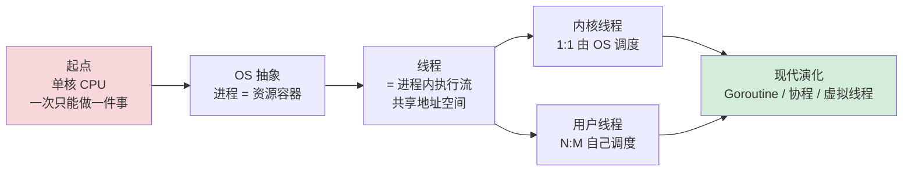

---

### 🧭 通用三问

> 本节是全篇的"母题"。无论你用 Java `Thread`、C `pthread`、Go `goroutine`、Rust `std::thread`，本质都是在回答这三个问题。

**Q1：执行流到底是什么？** 一个"可被中断、可被恢复"的指令序列 + 它的状态（PC / 寄存器 / 栈 / TLS）。这套状态被打包叫 **TCB / task_struct / G 结构体**，是所有调度的基本单位。

**Q2：调度权归谁？** 三种答案构成了三大线程模型：①交给**内核**（1:1，POSIX/Win32/Java 平台线程）， 简单但贵；②留在**用户态**（N:1，早期 Java green thread / 现代 JS 单线程）， 轻但失去抢占；③**协作分工**（M:N，Go GMP / Java 虚拟线程 / Kotlin 协程）， 复杂但最优。

**Q3：怎么协作不出错？** 多个执行流共享地址空间就必然面临"看不见 / 看错 / 同时改"三大问题。OS 和语言给出的答案永远是同一组武器：**原子指令（CAS）+ 内存屏障 + 阻塞/唤醒（futex/park）**，再往上长出 mutex / channel / 各种高级原语。

🎯 **七字真言**：**抽象 / 共享 / 调度 / 切换 / 同步 / 隔离 / 演化**，线程的全部设计都围绕这七个字。本篇末尾会把它映射到 7 种语言，你会看到："不同语言的线程，骨架都一样"。

---

#### 目录介绍
- [1.案例引入](#1案例引入)
  - [1.1 Web服务器场景](#11-web服务器场景)
  - [1.2 单线程串行代价](#12-单线程串行代价)
  - [1.3 多进程方案代价](#13-多进程方案代价)
  - [1.4 多线程方案价值](#14-多线程方案价值)
  - [1.5 引出核心矛盾](#15-引出核心矛盾)
- [2.线程设计哲学](#2线程设计哲学)
  - [2.1 核心设计原则](#21-核心设计原则)
  - [2.2 线程演进时间线](#22-线程演进时间线)
  - [2.3 共享与隔离边界](#23-共享与隔离边界)
  - [2.4 抢占式调度](#24-抢占式调度)
  - [2.5 设计决策树](#25-设计决策树)
- [3.三大线程模型](#3三大线程模型)
  - [3.0 必有映射层](#30-必有映射层)
  - [3.1 1:1内核级](#31-11内核级)
  - [3.2 N:1用户级](#32-n1用户级)
  - [3.3 M:N混合模型](#33-mn混合模型)
  - [3.4 GMP调度剖析](#34-gmp调度剖析)
  - [3.5 模型选择决策树](#35-模型选择决策树)
- [4.线程架构设计](#4线程架构设计)
  - [4.1 task_struct解析](#41-task_struct解析)
  - [4.2 fork与clone演进](#42-fork与clone演进)
  - [4.3 切换三段式](#43-切换三段式)
  - [4.4 线程栈架构](#44-线程栈架构)
  - [4.5 缓存与内存屏障](#45-缓存与内存屏障)
- [5.线程生命周期](#5线程生命周期)
  - [5.1 五态模型状态机](#51-五态模型状态机)
  - [5.2 跨语言状态对比](#52-跨语言状态对比)
  - [5.3 状态转换内核视角](#53-状态转换内核视角)
  - [5.4 线程状态观察](#54-线程状态观察)
- [6.线程核心API](#6线程核心api)
  - [6.1 interrupt哲学](#61-interrupt哲学)
  - [6.2 调度控制API](#62-调度控制api)
  - [6.3 同步原语层级](#63-同步原语层级)
  - [6.4 AQS深度剖析](#64-aqs深度剖析)
- [7.跨语言线程对比](#7跨语言线程对比)
  - [7.1 Java虚拟线程](#71-java虚拟线程)
  - [7.2 C/C++贴内核](#72-cc贴内核)
  - [7.3 Go与GMP](#73-go与gmp)
  - [7.4 JS单线程逆袭](#74-js单线程逆袭)
  - [7.5 Kotlin协程魔法](#75-kotlin协程魔法)
  - [7.6 横向对比总表](#76-横向对比总表)
  - [7.7 线程演进趋势](#77-线程演进趋势)
- [8.经典陷阱反模式](#8经典陷阱反模式)
  - [8.1 创建陷阱](#81-创建陷阱)
  - [8.2 中断陷阱](#82-中断陷阱)
  - [8.3 内存可见性陷阱](#83-内存可见性陷阱)
  - [8.4 调试与定位](#84-调试与定位)
  - [8.5 跨语言陷阱速查](#85-跨语言陷阱速查)
- [9.一句话总结](#9一句话总结)
  - [9.1 三层认知升华](#91-三层认知升华)
  - [9.2 终极建议](#92-终极建议)
  - [9.3 四个关键收获](#93-四个关键收获)
  - [9.4 延伸阅读](#94-延伸阅读)
- [10.案例驱动剖析](#10案例驱动剖析)
  - [10.1 12306压垮Tomcat](#101-12306压垮tomcat)
  - [10.2 Netty百万连接](#102-netty百万连接)
  - [10.3 jstack看死锁](#103-jstack看死锁)
- [11.线程未来](#11线程未来)
  - [11.1 虚拟线程颠覆](#111-虚拟线程颠覆)
  - [11.2 结构化并发](#112-结构化并发)
  - [11.3 结构化设计哲学](#113-结构化设计哲学)
- [12.七字真言映射](#12七字真言映射)
  - [12.1 终极一句话](#121-终极一句话)

---

## 1.案例引入

### 1.1 Web服务器场景

**场景设定**：你正在写一个简单的 Web 服务器，需要同时处理来自 1 万个客户端的 HTTP 请求。每个请求平均要做的事是：

```
读取 socket（网络 I/O，~10ms）
   ↓
查询数据库（磁盘 I/O，~5ms）
   ↓
CPU 计算/拼接响应（~0.1ms）
   ↓
写回 socket（网络 I/O，~10ms）
```

注意一个关键事实，**每个请求 99% 的时间都花在等 I/O 上**，CPU 真正计算的时间只占 0.4%。这是个看似简单的需求：让 1 万个连接都能被及时处理。但接下来你会看到，"如何并发处理这 1 万个连接"，**才是过去半个世纪所有线程设计的根本驱动力**。

```java
// 服务端期望的代码长这样：
ServerSocket server = new ServerSocket(8080);
while (true) {
    Socket client = server.accept();   // 接受连接
    handleRequest(client);             // 处理这个请求
}
```

最朴素的写法只有 4 行，但跑起来你会发现：**处理第 1 个客户端的 25ms 内，第 2 到第 10000 个客户端只能干等**。这就是单线程串行的代价。

### 1.2 单线程串行代价

我们先把这种"完全不用线程"的写法跑一下数：

```java
public class SerialServer {
    public static void main(String[] args) throws IOException {
        ServerSocket server = new ServerSocket(8080);
        while (true) {
            Socket client = server.accept();
            // 串行处理：必须等这个请求完全结束，才能 accept 下一个
            handle(client);   // 一个请求耗时 ~25ms
        }
    }
}
```

**这种写法 CPU 最爽**，没有切换、没有锁、没有竞争，单核能开到 100% 利用率。但它埋了**四颗大雷**：

- **雷一：吞吐量天花板极低**。一个请求 25ms，单线程极限就是 40 QPS，10000 个请求需要 250 秒
- **雷二：CPU 大量空转浪费**。99% 的时间 CPU 在等 I/O，明明能干别的活却被强行绑定在这个请求上
- **雷三：长尾请求阻塞所有人**。如果某个请求数据库查询要 10 秒，后面 9999 个请求都得等
- **雷四：无法利用多核**。8 核机器上单线程只能跑满 1 核，剩下 7 核完全闲置

**这就是 1960 年代单道批处理系统的真实痛点**，昂贵的 IBM 大型机在等 I/O 时整机利用率只有 1-3%。这种浪费在当时是不可接受的。

**小结**：单线程串行模型在面对"I/O 占主导"的场景时，会把 CPU 这种昂贵资源浪费在等待上，这正是"并发"作为一种工程刚需被发明出来的根本原因。

### 1.3 多进程方案代价

最早的解决方案是**多进程**，每来一个连接 fork 一个进程：

```c
// Apache prefork 模式的核心思想
int main() {
    int server_fd = setup_server(8080);
    while (1) {
        int client_fd = accept(server_fd, NULL, NULL);
        pid_t pid = fork();              // ← 每来一个客户端就 fork
        if (pid == 0) {                  // 子进程
            handle(client_fd);
            exit(0);
        }
        close(client_fd);                // 父进程继续 accept
    }
}
```

这种方案确实解决了"并发"问题，1 万个客户端可以同时被 1 万个进程处理。但代价同样恐怖：

| 资源开销 | 单进程量级 | 1 万进程总量 |
|---|---|---|
| **虚拟内存页表** | 每进程独立，~几十 KB | 几百 MB 仅页表 |
| **内核栈** | 每进程 8KB | 80MB |
| **task_struct** | ~6KB | 60MB |
| **文件描述符表** | 每进程独立副本 | 内存与维护成本翻倍 |
| **fork 耗时** | ~1ms（含写时复制初始化） | 10 秒仅创建 |
| **TLB 刷新** | 每次切换都要刷 | 性能崩塌 |

更糟的是**进程间通信（IPC）**，管道、消息队列、共享内存、Socket……每条都要经过内核态：

```
进程 A 发数据给进程 B：
  用户态 buffer → syscall 进内核 → 内核 buffer → syscall 出来 → 用户态 buffer
  （至少两次内存拷贝 + 两次模式切换）
```

**经典反例**：早期 Apache HTTPD 在 C10K（一万并发连接）问题面前直接趴下，不是因为 CPU 不够，是**进程开销吃光了内存**。

**小结**：多进程方案用"完全隔离"换来了"安全简单"，但每个并发单元都背着完整的资源副本，在大规模并发场景下，这笔账根本算不过来。我们需要一种**比进程轻得多的并发单元**。

### 1.4 多线程方案价值

这就是线程登场的舞台。线程的核心思想极其简洁，**共享进程的地址空间和资源，仅独立维护执行流必需的最小状态**：

```java
public class ThreadedServer {
    public static void main(String[] args) throws IOException {
        ServerSocket server = new ServerSocket(8080);
        ExecutorService pool = Executors.newFixedThreadPool(200);
        while (true) {
            Socket client = server.accept();
            pool.submit(() -> handle(client));   // 扔给线程池
        }
    }
}
```

这一改造把开销降到什么程度？让我们对比同一硬件上的真实数据：

| 维度 | 多进程方案 | 多线程方案 | 倍数 |
|---|---|---|---|
| **创建一个并发单元** | fork 1ms | pthread_create 50μs | **20×** |
| **每单元内存** | ~几 MB（页表+栈+各种表） | 1MB（仅栈） | **5×** |
| **切换开销** | 3-5μs（含 TLB 刷新） | 1-2μs | **3×** |
| **通信开销** | IPC 经过内核 | 直接读写共享内存 | **100×+** |
| **C10K 时总内存** | 几 GB | 几百 MB | **10×** |

**这就是为什么从 1995 年开始，所有高并发服务器都改成了线程模型**，Apache 2.0 的 worker MPM、Tomcat、Nginx 的 worker thread、Redis 的 IO threads，本质上都在吃这一波红利。

更重要的是，线程让代码**保持了顺序写法的简洁**：

```java
// 业务代码看起来就像单机串行，
void handle(Socket client) {
    String req = read(client);          // 阻塞 I/O，但只阻塞当前线程
    String result = queryDb(req);       // 阻塞 I/O，但只阻塞当前线程
    write(client, result);
}
// 200 个线程并发跑这段代码，互不干扰
```

线程的真正价值就是这个，**让程序员继续用"顺序的、阻塞的"写法，但 OS 在底下给你做"并发的、非阻塞的"调度**。这是过去 30 年应用层并发的最大智力杠杆。

**小结**：线程把"昂贵的进程级隔离"换成"轻量的栈级隔离"，把"IPC 通信"换成"共享内存通信"，本质是用"放宽隔离换轻量"的工程取舍。它解决了 C10K，但同时也把"并发安全"这座大山压给了应用层。

### 1.5 引出核心矛盾

把 1.2、1.3、1.4 三种方案放在一张表上看，线程设计的根本矛盾就显形了：

| 维度 | 单线程串行 | 多进程 | 多线程 |
|------|---|---|---|
| **吞吐量** | 极低 | 高 | 高 |
| **资源开销** | 极小 | 巨大 | 中等 |
| **代码复杂度** | 简单 | 简单（隔离） | **复杂（要处理竞争）** |
| **故障隔离** | N/A | 强（进程崩溃不影响别人） | **弱（一个线程 OOM 整个进程崩）** |
| **多核利用** | ❌ | ✓ | ✓ |
| **通信效率** | N/A | 慢 | 快 |

线程的"轻量"和"高效"不是免费的，它把 4 个新问题甩到了应用层程序员面前：

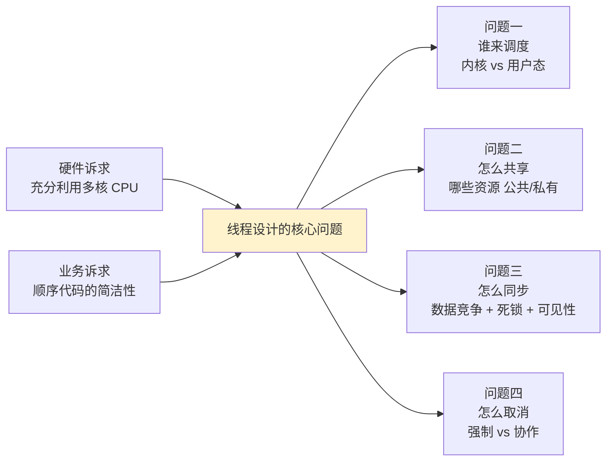

**接下来全文要回答的就是这 4 个子问题**：从 Linux 的 `task_struct` 到 Go 的 GMP，从 Java 的 `synchronized` 到 Rust 的 `Send/Sync`，从 `pthread_cancel` 到 `Thread.interrupt()`，半个世纪的工业实践，都在打磨"线程"这个抽象。

---

## 2.线程设计哲学

### 2.1 核心设计原则

回到第 1 章那个 Web 服务器的案例，我们已经看到线程的"为什么必要"。但线程设计本身充满取舍：调度让谁做？资源怎么分？同步用什么原语？这一节，从工业界沉淀下来的经验中拆出三条根本性原则。

**先看一段反例**，这是 1995 年左右真实存在过的设计：

```c
// 早期 LinuxThreads（被 NPTL 取代前）的设计
// 用一个"管理线程"做所有事
struct manager_thread {
    pthread_t self;                   // 一个特殊的"管理者"
    struct thread_node* threads;      // 维护所有用户线程
};

// 创建线程：由 manager 代你 fork
int pthread_create(...) {
    send_to_manager(CREATE_REQ);     // 发请求给管理线程
    return wait_response();          // 等管理线程帮我创建
}

// 信号处理：必须经过 manager 路由
void on_signal(int sig) {
    forward_to_manager(sig);         // 信号先到 manager 再分发
}
```

这套设计上线后引发了**至少 6 类生产事故**：信号路由延迟导致 SIGCHLD 丢失、管理线程成单点瓶颈、`getpid()` 返回管理线程而非调用线程、core dump 时调试器找不到主线程……根因不在于"线程难做"，而在于**这个设计违背了线程哲学的根本原则**。

**从这个反例和后续 NPTL 的成功改造中，能提炼出三条铁律**：

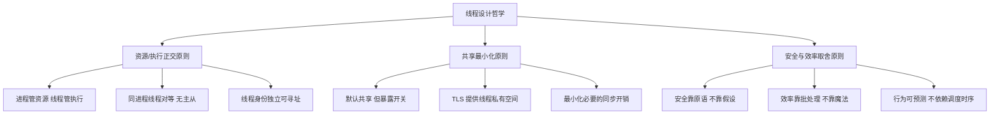

- **资源/执行正交原则**：上面 LinuxThreads 让"管理线程"既管资源又管调度，**职责耦合**直接成了瓶颈。NPTL 的解法是把这两件事彻底分离：进程级 `mm_struct` 管资源，每个 `task_struct` 管自己的执行。同进程的线程**完全对等**，没有任何"主管"。
- **共享最小化原则**：线程虽然"默认共享地址空间"，但好的设计**永远暴露隔离开关**，`thread_local` 关键字、`pthread_key_t`、Java `ThreadLocal`、Go 没有 TLS 但有 channel，目的都是让程序员能**显式声明哪些是私有的**。
- **安全与效率取舍原则**：上面那个 manager 设计为了"安全简单"牺牲了所有效率。好的线程 API 应该**让程序员明确知道每条调用的代价**，`mutex_lock` 可能阻塞、`atomic_inc` 不会阻塞、`spin_lock` 会燃烧 CPU，而不是用一个"看起来傻瓜"的接口隐藏代价。

**小结**（基于反例与三条铁律）：线程设计的灵魂从来不是"多搞几个执行流"，而是**主动地、显式地决定：哪些资源被共享、谁负责调度、并发安全谁来兜底**。这三条原则构成了从 NPTL、Solaris LWP 到 Go GMP、Java VirtualThread 共同遵循的工程基线。

### 2.2 线程演进时间线

线程不是一蹴而就发明出来的，而是经过半个世纪的迭代，每一步都是为了解决前一步暴露的问题：

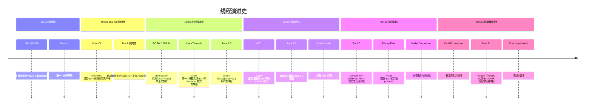

**这条时间线能看到三股力量在拉扯演进方向**：

- **从"重隔离"到"轻共享"**：进程 → LWP → 线程 → 协程，每一步都在把"共享"做得更彻底、把"隔离"做得更精准
- **从"OS 调度"到"应用调度"**：1:1 → M:N → 协程，调度权一步步从内核交给应用，因为应用比内核更懂自己的工作负载
- **从"显式并发"到"隐式并发"**：早期 `pthread_create` 全靠手写，后来线程池、async/await、Virtual Thread 都在把"并发的写法"藏起来，程序员只需要写"看起来是同步的代码"

**关键里程碑的设计动机**：

| 年份 | 事件 | 解决的痛点 |
|---|---|---|
| 1995 | POSIX pthread | 给"线程"一个跨 Unix 的统一 API |
| 2003 | Linux NPTL | LinuxThreads 的 manager 模式性能崩 |
| 2009 | Go goroutine | Java 线程太重，C10K 后是 C100K |
| 2014 | Java CompletableFuture | 异步链式编程降低回调地狱 |
| 2018 | Kotlin Coroutines | 让 Android 异步代码不再难写 |
| 2021 | Java 21 Virtual Threads | 兼顾"线程的简单"和"协程的轻量" |

### 2.3 共享与隔离边界

线程设计的核心问题之一：**到底什么资源应该共享？什么应该独立？** 这个边界划得不对，整个并发模型就崩了。

```
完全隔离（进程）◄──────────────────►完全共享（线程）
  安全性高                             效率高
  通信复杂                             通信简单
  开销大                               开销小
  故障隔离                             故障传播
  
        ↑                                  ↑
  Erlang Actor 模型                  早期 Java 线程
```

**Linux 的答案**，通过 `clone()` 系统调用的 flag 位，把"共享/隔离"做成**可逐项配置的开关**：

```c
// 创建一个完整的线程：一切都共享
clone(CLONE_VM | CLONE_FS | CLONE_FILES | 
      CLONE_SIGHAND | CLONE_THREAD | CLONE_SYSVSEM, ...);

// 创建一个进程：什么都不共享（等价于 fork）
clone(SIGCHLD, ...);

// 容器场景：共享地址空间但隔离命名空间
clone(CLONE_VM | CLONE_NEWPID | CLONE_NEWNS, ...);

// 中间形态：vfork 共享地址空间但父进程会等子进程 exec
clone(CLONE_VM | CLONE_VFORK | SIGCHLD, ...);
```

这种设计哲学非常 Unix，**给你一个最通用的原语，让你按需组合**。`fork()` 和 `pthread_create()` 都只是 `clone()` 的特定 flag 组合而已。

**线程默认共享什么 / 私有什么**：

| 资源 | 默认归属 | 设计原因 |
|---|---|---|
| **代码段（.text）** | 共享 | 同一个程序的不同执行流跑同样代码 |
| **数据段（.data/.bss）** | 共享 | 全局变量是"程序级"状态 |
| **堆（heap）** | 共享 | malloc/new 的内存属于进程 |
| **文件描述符表** | 共享 | 一个连接被多个线程读写很常见 |
| **信号处理表** | 共享 | 信号是"进程级"事件 |
| **栈（stack）** | 私有 | 函数调用链是"线程级"状态 |
| **PC + 寄存器** | 私有 | 执行位置是"线程级"状态 |
| **TLS（线程局部）** | 私有 | 显式申请的"线程级"全局变量 |
| **errno** | 私有 | 系统调用错误号必须线程隔离，否则永远算错 |

**注意 errno 这个细节**，它是历史上一个经典翻车点。早期 C 库的 `errno` 是全局变量，多线程下两个线程同时做系统调用，错误号会互相覆盖。POSIX 规定了 `errno` 必须是 TLS 变量后才解决。这告诉我们：**判断一个状态该不该共享，标准是"它逻辑上属于谁"，属于程序的就共享，属于执行流的就私有**。

### 2.4 抢占式调度

线程要被 CPU 执行，就必须解决一个问题：**多个线程都想要 CPU，谁先用，用多久？**

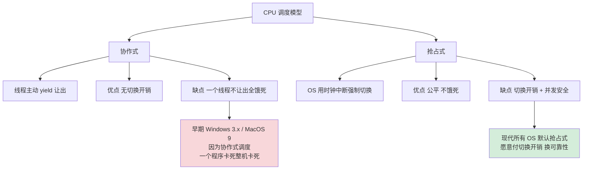

**协作式调度为什么在生产环境不可靠**？三个根本问题：

- **死循环就是 DoS**：随便一个 `while(1) {}` 就能让整台机器卡死
- **第三方代码不可信**：你引入的某个库忘记 yield，整个程序就被它绑架
- **延迟无法预估**：一个线程的响应时间取决于其他线程的"良心"

**抢占式调度的硬件机制**：靠**时钟中断**，CPU 每 1-10ms 收到一次定时器中断，强制把控制权交回内核：

```
线程 A 跑得正欢
    │
    ▼ ⏰ 时钟中断（PIT / HPET / APIC Timer）
┌──────────────────────────────┐
│ CPU 自动跳转到 中断处理程序    │
│ 1. 保存 A 的所有寄存器到内核栈 │
│ 2. 调用 schedule()           │
│ 3. 选择下一个 RUNNABLE 线程 B │
│ 4. 恢复 B 的寄存器           │
│ 5. iret 返回 B 的用户态      │
└──────────────────────────────┘
    │
    ▼
线程 B 运行中（A 完全不知道发生过什么）
```

这是个**绝妙的设计**，线程在用户态写代码时**完全感知不到自己被抢过**。从线程视角看，"我一直在跑"；从 OS 视角看，"我每 5ms 就在切线程"。这种"透明的抢占"是现代 OS 公平性的物理基础。

**但抢占式不是万能的**，它带来了一个新问题：**任意一行代码都可能被打断**。这就是为什么并发编程下面这种代码会出错：

```java
int counter = 0;
// 线程 A: counter++
// 线程 B: counter++
// 看似两次 +1，最终可能只有 +1
//
// 因为 counter++ 不是原子的：
//   1. mov eax, [counter]   ← 在这两步之间被抢占
//   2. add eax, 1
//   3. mov [counter], eax   ← 另一线程看到的是旧值
```

**这就引出了线程编程的核心代价**，抢占式调度让"任意指令都可能被打断"，所以应用层必须用同步原语（锁、原子操作、内存屏障）来保护多线程共享状态。这是一笔我们在第 6 章会详细算的账。

### 2.5 设计决策树

把上面四个原则串起来，给出一棵实际工程中可用的决策树：

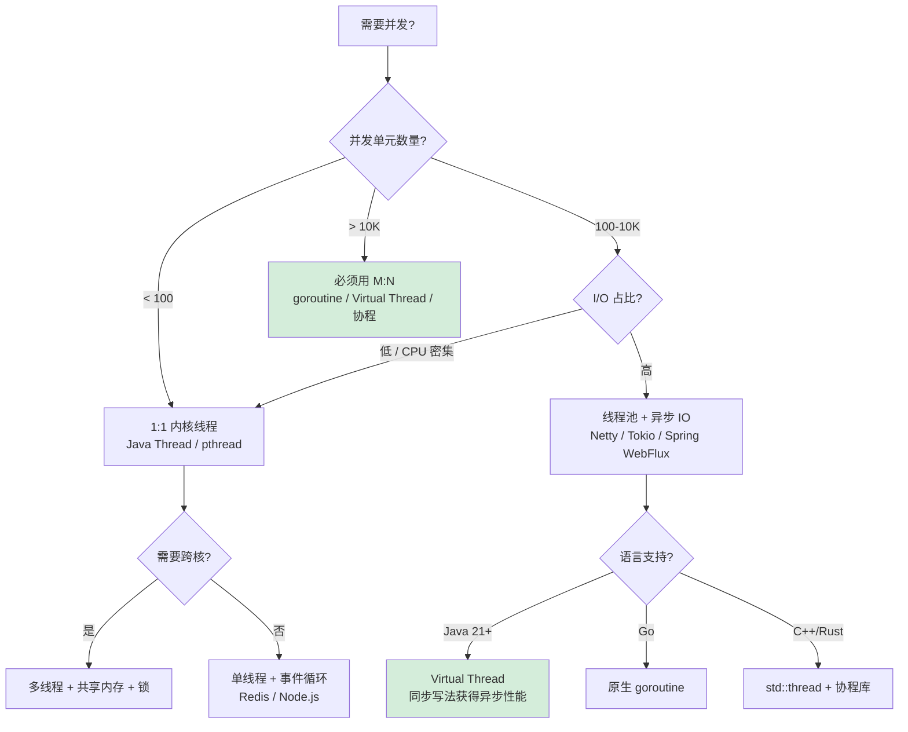

**决策三原则**：

1. **能不并发就不并发**，单线程 + 异步 IO 在很多场景比多线程更高效（Redis、Nginx 是经典例子）
2. **能用调度抽象就别裸操线程**，线程池 / goroutine / Virtual Thread 优于直接 `new Thread`
3. **能用消息传递就别共享内存**，Erlang、Go 的智慧："Don't communicate by sharing memory; share memory by communicating"

---

## 3.三大线程模型

线程的"实现"涉及**用户态**和**内核态**两个层面，谁负责调度？谁负责切换？由此产生三种经典模型，各自做出截然不同的工程取舍。

### 3.0 必有映射层

> 这是本章的"母图"。先在最高抽象层看清"为什么 1:1 / N:1 / M:N 不是三个并列选择，而是**调度权归属的三种可能解**"，再看具体实现就会发现：**所有语言的并发模型都是这三种的变体或组合**。

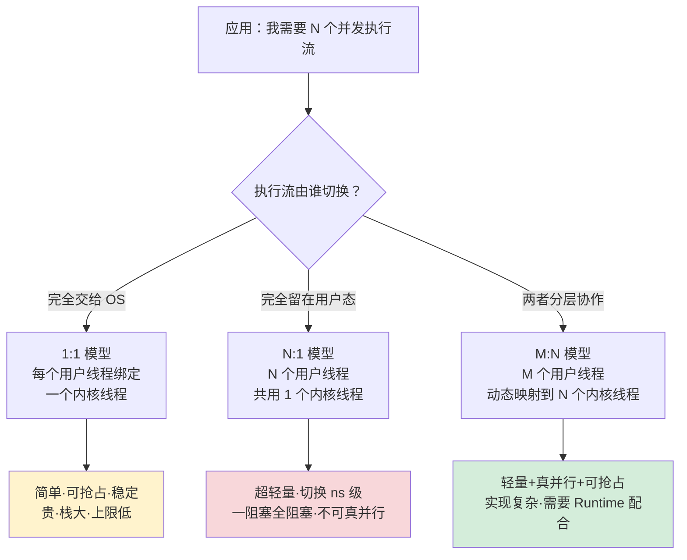

**三层映射的本质冲突**：

| 维度 | 1:1 | N:1 | M:N |
|---|---|---|---|
| 谁掌握"何时切换" | OS 内核（强制时间片+中断） | 用户代码（必须主动让出） | Runtime + OS 协作 |
| 一个执行流阻塞会怎样 | 只阻塞它自己 | 全部 N 个一起阻塞 | Runtime 把它从载体线程"摘下"，其他继续跑 |
| 真正能并行的执行流数 | = CPU 核数（受 OS 调度限） | 永远是 1 | = CPU 核数（同 1:1） |
| 切换成本 | 1-5 μs（陷内核 + 刷 TLB） | 几十 ns（仅切栈+寄存器） | 100-300 ns（用户态 + 偶尔陷内核） |
| 抽象代价 | 极低（语言一行 API） | 高（必须改成异步/await） | 极低（写同步代码，Runtime 自动让出） |
| 跨语言代表 | Java 平台线程 / C pthread / Win32 / Rust `std::thread` | 早期 JVM green thread / 现代 JS 单线程 + 事件循环 | Go GMP / Java 虚拟线程（Loom） / Kotlin 协程 / Erlang BEAM |

**核心洞察**：

1. **三大模型不是技术选择，而是"调度权归属"的三种数学可能**，把"调度由谁做"这个权力切片，要么全给内核（1:1）、要么全给用户态（N:1）、要么协作分工（M:N），没有第四种可能。
2. **M:N 模型不是"更好的 1:1"，而是"消除了 N:1 的阻塞缺陷的 N:1"**，它把"用户态切换"的极致轻量保留下来，同时通过 Runtime 把"阻塞调用"翻译成"挂起+切换"，绕开了 N:1"一阻塞全阻塞"的死结。
3. **任何并发模型都可以用这张映射图来归类**，例如 Node.js 是 N:1（单线程事件循环）、Java 8 默认是 1:1（平台线程）、Java 21 引入了 M:N（虚拟线程）、Go 从诞生就是 M:N（GMP）， **看清归类，就能预判它的优势与陷阱**。

> 💡 **设计哲学**：操作系统提供的"线程"这个抽象，本质上**只是 1:1 模型的产物**，它强制要求"一个用户执行流 = 一个内核执行流"。后来的 N:1 / M:N 都是**应用层不满意 1:1 的代价，自己在用户态又造了一层调度**，线程演化史，就是应用层与操作系统对"调度权"的反复博弈史。

### 3.1 1:1内核级

**模型本质**：每个用户线程对应一个内核线程，**调度完全由 OS 内核负责**。

```
用户线程:   T1    T2    T3    T4
             │     │     │     │       每个用户线程对应一个内核线程
内核线程:   KT1   KT2   KT3   KT4
             \     |     |     /
              \    |     |    /
               ───CPU调度器───
```

**典型代码**：

```c
// POSIX pthread ， 1:1 模型最经典代表
#include <pthread.h>

void* worker(void* arg) {
    long id = (long)arg;
    printf("worker %ld\n", id);
    return NULL;
}

int main() {
    pthread_t threads[4];
    for (long i = 0; i < 4; i++) {
        pthread_create(&threads[i], NULL, worker, (void*)i);
    }
    for (int i = 0; i < 4; i++) {
        pthread_join(threads[i], NULL);
    }
    return 0;
}
// 在 Linux 上，每次 pthread_create 实际是 clone() 系统调用
// 创建一个新的 task_struct，由内核 CFS 调度器管理
```

**核心特征**：

- **每个线程在内核里有 `task_struct`**：占用约 6KB 内核内存
- **调度完全由内核负责**：CFS（Completely Fair Scheduler）/ Windows Scheduler
- **真正的并行**：N 个线程能同时跑在 N 个 CPU 核心上
- **阻塞独立**：一个线程做阻塞 syscall 不影响其他线程

**性能数据（Linux x86_64 典型值）**：

| 操作 | 耗时 |
|---|---|
| `pthread_create` | ~50 μs |
| 同进程线程切换 | ~1-2 μs |
| `pthread_mutex_lock`（无竞争） | ~25 ns |
| `pthread_mutex_lock`（有竞争，futex） | ~1-3 μs |
| 线程默认栈大小 | 8 MB（Linux）/ 1 MB（Windows） |

**适用场景**：**大多数业务应用**，Java、C#、C++、Rust 标准线程、Python（受 GIL 限制）都是这个模型。

**致命短板**：**栈太大 → 内存爆炸**。10000 个线程 × 8MB = 80GB 栈空间，这是 1:1 模型在 C10K 之后扛不住的根本原因。

**小结**：1:1 模型是"内核全权代理"，你享受了 OS 调度的所有好处，但付出了"每线程几 MB 栈 + 几 KB 内核态结构"的固定成本。

### 3.2 N:1用户级

**模型本质**：N 个用户线程被多路复用到 1 个内核线程上，**调度由用户态库自己做**。

```
用户线程:   T1  T2  T3  T4  T5  T6
             \   \   |   |   /   /     N个用户线程映射到1个内核线程
              \   \  |  |   /   /
内核线程:       ─── KT1 ───
                     │
                   CPU核
```

**典型代码（早期 Java Green Thread 思路示意）**：

```c
// 用户态调度器伪代码
struct user_thread {
    void* stack;
    void* pc;             // 程序计数器
    int regs[16];         // 寄存器快照
    enum { READY, RUNNING, BLOCKED } state;
};

struct user_thread* ready_queue;
struct user_thread* current;

void yield() {
    save_context(current);                  // 保存当前线程
    current->state = READY;
    enqueue(ready_queue, current);
    current = dequeue(ready_queue);         // 选下一个
    current->state = RUNNING;
    restore_context(current);               // 切到下一个
}
```

**核心特征**：

- **创建/切换在用户态完成**：不需要 syscall，性能极佳（~100 ns）
- **调度完全自定义**：用户态库可以做任何调度策略
- **可移植性强**：内核完全无感知，纯靠用户库实现

**致命缺陷（也是它被淘汰的根因）**：

- **无法利用多核**：1 个内核线程意味着永远只有 1 个 CPU 在跑
- **阻塞 syscall = 全员阻塞**：一个用户线程读文件阻塞，整个进程的所有用户线程都跟着卡住，因为内核只看到这一个线程在等
- **信号处理混乱**：信号是发给内核线程的，用户线程看不到

**经典案例**：Java 1.1 的 Green Threads ， 1996 年 Java 第一版用这个模型，结果在多核机器上跑得比 C 慢一个数量级。Java 1.2 立刻改成 1:1 模型，从此再也没回头。

**小结**：N:1 模型在多核时代是个**死路**。它教给我们的是：**把调度全留在用户态听上去很美，但 syscall 阻塞这个底牌是用户态调度器永远翻不过来的**。

### 3.3 M:N混合模型

**模型本质**：M 个用户线程被多路复用到 N 个内核线程（N 通常 = CPU 核数），**调度由用户态 + 内核协作完成**。

```
用户线程:   T1  T2  T3  T4  T5  T6     M 个 (M 可能是 100 万)
             \   |   |   |   |   /
              \  |   |   |   |  /     用户态调度器
内核线程:    KT1    KT2    KT3        N 个 (= GOMAXPROCS)
              \      |      /
               ──CPU调度器──
```

**典型代码（Go goroutine）**：

```go
// 创建 100 万个 goroutine，每个栈仅 2KB
package main

import (
    "fmt"
    "sync"
)

func main() {
    var wg sync.WaitGroup
    for i := 0; i < 1_000_000; i++ {
        wg.Add(1)
        go func(id int) {           // ← go 关键字 = 创建一个 goroutine
            defer wg.Done()
            // 业务逻辑
            _ = id
        }(i)
    }
    wg.Wait()
    fmt.Println("done")
}
// 这段代码在普通 8 核笔记本上能跑
// 用 1:1 模型同样代码就 OOM 了（100 万 × 8MB = 8TB）
```

**核心特征**：

- **用户线程极轻**：goroutine 初始栈仅 2KB（按需增长），创建开销 ~3 μs
- **内核线程数恒定**：N = CPU 核数，不会因为用户线程多而膨胀
- **work stealing 调度**：空闲的 P 从忙碌的 P 偷任务，CPU 利用率最大化
- **阻塞 syscall 自动让位**：goroutine 阻塞时，调度器把这个 P 解绑，给其他 M 用

**性能对比（同样跑 100 万并发任务）**：

| 模型 | 内存占用 | 创建总耗时 | 切换耗时 |
|---|---|---|---|
| 1:1（pthread） | 8 TB | OOM | 1-2 μs |
| M:N（goroutine） | 2-4 GB | 几秒 | 200 ns |
| M:N（Java VirtualThread） | 几百 MB | 1-2 秒 | 100 ns |

**小结**：M:N 是当前并发模型的**事实标准**，Go 用 GMP 实现，Erlang 用 BEAM 调度器，Java 21 用 Virtual Thread + ForkJoinPool。它的价值是**把"调度"这件事拆给两个层级合作做**：内核负责"把核分给我"，用户态负责"把任务分给核"。

### 3.4 GMP调度剖析

Go 的 GMP 是 M:N 模型在工业界最成功的落地。让我们把它彻底拆开：

```
           ┌─── P (Processor，逻辑处理器) ───┐
           │  本地运行队列：[G1, G2, G3]      │
           │  当前运行的 G：G0                 │
           └──────────┬──────────────────────┘
                      │ 绑定
                      ▼
                M (Machine，OS 内核线程)
                      │
                    CPU 核

G = Goroutine（用户态协程，初始栈仅 2KB，可动态增长）
M = Machine（真实 OS 线程，栈 1~8MB）
P = Processor（调度上下文，数量 = GOMAXPROCS）
```

**三大角色的职责分工**：

| 角色 | 是什么 | 数量 | 关键状态 |
|---|---|---|---|
| **G** | 一个 goroutine | 可达百万级 | PC + 栈 + 状态 |
| **M** | 一个 OS 线程 | 数量与活跃 G 相关 | 当前绑定的 P + 当前运行的 G |
| **P** | 调度上下文 | = GOMAXPROCS | 本地 G 队列 + 状态机 |

**核心调度算法（4 个关键设计）**：

**① Work Stealing（偷任务）**

```
P1 的本地队列空了：[]
P2 的本地队列：[G1, G2, G3, G4]
                          ↓ P1 从 P2 偷一半
P1: [G3, G4]
P2: [G1, G2]
```

为什么要偷？因为 GMP 的本地队列设计是为了**避免锁竞争**（每个 P 自己的队列只有自己访问）。但任务分布可能不均，偷任务保证负载均衡。

**② Hand Off（M 阻塞时让位）**

```
G1 在 M1（绑定 P1）上运行
G1 调用 read() 系统调用阻塞
    ↓
runtime 检测到 M1 即将进入阻塞
    ↓
P1 从 M1 解绑，找一个空闲 M2 绑定
M2 继续跑 P1 队列里的其他 G
    ↓
M1 阻塞结束，原 G1 找一个 P 重新挂回去
```

**这就是 Go 的"魔法"**，你写的同步代码 `data := <-ch` 看上去会阻塞 goroutine，但实际上**只阻塞 G 不阻塞 M**，OS 线程能继续跑别的 G。这是 N:1 模型死活做不到的事。

**③ Preemption（抢占）**

早期 Go 是"协作式"，goroutine 必须主动让出。Go 1.14 引入**基于信号的异步抢占**：

```
runtime 监控到 G 跑了 10ms 还不让出
    ↓
向 M 发送 SIGURG 信号
    ↓
M 在信号处理函数里把 G 切出去
    ↓
P 可以调度其他 G
```

**为什么需要这个？** 因为协作式调度下，一个 `for{}` 死循环的 goroutine 会让整个 P 卡死。

**④ GC 协作**

Go 的 GC 是 STW + 并发标记的混合模型，关键时刻需要让所有 goroutine 都跑到"安全点"：

```
GC 启动
    ↓
runtime 给每个 G 设置抢占标志
    ↓
G 在函数调用 / 循环回边等"安全点"主动让出
    ↓
所有 G 都到了安全点，GC 开始扫描栈
```

**GMP 的设计精妙之处**：每一个机制都解决了 N:1 模型的一个痛点，work stealing 解决多核利用、hand off 解决 syscall 阻塞、preemption 解决死循环、GC 协作解决暂停时间。

### 3.5 模型选择决策树

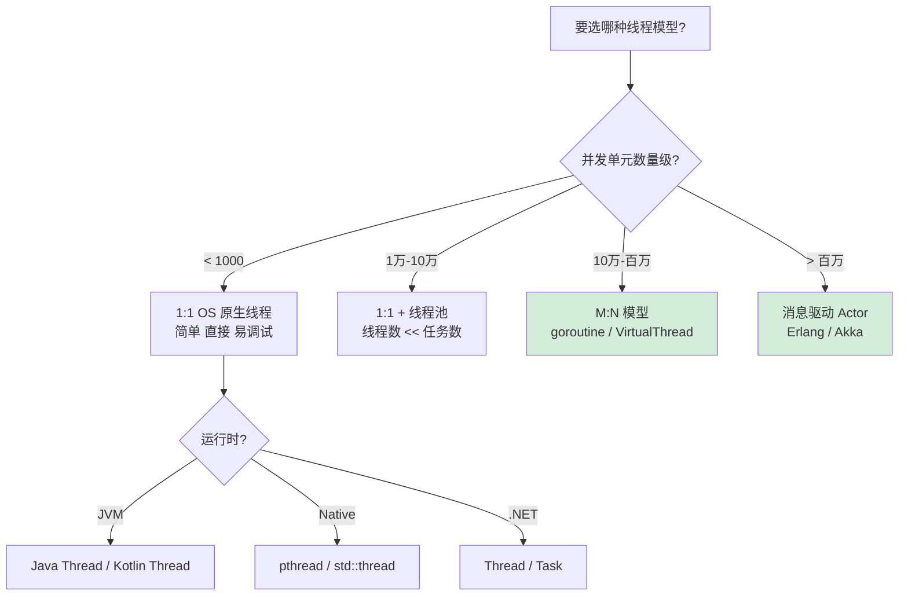

**实战经验总结**：

- **业务普通服务**（QPS < 10K，连接 < 1K）：1:1 模型完全够用，**别想多了**
- **高并发网络服务**（连接 > 10K）：M:N 模型 / 异步 IO，**别用裸线程**
- **CPU 密集型计算**：线程数 = CPU 核数，**多了反而被切换吃掉**
- **百万级长连接**（IM、推送）：必须用 goroutine / VirtualThread / 协程

---

## 4.线程架构设计

### 4.1 task_struct解析

Linux 中，**进程和线程在内核里是同一个东西**，都是 `task_struct`。这是 Linux 设计哲学的一次胜利："一切皆任务"。

```c
// Linux 内核 task_struct（精简版，实际有几百个字段）
struct task_struct {
    // ============ 身份标识 ============
    pid_t                   pid;            // 线程 ID（每线程唯一）
    pid_t                   tgid;           // 线程组 ID（= 进程 PID）
    
    // ============ 调度相关 ============
    volatile long           state;          // RUNNING/INTERRUPTIBLE/...
    int                     prio;           // 动态优先级
    int                     static_prio;    // 静态优先级（nice 值）
    struct sched_entity     se;             // CFS 调度实体
    unsigned int            policy;         // SCHED_NORMAL/FIFO/RR
    
    // ============ 内存相关（关键：决定线程 vs 进程）============
    struct mm_struct        *mm;            // 用户空间内存描述符
                                            // 同进程线程共享同一个 mm
                                            // 不同进程有独立的 mm
    struct mm_struct        *active_mm;     // 当前活动的 mm（内核线程用）
    
    // ============ 文件 / 信号 ============
    struct files_struct     *files;         // 文件描述符表（线程共享）
    struct signal_struct    *signal;        // 信号处理（线程共享）
    struct sighand_struct   *sighand;       // 信号处理函数表（线程共享）
    
    // ============ 执行上下文（线程独立）============
    struct thread_struct    thread;         // CPU 寄存器状态
    void                    *stack;         // 内核栈（每线程独立）
    
    // ============ 关系网 ============
    struct task_struct      *parent;        // 父任务
    struct list_head        children;       // 子任务链表
    struct list_head        sibling;        // 兄弟任务链表
};
```

**线程 vs 进程在 task_struct 视角下的差异**：

```
进程 P 创建子进程 P':
  P->mm      ≠   P'->mm        ← 两个独立的内存空间
  P->files   ≠   P'->files     ← 两个独立的文件表
  P->tgid    ≠   P'->tgid      ← 两个不同的进程组

进程 P 创建线程 T:
  P->mm      ==  T->mm         ← 同一个内存空间！
  P->files   ==  T->files      ← 同一个文件表！
  P->tgid    ==  T->tgid       ← 同一个进程组！
  P->pid     ≠   T->pid        ← 但任务 ID 不同（线程独立调度）
```

**这就是为什么** `ps aux` 看到的是进程，`ps -eLf` 才能看到线程，前者按 `tgid` 聚合，后者按 `pid` 列。

**TID 与 PID 的奇妙关系**：

```bash
# 一个 Java 进程
$ ps -eLf | grep MyApp
USER  PID    LWP    NLWP  CMD
xxx   12345  12345  20    java MyApp     ← 主线程：PID == LWP
xxx   12345  12346  20    java MyApp     ← 其他线程：LWP 不同
xxx   12345  12347  20    java MyApp
...
```

主线程的 `pid == tgid`，其他线程的 `tgid` 都等于主线程的 `pid`，这种"线程组长"的设计让信号、`getpid()` 等"进程级"操作能正确路由。

### 4.2 fork与clone演进

**fork**（1969）， 最古老的进程创建原语：

```c
pid_t pid = fork();
if (pid == 0) {
    // 子进程：完整复制了父进程的一切
    // 但用了 Copy-On-Write 优化：物理页直到写入才真正复制
    exec("...");                    // 通常立刻 exec 替换
} else {
    // 父进程
    waitpid(pid, &status, 0);
}
```

**clone**（1995）， 灵活的统一原语：

```c
// clone 的设计哲学：把"复制什么"做成参数
int clone(int (*fn)(void*), void* stack, int flags, void* arg, ...);

// flags 决定共享什么：
#define CLONE_VM        0x00000100  // 共享虚拟内存（mm_struct）
#define CLONE_FS        0x00000200  // 共享文件系统信息
#define CLONE_FILES     0x00000400  // 共享文件描述符表
#define CLONE_SIGHAND   0x00000800  // 共享信号处理函数
#define CLONE_THREAD    0x00010000  // 加入同一线程组（共享 tgid）
#define CLONE_NEWPID    0x20000000  // 创建新的 PID 命名空间（容器）
#define CLONE_NEWNS     0x00020000  // 创建新的挂载命名空间（容器）

// fork 等价于：
clone(fn, stack, SIGCHLD, NULL);

// pthread_create 等价于：
clone(fn, stack, 
      CLONE_VM | CLONE_FS | CLONE_FILES | 
      CLONE_SIGHAND | CLONE_THREAD | CLONE_SYSVSEM | 
      CLONE_SETTLS | CLONE_PARENT_SETTID | CLONE_CHILD_CLEARTID, 
      arg);

// 容器（Docker）等价于：
clone(fn, stack, 
      CLONE_NEWPID | CLONE_NEWNS | CLONE_NEWNET | 
      CLONE_NEWUTS | CLONE_NEWIPC | CLONE_NEWUSER, 
      arg);
```

**这个设计的天才之处**：

- **fork** 是 **clone** 的特定 flag 组合
- **pthread_create** 是 **clone** 的另一种 flag 组合
- **Docker 容器** 又是 **clone** 的第三种 flag 组合

一套底层原语，三种上层抽象，这才是 Unix 哲学的真谛。

**clone3（2019）， 更现代的接口**：

```c
struct clone_args {
    __u64 flags;           // 共享标志
    __u64 pidfd;           // 返回 pid 文件描述符
    __u64 child_tid;       // 子线程 TID 写入地址
    __u64 parent_tid;      // 父线程 TID 写入地址
    __u64 exit_signal;     // 子进程退出时发什么信号
    __u64 stack;           // 栈地址
    __u64 stack_size;      // 栈大小
    __u64 tls;             // TLS 起始地址
    __u64 set_tid;         // 显式指定 TID（容器迁移用）
    // ...
};
```

clone3 把参数从位标志改成结构体，为未来扩展留下空间，是当代 Linux 系统调用接口设计的范本。

### 4.3 切换三段式

线程切换是并发性能的核心瓶颈。让我们把它拆到指令级别：

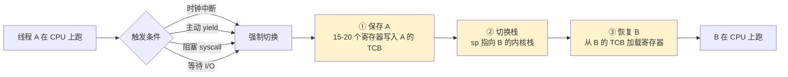

**三段切换的具体动作**（x86_64 Linux）：

```c
// 内核源码：context_switch (kernel/sched/core.c)
static inline struct task_struct *context_switch(
    struct rq *rq, 
    struct task_struct *prev, 
    struct task_struct *next, 
    struct rq_flags *rf)
{
    // === 第一段：内存上下文切换 ===
    if (next->mm != prev->mm) {              // 跨进程切换才需要
        switch_mm_irqs_off(prev->mm, next->mm, next);
        // ↑ 重新加载 CR3 寄存器（页表基址）
        // ↑ 隐式刷新 TLB（这是跨进程切换最大的开销！）
    }

    // === 第二段：寄存器上下文切换 ===
    switch_to(prev, next, prev);
    // ↑ 这是一段精心设计的汇编，做的事：
    //   1. 保存 prev 的通用寄存器到 prev->thread
    //   2. 保存 prev 的 sp 到 prev->thread.sp
    //   3. 加载 next->thread.sp 到 sp
    //   4. 加载 next->thread 到通用寄存器
    //   5. ret 指令跳转到 next 之前被切出去的地方

    // === 第三段：调度信息更新 ===
    barrier();
    return finish_task_switch(prev);
}
```

**性能数据（典型值）**：

| 切换类型 | 耗时 | 主要开销 |
|---|---|---|
| **同进程线程切换** | 1-2 μs | 寄存器保存恢复 + 调度器逻辑 |
| **跨进程切换** | 3-5 μs | 上面 + TLB 刷新（最贵！） |
| **跨 CPU 核心** | 10+ μs | 上面 + 缓存失效（L1/L2 全冷） |
| **跨 NUMA 节点** | 50+ μs | 上面 + 远端内存访问 |

**TLB 刷新为什么这么贵？**

```
TLB（Translation Lookaside Buffer）是 CPU 上的虚拟地址→物理地址映射缓存
典型大小：64-1024 条
进程切换时，TLB 必须全部清空（因为新进程的页表不一样）
后果：新进程跑起来，前几百次内存访问都会 TLB miss
       每次 miss 要走 4 级页表，每级一次内存访问 → 多花几十纳秒
```

**优化手段**：

- **PCID（Process Context ID）**：x86 给每个进程分配一个 ID，TLB 条目带 PCID 标签，切换进程不刷 TLB，只是不查别人的条目
- **同进程线程切换**：mm 不变，根本不用刷 TLB，所以快得多
- **CPU 亲和性（affinity）**：把线程绑定到固定 CPU，减少跨核切换的缓存失效

### 4.4 线程栈架构

每个线程都有自己独立的栈，这是"执行流私有"的物理体现。

```
高地址 ┌──────────────┐ stack_top = base + size
       │              │
       │  Guard Page  │ ← 4KB 的保护页（不可访问）
       │  (PROT_NONE) │   栈溢出时访问这里 → SIGSEGV
       ├──────────────┤ ← 实际可用栈底
       │              │
       │   栈空间     │ 默认大小：
       │  (向下增长)   │   Linux pthread: 8 MB
       │              │   Windows: 1 MB
       │      ↓       │   Java: 1 MB（-Xss）
       │              │   Go goroutine: 2 KB（动态增长）
       │              │
       │     SP →     │ ← 当前栈指针
       │              │
       │  [未使用]    │
       │              │
       ├──────────────┤
       │     TLS      │ ← Thread Local Storage
       │              │   pthread_setspecific 存这里
低地址 └──────────────┘
```

**Guard Page 的设计精妙之处**：

```c
// pthread 创建栈时的伪代码
void* create_thread_stack(size_t size) {
    // 分配 size + guard_page 大小
    void* base = mmap(NULL, size + PAGE_SIZE, 
                      PROT_READ | PROT_WRITE,
                      MAP_PRIVATE | MAP_ANONYMOUS, -1, 0);
    
    // 把最低位 1 页设为不可访问
    mprotect(base, PAGE_SIZE, PROT_NONE);
    
    // 返回栈顶（栈向下增长）
    return base + size + PAGE_SIZE;
}
```

栈溢出时，CPU 试图写 Guard Page → 触发 page fault → 内核检测到这是 PROT_NONE 页 → 给线程发 SIGSEGV → 程序崩溃但**有清晰的 stack overflow 错误**。

**Go goroutine 的栈魔法**：

Go 不用 Guard Page，而是**每次函数调用前检查栈是否够用**：

```go
// Go 编译器为每个函数前缀插入：
func myFunc() {
    if SP - needed < stack_lower_bound {
        // 栈不够了：分配更大的栈，复制内容过去
        runtime.morestack()
    }
    // 真正的函数体...
}
```

这就是为什么 goroutine 的栈可以从 2KB 起步、动态增长到 1GB，**Go 运行时全程在管理栈**。代价是每次函数调用都有几个指令的开销，但换来了"百万 goroutine"的能力。

### 4.5 缓存与内存屏障

多核 CPU 让"线程并行"成为现实，但也带来一个新问题：**每个核都有自己的 L1/L2 缓存，怎么保证它们看到的内存是一致的？**

```
  Thread 1 (Core 0)          Thread 2 (Core 1)
       │                          │
   ┌───┴───┐                  ┌───┴───┐
   │L1 Cache│                  │L1 Cache│  ← 每核私有，可能有过期数据
   └───┬───┘                  └───┬───┘
   ┌───┴───┐                  ┌───┴───┐
   │L2 Cache│                  │L2 Cache│
   └───┬───┘                  └───┬───┘
       └──────────┬───────────────┘
              ┌───┴───┐
              │L3 Cache│  ← 共享
              └───┬───┘
              ┌───┴───┐
              │ 主内存  │
              └───────┘
```

**MESI 协议**，硬件层面的缓存一致性方案：

| 状态 | 含义 |
|---|---|
| **M (Modified)** | 我有最新值，其他核没有，主内存是旧的 |
| **E (Exclusive)** | 我有最新值，其他核没有，主内存也是这个 |
| **S (Shared)** | 我有这个值，其他核也可能有 |
| **I (Invalid)** | 我这条缓存行无效（被别人改了） |

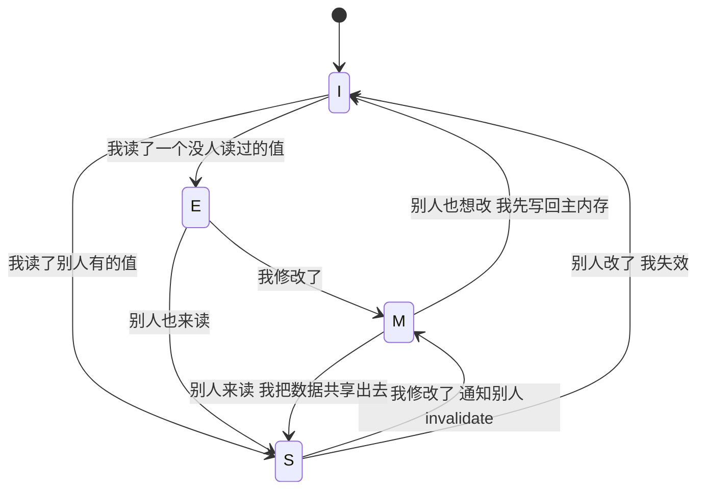

**程序员看到的是什么？**，**重排序和可见性问题**：

```java
// 看似简单的代码：
int x = 0, y = 0;
int a = 0, b = 0;

// Thread 1:           Thread 2:
x = 1;                 y = 1;
a = y;                 b = x;

// 执行完，可能出现 a == 0 && b == 0！
// 原因：CPU 把 x = 1 写到了 store buffer，还没刷到 cache
//       Thread 2 读 x 看到的是旧值 0
```

**内存屏障**，告诉 CPU"这里必须按顺序"：

| 屏障类型 | 作用 |
|---|---|
| **Store Barrier (smp_wmb)** | 之前的写必须先于之后的写完成 |
| **Load Barrier (smp_rmb)** | 之前的读必须先于之后的读完成 |
| **Full Barrier (smp_mb)** | 双向 ordering，最强 |

**各语言的内存屏障封装**：

| 语言 | 抽象 |
|---|---|
| **Java** | `volatile`（读+写都加屏障）、`synchronized`（进入+退出加屏障） |
| **C/C++** | `std::atomic` + `memory_order_*`（六种顺序模型） |
| **Go** | `sync/atomic` + channel 操作隐式加屏障 |
| **Rust** | `std::sync::atomic` + `Ordering` 枚举 |
| **C#** | `volatile`、`Interlocked`、`Thread.MemoryBarrier()` |

**核心要点**：你写的代码顺序 ≠ CPU 真实执行顺序。**只有用同步原语（锁、原子操作、屏障），才能让多核线程对内存的访问有可预期的顺序**。

---

## 5.线程生命周期

### 5.1 五态模型状态机

不同语言对线程状态的命名略有差异，但**底层的五态模型是统一的**：

```
            ┌──────────┐
            │   NEW    │ 创建但未启动
            └────┬─────┘
                 │ start()
                 ▼
            ┌──────────┐          ┌───────────┐
       ┌───→│ RUNNABLE │────────→ │  RUNNING  │───┐
       │    └──────────┘ 被调度    └─────┬─────┘   │
       │         ↑                      │          │
       │         │                      │          │
       │    调度器选中              以下事件触发      │
       │         │                      │          │
       │    ┌────┴──────────────────────┤          │
       │    │              ┌────────────┤          │
       │    │              │            │          │
       │    │              ▼            ▼          │
       │  ┌─┴────────┐ ┌────────┐ ┌─────────┐    │
       │  │ WAITING  │ │TIMED   │ │ BLOCKED │    │
       │  │(无限等待) │ │WAITING │ │(锁阻塞)  │    │
       │  └────┬─────┘ └───┬────┘ └────┬────┘    │
       │       │           │           │          │
       │  notify/     超时到期/     获得锁         │
       │  unpark      notify                      │
       │       │           │           │          │
       │       └───────────┴───────────┘          │
       │               │                          │
       └───────────────┘                          │
                                                  │
                             run()结束 / 异常       │
                                                  │
                                       ┌──────────▼──┐
                                       │ TERMINATED  │
                                       └─────────────┘
```

**五个核心状态的语义**：

1. **NEW**：线程对象已创建，但操作系统层面**还没有真正的线程**，这是 Java/C# 等托管语言才有的"中间状态"
2. **RUNNABLE / RUNNING**：可被或正被 CPU 执行，POSIX 把这两个统一叫 RUNNING，Java 把这两个统一叫 RUNNABLE
3. **WAITING / TIMED_WAITING**：主动等待某个事件，可以是无限等（WAITING）也可以带超时（TIMED_WAITING）
4. **BLOCKED**：被动等待，被锁/I/O 挡住了，等条件解除
5. **TERMINATED**：运行完成或异常退出，状态机的终态，**不可逆**

**WAITING vs BLOCKED 的本质区别**（容易搞混）：

| 维度 | BLOCKED | WAITING |
|---|---|---|
| **触发原因** | 等锁（synchronized 进不去） | 主动 wait/join/park |
| **唤醒条件** | 锁被释放 | 显式 notify/unpark |
| **持锁状态** | 没拿到锁 | **已经持有锁**，wait 会暂时释放 |
| **底层实现** | EntryList（锁的等待队列） | WaitSet（条件等待队列） |

### 5.2 跨语言状态对比

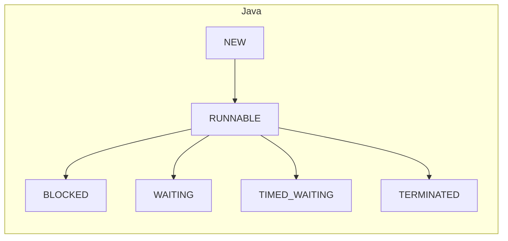

| 状态 | Java | POSIX | Go | C++ |
|---|---|---|---|---|
| 新建 | NEW | （无，pthread_create 直接 RUNNABLE） | （无） | （无） |
| 可运行 | RUNNABLE | TASK_RUNNING | _Grunnable | running |
| 锁阻塞 | BLOCKED | TASK_INTERRUPTIBLE | _Gwaiting (lock) | blocked |
| 无限等待 | WAITING | TASK_INTERRUPTIBLE | _Gwaiting (chan/cond) | waiting |
| 限时等待 | TIMED_WAITING | TASK_INTERRUPTIBLE + timer | _Gwaiting (timer) | waiting (with timeout) |
| 系统调用阻塞 | RUNNABLE（Java 看不出） | TASK_UNINTERRUPTIBLE | _Gsyscall | running (in syscall) |
| 已终止 | TERMINATED | TASK_DEAD（zombie 或 reaped） | _Gdead | terminated |

**注意一个 Java 特有的"坑"**：

```java
// Java 把 "RUNNABLE" 和 "正在做阻塞 syscall" 混为一谈
// 一个线程在 socket.read() 阻塞时，jstack 显示它是 RUNNABLE
// 但 OS 视角看它其实是 TASK_INTERRUPTIBLE（睡觉中）
```

这是因为 Java 看不到 syscall 内部，所以它只能说"我把执行权交给 native 了，理论上是可运行的"。**调试线程问题时一定要意识到这个分歧**。

### 5.3 状态转换内核视角

把第 5.1 的状态机展开到内核动作层面：

**① NEW → RUNNABLE（线程启动）**

```java
Thread t = new Thread(task);  // NEW: 仅分配 Java 对象
t.start();                     // → RUNNABLE: 
                               //   1. JVM 调用 pthread_create()
                               //   2. 内核 clone() 创建 task_struct
                               //   3. 分配线程栈（默认 1MB）
                               //   4. 加入 CFS 就绪队列
                               //   5. 等待被调度器 pick
```

**关键约束**：`start()` 只能调用一次，重复调用抛 `IllegalThreadStateException`，因为 task_struct 只创建一次。

**② RUNNABLE ↔ RUNNING（调度切换）**

```
RUNNABLE（在就绪队列里等 CPU）
    │
    │ 调度器（CFS）pick（选 vruntime 最小的）
    ▼
RUNNING（正在 CPU 上跑）
    │
    ├── 时间片用完 → 重新入队 → RUNNABLE
    ├── 更高优先级线程抢占 → RUNNABLE
    └── 主动 yield()（sched_yield syscall）→ RUNNABLE
```

**Linux CFS 调度器**：每个线程有 `vruntime`（虚拟运行时间），调度器永远 pick `vruntime` 最小的，这种"红黑树 + 虚拟时间"的设计能保证近似公平。

**③ RUNNING → BLOCKED（锁阻塞）**

```java
synchronized (lockObj) {   // 如果锁被占用
    // ...                 // → BLOCKED
}
```

底层实现（HotSpot）：

```
线程尝试获取 monitor
    │
    ├── CAS 成功 → 获得锁，继续 RUNNING
    │
    └── CAS 失败 → 自旋若干次（Adaptive Spinning）
              │
              ├── 自旋成功 → 获得锁
              └── 自旋失败 → 内核态 futex_wait()
                              │
                              ▼ 线程进入 TASK_INTERRUPTIBLE
                              ▼ task_struct 从 RQ 摘下，挂到 futex 等待队列
                              
                           锁释放时 futex_wake()
                              │
                              ▼ task_struct 重新入 RQ
                              ▼ → RUNNABLE
```

**futex 是 Linux 的核武器**：它把"无竞争场景"的锁开销做到了纯用户态（一条 CAS 指令），只有真正竞争时才陷入内核。这是 1995-2003 年 Linux 锁性能数量级提升的根本原因。

**④ RUNNING → WAITING（条件等待）**

```java
synchronized (monitor) {
    monitor.wait();      // 1. 释放 monitor 锁
                         // 2. 线程加入 WaitSet
                         // 3. 状态 → WAITING
                         
    // 被 notify 唤醒后：
                         // 4. 从 WaitSet 移到 EntryList
                         // 5. 状态 → BLOCKED（等待重新获取锁）
                         // 6. 拿到锁后 → RUNNABLE
}
```

```
┌─────── Monitor（对象监视器）───────┐
│                                    │
│   Owner: 当前持有锁的线程           │
│                                    │
│   EntryList: [T2, T3]             │ ← BLOCKED 状态
│   (等待获取锁的线程)                │
│                                    │
│   WaitSet:  [T4, T5]              │ ← WAITING 状态
│   (调用 wait() 后挂在这里)          │
│                                    │
└────────────────────────────────────┘
```

**经典面试题：wait/notify 为什么必须在 synchronized 块内？**

答：因为 wait 要做"原子地释放锁 + 进入 WaitSet"，如果不在锁块内，就没锁可释放，逻辑就不闭合了。这是 Per Brinch Hansen 1973 年发明 monitor 时定下的规矩。

**⑤ TIMED_WAITING（限时等待）**

| 触发 | 内核实现 |
|---|---|
| `Thread.sleep(ms)` | `nanosleep()` → 注册 hrtimer |
| `Object.wait(ms)` | `futex_wait()` 带 timeout |
| `Thread.join(ms)` | 上面 + 监听目标线程 TID |
| `LockSupport.parkNanos(ns)` | `futex_wait()` 带 timeout |

```
sleep(1000)
  → futex_wait(addr, val, timeout=1s)
    → 内核注册 hrtimer（高精度定时器，纳秒级）
      → 定时器到期 → 唤醒线程 → RUNNABLE
```

**⑥ → TERMINATED（终结）**

```
run() 正常返回 / 抛出未捕获异常
    │
    ▼
TERMINATED:
  1. JVM 清理线程局部资源（ThreadLocal）
  2. 唤醒所有 join() 等待的线程（pthread_exit 内部 broadcast）
  3. pthread_exit() → 内核 exit() → task_struct 进入 ZOMBIE
  4. 父线程或 detach 后由 init 进程 reap → task_struct 释放
  5. 线程栈 munmap 释放
  6. Thread 对象本身仍在 Java 堆上，等 GC
```

### 5.4 线程状态观察

会用工具查线程状态，是中高级工程师的硬技能。

**Java 系：jstack**

```bash
$ jstack <pid>
"http-nio-8080-exec-1" #25 daemon prio=5 os_prio=0 tid=0x... nid=0xa1f waiting on condition
   java.lang.Thread.State: WAITING (parking)
        at sun.misc.Unsafe.park(Native Method)
        - parking to wait for  <0x...> (a java.util.concurrent.locks.AbstractQueuedSynchronizer$ConditionObject)
        at java.util.concurrent.LinkedBlockingQueue.take(LinkedBlockingQueue.java:442)
        ...
```

**关键信息解读**：

- `nid=0xa1f`：内核线程 ID（ps 看到的 LWP）
- `Thread.State: WAITING`：Java 视角的状态
- `parking to wait for`：等的具体对象
- 调用栈：阻塞点在哪一行

**Linux 系：top / ps / pidstat**

```bash
$ ps -eLf | grep java                    # 看进程的所有线程
$ top -H -p <pid>                        # 实时看线程 CPU
$ pidstat -t -p <pid> 1                  # 每秒打印线程级统计
$ cat /proc/<pid>/task/<tid>/status      # 详细状态
$ cat /proc/<pid>/task/<tid>/wchan       # 当前在等什么内核函数
```

**Go 系：runtime.Stack / pprof**

```go
// 程序内打印所有 goroutine
buf := make([]byte, 1<<20)
n := runtime.Stack(buf, true)
fmt.Println(string(buf[:n]))

// 或者 pprof 采集
go tool pprof http://localhost:6060/debug/pprof/goroutine
```

**实战诊断流程**：

```
现象：服务卡死，CPU 不高
  ↓
top -H -p <pid>  看哪些线程在 CPU 上
  ↓
jstack <pid> > stack.txt
  ↓
grep -A 5 "BLOCKED\|WAITING" stack.txt   找阻塞线程
  ↓
看 "waiting to lock <0x...>" 和 "locked <0x...>" 的对应关系
  ↓
找到死锁环 → 修复
```

---

## 6.线程核心API

### 6.1 interrupt哲学

```java
// Java Thread 核心 API（其他语言基本同构）
Thread t = new Thread(runnable);    // 创建：仅分配对象，未启动
t.start();                           // 启动：触发 OS 创建内核线程
t.join();                            // 等待：阻塞直到 t 终结
t.join(1000);                        // 限时等待
t.interrupt();                       // 中断：设置中断标志（协作式）
t.isAlive();                         // 是否存活：NEW 和 TERMINATED 返回 false
t.isInterrupted();                   // 中断状态查询
Thread.currentThread();              // 获取当前线程
Thread.interrupted();                // 查询并清除当前线程中断标志
```

**`interrupt()` 是线程 API 设计史上最重要的一次哲学决策**，

**反例：`Thread.stop()`**（Java 1.0 提供，1.2 废弃）：

```java
// 危险：强制杀死线程
t.stop();
// 问题：
//   1. 如果线程在持有锁的临界区中被杀，锁不会被释放 → 死锁
//   2. 如果线程在更新数据 50% 时被杀，数据处于不一致状态
//   3. 抛出的 ThreadDeath 异常可以被 catch，导致行为难以预期
```

Java 团队在 1998 年果断废弃了 `stop()`，给出的替代是 `interrupt()`，**协作式取消**。

**正例：`interrupt()`**：

```java
public void run() {
    while (!Thread.currentThread().isInterrupted()) {
        try {
            // 业务逻辑
            blockingOperation();        // sleep / wait / take / lockInterruptibly
        } catch (InterruptedException e) {
            // 收到中断信号，做清理后退出
            cleanup();
            // 关键：要么 break 退出，要么重新设标志 Thread.currentThread().interrupt()
            break;
        }
    }
}
```

**协作式取消的灵魂**：

- **线程自己决定何时退出**，保证退出在"安全点"（没有持锁、数据一致）
- **阻塞 API 配合**，sleep/wait/join 等检测到中断标志会抛 InterruptedException
- **不可中断的 syscall**，比如 `socket.read()` 在 Linux 上不会响应 Java 的 interrupt（要用 NIO）

**陷阱：吞掉 InterruptedException 是大忌**

```java
// ❌ 反例
try {
    Thread.sleep(1000);
} catch (InterruptedException e) {
    // 啥也不做 ← 中断信号丢失！外层永远不知道
}

// ✅ 正例（两种姿势）
// 姿势 1：抛出去
try {
    Thread.sleep(1000);
} catch (InterruptedException e) {
    throw new RuntimeException(e);
}

// 姿势 2：恢复中断标志再继续
try {
    Thread.sleep(1000);
} catch (InterruptedException e) {
    Thread.currentThread().interrupt();   // 关键：重新设标志
    return;
}
```

### 6.2 调度控制API

| API | 语义 | 底层实现 | 注意事项 |
|-----|------|---------|---------|
| `sleep(ms)` | 让出 CPU 一段时间 | `nanosleep()` syscall | **不释放任何锁**！ |
| `yield()` | 提示调度器让出 CPU | `sched_yield()` syscall | 调度器可以**完全忽略**这个请求 |
| `setPriority(p)` | 设置优先级 | 映射到 OS nice 值 | Linux 上效果有限 |
| `Thread.currentThread()` | 获取当前线程 | TLS 中的 `__thread` 变量 | O(1)，可放心调用 |

**`sleep` vs `wait` 的本质区别**，一道经典的面试题：

```
sleep(ms):
  - Thread 类的静态方法
  - 不需要持有锁
  - 不释放任何锁（关键！）
  - 计时器到期自动唤醒
  - 可被 interrupt 打断

wait(ms):
  - Object 实例方法
  - 必须在 synchronized 块内调用
  - 释放当前对象的 monitor 锁
  - 等条件变化（notify）或超时唤醒
  - 可被 interrupt 打断
```

**为什么 sleep 不释放锁？** 因为 sleep 是"我累了想休息一下"，不应该影响临界区的边界。如果 sleep 释放锁，会让 synchronized 的语义变得诡异（中途锁就没了）。

**yield 在生产环境基本无用**，因为：

```c
// Linux sched_yield 的"魔法"
// 它告诉调度器："我自愿让出 CPU"
// 调度器的反应：
//   "好的，我把你重新放回就绪队列尾部"
//   "然后我从队列头取一个线程跑"
//   "队列头如果还是你（CPU 占用率 100% 时常见），就继续跑你"
```

所以 `yield()` 在 CPU 不忙时根本不切换，在 CPU 很忙时调度器本来就会切换，它存在的价值更多是"程序员表达意图"，实际效果不可控。

### 6.3 同步原语层级

并发原语像一座金字塔，底层硬件 → 中层 OS → 高层应用：

```
应用层  ┌─ 高级并发结构 ───────────────────────────────┐
        │  CountDownLatch / CyclicBarrier / Phaser    │
        │  BlockingQueue / ConcurrentHashMap          │
        │  Future / CompletableFuture                  │
        └────────────────────┬─────────────────────────┘
                             │ 基于
        ┌────────────────────▼─────────────────────────┐
框架层  │  AQS (AbstractQueuedSynchronizer)            │
        │  ├─ ReentrantLock                             │
        │  ├─ Semaphore                                 │
        │  ├─ ReadWriteLock                             │
        │  └─ Condition                                 │
        └────────────────────┬─────────────────────────┘
                             │ 基于
        ┌────────────────────▼─────────────────────────┐
JVM 层  │  synchronized (Monitor)                      │
        │  Object.wait / notify                        │
        └────────────────────┬─────────────────────────┘
                             │ 基于
        ┌────────────────────▼─────────────────────────┐
OS 层   │  pthread_mutex / futex                       │
        │  pthread_cond / sem_t                        │
        └────────────────────┬─────────────────────────┘
                             │ 基于
        ┌────────────────────▼─────────────────────────┐
硬件层  │  CAS（cmpxchg）/ LL/SC                        │
        │  内存屏障（mfence/lfence/sfence）             │
        │  缓存一致性协议（MESI）                       │
        └──────────────────────────────────────────────┘
```

**每一层的核心责任**：

- **硬件层**：提供"原子读改写"和"内存屏障"两个原语
- **OS 层**：用硬件原语包装出 mutex / condvar，并提供"无竞争快路径 + 有竞争慢路径"
- **JVM 层**：把 OS 原语整合到对象头，提供 synchronized 关键字
- **框架层（AQS）**：用 CAS + 队列，实现各种自定义同步器
- **应用层**：用框架层提供的高级抽象，屏蔽底层复杂性

**核心建议**：**永远从最高层选择能满足需求的原语**，能用 BlockingQueue 就别用 Lock，能用 Lock 就别用 synchronized，能用 synchronized 就别裸操 CAS。

### 6.4 AQS深度剖析

Doug Lea 的 AQS（AbstractQueuedSynchronizer）是 Java 并发包的灵魂。**理解 AQS 就理解了 ReentrantLock、Semaphore、CountDownLatch、ReadWriteLock 等一大批工具的共同骨架**。

**AQS 的核心抽象**：

```java
public abstract class AbstractQueuedSynchronizer {
    // 共享的同步状态：用 32 位 int 表达任意同步器的状态
    private volatile int state;
    
    // 等待队列（CLH 变种）：双向链表
    private transient volatile Node head;
    private transient volatile Node tail;
    
    // 子类实现：尝试获取（独占）
    protected boolean tryAcquire(int arg) { throw new UnsupportedOperationException(); }
    
    // 子类实现：尝试释放（独占）
    protected boolean tryRelease(int arg) { throw new UnsupportedOperationException(); }
}
```

**AQS 的核心思想**，**模板方法 + 状态机**：

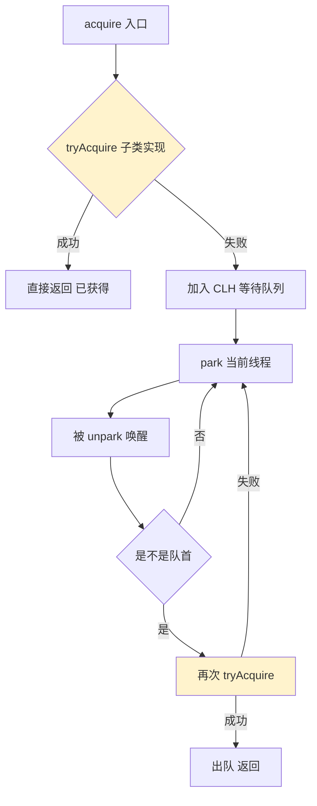

**ReentrantLock 用 AQS 的实现（精简）**：

```java
public class ReentrantLock {
    static final class Sync extends AbstractQueuedSynchronizer {
        // state = 0: 锁空闲
        // state > 0: 锁被某线程持有，state 表示重入次数
        
        protected boolean tryAcquire(int acquires) {
            Thread current = Thread.currentThread();
            int c = getState();
            if (c == 0) {
                // 锁空闲，CAS 抢锁
                if (compareAndSetState(0, acquires)) {
                    setExclusiveOwnerThread(current);
                    return true;
                }
            } else if (current == getExclusiveOwnerThread()) {
                // 已经是当前线程持有，重入
                int nextc = c + acquires;
                setState(nextc);
                return true;
            }
            return false;
        }
        
        protected boolean tryRelease(int releases) {
            int c = getState() - releases;
            boolean free = (c == 0);
            if (free) setExclusiveOwnerThread(null);
            setState(c);
            return free;
        }
    }
}
```

**整个并发包靠 AQS 实现的工具**：

| 工具 | state 含义 | 模式 |
|---|---|---|
| **ReentrantLock** | 重入次数 | 独占 |
| **Semaphore** | 剩余许可数 | 共享 |
| **CountDownLatch** | 还需倒数次数 | 共享 |
| **ReentrantReadWriteLock** | 高 16 位读锁数，低 16 位写锁数 | 混合 |
| **CyclicBarrier** | 用 ReentrantLock + Condition | 复合 |

**AQS 的天才设计点**：

- **state 用 int 表达一切**：把"同步状态"抽象成一个整数，子类自己解释含义
- **CLH 队列优雅处理排队**：双向链表 + 原子 CAS 入队/出队
- **park/unpark 替代 wait/notify**：不需要先持有锁，灵活很多

---

## 7.跨语言线程对比

### 7.1 Java虚拟线程

**经典 Java Thread（1:1 平台线程）**：

```java
public class JavaThreadDemo {
    public static void main(String[] args) throws Exception {
        // 方式 1：继承 Thread
        Thread t1 = new Thread() {
            public void run() { System.out.println("T1"); }
        };
        t1.start();
        
        // 方式 2：实现 Runnable（推荐）
        Thread t2 = new Thread(() -> System.out.println("T2"));
        t2.start();
        
        // 方式 3：线程池（生产推荐）
        ExecutorService pool = Executors.newFixedThreadPool(4);
        Future<Integer> future = pool.submit(() -> 42);
        System.out.println(future.get());
        pool.shutdown();
    }
}
```

**Java 21 Virtual Threads（M:N 虚拟线程）**：

```java
// 创建 100 万个虚拟线程，每个仅几 KB 栈
try (var exec = Executors.newVirtualThreadPerTaskExecutor()) {
    IntStream.range(0, 1_000_000).forEach(i -> {
        exec.submit(() -> {
            Thread.sleep(Duration.ofSeconds(1));
            return i;
        });
    });
}
// 这段代码在普通笔记本上能跑，传统线程会 OOM
```

**虚拟线程的核心机制**：

- **载体线程（carrier thread）**：少数几个 ForkJoinPool 平台线程作为"打工仔"
- **挂载/卸载（mount/unmount）**：虚拟线程被分派到载体线程跑，遇到阻塞就自动卸载
- **栈拷贝**：卸载时栈帧被复制到堆上，挂载时复制回来

**性能对比**：

| 维度 | 平台线程 | 虚拟线程 |
|---|---|---|
| 栈大小 | 1 MB 起 | 几 KB 起 |
| 创建开销 | ~100 μs | ~1 μs |
| 切换开销 | ~1-2 μs | ~100 ns |
| 100 万并发 | OOM | 几百 MB 内存 |

**Java 21 之后 ServerSocket + 虚拟线程的"魔法"**：

```java
ServerSocket server = new ServerSocket(8080);
while (true) {
    Socket client = server.accept();
    Thread.startVirtualThread(() -> handle(client));   // 来一个开一个
}
// 看上去像 1 万个线程，实际上只有几个平台线程在跑
// 同步写法 = 异步非阻塞性能
```

### 7.2 C/C++贴内核

**POSIX pthread（C）**：

```c
#include <pthread.h>
#include <stdio.h>

void* worker(void* arg) {
    long id = (long)arg;
    printf("worker %ld\n", id);
    return NULL;
}

int main() {
    pthread_t threads[4];
    for (long i = 0; i < 4; i++) {
        pthread_create(&threads[i], NULL, worker, (void*)i);
    }
    for (int i = 0; i < 4; i++) {
        pthread_join(threads[i], NULL);
    }
    return 0;
}
```

**C++11 std::thread**：

```cpp
#include <thread>
#include <iostream>
#include <vector>

int main() {
    std::vector<std::thread> threads;
    for (int i = 0; i < 4; i++) {
        threads.emplace_back([i] {
            std::cout << "thread " << i << "\n";
        });
    }
    for (auto& t : threads) t.join();
}
```

**C++ 锁的 RAII 用法**，最优雅的封装之一：

```cpp
#include <mutex>

std::mutex m;
int counter = 0;

void increment() {
    std::lock_guard<std::mutex> lock(m);   // 进入构造时加锁
    counter++;
}                                           // 退出作用域时自动解锁
// 即使中间抛异常，锁也会被正确释放
```

**C++20 协程**（需要自己写或用第三方调度器）：

```cpp
task<int> async_compute() {
    co_await some_io();
    co_return 42;
}
```

### 7.3 Go与GMP

```go
package main

import (
    "fmt"
    "sync"
)

func main() {
    var wg sync.WaitGroup
    
    // 创建 1000 个 goroutine
    for i := 0; i < 1000; i++ {
        wg.Add(1)
        go func(id int) {           // go 关键字 = 创建 goroutine
            defer wg.Done()
            fmt.Println("goroutine", id)
        }(i)
    }
    
    wg.Wait()
}
```

**Go channel ， "用通信代替共享"**：

```go
// 经典生产者-消费者
ch := make(chan int, 100)

// 生产者
go func() {
    for i := 0; i < 1000; i++ {
        ch <- i        // 发送到 channel
    }
    close(ch)
}()

// 消费者
go func() {
    for v := range ch {
        fmt.Println(v)
    }
}()
```

**Go 的核心理念**："Don't communicate by sharing memory; share memory by communicating."

**Go 的同步原语**：

| 原语 | 用法 |
|---|---|
| `sync.Mutex` | 互斥锁 |
| `sync.RWMutex` | 读写锁 |
| `sync.WaitGroup` | 等待一组 goroutine 完成 |
| `sync.Once` | 保证某操作只执行一次 |
| `sync/atomic` | 原子操作 |
| `chan` | 通信 |

### 7.4 JS单线程逆袭

```javascript
// 主线程
console.log('1');
setTimeout(() => console.log('2'), 0);
Promise.resolve().then(() => console.log('3'));
console.log('4');
// 输出顺序：1, 4, 3, 2
// 因为：同步代码 → 微任务（Promise）→ 宏任务（setTimeout）

// Worker 多线程
const worker = new Worker('worker.js');
worker.postMessage({ data: [1, 2, 3] });
worker.onmessage = (e) => console.log('result:', e.data);
```

**Event Loop 的核心调度逻辑**：

```javascript
while (true) {
    // 1. 执行调用栈所有同步代码
    runStack();
    
    // 2. 执行所有微任务（Promise.then、queueMicrotask）
    while (hasMicrotask()) {
        runMicrotask();
    }
    
    // 3. 执行一个宏任务（setTimeout、I/O）
    if (hasMacrotask()) {
        runOneMacrotask();
    }
    
    // 4. 渲染（仅浏览器，requestAnimationFrame）
    render();
}
```

**Node.js worker_threads**：

```javascript
const { Worker, isMainThread, parentPort } = require('worker_threads');

if (isMainThread) {
    const worker = new Worker(__filename);
    worker.on('message', msg => console.log(msg));
    worker.postMessage('hello');
} else {
    parentPort.on('message', msg => {
        parentPort.postMessage(`got ${msg}`);
    });
}
```

### 7.5 Kotlin协程魔法

```kotlin
import kotlinx.coroutines.*

fun main() = runBlocking {
    // 创建 10 万个协程，每个只占几百字节
    val jobs = List(100_000) {
        launch {
            delay(1000)
            // 这里"挂起"不阻塞线程
        }
    }
    jobs.forEach { it.join() }
}
```

**Kotlin 协程的本质**，**编译期把 suspend 函数变成状态机**：

```kotlin
// 你写的代码
suspend fun fetchData(): String {
    val a = fetchA()   // suspend
    val b = fetchB()   // suspend
    return "$a$b"
}

// 编译器生成的等价代码（伪）
fun fetchData(continuation: Continuation<String>): Object {
    when (continuation.label) {
        0 -> {
            continuation.label = 1
            return fetchA(continuation)   // 挂起点
        }
        1 -> {
            continuation.label = 2
            return fetchB(continuation)   // 挂起点
        }
        2 -> {
            return continuation.a + continuation.b
        }
    }
}
```

每个挂起点变成状态机的一个 label，**协程不阻塞线程**，因为函数压根没在等待，它只是把状态保存下来回头再来。

### 7.6 横向对比总表

| 语言 | 线程模型 | 并发单元 | 创建开销 | 同步原语 | CPU 并行 | 异步模型 | 典型并发上限 |
|------|---|---|---|---|---|---|---|
| **Java（传统）** | 1:1 | Thread | ~1MB 栈 | synchronized/Lock | ✓ | CompletableFuture | ~1 万 |
| **Java（虚拟）** | M:N | VirtualThread | ~几 KB | 同上 | ✓ | 同步即异步 | 百万级 |
| **C/C++** | 1:1 | pthread | ~1MB 栈 | mutex/atomic | ✓ | C++20 coroutine | ~1 万 |
| **Go** | M:N | goroutine | 2KB 栈 | channel/Mutex | ✓ | 原生协程 | 百万级 |
| **Rust** | 1:1 + async | thread/Task | ~2MB 栈 | Mutex/Channel | ✓ | async/await + Tokio | 百万级（async） |
| **JavaScript** | 单线程 + Worker | Promise/Worker | Worker 较重 | 消息传递 | Worker 有限 | Promise/async | 单线程几千 |
| **Kotlin** | M:N（JVM 池）| Coroutine | 极轻 | Channel/Flow | ✓ | 原生协程 | 百万级 |
| **Python** | 1:1 + GIL | Thread/asyncio | ~MB 栈 | Lock/Queue | ❌（GIL） | asyncio | ~1 万（async） |
| **Erlang** | M:N（BEAM） | Process | ~几百字节 | Mailbox | ✓ | 原生 Actor | 千万级 |

**一句话挑选指南**：

- **CPU 密集业务** → Java / C++ / Rust 平台线程
- **I/O 密集 / 高并发服务** → Go / Java VirtualThread / Rust async
- **前端 / 浏览器** → JavaScript（没得选）
- **Android 应用** → Kotlin Coroutine
- **极高并发分布式** → Erlang / Elixir / Akka

### 7.7 线程演进趋势

**趋势一：虚拟线程 / 协程主流化**

Java 21、Kotlin、Swift、C++20、Rust async、Python asyncio，所有主流语言都在朝"轻量并发单元 + 用户态调度"演进。**1:1 模型在百万并发场景下是死路**，业界已经达成共识。

**趋势二：结构化并发（Structured Concurrency）**

```java
// Java 21+ 结构化并发（预览）
try (var scope = new StructuredTaskScope.ShutdownOnFailure()) {
    Future<String> user = scope.fork(() -> fetchUser());
    Future<String> order = scope.fork(() -> fetchOrder());
    
    scope.join();              // 等所有子任务
    scope.throwIfFailed();     // 任一失败则全部取消
    
    return user.resultNow() + order.resultNow();
}
// 关键特性：
//   - 子任务的生命周期严格在父作用域内
//   - 父作用域结束时自动取消所有未完成子任务
//   - 异常自动传播
```

这是从"无序并发"到"层级化并发"的根本转变，**让并发代码像顺序代码一样有清晰的边界**。

**趋势三：无共享 + 消息传递架构**

```
共享内存 + 锁 ──── 容易出错 ──→ 越来越被边缘化
                                   │
消息传递 ──── 天然安全 ──→ 越来越被推崇
                                   │
                            Erlang Actor / Go channel / Akka
```

特别是分布式时代，**单机多线程的同步原语永远跨不了网络**，所以"消息传递"既能在单机内用又能跨节点用，是更通用的模型。

**趋势四：异步 / 同步统一**

Virtual Thread 的最大价值是 ， **同步代码 = 异步性能**。再也不需要 `CompletableFuture.thenCompose().thenApply().handle()` 的回调地狱，写普通的 `read() / process() / write()` 就行。

---

## 8.经典陷阱反模式

### 8.1 创建陷阱

**❌ 反例 1：直接 `new Thread()` 而不用线程池**

```java
// 错误：每次请求都创建新线程
public void handleRequest(Request req) {
    new Thread(() -> process(req)).start();
}
// 后果：高并发时线程数无上限 → OOM
```

**✅ 正例：用线程池**

```java
private static final ExecutorService POOL = 
    new ThreadPoolExecutor(
        4, 16,                                  // 核心 / 最大
        60, TimeUnit.SECONDS,
        new ArrayBlockingQueue<>(1000),         // 有界队列
        new ThreadFactoryBuilder()
            .setNameFormat("biz-%d")            // 命名！便于排查
            .build(),
        new ThreadPoolExecutor.AbortPolicy());  // 满了拒绝
```

**❌ 反例 2：用 `Executors.newCachedThreadPool()`**

```java
ExecutorService pool = Executors.newCachedThreadPool();
// 看似友好，实则危险：最大线程数 Integer.MAX_VALUE
// 突发流量时秒级创建几万线程 → OOM
```

**❌ 反例 3：忘记 shutdown 线程池**

```java
public void doSomething() {
    ExecutorService pool = Executors.newFixedThreadPool(4);
    pool.submit(...);
    // 忘了 pool.shutdown()
    // → 进程退不掉，因为线程池里有非守护线程
}
```

### 8.2 中断陷阱

**❌ 反例：吞掉 InterruptedException**

```java
try {
    Thread.sleep(1000);
} catch (InterruptedException e) {
    // 啥也不做
    // → 中断标志被 sleep 清除，外层永远收不到取消信号
    // → 任务没法 graceful shutdown
}
```

**✅ 正例**：

```java
try {
    Thread.sleep(1000);
} catch (InterruptedException e) {
    Thread.currentThread().interrupt();   // 关键：恢复标志
    cleanup();
    return;
}
```

**❌ 反例：不响应中断的死循环**

```java
while (true) {                  // ← 永远不退出
    process();
}

// ✅ 正例
while (!Thread.currentThread().isInterrupted()) {
    process();
}
```

### 8.3 内存可见性陷阱

**❌ 反例：用普通 boolean 做停止标志**

```java
class Worker extends Thread {
    private boolean stopped = false;          // 缺 volatile
    
    public void run() {
        while (!stopped) {                    // 可能永远读到 false
            doWork();
        }
    }
    
    public void shutdown() {
        stopped = true;                       // 写不一定对其他线程可见
    }
}
// 真实事故：JIT 把 while(!stopped) 优化成 while(true)
//          因为它看不到任何线程在改 stopped
```

**✅ 正例**：

```java
private volatile boolean stopped = false;     // volatile 保证可见性
```

或更现代的：

```java
private final AtomicBoolean stopped = new AtomicBoolean(false);
```

### 8.4 调试与定位

**实战技巧 1：所有线程必须命名**

```java
Thread t = new Thread(task, "biz-worker-" + i);
// 排查问题时 jstack 一目了然，否则全是 "Thread-1, Thread-2..."
```

**实战技巧 2：死锁检测**

```bash
# JDK 自带工具
$ jstack <pid> | grep -A 20 "deadlock"
Found one Java-level deadlock:
=============================
"Thread-1": waiting to lock monitor 0x... 
   which is held by "Thread-2"
"Thread-2": waiting to lock monitor 0x...
   which is held by "Thread-1"
```

**实战技巧 3：CPU 100% 定位**

```bash
$ top -H -p <pid>           # 找占用最高的线程
PID    %CPU
12346  98%   ← 找到这个

$ printf '%x\n' 12346       # 转十六进制
303a

$ jstack <pid> | grep -A 30 "nid=0x303a"
# 看到对应线程在做什么
```

**实战技巧 4：结构化日志带 traceId**

```java
MDC.put("traceId", UUID.randomUUID().toString());
// 多线程日志能按 traceId 聚合
```

### 8.5 跨语言陷阱速查

> 同一类陷阱在不同语言里"长相不同"，但**根因是同一个 OS / CPU 事实**。这张速查表是 Code Review 时的"X 光机"。

| 陷阱类别 | Java | C/C++ | Go | JavaScript | Python | 根因（OS / CPU 事实） |
|---|---|---|---|---|---|---|
| **创建过多** | `new Thread()` × 1 万 → OOM | `pthread_create` × N → 进程崩 | `go fn()` × 百万 → 内存炸 | Web Worker × N → 浏览器卡死 | `threading.Thread` × N → GIL 不香 | 每个线程独占栈（MB 级），物理内存有上限 |
| **栈溢出** | `StackOverflowError` | `SIGSEGV`（地址越界） | `runtime: goroutine stack exceeds limit` | RangeError: Maximum call stack | `RecursionError` | 栈是固定大小（Java/C 默认 1-8MB；Go 初始 2KB 动态增长） |
| **可见性** | 忘了 `volatile`，循环读不到新值 | 忘了 `_Atomic` 或 `memory_order` | data race（`-race` 检测） | 单线程没此问题，**Worker 间需 postMessage** | GIL 表面安全，多进程必现 | CPU 缓存 + 写缓冲 + 指令重排 |
| **死锁** | 锁顺序不一致 → 4 线程互等 | `pthread_mutex` 同上 | `sync.Mutex` 同上；channel 死锁额外 | 单线程无死锁，但 await chain 可循环挂起 | `threading.Lock` 同 Java | 多个线程持有部分资源、等对方释放，拓扑形成环 |
| **中断/取消** | `Thread.stop()` 已废弃，必须用 `interrupt()` + 协作检查 | `pthread_cancel` 谨慎使用（清理可能不全） | `context.Context` cancel，必须显式检查 | `AbortController` | 没有真正的强制中断 | OS 不知道"清理"的语义，必须协作式 |
| **资源泄漏** | 忘了关线程池 → JVM 不退出 | `pthread_detach` 漏调用 → 句柄泄漏 | 漏 close channel → goroutine 永远阻塞 | setInterval 忘 clear | Thread 不 join 也会泄漏 | 执行流是 OS / Runtime 的资源，必须显式回收 |
| **栈不共享误用** | ThreadLocal 在虚拟线程下慎用 | 错把局部变量传给新线程 | goroutine 闭包捕获循环变量 | Worker 无共享内存（SAB 例外） | 同 Java | 栈是每线程独立的，传指针/引用要小心生命周期 |
| **优先级反转** | 高优先级线程等低优先级线程的锁 | RT-Linux 必须开 PI mutex | 一般无（Go 没有优先级） | 无 | 无 | 高优等低优持有的锁，低优却被中优抢占调度 |
| **惊群（thundering herd）** | `notifyAll` 唤醒太多 | `pthread_cond_broadcast` | channel close 时所有 receiver 同时唤醒 | 多 Worker 同时 fetch | 同 Java | 一个事件唤醒多个等待者，只有一个能拿到资源 |
| **伪共享（false sharing）** | 两 long 字段在同一 cache line | 同 Java（更常见） | `runtime/internal/cpu` 或手工 padding | 单线程不发生 | GIL 掩盖 | 不同核写同一 cache line → MESI 反复失效 |

**速查使用方法**：

```mermaid
flowchart LR
    A[发现并发 Bug] --> B{现象类型}
    B -->|进程崩溃 OOM| C[查"创建过多"行]
    B -->|读到旧值| D[查"可见性"行]
    B -->|线程卡死| E[查"死锁/中断"行]
    B -->|性能突降| F[查"伪共享/惊群"行]
    C & D & E & F --> G[按语言列<br/>找当前栈对应的工具]
    style G fill:#d4edda
```

---

## 9.一句话总结

> **线程不是"另一颗 CPU"，而是 OS 编织的一个温柔的谎言，它在单个 CPU 上用"快速切换"模拟"同时执行"，用"共享地址空间"换"轻量与高效"，再把"并发安全"这笔代价转嫁给应用层。**

### 9.1 三层认知升华

**第一层（机制层）：线程是被调度的最小执行流**

- 线程 = PC + 寄存器组 + 栈 + TLS（每线程独立的最小状态）
- 共享的是：代码段 / 堆 / 文件描述符 / 信号处理表（同进程的"公共财产"）
- 切换一次同进程线程 ≈ 1-2 μs，跨进程 ≈ 3-5 μs（差距来自 TLB 刷新）
- 时间片轮转 + 抢占式调度，造成"并行"的幻觉

**第二层（设计层）：线程是"资源容器"和"执行单元"的正交分解**

- 进程负责装资源（mm/files/signal），线程负责跑代码（task_struct + stack）
- Linux 用统一的 `task_struct` 表示两者，仅通过 `clone` 标志位区分，这是 Unix "一切皆文件 / 一切皆任务"哲学的体现
- 1:1 / N:1 / M:N 三种映射模型，本质是**"调度由谁做"**这件事如何分工：内核独占 / 用户态独占 / 两者协作

**第三层（哲学层）：并发是一种"以复杂性换吞吐"的工程债**

- 线程让你免费拿到了 10× 的并行收益，但把数据竞争、死锁、可见性、有序性这四座大山压在了应用层
- 现代演化（Goroutine / VirtualThread / Async-Await）的共同方向：**让"并发的写法"回到顺序代码的简单，把复杂性彻底封装到 Runtime**
- **真正理解线程的标志**：不是会写 `new Thread().start()`，而是看到一段同步代码就能在脑中模拟出 OS 调度器、CPU 缓存、内存屏障三者的合奏

### 9.2 终极建议

| 场景 | 推荐姿势 |
|---|---|
| 业务代码 | **永远用线程池/虚拟线程**，不要直接 `new Thread` |
| CPU 密集型 | 线程数 ≈ CPU 核数（更多反而被切换吃掉） |
| I/O 密集型 | 用虚拟线程 / 协程 / 异步 IO，避免栈内存爆炸 |
| 跨线程数据 | **不可变 + 消息传递 > 共享 + 加锁**（Erlang / Go 的智慧） |
| 调试卡死 | 先 jstack 看线程状态，再追到 BLOCKED / WAITING 的根因，而不是盲目重启 |
| 关键操作 | 给线程命名，便于 jstack/perf 定位问题 |
| 生产线程池 | 必须有界队列 + 命名工厂 + 拒绝策略 + 监控指标 |

### 9.3 四个关键收获

1. **线程的轻量来自"共享地址空间"，也来自"放弃故障隔离"**：一个线程 OOM 整个进程崩
2. **三种线程模型本质是"调度权"的归属之争**：1:1 全交内核，N:1 全留用户态，M:N 协作分工
3. **同步原语是金字塔结构**：硬件 CAS / OS futex / JVM monitor / AQS / 高级工具，永远从最高层选
4. **协程 / 虚拟线程不是"取代线程"，是"把线程做得更轻"**：用户态调度器 + 极小栈 + 自动挂起恢复

### 9.4 延伸阅读

- → [12.线程通信设计思想](https://yccoding.com/pages/70930d/)：当线程多起来，它们如何安全交换数据
- → [13.线程异常设计原理](https://yccoding.com/pages/9d09d4/)：线程内异常为何不会传染外部，怎么向外传递
- → [14.多线程并发经典案例](https://yccoding.com/pages/3983c8/)：把上述原理落到生产实战的 N 个经典案例
- → [18.锁核心设计和思想](https://yccoding.com/pages/db7194/)：synchronized / ReentrantLock 怎么实现互斥
- → [23.协程核心设计思想](https://yccoding.com/pages/5ebc69/)：从内核线程到用户态协程的范式跃迁

## 10.案例驱动剖析

前面把线程的 from-scratch 原理讲完了。这一章用三个**真实生产事故**把所有原理点串起来，读完你就知道"理论"和"工程"之间还差几公里。

### 10.1 12306压垮Tomcat

**时间**：2014 年春运，某抢票软件创建 1000+ 线程并发请求，导致 12306 单台 Tomcat 内存爆掉。

**复现代码**：

```java
for (int i = 0; i < 1000; i++) {
    new Thread(() -> queryTicket()).start();   // ← 直接 new Thread
}
```

**事故链条**：

```
1000 个线程 × 默认 1MB 栈 = 1GB 栈内存
  ↓
JVM 堆内存只剩可怜的几百 MB
  ↓
GC 频繁 Full GC 但无法释放栈空间（栈不在堆里）
  ↓
新线程 OutOfMemoryError: unable to create new native thread
  ↓
现有线程上下文切换风暴，CPU sys% 飙到 60%
  ↓
Tomcat 整个进程无响应 → 服务雪崩
```

**真正的问题不是"线程多"，而是"栈大"**：

```
1MB × 1000 = 1GB（看似不多）
但 JVM 的进程地址空间是有上限的（32位 JVM 只有 4GB）
栈区和堆区共享虚拟地址空间 → 此消彼长
```

**修复方式三选一**：

| 方案 | 原理 | 适用场景 |
|------|------|---------|
| 限流 + 线程池 | 复用线程，限制并发 | 大多数业务 |
| 减小栈大小 `-Xss256k` | 单线程占用降低 | 不深递归的场景 |
| 虚拟线程（JDK 21） | 栈按需增长，初始几 KB | 大规模 IO 密集 |

**学到了什么**：**线程的"轻量"是相对的**，比进程轻 100 倍，但依然不是免费的。**任何"创建线程"的代码出现在生产环境，都应该被代码评审拒绝**。

### 10.2 Netty百万连接

**反向案例**：Netty 在生产环境用极少数线程（通常 = 2 × CPU 核数）撑起百万连接。

**核心设计**：


**关键**：**线程不再绑定连接**。传统 BIO 是"一个连接一个线程"（C10K 问题的根源），Netty 是"一个线程多个连接"，线程只在数据真正到来时才工作。

**这就是 Reactor 模式**：

```
传统 BIO:  thread.read() → 阻塞等数据 → 线程睡死
Reactor:   selector.select() → 哪个 channel 有数据 → 线程处理它 → 立刻继续 select
```

**学到了什么**：**线程数和并发数不必相等**。理解了"线程在阻塞 IO 时纯属浪费"，才能设计出 Netty/Nginx 这种百万级并发系统。**虚拟线程（Loom）的本质就是把这个模式从框架层下沉到 JVM 层**，你写的每行 IO 代码自动获得 Reactor 的好处。

### 10.3 jstack看死锁

**线上现象**：服务无响应，CPU 0%，所有请求超时。

**第一步：jstack 抓栈**

```bash
jps                          # 找到 PID
jstack -l <pid> > stack.txt  # -l 输出锁信息
```

**第二步：找 BLOCKED**

```
"Thread-A" #15 BLOCKED
   waiting for monitor 0x00007f8c (Lock-B)
   held by "Thread-B"
   at app.OrderService.pay(OrderService.java:45)
   - locked <0x9a> (Lock-A)             ← 持有 A，等 B

"Thread-B" #16 BLOCKED
   waiting for monitor 0x00009a (Lock-A)
   held by "Thread-A"
   at app.OrderService.refund(OrderService.java:88)
   - locked <0x7f8c> (Lock-B)           ← 持有 B，等 A
```

**第三步：jstack 末尾的死锁报告**

JDK 的 jstack 会自动检测死锁循环：

```
Found one Java-level deadlock:
=============================
"Thread-A":
  waiting to lock monitor 0x... (object 0x..., a Lock-B),
  which is held by "Thread-B"
"Thread-B":
  waiting to lock monitor 0x... (object 0x..., a Lock-A),
  which is held by "Thread-A"
```

**修复**：保证锁的获取顺序在所有路径上一致（按对象 ID 排序后再加锁）。

**学到了什么**：**线上的"卡死"99% 是死锁或锁等待**。jstack 是工程师的标配工具，不会用 jstack 等于不会调试 Java 并发问题。

## 11.线程未来

### 11.1 虚拟线程颠覆

JDK 21 正式推出虚拟线程，**这是线程模型 30 年来最大的范式转变**。

**传统线程的死结**：

```
1MB 栈 × 1 万线程 = 10GB 内存（不可能）
解决方案：异步回调 / 反应式 → 代码反人类
```

**虚拟线程的破局**：

```
512B 栈起步，按需增长 × 100 万线程 = 几百 MB（轻松）
但代码写起来还是同步阻塞风格 → 反人类的代码消失了
```

**核心机制**：

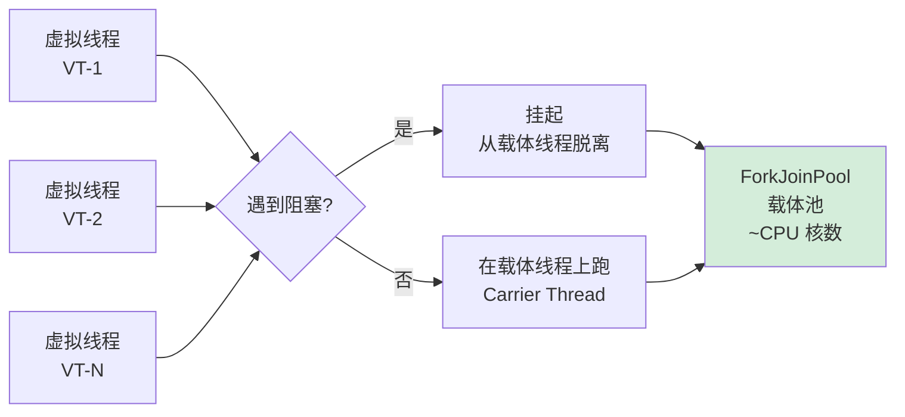

**关键魔法**：当虚拟线程调用阻塞 IO 时（如 `socket.read()`），JDK 自动把它从载体线程上"摘下来"，IO 完成后再"挂回"任意一个载体线程。**这就是 Reactor 模式被 JDK 实现到了底层**。

### 11.2 结构化并发

**问题**：传统的"启动线程→不管它"导致线程泄漏、异常吞噬。

**解决**：JDK 21 引入 `StructuredTaskScope`，把多个虚拟线程绑成一个"作用域"：

```java
try (var scope = new StructuredTaskScope.ShutdownOnFailure()) {
    Subtask<User> user = scope.fork(() -> fetchUser(id));
    Subtask<Order> order = scope.fork(() -> fetchOrder(id));

    scope.join();          // 等所有子任务
    scope.throwIfFailed(); // 任一失败 → 全部取消

    return new View(user.get(), order.get());
}
// 离开 try-with-resources：所有子任务必然终结
```

**对比传统 ExecutorService**：

| 维度 | ExecutorService | StructuredTaskScope |
|------|----------------|---------------------|
| 生命周期 | 全局，不绑定上下文 | 绑定到代码块 |
| 子任务管理 | Future 各自孤立 | 整体 join / 整体取消 |
| 异常传播 | 默认吞噬 | 任一失败全部失败 |
| 资源泄漏 | 容易 | 几乎不可能 |

### 11.3 结构化设计哲学

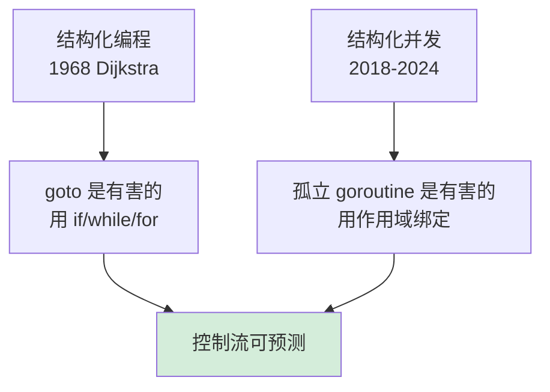

**核心信念**：**并发任务的生命周期必须显式归属于某个作用域**，不能"启动一个 goroutine 然后忘记"。这个理念正在所有现代语言中传播：

- Java: `StructuredTaskScope`（JDK 21）
- Kotlin: `coroutineScope { ... }`
- Swift: `TaskGroup`
- Python: `asyncio.TaskGroup`（3.11）

## 12.七字真言映射

> 开篇提出的七字真言，**抽象 / 共享 / 调度 / 切换 / 同步 / 隔离 / 演化**，是线程设计的"骨架"。下面把它落到 7 种主流语言上，你会看到："骨架完全一致，只是外皮不同"。

| 七字 | 通用本质 | Java | C/POSIX | C++ | Go | Rust | JS / Node | Python |
|---|---|---|---|---|---|---|---|---|
| **抽象** | 执行流 = PC+寄存器+栈+TLS | `Thread` / `VirtualThread` | `pthread_t` | `std::thread` | `goroutine`(G) | `std::thread` / `tokio::task` | Worker / async task | `Thread` / `coroutine` |
| **共享** | 同进程线程共享地址空间 | 堆共享 + ThreadLocal | 全局变量共享 + `__thread` | 同 C + `thread_local` | 闭包捕获 + GC 堆 | 所有权强制+`Arc<Mutex>` | Worker 不共享（SAB 例外） | 共享 + GIL 限制并行 |
| **调度** | 谁决定"现在跑谁" | 1:1 OS 调度（VT 走 Loom） | 内核 CFS / RT | 同 C | M:N GMP（用户态+OS） | OS 调度（async 由 Runtime） | 事件循环+微任务 | 内核+GIL（CPU 单核运行） |
| **切换** | 保存状态+换栈+恢复 | 走 OS（1-5μs）/ VT（~200ns） | OS 切换（1-5μs） | 同 C | 用户态切换（~200ns） | OS / Runtime 双态 | 任务级切换（≈ 0） | OS 切换+GIL 释放 |
| **同步** | 三件武器+高层封装 | `synchronized`/AQS/JUC | `mutex`/`cond`/`futex` | `mutex`/`atomic`/`barrier` | `channel`/`sync` | `Mutex<T>`+ownership | `Atomics`/`postMessage` | `Lock`/`Queue`/`async` |
| **隔离** | 每线程独立栈+TLS | 栈+ThreadLocal | 栈+`__thread` | 栈+`thread_local` | 每 G 独立栈（KB 起步） | 栈+`thread_local` | Worker 进程级隔离 | 栈+`threading.local` |
| **演化** | 重→轻→编译期消除 | 平台线程 → 虚拟线程 | pthread → io_uring | C++20 协程 | goroutine 一步到位 | thread → async/await | 单线程事件循环 → Worker | thread → asyncio |

**横向看一行**，例如"切换"，你会发现：所有语言都在做**同一件事的不同实现**（保存/恢复状态），代价从 1-5μs 一路压到 ≈ 0。**这就是线程演化史的全部**：用更聪明的抽象，把"切换"这件事做得越来越便宜。

**纵向看一列**，例如 Go，你会发现：每一种语言的线程模型都是七个字的"特定配方"。理解了配方，你就能预判它的优势、陷阱、和"不该被用在哪儿"。

---

### 12.1 终极一句话

> **线程不是物理实体，而是"执行流的最小调度单位"，它的全部设计，都围绕"如何在有限的 CPU 核数上跑出无限多的并发逻辑"展开**。
> 从 1:1 的内核线程到 N:1 的协程，再到 M:N 的虚拟线程，本质上是**"调度权归谁"**的不断博弈：交给内核（简单但贵）、留在用户态（轻但失去抢占）、还是协作分工（复杂但最优）。理解了线程不是"小进程"而是"共享地址空间下的执行流"，理解了同步原语本质都是 **CAS + 屏障 + futex** 的不同包装，**你才有资格说自己"懂多线程"**，而剩下所有的并发问题（锁、死锁、可见性、性能、调试），都是在这个根基上做加法。

