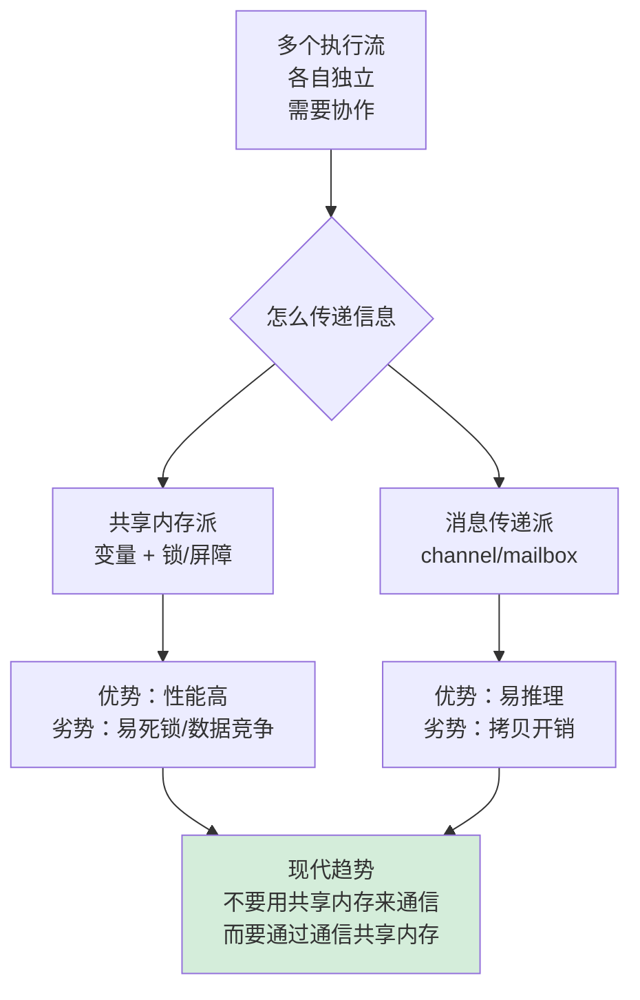
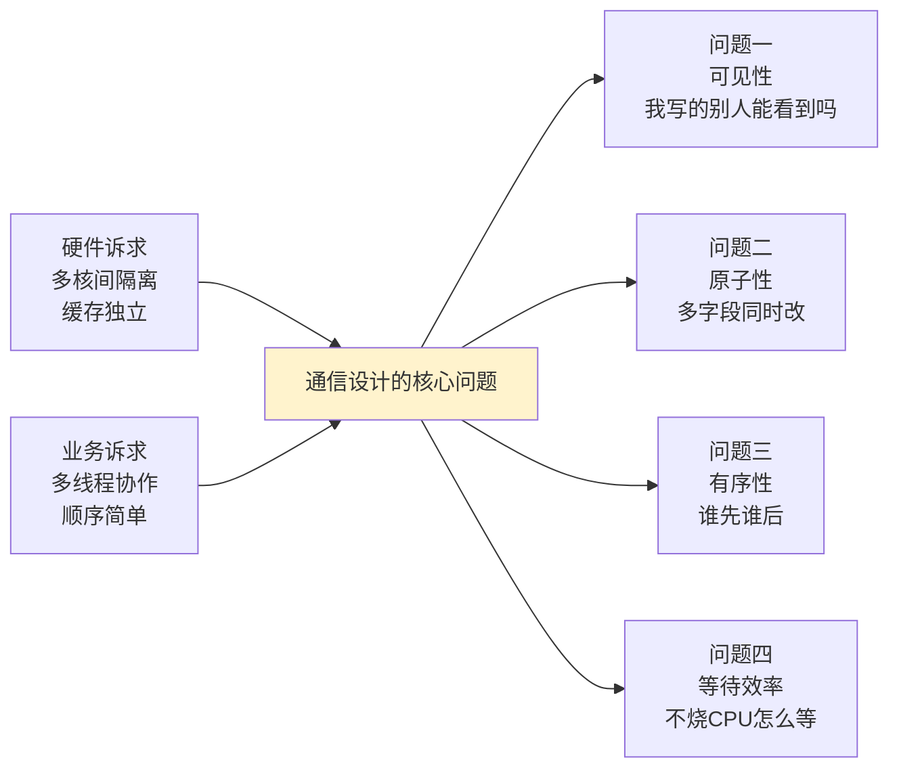
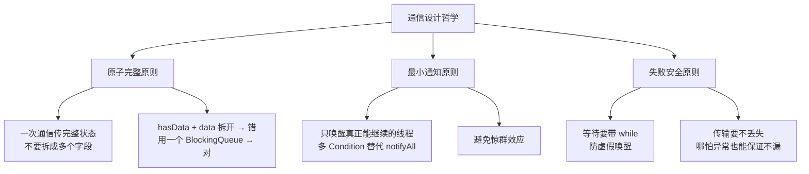
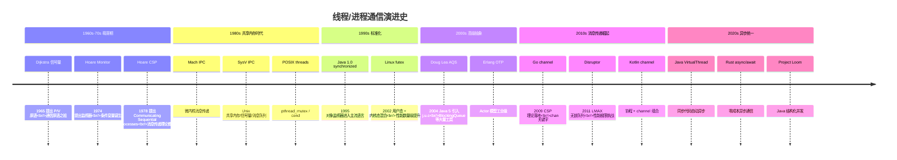
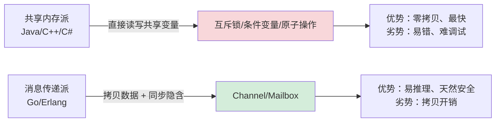
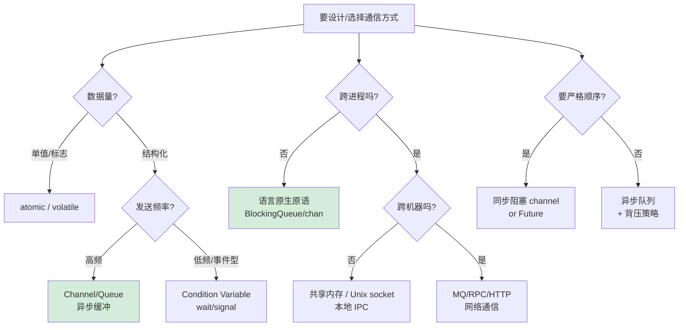
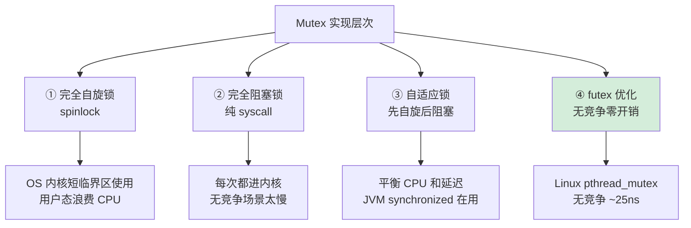
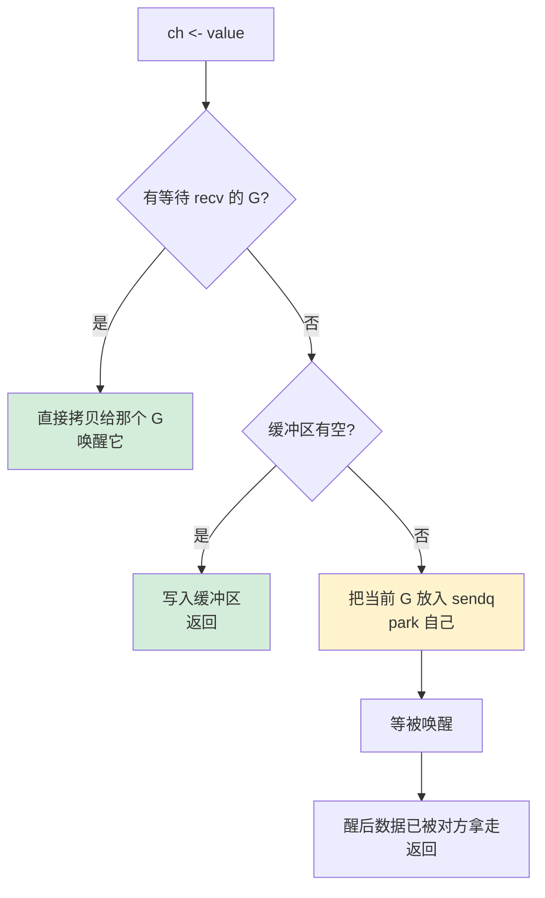
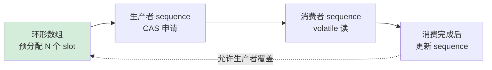
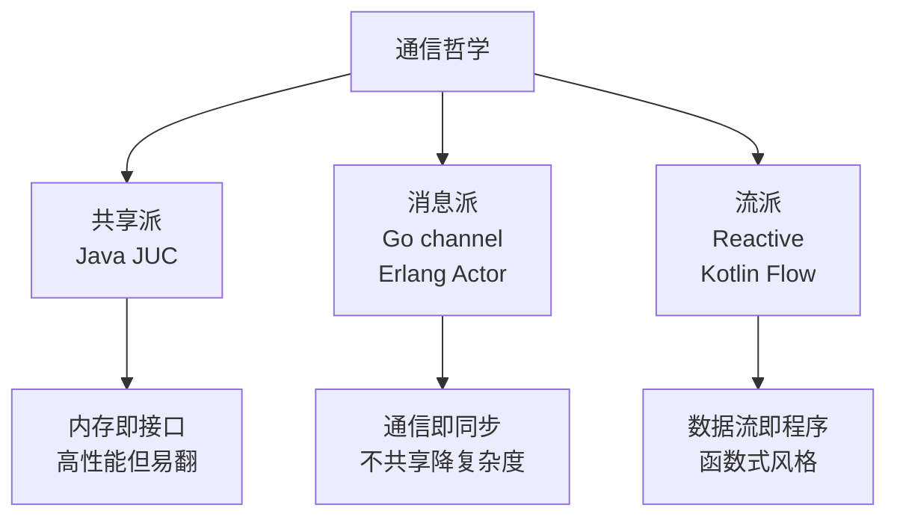

# 12.线程通信设计思想

> 📍 **本篇位置**：第 3 卷 · 并发之道 · 第 2 篇
> 🎯 **核心矛盾**：**多个执行流必须协作完成任务 vs 它们各自独立运行、互不可见** —— 不通信就没意义，乱通信就出 bug，慢通信就废了并发的价值
> 🧭 **设计灵魂**：通信只有两条路——**共享内存 + 同步原语**（Java/C++ 的主流，快但易错）vs **消息传递 + Channel/Mailbox**（Go/Erlang 的主流，慢但易写）；现代语言的最高境界是"**写起来像消息传递，跑起来像共享内存**"
> 🌐 **跨语言覆盖**：Java(wait/notify + AQS + BlockingQueue) · POSIX(pthread_mutex/cond + futex) · C++(condition_variable + atomic + barrier) · Go(channel + select) · Rust(mpsc + ownership) · Erlang(Actor mailbox)
> 🔗 **延伸阅读**：← [11.线程前世今生探索](https://yccoding.com/pages/0554f8/) · → [13.线程异常设计原理](https://yccoding.com/pages/9d09d4/) · → [15.并发编程设计思想](https://yccoding.com/pages/0597c3/) · → [18.锁核心设计和思想](https://yccoding.com/pages/db7194/) · → [19.AQS核心思想揭秘](./19.AQS核心思想揭秘.md) · → [23.协程核心设计思想](https://yccoding.com/pages/5ebc69/) · → [24.Actor与CSP并发模型](https://yccoding.com/pages/ff832c/)
> 📣 **语言无关声明**：本篇是**跨语言通用篇**——"为什么必须通信、通信的三大基石、共享内存 vs 消息传递、四种通信语义"都是 CPU / OS / 并发理论层面的事实，对 **Java / C / C++ / C# / Go / Rust / Kotlin / Python / JavaScript / Erlang / Swift** 全部成立。各语言的差异只在三件事上：①**用什么 API 包装** mutex/cond/channel/atomic；②**编译器/Runtime 保证多少**（Rust 所有权直接消除数据竞争 vs Java 让你自己加 volatile）；③**默认偏好哪条路线**（Go/Erlang 默认消息传递 vs Java/C++ 默认共享内存）。**理解了下面通用三问，再看任何语言的并发原语，都只是同一套思想的不同包装**。

### 🧭 通用三问

**Q1：为什么需要通信？**——一旦把一个任务拆给多个执行流去做，它们就必须**协作**——把谁先谁后、谁等谁、谁的结果给谁，这些"协作语义"传出去。**不通信，并发就只是"并行计算无关任务"，根本不解决任何复杂业务**。通信不是"附加功能"，它就是并发的全部价值所在。

**Q2：通信只有两条根本路线吗？**——是的，且只能选其一作为主线：①**共享内存 + 同步原语**（Java/C++ 主流）—— 两个线程读写同一块内存，靠 mutex/atomic/屏障保证"看见"和"独占"；②**消息传递 + 通道/邮箱**（Go/Erlang 主流）—— 两个线程不共享数据，通过 channel/mailbox 发送拷贝。两条路线的工程含义截然相反："共享派"性能高但容易翻车，"消息派"易写但有拷贝开销。**所有语言都在这两点之间找平衡**。

**Q3：通信正确性的"硬件基础"是什么？**——三件不可逃避的硬件武器：①**原子指令（CAS / LL-SC）**——让"读改写"成为一个不可分割的动作；②**内存屏障（mfence / acquire-release）**——让"什么时候让别的核看到我的写入"变得可控；③**阻塞唤醒（futex / park / WaitOnAddress）**——让"等条件成立"不烧 CPU。**所有上层原语（mutex / channel / Future / Actor mailbox）都是用这三件武器搭出来的乐高**——理解了它们，看任何高层 API 都是 X 光视角。

🎯 **七字真言**：**同步 / 互斥 / 可见 / 有序 / 唤醒 / 拷贝 / 解耦**——通信的全部设计都在这七个字里。本篇末尾会把它映射到 7 种主流语言，你会看到："不同语言的通信原语，底层骨架都一样"。



---

#### 目录介绍
- [1.案例引入](#1案例引入)
  - [1.1 实时聊天室场景](#11-实时聊天室场景)
  - [1.2 完全无通信的代价](#12-完全无通信的代价)
  - [1.3 裸共享变量的代价](#13-裸共享变量的代价)
  - [1.4 加锁与队列的价值](#14-加锁与队列的价值)
  - [1.5 引出核心矛盾](#15-引出核心矛盾)
- [2.通信设计哲学](#2通信设计哲学)
  - [2.1 核心设计原则](#21-核心设计原则)
  - [2.2 通信演进时间线](#22-通信演进时间线)
  - [2.3 共享vs消息](#23-共享vs消息)
  - [2.4 同步异步取舍](#24-同步异步取舍)
  - [2.5 设计决策树](#25-设计决策树)
- [3.通信原理深析](#3通信原理深析)
  - [3.1 Happens-Before](#31-happens-before)
  - [3.2 三件硬件武器](#32-三件硬件武器)
  - [3.3 同步原语金字塔](#33-同步原语金字塔)
  - [3.4 四种通信语义](#34-四种通信语义)
  - [3.5 设计权衡](#35-设计权衡)
- [4.共享内存深析](#4共享内存深析)
  - [4.1 Mutex本质实现](#41-mutex本质实现)
  - [4.2 Condition Var](#42-condition-var)
  - [4.3 信号量及其变种](#43-信号量及其变种)
  - [4.4 内存屏障与原子](#44-内存屏障与原子)
  - [4.5 读写分离与乐观锁](#45-读写分离与乐观锁)
- [5.消息传递深析](#5消息传递深析)
  - [5.1 Channel设计本质](#51-channel设计本质)
  - [5.2 Go channel源码](#52-go-channel源码)
  - [5.3 Actor与Erlang](#53-actor与erlang)
  - [5.4 CSP vs Actor](#54-csp-vs-actor)
  - [5.5 异步消息与背压](#55-异步消息与背压)
- [6.Java通信全景](#6java通信全景)
  - [6.1 wait/notify](#61-waitnotify)
  - [6.2 Lock+Condition](#62-lockcondition)
  - [6.3 BlockingQueue](#63-blockingqueue)
  - [6.4 Latch/Barrier](#64-latchbarrier)
  - [6.5 Semaphore](#65-semaphore)
  - [6.6 CompletableFuture](#66-completablefuture)
  - [6.7 通信场景全表](#67-通信场景全表)
- [7.三语言通信对比](#7三语言通信对比)
  - [7.1 C++贴OS细控](#71-c贴os细控)
  - [7.2 Go channel天下](#72-go-channel天下)
  - [7.3 Rust所有权防竞](#73-rust所有权防竞)
  - [7.4 横向对比总表](#74-横向对比总表)
- [8.经典陷阱与反模式](#8经典陷阱与反模式)
  - [8.1 锁陷阱](#81-锁陷阱)
  - [8.2 条件变量陷阱](#82-条件变量陷阱)
  - [8.3 channel陷阱](#83-channel陷阱)
  - [8.4 调试与定位](#84-调试与定位)
  - [8.5 跨语言陷阱速查](#85-跨语言陷阱速查)
- [9.一句话总结](#9一句话总结)
  - [9.1 三层认知升华](#91-三层认知升华)
  - [9.2 终极建议](#92-终极建议)
  - [9.3 四个关键收获](#93-四个关键收获)
  - [9.4 延伸阅读](#94-延伸阅读)
- [10.案例驱动深入](#10案例驱动深入)
  - [10.1 生产事故选型](#101-生产事故选型)
  - [10.2 Disruptor对比](#102-disruptor对比)
  - [10.3 Go关闭模式](#103-go关闭模式)
- [11.演化史与总结](#11演化史与总结)
  - [11.1 通信范式上升](#111-通信范式上升)
  - [11.2 设计哲学三流派](#112-设计哲学三流派)
  - [11.3 七字真言映射](#113-七字真言映射)
  - [11.4 终极一句话](#114-终极一句话)

---

## 1.案例引入

### 1.1 实时聊天室场景

**场景设定**：你正在写一个实时聊天室服务器，**100 个客户端**同时在线，每个客户端可以发送消息，服务器需要把每条消息**广播给其他 99 个客户端**。架构上自然分成两类线程：

```
┌─── 接收线程组（100 个，每个对应一个客户端）───┐
│   accept message from socket                │
│         ↓                                    │
│   put into ??? for broadcast                │
└──────────────────────────────────────────────┘
                  ↓
┌─── 广播线程组（少量几个）─────────────────────┐
│   take message from ???                     │
│   send to all other 99 clients              │
└──────────────────────────────────────────────┘
```

中间那个 `???`——**就是线程通信要解决的问题**。100 个接收线程要把消息"传递"给广播线程，让广播线程"知道"有新消息要处理。这看似简单——但下面会看到，**怎么设计这个 `???`，决定了整个聊天室的对错和性能**。

### 1.2 完全无通信的代价

最朴素的想法：广播线程"自己去看"接收线程的状态。

```java
// 接收线程把消息存自己的 buffer
class Receiver {
    String latestMessage = null;     // 普通字段
    
    public void onMessage(String msg) {
        latestMessage = msg;          // 收到就放这里
    }
}

// 广播线程一直轮询
class Broadcaster {
    void run() {
        while (true) {
            for (Receiver r : receivers) {
                if (r.latestMessage != null) {
                    broadcast(r.latestMessage);
                    r.latestMessage = null;
                }
            }
            // 不 sleep？CPU 100%
            // sleep？延迟高
        }
    }
}
```

**这种"无通信"写法埋了 5 颗大雷**：

- **雷一：可见性问题**。`latestMessage` 是普通字段，接收线程写入后，广播线程**可能永远看不到**——因为 CPU 缓存让两个核看到的值不一致
- **雷二：竞态条件**。如果接收线程刚写入 `msg1`，立刻又写入 `msg2`，广播线程可能两条都没读到（被覆盖了）
- **雷三：忙轮询烧 CPU**。广播线程不停扫描 100 个 receiver，CPU 永远占满，整机性能崩
- **雷四：sleep 加大延迟**。改成 `Thread.sleep(10)`，CPU 是省了，但消息广播至少延迟 10ms
- **雷五：撕裂写**。如果 latestMessage 是个对象，接收线程"半构造"时被广播线程读到，会拿到不完整数据

**这就是为什么"通信"这件事必须用专门的原语来做**——你不能指望"两个线程靠观察对方的内存就能协作"。多核 CPU 的物理特性（缓存、乱序、写缓冲）让这条路从根上就不可走。

**小结**：完全不用同步原语的"通信"，本质上是**让程序员独自对抗 CPU 的所有底层优化**——绝大多数情况下，这场对抗你赢不了。

### 1.3 裸共享变量的代价

升级版：用 `volatile` 解决可见性，再加个标志：

```java
class Receiver {
    volatile String latestMessage = null;     // ✅ 加了 volatile
    volatile boolean hasNew = false;
    
    public void onMessage(String msg) {
        latestMessage = msg;
        hasNew = true;
    }
}

class Broadcaster {
    void run() {
        while (true) {
            for (Receiver r : receivers) {
                if (r.hasNew) {                // 看起来对了？
                    String msg = r.latestMessage;
                    r.hasNew = false;
                    broadcast(msg);
                }
            }
            Thread.sleep(1);                   // 还是要 sleep
        }
    }
}
```

`volatile` 解决了**可见性**，但**还有 4 个新问题**：

- **问题一：仍有竞态**。`hasNew = true` 和 `latestMessage = msg` 不是原子的——广播线程可能看到 `hasNew=true` 但 `latestMessage` 还是旧值
- **问题二：消息丢失**。接收线程连续两次 `onMessage`，第一条还没被消费就被覆盖
- **问题三：忙轮询依然存在**。volatile 只解决可见性，**没解决"如何高效等待"**——广播线程还得不停扫描
- **问题四：扩展性差**。100 个接收线程对应 100 个 receiver——广播线程要扫 100 遍，规模一大就崩

**根因**：`volatile` 是**最低级的通信原语**——它只保证"我写的另一个线程能看到"，但不保证"原子读改写"，更不提供"高效等待"。这就像两个人能听见对方说话，但不知道**何时该听、何时该说**。

**小结**：volatile 解决了"能不能听到"，但通信的核心问题是"**何时听、听完干什么、听不到时该怎么等**"——后面这一整套，必须靠更高层的原语（锁、条件变量、队列）才能解决。

### 1.4 加锁与队列的价值

最终方案：用阻塞队列。

```java
class ChatServer {
    // 一个线程安全的阻塞队列：100 个接收线程都往这里塞
    BlockingQueue<String> messageQueue = new LinkedBlockingQueue<>();
    
    // 接收线程
    void onMessage(String msg) {
        messageQueue.put(msg);                   // 满了自动阻塞
    }
    
    // 广播线程
    void broadcastLoop() {
        while (true) {
            String msg = messageQueue.take();    // 空了自动阻塞，省 CPU
            for (Client c : clients) c.send(msg);
        }
    }
}
```

**这一改造解决了之前所有问题**：

| 问题 | 之前 | 改造后 |
|---|---|---|
| 可见性 | volatile 才能解决 | put/take 内部隐式 happens-before |
| 竞态条件 | 多字段无法原子 | put/take 内部加锁，原子操作 |
| 消息丢失 | 标志位会被覆盖 | 队列 FIFO，零丢失 |
| 忙轮询 | sleep 导致延迟 vs CPU | take 内部 futex_wait，零 CPU 消耗 + 零延迟唤醒 |
| 扩展性 | 100 个 receiver 要扫 | 一个队列搞定全部 |

**性能对比**（100 客户端 × 1000 msg/s 测试）：

| 方案 | 广播线程 CPU | 平均延迟 | 消息丢失 |
|---|---|---|---|
| volatile + 轮询 + sleep(10ms) | ~80% | ~12 ms | 高 |
| volatile + 忙轮询 | 100% | ~50 μs | 中 |
| **BlockingQueue** | < 5% | < 100 μs | **零** |

**这就是线程通信原语的真正价值**——把"通信"这件事的**正确性、效率、简洁性**三者一起优化到位。一行 `messageQueue.take()` 替代了之前几十行充满坑的代码。

**小结**：线程通信的价值不只是"能传消息"，而是**用很少的代码，同时解决可见性、原子性、有效等待、有序性这 4 个问题**。BlockingQueue/Channel 就是这种价值的典型体现。

### 1.5 引出核心矛盾

把 1.2、1.3、1.4 三种方案放一起：

| 维度 | 无通信 | volatile 共享 | BlockingQueue |
|---|---|---|---|
| **正确性** | ❌ 全错 | 部分正确 | ✅ |
| **CPU 占用** | 100% | 100% / 高延迟 | 接近 0 |
| **代码复杂度** | 看似简单实则不能用 | 仍复杂 | 简单 |
| **扩展性** | 差 | 差 | 好 |
| **延迟** | 不可控 | 不可控 | < 100 μs |

线程通信设计的核心矛盾就是这张表——**正确性、性能、简洁性三者很难同时达到**。但好的通信原语能在三者之间找到最佳平衡。



**全文要回答的就是这 4 个子问题**：从硬件 CAS 到 OS futex，从 Java 的 wait/notify 到 Go 的 channel——半个世纪的工业实践，都在打磨"线程之间该怎么说话"。

---

## 2.通信设计哲学

### 2.1 核心设计原则

回到第 1 章那个聊天室——好的通信原语都遵循统一原则。先看一段反例（这是早期 Java 1.0 的设计）：

```java
// Java 1.0 的设计：所有 Object 自带 wait/notify
class SharedBuffer {
    int data;
    boolean hasData;
    
    public synchronized void produce(int value) throws InterruptedException {
        if (hasData) wait();              // ❌ 用 if 而非 while
        data = value;
        hasData = true;
        notify();                         // ❌ notify 而非 notifyAll，可能错唤醒
    }
}
```

这段代码在 Java 1.0 时代被无数书"作为标准答案"，但**它至少有 4 个坑**：

- 用 `if` 不防虚假唤醒（spurious wakeup）
- `notify()` 可能唤醒生产者而非消费者
- 没有公平性保证
- 一个监视器只能挂一个等待队列

后来 Java 5 引入 `Lock + Condition` 才彻底解决这些问题。**这个反例和它的演化告诉我们三条铁律**：



- **原子完整原则**：通信传递的应该是"一份完整、不可拆的状态"——把"标志位 + 数据"拆成两个字段是反模式，正确做法是用 BlockingQueue 这种**整体原子**的容器
- **最小通知原则**：唤醒应该精准——只唤醒"真正能继续工作"的线程。`notify()` 比 `notifyAll()` 高效但容易错唤醒；`Lock + 多 Condition` 才是工程级答案
- **失败安全原则**：通信代码必须考虑"异常路径"——while 循环防虚假唤醒、try-finally 释放锁、超时机制兜底死锁

**小结**：通信不是"把数据从 A 复制到 B"那么简单，而是**在多核 CPU 的混乱中，用最小代价构建一条"原子、有序、可见、能等"的通道**。这三条原则是从无数生产事故中沉淀下来的工程基线。

### 2.2 通信演进时间线

通信原语经过半个世纪迭代，每一步都解决了前一步的问题：



**关键转折点的历史动机**：

| 年份 | 事件 | 解决的痛点 |
|---|---|---|
| 1965 | Dijkstra 信号量 | 第一个通用同步原语，P/V 操作至今未变 |
| 1974 | Hoare Monitor | 信号量难写易错，引入"自动加锁"的高级抽象 |
| 1978 | Hoare CSP 论文 | 共享内存难推理，提出"通过通信共享" |
| 2002 | Linux futex | pthread_mutex 进内核太慢，做了"快路径在用户态"的优化 |
| 2004 | Java AQS | wait/notify 太低级，提供统一框架支撑高级工具 |
| 2009 | Go goroutine + chan | 工业界第一次让 CSP 成为主流语言一等公民 |
| 2011 | Disruptor | mutex 在百万 QPS 下崩，需要无锁高吞吐方案 |

**演化的总方向**：

```
1960s: 信号量 (低级、难用、易错)
   ↓
1974: Monitor (高级、自动加锁，但单语言绑定)
   ↓
1978: CSP (理论上更优，但要 30 年才工业落地)
   ↓
2009: Go channel (CSP 终于落地)
   ↓
2020s: 虚拟线程 + 结构化并发 (统一同步异步)
```

### 2.3 共享vs消息

通信设计的根本分叉点：**两个线程交换数据，应该共享同一块内存？还是把数据拷贝过去？**



**两者的本质区别**：

| 维度 | 共享内存 | 消息传递 |
|------|---------|---------|
| **数据所有权** | 共享，无主 | 单一所有者，传递所有权 |
| **同步机制** | 显式（锁、屏障） | 隐含（send/recv 自带 HB） |
| **错误倾向** | 数据竞争 / 死锁 | 消息丢失 / 通道死锁 |
| **性能** | 高（零拷贝） | 中（拷贝/调度开销） |
| **调试难度** | 高（heisenbug 多） | 中（消息流可追踪） |
| **扩展到多机** | 不可能 | 自然（消息可跨网络） |

**共享内存的"快"代价是什么？**——**心智负担**。每次写共享变量都要问自己：

```
我加锁了吗？
锁的范围对吗？
其他线程能看到我的写入吗？（可见性）
其他线程读到的是完整的吗？（原子性）
代码的执行顺序和我想的一样吗？（有序性）
万一异常，锁能正确释放吗？
```

而消息传递的"慢"换来了什么？——**可推理性**。`channel.send(x)` 这一行就告诉你：

```
我把 x 完整地、原子地、有序地、安全地交给了对方
我不用管对方的内存模型
我不用管 CPU 缓存
我不用管编译器重排
```

**Go 的著名格言**精准捕捉了这个权衡：

> **"Don't communicate by sharing memory; share memory by communicating."**
>
> （不要通过共享内存来通信，而要通过通信来共享内存）

**实战中的"混合策略"**：

```go
// Go 标准做法：channel 主导，atomic/mutex 辅助
type Worker struct {
    inbox  chan Task        // 主通信通道（消息传递）
    cache  sync.Map         // 共享缓存（共享内存）
    count  atomic.Int64     // 统计计数（共享内存）
}
```

- **跨"线程边界"** 用 channel：天然安全，复杂度低
- **线程内的高频小操作**（计数、缓存）用 atomic / Mutex：性能优先

### 2.4 同步异步取舍

通信原语的另一个关键维度：**发送者发完消息后，要不要等接收者收到？**

| 维度 | 同步通信 | 异步通信 |
|------|---------|---------|
| **代表** | 无缓冲 channel、Future.get | 缓冲 channel、消息队列 |
| **发送行为** | 阻塞，直到对方收到 | 立即返回（如果缓冲未满） |
| **耦合度** | 高（双方时序绑定） | 低（双方解耦） |
| **背压** | 自然形成 | 需要显式做 |
| **典型场景** | RPC、严格顺序 | 日志、事件、扇出处理 |

**同步通信的代码长这样**：

```go
ch := make(chan int)        // 无缓冲
go func() {
    ch <- 42                 // 阻塞，直到有人 take
}()
value := <-ch                // 立即取到 42
```

**异步通信的代码长这样**：

```go
ch := make(chan int, 1000)   // 缓冲 1000
go func() {
    ch <- 42                 // 立即返回（缓冲未满）
}()
// 后续可能很久才有人取
value := <-ch
```

**同步 vs 异步的工程权衡**：

- **同步**适合"发送者必须知道结果"的场景——比如 RPC 调用、事务提交
- **异步**适合"发送者只管发出去"的场景——比如日志、通知、事件处理
- **永远不能用异步消除背压**——异步会把"压力"从发送者转嫁到队列，队列不是无限的
- **背压必须显式设计**：缓冲区满了应该 drop？block？回退？这是个工程决策

### 2.5 设计决策树



**实战经验三原则**：

1. **能用消息传递就别共享内存**：默认用 channel/queue，只在性能不够时才考虑共享变量+锁
2. **能用高级原语就别裸操底层**：BlockingQueue > Lock+Condition > wait/notify > volatile+CAS
3. **粒度要刚好匹配场景**：用 `synchronized` 包整个方法 vs 用 `AtomicLong` 加一个计数，性能差 100 倍

---

## 3.通信原理深析

### 3.1 Happens-Before

并发程序中，多个线程的操作形成一个**事件集合**。如果没有任何同步，这些事件之间**没有确定的先后顺序**——它们是"并发的"。

线程通信的本质就是在这个无序集合中**人为插入顺序约束**，形式化地说：

> **建立 Happens-Before 偏序关系：如果 A happens-before B，则 A 的所有内存效果对 B 可见。**

```
无同步:    A₁  A₂  A₃          B₁  B₂  B₃
           (两组事件之间无序，结果不确定)

加同步后:  A₁  A₂  A₃ ──HB──→ B₁  B₂  B₃
           (A₃ happens-before B₁, A的所有写对B可见)
```

**任何编程语言的任何同步原语，做的事情都且仅是：在两个线程的操作之间插入一条 HB 边。** 区别只是插入方式不同。

**Java JMM 规定的 Happens-Before 规则**（JSR-133）：

| 规则 | 含义 |
|---|---|
| **程序顺序规则** | 单线程内，前面的语句 HB 后面的语句 |
| **管程锁规则** | 解锁 HB 后续对同一锁的加锁 |
| **volatile 规则** | volatile 写 HB 后续 volatile 读 |
| **线程启动规则** | `start()` HB 子线程的所有操作 |
| **线程终结规则** | 子线程内所有操作 HB `join()` 返回 |
| **传递性** | A HB B，B HB C，则 A HB C |

**HB 关系的工程意义**：

```java
// Java 中正确的 "传递数据" 模式
class Holder {
    volatile boolean ready = false;
    int data = 0;
}

// 线程 A：写
holder.data = 42;          // ① 普通写
holder.ready = true;       // ② volatile 写

// 线程 B：读
if (holder.ready) {        // ③ volatile 读
    int x = holder.data;   // ④ 一定能读到 42
}

// 为什么 ④ 能读到 42？
// 因为：① HB ②（程序顺序）
//      ② HB ③（volatile 规则）
//      ③ HB ④（程序顺序）
//      所以 ① HB ④（传递性）
```

这就是"happens-before"在工程中的真实价值——**它给你一种推理工具，让你在不看汇编的情况下判断多线程代码是否正确**。

### 3.2 三件硬件武器

剥到最底层，CPU 提供给操作系统和语言设计者的**全部工具**只有三样：

**武器 1：原子指令（Atomic RMW）**

```asm
cmpxchg [addr], expected, desired   ; Compare-And-Swap
lock xadd [addr], val               ; Fetch-And-Add
xchg    [addr], val                 ; Atomic Exchange
```

**一条不可被打断的指令**完成"读-改-写"。这是所有锁、信号量、无锁结构的基石。

**武器 2：内存屏障（Memory Barrier / Fence）**

```asm
mfence    ; 全屏障：之前的读写全部完成后，才能执行之后的读写
lfence    ; 读屏障
sfence    ; 写屏障
```

**禁止 CPU 重排序 + 强制缓存刷新**。这是"可见性"的保证。

**武器 3：阻塞/唤醒（Futex 等 OS 原语）**

```c
futex_wait(addr, expected)   // 如果 *addr==expected，让线程睡眠
futex_wake(addr, n)          // 唤醒 n 个在 addr 上睡眠的线程
```

让线程**主动让出 CPU**（而非忙等），这是效率的关键。

**三者的关系**：

```
                    原子指令 ─── 保证操作的不可分割性
                        │
全部同步机制 ═══════════╪═══ 内存屏障 ─── 保证操作的可见性和有序性
                        │
                    阻塞/唤醒 ─── 保证等待的效率（不烧CPU）
```

**futex 是 Linux 通信性能的转折点**——2002 年之前，Linux 的 pthread_mutex 每次加锁都要进内核（即使没竞争），性能很差。futex（Fast User-space muTEX）的设计是：

```c
// 加锁（伪代码）
void mutex_lock(int* lock) {
    if (atomic_cmpxchg(lock, 0, 1) == 0) {
        return;                          // 快路径：用户态 CAS 成功，无 syscall
    }
    // 慢路径：有竞争，进内核等待
    while (true) {
        if (atomic_cmpxchg(lock, 0, 1) == 0) return;
        futex_wait(lock, 1);             // 进内核睡
    }
}

// 解锁
void mutex_unlock(int* lock) {
    atomic_store(lock, 0);
    if (有人在等)                          // 这个判断也是无 syscall 的
        futex_wake(lock, 1);             // 仅在有人等时进内核唤醒
}
```

**关键点**：**99% 无竞争的场景，加锁/解锁完全在用户态完成**——只有真正发生竞争时才进内核。这让 mutex 的"无竞争开销"从微秒级降到了纳秒级（~25ns）。

### 3.3 同步原语金字塔

所有语言的同步原语都是同一棵树：

```
                        ┌─────────────────────┐
                        │  语义意图 (What)      │
                        │  "等数据" "互斥" "通知" │
                        └──────────┬──────────┘
                                   │
          ┌──────────┬──────────┬──┴───┬──────────┬──────────┐
          │          │          │      │          │          │
       Mutex    Semaphore   Channel  Barrier   Future   RWLock
       (互斥)   (计数)     (传递)   (汇合)   (异步结果) (读写分离)
          │          │          │      │          │          │
          └──────────┴──────────┴──┬───┴──────────┴──────────┘
                                   │
                        ┌──────────┴──────────┐
                        │  同步协议 (How)       │
                        │  Happens-Before 关系  │
                        └──────────┬──────────┘
                                   │
                    ┌──────────────┼──────────────┐
                    │              │              │
               原子指令         内存屏障       阻塞/唤醒
               (CAS)          (Fence)        (Futex)
                    │              │              │
                    └──────────────┼──────────────┘
                                   │
                        ┌──────────┴──────────┐
                        │  硬件 (Mechanism)     │
                        │  缓存一致性协议(MESI) │
                        │  CPU流水线 + 总线锁   │
                        └─────────────────────┘
```

每种语言只是在这棵树的不同层次**切了一刀**，把下面的复杂性封装起来：

| 语言 | 暴露的抽象层 | 设计哲学 |
|------|------------|---------|
| C/C++ | 最底层——`atomic` + `memory_order` 直接映射到屏障 | 给你全部控制权，后果自负 |
| Java | 中间层——JMM 定义 HB 规则，`volatile/synchronized` | 语言规范定义内存模型，屏蔽硬件差异 |
| Go | 高层——channel 为主，`sync.Mutex` 为辅 | "用消息传递代替共享内存" |
| Rust | 底层+类型系统——`atomic` + `Send/Sync` trait | 编译期保证不会数据竞争 |
| Erlang | 最高层——actor 消息传递，无共享状态 | 进程隔离，物理上不可能竞争 |

### 3.4 四种通信语义

所有通信场景，抽象到极致只有**四种语义**：

**语义 1：互斥（Mutual Exclusion）——"同一时刻只能一个人进"**

```
本质: 将并发操作序列化
实现: CAS抢锁 + 抢不到就 futex 睡
代表: mutex, synchronized, Lock
```

**语义 2：等待/通知（Wait/Signal）——"条件满足了叫我"**

```
本质: 一个线程阻塞，另一个线程改变条件后唤醒它
实现: futex_wait（条件不满足就睡）+ futex_wake（条件满足就唤醒）
代表: condition_variable, wait/notify, channel recv
```

**语义 3：数据传递（Data Transfer）——"把这个给你"**

```
本质: 将数据的可见性从一个线程传播到另一个线程
实现: 写入数据 + release 屏障 → acquire 屏障 + 读取数据
代表: channel send/recv, pipe write/read, future set/get
```

**语义 4：可见性发布（Publication）——"我改好了，你可以看了"**

```
本质: 一个线程的写入对另一个线程变得可见
实现: atomic store(release) → atomic load(acquire)
代表: volatile, atomic, memory_order_release/acquire
```

**它们的嵌套关系**：

```
互斥 = 可见性发布(锁状态) + 等待/通知(抢不到就等)
Channel = 互斥(保护缓冲区) + 等待/通知(空则等/满则等) + 数据传递
Future = 可见性发布(结果) + 等待/通知(结果未就绪就等)
Barrier = 可见性发布(计数器) + 等待/通知(最后一个到达时唤醒全部)
```

**理解了这四种语义就理解了所有通信原语**——以后看到任何同步工具，问自己：它在做哪几种语义的组合？

### 3.5 设计权衡

所有语言在设计线程通信时，面对的核心权衡只有两个：

**权衡 1：忙等（Spinning） vs 阻塞（Blocking）**

```
忙等: while (!ready) {}          // 不放弃CPU，延迟极低，但烧CPU
阻塞: futex_wait(&ready, false)  // 放弃CPU，省能耗，但唤醒有延迟(~微秒)

实际做法: 自适应——先短暂自旋，超时后再阻塞
         (Java的synchronized, Linux的mutex都是这么做的)
```

**自旋的合理性**：如果锁的持有时间 < 一次上下文切换（~1μs），那自旋反而更划算。Linux mutex、JVM synchronized 都用 **adaptive spinning**——先自旋几次（~30 次），不行再陷入内核。

**权衡 2：共享（Sharing） vs 隔离（Isolation）**

```
共享: 线程直接读写同一块内存 → 快，但需要同步，容易出bug
隔离: 线程各自持有数据，通过消息交换 → 慢（拷贝开销），但天然安全

C++/Java: 默认共享，程序员负责同步
Go:       鼓励隔离(channel)，允许共享(sync.Mutex)
Rust:     默认隔离(ownership)，编译器检查共享是否安全
Erlang:   强制隔离，物理上无法共享
```

---

## 4.共享内存深析

### 4.1 Mutex本质实现

**Mutex 的核心抽象**——把"多个线程并发访问"序列化成"一个接一个访问"。

**Mutex 实现的 4 个层次**：



**futex-based Mutex 的快路径**（Linux glibc pthread_mutex 简化）：

```c
// 加锁：99% 场景一条 CAS 搞定
int mutex_lock(pthread_mutex_t* m) {
    if (atomic_cmpxchg(&m->state, UNLOCKED, LOCKED) == UNLOCKED) {
        return 0;                              // 快路径：用户态成功
    }
    // 慢路径
    return mutex_lock_slow(m);
}

int mutex_lock_slow(pthread_mutex_t* m) {
    int spin = 30;
    while (spin-- > 0) {                       // 先自适应自旋
        if (atomic_cmpxchg(&m->state, UNLOCKED, LOCKED) == UNLOCKED) 
            return 0;
        cpu_pause();
    }
    // 自旋失败，标记为有等待者
    atomic_store(&m->state, LOCKED_CONTENDED);
    while (true) {
        futex_wait(&m->state, LOCKED_CONTENDED);  // 进内核等待
        if (atomic_cmpxchg(&m->state, UNLOCKED, LOCKED_CONTENDED) == UNLOCKED) 
            return 0;
    }
}

// 解锁
void mutex_unlock(pthread_mutex_t* m) {
    int prev = atomic_exchange(&m->state, UNLOCKED);
    if (prev == LOCKED_CONTENDED) {            // 有人在等
        futex_wake(&m->state, 1);              // 唤醒一个
    }
}
```

**关键性能数据（x86_64 Linux）**：

| 操作 | 耗时 |
|---|---|
| 无竞争加锁 | ~25 ns |
| 无竞争解锁 | ~10 ns |
| 有竞争（自旋成功） | ~100-500 ns |
| 有竞争（陷入内核） | ~1-3 μs |
| 跨核唤醒 | ~5-10 μs |

**Mutex 设计的关键决策**：

- **公平 vs 非公平**：FIFO 公平锁防止饥饿但慢，非公平锁吞吐高但有线程被饿死风险
- **可重入 vs 不可重入**：可重入支持递归调用（同一线程多次加锁），代价是要记 owner
- **错误检查 vs 普通**：错误检查模式能检测重复 unlock 等错误，但慢一点

**Java synchronized vs ReentrantLock**：

| 维度 | synchronized | ReentrantLock |
|---|---|---|
| **基础实现** | 对象头 markword + Monitor | AQS + futex |
| **可中断** | ❌ | ✓ `lockInterruptibly()` |
| **超时** | ❌ | ✓ `tryLock(timeout)` |
| **公平性** | 非公平 | 可选 |
| **多 Condition** | 只有一个 wait set | 多个 `newCondition()` |
| **写法** | 简单 | 必须 try-finally |

### 4.2 Condition Var

**Condition Variable 的核心问题**：线程"等待某个条件成立"时，不要忙等——但又要在条件变化时被精确唤醒。

```
没有 condvar 时:
while (!condition) {
    // 怎么等？
    sleep(1);   // 太慢，且不知道睡多久
    yield();    // 没用，调度器还是会回来
    // 都不对
}

有 condvar 时:
mutex.lock();
while (!condition) {
    condvar.wait(mutex);   // 原子地：释放锁 + 阻塞 + 醒来后重新加锁
}
mutex.unlock();

// 另一个线程修改条件后:
mutex.lock();
condition = true;
condvar.signal();          // 唤醒一个等待者
mutex.unlock();
```

**condvar.wait 的"原子三步"** 是关键设计：

```c
// 必须是不可分割的：释放锁 → 阻塞 → 重新加锁
// 如果"释放锁"和"阻塞"之间被打断，可能错过 signal → 永远不被唤醒（lost wakeup）

// pthread_cond_wait 简化实现
int pthread_cond_wait(pthread_cond_t* cv, pthread_mutex_t* mu) {
    int seq = atomic_load(&cv->seq);     // 记录当前 signal 序号
    pthread_mutex_unlock(mu);            // 释放锁
    futex_wait(&cv->seq, seq);           // 如果序号没变就睡
                                          // futex_wait 是原子的：
                                          // "比较 + 睡" 之间不会被打断
    pthread_mutex_lock(mu);              // 醒来重新加锁
    return 0;
}

int pthread_cond_signal(pthread_cond_t* cv) {
    atomic_add(&cv->seq, 1);             // 序号 +1
    futex_wake(&cv->seq, 1);             // 唤醒一个
}
```

**核心设计要点**：用 `seq` 序号而不是布尔值——避免 ABA 问题，且支持多次 signal 累计。

**为什么必须用 while 而不是 if**？三个原因：

1. **虚假唤醒（Spurious Wakeup）**：操作系统可能在没有 signal 的情况下唤醒等待者（POSIX 规范允许）
2. **多消费者竞争**：3 个消费者等数据，1 个 signal 唤醒了第一个，第二个被唤醒后看到没数据，必须再次等
3. **唤醒到加锁之间状态可能变化**：signal 后另一个线程可能抢先消费了数据

```c
// ❌ 错误：用 if
if (!has_data) condvar.wait(mu);
consume();   // 可能 has_data 已经被别人消费了

// ✅ 正确：用 while
while (!has_data) condvar.wait(mu);
consume();   // 醒来一定有数据
```

### 4.3 信号量及其变种

**信号量 = 一个非负整数 + 两个原子操作（P/V）**——Dijkstra 1965 年发明，至今仍是计数同步的核心。

```c
sem_init(&s, 0, N);     // 初始值 N

// 线程 A
sem_wait(&s);           // P 操作：s--，如果 s<0 则阻塞
// 临界区
sem_post(&s);           // V 操作：s++，唤醒一个等待者
```

**信号量的两种用法**：

**用法 1：互斥锁**（信号量初值 = 1）

```c
sem_init(&s, 0, 1);     // 二元信号量

// 多个线程
sem_wait(&s);           // 同 mutex_lock
critical_section();
sem_post(&s);           // 同 mutex_unlock
```

**用法 2：限流 / 资源池**（信号量初值 = N）

```c
sem_init(&s, 0, 5);     // 最多 5 个并发

// 100 个线程
sem_wait(&s);           // 超过 5 个就阻塞
do_work();
sem_post(&s);
```

**信号量 vs Mutex 的本质区别**：

| 维度 | Mutex | Semaphore |
|---|---|---|
| **状态** | 二值（锁/未锁） | 计数 |
| **释放者** | 必须是加锁者 | 任何人都能 post |
| **典型场景** | 保护临界区 | 限流、生产消费 |
| **是否记 owner** | 是（可重入） | 否 |

**信号量典型用法：限流连接池**：

```java
// Java Semaphore
Semaphore connPool = new Semaphore(10);   // 最多 10 个连接

void handleRequest() {
    connPool.acquire();              // 获取一个许可
    try {
        Connection conn = pool.get();
        useConnection(conn);
    } finally {
        connPool.release();          // 归还
    }
}
```

### 4.4 内存屏障与原子

**为什么需要内存屏障**？看一段经典反例：

```c
// 看似简单的发布模式
int data = 0;
bool ready = false;

// 线程 A
data = 42;                // ①
ready = true;             // ②

// 线程 B
while (!ready) {}         // ③
print(data);              // ④ 可能打印 0！
```

**为什么会打印 0**？三种可能：

1. **CPU 乱序执行**：Core 0 把 ② 的写入提前到 ① 之前（store-store 重排）
2. **缓存延迟**：Core 0 写入 ① 还在 Store Buffer 里没刷到 cache
3. **编译器重排**：编译器把 ② 移到 ① 之前

**内存屏障解决方案**：

```c
// 加上屏障
data = 42;
atomic_thread_fence(memory_order_release);   // 之前的写不能重排到之后
ready = true;

// 线程 B
while (!ready) {}
atomic_thread_fence(memory_order_acquire);   // 之后的读不能重排到之前
print(data);                                  // 一定打印 42
```

**C++ 内存序模型**——六种顺序，从弱到强：

| memory_order | 语义 | 性能 | 用途 |
|---|---|---|---|
| **relaxed** | 仅保证原子，无屏障 | 最快 | 计数器、统计 |
| **consume** | 数据依赖的 acquire | 快（已废弃） | 罕用 |
| **acquire** | 之后的读写不能重排到之前 | 中 | 读屏障 |
| **release** | 之前的读写不能重排到之后 | 中 | 写屏障 |
| **acq_rel** | acquire + release | 中 | RMW 操作 |
| **seq_cst** | 全局顺序一致 | 慢（默认） | 安全但慢 |

**典型用例**：

```cpp
// 无锁计数器：用 relaxed（不需要 HB 关系）
std::atomic<long> counter{0};
counter.fetch_add(1, std::memory_order_relaxed);

// 发布对象：release 写 + acquire 读
std::atomic<Data*> shared{nullptr};
Data* d = new Data(42);
shared.store(d, std::memory_order_release);

Data* p = shared.load(std::memory_order_acquire);
if (p) p->use();   // 一定能看到 d 的初始化

// CAS 通常用 acq_rel
shared.compare_exchange_strong(expected, desired, 
    std::memory_order_acq_rel);
```

### 4.5 读写分离与乐观锁

**问题**：多读单写场景下，`Mutex` 浪费——读和读其实可以并行。

**ReadWriteLock**：把锁拆成读锁和写锁，读读共享，读写/写写互斥：

```
读锁状态:      [R | R | R]   多个读者并行
写锁状态:      [W]            单个写者独占
读锁+写锁:     冲突，互斥
```

**Java ReentrantReadWriteLock**：

```java
ReadWriteLock rwLock = new ReentrantReadWriteLock();

// 读：可并发
rwLock.readLock().lock();
try {
    return data.get(key);
} finally {
    rwLock.readLock().unlock();
}

// 写：独占
rwLock.writeLock().lock();
try {
    data.put(key, value);
} finally {
    rwLock.writeLock().unlock();
}
```

**StampedLock（Java 8）—— 引入"乐观读"**：

```java
StampedLock lock = new StampedLock();

// 乐观读：先不加锁，读完后验证
long stamp = lock.tryOptimisticRead();
double curX = x, curY = y;       // 读
if (!lock.validate(stamp)) {     // 验证读期间没被写
    // 被写过，降级为悲观读
    stamp = lock.readLock();
    try {
        curX = x; curY = y;
    } finally {
        lock.unlockRead(stamp);
    }
}
```

**乐观锁的设计哲学**：**绝大多数情况下读不会冲突，那就先假设没冲突，读完再验证**——验证失败再回退到悲观锁。这种"先猜后验"的思想在数据库 MVCC、CAS 操作里都能看到。

**性能对比（多读少写场景，95% 读）**：

| 锁类型 | QPS |
|---|---|
| synchronized | ~500 万 |
| ReadWriteLock | ~2000 万 |
| StampedLock 乐观读 | ~5000 万 |

---

## 5.消息传递深析

### 5.1 Channel设计本质

**Channel 是什么？** 一个**带"线程安全的入队/出队 + 自动等待/唤醒"的队列**。它把"数据传递"和"同步"统一成一个操作：

```
ch <- value    // 发送：把数据放进去（满了就阻塞）
v := <-ch      // 接收：取数据（空了就阻塞）
```

**Channel 集成了三种语义**：

| 语义 | 体现 |
|---|---|
| **互斥** | 内部锁保护缓冲区 |
| **等待/通知** | 满/空时阻塞，对方操作时唤醒 |
| **数据传递** | send/recv 配对，数据安全交付 |

**两种 channel 类型**：

```go
// 无缓冲 channel：同步
ch := make(chan int)
// 发送方阻塞，直到接收方 take
// 类似"接力棒交接"，双方时刻同步

// 有缓冲 channel：异步
ch := make(chan int, 100)
// 缓冲未满时发送不阻塞，未空时接收不阻塞
// 类似"邮箱"，发完就走
```

**Channel 的高级用法 —— select**：

```go
// 多路复用：从多个 channel 中等任意一个就绪
select {
case msg := <-ch1:
    handle(msg)
case ch2 <- task:
    // 发送给 ch2 成功
case <-time.After(5 * time.Second):
    // 超时
default:
    // 都没就绪，立即返回
}
```

**select 的工程价值**——**用一个语法构造解决了"超时、取消、扇入扇出、非阻塞尝试"四个常见场景**。这是 Go 比其他语言写并发更舒服的根本原因。

### 5.2 Go channel源码

Go channel 内部实现（runtime/chan.go）：

```go
type hchan struct {
    qcount   uint           // 当前缓冲数据数
    dataqsiz uint           // 缓冲区大小
    buf      unsafe.Pointer // 环形缓冲区
    elemsize uint16
    closed   uint32
    elemtype *_type
    sendx    uint           // 发送索引
    recvx    uint           // 接收索引
    recvq    waitq          // 等待接收的 G 队列
    sendq    waitq          // 等待发送的 G 队列
    lock     mutex          // 保护一切的锁
}
```

**send 的完整流程**：



**核心代码（简化）**：

```go
func chansend(c *hchan, ep unsafe.Pointer, block bool) bool {
    lock(&c.lock)
    
    // 情况 1：有等待接收的 G，直接传递（零拷贝优化）
    if sg := c.recvq.dequeue(); sg != nil {
        send(c, sg, ep)        // 直接拷贝到 receiver 的栈上
        unlock(&c.lock)
        goready(sg.g)          // 唤醒 receiver
        return true
    }
    
    // 情况 2：缓冲区有空间
    if c.qcount < c.dataqsiz {
        qp := chanbuf(c, c.sendx)
        typedmemmove(c.elemtype, qp, ep)
        c.sendx++
        if c.sendx == c.dataqsiz { c.sendx = 0 }
        c.qcount++
        unlock(&c.lock)
        return true
    }
    
    // 情况 3：阻塞
    gp := getg()
    mysg := acquireSudog()
    mysg.g = gp
    mysg.elem = ep
    c.sendq.enqueue(mysg)
    gopark(...)               // 让出 P，让其他 G 跑
    
    // 醒来：对方已经取走数据
    return true
}
```

**Go channel 的两个精妙设计**：

- **"直接交接"优化**：当有 G 在等待接收时，发送数据**不经过缓冲区**，直接拷贝到 receiver 栈——一次拷贝省一次
- **基于 G 的 park/goready**：goroutine 阻塞不阻塞 OS 线程，只是让 G 让出 P，其他 G 可以继续跑

**性能数据**：

| 操作 | 耗时 |
|---|---|
| send/recv（无竞争） | ~80 ns |
| send/recv（满/空，需 park） | ~500 ns |
| select（2 个 case） | ~200 ns |
| select（10 个 case） | ~500 ns |

### 5.3 Actor与Erlang

**Actor 模型** 是消息传递的另一支——比 channel 更彻底：**每个 Actor 是独立的实体，有自己的状态、邮箱、行为**。

```
┌─── Actor A ───┐    ┌─── Actor B ───┐
│ 私有状态       │    │ 私有状态       │
│ Mailbox: [m1]  │    │ Mailbox: [m2]  │
│ 处理逻辑       │    │ 处理逻辑       │
└───────┬───────┘    └───────┬───────┘
        │   send msg          │
        └──────────────────→──┘
```

**Erlang 的 Actor 实现**：

```erlang
% 定义一个 counter actor
counter(Count) ->
    receive
        {increment} ->
            counter(Count + 1);
        {get, From} ->
            From ! {value, Count},
            counter(Count);
        stop ->
            ok
    end.

% 启动
Pid = spawn(fun() -> counter(0) end).

% 发消息
Pid ! {increment}.
Pid ! {get, self()}.
receive {value, V} -> io:format("~p~n", [V]) end.
```

**Erlang Actor 的 4 个核心特征**：

- **完全隔离**：Actor 之间不共享任何内存——从根本上消除数据竞争
- **轻量到极致**：一个 Erlang process 仅占几百字节，单机可跑千万级
- **错误隔离**：一个 Actor 崩溃不影响其他——配合 supervisor 树自动重启
- **位置透明**：本地 Actor 和远程 Actor 用相同 API——天然分布式

**Akka（JVM 上的 Actor）**：

```scala
class Counter extends Actor {
    var count = 0
    def receive = {
        case "inc"  => count += 1
        case "get"  => sender() ! count
    }
}

val system = ActorSystem("MySystem")
val counter = system.actorOf(Props[Counter])
counter ! "inc"
counter ! "get"
```

### 5.4 CSP vs Actor

CSP（Go channel）和 Actor（Erlang）是消息传递的两大流派——都用消息但哲学不同：

| 维度 | CSP（Go） | Actor（Erlang） |
|---|---|---|
| **实体** | goroutine（无名） | Actor（有 PID） |
| **通信媒介** | channel（独立对象） | mailbox（绑定 Actor） |
| **寻址方式** | 通过 channel 引用 | 通过 PID 直接发 |
| **匿名性** | goroutine 匿名 | Actor 有身份 |
| **耦合度** | channel 解耦双方 | 发送者必须知道接收者 PID |
| **错误处理** | 靠 panic/recover | supervisor 树 |
| **代表语言** | Go, Occam | Erlang, Akka, Elixir |

**CSP 和 Actor 各有适用场景**：

- **CSP 更适合**："数据流"明确的场景——管道处理、扇入扇出、生产消费
- **Actor 更适合**："有状态的实体"——游戏角色、IoT 设备、聊天室用户

### 5.5 异步消息与背压

消息传递在异步模式下，必须解决一个关键问题——**背压（Backpressure）**：当生产者比消费者快，消息堆积了，怎么办？

```
生产 1000 msg/s ──→ 缓冲区 ──→ 消费 100 msg/s
                    📈 积压
```

**4 种背压策略**：

| 策略 | 行为 | 适用 |
|---|---|---|
| **Block（阻塞）** | 缓冲满，生产者阻塞 | 默认；重要数据不能丢 |
| **Drop（丢弃）** | 缓冲满，丢新消息 | 可丢日志、监控数据 |
| **Drop Oldest** | 缓冲满，丢最旧的 | 实时数据如股价 |
| **Slow Down** | 反向告知生产者放慢 | RxJava、Reactive Streams |

**Go channel 默认是 Block 策略**：

```go
ch := make(chan Task, 100)

// 生产者
ch <- task    // 满了自动阻塞——天然背压
```

**Reactive Streams 规范**——Java 9 把背压做成了标准 API：

```java
Publisher.subscribe(new Subscriber() {
    Subscription subscription;
    
    public void onSubscribe(Subscription s) {
        subscription = s;
        s.request(10);   // 关键：告诉生产者我能处理 10 个
    }
    
    public void onNext(Item item) {
        process(item);
        subscription.request(1);   // 处理完一个再要一个
    }
});
```

**核心设计哲学**：**消费者主动 pull，而不是生产者 push**——天然的反压机制。

---

## 6.Java通信全景

### 6.1 wait/notify

**原理**：每个 Java 对象都有一个**监视器锁（Monitor）**，`wait()` 释放锁并进入等待队列，`notify()` 从等待队列唤醒一个线程。底层依赖 OS 的 `pthread_cond_wait` / `pthread_cond_signal`。

```java
class SharedBuffer {
  private int data;
  private boolean hasData = false;

  public synchronized void produce(int value) throws InterruptedException {
    while (hasData) wait();       // 有数据就等消费者取走
    data = value;
    hasData = true;
    notify();                     // 唤醒消费者
  }

  public synchronized int consume() throws InterruptedException {
    while (!hasData) wait();      // 没数据就等生产者放入
    hasData = false;
    notify();                     // 唤醒生产者
    return data;
  }
}
```

**Monitor 内部结构**：

```
┌─── ObjectMonitor ───┐
│ owner: 当前持锁线程   │
│ count: 重入次数       │
│ EntryList: [T1, T2]  │ ← 等待获取锁的 BLOCKED 线程
│ WaitSet:   [T3, T4]  │ ← wait() 调用后挂这里
└──────────────────────┘
```

**wait/notify 的 5 个核心要点**：

1. 必须在 `synchronized` 块内调用——否则抛 `IllegalMonitorStateException`
2. 用 `while` 防虚假唤醒——POSIX 规范明确允许
3. `wait()` 会释放锁，唤醒后必须重新竞争
4. `notify()` 只唤醒一个，`notifyAll()` 唤醒全部
5. **优先用 `notifyAll()` 除非你能严格证明 notify 不会唤醒错的线程**

**Thread.join() 的内部实现**：

```java
// JDK 源码（简化）
public final synchronized void join(long millis) throws InterruptedException {
    while (isAlive()) {
        wait(0);                  // 在 Thread 对象上 wait
    }
}
// 当线程结束时，JVM 自动调用 this.notifyAll() 唤醒等待者
```

### 6.2 Lock+Condition

**ReentrantLock + Condition 是 wait/notify 的工业升级版**——核心增强是"多个 Condition 队列"：

```java
class SharedBuffer {
  private final Lock lock = new ReentrantLock();
  private final Condition notFull = lock.newCondition();    // 单独的"非满"队列
  private final Condition notEmpty = lock.newCondition();   // 单独的"非空"队列
  private int[] buf = new int[5];
  private int count = 0;

  public void produce(int value) throws InterruptedException {
    lock.lock();
    try {
      while (count == buf.length) notFull.await();
      buf[count++] = value;
      notEmpty.signal();        // 精准唤醒消费者，不会误伤生产者
    } finally {
      lock.unlock();
    }
  }

  public int consume() throws InterruptedException {
    lock.lock();
    try {
      while (count == 0) notEmpty.await();
      int val = buf[--count];
      notFull.signal();         // 精准唤醒生产者
      return val;
    } finally {
      lock.unlock();
    }
  }
}
```

**vs wait/notify 的 4 个改进**：

- **多 Condition**：可以为不同的等待原因建立独立队列，避免错唤醒
- **可中断**：`lockInterruptibly()` 让等锁的线程响应中断
- **超时尝试**：`tryLock(timeout)` 防止无限等待
- **公平模式**：`new ReentrantLock(true)` 保证 FIFO

### 6.3 BlockingQueue

**BlockingQueue 是日常并发编程最常用的工具**——把"锁 + 条件变量"封装成线程安全的队列：

```java
BlockingQueue<Integer> queue = new ArrayBlockingQueue<>(5);

// 生产者
new Thread(() -> {
  for (int i = 0; i < 10; i++) {
    queue.put(i);                    // 满了自动阻塞
    System.out.println("Produced: " + i);
  }
}).start();

// 消费者
new Thread(() -> {
  for (int i = 0; i < 10; i++) {
    int val = queue.take();          // 空了自动阻塞
    System.out.println("Consumed: " + val);
  }
}).start();
```

**Java 主要的 BlockingQueue 实现**：

| 实现 | 特点 | 适用 |
|---|---|---|
| **ArrayBlockingQueue** | 数组 + 单锁 + 2 Condition | 通用，有界 |
| **LinkedBlockingQueue** | 链表 + 双锁（put 和 take 各一） | 高吞吐、可有界可无界 |
| **PriorityBlockingQueue** | 堆 + 单锁 | 按优先级 |
| **DelayQueue** | 堆 + 延迟 | 定时任务 |
| **SynchronousQueue** | 无缓冲，直接交付 | 严格生产消费同步 |
| **LinkedTransferQueue** | TransferQueue 接口 | 可同步可异步 |

**LinkedBlockingQueue 的双锁优化**：

```java
// put 用 putLock，take 用 takeLock
// 生产者和消费者完全不阻塞对方
public void put(E e) throws InterruptedException {
    putLock.lockInterruptibly();
    try {
        while (count.get() == capacity) notFull.await();
        enqueue(e);
        count.incrementAndGet();
    } finally {
        putLock.unlock();
    }
}
```

**这就是工业级队列的精髓**——找出锁的可拆分粒度，最大化并发度。

### 6.4 Latch/Barrier

三个"等待汇合"的工具，看似类似实则不同：

**CountDownLatch —— 一次性倒计时**：

```java
CountDownLatch latch = new CountDownLatch(3);

for (int i = 0; i < 3; i++) {
  int id = i;
  new Thread(() -> {
    process();
    latch.countDown();               // 计数 -1
  }).start();
}

latch.await();                       // 阻塞直到 3 次 countDown
System.out.println("All done");
```

特征：**一次性，不可重置**。底层是 AQS 共享模式，state 表示剩余计数。

**CyclicBarrier —— 可重用屏障**：

```java
CyclicBarrier barrier = new CyclicBarrier(3, () -> {
  System.out.println("Phase done");  // 最后一个到达时执行
});

// 多个线程
new Thread(() -> {
  for (int phase = 0; phase < 5; phase++) {
    work(phase);
    barrier.await();                 // 等其他人 + 屏障重置
  }
}).start();
```

特征：**可循环使用**，每轮所有线程到齐后自动重置。底层是 ReentrantLock + Condition + count。

**Phaser —— 灵活的多阶段同步（Java 7）**：

```java
Phaser phaser = new Phaser(3);

new Thread(() -> {
    phaser.arriveAndAwaitAdvance();   // 等其他人完成阶段
    phaser.arriveAndDeregister();     // 主动退出
}).start();
```

特征：**支持动态注册/注销 + 多阶段**——比 CyclicBarrier 更灵活。

**三者对比**：

| 特性 | CountDownLatch | CyclicBarrier | Phaser |
|---|---|---|---|
| **可重用** | ❌ | ✓ | ✓ |
| **动态参与** | ❌ | ❌ | ✓ |
| **多阶段** | ❌ | ✓（重置） | ✓（明确阶段） |
| **回调** | ❌ | ✓ | ✓（onAdvance） |

### 6.5 Semaphore

```java
Semaphore semaphore = new Semaphore(2);  // 最多2个线程同时执行

for (int i = 0; i < 5; i++) {
  int id = i;
  new Thread(() -> {
    try {
      semaphore.acquire();             // 获取许可
      System.out.println("Thread " + id + " working");
      Thread.sleep(1000);
    } finally {
      semaphore.release();             // 必须 try-finally 释放
    }
  }).start();
}
```

**典型应用**：

- **限流**：限制下游调用并发数（保护被调用方）
- **资源池**：连接池、线程池的 worker 限制
- **生产消费**：empty / full 两个信号量实现经典 P/V

### 6.6 CompletableFuture

**Future（Java 5）—— 阻塞获取结果**：

```java
ExecutorService pool = Executors.newFixedThreadPool(2);
Future<Integer> future = pool.submit(() -> {
  Thread.sleep(1000);
  return 42;
});
int result = future.get();           // 阻塞直到结果就绪
int withTimeout = future.get(2, TimeUnit.SECONDS);   // 限时
```

**CompletableFuture（Java 8）—— 链式组合**：

```java
CompletableFuture
    .supplyAsync(() -> fetchUser(id))
    .thenApplyAsync(user -> fetchOrders(user))
    .thenApply(orders -> render(orders))
    .exceptionally(ex -> {
        log.error("error", ex);
        return defaultValue();
    })
    .thenAccept(result -> save(result));
```

**CompletableFuture 的核心 API**：

| 方法 | 含义 |
|---|---|
| `supplyAsync(fn)` | 异步执行，返回 CF |
| `thenApply(fn)` | 上一步结果 → 转换 |
| `thenCompose(fn)` | 上一步结果 → 返回 CF（扁平化） |
| `thenCombine(cf2, fn)` | 两个 CF 都完成后合并 |
| `allOf(cf1, cf2, ...)` | 等所有完成 |
| `anyOf(cf1, cf2, ...)` | 任一完成 |
| `exceptionally(fn)` | 异常处理 |

**CompletableFuture 解决了 Future 的两大痛点**：

- **回调地狱**：嵌套的 `.get()` → 链式 `.thenApply()`
- **组合困难**：手写多 Future 协调 → `.allOf() / anyOf()`

### 6.7 通信场景全表

| 机制 | 底层原理 | 适用场景 | 性能 |
|------|---------|---------|------|
| `volatile` | 内存屏障 | 状态标志可见性 | 极高 |
| `synchronized` | Monitor（OS mutex + cond） | 基础锁通信 | 高 |
| `wait/notify` | Monitor 等待队列 | 基础协调 | 中 |
| `Lock + Condition` | ReentrantLock + AQS | 多条件精细控制 | 高 |
| `BlockingQueue` | Lock + 2 Condition | 生产者-消费者 | 高 |
| `CountDownLatch` | AQS 共享模式 | 等 N 个任务完成 | 高 |
| `CyclicBarrier` | Lock + Condition | 多线程汇合（可重用） | 高 |
| `Phaser` | 64 位 state + CAS | 分阶段同步 | 高 |
| `Semaphore` | AQS 共享模式 | 限流/资源池 | 高 |
| `Future` | AQS 状态机 | 异步结果（阻塞式） | 中 |
| `CompletableFuture` | Treiber Stack 回调链 | 异步链式 | 高 |
| `Exchanger` | CAS + park | 两线程数据交换 | 高 |
| `Thread.join` | wait/notifyAll | 等待线程结束 | 中 |
| `Disruptor` | RingBuffer + 无锁 | 极致高吞吐 | 极高 |

**依赖链**：

```
应用层:  BlockingQueue / CountDownLatch / Semaphore / CyclicBarrier
           │
           ▼
框架层:  AQS (AbstractQueuedSynchronizer)
           │
           ▼
基础层:  LockSupport.park/unpark → Unsafe
           │
           ▼
OS 层:   pthread_mutex + pthread_cond (futex on Linux)
           │
           ▼
硬件层:  CAS 指令 + 内存屏障 (MFENCE/LFENCE)
```

---

## 7.三语言通信对比

### 7.1 C++贴OS细控

```cpp
#include <mutex>
#include <condition_variable>
#include <queue>
#include <thread>

template <typename T>
class BlockingQueue {
    std::mutex mtx;
    std::condition_variable cv_not_full, cv_not_empty;
    std::queue<T> q;
    size_t cap;
    
public:
    BlockingQueue(size_t c) : cap(c) {}
    
    void Push(T value) {
        std::unique_lock<std::mutex> lk(mtx);
        cv_not_full.wait(lk, [this] { return q.size() < cap; });
        q.push(std::move(value));
        cv_not_empty.notify_one();
    }
    
    T Pop() {
        std::unique_lock<std::mutex> lk(mtx);
        cv_not_empty.wait(lk, [this] { return !q.empty(); });
        T val = std::move(q.front());
        q.pop();
        cv_not_full.notify_one();
        return val;
    }
};
```

**C++20 协程 + channel**（用第三方库 cppcoro / Boost.Asio）：

```cpp
asio::experimental::channel<void(error_code, int)> ch(io, 100);

co_await ch.async_send(error_code{}, 42, asio::use_awaitable);
auto v = co_await ch.async_receive(asio::use_awaitable);
```

**C++ 原子操作的精细控制**：

```cpp
std::atomic<int> counter{0};
counter.fetch_add(1, std::memory_order_relaxed);   // 计数器：最弱

std::atomic<Data*> shared{nullptr};
shared.store(new_data, std::memory_order_release); // 发布对象：release
auto p = shared.load(std::memory_order_acquire);   // 读取对象：acquire
```

### 7.2 Go channel天下

**最经典的生产者-消费者**：

```go
package main

import (
    "fmt"
    "sync"
)

func producer(ch chan<- int, wg *sync.WaitGroup) {
    defer wg.Done()
    for i := 0; i < 10; i++ {
        ch <- i
    }
    close(ch)
}

func consumer(ch <-chan int, wg *sync.WaitGroup) {
    defer wg.Done()
    for v := range ch {       // channel 关闭后自动退出
        fmt.Println("got", v)
    }
}

func main() {
    ch := make(chan int, 5)
    var wg sync.WaitGroup
    wg.Add(2)
    go producer(ch, &wg)
    go consumer(ch, &wg)
    wg.Wait()
}
```

**select 的强大用法**：

```go
// 带超时的多路选择
select {
case msg := <-ch1:
    handle(msg)
case ch2 <- task:
    // 发送成功
case <-time.After(5 * time.Second):
    return errors.New("timeout")
case <-ctx.Done():
    return ctx.Err()
}
```

**Go 同步原语全景**：

| 原语 | 用法 | 适用 |
|---|---|---|
| `chan` | 通信 + 同步 | 主推用法 |
| `sync.Mutex` | 互斥锁 | 共享状态保护 |
| `sync.RWMutex` | 读写锁 | 读多写少 |
| `sync.WaitGroup` | 等组完成 | 等所有 goroutine |
| `sync.Once` | 单次执行 | 单例初始化 |
| `sync.Cond` | 条件变量 | 罕用，channel 优先 |
| `sync.Map` | 并发 Map | 缓存场景 |
| `sync/atomic` | 原子操作 | 计数器、标志位 |
| `context.Context` | 取消传播 | 跨 goroutine 取消 |

### 7.3 Rust所有权防竞

**Rust 的核心创新**——**编译期就拒绝数据竞争**：

```rust
use std::sync::mpsc;
use std::thread;

fn main() {
    let (tx, rx) = mpsc::channel();
    
    thread::spawn(move || {
        tx.send(42).unwrap();      // tx 的所有权移到子线程
    });
    
    let v = rx.recv().unwrap();
    println!("got {}", v);
}
```

**Send / Sync trait 是 Rust 并发安全的灵魂**：

- `Send`：类型可以**安全地移动**到另一个线程（所有权转移）
- `Sync`：类型可以**安全地共享**到多个线程（多线程持引用）

```rust
// 编译错误示例：Rc<T> 不实现 Send
use std::rc::Rc;
use std::thread;

fn main() {
    let rc = Rc::new(42);
    thread::spawn(move || {
        println!("{}", rc);    // ❌ 编译错误：Rc 不是 Send
    });
}
// 错误信息：`Rc<i32>` cannot be sent between threads safely
```

**Rust 跨线程共享状态的正确姿势**：

```rust
use std::sync::{Arc, Mutex};
use std::thread;

let counter = Arc::new(Mutex::new(0));    // Arc：线程安全的引用计数
let mut handles = vec![];

for _ in 0..10 {
    let c = Arc::clone(&counter);
    let handle = thread::spawn(move || {
        let mut num = c.lock().unwrap();   // Mutex 保护
        *num += 1;
    });
    handles.push(handle);
}

for h in handles { h.join().unwrap(); }
println!("counter: {}", *counter.lock().unwrap());
```

**Rust 异步通信（tokio）**：

```rust
use tokio::sync::mpsc;

#[tokio::main]
async fn main() {
    let (tx, mut rx) = mpsc::channel(100);
    
    tokio::spawn(async move {
        for i in 0..10 {
            tx.send(i).await.unwrap();
        }
    });
    
    while let Some(v) = rx.recv().await {
        println!("got {}", v);
    }
}
```

### 7.4 横向对比总表

| 维度 | Java | C++ | Go | Rust | Erlang |
|------|------|-----|-----|------|--------|
| **主推模型** | 共享内存 | 共享内存 | channel | 共享 + channel | Actor |
| **互斥锁** | synchronized / ReentrantLock | std::mutex | sync.Mutex | std::sync::Mutex | 不需要 |
| **条件等待** | Object.wait / Condition | std::condition_variable | channel | std::sync::Condvar | receive |
| **队列** | BlockingQueue | 手动实现 | channel | mpsc::channel | mailbox |
| **原子操作** | java.util.concurrent.atomic | std::atomic | sync/atomic | std::sync::atomic | 无需 |
| **数据竞争防御** | 运行时（JMM） | 程序员自己 | runtime race detector | **编译期** | 物理隔离 |
| **跨进程** | 需 IPC 库 | POSIX shm/msg | net.Pipe | 第三方 | 原生支持 |
| **典型并发量** | 万级（虚拟线程：百万） | 万级 | 百万级 | 百万级（async） | 千万级 |

**一句话挑选指南**：

- **Java 业务**：先 BlockingQueue / CompletableFuture，性能瓶颈再考虑 Disruptor
- **C++ 高性能**：std::atomic + std::mutex，必要时用 lock-free 数据结构
- **高并发服务**：Go channel 是首选，简单又强大
- **极致安全 / 系统底层**：Rust 是唯一答案，编译期帮你检查
- **分布式高可用**：Erlang/Elixir 的 Actor + supervisor 树

---

## 8.经典陷阱与反模式

### 8.1 锁陷阱

**❌ 反例 1：锁粒度过大**

```java
// 整个方法都锁住，包括 I/O
public synchronized void process(Request req) {
    Data d = readFromDb(req);          // 慢操作！锁定 10ms
    Result r = compute(d);             // 快
    writeToDb(r);                      // 慢操作！锁定 10ms
}
// 后果：100 个线程串行执行，吞吐降到 50 QPS
```

**✅ 正例：缩小锁粒度**

```java
public void process(Request req) {
    Data d = readFromDb(req);          // 不加锁
    Result r;
    synchronized (lock) {              // 只锁需要保护的部分
        r = compute(d);
    }
    writeToDb(r);                      // 不加锁
}
```

**❌ 反例 2：锁顺序不一致 → 死锁**

```java
// 线程 A
synchronized (lockA) {
    synchronized (lockB) { ... }       // 先 A 后 B
}

// 线程 B
synchronized (lockB) {
    synchronized (lockA) { ... }       // 先 B 后 A
}
// → 经典死锁
```

**✅ 正例：定义全局锁顺序**

```java
// 任何地方都按同一顺序加锁
synchronized (lockA) {
    synchronized (lockB) { ... }       // 永远 A → B
}
```

### 8.2 条件变量陷阱

**❌ 反例 1：用 if 而非 while**

```java
synchronized (mu) {
    if (!ready) wait();                // ❌ 虚假唤醒就出 bug
    consume();
}
```

**✅ 正例**：

```java
synchronized (mu) {
    while (!ready) wait();             // ✓ 永远是 while
    consume();
}
```

**❌ 反例 2：丢失唤醒（Lost Wakeup）**

```java
// 线程 A：等数据
if (!hasData) {                       // 检查时还没数据
    // ← 此处线程 B 设置 hasData = true 并 notify
    // B 的 notify 没人接，丢失！
    wait();                            // A 永远睡下去
}

// 必须用同步：
synchronized (mu) {
    while (!hasData) wait();           // 检查 + 等待原子
}
```

### 8.3 channel陷阱

**❌ 反例 1：向已关闭的 channel 发送 → panic**

```go
ch := make(chan int)
close(ch)
ch <- 42                              // panic: send on closed channel
```

**✅ 正例：只在生产者侧 close，且只 close 一次**

```go
// 永远遵守 "Don't close from receiver side" 原则
go func() {
    defer close(ch)        // 由生产者唯一负责关闭
    for _, v := range data {
        ch <- v
    }
}()
```

**❌ 反例 2：goroutine 泄漏**

```go
func leaky() {
    ch := make(chan int)
    go func() {
        ch <- 42                       // 没人接，永远阻塞
    }()
    // 函数返回，goroutine 永远卡在那
}
```

**✅ 正例：用带缓冲的 channel 或 context 取消**

```go
func notLeaky(ctx context.Context) {
    ch := make(chan int, 1)            // 缓冲 1 防卡住
    go func() {
        select {
        case ch <- 42:
        case <-ctx.Done():             // 上下文取消时退出
        }
    }()
}
```

**❌ 反例 3：nil channel 永久阻塞**

```go
var ch chan int                        // nil channel
ch <- 42                              // 永远阻塞，不报错
```

但**这其实是 select 的妙用**：

```go
// 用 nil channel 动态屏蔽某个 case
var ch chan int
if !shouldRecv {
    ch = nil    // 这个 case 永远不会被选中
}
select {
case v := <-ch:
    ...
case <-otherCh:
    ...
}
```

### 8.4 调试与定位

**实战技巧 1：死锁检测**

```bash
# Java
$ jstack <pid> | grep -A 10 "deadlock"
Found one Java-level deadlock:
=============================
"Thread-1": waiting to lock 0x... (held by Thread-2)
"Thread-2": waiting to lock 0x... (held by Thread-1)

# Go
GODEBUG=asyncpreemptoff=1 go run -race main.go
# 内置死锁检测：所有 goroutine 都阻塞会报 fatal: all goroutines are asleep - deadlock!
```

**实战技巧 2：竞态条件检测**

```bash
# Go race detector
go run -race main.go
go test -race ./...
# 发现数据竞争时打印详细栈

# Java：用 jcstress（OpenJDK 官方工具）
```

**实战技巧 3：性能瓶颈定位**

```bash
# Java：观察锁竞争
$ jstack <pid> | grep BLOCKED | wc -l    # BLOCKED 多说明锁竞争重

# JFR（Java Flight Recorder）
jcmd <pid> JFR.start duration=60s filename=record.jfr
# 看 JavaMonitorBlocked 事件

# Go：观察 channel
import _ "net/http/pprof"
go tool pprof http://localhost:6060/debug/pprof/block
```

**实战技巧 4：好习惯**

- **每个锁要有清晰文档**：保护什么、加锁顺序
- **临界区越小越好**：把 I/O 拉出锁外
- **优先用高层原语**：BlockingQueue > Lock+Condition > wait/notify
- **添加监控**：阻塞队列长度、锁等待时间、goroutine 数

### 8.5 跨语言陷阱速查

> 同一类通信 Bug 在不同语言里"长相不同"，但**根因是同一组 CPU/内存模型事实**。这张速查表是 Code Review 时的"X 光机"。

| 陷阱类别 | Java | C/C++ | Go | Rust | JavaScript | 根因（CPU/内存模型） |
|---|---|---|---|---|---|---|
| **可见性丢失** | 忘 `volatile`/`Atomic` → 循环读到旧值 | 忘 `_Atomic`/`memory_order` → 同上 | 多 goroutine 读写同变量未同步 → race detector 报警 | 编译期阻止（除非 `unsafe`） | Worker 间无共享，SharedArrayBuffer 需 `Atomics` | CPU 写缓冲 + 缓存未同步 |
| **有序性问题** | DCL 没 `volatile` → 半构造对象 | 缺 `acquire/release` → 同上 | data race 表现为读到任意中间状态 | 类型系统强制 | 不发生（单线程） | CPU + 编译器指令重排 |
| **复合操作非原子** | `i++` / `check-then-act` | 同 Java | 同 Java | `Mutex<T>` 强制串行 | 单线程不发生 | 一条语句被翻译成"读-改-写"三步 |
| **死锁** | 锁顺序不一致 | 同 Java | mutex 死锁 + channel 死锁 | 锁顺序不一致 + 编译器不阻止 | 单线程无死锁，但 await 链可循环挂起 | 拓扑成环，每个执行流持部分等其余 |
| **错过的唤醒** | `notify` 在 `wait` 之前调用 → 永远等 | `cond_signal` 在 `wait` 前 → 同上 | channel 关闭后才有人 send → panic | 同 Java | Promise resolve 在 await 前 → 没事（resolved 缓存） | 唤醒不被存储，等待方必须先到位 |
| **虚假唤醒** | `wait` 必须用 while 而非 if | `cond_wait` 同上 | channel 不会虚假唤醒（保证） | `Condvar::wait_while` | 不存在 | POSIX 允许内核额外唤醒，必须重检条件 |
| **惊群** | `notifyAll` → 全部唤醒抢一把锁 | `broadcast` 同 Java | close(channel) 唤醒所有 receiver | 同 Java | 多 Worker 同 fetch | 一次事件唤醒 N 个等待者，只有 1 能拿资源 |
| **channel/queue 阻塞** | 无界队列 OOM；有界生产端阻塞 | 同 Java | 无缓冲 channel 双向阻塞 → 死锁 | mpsc 满 send 阻塞 | postMessage 不阻塞但堆积 | 满了往哪放？空了从哪取？必有等待方 |
| **关闭已关闭** | `executor.shutdown()` 多次安全 | 同 Java（mutex destroy 已 destroyed 是 UB） | `close(ch)` 两次 panic | drop 自动 | 同 Java | 状态转换"已关闭→已关闭"需明确定义 |
| **拷贝代价** | 对象传递只是引用，但被 alias | 显式 `memcpy` | channel 发大对象时全拷贝 | `Arc` 共享 + `Mutex<T>` | postMessage structured clone | "消息派"的语义安全代价 |
| **伪共享** | 两 long 同 cache line | 同 Java（最常见） | `runtime/internal/cpu` 或 padding | `crossbeam-utils::CachePadded` | 不存在 | 不同核写同 64B 行 → MESI 反复失效 |
| **ABA** | CAS 看不到中间变化 | 同 Java | atomic 包同 Java | 同 Java，但所有权常常已经避免了 | 不存在 | CAS 只比值不比版本，需引入版本号 |

**速查使用方法**：

```mermaid
flowchart LR
    A[发现通信 Bug] --> B{现象类型}
    B -->|读到旧值/半构造| C[查"可见性/有序性"行]
    B -->|线程卡死| D[查"死锁/错过的唤醒"行]
    B -->|偶发数据错乱| E[查"复合操作非原子/ABA"行]
    B -->|性能突降| F[查"惊群/伪共享"行]
    C & D & E & F --> G[按语言列<br/>找当前栈对应的工具]
    style G fill:#d4edda
```

---

## 9.一句话总结

> **线程通信的本质，是在"共享内存"和"消息传递"两条路线之间做权衡——共享内存快但需要锁/屏障保证正确性，消息传递慢但天然避免竞争；现代语言的最高境界是"看起来像消息传递，跑起来像共享内存"。**

### 9.1 三层认知升华

**第一层（机制层）：通信 = 同步 + 数据交换**

- 三大基石：**互斥**（保证临界区独占）、**等待/唤醒**（避免忙轮询）、**可见性/有序性**（让另一个核看到正确的值）
- 锁、信号量、Condition、CountDownLatch 都是 AQS 这一颗"原子状态 + 等待队列"种子上长出的不同果实
- 底层硬件只给了你一条 cmpxchg 和几条内存屏障，其余都是软件用这两块积木堆出来的

**第二层（设计层）：通信原语是"频率 vs 复杂度"的不同切片**

- 高频小数据（计数器、标志位）→ `volatile` / `atomic`（无锁）
- 中频结构化（生产消费）→ `BlockingQueue` / `Channel`（有锁但封装了细节）
- 低频复杂状态（多条件等待）→ `Lock + Condition`（最灵活但最容易写错）
- **选错粒度比选错原语更致命**：用 `synchronized` 包整个方法 vs 用 `AtomicLong` 加一个计数，性能差 100 倍

**第三层（哲学层）：通信即耦合，耦合即风险**

- "Don't communicate by sharing memory; share memory by communicating"（Go 的座右铭）—— 把数据流向显式化
- 共享内存就像两人用同一本笔记本：高效但容易撕纸；消息传递就像递条子：慢但条条留底
- 真正的高并发系统往往是**三层混合**：进程间用消息（Kafka/MQ）、线程间用 Channel/Queue、寄存器级别用 atomic——每一层各司其职
- 理解通信的最高境界，是看一段代码就能画出"哪些字段是共享的、哪些是隔离的、它们在哪一行被同步"——也就是脑中实时维护内存模型

### 9.2 终极建议

| 场景 | 推荐姿势 |
|---|---|
| 简单标志位 | `volatile boolean` + 其他线程主动检查 |
| 计数 / 累加 | `LongAdder` > `AtomicLong` >> `synchronized` |
| 生产消费 | `BlockingQueue` / `Disruptor` / Go `chan`，**不要自己写 wait/notify** |
| 等多个任务完成 | `CountDownLatch` / `CompletableFuture.allOf` |
| 读多写少共享 | `ReadWriteLock` / `StampedLock`（乐观读） |
| 分阶段同步 | `CyclicBarrier` / `Phaser` |
| 异步链式 | `CompletableFuture` |
| 跨进程跨机器 | 直接上 MQ（Kafka / RocketMQ），别用共享内存 |
| 调试死锁 | jstack 看 BLOCKED 链，按"申请锁的顺序一致"原则修复 |

### 9.3 四个关键收获

1. **共享内存和消息传递是同一枚硬币的两面**：底层都是 CAS + 屏障 + futex，只是抽象层不同
2. **Channel 不是魔法**：它内部就是 mutex + condvar + 队列——但封装让代码不再易错
3. **通信原语的选择比写法更重要**：用错粒度比写错代码更致命
4. **现代演化的方向是"统一同步异步"**：Virtual Thread / coroutine / async-await 让你写"看似同步"的代码，跑出"实质异步"的性能

### 9.4 延伸阅读

- ← [11.线程前世今生探索](https://yccoding.com/pages/0554f8/)：通信前置——线程是什么
- → [13.线程异常设计原理](https://yccoding.com/pages/9d09d4/)：通信失败时如何安全终止
- → [14.多线程并发经典案例](https://yccoding.com/pages/3983c8/)：把通信原理落到生产实战
- → [18.锁核心设计和思想](https://yccoding.com/pages/db7194/)：mutex / synchronized / ReentrantLock 的实现差异
- → [19.AQS核心思想揭秘](./19.AQS核心思想揭秘.md)：理解 Doug Lea 的并发框架基石
- → [23.协程核心设计思想](https://yccoding.com/pages/5ebc69/)：协程时代的通信范式
- → [24.Actor与CSP并发模型](https://yccoding.com/pages/ff832c/)：消息传递的两大流派

## 10.案例驱动深入

### 10.1 生产事故选型

**真实案例**：某金融系统用 `volatile boolean` 做开关控制，正常情况下工作良好。某天产品要求"**当开关从 true 变 false 时，发送一封通知邮件**"，工程师写了：

```java
volatile boolean enabled = true;

// 关闭开关的地方
public void disable() {
    enabled = false;
    sendNotificationEmail();    // ← 直接调用
}

// 业务线程
public void doWork() {
    while (enabled) {
        process();
    }
}
```

**问题**：高峰期 `disable()` 被并发调用 50 次，发了 50 封邮件——业务线程的 while 循环根本不知道有多少线程改了 enabled。

**根因诊断**：

```mermaid
flowchart LR
    A[volatile 解决"可见性"] -.不能解决.-> B[多次写的"幂等性"]
    A -.不能解决.-> C[写入与副作用的"原子性"]
    style B fill:#f8d7da
    style C fill:#f8d7da
```

**修复方案**：用 CAS 保证只有第一次写入生效：

```java
AtomicBoolean enabled = new AtomicBoolean(true);

public void disable() {
    if (enabled.compareAndSet(true, false)) {  // 只有第一次成功
        sendNotificationEmail();
    }
}
```

**学到了什么**：

| 通信原语 | 解决的问题 | 不能解决的问题 |
|---------|-----------|---------------|
| volatile | 可见性、有序性 | 复合操作的原子性 |
| Atomic | 原子读改写 | 多变量一致性 |
| Lock | 多变量一致性 | 异步通信、跨进程 |
| Channel | 异步解耦 | 极致延迟 |
| MQ | 跨进程跨机器 | 同进程毫秒级延迟 |

**通信原语选错"档"，永远修不完 Bug**——上面那个 volatile 的例子，再加多少 volatile 也救不了，必须升级到 CAS 这一档。

### 10.2 Disruptor对比

**场景**：某交易系统消息中转，原使用 `LinkedBlockingQueue`，QPS 5 万。换成 Disruptor 后，QPS 600 万。

**LinkedBlockingQueue 的瓶颈**：

```
生产者:                   消费者:
  1. lock putLock           1. lock takeLock
  2. enqueue                2. dequeue
  3. signal notEmpty        3. signal notFull
  4. unlock                 4. unlock

→ 两把锁 + 节点分配（每条消息 new 一个 Node）
→ 锁竞争 + GC 压力
```

**Disruptor 的设计**：



**核心优化**：

1. **预分配**：环形数组 + 对象重用，零 GC
2. **无锁**：生产者 CAS 申请，消费者 volatile 读
3. **缓存行填充**：sequence 之间填充到 64 字节，避免 false sharing
4. **批量消费**：消费者一次取多个 slot，减少 sequence 同步

**适用边界**：

```
LinkedBlockingQueue 适用：
  ✅ 通用业务，QPS < 10 万
  ✅ 消息大小不固定
  ✅ 不愿意做容量规划

Disruptor 适用：
  ✅ 极致低延迟（金融、游戏）
  ✅ QPS > 100 万
  ✅ 能预估容量上限
  ❌ 单 JVM 内才有意义（跨进程上 Kafka）
```

**学到了什么**：**通信性能不是线性提升，而是阶梯式的**。从锁到无锁是一个数量级，从有 GC 到零 GC 又是一个数量级，从指令到缓存友好还能再翻一倍——**真正的高性能通信，是把硬件特性吃干榨尽**。

### 10.3 Go关闭模式

**新手陷阱**：往已关闭的 channel 写数据 → panic；关闭已关闭的 channel → panic。

**生产模板**：

```go
// 模式 1：单生产者-多消费者
func producer(ch chan<- int) {
    defer close(ch)              // ← 由唯一生产者关闭
    for i := 0; i < 10; i++ {
        ch <- i
    }
}

func consumer(ch <-chan int, wg *sync.WaitGroup) {
    defer wg.Done()
    for v := range ch {           // ← range 自动检测 close
        process(v)
    }
}
```

**模式 2：多生产者-单消费者** —— 引入"关闭信号"：

```go
func main() {
    dataCh := make(chan int, 100)
    stopCh := make(chan struct{}) // ← 用专门的信号 channel

    var wg sync.WaitGroup
    for i := 0; i < 5; i++ {
        wg.Add(1)
        go func(id int) {
            defer wg.Done()
            for {
                select {
                case <-stopCh:
                    return
                case dataCh <- compute(id):
                }
            }
        }(i)
    }

    time.Sleep(5 * time.Second)
    close(stopCh)                // ← 通知所有生产者退出
    wg.Wait()
    close(dataCh)                // ← 等生产者全部退出后才关闭数据 channel
}
```

**Go 关闭原则（社区共识）**：

> **"don't close a channel from the receiver side, and don't close a channel if the channel has multiple concurrent senders"**
> 接收方不关闭、多发送方场景必须额外加协调。

**学到了什么**：**channel 是把同步原语**，关闭它涉及多线程协调，**只有一个发送方时关闭最简单，其他场景必须引入额外机制**——这正是为什么很多团队制定"channel 关闭规范"。

## 11.演化史与总结

### 11.1 通信范式上升


每一代不是替代上一代，而是**在上一代之上抽象出更易用的封装**：

- 共享内存（最原始）→ 高性能、易出错
- Channel（消息传递）→ 解耦、还是单机
- MQ（持久化消息）→ 跨进程、有延迟
- Reactive（流式）→ 处理无限数据流
- 虚拟线程 → 同步代码 + 异步性能

### 11.2 设计哲学三流派



### 11.3 七字真言映射

> 开篇提出的七字真言——**同步 / 互斥 / 可见 / 有序 / 唤醒 / 拷贝 / 解耦**——是通信原语的"骨架"。下面把它落到 7 种主流语言上，你会看到："骨架完全一致，只是语义档位的偏好不同"。

| 七字 | 通用本质 | Java | C/POSIX | C++ | Go | Rust | Erlang | JS / Node |
|---|---|---|---|---|---|---|---|---|
| **同步** | 多线程会合点 | `CountDownLatch` / `CyclicBarrier` | `pthread_barrier` | `std::barrier`(C++20) | `sync.WaitGroup` | `std::sync::Barrier` | gen_server 同步调用 | `Promise.all` |
| **互斥** | 临界区独占 | `synchronized` / `ReentrantLock` | `pthread_mutex` | `std::mutex` | `sync.Mutex` | `Mutex<T>`（所有权强制） | 进程独占数据，无锁 | 单线程不需要 |
| **可见** | 一个核的写让别人看见 | `volatile` / `Atomic*` | `_Atomic` / `memory_order` | `std::atomic` | `sync/atomic` | `AtomicXxx` + Ordering | 无共享，靠消息保证 | `Atomics`（SharedArrayBuffer） |
| **有序** | 防止重排 | JMM happens-before | `memory_order_*` | 同 C | 同 C（Go 内存模型） | Ordering 显式 | 不需要（消息顺序由 mailbox 保证） | 不存在（单线程） |
| **唤醒** | 等条件成立 | `Object.wait/notify` / `Condition` | `pthread_cond_wait/signal` | `condition_variable` | `chan` 阻塞 + `select` | `Condvar` | `receive` 阻塞匹配 | `await` / 事件回调 |
| **拷贝** | 数据如何跨边界 | 对象引用（同地址） | 指针/拷贝由你 | 移动语义+拷贝 | channel 发拷贝 | move 语义+`Arc` 共享 | mailbox 强制深拷贝 | postMessage 结构化克隆 |
| **解耦** | 生产消费解耦 | `BlockingQueue` / `Disruptor` | 自己写 ring buffer | 同 C++ STL | 有缓冲 channel | `mpsc::channel` | mailbox 天然解耦 | EventEmitter / Stream |

**横向看一行——例如"互斥"**：所有语言都在做**同一件事**（保证临界区只有一个执行流），区别在"谁强制你做对"：Rust 用类型系统在编译期强制、Java 让运行时抛 IllegalMonitorStateException、Erlang 直接消灭共享、JS 单线程绕开问题——**同一座山，七种登顶路径**。

**纵向看一列——例如 Go**：你会发现 Go 不是没有共享内存（`sync.Mutex`/`atomic` 都还在），只是**官方文化把 channel 推到了第一位**——这是"约定俗成的偏好"，不是"语言层的强制"。Rust 才是真正用类型系统**强制**了"想共享就用 Arc<Mutex>，否则编译不过"。

**两个最深的洞察**：

1. **底层只有三件硬件武器**（CAS + 屏障 + 阻塞唤醒）—— 上面所有的高层 API，无论叫 `synchronized` 还是 `channel` 还是 `mailbox`，本质都是这三件武器的不同包装。
2. **现代演化方向是"看似消息，跑似共享"**——Java 虚拟线程 + 结构化并发、Kotlin 协程 + Flow、Rust async + Tokio——你写的代码长得像"递条子"，跑起来却用足了"共享内存"的硬件性能。**这是过去 10 年并发编程最重要的范式革命**。

---

### 11.4 终极一句话

> **线程通信的本质，是"在违背共享心智的硬件上，重建共享语义"**——CPU 缓存让你写下的值不立刻被别人看见，CPU 流水线让你写的顺序被打乱，OS 调度让你的两条指令之间随时插入别人的代码。所有通信原语——volatile、CAS、锁、channel、MQ——都是在这个混乱底层之上，**为不同性能/语义档位提供的"共享假象"**。
> 选对档位、画清边界、画 happens-before 图——这就是并发通信工程师的内功。**通信原语用错档，加多少代码都救不回来；用对档，几行代码就能撑起百万 QPS**。

