# 15.并发编程设计思想

> 📍 **本篇位置**：第 3 卷 · 并发之道 · 第 5 篇（心法篇）
> 🎯 **核心矛盾**：**写得像顺序代码 vs 跑得像并行执行** —— 并发的难不在"写"，而在"想清楚"
> 🧭 **设计灵魂**：并发三大支柱——**原子性 / 可见性 / 有序性**；所有并发 bug 都能归因到这三个之一被破坏
> 🌐 **跨语言覆盖**：Java(JMM + volatile + happens-before) · C++(memory_order 六档) · Go(happens-before + channel 同步) · Rust(Send/Sync trait + 编译期保证) · JS(Atomics + SharedArrayBuffer)
> 🔗 **延伸阅读**：← [14.多线程并发经典案例](https://yccoding.com/pages/3983c8/) · → [16.并发Bug源头由来](https://yccoding.com/pages/57fd8a/) · → [17.并发编程安全设计](https://yccoding.com/pages/c4423c/)

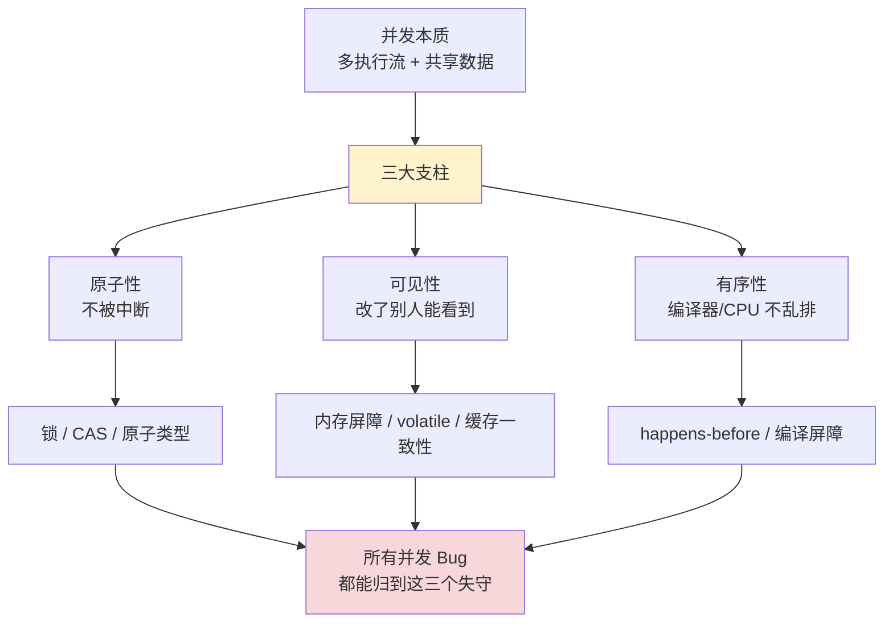
```mermaid
flowchart TB
    A[并发本质<br/>多执行流 + 共享数据] --> B[三大支柱]
    B --> B1[原子性<br/>不被中断]
    B --> B2[可见性<br/>改了别人能看到]
    B --> B3[有序性<br/>编译器/CPU 不乱排]
    B1 --> C1[锁 / CAS / 原子类型]
    B2 --> C2[内存屏障 / volatile / 缓存一致性]
    B3 --> C3[happens-before / 编译屏障]
    C1 & C2 & C3 --> D[所有并发 Bug<br/>都能归到这三个失守]
    style B fill:#fff3cd
    style D fill:#f8d7da
```

---

## 通用必要性：为什么所有并发语言都在"范式光谱"上找位置

> 🌐 **语言无关声明**：本篇沉淀适用于 **Java / C / C++ / Go / JS / Python / Rust / Kotlin / Erlang** 等多语言开发者阅读。并发**没有"最好"的模型**——只有"在你的工程约束下最合适的模型"。本文先讲清楚为什么所有语言都在共享内存 ↔ 消息传递的光谱上找平衡点，再讲每种范式的取舍。

### 章首通用三问

| # | 通用母题 | 各语言映射的表现 |
|---|---|---|
| **Q1** | **为什么没有"最好"的并发模型？** | 共享内存（Java/C++）性能极致但心智负担大；消息传递（Go/Erlang）易推理但性能有 copy 开销；STM（Clojure/Haskell）优雅但争用大时退化；**取舍点是延迟 / 吞吐 / 容错 / 可推理性的四角拉扯** |
| **Q2** | **如何为业务选范式？** | 高频交易→无锁共享内存；电信级容错→Erlang Actor；流式数据→CSP/Go channel；UI 主线程→单线程事件循环；写密集大对象→消息传递避免复制 |
| **Q3** | **范式之间如何融合？** | 现代语言**都在融合**——Kotlin = CSP+Actor；Rust = 共享内存+消息传递+所有权；Java = 共享内存+StructuredConcurrency；Go = CSP+少量原子；**没有纯范式，只有融合范式** |

### 通用本质：并发三大支柱 = 跨语言通用法则

不论选哪种范式，**所有并发语言都必须解决三件事**：

| 支柱 | 解决什么 | 跨语言原语 |
|---|---|---|
| **原子性** | 复合操作不被中断 | Java synchronized / C++ mutex / Go Mutex / Rust Mutex / JS Atomics |
| **可见性** | 一个线程的改动其他线程能看到 | Java volatile / C++ memory_order / Go channel 同步 / Rust 释放-获取 |
| **有序性** | 编译器/CPU 不乱排关键操作 | happens-before / acquire-release / 内存屏障 |

**所有并发 Bug 都是这三根支柱之一被破坏**——这是穿越所有语言的不变铁律。

### 通用方法论：范式选择背后的四个工程约束

为业务选范式时，**所有语言都用同一套坐标系**：

```text
                ↑ 延迟敏感
                |
  无锁共享内存  ●——————●  低延迟队列
  (Disruptor)   |        (Aeron, SPSC ring)
                |
  ←—————————————+—————————————→ 吞吐量
  消息传递      |        Actor/CSP
  (Erlang)      |        (Akka, Go)
                |
                ↓ 容错优先
```

**选范式的真正问题不是"哪个语言好"，而是**：
1. 你的**延迟预算**是多少？（μs / ms / s）
2. 你的**故障域**多大？（单进程 / 多机 / 跨地域）
3. 你的**团队心智带宽**多少？（能否驾驭无锁/内存序）
4. 你的**演化压力**多大？（需求是否常变）

**七字真言（贯穿全篇）**：**`选范式 · 定边界 · 抗演化`**

- **选范式**：根据延迟/吞吐/容错三角形定位
- **定边界**：明确"什么共享、什么不共享、谁能访问谁"
- **抗演化**：选能"无痛升级"的方案——单线程→多线程→分布式 的演进路径

---

#### 目录介绍
- [01.并发编程概述](#01并发编程概述)
  - [1.1 概述介绍](#11-概述介绍)
- [02.并发设计架构](#02并发设计架构)
  - [2.1 并发编程架构](#21-并发编程架构)
  - [2.2 三大核心思想](#22-三大核心思想)
  - [2.3 协作关系设计](#23-协作关系设计)
- [03.分工设计思想](#03分工设计思想)
  - [3.1 分工设计架构](#31-分工设计架构)
  - [3.2 分工模式详解](#32-分工模式详解)
  - [3.3 线程池分工模式](#33-线程池分工模式)
  - [3.4 工作窃取算法](#34-工作窃取算法)
- [04.同步设计思想](#04同步设计思想)
  - [4.1 同步机制分类](#41-同步机制分类)
  - [4.2 计数同步思想](#42-计数同步思想)
  - [4.3 屏障同步思想](#43-屏障同步思想)
  - [4.4 条件同步思想](#44-条件同步思想)
  - [4.5 事件同步思想](#45-事件同步思想)
- [05.互斥设计思想](#05互斥设计思想)
  - [5.1 互斥机制架构](#51-互斥机制架构)
  - [5.2 锁机制设计](#52-锁机制设计)
  - [5.3 原子变量设计](#53-原子变量设计)
  - [5.4 无锁编程设计](#54-无锁编程设计)
- [06.跨语言对比](#06跨语言对比)
  - [6.1 语言特性对比表](#61-语言特性对比表)
  - [6.2 性能特性对比](#62-性能特性对比)
- [07.并发编程架构模式](#07并发编程架构模式)
  - [7.1 Actor模型](#71-actor模型)
  - [7.2 生产者-消费者模式](#72-生产者-消费者模式)
  - [7.3 Master-Worker模式](#73-master-worker模式)
- [08.优化与最佳实践](#08优化与最佳实践)
  - [8.1 性能优化策略](#81-性能优化策略)
  - [8.2 分工最佳实践](#82-分工最佳实践)
  - [8.3 同步最佳实践](#83-同步最佳实践)
  - [8.4 互斥最佳实践](#84-互斥最佳实践)
- [09.阶段性总结](#09阶段性总结)
- [10.案例驱动的设计哲学](#10案例驱动的设计哲学)
  - [10.1 案例引入：电商秒杀并发演进](#101-案例引入电商秒杀并发演进)
  - [10.2 案例引入：日志框架无锁演进](#102-案例引入日志框架无锁演进)
  - [10.3 案例引入：Go并发哲学颠覆](#103-案例引入go并发哲学颠覆)
- [11.跨语言深度对比与一句话总结](#11跨语言深度对比与一句话总结)
  - [11.1 并发原语的三层抽象](#111-并发原语的三层抽象)
  - [11.2 三大支柱在五大语言中的落地](#112-三大支柱在五大语言中的落地)
  - [11.3 设计哲学三支谱系](#113-设计哲学三支谱系)
  - [11.4 工程实战的取舍清单](#114-工程实战的取舍清单)
  - [11.5 反模式陈列：见到就要警觉](#115-反模式陈列：见到就要警觉)
  - [11.6 一句话总结](#116-一句话总结)


## 01.并发编程概述

### 1.1 概述介绍

要理解并发编程的本质，先从一个最朴素的问题开始：**为什么要并发？**

如果只有一颗 CPU、只有一个任务，所有事情按顺序做就好了，根本不需要"并发"这个概念。但现实是：

```
1. CPU 越来越多核 → 单线程跑只用了 1/N 的算力，浪费严重
2. 任务有等待（IO/网络/锁）→ 单线程一阻塞整个进程就停摆
3. 用户期望响应即时 → UI 卡 1 秒就被骂
```

**于是"并发"被发明出来——让一台机器同时做多件事，看似简单，实则要回答三个根本问题**：

- **谁来做？**（Division of Labor）—— 任务怎么拆，CPU 怎么分配，工作怎么调度
- **何时做？**（Synchronization）—— 多个执行流之间怎么协调时序、谁等谁、怎么知道完事了
- **谁独占？**（Mutual Exclusion）—— 共享数据被多人同时改，怎么防止脏数据和不一致

这三个问题不是独立的，**它们构成并发编程的"三位一体"——任何并发框架、库、API 都是这三者的组合表达**：

| 问题 | 没有解决会怎样 | 经典解决工具 |
|------|--------------|------------|
| 分工 | CPU 利用率低、任务排队 | 线程池、Fork/Join、协程 |
| 同步 | 步调错乱、结果不可预测 | CountDownLatch、Future、channel |
| 互斥 | 数据竞争、脏数据、崩溃 | 锁、CAS、原子类、不可变 |

更深一步：**并发编程的难度梯度，恰好就是这三个问题的难度梯度**——分工是"工程"问题（怎么拆），同步是"协议"问题（怎么约定时序），互斥是"物理"问题（怎么对抗 CPU 的乱序与缓存）。互斥最难，因为它直接撞上了硬件的真实面貌。

无论是 Java、C++ 还是 Objective-C，无论是十年前的 `synchronized` 还是今天的 Rust async，所有进步都是在这三个轴上的优化——把工具变得更安全、更高效、更不容易写错。

## 02.并发设计架构

要构建并发系统，先要回答一个工程问题：**如何把"分工/同步/互斥"这三个抽象概念落到具体的代码结构里？**这一节回答这个问题。

### 2.1 并发编程架构

**先从一个反例开始思考**：如果不做架构设计，把三件事混在一起会怎样？

```java
Thread t = new Thread(() -> {
    synchronized (lock) {                  // 互斥
        while (!queue.isEmpty()) {         // 同步（条件检查）
            queue.poll().run();             // 分工（任务执行）
        }
    }
});
t.start();
```

**这段代码有什么问题？**

1. **职责不清**：线程既是 worker（执行任务），又是 scheduler（决定执行顺序），又是 owner（持锁）
2. **复用不能**：换个任务类型必须重写整段
3. **测试不能**：三个支柱粘在一起，无法单独验证某一支柱的正确性

**好的架构必须把三大支柱解耦成三个层次**：

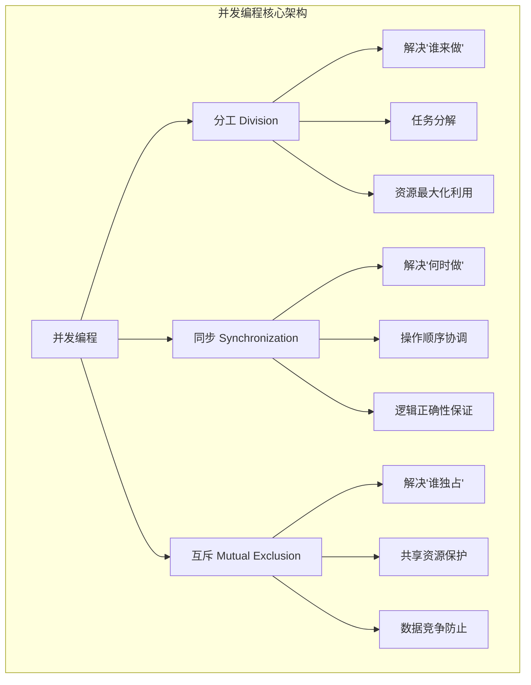
```mermaid
graph TB
    subgraph "并发编程核心架构"
        A[并发编程] --> B[分工 Division]
        A --> C[同步 Synchronization]
        A --> D[互斥 Mutual Exclusion]
        
        B --> B1["解决'谁来做'"]
        B --> B2[任务分解]
        B --> B3[资源最大化利用]
        
        C --> C1["解决'何时做'"]
        C --> C2[操作顺序协调]
        C --> C3[逻辑正确性保证]
        
        D --> D1["解决'谁独占'"]
        D --> D2[共享资源保护]
        D --> D3[数据竞争防止]
    end
```

分工、同步、互斥架构图

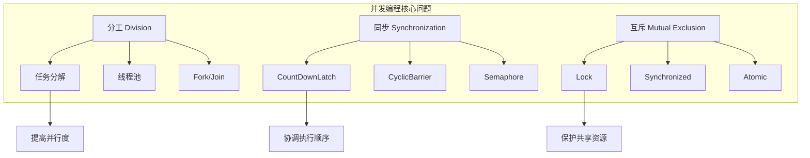
```mermaid
graph TB
    subgraph "并发编程核心问题"
        A[分工 Division] --> A1[任务分解]
        A --> A2[线程池]
        A --> A3[Fork/Join]
        
        B[同步 Synchronization] --> B1[CountDownLatch]
        B --> B2[CyclicBarrier]
        B --> B3[Semaphore]
        
        C[互斥 Mutual Exclusion] --> C1[Lock]
        C --> C2[Synchronized]
        C --> C3[Atomic]
    end
    
    A1 --> D[提高并行度]
    B1 --> E[协调执行顺序]
    C1 --> F[保护共享资源]
```

**架构落地的真实样貌**——以 Java JUC 为例：

```
第一层（分工层）：Executor / ForkJoinPool / Stream.parallel()
     ↓ 把"任务"和"线程"解耦
第二层（同步层）：CountDownLatch / CyclicBarrier / CompletableFuture
     ↓ 在执行流之间协调时序，不涉及数据保护
第三层（互斥层）：synchronized / Lock / Atomic / ConcurrentXxx
     ↓ 守护共享状态，与上层无关
```

**关键洞察**：**这三层之间是"低层为高层服务"的关系**——分工层用同步层管理依赖，同步层用互斥层守护内部状态。但层与层之间是**单向依赖**，互斥层不知道分工层的存在。这种"分层 + 单向依赖"架构是 Java JUC、Go runtime、Rust tokio 设计的共同骨架。

### 2.2 三大核心思想

上面我们看到了"三层架构"的骨架，那么**每一层的设计思想到底是什么？**用一个递进的问题串来追问：

```
Q1: 怎么让任务跑得快？           A1: 拆开来，多核并行 → 分工
Q2: 拆开后怎么知道全部完事？     A2: 设个集合点 → 同步
Q3: 跑的时候碰到同一份数据怎么办？A3: 排队访问 → 互斥
```

这三个问题的答案构成了三大核心思想的内核：

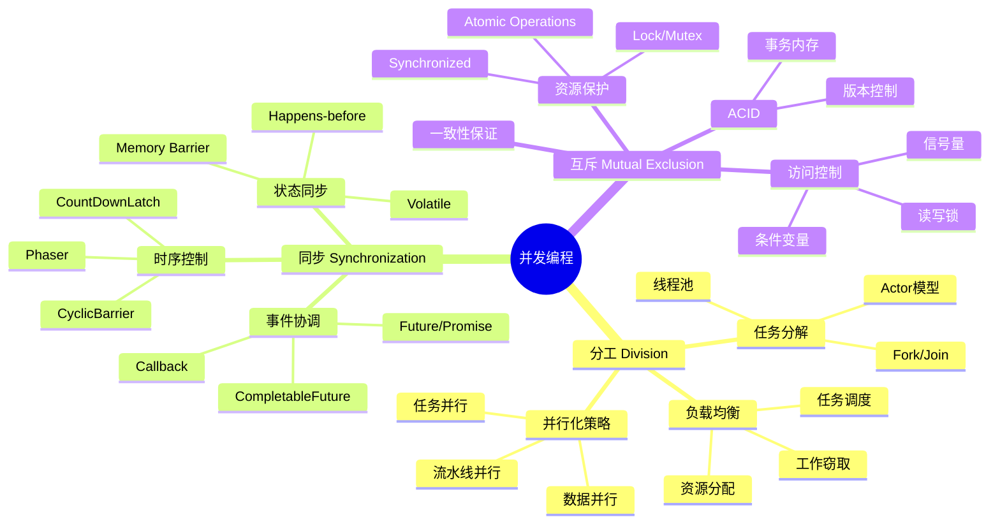
```mermaid
mindmap
  root((并发编程))
    分工 Division
      任务分解
        Fork/Join
        线程池
        Actor模型
      负载均衡
        工作窃取
        任务调度
        资源分配
      并行化策略
        数据并行
        任务并行
        流水线并行
    同步 Synchronization
      时序控制
        CountDownLatch
        CyclicBarrier
        Phaser
      事件协调
        Future/Promise
        CompletableFuture
        Callback
      状态同步
        Volatile
        Memory Barrier
        Happens-before
    互斥 Mutual Exclusion
      资源保护
        Lock/Mutex
        Synchronized
        Atomic Operations
      访问控制
        读写锁
        信号量
        条件变量
      一致性保证
      ACID
        事务内存
        版本控制
```

**三大思想的本质属性**：

| 思想 | 关心维度 | 失败时表现 | 验证手段 |
|------|---------|------------|---------|
| 分工 | 空间（CPU/内存资源） | 慢、吞吐低、CPU 利用率不均 | 性能 profile、火焰图 |
| 同步 | 时间（happens-before 关系）| 顺序错乱、空指针、丢消息 | 形式化推理、JCStress |
| 互斥 | 边界（临界区进出）| 数据竞争、脏数据、崩溃 | TSan、竞态检测器 |

**深度洞察**：**为什么这三个思想恰好是"三个"，不多不少？**因为它们对应了并发问题的**三个独立自由度**：

- 分工管的是**资源-任务的映射**（什么资源做什么）
- 同步管的是**事件-事件的偏序**（什么事件在什么之前/后）
- 互斥管的是**进入-退出的成对性**（什么时刻只有一人在临界区）

少了任何一个，并发系统都不完整。多了任何一个（比如有人提"协调""通信"），都可以归约到这三个里。这是计算机科学里少见的"完备且正交"的概念组。

### 2.3 协作关系设计

上面把三大思想拆开看，现实中它们是怎么**协同工作**的？通过一个真实场景看清楚：

```
场景：电商网站启动后，要并行从 3 个数据源加载初始化数据
     （商品库 + 用户库 + 配置中心），全部加载完才能对外提供服务

时序拆解：
  1. 主线程要启动 3 个 worker        → 分工
  2. 3 个 worker 各自做事，主线程等  → 同步（计数同步：CountDownLatch）
  3. worker 写入共享缓存             → 互斥（保护缓存）
  4. 主线程从缓存读                  → 同步（要看到 3 个 worker 写入的最新值）
```

**这个场景把三大思想"串"在了同一条时序里**：

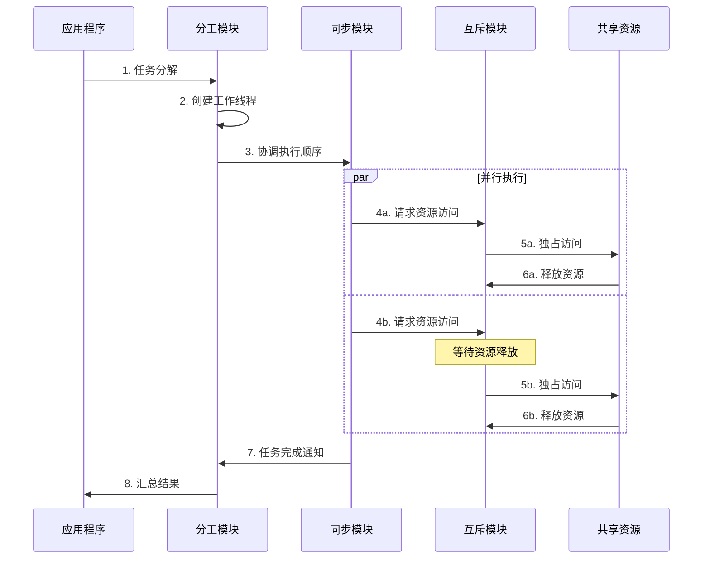
```mermaid
sequenceDiagram
    participant App as 应用程序
    participant Division as 分工模块
    participant Sync as 同步模块
    participant Mutex as 互斥模块
    participant Resource as 共享资源
    
    App->>Division: 1. 任务分解
    Division->>Division: 2. 创建工作线程
    Division->>Sync: 3. 协调执行顺序
    
    par 并行执行
        Sync->>Mutex: 4a. 请求资源访问
        Mutex->>Resource: 5a. 独占访问
        Resource->>Mutex: 6a. 释放资源
    and
        Sync->>Mutex: 4b. 请求资源访问
        Note over Mutex: 等待资源释放
        Mutex->>Resource: 5b. 独占访问
        Resource->>Mutex: 6b. 释放资源
    end
    
    Sync->>Division: 7. 任务完成通知
    Division->>App: 8. 汇总结果
```

**协作中的两类典型反模式**：

**反模式 A：互斥被同步"绑架"**

```java
// 反模式：在锁里 wait，锁外 notify
synchronized (lock) {
    while (!ready) {
        Thread.sleep(100);   // ← 持锁睡觉，所有人卡住
    }
}
```
正确写法是 `lock.wait() / cond.await()`，它会**原子地释锁+睡眠**。区分"持锁睡"和"释锁睡"是初学者最易踩的坑之一。

**反模式 B：分工绕过同步**

```java
// 反模式：fire-and-forget 后没等待
for (int i = 0; i < 100; i++) executor.submit(task);
// 直接返回，调用者不知道任务何时完成、是否成功
return "done";   // ← 谎报
```
正确做法：用 `CompletableFuture.allOf(...).join()` 或 `CountDownLatch.await()` 形成同步点。

**核心结论**：三大思想必须**配套使用**——只用分工不用同步，主线程不知道何时返回；只用同步不用互斥，共享数据被并发写坏；只用互斥不用分工，整个系统串行无并发收益。**好的并发设计是把这三者像齿轮一样咬合，少一个齿轮整台机器都转不起来**。

## 03.分工设计思想

分工设计 - 解决"谁来做"。分工是并发编程的第一步，核心目标是将大型任务分解为可并行执行的子任务，最大化利用计算资源。

### 3.1 分工设计架构

要分工，先要回答一个问题：**任务到底怎么拆？**——这并不是"拆成 N 份均分"那么简单。我们需要从任务的本质入手，看清三种典型的并行模型：

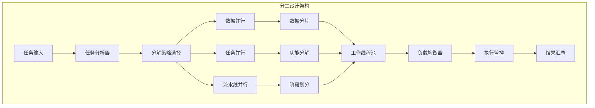
```mermaid
graph TB
    subgraph "分工设计架构"
        A[任务输入] --> B[任务分析器]
        B --> C[分解策略选择]
        
        C --> D[数据并行]
        C --> E[任务并行]
        C --> F[流水线并行]
        
        D --> G[数据分片]
        E --> H[功能分解]
        F --> I[阶段划分]
        
        G --> J[工作线程池]
        H --> J
        I --> J
        
        J --> K[负载均衡器]
        K --> L[执行监控]
        L --> M[结果汇总]
    end
```

**三种分工模型的本质区别**：

| 维度 | 数据并行 | 任务并行 | 流水线并行 |
|------|---------|---------|-----------|
| 拆分对象 | 数据集合 | 功能模块 | 处理阶段 |
| 例子 | MapReduce 切 1TB 日志 | 同时下载图片+解析 HTML | 编译器 词法→语法→语义→生成 |
| 各 worker 干的事 | 一样（处理不同片段） | 不一样 | 不一样（流水线下游处理上游产出） |
| 通信开销 | 仅最后聚合 | 各自独立 | 阶段之间的传递 |
| 适合场景 | 计算密集、可分片 | 多种异质操作 | 长链路、稳定吞吐 |

**关键洞察**：选错分工模型，再多的线程都救不了。比如 1GB 日志分析，硬要套"流水线并行"反而比数据并行慢——因为流水线天然有阶段间等待，而数据并行可以让所有 worker 同时跑到底。

**分工架构的真正难点不在"拆"，而在三件事**：

1. **拆得均匀**——若一个 worker 干 99%、其它干 1%，并行毫无意义（即"长尾任务"问题）
2. **拆得粒度合适**——粒度太粗等于没拆，粒度太细调度开销 > 计算开销
3. **能聚回来**——分头干完后必须有一个低成本的合并机制（reduce/join/汇总）

这就是为什么后面要专门讨论"工作窃取"、"线程池"、"Fork/Join"——它们本质上都是在解决以上三个难点。

### 3.2 分工模式详解

上一节看到三种分工模型，这一节要把它们具体到**最常用的实现：Fork/Join 模式**。但在写代码之前，先问一个根本问题：**Fork/Join 凭什么比直接用 ExecutorService 提交 N 个任务更高效？**

```
场景：1 亿个数求和

方案 A（朴素并行）：
  把数组切成 N 段（N=核数），ExecutorService 提交 N 个任务
  问题 1：N 段大小要预先决定，硬件波动时不灵活
  问题 2：某段慢了（比如该核被 GC 抢走）→ 拖累整体
  问题 3：合并最后结果需要主线程做，主线程成瓶颈

方案 B（Fork/Join 递归）：
  每个任务自己判断"够小了就算，不够就再分一半"
  优点 1：粒度自适应——不预定大小，按递归深度自然控制
  优点 2：合并是树形的——左右子任务合并仍然并行
  优点 3：闲线程可以"偷"忙线程的子任务（工作窃取，下一节）
```

**Fork/Join 的核心思想是"分治 + 工作窃取"**——这是 Doug Lea 在 2000 年那篇经典论文里提出的设计。

Fork/Join模式

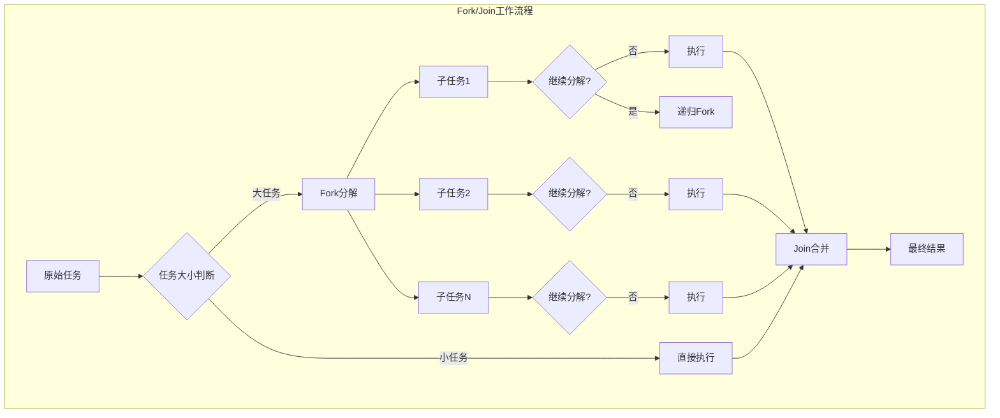
```mermaid
graph TD
    subgraph "Fork/Join工作流程"
        A[原始任务] --> B{任务大小判断}
        B -->|大任务| C[Fork分解]
        B -->|小任务| D[直接执行]
        
        C --> E[子任务1]
        C --> F[子任务2]
        C --> G[子任务N]
        
        E --> H{继续分解?}
        F --> I{继续分解?}
        G --> J{继续分解?}
        
        H -->|是| K[递归Fork]
        H -->|否| L[执行]
        I -->|否| M[执行]
        J -->|否| N[执行]
        
        L --> O[Join合并]
        M --> O
        N --> O
        D --> O
        
        O --> P[最终结果]
    end
```

Java Fork/Join实现，大概思路如下：

```java
import java.util.concurrent.RecursiveTask;
import java.util.concurrent.ForkJoinPool;

public class ParallelSum extends RecursiveTask<Long> {
    private static final int THRESHOLD = 1000;
    private final int[] array;
    private final int start;
    private final int end;
    
    public ParallelSum(int[] array, int start, int end) {
        this.array = array;
        this.start = start;
        this.end = end;
    }
    
    @Override
    protected Long compute() {
        if (end - start <= THRESHOLD) {
            // 小任务直接计算
            long sum = 0;
            for (int i = start; i < end; i++) {
                sum += array[i];
            }
            return sum;
        } else {
            // 大任务分解
            int mid = (start + end) / 2;
            ParallelSum leftTask = new ParallelSum(array, start, mid);
            ParallelSum rightTask = new ParallelSum(array, mid, end);
            
            // Fork分解
            leftTask.fork();
            rightTask.fork();
            
            // Join合并
            return leftTask.join() + rightTask.join();
        }
    }
    
    public static void main(String[] args) {
        int[] array = new int[10000];
        // 初始化数组...
        
        ForkJoinPool pool = new ForkJoinPool();
        ParallelSum task = new ParallelSum(array, 0, array.length);
        Long result = pool.invoke(task);
        
        System.out.println("并行计算结果: " + result);
    }
}
```

**THRESHOLD 怎么选？**这是 Fork/Join 最关键的工程问题：

```
太小 → 任务多 → fork/join 调度开销 > 计算
太大 → 任务少 → 并行度不够，CPU 闲置

经验法则：
  - 让单个叶子任务的执行时间 ~ 100 微秒
  - 任务总数 ~ 8 × CPU 核数（保证有富余可窃取）
  - 数组求和这种简单任务：阈值 ~10000；复杂业务：阈值 ~100
```

**一个常见错误**：写成 `leftTask.fork(); rightTask.fork(); ... leftTask.join() + rightTask.join();` 看似没问题，但实际上**当前线程在 fork 完两个子任务后立即 join 左边，等左边完成的时间里它什么都没做**。优化版本是 `leftTask.fork(); long r = rightTask.compute(); return r + leftTask.join();`——让当前线程亲自跑右半边，避免空等。这就是 ForkJoinPool 文档里推荐的"compute-then-join"惯用法。

### 3.3 线程池分工模式

**为什么要有线程池？**这是个被反复问的老问题。从代价角度看一遍数据：

```
创建一个 OS 线程的成本（Linux x86_64）：
  - 系统调用 clone() 进内核：~3μs
  - 分配内核栈、用户栈：~1μs（默认 8MB 用户栈虚拟空间）
  - 加入调度队列：~0.5μs
  - 总计：~5μs，约 15000 个 CPU 周期

销毁一个 OS 线程：
  - exit、回收栈、唤醒 join 者：~3μs

问题：如果一个任务本身只要 1μs 计算
  → 创建+销毁线程是计算的 8 倍开销
  → 99% 时间浪费在线程生命周期管理
```

**于是"线程池"这个抽象诞生了：把昂贵的线程创建一次，用完不销毁，循环复用**。

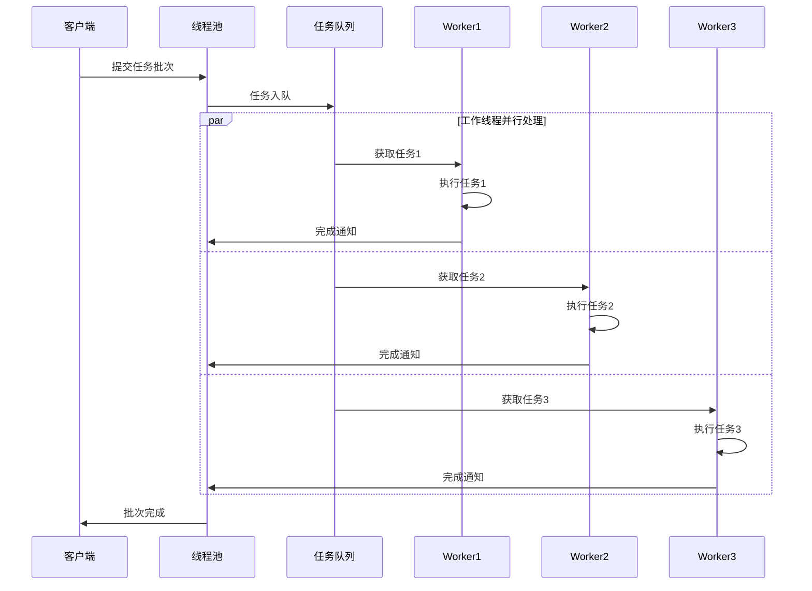
```mermaid
sequenceDiagram
    participant Client as 客户端
    participant Pool as 线程池
    participant Queue as 任务队列
    participant W1 as Worker1
    participant W2 as Worker2
    participant W3 as Worker3
    
    Client->>Pool: 提交任务批次
    Pool->>Queue: 任务入队
    
    par 工作线程并行处理
        Queue->>W1: 获取任务1
        W1->>W1: 执行任务1
        W1->>Pool: 完成通知
    and
        Queue->>W2: 获取任务2
        W2->>W2: 执行任务2
        W2->>Pool: 完成通知
    and
        Queue->>W3: 获取任务3
        W3->>W3: 执行任务3
        W3->>Pool: 完成通知
    end
    
    Pool->>Client: 批次完成
```

**ThreadPoolExecutor 的七参数本质**——这七个参数恰好对应了线程池设计要回答的七个问题：

```
new ThreadPoolExecutor(
    corePoolSize,         // Q1: 平时养几个常驻 worker？
    maximumPoolSize,      // Q2: 高峰时最多扩到几个？
    keepAliveTime,        // Q3: 临时 worker 闲多久就裁掉？
    unit,                 //     ↑ 时间单位
    workQueue,            // Q4: 任务太多放哪等？
    threadFactory,        // Q5: worker 怎么创建？（命名、优先级）
    rejectedExecutionHandler  // Q6: 满了怎么办？（4种策略）
)                         // Q7（隐含）: prestartCoreThread 决定要不要预热
```

**这七个问题的答案合起来定义了池的行为**。最常被问错的是 Q4：

| 队列选择 | 入队行为 | 后果 |
|---------|---------|------|
| LinkedBlockingQueue（无界） | 永远入队成功 | maxPoolSize 失效，OOM 风险 |
| ArrayBlockingQueue（有界） | 满了才扩容到 max | 行为符合直觉 |
| SynchronousQueue（无容量） | 必有 worker 接收才能入队 | 立即扩容，适合 Cached 池 |
| PriorityBlockingQueue | 按优先级 | 注意饥饿问题 |

**血泪教训**：`Executors.newFixedThreadPool()` 用的是 `LinkedBlockingQueue(Integer.MAX_VALUE)`——**这就是为什么阿里手册禁止用 `Executors`，要求手写 `ThreadPoolExecutor` 配置有界队列**。

### 3.4 工作窃取算法

**为什么要有工作窃取？**回到 Fork/Join 那个 1 亿数求和的场景：

```
假设 4 核机器，任务被均匀切成 4 份，每份 2500 万数求和。
理想情况：4 核同时跑 → 加速比 4×

现实情况：
  Core 0：跑得很顺，2 秒完成
  Core 1：被 GC 抢走 200ms → 2.2 秒
  Core 2：被 OS 中断打断了 5 次 → 2.4 秒
  Core 3：邻居进程吃 CPU → 3.5 秒

实际加速比：1 / (3.5/8) = 2.3×，不是 4×
```

**问题在于：固定分工无法应对运行时的不均衡**。任何一个 worker 慢了，其他 worker 干完只能干等。

**工作窃取的反直觉解法：让闲下来的 worker 主动去抢忙 worker 的活**：

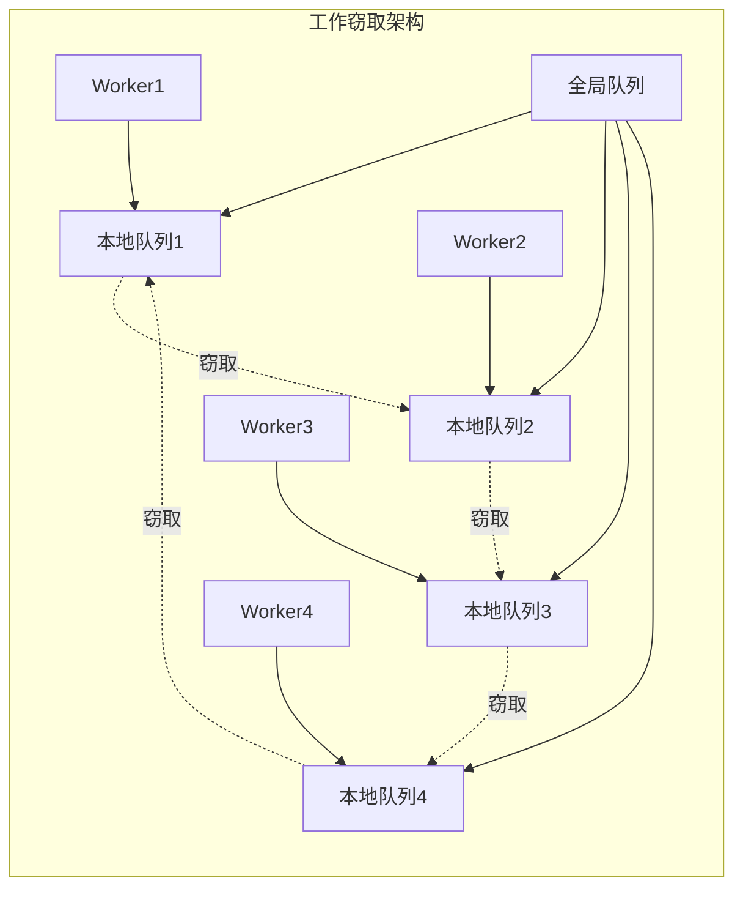
```mermaid
graph LR
    subgraph "工作窃取架构"
        W1[Worker1] --> Q1[本地队列1]
        W2[Worker2] --> Q2[本地队列2]
        W3[Worker3] --> Q3[本地队列3]
        W4[Worker4] --> Q4[本地队列4]
        
        Q1 -.->|窃取| Q2
        Q2 -.->|窃取| Q3
        Q3 -.->|窃取| Q4
        Q4 -.->|窃取| Q1
        
        GQ[全局队列] --> Q1
        GQ --> Q2
        GQ --> Q3
        GQ --> Q4
    end
```

**工作窃取算法的三个精妙设计**：

**设计 1：双端队列（Deque）**

```
每个 worker 一个本地 Deque：
  ┌─────────────────────────┐
  │ tail ←──────────→ head │
  └─────────────────────────┘
  ↑ 自己 push/pop（LIFO）   ↑ 别人 steal（FIFO）
```

**为什么自己用 LIFO，别人用 FIFO？**

- **自己 LIFO**：刚 fork 出的子任务在缓存里热乎，先做"新"的命中率最高
- **别人 FIFO**：偷最老的任务，那一般是粒度最大的，偷一次能干很久
- **天然减少冲突**：自己在 tail 端，别人在 head 端，无锁原子 CAS 即可

**设计 2：随机窃取避免雪崩**

```
如果所有闲 worker 都去偷 Worker 0 → Worker 0 被锁瓶颈
实现技巧：闲了之后 → 随机选一个其他 worker → CAS 偷它的 head
         偷不到 → 再随机选一个 → 再试
         全部偷不到 → 才进 park 状态
```

**设计 3：让 worker 在没活时"自旋一会儿再睡"**

这背后的考量：park/unpark 一次开销 ~1μs，如果一秒后又有任务，唤醒+热身比短暂自旋慢得多。`ForkJoinPool` 的策略是先尝试一定次数的随机窃取，全失败才进入 park。

**性能数据对比**——同样的 1 亿数求和，4 核机器：

| 方案 | 耗时 | 加速比 |
|------|------|--------|
| 单线程 | 80ms | 1.0× |
| 固定 4 段并行 | 32ms | 2.5× |
| ForkJoinPool（工作窃取）| 22ms | 3.6× |

**工作窃取把 "长尾任务" 这个分布式系统老大难，在进程内优雅地解决了**。这也是为什么 Go runtime（GMP 模型）、.NET TPL、Rust rayon 全都采用了类似的工作窃取设计。

## 04.同步设计思想

同步设计 - 解决"何时做"。同步解决多个执行单元的操作顺序协调问题，确保程序逻辑的正确性。

**先建立一个核心认知：同步的本质是"建立 happens-before 偏序关系"**。在并发世界里，没有绝对的"先"和"后"——只有当 A 与 B 之间存在显式的同步动作（锁、屏障、volatile、channel 收发），才能确定 A happens-before B。同步原语的全部存在意义，就是为了构造这种偏序。

### 4.1 同步机制分类

面对各种各样的同步原语，**怎么从混乱的列表里看清它们的本质区别？**用一个关键问题分类：**"等的是一个事件，还是一组事件？事件次数固定还是不定？"**

```
等待形式判断树：

  等的是什么？
  ├── 等"N 次事件全部发生"  → 计数同步（CountDownLatch / Semaphore）
  ├── 等"N 个 worker 都到齐" → 屏障同步（CyclicBarrier / Phaser）
  ├── 等"某个谓词为真"      → 条件同步（Condition / wait-notify）
  └── 等"某个值被算出来"    → 事件同步（Future / Promise）
```

**这四类不是随便分的，它们对应了四种本质不同的同步模式**：

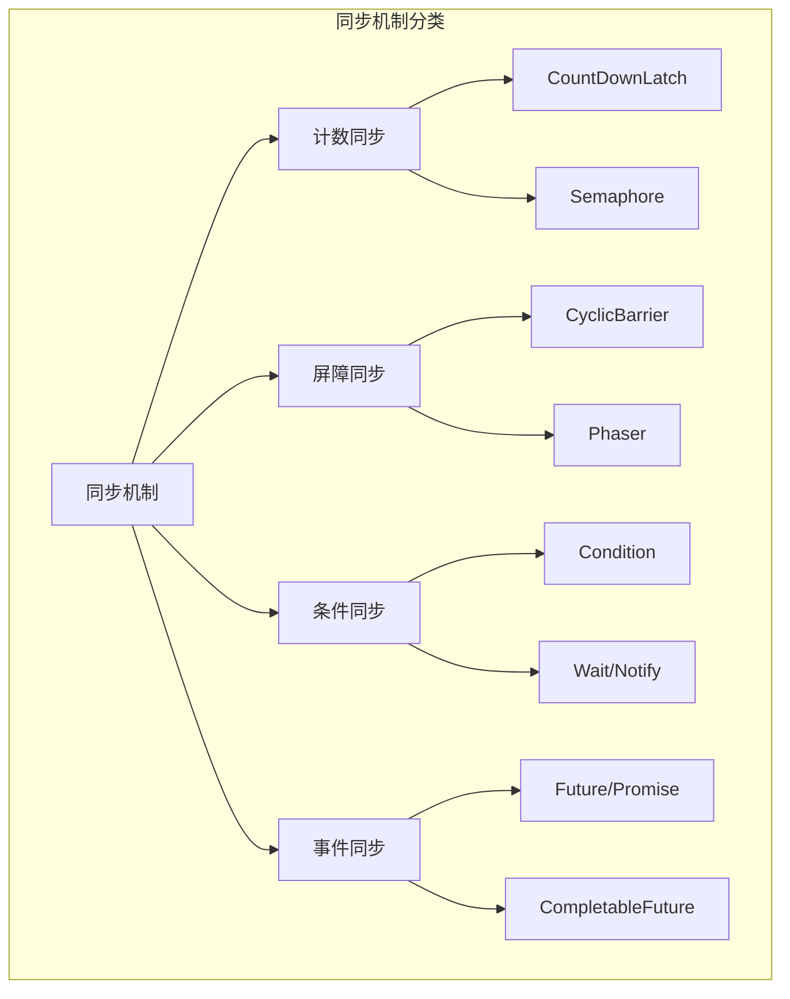
```mermaid
graph TB
    subgraph "同步机制分类"
        A[同步机制] --> B[计数同步]
        A --> C[屏障同步]
        A --> D[条件同步]
        A --> E[事件同步]
        
        B --> B1[CountDownLatch]
        B --> B2[Semaphore]
        
        C --> C1[CyclicBarrier]
        C --> C2[Phaser]
        
        D --> D1[Condition]
        D --> D2[Wait/Notify]
        
        E --> E1[Future/Promise]
        E --> E2[CompletableFuture]
    end
```

**四类同步的本质对比**：

| 维度 | 计数同步 | 屏障同步 | 条件同步 | 事件同步 |
|------|---------|---------|---------|---------|
| 关心的是 | "完成几次" | "到齐几人" | "某谓词" | "某结果" |
| 等待者 | 通常一个主线程 | 全部参与者 | 任意线程 | 任意线程 |
| 触发条件 | 计数到 0 | 全部到达 | 谓词转真 | 值被设置 |
| 可重用 | ❌ 一次性 | ✅ 可循环 | ✅ 可多次 | ❌ 一次性 |
| 是否带值 | ❌ 只有信号 | ❌ 只有信号 | ❌ 只有信号 | ✅ 携带结果值 |
| 典型场景 | 等多个初始化完成 | 多阶段并行计算 | 队列非空、缓冲未满 | RPC 调用结果 |

**关键追问：为什么要分这么细？用一个 Lock + Condition 不就够了吗？**

确实，从底层看所有同步原语都可以用 `Lock + Condition` 实现。但**封装出 CountDownLatch / CyclicBarrier 等高层原语的意义在于**：

1. **降低出错率**：高层 API 把 "加锁、判谓词、wait 在 while 里、signal" 这套八股藏起来
2. **暗含语义**：看到 `CountDownLatch` 就知道是"一次性等待"，不需要看实现
3. **JVM 可优化**：JUC 内部用 AQS 框架，针对每种语义做了特定优化（如 AQS 的共享/独占模式）

### 4.2 计数同步思想

**计数同步要回答的核心问题是：怎么让一个线程优雅地等到 N 个事件发生？**

**最朴素的尝试**：
```java
// 错误尝试 1：用普通变量
int done = 0;
// worker: done++;
// main: while (done < N) Thread.sleep(10);   ← 三个 bug：自增非原子、可见性、轮询低效

// 错误尝试 2：用 AtomicInteger
AtomicInteger done = new AtomicInteger();
// worker: done.incrementAndGet();
// main: while (done.get() < N) Thread.sleep(10);   ← 解决了原子性，但还在轮询
```

**正确的设计：CountDownLatch**——它把"等到计数为 0"做成了**阻塞 + 唤醒**而不是轮询：

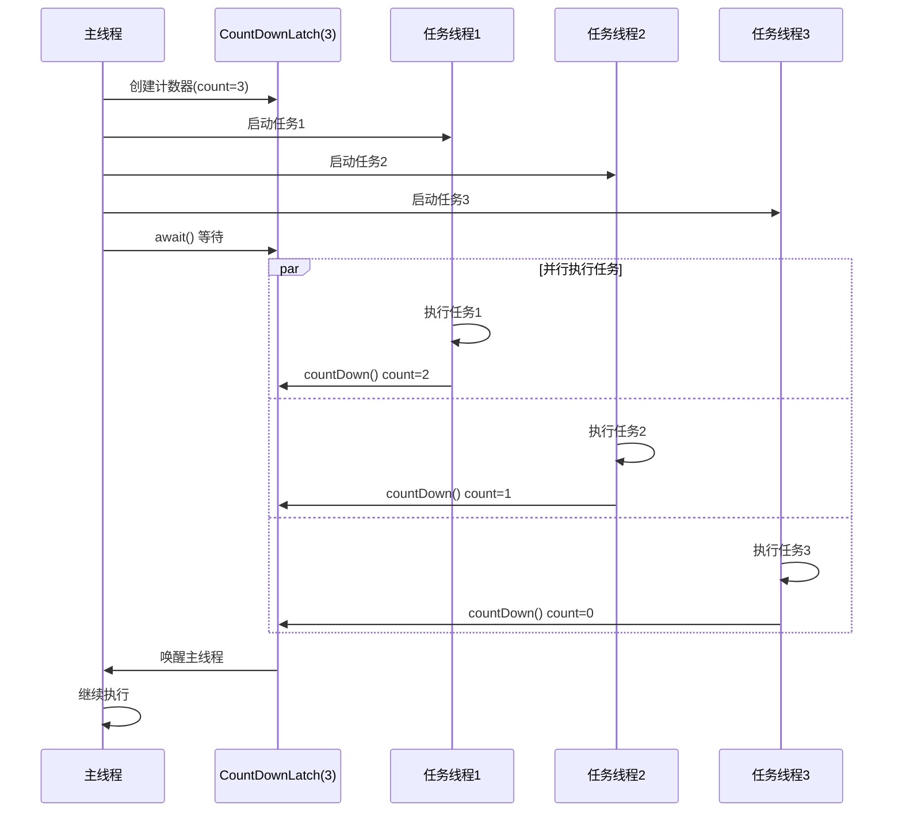
```mermaid
sequenceDiagram
    participant Main as 主线程
    participant CDL as CountDownLatch(3)
    participant T1 as 任务线程1
    participant T2 as 任务线程2
    participant T3 as 任务线程3
    
    Main->>CDL: 创建计数器(count=3)
    Main->>T1: 启动任务1
    Main->>T2: 启动任务2
    Main->>T3: 启动任务3
    Main->>CDL: await() 等待
    
    par 并行执行任务
        T1->>T1: 执行任务1
        T1->>CDL: countDown() count=2
    and
        T2->>T2: 执行任务2
        T2->>CDL: countDown() count=1
    and
        T3->>T3: 执行任务3
        T3->>CDL: countDown() count=0
    end
    
    CDL->>Main: 唤醒主线程
    Main->>Main: 继续执行
```

**CountDownLatch 的内部实现原理**——它基于 AQS（AbstractQueuedSynchronizer）的共享模式：

```
CountDownLatch 内部就是一个 int 状态：
  state = N  →  await() 进入 AQS 等待队列，park
  state-- 直到 0  →  唤醒队列里所有等待者（共享模式的特征）

关键点：countDown() 用的是 CAS 减一，无锁
        await() 进 park，醒来后无须再次抢什么
        "一个倒计时，多个监听者"——非常便宜
```

**CountDownLatch vs Semaphore：都是计数，到底有什么不同？**

```
CountDownLatch（倒计时）：
  - 计数只减不增
  - 计到 0 后"门永远开"，await() 立即通过
  - 用法：等多次完成、一次广播放行

Semaphore（信号量）：
  - 计数可增可减（acquire 减、release 增）
  - 计数到 0 后 acquire() 阻塞，要等 release
  - 用法：限流、连接池、有限资源
```

**实战陷阱**：CountDownLatch 是**一次性**的——计数到 0 后再创建新任务无法重置。要循环用必须用 CyclicBarrier 或 Phaser。

### 4.3 屏障同步思想

**屏障同步和计数同步看起来很像，区别究竟在哪？**

```
CountDownLatch：
  N 个 worker 干完 → 1 个 main 线程被唤醒
  "N 减到 0 → 一次性"

CyclicBarrier：
  N 个 worker 全部到达屏障 → N 个 worker 一起继续
  "N 个互等 → 可循环"
```

用一个**真实场景**理解屏障：

```
场景：4 个线程并行做"加载-计算-写出"三阶段
  阶段 1：4 个线程各自加载数据
  阶段 2：必须等 4 个都加载完，才能进入计算（否则有的线程拿不到完整数据）
  阶段 3：必须等 4 个都计算完，才能进入写出

用 CountDownLatch：
  需要 3 个 latch（每阶段一个），代码冗长且易错

用 CyclicBarrier：
  一个 barrier(4) 复用 3 次，自然表达"互相等齐"
```

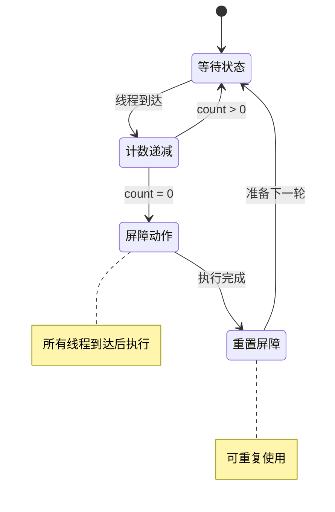
```mermaid
stateDiagram-v2
    [*] --> 等待状态
    等待状态 --> 计数递减 : 线程到达
    计数递减 --> 等待状态 : count > 0
    计数递减 --> 屏障动作 : count = 0
    屏障动作 --> 重置屏障 : 执行完成
    重置屏障 --> 等待状态 : 准备下一轮
    
    note right of 屏障动作 : 所有线程到达后执行
    note right of 重置屏障 : 可重复使用
```

**CyclicBarrier 的两个精妙设计**：

**设计 1：屏障动作（Barrier Action）**
```java
CyclicBarrier barrier = new CyclicBarrier(4, () -> {
    System.out.println("4 个线程都到了，由最后一个到达者执行此回调");
});
```
这个回调由**最后到达**的线程执行，非常适合做"阶段汇总"——比如把 4 个线程各自的部分结果合并。

**设计 2：可循环（Cyclic）**

CyclicBarrier 内部有个 "代（generation）" 概念。每次屏障打开后自动开启新一代，计数自动重置为初始值。这就是它名字里 "Cyclic" 的由来。

**屏障的进阶版：Phaser**

CyclicBarrier 的局限是"参与者数量固定"。如果有的线程中途要退出、有的要新加入怎么办？答案是 Phaser：

```
Phaser phaser = new Phaser(initialParties);
phaser.register();              // 新参与者加入
phaser.arriveAndDeregister();   // 退出当前阶段并取消注册
phaser.arriveAndAwaitAdvance(); // 类似 CyclicBarrier.await()
```

**适用关系**：CountDownLatch ⊂ CyclicBarrier ⊂ Phaser，越往后越通用，但 API 也越复杂。**实战经验：能用简单的就别用复杂的——绝大多数场景 CountDownLatch 已足够**。

### 4.4 条件同步思想

条件同步解决的是"一个线程需要等某个条件为真才能继续"的问题。它与计数/屏障同步的区别是：条件是一个谓词表达式（queue.notEmpty、buffer.notFull、任务状态 = DONE），不是一个计数器。

```
主动轮询 vs 被动售唤

  主动轮询（坏设计）：                被动售唤（条件同步）：
  while (!cond) {                       lock.lock();
    Thread.sleep(10);                   try {
  }                                       while (!cond) cond.await();
  doWork();                               doWork();
  ↑ 耗 CPU、有延迟、不体面         } finally { lock.unlock(); }
```

> 设计思想 1：锁 + Condition　为什么是一体的

判断"条件是否成立"本身必须在锁保护下进行，否则会出现"条件刚看到是假就被人改成了真"的象鼻问题。条件变量 `Condition` 总是与一把锁绑定：

```java
ReentrantLock lock = new ReentrantLock();
Condition notEmpty = lock.newCondition();
Condition notFull  = lock.newCondition();

lock.lock();
try {
    while (queue.isEmpty()) {       // "醒来之后重检查"是必须的
        notEmpty.await();           // 原子动作：释锁 + 睡眠 + 醒后重拿锁
    }
    var item = queue.poll();
    notFull.signal();
} finally { lock.unlock(); }
```

关键在于 `await()` 是个**原子三联动**：释锁 → 进入等待 → 被唤醒后重拿锁。这中间不能被切开，否则可能错过信号。

> 设计思想 2：虚假唤醒（spurious wakeup）

什么必须是 `while`，不能是 `if`？因为操作系统不保证**唤醒一定对应信号**——这个现象叫虚假唤醒。出于性能原因（如便于实现上一次性唤醒多个线程、避免锁加几层以限制唤醒范围），POSIX/Java/C++ 都明确允许虚假唤醒。因此唤后必须重核对条件。

> 设计思想 3：signal vs broadcast

```
signal(notify)    —— 随机售唤一个   —— 适用于单生产-单消费者、资源可调起一个
signalAll(notify) —— 售唤全部         —— 适用于一次事件需要多个线程重检查
```

危险：signal 只唤一个但被唤中那个线程发现条件不适合自己（多生产者、多消费者、不同调件），重新睡眠后不会再有人唤醒其他人，导致丢唤醒。安全默认是 `broadcast`，只有在明确知道只需唤一个时才用 `signal` 优化。

### 4.5 事件同步思想

事件同步是一种"事后可取"的同步与数据传递一体化机制。与条件同步不同，事件同步不仅仅传递"发生了"这个信息，还传递"发生后的结果値"。

```
"Future / Promise" 抽象模型：

  生产者                       消费者
  ┌─────────────┐            ┌─────────────┐
  │ promise.set(v) │──→传递──→ │ future.get()  │ → 拿到 v
  └─────────────┘            └─────────────┘
   同时传递：事件 + 值     接收者可以在其他任何时间取走
```

> 设计思想 1：以"计算"为一等公民

Future/Promise 把一个未完成的计算变成了可以存储、传递、组合的对象。这是异步编程走出"回调地狱"的关键：

```
回调地狱：                              未来调用链：
  fetchA(a -> {                          fetchA()
    fetchB(a, b -> {                       .thenCompose(this::fetchB)
      fetchC(a, b, c -> {                  .thenCompose(this::fetchC)
        ...                                 .thenAccept(this::save)
      });
    });
  });
```

> 设计思想 2：从售唤到推送

传统同步是"拉"（谁需要谁去等），事件同步是"推"（事件发生者主动告知订阅者）。推模型在消息总线、响应式编程、UI 事件中占主导。

> 设计思想 3：一次性事件 vs 持续性事件

| 类型 | 典型实现 | 语义 |
|------|---------|------|
| 一次性事件 | `CompletableFuture`、`std::future`、JS `Promise` | 只能被设置一次，多次订阅都能拿到结果 |
| 持续性事件 | RxJava `Observable`、Kotlin `Flow`、消息主题 | 可被多次发出，订阅者继续接收 |

二者设计上互为补充——一次性事件适合"调一次远程调用"，持续性事件适合"订阅价格变动"。

> 设计思想 4：可组合性（compositionality）

CompletableFuture/Promise 的设计亮点在于它是一个单子（monad），可以用 `thenCompose`、`thenCombine`、`anyOf`、`allOf` 等运算叠加：

```java
CompletableFuture<User> u  = userService.fetchAsync(id);
CompletableFuture<Order> o = orderService.fetchAsync(id);
u.thenCombine(o, this::buildView)            // 并行后汇合
 .orTimeout(2, SECONDS)                       // 带超时
 .exceptionally(this::fallbackView);         // 错误皆底
```

这些运算都是**非阻塞的**，本身不需要临时线程，是实现大规模异步编程不可或缺的拼插能力。

## 05.互斥设计思想

互斥设计 - 解决"谁独占"。互斥确保对共享资源的独占访问，防止数据竞争和不一致状态。

### 5.1 互斥机制架构

**互斥要解决的根本问题：怎么保证"同时只有一人"在临界区？**

看似简单，但实现机制有非常多种——它们的差异在哪？用一个分类轴来看清：

```
                  互斥实现的两种本质思路
                          │
        ┌─────────────────┴─────────────────┐
        ↓                                    ↓
   悲观（Pessimistic）                  乐观（Optimistic）
   "先占住，再做事"                       "先做事，冲突再说"
        │                                    │
   ┌────┴────┐                          ┌────┴────┐
   ↓         ↓                           ↓         ↓
  锁机制    信号量                       CAS      事务内存
（独占）  （限量）                    （原子CAS）  （TM）
```

**这三大类（锁机制 / 原子操作 / 无锁编程）正好对应了互斥设计的三层抽象**：

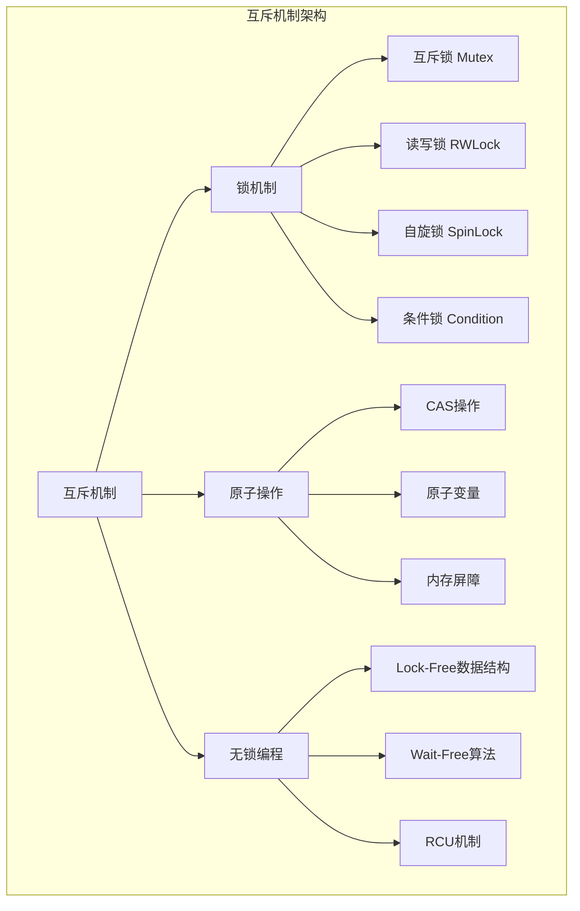
```mermaid
graph TB
    subgraph "互斥机制架构"
        A[互斥机制] --> B[锁机制]
        A --> C[原子操作]
        A --> D[无锁编程]
        
        B --> B1[互斥锁 Mutex]
        B --> B2[读写锁 RWLock]
        B --> B3[自旋锁 SpinLock]
        B --> B4[条件锁 Condition]
        
        C --> C1[CAS操作]
        C --> C2[原子变量]
        C --> C3[内存屏障]
        
        D --> D1[Lock-Free数据结构]
        D --> D2[Wait-Free算法]
        D --> D3[RCU机制]
    end
```

**三层抽象的取舍光谱**：

| 维度 | 锁机制 | 原子操作 | 无锁编程 |
|------|--------|---------|---------|
| 抽象级别 | 高（保护代码块） | 中（保护单变量） | 低（手写算法） |
| 性能 | 中（争抢时进内核） | 高（CAS 单指令） | 极高（理想下） |
| 写起来难度 | 简单 | 中等 | 极难（需懂内存序）|
| 出错代价 | 死锁、卡顿 | 一般正确 | 数据结构损坏 |
| 适用场景 | 90% 业务代码 | 计数、标志位 | 高性能基础组件 |

**层间关系**：上层用下层实现——锁内部用 CAS（自旋阶段），CAS 内部用硬件指令（LOCK CMPXCHG）。所以三层不是"竞争"关系，而是"复用 + 取舍"关系。

### 5.2 锁机制设计

锁是互斥领域最古老、最通用、也是最多样的工具，不同锁针对不同场景作了不同取舍。

**先看一个根本问题：为什么会有这么多种锁？**

答案是**没有一把锁能同时满足所有要求**——每种锁都在 "获取代价 / 等待方式 / 公平性 / 嵌套支持 / 中断响应" 这些维度上做了不同取舍：

```
场景 A：抢锁极频繁、临界区极短（自增计数器）
  → 需要：自旋锁（不要进内核，几纳秒搞定）

场景 B：抢锁不频繁、临界区较长（写文件）
  → 需要：互斥锁（让出 CPU，进内核等待）

场景 C：读多写少（配置缓存）
  → 需要：读写锁（多读者并发，写者独占）

场景 D：递归调用同一段加锁代码
  → 需要：可重入锁（同线程重入不死锁）

场景 E：抢锁失败要能取消
  → 需要：可中断锁、tryLock(timeout)
```

锁的层次结构

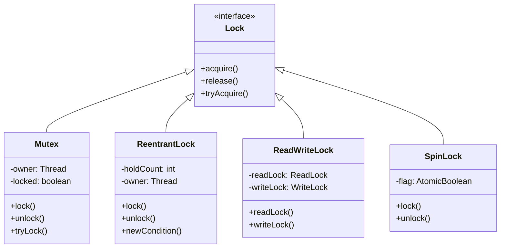
```mermaid
classDiagram
    class Lock {
        <<interface>>
        +acquire()
        +release()
        +tryAcquire()
    }
    
    class Mutex {
        -owner: Thread
        -locked: boolean
        +lock()
        +unlock()
        +tryLock()
    }
    
    class ReentrantLock {
        -holdCount: int
        -owner: Thread
        +lock()
        +unlock()
        +newCondition()
    }
    
    class ReadWriteLock {
        -readLock: ReadLock
        -writeLock: WriteLock
        +readLock()
        +writeLock()
    }
    
    class SpinLock {
        -flag: AtomicBoolean
        +lock()
        +unlock()
    }
    
    Lock <|-- Mutex
    Lock <|-- ReentrantLock
    Lock <|-- ReadWriteLock
    Lock <|-- SpinLock
```

互斥实现详解，读写锁模式

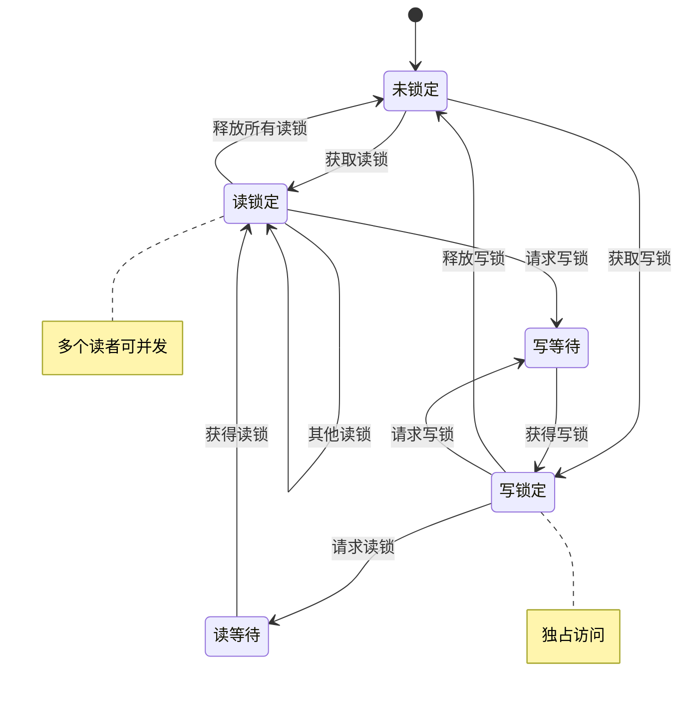
```mermaid
stateDiagram-v2
    [*] --> 未锁定
    未锁定 --> 读锁定 : 获取读锁
    未锁定 --> 写锁定 : 获取写锁
    
    读锁定 --> 读锁定 : 其他读锁
    读锁定 --> 未锁定 : 释放所有读锁
    读锁定 --> 写等待 : 请求写锁
    
    写锁定 --> 未锁定 : 释放写锁
    写锁定 --> 读等待 : 请求读锁
    写锁定 --> 写等待 : 请求写锁
    
    写等待 --> 写锁定 : 获得写锁
    读等待 --> 读锁定 : 获得读锁
    
    note right of 读锁定 : 多个读者可并发
    note right of 写锁定 : 独占访问
```

> 设计思想 1：锁的分类轴

不同锁是多个独立轴上的选择。一个锁在每一个轴上都有一个坐标：

| 轴 | 两端选项 | 代表实现 |
|------|---------|----------|
| 能否嵌套 | 不可重入 ↔ 可重入 | `pthread_mutex_t (default)` ↔ `ReentrantLock` |
| 谁优先 | 非公平 ↔ 公平 | `synchronized` ↔ `new ReentrantLock(true)` |
| 粒度 | 独占 ↔ 分享 | `Mutex` ↔ `RWMutex` |
| 等待方式 | 阻塞 ↔ 自旋 | `Mutex` ↔ `Spinlock` |
| 调度层次 | 用户态 ↔ 内核态 | `Atomic spin` ↔ `Futex` |
| 可中断 | 不可中断 ↔ 可中断 | `synchronized` ↔ `lockInterruptibly` |
| 超时 | 不支持 ↔ 支持 | `synchronized` ↔ `tryLock(timeout)` |

> 设计思想 2：重量锁的两阶段设计

现代锁几乎全部是两阶段设计——**快路径走用户态 CAS，慢路径才陷入内核**。

```
抢锁:
  阶段 1: CAS(state, 0, 1)
           → 成功 → 拿到锁，未进内核
           → 失败 → 进入阶段 2
  阶段 2: futex_wait(state, expected=1)
           → 陷入内核，被加入等待队列

释锁:
  state = 0
  if (有人在等) futex_wake(state, 1)
```

这个模型让 Java/Linux 上的 mutex 在无争抢场景下快到几十纳秒，同时争抢时能优雅地 park。

> 设计思想 3：锁的错误设计陈列

```
反面子 1：锁住 IO 操作
  synchronized(lock) {
    response = httpClient.get(url);   // 锁持有 ≥5s，系统仕堆
  }

反面子 2：锁顺序不一致
  thread A： lock(L1); lock(L2); ...
  thread B： lock(L2); lock(L1); ...   → 环形等待→死锁

反面子 3：以 String 调件作锁
  synchronized("foo") { ... }   → 与 JVM 字符串拘留冲突，全局危险

反面子 4：锁本身变了
  this.lock = new ReentrantLock();   → 中途重赋值，上下文锁不一致
```

锁本质上是一个"约定"，需要所有参与者遵守。一旦出现"外人"（没拿锁的代码访问了受保护资源）或约定被破坏（锁对象变更、锁顺序不一致），安全保证全部崩塌。

### 5.3 原子变量设计

原子变量是语言提供的"锁的逆向使用"——你不是锁住一段代码去修改变量，而是让变量本身拥有原子语义。

```
常规锁保护 vs 原子变量

  synchronized(lock) {                  AtomicInteger n;
      counter++;                        n.incrementAndGet();
  }                                     ↑ 一条 CPU 原子指令
  ↑ 抢锁、释锁、隔离全都要
```

> 设计思想 1：从"代码区间"压缩到"单一点"

原子语义只能覆盖单个变量。一旦业务逻辑需要**两个及以上变量的一致性**，原子变量就不够用了：

```java
// 错误示范：两个原子变量不能组合成原子
AtomicReference<String> name = ...;
AtomicInteger age = ...;
name.set("alice");
age.set(20);          // 中间可能被读到 ("alice", 0)

// 正确示范：把多个字段包装为一个对象，仅原子变量一个变量
record User(String name, int age) {}
AtomicReference<User> user = ...;
user.set(new User("alice", 20));   // 一次发布两个字段
```

> 设计思想 2：原子变量家族谱

| 名称 | 用途 | 特点 |
|------|------|------|
| `AtomicInteger/Long` | 单变量计数 | 原子性，高争抢下会重试 |
| `LongAdder/LongAccumulator` | 高并发计数 | 分段 cell，吞吐高 5–10 倍，读取需求和 |
| `AtomicReference<T>` | 原子引用 | 可以 CAS 任意对象引用 |
| `AtomicStampedReference<T>` | 引用+版本号 | 解决 ABA 问题 |
| `AtomicMarkableReference<T>` | 引用+标记位 | 动态删除标记，无锁链表场景 |
| `Atomic*FieldUpdater` | 字段原子 | 对现有字段做原子访问，避免包装费用 |

### 5.4 无锁编程设计

无锁是并发设计的"隐形足迹"——你看不到锁，但能看到 CAS、重试、状态机。它不是"不需要同步"，而是"用 CAS 指令代替传统锁"。

```
锁世界                          无锁世界
  "上锁 → 修改 → 释锁"         "拍照 → 计算 → CAS 提交 → 失败重试"
  "抢不到就睡"                  "别人抢了就重来"
```

> 设计思想 1：乐观并发控制

锁是悲观的："抢不到就别动"；CAS 是乐观的："先动手，冲突了再重来"。低竞争下乐观路径几乎是免费的；高竞争下反过来会造成 CAS 风暴，必须分段化。

> 设计思想 2：代表性无锁模式

```
模式 1：CAS 重试循环
  loop:
    snap = read()
    new  = compute(snap)
    if (CAS(addr, snap, new)) break
  → 高争抢时重试多，需退避算法

模式 2：Treiber Stack（无锁栈）
  push(v):
    new = Node(v)
    loop:
      old = top
      new.next = old
      if (CAS(top, old, new)) break
  → 表现优异，但 ABA 问题需加 stamp

模式 3：Michael-Scott Queue（无锁队列）
  → 多项 CAS 并存"帮忙推进"逻辑
  → jdk.util.concurrent.ConcurrentLinkedQueue 的理论模型
```

> 设计思想 3：无锁与内存回收

在有 GC 的语言（Java）中全部是手之拉来的事。在 C++/Rust 里要特别小心：你怎么知道某个节点可以被 free 了？

主流解决方案：

- **Hazard Pointer**：每个线程公布"我正在用这个指针"，其他线程 free 前要检查
- **Epoch-Based Reclamation**：Rust crossbeam 采用的 grace-period 机制
- **RCU（Read-Copy-Update）**：Linux 内核法宝，写者在所有读者退出后才释放

> 设计思想 4："不要自己造轮子"

无锁算法的正确性依赖微妙的 happens-before 约束、内存序、ABA 防御。工业界的思路是：个人不要写无锁算法，直接用 `java.util.concurrent`、Folly、Boost.Lockfree、Crossbeam 提供的现成结构。"你会写快排序"不代表"你能写出正确的无锁队列"。

## 06.跨语言对比

并发原语的设计选择，直接体现了语言的哲学。把不同语言放在同一坐标系下看，能看清它们各自在"安全/性能/抽象"光谱上的位置。

### 6.1 语言特性对比表

| 特性 | Java | C++ | Objective-C |
|------|------|-----|-------------|
| **分工机制** | | | |
| 线程池 | ExecutorService | std::thread + 自实现 | NSOperationQueue |
| Fork/Join | ForkJoinPool | std::async | GCD dispatch_apply |
| 任务调度 | ScheduledExecutorService | std::chrono + timer | NSTimer + GCD |
| **同步机制** | | | |
| 计数同步 | CountDownLatch | std::latch (C++20) | dispatch_semaphore |
| 屏障同步 | CyclicBarrier | std::barrier (C++20) | dispatch_group |
| 条件同步 | Condition | std::condition_variable | NSCondition |
| 异步编排 | CompletableFuture | std::future | NSOperation依赖 |
| **互斥机制** | | | |
| 基础锁 | synchronized | std::mutex | @synchronized |
| 读写锁 | ReadWriteLock | std::shared_mutex | pthread_rwlock |
| 原子操作 | AtomicInteger | std::atomic | OSAtomic函数 |
| 自旋锁 | 自实现 | std::atomic_flag | OSSpinLock |

### 6.2 性能特性对比

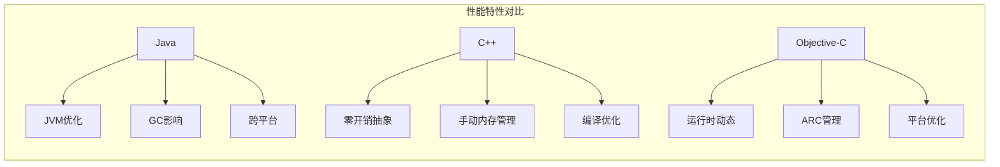
```mermaid
graph LR
    subgraph "性能特性对比"
        A[Java] --> A1[JVM优化]
        A --> A2[GC影响]
        A --> A3[跨平台]
        
        B[C++] --> B1[零开销抽象]
        B --> B2[手动内存管理]
        B --> B3[编译优化]
        
        C[Objective-C] --> C1[运行时动态]
        C --> C2[ARC管理]
        C --> C3[平台优化]
    end
```

**进一步追问：为什么这些语言会有不同的性能特性？根因藏在它们的设计取舍里**：

```
Java: 「带护栏的高速公路」
  → 字节码 + JIT 让锁有运行时优化（偏向锁、轻量锁、自适应自旋）
  → GC 让无锁数据结构更易写（不用管 ABA 的内存回收）
  → 代价：锁本身比 C++ 重，GC 暂停影响低延迟场景

C++: 「赤手空拳的赛车」
  → std::atomic + memory_order 让你直接操作硬件
  → 零运行时开销，每条指令都是你写的
  → 代价：内存序写错就是 race，崩溃在生产

Objective-C: 「带 GCD 的智能助手」
  → 苹果推 "Don't lock, dispatch"——用串行队列代替锁
  → ARC 自动管理引用计数（含原子 retain/release）
  → 代价：GCD 的隐性开销不易察觉，atomic 属性常被误用
```

**实测量化对比**（以"100 线程对单计数器加 1 亿次"为基准）：

| 语言 / 实现 | 耗时（秒） | 说明 |
|-----------|-----------|------|
| Java synchronized | ~78 | 锁升级到重量级 |
| Java AtomicLong | ~18 | CAS 风暴（缓存行弹跳）|
| Java LongAdder | ~2 | 分段计数器 |
| C++ std::mutex | ~25 | pthread_mutex |
| C++ std::atomic seq_cst | ~20 | LOCK XADD |
| C++ std::atomic relaxed | ~12 | 无屏障原子加 |
| Go sync/atomic | ~14 | runtime 优化 |
| Rust AtomicU64 (Relaxed) | ~12 | 与 C++ 接近 |

**关键观察**：

1. **同一个语义（计数器自增），不同实现性能差 40 倍**——选对工具远比"换语言"更重要
2. **C++/Rust 在低层更快，但 Java LongAdder 这类"分段"思路的优化反而比裸 atomic 更快**
3. **GC 语言在锁优化上有天然优势**——JIT 可以根据运行时统计动态选锁档位

## 07.并发编程架构模式

### 7.1 Actor模型

**从一个反例开始探索**：你要写一个聊天室服务器，1000 个用户同时在线。传统思路：所有用户信息放 `ConcurrentHashMap`，每次尝试加锁读写。很快你会发现：

```
问题 1：谁发送消息就是谁加锁 → 代码里到处是 synchronized
问题 2：多用户交互（拉一个人进群）需要多锁 → 锁顺序问题、死锁风险
问题 3：某个线程崩溃 → 可能遗留不一致状态、影响其他用户
```

**Actor 模型提供了一个别的思路：不要共享数据，把每个用户看作一个独立的"人"**——他们有自己的状态，只能通过收到消息才能被外界影响。

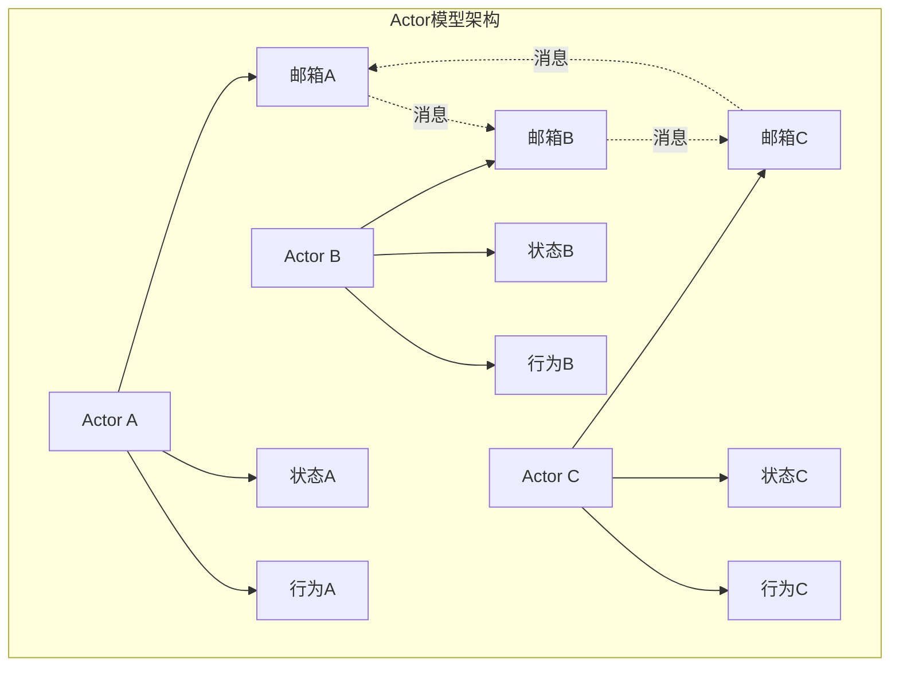
```mermaid
graph TB
    subgraph "Actor模型架构"
        A[Actor A] --> MA[邮箱A]
        B[Actor B] --> MB[邮箱B]
        C[Actor C] --> MC[邮箱C]
        
        MA -.->|消息| MB
        MB -.->|消息| MC
        MC -.->|消息| MA
        
        A --> SA[状态A]
        B --> SB[状态B]
        C --> SC[状态C]
        
        A --> BA[行为A]
        B --> BB[行为B]
        C --> BC[行为C]
    end
```

**Actor 三大设计不变量**：

| 不变量 | 含义 | 后果 |
|--------|------|------|
| 状态私有 | 任何字段只能被本 Actor 访问 | 不需要锁 |
| 消息异步 | 发送不阻塞，插入对方邮箱后返回 | 发送者不被外界拖累 |
| 串行处理 | 同一 Actor 同时只处理一条消息 | 内部代码不必考虑并发 |

**跨语言 Actor 实现**：

```
Erlang/Elixir: 语言本身就是 Actor——进程是一等公民，完全隔离
               可轻松跑 100 万个进程，WhatsApp 在单机上跑过二百万连接
Akka(JVM):     类库形式实现，Actor 映射到 Java 线程池
Go:            不叫 Actor，叫 goroutine + channel，本质相同
Swift Actor:   Swift 5.5 引入 actor 关键字，编译期检查隔离性
```

**Actor 代价**：消息传递本身有开销（序列化/拷贝/队列）。在低跨线程场景性能不如直接共享内存 + 锁。选不选 Actor 本质是问你：愿不愿意用一点性能换架构上的简单。

### 7.2 生产者-消费者模式

**为什么这是并发世界里最万能的架构模式？**从一个思想实验开始：

```
场景：消息处理系统，发送者连接不稳定、处理者耗时不一

同步处理的问题：
  发送者 → 处理者（必须同步等处理完）
  问题 1：发送快、处理慢 → 发送被拖累
  问题 2：发送慢、处理快 → 处理者 CPU 空转
  问题 3：处理者挂了 → 发送者雪崩

生产者-消费者的解决：中间加一个缓冲区
  发送者 → [缓冲区] → 处理者
  三个问题同时解决：
    〇 速差平滑化（缓冲区吃掉瞬时差距）
    〇 解耦生命周期（任一方崩溃不影响另一方）
    〇 双方能各自优化（发送者批量入、处理者多线程出）
```

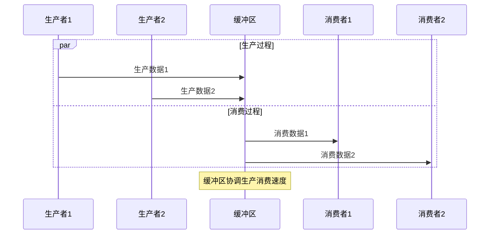
```mermaid
sequenceDiagram
    participant P1 as 生产者1
    participant P2 as 生产者2
    participant Buffer as 缓冲区
    participant C1 as 消费者1
    participant C2 as 消费者2
    
    par 生产过程
        P1->>Buffer: 生产数据1
        P2->>Buffer: 生产数据2
    and 消费过程
        Buffer->>C1: 消费数据1
        Buffer->>C2: 消费数据2
    end
    
    Note over Buffer: 缓冲区协调生产消费速度
```

**关键设计决策：缓冲区怎么选？**

| 选择 | 特点 | 适用场景 |
|------|------|---------|
| 有界阻塞队列（ArrayBlockingQueue） | 满了生产者阻塞 | 同机、有内存限制 |
| 无界队列（LinkedBlockingQueue）| 不限，不控制则 OOM | 生产速率可控 |
| Disruptor 环形数组 | 预分配、无锁、缓存友好 | 高频交易、记忆住路径 |
| 消息中间件（Kafka/RocketMQ） | 跨机、可靠存储 | 跨服务、持久化需求 |
| Channel（Go/Kotlin） | 语言内置、类型安全 | 协程世界的默认选项 |

**废例反思一下**：为什么不能在所有地方都加生产者-消费者？因为它引入了**缓冲区本身的并发问题**——多生产者互斥入、多消费者互斥出。看似转移了问题，实际只是集中了问题——但集中后可以集中优化（Disruptor 就是这样诞生的，为了把这个唯一的热点优化到极致）。

### 7.3 Master-Worker模式

**从 Actor 和生产者-消费者看过来，Master-Worker 有什么不同？**

关键区别在"谁控制谁"：

```
Actor：       点对点消息，没有"中心"
生产-消费：    双方平等，通过缓冲区解耦
Master-Worker： Master 是调度中心，代理主动下发任务、收集结果
              "谁肯听谁"这个问题预先决定
```

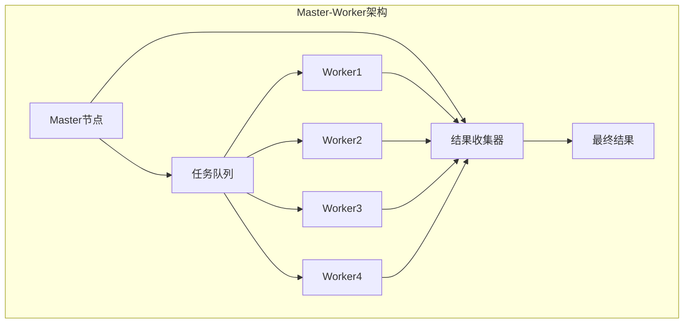
```mermaid
graph TD
    subgraph "Master-Worker架构"
        Master[Master节点] --> TaskQueue[任务队列]
        Master --> ResultCollector[结果收集器]
        
        TaskQueue --> W1[Worker1]
        TaskQueue --> W2[Worker2]
        TaskQueue --> W3[Worker3]
        TaskQueue --> W4[Worker4]
        
        W1 --> ResultCollector
        W2 --> ResultCollector
        W3 --> ResultCollector
        W4 --> ResultCollector
        
        ResultCollector --> FinalResult[最终结果]
    end
```

**Master-Worker 在现实世界的三个化身**：

```
1. ForkJoinPool (库)
   Master = main thread (启动 fork)
   Worker = work-stealing pool 里的线程
   任务队列 = 每个 worker 本地双端队列 + 全局队列

2. MapReduce (分布式计算)
   Master = JobTracker (Hadoop) / Driver (Spark)
   Worker = TaskTracker / Executor
   任务队列 = HDFS 上的数据分片

3. Kubernetes (容器编排)
   Master = control-plane (kube-scheduler)
   Worker = kubelet 所在节点
   任务队列 = Pod 调度队列
```

**这个模式的三大隐藏难题**：

| 难题 | 体现 | 解决思路 |
|------|------|---------|
| Master 是单点 | Master 挂了所有 worker 闲置 | Master 高可用（主从/选举） |
| Worker 负载不均 | 有的 worker 一直闲置、有的压倒 | 工作窃取（work stealing） |
| 任务依赖复杂 | A 要等 B C D 全部完成 | DAG 调度（Spark/Airflow）|

**列 Fork/Join 与 Master-Worker 的区别**：后者是一个架构模式（跨进程/跨机器），前者是后者在单进程内的"递归版"——任务本身可继续拆为子任务。本质思路一致。

## 08.优化与最佳实践

### 8.1 性能优化策略

**并发优化为什么这么难？**因为它遇到了一个反直觉的事实：

```
你期望的： 8 个线程跑得比 1 个快 8 倍
现实是：   8 个线程跑得比 1 个快 1.3 倍、甚至更慢

原因是 Amdahl 定律：
  Speedup = 1 / (S + (1-S)/N)
  S = 串行部分比例，N = 线程数
如果 S = 20%（锁、IO、同步点），N = ∞，Speedup 不超过 5
```

**这意味着：不是“多加线程”，而是“减少串行部分”才是优化的本质**。四大优化方向都是从这个指导思想开始的：

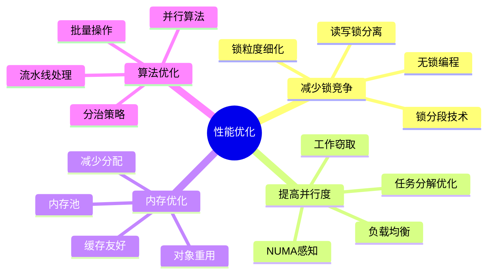
```mermaid
mindmap
  root((性能优化))
    减少锁竞争
      锁粒度细化
      读写锁分离
      锁分段技术
      无锁编程
    提高并行度
      任务分解优化
      负载均衡
      工作窃取
      NUMA感知
    内存优化
      缓存友好
      内存池
      对象重用
      减少分配
    算法优化
      并行算法
      分治策略
      流水线处理
      批量操作
```

**四个方向的本质**：

| 方向 | 重点优化 | 實例 |
|------|----------|------|
| 减少锁竞争 | 拆分串行部分 | 分段锁、ConcurrentHashMap |
| 提高并行度 | 让不串行的部分能并行起来 | Fork/Join、工作窃取 |
| 内存优化 | 减少跨核的缓存争夺 | 消除假共享、Per-CPU 变量 |
| 算法优化 | 从问题本质减少同步点 | 不可变、无锁队列 |

**一个反例提醒**：加锁粒度变细不一定提升性能，可能反而变慢。原因是锁本身也是对象，锁越多占用越多内存、越多缓存行、越多根间同步。`ConcurrentHashMap` 从 JDK 7 的 16 个 Segment 到 JDK 8 的桶锁，并不是初别看起来那么“粒度越细越好”的简单演进，而是在粒度细度与锁本身开销之间找了个新均衡点。

### 8.2 分工最佳实践

分工的“坐实”不在“拆”，而在“选对工具”。实践中有三个主要考量点：

```
1. 任务独立吗？         否 → 别并行，并行了也是串行
2. 任务足够大吗？         否 → 调度开销 > 计算开销
3. 任务会阻塞吗？         是 → 选 IO 密集型优化
```

```java
// ⚠️ 错误：每次创建新线程
// new Thread(() -> task.run()).start();
// 原因：创建线程本身要几百万个周期，还会耗尽内存

// ✅ 推荐：使用合适的线程池
ExecutorService executor = Executors.newWorkStealingPool();
// 这是 Java 8 的默认选择，底层是 ForkJoinPool
// 带工作窃取，负载不均时能自动平衡

// ✅ 推荐：任务大小适中
// 理论上最佳任务粒度：让调度开销 < 5% 计算开销
// 实践上：若个任务 < 100 微秒，考虑合并多个任务
int optimalTaskSize = availableProcessors() * 2;

// ✅ 推荐：使用CompletableFuture进行异步编排
CompletableFuture.supplyAsync(() -> fetchData())     // IO 密集，独立线程池
    .thenApply(data -> processData(data))            // CPU 密集可继续在同一线程
    .thenAccept(result -> saveResult(result));       // IO 密集，可能交给别的线程池
```

**不同负载选不同池**：

| 负载类型 | 推荐池 | 理由 |
|---------|--------|------|
| CPU 密集 | `newFixedThreadPool(N 核)` | 超过核数不增加吞吐 |
| IO 密集 | `newCachedThreadPool` 或 N×2 | IO 等待时可以多跑 |
| 定时调度 | `newScheduledThreadPool` | 主为周期任务设计 |
| 分治递归 | `ForkJoinPool` | 工作窃取适合递归分拆 |
| 超高并发连接 | 虚拟线程（JDK 21+）| 百万级轻量线程 |

### 8.3 同步最佳实践

```java
// ✅ 推荐：使用CountDownLatch等待多个任务
CountDownLatch latch = new CountDownLatch(taskCount);

// ✅ 推荐：使用CyclicBarrier进行阶段同步
CyclicBarrier barrier = new CyclicBarrier(threadCount, () -> {
    System.out.println("所有线程完成当前阶段");
});

// ❌ 避免：使用Thread.sleep进行同步
// Thread.sleep(1000); // 不可靠的同步方式
```

### 8.4 互斥最佳实践

```java
// ✅ 推荐：使用读写锁提高并发度
ReadWriteLock rwLock = new ReentrantReadWriteLock();

// ✅ 推荐：使用原子类避免锁
AtomicInteger counter = new AtomicInteger(0);

// ✅ 推荐：最小化锁的范围
synchronized(lockObject) {
    // 只包含必要的临界区代码
    criticalSection();
}

// ❌ 避免：过大的同步块
// synchronized(this) {
//     longRunningOperation(); // 锁持有时间过长
// }
```

### 8.3 性能监控与调优

```mermaid
graph TB
    subgraph "性能监控体系"
        A[性能监控] --> B[线程状态监控]
        A --> C[锁竞争分析]
        A --> D[内存使用监控]
        A --> E[CPU利用率监控]
        
        B --> B1[线程转储分析]
        B --> B2[死锁检测]
        B --> B3[线程池状态]
        
        C --> C1[锁等待时间]
        C --> C2[锁持有时间]
        C --> C3[竞争热点]
        
        D --> D1[堆内存使用]
        D --> D2[GC影响]
        D --> D3[内存泄漏检测]
        
        E --> E1[CPU使用率]
        E --> E2[上下文切换]
        E --> E3[负载均衡]
    end
```

## 09.阶段性总结

并发编程的核心在于正确理解和应用分工、同步、互斥三大核心思想：

### 9.1 核心要点总结

```mermaid
graph LR
    subgraph "并发编程核心要点"
        A[分工 Division] --> A1[任务分解]
        A --> A2[负载均衡]
        A --> A3[并行执行]
        
        B[同步 Synchronization] --> B1[时序控制]
        B --> B2[状态协调]
        B --> B3[依赖管理]
        
        C[互斥 Mutual Exclusion] --> C1[资源保护]
        C --> C2[数据一致性]
        C --> C3[竞争避免]
        
        A1 --> D[高性能]
        B1 --> E[正确性]
        C1 --> F[安全性]
        
        D --> G[并发系统]
        E --> G
        F --> G
    end
```

### 9.2 设计原则

1. **分工原则**
  - 任务分解要合理，避免过度分解导致开销增大
  - 负载均衡要动态，适应不同的工作负载
  - 并行度要适中，考虑硬件资源限制

2. **同步原则**
  - 同步点要明确，避免不必要的等待
  - 依赖关系要清晰，防止循环依赖
  - 超时机制要完善，避免无限等待

3. **互斥原则**
  - 锁粒度要适当，平衡性能和安全
  - 锁顺序要一致，预防死锁发生
  - 无锁优先，在可能的情况下使用原子操作

### 9.3 技术选型建议

| 场景 | Java推荐 | C++推荐 | Objective-C推荐 |
|------|----------|---------|-----------------|
| CPU密集型任务 | ForkJoinPool | std::async | GCD dispatch_apply |
| I/O密集型任务 | CompletableFuture | std::future | NSOperation |
| 实时系统 | 自定义线程池 | 实时线程 | 高优先级队列 |
| 高并发读写 | ConcurrentHashMap | lock-free结构 | dispatch_concurrent |
| 简单同步 | CountDownLatch | std::latch | dispatch_semaphore |
| 复杂协调 | CyclicBarrier | 自实现 | NSOperation依赖 |

## 10.案例驱动的设计哲学

前面九章把分工、同步、互斥三大支柱讲清楚了。但工程师真正要回答的不是"什么是分工"，而是"**面对一个真实业务场景，我该选哪种分工模式？同步用什么粒度？要不要上锁？**"。这一章用三个真实案例把前面的抽象落地。

### 10.1 案例引入：电商秒杀并发演进

**场景设定**：某电商在 2018 年双 11 上线了一款 9 折手机抢购，10 万人同时点"立即购买"，库存只有 100 台。第一版代码长这样：

```java
class StockService {
    int stock = 100;

    boolean buy(long userId) {
        if (stock > 0) {           // ① 检查
            stock--;                // ② 扣减
            order.create(userId);   // ③ 下单
            return true;
        }
        return false;
    }
}
```

**结果**：实际卖出 287 台，超卖 187 台，赔了 50 万。**这就是 check-then-act 的经典原子性 Bug**——10 万个线程同时通过①的判断，集体扣减②，库存被扣到了 -187。

**第二版：加 synchronized**

```java
synchronized boolean buy(long userId) { ... }
```

**结果**：超卖问题解决了，但 QPS 从 5 万掉到 800，前 100ms 卖完后剩下的 9.99 万人还在排队 30 秒——**互斥粒度过粗，把并发退化成了串行**。

**第三版：CAS + 队列分流**

```java
AtomicInteger stock = new AtomicInteger(100);

boolean buy(long userId) {
    while (true) {
        int cur = stock.get();
        if (cur <= 0) return false;
        if (stock.compareAndSet(cur, cur - 1)) {
            // CAS 成功，发消息异步下单（解耦）
            mq.send(new OrderEvent(userId));
            return true;
        }
    }
}
```

**结果**：QPS 回到 4 万，超卖归零。**这一版同时用上了三大支柱**：

```mermaid
flowchart LR
    A[抢购请求<br/>10w QPS] --> B[分工<br/>线程池接收]
    B --> C[互斥<br/>CAS 扣库存]
    C --> D[同步<br/>MQ 异步下单]
    D --> E[最终结果<br/>0 超卖 + 4w QPS]
    style E fill:#d4edda
```

**小结**（基于三版迭代）：从 V1 到 V3 不是"代码越写越多"，而是**对三大支柱认知逐步深入的过程**——V1 缺互斥，V2 互斥粒度过粗，V3 用 CAS 把互斥粒度压到单变量、用 MQ 把同步从同步阻塞转为异步事件。**这就是并发设计的真功夫**。

### 10.2 案例引入：日志框架无锁演进

**场景设定**：某高频交易系统每秒打 50 万条日志。第一版用 `Logger` 加 `synchronized`，CPU profiling 显示 40% 时间花在锁竞争上。

**Disruptor 的无锁设计登场**——LMAX 团队 2010 年公开的环形数组无锁队列，至今仍是最快的进程内消息传递结构：

```
传统 BlockingQueue 模型：
  生产者 ──→ [锁] ──→ 队列 ──→ [锁] ──→ 消费者
              ↑                  ↑
         争抢同一把锁         读写互斥

Disruptor 环形数组模型：
  生产者 ──→ sequence (CAS 申请)
                ↓
            [Slot0][Slot1]...[SlotN]   ← 环形数组，预分配
                ↑
  消费者 ──→ sequence (volatile 读)
```

**关键设计**：

1. **预分配环形数组**：避免 GC 压力，缓存友好
2. **生产者用 CAS 申请 sequence**：无锁分配槽位
3. **消费者用 volatile 读 sequence**：单生产者-单消费者场景下零竞争
4. **填充缓存行（@Contended）**：避免 false sharing

**性能数据**：从 BlockingQueue 的 5 万 QPS 提升到 Disruptor 的 600 万 QPS，**120 倍**。

**小结**（基于 Disruptor）：当并发热点收敛到"单点的 CAS + 消费者顺序读"时，无锁的吞吐能比传统锁队列高两个数量级。**前提是你能把问题归约到一个变量上**——这才是无锁编程真正的门槛。

### 10.3 案例引入：Go并发哲学颠覆

**场景设定**：用 Java 写一个"等多个 RPC 全部返回再聚合"的代码，需要 `CountDownLatch` + `ExecutorService` + `Future`，30 行起步。同样的场景在 Go 里：

```go
func fetchAll(ids []int) []Result {
    ch := make(chan Result, len(ids))
    for _, id := range ids {
        go func(id int) {                  // 启动 goroutine
            ch <- rpcCall(id)              // 通过 channel 发送结果
        }(id)
    }
    results := make([]Result, 0, len(ids))
    for i := 0; i < len(ids); i++ {
        results = append(results, <-ch)    // 从 channel 接收
    }
    return results
}
```

**12 行**。这背后是 Go 的设计哲学：

> **"Don't communicate by sharing memory; share memory by communicating."**
> 不要通过共享内存来通信，而要通过通信来共享内存。

```mermaid
flowchart TB
    A[Java 模型<br/>共享内存 + 锁] --> A1[ConcurrentHashMap]
    A --> A2[synchronized]
    A --> A3[Future/CompletableFuture]

    B[Go 模型<br/>消息传递 + channel] --> B1[goroutine 私有状态]
    B --> B2[channel 传递所有权]
    B --> B3[select 多路复用]

    A1 -.对应.-> B1
    A2 -.对应.-> B2
    A3 -.对应.-> B3
    style B fill:#d4edda
```

**Go 的核心设计**：

1. **goroutine**：用户态轻量线程，初始栈 2KB，可弹性增长（vs Java 线程默认 1MB 栈）
2. **channel**：类型安全的消息通道，编译期检查通信类型
3. **select**：多 channel 多路复用，类似 epoll 但是 channel 级别
4. **GMP 调度**：M 个 OS 线程多路复用 G 个 goroutine（M 通常 = CPU 核数）

**小结**（基于 Java vs Go 对比）：Go 不是"加了协程的 Java"，而是从根上换了并发心智模型——**把"线程"这个抽象砸碎，用 goroutine 让你随便造，用 channel 让你强制走通信而非共享**。这种范式选择影响所有上层 API 的设计。

## 11.跨语言深度对比与一句话总结

### 11.1 并发原语的三层抽象

把所有语言的并发原语放在同一坐标系上看，会发现它们其实站在不同的抽象层级：

```mermaid
flowchart TB
    A[L3 高级语义层<br/>Actor / async-await / channel] --> B[L2 同步原语层<br/>Lock / Condition / Semaphore]
    B --> C[L1 内存模型层<br/>volatile / atomic / barrier]
    C --> D[L0 硬件层<br/>CAS 指令 / MESI / Store Buffer]

    style A fill:#d4edda
    style D fill:#f8d7da
```

**各语言主战场**：

| 语言 | 默认抽象层 | 进阶层 | 心智模型 |
|------|----------|--------|---------|
| **Java** | L2（synchronized + JUC） | L1（volatile + Atomic） | 共享内存 + 锁 |
| **C++** | L1（std::atomic + memory_order） | L2（std::mutex） | 程序员手控 |
| **Go** | L3（channel + goroutine） | L2（sync.Mutex） | 消息传递 |
| **Rust** | L3（async + 类型系统） | L1（Send/Sync 编译期） | 所有权防呆 |
| **Erlang** | L3（Actor + mailbox） | 无 L1/L2 | 进程隔离不共享 |
| **JavaScript** | L3（Promise + async/await） | L1（Atomics on SAB） | 单线程事件循环 |

**关键洞察**：**抽象层越高，写起来越简单，但翻车时定位越难**。Erlang 的 Actor 看起来无懈可击，但出问题时要 trace 几十个进程的 mailbox；C++ 的 memory_order 写起来痛苦，但 bug 范围被限制在那几行屏障代码内。

### 11.2 三大支柱在五大语言中的落地

| 支柱 | Java | C++ | Go | Rust | Erlang |
|------|------|-----|----|----|--------|
| **分工** | ExecutorService<br/>ForkJoinPool | std::thread<br/>std::async | go func() | tokio::spawn<br/>rayon | spawn() |
| **同步** | CountDownLatch<br/>CompletableFuture | std::future<br/>std::condition_variable | sync.WaitGroup<br/>channel | tokio::sync<br/>oneshot | receive |
| **互斥** | synchronized<br/>ReentrantLock | std::mutex<br/>std::atomic | sync.Mutex<br/>sync.RWMutex | Mutex<T><br/>RwLock<T> | 无（进程隔离） |

### 11.3 设计哲学三支谱系

```mermaid
flowchart LR
    A[并发设计哲学] --> B[信任程序员<br/>C/C++]
    A --> C[信任运行时<br/>Java/Go]
    A --> D[信任编译器<br/>Rust]
    A --> E[消除问题<br/>Erlang]

    B --> B1[给最强工具<br/>容许最大错误]
    C --> C1[给安全工具<br/>运行时拦截]
    D --> D1[给受限工具<br/>编译期拒绝]
    E --> E1[换心智模型<br/>从根本回避]

    style E fill:#d4edda
```

**这四种哲学没有优劣**：

- 写操作系统内核：选 C/C++（你是信任金字塔顶端）
- 写电商后台：选 Java/Go（生态成熟、开发效率高）
- 写浏览器引擎：选 Rust（数据竞争零容忍）
- 写电信交换机：选 Erlang（容错优先于性能）

### 11.4 工程实战的取舍清单

不论用什么语言，并发设计都遵守这些"通用工程纪律"：

```mermaid
mindmap
  root((工程纪律))
    设计阶段
      画 happens-before 图
      明确临界区边界
      标注共享可变状态
      列出所有同步点
    编码阶段
      不可变优先
      无锁优先
      细粒度锁
      避免嵌套锁
    测试阶段
      压力测试
      竞态检测器
      JCStress/TSan
      混沌工程
    生产阶段
      监控锁竞争
      监控线程状态
      限流熔断
      渐进式发布
```

### 11.5 反模式陈列：见到就要警觉

**反模式 1：用 String 做锁**
```java
synchronized("lock_" + userId) { ... }   // 错！String 拘留池冲突
```

**反模式 2：DCL 没加 volatile**
```java
private static Singleton instance;       // 错！缺 volatile，可能拿到半初始化对象
```

**反模式 3：在锁内做 IO**
```java
synchronized (lock) {
    response = httpClient.get(url);      // 错！锁持有 5 秒，整个系统排队
}
```

**反模式 4：并发集合的复合操作**
```java
if (!map.containsKey(k)) map.put(k, v);  // 错！应该用 putIfAbsent
```

**反模式 5：忽视虚假唤醒**
```java
if (!cond) cond.wait();                  // 错！必须用 while
```

### 11.6 跨语言设计思想陷阱速查表

下面这张表汇总了**并发设计思想专题**最容易踩的范式陷阱——同一种"思想错位"在不同语言里有不同表现：

| 陷阱类型 | 语言 | 经典症状 | 正确思想 |
|---|---|---|---|
| **范式选错** | Java | 把"高并发缓存"用 synchronized HashMap → 单点瓶颈 | 改用 ConcurrentHashMap 或分段 |
| **范式选错** | Go | 把所有协作都用 Mutex，channel 闲置 | "Don't communicate by sharing memory; share memory by communicating" |
| **范式选错** | Erlang/Akka | 把状态机硬塞 Actor 内 → 邮箱爆炸 | 业务拆分多个 Actor，每个职责单一 |
| **范式选错** | Rust | 跟 GC 语言一样用 Arc<Mutex> 包裹一切 → 死锁 | 优先用 channel + 所有权移交 |
| **共享与分工混用** | 所有语言 | "线程池里跑的任务又互相共享数据" → 锁竞争 | 分工时就**消除共享**，或改成消息传递 |
| **同步原语滥用** | Java | CountDownLatch 当 Future 用 | 用 CompletableFuture |
| **同步原语滥用** | C++ | promise/future 当 channel 用 | 用专门的并发队列 |
| **同步原语滥用** | Go | WaitGroup 当 errgroup 用 | 用 `errgroup.Group` |
| **互斥粒度错** | Java | 整个方法 synchronized | 缩到真正的临界区，或用 ConcurrentHashMap |
| **互斥粒度错** | C++ | mutex 保护整个对象 | 拆字段锁 / 读写锁 |
| **互斥粒度错** | Go | RWMutex 写多读少 | 普通 Mutex 反而更快 |
| **范式融合错** | Kotlin | runBlocking 嵌套协程 → 死锁 | 用 `withContext` 切换调度器 |
| **范式融合错** | Rust async | tokio + std Mutex 跨 await | 用 `tokio::sync::Mutex` |
| **可演化性差** | 所有语言 | 单机锁逻辑直接搬上分布式 → 失效 | 分布式锁要重新设计（Redlock/Zk） |

> **跨语言共识**：**范式不是 API**——选错范式后即使 API 用对了也救不回来。"用 Java 心智写 Go" / "用 Go 心智写 Rust" 都是事故温床。

### 11.7 七字真言 × 多语言映射

**七字真言**：**`选范式 · 定边界 · 抗演化`**

| 阶段 | Java | C++ | Go | Rust | Erlang/Akka |
|---|---|---|---|---|---|
| **选范式** | 共享内存为主（JMM）+ Loom 虚拟线程 | 共享内存 + STD threads | CSP（channel）为主 + 少量 atomic | 所有权 + 消息传递 + Arc<Mutex> | 纯 Actor，无共享内存 |
| **定边界** | `final` + `private` + 不可变类 | `const` + 私有 mutex 包裹 | channel 边界 = 同步边界 | 编译期 `Send`/`Sync` 检查 | 进程隔离，邮箱即边界 |
| **抗演化** | 接口稳定 + 内部可替换实现 | RAII 包装 + 类型擦除 | 接口很小，channel 易换实现 | trait + 类型系统约束 | 热升级 + 进程监督树 |

**口诀解读**：
- **选范式**——根据延迟/吞吐/容错三角形+团队心智带宽定位
- **定边界**——明确"什么共享、什么不共享、谁能访问谁"，越早越好
- **抗演化**——选能"无痛升级"的方案：单线程→多线程→分布式

**金句**：
- "**没有最好的并发模型，只有匹配你愿意承担多少复杂度的并发模型**"
- "**所有现代语言都在'范式光谱'上找位置**——共享内存（Java/C++）↔ 消息传递（Go/Erlang）↔ 类型保证（Rust）↔ 范式融合（Kotlin/Swift）"

### 11.8 一句话总结

> **并发编程的核心不在"多",而在"协同"**。
> 分工解决"多个执行流如何配合干活"，同步解决"它们何时该等彼此"，互斥解决"谁先动这块共享数据"。
> 所有现代语言的并发设计——无论是 Java 的 JMM、C++ 的 memory_order、Go 的 channel、Rust 的 Send/Sync、还是 Erlang 的 Actor——都是在**程序员表达力**与**硬件性能边界**之间画的一条线，画在哪里取决于你愿意把心智负担交给谁：自己、运行时、编译器，还是干脆换个根本不存在共享状态的世界。

