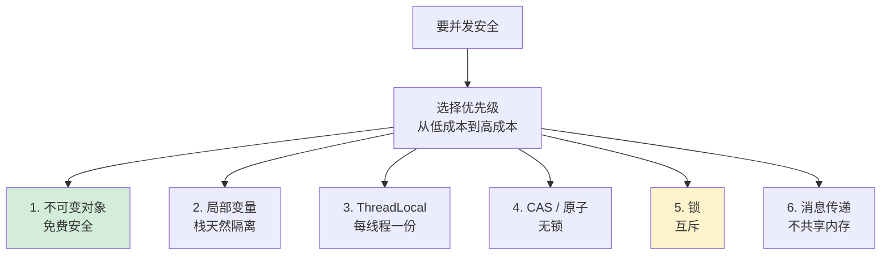
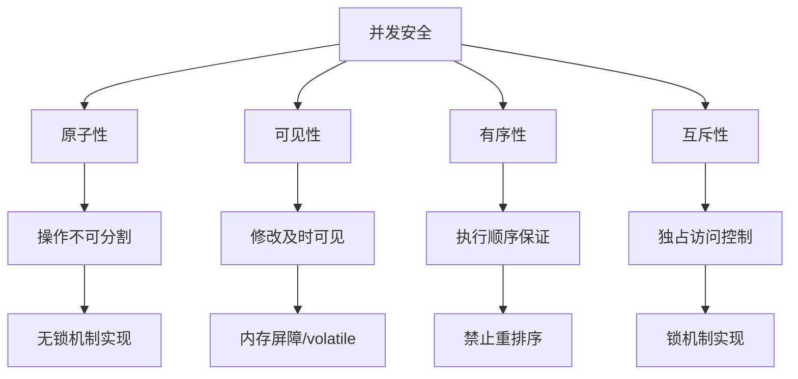
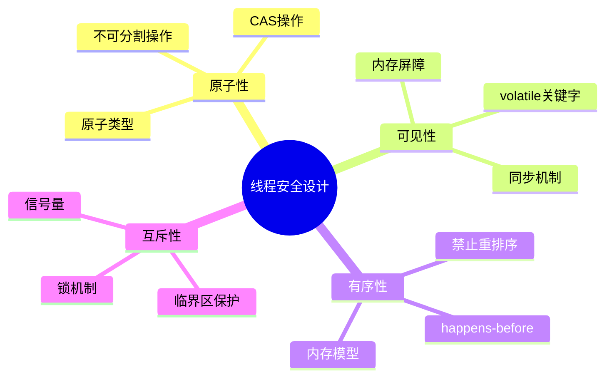
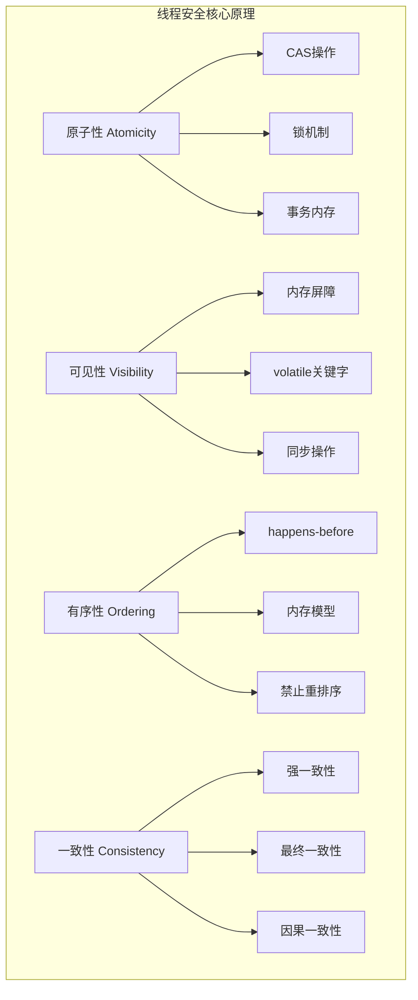
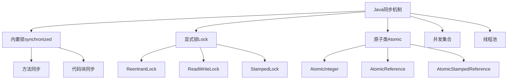
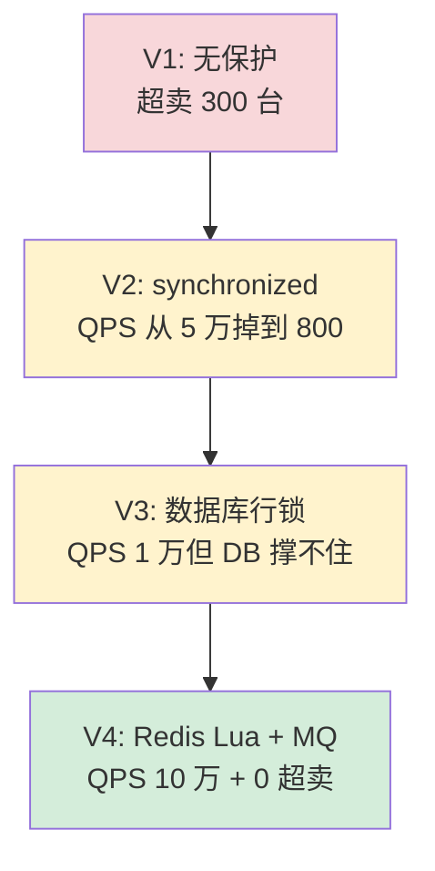
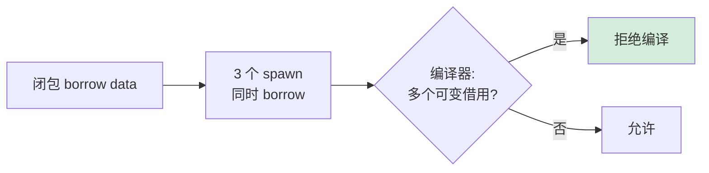
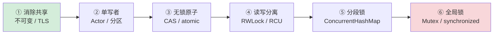

# 17.并发编程安全设计

> 📍 **本篇位置**：第 3 卷 · 并发之道 · 第 7 篇（心法收官）
> 🎯 **核心矛盾**：**性能要锁少 vs 安全要锁多** —— 完美安全的程序往往是单线程的
> 🧭 **设计灵魂**：并发安全有六张牌——**不可变 / 局部变量 / 锁 / CAS / 不共享 / 函数式**；越靠前的代价越小，应优先选择
> 🌐 **跨语言覆盖**：Java(final + ThreadLocal + Concurrent 包) · C++(const + thread_local + atomic) · Rust(所有权 + Send/Sync 编译期消灭) · Erlang/Elixir(不可变 + 进程隔离) · Clojure(STM + persistent data)
> 🔗 **延伸阅读**：← [16.并发Bug源头由来](https://yccoding.com/pages/57fd8a/) · → [18.锁核心设计和思想](https://yccoding.com/pages/db7194/) · → [20.理解CAS设计由来](https://yccoding.com/pages/5100ea/)



---

## 通用必要性：为什么并发安全是"并发界的麦克斯韦方程组"

> 🌐 **语言无关声明**：本篇沉淀适用于 **Java / C / C++ / Go / JS / Python / Rust / Kotlin / Erlang / Clojure** 等多语言开发者阅读。并发安全有一套穿越所有语言的"四原理"——**原子性 / 可见性 / 有序性 / 互斥性**；它们就像并发界的麦克斯韦方程组，**所有语言只是这套方程的不同求解器**。

### 章首通用三问

| # | 通用母题 | 各语言映射的表现 |
|---|---|---|
| **Q1** | **什么叫"线程安全"？** | "在多线程并发访问下，对象的行为符合规范"——Java `Collections.synchronizedMap` / C++ `std::shared_mutex` / Go `sync.Map` / Rust `Arc<Mutex<T>>` 的目标都是这一句 |
| **Q2** | **为什么"绝对安全"不存在？** | 任何并发安全方案都有**约束边界**——锁有死锁风险、CAS 有 ABA、不可变要复制、消息传递要 copy；选择 = 在某个边界内换取另一个边界的简化 |
| **Q3** | **安全和性能如何取舍？** | 完美安全的程序往往是单线程的（JS / Redis 单线程）；要并发性能必然要"让安全打折"；这就是为什么各语言都提供**安全度梯度**——从不可变（最安全最慢的演化）到无锁（最快最难写） |

### 通用本质：并发安全的四原理 + 三层防御

**并发安全 = 四原理（要保证什么） × 三层防御（如何保证）**

**四原理**（穿越所有语言）：

| 原理 | 定义 | 跨语言原语 | 不守原理的后果 |
|---|---|---|---|
| **原子性** | 复合操作不可分割 | Mutex / atomic / synchronized | `i++` 丢失更新 |
| **可见性** | 改动对所有线程立即可见 | volatile / memory_order / happens-before | 死循环（读到永远旧的值） |
| **有序性** | 关键操作不被乱排 | acquire-release / 内存屏障 | 双重检查锁定失效、半构造对象泄露 |
| **互斥性** | 临界区只能一个进入 | Mutex / 临界区 / Spinlock | 数据竞争（UB） |

**三层防御**（穿越所有语言）：

```text
┌─────────────────────────────────────┐
│ 工程层：代码审查 / 静态分析 / 测试    │  ← Go vet / Rust clippy / Java FindBugs
├─────────────────────────────────────┤
│ 库层：并发集合 / Future / Channel    │  ← java.util.concurrent / std::sync / Go sync
├─────────────────────────────────────┤
│ 语言层：内存模型 / 原子原语 / 类型系统 │  ← JMM / C++11 MM / Rust Send/Sync
└─────────────────────────────────────┘
       ↑ 自下而上，缺一不可
```

### 通用方法论：六张牌的优先级（从最便宜到最贵）

所有语言提供的"并发安全工具"都能归到这六张牌，**优先级从上到下**：

| 牌 | 思想 | 代价 | 跨语言代表 |
|---|---|---|---|
| 1️⃣ **不可变** | 没有写就没有竞争 | 复制 / GC | Java final / C++ const / Rust 默认 / Clojure Persistent |
| 2️⃣ **栈隔离** | 数据不出栈就不会被共享 | 无 | 所有语言的局部变量 |
| 3️⃣ **线程局部** | 每线程一份独立副本 | 内存 × N | Java ThreadLocal / C++ thread_local / Go goroutine local |
| 4️⃣ **CAS / 原子** | 无锁乐观并发 | ABA / 自旋 | Java Atomic / C++ atomic / Go atomic |
| 5️⃣ **锁** | 互斥临界区 | 阻塞 / 死锁 | synchronized / Mutex / RWLock |
| 6️⃣ **消息传递** | 不共享内存只共享消息 | copy 开销 | Go channel / Erlang process / Actor |

**铁律**：**能用前一张牌就别用后一张牌**——越靠前心智负担越小、越不容易出 Bug。

**七字真言（贯穿全篇）**：**`四原理 · 三层防`**

- **四原理**：原子 / 可见 / 有序 / 互斥——并发安全的不可分基本粒子
- **三层防**：语言层 / 库层 / 工程层——只有立体防御才能真正安全

---

#### 目录介绍
- [01.核心设计思想](#01核心设计思想)
  - [1.1 并发四个原理](#11-并发四个原理)
  - [1.2 安全核心原则](#12-安全核心原则)
  - [1.3 并发场景选择](#13-并发场景选择)
- [02.线程安全原理](#02线程安全原理)
  - [2.1 三大解法体系](#21-三大解法体系)
  - [2.2 消除共享](#22-消除共享)
  - [2.3 互斥访问](#23-互斥访问)
  - [2.4 原子操作](#24-原子操作)
  - [2.5 三个层面对比](#25-三个层面对比)
- [03.不可变设计](#03不可变设计)
  - [3.1 核心思想](#31-核心思想)
  - [3.2 不可变示例](#32-不可变示例)
  - [3.3 核心原理](#33-核心原理)
  - [3.4 不可变哲学](#34-不可变哲学)
  - [3.5 不可变局限](#35-不可变局限)
  - [3.6 不可变总结](#36-不可变总结)
- [04.线程局部存储](#04线程局部存储)
  - [4.1 核心思想](#41-核心思想)
  - [4.2 局部存储核心](#42-局部存储核心)
  - [4.3 底层原理](#43-底层原理)
  - [4.4 不同语言对比](#44-不同语言对比)
  - [4.5 TLS局限性](#45-tls局限性)
  - [4.6 TLS总结](#46-tls总结)
- [05.读写分离](#05读写分离)
  - [5.1 核心思想](#51-核心思想)
  - [5.2 并发的演进](#52-并发的演进)
  - [5.3 底层原理](#53-底层原理)
  - [5.4 各语言实现](#54-各语言实现)
  - [5.5 各方案对比](#55-各方案对比)
  - [5.6 局限性分析](#56-局限性分析)
- [06.无锁机制](#06无锁机制)
  - [6.1 如何保证安全](#61-如何保证安全)
  - [6.2 示例](#62-示例)
  - [6.3 核心设计思想](#63-核心设计思想)
  - [6.4 核心原理](#64-核心原理)
  - [6.5 遇到问题](#65-遇到问题)
- [07.并发锁机制](#07并发锁机制)
  - [7.1 如何保证安全](#71-如何保证安全)
  - [7.2 加锁示例](#72-加锁示例)
  - [7.3 核心设计思想](#73-核心设计思想)
  - [7.4 核心原理](#74-核心原理)
  - [7.5 遇到问题](#75-遇到问题)
- [08.分段锁设计](#08分段锁设计)
  - [8.1 如何保证安全](#81-如何保证安全)
  - [8.2 分段示例](#82-分段示例)
  - [8.3 核心设计思想](#83-核心设计思想)
  - [8.4 核心原理](#84-核心原理)
  - [8.5 遇到问题](#85-遇到问题)
- [09.各编程语言方案](#09各编程语言方案)
  - [9.1 Java解决方案](#91-java解决方案)
  - [9.2 C++解决方案](#92-c解决方案)
  - [9.3 Obj-C解决方案](#93-obj-c解决方案)
  - [9.4 跨语言总结](#94-跨语言总结)
- [10.事故看安全](#10事故看安全)
  - [10.1 iOS点赞错乱](#101-ios点赞错乱)
  - [10.2 双11库存超卖](#102-双11库存超卖)
  - [10.3 Rust拒绝错码](#103-rust拒绝错码)
- [11.安全演化哲学](#11安全演化哲学)
  - [11.1 从禁止到无法](#111-从禁止到无法)
  - [11.2 不变量是根](#112-不变量是根)
  - [11.3 安全性能四象](#113-安全性能四象)
- [12.跨语言陷阱速查](#12跨语言陷阱速查)
- [13.七字真言映射](#13七字真言映射)
- [14.一句话总结](#14一句话总结)
  - [14.1 安全设计回扣](#141-安全设计回扣)


## 01.核心设计思想

### 1.1 并发四个原理

**先抛一个根本性的问题**：写并发代码时，我们到底在和什么作斗争？

如果我们不假思索地写下 `count++`，期待它能正常工作，那么我们其实做了**四个隐含的假设**：

```
假设 1：count++ 是一个不可分割的整体     ← 实际上 = 读 + 加 + 写，三步
假设 2：我写完后，别的线程立即能看到     ← 实际上可能停在 CPU 缓存里
假设 3：代码的执行顺序就是源码的顺序     ← 实际上编译器和 CPU 都会重排
假设 4：同一时刻只有我在改它             ← 实际上 N 个线程同时改
```

**这四个假设全部不成立**——它们对应的就是并发编程必须面对的四个原理：

1. **原子性（Atomicity）**：一个操作是不可中断的，要么全部执行成功，要么全部不执行。
   - 反例：`count++` 在汇编层是 `mov - add - mov` 三条指令，任何一条之间都可能被打断
   - 解法：硬件原子指令（CAS、LOCK ADD）或锁

2. **可见性（Visibility）**：一个线程对共享变量的修改，能够及时被其他线程看到。
   - 反例：CPU 有 L1/L2/L3 三级缓存 + 写缓冲区，写入可能停留几百个时钟周期才刷到主存
   - 解法：内存屏障、volatile、锁的 release/acquire 语义

3. **有序性（Ordering）**：程序执行的顺序按照代码的先后顺序执行。但由于编译器优化和 CPU 乱序执行，实际执行顺序可能与代码顺序不同。
   - 反例：经典的 Double-Checked Locking 单例 Bug——构造函数和指针赋值被重排
   - 解法：内存屏障、happens-before 规则

4. **互斥性（Mutual Exclusion）**：同一时刻，只允许一个线程访问共享资源。
   - 反例：两个线程同时进入 `if (balance >= 100) balance -= 100;`，结果余额变负
   - 解法：锁、CAS 重试、消除共享

**深度洞察：四个原理不是平级的，它们存在因果关系**：

```
  互斥性  ←  实现保护    ─┐
      ↑                    ├ 是"目的"
  原子性  ←  指令级保证   ─┘
      ↑
  可见性  ←  缓存/内存  ─┐
      ↑                  ├ 是"地基"
  有序性  ←  CPU/编译器 ─┘
```

**有序性 + 可见性是地基**（解决多核硬件的诚信问题），**原子性是工具**（把多步打包成一步），**互斥性是目的**（保证临界区独占）。理解这一层因果，就能理解为什么所有同步原语必须同时解决这四个问题，缺一个都会有 Bug。



### 1.2 安全核心原则

上一节给出了四大原理，那么**面对一个具体的并发问题，应该怎么思考解法？**这里有四条递进的原则——它们是经验积累出来的设计哲学，而非凭空发明的规则：

**原则一：能不共享就不共享（消除问题）**

```
能用不可变对象就不用可变对象
能用线程局部就不用全局共享
能用消息传递就不用共享内存
```

这条原则的依据是：**没有共享，就没有竞争；没有竞争，就没有同步开销和 Bug**。Erlang 的 actor 模型、Rust 的所有权系统、函数式编程的不可变值，本质都是这一原则的极致体现。

**原则二：缩小临界区（降低代价）**

```
反例：synchronized(this) { 全部业务逻辑 }      → 串行化
正例：synchronized(lock) { 仅修改一两个字段 }   → 临界区微秒级
```

临界区时间正比于锁竞争概率。把不需要锁保护的逻辑（IO、计算）移出锁外，是性能优化的第一直觉。

**原则三：选最弱的工具（避免过度防护）**

并发工具有强弱之分，越强的工具开销越大：

```
弱  ←──────────────────────────────────────  强
不可变 < TLS < 原子变量 < 读写锁 < 互斥锁 < 全局锁
免费    免费   ~10ns      ~50ns    ~100ns   ~1μs+
```

能用原子变量就别用锁，能用读写锁就别用互斥锁。这就像用螺丝刀能拧开的螺丝，不要动用电钻。

**原则四：让安全可验证（编译期 > 运行期 > 测试期）**

```
最差：希望测试覆盖到（并发 Bug 难复现，测试覆盖率低）
中等：运行时检测（TSan、ConcurrentModificationException）
最佳：编译期拒绝（Rust 的 Send/Sync 类型契约）
```

这是为什么 Rust 在系统编程领域逐渐取代 C++——它把并发安全的负担从程序员的纪律转移到了类型系统的契约。

下面这张图把这四个原则关联到了具体的技术工具：



### 1.3 并发场景选择

上一节给出了原则，本节回答工程实践中最常被问的问题：**面对一个具体场景，我应该选哪种安全机制？**

**用一个决策树来回答**——按代价从低到高、按问题类型逐级判断：

```
  问数据是否可变？
  │
  ├─否 → ✅ 不可变对象
  │       （配置、消息、值类型；读性能爆表）
  │
  └─是
      │
      ├─是否每个线程独立？
      │   │
      │   ├─是 → ✅ ThreadLocal / thread_local
      │   │       （上下文传递、随机数、连接、errno）
      │   │
      │   └─否（要共享）
      │       │
      │       ├─读写比例？
      │       │   │
      │       │   ├─读 ≫ 写 → ✅ 读写锁 / COW / RCU
      │       │   │
      │       │   └─读写均衡或写多
      │       │       │
      │       │       ├─单变量级别？ → ✅ Atomic / CAS
      │       │       │
      │       │       ├─可分桶？ → ✅ 分段锁（ConcurrentHashMap）
      │       │       │
      │       │       └─都不是 → ✅ 互斥锁（兜底）
```

**六种机制的对比表**——按优先级从上到下排列（越靠上代价越小）：


| 机制 | 原子性 | 可见性 | 有序性 | 互斥性 | 适用场景 | 性能特点 |
|------|--------|--------|--------|--------|----------|----------|
| **不可变** | 强保证 | 强保证 | 强保证 | 不需要 | 配置信息、状态快照 | 读性能极佳，写需创建新对象 |
| **线程局部** | 线程内 | 线程内 | 线程内 | 不需要 | 线程上下文、连接管理 | 零竞争，内存占用高 |
| **读写分离** | 写时保证 | 锁保证 | 锁保证 | 读写互斥 | 读多写少缓存 | 高读并发，写有竞争 |
| **无锁机制** | CAS保证 | volatile | 内存屏障 | 乐观重试 | 计数器、队列 | 高吞吐，可能饥饿 |
| **并发锁** | 锁保证 | 锁保证 | 锁保证 | 完全互斥 | 复杂临界区 | 灵活，有阻塞开销 |
| **分段锁** | 分段内 | 分段内 | 分段内 | 分段互斥 | 哈希表、缓存 | 减少竞争，实现复杂 |


## 02.线程安全原理

### 2.1 三大解法体系

**问题先行**：上一章列出了 6 种安全机制（不可变、TLS、读写分离、CAS、锁、分段锁），看起来五花八门——它们之间到底有什么本质联系？能不能用更少的概念把它们全部覆盖？

答案是肯定的。**所有线程安全方案，归根结底只走三条路**：

```
            线程安全
           ┌───┼───┐
           ▼   ▼   ▼
        消除共享  互斥访问  原子操作
         （不存在）（排队走）（一刀切）
```

**这三条路的本质区别**：

```
消除共享：从问题的源头入手——"既然共享会出问题，那就不共享"
         代表：不可变、TLS、Actor、Channel、值传递
         代价：内存增加（可能 N 份副本）、API 改造
         极限：完全消除并发问题

互斥访问：承认共享，用排队解决冲突——"一次进一个人"
         代表：Mutex、ReadWriteLock、分段锁
         代价：锁竞争、上下文切换、可能死锁
         极限：保护任意复杂的临界区

原子操作：硬件级别的"瞬间完成"——"我的修改是一个不可分割的点"
         代表：CAS、原子变量、内存屏障
         代价：高竞争下 CPU 风暴、复杂逻辑难写
         极限：单变量级别的安全
```

**三者的关系是层次化的**：

```
  消除共享  ←  最高优先级（不出问题 > 解决问题）
      ↑
   原子操作  ←  次优（只能保护单点）
      ↑
   互斥访问  ←  兜底（保护任意复杂逻辑，代价最大）
```

**深度洞察**：互斥访问的内部实现要靠原子操作（锁状态用 CAS 改），原子操作的内部实现要靠硬件指令（LOCK CMPXCHG）。三层是"复用 + 抽象升级"关系，而不是相互排斥的竞争关系——这也是为什么所有同步原语的根都通向同一组 CPU 指令。

详细一点来说就是下面这种，线程安全核心原理



### 2.2 消除共享

没有共享就没有竞争，这是最彻底的方案。

| 手段 | 原理 |
|------|------|
| **线程封闭** | 数据只属于一个线程，其他线程通过消息传递访问 |
| **不可变对象** | `const` / immutable，只读不写，无竞争 |
| **thread_local** | 每个线程一份独立副本 |
| **值拷贝** | 传参时拷贝而非共享引用 |

典型模式就是 **Actor / 事件循环**：

```
Thread A          Thread B          Thread C
┌────────┐       ┌────────┐       ┌────────┐
│ 私有数据│       │ 私有数据 │       │ 私有数据│
│        │       │        │       │        │
│ 消息队列 │◄─msg─┤        ├──msg──►│ 消息队列│
│ [T1|T2]│       │        │       │ [T3]   │
└────────┘       └────────┘       └────────┘
```

每个线程拥有私有数据，通过消息（函数对象/lambda）通信。消息投递是线程安全的（队列本身用锁或无锁实现），但业务数据**永远只在一个线程上被读写**，因此不需要额外加锁。

**这是性能最好的方案**，因为完全避免了锁竞争和缓存行弹跳。

### 2.3 互斥访问


当共享不可避免时，用锁保证**同一时刻只有一个线程**能访问临界区。

**互斥锁原理（Mutex）**：

```
lock():
    while (true) {
        if (CAS(state, UNLOCKED, LOCKED))   // 原子比较并交换
            return;                          // 获锁成功
        futex_wait(state, LOCKED);           // 获锁失败，陷入内核等待
    }

unlock():
    state = UNLOCKED;          // 释放锁
    futex_wake(state, 1);      // 唤醒一个等待者
```

核心是 **CAS（Compare-And-Swap）** 指令，这是 CPU 提供的硬件原子操作：

```
CAS(addr, expected, desired):
    atomically {
        if (*addr == expected) {
            *addr = desired;
            return true;
        }
        return false;
    }
```

**锁为什么能保证可见性和有序性？**

加锁/解锁会插入**内存屏障（Memory Barrier）**：

```
lock()   → 插入 acquire barrier → 阻止锁后的读写被重排到锁前
                                   + 使当前核心的缓存失效，强制从内存重读

unlock() → 插入 release barrier → 阻止锁前的读写被重排到锁后
                                   + 将当前核心的写入刷回主内存
```

这样就保证了：
- **可见性**：`unlock` 刷缓存，`lock` 清缓存，A 解锁前的写入对 B 加锁后可见
- **有序性**：屏障阻止跨越临界区边界的重排
- **原子性**：同时只有一个线程在临界区内

**锁的代价**：

```
无竞争加锁 ≈ 几十 ns（仅一次 CAS）
有竞争加锁 ≈ 数百 ns ~ 数十 μs（内核态切换 + 上下文切换）
```

关键概念 —— **缓存行弹跳（Cache Line Bouncing）**：锁变量被多个核心争抢时，包含它的缓存行在各核心间反复失效/重载，严重降低性能。

### 2.4 原子操作


利用 CPU 的原子指令直接操作，不需要锁。

**原子操作的硬件基础**：

| 指令 | 功能 | 用途 |
|------|------|------|
| `CAS` | 比较并交换 | 无锁数据结构、自旋锁 |
| `XCHG` | 原子交换 | `atomic::exchange()` |
| `LOCK ADD` | 原子加 | `atomic::fetch_add()` |
| `MFENCE/SFENCE/LFENCE` | 内存屏障 | 控制指令排序 |

**内存序（Memory Order）**—— 原子操作的精髓：

```cpp
enum memory_order {
    memory_order_relaxed,   // 无屏障，仅保证原子性
    memory_order_acquire,   // 读屏障：此操作后的读写不能重排到它之前
    memory_order_release,   // 写屏障：此操作前的读写不能重排到它之后
    memory_order_acq_rel,   // 双向屏障
    memory_order_seq_cst    // 全序一致（默认，最强最慢）
};
```

经典的 **acquire-release 配对**：

```cpp
// 生产者（线程A）                    // 消费者（线程B）
data = 42;                           while (!flag.load(acquire)) {}
flag.store(true, release);           assert(data == 42);  // 保证成立
    ↑                                     ↑
    release 保证 data=42                  acquire 保证能看到
    不会被重排到 flag 之后                 flag=true 之前的所有写入
```

**原理**：`release` 在写入端建立一个"发布点"，保证之前的所有写入都对后续通过 `acquire` 读到该值的线程可见。这建立了一个 **happens-before** 关系。

### 2.5 三个层面对比

| 问题 | mutex | atomic(relaxed) | atomic(acq/rel) | atomic(seq_cst) | 线程隔离 |
|------|:-----:|:---------------:|:----------------:|:----------------:|:--------:|
| 原子性 | ✅ | ✅ | ✅ | ✅ | N/A |
| 可见性 | ✅ | ❌ | ✅ | ✅ | N/A |
| 有序性 | ✅ | ❌ | ✅(局部序) | ✅(全局序) | N/A |
| 竞争 | 消除 | 可能存在 | 消除 | 消除 | 不存在 |

**一句话总结**：线程安全的本质是控制**共享可变状态**的访问，最优解是消除共享，次优是用原子操作保证单变量一致性，最后才是用锁保护复合操作的互斥性。

所有同步机制的底层都依赖 CPU 的**原子指令 + 内存屏障**来同时解决原子性、可见性、有序性三个问题。

## 03.不可变设计

> **一个对象构造完成后，如果其所有可达状态都不可被修改，那么对该对象的并发读取天然安全，无需任何同步。**

不可变对象是指一旦创建，其状态就不能被修改的对象。因此，多个线程同时访问该对象时，不会出现一个线程正在修改而另一个线程正在读取的不一致情况。

### 3.1 核心思想

从"实体"到"值"的降维。不可变对象就是把复合数据提升到了与数值相同的语义层次。

```
可变对象 = identity（身份）+ state（可变状态）
  → 同一个引用，不同时刻观测到不同值
  → "它是谁"和"它现在是什么"是两个独立问题

不可变对象 = value（值）
  → 引用 ≡ 值，观测结果永远一致
  → "它是谁" ≡ "它是什么"
```

### 3.2 不可变示例

将"N 次字段同步"压缩为"1 次指针发布"。

可变对象有 N 个字段，修改它们不是原子的，读者可能在第 k 次写入后介入，看到前 k 个新值、后 N-k 个旧值——**状态撕裂**。

```
可变: field₁ ← new₁; field₂ ← new₂; ... fieldₙ ← newₙ
      ↑ 每一步都是一个可被切割的竞态窗口

不可变: new_obj = construct(new₁, new₂, ... newₙ);  // 私有构造，无人可见
        ref = new_obj;  // 一次指针赋值，原子发布
        ↑ 唯一的同步点
```

**O(N) 的同步问题降为 O(1)。**

### 3.3 核心原理

> 第一层——逻辑层：读-读无冲突定理

并发理论的基本事实：如果所有线程对某块内存只做读操作，则任意调度顺序下的结果都相同。

读操作不改变内存状态，因此不同调度序列之间的最终状态（即内存内容）相同，每个线程读到的值也相同。

不可变对象构造完成后只允许读 → 适用此定理 → **无需同步即安全**。

> 第二层——内存模型层：happens-before 与可见性

逻辑上"只读=安全"很直观，但现代硬件有**缓存、写缓冲区、指令重排序**，会导致一个线程的写入对另一个线程"不可见"或"乱序可见"。这就是为什么还需要内存模型来提供形式化保证。

关键问题：**线程 A 构造了不可变对象，线程 B 如何保证看到完整的构造结果？**

答案取决于语言的内存模型，但核心逻辑是一致的：

```
线程A:
  ① write field₁ = v₁
  ② write field₂ = v₂
  ③ [内存屏障]              ← 语言/运行时保证的屏障
  ④ publish reference       ← 将对象引用写入共享变量

线程B:
  ⑤ read reference          ← 看到非 null
  ⑥ [内存屏障]              ← 语言/运行时保证的屏障
  ⑦ read field₁             ← 保证看到 v₁
  ⑧ read field₂             ← 保证看到 v₂
```

**各语言的实现机制：**

| 语言 | 保证机制 | 本质 |
|------|---------|------|
| **Java** | `final` 字段语义（JSR-133）：构造函数末尾隐含 StoreStore 屏障，读 final 字段前隐含 LoadLoad 屏障 | 编译器在字节码中插入屏障指令 |
| **C++** | 构造函数中的写 happens-before 于构造函数返回；通过 `std::atomic`/`mutex` 发布引用时建立 happens-before 链 | 内存序（memory_order）约束 |
| **Rust** | 所有权系统 + `Send`/`Sync` trait：编译期证明不可变共享引用无数据竞争 | 零运行时开销，编译期排除 |
| **Go** | 通过 channel 传递时建立 happens-before | channel 操作内含内存屏障 |
| **Erlang/Elixir** | 所有数据天然不可变 + actor 模型 | 消息传递即同步 |

**关键洞察**：不可变性把所有写操作集中在构造函数内，而构造函数完成到引用发布之间，语言内存模型几乎都能保证 happens-before 关系。这意味着**读者不需要做任何额外的同步动作**就能看到完整的值。

> 第三层——硬件层：缓存一致性的免费搭车

现代 CPU 的缓存一致性协议（如 MESI）：

```
状态:
  M (Modified)  — 本核独占且已修改
  E (Exclusive) — 本核独占但未修改
  S (Shared)    — 多核共享，只读
  I (Invalid)   — 无效
```

不可变对象一旦构造完成，所有核心的缓存行都会稳定在 **S（Shared）** 状态：

```
可变对象:
  Core1 写 → cache line 变 M → 广播 Invalidate → Core2 的 cache line 变 I
  → Core2 读 → cache miss → 从 Core1 拉取 → Core1 变 S, Core2 变 S
  → Core1 再写 → 又一轮 Invalidate...
  ↑ 每次写入都触发跨核通信（cache line bouncing）

不可变对象:
  构造完成后:
  Core1 读 → cache line 进入 S
  Core2 读 → cache line 进入 S
  Core3 读 → cache line 进入 S
  → 永远不会有 Invalidate → 零跨核通信
  → 所有核心从本地 L1/L2 缓存读取 → 接近内存带宽的理论上限
```

**不可变对象不仅是"安全的"，在多核读密集场景下还更快。**

### 3.4 不可变哲学

不可变性的本质是**时间无关性（Time Independence）**：

```
可变:   value(obj, t) = f(t)     // 对象的值是时间的函数
不可变: value(obj, t) = constant  // 对象的值与时间无关
```

并发问题的根源是**多个线程对"时间"的感知不同**（由于缓存、重排序、调度）。如果值与时间无关，那么不同线程对时间的不同感知就不再是问题。

这也解释了为什么函数式编程（FP）天然适合并发：FP 的核心就是**消除时间依赖**——没有赋值，没有状态变化，一切都是从输入到输出的纯函数映射。

```
命令式: x = 1; x = 2; x = 3;  // x 的值取决于"现在执行到哪一行"
函数式: let x₁ = 1 in
        let x₂ = 2 in
        let x₃ = 3 in ...      // x₁ x₂ x₃ 是三个不同的绑定，都不变
```

### 3.5 不可变局限

局限性：不可变无法解决的问题

| 问题 | 原因 | 不可变性的边界 |
|------|------|--------------|
| **写-写冲突** | 两个线程同时创建新版本，谁赢？需要 CAS 或锁来决定 | 不可变只消除了读端同步，写端发布仍需原子操作 |
| **ABA 问题** | 值从 A→B→A，版本号方案中不可变对象也需要额外的版本标记 | 不可变对象的身份（指针地址）可以区分，但语义上可能相同 |
| **一致性更新多个引用** | 同时更新两个不可变对象的引用使其一致 → 仍然是一个非原子的复合操作 | 需要 STM（软件事务内存）或将两个引用包装进一个不可变结构 |
| **IO / 外部副作用** | 数据库、文件系统、网络本质上是可变的 | 不可变层必须在某个边界处与可变世界交互 |
| **内存开销** | 每次"修改"都创建新对象 | 需要持久化数据结构（Persistent DS）或写时复制（COW）来缓解 |

### 3.6 不可变总结

```
不可变性安全的推导链：

所有字段构造后不可写
    ↓
并发访问只有 读-读，无 读-写 / 写-写
    ↓
不满足数据竞争的充要条件（缺少"可变"这个必要条件）
    ↓
无数据竞争 → 无需同步 → 无锁 → 无死锁 → 安全且高性能
    ↓
硬件层面：缓存行稳定在 Shared 状态 → 零 cache line bouncing
    ↓
类型系统层面：可以在编译期证明安全性
```

**不可变性的力量在于：它不是一种"防御手段"，而是从数学上消除了问题存在的前提。**

## 04.线程局部存储

线程局部存储为每个线程提供了一个独立的变量副本，这样每个线程都可以独立地改变自己的副本，而不会影响其他线程所拥有的副本。从而避免了共享数据。

### 4.1 核心思想

**本质：用空间换安全。每个线程持有变量的独立副本，从根本上消除共享，从而无需加锁。**

```
普通全局变量:
  Thread A ──┐
  Thread B ──┼──> [ 同一块内存 ] ──> 竞争！需要锁
  Thread C ──┘

TLS变量:
  Thread A ──> [ 副本 A ]
  Thread B ──> [ 副本 B ]   ──> 无共享，无竞争
  Thread C ──> [ 副本 C ]
```

### 4.2 局部存储核心

为什么能保证数据安全。关键在于三个不变量：

**1. 隔离性不变量**： 每个线程访问 TLS 变量时，CPU 指令操作的**物理地址不同**。这不是软件层面的互斥，而是硬件寻址层面的隔离——根本不存在"同一块内存被两个线程同时写"的可能。

**2. 生命周期绑定**： TLS 变量的生命周期与线程绑定：线程创建时分配，线程销毁时释放。不存在"线程已死但数据还被别人访问"的悬垂问题。

**3. 无需同步原语**： 因为不共享，所以不需要 mutex/spinlock/atomic。没有锁就没有死锁、优先级反转、性能退化等一系列并发问题。

### 4.3 底层原理

> 1.访问一个 TLS 变量的汇编级过程

C++ 代码：

```cpp
thread_local int counter = 0;
counter++;
```

编译器生成的伪汇编（简化）：

```nasm
; 通过 FS 段寄存器 + 偏移量直接寻址
mov eax, fs:[tls_offset_of_counter]   ; 读取当前线程的 counter
inc eax
mov fs:[tls_offset_of_counter], eax   ; 写回当前线程的 counter
```

**关键点**：`fs:` 前缀让 CPU 自动加上当前线程 FS 寄存器的基地址。不同线程的 FS 基地址不同，所以同一条指令在不同线程中访问的是不同的物理地址。

> 2.线程创建时的分配过程

```
pthread_create()
    │
    ├─ 1. 分配线程栈（mmap）
    │
    ├─ 2. 分配 TLS Block
    │     ├─ 计算所有 TLS 变量总大小（编译期确定，存在 ELF .tdata/.tbss 段）
    │     ├─ mmap 分配内存
    │     └─ 从 .tdata 段拷贝初始值（.tbss 段零初始化）
    │
    ├─ 3. 设置 TCB，将 TLS Block 地址写入
    │
    ├─ 4. arch_prctl(ARCH_SET_FS, tcb_addr)  ← 设置 FS 寄存器
    │
    └─ 5. 跳转到线程入口函数执行
```

> 3.ELF 二进制中的 TLS 段

```
编译期：
  thread_local int x = 100;  →  放入 .tdata 段（有初始值）
  thread_local int y;        →  放入 .tbss 段（零初始化）

链接期：
  链接器为每个 TLS 变量分配一个固定偏移量（tls_offset）

运行期：
  每个新线程 = 拷贝 .tdata 模板 + 零初始化 .tbss 区域
```

### 4.4 不同语言对比

不同语言的 TLS 实现对比

| 语言 | 语法 | 底层机制 |
|------|------|----------|
| C/C++ | `thread_local` / `__thread` | ELF TLS + FS 段寄存器，零开销访问 |
| Java | `ThreadLocal<T>` | 每个 Thread 对象持有 `ThreadLocalMap`，hash 查找 |
| Go | 无显式 TLS（goroutine 级别） | runtime 通过 `getg()` 获取当前 goroutine 结构体 |
| Python | `threading.local()` | 字典实现，以 thread id 为 key |
| Rust | `thread_local!` 宏 | 类似 C++，编译到 ELF TLS 段 |

**性能差异巨大**：

- C/C++ 的 `thread_local`：**1条指令**（直接段寄存器偏移寻址）
- Java 的 `ThreadLocal.get()`：**hash 查找 + 可能的弱引用处理**，约慢 10-50x

### 4.5 TLS局限性

```
TLS 能解决:
  ✓ 每个线程独立的计数器、缓存、errno
  ✓ 线程级别的上下文传递（如当前事务、用户身份）
  ✓ 避免高频读写场景的锁竞争

TLS 不能解决:
  ✗ 线程间需要通信/汇总的场景（最终还是要聚合）
  ✗ 生产者-消费者模型（本质就是要共享）
  ✗ 共享状态的一致性问题
```

### 4.6 TLS总结

TLS 的安全性本质是**硬件级隔离**：

```
                   软件锁方案                    TLS方案
                ┌──────────────┐          ┌──────────────┐
数据模型:       │  一份数据+锁  │          │  N份数据     │
安全保证来源:   │  互斥协议     │          │  地址隔离    │
性能代价:       │  锁竞争开销   │          │  内存×N      │
实现层次:       │  软件层       │          │  CPU段寄存器 │
故障模式:       │  死锁/饥饿    │          │  无           │
                └──────────────┘          └──────────────┘
```

**一句话**：锁是"同一个房间加一把锁"，TLS 是"每人一个房间"——后者根本不需要锁。

## 05.读写分离

### 5.1 核心思想

读写分离的本质是一个**基于访问模式不对称性的并发优化策略**。

核心观察：**绝大多数并发场景中，读操作远多于写操作（通常 90%+ 是读）**。如果让读和写互相排斥，读-读也互斥，读操作的高频会导致严重的性能瓶颈。读写分离的核心思想就是：

> **读操作之间不互斥，只有写操作需要独占。**

用一句话概括：**共享读，独占写。**

### 5.2 并发的演进

理解读写分离需要从并发控制的演进路径来看：

```
级别0: 无保护          → 数据竞争，未定义行为
级别1: 互斥锁(Mutex)    → 安全但串行化，读-读也互斥
级别2: 读写锁(RWLock)   → 读并行，写独占
级别3: 无锁(Lock-free)  → CAS 原子操作，无阻塞
级别4: 无等待(Wait-free) → 每个操作有界步数完成
```

读写锁（级别2）是最经典的读写分离实现，但读写分离的思想渗透在每一个级别中。

### 5.3 底层原理

> 1.读写锁（RWLock）的内核实现

以 Linux `pthread_rwlock` 为例，其内部维护三个核心状态：

```
┌──────────────────────────────────┐
│         rwlock 内部状态           │
│                                  │
│  int32_t readers;    // 当前读者数│
│  int32_t writer;     // 是否有写者│
│  int32_t pending_w;  // 等待写者数│
│                                  │
│  futex  readers_futex;           │
│  futex  writers_futex;           │
└──────────────────────────────────┘
```

**状态转换矩阵**：

| 当前状态 | 请求读锁 | 请求写锁 |
|---------|---------|---------|
| 空闲 | 立即获取，readers++ | 立即获取，writer=1 |
| 有读者(readers>0) | 立即获取，readers++ | **阻塞**，进入 writers_futex 等待 |
| 有写者(writer=1) | **阻塞**，进入 readers_futex 等待 | **阻塞**，进入 writers_futex 等待 |

**读锁获取的关键路径**（简化的内核逻辑）：

```c
int rwlock_rdlock(rwlock_t *rw) {
  for (;;) {
    int32_t old = atomic_load(&rw->state);
    
    // 没有写者且没有等待写者（或不偏向写者）
    if (old >= 0 && !has_pending_writers(rw)) {
      // CAS 原子递增 readers 计数
      if (atomic_compare_exchange(&rw->state, &old, old + 1)) {
        return 0;  // 获取成功，无需系统调用
      }
      continue;  // CAS 失败（竞争），重试
    }
    
    // 有写者，需要阻塞
    futex_wait(&rw->readers_futex, ...);  // 陷入内核态等待
  }
}
```

**关键点**：读锁在无写者竞争时，通过 `atomic_compare_exchange`（一条 CPU 指令 `CMPXCHG`/`LDXR+STXR`）完成，**不需要系统调用**，这是读操作快的根本原因。

> 2.CPU 缓存行层面的开销

即使读锁只是一个原子操作，它仍有隐含开销——**缓存行弹跳（Cache Line Bouncing）**：

```
CPU 0 (读者A)        CPU 1 (读者B)        CPU 2 (读者C)
┌──────────┐        ┌──────────┐        ┌──────────┐
│ L1 Cache │        │ L1 Cache │        │ L1 Cache │
│ rwlock ─── Shared  │ rwlock ─── Shared  │ rwlock ─── Shared
└────┬─────┘        └────┬─────┘        └────┬─────┘
     │ atomic_add(&readers, 1)
     │ → 缓存状态从 Shared → Modified
     │ → 其他 CPU 的缓存行失效（Invalidate）
     │ → 其他 CPU 下次访问需要从 L3/内存重新加载
```

MESI 协议下，每次 `readers++` 都会触发一次**缓存行失效广播**。在 64 核以上的机器上，这个开销非常显著，即使全是读者也会因为原子计数器的竞争而性能下降。

这是传统 RWLock 的**根本瓶颈**。

> 3.更深层的解决方案：Per-CPU / Per-Thread 计数

Linux 内核的 `percpu_rw_semaphore` 解决了上述问题：

```
每个 CPU 维护独立的 readers 计数器（不在同一缓存行）

CPU 0: local_readers[0] = 3    ← 只有 CPU 0 写这个变量
CPU 1: local_readers[1] = 5    ← 只有 CPU 1 写这个变量
CPU 2: local_readers[2] = 2    ← 只有 CPU 2 写这个变量

读锁获取: local_readers[cpu_id]++   → 只改本 CPU 的计数，零竞争
读锁释放: local_readers[cpu_id]--

写锁获取: sum = Σ local_readers[i]  → 遍历所有 CPU 求和
          等待 sum == 0
```

**读操作开销降到极致**（无原子操作、无缓存行竞争），代价是**写操作需要遍历所有 CPU 的计数器**，写路径变慢。这是一个典型的**读写分离极端化**设计。

### 5.4 各语言实现

> 1.C++ `std::shared_mutex` (C++17)

```cpp
std::shared_mutex rw_mutex;

// 读操作：shared_lock 允许多个并发
{
  std::shared_lock<std::shared_mutex> lock(rw_mutex);
  auto val = data;  // 多个线程可同时执行
}

// 写操作：unique_lock 独占
{
  std::unique_lock<std::shared_mutex> lock(rw_mutex);
  data = new_val;  // 独占访问
}
```

底层通常基于 `pthread_rwlock` 或 Windows `SRWLock`。

> 2.Java `CopyOnWrite` — 另一种读写分离思路

```java
CopyOnWriteArrayList<String> list = new CopyOnWriteArrayList<>();

// 读：直接读取底层数组引用，零同步开销
String val = list.get(0);  // 无锁

// 写：复制整个数组，修改副本，原子替换引用
list.add("new");
// 内部实现：
// Object[] newArray = Arrays.copyOf(array, len + 1);
// newArray[len] = element;
// this.array = newArray;  // volatile write，对所有读者可见
```

**原理**：利用 **JMM（Java Memory Model）** 的 volatile 语义——`volatile` 写操作建立 happens-before 关系，确保新数组对所有读线程可见。读操作完全无锁，写操作通过复制+替换实现隔离。

> 3.Linux 内核 RCU（Read-Copy-Update）

RCU 是读写分离的**终极形态**，读操作开销几乎为零：

```
时间线：
───────────────────────────────────────────────────
Reader A:  ╔═══ rcu_read_lock ═══╗  (读旧数据)
Reader B:       ╔═══ rcu_read_lock ═══╗  (读旧数据)

Writer:    ┌─ 分配新节点 ─┐
           │  复制旧数据    │
           │  修改新节点    │
           └─ rcu_assign_pointer ─┘  ← 原子替换指针
                    │
           ┌─ synchronize_rcu() ─────────────────┐  等待 grace period
           │  等待所有旧读者退出 rcu_read_lock     │
           └──────────────────────────────────────┘
           └─ kfree(旧节点) ─┘  ← 安全释放旧内存
───────────────────────────────────────────────────
```

**`rcu_read_lock()` 在非抢占内核上的实现**：

```c
static inline void rcu_read_lock(void) {
  preempt_disable();  // 仅关闭抢占，无原子操作、无内存屏障
}

static inline void rcu_read_unlock(void) {
  preempt_enable();
}
```

**读操作开销 = 一条关闭抢占的指令**，比 RWLock 快一个数量级。

**grace period 原理**：写者调用 `synchronize_rcu()` 后，等待所有 CPU 至少经历一次上下文切换（意味着所有旧的 `rcu_read_lock` 临界区都已退出），然后安全释放旧内存。

> 4.数据库的读写分离

```
                    ┌───────────────┐
    写请求 ────────→│  Master (主库) │
                    └──────┬────────┘
                           │ binlog 复制
              ┌────────────┼────────────┐
              ▼            ▼            ▼
        ┌──────────┐ ┌──────────┐ ┌──────────┐
 读请求→│ Slave 1  │ │ Slave 2  │ │ Slave 3  │
        └──────────┘ └──────────┘ └──────────┘
```

MySQL 主从复制过程：

```
Master:
  1. 事务提交 → 写入 binlog（二进制日志）
  2. binlog dump thread → 发送给 Slave

Slave:
  1. IO Thread → 接收 binlog，写入 relay log
  2. SQL Thread → 回放 relay log 中的 SQL
```

### 5.5 各方案对比


| 方案 | 读开销 | 写开销 | 内存开销 | 一致性 | 适用场景 |
|------|--------|--------|----------|--------|---------|
| Mutex | 系统调用级 | 系统调用级 | 极低 | 强一致 | 读写均衡 |
| RWLock | 原子操作级 | 系统调用级 | 低 | 强一致 | 读多写少 |
| Per-CPU RWLock | 本地变量++ | 遍历所有CPU | 中等 | 强一致 | 极端读多写极少 |
| CopyOnWrite | 零（volatile read） | O(n) 复制 | 高（两份数据） | 最终一致 | 小数据集、读极多 |
| RCU | 接近零 | 分配+等待 grace period | 高（新旧共存） | 最终一致 | 内核数据结构 |
| 数据库主从 | 网络延迟 | 单点写入 | 高（多副本） | 最终一致 | 分布式系统 |


### 5.6 局限性分析

> 1.写者饥饿（Writer Starvation）

如果采用**读者优先**策略（读者源源不断，writers 永远等不到 readers=0）：

```
时间线：
Reader1: ╔══════════════════════╗
Reader2:     ╔══════════════════════╗
Reader3:         ╔══════════════════════╗
Writer:  ────等待─────等待──────等待──────→ 饥饿！
```

解决方案：**写者优先**——一旦有写者等待，新来的读者也阻塞。但这又会导致**读者饥饿**。没有完美方案，只有 trade-off。

POSIX 提供了 `PTHREAD_RWLOCK_PREFER_WRITER_NONRECURSIVE_NP` 选项，但实现因平台而异。

> 2.缓存一致性开销（Scalability Ceiling）

即使是原子操作级的 RWLock，在 **NUMA 架构**下也有瓶颈：

```
NUMA Node 0              NUMA Node 1
┌──────────────┐        ┌──────────────┐
│ CPU 0-15     │        │ CPU 16-31    │
│ 本地内存      │←─互联─→│ 本地内存      │
│ rwlock 在这里 │  延迟高  │ 远程访问慢    │
└──────────────┘        └──────────────┘
```

Node 1 上的 CPU 访问 Node 0 上的 rwlock 原子变量，延迟可达本地访问的 **3-5 倍**。核数越多，跨 NUMA 节点的缓存一致性通信（QPI/UPI 总线）越成为瓶颈。

> 3.优先级反转（Priority Inversion）

```
高优先级线程(Writer) → 等待 rwlock
中优先级线程         → 抢占了低优先级线程
低优先级线程(Reader) → 持有 rwlock 但被抢占，无法释放

结果：高优先级被低优先级间接阻塞
```

RWLock 无法像 Mutex 那样使用**优先级继承协议（PIP）**来解决此问题，因为可能有多个读者同时持有锁。

> 4.复制开销（CopyOnWrite 的硬伤）

CopyOnWrite 在数据量大时，每次写操作的 O(n) 复制代价极高。Java `CopyOnWriteArrayList` 官方文档明确说明只适合"遍历远多于修改"的场景。

> 5.不适合写密集场景

当写操作占比超过 20-30%，RWLock 的性能可能**劣于**普通 Mutex，因为：

1. RWLock 内部状态更复杂（readers 计数 + writer 标志 + 两个等待队列）
2. 写锁释放时需要唤醒所有等待的读者（thundering herd）
3. 读写交替频繁时，缓存行在 Shared ↔ Modified 之间反复切换

## 06.无锁机制

无锁编程通过原子操作（如CAS，Compare-And-Swap）来实现并发安全，它不需要传统的锁，从而避免了线程阻塞和上下文切换的开销。无锁算法通常基于循环重试，直到操作成功。

### 6.1 如何保证安全

**先回到 1.1 节的四个原理——锁是用一种方式（阻塞）解决了四个问题，那 CAS 凭什么不阻塞也能解决？**

这是无锁机制的精妙之处。CAS 的设计哲学是"用乐观替代悲观"，但精妙处在于它**用单条 CPU 指令同时拿下了四个问题**：

```
问题            锁的解法              CAS 的解法
─────────────────────────────────────────────────────────
原子性    →    锁住整个临界区        →   CAS 是单条原子指令
可见性    →    锁释放刷缓存          →   CAS 隐含全内存屏障
有序性    →    内存屏障禁重排        →   CAS 隐含全内存屏障
互斥性    →    阻塞其他线程          →   不互斥，冲突时重试
```

**四个原理在 CAS 中的具体实现**：

- **原子性**：CPU 提供的原子指令（x86 的 `LOCK CMPXCHG`、ARM 的 `LDXR/STXR`）保证读-比较-写三步在硬件层面不可被打断。
- **可见性**：原子指令隐含**全内存屏障（full memory barrier）**——CAS 之前的所有写入都会被刷出缓存，CAS 之后的所有读取都会从主存重新加载。
- **有序性**：内存屏障同时禁止编译器和 CPU 跨越 CAS 进行指令重排——CAS 前的写不会被排到 CAS 后，CAS 后的读不会被排到 CAS 前。
- **互斥性**：**无锁算法不追求互斥，而是追求"冲突可恢复"**——CAS 失败说明有冲突，那就重读快照、重新计算、重新提交，直到成功。这种"乐观+重试"模式在低竞争下比阻塞高一个数量级，但高竞争下会退化为 CPU 风暴（见 6.5 节）。

### 6.2 示例

```java
// CAS实现原理
    // 使用Unsafe进行底层CAS操作
    private static final Unsafe unsafe = Unsafe.getUnsafe();
    private static final long valueOffset;
    
    static {
        try {
            // 获取value字段的内存偏移量
            valueOffset = unsafe.objectFieldOffset(
                AtomicInteger.class.getDeclaredField("value"));
        } catch (Exception ex) { throw new Error(ex); }
    }
    
    private volatile int value;        // ← 解决可见性、有序性
    
    // CAS操作
    public final boolean compareAndSet(int expect, int update) {
        return unsafe.compareAndSwapInt(this, valueOffset, expect, update);  // ← 解决原子性
    }
    
    // 自增的CAS循环
    public final int incrementAndGet() {
        for (;;) {
            int current = get();
            int next = current + 1;
            if (compareAndSet(current, next)) {
                return next;
            }
            // CAS失败，重试      ← 解决竞争（不阻塞，乐观重试）
        }
    }
}
```

**这段代码每一行都对应四原理的一个问题**：

| 代码 | 解决的问题 | 机制 |
|------|----------|------|
| `private volatile int value` | 可见性、有序性 | volatile 写后插 StoreLoad 屏障，volatile 读前插 LoadLoad 屏障 |
| `unsafe.compareAndSwapInt(...)` | 原子性 | 编译为 `LOCK CMPXCHG`，CPU 锁缓存行 |
| `for(;;) { ... if CAS ... }` | 互斥性（替代品）| 失败重试代替阻塞，永不持锁 |
| `current + 1` 在循环内 | 一致性 | 每轮重读快照，避免基于过期值计算 |

**关键工程提示**：注意 `next` 的计算必须**在循环内部**——如果写成 `int next = get() + 1; for(;;) compareAndSet(current, next)`，CAS 失败后 next 不更新，会陷入死循环。这是初学者最常见的 CAS 错误。

四大原则的实现机制

| 原则 | 实现机制 | 技术细节 |
|------|---------|---------|
| **原子性** | 硬件CAS指令 | CPU提供compare-and-swap原子指令 |
| **可见性** | volatile变量 | CAS操作包含内存屏障 |
| **有序性** | 内存屏障 | CAS是全屏障（load-store） |
| **互斥性** | 无互斥 | 通过重试解决冲突，不阻塞线程 |


### 6.3 核心设计思想

无锁机制的核心设计思想是**乐观并发控制（Optimistic Concurrency Control）**——它假设竞争是稀有事件，先做后验证；和锁的悲观并发控制完全相反。

```
悲观锁（锁）                       乐观锁（无锁/CAS）
  "以防为主"                       "以试为主"
  ┌──────────────┐                  ┌──────────────┐
  │ 1. 抢锁          │                  │ 1. 读快照         │
  │ 2. 抢不到就阻塞   │                  │ 2. 本地计算       │
  │ 3. 临界区内任意操作│                  │ 3. CAS 尝试提交 │
  │ 4. 释锁          │                  │ 4. 失败重试       │
  └──────────────┘                  └──────────────┘
  适合高竞争/复杂临界区              适合低竞争/简单操作
```

> 设计思想 1：用"抱歉"代替"请求许可"

锁是一种"请求许可"机制——你必须先拿到锁才能动手。CAS 是一种"事后抱歉"机制——你先动手试，发现有人抢了先再重来。低竞争下，"抱歉"推迟了交互成本，性能高一个量级。

> 设计思想 2：把原子性从"区间"压缩到"点"

锁保护的是"临界区"（一段连续的指令，不可被打断）。CAS 保护的是"点"（一条原子指令、读-改-写三者合一）。这要求你把复杂逻辑设计为"事务化"的 transition：读取快照 → 本地计算新状态 → CAS 提交。

> 设计思想 3：可进展性分级

无锁算法按进度保证分为三个层次，越往后越难实现，但越考验设计者：

| 层次 | 名称 | 保证 | 代表例子 |
|------|------|------|---------|
| 一 | obstruction-free 无障碍 | 只要最终没有竞争，线程必能完成 | 较弱保证 |
| 二 | lock-free 无锁 | 任意时刻总有一个线程能推进 | `AtomicInteger.incrementAndGet` |
| 三 | wait-free 无等待 | 每个线程在有限步数内必完成 | 难以实现，应用在实时系统 |

大多数实践中"无锁"实际是 **lock-free**，不是 wait-free。

### 6.4 核心原理

> 1. CAS 的硬件实现

CPU 提供了专门的原子指令来实现 CAS，这是一切无锁算法的基石：

```
x86 / x86-64:
  LOCK CMPXCHG  ; 带 LOCK 前缀的比较并交换
                ; LOCK 前缀 → 锁住总线或缓存行，独占该内存访问

ARMv8 (LL/SC):
  LDXR x0, [addr]    ; load-exclusive，打上独占标记
  ... 比较与计算 ...
  STXR w1, x2, [addr]; store-exclusive，如果中间有人动过则失败
  CBNZ w1, retry     ; 失败重试
```

关键区别：x86 是**原子一条指令**（CMPXCHG），ARM 是**一对成对出现的指令**（LL/SC）。后者更适合 RISC 架构，但需要软件层重试。

> 2. 内存屏障：CAS 为什么能同时保可见性

CAS 指令隐含了**全内存屏障（full memory barrier）**：

```
线程 A:                              线程 B:
  data = 100;                          while (!flag.CAS(0, 1)) {}
  flag.CAS(0, 1);  // 隐含全屏障    int v = data;  // 保证看到 100
```

CAS 成功之前的所有写入，都会在 CAS 成功之后对其他线程可见。这是"一个原子指令同时解决原子性与可见性"的机制。

> 3. ABA 问题与版本号方案

CAS 只比较"值是否相等"，不考虑"值是否被改过"。一个处于竞争中的变量，可能 A→B→A 变回原值，CAS 误以为"没有人动过"：

```
线程 A: 读到 stack.top = N1（未创建时间发生于 B 之前）
线程 B: pop N1; pop N2; push N1   → top 又指回 N1
线程 A: CAS(top, N1, N1->next)   → 成功！
           但 N1->next 已是释放过的野指针
```

解决方案：加入版本号（stamp），Java 提供 `AtomicStampedReference`：

```java
AtomicStampedReference<Node> top = new AtomicStampedReference<>(N1, 0);
// CAS 同时比较引用 + 版本号
top.compareAndSet(expectedNode, newNode, expectedStamp, expectedStamp + 1);
```

本质：把二维状态（值+版本）压缩进一个原子指针，避免"值相同但历史不同"的误判。

> 4. 经典无锁算法：Michael-Scott 队列

这是无锁世界的"Hello World"，现代语言的无锁队列几乎都是它的变体：

```
enqueue(value):
  node = new Node(value)
  loop:
    tail_snap = tail.load()
    next      = tail_snap.next.load()
    if tail_snap == tail.load():       # 快照还有效
      if next == null:                 # 尾部干净
        if tail_snap.next.CAS(null, node):   # 插入新节点
          tail.CAS(tail_snap, node)          # 尾指针推进（可能被别人推进）
          return
      else:                            # 别人插了但未推进尾指针
        tail.CAS(tail_snap, next)      # "给他擦屁股"后重试
```

关键设计：**不完整的操作其他线程能看到并"帮忙推进"**（helping mechanism）。这是无锁算法与锁算法最本质的区别——锁说"你们谁也不要动"，无锁说"看见未完成的就代他完成"。

### 6.5 遇到问题

> 1. 高竞争下的性能退化（CAS 风暴）

低竞争下 CAS 是"闪电侠"，高竞争下是"雪崩"：

```
场景：64 个线程同时 incrementAndGet 一个 AtomicInteger

  T1: read=10  CAS(10→11) → 成功
  T2: read=10  CAS(10→11) → 失败 → 重读 11 → CAS(11→12) → 可能又失败
  ...
  T64：可能重试几十次才成功

  总 CAS 次数 ＞＞ 成功次数  → 依然占用 CPU，却产出很少
```

解决方案是 **分段计数**（striped counter），Java 8 的 `LongAdder` 就是这个思路的产物：每个线程在自己的 cell 上加，读取时求和。代价是读取不是原子了，但写入吞吐可以提高 5–10 倍。

> 2. 活锁（Live Lock）

CAS 不会死锁（因为不持锁），但会活锁——线程互相重试但谁也不能推进。解决思路：重试时退避（exponential backoff）、或者上提为 wait-free 算法。

> 3. 内存回收难题

在 GC 语言（Java）中不是问题，但在 C/C++/Rust 中是**无锁编程的头号难题**：如何安全地 free 一个节点？可能还有别的线程接住了该节点的快照。

主流解决方案：
- **Hazard Pointer**：每个线程公布自己正在访问的指针，free 前检查
- **Epoch-Based Reclamation (EBR)**：Crossbeam (Rust) 采用的方案，类 RCU 的 grace period
- **RCU**：Linux 内核采用的方案，详见上节

> 4. 代码复杂度高，Bug 难查

无锁算法的正确性往往需要形式化证明（TLA+、模型检查）。"看起来没问题"在并发世界中等同于"有 Bug 但你还没复现出来"。工业实践中的建议：**除非你是基础设施开发者，否则使用成熟库（`java.util.concurrent`、Folly、Crossbeam）提供的无锁结构，不要自己造轮子**。

## 07.并发锁机制

并发锁（如ReentrantLock）是一种显式锁，提供了与synchronized类似的功能，但更灵活，支持可中断、可定时、可轮询的锁请求，以及公平锁等。

### 7.1 如何保证安全

**和 6.1 节的 CAS 形成对比**：CAS 用单条指令同时解决四原理；锁则用"获取-持有-释放"的协议同时解决四原理。两者的差异决定了适用边界：

```
            CAS                            　锁
────────────────────────────────────────────────────
保护对象    →    单个字段、单个指针           →   任意复杂的临界区
作用范围    →    点（一条指令）             →   区间（临界区全部代码）
冲突处理    →    乐观重试                  →   悲观阻塞
错误代价    →    活锁、ABA、CPU 风暴         →   死锁、优先级反转、性能崩塌
```

**并发锁以锁对象为中心，同时解决四个原理**：

- **原子性**：锁内代码是原子的——不是因为指令不可分割，而是因为"同时只有一个线程能看到它执行中间状态"。
- **可见性**：`unlock()` 隐含 release 屏障（刷出本核写入到主存），`lock()` 隐含 acquire 屏障（失效本核缓存、重拉主存）——这建立了 happens-before 关系。
- **有序性**：同样是 acquire/release 屏障禁止跨越临界区边界的重排。
- **互斥性**：这是锁的拿手好戏——锁状态只能被一个线程拿住，其他线程进入等待队列。

### 7.2 加锁示例

```java
public class ConcurrentStack<T> {

    private final ReentrantLock lock = new ReentrantLock();
    private Node<T> top = null;
    
    public void push(T value) {
        lock.lock();                     // ← acquire 屏障，准备进入临界区
        try {
            top = new Node<>(value, top); // ← 复合操作：分配节点 + 修改 top
        } finally {
            lock.unlock();               // ← release 屏障，刷脏数据
        }
    }
    
    public T pop() {
        lock.lock();
        try {
            if (top == null) return null;
            T value = top.value;          // ← 复合操作：读 + 改
            top = top.next;
            return value;
        } finally {
            lock.unlock();
        }
    }
    
    private static class Node<T> {
        T value;
        Node<T> next;
        Node(T value, Node<T> next) {
            this.value = value;
            this.next = next;
        }
    }
}
```

**这段代码体现了锁的核心价值**：

| 锁的特性 | 具体体现 | 如果不用锁会怎样 |
|---------|---------|----------------|
| 临界区封闭 | `push` 内的两步"new Node + 改 top"对外是原子的 | 可能其他线程看到 top 已变但 next 还指向旧链 |
| 异常安全 | `try-finally` 保证哪怕中间抛异常也能解锁 | 锁泄漏 → 后续所有线程永远阻塞 |
| 可见性传递 | A push 后 B pop 能看到完整新栈顶 | 缓存不刷新 → B 读到的是过期数据 |
| 互斥简单 | 无须考虑 ABA、内存回收 | 同样逻辑用 CAS 写要十倍代码量 |

**关键工程经验**：

1. **`lock.lock()` 必须在 try 外**——如果在 try 内，万一 lock() 本身抛异常（比如线程被中断），finally 会无锁状态下尝试 unlock，触发 IllegalMonitorStateException。
2. **临界区尽量短**——只放真正需要保护的代码，IO 和复杂计算移出去。
3. **锁对象用 final**——防止意外赋值导致的"看似加锁实则各自加各自的锁"。

四大原则的实现机制

| 原则 | 实现机制 | 技术细节 |
|------|---------|---------|
| **原子性** | CAS设置状态 | 锁状态变更原子性 |
| **可见性** | volatile状态 | 锁状态变更对其他线程立即可见 |
| **有序性** | 内存屏障 | lock/unlock建立happens-before关系 |
| **互斥性** | 状态控制 | 通过状态位控制独占访问 |

### 7.3 核心设计思想

并发锁（显式锁）相对于内置锁 `synchronized` 的核心进步是：**把锁从语言关键字变成了对象**。一旦锁是对象，它就具备了对象的所有可能性——可以测试、可以中断、可以排队、可以条件等待、可以公平/非公平、可以读写分离。

```
synchronized（原始内置锁）          ReentrantLock（对象化的显式锁）
  ┌────────────────────┐             ┌──────────────────────────────┐
  │ 关键字 = 黑盒       │             │ 对象 = 白盒，所有能力可组合     │
  │ 进 → 出，无中间状态  │             │ tryLock / lockInterruptibly  │
  │ 不可中断            │             │ 可中断响应                    │
  │ 不能超时            │             │ tryLock(timeout)             │
  │ 不公平              │             │ 可选公平/非公平                │
  │ 单一条件等待 wait   │             │ 多个 Condition 对象           │
  └────────────────────┘             └──────────────────────────────┘
```

> 设计思想 1：锁状态显式化

`synchronized` 的锁状态隐藏在对象头的 Mark Word 中，开发者无法直接观察或操作。`ReentrantLock` 把状态暴露为一个 `volatile int state`：

```
state = 0:  锁空闲
state = 1:  被某线程持有 1 次
state = N:  同一线程重入了 N 次（重入锁的本质）
```

这个简单的整数承载了三个含义：

1. **是否被持有**（state > 0）
2. **被谁持有**（exclusiveOwnerThread 字段）
3. **重入了几次**（state 的具体数值）

所有锁操作 = **CAS 修改 state + 维护 exclusiveOwnerThread**。

> 设计思想 2：等待队列从 OS 上提到 Java 层（AQS）

`synchronized` 的等待队列由 JVM/OS 管理（Monitor + ObjectWaiter 链表）。`ReentrantLock` 把等待队列上提到 Java 层——这就是 **AQS（AbstractQueuedSynchronizer）** 的核心。

```
  AQS 核心结构:
  
  state (volatile int)
   │
   ▼
  ┌────────────────────────────────────────┐
  │  CLH 队列（变种的双向链表）               │
  │                                         │
  │  head ─→ Node ←→ Node ←→ Node ─→ tail   │
  │         (持锁线程)  (等待)  (等待)        │
  └────────────────────────────────────────┘
```

上提到 Java 层的好处：**调度策略可定制**。AQS 模板方法模式让子类决定如何获取/释放，于是同一套队列基础设施支撑了 ReentrantLock、ReadWriteLock、Semaphore、CountDownLatch、CyclicBarrier 等所有 JUC 同步器。

> 设计思想 3：协议化的分阶段获锁

获锁过程被拆为三个阶段，逐级降级到更重的同步手段：

```
阶段 1：快路径（fast path）
  CAS(state, 0, 1)  → 成功则立即拿锁，不需排队
        ↓ 失败
阶段 2：自旋 + 入队
spinning + addWaiter()  → 尝试几次 CAS 后，进入 CLH 队列
        ↓ 仍失败
阶段 3：陷入内核
LockSupport.park()  → 调用 futex 陷入内核态，等待唤醒
```

这三阶段设计是遵循**未争抢免费原则**：无竞争时纯用户态 CAS；低竞争时短暂自旋；高竞争时才陷入内核性能开销大的 futex。

> 设计思想 4：公平与吞吐的可选权衡

并发锁把"公平"变成一个可选项，交由开发者决定：

```
非公平锁（默认）: 状态滑过空窗口时，新来者可以插队 → 吞吐高，可能饥饿
公平锁          : 必须走 CLH 队列头部 → 公平但上下文切换多，吞吐低 30%-50%
```

事实上，"公平"在大多数业务场景里是伪需求——你只是不希望**长期**饥饿，而不是要求**严格**先进先出。

### 7.4 核心原理

> 1. 加锁路径（以非公平 ReentrantLock 为例）

```java
final void lock() {
    if (compareAndSetState(0, 1))         // 阶段 1：快路径 CAS 抢锁
        setExclusiveOwnerThread(Thread.currentThread());
    else
        acquire(1);                       // 走排队逻辑
}

// AQS.acquire
public final void acquire(int arg) {
    if (!tryAcquire(arg) &&               // 再 CAS 一次（可能刚释放）
        acquireQueued(addWaiter(EXCLUSIVE), arg))  // 入队 + 陷入内核
        selfInterrupt();
}

// 入队后的心跳循环
final boolean acquireQueued(Node node, int arg) {
    for (;;) {
        Node p = node.predecessor();
        if (p == head && tryAcquire(arg)) {  // 轮到你了试一下
            setHead(node);
            return false;
        }
        if (shouldParkAfterFailedAcquire(p, node) &&
            parkAndCheckInterrupt())          // 陷入内核等待
            interrupted = true;
    }
}
```

> 2. 释锁与隔代唤醒（avoid thundering herd）

```java
protected final boolean tryRelease(int releases) {
    int c = getState() - releases;
    if (c == 0) {                         // 释放完毕
        setExclusiveOwnerThread(null);
        setState(0);
        return true;
    }
    setState(c);                          // 重入计数减一
    return false;
}

// 释锁后只唤醒头节点的后继一个线程，避免 "惊群效应"
private void unparkSuccessor(Node node) {
    Node s = node.next;
    if (s != null && s.waitStatus <= 0) {
        LockSupport.unpark(s.thread);     // 精准唤醒一个
    }
}
```

> 3. Condition：多条件变量

`synchronized` 只有 `wait/notify`，所有等待者黑朱蠹在一个序列上。`ReentrantLock` 可以从一把锁派生多个 `Condition`：

```java
ReentrantLock lock = new ReentrantLock();
Condition notFull  = lock.newCondition();   // 生产者等待
Condition notEmpty = lock.newCondition();   // 消费者等待

// 生产者仅唤醒消费者
notEmpty.signal();   // 不会反向唤醒出其他生产者
```

每个 Condition 内部也是一个 CLH 变体队列。这是实现高性能阻塞队列（`ArrayBlockingQueue`）的基础。

### 7.5 遇到问题

> 1. 忘记 unlock

这是显式锁最臭名昭著的坊。`synchronized` 在字节码层面保证异常退出也会释锁，而 `ReentrantLock` 需要手写 `try-finally`：

```java
// 错误示范
lock.lock();
doSomething();      // 抑或抛异常 → 锁永远不会被释放→所有后来者永远阻塞
lock.unlock();

// 正确示范
lock.lock();
try {
    doSomething();
} finally {
    lock.unlock();   // 任何情况下都能释放
}
```

Kotlin/Java 19 提供了 `lock.withLock { ... }` 函数，用 lambda 包裹，从语法层面消除了这个问题。

> 2. 锁顺序不一致导致的死锁

```java
// 线程 A
lock1.lock();
lock2.lock();   // 等 lock2

// 线程 B
lock2.lock();
lock1.lock();   // 等 lock1   → 环形等待，死锁
```

解决：全局约定锁的获取顺序（如按 `System.identityHashCode` 排序，或者使用 `tryLock(timeout)` 隔一段时间主动退避）。

> 3. 锁粒度过大过小

```
锁粒度过大: synchronized(this) { 什么都锁 } → 串行化，吞吐低
锁粒度过小: 每个字段一把锁           → 锁顺序严重难控，容易死锁
```

推荐原则：**锁保护的是不变量，不是变量**。如果三个变量联合才有意义（如 x、y、z 表示空间坐标），它们属于同一不变量域，该用同一把锁。

> 4. 起性能阻塞（lock contention）

高并发下，锁成为热点。优化套路：

```
1. 减少临界区长度     → IO、计算移出锁外
2. 锁划分（分段锁）     → 见 §08
3. 锁降级为读写锁       → 读多写少场景
4. 锁降级为原子变量      → 单字段场景
5. 锁消除（不可变，TLS） → 从根本上去除共享
```

> 5. 公平锁的误用

初学者吃仗："公平"听起来很好听，于是默认开启。实际上公平锁会导致严重的性能下降。判断原则：只有在**饥饿会造成业务后果**（如交易系统、SLA 严格）时才使用公平锁。

## 08.分段锁设计

分段锁是一种锁的优化技术，将共享资源分成多个段，每个段独立加锁。这样，访问不同段的操作可以并发执行，从而提高并发度。例如，ConcurrentHashMap就使用了分段锁。

### 8.1 如何保证安全

**先抛出关键问题**：分段锁本质还是锁，那它和普通的并发锁（07 节）有什么本质区别？

答案是：**普通锁是"一把锁守护全部数据"，分段锁是"N 把锁各守一片"**。这个看似简单的转变，实际上重新定义了"安全边界"——四个原理中的互斥性从"全局互斥"变为"分段互斥"，而原子性、可见性、有序性仍然被锁保护（但只在所属段内）。

**分段锁如何保障四个原理**：

```
每个段独立拥有一把锁：
Segment 0: lock₀ → 保护 data[0..N/16]   │ │ 原子性・可见性・有序性都在段内起作用
Segment 1: lock₁ → 保护 data[N/16..2N/16] │ │ 不同段互不交涉
Segment 2: lock₂ → 保护 data[2N/16..3N/16]│ │
  ...
```

**与普通锁的本质差异**：

| 维度 | 普通锁 | 分段锁 |
|------|--------|--------|
| 锁数量 | 1 把 | N 把（常为 16 / 32 / CPU 核数×2）|
| 互斥颗粒度 | 全部数据 | 单个段 |
| 理论并发度 | 1 | N |
| 跨段事务 | 原子 | **非原子**（需要额外设计）|
| 适用说明 | 临界区互不独立 | 数据可以被哈希/范围划分 |

**关键限制**：分段锁保证的是**段内**的原子性，不保证跨段操作的原子性。这是 8.5 节要详细讲的最常见陷阱。

### 8.2 分段示例

```java
public class SegmentedMap<K, V> {
    private final int segmentsCount = 16;
    private final Map<K, V>[] segments;
    private final ReentrantLock[] locks;
    
    @SuppressWarnings("unchecked")
    public SegmentedMap() {
        segments = new HashMap[segmentsCount];
        locks = new ReentrantLock[segmentsCount];
        for (int i = 0; i < segmentsCount; i++) {
            segments[i] = new HashMap<>();
            locks[i] = new ReentrantLock();
        }
    }
    
    private int segmentIndex(K key) {
        return Math.abs(key.hashCode()) % segmentsCount;
    }
    
    public V get(K key) {
        int index = segmentIndex(key);
        locks[index].lock();
        try {
            return segments[index].get(key);
        } finally {
            locks[index].unlock();
        }
    }
    
    public void put(K key, V value) {
        int index = segmentIndex(key);
        locks[index].lock();
        try {
            segments[index].put(key, value);
        } finally {
            locks[index].unlock();
        }
    }
}
```

### 8.3 核心设计思想

分段锁的核心思想是**降低锁的粒度，把"一把大锁"拆成"许多小锁"**，让不相干的操作能真正并行。

```
"一把大锁"                          "多把小锁"
  Hashtable（全表一把锁）             ConcurrentHashMap（每个桶一把锁）
  ┌────────────────────┐            ┌───────┐ ┌───────┐ ┌───────┐
  │  什么操作都要争这把锁  │            │ bucket│ │ bucket│ │ bucket│
  │  并发度 = 1            │            │ lock1 │ │ lock2 │ │ lock3 │
  └────────────────────┘            └───────┘ └───────┘ └───────┘
                                       并发度 = N （桶数量）
```

> 设计思想 1：从"状态分区"到"锁分区"

分段锁能生效的前提是：状态本身可以被划分为互不相干的独立区。哈希表是天然的例子，因为哈希函数会把 key 映射到独立的桶，不同桶上的操作互不影响。

```
put("a", 1)   → hash("a") % 16 = 3   → 只需 lock[3]
put("b", 2)   → hash("b") % 16 = 7   → 只需 lock[7]
→ 两个操作可同时进行，零冲突
```

> 设计思想 2：锁粒度与并发度的 trade-off

分段数不是越多越好：

```
分段数 N 很小      → 冲突多，并发度低
分段数 N 很大      → 内存占用高（每个锁也是对象），缓存友好度差
分段数 N 适中      → 一般在 16、32、CPU 核心数的 2–4 倍
```

JDK 1.7 的 `ConcurrentHashMap` 默认 16 个 Segment，后面改为 CPU 核数身位。

> 设计思想 3：从静态分段到动态锁粗化

JDK 1.7：**静态分段**——Segment[16] 在创建时确定，不能扩容。
JDK 1.8：**桶锁**——直接锁哈希桶的首节点，锁的数量 = 数组长度，能随扩容增长。

```
JDK 1.7  "二级结构"                     JDK 1.8 "扁平化"
  table[16] → Segment → HashEntry[]      table[N] → 首节点（锁本体就是锁）
  锁的是 Segment                         锁的是首节点
  分段数固定 16                          分段数 = 数组长度（动态）
```

进一步优化：**读不加锁**（volatile + Unsafe.getObjectVolatile），只有写才可能锁首节点。这把并发度拉到了个位数。

### 8.4 核心原理

> 1. JDK 1.7 ConcurrentHashMap 的二级锁结构

```java
static final class Segment<K,V> extends ReentrantLock {
    transient volatile HashEntry<K,V>[] table;   // 每个 Segment 管一片 bucket
    transient int count;                          // 段内元素数
    transient int modCount;                       // 段内修改计数
}

public V put(K key, V value) {
    int hash = hash(key);
    int j = (hash >>> segmentShift) & segmentMask;
    Segment<K,V> s = ensureSegment(j);             // 选中哪个段
    return s.put(key, hash, value, false);         // 段内加锁、插入、释锁
}
```

二级路由 hash：高位定段，低位定桶，从而让 hash 散布在不同 Segment 上。

> 2. JDK 1.8 的桶锁与 CAS 混合

```java
final V putVal(K key, V value, boolean onlyIfAbsent) {
    int hash = spread(key.hashCode());
    for (Node<K,V>[] tab = table;;) {
        Node<K,V> f; int n, i, fh;
        if ((f = tabAt(tab, i = (n - 1) & hash)) == null) {
            // 空桶：CAS 插入首节点，不需加锁
            if (casTabAt(tab, i, null, new Node<>(hash, key, value, null)))
                break;
        }
        else if ((fh = f.hash) == MOVED) {
            // 遇到转移节点，制帮扩容
            tab = helpTransfer(tab, f);
        }
        else {
            synchronized (f) {              // 锁首节点（桶粒度）
                if (tabAt(tab, i) == f) {
                    // 在链表/红黑树内查找或插入
                }
            }
        }
    }
}
```

三档策略：空桶 CAS、冲突锁首节点、扩容中助转移。

> 3. 统计与全局状态的难题

分段锁的难题在于"求总"：如 `size()` 需要汇总所有段。如果锁住所有段再求和，并发退化为串行；如果不锁，又可能读到不一致的中间状态。

JDK 1.8 的解法：**乐观读 2 次**。先不加锁累加计数，重复两次，如果两次结果一致认为是一致快照；否则才锁住所有段。这是实际工程中"弱一致性读全局状态"的经典思路。

### 8.5 遇到问题

> 1. 跨段操作不原子

跳中多个段的复合操作，分段锁保护不了：

```java
// 错误示范
if (!map.containsKey("a")) {
    map.put("a", 1);   // 两次调用，中间别人可能已插入 "a"
}

// 正确示范
map.putIfAbsent("a", 1);   // 单个原子接口
map.computeIfAbsent("a", k -> 1);
```

记心得理：分段锁给的是单个接口的原子性，不是多个接口组合的原子性。

> 2. 热点 key 导致送锁反弹

如果某些 key 被高频访问（如限流计数器、热门商品库存），所有请求都落在同一个桶，分段锁退化为单锁。

解决：
- **热点检测 + 拆热点**：给 key 加随机后缀（`key#0`, `key#1`, ...）平摊到多个桶
- **升级为原子变量**：计数器场景用 `LongAdder`

> 3. 扩容代价

分段哈希表扩容时需要重哈希所有节点。JDK 1.8 的设计：**并发转移**——多个线程可以各自领走一段 bucket 范围去打包邮寄，全员参与，加速扩容。不过扩容仍是一个吞吐下限，性能敏感场景需要预设足够大的初始容量。

> 4. 不适合需要全局顺序的场景

分段锁与"全局顺序"是天然冲突的。如果你需要"按插入顺序反序取出"（LIFO）、"FIFO"或全序遍历，分段锁不适用，这些场景该选择 `LinkedBlockingQueue`、`ConcurrentLinkedQueue`等专门设计。

## 09.各编程语言方案

### 9.1 Java解决方案

同步机制层次结构



Java锁的实现

```java
// 1. synchronized关键字
public class SynchronizedExample {
    private final Object lock = new Object();
    private int count = 0;
    
    public synchronized void increment() {
        count++;
    }
    
    public void incrementWithBlock() {
        synchronized(lock) {
            count++;
        }
    }
}

// 2. ReentrantLock
public class LockExample {
    private final ReentrantLock lock = new ReentrantLock();
    private int count = 0;
    
    public void increment() {
        lock.lock();
        try {
            count++;
        } finally {
            lock.unlock();
        }
    }
}

// 3. 原子类
public class AtomicExample {
    private final AtomicInteger count = new AtomicInteger(0);
    
    public void increment() {
        count.incrementAndGet();
    }
}
```

**Java 同步机制选型决策表**：

| 场景 | 推荐方案 | 关键特征 |
|------|---------|---------|
| 简单临界区 | `synchronized` | JVM 优化好，不会忘记释放 |
| 需要可中断/超时 | `ReentrantLock` + `tryLock(timeout)` | 灵活控制 |
| 读多写少 | `ReentrantReadWriteLock` 或 `StampedLock` | 读不互斥，吞吐高 |
| 单变量原子操作 | `AtomicInteger`/`AtomicReference` | 无锁，性能极致 |
| 高并发计数器 | `LongAdder` / `LongAccumulator` | 分段计数，避免 cache 争抢 |
| 高并发哈希表 | `ConcurrentHashMap` | 桶级锁，并发度极高 |
| 多线程协作（栅栏） | `CountDownLatch` / `CyclicBarrier` | 一次/可重用栅栏 |
| 资源池/限流 | `Semaphore` | N 个许可的信号量 |
| 生产者-消费者 | `BlockingQueue`（如 `LinkedBlockingQueue`） | 内置阻塞与唤醒 |
| 异步编排 | `CompletableFuture` | 非阻塞链式调用 |
| 异步任务调度 | `ExecutorService` + 各类线程池 | 复用线程，控制并发度 |

**JVM 锁优化路径（synchronized 的演进）**：

```
synchronized 历史性能瓶颈：每次都重量级 → JDK 1.6 引入分级优化

  无锁状态
     │
     ▼ 第一个线程访问
  偏向锁（Biased Lock）── 无竞争场景，开销 ~0
     │
     ▼ 第二个线程出现
  轻量级锁（Lightweight）── 通过 CAS 自旋抢锁，避免内核态切换
     │
     ▼ 自旋失败次数过多
  重量级锁（Heavyweight）── 走 OS Monitor，陷入内核
```

这就是为什么 JDK 1.8 之后 `synchronized` 性能不输 `ReentrantLock`——大部分场景停留在偏向锁/轻量锁阶段，从未真正陷入重量级锁。

### 9.2 C++解决方案

C++ 同步原语跨越多个抽象层次，从最底层的原子操作、到锁、再到 RAII 的锁守卫：

```cpp
#include <mutex>
#include <atomic>
#include <shared_mutex>

class ThreadSafeCounter {
private:
    mutable std::mutex mtx;
    int count = 0;
    
public:
    // 1. 互斥锁
    void increment() {
        std::lock_guard<std::mutex> lock(mtx);
        ++count;
    }
    
    // 2. 读写锁
    int getCount() const {
        std::shared_lock<std::shared_mutex> lock(mtx);
        return count;
    }
};

// 3. 原子操作
class AtomicCounter {
private:
    std::atomic<int> count{0};
    
public:
    void increment() {
        count.fetch_add(1, std::memory_order_relaxed);
    }
    
    int getCount() const {
        return count.load(std::memory_order_acquire);
    }
};
```

**C++ 同步机制全谱**：

| 层次 | 工具 | 使用场景 |
|------|------|---------|
| 语言层最底 | `std::atomic<T>` + `memory_order` | 原子操作、无锁数据结构 |
| 互斥锁 | `std::mutex`, `std::recursive_mutex` | 常规临界区 |
| 读写锁 | `std::shared_mutex` (C++17) | 读多写少 |
| 定时锁 | `std::timed_mutex` | 带超时 |
| RAII 锁守卫 | `std::lock_guard`, `std::unique_lock`, `std::scoped_lock` | 自动释锁 |
| 条件变量 | `std::condition_variable` | 生产者-消费者 |
| 一次初始化 | `std::call_once` + `std::once_flag` | 双重检查单例的正确写法 |
| 异步任务 | `std::async`, `std::future`, `std::promise` | 异步计算 |
| 结构化 · 协程 | C++20 `std::jthread`、`co_await` | 可中断线程、协程同步 |

**RAII 锁守卫的意义**：把"释锁"绑定到"作用域结束"上，完全消除了忘记释锁、异常不释锁的 Bug：

```cpp
void bad() {
    mtx.lock();
    might_throw();      // 一旦抛异常 → 锁永远不会释放
    mtx.unlock();
}

void good() {
    std::lock_guard<std::mutex> lk(mtx);   // 构造时加锁
    might_throw();                          // 以任何路径退出函数 → lk 析构 → 释锁
}
```

**`std::scoped_lock`（C++17）解决多锁顺序**：一次加多把锁，内部使用死锁避免算法（如 try-and-back-off），避免手写锁顺序出错。

### 9.3 Obj-C解决方案

Objective-C 的同步机制与其他语言不同——它更偏向使用 GCD 这种"调度器路线"而非传统锁：

```objc
// 1. @synchronized
@implementation ThreadSafeClass {
    NSMutableArray *_array;
}

- (void)addObject:(id)object {
    @synchronized(self) {
        [_array addObject:object];
    }
}

// 2. NSLock
- (void)addObjectWithLock:(id)object {
    [_lock lock];
    [_array addObject:object];
    [_lock unlock];
}

// 3. dispatch_queue (GCD)
- (void)addObjectWithGCD:(id)object {
    dispatch_sync(_serialQueue, ^{
        [_array addObject:object];
    });
}

// 4. 原子属性
@property (atomic, strong) NSString *atomicProperty;
@end
```

**iOS/macOS 同步方案选型**：

| 方案 | 原理 | 适用场景 | 性能 |
|------|------|---------|------|
| `@synchronized(obj)` | 基于 `objc_sync_enter`，隐藏全局哈希表 | 快速加锁，调试友好 | 中等，有隐含开销 |
| `NSLock` / `NSRecursiveLock` | 包装 `pthread_mutex` | 需要显式锁控制 | 中等 |
| `os_unfair_lock` (iOS 10+) | 取代了已废弃的 `OSSpinLock` | 临界区极短 | 高，低争抢下接近 atomic |
| `dispatch_queue_serial` (GCD) | 串行队列检际中为互斥会 | 异步化、序列化访问 | 高，但有调度开销 |
| `dispatch_semaphore` | 信号量 | 限流、资源池 | 高 |
| `dispatch_barrier` (GCD) | 于并发队列中插入"独占点" | 读写分离，代替 RWLock | 高 |
| `atomic` 属性 | 访问器加锁 | 只能保证单字段读写原子 | 低，反例使用多 |

**iOS 社区主流思路是"用 GCD 避免锁"**：

```objc
// 反模式：到处加 NSLock
// 正模式：资源封装在一个串行队列后，所有访问走 dispatch
@interface DataStore () {
    dispatch_queue_t _q;        // 串行队列
NSMutableDictionary *_data;
}
@end

- (instancetype)init {
    if (self = [super init]) {
        _q = dispatch_queue_create("com.app.store", DISPATCH_QUEUE_SERIAL);
        _data = [NSMutableDictionary new];
    }
    return self;
}

- (void)setObject:(id)v forKey:(NSString *)k {
    dispatch_async(_q, ^{ _data[k] = v; });   // 异步写，天然串行
}

- (id)objectForKey:(NSString *)k {
    __block id v;
    dispatch_sync(_q, ^{ v = _data[k]; });    // 同步读，串行中读
    return v;
}
```

本质上，**GCD 串行队列 = 以"交给别人跑腿"的消息传递取代"亲自抢锁"的互斥**。这与本文开头提到的"消除共享"思路一脉相承。

### 9.4 跨语言总结

```
由"安全靠语言"到"安全靠你"的光谱：

  强保证                                                      弱保证
  ←────────────────────────────────────────────────────────→
  Rust                Erlang/Elixir         Java/Kotlin       C++          C
  所有权+Send/Sync   不可变世界+actor    JMM+JUC          内存序+RAII   手工pthread
  编译期拒绝类      运行期隔离       库级抽象        语言级抽象   无抽象
```

选语言 = 选安全与控制力的取舍：

- **Rust** 是"你必须安全"，试图破坏会被编译器拒绝
- **Erlang** 是"根本不能共享"，从模型上消除问题
- **Java** 是"仓库里有现成的安全件"，你选甚么就是甚么
- **C++** 是"语言提供工具，性能你说了算"
- **C** 是"你自己负责一切"

在项目中应优先选择 "能让问题不发生" 的抽象（如不可变、串行队列、Channel），其次
才是"能保护问题发生中"的抽象（如锁、原子操作）。

## 10.事故看安全

前面 10 章把安全的"原理"和"工具"讲完了。但工程师真正记住的不是公式，而是**血淋淋的事故现场**。这一章选三个真实案例，把"安全设计的代价"具象化。

### 10.1 iOS点赞错乱

**场景**：2017 年微信朋友圈出现过短暂的"点赞数显示错乱"——用户A看到的点赞数和用户B看到的不一致，并且偶尔出现负数点赞。

**初版代码**（伪代码还原）：

```objc
@interface FeedItem : NSObject
@property (nonatomic, assign) NSInteger likeCount;
@end

// 多个线程并发调用
- (void)userDidLike:(FeedItem *)item {
    item.likeCount += 1;          // ❌ 非原子
    [self updateUI];
}

- (void)userDidUnlike:(FeedItem *)item {
    item.likeCount -= 1;          // ❌ 非原子
    [self updateUI];
}
```

**事故链条**：


**根因**：`+= 1` 看起来是一句话，编译后是"读-改-写"三步，多线程交错时丢失更新。

**修复方案**（iOS 推荐）：

```objc
// 方案1：串行队列（GCD）—— 最 iOS 风格
dispatch_queue_t serialQueue = dispatch_queue_create("com.wechat.feed", DISPATCH_QUEUE_SERIAL);
- (void)userDidLike:(FeedItem *)item {
    dispatch_async(serialQueue, ^{
        item.likeCount += 1;       // 串行执行，无并发
        dispatch_async(dispatch_get_main_queue(), ^{
            [self updateUI];
        });
    });
}

// 方案2：原子操作（OSAtomic / stdatomic）
#import <stdatomic.h>
@property (nonatomic) atomic_long likeCount;
atomic_fetch_add(&item->_likeCount, 1);
```

**学到了什么**：

| 误区 | 正解 |
|------|------|
| "@property (atomic) 就够了" | atomic 只保证 getter/setter 原子，复合操作（+=）依然不安全 |
| "iOS 单线程没事" | UI 是单线程，但业务逻辑常跨多线程 |
| "数据结构很简单不会出问题" | 越简单的代码越容易让人忽略并发边界 |

**iOS 安全设计的工程经验**：**优先用串行队列把并发归约为串行**——这是苹果官方推崇的"don't lock, dispatch"思想，比 NSLock/atomic 更不易写错。

### 10.2 双11库存超卖

**场景**：2014 年某电商首次双 11，库存超卖 300 多台 iPhone，赔偿 200 万。

**初版代码**：

```java
public class StockService {
    private int stock;

    public boolean buy() {
        if (stock > 0) {        // ① 检查
            stock--;            // ② 扣减
            return true;
        }
        return false;
    }
}
```

**事故链条**：和 15 章秒杀案例同源——10 万个线程同时通过①，集体扣减②，库存被扣到了负数。

**安全设计的三档演进**：



**最终方案**（V4）拆解：

```lua
-- Redis Lua 脚本（原子执行）
local stock = tonumber(redis.call('GET', KEYS[1]))
if stock > 0 then
    redis.call('DECR', KEYS[1])
    return 1
else
    return 0
end
```

```java
// Java 端
boolean ok = redis.eval(LUA_SCRIPT, 1, "stock:phone");
if (ok) {
    mq.send(new OrderEvent(userId));   // 异步落库
    return SUCCESS;
}
return SOLD_OUT;
```

**学到了什么**：

> **安全的演进是"把临界区从大到小、从同步到异步、从内存到中间件"的过程**。每一档解决一个数量级的并发，每一档都有不同的工程代价。**没有"最安全"的方案，只有"最匹配业务规模"的方案**。

### 10.3 Rust拒绝错码

**Rust 让你写不出经典并发 Bug**——很多 Java 工程师转 Rust 时第一周都在和编译器吵架。来看一个真实例子：

```rust
use std::thread;

fn main() {
    let mut data = vec![1, 2, 3];
    
    for i in 0..3 {
        thread::spawn(|| {            // ❌ 编译错误！
            data.push(i);
        });
    }
}
```

**编译器报错**：

```
error[E0373]: closure may outlive the current function, but it borrows `data`
              which is owned by the current function
              
error[E0499]: cannot borrow `data` as mutable more than once at a time
```

**Rust 的安全推理**：



**正确的写法（多种）**：

```rust
// 方案1：Mutex<Vec>
use std::sync::{Arc, Mutex};
let data = Arc::new(Mutex::new(vec![1, 2, 3]));
for i in 0..3 {
    let data = Arc::clone(&data);
    thread::spawn(move || {
        data.lock().unwrap().push(i);
    });
}

// 方案2：channel（消息传递）
use std::sync::mpsc;
let (tx, rx) = mpsc::channel();
for i in 0..3 {
    let tx = tx.clone();
    thread::spawn(move || {
        tx.send(i).unwrap();
    });
}
```

**学到了什么**：

| 维度 | Java | Rust |
|------|------|------|
| 你能写出 data race 吗？ | 能，运行时崩 | **不能，编译器拒绝** |
| 你能忘记加锁吗？ | 能 | 不能（类型系统强制） |
| 你能跨线程传递非线程安全对象吗？ | 能（运行时 ConcurrentModificationException） | 不能（!Send/!Sync 拒绝） |

**Rust 的核心信念**：**让"写出错误代码"成为不可能**。Send/Sync 这两个 trait 是 Rust 并发安全的基石——它们不是运行时检查，而是**类型系统级的契约**。

## 11.安全演化哲学

### 11.1 从禁止到无法


每一代的核心追求：

| 时代 | 解决的问题 | 留下的问题 |
|------|----------|-----------|
| 锁 | 提供互斥 | 容易忘记、容易死锁 |
| 并发集合 | 标准化常见容器 | 复合操作仍不安全 |
| 不可变 | 杜绝共享可变 | 性能开销 |
| STM | 像数据库事务一样写并发 | 实现复杂、性能不稳 |
| Channel/Actor | 不共享就没问题 | 通信开销 |
| 编译期防呆 | 编译器拦截 race | 学习曲线陡 |
| 结构化并发 | 生命周期可预测 | 仍在演化中 |

### 11.2 不变量是根

```
变量      = 数据
不变量    = 规则（永远要满足的属性）
临界区    = 不变量被暂时打破的地方
锁/事务   = 保证临界区外不变量始终成立的机制
```

举例：账户转账

```
不变量：account_a + account_b == 总金额（永恒）

临界区：
    account_a -= 100    ← 不变量被打破
    account_b += 100    ← 不变量恢复

→ 必须把这两步合并为一个不可分割的事务
```

**所有安全设计的本质，都是"识别系统的关键不变量，并设计一种结构让它在并发场景下永不被外界观察到破缺状态"**。

### 11.3 安全性能四象


**工程取舍**：

- **新手**：优先 ConcurrentHashMap、synchronized——安全先于性能
- **进阶**：用 ReadWriteLock、CAS——找性能与安全的平衡
- **高手**：Disruptor、Rust 类型化抽象——两者皆有
- **永远不要做**：裸 volatile 做复合操作、无保护共享

## 12.跨语言陷阱速查

下面这张表汇总了**安全设计专题**横向陷阱清单——同一种"安全错位"在不同语言里换了张脸出现：

| 安全维度 | 语言 | 经典陷阱 | 正确做法 |
|---|---|---|---|
| **不可变误以为安全** | Java | `final List<X> list` —— 引用 final 但内容可变 | 用 `Collections.unmodifiableList` 或 `List.copyOf` |
| **不可变误以为安全** | C++ | `const std::vector` 还能被其他线程改 | 用 `const &` 但同时确保所有者唯一 |
| **不可变误以为安全** | JS | `Object.freeze` 是浅冻结 | 递归冻结 / Immer / Immutable.js |
| **TLS 内存泄漏** | Java | ThreadLocal 不 `remove()` + 线程池 → OOM | 强制 finally 中 remove |
| **TLS 内存泄漏** | Go | goroutine 没有真 TLS，用 map[goid] 不稳 | 用 context.Value 携带 |
| **CAS 错用** | Java | `AtomicReference` 包多字段→ABA | 用 `AtomicStampedReference` 或换锁 |
| **CAS 错用** | C++ | `compare_exchange_weak` 用错忘了循环 | 总是包在 while 里 |
| **CAS 错用** | Rust | `Ordering::Relaxed` 用在需 happens-before 处 | 用 `Acquire`/`Release` |
| **锁粒度错** | Java | 整方法 synchronized → 接口拖累全锁 | 只锁需要保护的字段 |
| **锁粒度错** | Go | RWMutex 写多读少 | 改普通 Mutex 反而快 |
| **锁顺序错** | Java | 多个 synchronized 块嵌套，顺序不一致 | 全局锁顺序约定 + 静态检查 |
| **锁顺序错** | C++ | 多 mutex 不用 std::scoped_lock | `std::scoped_lock(m1, m2)` 一次锁多个 |
| **跨 await 持锁** | Rust async | std::Mutex 跨 await → 死锁 | tokio::sync::Mutex |
| **跨 await 持锁** | Kotlin | runBlocking 持锁 | 用 withContext + 协程感知锁 |
| **map 并发写** | Go | 普通 map 多写 → fatal | sync.Map 或 mutex 包 |
| **map 并发写** | Java | HashMap 多写 → 死循环（JDK7） | ConcurrentHashMap |
| **可见性疏忽** | C++ | `shared_ptr` 计数原子但内容非原子 | 给内容也加 mutex/atomic |
| **可见性疏忽** | Java | volatile 用于复合操作 | 改用 Atomic 类或锁 |
| **JS 共享内存陷阱** | JS | `SharedArrayBuffer` 不用 Atomics | 总是 `Atomics.load/store` |
| **Erlang/Actor 状态膨胀** | Erlang | 单 actor 内塞太多状态 → 邮箱拥塞 | 拆 actor，每个职责单一 |

> **跨语言共识**：**并发安全是工程纪律 + 类型系统 + 文化共识的合力**——Java 靠 JMM + 文档，Go 靠 channel 哲学，Rust 靠类型，Erlang 靠隔离。每条路都能到罗马，但**不能混着走**。

## 13.七字真言映射

**七字真言**：**`四原理 · 三层防`**

| 层级 | Java | C++ | Go | Rust | Erlang/Clojure |
|---|---|---|---|---|---|
| **语言层** | JMM + happens-before + final/volatile | C++11 内存模型 + atomic + memory_order | Go MM + atomic + channel 同步 | Send/Sync trait（编译期） | 不可变 + 进程隔离 |
| **库层** | `java.util.concurrent` 全家桶 | `std::mutex` / `shared_mutex` / `atomic` | `sync.Mutex` / `sync.Map` / `errgroup` | `std::sync::*` / `parking_lot` / `crossbeam` | OTP / gen_server / Persistent |
| **工程层** | FindBugs / Error Prone / 代码审查 | TSan / clang-tidy | `go vet -race` / linter | `cargo clippy` + 类型即正确性 | 监督树 + 热升级 |

**四原理对照**：

| 原理 | Java | C++ | Go | Rust |
|---|---|---|---|---|
| **原子性** | synchronized / Atomic* | mutex / atomic | Mutex / atomic | Mutex / Atomic* |
| **可见性** | volatile / happens-before | memory_order_acquire/release | channel / atomic.Load | Ordering::Acquire/Release |
| **有序性** | JMM 约束 | seq_cst / acquire-release | Go MM 规则 | C++ 同源 |
| **互斥性** | synchronized / ReentrantLock | mutex / scoped_lock | Mutex | Mutex / RwLock |

**口诀解读**：
- **四原理**——原子 / 可见 / 有序 / 互斥；这是并发安全的不可分基本粒子
- **三层防**——语言层（地基）/ 库层（套件）/ 工程层（流程）；缺一层就漏一类 Bug

**金句**：
- "**能不锁就不锁，必须锁就让锁消失在架构里**"
- "**安全不是加锁，而是让不变量永不被并发破坏**"
- "**最安全的并发代码，是没有共享状态的代码**"

## 14.一句话总结

> **并发安全的本质，不是"加锁"，而是"让不变量永不被并发破坏"**——锁只是手段之一，不可变、串行化、消息传递、类型系统都是同一目的的不同实现。
> 安全设计的演化史，就是把"工程师的纪律"逐步外包给运行时、外包给类型系统、外包给语言哲学的历史。Java 信任 JMM、Go 信任 channel、Rust 信任编译器、Erlang 干脆消除共享——四种哲学没有优劣，只有"匹配你愿意承担多少复杂度"。**真正成熟的并发工程师，不是会用更多锁，而是能在写代码前问出"这块代码的不变量是什么、谁来保护它"——答案出来了，工具自然就出来了**。

### 14.1 安全设计回扣

**疑惑**：不可变、TLS、读写分离、无锁、锁、分段锁六种方案讲完了，实际项目里到底怎么"优先选"？

**论证**：把它们按"心智负担从低到高、性能从高到低"排成一条**优先级链**，能覆盖 90% 的日常并发场景：



**决策口诀（六问优先级）**：

1. **能不能不共享？** → 用不可变对象 / ThreadLocal 副本；
2. **能不能只让一个线程写？** → 用 Actor 分区、单 writer + 多 reader；
3. **能不能只 CAS 一个字段？** → 用 `AtomicXxx` / `atomic.Load`；
4. **能不能读多写少？** → 用 `ReadWriteLock` / `StampedLock` / RCU；
5. **能不能把数据分片？** → 用 `ConcurrentHashMap` / 分段锁；
6. **实在没辙？** → 才上 `Mutex` / `synchronized`。

**结论**：**"六问优先级"就是并发安全的护栏 —— 越往后越贵、越易错**。一个团队并发能力的成熟度，可以用"能坚持到第几问才动手写锁"来度量。**看见第一反应就 synchronized 的项目，几乎必然存在性能与死锁风险**。

**给团队的一句话**：**永远问"这块代码能不能不共享"，比问"这块锁该怎么加"更有价值**。
