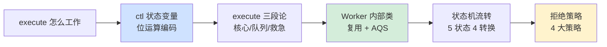
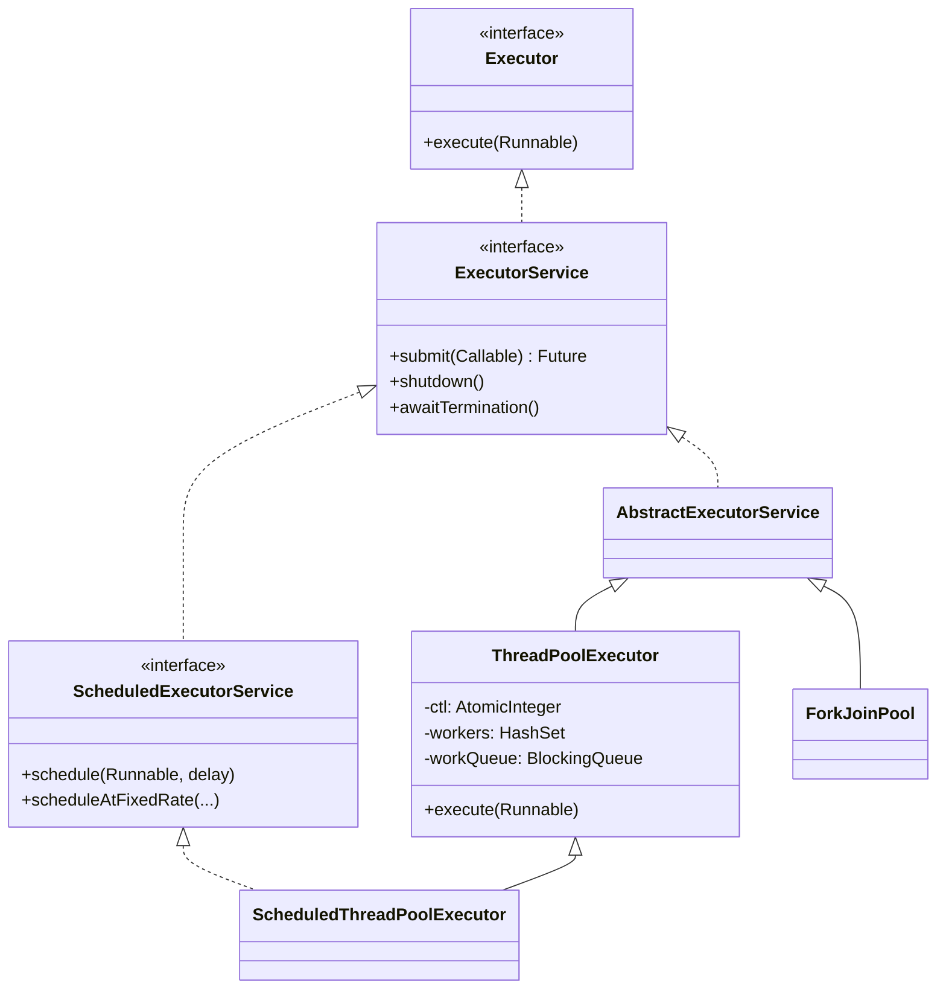
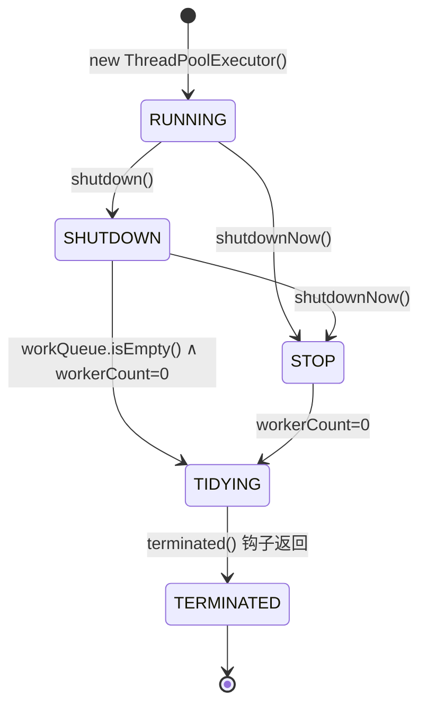
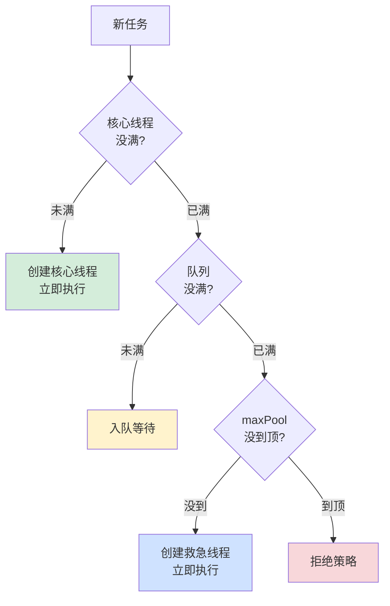
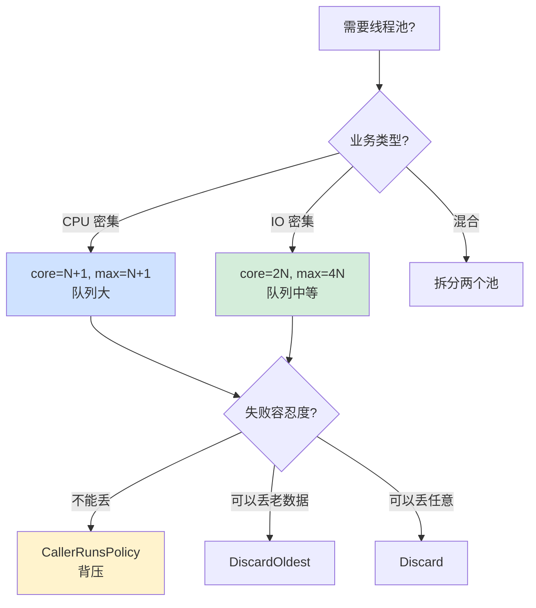

# 16.线程池设计核心原理

> 📍 **本篇位置**：第 3 卷 · 并发之道 · 第 16 篇
> 🎯 **核心矛盾**：**`executor.execute(task)` 一行 API 看似平淡——但它的内部是一套精密的有限状态机，涉及位运算、CAS、自旋、状态流转、Worker 复用、队列协作。读懂这套机制，才算真正理解 JUC 的设计精髓**
> 🧭 **设计灵魂**：线程池本质是一个**精心调谐的并发状态机**——它用一个 `int` 同时编码"5 个状态 + 工作线程数"，用 Worker 实现"线程的复用 + 不可重入的精妙设计"，用拒绝策略给系统留下"最后的退路"
> 🌐 **跨平台覆盖**：Java JUC ThreadPoolExecutor（源码级）· Netty EventLoopGroup · Tomcat StandardThreadExecutor · Go runtime GMP（隐式线程池）· .NET ThreadPool · Python concurrent.futures
> 🔗 **延伸阅读**：← [3.15 线程池的设计思想](https://yccoding.com/pages/2b1ae7/) · → [3.17 线程池使用技巧](https://yccoding.com/pages/315e07/) · → [3.18 结构化并发设计思想](https://yccoding.com/pages/218459/) · → [3.13 协程核心设计思想](https://yccoding.com/pages/5ebc69/)

---

> 上一篇我们看到了线程池"为什么需要"——池化思想是工程界半个世纪的真理。本篇要解决的是更硬核的问题：**Java 的 ThreadPoolExecutor 凭什么被誉为"并发设计的教科书"？它内部那个看似平凡的 `int ctl` 变量，为什么 Doug Lea 用了几年才设计完？**
>
> 本篇从一个 5 万 QPS 的真实事故切入，把 ThreadPoolExecutor **拆到源码级**——位运算、状态机、Worker 复用、拒绝策略。读完你会明白：**API 越简单，背后的设计越精密**。

#### 目录介绍
- [01.真实事故引入](#01真实事故引入)
  - [1.1 凌晨事故](#11-凌晨事故)
  - [1.2 灵魂三问](#12-灵魂三问)
  - [1.3 递进追问](#13-递进追问)
  - [1.4 探索路径](#14-探索路径)
  - [1.5 为何值得讲透](#15-为何值得讲透)
- [02.Executor设计哲学](#02executor设计哲学)
  - [2.1 Thread到Executor](#21-thread到executor)
  - [2.2 框架层次结构](#22-框架层次结构)
  - [2.3 接口设计的精妙](#23-接口设计的精妙)
  - [2.4 七个参数](#24-七个参数)
- [03.源码级解剖](#03源码级解剖)
  - [3.1 ctl变量](#31-ctl变量)
  - [3.2 五种状态](#32-五种状态)
  - [3.3 状态转换](#33-状态转换)
  - [3.4 位运算智慧](#34-位运算智慧)
- [04.三段论设计](#04三段论设计)
  - [4.1 三段论的算法](#41-三段论的算法)
  - [4.2 设计哲学](#42-设计哲学)
  - [4.3 队列饱和陷阱](#43-队列饱和陷阱)
  - [4.4 getTask玄机](#44-gettask玄机)
- [05.Worker内部类](#05worker内部类)
  - [5.1 Worker是什么](#51-worker是什么)
  - [5.2 runWorker](#52-runworker)
  - [5.3 不可重入锁](#53-不可重入锁)
  - [5.4 状态-1陷阱](#54-状态-1陷阱)
- [06.状态流转](#06状态流转)
  - [6.1 完整状态图](#61-完整状态图)
  - [6.2 shutdown对比](#62-shutdown对比)
  - [6.3 等待终止](#63-等待终止)
  - [6.4 拒绝策略](#64-拒绝策略)
  - [6.5 终止条件精算](#65-终止条件精算)
- [07.跨语言实现](#07跨语言实现)
  - [7.1 Netty实现](#71-netty实现)
  - [7.2 Tomcat改动](#72-tomcat改动)
  - [7.3 Go的隐式池](#73-go的隐式池)
  - [7.4 Python实现](#74-python实现)
  - [7.5 .NET实现](#75-net实现)
- [08.源码级陷阱](#08源码级陷阱)
  - [8.1 工厂内存炸弹](#81-工厂内存炸弹)
  - [8.2 core=max陷阱](#82-coremax陷阱)
  - [8.3 异常吞没](#83-异常吞没)
  - [8.4 预热意义](#84-预热意义)
  - [8.5 不可重入锁坑](#85-不可重入锁坑)
  - [8.6 拒绝策略误区](#86-拒绝策略误区)
  - [8.7 监控盲区](#87-监控盲区)
  - [8.8 队列类型陷阱](#88-队列类型陷阱)
- [09.总结](#09总结)
  - [9.1 三层认知阶梯](#91-三层认知阶梯)
  - [9.2 线程池决策树](#92-线程池决策树)
  - [9.3 七字真言](#93-七字真言)
  - [9.3.1 真言映射表](#931-真言映射表)
  - [9.4 下篇承接](#94-下篇承接)
  - [9.5 设计哲学回扣](#95-设计哲学回扣)

---

## 01.真实事故引入

### 1.1 凌晨事故

我曾负责一个金融交易系统，用 Java 写的订单匹配引擎。某次大促夜里，凌晨 3 点突然告警：

```
03:00:00  订单提交成功率从 99.99% 跌到 73%
03:00:30  P99 延迟从 50ms 飙到 30 秒
03:01:00  上游网关熔断，业务受损
03:05:00  我们的 SRE 把交易服务全部重启，业务恢复
```

排查过程极其曲折。最终定位到一段"看起来非常无害"的代码：

```java
// 用于发送交易回执
ExecutorService notifyPool = Executors.newFixedThreadPool(50);

// 业务路径里：
public void onOrderMatched(Order order) {
    matchEngine.process(order);                           // 匹配
    notifyPool.execute(() -> sendNotification(order));    // 异步发回执
    notifyPool.execute(() -> updateStats(order));         // 异步更新统计
    notifyPool.execute(() -> auditLog(order));            // 异步审计
}
```

**业务方都觉得很合理**——异步发回执、异步更新统计、异步审计，主流程只做核心匹配。

**但真相是**：

```
1. 大促期间 sendNotification 调用的下游短信网关变慢（5秒/次）
2. notifyPool 50 个线程很快全部卡在短信调用上
3. 后续 execute 进入"队列"——但 Executors.newFixedThreadPool 的队列是 LinkedBlockingQueue（无界！）
4. 队列在 2 分钟内堆积了 200 万个任务
5. JVM 内存被任务对象吃光 → Full GC 风暴 → STW 几十秒
6. 主线程的 execute() 调用看似只是"加入队列"，但因为 STW，卡了 30 秒
```

**根因有三层**：

```
表层：业务下游短信网关变慢
中层：Executors.newFixedThreadPool 用了无界队列
深层：execute() 在 GC 时不可中断，主线程被牵连
```

修复后，我们彻底告别了 `Executors` 工厂方法：

```java
// ❌ 危险：无界队列
ExecutorService pool = Executors.newFixedThreadPool(50);

// ✅ 显式指定所有参数
ExecutorService pool = new ThreadPoolExecutor(
    50,                                          // corePoolSize
    100,                                         // maximumPoolSize
    60L, TimeUnit.SECONDS,                       // keepAlive
    new ArrayBlockingQueue<>(10000),             // ★ 有界队列！
    new ThreadFactoryBuilder()
        .setNameFormat("notify-%d")
        .build(),
    new ThreadPoolExecutor.CallerRunsPolicy()    // ★ 拒绝策略
);
```

**这次事故让我意识到**：`ExecutorService` 这个 API 的"简单"是骗人的——**真正用对它需要理解七八个参数的物理含义、状态机的流转、拒绝策略的取舍**。

### 1.2 灵魂三问

这次事故让我反复追问：

1. **为什么 Doug Lea 设计的 `ThreadPoolExecutor` 用一个 `int ctl` 同时表达"状态 + 线程数"？这看起来很 hack，是不是有什么不得不这么做的理由？** —— 这个看似奇怪的设计背后有什么物理约束？
2. **Worker 类内部为什么要继承 AQS 实现一个不可重入锁？为什么不直接用 ReentrantLock？** —— 这个反直觉的选择有什么深层原因？
3. **为什么 `execute()` 流程要分"三段论"（核心线程 → 队列 → 救急线程）而不是更简单的"线程不够就开"？** —— 这个看似复杂的判断顺序是必然的吗？

### 1.3 递进追问

要把线程池讲透，需要先回答 5 个递进问题：

1. **execute() 到底做了什么？** —— 加入队列还是直接交线程？
2. **Worker 是什么？** —— 它和 Thread 是什么关系？
3. **状态怎么流转？** —— shutdown 之后还能 execute 吗？
4. **队列满了怎么办？** —— 拒绝策略的设计权衡
5. **谁来真正终止线程池？** —— TIDYING/TERMINATED 状态的意义

这 5 个问题，构成了本篇的全部主线。

### 1.4 探索路径



### 1.5 为何值得讲透

我想抛三个问题：

1. **为什么 `Executors.newFixedThreadPool` 是被 Effective Java、阿里规约、Google Java Style 同时禁用的"反模式"？** —— 因为它的 LinkedBlockingQueue 是无界的，是内存炸弹。
2. **为什么 `corePoolSize == maximumPoolSize` 时，"keepAliveTime" 参数完全没意义？** —— 因为 keepAlive 只对"超出 core 的线程"生效。
3. **为什么 ThreadPoolExecutor 的源码注释长达 1500 行，被并发圈称为"必读文献"？** —— 因为它是 Doug Lea 在并发设计领域的集大成之作。

读完本章你会懂：**线程池不是"启动 N 个线程"——是 Java 并发设计的浓缩教科书**。

---

## 02.Executor设计哲学

### 2.1 Thread到Executor

Java 1.0 时代，所有人都直接用 `Thread`：

```java
// Java 1.0 风格
new Thread(() -> {
    process(req);
}).start();
```

**问题立刻暴露**：

```
1. Thread 是 OS 资源，创建昂贵（~1ms）
2. 没有数量限制——来 1 万请求就开 1 万线程→OOM
3. 没有任务队列——线程满了任务无处放
4. 不能重用——每个 Thread 用完即弃
5. 没有生命周期管理——shutdown 谁来负责
```

**Doug Lea 在 JSR-166（2004 年）提出 Executor 框架**——核心思想是：

> **把"任务的提交"和"任务的执行"解耦。**

```java
// Java 5+ 风格
ExecutorService executor = Executors.newFixedThreadPool(50);
executor.execute(() -> process(req));    // 提交任务
// 至于这个任务什么时候、由哪个线程执行——你不用管
```

**这是面向对象设计原则在并发领域的应用**——**单一职责**：

```
任务（Runnable）：只描述"做什么"
执行器（Executor）：只决定"怎么调度"
```

### 2.2 框架层次结构



**层次设计的智慧**：

```
Executor          → 最简：只能 execute
ExecutorService   → 加上 submit + Future + lifecycle
ScheduledES       → 加上定时调度

接口逐层加能力，实现一个 ThreadPoolExecutor 自动满足所有需求
```

**这是 SOLID 中"接口隔离原则（ISP）"的完美范例**——客户端只依赖自己用得到的接口。

### 2.3 接口设计的精妙

**Runnable vs Callable**：

```java
@FunctionalInterface
public interface Runnable {
    void run();   // 没有返回值，没有 checked 异常
}

@FunctionalInterface
public interface Callable<V> {
    V call() throws Exception;   // 有返回值，可抛 checked
}
```

**为什么需要两个？**

```
Runnable 是 Java 1.0 就有的——和 Thread 关联
Callable 是 1.5 引入的——为线程池设计

Runnable 的限制：
  没法返回结果
  没法抛 checked exception
  → 不适合"任务"语义
  
Callable 解决了这两个问题
```

**Future 的设计**：

```java
public interface Future<V> {
    V get() throws InterruptedException, ExecutionException;
    V get(long timeout, TimeUnit unit) throws ...;
    boolean cancel(boolean mayInterruptIfRunning);
    boolean isCancelled();
    boolean isDone();
}
```

Future 是"未来结果的占位符"——这就是 §1.5 第二题的答案：**线程池让"任务执行"和"结果获取"在时间上解耦**。

### 2.4 七个参数

```java
public ThreadPoolExecutor(
    int corePoolSize,                  // 核心线程数
    int maximumPoolSize,               // 最大线程数
    long keepAliveTime,                // 空闲存活时间
    TimeUnit unit,                     // 时间单位
    BlockingQueue<Runnable> workQueue, // 任务队列
    ThreadFactory threadFactory,       // 线程工厂
    RejectedExecutionHandler handler   // 拒绝策略
)
```

**这 7 个参数共同决定了线程池的全部行为**——下一节会逐一展开。

---

## 03.源码级解剖

### 3.1 ctl变量

打开 ThreadPoolExecutor 源码，第一行核心代码：

```java
private final AtomicInteger ctl = new AtomicInteger(ctlOf(RUNNING, 0));

private static final int COUNT_BITS = Integer.SIZE - 3;   // 32 - 3 = 29
private static final int CAPACITY   = (1 << COUNT_BITS) - 1;   // 2^29 - 1

// 5 个状态，每个用 3 位高位编码
private static final int RUNNING    = -1 << COUNT_BITS;   // 高 3 位 111
private static final int SHUTDOWN   =  0 << COUNT_BITS;   // 高 3 位 000
private static final int STOP       =  1 << COUNT_BITS;   // 高 3 位 001
private static final int TIDYING    =  2 << COUNT_BITS;   // 高 3 位 010
private static final int TERMINATED =  3 << COUNT_BITS;   // 高 3 位 011

// 解码方法
private static int runStateOf(int c)     { return c & ~CAPACITY; }
private static int workerCountOf(int c)  { return c &  CAPACITY; }
private static int ctlOf(int rs, int wc) { return rs | wc; }
```

**§1.2 第一题的答案**——**为什么用一个 int 同时编码两个值？**

| 维度 | 用两个 AtomicInteger | 用一个 ctl |
|---|---|---|
| **原子性** | ❌ 无法原子地"同时"修改 | ✅ 一次 CAS 同时改两个 |
| **一致性** | ❌ 可能"状态变了但线程数没改"的中间态 | ✅ 状态和线程数永远一致 |
| **空间** | 16 字节（两个 AtomicInteger）| 4 字节 |
| **性能** | 两次 CAS | 一次 CAS |

**关键洞察**：很多状态机的 bug 发生在"中间态"——A 改了状态但还没来得及改线程数，B 看到了不一致的快照。**Doug Lea 用位运算把它们绑成一个原子单元**，从根本上消除中间态。

**这种设计的代价**：代码可读性下降——但换来了**绝对的并发正确性**。

### 3.2 五种状态



| 状态 | 接受新任务 | 处理队列任务 | 中断运行中线程 |
|---|---|---|---|
| **RUNNING** | ✅ | ✅ | ❌ |
| **SHUTDOWN** | ❌（拒绝）| ✅（继续处理）| ❌ |
| **STOP** | ❌ | ❌（清空）| ✅（中断信号）|
| **TIDYING** | ❌ | ❌ | ❌（已无线程）|
| **TERMINATED** | ❌ | ❌ | ❌（已结束）|

**有趣的设计**：

```
SHUTDOWN：仁慈关闭——已提交的任务还会执行完
STOP：暴力关闭——立即返回未执行的任务，并中断正在执行的
```

为什么需要两种？因为业务场景不同：

```
银行系统：必须用 shutdown()——交易任务不能丢
压测工具：可以用 shutdownNow()——立即停止
```

### 3.3 状态转换

**关键问题**：状态转换是怎么原子地发生的？

看 `tryTerminate()` 源码（简化）：

```java
final void tryTerminate() {
    for (;;) {
        int c = ctl.get();
        if (isRunning(c) ||
            runStateAtLeast(c, TIDYING) ||
            (runStateOf(c) == SHUTDOWN && !workQueue.isEmpty()))
            return;
        
        if (workerCountOf(c) != 0) {
            interruptIdleWorkers(ONLY_ONE);   // 唤醒一个空闲 worker，让它去检查
            return;
        }
        
        // 所有 worker 都退出，且队列空 → 推进到 TIDYING
        if (ctl.compareAndSet(c, ctlOf(TIDYING, 0))) {
            try {
                terminated();   // 钩子方法，子类可以覆盖
            } finally {
                ctl.set(ctlOf(TERMINATED, 0));
                termination.signalAll();   // 唤醒所有等 awaitTermination 的线程
            }
            return;
        }
    }
}
```

**几个精妙的细节**：

```
1. 自旋 + CAS：保证状态推进的原子性
2. interruptIdleWorkers(ONLY_ONE)：只唤醒一个 worker——避免"惊群"
3. terminated() 钩子：让子类可以做最终清理
4. signalAll：精确唤醒等待终止的线程
```

### 3.4 位运算的设计智慧

**疑惑**：`RUNNING = -1 << 29` 为什么 RUNNING 是三位全 1？为什么 RUNNING < SHUTDOWN < STOP < TIDYING < TERMINATED？难道状态值不是越大越"正常"？

**论证**，这个设计的精妙在于**同时解决三个问题**：

**智慧一：用数值大小表达状态严重性**

```
RUNNING    = -1 << 29  =  11100000... (负数，最小)
SHUTDOWN   =  0 << 29  =  00000000... (0)
STOP       =  1 << 29  =  00100000... (正数)
TIDYING    =  2 << 29  =  01000000... (正数，更大)
TERMINATED =  3 << 29  =  01100000... (正数，最大)

数值大小：RUNNING < SHUTDOWN < STOP < TIDYING < TERMINATED
```

**为什么 RUNNING 是负数（最小）？** 因为源码中大量使用 `runStateAtLeast(c, SHUTDOWN)` 来判断"是否还能接受新任务"：

```java
// 只需一行判断：
boolean canAccept = c >= SHUTDOWN; // 反直觉！RUNNING(−值) < SHUTDOWN(0)
// 等价于：如果状态是 RUNNING → 接受新任务
```

这种用法极其普遍——`isRunning()` 的等价写法是简单的数值判断，省去了额外的位运算抽取。

**智慧二：高位编码让"线程数"永远不干扰"状态判断"**

```
状态（高 3 位）  | 线程数（低 29 位）
  111            |   000...1010
    ↑                  ↑
  RUNNING           = 10 个线程

0–5 亿线程都不会溢出低 29 位 → 永远不会污染高 3 位
```

**智慧三：`~CAPACITY` 是快速"状态掩码"**

```java
CAPACITY = 0b00011111_11111111_11111111_11111111  // 1 << 29 - 1
~CAPACITY = 0b11100000_00000000_00000000_00000000  // 反向掩码

runStateOf(c)   = c & ~CAPACITY   // 只保留高 3 位
workerCountOf(c) = c &  CAPACITY   // 只保留低 29 位
```

这是一个**只用一次 `&` 操作就完成"字段提取"**的设计——没有额外的 shift、没有额外的 mask 计算。

**结论**：Doug Lea 把一个 `int` 用到了极致——**高位表达严重性（用于快速状态判断）、低位表达容量（支持 5 亿线程）、位运算实现零拷贝提取**。这种级别的空间节省 + 原子性保证，是真正的大师手笔。

---


## 04.三段论设计

### 4.1 三段论的算法

execute() 是线程池最核心的方法。看简化的源码：

```java
public void execute(Runnable command) {
    if (command == null) throw new NullPointerException();
    
    int c = ctl.get();
    
    // ========== 第一段：尝试用核心线程 ==========
    if (workerCountOf(c) < corePoolSize) {
        if (addWorker(command, true))     // true = core
            return;
        c = ctl.get();   // 失败，重读
    }
    
    // ========== 第二段：尝试入队列 ==========
    if (isRunning(c) && workQueue.offer(command)) {
        int recheck = ctl.get();
        if (!isRunning(recheck) && remove(command))
            reject(command);              // 入队后状态变了，回滚
        else if (workerCountOf(recheck) == 0)
            addWorker(null, false);       // 防御性：保证至少有一个 worker 在跑队列
    }
    
    // ========== 第三段：尝试救急线程（≤maximumPoolSize）==========
    else if (!addWorker(command, false))
        reject(command);
}
```

### 4.2 设计哲学

§1.2 第三题。为什么是"核心 → 队列 → 救急"这个顺序？



**这个顺序背后是工程权衡**：

**为什么先核心线程？**

```
核心线程不会被回收——长期存在
新任务来时优先用它们 → 避免反复创建/销毁线程
```

**为什么队列在中间？**

```
队列比线程便宜——一个对象引用 vs 一个 OS 线程
让队列吸收"瞬时洪峰" → 避免疯狂创建线程
```

**为什么救急线程在最后？**

```
救急线程一旦创建就消耗资源
只有"队列满了说明确实超出处理能力" → 才创建
keepAliveTime 后自动回收 → 不长期占用
```

**这个设计的反直觉之处**：

```
直觉以为：先开线程到 max，再入队
实际是：  先到 core → 入队 → 才到 max

→ 默认"队列优先"，因为入队比开线程便宜
```

### 4.3 队列饱和陷阱

但这个设计有个**坑**——如果你用 `LinkedBlockingQueue` 不指定容量（默认 Integer.MAX_VALUE）：

```java
new ThreadPoolExecutor(
    10,                            // core
    100,                           // max
    60, SECONDS,
    new LinkedBlockingQueue<>()    // ❌ 无界！
);
```

**结果**：第二段永远不会满 → 第三段（max=100 的救急线程）永远用不上 → **`maximumPoolSize` 完全没意义**。

**这就是 §1.5 第一题的答案**——`Executors.newFixedThreadPool` 内部就是这个配置：

```java
public static ExecutorService newFixedThreadPool(int n) {
    return new ThreadPoolExecutor(
        n, n,                       // ★ core == max，keepAlive 也无意义
        0L, MILLISECONDS,
        new LinkedBlockingQueue<Runnable>()    // ★ 无界！
    );
}
```

**两个致命问题**：

```
1. 队列无界 → 任务无限堆积 → OOM
2. core == max → keepAlive 无意义 → 无法应对突发流量
```

**所以**：**生产环境永远不要用 Executors 工厂方法**。

### 4.4 getTask的玄机

**疑惑**：4.2 讲了三段论分配任务，但 Worker 怎么从队列"取"任务？这个取的动作有什么精妙设计？

**论证**，`getTask()` 是 Worker 的核心生命周期控制点：

```java
private Runnable getTask() {
    boolean timedOut = false;
    
    for (;;) {
        int c = ctl.get();
        int rs = runStateOf(c);
        
        // ===== 检查 1：状态判断 =====
        if (rs >= SHUTDOWN && (rs >= STOP || workQueue.isEmpty())) {
            decrementWorkerCount();
            return null;   // ★ 返回 null → Worker 退出循环 → 线程回收
        }
        
        int wc = workerCountOf(c);
        
        // ===== 检查 2：是否需要超时等待 =====
        boolean timed = allowCoreThreadTimeOut || wc > corePoolSize;
        
        // ===== 检查 3：线程数是否超出需要 =====
        if ((wc > maximumPoolSize || (timed && timedOut))
            && (wc > 1 || workQueue.isEmpty())) {
            if (compareAndDecrementWorkerCount(c))
                return null;   // ★ 返回 null → 线程回收
            continue;
        }
        
        // ===== 真正从队列取任务 =====
        try {
            Runnable r = timed ?
                workQueue.poll(keepAliveTime, TimeUnit.NANOSECONDS) :  // 有超时
                workQueue.take();                                       // 无限等
            if (r != null)
                return r;
            timedOut = true;
        } catch (InterruptedException ie) {
            timedOut = false;   // 被中断了，重新循环
        }
    }
}
```

**getTask 的"死亡判断"三层逻辑**：

```
第一层：状态判断
  SHUTDOWN + 队列非空 → 继续消化队列（仁慈关闭的关键）
  STOP → 直接返回 null（暴力关闭）
  
第二层：线程数判断
  当前线程数 > corePoolSize 且 keepAliveTime 超时 → 回收
  当前线程数 > maximumPoolSize → 立即回收
  
第三层：队列等待
  有超时的 poll → 到期返回 null → timedOut=true → 下次触发第二层回收
  无超时的 take → 永久阻塞 → 直到队列有任务或被 interrupt
```

**这是"线程复用"真正的物理实现**——Worker 在 while 循环中反复调用 getTask()，getTask 根据状态和超时决定"继续等"还是"回收自己"。线程池的"弹性伸缩"在这里体现。

---


## 05.Worker内部类

### 5.1 Worker是什么

Worker 是 ThreadPoolExecutor 的**核心私有内部类**：

```java
private final class Worker
    extends AbstractQueuedSynchronizer
    implements Runnable
{
    final Thread thread;
    Runnable firstTask;
    volatile long completedTasks;
    
    Worker(Runnable firstTask) {
        setState(-1);   // 抑制 interrupt 直到 runWorker
        this.firstTask = firstTask;
        this.thread = getThreadFactory().newThread(this);
    }
    
    public void run() {
        runWorker(this);
    }
    
    // AQS 实现（不可重入锁）
    protected boolean isHeldExclusively() { return getState() != 0; }
    protected boolean tryAcquire(int unused) {
        if (compareAndSetState(0, 1)) {
            setExclusiveOwnerThread(Thread.currentThread());
            return true;
        }
        return false;
    }
    protected boolean tryRelease(int unused) {
        setExclusiveOwnerThread(null);
        setState(0);
        return true;
    }
    public void lock()        { acquire(1); }
    public boolean tryLock()  { return tryAcquire(1); }
    public void unlock()      { release(1); }
    public boolean isLocked() { return isHeldExclusively(); }
}
```

**Worker 同时是三种东西**：

1. **Runnable**：能被 Thread 执行
2. **AQS 子类**：自带一把锁
3. **Thread 的容器**：持有一个 Java Thread 实例

### 5.2 runWorker

```java
final void runWorker(Worker w) {
    Thread wt = Thread.currentThread();
    Runnable task = w.firstTask;
    w.firstTask = null;
    w.unlock();   // allow interrupts
    boolean completedAbruptly = true;
    try {
        // ★ 核心：循环从队列取任务
        while (task != null || (task = getTask()) != null) {
            w.lock();
            // ... 中断检查、状态检查 ...
            try {
                beforeExecute(wt, task);
                Throwable thrown = null;
                try {
                    task.run();   // ★ 执行任务
                } catch (Throwable x) { 
                    thrown = x; throw x;
                } finally {
                    afterExecute(task, thrown);
                }
            } finally {
                task = null;
                w.completedTasks++;
                w.unlock();
            }
        }
        completedAbruptly = false;
    } finally {
        processWorkerExit(w, completedAbruptly);
    }
}
```

**核心设计——Worker 是个永不停机的循环**：

```
1. 从队列 getTask() 取任务
2. lock() → run() → unlock()
3. 回到 1，继续取下一个
4. getTask() 返回 null（线程要回收）→ 退出循环 → processWorkerExit
```

**这就是"线程复用"的物理实现**——**一个 OS 线程跑一个 while 循环，无限处理任务**。

### 5.3 不可重入锁

§1.2 第二题。为什么不直接用 `ReentrantLock`？

**关键代码**：

```java
private void interruptIdleWorkers(boolean onlyOne) {
    final ReentrantLock mainLock = this.mainLock;
    mainLock.lock();
    try {
        for (Worker w : workers) {
            Thread t = w.thread;
            if (!t.isInterrupted() && w.tryLock()) {   // ★ tryLock
                try {
                    t.interrupt();
                } catch (SecurityException ignore) {
                } finally {
                    w.unlock();
                }
            }
            if (onlyOne) break;
        }
    } finally {
        mainLock.unlock();
    }
}
```

**`w.tryLock()` 的意义**：

```
Worker 在执行任务时持有自己的锁（runWorker 里的 w.lock()）
shutdown 想中断"空闲"worker 时，需要 tryLock() 判断它是不是空闲

如果用可重入锁：
  shutdown 线程也是某个 worker → 它能 lock 自己 → 误判为"空闲"
  
用不可重入锁：
  shutdown 永远 tryLock 失败（因为别人持有）→ 正确判断
```

**这是用不可重入特性精确表达"我在跑任务"信号**。**Doug Lea 把"锁"用作了"状态标记"**——这是并发设计的高级技巧。

### 5.4 状态-1陷阱

注意 Worker 构造函数：

```java
Worker(Runnable firstTask) {
    setState(-1);   // ← 这一行很神秘
    ...
}
```

**为什么把 AQS 状态设成 -1？**

```
默认 state=0 → tryLock 会成功 → 视为"空闲"
state=-1 → tryLock 失败（CAS 0→1 不成功）→ 视为"忙碌"

构造期间：worker 还没真正启动
此时如果 shutdown 误以为它"空闲"并 interrupt → 还没 run 就被中断
```

**runWorker 的第一行就把它"释放"**：

```java
w.unlock();   // setState(0) → 现在才允许 interrupt
```

**这是一个抑制"出生即死"的精妙设计**。

---

## 06.状态流转

### 6.1 完整状态图


### 6.2 shutdown对比

```java
// shutdown：温和关闭
public void shutdown() {
    advanceRunState(SHUTDOWN);          // RUNNING → SHUTDOWN
    interruptIdleWorkers();              // 中断空闲 worker
    onShutdown();
    tryTerminate();
}

// shutdownNow：暴力关闭
public List<Runnable> shutdownNow() {
    List<Runnable> tasks;
    advanceRunState(STOP);               // → STOP
    interruptWorkers();                  // 中断所有 worker（包括正在执行的）
    tasks = drainQueue();                // 把队列里的任务返回
    tryTerminate();
    return tasks;
}
```

**核心差异**：

| | shutdown | shutdownNow |
|---|---|---|
| **新任务** | 拒绝 | 拒绝 |
| **队列任务** | 继续执行 | 立即返回 |
| **正在执行的任务** | 继续到结束 | interrupt 信号 |
| **返回值** | void | 未执行的任务列表 |

### 6.3 等待终止

```java
public boolean awaitTermination(long timeout, TimeUnit unit) {
    long nanos = unit.toNanos(timeout);
    final ReentrantLock mainLock = this.mainLock;
    mainLock.lock();
    try {
        for (;;) {
            if (runStateAtLeast(ctl.get(), TERMINATED))
                return true;
            if (nanos <= 0L) return false;
            nanos = termination.awaitNanos(nanos);
        }
    } finally {
        mainLock.unlock();
    }
}
```

**典型生产代码**：

```java
executor.shutdown();
try {
    if (!executor.awaitTermination(60, SECONDS)) {
        executor.shutdownNow();    // 优雅关闭超时 → 暴力关闭
        if (!executor.awaitTermination(10, SECONDS)) {
            log.error("Pool did not terminate");
        }
    }
} catch (InterruptedException e) {
    executor.shutdownNow();
    Thread.currentThread().interrupt();
}
```

**这是关闭线程池的"三段式"标准做法**——温和 → 暴力 → 报警。

### 6.4 拒绝策略

```java
// 1. AbortPolicy（默认）：抛异常
public static class AbortPolicy implements RejectedExecutionHandler {
    public void rejectedExecution(Runnable r, ThreadPoolExecutor e) {
        throw new RejectedExecutionException(...);
    }
}

// 2. DiscardPolicy：静默丢弃
public static class DiscardPolicy implements RejectedExecutionHandler {
    public void rejectedExecution(Runnable r, ThreadPoolExecutor e) {
        // do nothing
    }
}

// 3. DiscardOldestPolicy：丢弃最老的
public static class DiscardOldestPolicy implements RejectedExecutionHandler {
    public void rejectedExecution(Runnable r, ThreadPoolExecutor e) {
        if (!e.isShutdown()) {
            e.getQueue().poll();      // 丢弃队列头
            e.execute(r);              // 再次提交
        }
    }
}

// 4. CallerRunsPolicy：调用方自己跑
public static class CallerRunsPolicy implements RejectedExecutionHandler {
    public void rejectedExecution(Runnable r, ThreadPoolExecutor e) {
        if (!e.isShutdown()) {
            r.run();   // 在调用 execute 的线程上同步执行
        }
    }
}
```

**4 种策略的工程权衡**：

| 策略 | 适用场景 |
|---|---|
| Abort | **默认**：让上游知道"系统过载"，明确错误 |
| Discard | 不重要的任务（如日志、统计）|
| DiscardOldest | 最新数据更重要（如实时报价）|
| CallerRuns | **背压**：让生产方"自己跑"，自然限流 |

**`CallerRunsPolicy` 是生产级最佳实践**——它实现了天然背压：

```
生产方调 execute → 线程池满 → CallerRuns 让生产方自己跑这个任务
→ 生产方下次再调 execute 已经变慢了 → 生产速率自动降下来
→ 系统进入稳态，不会雪崩
```

### 6.5 终止条件精算

**疑惑**：`tryTerminate()` 什么时候能真正推进到 TERMINATED？为什么需要这么复杂的判断条件？

**论证**，从 SHUTDOWN/STOP → TERMINATED 的路径上有**两个必要条件**：

```
终止条件 = workerCount == 0  AND  (状态是 STOP  OR  队列已清空)
```

**为什么需要"队列已清空"这个条件？** 因为 SHUTDOWN 的语义是"仁慈关闭"——已提交的任务还要执行完：

```
场景：线程池调了 shutdown()
  ├─ 当前有 3 个 Worker 在处理队列中的 500 个任务
  ├─ 如果只检查 workerCount==0 → 永远到不了（Worker 一直在跑）
  └─ 所以 tryTerminate 的逻辑是：
       每次 Worker 处理完一个任务退出时（processWorkerExit 里）
       → 调 tryTerminate() 检查一次
       → 最后一个 Worker 退出时，workerCount==0 且队列空
       → CAS 推进到 TIDYING → TERMINATED
```

**tryTerminate 被调用的时机**（源码中有 5 个触发点）：

```
1. addWorker 失败之后
2. processWorkerExit：Worker 退出循环时
3. remove：从队列移走任务后（SHUTDOWN 时可能因此触发）
4. shutdown / shutdownNow 的最后一步
5. purge：清除已取消的 Future 任务后
```

**这是"懒推进"的设计**——不是主动轮询"什么时候可以终止"，而是**在状态可能发生变化的关键时刻检查一次**。就像 GC 不是在后台一直跑，而是在"分配失败"时才触发。

---


## 07.跨语言实现

### 7.1 Netty实现

Netty 完全不用 JDK 的 ThreadPoolExecutor，自己实现了 `EventLoopGroup`：

```java
EventLoopGroup bossGroup = new NioEventLoopGroup(1);
EventLoopGroup workerGroup = new NioEventLoopGroup();

ServerBootstrap b = new ServerBootstrap();
b.group(bossGroup, workerGroup)
    .channel(NioServerSocketChannel.class)
    .childHandler(...);
```

**为什么 Netty 不用 ThreadPoolExecutor？**

```
ThreadPoolExecutor：
  N 个线程从 1 个共享队列取任务
  共享队列 → 锁竞争
  适合"短任务"

Netty EventLoopGroup：
  每个 EventLoop 一个独立线程 + 独立任务队列
  Channel 永远绑定到一个 EventLoop（无并发）
  → 完全没有锁竞争！
  适合"长连接 + 高吞吐"
```

**这是把"并发"问题转化成"亲缘性（affinity）"问题**——同一个 Channel 永远在同一线程上处理，从根本上消除竞争。

### 7.2 Tomcat改动

Tomcat 的 `StandardThreadExecutor` 修改了 ThreadPoolExecutor 的"三段论"：

```java
// Tomcat 的精妙改动
public class TaskQueue extends LinkedBlockingQueue<Runnable> {
    @Override
    public boolean offer(Runnable o) {
        if (parent == null) return super.offer(o);
        
        // ★ 改动：如果还能创建线程，让队列假装"满了"
        if (parent.getPoolSize() < parent.getMaximumPoolSize() &&
            parent.getSubmittedCount() > parent.getPoolSize()) {
            return false;
        }
        
        return super.offer(o);
    }
}
```

**Tomcat 的逻辑**：

```
JDK 默认行为：core 满 → 入队 → 队列满才开 max
Tomcat 行为：core 满 → 队列假装满 → 直接开到 max → 队列才真的入

→ 优先开线程，而不是排队
→ 因为 Web 请求"排队等了 30 秒不如失败重试"
```

**这是把"线程池公式"按业务特点重新调谐**——Tomcat 知道自己处理的是 Web 请求，所以选了不同的优先级。

### 7.3 Go的隐式池

Go 没有显式线程池——但**runtime 内部就是一个超级线程池**：

```
runtime 启动时：创建 GOMAXPROCS 个 OS 线程（M）
每个 M 持有一个 P（逻辑处理器）+ 本地 G 队列
go func() 把 G 加入某个 P 的队列

work-stealing：P 队列空时从其他 P "偷"一半

这就是 GMP 模型——一个动态自适应的线程池
```

**对比 Java**：

```
Java：程序员显式创建 ThreadPoolExecutor，调 corePoolSize 等参数
Go：  runtime 帮你管，你只需要 go func()

抽象层次的差异 → 程序员心智负担差几个数量级
```

### 7.4 Python实现

```python
from concurrent.futures import ThreadPoolExecutor

with ThreadPoolExecutor(max_workers=10) as executor:
    future = executor.submit(work, x)
    result = future.result()
```

**Python 的限制**：

```
GIL 让多线程只能"并发"不能"并行"
所以 Python 线程池只对 IO 密集任务有用
CPU 密集要用 ProcessPoolExecutor（多进程）
```

### 7.5 .NET实现

```csharp
// 整个 .NET 进程共享一个 ThreadPool
ThreadPool.QueueUserWorkItem(_ => Work());

// 或用更高级的 Task API
Task.Run(() => Work());
```

**.NET 的设计**：

```
全局 ThreadPool（单例）
+ 工作窃取（每个线程有本地队列）
+ Hill-climbing 算法动态调整线程数

→ 比 Java 的 ThreadPoolExecutor 更"智能"，但灵活性低
```

---

## 08.源码级陷阱

### 8.1 工厂内存炸弹

**铁律**：**永远不用 `Executors.newFixedThreadPool` / `newCachedThreadPool` / `newSingleThreadExecutor`**。

```java
// ❌ 三个都是炸弹
Executors.newFixedThreadPool(10);     // 队列无界 → OOM
Executors.newCachedThreadPool();       // 线程数 Integer.MAX_VALUE → 创建无数线程
Executors.newSingleThreadExecutor();   // 队列无界 → OOM

// ✅ 永远显式构造
new ThreadPoolExecutor(
    coreSize, maxSize, keepAlive, unit,
    new ArrayBlockingQueue<>(boundedSize),    // ★ 必须有界
    threadFactory,
    new CallerRunsPolicy()                    // ★ 必须明确策略
);
```

**阿里 Java 开发手册原话**：

> 【强制】线程池不允许使用 Executors 去创建，而是通过 ThreadPoolExecutor 的方式。这样的处理方式让写的同学更加明确线程池的运行规则，规避资源耗尽的风险。

### 8.2 core=max陷阱

```java
new ThreadPoolExecutor(
    10, 10,                    // core == max
    60, SECONDS,               // ★ keepAlive 完全没用！
    queue
);
```

**根因**：keepAliveTime 只对"超出 core 的线程"生效——core 内的线程默认永生。

**修复**：

```java
// 方案 1：开启 allowCoreThreadTimeOut
ThreadPoolExecutor pool = new ThreadPoolExecutor(...);
pool.allowCoreThreadTimeOut(true);   // 现在 core 线程也会超时回收

// 方案 2：让 core < max
new ThreadPoolExecutor(5, 50, 60, SECONDS, ...);
```

### 8.3 异常吞没

```java
// ❌ 异常无声无息地消失
ExecutorService pool = Executors.newFixedThreadPool(10);
pool.execute(() -> {
    throw new RuntimeException("oops");   // 看不到任何异常输出！
});
```

**根因**：`execute` 提交的 Runnable 抛异常时，默认会被 `ThreadGroup.uncaughtException` 处理——通常只打印到 stderr，不会进入业务日志。

**修复方案 1**：用 `submit` + Future.get()

```java
Future<?> f = pool.submit(() -> { ... });
try { f.get(); } 
catch (ExecutionException e) { 
    log.error("task failed", e.getCause());
}
```

**修复方案 2**：覆盖 afterExecute

```java
ThreadPoolExecutor pool = new ThreadPoolExecutor(...) {
    @Override
    protected void afterExecute(Runnable r, Throwable t) {
        if (t == null && r instanceof Future<?>) {
            try { ((Future<?>) r).get(); }
            catch (Throwable e) { t = e; }
        }
        if (t != null) log.error("task failed", t);
    }
};
```

**修复方案 3**：自定义 ThreadFactory 设置 UncaughtExceptionHandler

```java
ThreadFactory tf = r -> {
    Thread t = new Thread(r);
    t.setUncaughtExceptionHandler((thread, ex) -> log.error("...", ex));
    return t;
};
```

### 8.4 预热意义

**问题**：默认情况下，core 线程是"懒创建"的——任务来了才创建。这导致冷启动慢。

```java
ThreadPoolExecutor pool = new ThreadPoolExecutor(...);
pool.prestartAllCoreThreads();   // 立即创建所有 core 线程
```

**适用场景**：

```
业务高峰前预热：避免高峰时还在"创建线程"
延迟敏感场景：第一个请求不能慢
```

### 8.5 不可重入锁坑

**反例**：在任务内部调 `executor.shutdown()`：

```java
pool.execute(() -> {
    process(data);
    pool.shutdown();   // ❌ 这个调用会自我陷入死锁吗？
});
```

**实际不会死锁**——shutdown 只是改 ctl 状态 + 中断空闲 worker。当前 worker 持有自己的锁，但 shutdown 用 tryLock 不会阻塞。

**真正的坑**：在任务内部调 `executor.shutdownNow()` 然后期望立刻退出——**自己中断自己时**，要看任务是否响应中断。

### 8.6 拒绝策略误区

```java
// ❌ 关键业务用 DiscardPolicy
new ThreadPoolExecutor(..., new DiscardPolicy());
// 静默丢弃 → 业务方不知道任务失败 → 数据不一致
```

**铁律**：

```
关键业务（金融、订单）→ AbortPolicy 或 CallerRunsPolicy
非关键业务（日志、统计）→ DiscardPolicy
新数据更重要（实时行情）→ DiscardOldestPolicy
需要背压（生产消费）→ CallerRunsPolicy
```

### 8.7 监控盲区

线程池的关键指标必须有监控：

```java
ThreadPoolExecutor pool = ...;

scheduledMonitor.scheduleAtFixedRate(() -> {
    log.info("pool stats: " +
        "active={} ".format(pool.getActiveCount()) +
        "size={} ".format(pool.getPoolSize()) +
        "completed={} ".format(pool.getCompletedTaskCount()) +
        "queue={} ".format(pool.getQueue().size()) +
        "rejected={}".format(/* 自定义计数器 */));
}, 0, 10, SECONDS);
```

**关键告警阈值**：

```
活跃线程数 > maxPoolSize × 90% → WARN
队列堆积 > queueCapacity × 80% → WARN
拒绝次数 > 0 → ERROR
平均任务执行时间 > 阈值 → WARN
```

### 8.8 队列类型陷阱

**疑惑**：`blockingQueue` 有好几种——`ArrayBlockingQueue`、`LinkedBlockingQueue`、`SynchronousQueue`、`PriorityBlockingQueue`——怎么选？

**论证**，这是线程池配置的"第二暗坑"：

| 队列类型 | 容量特征 | 对三段论的影响 | 适用场景 |
|---|---|---|---|
| **LinkedBlockingQueue**(无界) | 无限 | 第二段永不饱和 | ❌ 生产禁用 |
| **ArrayBlockingQueue**(有界) | 固定 N | 三段论正常运作 | ✅ IO 密集通用 |
| **SynchronousQueue**(零容量) | 0 | 第二段直接过→全靠第三段 | ✅ 实时性优先 |
| **PriorityBlockingQueue** | 有界(需包装) | 三段论正常+优先级 | VIP 用户优先 |

**SynchronousQueue 的核心特性**：

```java
// offer() 只有在有 Worker 在 take() 时才能成功
// → 失败立刻触发第三段创建线程
new ThreadPoolExecutor(coreSize, maxSize, 60, SECONDS,
    new SynchronousQueue<>());  // ★ 零缓冲，直接交付
```

优点：任务零排队延迟；缺点：无缓冲→洪峰直接冲击 maxPoolSize。

**结论**：队列不是"越大越好"——它决定了线程池应对峰值的策略。**无界=内存炸弹、有界=排队缓冲、零容量=实时吞吐**。选型取决于业务对"延迟 vs 吞吐 vs 稳定性"的取舍。

---

## 09.总结

### 9.1 三层认知阶梯

```
第一层（知其然）：会用 Executors，会写 execute
  ↓
第二层（知其所以然）：理解 7 大参数、5 个状态、三段论流程、4 种拒绝策略
  ↓
第三层（知其将所以然）：能根据业务设计自定义线程池，能定位线程池故障，能读懂源码
```

读完本章后，你应该能回答开头§1.2 提出的三个问题：

1. **为什么用一个 int 编码状态+线程数？** → 为了原子地同时改两者，从根本上消除"中间态"——这是 Doug Lea 在并发设计里的核心智慧。
2. **Worker 为什么用不可重入锁？** → 用"锁的持有"作为"忙碌"信号，shutdown 时用 tryLock 区分"空闲 worker"和"忙碌 worker"。可重入锁会让 shutdown 误判。
3. **为什么是"核心 → 队列 → 救急"三段论？** → 核心线程长期存在不浪费；队列吸收瞬时洪峰最便宜；救急线程只在确实超载时启用。这是工程权衡的最优解。

### 9.2 线程池决策树



### 9.3 七字真言

1. **永不用 Executors**——用 ThreadPoolExecutor 显式构造。
2. **队列必须有界**——无界 = 内存炸弹。
3. **拒绝策略必明确**——默认 Abort 通常不够。
4. **监控不可省**——队列、活跃数、拒绝数都要看。
5. **shutdown 三段式**——shutdown → awaitTermination → shutdownNow。
6. **线程命名要规范**——便于 jstack 分析。
7. **业务和工具池要分离**——避免互相影响。

### 9.3.1 真言映射表

> 本篇以 Java `ThreadPoolExecutor` 为主线讲清了**线程池核心原理**。下表把上面 7 条真言从 Java JUC **抬升到语言无关层面**——你会发现每一条都能在 Go / .NET / Netty / Tomcat / Python 找到对应物。**真言不变，原语换名**。

| 真言（来自 §9.3） | Java JUC | Go (runtime + worker pool) | Netty EventLoop | Tomcat StandardThreadExecutor | .NET ThreadPool | Python concurrent.futures |
|---|---|---|---|---|---|---|
| **① 永不用 Executors 工厂方法** | 用 `new ThreadPoolExecutor(...)` 显式构造 | 不裸 `go fn()`；用 `errgroup` / `semaphore.Weighted` 显式控并发 | 不直接用默认 group；显式 `new NioEventLoopGroup(N)` | 配 `server.tomcat.threads.max` 等显式参数，不依赖默认 | 关键模块用专用 `TaskScheduler` 隔离全局池 | 用 `ThreadPoolExecutor(max_workers=N)` 显式指定 |
| **② 队列必须有界** | `ArrayBlockingQueue<>(N)` 替代默认 LinkedBlockingQueue | `chan Task` 必带 **buffer 容量**：`make(chan T, N)` | EventLoop 的 taskQueue 大小（`io.netty.eventLoop.maxPendingTasks`） | `acceptCount` + `max-queue-size` 都要设 | 自建 `BoundedChannel<T>` 限队列长度 | 自管 queue.Queue(maxsize=N)，submit 满即阻塞 |
| **③ 拒绝策略必明确** | `RejectedExecutionHandler`（Abort/Caller/Discard/DiscardOldest）显式选 | `select { case ch<-t: default: log+drop }` 显式选丢弃 / `sem.TryAcquire` 失败处理 | Netty 默认 reject 抛 `RejectedExecutionException`，可重写 `RejectedExecutionHandler` | Tomcat 队列满即 503 / 502 | hill-climbing 自动加线程；要硬控用 `Channel.Writer.TryWrite` | submit 满阻塞或自管，必定义清晰行为 |
| **④ 监控不可省** | `getActiveCount` / `getQueueSize` / 拒绝 counter → Micrometer | `runtime.NumGoroutine()` + Prom Gauge / 自埋 worker pool 指标 | `EventExecutor` metrics + `pendingTasks()` | Tomcat MBean 暴露 `currentThreadsBusy` / `currentQueueSize` | `ThreadPool.ThreadCount` / `PendingWorkItemCount` 通过 EventCounter | `_threads` / `_work_queue.qsize()` 自埋指标 |
| **⑤ shutdown 三段式** | `shutdown` → `awaitTermination(t)` → `shutdownNow` | `cancel()` ctx → close(ch) → `g.Wait()` 三段 | `group.shutdownGracefully(quiet, timeout, unit)` | Tomcat lifecycle stop → stop server → destroy | `CancellationTokenSource.Cancel` → `Task.WaitAll(timeout)` → 进程退出 | `executor.shutdown(wait=True, cancel_futures=False)` |
| **⑥ 线程命名要规范** | `ThreadFactoryBuilder().setNameFormat("biz-%d")` | Go 没线程名，但**给 goroutine 加 trace span / pprof label**（`runtime/pprof.Do`） | Netty 默认线程名 `nioEventLoopGroup-N-M` 可定制 `DefaultThreadFactory(poolName)` | `server.tomcat.threads.name-prefix` 配置 | `Thread.CurrentThread.Name` 显式设置 | `threading.Thread(name=...)` 在自定义 worker 里设 |
| **⑦ 业务和工具池要分离** | 业务池 + 异步日志/监控/重试池**至少 3 个** | 业务 errgroup + worker pool 分模块隔离 | 业务 `EventLoopGroup` 与 IO `EventLoopGroup` 分开 | Tomcat 主连接器与异步任务用独立 Executor | 关键模块用自定义 `TaskScheduler`，避免抢全局池 | IO 用 `ThreadPoolExecutor`，CPU 用 `ProcessPoolExecutor`，**分池** |

**通用记忆口诀**（语言无关）：
> "**显式建池**胜过工厂方法；**有界队列**胜过内存炸弹；**明确拒压**胜过默默吞噬；
> **多看指标**胜过盲调参数；**优雅停机**胜过暴力关闭；**清晰命名**胜过事故难定位；**业务隔离**胜过雪崩共振。"

**反例识别**（任一语言通用）：
- 看到 `Executors.newFixedThreadPool` / `make(chan T)` 不带容量 / Tomcat 没设 max-queue → 违反**②**；
- 看到 submit 满了什么也不打日志 → 违反**③**；
- 看到生产环境没 pool.active / queue.size 指标 → 违反**④**；
- 看到 jstack 全是 `pool-1-thread-N` / pprof 全是 `runtime.goexit` 无业务标签 → 违反**⑥**；
- 看到日志线程、监控线程、业务线程共一个池 → 违反**⑦**。

### 9.4 下篇承接

本篇我们看到了线程池内部精密的状态机设计——这是"过去 20 年 Java 并发的集大成之作"。**但是**，线程池本身有一个根本局限——**它管理的是"任务"，不是"任务之间的关系"**。下一章将进入结构化并发，彻底回答这个问题。

### 9.5 设计哲学回扣

**哲学 1：原子性消除中间态**

一个 `int ctl` 同时编码"5 个状态 + 线程数"，不是炫技——是为了**一次 CAS 同时修改两者**，从根本上消除"状态变了但线程数没改"的中间态。这是 Doug Lea 并发设计的核心智慧：**用数据结构设计替代锁的复杂度**。

**哲学 2：三段论是工程权衡的精简**

"核心 → 队列 → 救急"不是拍脑袋——核心线程长期存在不浪费、队列吸收洪峰最便宜、救急线程只在确认过载时启用。**好的设计不是"最优解"，而是"在工程约束下最平衡的解"**。

**哲学 3：不可重入锁是"状态标记"**

Worker 用 AQS 实现不可重入锁，不是"省一个 ReentrantLock"，而是**用锁的持有性表达"忙碌 vs 空闲"信号**——让 shutdown 能用 `tryLock` 精确区分可中断和不可中断的 Worker。这是用并发原语表达的"设计语义"。

**哲学 4：CallerRunsPolicy 是背压的起点**

当系统过载时，不是粗暴丢弃，而是让调用方"自己跑"——**变相限流调用方，形成负反馈，让系统自稳**。这个模式在限流、熔断、流量整形中反复出现。

---
Future<C> c = pool.submit(() -> combine(a.get(), b.get()));

// 谁负责取消所有任务？谁负责等所有任务结束？
// 异常怎么传播？资源怎么清理？
```

下一篇 [3.17 线程池使用技巧](https://yccoding.com/pages/315e07/) 我们会进入**实战调优**——如何根据业务设计线程池参数、如何避免雪崩、如何做监控。再下一篇 [3.18 结构化并发设计思想](https://yccoding.com/pages/218459/) 会回答"任务关系"这个本质问题。

---

## 🔗 延伸阅读

- 同卷上篇：[3.15 线程池的设计思想](https://yccoding.com/pages/2b1ae7/)
- 同卷下篇：[3.17 线程池使用技巧](https://yccoding.com/pages/315e07/) ｜ [3.18 结构化并发设计思想](https://yccoding.com/pages/218459/)
- 同卷相关：[3.13 协程核心设计思想](https://yccoding.com/pages/5ebc69/)（"线程池的协程版"）
- 经典文献：
  - *Java Concurrency in Practice*（Brian Goetz, Doug Lea 等）—— 第 8 章是 ThreadPoolExecutor 的最权威解读
  - *ThreadPoolExecutor 源码注释*（OpenJDK java.util.concurrent.ThreadPoolExecutor.java，1500 行注释本身就是一部论文）
  - *阿里巴巴 Java 开发手册*（线程池规约）
  - *Effective Java Item 80*（Joshua Bloch，Executors 优于线程）
  - *Netty in Action*（EventLoopGroup 设计的工业典范）
