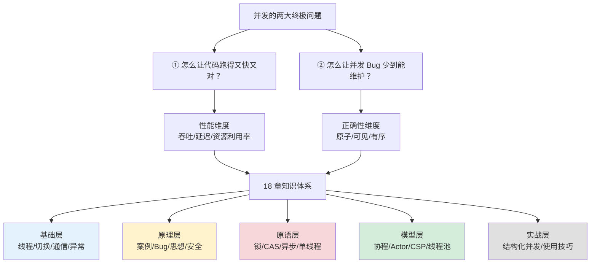
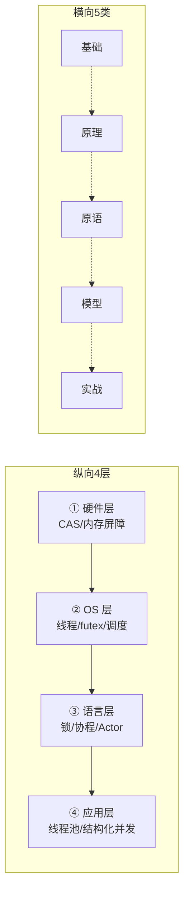
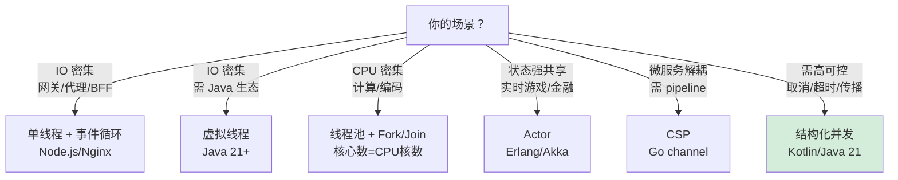
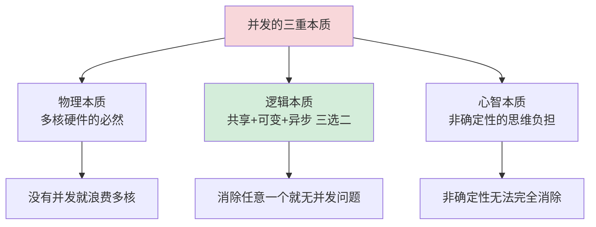

# 19.并发设计总结概览

> 📍 **本篇位置**：第 3 卷 · 并发之道 · 终章总览
> 🎯 **核心矛盾**：**多核性能诱惑 vs 并发复杂性魔咒** —— 18 章长文，一张地图看穿整个并发世界
> 🧭 **设计灵魂**：并发不是"多写点线程"，而是**理解"共享/隔离/协作/同步"四种范式的取舍艺术**
> 🌐 **跨语言覆盖**：Java · C++ · Go · Rust · JavaScript · Python · Erlang · Kotlin · Swift · Dart



---

#### 目录介绍
- [1.并发全景总览](#1并发全景总览)
  - [1.1 知识体系地图](#11-知识体系地图)
  - [1.2 五大层次架构](#12-五大层次架构)
  - [1.3 十八章脉络](#13-十八章脉络)
- [2.基础层四篇](#2基础层四篇)
  - [2.1 线程前世今生](#21-线程前世今生)
  - [2.2 上下文切换](#22-上下文切换)
  - [2.3 线程通信思想](#23-线程通信思想)
  - [2.4 线程异常设计](#24-线程异常设计)
- [3.原理层四篇](#3原理层四篇)
  - [3.1 经典并发案例](#31-经典并发案例)
  - [3.2 并发Bug源头](#32-并发bug源头)
  - [3.3 并发编程思想](#33-并发编程思想)
  - [3.4 安全设计原则](#34-安全设计原则)
- [4.原语层四篇](#4原语层四篇)
  - [4.1 锁设计核心](#41-锁设计核心)
  - [4.2 CAS无锁原语](#42-cas无锁原语)
  - [4.3 异步同步设计](#43-异步同步设计)
  - [4.4 单线程模型](#44-单线程模型)
- [5.模型层四篇](#5模型层四篇)
  - [5.1 协程核心思想](#51-协程核心思想)
  - [5.2 Actor与CSP](#52-actor与csp)
  - [5.3 线程池思想](#53-线程池思想)
  - [5.4 线程池原理](#54-线程池原理)
- [6.实战层两篇](#6实战层两篇)
  - [6.1 使用技巧](#61-使用技巧)
  - [6.2 结构化并发](#62-结构化并发)
- [7.七字真言总结](#7七字真言总结)
  - [7.1 十八章真言汇总](#71-十八章真言汇总)
  - [7.2 跨章融会贯通](#72-跨章融会贯通)
- [8.并发选型决策树](#8并发选型决策树)
  - [8.1 场景 vs 模型](#81-场景-vs-模型)
  - [8.2 语言 vs 范式](#82-语言-vs-范式)
- [9.常见误区总结](#9常见误区总结)
  - [9.1 认知类误区](#91-认知类误区)
  - [9.2 实践类误区](#92-实践类误区)
- [10.终极总结](#10终极总结)
  - [10.1 并发本质回扣](#101-并发本质回扣)
  - [10.2 学习路线建议](#102-学习路线建议)

---

## 1.并发全景总览

### 1.1 知识体系地图

**疑惑**：读了 18 章并发内容，很多人依然会问——"**这些知识之间到底什么关系？为什么要从线程讲到 Actor？中间那么多概念（锁/CAS/协程），是并列还是层次？**"这是所有并发学习者的困境——**知识点是散的，缺一张"总图"把它们连起来**。

**论证**：18 章内容可以抽象成**一个纵向 4 层 + 一个横向 5 类**的立体地图：



**结论**：**理解并发有两条正交轴**：

> **① 纵向轴（依赖）**：底层原理决定上层能力——不懂 CAS 就用不明白无锁数据结构；不懂 futex 就搞不清 synchronized 为什么快。
> **② 横向轴（演化）**：基础 → 原理 → 原语 → 模型 → 实战，是循序渐进的能力进阶。

### 1.2 五大层次架构

| 层次 | 核心问题 | 代表章节 | 关键概念 |
|---|---|---|---|
| **基础层** | 并发的物质基础是什么 | 01-04 | 线程/切换/通信/异常 |
| **原理层** | 并发出错的根源在哪 | 05-08 | 案例/Bug/设计思想/安全 |
| **原语层** | 保证正确性的工具 | 09-12 | 锁/CAS/异步/单线程 |
| **模型层** | 组织并发的模式 | 13-16 | 协程/Actor/CSP/线程池 |
| **实战层** | 落地的工程手法 | 17-18 | 使用技巧/结构化 |

### 1.3 十八章脉络

**十八章的因果链**：

```text
【问】线程贵不贵？——01.线程前世今生
    ├─【问】线程为什么慢？——02.上下文切换
    ├─【问】线程之间怎么说话？——03.线程通信
    └─【问】线程崩了咋办？——04.线程异常
【问】并发到底难在哪？——05.经典案例
    ├─【问】Bug 是怎么产生的？——06.并发Bug源头
    ├─【问】怎么系统化设计？——07.并发编程思想
    └─【问】怎么保证安全？——08.安全设计
【问】怎么互斥？——09.锁核心
    ├─【问】能不能不用锁？——10.CAS
    ├─【问】能不能不阻塞？——11.异步/同步
    └─【问】能不能干脆一个线程？——12.单线程
【问】线程太贵怎么办？——13.协程
    ├─【问】怎么组织协程？——14.Actor/CSP
    ├─【问】怎么复用线程？——15.线程池思想
    └─【问】线程池怎么实现？——16.线程池原理
【问】怎么用好线程池？——17.使用技巧
【问】怎么让并发结构化？——18.结构化并发
```

---

## 2.基础层四篇

### 2.1 线程前世今生

**核心问题**：线程从进程演化而来，为什么这一步这么关键？

**七字真言**：**`轻·快·共·危·抢`** —— 轻量、快切换、共享内存、易死锁、抢占式调度。

**本质**：线程是**CPU 眼里最小的调度单元**——比进程轻 100 倍，比协程重 100 倍。

**核心结论**：
- 线程 = PCB 的裁剪版 = TCB（线程控制块）
- 1:1 / N:1 / M:N 三种模型，主流是 1:1（Linux/Windows）
- 虚拟线程（Java 21 / Go）是"M:N 的现代实现"

### 2.2 上下文切换

**核心问题**：切一次线程到底多贵？为什么"CPU 100% 占用"不等于"性能好"？

**七字真言**：**`保·切·还·冷·抖`** —— 保存现场、切换、还原、缓存冷、TLB 抖动。

**成本量级**：
| 切换类型 | 耗时 | 隐藏代价 |
|---|---|---|
| 用户态切换（协程）| ~10ns | L1 缓存热 |
| 进程内线程切换 | ~1-3μs | L1/L2 部分冷 |
| 跨进程切换 | ~5-10μs | TLB flush + 缓存冷 |

### 2.3 线程通信思想

**核心问题**：线程之间怎么"说话"？

**七字真言**：**`共·信·递·锁·序`** —— 共享内存、信号量、消息传递、锁保护、内存序。

**两大范式**：
- **共享内存 + 锁**（Java / C++）：性能最高，但心智负担最重
- **消息传递**（Go channel / Erlang / Actor）：安全但吞吐略低

### 2.4 线程异常设计

**核心问题**：一个线程挂了，怎么不拖累整个进程？

**七字真言**：**`捕·传·聚·止·续`** —— 捕获、传播、聚合、终止、续命。

**核心手法**：
- Java 的 `UncaughtExceptionHandler`
- Kotlin 的 `SupervisorJob` + 结构化并发
- Erlang 的 supervisor tree（让它崩溃）

---

## 3.原理层四篇

### 3.1 经典并发案例

**四大经典问题的深层教训**：

| 问题 | 表面 | 深层教训 |
|---|---|---|
| **哲学家就餐** | 死锁 | 破除四条件之一 |
| **读者-写者** | 饥饿 | 公平性设计 |
| **睡眠理发师** | 信号量 | 生产者-消费者模式 |
| **生产者-消费者** | 队列 | 解耦速度不匹配 |

### 3.2 并发Bug源头

**并发 Bug 三大原罪**：
1. **原子性违反**：读改写不是一步
2. **可见性违反**：CPU 缓存导致看不到别人的写
3. **有序性违反**：编译器/CPU 重排指令

**七字真言**：**`原·可·序·锁·内`** —— 原子/可见/有序/锁/内存序。

### 3.3 并发编程思想

**三大设计支柱**：**分工 · 同步 · 互斥**

```text
分工：把工作拆给多个执行体（线程/协程/进程）
同步：让执行体之间协调步调（信号量/条件变量/Future）
互斥：让执行体不冲突（锁/无锁/不可变）
```

### 3.4 安全设计原则

**并发安全七大手法**（按代价从低到高）：

| # | 手法 | 代价 | 代表 |
|---|---|---|---|
| 1 | **不可变** | 零 | Java String / Rust immutability |
| 2 | **线程本地（TLS）** | 极低 | ThreadLocal |
| 3 | **读写分离** | 低 | RCU / COW |
| 4 | **CAS 无锁** | 中低 | AtomicXxx |
| 5 | **分段锁** | 中 | ConcurrentHashMap |
| 6 | **互斥锁** | 中高 | synchronized |
| 7 | **重量级锁** | 高 | OS mutex |

---

## 4.原语层四篇

### 4.1 锁设计核心

**七字真言**：**`硬·内·语`** —— 硬件撑（CAS）、内核兜（futex）、语言裹（synchronized）。

**锁演化史 60 年**：Dekker(1960s) → TAS(1980s) → MCS(1990s) → futex(2002) → 偏向锁(2005) → RCU(2015+) → parking_lot(2020+)

### 4.2 CAS无锁原语

**七字真言**：**`比·换·原·序·螺`** —— 比较、交换、原子性、内存序、失败重试（螺旋）。

**CAS 是无锁世界的唯一原语**——所有其他无锁数据结构都是它的组合。

### 4.3 异步同步设计

**七字真言**：**`阻·非·轮·唤·链`** —— 阻塞、非阻塞、轮询、唤醒、链式回调。

**从回调地狱到 async/await**：Callback → Promise → async/await → 协程 → 结构化并发。

### 4.4 单线程模型

**七字真言**：**`一·环·非·任·避`** —— 一个线程、事件循环、非阻塞、任务队列、避锁。

**代表**：Node.js / Redis / Nginx —— **在 IO 密集场景吞吐反超多线程**。

---

## 5.模型层四篇

### 5.1 协程核心思想

**七字真言**：**`轻·让·续·栈·调`** —— 轻量、协作让出、续体（continuation）、栈管理、调度。

**协程 vs 线程**：
| 维度 | 线程 | 协程 |
|---|---|---|
| 内存 | 1MB | 4KB |
| 切换 | μs | ns |
| 数量 | 千 | 百万 |
| 调度 | 抢占 | 协作 |

### 5.2 Actor与CSP

**七字真言**：**`封·邮·收·孤·树`** —— 封装状态、邮箱、串行接收、隔离、监督树。

**两大流派**：
- **Actor**（Erlang/Akka）：主动发消息 + 邮箱
- **CSP**（Go）：channel 是一等公民，进程无名

### 5.3 线程池思想

**七字真言**：**`池·队·拒·核·活`** —— 池化、队列、拒绝策略、核心线程、活跃线程。

**核心动机**：避免"每请求 new Thread"的 μs 级开销。

### 5.4 线程池原理

**ThreadPoolExecutor 状态机**：`RUNNING → SHUTDOWN → STOP → TIDYING → TERMINATED`

**Worker 内部**：每个线程包一层 Worker，实现"复用线程 + 中断可控"。

---

## 6.实战层两篇

### 6.1 使用技巧

**七字真言**：**`型·量·压·观·守`** —— 定型、定量、压测、观测、守住。

**Little's Law**：**线程数 = QPS × 响应时间**

### 6.2 结构化并发

**七字真言**：**`域·树·限·取·聚`** —— 作用域、任务树、生命周期界限、可取消、聚合结果。

**核心承诺**：**并发不再是隐式流出主逻辑的"僵尸线程"**——所有并发任务都有明确的父子关系和生命周期。

---

## 7.七字真言总结

### 7.1 十八章真言汇总

| 章 | 主题 | 七字真言 |
|---|---|---|
| 01 | 线程前世 | `轻·快·共·危·抢` |
| 02 | 上下文切换 | `保·切·还·冷·抖` |
| 03 | 线程通信 | `共·信·递·锁·序` |
| 04 | 线程异常 | `捕·传·聚·止·续` |
| 05 | 经典案例 | `哲·读·睡·产·陷` |
| 06 | Bug 源头 | `原·可·序·锁·内` |
| 07 | 并发思想 | `分·同·互·活·序` |
| 08 | 安全设计 | `不·私·分·CAS·锁` |
| 09 | 锁核心 | `硬·内·语` |
| 10 | CAS | `比·换·原·序·螺` |
| 11 | 异步同步 | `阻·非·轮·唤·链` |
| 12 | 单线程 | `一·环·非·任·避` |
| 13 | 协程 | `轻·让·续·栈·调` |
| 14 | Actor/CSP | `封·邮·收·孤·树` |
| 15 | 线程池思想 | `池·队·拒·核·活` |
| 16 | 线程池原理 | `worker·状·ctl` |
| 17 | 使用技巧 | `型·量·压·观·守` |
| 18 | 结构化并发 | `域·树·限·取·聚` |

### 7.2 跨章融会贯通

**七字真言的三层升华**：

```text
基础层：硬件/OS 决定物理成本
    → `轻·快·共`（线程）
    → `保·切·还`（切换）

原理层：正确性来自三大原罪
    → `原·可·序`（Bug 源头）
    → `分·同·互`（设计思想）

高阶层：从"用锁"到"消灭锁"
    → `不·私·分`（安全设计）
    → `一·环·非`（单线程）
    → `域·树·限`（结构化）
```

---

## 8.并发选型决策树

### 8.1 场景 vs 模型



### 8.2 语言 vs 范式

| 语言 | 最强范式 | 代表用法 |
|---|---|---|
| **Java** | 结构化并发 + 虚拟线程 | `StructuredTaskScope` + Loom |
| **C++** | 无锁 + folly | `std::atomic` + `folly::MPMC` |
| **Go** | CSP | goroutine + channel |
| **Rust** | 所有权 + 消息传递 | `Arc<Mutex<T>>` + `mpsc` |
| **JavaScript** | 单线程 + async/await | Event Loop + Promise |
| **Erlang** | Actor | 进程 + supervisor tree |
| **Python** | 单线程 async | `asyncio` |

---

## 9.常见误区总结

### 9.1 认知类误区

| 误区 | 真相 |
|---|---|
| ❌ "线程越多越快" | ✅ 线程数超过 QPS×耗时 后是负收益（切换开销） |
| ❌ "多线程一定比单线程快" | ✅ IO 密集单线程更快（Redis 100 万 QPS） |
| ❌ "加锁就安全" | ✅ 锁只解决互斥，可见性/有序性也需要 |
| ❌ "CAS 一定比锁快" | ✅ 高争用下 CAS 退化为缓存行弹跳风暴 |
| ❌ "volatile 能替代锁" | ✅ volatile 只保证可见性，不保证原子性 |

### 9.2 实践类误区

| 误区 | 真相 |
|---|---|
| ❌ 用 `Executors.newFixedThreadPool` | ✅ 手写 ThreadPoolExecutor + 有界队列 |
| ❌ `catch (Exception e) {}` 吞异常 | ✅ 至少 log + 上报 |
| ❌ 在锁内做 IO / 耗时操作 | ✅ 锁内只做纯内存操作 |
| ❌ 一个大锁保护多个对象 | ✅ 拆分粒度或用分段锁 |
| ❌ 手写 double-checked locking | ✅ 用 `volatile` + `holder` 模式 |

---

## 10.终极总结

### 10.1 并发本质回扣

**疑惑**：读完 18 章，工程师最终会问——"**并发到底是什么？为什么它这么难？未来会不会有'消灭并发难度'的银弹？**"

**论证**：并发的**三重本质**：



**三条终极选择**：

| 选择 | 消灭什么 | 代表 |
|---|---|---|
| **消灭共享** | 不共享（TLS/消息传递） | Erlang/Actor |
| **消灭可变** | 不可变数据 | Haskell/Rust/函数式 |
| **消灭异步** | 单线程/串行 | Redis/JavaScript |

**结论**：并发的三条铁律：

> **① 本质律：并发难度的根源不是"多线程"，而是"共享 + 可变 + 异步"三者同时存在——消除任一，难度消失。**
> **② 演化律：并发范式一直在演化——从共享内存 → 消息传递 → 结构化，从"手动管理"→"运行时接管"。**
> **③ 落地律：没有银弹，只有取舍——理解场景选对模型，比追求"最新范式"重要百倍。**

### 10.2 学习路线建议

**四阶段学习路线**：

```text
🎯 阶段 1：基础打底（1-4 章）
    ├─ 目标：理解线程/进程/协程物理本质
    └─ 关键：会画上下文切换的时序图

🎯 阶段 2：原理深挖（5-8 章）
    ├─ 目标：理解 Bug 三原罪 + 设计思想
    └─ 关键：能预判代码里的并发风险

🎯 阶段 3：原语精通（9-12 章）
    ├─ 目标：能手写锁/CAS/异步/单线程
    └─ 关键：懂 memory_order 的每个含义

🎯 阶段 4：模型融会（13-18 章）
    ├─ 目标：会为业务场景选对模型
    └─ 关键：懂什么场景该"消灭并发"
```

**一句话终极总结**：

> **并发不是"用多线程"，而是"分工/同步/互斥"三大问题在特定场景下的工程化选择——真正的高手不是熟练用锁的人，而是设计上让锁消失的人——不可变、消息传递、单线程、所有权——每种范式都是"让并发问题不出现"的一种智慧。**

**并发之道，止于此。**

---

## 📎 延伸阅读

- ⬅ [18.结构化并发设计思想](./18.结构化并发设计思想)：并发的最终形态
- 🏠 [程序编程原理](..../04.并发的设计/)：回到本卷目录
- 🎯 [跨语言并发对比](https://yccoding.com/pages/0597c3/)：Java/C++/Go/Rust 全对比
