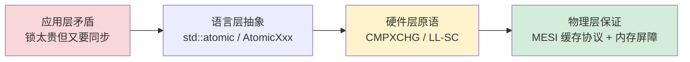
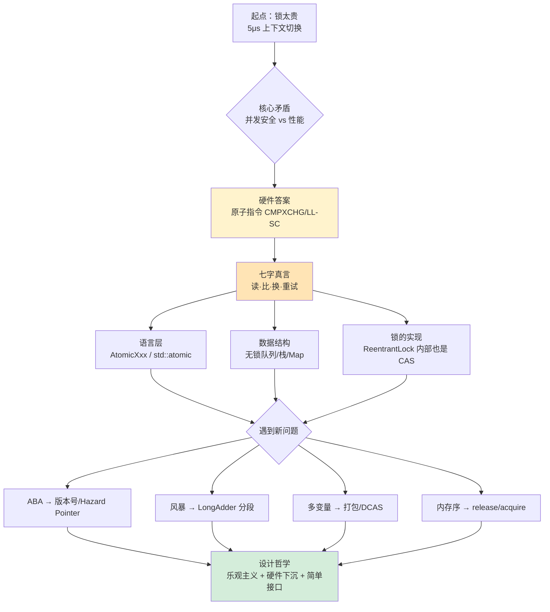

## 1.线程前世今生探索


## 10.理解CAS设计由来

### 10.1 为什么会有它（动机）

**一句话回答**：因为锁太贵了，但又不能没有同步。

```text
时间线：
1965  ─ Dijkstra 的信号量 (semaphore)         ← 第一代同步原语，OS 级
1970s ─ Mutex / Monitor                       ← 进入内核，上下文切换 ~μs
1989  ─ Herlihy 提出 wait-free 理论            ← 数学上证明无锁可行
1990s ─ x86 引入 CMPXCHG，ARM 引入 LDREX/STREX  ← 硬件原子指令
2004  ─ JSR-166 + Doug Lea 的 java.util.concurrent ← CAS 正式进入主流语言
2011  ─ C++11 std::atomic + memory_order      ← 标准化、跨架构
```

**核心矛盾的诞生**：

```text
锁机制的代价（单次抢锁失败可达 5 μs）：
  抢锁失败 → futex 系统调用 → 入内核 → 挂起 → 调度 → 唤醒 → 上下文切换

但 99% 的并发场景实际冲突率 < 5%，却被迫付出 100% 的协调成本
            ↓
   "能不能只在真冲突时才付代价？"
                ↓
            CAS 应运而生
```

### 10.2 遇到的核心矛盾

| # | 矛盾 | 锁的回答 | CAS 的回答 |
|---|---|---|---|
| M1 | **并发安全 vs 性能** | 上锁=安全但慢 | 乐观试，失败重试 |
| M2 | **读改写要原子 vs CPU 只能一步一指令** | OS 调度暂停其他线程 | 硬件提供原子指令 (CMPXCHG/LL-SC) |
| M3 | **要可见性 vs CPU 有缓存** | 锁释放隐含内存屏障 | 原子指令隐含或显式屏障 |
| M4 | **要可预测耗时 vs 锁竞争不可预测** | 锁竞争可被挂起 100ms+ | CAS 单次耗时有硬上限 (~200ns) |
| M5 | **应用要"重试策略" vs 原语要"通用"** | 锁不提供重试 | 把"重试"踢出原语，交给业务定 |

### 10.3 解决思路（三层下沉）



**三个关键下沉**：

1. **把"原子性"下沉到硬件**：用一条 CPU 指令完成"读-比-换"，让 OS 不再参与
2. **把"重试策略"上浮到业务**：原语只给原子点，循环/退避/转锁由业务装配
3. **把"内存可见性"绑定到原子指令**：x86 用 LOCK 隐含屏障，ARM 用 acquire/release 显式标注

### 10.4 核心设计要点

**`读 · 比 · 换 · 重试`** ， 缺一不可，顺序不可换：

```text
┌─────────────────────────────────────────────────────────┐
│ 步骤   │  本质                  │  失败原因             │
├─────────────────────────────────────────────────────────┤
│  读     │ volatile/atomic load   │ 必须可见，不能用普通读 │
│  比     │ 读到的值 = 期望值       │ CPU 只比 bit，不比语义 │
│  换     │ 硬件原子地"比+换"       │ 不可被任何事件打断    │
│  重试   │ 失败回到"读"重来        │ 必须无副作用，否则错乱 │
└─────────────────────────────────────────────────────────┘
```

**四条设计原则的因果链**（§1.3 提炼）：

```text
原子性 (硬件保证)
   ↓
精确性 (位级别比较)
   ↓
透明性 (失败无副作用) ─→ 让"重试"成为可能
   ↓
可预测性 (耗时有上限) ─→ 让"实时调度"成为可能
```

### 10.5 CAS的代价清单

CAS 不是免费午餐，它把"阻塞"换成了"重试 + 缓存争用"，于是出现一组新问题：

| 新问题 | 本质 | 根因 |
|---|---|---|
| **ABA 问题** | CAS 只看值不看历史 | 硬件只能比 bit，不懂"身份语义" |
| **CAS 风暴** | 高争用下大量重试空转 | 缓存行在 CPU 间反复弹跳 |
| **单变量限制** | 一次只能原子操作一个内存位置 | 硬件原语限制 |
| **弱内存模型坑** | ARM/POWER 上读写可能被重排 | RISC 哲学：可重排，需显式屏障 |
| **虚假失败** | LL/SC 架构上 STREX 可能因中断失败 | ARM 的 LL/SC 设计 |
| **伪共享** | 多个原子变量在同一缓存行 → 互相拖累 | 缓存行粒度 ≠ 变量粒度 |
| **回收难题** | C/C++ 中 free 后地址被复用 → ABA | 没有 GC 保护 |

### 14B.6 演变过程（从指令到生态）

```text
1990s  CMPXCHG 一条指令          ← 硬件起点
   ↓
2000s  AtomicInteger / std::atomic ← 语言层封装
   ↓
2004   ConcurrentHashMap / AQS    ← 用 CAS 实现高级并发工具
   ↓
2011   memory_order 标准化         ← C++11 让跨架构成为可能
   ↓
2014   LongAdder 分段累加          ← 解决 CAS 风暴
   ↓
2017   VarHandle 替代 Unsafe       ← 安全的内存序选项
   ↓
2020s  Hazard Pointer / Epoch GC   ← 解决无锁内存回收
   ↓
未来   HTM / 多字 CAS / STM        ← 让"事务"成为硬件原语
```

**演化趋势的两条主线**：

```text
主线一：硬件能力 → 语言抽象 → 业务工具
  CMPXCHG → atomic → ConcurrentHashMap → Disruptor

主线二：单变量 → 多变量 → 事务
  CAS → DCAS/CMPXCHG16B → STM/HTM
```

### 14B.7 一图压扁全篇



### 14B.8 三层认知阶梯（自测）

| 层级 | 表现 | 关键问题能答出来？ |
|---|---|---|
| **初阶** | 知道 `AtomicInteger.incrementAndGet()` | "CAS 是什么？" |
| **中阶** | 理解循环重试、ABA、知道用 LongAdder | "为什么 AtomicLong 在 64 核下反而慢？" |
| **高阶** | 能选 memory_order、处理无锁内存回收 | "为什么 release/acquire 不需要 seq_cst 也能建立 happens-before？" |
| **专家** | 能设计无锁数据结构、推导正确性 | "你这个无锁队列的线性化点 (linearization point) 在哪一行？" |

**从"使用者"跨到"设计者"的分水岭**：**不是会调 CAS 的 API，而是能判断什么时候不该用 CAS**。
