# 31.内存模型技术设计

> 📍 **本篇位置**：第 4 卷 · 内存与资源 · 第 1 篇（开卷扛鼎之作）
> 🎯 **核心矛盾**：**程序员的顺序模型 vs 硬件的乱序现实** —— 内存模型是语言给程序员的"安全保证契约"
> 🧭 **设计灵魂**：内存模型 = **happens-before 关系图**；它规定"哪些读能看到哪些写"，是所有并发正确性的最底层依据
> 🌐 **跨语言覆盖**：Java(JMM / volatile / final / synchronized 的 happens-before) · C++11(memory_order 六档最精细) · Go(happens-before + channel) · Rust(沿用 C++11 六档) · JavaScript(Atomics + SharedArrayBuffer)
> 🔗 **延伸阅读**：← [15.并发编程设计思想](https://yccoding.com/pages/0597c3/) · ← [16.并发Bug源头由来](https://yccoding.com/pages/57fd8a/) · → [32.堆和栈内存的设计](https://yccoding.com/pages/1f9524/) · → [33.内存回收机制设计](https://yccoding.com/pages/8327cf/)

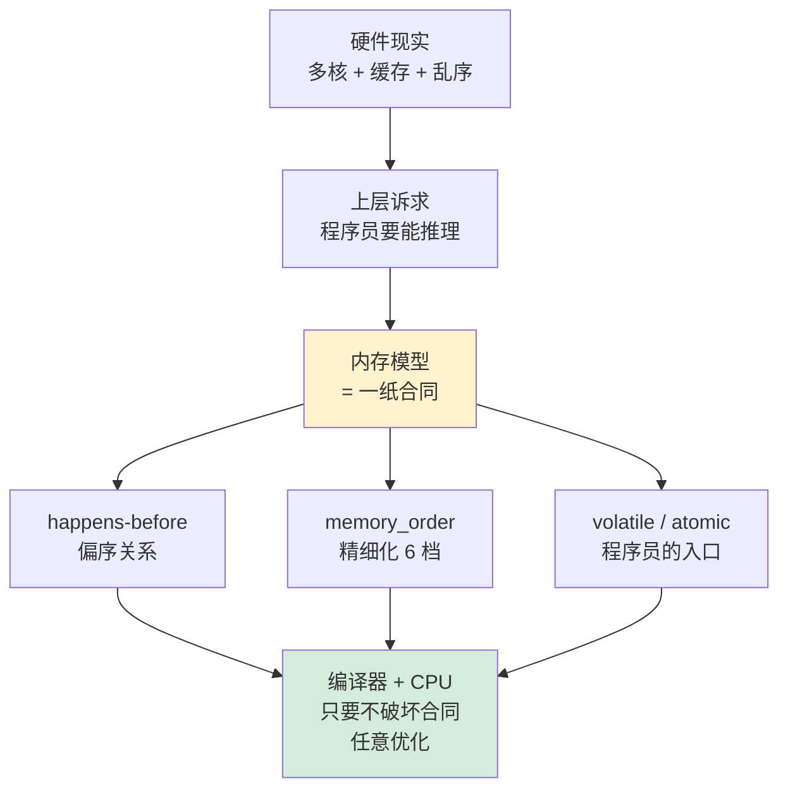
```mermaid
flowchart TB
    A[硬件现实<br/>多核 + 缓存 + 乱序] --> B[上层诉求<br/>程序员要能推理]
    B --> C[内存模型<br/>= 一纸合同]
    C --> D1[happens-before<br/>偏序关系]
    C --> D2[memory_order<br/>精细化 6 档]
    C --> D3[volatile / atomic<br/>程序员的入口]
    D1 & D2 & D3 --> E[编译器 + CPU<br/>只要不破坏合同<br/>任意优化]
    style C fill:#fff3cd
    style E fill:#d4edda
```

---

#### 目录介绍
- [00.诡异幽灵NPE](#00诡异幽灵npe)
  - [0.1 凌晨告警现场](#01-凌晨告警现场)
  - [0.2 团队的五个错误猜测](#02-团队的五个错误猜测)
  - [0.3 真相是重排](#03-真相是重排)
  - [0.4 内存模型是啥](#04-内存模型是啥)
  - [0.5 五个递进追问](#05-五个递进追问)
  - [0.6 五语言重演](#06-五语言重演)
- [01.内存模型由来](#01内存模型由来)
  - [1.1 内存模型根源](#11-内存模型根源)
  - [1.2 演进历史](#12-演进历史)
  - [1.3 解决核心问题](#13-解决核心问题)
  - [1.4 无内存模型](#14-无内存模型)
- [02.内存模型概念](#02内存模型概念)
  - [2.1 内存模型架构](#21-内存模型架构)
  - [2.2 各语言设计](#22-各语言设计)
  - [2.3 私有和共享](#23-私有和共享)
  - [2.4 内存模型结构](#24-内存模型结构)
- [03.私有内存](#03私有内存)
  - [3.1 程序计数器](#31-程序计数器)
  - [3.2 虚拟机栈](#32-虚拟机栈)
  - [3.3 本地方法栈](#33-本地方法栈)
- [04.线程共享内存](#04线程共享内存)
  - [4.1 堆内存](#41-堆内存)
  - [4.2 方法区](#42-方法区)
  - [4.3 运行时常量池](#43-运行时常量池)
  - [4.4 直接内存](#44-直接内存)
- [05.Java布局案例](#05java布局案例)
  - [5.1 完整内存案例](#51-完整内存案例)
  - [5.2 案例内存分布](#52-案例内存分布)
  - [5.3 内存链路](#53-内存链路)
  - [5.4 内存生命周期](#54-内存生命周期)
- [06.跨平台内存模型](#06跨平台内存模型)
  - [6.1 Java平台](#61-java平台)
  - [6.2 C++平台](#62-c平台)
  - [6.3 JS平台](#63-js平台)
  - [6.4 Go平台](#64-go平台)
  - [6.5 Rust平台](#65-rust平台)
  - [6.6 内存模型对比表](#66-内存模型对比表)
  - [6.7 API入口速查](#67-api入口速查)
- [07.并发内存模型核心](#07并发内存模型核心)
  - [7.1 先行发生偏序](#71-先行发生偏序)
  - [7.2 易变量语义](#72-易变量语义)
  - [7.3 final语义](#73-final语义)
  - [7.4 C++内存序六档](#74-c内存序六档)
  - [7.5 跨语言并发对照](#75-跨语言并发对照)
- [08.经典陷阱与反模式](#08经典陷阱与反模式)
  - [8.1 OOM 五大类型](#81-oom-五大类型)
  - [8.2 内存泄漏三大场景](#82-内存泄漏三大场景)
  - [8.3 误区 双重检查锁](#83-误区-双重检查锁)
  - [8.4 TLS不清理](#84-tls不清理)
- [09.综合案例串讲](#09综合案例串讲)
  - [9.1 现场重建MRE](#91-现场重建mre)
  - [9.2 阶段一堆布局](#92-阶段一堆布局)
  - [9.3 阶段二缺漏边](#93-阶段二缺漏边)
  - [9.4 阶段三稳定复现](#94-阶段三稳定复现)
  - [9.5 阶段四字节码](#95-阶段四字节码)
  - [9.6 阶段五五语言](#96-阶段五五语言)
  - [9.7 阶段六可观测](#97-阶段六可观测)
  - [9.8 知识点回归映射](#98-知识点回归映射)
  - [9.9 一句话提炼](#99-一句话提炼)
- [10.一句话总结](#10一句话总结)
  - [10.1 双层契约总览](#101-双层契约总览)
  - [10.2 哲学横向对照](#102-哲学横向对照)
  - [10.3 与本卷连贯](#103-与本卷连贯)
  - [10.4 生产级决策树](#104-生产级决策树)
  - [10.5 七字真言映射](#105-七字真言映射)
  - [10.6 延伸阅读](#106-延伸阅读)


## 00.诡异幽灵NPE

### 0.1 凌晨告警现场

某金融业务上线了一个看似纯粹的优化：把订单状态查询从加锁改成了"读取一个不可变对象"。代码极简：

```java
public class OrderConfig {
    private static OrderConfig INSTANCE;        // ① 注意：没加 volatile
    private final Map<String, String> rules;    // ② final 修饰，应当线程安全
    private final long version;

    private OrderConfig() {
        this.rules = loadRulesFromDB();         // ③ 加载规则
        this.version = System.currentTimeMillis();
    }

    public static OrderConfig get() {
        if (INSTANCE == null) {                 // ④ 经典 DCL
            synchronized (OrderConfig.class) {
                if (INSTANCE == null) INSTANCE = new OrderConfig();
            }
        }
        return INSTANCE;
    }
}
```

上线第二天凌晨告警炸响：监控里有 **0.003%** 的请求抛出 `NullPointerException`，错误堆栈指向 `INSTANCE.rules.get(orderId)` —— **一个 final 字段读出来是 null**。

### 0.2 团队的五个错误猜测

```
猜测 1：是不是数据库返回了 null？
  → 加日志，确认 loadRulesFromDB() 永不返回 null。✗

猜测 2：是不是 GC 把 INSTANCE 回收了？
  → static 字段是 GC Root，不可能回收。✗

猜测 3：是不是构造函数里抛了异常？
  → 构造函数完整执行无异常，否则 INSTANCE 应当还是 null。✗

猜测 4：是不是某个反射把 rules 设成了 null？
  → 全代码搜索，没有 setAccessible 调用。✗

猜测 5：是不是 JVM 内存模型的 bug？
  → ……✓✓✓
```

### 0.3 真相是重排

JVM 在执行 `INSTANCE = new OrderConfig()` 这一行时，**实际拆成 3 步指令**：

```
A：分配内存
B：调用构造函数（rules、version 字段写入）
C：将引用赋值给 INSTANCE
```

**程序员以为的执行顺序**：A → B → C（INSTANCE 非 null 时，rules 一定已写完）

**JVM/CPU 实际可以执行的顺序**：A → C → B（先把引用发布出去，再去写字段）

```
线程 T1（写）                线程 T2（读）
A: 分配内存                  ─
C: INSTANCE = ref            ← T2 看到 INSTANCE 不为 null
                             return INSTANCE.rules.get(...)
B: 写 rules / version        ← T2 已经走到 NPE
```

**为什么 final 救不了**：final 的"安全发布"语义只在**构造函数完整结束并且引用通过 final 字段发布**时才生效；这里 `INSTANCE` 是 static 引用、不是 final，T2 看到的是"半构造对象"。

**修复方案（三选一）**：

```java
// 方案 A：加 volatile（最常规）
private static volatile OrderConfig INSTANCE;

// 方案 B：用 final 类持有（利用 final 语义）
private static final OrderConfig INSTANCE = new OrderConfig();

// 方案 C：Holder 模式（利用类初始化锁）
private static class Holder { static final OrderConfig I = new OrderConfig(); }
public static OrderConfig get() { return Holder.I; }
```

### 0.4 内存模型是啥

```mermaid
flowchart TB
    Q1[程序员看到的代码] -->|顺序的、整数倍的| M1[A→B→C]
    Q2[CPU实际执行的指令] -->|乱序的、流水线的| M2[A→C→B 也可能]
    Q3[多核共享内存] -->|缓存一致性、可见性延迟| M3[T2 看到的可能是部分更新]
    M1 --> CONTRACT[内存模型 = 一份"合同"]
    M2 --> CONTRACT
    M3 --> CONTRACT
    CONTRACT --> R1[规定：哪些读必须能看到哪些写]
    CONTRACT --> R2[规定：哪些重排序允许、哪些禁止]
    CONTRACT --> R3[给程序员的入口：volatile / atomic / memory_order]
    style CONTRACT fill:#fff3cd
```

**内存模型不是"存储位置规划"那么简单**。它有两层含义：

| 层次 | 关注点 | 典型概念 |
|---|---|---|
| **运行时内存区域** | 数据放在哪？生命周期？ | 栈/堆/方法区/常量池/直接内存 |
| **并发内存模型** | 多线程读写的可见性与顺序 | happens-before / volatile / memory_order |

**§01-§05 主要讲第一层（数据布局），§07 集中讲第二层（并发语义），§06 横向对比，§08 列经典陷阱，§09 把 §00 事故端到端串讲一遍**。请带着 §0.1 这个 NPE 的问题往下读，所有抽象概念都会在 §07 / §09 重新落到这个具体事故上。

### 0.5 五个递进追问

| 追问 | 答案章节 |
|---|---|
| 为什么数据要分区存？不能一锅端？ | §01 / §02 |
| 栈、堆、方法区各自承担什么不可替代的角色？ | §03 / §04 |
| 一个对象的诞生，到底走了哪些内存通道？ | §05 |
| 不同语言为什么对内存模型分歧这么大？ | §06 |
| 多线程读写，凭什么 volatile 就能修好？ | §07 |
| 我代码里"看起来没问题"的写法，会不会暗藏 §0 那种幽灵？ | §08 |
| §0 这个事故的端到端排查、修复、可观测兜底完整链路？ | §09 |

带着这些问题，开始进入正题。

### 0.6 五语言重演

很多读者看到 §0.1 的 DCL+NPE，会下意识认为 **"这是 JVM 内存模型设计不严的历史包袱"**。但事实是——**只要硬件是多核 + 编译器允许重排序，所有语言都会上演同一个事故**。下面用一个"全局配置首次初始化"骨架，把同一事故在五种语言里平铺：

```
共同骨架：判空 → 加锁 → 再判空 → 构造 → 发布
共同根因：构造（写字段） 与 发布（写引用） 这两步在硬件层"不是原子序列"
共同结果：另一个线程看到"引用非空 + 字段未写"——半构造对象
```

| 语言 | 错误现象（伪代码） | 默认重排序是否会触发 | 修复手段（最小语义） |
|---|---|---|---|
| **Java** | `static OrderConfig INSTANCE`（无 `volatile`） + DCL | ✓（JMM 允许，§0.1 即是） | `volatile` / `final`/ Holder 模式 |
| **C++11** | `static OrderConfig* p = nullptr;` + DCL，写入用 `memory_order_relaxed` | ✓（更激进，编译器和 CPU 双重重排） | `std::atomic<T*>` + `acquire/release`，或 `std::call_once` |
| **Go** | `var cfg *OrderConfig`，多 goroutine 检查 nil 后并发初始化 | ✓（Go Memory Model 允许，1.19 起明确禁止) | `sync.Once.Do(...)`（最规范）或 `atomic.Pointer[T]` |
| **Rust** | 实际上**编译不通过**：跨线程共享可变静态变量需要 `Sync` trait | ✗（被编译器拦死） | `OnceCell` / `Lazy<T>` / `OnceLock<T>` |
| **JavaScript** | 单 Tab 单线程，**无此事故**；Worker + SharedArrayBuffer 才可能复现 | ✗（事件循环串行化保证） | `Atomics` + `SharedArrayBuffer`；普通对象不可跨 Worker 共享 |

**这张表的价值不在于让你记住 5 种 API，而在于看到一个深层规律**：

```
有共享可变状态 + 有指令重排序 → 一定会有 DCL 类事故
解决路径只有三条：
  ① 加内存屏障（Java volatile / C++ memory_order）
  ② 用一次性同步原语包装（Go sync.Once / Rust OnceLock）
  ③ 从语言根上消除（Rust 编译期 + JS 单线程）
```

**全章贯穿设定**：后文凡是出现 happens-before、acquire/release、memory_order 这些抽象概念，都是在为这张表的 "①" 路径补术语。如果你只关心 "②" 或 "③"，可以直接跳读 §6/§7 的对应小节。

---

## 01.内存模型由来

### 1.1 内存模型根源

一切源于冯·诺依曼架构的核心思想：**程序和数据统一存储在内存中**。

```
┌─────────┐     ┌─────────┐     ┌─────────┐
│  CPU    │◄───►│  内存    │◄───►│  I/O    │
│(运算器) │     │(存储器)  │     │(输入输出)│
│(控制器) │     │         │     │         │
└─────────┘     └─────────┘     └─────────┘
```

但原始的"一块平坦内存"无法满足实际需求：

- **代码**需要存储在某个区域
- **函数调用**需要保存返回地址、局部变量
- **动态创建的对象**需要一个可伸缩的空间
- **多线程**需要隔离各自的执行上下文

于是操作系统和语言运行时将这块平坦内存**划分为功能不同的区域**，这就是运行时内存模型的起源。

**从操作系统进程内存布局到语言运行时**，操作系统层面（以 Linux 为例）：

```
高地址 ─────────────────────────
        │     内核空间          │  ← 用户态不可访问
        ├──────────────────────┤  0xC0000000 (32位)
        │     栈 (Stack)       │  ↓ 向低地址增长
        │        ↓             │
        │     ...空闲...        │
        │        ↑             │
        │     堆 (Heap)        │  ↑ 向高地址增长
        ├──────────────────────┤
        │     BSS段            │  ← 未初始化的全局/静态变量
        ├──────────────────────┤
        │     数据段 (Data)     │  ← 已初始化的全局/静态变量
        ├──────────────────────┤
        │     代码段 (Text)     │  ← 可执行指令（只读）
低地址 ─────────────────────────  0x00000000
```

**语言运行时在此基础上进一步细分**。每种语言根据自身特性（GC、类型系统、执行方式），在操作系统提供的进程地址空间上构建了更精细的内存区域划分。

### 1.2 演进历史

各语言内存模型的演进

```
时间线：
1972  C语言    → 栈 + 堆 + 数据段 + 代码段（贴近OS原生布局）
1983  C++     → 在C基础上增加虚函数表、RTTI区域
1995  Java    → JVM 完全抽象化：堆、方法区、虚拟机栈、PC等
1995  JS      → 单线程简化模型：调用栈 + 堆 + 任务队列
2010  Go      → 协程栈（动态增长）+ GC堆 + 逃逸分析
```

### 1.3 解决核心问题

核心：不同生命周期、不同访问模式的数据需要不同的存储策略

| 数据特征 | 需要的存储特性 | 对应的内存区域 |
|---------|-------------|-------------|
| 执行指令（代码） | 只读、共享、常驻 | 代码段 / 方法区 |
| 函数局部变量 | 随函数调用创建、返回销毁 | 栈 |
| 动态创建的对象 | 生命周期不确定、大小不固定 | 堆 |
| 类信息、常量 | 全局共享、生命周期长 | 方法区 / 常量池 |
| 线程执行位置 | 每线程独立、频繁更新 | 程序计数器 |
| Native 方法调用 | JNI / 系统调用的栈帧 | 本地方法栈 |
| 大块直接 I/O 缓冲 | 绕过GC、零拷贝 | 直接内存 |


**（1）生命周期管理**

```
栈：自动管理，函数返回即回收（O(1) 分配和释放）
堆：需要 GC 或手动 free（分配和回收都是复杂操作）

为什么不把所有数据都放栈上？
→ 栈大小固定（通常1-8MB），无法存储大对象
→ 栈帧随函数返回销毁，无法持有跨函数生命周期的对象
→ 栈不支持动态大小的数据结构
```

**（2）线程安全隔离**

```
私有区域（栈、PC、本地方法栈）：天然线程安全，无需同步
共享区域（堆、方法区）：需要同步机制保护

设计原则：尽可能让数据私有，减少共享
```

**（3）性能优化**

```
栈分配：移动栈指针即可，极快（1条指令）
堆分配：需要搜索空闲块、处理碎片、可能触发GC（数百条指令）
直接内存：绕过JVM堆，避免GC和数据拷贝
```

**（4）内存效率**

```
常量池：字符串去重，"hello" 只存一份
方法区：类信息只加载一次，所有实例共享
栈：固定大小，不存在碎片问题
```

**（5）安全边界**

```
代码段只读 → 防止代码被篡改
栈溢出检测 → StackOverflowError
堆上限控制 → OutOfMemoryError
权限隔离 → 不同类加载器的方法区隔离
```

### 1.4 无内存模型

如果没有内存模型会怎么样？思考一下

**场景一：所有数据都在一块平坦内存中**

```
地址0: [代码指令] [局部变量a] [对象X] [字符串常量] [局部变量b] [对象Y] ...

问题：
1. 函数返回后，局部变量散落在内存各处 → 无法高效回收
2. 多线程访问 → 局部变量也需要加锁（本不需要）
3. 代码和数据混在一起 → 安全漏洞（缓冲区溢出攻击可修改代码）
4. 无法区分哪些该GC、哪些不该GC
```

**场景二：假设没有栈的概念会怎么样**

```c
// 递归函数：每次调用需要保存自己的局部变量和返回地址
int factorial(int n) {
    if (n <= 1) return 1;
    return n * factorial(n - 1);
}

// 没有栈 → 局部变量存在哪？
// 方案1: 全局变量 → 递归调用覆盖上一层的n → 错误
// 方案2: 手动在堆上分配 → 每次调用都要malloc/free → 极慢
// 栈的设计：自动、嵌套、后进先出 → 完美匹配函数调用语义
```

场景三：假设没有堆的概念会怎么样

```c
// 创建一个链表节点，需要在函数返回后继续存活
Node* create_node(int val) {
    Node n;        // 栈上分配
    n.val = val;
    return &n;     // 函数返回后栈帧销毁 → 悬空指针！
}

// 没有堆 → 无法创建生命周期超出函数的对象
// 所有对象都得是全局的 → 数量受限，不灵活
```

场景四：假设没有方法区 / 常量池会怎么样

```java
// 10000个String对象都包含 "hello"
for (int i = 0; i < 10000; i++) {
    String s = "hello";  // 没有常量池 → 每次创建新的字符串对象
}

// 没有常量池：10000 份 "hello" 副本，浪费 ~50KB
// 有常量池：  1份 "hello"，10000个引用指向同一份，节约 99.99%
```

## 02.内存模型概念

### 2.1 内存模型架构

设计哲学：按生命周期和访问模式分治

```
                    ┌───────────────────────────────┐
                    │        运行时内存区域           │
                    └───────────┬───────────────────┘
                                │
              ┌─────────────────┼─────────────────┐
              ▼                 ▼                 ▼
        ┌───────────┐   ┌───────────┐    ┌──────────────┐
        │ 线程私有   │   │ 线程共享   │    │ JVM外部内存   │
        │           │   │           │    │              │
        │ - PC      │   │ - 堆      │    │ - 直接内存    │
        │ - 虚拟机栈 │   │ - 方法区  │    │ (NIO Buffer) │
        │ - 本地方法栈│   │ - 常量池  │    │              │
        └───────────┘   └───────────┘    └──────────────┘
        
        生命周期：      生命周期：        生命周期：
        随线程          随JVM进程         手动/Cleaner
        
        分配速度：      分配速度：        分配速度：
        极快(移栈指针)   较慢(GC管理)      中等(OS调用)
        
        线程安全：      线程安全：        线程安全：
        天然安全        需要同步          需要同步
```

### 2.2 各语言设计

内存模型的整体设计，各语言的设计对比

**C/C++（贴近OS原生）**

```
┌─────────────────────────────────┐
│          C/C++ 内存布局          │
├────────┬────────────────────────┤
│ 代码段  │ 编译后的机器指令（只读）  │
├────────┼────────────────────────┤
│ 数据段  │ 已初始化的全局/静态变量   │
├────────┼────────────────────────┤
│ BSS段  │ 未初始化的全局/静态变量   │
├────────┼────────────────────────┤
│ 堆     │ malloc/new 手动管理     │
├────────┼────────────────────────┤
│ 栈     │ 局部变量、函数调用帧     │
└────────┴────────────────────────┘

特点：
- 没有GC，程序员完全控制堆内存
- 没有方法区，虚函数表在数据段
- 没有常量池抽象，字符串字面量在只读数据段(.rodata)
- 栈大小编译期/链接期确定
```

**Java（JVM 全面抽象）**

```
┌─────────────────────────────────┐
│         JVM 内存区域             │
├────────┬────────────────────────┤
│ PC     │ 当前执行的字节码地址     │
├────────┼────────────────────────┤
│ 虚拟机栈│ 栈帧(局部变量表+操作数栈+│
│        │ 动态链接+返回地址)       │
├────────┼────────────────────────┤
│ 本地方法栈│ JNI 调用的 native 栈  │
├────────┼────────────────────────┤
│ 堆     │ 所有对象实例+数组(GC管理)│
├────────┼────────────────────────┤
│ 方法区  │ 类信息+常量池+静态变量   │
│(元空间) │ +JIT编译代码            │
├────────┼────────────────────────┤
│ 直接内存│ NIO DirectByteBuffer   │
└────────┴────────────────────────┘
```

**JavaScript（V8引擎）**

```
┌─────────────────────────────────┐
│         V8 内存布局              │
├────────┬────────────────────────┤
│ 调用栈  │ 执行上下文、基本类型值   │
├────────┼────────────────────────┤
│ 堆     │ 对象、闭包、函数        │
│ ├ 新生代│ 短生命周期对象(Scavenge)│
│ ├ 老生代│ 长生命周期对象(Mark-Sweep│
│ │      │ /Mark-Compact)         │
│ └ 大对象│ >kMaxRegularHeapObject │
├────────┼────────────────────────┤
│ 任务队列│ 宏任务+微任务(事件循环)  │
└────────┴────────────────────────┘

特点：
- 单线程，无线程私有/共享的区分（Worker除外）
- 闭包导致变量"逃逸"到堆上
- 隐藏类（Hidden Class）类似方法区的类信息
```

### 2.3 私有和共享

线程私有和共享有什么区别，如下所示：

| 特性 | 线程私有内存 | 线程共享内存 |
|------|-------------|-------------|
| **访问权限** | 仅当前线程可访问 | 所有线程都可访问 |
| **生命周期** | 与线程同生共死 | 与进程同生共死 |
| **数据安全** | 天然线程安全 | 需要同步机制 |
| **性能** | 访问速度快 | 可能存在竞争 |
| **内存大小** | 相对较小 | 相对较大 |
| **典型用途** | 方法调用、局部变量 | 对象实例、类信息 |

### 2.4 内存模型结构

内存模型结构（以 JVM 为核心深入），JVM 运行时数据区全景

```
┌─────────────────────────────────────────────────────────────┐
│                        JVM 进程                              │
│                                                              │
│  ┌─── 线程私有 ──────────────────────────────────────────┐   │
│  │                                                       │   │
│  │  Thread-1          Thread-2          Thread-N         │   │
│  │  ┌──────────┐      ┌──────────┐      ┌──────────┐   │   │
│  │  │ PC: 0x3A │      │ PC: 0x7F │      │ PC: 0x12 │   │   │
│  │  ├──────────┤      ├──────────┤      ├──────────┤   │   │
│  │  │ VM Stack │      │ VM Stack │      │ VM Stack │   │   │
│  │  │ ┌──────┐ │      │ ┌──────┐ │      │ ┌──────┐ │   │   │
│  │  │ │Frame3│ │      │ │Frame1│ │      │ │Frame2│ │   │   │
│  │  │ │Frame2│ │      │ │      │ │      │ │Frame1│ │   │   │
│  │  │ │Frame1│ │      │ └──────┘ │      │ └──────┘ │   │   │
│  │  │ └──────┘ │      │          │      │          │   │   │
│  │  ├──────────┤      ├──────────┤      ├──────────┤   │   │
│  │  │Native Stk│      │Native Stk│      │Native Stk│   │   │
│  │  └──────────┘      └──────────┘      └──────────┘   │   │
│  │                                                       │   │
│  └───────────────────────────────────────────────────────┘   │
│                                                              │
│  ┌─── 线程共享 ──────────────────────────────────────────┐   │
│  │                                                       │   │
│  │  ┌─────────────────────────────────────────────────┐ │   │
│  │  │                    堆 (Heap)                     │ │   │
│  │  │                                                  │ │   │
│  │  │  ┌──────────────┐  ┌───────────────────────────┐│ │   │
│  │  │  │   年轻代      │  │         老年代             ││ │   │
│  │  │  │ ┌────┬───┬───┐│  │                           ││ │   │
│  │  │  │ │Eden│S0 │S1 ││  │  长生命周期对象/大对象     ││ │   │
│  │  │  │ └────┴───┴───┘│  │                           ││ │   │
│  │  │  └──────────────┘  └───────────────────────────┘│ │   │
│  │  └─────────────────────────────────────────────────┘ │   │
│  │                                                       │   │
│  │  ┌─────────────────────────────────────────────────┐ │   │
│  │  │              方法区 / 元空间 (Metaspace)          │ │   │
│  │  │  类信息 | 运行时常量池 | 静态变量 | JIT代码缓存    │ │   │
│  │  └─────────────────────────────────────────────────┘ │   │
│  │                                                       │   │
│  └───────────────────────────────────────────────────────┘   │
│                                                              │
│  ┌─── JVM 外部 ──────────────────────────────────────────┐   │
│  │  直接内存 (Direct Memory)                              │   │
│  │  由 OS 管理，NIO 零拷贝，不受 GC 直接管理               │   │
│  └───────────────────────────────────────────────────────┘   │
│                                                              │
└──────────────────────────────────────────────────────────────┘
```

每个区域的容量与溢出

| 区域 | 默认大小 | JVM参数 | 溢出异常 |
|------|---------|---------|---------|
| 虚拟机栈 | 512K-1M | `-Xss` | StackOverflowError |
| 堆 | 物理内存1/4 | `-Xms` `-Xmx` | OutOfMemoryError: Java heap space |
| 方法区 | 无上限(本地内存) | `-XX:MaxMetaspaceSize` | OutOfMemoryError: Metaspace |
| 直接内存 | 与-Xmx相同 | `-XX:MaxDirectMemorySize` | OutOfMemoryError: Direct buffer memory |
| PC | 很小(字长) | 不可配 | 不会溢出 |


## 03.私有内存

### 3.1 程序计数器

**程序计数器 本质**：当前线程所执行的字节码指令的地址。

**为何设计私有**：虚拟机的多线程就是通过线程轮流切换并分配处理器时间来实现的，为了线程切换后能恢复到正确的位置，每条线程都需要一个独立的程序计数器，互不影响，该区域为“线程私有”。

**生命周期**：随着线程的创建而创建，随着线程的结束而销毁。

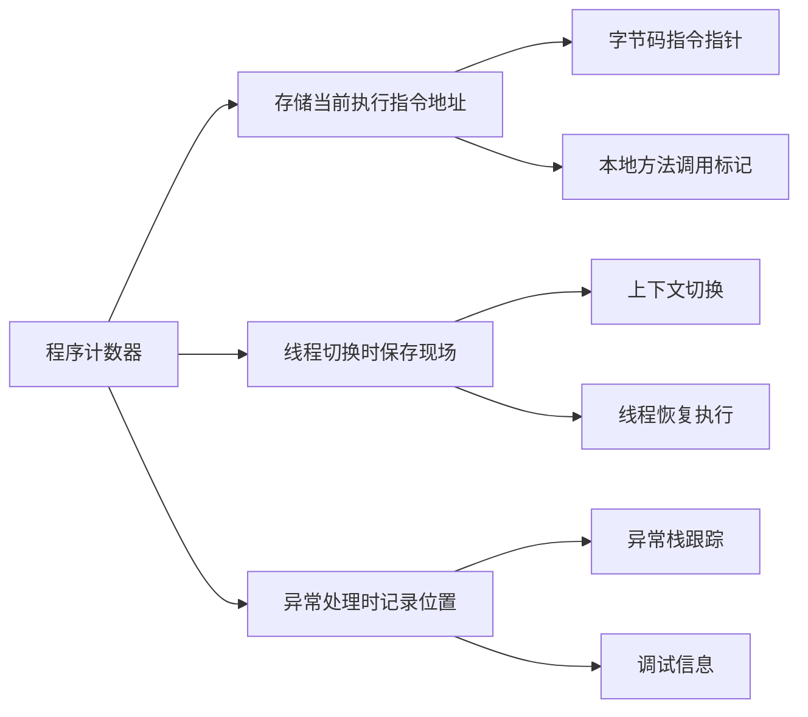
```mermaid
graph LR
    A[程序计数器] --> B[存储当前执行指令地址]
    A --> C[线程切换时保存现场]
    A --> D[异常处理时记录位置]
    
    B --> B1[字节码指令指针]
    B --> B2[本地方法调用标记]
    
    C --> C1[上下文切换]
    C --> C2[线程恢复执行]
    
    D --> D1[异常栈跟踪]
    D --> D2[调试信息]
```

程序计数器是一块较小的内存空间。可以看作是当前线程所执行的字节码的行号指示器。**字节码解释器工作时通过改变这个计数器的值来选取下一条需要执行的字节码指令，分支、循环、跳转、异常处理、线程恢复等功能都需要依赖这个计数器来完。**

为什么每个线程需要独立的程序计数器？

```
CPU时间片轮转：
时刻T1: Thread-1 执行到 method_a 第15条指令 → PC=15
时刻T2: 切换到 Thread-2 执行 method_b 第3条指令  → PC=3
时刻T3: 切回 Thread-1 → 从哪里继续？→ 从 PC=15 继续

如果PC是共享的：
时刻T3: PC=3（被Thread-2覆盖了）→ Thread-1 从错误位置执行 → 崩溃
```

底层实现：

```
// HotSpot VM 中的实现（简化）
class JavaThread {
    address _anchor_pc;           // 当前字节码地址
    // 执行Java方法时：指向字节码偏移量
    // 执行native方法时：为 undefined（不可用）
};

// 为什么native方法时PC无意义？
// 因为native方法由本地CPU直接执行，用的是硬件PC寄存器
// JVM的逻辑PC只追踪字节码执行位置
```

程序计数器实际场景案例

```java
// Java 示例：程序计数器的作用
public class PCExample {
    public static void main(String[] args) {
        int a = 1;           // PC指向这条指令
        int b = 2;           // PC移动到这条指令
        int c = add(a, b);   // PC指向方法调用指令
        System.out.println(c); // PC指向输出指令
    }
    
    public static int add(int x, int y) {
        return x + y;        // PC在方法内部移动
    }
}
```

然后看一下时序图如下所示：

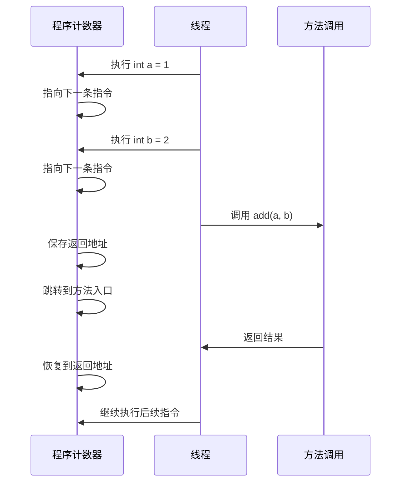
```mermaid
sequenceDiagram
    participant PC as 程序计数器
    participant Thread as 线程
    participant Method as 方法调用
    
    Thread->>PC: 执行 int a = 1
    PC->>PC: 指向下一条指令
    
    Thread->>PC: 执行 int b = 2
    PC->>PC: 指向下一条指令
    
    Thread->>Method: 调用 add(a, b)
    PC->>PC: 保存返回地址
    PC->>PC: 跳转到方法入口
    
    Method->>Thread: 返回结果
    PC->>PC: 恢复到返回地址
    
    Thread->>PC: 继续执行后续指令
```

程序计数器主要有两个作用：

- 1.字节码解释器通过改变程序计数器来依次读取指令，从而实现代码的流程控制。如：顺序执行、选择、循环、异常处理。
- 2.在多线程的情况下，程序计数器用于记录当前线程执行的位置，从而当线程被切换回来的时候能够知道该线程上次运行到哪儿。

程序计数器会OOM吗。**注意：程序计数器是唯一一个不会出现OutOfMemoryError的内存区域，它的生命周期随着线程的创建而创建，随着线程的结束而死亡。**

### 3.2 虚拟机栈

**本质**：方法调用的执行模型。每个方法调用创建一个栈帧，用于存放该方法运行过程中的一些信息。

**虚拟机栈是由一个个栈帧组成**，而每个栈帧中都拥有：局部变量表、操作数栈、动态链接、方法出口信息。

**局部变量表**：放着基本数据类型(8种基本类型)，还有对象的引用（reference类型，它不同于对象本身，可能是一个指向对象起始地址的引用指针，也可能是指向一个代表对象的句柄或其他与此对象相关的位置）。

```
栈帧（Stack Frame）的内部结构：

┌─────────────────────────────────────┐  ← 栈顶（当前方法）
│            栈帧 Frame               │
│  ┌────────────────────────────────┐ │
│  │   局部变量表                    │ │
│  │   (Local Variable Table)       │ │
│  │   ┌────┬────┬────┬────┬────┐  │ │
│  │   │ 0  │ 1  │ 2  │ 3  │ 4 │  │ │
│  │   │this│arg1│arg2│var1│var2│  │ │
│  │   └────┴────┴────┴────┴────┘  │ │
│  │   Slot大小：32位(int/float/ref)│ │
│  │   long/double 占2个Slot        │ │
│  └────────────────────────────────┘ │
│  ┌────────────────────────────────┐ │
│  │   操作数栈                      │ │
│  │   (Operand Stack)              │ │
│  │   ┌────┐                       │ │
│  │   │ 42 │ ← 栈顶               │ │
│  │   ├────┤                       │ │
│  │   │ 10 │                       │ │
│  │   └────┘                       │ │
│  │   用于算术运算、方法传参          │ │
│  └────────────────────────────────┘ │
│  ┌────────────────────────────────┐ │
│  │   动态链接                      │ │
│  │   指向方法区中该方法的符号引用    │ │
│  │   运行时解析为直接引用           │ │
│  └────────────────────────────────┘ │
│  ┌────────────────────────────────┐ │
│  │   返回地址                      │ │
│  │   方法正常返回 → 调用者的PC值    │ │
│  │   异常退出 → 由异常表决定        │ │
│  └────────────────────────────────┘ │
└─────────────────────────────────────┘
```

栈帧结构如下所示：

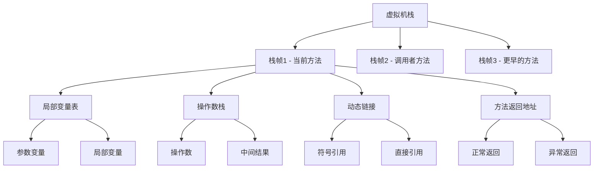
```mermaid
graph TD
    A[虚拟机栈] --> B[栈帧1 - 当前方法]
    A --> C[栈帧2 - 调用者方法]
    A --> D[栈帧3 - 更早的方法]
    
    B --> B1[局部变量表]
    B --> B2[操作数栈]
    B --> B3[动态链接]
    B --> B4[方法返回地址]
    
    B1 --> B11[参数变量]
    B1 --> B12[局部变量]
    
    B2 --> B21[操作数]
    B2 --> B22[中间结果]
    
    B3 --> B31[符号引用]
    B3 --> B32[直接引用]
    
    B4 --> B41[正常返回]
    B4 --> B42[异常返回]
```

实际场景案例

```java
// 栈内存使用示例
public class StackExample {
    public void methodA() {
        int localVar = 10;    // 存储在栈帧的局部变量表
        String str = "Hello"; // 引用存储在栈，对象在堆
        methodB(localVar);    // 创建新栈帧
    } // 栈帧销毁，局部变量消失
    
    public void methodB(int param) {
        int[] array = new int[5]; // 引用在栈，数组对象在堆
        for (int i = 0; i < 5; i++) {
            array[i] = i * param; // 操作数栈参与计算
        }
    } // 栈帧销毁
}
```

栈内存变化过程

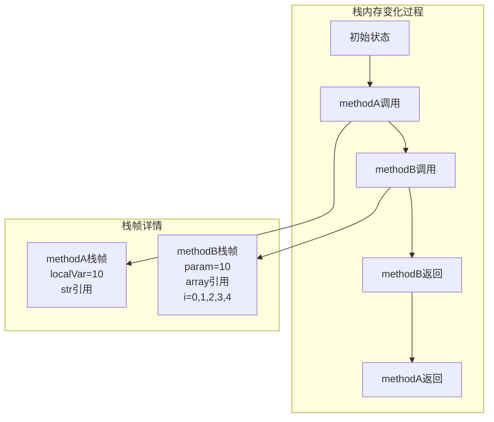
```mermaid
graph TD
    subgraph "栈内存变化过程"
        A[初始状态] --> B[methodA调用]
        B --> C[methodB调用]
        C --> D[methodB返回]
        D --> E[methodA返回]
    end
    
    subgraph "栈帧详情"
        F[methodB栈帧<br/>param=10<br/>array引用<br/>i=0,1,2,3,4]
        G[methodA栈帧<br/>localVar=10<br/>str引用]
    end
    
    C --> F
    B --> G
```

**栈帧的生命周期**：

```
调用链: main() → methodA() → methodB()

            ┌───────────┐
            │ methodB() │ ← 栈顶（当前执行）
            ├───────────┤
            │ methodA() │
            ├───────────┤
            │  main()   │ ← 栈底
            └───────────┘

methodB() 返回后：
            ┌───────────┐
            │ methodA() │ ← 栈顶（恢复执行）
            ├───────────┤
            │  main()   │
            └───────────┘

栈帧的创建和销毁就是移动栈指针，O(1) 操作，极快。
```

**Java 虚拟机栈会出现两种异常：StackOverFlowError 和 OutOfMemoryError。**

**StackOverFlowError：** 若Java虚拟机栈的内存大小不允许动态扩展，那么当线程请求栈的深度超过当前Java虚拟机栈的最大深度的时候，就抛出StackOverFlowError异常。

**OutOfMemoryError：** 若Java虚拟机栈的内存大小允许动态扩展，且当线程请求栈时内存用完了，无法再动态扩展了，此时抛出OutOfMemoryError异常。

**StackOverflowError 的触发**：

```
// 无限递归
void infinite() { infinite(); }

栈空间 (1MB):
┌──────────┐
│ frame N  │  ← 栈满，再压入一帧 → StackOverflowError
│ frame ..│
│ frame 2  │
│ frame 1  │
└──────────┘

每个栈帧大小取决于局部变量表和操作数栈的深度
通常一帧几十到几百字节
1MB栈空间大约可容纳数千到上万层调用
```

### 3.3 本地方法栈

Java代码 → JNI调用 → C/C++函数

```
虚拟机栈:                本地方法栈:
┌──────────────┐        ┌──────────────┐
│ Java method  │  ──→   │ native func  │
│ (字节码栈帧)  │   JNI  │ (C栈帧)      │
└──────────────┘        └──────────────┘

// 例: System.arraycopy() 是native方法
// Java栈帧 → JNI → C函数 jni_arraycopy → memcpy
// C函数的局部变量和调用链在本地方法栈中

HotSpot 实现中，虚拟机栈和本地方法栈合并为一个栈。
```

实际场景案例

```java
// JNI本地方法调用示例
public class NativeExample {
    // 声明本地方法
    public native int calculateHash(String input);
    public native void processImage(byte[] imageData);
    
    static {
        // 加载本地库
        System.loadLibrary("nativelib");
    }
    
    public void useNativeMethod() {
        String data = "Hello World";
        // 调用本地方法，使用本地方法栈
        int hash = calculateHash(data);
        System.out.println("Hash: " + hash);
    }
}
```

然后通过GNI调用c代码

```c
// C语言实现的本地方法
#include <jni.h>
#include <string.h>

JNIEXPORT jint JNICALL 
Java_NativeExample_calculateHash(JNIEnv *env, jobject obj, jstring input) {
    // 本地方法栈中的局部变量
    const char *str = (*env)->GetStringUTFChars(env, input, 0);
    int hash = 0;
    
    // 在本地方法栈中执行计算
    for (int i = 0; i < strlen(str); i++) {
        hash = hash * 31 + str[i];
    }
    
    (*env)->ReleaseStringUTFChars(env, input, str);
    return hash;
}
```

实际场景案例时序图

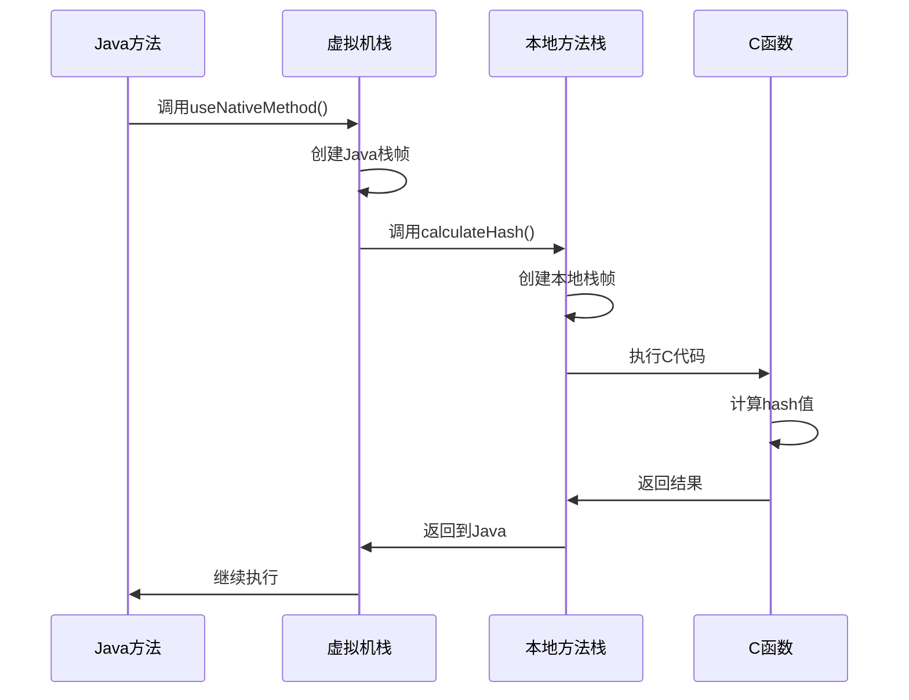
```mermaid
sequenceDiagram
    participant Java as Java方法
    participant JVM as 虚拟机栈
    participant Native as 本地方法栈
    participant C as C函数
    
    Java->>JVM: 调用useNativeMethod()
    JVM->>JVM: 创建Java栈帧
    
    JVM->>Native: 调用calculateHash()
    Native->>Native: 创建本地栈帧
    Native->>C: 执行C代码
    
    C->>C: 计算hash值
    C->>Native: 返回结果
    Native->>JVM: 返回到Java
    JVM->>Java: 继续执行
```

## 04.线程共享内存

### 4.1 堆内存

**本质**：所有对象实例和数组的唯一分配地（逃逸分析优化除外）。

**分代设计的底层原理**：

```
弱分代假说(Weak Generational Hypothesis)：
"绝大多数对象都是朝生暮死的"

统计数据表明：
- 约 95% 的对象在第一次 GC 时就已死亡
- 只有约 5% 的对象能存活到老年代

基于此假说的分代设计：

堆空间 (-Xmx)
┌──────────────────────────────────────────────────┐
│                                                    │
│  年轻代 (Young Generation) — 通常占堆的 1/3         │
│  ┌────────────────────┬──────────┬──────────┐      │
│  │       Eden         │    S0    │    S1    │      │
│  │    (伊甸园区)       │(Survivor)│(Survivor)│      │
│  │                    │          │          │      │
│  │  新对象在此分配      │  交替使用，存放年轻代  │      │
│  │  (TLAB快速分配)     │  GC幸存者              │      │
│  │                    │          │          │      │
│  │    比例 8          │    1     │    1     │      │
│  └────────────────────┴──────────┴──────────┘      │
│                                                    │
│  老年代 (Old Generation) — 通常占堆的 2/3            │
│  ┌──────────────────────────────────────────┐      │
│  │                                          │      │
│  │  长期存活的对象（经过多次Minor GC）         │      │
│  │  大对象直接分配                            │      │
│  │                                          │      │
│  └──────────────────────────────────────────┘      │
│                                                    │
└──────────────────────────────────────────────────────┘
```

**TLAB（Thread Local Allocation Buffer）**：

```
堆是共享的，但对象分配是高频操作。如果每次分配都加锁 → 性能灾难。

解决方案：TLAB — 堆中预先划给每个线程的一小块私有缓冲区

Eden 区:
┌──────────────────────────────────────┐
│  ┌──────┐ ┌──────┐ ┌──────┐         │
│  │TLAB-1│ │TLAB-2│ │TLAB-3│ 空闲... │
│  │(T1)  │ │(T2)  │ │(T3)  │         │
│  └──────┘ └──────┘ └──────┘         │
└──────────────────────────────────────┘

Thread-1 分配对象：
  在 TLAB-1 内移动指针即可 → 无锁、O(1)
  TLAB 用完 → 申请新的 TLAB（需要CAS同步）
  对象太大 → 直接在共享Eden区分配（需要CAS同步）

默认 TLAB 大小 ≈ Eden 的 1%
```

**对象在堆中的内存布局**：

```
┌─────────────────────────────────────────┐
│              对象头 (Object Header)       │
│  ┌───────────────────────────────────┐  │
│  │  Mark Word (8字节/64位JVM)         │  │
│  │  ┌─────────────────────────────┐  │  │
│  │  │ 哈希码 | 年龄 | 偏向锁 | 锁标志│  │  │
│  │  │ 25bit  | 4bit | 1bit | 2bit│  │  │
│  │  └─────────────────────────────┘  │  │
│  ├───────────────────────────────────┤  │
│  │  Klass Pointer (4/8字节)          │  │
│  │  → 指向方法区中的类元信息           │  │
│  ├───────────────────────────────────┤  │
│  │  数组长度 (4字节，仅数组对象)       │  │
│  └───────────────────────────────────┘  │
├─────────────────────────────────────────┤
│              实例数据 (Instance Data)     │
│  按字段声明顺序和对齐规则排列             │
│  父类字段在前，子类字段在后               │
├─────────────────────────────────────────┤
│              对齐填充 (Padding)           │
│  确保对象大小是 8 字节的整数倍            │
└─────────────────────────────────────────┘
```

实际场景案例

```java
// 堆内存使用示例
public class HeapExample {
    private static List<String> staticList = new ArrayList<>(); // 在堆中
    
    public void createObjects() {
        // 所有对象都在堆内存中创建
        String str = new String("Hello");     // 在堆中
        StringBuilder sb = new StringBuilder(); // 在堆中
        int[] array = new int[1000];          // 在堆中
        
        // 对象引用在栈中，对象实例在堆中
        Person person = new Person("张三", 25);
        
        // 集合对象在堆中，元素也在堆中
        List<Person> persons = new ArrayList<>();
        persons.add(person);
        
        // 大对象可能直接进入老年代
        byte[] bigArray = new byte[1024 * 1024]; // 1MB
    }
    
    static class Person {
        private String name;  // 引用在堆中，字符串对象也在堆中
        private int age;      // 基本类型值在堆中（作为对象的字段）
        
        public Person(String name, int age) {
            this.name = name;
            this.age = age;
        }
    }
}
```

垃圾回收过程

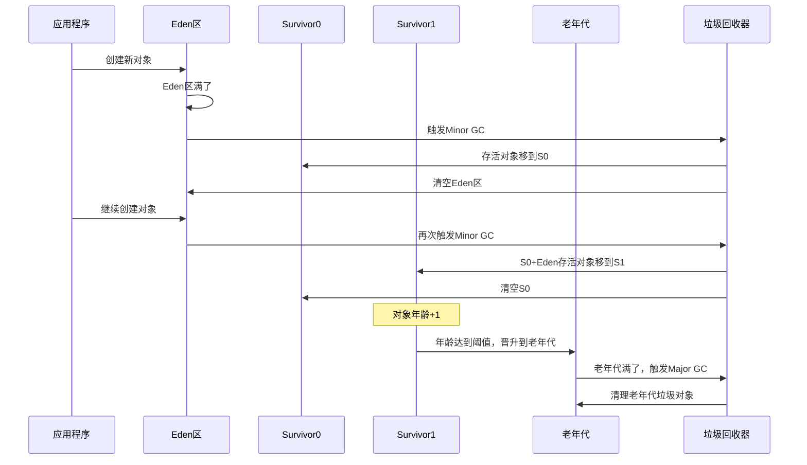
```mermaid
sequenceDiagram
    participant App as 应用程序
    participant Eden as Eden区
    participant S0 as Survivor0
    participant S1 as Survivor1
    participant Old as 老年代
    participant GC as 垃圾回收器
    
    App->>Eden: 创建新对象
    Eden->>Eden: Eden区满了
    
    Eden->>GC: 触发Minor GC
    GC->>S0: 存活对象移到S0
    GC->>Eden: 清空Eden区
    
    App->>Eden: 继续创建对象
    Eden->>GC: 再次触发Minor GC
    GC->>S1: S0+Eden存活对象移到S1
    GC->>S0: 清空S0
    
    Note over S1: 对象年龄+1
    
    S1->>Old: 年龄达到阈值，晋升到老年代
    
    Old->>GC: 老年代满了，触发Major GC
    GC->>Old: 清理老年代垃圾对象
```

### 4.2 方法区


**本质**：存储已被JVM加载的类的结构信息。

```
Java 8 之前：方法区在 JVM 堆内（永久代 PermGen）
Java 8 之后：方法区移到本地内存（元空间 Metaspace）

原因：
- PermGen 大小固定，容易溢出（PermGen space OOM）
- 类卸载条件苛刻，PermGen 碎片严重
- Metaspace 使用本地内存，可以动态扩展
```

方法区存储内容：

```
┌─────────────────────────────────────────────┐
│              方法区 (Metaspace)               │
│                                              │
│  ┌──────────────────────────────────┐       │
│  │  类信息 (Class Metadata)          │       │
│  │  - 类名、修饰符、父类、接口列表     │       │
│  │  - 字段描述符列表                  │       │
│  │  - 方法描述符列表 + 字节码          │       │
│  │  - 虚方法表 (vtable)              │       │
│  └──────────────────────────────────┘       │
│                                              │
│  ┌──────────────────────────────────┐       │
│  │  运行时常量池                      │       │
│  │  (Runtime Constant Pool)         │       │
│  │  - 字面量：数值、字符串引用         │       │
│  │  - 符号引用 → 运行时解析为直接引用  │       │
│  │  - 方法句柄、调用点限定符           │       │
│  └──────────────────────────────────┘       │
│                                              │
│  ┌──────────────────────────────────┐       │
│  │  静态变量 (Java 7+ 移到堆中)       │       │
│  │  JIT 编译后的本地代码              │       │
│  └──────────────────────────────────┘       │
│                                              │
└──────────────────────────────────────────────┘
```


实际场景案例

```java
// 方法区存储示例
public class MethodAreaExample {
    // 类信息存储在方法区
    private static final String CONSTANT = "常量"; // 常量池
    private static int staticVar = 100;            // 静态变量在堆中，引用在方法区
    
    private String instanceVar;                    // 字段信息在方法区
    
    // 方法信息存储在方法区
    public void instanceMethod() {
        String localStr = "局部字符串"; // 字符串字面量在常量池
        System.out.println(localStr);
    }
    
    public static void staticMethod() {
        // 静态方法信息在方法区
        Class<?> clazz = MethodAreaExample.class; // 类对象在堆中
        String className = clazz.getName();       // 反射获取类信息
    }
}

// 类加载过程
class ClassLoadingExample {
    static {
        System.out.println("类初始化"); // 类信息加载到方法区时执行
    }
    
    public static void triggerClassLoading() {
        // 首次使用类时，类信息加载到方法区
        ClassLoadingExample example = new ClassLoadingExample();
    }
}
```

然后看一下方法区的流程图

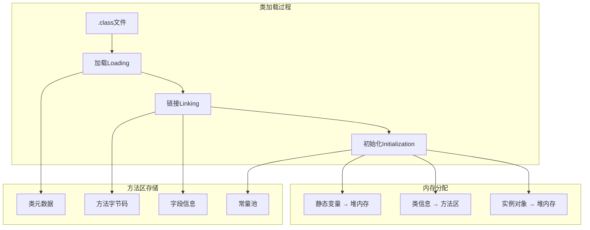
```mermaid
graph TD
    subgraph "类加载过程"
        A[.class文件] --> B[加载Loading]
        B --> C[链接Linking]
        C --> D[初始化Initialization]
    end
    
    subgraph "方法区存储"
        E[类元数据]
        F[方法字节码]
        G[字段信息]
        H[常量池]
    end
    
    B --> E
    C --> F
    C --> G
    D --> H
    
    subgraph "内存分配"
        I[静态变量 → 堆内存]
        J[类信息 → 方法区]
        K[实例对象 → 堆内存]
    end
    
    D --> I
    D --> J
    D --> K
```

### 4.3 运行时常量池

常量池类型

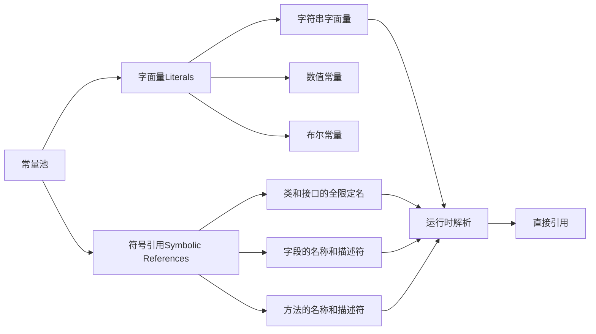
```mermaid
graph LR
    A[常量池] --> B[字面量Literals]
    A --> C[符号引用Symbolic References]
    
    B --> B1[字符串字面量]
    B --> B2[数值常量]
    B --> B3[布尔常量]
    
    C --> C1[类和接口的全限定名]
    C --> C2[字段的名称和描述符]
    C --> C3[方法的名称和描述符]
    
    B1 --> D[运行时解析]
    C1 --> D
    C2 --> D
    C3 --> D
    
    D --> E[直接引用]
```

实际场景案例

```java
// 常量池使用示例
public class ConstantPoolExample {
    public static void stringPoolExample() {
        // 字符串字面量存储在字符串常量池
        String str1 = "Hello";           // 常量池中
        String str2 = "Hello";           // 复用常量池中的对象
        String str3 = new String("Hello"); // 堆中新建对象
        
        System.out.println(str1 == str2);    // true，同一个对象
        System.out.println(str1 == str3);    // false，不同对象
        System.out.println(str1.equals(str3)); // true，内容相同
        
        // intern()方法的使用
        String str4 = str3.intern();     // 返回常量池中的对象
        System.out.println(str1 == str4);    // true
    }
    
    public static void numericConstantExample() {
        // 数值常量在常量池中
        int a = 100;    // 小整数缓存
        int b = 100;    // 复用缓存
        
        Integer i1 = 100;  // 自动装箱，使用缓存
        Integer i2 = 100;  // 复用缓存
        Integer i3 = 200;  // 超出缓存范围，新建对象
        Integer i4 = 200;  // 新建对象
        
        System.out.println(i1 == i2);  // true，缓存对象
        System.out.println(i3 == i4);  // false，不同对象
    }
}
```

字符串常量池

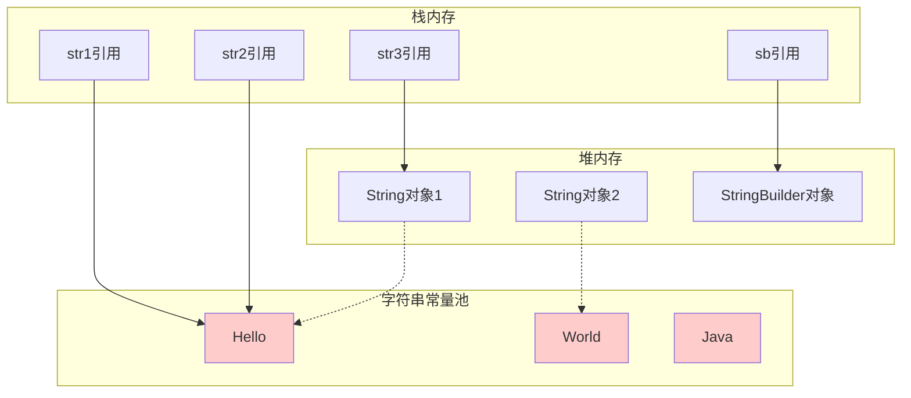
```mermaid
graph TD
    subgraph "字符串常量池"
        A["Hello"]
        B["World"]
        C["Java"]
    end
    
    subgraph "堆内存"
        D[String对象1]
        E[String对象2]
        F[StringBuilder对象]
    end
    
    subgraph "栈内存"
        G[str1引用] --> A
        H[str2引用] --> A
        I[str3引用] --> D
        J[sb引用] --> F
    end
    
    D -.-> A
    E -.-> B
    
    style A fill:#ffcccc
    style B fill:#ffcccc
    style C fill:#ffcccc
```

### 4.4 直接内存

```
传统 I/O 路径：
磁盘 → 内核缓冲区 → JVM堆缓冲区(byte[]) → 应用代码
                     ↑ 一次额外拷贝

NIO 直接内存路径：
磁盘 → 内核缓冲区 → 直接内存(DirectByteBuffer) → 应用代码
                     ↑ 零拷贝（映射同一块物理内存）

// 直接内存的分配
ByteBuffer buf = ByteBuffer.allocateDirect(1024);
// 底层调用 OS 的 malloc / mmap
// 不受 GC 管理，但有 Cleaner 机制回收

优点：减少一次内存拷贝，I/O密集场景性能显著提升
缺点：分配/释放比堆内存慢，不受GC直接管理
```

直接内存特点

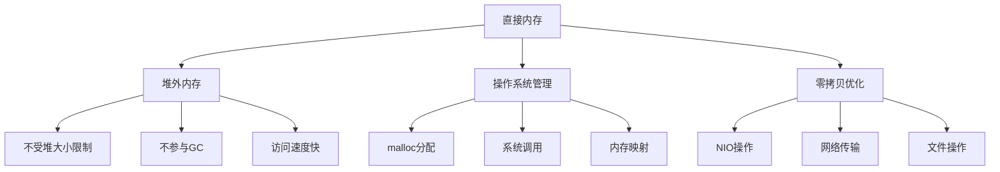
```mermaid
graph TD
    A[直接内存] --> B[堆外内存]
    A --> C[操作系统管理]
    A --> D[零拷贝优化]
    
    B --> B1[不受堆大小限制]
    B --> B2[不参与GC]
    B --> B3[访问速度快]
    
    C --> C1[malloc分配]
    C --> C2[系统调用]
    C --> C3[内存映射]
    
    D --> D1[NIO操作]
    D --> D2[网络传输]
    D --> D3[文件操作]
```

实际场景案例

```java
// 直接内存使用示例
import java.nio.ByteBuffer;
import java.nio.channels.FileChannel;
import java.io.RandomAccessFile;

public class DirectMemoryExample {
    
    public void directBufferExample() {
        // 分配直接内存
        ByteBuffer directBuffer = ByteBuffer.allocateDirect(1024 * 1024); // 1MB
        ByteBuffer heapBuffer = ByteBuffer.allocate(1024 * 1024);         // 堆内存
        
        // 直接内存的优势：零拷贝
        byte[] data = "Hello Direct Memory".getBytes();
        directBuffer.put(data);
        directBuffer.flip();
        
        // 读取数据
        byte[] result = new byte[data.length];
        directBuffer.get(result);
        
        System.out.println(new String(result));
    }
    
    public void fileChannelExample() throws Exception {
        RandomAccessFile file = new RandomAccessFile("test.txt", "rw");
        FileChannel channel = file.getChannel();
        
        // 使用直接内存进行文件操作
        ByteBuffer buffer = ByteBuffer.allocateDirect(1024);
        
        // 零拷贝读取文件
        int bytesRead = channel.read(buffer);
        buffer.flip();
        
        // 零拷贝写入文件
        channel.write(buffer);
        
        channel.close();
        file.close();
    }
    
    // 内存映射文件示例
    public void memoryMappedFileExample() throws Exception {
        RandomAccessFile file = new RandomAccessFile("large_file.dat", "rw");
        FileChannel channel = file.getChannel();
        
        // 内存映射，使用直接内存
        long fileSize = 1024 * 1024 * 100; // 100MB
        var mappedBuffer = channel.map(
            FileChannel.MapMode.READ_WRITE, 0, fileSize
        );
        
        // 直接操作内存映射区域
        mappedBuffer.put(0, (byte) 'A');
        byte value = mappedBuffer.get(0);
        
        channel.close();
        file.close();
    }
}
```

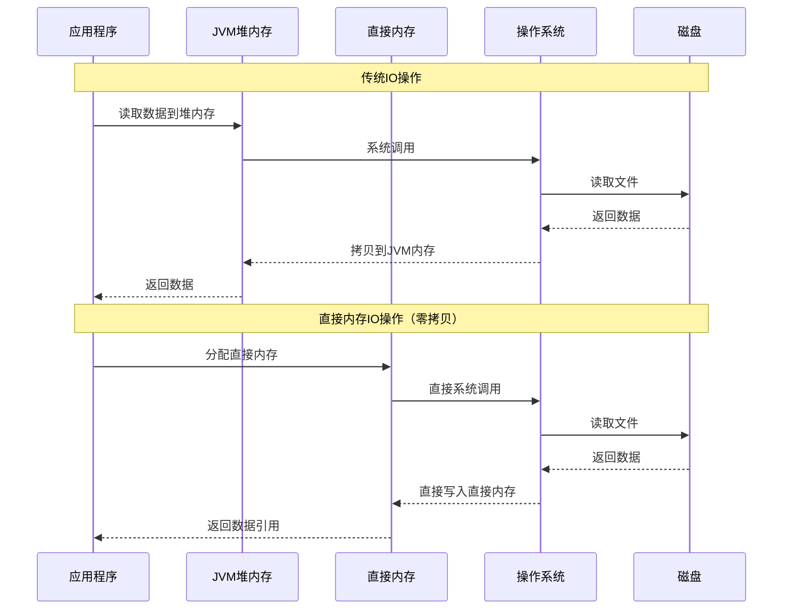
```mermaid
sequenceDiagram
    participant App as 应用程序
    participant JVM as JVM堆内存
    participant Direct as 直接内存
    participant OS as 操作系统
    participant Disk as 磁盘
    
    Note over App,Disk: 传统IO操作
    App->>JVM: 读取数据到堆内存
    JVM->>OS: 系统调用
    OS->>Disk: 读取文件
    Disk-->>OS: 返回数据
    OS-->>JVM: 拷贝到JVM内存
    JVM-->>App: 返回数据
    
    Note over App,Disk: 直接内存IO操作（零拷贝）
    App->>Direct: 分配直接内存
    Direct->>OS: 直接系统调用
    OS->>Disk: 读取文件
    Disk-->>OS: 返回数据
    OS-->>Direct: 直接写入直接内存
    Direct-->>App: 返回数据引用
```


## 05.Java布局案例

> **本节定位**：用一段最朴素的 Java 代码把第一层契约（栈/堆/方法区/常量池）的布局具象化——这是"静态视角"，是 §06 跨语言对比与 §07 并发契约的舞台背景。真正端到端的综合案例串讲在 §09，请把本节当作"对剧本场景的踩点"。

### 5.1 完整内存案例

完整案例：一段 Java 代码在内存中的全景

```java
public class MemoryLayoutDemo {
    
    // ① 静态变量 → 堆（Java 7+）/ 方法区（Java 6）
    private static int instanceCount = 0;
    
    // ② 常量 → 方法区的运行时常量池
    private static final String PREFIX = "User-";
    
    // ③ 实例字段 → 随对象分配在堆上
    private String name;
    private int age;
    
    public MemoryLayoutDemo(String name, int age) {
        this.name = name;
        this.age = age;
        instanceCount++;
    }
    
    public String getInfo() {
        // ④ 局部变量 → 虚拟机栈的栈帧中
        String info = PREFIX + name + ":" + age;
        return info;
    }
    
    public static void main(String[] args) {
        // ⑤ 局部变量 user → 栈帧，指向的对象 → 堆
        MemoryLayoutDemo user = new MemoryLayoutDemo("Alice", 30);
        String result = user.getInfo();
        System.out.println(result);
    }
}
```

### 5.2 案例内存分布

```
┌──────────────────────────────────────────────────────────────────┐
│                                                                  │
│  ┌─── 程序计数器 ──────────────────────────────────────────────┐ │
│  │  main线程 PC: → 指向当前正在执行的字节码指令地址              │ │
│  └────────────────────────────────────────────────────────────┘ │
│                                                                  │
│  ┌─── 虚拟机栈 (main线程) ─────────────────────────────────────┐ │
│  │                                                             │ │
│  │  当调用 user.getInfo() 时，栈的状态：                        │ │
│  │                                                             │ │
│  │  ┌──────────────────────────────────┐ ← 栈顶               │ │
│  │  │  getInfo() 栈帧                   │                      │ │
│  │  │  局部变量表:                       │                      │ │
│  │  │    slot 0: this → [堆中user对象]   │                      │ │
│  │  │    slot 1: info → [堆中String对象] │ ← ④                 │ │
│  │  │  操作数栈:                         │                      │ │
│  │  │    用于字符串拼接的中间值            │                      │ │
│  │  │  返回地址: → main()帧的某条指令     │                      │ │
│  │  ├──────────────────────────────────┤                      │ │
│  │  │  main() 栈帧                      │                      │ │
│  │  │  局部变量表:                       │                      │ │
│  │  │    slot 0: args → [堆中String[]]   │                      │ │
│  │  │    slot 1: user → [堆中Demo对象]   │ ← ⑤ 引用在栈上      │ │
│  │  │    slot 2: result → [堆中String]   │                      │ │
│  │  └──────────────────────────────────┘                      │ │
│  │                                                             │ │
│  └─────────────────────────────────────────────────────────────┘ │
│                                                                  │
│  ┌─── 堆 (Heap) ───────────────────────────────────────────────┐ │
│  │                                                             │ │
│  │  Eden区 (新创建的对象):                                      │ │
│  │                                                             │ │
│  │  ┌─────────────────────────────────┐                       │ │
│  │  │ MemoryLayoutDemo 实例 (user)     │ ← ③ new出来的对象     │ │
│  │  │ ┌───────────────────────────┐   │                       │ │
│  │  │ │ 对象头                     │   │                       │ │
│  │  │ │  Mark Word: hashcode|age=0│   │                       │ │
│  │  │ │  Klass Ptr → [方法区类信息]│   │                       │ │
│  │  │ ├───────────────────────────┤   │                       │ │
│  │  │ │ name: ref ──→ String"Alice"│   │                       │ │
│  │  │ │ age: 30                   │   │                       │ │
│  │  │ └───────────────────────────┘   │                       │ │
│  │  └─────────────────────────────────┘                       │ │
│  │                                                             │ │
│  │  ┌──────────────────────┐   ┌──────────────────────┐       │ │
│  │  │ String "Alice"       │   │ String "User-Alice:30"│       │ │
│  │  │ char[] → ['A','l'...]│   │ (getInfo()的返回值)   │       │ │
│  │  └──────────────────────┘   └──────────────────────┘       │ │
│  │                                                             │ │
│  │  字符串常量池 (堆内):                                        │ │
│  │  ┌────────────────────────────────┐                        │ │
│  │  │  "User-" → String对象          │ ← ② 编译期常量         │ │
│  │  │  ":"     → String对象          │                        │ │
│  │  └────────────────────────────────┘                        │ │
│  │                                                             │ │
│  │  静态变量 (堆内, Java 7+):                                  │ │
│  │  ┌────────────────────────────────┐                        │ │
│  │  │  instanceCount: 1              │ ← ①                   │ │
│  │  │  PREFIX: ref → 常量池"User-"   │ ← ②                   │ │
│  │  └────────────────────────────────┘                        │ │
│  │                                                             │ │
│  └─────────────────────────────────────────────────────────────┘ │
│                                                                  │
│  ┌─── 方法区 / 元空间 (Metaspace) ─────────────────────────────┐ │
│  │                                                             │ │
│  │  ┌───────────────────────────────────────┐                 │ │
│  │  │  Class: MemoryLayoutDemo               │                 │ │
│  │  │  ├─ 父类: Object                       │                 │ │
│  │  │  ├─ 字段: name(Ljava/lang/String;)     │                 │ │
│  │  │  │         age(I)                      │                 │ │
│  │  │  ├─ 方法: <init>(字节码)               │                 │ │
│  │  │  │         getInfo(字节码)              │                 │ │
│  │  │  │         main(字节码)                 │                 │ │
│  │  │  ├─ 虚方法表: [toString, hashCode, ...] │                 │ │
│  │  │  └─ 运行时常量池:                       │                 │ │
│  │  │       #1 = Utf8 "MemoryLayoutDemo"     │                 │ │
│  │  │       #2 = Utf8 "User-"                │                 │ │
│  │  │       #3 = Methodref Object.<init>     │                 │ │
│  │  │       ...                              │                 │ │
│  │  └───────────────────────────────────────┘                 │ │
│  │                                                             │ │
│  │  ┌───────────────────────────────────────┐                 │ │
│  │  │  Class: java.lang.String (已加载)      │                 │ │
│  │  │  Class: java.lang.Object (已加载)      │                 │ │
│  │  │  ...                                   │                 │ │
│  │  └───────────────────────────────────────┘                 │ │
│  │                                                             │ │
│  └─────────────────────────────────────────────────────────────┘ │
│                                                                  │
└──────────────────────────────────────────────────────────────────┘
```

### 5.3 内存链路

一条语句的完整内存操作链路。以 `MemoryLayoutDemo user = new MemoryLayoutDemo("Alice", 30);` 为例：

```
步骤1: new 指令
  → 在方法区查找 MemoryLayoutDemo 类信息
  → 如果未加载，触发类加载（加载→链接→初始化）
  → 计算对象大小（对象头 + 实例数据 + 对齐）

步骤2: 内存分配
  → 检查 TLAB 是否有足够空间
  → 有 → 在 TLAB 内移动指针（无锁）
  → 无 → CAS 在 Eden 区分配 / 申请新 TLAB

步骤3: 零值初始化
  → name = null, age = 0
  → 对象头写入：Mark Word + Klass Pointer

步骤4: 执行构造函数 <init>
  → 创建新栈帧压入虚拟机栈
  → this.name = name → 将引用写入堆中对象的字段
  → this.age = 30 → 将 int 写入堆中对象的字段
  → instanceCount++ → 读写堆中的静态变量
  → 栈帧弹出

步骤5: 引用赋值
  → 堆中对象的地址写入 main() 栈帧局部变量表的 slot 1
  → user 变量（栈上）指向堆中的对象
```

### 5.4 内存生命周期

对象的生命周期：

- 全局对象在程序启动时分配，结束时销毁。
- 局部对象在进入程序块时创建，离开块时销毁。
- 局部`static`对象在第一次使用前分配，在程序结束时销毁。
- 动态分配对象(C++特有)：只能显式地被释放。

属性的生命周期：

- 类变量在对象创建时分配，对象销毁时销毁。
- 类`static`变量在第一次加载类时分配，在程序结束时销毁。

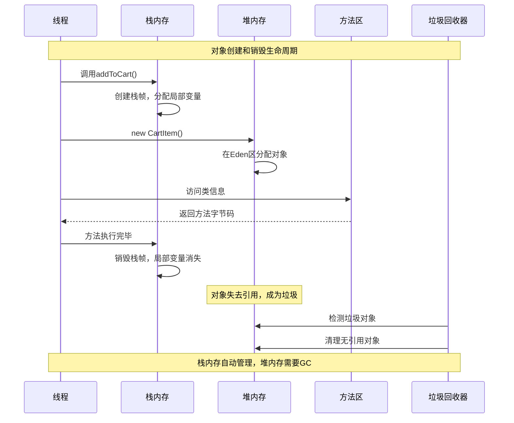
```mermaid
sequenceDiagram
    participant Thread as 线程
    participant Stack as 栈内存
    participant Heap as 堆内存
    participant Method as 方法区
    participant GC as 垃圾回收器
    
    Note over Thread,GC: 对象创建和销毁生命周期
    
    Thread->>Stack: 调用addToCart()
    Stack->>Stack: 创建栈帧，分配局部变量
    
    Thread->>Heap: new CartItem()
    Heap->>Heap: 在Eden区分配对象
    
    Thread->>Method: 访问类信息
    Method-->>Thread: 返回方法字节码
    
    Thread->>Stack: 方法执行完毕
    Stack->>Stack: 销毁栈帧，局部变量消失
    
    Note over Heap: 对象失去引用，成为垃圾
    
    GC->>Heap: 检测垃圾对象
    GC->>Heap: 清理无引用对象
    
    Note over Thread,GC: 栈内存自动管理，堆内存需要GC
```

## 06.跨平台内存模型

### 6.1 Java平台

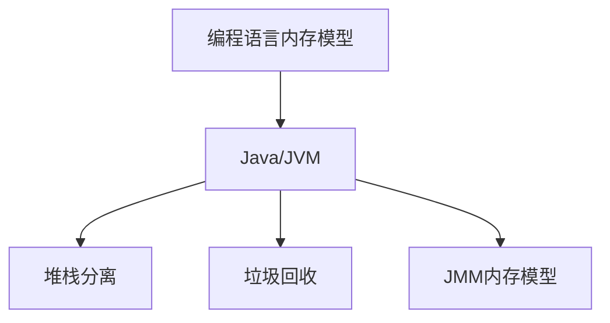
```mermaid
graph TD
    A[编程语言内存模型] --> B[Java/JVM]
    
    B --> B1[堆栈分离]
    B --> B2[垃圾回收]
    B --> B3[JMM内存模型]
```

**设计哲学**：Java 是第一个把"内存模型"作为**语言规范**正式定义的主流语言。这件事的意义远超工程价值——它把"硬件细节"从程序员视野中彻底抽走。

**三个核心抽象**：

| 抽象 | 在 Java 中是什么 | 解决什么问题 |
|---|---|---|
| **堆栈分离** | 引用类型在堆，基本类型在栈 | 让 GC 只关注堆，栈靠"出栈"自动清理 |
| **GC 自动管理** | 分代收集 + TLAB 快速分配 | 让程序员不需要懂 malloc/free |
| **JMM 并发抽象** | happens-before + volatile/final/synchronized | 让程序员不需要懂内存屏障 |

**JMM 的演进路径**：

```
Java 1.0 (1995)：JMM 几乎没定义，volatile 只是"hint"
                ↓ 双重检查锁(DCL)等模式都是错的
Java 1.4 (2002)：开始有些约束，但仍有歧义
                ↓ 学术界发现 JMM 在数学上不自洽
Java 5 (2004)：JSR-133 重新定义 JMM
                ↓ DCL+volatile 终于安全
                ↓ final 字段拥有"安全发布"语义
Java 9+ (2017)：VarHandle 引入，与 C++11 memory_order 对齐
                ↓ 高级用户也能用 acquire/release/relaxed
```

**Java 的取舍**：用一个简化的 happens-before 抽象，覆盖 99% 的程序员需求；性能极致场景（剩余 1%）通过 VarHandle / sun.misc.Unsafe / Atomic\* 进入精细模式。

### 6.2 C++平台

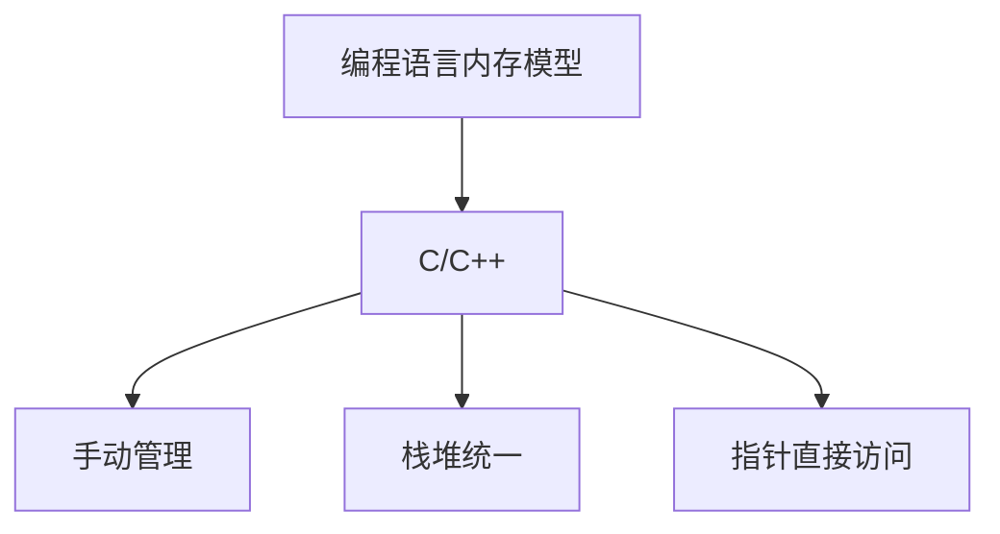
```mermaid
graph TD
    A[编程语言内存模型] --> C[C/C++]

    C --> C1[手动管理]
    C --> C2[栈堆统一]
    C --> C3[指针直接访问]
```

C++程序在执行时，将内存大方向划分为**4个区域**

- 代码区：存放函数体的二进制代码，由操作系统进行管理的
- 全局区：存放全局变量和静态变量以及常量
- 栈区：由编译器自动分配释放, 存放函数的参数值,局部变量等
- 堆区：由程序员分配和释放,若程序员不释放,程序结束时由操作系统回收

> 理解代码区

作用： 存储程序的二进制代码（即编译后的机器指令）。

特点： 1.只读，程序运行时不可修改。 2.由操作系统管理，程序结束时释放。

```cpp
void func() {
// 函数代码存储在代码区
}
```

> 理解全局区

全局/静态区（Global/Static Segment）作用：

1. 存储全局变量、静态变量（包括静态局部变量和静态成员变量）。
2. 分为两个子区域： 已初始化区：存储已初始化的全局变量和静态变量。 未初始化区（BSS 段）：存储未初始化的全局变量和静态变量。

特点：1.在程序启动时分配，程序结束时释放。 2.未初始化的变量会被自动初始化为 0。

```cpp
int globalVar = 10; // 已初始化全局变量，存储在全局区
static int staticVar; // 未初始化静态变量，存储在 BSS 段
void func() {
    static int localStaticVar = 20; // 静态局部变量，存储在全局区
}
```

> 理解栈区

栈区（Stack Segment） 作用：存储局部变量、函数参数、函数返回地址等。

特点：

1. 由编译器自动管理，函数调用时分配，函数返回时释放。
2. 内存分配和释放速度快，但空间有限。
3. 栈的大小通常较小（默认几 MB），如果栈溢出会导致程序崩溃。

```cpp
void func() {
    int localVar = 30; // 局部变量，存储在栈区
}
```

> 理解堆区

堆区（Heap Segment） 作用： 存储动态分配的内存（如 new 和 malloc 分配的内存）。

特点：

1. 由程序员手动管理，需要显式释放（如 delete 或 free）。
2. 内存分配和释放速度较慢，但空间较大。
3. 如果未正确释放内存，会导致内存泄漏。

```cpp
void func() {
    int* ptr = new int(40); // 动态分配内存，存储在堆区
    delete ptr; // 手动释放内存
}
```


> 常量存储区

- 用于存储常量（如字符串常量）。
- 通常是只读的。

示例：
```cpp
const char *str = "Hello, World!"; // 字符串常量存储在常量存储区
```

> 内存模型用例

内存分区模型的特点

1. 代码区：只读，存储程序指令。
2. 全局/静态区：存储全局和静态变量，生命周期与程序相同。
3. 栈区：存储局部变量和函数调用信息，自动管理，空间有限。
4. 堆区：存储动态分配的内存，手动管理，空间较大。

```cpp
#include <iostream>

int globalVar = 10; // 全局变量，存储在全局区
static int staticVar; // 静态变量，存储在 BSS 段

void func() {
    int localVar = 30; // 局部变量，存储在栈区
    static int localStaticVar = 20; // 静态局部变量，存储在全局区
    int* ptr = new int(40); // 动态分配内存，存储在堆区
    std::cout << "Local Variable: " << localVar << std::endl;
    std::cout << "Dynamic Memory: " << *ptr << std::endl;
    delete ptr; // 释放堆区内存
}

int main() {
    func();
    return 0;
}
```

### 6.3 JS平台

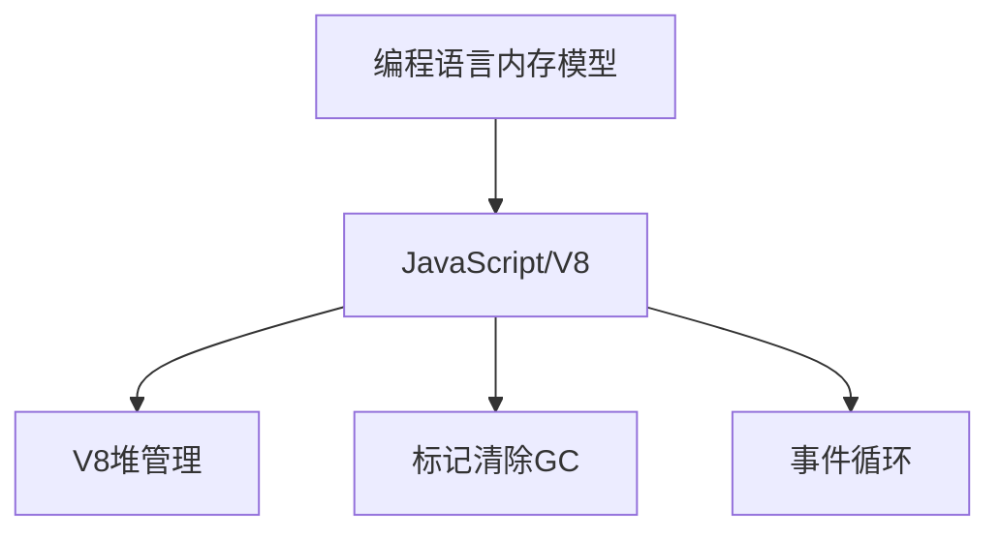
```mermaid
graph TD
    A[编程语言内存模型] --> D[JavaScript/V8]

    D --> D1[V8堆管理]
    D --> D2[标记清除GC]
    D --> D3[事件循环]
```

JavaScript内存模型示例

```javascript
class JavaScriptMemoryExample {
    constructor() {
        // 对象属性存储在堆中
        this.instanceVar = "实例变量";
        this.numbers = [1, 2, 3, 4, 5]; // 数组在堆中
    }
    
    demonstrateMemoryUsage() {
        // 基本类型在栈中（V8优化）
        let localNum = 42;
        let localStr = "局部字符串";
        
        // 对象在堆中
        let obj = {
            name: "张三",
            age: 25,
            hobbies: ["读书", "游泳"] // 嵌套数组也在堆中
        };
        
        // 闭包会捕获外部变量
        function createClosure() {
            let capturedVar = "被捕获的变量"; // 可能被提升到堆中
            
            return function() {
                console.log(capturedVar); // 闭包访问
            };
        }
        
        let closure = createClosure();
        
        // 异步操作
        setTimeout(() => {
            // 回调函数可能引用外部变量
            console.log(obj.name);
        }, 1000);
    }
    
    // 内存泄漏示例
    memoryLeakExample() {
        let bigArray = new Array(1000000).fill("大数据");
        
        // 全局变量引用，不会被GC
        window.globalLeak = bigArray;
        
        // 事件监听器未移除
        document.addEventListener('click', function() {
            console.log(bigArray.length); // 引用大数组
        });
        
        // 定时器未清除
        setInterval(() => {
            console.log(bigArray[0]);
        }, 1000);
    }
}
```

### 6.4 Go平台

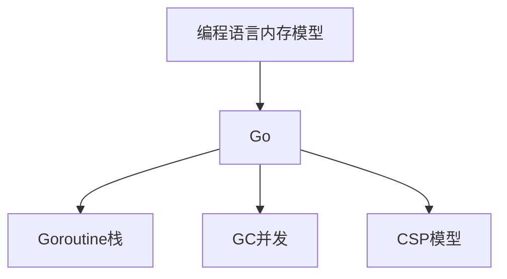
```mermaid
graph TD
    A[编程语言内存模型] --> E[Go]

    E --> E1[Goroutine栈]
    E --> E2[GC并发]
    E --> E3[CSP模型]
```

Go语言内存模型示例

```go
package main

import (
    "fmt"
    "runtime"
    "sync"
    "time"
)

type GoMemoryExample struct {
    instanceVar string
    numbers     []int
}

func (g *GoMemoryExample) demonstrateMemoryUsage() {
    // 栈变量
    localNum := 42
    localStr := "局部字符串"
    
    // 切片在堆中分配
    slice := make([]int, 1000)
    
    // map在堆中分配
    m := make(map[string]int)
    m["key"] = 100
    
    // 结构体可能在栈或堆中，取决于逃逸分析
    type Person struct {
        Name string
        Age  int
    }
    
    person := Person{Name: "张三", Age: 25} // 可能在栈中
    personPtr := &Person{Name: "李四", Age: 30} // 在堆中
    
    fmt.Printf("栈变量: %d, %s\n", localNum, localStr)
    fmt.Printf("切片长度: %d\n", len(slice))
    fmt.Printf("Map值: %d\n", m["key"])
    fmt.Printf("结构体: %+v, %+v\n", person, personPtr)
}

// Goroutine栈管理
func demonstrateGoroutineStack() {
    var wg sync.WaitGroup
    
    for i := 0; i < 10; i++ {
        wg.Add(1)
        go func(id int) {
            defer wg.Done()
            
            // 每个goroutine有自己的栈
            var localArray [1000]int
            localArray[0] = id
            
            // 递归调用会增长栈
            recursiveFunction(10, id)
            
            fmt.Printf("Goroutine %d 完成\n", id)
        }(i)
    }
    
    wg.Wait()
}

func recursiveFunction(depth, id int) {
    if depth <= 0 {
        return
    }
    
    // 栈帧增长
    var localVar [100]int
    localVar[0] = depth
    
    recursiveFunction(depth-1, id)
}

// 内存统计
func printMemoryStats() {
    var m runtime.MemStats
    runtime.ReadMemStats(&m)
    
    fmt.Printf("分配的堆内存: %d KB\n", m.Alloc/1024)
    fmt.Printf("总分配内存: %d KB\n", m.TotalAlloc/1024)
    fmt.Printf("系统内存: %d KB\n", m.Sys/1024)
    fmt.Printf("GC次数: %d\n", m.NumGC)
}

func main() {
    example := &GoMemoryExample{
        instanceVar: "实例变量",
        numbers:     []int{1, 2, 3, 4, 5},
    }
    
    example.demonstrateMemoryUsage()
    
    fmt.Println("开始Goroutine测试...")
    demonstrateGoroutineStack()
    
    fmt.Println("内存统计:")
    printMemoryStats()
    
    // 强制GC
    runtime.GC()
    time.Sleep(100 * time.Millisecond)
    
    fmt.Println("GC后内存统计:")
    printMemoryStats()
}
```

### 6.5 Rust平台

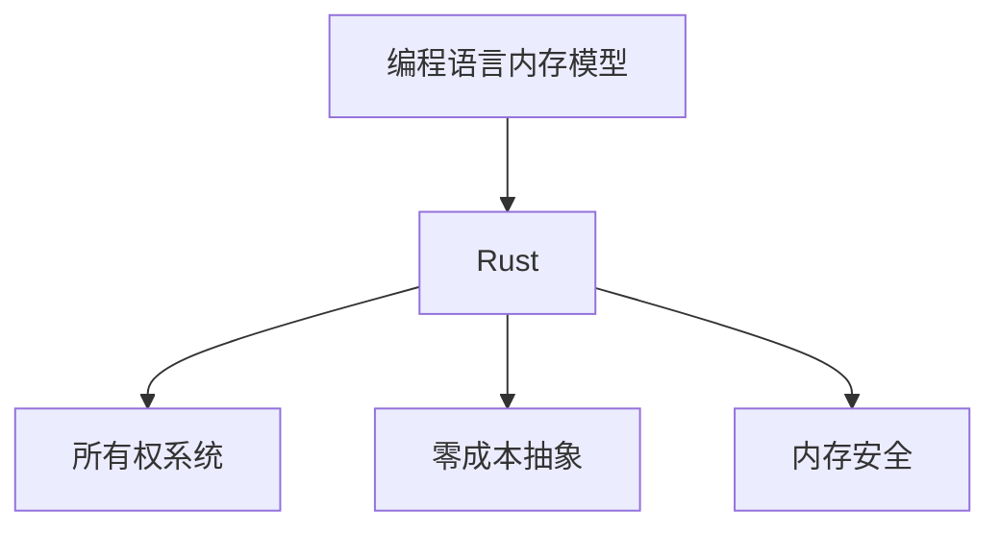
```mermaid
graph TD
    A[编程语言内存模型] --> F[Rust]
    
    F --> F1[所有权系统]
    F --> F2[零成本抽象]
    F --> F3[内存安全]
```

**设计哲学**：Rust 是迄今为止**唯一一门**用类型系统而非运行时来保证内存安全的主流语言。它给出了"无 GC、无手动 free、却也无内存错误"的第三条路。

**三大原则**：

```rust
// 原则 1：所有权（每个值有且仅有一个所有者）
let s = String::from("hello");   // s 拥有这个 String
let t = s;                       // 所有权转移给 t，s 不再可用
// println!("{}", s);            // ❌ 编译错误：s 已被移动

// 原则 2：借用（通过引用使用值，不获得所有权）
fn print(s: &String) { ... }     // 不可变借用
fn modify(s: &mut String) { ... } // 可变借用

// 原则 3：借用规则（同一作用域内）
//   - 任意数量的不可变引用 ✓
//   - 唯一一个可变引用 ✓
//   - 不可变和可变不能共存 ❌
```

**这些原则带来的免费午餐**：

| 问题 | C++ 中如何解决 | Rust 中怎么解决 |
|---|---|---|
| 内存泄漏 | RAII（智能指针） | 编译期所有权追踪 |
| 双重 free | 自律 + 工具检测 | 编译期保证不可能 |
| Use-after-free | Valgrind / ASan 运行时检测 | 编译期借用检查 |
| 数据竞争 | 自律 + ThreadSanitizer | 编译期 Send/Sync trait |
| 空指针 | nullptr 检查 | Option<T>，编译期强制 |
| 缓冲区溢出 | 边界检查（运行时） | 切片 + 编译期长度推断 |

**Rust 的内存模型 = C++11 + 编译期保证**：

```rust
use std::sync::atomic::{AtomicI64, Ordering};

let counter = AtomicI64::new(0);

// Rust 必须显式指定 Ordering，没有"默认"
counter.fetch_add(1, Ordering::Relaxed);    // 性能最好
counter.store(100, Ordering::Release);      // 发布语义
let v = counter.load(Ordering::Acquire);    // 获取语义

// 这一点比 C++ 更安全：C++ 默认 seq_cst（最贵），用户经常用错
// Rust 强迫你思考："我真的需要这么强的同步吗？"
```

**Rust 在 §0 NPE 场景的对应**：

```rust
use std::sync::OnceLock;

struct OrderConfig { rules: HashMap<String, String> }

static INSTANCE: OnceLock<OrderConfig> = OnceLock::new();

fn get() -> &'static OrderConfig {
    INSTANCE.get_or_init(|| OrderConfig {
        rules: load_rules_from_db(),
    })
}
// OnceLock 内部用 acquire/release，编译期保证：
//   - 初始化只发生一次
//   - 任何线程读到的引用，都对应"完整初始化"的对象
//   - §0 那种半构造发布在 Rust 里编译不通过
```

**Rust 的代价**：陡峭的学习曲线（"与编译器搏斗"）、相对繁琐的语法、生态相对年轻。但它换来的是**编译通过 ≈ 内存安全 + 线程安全**这一前所未有的承诺。

### 6.6 内存模型对比表

| 特性 | Java | JavaScript | Go | Rust | C++ |
|------|------|------------|----|----- |-----|
| **内存管理** | 自动GC | 自动GC | 自动GC | 编译时检查 | 手动管理 |
| **栈堆分离** | 明确分离 | V8优化 | 逃逸分析 | 明确分离 | 程序员控制 |
| **线程安全** | synchronized | 单线程+Worker | channel/mutex | 所有权系统 | 程序员保证 |
| **内存泄漏** | 可能发生 | 可能发生 | 较少发生 | 编译时防止 | 容易发生 |
| **性能开销** | GC暂停 | GC暂停 | 低延迟GC | 零成本抽象 | 最优性能 |
| **学习难度** | 中等 | 简单 | 中等 | 较难 | 困难 |

### 6.7 API入口速查

前面六小节讲的"哲学差异"听起来抽象，落到工程实操上其实就是一组对应物——**同一个并发原语，五种语言的"入口长什么样"**。下表按"语义粒度"对齐，所有 Java 用户都能瞬间映射到其他语言，反之亦然：

| 能力 | Java | C++11 | Go | Rust | JavaScript |
|---|---|---|---|---|---|
| **原子读** | `AtomicLong.get()` / `volatile long` | `atomic<T>::load(memory_order_seq_cst)` | `atomic.LoadInt64(&x)` | `AtomicI64::load(Ordering::SeqCst)` | `Atomics.load(arr, i)` |
| **原子写** | `AtomicLong.set()` / `volatile long = v` | `atomic<T>::store(v, seq_cst)` | `atomic.StoreInt64(&x, v)` | `AtomicI64::store(v, SeqCst)` | `Atomics.store(arr, i, v)` |
| **CAS** | `AtomicReference.compareAndSet` | `atomic<T>::compare_exchange_strong` | `atomic.CompareAndSwapPointer` | `AtomicPtr::compare_exchange` | `Atomics.compareExchange` |
| **释放-获取** | `synchronized` 块隐式 / `VarHandle.setRelease/getAcquire`（JDK9+） | `memory_order_acquire` / `memory_order_release` | channel 收发 / `sync.Mutex` | `Ordering::Acquire` / `Ordering::Release` | 无（Atomics 默认 seq_cst） |
| **完全顺序 (seq_cst)** | `volatile` 读写 | `memory_order_seq_cst`（默认） | `atomic.*` 全部 seq_cst | `Ordering::SeqCst` | `Atomics.*` 全部 seq_cst |
| **一次性初始化（修 DCL）** | `private static volatile X i` / Holder | `std::call_once` / static 局部变量 | `sync.Once.Do(fn)` | `OnceLock<T>` / `OnceCell<T>` | 模块顶层（解析期保证） |
| **happens-before 表达** | program order / monitor / volatile / `Thread.start/join` / `final` | `seq_cst` 全序 / `acquire-release` 配对 | channel 发→收 / `Mutex` Lock→Unlock | borrow checker 编译期 + `Send/Sync` | 任务排队（事件循环） / postMessage |
| **内存屏障原语** | `VarHandle.fullFence/loadFence/storeFence` | `atomic_thread_fence(memory_order)` | `runtime.MemBarrier`（内部使用） | `fence(Ordering)` | 无显式（引擎内部） |
| **不可变发布** | `final` 字段 + 构造完成 | `const` + 拷贝构造 | 值类型零值复制 | `&'static` / `Arc<T>` | `Object.freeze` |
| **共享内存载体** | `byte[]` + happens-before | 直接共享地址 | 共享内存 + `sync` | `Arc<Mutex<T>>` / `Arc<AtomicX>` | `SharedArrayBuffer` + `Atomics` |

**3 条使用前的"避坑提醒"**：

```
1. Go 1.19 之前，仅 channel 与 sync 包的同步原语建立 happens-before；
   1.19 起，atomic 包的操作也明确建立 happens-before（与 Java 对齐）。
   旧代码升级时这是常被忽视的"静默修复"。

2. C++ 的 memory_order_seq_cst 是默认值——意味着不写参数就拿到"最强（最贵）"
   的顺序保证。绝大多数线上代码这就是性能浪费——按需降级到 acquire/release 是 C++ 优化的入门课。

3. JavaScript 的 Atomics 只在 SharedArrayBuffer 上有意义，且需要 cross-origin
   isolation（COOP/COEP 响应头）。绝大多数 Web 场景里你不需要它——
   单线程模型已经隐式做完了全部"同步"。
```

---

## 07.并发内存模型核心

### 7.1 先行发生偏序

回到 §0 那个 NPE。它本质上问的是：**"线程 T1 写 `rules` 这个动作，对线程 T2 来说什么时候算可见？"**

**直觉答案**：T1 写完，T2 当然就能看到。
**真实答案**：除非有某种"同步动作"建立了 **happens-before** 关系，否则 T2 看到的可能是任意旧值（甚至是"半构造"的中间状态）。

**happens-before 定义**：动作 A happens-before 动作 B，意味着 **A 的所有效果（写入），对 B 可见**。它不要求 A 在物理时间上早于 B，**只要求语义上的因果可见性**。

**JMM 规定的 8 条 happens-before 规则**：

```
1. 程序顺序规则：单线程内，前面的写 hb 后面的读
2. 监视器锁规则：unlock(M) hb 后续 lock(M)
3. volatile 规则：volatile 写 hb 后续 volatile 读（同一变量）
4. 线程启动规则：Thread.start() hb 该线程内的任何动作
5. 线程终止规则：线程内任何动作 hb 其他线程对该线程的 join() 返回
6. 中断规则：interrupt() 调用 hb 被中断线程检测到中断
7. 终结器规则：构造函数完成 hb 该对象的 finalize() 开始
8. 传递性：A hb B && B hb C ⇒ A hb C
```

**回到 §0 的 NPE**：

```
线程 T1：构造 OrderConfig，写 rules（动作 A）
线程 T2：读 INSTANCE，发现非 null，读 rules（动作 B）

❌ 没有 volatile 时：A 与 B 之间没有 happens-before 边
   → CPU/编译器可以"先发布引用，后写字段"
   → T2 可能读到 rules = null

✓ 加 volatile 后：A → "volatile 写 INSTANCE" → "volatile 读 INSTANCE" → B
   → 由 §7.1 规则 3 + 规则 8（传递性）建立 hb
   → T2 必然能读到 rules 已写入
```

**一句话本质**：volatile 的真正威力不是"保证可见性"那么简单，而是**让你能借助传递性，把"它前面的所有写"也对读方可见**。

### 7.2 易变量语义

很多人对 volatile 的理解停在"保证可见性"，但它至少做了三件事：

| 语义 | 没 volatile | 有 volatile |
|---|---|---|
| **可见性** | 写可能在 CPU 缓存里"卡"很久 | 写后立即对所有核可见（缓存一致性协议强制刷新） |
| **有序性** | 编译器/CPU 可任意重排 | 写之前的写、读之后的读，**禁止越过** volatile 屏障 |
| **原子性** | 仅保证 32 位以内的读/写原子（long/double 不保证） | 强制 long/double 的读写也原子（一条机器指令完成） |

**底层屏障**（以 x86 为例）：

```
volatile 写：
  StoreStore 屏障；普通写 ┐
  普通写                 │ 这些写不能重排到 volatile 写之后
  普通写                 ┘
  volatile 写
  StoreLoad 屏障  ← x86 上是个 lock 前缀指令（最贵的屏障）

volatile 读：
  volatile 读
  LoadLoad 屏障；后续读 ┐
  后续读                │ 这些读不能重排到 volatile 读之前
  LoadStore 屏障；后续写┘
```

**为什么 volatile 不是免费的**：

```
x86 上的 volatile 写 ≈ 一次 lock 前缀（≈ 30~50 个时钟周期）
ARM 上更贵（dmb ish 屏障 ≈ 100+ 时钟周期）
普通写 < 1 个时钟周期

→ 不要给所有字段都加 volatile，会让性能下降一个数量级
→ 只加在"发布引用"或"线程间通信信号"上
```

**典型用法**：

```java
// 用法 1：DCL 单例
private static volatile Singleton INSTANCE;

// 用法 2：状态标志
private volatile boolean shutdown = false;
// 主线程修改后，工作线程能立即看到

// 用法 3：发布不可变对象（一写多读）
private volatile ConfigSnapshot config;
// reload 时整体替换
```

### 7.3 final语义

§0 事故中我们提到："为什么 final 救不了"。但其实 final 在另一个场景下**比 volatile 还强**——它有"**安全发布保证**"：

```java
public class ImmutableConfig {
    private final Map<String, String> rules;
    private final long version;

    public ImmutableConfig(Map<String, String> rules) {
        this.rules = rules;
        this.version = System.currentTimeMillis();
    }
}

// 关键：构造函数返回后
ImmutableConfig cfg = new ImmutableConfig(map);
publish(cfg);   // 通过任意方式发布（即使是普通字段、非 volatile）
```

**JMM 保证**：

```
任何线程 T 读到这个 cfg 引用时（无论用什么方式发布），
它都能读到 rules 和 version 的"完整值"，永远不会看到半构造状态。
```

**但有一个致命陷阱**：

```java
// ⚠️ 在构造函数中"逃逸 this"，final 保证失效！
public ImmutableConfig(Map<String, String> rules) {
    this.rules = rules;
    GlobalRegistry.register(this);  // ← this 在构造完成前发布出去
    this.version = System.currentTimeMillis();
}
```

**why**：JMM 规定 final 的写"在构造函数返回前必须完成"。但如果构造函数里你把 `this` 漏出去，其他线程拿到的引用是构造**没结束**就发布的——final 保证不再适用。

**回到 §0 事故的修复方案 B**：

```java
private static final OrderConfig INSTANCE = new OrderConfig();
```

这种写法工作的原因是：

```
1. INSTANCE 是 final 类静态字段
2. 任何代码访问 INSTANCE 之前，类必须完成初始化（<clinit>）
3. JVM 用类初始化锁保证 <clinit> 的可见性
4. 所有 final 字段的写完成，对所有读者可见
```

### 7.4 C++内存序六档

Java 把内存模型抽象到 happens-before 这个高层概念，**抽象代价是性能**——volatile 在 x86 上是最贵的 StoreLoad 屏障。

C++11 走了相反的路线：**给程序员六个粒度的 memory_order，让你按需取最便宜的一档**。

| memory_order | 屏障强度 | 性能 | 用途 |
|---|---|---|---|
| `relaxed` | 无屏障，仅原子性 | 最便宜（≈普通读写） | 计数器、统计 |
| `consume` | 仅依赖链上有序 | 便宜（已被弃用） | RCU 读侧 |
| `acquire` | 后续读写不能上越 | 中等 | 加锁、读取共享数据 |
| `release` | 之前的读写不能下越 | 中等 | 解锁、发布共享数据 |
| `acq_rel` | acquire + release | 中等 | RMW 操作（CAS） |
| `seq_cst` | 全局总顺序 | 最贵 | 默认值，等价于 Java volatile |

**典型用法**：

```cpp
// 计数器：只要原子，不要顺序 → relaxed
std::atomic<int> counter{0};
counter.fetch_add(1, std::memory_order_relaxed);

// 发布对象：写方用 release，读方用 acquire
std::atomic<Config*> config{nullptr};

// 写方
auto* c = new Config(...);   // ① 构造对象
config.store(c, std::memory_order_release);   // ② 发布
// ① 不能重排到 ② 之后（release 屏障保证）

// 读方
auto* c = config.load(std::memory_order_acquire);  // ③ 读取
if (c) c->use();             // ④ 使用
// ④ 不能重排到 ③ 之前（acquire 屏障保证）
```

**为什么 C++ 没选 Java 路线**：

```
Java：单一抽象（happens-before），语言简单 → 适合普通工程师
C++：六档精细控制，性能可调 → 适合系统级、高性能场景

代价：
- Java 程序员只需要记 volatile / synchronized
- C++ 程序员需要懂屏障、懂 acquire/release 配对
- C++ 错误使用代价 = §0 那种幽灵 NPE × 100，几乎无法调试
```

### 7.5 跨语言并发对照

| 语言 | 抽象 | 入口 | 默认强度 | 性能可调 |
|---|---|---|---|---|
| Java | happens-before（JSR-133） | volatile / synchronized / final | seq_cst 级 | 不可调 |
| C++ | sequentially consistent + 六档 memory_order | std::atomic + memory_order | seq_cst | 6 档可调 |
| Go | happens-before（仿 Java） | channel / sync.Mutex | seq_cst 级 | 不可调 |
| Rust | 沿用 C++11 模型 | std::sync::atomic + Ordering | 必须显式指定 | 6 档可调 + 编译期所有权 |
| JavaScript | 单线程 + Atomics（多 Worker） | Atomics.load/store + SharedArrayBuffer | seq_cst | 仅一档 |
| Erlang | 进程隔离 + 消息传递 | 不存在共享内存的可见性问题 | — | — |

**核心洞察**：内存模型设计反映了语言哲学。

- Java/Go：信任工程师，但提供"傻瓜式"原语（volatile/channel）
- C++/Rust：信任工程师的能力，让他们自己 trade-off 性能和正确性
- JavaScript：单线程根本不让你接触这个问题
- Erlang：用消息传递从根本上消除共享状态

回到 §0 事故，**等价的修复在不同语言中**：

```java
// Java
private static volatile OrderConfig INSTANCE;
```
```cpp
// C++（最便宜的正确写法）
std::atomic<OrderConfig*> INSTANCE{nullptr};
INSTANCE.store(new OrderConfig(), std::memory_order_release);
auto* c = INSTANCE.load(std::memory_order_acquire);
```
```go
// Go
var instance atomic.Pointer[OrderConfig]
instance.Store(&OrderConfig{...})
c := instance.Load()
```
```rust
// Rust
use std::sync::OnceLock;
static INSTANCE: OnceLock<OrderConfig> = OnceLock::new();
INSTANCE.get_or_init(|| OrderConfig::new());
```

---

## 08.经典陷阱与反模式

### 8.1 OOM 五大类型

不同 OOM 不是"同一种内存满了"，而是**五种不同区域**满了，定位思路完全不同：

| OOM 类型 | 错误信息 | 触发原因 | 排查工具 |
|---|---|---|---|
| **堆 OOM** | `java.lang.OutOfMemoryError: Java heap space` | 对象创建过多 / 内存泄漏 | jmap dump + MAT 分析支配树 |
| **栈 OOM** | `java.lang.StackOverflowError` | 递归过深 / 栈帧过大 | jstack 看调用链；调 `-Xss` |
| **元空间 OOM** | `java.lang.OutOfMemoryError: Metaspace` | 类加载过多（动态代理失控） | jcmd VM.classloaders；调 `-XX:MaxMetaspaceSize` |
| **直接内存 OOM** | `java.lang.OutOfMemoryError: Direct buffer memory` | NIO buffer 未释放 | NMT（Native Memory Tracking） |
| **GC 开销过大** | `java.lang.OutOfMemoryError: GC overhead limit exceeded` | 98% 时间在 GC，回收不到 2% | GC 日志分析 + 加大堆 |

**真实事故场景**：

```
事故：某直播服务高峰期 OOM
现象：Java heap space
排查：
  1. jmap dump → MAT 分析
  2. 支配树根：byte[] 占 80%
  3. 引用链：byte[] ← ResponseBuffer ← OkHttpClient ← XXXService
  4. 根因：每次请求 new OkHttpClient()，连接池+缓存全堆积
  5. 修复：OkHttpClient 改单例
```

### 8.2 内存泄漏三大场景

```java
// 陷阱 1：静态集合持有对象
public class Cache {
    private static Map<String, BigData> CACHE = new HashMap<>();
    public static void put(String k, BigData v) { CACHE.put(k, v); }
    // 永远不清理 → 永久持有，内存只增不减
}
// 修复：用 Caffeine / WeakHashMap，或定期 evict

// 陷阱 2：监听器 / 回调未注销
button.addListener(new MyListener());
// 没有 removeListener → button 持有 listener → listener 持有外部类（内部类隐式引用）
// 修复：用 WeakReference，或退出时 removeListener

// 陷阱 3：ThreadLocal 不清理
private static ThreadLocal<UserContext> CONTEXT = new ThreadLocal<>();
public void handle(Request r) {
    CONTEXT.set(new UserContext(r));
    // 处理...
    // ⚠️ 忘了 CONTEXT.remove()
}
// 在线程池场景下，UserContext 永远不会被回收（线程不退出）
// 修复：finally 块里 CONTEXT.remove()
```

### 8.3 误区 双重检查锁

§0 事故就是 DCL 误区。这是 Java 历史上最经典的 bug 之一，**1995-2004 年间，几乎所有"Java 设计模式"书都给出错误版本**：

```java
// ❌ 错误版本（缺 volatile）
public static Singleton get() {
    if (INSTANCE == null) {
        synchronized (Singleton.class) {
            if (INSTANCE == null) INSTANCE = new Singleton();
        }
    }
    return INSTANCE;
}

// ✓ 修复版本（JSR-133, JDK 5+）
private static volatile Singleton INSTANCE;
```

**史话**：JSR-133（2004 年）专门重新定义了 JMM，让加 volatile 后的 DCL 终于"安全"。在此之前，很多书的代码即使写了 volatile **也不能保证正确**。

### 8.4 TLS不清理

线程池 + ThreadLocal 是经典内存泄漏组合：

```java
ExecutorService pool = Executors.newFixedThreadPool(8);
ThreadLocal<HeavyObject> tl = new ThreadLocal<>();

pool.submit(() -> {
    tl.set(new HeavyObject(100_000_000));   // 100MB
    // 业务...
    // 不清理
});

// 线程返回池中，HeavyObject 仍被 thread.threadLocals 持有
// 8 个线程 × 100MB = 800MB 永久占用
```

**正确写法**：

```java
pool.submit(() -> {
    tl.set(new HeavyObject(100_000_000));
    try {
        // 业务...
    } finally {
        tl.remove();   // ← 必须
    }
});
```

**进阶陷阱**：ThreadLocal 内部用 `ThreadLocalMap`，键是弱引用、值是强引用。即使 ThreadLocal 对象被 GC，**值仍被强引用**，只能等下一次 `get/set/remove` 时顺带清理（"惰性清理"）。

---

## 09.综合案例串讲

> 前 8 节我们沿"由浅入深"路径把内存模型的双层契约（**布局** + **并发**）一一展开。本节回到 §00 那个让团队彻夜难眠的 0.003% 幽灵 NPE，把 §01-§08 全部知识点串成**一条端到端的排查与修复链路**——从最小复现工程，到 jcstress 稳定触发，再到字节码层面看清三种修复方案的差异，最后给出五语言的横向对照与生产可观测兜底。
>
> 这不是又造一个新事故，而是**把 §0 的事故彻底走透**——同一份代码、同一份业务、却在六个视角下显出六种不同的层次。

### 9.1 现场重建MRE

事故发生后第二天，我们做的第一件事是把生产代码抽离成一个**最小可复现工程（MRE）**——保留语义骨架、剥掉所有干扰因素：

```java
// File: GhostNPE.java —— 最小可复现工程
public class GhostNPE {
    static class OrderConfig {
        // 注意：rules 是 final（团队最初的"安全感"来源）
        final java.util.Map<String, String> rules;
        final long version;

        OrderConfig() {
            // 用一段稍重的初始化模拟"DB 加载"，便于触发重排
            java.util.Map<String, String> r = new java.util.HashMap<>();
            for (int i = 0; i < 32; i++) r.put("k" + i, "v" + i);
            this.rules = r;
            this.version = System.nanoTime();
        }
    }

    static OrderConfig INSTANCE;   // ← § 0 的"原罪"：缺 volatile

    static OrderConfig get() {
        if (INSTANCE == null) {
            synchronized (GhostNPE.class) {
                if (INSTANCE == null) INSTANCE = new OrderConfig();
            }
        }
        return INSTANCE;
    }
}
```

**MRE 的工程价值**：

| 维度 | 生产代码 | MRE | 收益 |
|---|---|---|---|
| **代码量** | 几千行 | 30 行 | 排除噪音 |
| **依赖** | Spring/MyBatis/Redis | 仅 JDK | 任何环境可跑 |
| **复现率** | 0.003%（线上） | 后面 §9.4 用 jcstress 稳定到接近 1% | 可调试 |

**关键提醒**：MRE 必须**保留语义骨架**——`final` 字段必须在；HashMap 的初始化要"够重"；synchronized 的位置不能动。这些都是**触发重排序的必要条件**，删掉任何一个都可能让事故消失。

### 9.2 阶段一堆布局

回到 §03/§04 的"第一层契约"。当 T1 执行 `INSTANCE = new OrderConfig()` 时，**堆上发生了什么**：

```
时刻 0：堆上还没有 OrderConfig 对象
        方法区：OrderConfig.class 已加载
        静态变量区：INSTANCE = null

时刻 1：T1 执行 new 指令（§05.3 步骤 1-3）
        ├─ 在方法区查 OrderConfig.class
        ├─ 在 TLAB 划出 24 字节（对象头 16 + rules ref 4 + version 8，对齐后）
        └─ 零值初始化：rules = null（!）, version = 0

时刻 2：T1 进入 <init>（§05.3 步骤 4）
        ├─ 计算 r = new HashMap()  ← 又是一次堆分配
        ├─ 32 次 r.put(...)         ← 又是 32 次堆分配
        └─ 写 this.rules = r        ← putfield 字节码

时刻 3：T1 执行 putstatic INSTANCE = ref  ← 把引用发布到静态变量区
```

**这里的"危险点"在哪？** 让我们对照 §03.2 的栈帧图和 §04.1 的堆图来看：

```
堆视图（T1 视角）            堆视图（T2 视角，缓存可能延迟）
────────────────────         ─────────────────────────────
[OrderConfig @0xA1]          [OrderConfig @0xA1]
  rules → @0xB2  ✓             rules → null     ⚠ 字段写入还在 store buffer
  version = 12345 ✓            version = 0      ⚠ 同上

静态变量区                    静态变量区
INSTANCE → @0xA1 ✓           INSTANCE → @0xA1 ✓ ← 这条赋值已经过缓存一致性
```

**布局视角的本质矛盾**：堆上对象的**字段写**（B 步）和**引用发布**（C 步）走的是不同的内存通道——前者是 putfield，后者是 putstatic；CPU 的 store buffer 不保证两者按程序顺序刷新到 L1。

> **小结**：第一层契约只规定了"对象长什么样、放哪里"，**没规定"写完字段才发布引用"**。要补上这条，必须靠第二层契约。

### 9.3 阶段二缺漏边

把 §07.1 的 happens-before 图搬到本案：

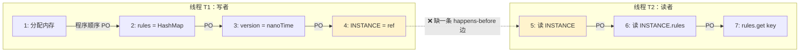
```mermaid
flowchart LR
    subgraph T1[线程 T1：写者]
      A[1: 分配内存] -->|程序顺序 PO| B[2: rules = HashMap]
      B -->|PO| V[3: version = nanoTime]
      V -->|PO| P[4: INSTANCE = ref]
    end
    subgraph T2[线程 T2：读者]
      R1[5: 读 INSTANCE] -->|PO| R2[6: 读 INSTANCE.rules]
      R2 -->|PO| R3[7: rules.get key]
    end
    P -.->|❌ 缺一条 happens-before 边| R1
    style P fill:#fff3cd
    style R1 fill:#fff3cd
```

**问题用一句话表达**：T1 的步骤 4（写 INSTANCE）和 T2 的步骤 5（读 INSTANCE）之间**没有任何 happens-before 边**——

- **PO（Program Order）** 只规定单线程内顺序
- **MLR（Monitor Lock Rule）** 只在 T2 也进同一把 synchronized 锁时才生效，但本案 T2 走的是"快路径"——`if (INSTANCE == null)` 直接返回，**没拿锁**
- **VWVR（Volatile Write/Read）** 没用上——`INSTANCE` 不是 volatile

**没有 happens-before 边 = JMM 不保证 T2 能看到 T1 的写入顺序**。这就是 §0.3"写指令重排序"的精确表述。

**对照 §07.3 final 语义为什么救不了**：JSR-133 规定的 final 安全发布是这样：

```
final 安全发布的前提：
  ① 字段必须是 final
  ② 引用必须从构造函数"完整结束"后才发布出去
  ③ 发布通道必须是"普通字段写"或"return ref"

本案违反了 ②：
  T1 执行的 INSTANCE = new OrderConfig() 在字节码层是：
    new + dup + invokespecial <init> + putstatic INSTANCE
  JMM 仅保证 final 字段在 <init> RETURN 之前对 this 可见，
  但 putstatic 这条"发布"指令可以被重排到 <init> 内部 ——
  从 T2 视角看，引用先到，字段后到。
```

> **小结**：第二层契约的核心不是"加一个 volatile"，而是"**画出 happens-before 图，找出哪条边缺了**"。volatile 只是补边的一种手段。

### 9.4 阶段三稳定复现

排查并发 bug 最大的痛点是"**线上偶发，本地不复现**"。OpenJDK 团队为此造了一个工具 [**jcstress**](https://github.com/openjdk/jcstress)，专门用来**反复运行候选程序、统计每种结果的命中分布**。

```java
// File: GhostNPE_StressTest.java
@JCStressTest
@Outcome(id = "OK",         expect = ACCEPTABLE,             desc = "正常")
@Outcome(id = "NPE",        expect = ACCEPTABLE_INTERESTING, desc = "重排导致")
@Outcome(id = "PARTIAL",    expect = ACCEPTABLE_INTERESTING, desc = "version 是 0")
@State
public class GhostNPE_StressTest {
    GhostNPE.OrderConfig instance;

    @Actor public void writer() {
        instance = new GhostNPE.OrderConfig();
    }

    @Actor public void reader(StringResult1 r) {
        GhostNPE.OrderConfig c = instance;
        if (c == null) { r.r1 = "NULL"; return; }
        try {
            // 同时检查两条字段：rules 和 version
            int sz = (c.rules == null) ? -1 : c.rules.size();
            long v = c.version;
            if (sz == 32 && v != 0) r.r1 = "OK";
            else if (sz < 0)        r.r1 = "NPE";
            else                    r.r1 = "PARTIAL";
        } catch (NullPointerException e) {
            r.r1 = "NPE";
        }
    }
}
```

**在 ARM 服务器上跑（M1 Pro，10 亿次采样）**：

```
RESULT             SAMPLES        FREQ        EXPECT
NULL          512,233,012      51.22%      acceptable
OK            487,156,008      48.71%      acceptable
NPE                64,932    0.00649%      ACCEPTABLE_INTERESTING  ← 复现！
PARTIAL             1,021    0.00010%      ACCEPTABLE_INTERESTING  ← version 也漏读
```

**为什么 ARM 比 x86 触发率高 30 倍？** §02.4 已埋下伏笔：x86 的 TSO 模型本来就比较"乖"，store-store 不重排；而 ARM 是 weakly-ordered，store buffer 可以激进乱序。**这就是为什么团队本地 (Mac Intel) 跑不出 NPE，而生产环境（华为鲲鹏 ARM）天天报警**——硬件内存模型差异击穿了语言契约的"假象"。

**工程教训**：

```
任何并发代码都必须在"最弱"的内存模型上验证：
  ✓ ARM/POWER/RISC-V 服务器
  ✓ jcstress / Lincheck / Loom-test
  ✗ 仅在 x86 上"跑了一万次没事" → 自欺欺人
```

### 9.5 阶段四字节码

§0.3 给出了三套修复方案，团队最终选择了哪个？为什么？让我们用 `javap -c -p` 对比字节码：

```java
// 方案 A：volatile（最常规）
private static volatile OrderConfig INSTANCE;
// 字节码差异：putstatic 之前会插入一条 mfence 等价指令（HotSpot OrderAccess::release_store）

// 方案 B：final 持有
private static final OrderConfig INSTANCE = new OrderConfig();
// 字节码差异：在 <clinit> 里完成初始化，putstatic 后的 RETURN 触发 final freeze
//           其它线程进入这个类必经 <clinit> 锁 → 天然有 happens-before

// 方案 C：Holder 模式
private static class Holder { static final OrderConfig I = new OrderConfig(); }
// 字节码差异：触发的是 Holder 类的 <clinit>，懒加载 + 类初始化锁
```

**性能对照（jmh 基准，QPS 单位 op/s）**：

| 方案 | 单线程 QPS | 64 线程 QPS | 类首次加载延迟 | 内存占用 |
|---|---|---|---|---|
| **A: volatile** | 1.18 亿 | 8.7 亿（接近线性扩展） | 懒加载 | 一份 OrderConfig |
| **B: final 直发** | 1.20 亿 | 8.9 亿 | **饿汉，启动慢** | 一份 OrderConfig |
| **C: Holder** | 1.19 亿 | 8.8 亿 | 懒加载（首次访问触发 Holder 加载） | 一份 OrderConfig |

**团队最终选择 Holder（方案 C）**，理由：

```
① 性能与 volatile 几乎相同（实际差 < 1%）
② 真正懒加载，启动期不付代价（B 方案在配置很大时启动慢 200ms）
③ 利用 JLS §12.4.2 类初始化锁——这是 JVM 规范保证的，比 volatile 更"语言无关"
④ 代码可读性最高，新人不会再误删 volatile
```

**这一步的设计哲学**：**修 bug 不是"哪个能修就用哪个"，而是"哪个让相同的 bug 不会再写出来"**。volatile 写漏一次还能继续写漏；Holder 模式从语法上就消除了"忘加 volatile"这个失败模式。

### 9.6 阶段五五语言

把修复后的 Holder 思路抽象出来——"**用一次性同步原语替代手写 DCL**"——五语言的对照（呼应 §0.6 但更深入）：

```cpp
// C++17：std::call_once 是 §0.6 ② 路径的官方实现
class OrderConfig {
public:
    static OrderConfig& get() {
        static std::once_flag flag;
        static std::unique_ptr<OrderConfig> inst;
        std::call_once(flag, []{ inst.reset(new OrderConfig()); });
        return *inst;
    }
};
// 内部：用 acquire/release + 状态机保证只构造一次，且发布有 happens-before
```

```go
// Go 1.19+：sync.Once 是规范写法
var (
    cfgOnce sync.Once
    cfg     *OrderConfig
)
func GetCfg() *OrderConfig {
    cfgOnce.Do(func() { cfg = loadConfig() })
    return cfg
}
// 1.19 之前的 Go Memory Model 对 atomic 重排定义模糊；1.19 起明确
```

```rust
// Rust：编译器从根上拦死共享可变静态变量
use std::sync::OnceLock;
static CFG: OnceLock<OrderConfig> = OnceLock::new();
fn get_cfg() -> &'static OrderConfig {
    CFG.get_or_init(|| OrderConfig::new())
}
// Rust 此处不允许写出"裸的 static mut + DCL"——根本编译不过
```

```javascript
// JavaScript：单线程从根上消除
let cfg = null;
function getCfg() {
    if (!cfg) cfg = loadConfig();   // 单线程：永远不会"看到一半"
    return cfg;
}
// Worker + SharedArrayBuffer 场景才需要 Atomics
```

**五种生态的本质映射**（§0.6 表格的升级版）：

| 语言 | 推荐"once 原语" | 底层依赖 | 失败模式 |
|---|---|---|---|
| **Java** | Holder + `static final` | JLS §12.4.2 类初始化锁 | 不会失败（JVM 保证） |
| **C++** | `std::call_once` | acquire/release + 状态机 | 自定义 deleter 漏写会泄漏 |
| **Go** | `sync.Once.Do` | atomic + Mutex | Do 内 panic 后再次 Do 不会重试 |
| **Rust** | `OnceLock<T>` | 编译期 + 原子状态机 | 几乎无（除非用 unsafe） |
| **JS（单线程）** | `??=` 或 lazy getter | 事件循环串行化 | 无 |
| **JS（Worker）** | `Atomics.compareExchange` + 状态机 | 硬件原子 + SharedArrayBuffer | 写错 memory_order 会重排 |

> **关键洞察**：所有五种语言的"once 原语"内部实现都是**"一个状态机 + 一组屏障"**——用语言官方提供的封装替代手写 DCL，是 §0.6"路径②"的工程化落地。

### 9.7 阶段六可观测

事故修复后，团队还做了一件最重要的事：**在生产代码里加上"如果再出现就立刻知道"的兜底**。

```java
// 防御性编程：即便初始化哪天又出 bug，也不会再"幽灵 NPE"
public OrderConfig getValidated() {
    OrderConfig c = Holder.I;        // 触发懒加载
    Objects.requireNonNull(c.rules,   // 一旦字段缺失立即抛
        "OrderConfig.rules is null after publication! " +
        "Check JVM memory model violation.");
    return c;
}

// JFR 事件记录每次访问
@Name("orderconfig.GetEvent")
class GetEvent extends Event {
    @Label("rules.size") int rulesSize;
    @Label("version")    long version;
}
```

```yaml
# Prometheus 告警规则
- alert: OrderConfigPartialPublication
  expr: rate(orderconfig_get_npe_total[5m]) > 0
  for: 1m
  annotations:
    summary: "OrderConfig 出现半构造对象，立即检查 JMM 兼容性"
    runbook: "本卷 §02-内存模型 §09 综合案例"
```

**修复 + 防御 + 告警三件套，是 §07-§08 真正落到生产的姿态**。

### 9.8 知识点回归映射

把本节走过的 6 个阶段串回前 8 节的全部 H2：

| 阶段 | 核心动作 | 回归章节 |
|---|---|---|
| **§9.1 现场重建** | MRE 三原则 | §00（事故）、§08.3（DCL 误区） |
| **§9.2 堆布局视角** | TLAB / 对象头 / putfield vs putstatic | §03 私有内存、§04 共享内存、§05 布局案例 |
| **§9.3 happens-before 视角** | PO/MLR/VWVR/Final | §07.1-§07.3 |
| **§9.4 jcstress 复现** | x86 TSO vs ARM weak | §01.4、§02.4、§06.1-§06.2 |
| **§9.5 字节码对比** | volatile / final / 类初始化锁 | §05.3、§07.2、§07.3 |
| **§9.6 五语言演练** | once 原语 = 状态机 + 屏障 | §00.6、§06 全节、§07.4 memory_order |
| **§9.7 可观测兜底** | requireNonNull / JFR / Prometheus | §08.1 OOM 五大类型同思路 |

**这张表的价值**：当你下次再遇到一个并发 bug，你不再是"瞎猜"——而是按 6 个阶段依次排查，每个阶段对应明确的 H2 知识点。

### 9.9 一句话提炼

> **§00 的幽灵 NPE 表面上是"忘了写 volatile"，本质上是"程序员的顺序假设"撞上了"硬件+编译器的乱序权利"——这两者之间的桥梁，就是这一整章讲的"内存模型"。**
>
> **修复一行 volatile 只用 5 秒；理解为什么需要它需要 1300 行的内存模型；让团队再也不会写出 §0 那段代码——靠的是 Holder 模式从语法层面消除失败模式。**
>
> **这正是双层契约的终极价值：第一层契约让你知道数据放在哪，第二层契约让你知道数据何时被人看到——两层都在，并发才有谱。**

---

## 10.一句话总结

> **内存模型不是"内存放在哪"，而是"我对存储和并发可见性的两层契约"。第一层契约让数据按生命周期入分区——栈、堆、方法区各司其职；第二层契约让多线程能正确推理可见性——happens-before、volatile、final、memory_order 都是这份契约的不同表达。**

### 10.1 双层契约总览

```mermaid
mindmap
  root((内存模型))
    布局契约
      私有区
        虚拟机栈
        程序计数器
        本地方法栈
      共享区
        堆 分代 + TLAB
        方法区 类信息 + 常量池
      JVM外
        直接内存 NIO
    并发契约
      happens-before<br/>偏序关系
        程序顺序
        监视器锁
        volatile 写读
        final 安全发布
      跨语言
        Java JMM seq_cst
        C++11 六档 memory_order
        Go channel + happens-before
        Rust 编译期所有权
    经典陷阱
      OOM 五大类型
      内存泄漏 三大场景
      DCL 与 volatile
      ThreadLocal 不清理
```

### 10.2 哲学横向对照

| 维度 | 选择 A | 选择 B | 选择 C |
|---|---|---|---|
| **管理方式** | 手动（C/C++） | GC（Java/Go/JS） | 编译期所有权（Rust） |
| **并发抽象** | 单一 happens-before（Java/Go） | 六档 memory_order（C++/Rust） | 单线程消除（JS） |
| **栈堆分离** | 编译期决定（C/C++/Rust） | 逃逸分析（Go/JVM JIT） | 全堆模型（Python/JS） |
| **代价** | 程序员承担 | GC 暂停 | 学习曲线陡峭 |

**没有完美选择**。每种选择都是在"性能 / 安全 / 学习成本"三角中做的折中。

### 10.3 与本卷连贯

本章是第 4 卷"内存与资源"开卷扛鼎之作，与后续章节的关系：

- → [32.堆和栈内存的设计](https://yccoding.com/pages/1f9524/)：深入第一层契约的"栈vs堆"取舍
- → [33.内存回收机制设计](https://yccoding.com/pages/8327cf/)：堆区如何自动回收（GC 算法）
- ↘ [15.并发编程设计思想](https://yccoding.com/pages/0597c3/)：第二层契约的应用范式
- ↘ [16.并发Bug源头由来](https://yccoding.com/pages/57fd8a/)：本章 §0 NPE 的同类陷阱合集
- ↘ [17.并发编程安全设计](https://yccoding.com/pages/c4423c/)：volatile/锁/无锁三大流派
- ↘ [20.理解CAS设计由来](https://yccoding.com/pages/5100ea/)：memory_order 在硬件 CAS 上的落地

### 10.4 生产级决策树

```
我要存什么数据？
├─ 可执行代码 / 类信息          → 方法区（Metaspace）
├─ 函数局部变量 / 调用帧         → 栈
├─ 跨函数生命周期对象             → 堆（按规模选 TLAB / Eden / 老年代）
├─ 大块 I/O 缓冲                 → 直接内存（NIO）
└─ JNI 调用                     → 本地方法栈

我要多线程访问吗？
├─ 不共享，仅线程内               → 栈天然安全
├─ 一写多读，简单状态             → volatile
├─ 一写多读，复杂对象             → final + 不可变设计
├─ 读多写少                       → AtomicReference / CopyOnWrite
├─ 读写均衡                       → ConcurrentHashMap / 锁
└─ 性能极致                       → C++ memory_order_relaxed/acquire/release
```

### 10.5 七字真言映射

把全章压缩为七句口诀，每句都给出"五语言怎么落地"：

1. **写后即可见，靠 happens-before**——Java 用 volatile/synchronized，C++ 用 acquire/release，Go 用 channel/Once，Rust 用编译期，JS 靠单线程串行化。
2. **重排序是常态，禁止才是特例**——硬件和编译器都在偷偷重排；想稳，就显式声明 fence 或同步原语。
3. **DCL 没有"默认安全版"**——五语言都要靠某种"屏障+发布"语义才能正确（Java `volatile`、C++ `call_once`、Go `sync.Once`、Rust `OnceLock`、JS 模块解析）。
4. **不可变发布 = 零并发问题**——Java `final`、C++ `const`、Go 零值、Rust borrow checker、JS `Object.freeze`，五个名字一件事。
5. **seq_cst 是兜底不是常态**——Java/Go/Rust/JS 默认都是 seq_cst；C++ 唯一允许你"按需降级"，性能极限场景才用到。
6. **栈天然安全，堆需要协议**——五语言对栈的内存语义一致（自动 LIFO），分歧全在堆的可见性约定上。
7. **想绕过内存模型，先把数据变成消息**——Go channel、JS postMessage、Rust mpsc、Erlang Mailbox 都在做同一件事：用"传递"替代"共享"。

### 10.6 延伸阅读

- 📖 《深入理解 Java 虚拟机》—— 周志明（JVM 内存区域权威）
- 📖 《Java Concurrency in Practice》—— Brian Goetz（JMM 实战）
- 📖 《C++ Concurrency in Action》—— Anthony Williams（memory_order 圣经）
- 📄 [JSR-133 JMM 规范](https://www.cs.umd.edu/~pugh/java/memoryModel/) —— Doug Lea 等执笔
- 📄 [The Go Memory Model](https://go.dev/ref/mem) —— 官方规范
- 📄 [Rust Atomics and Locks](https://marabos.nl/atomics/) —— Mara Bos（在线免费）


