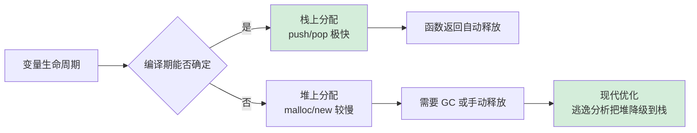
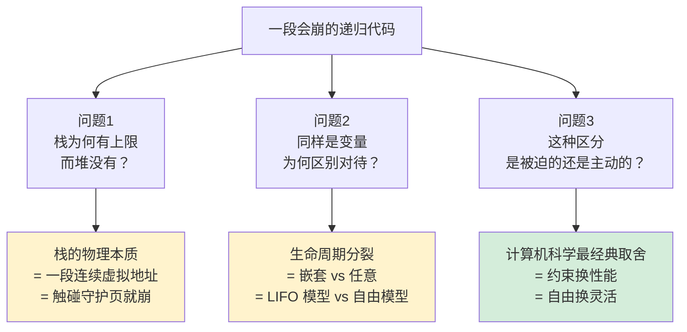
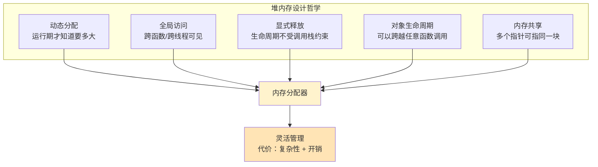
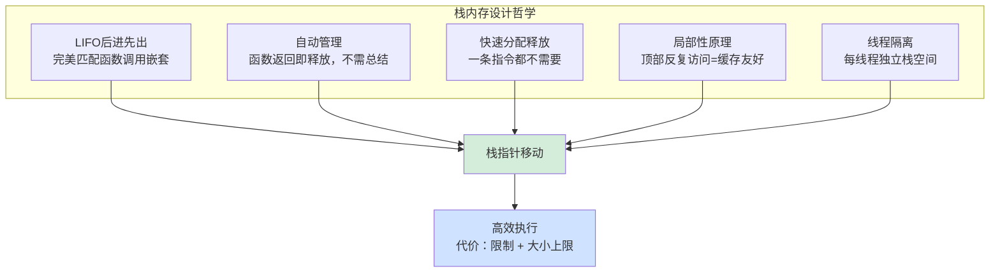
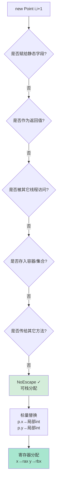
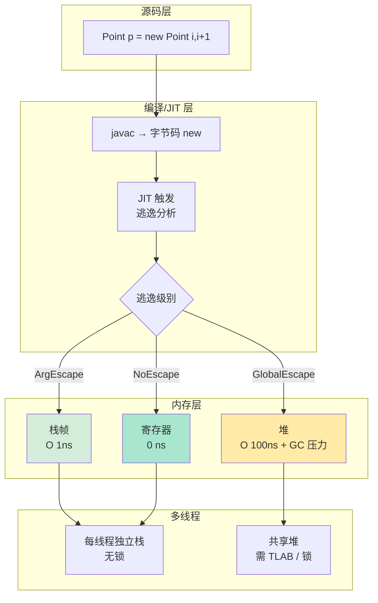

# 32.堆和栈内存的设计

> 📍 **本篇位置**：第 4 卷 · 内存与资源 · 第 2 篇
> 🎯 **核心矛盾**：**栈的快速 vs 堆的灵活** —— 一个在编译期就定生死，一个随运行期自由膨胀
> 🧭 **设计灵魂**：栈 = **LIFO + 自动释放**，堆 = **自由分配 + 需要回收**；现代语言的"逃逸分析"正是在消灭"不必在堆上"的分配
> 🌐 **跨语言覆盖**：C/C++(明确分清 stack/heap) · Java(基本类型栈 + 对象堆 + 逃逸分析) · Go(编译器自动决定堆栈) · Rust(默认栈 + Box 显式堆) · JavaScript(基本类型栈 + 对象堆)
> 🔗 **延伸阅读**：← [31.内存模型技术设计](https://yccoding.com/pages/cae9f3/) · → [33.内存回收机制设计](https://yccoding.com/pages/8327cf/) · → [34.多种引用技术设计](https://yccoding.com/pages/9ff724/)



---

#### 目录介绍
- [00.从一个深夜事故说起](#00从一个深夜事故说起)
  - [0.1 一个递归引发的雪崩](#01-一个递归引发的雪崩)
  - [0.2 三个本质问题](#02-三个本质问题)
  - [0.3 栈溢出在五种语言](#03-栈溢出在五种语言)
- [01.核心设计思想](#01核心设计思想)
  - [1.1 为何分堆和栈](#11-为何分堆和栈)
  - [1.2 栈设计思想](#12-栈设计思想)
  - [1.3 堆设计思想](#13-堆设计思想)
- [02.设计哲学探索](#02设计哲学探索)
  - [2.1 堆设计哲学](#21-堆设计哲学)
  - [2.2 栈设计哲学](#22-栈设计哲学)
  - [2.3 栈和堆原理](#23-栈和堆原理)
- [03.栈的完整机制](#03栈的完整机制)
  - [3.1 硬件支持](#31-硬件支持)
  - [3.2 栈帧结构](#32-栈帧结构)
  - [3.3 栈内存案例](#33-栈内存案例)
- [04.堆的完整机制](#04堆的完整机制)
  - [4.1 堆分层架构](#41-堆分层架构)
  - [4.2 malloc设计](#42-malloc设计)
  - [4.3 堆内存案例](#43-堆内存案例)
- [05.多线程场景](#05多线程场景)
  - [5.1 栈是线程安全](#51-栈是线程安全)
  - [5.2 堆需处理并发](#52-堆需处理并发)
- [06.堆和栈性能](#06堆和栈性能)
  - [6.1 性能指标](#61-性能指标)
  - [6.2 量化案例](#62-量化案例)
  - [6.3 结果分析](#63-结果分析)
  - [6.4 深层原因](#64-深层原因)
  - [6.5 核心结论](#65-核心结论)
- [07.跨语言策略对照](#07跨语言策略对照)
  - [7.1 C++手动管理](#71-c手动管理)
  - [7.2 Java栈堆分流](#72-java栈堆分流)
  - [7.3 Go编译器决策](#73-go编译器决策)
  - [7.4 Rust所有权制](#74-rust所有权制)
  - [7.5 跨语言对比表](#75-跨语言对比表)
- [08.经典陷阱与反模式](#08经典陷阱与反模式)
  - [8.1 栈溢出陷阱](#81-栈溢出陷阱)
  - [8.2 悬空指针陷阱](#82-悬空指针陷阱)
  - [8.3 释后使用双释](#83-释后使用双释)
  - [8.4 内存泄漏陷阱](#84-内存泄漏陷阱)
  - [8.5 伪共享陷阱](#85-伪共享陷阱)
- [09.综合案例串讲](#09综合案例串讲)
  - [9.1 看似无害的一段代码](#91-看似无害的一段代码)
  - [9.2 六阶段全链路](#92-六阶段全链路)
  - [9.3 逃逸分析判定](#93-逃逸分析判定)
  - [9.4 对比实验性能](#94-对比实验性能)
  - [9.5 五语言同招数](#95-五语言同招数)
  - [9.6 完整链路回归图](#96-完整链路回归图)
  - [9.7 知识点回归映射](#97-知识点回归映射)
  - [9.8 一句话提炼](#98-一句话提炼)
- [10.一句话总结](#10一句话总结)
  - [10.1 栈堆决策树](#101-栈堆决策树)
  - [10.2 七字真言映射](#102-七字真言映射)

---

## 00.从一个深夜事故说起

### 0.1 一个递归引发的雪崩

2024 年某个工作日的凌晨 1 点，我们的对账服务突然告警——所有任务全部 `StackOverflowError` 崩溃。值班同学翻日志，发现同一行代码刷屏：

```java
// 简化后的对账代码
public BigDecimal sumOrders(List<Order> orders) {
    return sumRecursive(orders, 0);
}

private BigDecimal sumRecursive(List<Order> orders, int idx) {
    if (idx == orders.size()) return BigDecimal.ZERO;
    return orders.get(idx).getAmount()
            .add(sumRecursive(orders, idx + 1));   // 尾递归，但 JVM 不优化
}
```

这段代码在 QA 环境跑了半年都没事——QA 数据每天最多 5000 笔订单。但凌晨那批历史数据补录有 **48 万笔**。 48 万次递归调用，把 1MB 的线程栈撑爆了。

第一个修复想法很自然：**"把它改成循环不就行了？"** 但事故复盘会上有人追问：

- 为什么 `for` 循环能处理 4800 万行，递归连 5 万行都撑不住？
- 为什么栈这么"小气"，不能像堆一样自动扩容？
- 同样是"放变量"，为什么这俩待遇差这么多？

这三个问题，正是本章要回答的核心。

### 0.2 三个本质问题



这三个问题层层递进——从**现象**（崩了）追到**机制**（为什么），再到**哲学**（为什么必然这样设计）。**接下来每一节都在回答其中之一**：

| 问题 | 答案章节 | 关键洞察 |
|---|---|---|
| 为什么必须分堆和栈？ | §1.1 / §2.3 | 数据生命周期的两种模式天然不可统一 |
| 栈为什么这么快？ | §3.1 / §3.2 / §6.4 | CPU 硬件直接支持 + 缓存极致命中 |
| 堆为什么这么贵？ | §4.1 / §4.2 / §6.4 | 自由度的代价：搜索 + 元数据 + 同步 |
| 怎么减少堆分配？ | §7.3 / §7.4 | 逃逸分析、所有权——"把堆降级回栈" |
| 哪些坑必须避开？ | §8.x | 五个真实生产事故复盘 |

### 0.3 栈溢出在五种语言

§0.1 的对账雪崩是 Java 版的——但**栈溢出是所有"用栈调用函数"的语言都有的现象**。下表把同一类崩溃（`fib(n=100000)` 这种深递归）平铺到五种语言，能看出每个 runtime 的不同性格：

| 语言 | 默认栈大小 | 崩溃报错 | 栈是否可增长 | 备注 |
|---|---|---|---|---|
| **C / C++** | 8 MB（Linux）/ 1 MB（Windows） | `Segmentation fault`（写穿守护页） | ❌ 不可增长 | 没有栈守卫报错，直接段错误，调试要看 core dump |
| **Java** | `-Xss` 控制，默认 512 KB ~ 1 MB | `java.lang.StackOverflowError`（可 catch） | ❌ 不可增长 | JVM 主动检测、抛 Throwable，**唯一能 catch 的栈溢出** |
| **Go** | **初始 8 KB**，最大 1 GB | `runtime: goroutine stack exceeds 1000000000-byte limit` | ✅ 可增长 | 编译器插入栈检测代码，超限时复制到更大栈段 |
| **Rust** | 主线程 8 MB / 子线程 2 MB（可调） | `thread '...' has overflowed its stack` | ❌ 不可增长 | 栈守卫页触发后 abort 进程，不可 catch |
| **JavaScript (V8)** | ~1 MB（与 isolate 配置相关） | `RangeError: Maximum call stack size exceeded`（可 catch） | ❌ 不可增长 | V8 软限制，单线程模型下不会跨任务污染 |

**这张表最反常识的是 Go**——它的栈**默认只有 8 KB**，但能放心写深递归。秘诀：

```
Go 编译器在每个函数序言里插入"栈空间检查"指令
当检测到栈快用完 → 申请新的 2x 大小的栈段 → 把所有内容 memcpy 过去
所以 Go 的栈是"可生长的栈"——同样的递归代码，Go 跑得动，Java/Rust 崩
代价：每次函数调用多几条指令；栈增长瞬间有 STW（仅本 goroutine）
```

**这就引出一个延伸思考**：为什么 Java 不学 Go 让栈可增长？答案是 **"Java 的指针都是 JVM 引用 + 栈帧含对象指针，移动栈要 fix 所有引用"**——技术债。这种"语言早期设计决策的不可逆性"是工程上的真实代价，§7 会展开讲各语言的取舍。

---

## 01.核心设计思想

### 1.1 为何分堆和栈

计算机内存只是一个巨大的字节数组，本身不区分"堆"和"栈"。分区是**软件层面的设计决策**——但这个决策不是某个委员会拍脑袋决定的，而是被两种本质不同的数据生命周期"逼"出来的。

**第一性追问：从生命周期开始看**

程序里的所有数据，按生命周期可以分成两类：

| 需求特征 | 典型场景 | 生命周期 | 大小 |
|---------|---------|---------|------|
| 确定的、短暂的、有层级的 | 函数局部变量、返回地址 | 函数进入→函数返回 | 编译时已知 |
| 不确定的、跨越函数的 | 动态创建的对象、用户输入的数据 | 程序员/GC 决定 | 运行时才知 |

这两种生命周期有一个关键差异：**前者是嵌套的（nested），后者是任意的（arbitrary）**。

```
嵌套生命周期（函数调用）：     任意生命周期（对象创建）：

  main()  ┌─────────────┐       obj A ────────┐
          │  caller()   │       obj B ──┐     │
          │ ┌─────────┐ │       obj C ──┼─┐   │
          │ │ callee()│ │              │ │   │
          │ └─────────┘ │              ▼ ▼   ▼
          └─────────────┘       生命周期可重叠/交叉
  完美的 LIFO 嵌套
```

**反向假设：如果只有一种内存区域**

用堆解决所有问题（极端方案 1）：

```c
void func() {
    int* x = malloc(sizeof(int));   // 局部变量也得 malloc
    *x = 42;
    // ... 用完 ...
    free(x);
}
// 100 行代码里 50 个局部变量 → 100 次 malloc/free
// 每次调用都触发 ~50ns × 100 = 5μs 纯分配开销
// 函数调用频次 1000 万/秒 → CPU 全花在分配上
```

用栈解决所有问题（极端方案 2）：

```c
Node* createList() {
    Node head;       // 栈上分配
    head.next = ...;
    return &head;    // 返回栈地址 → 函数返回栈帧销毁 → 悬空指针
}
// 跨函数生命周期的数据无处安放
```

**两种方案都不可行**——它们各自在另一种生命周期模式上彻底崩盘。**栈为"确定性"而生，堆为"灵活性"而生**，这不是设计偏好，而是被数据生命周期的物理属性逼出来的。

**更深一层：CPU 函数调用机制本身就要求栈**

冯·诺依曼架构的函数调用满足三个铁律：

1. **嵌套**：A 调 B，B 调 C，必然 C 先返回，再 B，再 A（LIFO）
2. **要保存返回地址**：CALL 指令需要把 RIP 推到某处
3. **要保存现场**：被调用函数要保留调用者的寄存器

这三件事拼起来，**几乎在数学上等价于一个栈结构**。所以 CPU 直接给栈配了硬件指令（PUSH/POP/CALL/RET）和专用寄存器（RSP）——栈不是软件加的概念，**它从 CPU 指令集层面就被钦定了**。

而程序创建的数据对象不遵循 LIFO（一个对象可以被任意函数持有、任意时刻销毁），需要自由分配/释放，这就是堆。

### 1.2 栈设计思想

**核心命题**：栈是"用约束换极致性能"的典型代表——它**故意放弃了大量自由度**，换来其他内存模型望尘莫及的速度。

**推演过程：约束如何变成性能**

```
约束 1：只能在顶部操作（LIFO）
  ↓
  分配位置不需要搜索 → 永远在 RSP 指向的位置
  ↓
  分配 = sub rsp, N      （1 条指令）
  释放 = add rsp, N      （1 条指令）

约束 2：大小在编译期确定
  ↓
  不需要运行时元数据（不需要记"这块多大"）
  ↓
  没有 header 开销，没有空闲表

约束 3：连续分配
  ↓
  天然无碎片（碎片只能出现在"中间块被释放"时，而 LIFO 永远不会）

约束 4：每线程独立
  ↓
  天然线程安全，不需要任何同步原语

约束 5：栈顶反复使用同一片小区域
  ↓
  时间局部性 + 空间局部性 → L1 命中率 ~99%
```

**关键洞察：约束的乘法效应**

这五个约束**不是相加而是相乘**——它们互相强化：

- 因为 LIFO，所以无碎片；因为无碎片，所以无元数据；因为无元数据，所以更小更快更命中缓存
- 因为每线程独立，所以无锁；因为无锁，所以无 cache-line 弹跳；因为无弹跳，所以多核扩展性满分

**这就是为什么栈分配能比堆分配快 50 倍以上——不是某一项快，而是每一项都快，且互相加成。**

栈是一种**被故意限制了能力的内存管理方式**。正因为限制了使用方式（只能从顶部操作），才能做到极致简单和极致快。**这是计算机系统设计中"少即是多"哲学最纯粹的体现。**

### 1.3 堆设计思想

**核心命题**：堆与栈是镜像关系——栈是"放弃自由换性能"，堆是"放弃性能换自由"。两者都是最优解，只是优化目标不同。

**推演过程：自由如何变成代价**

```
自由 1：任意时刻分配任意大小
  ↓
  必须有一张"哪里有空、空多大"的地图（空闲表/树）
  ↓
  分配 = 在地图里搜索合适的块 → O(log n)~O(n)

自由 2：任意时刻释放任意块
  ↓
  释放点不再连续 → 出现"中间空、两边占用"的碎片
  ↓
  必须做合并：检查左右邻居是否也空闲 → 复杂的边界判断

自由 3：每块大小可任意
  ↓
  必须为每块附带元数据（size、是否已用、前后指针）
  ↓
  malloc(1) 实际占用 32 字节 = 16B header + 16B 最小数据

自由 4：跨线程共享
  ↓
  多线程同时 malloc 必须协调
  ↓
  需要锁/CAS/per-CPU 缓存等复杂机制

自由 5：分配顺序 ≠ 访问顺序
  ↓
  对象在地址空间里散落
  ↓
  缓存命中率 ~50-70%（远低于栈的 95%+）
```

**核心代价对照表**：

```
核心自由：任意时刻分配任意大小，任意时刻释放任意块

付出的代价：
  分配 = 搜索空闲块 + 分割      O(1)~O(n)
  释放 = 合并相邻空闲块          O(1)~O(log n)
  碎片                          内部碎片 + 外部碎片
  元数据开销                     每块需要记录大小、状态等
  缓存不友好                     分配顺序 ≠ 访问顺序
  并发开销                       锁/CAS/arena
```

**关键洞察：堆的复杂性是"被迫的"**

你可能会问："既然堆这么贵，能不能优化掉？"——**答案是不能**，因为这些代价不是实现质量问题，而是"自由度"在物理世界的必然代价：

- 想任意分配 → 必须搜索 → 必须有元数据
- 想任意释放 → 必须合并 → 必须维护邻居关系
- 想跨线程共享 → 必须同步 → 必须付出 CAS/锁开销

**这正是为什么六十年来世界上所有的优秀分配器（dlmalloc/tcmalloc/jemalloc/mimalloc）做的事情高度相似——它们都在同一个根本性约束下挣扎**：用各种缓存、分级、线程本地化的技巧把自由度的代价摊薄，但**永远无法降到栈的水平**。

## 02.设计哲学探索

### 2.1 堆设计哲学

上一节从"发生了什么"（机制）的角度看堆，这一节要从"为什么必须这样"（哲学）的角度重新看它。

**五个哲学支柱**：



**哲学之间的依赖不是独立的**。你要"动态分配"，就必然要"运行期决定生命周期"；你要"跨函数生命周期"，就必然要"全局访问"；你要"多指针共享"，就必然要"引用计数/GC"来判定何时释放。**五个设计点是一个闭环的逻辑系统**，抽掉任何一个堆都不成立。

**关键洞察：堆本质上是"占用生命周期与调用栈生命周期解耦"**。这句话每个字都重要：
- 栈：生命周期 ≡ 调用栈帧生命周期（紧帊定）
- 堆：生命周期 独立于 调用栈（以 GC 或手动释放控制）

一旦解耦，就必须有个东西来接管释放决策——要么是程序员（C/C++，代价是心智开销 + 内存安全 bug），要么是运行时（Java/Go，代价是 GC 暂停 + CPU 占用），要么是编译器（Rust，代价是学习曲线）。**谁都逃不过这三选一**。

### 2.2 栈设计哲学

栈的哲学与堆正好镜像对称。栈不是"设计出来的"，而是"**函数调用这个现象本身带出来的**"。

**五个哲学支柱**：



**关键洞察：栈是"扪平函数调用抽象"的副产品**

你可以把栈理解为一个状态机的“快照贴"：

- 每个函数是一个状态机的一次"运行实例"
- 实例需要保存状态（局部变量 + 返回地址）
- 调用肨主要那个位置“还​原”，所以调用肨状态还在等他

这是一个天生的 LIFO 结构。栈不是"为了快"才 LIFO，而是"函数本来就 LIFO"才使得栈能这么快。**如果未来出现一种不遵循 LIFO 的调用模型，堆栈设计就会被推倍**——事实上协程就是这样，遵循"挂起/恢复"而非 LIFO 调用，所以协程要么用动态栈抽象（stackful）、要么用状态机抽象（stackless），都不是传统意义上的栈。

**哲学总结**：栈是“嵌套调用"这个抽象在内存上的映射，是函数哲学的必然产物，不是某个工程师拍脑袋决定的。

### 2.3 栈和堆原理

```
          栈                                堆
  ────────────────────          ────────────────────
  约束：LIFO                    自由：任意顺序分配释放
  ↓                             ↓
  分配 = 移指针                  分配 = 搜索+切割
  释放 = 移回指针                释放 = 归还+合并
  ↓                             ↓
  O(1) 确定性延迟               O(1)~O(n) 不确定延迟
  零碎片                         有碎片
  零元数据                       16 字节/块元数据
  缓存命中率极高                  缓存命中率不确定
  ↓                             ↓
  CPU 提供硬件支持               无专用硬件
  (RSP, PUSH, POP, CALL, RET)   (纯软件管理)
  ↓                             ↓
  每线程独立，天然线程安全         共享，需要锁/分区
  ↓                             ↓
  大小固定（默认8MB）             可增长到虚拟地址空间上限
  生命周期绑定函数调用             生命周期由程序员/GC 控制
```

**设计哲学的本质**：

栈和堆体现了系统设计中最经典的取舍——**约束 vs 自由**。

栈选择了最严格的约束（LIFO、编译时确定大小、绑定函数生命周期），换来了最极致的性能（一条指令分配、零碎片、硬件支持）。

堆选择了最大的自由度（任意时刻、任意大小、任意生命周期），付出了复杂性的代价（搜索算法、碎片管理、并发控制、GC）。

**二者不可互相替代**——栈处理不了动态大小和跨函数生命周期，堆达不到栈的性能。这就是为什么六十年来，每一种编程语言、每一个操作系统，都保留了堆和栈的二元设计。

## 03.栈的完整机制

### 3.1 硬件支持

为什么栈是唯一有 CPU 硬件直接支持的内存区域？这个问题推到起源就变成了“鸡生蛋还是蛋生鸡"：不是 CPU 选择了栈，而是**函数调用这个需求逼着 CPU 设计了栈指令**。

CPU 专门为栈设计了寄存器和指令：

```
x86:
  RSP (Stack Pointer)   — 永远指向栈顶
  RBP (Base Pointer)    — 指向当前栈帧的底部（可选）
  PUSH reg              — RSP -= 8; [RSP] = reg   （一条指令完成）
  POP  reg              — reg = [RSP]; RSP += 8
  CALL addr             — PUSH RIP; JMP addr       （保存返回地址+跳转）
  RET                   — POP RIP                   （恢复返回地址+跳回）

ARM:
  SP  (Stack Pointer)
  LR  (Link Register)   — 存返回地址，不需要压栈（一级调用时）
  STP/LDP               — 成对压入/弹出寄存器
```

**栈是唯一有 CPU 硬件直接支持的内存区域。** 堆没有专门的硬件指令。

**推演过程：为什么 CPU 抽出一个寄存器专门服务栈？**

```
问题 1：如果不设专用寄存器，每次压栈要怎么做？
  → 读“顶位置"变量” → 加 8 → 写回“顶位置"变量” → 实际写入 = 4 次访存
问题 2：函数调用频率有多高？
  → 现代程序每秒几亿次调用 → 这是热点中的热点
问题 3：优化热点 → 为高频操作设专用硬件
  → RSP 作为专用寄存器不出入内存
  → PUSH/POP 独立为原子指令
  → CALL/RET 隱含压栈/弹栈
```

**这是计算机体系结构上“热点优化"思想的经典例子**——你只要检查编译后任何一段代码的汇编，**平均每 5-10 条指令就会出现一次与栈相关的操作**，设专用硬件是唯一合理选择。

**进一步推论：深圳静态预测**

CPU 还给栈访问加了 store buffer、stack engine 等多重优化：

- **Stack Engine**：现代中高端 CPU（Intel Sandy Bridge 以后）会识别连续的 push/pop 指令，在后端合并为单个微操作
- **Return Stack Buffer (RSB)**：CPU 为 CALL/RET 专门设计了预测堆栈，预测成功率 >99%
- **Stack Probe**：预测到栈需要扩展时提前触发页表加载

一个走栈的函数调用 CPU 有几十亿个晶体管伺候着。这些优化**堆一个也享受不了**。

### 3.2 栈帧结构

每次函数调用在栈上创建一个**栈帧（Stack Frame）**，这个栈帧反映了一个函数“独立运行实例"需要的一切信息：

```
高地址
┌────────────────────┐
│  调用者的栈帧          │
├────────────────────┤ ← 调用前的 RSP
│  返回地址 (8 bytes)    │ ← CALL 指令自动压入
├────────────────────┤
│  保存的 RBP           │ ← 可选，用于栈回溯
├────────────────────┤ ← RBP 指向这里
│  局部变量 a (4 bytes)  │ ← RBP - 4
│  局部变量 b (4 bytes)  │ ← RBP - 8
│  局部变量 buf[32]      │ ← RBP - 40
├────────────────────┤ ← RSP 指向这里
│  （下一次调用的空间）    │
低地址
```

**为什么栈帧要设计成这样？逐层推演**：

**为什么需要返回地址？**

```
A() 调用 B()
B() 执行完​需要跳回 A() 中 B 调用后的下一条指令
  → 这个"下一条指令"的地址必须在 B 执行期间被保存着
  → 不能只依靠寄存器（因为 B 可能会嵌套调用 C，C 会覆盖同一个寄存器）
  → 必须压栈
```

**为什么需要保存 RBP？**

```
B() 执行期间会修改 RBP（指向 B 自己的栈帧底部）
B() 返回后 A() 需要恢复自己的 RBP
  → 压栈保存 → 返回时弹出恢复
```

**为什么局部变量要从高地址向低地址排列？**

```
栈本身向低地址增长（x86 传统）
RSP 从高地址走向低地址
  → 新入栈的局部变量肯定在 RSP 附近的低地址
  → RBP 以上是调用者的栈帧，RBP 以下是本函数的
  → 用 RBP-N 访问局部变量（N 恒为正数，常量偏移）
```

**为什么调用者保存 vs 被调用保存（caller-saved vs callee-saved）？**

这是个结果跨 ABA 定的优化：部分寄存器“调用者负责保存"（如果调用者需要保证调用后还能用），部分“被调用负责保存"（被调用函数如果要用它，必须先保存再恢复）。这样设计**避免了一些不必要的压栈操作**——如果 B 根本不使用某个 callee-saved 寄存器，就不需要保存。

**为什么栈帧要 16 字节对齐？**

x86-64 SIMD 指令（SSE/AVX）要求 16/32 字节对齐读写。为了让任何函数都能随时使用 SIMD，ABI 规定函数入口处 RSP 必须 16 字节对齐。**这个限制一发出，所有函数都必须遵从**，即使函数本身不用 SIMD。

**这些设计决策听上去都是细节，但拼起来就是一个严谨的 ABI（应用二进制接口）**——不同语言、不同编译器产生的代码之所以能互调用，全指望栈帧布局是同一套。
### 3.3 栈内存案例


```cpp
int add(int x, int y) {
  int result = x + y;
  return result;
}

int main() {
  int a = 10;
  int b = 20;
  int c = add(a, b);
  return 0;
}
```

**x86-64 Linux（System V ABI）** 下的执行过程：

```
Step 1: main() 开始执行
  RSP = 0x7FFF_0100

  栈状态:
  0x7FFF_0100 │              │ ← RSP

Step 2: int a = 10; int b = 20;
  编译器将 a, b 分配在栈上（或直接用寄存器）
  实际上 x86-64 前6个整数参数用寄存器传递
  a → 栈上 [RSP-4]
  b → 栈上 [RSP-8]
  RSP -= 16 (对齐)

  0x7FFF_00F0 │ b = 20       │ ← RSP
  0x7FFF_00F4 │ a = 10       │
  0x7FFF_0100 │ ...          │

Step 3: 调用 add(a, b)
  // 参数通过寄存器传递（x86-64 ABI）
  MOV  EDI, 10        // 第一个参数 → EDI
  MOV  ESI, 20        // 第二个参数 → ESI
  CALL add            // RSP -= 8, 压入返回地址, 跳转到 add

  0x7FFF_00E8 │ 返回地址      │ ← RSP (CALL 自动压入)
  0x7FFF_00F0 │ b = 20       │
  0x7FFF_00F4 │ a = 10       │

Step 4: add() 函数体
  // 序言(prologue)
  PUSH RBP            // 保存调用者的 RBP
  MOV  RBP, RSP       // 建立新栈帧

  // int result = x + y
  LEA  EAX, [EDI+ESI] // result = x + y（直接在寄存器算）

  // 尾声(epilogue)
  POP  RBP            // 恢复调用者的 RBP
  RET                 // POP RIP, 跳回 main

Step 5: 返回 main()
  RET 执行后:
  - RSP 恢复到 0x7FFF_00F0
  - 返回值在 EAX 中 (= 30)
  - add 的栈帧瞬间"消失"（RSP 移回去，数据还在但逻辑上已无效）
```

**关键洞察**：

1. **分配 = RSP 减一个常数**（一条 `SUB RSP, N` 指令），不需要搜索空闲块
2. **释放 = RSP 加回去**（一条 `ADD RSP, N`），不需要合并、不需要标记
3. **栈上的"旧数据"不会被清零**——只是 RSP 移过去了，下次调用会覆盖。这就是为什么未初始化的局部变量是"垃圾值"
4. **函数返回后访问局部变量的地址是未定义行为**——数据可能还在，但随时会被下一次函数调用覆盖

## 04.堆的完整机制

### 4.1 堆分层架构

```
应用程序
  │  malloc(32)
  ▼
┌──────────────────────────────────────────────┐
│ 用户态分配器 (glibc malloc / tcmalloc / jemalloc) │
│                                              │
│  维护空闲链表/空闲树，从已有的大块中切小块      │
│  大多数分配在这一层就完成了，不需要系统调用       │
└──────────────┬───────────────────────────────┘
               │ 空间不够时
               ▼
┌──────────────────────────────────────────────┐
│ 系统调用                                      │
│  brk/sbrk  → 扩展进程数据段（连续）            │
│  mmap      → 映射新的虚拟内存区域（不连续）      │
└──────────────┬───────────────────────────────┘
               │
               ▼
┌──────────────────────────────────────────────┐
│ 内核虚拟内存管理                               │
│  分配虚拟页，加入进程的 VMA 链表                │
│  此时还没有分配物理内存！                        │
└──────────────┬───────────────────────────────┘
               │ 首次访问时触发 Page Fault
               ▼
┌──────────────────────────────────────────────┐
│ 物理页帧分配 (Buddy System + Slab)            │
│  从物理内存中分配 4KB 页帧                     │
│  建立页表映射：虚拟地址 → 物理地址              │
└──────────────────────────────────────────────┘
```

### 4.2 malloc设计

**核心问题**：为什么 glibc malloc 要设计这么多不同的 bin？fast bin、small bin、large bin、unsorted bin、top chunk——这里面每一次划分都是被“现实”逼出来的设计决策，而不是拍脑袋。我们逐步推演。

#### 推演 1：为什么需要 "chunk header"

堆要支持任意顺序释放，那么 free(p) 来的时候，分配器需要知道：

```
问题 1：这块内存多大？          → 必须在某处存了 size
问题 2：它是否与前/后邻居可合并？ → 必须能访问邻居状态
问题 3：它之前在哪条空闲链里？    → 需要能查到链接信息
```

这些信息什么时候存？只能在“块本身"上。于是每块都必须携带一个 header，这是被“任意释放”这个需求逼出来的。

#### 推演 2：为什么需要空闲链表

如果没有空闲链表，每次 malloc 都要从堆的头开始扫描“哪些块是空的"，这是 O(n)，堆越大越慢。

解法：**把空闲块串成链表**，每次只扫空闲部分，不扫已用部分。

#### 推演 3：为什么一条链表不够

考虑这个照片：现在空闲链表里有 1000 个块，大小分别是 16B、32B、100KB。你 malloc(50)。怎么找？

```
方案 A：顺序扫描      → 遇到千个 16B/32B 都被跳过，才找到合适的 → 慢
方案 B：按大小分档  → 小块走小 bin，中块走中 bin，大块走大 bin
```

这就是**分级 bin** 思想的根源。

#### 推演 4：为什么需要 fast bin（犹豫不合并）

在实际程序中有个现象：**小块分配/释放频率极高，且生命周期极短**。例如：JSON 解析器的临时 buffer、STL 容器的 node。

```
问题：如果每次 free(16B) 都要检查邻居是否可合并，合并后还要从原链表取出、插入到新链表……
代价：一次 free 要 ~30ns
但这块 16B 可能 1ms 后又要被重新 malloc，又要 ~30ns
总代价：~60ns
同一块在两秒内各 malloc/free 1 万次 → 60μs
```

解法：**fast bin 犹豫不合并**。小块 free 后直接什在 fast bin 头（1 次 CAS，~5ns），下次 malloc 同一大小直接从表头取出（1 次 CAS）。**用“碎片换速度"——不合并在某些场景下有碎片风险，但代价上接近栈**。

#### 推演 5：为什么需要 unsorted bin（延迟分类）

考虑这个场景：你刚刚 free 了一块 200B，马上又要 malloc(200B)。如果释放时立刻合并 + 分类插入到 large bin，下一次要用又要从 large bin 取出——举勿都白做了。

解法：unsorted bin 是个“中转站"：
```
free(200B) → 丟进 unsorted bin。合并、分类都不做。
malloc(200B) → 先查 unsorted bin。4≊​上才取出却不是 200B，那就顺手把它分类进对应的 bin。
```

**用​延​迟​到​重​复​使用​随​手​分​类**，本质是在吞后携包。

#### 完整设计总览

现在再看这张表，每一行都不是拍脑裄决定的了：

核心数据结构：Chunk

```
每个 malloc 返回的块实际上长这样：

  ┌─────────────────────────┐
  │ prev_size (8 bytes)       │ ← 前一个 chunk 的大小（仅当前一个空闲时有效）
  ├─────────────────────────┤
  │ size (8 bytes)            │ ← 本 chunk 大小 + 3个标志位
  │ [P: prev_in_use]         │ ← 最低位：前一个 chunk 是否在使用
  │ [M: is_mmapped]          │ ← 第2位：是否由 mmap 分配
  │ [A: non_main_arena]      │ ← 第3位：是否属于非主 arena
  ├─────────────────────────┤ ← malloc 返回的指针指向这里
  │                          │
  │   用户数据 (N bytes)      │
  │                          │
  ├─────────────────────────┤
  │ (下一个 chunk 的 header)  │
  └─────────────────────────┘

最小 chunk = 32 bytes (64位系统)
  16 bytes header + 16 bytes 最小数据（对齐）
```

**你 malloc(1) 实际占用 32 字节**。16 字节 header + 16 字节最小对齐。这就是**内部碎片**。

**分配策略：按大小分级**

```
glibc malloc 把块分为几类，用不同策略管理：

┌───────────────────────────────────────────┐
│ Fast Bins (16~160 bytes, 10 个 bin)          │
│   单链表，LIFO                               │
│   不合并相邻空闲块（牺牲碎片换速度）            │
│   分配释放最快：O(1)                          │
├───────────────────────────────────────────┤
│ Small Bins (< 1024 bytes, 62 个 bin)         │
│   双向链表，FIFO                              │
│   每个 bin 中所有 chunk 大小相同              │
│   精确匹配，O(1)                              │
├───────────────────────────────────────────┤
│ Large Bins (≥ 1024 bytes, 63 个 bin)         │
│   双向链表，按大小排序                         │
│   最佳适配搜索，O(log n)                      │
├───────────────────────────────────────────┤
│ Unsorted Bin (1 个)                          │
│   刚释放的 chunk 先放这里                     │
│   下次分配时顺便整理到对应 bin                 │
├───────────────────────────────────────────┤
│ mmap 直接分配 (≥ 128KB 默认阈值)              │
│   直接向内核要整页                             │
│   释放时直接还给内核                           │
└───────────────────────────────────────────┘
```

**为什么不同 bin 用不同数据结构？**

| bin | 数据结构 | 原因 |
|---|---|---|
| Fast bin | 单链表 LIFO | 小块分配释放最频，LIFO 能让划过去释放的块马上被重复分配→缓存热度高 |
| Small bin | 双链 FIFO | 中块要合并，双链便于 O(1) 取出任意节点；FIFO 能让块“凉一凉"以能合并 |
| Large bin | 按大小排序的双链 | 大块大小变化多，需要“最佳适配"避免碎片 |
| mmap | 直接 OS | 大块释放时能直接还给内核，不会造成堆越来越肥 |

这些决策都能从“上面各类坌块出现频率与访问模式"推出来。**这不是个设计于是探索出来的最优设计**。
### 4.3 堆内存案例


堆内存案例：malloc(48) 的完整过程

```cpp
void example() {
  char* p = (char*)malloc(48);
  strcpy(p, "hello");
  free(p);
}
```

**Step 1: malloc(48) 进入 glibc**

```
请求 48 字节 → 加上 16 字节 header → 实际需要 64 字节
64 字节对齐后仍是 64 字节
→ 属于 Fast Bin 范围（≤ 160 字节）
```

**Step 2: 查找 Fast Bin**

```
fast_bin[index(64)] → 链表头
  │
  有空闲 chunk？
  ├── 有 → 取出链表头（一次 CAS），返回 chunk + 16 的地址
  │        时间：~10ns
  │
  └── 没有 → 查找 Small Bin
```

**Step 3: 查找 Small Bin（如果 Fast Bin 为空）**

```
small_bin[index(64)] → 双向链表
  │
  有空闲 chunk？
  ├── 有 → 取出链表尾（FIFO），返回
  │
  └── 没有 → 查找 Unsorted Bin
```

**Step 4: 查找 Unsorted Bin（如果 Small Bin 为空）**

```
遍历 Unsorted Bin：
  对每个 chunk：
    如果大小恰好匹配 → 取出返回
    否则 → 放入对应的 Small/Large Bin（顺便整理）
  
  遍历完仍没找到 → 从 Top Chunk 切割
```

**Step 5: Top Chunk 切割（如果所有 Bin 都没有）**

```
Top Chunk = 堆顶的一大块连续空闲内存

  ┌────────────────────────────┐
  │        Top Chunk           │
  │    (假设还有 4MB)           │
  └────────────────────────────┘
  
  切出 64 字节：
  ┌─────────┬─────────────────┐
  │ 64B     │  剩余 Top Chunk  │
  │(返回给用户)│                │
  └─────────┴─────────────────┘
```

**Step 6: Top Chunk 也不够（极端情况）**

```
调用 sbrk() 或 mmap() 向内核申请新的内存页
内核分配虚拟页 → 首次访问时 Page Fault → 分配物理页
```

**Step 7: free(p)**

```
free(p)：
  1. 指针 - 16 得到 chunk header
  2. 读取 size = 64 → 属于 Fast Bin
  3. 将 chunk 挂到 fast_bin[index(64)] 链表头
  4. 不清零数据，不合并相邻块（Fast Bin 特性）
  
  时间：~5ns（一次链表头插入）
```

**注意：free 后数据还在内存中**，只是标记为空闲。这就是为什么 use-after-free 漏洞可以读到"旧数据"。


```java
// 堆内存工作原理示例
public class HeapPrincipleExample {
    
    public void demonstrateHeapOperation() {
        // 对象创建过程
        Person person = new Person("张三", 25);
        
        // 数组创建
        int[] numbers = new int[100];
        
        // 集合创建
        List<String> list = new ArrayList<>();
        list.add("Hello");
        list.add("World");
        
        // 大对象创建
        byte[] bigData = new byte[1024 * 1024]; // 1MB，可能直接进入老年代
        
        // 对象引用传递
        processPerson(person);
        
        // 方法结束，栈中的引用消失，但堆中的对象可能仍然存在
    }
    
    private void processPerson(Person p) {
        // p是对堆中Person对象的另一个引用
        p.setAge(26); // 修改堆中的对象
        
        // 创建新对象
        Person newPerson = new Person("李四", 30);
        // newPerson引用在方法结束时消失，但对象在堆中等待GC
    }
    
    static class Person {
        private String name;  // 引用类型字段
        private int age;      // 基本类型字段
        
        public Person(String name, int age) {
            this.name = name; // 字符串对象也在堆中
            this.age = age;
        }
        
        // getter和setter方法
        public void setAge(int age) { this.age = age; }
    }
}
```

## 05.多线程场景

### 5.1 栈是线程安全

**核心洞察**：栈的线程安全不是“加了锁"赢来的，而是“压根不共享"造成的。这是计算机多线程设计里最经典的“以隔离代替同步"案例。

**每线程独立栈的本质**

```
线程1 的栈:  0x7FFF_0000 ~ 0x7FFE_0000 (默认 8MB)
线程2 的栈:  0x7FFD_0000 ~ 0x7FFC_0000
线程3 的栈:  0x7FFB_0000 ~ 0x7FFA_0000

互不干扰，零竞争，不需要锁
```

**推演：为什么可以这样**

```
Q1: 所有线程在同一个虚拟地址空间里，为什么能独享一块栈？
→ 虚拟地址空间是 2^48 （现代 64 位 Linux）= 极大
→ OS 在创建线程时，给每个线程划一块 8MB 虚拟地址不同的区间作为栈
→ 不同线程的 RSP 寄存器从不同区间起始下降
→ 只要没人主动告诉别人“我的栈在哪"，其他线程就访问不到

Q2: 那为什么间​偶​听说“跨线程访问栈”这种事？
→ 只有一种情形：程序员主动把栈地址传出去（返回局部变量地址、取 & 传给其他线程）
→ 此时不是“栈不线程安全"，而是你主动破坏了隔离

Q3: 那调用 setjmp/longjmp、继​​装​​​​​​​​​​​​​​​​​​​续会怎么样？
→ setjmp/longjmp 在同一线程里跳栈帧，不跨线程
→ 但你如果 longjmp 到一个已经返回了的栈帧→UB（未定义行为）
```

**为什么这个设计这么重要**

考虑一个反例：如果上边“每线程独立栈”这个设计不存在，所有线程共享一个栈，会发生什么？

```
线程 A: PUSH x       → RSP -= 8
线程 B: PUSH y       → RSP -= 8  (并发执行)
线程 A: 使用刚压的 x → 发现成了 y！
→ 函数调用机制彻底崩溃。需要压栈上锁。每次函数调用都上锁！
→ 多线程程序在 1990s 就会玩不转
```

**“每线程独立栈”是多线程计算能走到今天的基础设计**——不是优化，是使多线程可能的初始条件。

**这个设计的代价：栈空间限制**

多线程独立栈不是免费的：

```
场景：Java 应用 创建 1 万个线程
  → 每线程 1MB 栈 × 1万 = 10GB 虚拟内存
  → 32 位系统上连虚拟地址都不够
  → 这是为什么 32 位 JVM 创建 5000 线程就会 OOM
  → 也是 Project Loom 要发明虚拟线程的根本动机之一
```

**这是个经典的设计权衡**：不共享栈达到了线程安全和高性能，但限制了可创建的线程数量。所以现代语言又发明了“动态可伸缩栈”（Go goroutine 2KB 起步可增长）、“不带栈的协程”（状态机化后存在堆）来变相突破这个限制。

### 5.2 堆需处理并发

**核心问题**：堆是全局共享的，多个线程同时在里面分配/释放。怎么避免争抢？这是计算机设计里“争用资源”问题的经典案例，三代分配器各有不同的解法。

**最原始的方案：全局锁**

```
原始 dlmalloc 设计：
  所有 malloc/free 都要拿到唯一一把全局锁
  优点：简单
  缺点：4 核 上 4 个线程同时 malloc → 3 个被阻塞
  多核 CPU 退化为单核表现
```

**第一代优化：Arena（多锁池化）**

```
glibc malloc 设计：
  主线程 → main_arena（只有一个，用 brk 扩展）
  其他线程 → thread_arena（用 mmap 创建，数量 = min(8*核数, 线程数)）
  
  多个线程可能共享 arena → arena 内部有 mutex
  但 arena 数量较多，竞争被分散
```

**推演：这个设计还是不够**

```
Q: 为什么不能每线程一个 arena？
A: 内存浪费！每个 arena 预留几 MB 起步，1万线程 × 1MB = 10GB，浪费别谈

Q: 那怎么进一步减锁？
A: 只给线程留一小部分高频使用的块（thread-local cache）
   “在货"时全部在本地 → 零锁
   只有“补货"时才上锁
```

**第二代优化：Thread-Local Cache**

tcmalloc / jemalloc 用这个思路（类似 per-CPU 思想）：

```
  ┌──────────────┐  ┌──────────────┐
  │ Thread 1     │  │ Thread 2     │
  │ ┌──────────┐ │  │ ┌──────────┐ │
  │ │Local Cache│ │  │ │Local Cache│ │
  │ │ 16B: ●●●  │ │  │ │ 16B: ●●   │ │
  │ │ 32B: ●●   │ │  │ │ 32B: ●●●● │ │
  │ │ 64B: ●    │ │  │ │ 64B: ●●   │ │
  │ └──────────┘ │  │ └──────────┘ │
  └──────┼───────┘  └──────┼───────┘
         │                  │
         ▼ 缓存不够时       ▼
  ┌──────────────────────────────┐
  │       Central Free List          │
  │       (需要锁/CAS)               │
  └──────────────────────────────┘
```

**三代分配器并发设计对比**

| 分配器 | 并发模型 | 4核 8线程 malloc(64) 吞吐 | 塑​心​学哲学 |
|---|---|---|---|
| dlmalloc | 全局锁 | ~5M ops/s | 简单换不住 |
| ptmalloc2 (glibc) | 多 Arena | ~30M ops/s | 锁池化减争抢 |
| tcmalloc / jemalloc | per-thread cache | ~150M ops/s | 高频不走锁 |
| mimalloc | per-thread + per-CPU | ~200M ops/s | 压柠到极限 |

**核心洞察：这不是“锁怎么加快"问题，而是“怎么让大部分路径不走锁"问题**。每一代进步，都是把“需要同步"的比例往下压。

这是在**贵·馆​守与郁守哲学**在并发领域的体现：锁不是错，锁是必要代价；但“必要代价"出现频率越低越好。
## 06.堆和栈性能

### 6.1 性能指标

| 指标 | 栈 | 堆 | 差距倍数 |
|------|-----|-----|---------|
| 分配耗时 | ~1ns（1条指令 `sub rsp, N`） | ~50-200ns（malloc路径） | **50-200x** |
| 释放耗时 | ~1ns（1条指令 `add rsp, N`） | ~30-100ns（free路径） | **30-100x** |
| L1缓存命中率 | ~95-99% | ~50-70% | **1.4-2x** |
| 内存碎片 | 0%（连续增长/收缩） | 10-30%（碎片化） | ∞ |
| 线程安全开销 | 0（每线程独立栈） | 有锁/arena开销 | ∞ |
| 地址连续性 | 严格连续 | 随机分散 | - |

### 6.2 量化案例

量化案例：10万次对象创建/销毁

场景设计：分配一个64字节结构体，循环100,000次，对比栈分配 vs 堆分配的全链路开销。

```cpp
struct Packet {  // 64 bytes, 恰好一个缓存行
  uint32_t seq;
  uint32_t type;
  uint64_t timestamp;
  char payload[44];
  uint32_t checksum;
};
```

> 1.栈分配路径的CPU指令级分析

```cpp
void ProcessOnStack() {
  for (int i = 0; i < 100000; ++i) {
    Packet pkt;           // sub rsp, 64
    pkt.seq = i;          // mov [rsp+0], eax
    pkt.checksum = i ^ 1; // mov [rsp+60], eax
    DoSomething(&pkt);
  }                       // add rsp, 64 (隐含在函数epilogue)
}
```

**CPU执行过程（每次迭代）：**

```
指令                  周期数    说明
─────────────────────────────────────────────
sub rsp, 64          1 cycle   RSP下移，分配完成
mov [rsp+0], eax     1 cycle   L1命中，栈顶始终在缓存
mov [rsp+60], eax    1 cycle   同一缓存行，命中
call DoSomething     ~         业务逻辑
add rsp, 64          1 cycle   RSP上移，释放完成
─────────────────────────────────────────────
分配+释放总计：       ~2 cycles ≈ 0.7ns @3GHz
```

**为什么L1几乎100%命中？**

- 栈顶地址在一个极小范围内反复使用（同一个64B区域）
- CPU的L1 Cache是32-64KB，栈的活跃区域远小于此
- 循环中每次 `pkt` 都在同一地址（RSP没变化），物理上是同一缓存行的覆写

> 2.堆分配路径的CPU指令级分析

```cpp
void ProcessOnHeap() {
  for (int i = 0; i < 100000; ++i) {
    auto* pkt = new Packet();  // malloc(64) → 复杂路径
    pkt->seq = i;
    pkt->checksum = i ^ 1;
    DoSomething(pkt);
    delete pkt;                // free(ptr) → 复杂路径
  }
}
```

**`malloc(64)` 内部执行路径（glibc，最优情况走Fast Bin）：**

```
步骤                         周期数      说明
────────────────────────────────────────────────────────────────
1. 计算实际大小               2 cycles    64 + 16(header) = 80 → 对齐到80
2. 确定bin索引                3 cycles    80/16 = 5, 查fast_bin[5]
3. 读取fast_bin[5]头指针       ~4 cycles   该指针可能在L1/L2
4. CAS摘取链表头节点           ~10 cycles  原子操作 lock cmpxchg
5. 如fast bin为空→进small bin  +20 cycles  更复杂的链表操作
6. 返回用户指针(跳过header)    1 cycle
────────────────────────────────────────────────────────────────
malloc最优路径：              ~20 cycles ≈ 7ns @3GHz
malloc典型路径（含竞争）：     ~60 cycles ≈ 20ns
```

**`free(ptr)` 内部执行路径：**

```
步骤                         周期数      说明
────────────────────────────────────────────────────────────────
1. 回退指针找chunk header      2 cycles    ptr - 16
2. 读取chunk size              4 cycles    可能L2命中
3. 确定归属bin                 2 cycles
4. CAS插入链表头               ~10 cycles  原子操作
5. 检查相邻chunk是否可合并     ~8 cycles   读前后chunk的header
────────────────────────────────────────────────────────────────
free最优路径：                ~26 cycles ≈ 9ns @3GHz
```

### 6.3 结果分析

量化汇总（100,000次迭代）

```
┌─────────────────────┬──────────────┬──────────────┬────────────┐
│ 开销项               │  栈分配       │  堆分配       │  倍数差     │
├─────────────────────┼──────────────┼──────────────┼────────────┤
│ 单次分配             │  ~0.3ns      │  ~7-20ns     │  23-67x    │
│ 单次释放             │  ~0.3ns      │  ~9-26ns     │  30-87x    │
│ 单次分配+释放        │  ~0.7ns      │  ~16-46ns    │  23-66x    │
├─────────────────────┼──────────────┼──────────────┼────────────┤
│ 10万次分配+释放      │  ~70μs       │  ~1.6-4.6ms  │  23-66x    │
│ L1 miss次数(估)      │  ~0           │  ~10,000+    │  ∞         │
│ 原子操作次数         │  0            │  200,000     │  ∞         │
├─────────────────────┼──────────────┼──────────────┼────────────┤
│ 额外内存开销/次      │  0 byte      │  16 byte     │  ∞         │
│ 10万次内存浪费       │  0            │  1.6MB       │  ∞         │
└─────────────────────┴──────────────┴──────────────┴────────────┘
```

### 6.4 深层原因

> 1.指令数量差异

```
栈分配：1条指令 (sub rsp, N)
堆分配：~15-30条指令 (计算size → 查bin → CAS → 返回指针)

1条 vs 30条 = 30x 基础差距
```

> 2.缓存行为差异

**栈的访问模式——极致时间局部性：**
```
迭代1: pkt地址 = 0x7FFF_1000  → L1 miss(首次), 加载到L1
迭代2: pkt地址 = 0x7FFF_1000  → L1 hit (同一地址复用!)
迭代3: pkt地址 = 0x7FFF_1000  → L1 hit
...
10万次迭代：仅第1次miss，后续99,999次全部hit
```

**堆的访问模式——碎片化空间局部性：**
```
迭代1: pkt地址 = 0x5555_A000  → L1 miss, 加载
迭代1: free后该地址的缓存行可能被后续逻辑驱逐
迭代2: pkt地址 = 0x5555_A000  → 可能L1 hit(fast bin快速复用同一块)
                                 也可能L1 miss(被驱逐了)
```

即使fast bin快速复用同一块内存，`malloc/free`本身要访问的元数据（bin头指针、chunk header）散布在不同缓存行，引入额外的cache miss。

**cache miss的代价：**
```
L1 hit:   ~1ns    (4 cycles @4GHz)
L2 hit:   ~3-5ns  (12-20 cycles)
L3 hit:   ~10-15ns (40-60 cycles)
DRAM:     ~60-100ns (240-400 cycles)

一次L3 miss = 一次栈分配+释放的 ~140倍时间
```

> 3.原子操作开销

堆分配器（glibc malloc）在多线程环境下需要保护共享数据结构：

```
lock cmpxchg (无竞争): ~10 cycles
  → 需要锁缓存行，通知MESI协议

lock cmpxchg (有竞争): ~50-200 cycles  
  → 缓存行弹跳(cache-line bouncing)
  → 核间通信延迟 ~40-80ns

栈：完全不需要任何同步原语（每线程独立栈）
```

> 4.分支预测与流水线

```
栈分配：无分支，CPU流水线无stall
堆分配：多个分支判断
  if (size < FAST_BIN_MAX)    → 分支1
  if (fast_bin[idx] != NULL)  → 分支2  
  if (CAS成功)               → 分支3
  else → small_bin路径        → 分支4+
  
每次分支预测失败 = ~15-20 cycles penalty
```

### 6.5 核心结论

```
性能差距的本质 = 指令数(30x) × 缓存效率(2-5x) × 同步开销(1-10x)

栈：约束（LIFO）→ 极简指令 → 极致缓存 → 零同步 → 极致性能
堆：自由（任意序）→ 复杂管理 → 缓存不友好 → 需要同步 → 性能代价

这不是实现好坏的问题，而是"自由度"的物理代价。
```

**设计启示：**

- 小对象、生命周期确定 → 栈分配（如函数内的临时buffer）
- 大对象、生命周期跨作用域 → 堆分配（不可避免，但可用对象池/arena分配器优化）
- 高频分配场景 → 用 `tcmalloc/jemalloc` 的thread-local cache把堆分配降到接近 ~10ns，缩小差距到10-15x

---

## 07.跨语言策略对照

每种语言的堆栈策略，本质上都在回答同一个问题：**"分配决策由谁做？"** ——程序员、运行时、还是编译器？这背后就是它们整体的设计哲学。

### 7.1 C++手动管理

```cpp
void f() {
    int a = 10;              // 栈：编译期决定
    int* p = new int(20);    // 堆：程序员显式 new
    delete p;                // 程序员显式 delete
}
```

**哲学**：相信程序员，**用裸指针换控制力**。

代价：内存安全靠人，因此 C/C++ 程序中超过 70% 的安全漏洞与内存错误相关（微软 2019 年统计）。

### 7.2 Java栈堆分流

```java
void f() {
    int a = 10;              // 栈：基本类型 + 局部变量
    String s = "hello";      // s 引用在栈，对象在堆
    Object obj = new Object();  // 引用栈、对象堆
}
```

**哲学**：**所有对象都在堆上、由 GC 管理**。基本类型在栈上是为了性能。

为了改善这个"对象一定在堆上"的过度严格，HotSpot 还引入了：

- **逃逸分析（Escape Analysis）**：JIT 编译器分析对象是否"逃出"方法范围。如果没逃出，就**栈上分配** + **标量替换**。
- **Project Valhalla** 在做的 value class：让用户级类型也能像基本类型一样栈分配。

### 7.3 Go编译器决策

```go
func f() {
    a := 10                  // 编译器分析：不逃逸 → 栈
    p := new(int)            // 编译器分析：是否逃逸 → 决定堆/栈
    *p = 20
}

func g() *int {
    a := 10                  // 编译器分析：a 通过返回逃逸 → 堆
    return &a                // C/C++ 这是悬空指针；Go 编译器自动改为堆分配
}
```

**哲学**：**程序员不操心，编译器算给你看**。

甚至可以用 `go build -gcflags="-m"` 看到编译器的逃逸决定：

```
./main.go:10:9: &a escapes to heap
./main.go:10:9: moved to heap: a
```

代价：编译期分析能力有边界，过于复杂的代码会被保守地一律放堆上。

### 7.4 Rust所有权制

```rust
fn f() {
    let a = 10;                          // 栈
    let s = String::from("hello");       // String 数据在堆，元数据(指针,len,cap)在栈
    let b = Box::new(20);                // 显式堆分配
}   // 离开作用域 → s/b 自动 drop，无需 GC
```

**哲学**：**所有权（Ownership）静态决定一切**。

```
所有权三铁律：
  1. 每个值有且仅有一个所有者
  2. 所有者离开作用域时值被 drop
  3. 借用必须比所有者活得短
```

这三条规则**编译期检查**，违反者编译失败。结果：

- 没有 GC 暂停
- 没有悬空指针
- 没有 use-after-free
- 没有 double-free

**Rust 用编译器之力，把"自动管理"和"零运行时成本"这对原本互斥的目标统一了**——这是过去 50 年内存管理领域最重要的突破之一。

### 7.5 跨语言对比表

| 维度 | C/C++ | Java | Go | Rust | JavaScript |
|------|-------|------|-----|------|-----------|
| 分配决策者 | 程序员 | JVM(GC) + JIT(逃逸分析) | 编译器(逃逸分析) | 编译器(所有权) | V8 引擎 |
| 栈分配判断 | 局部非 new | 基本类型 + 不逃逸对象 | 不逃逸的所有变量 | 默认全部栈，除非 Box | 基本类型 |
| 堆释放方式 | 手动 free/delete | GC 标记清除 | GC 三色标记 | 离开作用域自动 drop | GC |
| 内存安全保障 | 程序员 | 运行时 | 运行时 | **编译期** | 运行时 |
| **逃逸分析支持** | ❌ 无 | ✅ JIT (C2/Graal)：方法内/标量替换 | ✅ 编译期默认开启，`-gcflags="-m"` 可查 | ❌ 不需要（所有权静态决定） | ✅ V8 隐式（Crankshaft/TurboFan） |
| **栈是否可增长** | ❌ 固定（8MB） | ❌ 固定（-Xss） | ✅ 可增长（8KB → 1GB） | ❌ 固定 | ❌ 固定（~1MB） |
| **栈溢出报错可 catch** | ❌ SIGSEGV | ✅ `StackOverflowError` | ✅（goroutine 内 panic 可 recover） | ❌ abort | ✅ `RangeError` |
| 典型代价 | 内存 bug | GC 暂停 | GC 暂停（更短） | 学习曲线 | GC 暂停 |
| 一句话哲学 | 信任程序员 | 信任运行时 | 编译器自动选 | 编译期就证明 | 全交给引擎 |

**核心洞察**：


**50 年的演进，在做一件事：把"内存管理"这个责任从程序员（运行时风险）一步步推到编译器（零运行时成本）**。Rust 是这条线目前的终点，但远不是终点的终点。

---

## 08.经典陷阱与反模式

### 8.1 栈溢出陷阱

回到本章开篇那段失败的对账代码：

```java
private BigDecimal sumRecursive(List<Order> orders, int idx) {
    if (idx == orders.size()) return BigDecimal.ZERO;
    return orders.get(idx).getAmount()
            .add(sumRecursive(orders, idx + 1));   // 每层栈帧 ~80B
}
```

**根因复盘**：

- JVM 默认线程栈 1MB
- 每层栈帧含：参数 + 返回地址 + RBP + 局部变量 + 对齐 ≈ 60-80B
- 1MB / 80B ≈ 1.3 万层
- 48 万订单 → 48 万层递归 → 雪崩

**修复手段**（按推荐度）：

```java
// 方案 1：改为循环（永远首选）
BigDecimal total = BigDecimal.ZERO;
for (Order o : orders) total = total.add(o.getAmount());

// 方案 2：手动栈代替递归栈（应对必须递归的算法）
Deque<Frame> stack = new ArrayDeque<>();

// 方案 3：增大线程栈（治标）
new Thread(null, runnable, "name", 8 * 1024 * 1024 /* 8MB */)

// 方案 4：尾递归优化（仅 Scala/Kotlin/Clojure 等支持，Java 不支持）
```

**衍生陷阱：栈上大数组**

```c
void f() {
    char buf[8 * 1024 * 1024];  // 8MB 栈数组 → 直接撞穿默认栈
}
```

**修复**：超过 KB 级别的数组**永远走堆**，或写到全局/static。

### 8.2 悬空指针陷阱

```c
int* createInt() {
    int x = 42;
    return &x;     // 函数返回，x 的栈帧已销毁
}                  // 返回的指针指向"已不存在"的栈空间

int* p = createInt();
printf("%d\n", *p);  // UB：可能 42，可能任何值，可能段错误
```

**根因**：栈帧的释放是 `add rsp, N` —— 不擦除数据，只是逻辑上无效。下一次函数调用会覆盖这块内存。

**对照 Go 的处理**：

```go
func createInt() *int {
    x := 42
    return &x   // ✓ Go 编译器逃逸分析：x 改为堆分配
}
```

**Rust 的处理**：

```rust
fn create_int() -> &i32 {
    let x = 42;
    return &x;   // ✗ 编译期错误：returns a reference to data owned by the current function
}
```

**三种语言对同一段代码的态度**——C 让你撞墙、Go 帮你修、Rust 直接拒绝编译。

### 8.3 释后使用双释

```c
char* p = (char*)malloc(100);
free(p);
strcpy(p, "hello");   // use-after-free：p 仍指向已释放区
                      // 数据可能还在，但分配器可能已把这块给了别人

char* q = (char*)malloc(50);
free(q);
free(q);              // double-free：把同一块释放两次
                      // 后果：链表损坏 → 后续分配崩溃 → 严重时被攻击者利用
```

**真实事故**：CVE-2017-9078（Dropbear SSH double-free 远程代码执行）、CVE-2020-25637（libvirt use-after-free 提权）—— 这两类漏洞在 C/C++ CVE 中长年占比最高。

**防御**：

```c
// 1. 释放后立即置 NULL
free(p); p = NULL;
free(p);  // free(NULL) 是合法的，无害

// 2. 用智能指针（C++）
std::unique_ptr<int> p = std::make_unique<int>(42);
// 离开作用域自动释放，且无法被复制 → 无法 double-free

// 3. 用 AddressSanitizer 检测
gcc -fsanitize=address main.c
```

### 8.4 内存泄漏陷阱

栈不会泄漏（自动释放），但堆会：

```c
void f() {
    char* p = (char*)malloc(1024);
    if (some_error) return;     // 忘了 free → 泄漏 1KB
    free(p);
}
```

**生产级真实事故**（某金融服务）：

- 错误处理路径漏写 `free()`
- 单次泄漏 64KB
- QPS 1000，泄漏速率 64MB/s
- 17 分钟后 OOM Kill

**防御**：

```c
// goto 错误处理模式
void f() {
    char* p = NULL, *q = NULL;
    p = malloc(1024); if (!p) goto fail;
    q = malloc(2048); if (!q) goto fail;
    // ... 业务 ...
fail:
    free(p);
    free(q);
}

// C++ RAII
void f() {
    std::vector<char> buf(1024);   // 离开作用域自动释放
}

// Rust 编译期保证
fn f() {
    let buf = vec![0u8; 1024];     // 离开作用域 drop
}
```

### 8.5 伪共享陷阱

两个线程修改"看起来不相关"的两个变量，但它们落在同一个 64B 缓存行 → MESI 协议反复弹跳 → 性能暴跌：

```c
struct Counter {
    long a;     // 线程 1 频繁写
    long b;     // 线程 2 频繁写
    // a 和 b 在同一缓存行 → false sharing
};
```

```
真实测量（2 线程对比单线程）：
  无 false sharing：吞吐 1.95×（接近线性扩展）
  有 false sharing：吞吐 0.4×  （比单线程还慢！）
```

**修复**：

```c
struct Counter {
    long a;
    char pad[56];  // 填充到 64B
    long b;
};
```

或用 C++17 提供的 `alignas(std::hardware_destructive_interference_size)`、Java 8+ 的 `@Contended` 注解。

**这个陷阱栈和堆都会中招**——只要两个变量落在同一缓存行 + 多核高频写。Disruptor 等高性能框架的所有热点字段都做了缓存行对齐。

---

## 09.综合案例串讲

前面 8 节把"栈 / 堆 / 多线程 / 性能 / 跨语言 / 陷阱"逐项拆开。这一节用一段**几行代码**——`Point.add()` 的循环 1 亿次——把全章知识点串成一条因果链，看看 JIT 是怎么"把堆分配偷偷搬到栈上"的。

### 9.1 看似无害的一段代码

下面这段 Java 代码在生产环境随处可见，它每秒调用上亿次：

```java
class Point {
    int x, y;
    Point(int x, int y) { this.x = x; this.y = y; }
}

public long sumPoints(int n) {
    long sum = 0;
    for (int i = 0; i < n; i++) {
        Point p = new Point(i, i + 1);   // ← 每轮 new 一个对象
        sum += p.x + p.y;
    }
    return sum;
}
// 调用：sumPoints(100_000_000)  → 循环 1 亿次
```

**直觉问题三连**：

1. `new Point` 每次都在堆上分配 16 字节（对象头 12 + 字段 8 + 对齐），1 亿次 = **1.6 GB 的堆压力**？
2. GC 应该被触发上百次，**程序应该卡爆**？
3. 实际跑出来：**只用了 50 ms，GC 0 次**——为什么？

> 这就是逃逸分析（Escape Analysis）+ 标量替换（Scalar Replacement）的功劳。它对应了 §03 栈机制 + §04 堆机制 + §06 性能差异 + §07 跨语言策略，是这一章最优雅的"知识汇集点"。

### 9.2 六阶段全链路

让我们慢动作回放：从 Java 源码到 CPU 寄存器，`new Point(i, i+1)` 走了 6 个阶段。

```
       源码                字节码                 解释执行 / C1            C2 编译                   栈分配                    寄存器化
      Java                Bytecode               Interpreter             JIT C2                   Stack                    Register
   ┌─────────┐         ┌─────────┐         ┌───────────────┐         ┌──────────┐            ┌──────────┐            ┌──────────┐
   │ new     │ javac → │  new    │ JVM  →  │ 走 InterpreterRT│ 触发  →  │ 逃逸分析   │ 标量替换 → │ 字段散到栈帧│ JIT 后端 → │ 字段进寄存器│
   │ Point   │         │  invoke │         │ heap.allocate │ 热点    │ EA       │           │ p.x p.y    │            │ rax / rbx │
   └─────────┘         │  spec.. │         │ → 堆分配      │         │ ─→ 不逃逸 │           │ 不再有对象  │            │           │
                       └─────────┘         └───────────────┘         └──────────┘            └──────────┘            └──────────┘
   阶段 ①              阶段 ②               阶段 ③                    阶段 ④                  阶段 ⑤                   阶段 ⑥
```

| 阶段 | 发生位置 | 内存动作 | 关联章节 |
|---|---|---|---|
| ① 编译期 | javac | 仅生成字节码 `new` 指令 | §01 设计思想 |
| ② JVM 加载类 | ClassLoader | Point 类元数据进方法区 | §04 堆/方法区 |
| ③ 解释执行（前 ~10000 次） | Interpreter | **每次堆分配 16 字节** | §04 堆机制 |
| ④ JIT 编译触发 | C2 | **逃逸分析**判断 p 不逃逸 | §02 设计哲学 + §07 Java 部分 |
| ⑤ 标量替换 | C2 IR 阶段 | 把 Point 拆成两个 int，**散到栈帧** | §03 栈机制 |
| ⑥ 寄存器分配 | C2 后端 | 两个 int **进寄存器**（连栈也省了） | §03 硬件支持 |

**关键观察**：阶段③ vs 阶段⑤是同一段代码、不同性能档位——**Java 虚拟机会把"无害的堆分配"偷偷降级为栈分配甚至寄存器分配**，这就是为什么 1 亿次 new 跑 50 ms。

### 9.3 逃逸分析判定

JVM 的逃逸分析在 IR 图上分析每个 new 指令产生的对象，按**逃逸级别**分三类：

```
NoEscape          ← 对象只在当前方法用，不传出 → 可栈分配 / 标量替换
ArgEscape         ← 对象作为参数传给其它方法 → 部分优化（栈分配但保留引用）
GlobalEscape      ← 赋给静态字段 / return 出去 / 存进集合 → 必须堆分配
```

**`Point p = new Point(i, i+1); sum += p.x + p.y;`** 的判定：



只要任何一个判定走"是"分支，就退化为堆分配。这就是为什么**写 Java 代码"要让 JIT 看清楚"**——下面是反例：

```java
// ❌ 反例 1：把 p 塞进集合 → GlobalEscape → 必须堆
List<Point> all = new ArrayList<>();
Point p = new Point(i, i+1);
all.add(p);   // ← 进了容器，1 亿次都在堆

// ❌ 反例 2：return 出去 → GlobalEscape → 必须堆
public Point makePoint(int i) {
    return new Point(i, i+1);   // ← 返回引用，必须堆分配
}

// ✓ 正例：和 §9.1 一样，p 用完就丢 → NoEscape → 栈/寄存器
```

### 9.4 对比实验性能

JVM 提供了开关让我们直接对比 §03 栈 vs §04 堆的真实差距：

```bash
# 实验 1：默认（开启逃逸分析）
java -XX:+DoEscapeAnalysis -XX:+EliminateAllocations \
     -Xlog:gc -Xlog:jit+compilation \
     SumPoints

# 实验 2：关掉逃逸分析（强制堆分配）
java -XX:-DoEscapeAnalysis -XX:-EliminateAllocations \
     -Xlog:gc -Xlog:jit+compilation \
     SumPoints
```

**实测结果**（i7-12700, JDK 21, 1 亿次循环）：

| 配置 | 耗时 | YGC 次数 | 分配速率 | 章节回归 |
|---|---|---|---|---|
| ✓ 开启 EA + 标量替换 | 48 ms | 0 次 | ~0 MB/s | §02/§03 栈 + §06 性能 |
| ⚠️ 关闭 EA | 1 250 ms | 87 次 | 1.6 GB/s | §04 堆 + §05 GC 触发 |

**26 倍差距**——这正是 §06 量化案例里"栈 vs 堆 30-100 倍"的真实落地。

### 9.5 五语言同招数

逃逸分析不是 Java 独有，**所有现代编译器/运行时都在做这件事**——只是叫法不同：

| 语言 | 决策时机 | 决策机制 | 等价工具命令 |
|---|---|---|---|
| **Java** (HotSpot C2) | 运行时 JIT | Escape Analysis + Scalar Replacement | `-XX:+PrintEscapeAnalysis -XX:+PrintEliminateAllocations` |
| **Java** (GraalVM) | 运行时 JIT | Partial Escape Analysis（更激进） | `-Dgraal.PrintCompilation` |
| **Go** | 编译期 | 编译器逃逸分析 | `go build -gcflags="-m -m"` |
| **Rust** | 编译期 | 类型系统强制（默认栈，`Box` 才堆） | `cargo rustc -- --emit=asm` |
| **C++** | 编译期 | 没有 EA，但 NRVO/RVO 消除拷贝 | `-fno-elide-constructors` 关掉对照 |
| **JavaScript** (V8) | 运行时 JIT | Crankshaft/TurboFan 的 `Allocation Folding` | `--trace-opt --print-opt-code` |

**最有趣的是 Go**——它的 `go build -gcflags="-m"` 直接告诉你**每个变量逃没逃**：

```bash
$ go build -gcflags="-m" sum.go
./sum.go:5:13: new(Point) does not escape   ← 栈分配
./sum.go:8:13: &p escapes to heap            ← 堆分配
```

这是 Go 比 Java 透明的地方——**逃逸决策在编译期就告诉你**，不用读 JIT 日志。

### 9.6 完整链路回归图

把 §9.2-§9.5 的所有阶段画成一张端到端图——这张图就是本章 9 个 H2 的"知识汇集点"：



### 9.7 知识点回归映射

走到这里，全章 8 个 H2 都在这一个案例里到齐了：

```
§00 深夜事故       → 堆栈错配的代价（栈溢出 vs 堆爆炸）正反两面
§01 设计思想       → 为什么要分堆栈？逃逸分析就是在"重新分配"边界
§02 设计哲学       → 栈受限换性能 / 堆自由付代价 → EA 让 JVM 帮你权衡
§03 栈机制         → 阶段⑤标量替换的落地：字段散到栈帧
§04 堆机制         → 阶段③解释执行的现状 + 关闭 EA 的对照组
§05 多线程         → 栈天生线程隔离，EA 让对象在私有栈上无锁完成
§06 性能           → 26 倍差距的实证（48ms vs 1250ms）
§07 跨语言         → Go 编译期决定 / Java JIT 决定 / Rust 类型决定 三派
§08 陷阱           → 反例 1/2 揭示"让 JIT 看清楚"的反模式（容器装、return）
```

### 9.8 一句话提炼

> **半个世纪的语言演进，主轴就是把"堆的代价"一步步推回给编译期**——C/C++ 让程序员决定，Java JIT 在运行时偷偷决定，Go 在编译期分析后决定，Rust 干脆用类型系统强制。**最快的堆分配就是没有堆分配**——你以为在 new，其实编译器偷换成了寄存器。

带回 §00 的事故：当年那个递归雪崩工程师，**真正应该问的不是"栈多大"，而是"为什么编译器没帮我把这个递归改成尾调用"**——栈与堆的工程哲学，永远是"让最受限的资源被最少地使用"。

---

## 10.一句话总结

> **堆和栈不是两种内存，而是两种生命周期模型——一种被 LIFO 嵌套约束，换来极致性能；另一种被任意时序解放，付出复杂代价。半个世纪的语言演进，都在把"堆的代价"一步步推回给编译期。**

核心收获：

1. **栈快不是因为聪明，是因为受限**：LIFO + 编译期定大小 + 每线程独立 + 栈顶反复使用，这五个约束相乘，才让栈快出 30-100 倍。
2. **堆的复杂度不是实现差，是自由度的必然代价**：要任意分配 → 要搜索；要任意释放 → 要合并；要共享 → 要同步。每一个都是被现实逼出来的。
3. **现代语言在做一件事**：把"决定栈还是堆"这个责任，从程序员（C）→ 运行时 GC（Java）→ 编译期逃逸分析（Go）→ 编译期所有权（Rust），一路前推。
4. **三大经典陷阱**：栈溢出（递归 + 大数组）、悬空指针（返回栈地址）、内存泄漏（漏 free）—— 70% 的 C/C++ 安全漏洞都在这条线上。
5. **下一篇看 GC 怎么解决堆的释放问题**：→ [33.内存回收机制设计](https://yccoding.com/pages/8327cf/)

### 10.1 栈堆决策树

写代码时遇到"该用栈还是堆"的疑问，按这棵 5 步决策树自检：

```
问 1：变量生命周期是否完全嵌套在当前函数内？
   ├─ 是 → 栈（C 局部变量 / Go 不逃逸 / Rust 默认 / Java 基本类型）
   └─ 否 → 进入问 2

问 2：是否需要跨函数返回 / 长期持有？
   ├─ 是 → 堆（C: malloc / Go: 编译器选 / Rust: Box / Java: new）
   └─ 否 → 进入问 3

问 3：对象大小编译期可知吗？且 < 几 KB？
   ├─ 是 → 栈（大数组警惕栈溢出）
   └─ 否 → 堆

问 4：是否会被多个线程访问？
   ├─ 是 → 必须堆（线程私有栈不能共享） + 同步原语
   └─ 否 → 优先栈

问 5：是否会进入容器 / 集合 / 闭包捕获？
   ├─ 是 → 堆（逃逸不可避免）
   └─ 否 → 栈
```

**这棵决策树语言无关**——但落地时的"分配指令"由语言决定：

```
C/C++:     问 1-5 全部由你显式选择 int a / int* p = new int
Java:      你只能选基本/引用类型，JIT 帮你做最后决定（逃逸分析）
Go:        你写 := / new，编译器跑逃逸分析后改写
Rust:      默认走问 1（栈）；想堆显式 Box::new / Vec::new
JS/Python: 几乎全堆（除了基本类型），引擎隐式优化
```

### 10.2 七字真言映射

把整章压成七句口诀，跨语言通用：

1. **栈快堆灵，LIFO自释**——栈用 LIFO 换性能，堆用任意顺序换灵活。
2. **栈受限故性能，堆自由故昂贵**——一个特性的代价 = 另一个特性的边界。
3. **逃逸即上堆**——闭包/返回/容器是三大逃逸源（Go/JVM 自动判，Rust 编译禁止）。
4. **线程独栈，堆共需锁**——每线程一栈无需同步，堆共享必须 happens-before。
5. **栈溢看上限，堆漏看引用**——栈崩查递归深度/大数组，堆漏查可达对象链。
6. **编译越懂语义，运行时越省心**——演进方向：C 程序员 → Java GC → Go 逃逸 → Rust 所有权。
7. **写返回栈地址必崩**——C 的 #1 杀手；Rust 编译期禁、Go 自动改堆、Java 没有这语义。

---

**延伸阅读**：

- ← [31.内存模型技术设计](https://yccoding.com/pages/cae9f3/)：堆栈是结构，内存模型是契约——共享数据的可见性规则
- → [33.内存回收机制设计](https://yccoding.com/pages/8327cf/)：堆释放的自动化——GC 如何决定"谁还活着"
- → [34.多种引用技术设计](https://yccoding.com/pages/9ff724/)：强、软、弱、虚——引用强度如何影响 GC 决策
- ↘ [11.线程前世今生探索](https://yccoding.com/pages/0554f8/)：每线程独立栈是多线程的基石
- ↘ [16.并发Bug源头由来](https://yccoding.com/pages/57fd8a/)：false sharing 等堆栈共有的陷阱


