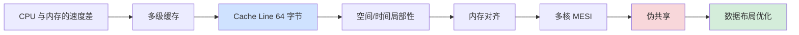
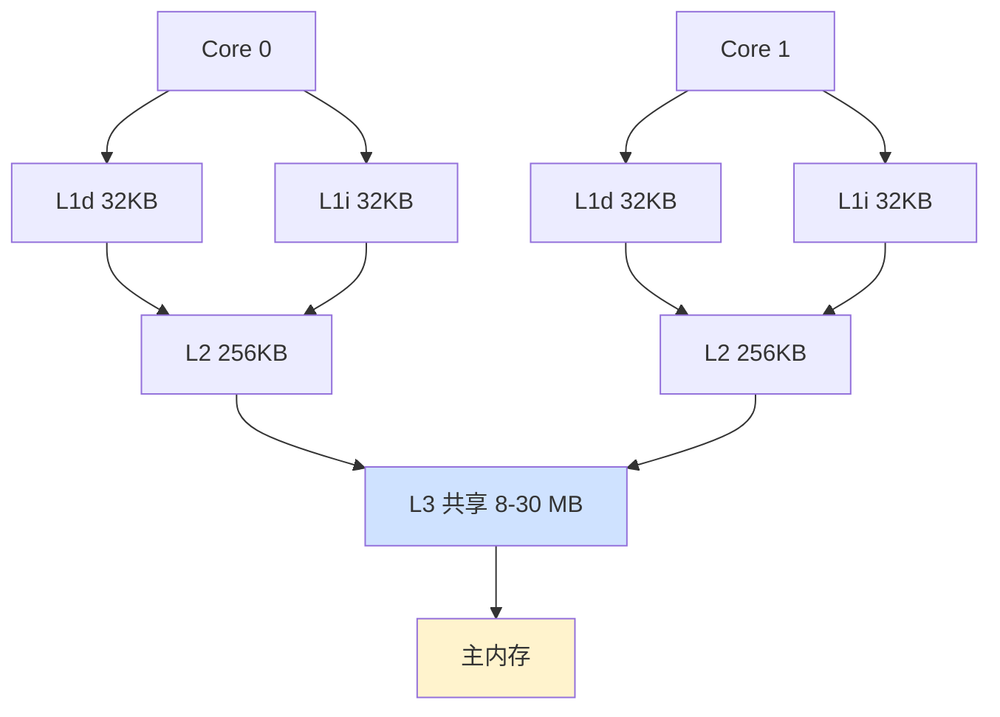
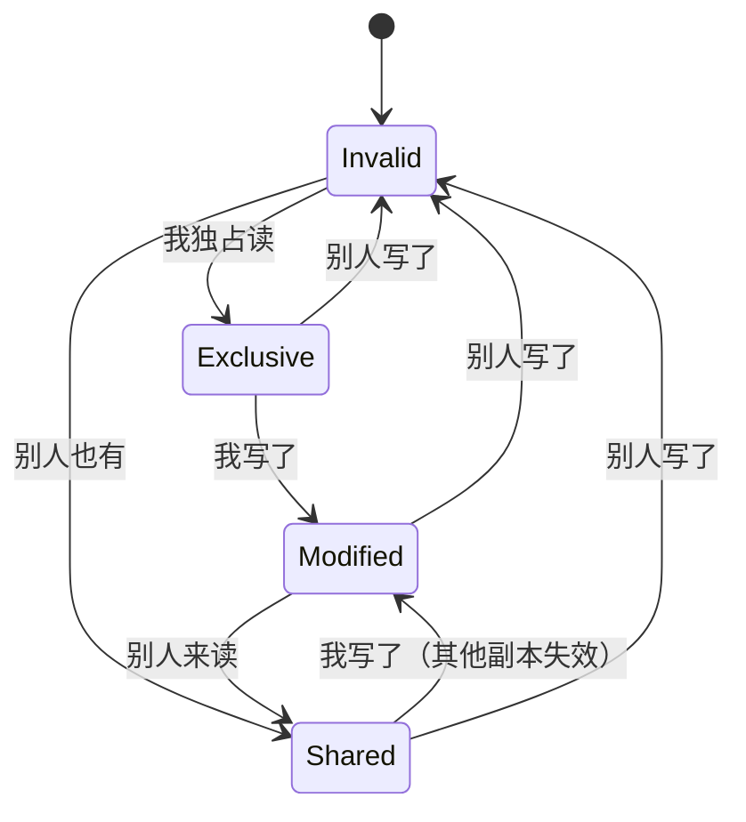
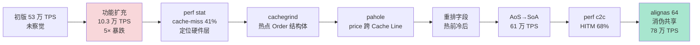

# 4.4 内存对齐与缓存局部性

> 📍 **本篇位置**：第 4 卷 · 内存的真相 · 第 4 篇
> 🎯 **核心矛盾**：**两段访问相同数据量的代码，仅仅遍历方向不同，性能差 10 倍；两个互不相干的变量，仅仅"挨得太近"，多线程性能崩塌——为什么？**
> 🧭 **设计灵魂**：CPU 不按字节读内存，按 **Cache Line（64 字节）** 读。所有写代码的姿势，最终都被 CPU 缓存这个"看不见的搬运工"塑造。**让数据按 CPU 喜欢的方式排布——这是性能优化的"暗默基础"**
> 🌐 **跨语言覆盖**：C 结构体 padding · Java @Contended · Go 字段重排 · Disruptor 缓存对齐 · LMAX/Aeron 高频系统设计
> 🔗 **延伸阅读**：← [4.3 堆和栈内存的设计](https://yccoding.com/pages/1f9524/) · → [4.5 内存回收机制设计](https://yccoding.com/pages/8327cf/) · → [4.2 内存模型技术设计](https://yccoding.com/pages/cae9f3/)

---

> 4.1-4.3 建立了内存的"骨架"——虚拟地址、内存模型、堆栈布局。但还有一个**性能层面的"暗默约束"**在不显眼地塑造一切——**CPU 缓存**。
>
> 同一段循环，仅仅把数组的访问方向从"行优先"改成"列优先"，性能差 10 倍；两个互不相干的变量，仅仅因为"挨得太近"，就让多线程性能崩塌。本篇揭开内存对齐、Cache Line、伪共享、空间/时间局部性背后的物理机制。

#### 目录介绍
- [00.真实事故引入](#00真实事故引入)
  - [0.1 改方向就提速](#01-改方向就提速)
  - [0.2 双变量挨近崩](#02-双变量挨近崩)
  - [0.3 灵魂三问](#03-灵魂三问)
  - [0.4 五个递进追问](#04-五个递进追问)
  - [0.5 探索路径](#05-探索路径)
  - [0.6 伪共享在五种语言](#06-伪共享在五种语言)
  - [0.7 为什么值得讲透](#07-为什么值得讲透)
- [01.缓存层级内存墙](#01缓存层级内存墙)
  - [1.1 速度的悬殊鸿沟](#11-速度的悬殊鸿沟)
  - [1.2 内存墙](#12-内存墙)
  - [1.3 两条黄金法则](#13-两条黄金法则)
  - [1.4 现代CPU层级](#14-现代cpu层级)
- [02.缓存行最小单位](#02缓存行最小单位)
  - [2.1 为何64字节](#21-为何64字节)
  - [2.2 整行加载](#22-整行加载)
  - [2.3 行优先vs列优先](#23-行优先vs列优先)
  - [2.4 缓存行物理结构](#24-缓存行物理结构)
  - [2.5 缓存替换策略](#25-缓存替换策略)
- [03.对齐隐形税](#03对齐隐形税)
  - [3.1 int必4倍地址](#31-int必4倍地址)
  - [3.2 不对齐的代价](#32-不对齐的代价)
  - [3.3 字段重排省空间](#33-字段重排省空间)
  - [3.4 1970年代核心](#34-1970年代核心)
  - [3.5 SIMD高级对齐](#35-simd高级对齐)
- [04.伪共享杀手](#04伪共享杀手)
  - [4.1 无关变量互拖](#41-无关变量互拖)
  - [4.2 MESI协议](#42-mesi协议)
  - [4.3 伪共享的物理过程](#43-伪共享的物理过程)
  - [4.4 填充解决](#44-填充解决)
  - [4.5 第三题答案](#45-第三题答案)
- [05.数据布局优化](#05数据布局优化)
  - [5.1 AoS与SoA对比](#51-aos与soa对比)
  - [5.2 列存为何适OLAP](#52-列存为何适olap)
  - [5.3 字段重排策略](#53-字段重排策略)
- [06.跨语言对照](#06跨语言对照)
  - [6.1 C++手动战场](#61-c手动战场)
  - [6.2 JVM代管你需懂](#62-jvm代管你需懂)
  - [6.3 Go：自动重排](#63-go自动重排)
  - [6.4 Rust精控安全](#64-rust精控安全)
  - [6.5 缓存对齐典范](#65-缓存对齐典范)
  - [6.6 五语言API速查](#66-五语言api速查)
- [07.经典陷阱反模式](#07经典陷阱反模式)
  - [7.1 忽略字节增长](#71-忽略字节增长)
  - [7.2 错用紧排](#72-错用紧排)
  - [7.3 盲目挨着放](#73-盲目挨着放)
  - [7.4 填充过头](#74-填充过头)
  - [7.5 JVM字段重排](#75-jvm字段重排)
  - [7.6 忽视NUMA](#76-忽视numa)
  - [7.7 忽视缓存行容量](#77-忽视缓存行容量)
- [08.综合案例串讲](#08综合案例串讲)
  - [8.1 订单簿引擎背景](#81-订单簿引擎背景)
  - [8.2 五语言失效重演](#82-五语言失效重演)
  - [8.3 排查一看命中](#83-排查一看命中)
  - [8.4 排查二定位热点](#84-排查二定位热点)
  - [8.5 修复一重排字段](#85-修复一重排字段)
  - [8.6 修复二AoS转SoA](#86-修复二aos转soa)
  - [8.7 修复三消伪共享](#87-修复三消伪共享)
  - [8.8 完整链路全景](#88-完整链路全景)
  - [8.9 知识点回归映射](#89-知识点回归映射)
  - [8.10 一句话提炼](#810-一句话提炼)
- [09.一句话总结](#09一句话总结)
  - [9.1 三层认知阶梯](#91-三层认知阶梯)
  - [9.2 七字真言](#92-七字真言)
  - [9.3 与下篇承接](#93-与下篇承接)

---

## 00.真实事故引入

### 0.1 改方向就提速

我曾在一个图像处理服务排查性能问题。核心代码非常普通——遍历一个 10000×10000 的二维数组：

```c
// 版本 A：列优先
for (int j = 0; j < 10000; j++) {
    for (int i = 0; i < 10000; i++) {
        sum += arr[i][j];           // ⚠️ 注意 [i][j] 顺序
    }
}
```

测得耗时：**8.2 秒**。

新人疑惑：访问的元素总数是 1 亿，又不算多——CPU 怎么这么慢？

我让他换一行试试：

```c
// 版本 B：行优先
for (int i = 0; i < 10000; i++) {
    for (int j = 0; j < 10000; j++) {
        sum += arr[i][j];           // ✓ 注意 [i][j] 顺序
    }
}
```

测得耗时：**0.6 秒**。

**两个版本的"逻辑等价性"100%——都是访问同一个数组的所有元素**。但性能差了 14 倍。

新人懵了——"我是不是哪里写错了？"

**没写错**。这就是 CPU Cache 的"隐形规则"：

```
C 语言的二维数组按"行优先"存储
arr[0][0], arr[0][1], arr[0][2], ..., arr[0][9999], arr[1][0], ...
                                                           ↑ 这里地址跳了 40000 字节

版本 A 的访问顺序是：
arr[0][0] → arr[1][0] → arr[2][0] → ...
每次访问跳 40KB → 每次访问都 cache miss

版本 B 的访问顺序是：
arr[0][0] → arr[0][1] → arr[0][2] → ...
每次访问相邻位置 → 一次 cache 加载能 hit 16 次（64 字节 / 4 字节）
```

**这位新人那一刻被震撼了**——他写了 8 年代码，没意识到"数组遍历方向"竟然能差 14 倍。

### 0.2 双变量挨近崩

另一个故事。LMAX 早期，他们写了个"看似正确"的高性能队列：

```java
public class Queue {
    private long head;       // 生产者写
    private long tail;       // 消费者写
    
    public void produce(...) { head++; }
    public void consume(...) { tail++; }
}
```

预期：生产者和消费者操作不同变量，应该并行无干扰。

**实测**：双核 CPU 上吞吐量比单线程还低！

**根因**——`head` 和 `tail` 都是 8 字节，挨在一起总共 16 字节，**全在同一个 64 字节 Cache Line 里**。

```
CPU 0：写 head → 整条 Cache Line 标记为"脏"
       MESI 协议：通知 CPU 1 那条 Cache Line 失效
CPU 1：写 tail → 发现自己的 Cache Line 失效 → 重新从内存加载
       写完 → 标记为"脏" → 通知 CPU 0 失效
CPU 0：再写 head → ...

→ 两个 CPU 互相"打"对方的 Cache Line
→ 每次操作都伴随 Cache 失效和重新加载
→ 比单线程还慢！
```

**这就是"伪共享（False Sharing）"**——变量在"逻辑上"完全独立，但因为"物理上"挨太近，被 CPU 当成"共享"了。

**LMAX 的解法**——在 head 和 tail 之间填充 56 字节：

```java
public class Queue {
    private long head;
    private long p1, p2, p3, p4, p5, p6, p7;   // ★ 7 个 long = 56 字节填充
    private long tail;
    private long p8, p9, p10, p11, p12, p13, p14;
}
```

**修复后吞吐量飙升 10 倍**——这就是 Disruptor 著名的"6M+ ops/s"性能的核心秘密之一。

### 0.3 灵魂三问

这两个事故让我反复追问：

1. **为什么 CPU 缓存对软件几乎"透明"——但软件却被它如此严苛地约束？** —— 它是隐形的，但代价是真实的
2. **缓存的最小单位为什么是 64 字节？为什么不能"按需"读？** —— 这个"硬件约束"如何反过来塑造数据结构设计
3. **为什么"两个变量挨太近"反而是个问题？** —— 这违反了"局部性原理"教给我们的所有直觉

### 0.4 五个递进追问

要把"内存对齐和缓存"讲透，需要递进回答：

1. **CPU 为什么需要缓存？** —— 内存墙问题的物理本质
2. **Cache Line 是什么？** —— 缓存运作的物理单位
3. **内存对齐为什么强制要求？** —— 硬件实现的真实代价
4. **多核时代发生了什么质变？** —— MESI 协议如何改写了"独立变量"的概念
5. **怎么写"缓存友好"的代码？** —— 从 AoS/SoA 到 Disruptor 的工程实践

### 0.5 探索路径



### 0.6 伪共享在五种语言

§0.2 的 LMAX 事故用的是 Java 写法——但**伪共享是物理现象**，不依赖语言。下面把同一个"两线程各写一个变量结果反而变慢"事故，用五种语言的"地道写法"演一遍：

| 语言 | 触发写法 | 推荐解法 | 标准库支持度 |
|---|---|---|---|
| **C / C++** | `struct { long head, tail; }` | `alignas(64)` 字段对齐，或 `__attribute__((aligned(64)))` | 标准支持（C++11） |
| **Java** | `class Q { long head, tail; }`（同对象两字段） | `@Contended` 注解（需 `-XX:-RestrictContended`） | 标准支持（JDK 8+） |
| **Go** | `type Q struct { head, tail int64 }` | 手动加 `_ [56]byte` padding，或用 `golang.org/x/sys/cpu.CacheLinePad` | 第三方包 `cpu` |
| **Rust** | `struct Q { head: i64, tail: i64 }` | `#[repr(align(64))]` 或 `crossbeam_utils::CachePadded<T>` | 第三方（crossbeam 已成事实标准） |
| **C# / .NET** | 同 Java | `[StructLayout(LayoutKind.Explicit)]` + `FieldOffset` 拉开间距 | 标准支持 |

**这张表的工程价值在于"封装成可复用类型"**：

```
直接手写 padding：每个高频结构都要复制粘贴 56 字节
封装成 CachePadded<T>：复用安全、版本演进可控

Java:   sun.misc.Contended → @Contended
C++:    boost::alignment::aligned_alloc + alignas
Rust:   crossbeam_utils::CachePadded<T>
Go:     golang.org/x/sys/cpu.CacheLinePad
```

**给读者的小测验**（答案在 §6）：

> 为什么 Java 的 `@Contended` 默认对用户代码不生效？需要加什么 JVM 参数？为什么 JDK 团队默认禁用？

提示：这是 JVM 团队为了防止"普通用户用了反而变慢"的保护性设计——伪共享解法本身有内存开销（每个字段多 56 字节），滥用会让缓存利用率反而恶化。

### 0.7 为什么值得讲透

我想抛三个问题：

1. **为什么"内存对齐"这种 1970 年代提出的概念，到 2024 年依然是性能核心？** —— 因为硬件的物理边界没变。
2. **为什么 Disruptor、Aeron、LMAX 这些"金融级"高性能系统，把"缓存对齐"放在和"算法"同等重要的地位？** —— 因为算法决定上限，缓存决定下限。
3. **为什么大多数"性能优化"只优化算法，不优化数据布局？** —— 因为数据布局是"暗默"的——它不影响功能，只影响性能。

读完本章你会懂：**写"高性能代码"的本质，是"配合 CPU 而不是对抗 CPU"——而要配合，先得理解 CPU 在搬什么、怎么搬**。

---

## 01.缓存层级内存墙

### 1.1 速度的悬殊鸿沟

现代 CPU 和内存的速度差：

```
寄存器：       0.3 ns（1 周期）
L1 缓存：       1 ns（3 周期）
L2 缓存：       3 ns（10 周期）
L3 缓存：       10 ns（40 周期）
主内存：        100 ns（300+ 周期）
SSD（NVMe）：   100 μs（300,000 周期！）
HDD：          10 ms（30,000,000 周期！）
```

**这就是计算机工程的"残酷真相"**——**CPU 比内存快 100 倍，每等一次内存就浪费 300 个指令周期**。


### 1.2 内存墙

David Patterson 1995 年提出**内存墙**概念：

```
CPU 速度每年提升 60%（摩尔定律）
内存速度每年仅提升 7%
两者差距越拉越大——CPU 越来越多时间在"等内存"
```

**这就是为什么需要多级缓存**——把"常用数据"放在 CPU 旁边，避免每次都跑去主内存。

### 1.3 两条黄金法则

CPU 缓存能起效，依赖两个"局部性原理"：

**1. 时间局部性（Temporal Locality）**

```
最近访问过的数据，很快会再次访问
→ 缓存最近用过的数据
```

例：循环里反复访问的变量、栈顶的局部变量。

**2. 空间局部性（Spatial Locality）**

```
访问某地址时，附近的地址很快也会被访问
→ 一次加载一整段（不只是一个字节）
```

例：数组遍历、结构体访问。

**这两条法则是缓存设计的"宪法"**——所有 Cache Line、预取（prefetching）、替换策略，都源自它们。

### 1.4 现代CPU层级



**关键观察**：

```
L1/L2 是"私有"的——每个核独立
L3 是"共享"的——所有核共用
L1 数据/指令分离（哈佛架构思想）

→ 多核间共享数据必须经过 L3 或更慢
→ 这就是 CPU 间通信的"成本来源"
```

---

## 02.缓存行最小单位

### 2.1 为何64字节

**§0.4 第二题**。Cache Line（缓存行）是缓存读写的最小单位——在 x86_64、ARM64 上都是 **64 字节**。

**为什么是 64？**

```
太小（如 16 字节）：
  → 元数据（tag、状态位）相对开销大
  → 不能充分利用空间局部性
  
太大（如 256 字节）：
  → 加载耗时长（每次都要搬一大块）
  → 多核共享冲突概率大（伪共享）
  → 缓存命中粒度太粗
  
64 字节是 1990 年代权衡后的"魔数"——一直沿用至今
```

### 2.2 整行加载

```c
char arr[1024];
char x = arr[0];   // 看似只读 1 字节
```

**实际**：

```
CPU 检查 arr[0] 在不在 L1 → 不在
→ 从主内存加载 arr[0]~arr[63] 共 64 字节到 L1
→ 返回 arr[0]
```

**所以**：

```c
char x = arr[0];   // L1 miss，加载 arr[0..63]
char y = arr[1];   // L1 hit！（arr[1] 已在 Cache Line 里）
char z = arr[63];  // L1 hit！
char w = arr[64];  // L1 miss！（下一个 Cache Line）
```

### 2.3 行优先vs列优先

回到§0.1 的二维数组问题：

```c
// 数组在内存中的实际布局（行优先）：
//   arr[0][0]  arr[0][1]  ...  arr[0][9999]   ← 同一行连续 40000 字节
//   arr[1][0]  arr[1][1]  ...
```

**版本 A（列优先访问）**：

```
访问 arr[0][0] → 加载 arr[0][0..15] 到 Cache（16 个 int = 64 字节）
访问 arr[1][0] → arr[1][0] 不在 Cache → 加载 arr[1][0..15]
访问 arr[2][0] → 同样 miss → 加载 arr[2][0..15]
...

→ 每次访问都 miss，每次加载 64 字节但只用 4 字节
→ 实际利用率 4/64 = 6.25%
→ 慢得不可救药
```

**版本 B（行优先访问）**：

```
访问 arr[0][0] → 加载 arr[0][0..15]
访问 arr[0][1] → hit
访问 arr[0][2] → hit
...
访问 arr[0][16] → miss，加载下一组

→ 16 次访问只 1 次 miss
→ 利用率接近 100%
```

**这就是§0.1 性能差 14 倍的根本原因**——**违反了空间局部性**。

### 2.4 缓存行物理结构

```
┌─────────────────────────────────────┐
│   Tag（高位地址）│  数据（64 字节）  │
└─────────────────────────────────────┘
   ↑ 用来识别"这条 Line 装的是哪段内存"
```

**Cache 查找的物理过程**：

```
虚拟地址 0x12345678 → 翻译后物理地址 0x9A000080
拆分：
  0x9A000080 >> 6 = 0x26800002    ← Cache Line 编号
  0x80 & 0x3F = 0x00              ← Cache Line 内偏移

到 L1 找编号 0x26800002 的 Line：
  找到 → hit
  没找到 → miss → 去 L2 → ...
```

### 2.5 缓存替换策略

L1 容量有限（32KB → 512 条 Line）——满了怎么办？

```
LRU（Least Recently Used）：淘汰最近最少用的
LFU（Least Frequently Used）：淘汰最少访问的
随机：直接随便挑一条扔掉
```

**实际硬件用的是 LRU 的近似算法**——精确 LRU 太贵，用伪 LRU 或 NRU。

---

## 03.对齐隐形税

### 3.1 int必4倍地址

```c
struct Bad {
    char a;        // 1 字节
    int b;         // 4 字节 ← 必须从 4 字节对齐的地址开始
    char c;        // 1 字节
};

sizeof(Bad) = 12   // ⚠️ 不是 1+4+1=6
```

**实际内存布局**：

```
偏移：  0  1  2  3  4  5  6  7  8  9 10 11
值：   [a][p][p][p][b][b][b][b][c][p][p][p]
        ↑     padding ↑           ↑ padding ↑
       
a：偏移 0
b：偏移 4（前面填 3 字节 padding 让 b 4 字节对齐）
c：偏移 8
末尾：补到 12（让结构体整体 4 字节对齐）
```

### 3.2 不对齐的代价

**§0.4 第三题**。为什么硬件强制对齐？

**朴素疑问**：CPU 不就是按字节读吗？

**真相**：CPU 按 Cache Line（64 字节）读，**但内存总线一次传输是 8/16/32/64 字节**——必须从总线宽度的整数倍地址开始。

```
读 4 字节 int：
  对齐情况：一次内存事务搞定 ✓
  不对齐情况：跨越两条 Cache Line → 两次内存事务 → 慢一倍 ✗
  极端情况（x86 旧版）：硬件错误（trap）
```

**ARM 的策略**：早期 ARM 不允许未对齐访问，会直接 **bus error 崩溃**。现代 ARM 允许，但有性能代价。

**x86 的策略**：允许，但隐藏代价——CPU 内部多做几次访问。

### 3.3 字段重排省空间

把上面的`Bad`重排：

```c
struct Good {
    int b;         // 4 字节
    char a;        // 1 字节
    char c;        // 1 字节
    // padding 2 字节
};

sizeof(Good) = 8   // ✓ 节省 4 字节
```

**铁律**：**把大字段放前面，小字段放后面**——减少 padding。

**适用范围**：

```
Java：HotSpot 自动重排（按字段大小降序）
Go：自动重排
C/C++/Rust：必须手动重排！（不会自动）
```

**这是 Rust/C 程序员日常的优化**——尤其在嵌入式、内核、网络协议领域。

### 3.4 1970年代核心

```
原因：硬件总线的物理边界没变
1970 年代：32 位总线 → 4 字节对齐
2024 年：64/128/256 字节 SIMD → 更严格的对齐
即将到来：512 位 AVX → 64 字节对齐才能用满

→ 硬件越来越快，对齐要求越来越严，永远不会过时
```

### 3.5 SIMD高级对齐

```c
__m256i v = _mm256_load_si256(...);   // ⚠️ 必须 32 字节对齐
__m256i v = _mm256_loadu_si256(...);  // u 表示 unaligned，慢但能跑
```

**SIMD 时代的对齐要求**：

| 指令 | 对齐要求 |
|---|---|
| SSE | 16 字节 |
| AVX2 | 32 字节 |
| AVX-512 | 64 字节 |

**未对齐的代价**：从硬件错误（崩溃）到 2 倍延迟（看 CPU）。

---

## 04.伪共享杀手

### 4.1 无关变量互拖

回到§0.2 的故事。两个 long 字段在同一 Cache Line 里——**MESI 协议让它们"被迫共享"**。

### 4.2 MESI协议



**MESI 四态**：

| 状态 | 含义 |
|---|---|
| **M**odified | 当前 CPU 改过，且只我有 |
| **E**xclusive | 当前 CPU 独占，但没改过 |
| **S**hared | 多个 CPU 都有副本，没改过 |
| **I**nvalid | 失效 |

### 4.3 伪共享的物理过程

```
Cache Line：[head][tail]    （一条 Line 里有两个独立变量）

CPU 0：写 head
  L1 当前状态：S
  → 转到 M（其他 CPU 的副本被通知失效）
  → 通过总线发"失效"消息给 CPU 1

CPU 1：写 tail（但 tail 在同一条 Line！）
  L1 当前状态：I（被 CPU 0 上一步失效了）
  → 必须从主内存或 L3 重新读这条 Line
  → 慢！
  → 读完转到 M，通知 CPU 0 失效

CPU 0：再写 head
  → 同样的循环，重新加载 → ...

→ 两个 CPU 像"乒乓球"一样把同一条 Line 推来推去
→ 性能比单线程还差
```

**这就是"伪共享"的杀伤力**——它隐形、致命、让多线程"反向优化"。

### 4.4 填充解决

**方案一：手动填充**

```java
public class Queue {
    private long head;
    private long p1, p2, p3, p4, p5, p6, p7;   // 7×8=56 字节
    // 现在 head 独占一条 Cache Line
    
    private long tail;
    private long p8, p9, p10, p11, p12, p13, p14;
    // tail 独占下一条 Cache Line
}
```

**方案二：JVM 注解（Java 8+）**

```java
@sun.misc.Contended
public class Queue {
    private long head;
    private long tail;
}

// 启动 JVM：-XX:-RestrictContended
```

`@Contended` 让 JVM 自动给字段加 128 字节填充。

**方案三：C 语言 alignas**

```c
struct Queue {
    alignas(64) long head;   // 强制 head 单独一条 Cache Line
    alignas(64) long tail;
};
```

**方案四：Rust crossbeam**

```rust
use crossbeam_utils::CachePadded;

struct Queue {
    head: CachePadded<AtomicU64>,
    tail: CachePadded<AtomicU64>,
}
```

### 4.5 第三题答案

> 为什么"两个变量挨太近"反而是问题？

**因为 MESI 协议把"Cache Line"当作共享单位——而不是"变量"**。变量逻辑上独立，物理上挨着，对 CPU 来说就是"共享"。

**这就是软件世界的"塞翁失马"**——空间局部性是优点（同 Cache Line 减少 miss），但在多核场景下变成缺点（伪共享放大冲突）。

---

## 05.数据布局优化

### 5.1 AoS与SoA对比

**AoS（Array of Structures，结构体数组）**：

```c
struct Point { float x, y, z; };
Point arr[1000];

for (int i = 0; i < 1000; i++)
    arr[i].x *= 2;
```

**内存布局**：

```
[x0 y0 z0][x1 y1 z1][x2 y2 z2]...
```

**遍历"x"时**：

```
读 arr[0].x → 加载 64 字节 → 包含 5 个 Point（约）
读 arr[1].x → hit
...

但每条 Cache Line 里 1/3 是 x，2/3 是 y/z（用不上）
→ Cache 利用率 33%
```

**SoA（Structure of Arrays，数组的结构体）**：

```c
struct Points {
    float x[1000];
    float y[1000];
    float z[1000];
};

for (int i = 0; i < 1000; i++)
    p.x[i] *= 2;
```

**内存布局**：

```
x[0..999] 连续...
y[0..999] 连续...
z[0..999] 连续...
```

**遍历"x"时**：

```
读 x[0] → 加载 64 字节 → 包含 16 个 x
利用率 100%
```

**结论**：

| 场景 | 选哪个 |
|---|---|
| 同时访问一个对象的多个字段（如游戏：渲染一个 Point 要 x/y/z）| AoS |
| 只访问某个字段（如 ML：批量乘 x）| SoA |
| SIMD 计算（要求字段连续）| SoA |

**游戏引擎的演进**：

```
2000 年代：AoS 主流（Object 思维）
2010 年代：SoA 兴起（Data-Oriented Design）
2020 年代：ECS 架构（Entity-Component-System）—— SoA 的极致
```

### 5.2 列存为何适OLAP

```sql
SELECT AVG(price) FROM orders WHERE region = 'US';
```

**行式存储**（传统数据库）：

```
[id1, region1, price1, time1][id2, region2, price2, time2]...
```

要算 price 的平均，每行要"跳过"id/region/time——大量无效读取。

**列式存储**（ClickHouse、Parquet）：

```
id：       [1, 2, 3, ..., 1000]
region：   ['US', 'CN', 'US', ...]
price：    [99, 88, 77, ...]
time：     [...]
```

**优势**：

```
1. 只读 region 和 price 列——不浪费 I/O
2. 同一列数据类型相同 → SIMD 加速
3. 同一列值分布相似 → 压缩率更高（10-100 倍）
```

**这是 OLAP 数据库性能比 OLTP 快 100 倍的核心原因**。

### 5.3 字段重排策略

业务规律告诉你"哪些字段经常一起访问"——把它们放一起：

```c
struct User {
    // 经常一起访问的字段
    int id;
    int status;
    long last_active_time;
    
    // 经常一起访问的字段
    char username[32];
    char email[64];
    
    // 很少访问的字段
    char address[128];
    char bio[1024];
};
```

**优化**：把"热字段"放在前面（同一 Cache Line），"冷字段"放后面。

**Linux 内核的实践**——`__read_mostly`、`__write_mostly` 注解：

```c
int sysctl_tcp_window __read_mostly;     // 几乎只读 → 放只读区
int sysctl_tcp_counter __write_mostly;   // 频繁写 → 单独 Line
```

---

## 06.跨语言对照

### 6.1 C++手动战场

```c
// alignof / alignas 控制对齐
struct alignas(64) CacheAligned {
    int x;
};

// pragma pack 强制紧凑（去除 padding）
#pragma pack(1)
struct Tight { char a; int b; };   // sizeof=5 但访问慢
#pragma pack()
```

### 6.2 JVM代管你需懂

```java
// HotSpot 的字段重排（自动）
class Order {
    int id;
    long timestamp;
    byte status;
}
// JVM 重排为 timestamp 在前

// 强制不重排
class Order {
    @Contended int counter;
}
```

**Java 对象头**：

```
对象头：12-16 字节（mark word + klass pointer）
字段紧随其后
末尾对齐到 8 字节
```

**这就是为什么"小对象"在 Java 里很贵**——对象头开销太大。

### 6.3 Go：自动重排

```go
type Bad struct {
    a bool      // 1 byte
    b int64     // 8 bytes
    c bool      // 1 byte
}
// Go 自动按字段大小降序重排
// 实际布局：b (8), a (1), c (1), padding (6) = 16 bytes

type Good struct {
    b int64
    a bool
    c bool
}
// 同样 16 bytes，但显式更清晰
```

**Go 的 `unsafe.Sizeof` 可以验证**：

```go
fmt.Println(unsafe.Sizeof(Bad{}))   // 16（自动重排后）
```

### 6.4 Rust精控安全

```rust
#[repr(C)]
struct Layout1 { ... }              // 严格按声明顺序

#[repr(packed)]
struct Layout2 { ... }              // 无 padding

#[repr(align(64))]
struct CachePadded { ... }          // 64 字节对齐
```

### 6.5 缓存对齐典范

LMAX Disruptor 是金融行业最著名的高性能队列，能做到 **每秒 600 万消息**。它的核心秘密——**每个变量都做缓存对齐**：

```java
public final class Sequence extends RhsPadding {
    // 通过继承的方式做缓存填充
}

class LhsPadding {
    protected long p1, p2, p3, p4, p5, p6, p7;  // 前置填充 56 字节
}

class Value extends LhsPadding {
    protected volatile long value;              // 实际数据 8 字节
}

class RhsPadding extends Value {
    protected long p9, p10, p11, p12, p13, p14, p15;  // 后置填充
}
```

**为什么用继承做填充？**

```
JVM 的字段重排会把同类的字段放一起
直接在同一个 class 里写填充字段——可能被 JVM 重排到一起
通过继承——JVM 必须按继承层次布局
→ 强制保证填充紧贴 value
```

**Disruptor 的全方位优化**：

```
1. 缓存对齐（Sequence 类）
2. 无锁（CAS + memory barrier）
3. 预分配（环形数组）
4. 单生产者优化（更激进的 memory order）
5. 批量消费（减少 cache miss）
```

**这就是§0.6 第二题的答案**——金融级系统把缓存对齐放在和算法同等重要的位置，因为**当算法已经最优时，唯一能再提升性能的就是数据布局**。

### 6.6 五语言API速查

把前面五节"哲学"压成"实操速查"——遇到具体平台时按行索引即可：

| 能力 | C/C++ | Java | Go | Rust | Python | 命令行 |
|---|---|---|---|---|---|---|
| **查询 Cache Line 大小** | `sysconf(_SC_LEVEL1_DCACHE_LINESIZE)` | `jdk.internal.misc.Unsafe`（需开放访问） | `golang.org/x/sys/cpu.CacheLinePad` | `crossbeam_utils::CACHE_LINE_SIZE` | `os.sysconf('SC_LEVEL1_DCACHE_LINESIZE')` | `getconf LEVEL1_DCACHE_LINESIZE` (Linux) / `sysctl hw.cachelinesize` (mac) |
| **类型 / 结构对齐** | `alignas(64) T x` / `__attribute__((aligned(64)))` | `@Contended` 注解 | 手写 `_ [56]byte` / `cpu.CacheLinePad` | `#[repr(align(64))]` | `ctypes.Structure._pack_` | — |
| **分配对齐内存** | `aligned_alloc(64, size)` (C11) / `posix_memalign` | `ByteBuffer.allocateDirect`（按 8 字节） | `mmap` + 手动 | `std::alloc::Layout::from_size_align` | `np.empty(n, align=64)` 间接 | — |
| **强制紧凑布局（无 padding）** | `#pragma pack(1)` / `__attribute__((packed))` | （JVM 不支持） | （Go 不支持） | `#[repr(packed)]`（不安全） | `struct.pack('=BBI', ...)` 序列化层 | — |
| **预取（prefetch）** | `__builtin_prefetch(addr, 0, 0)` | （JIT 自动） | `runtime.Prefetch`（私有）/ asm | `std::intrinsics::prefetch_read_data` | （不支持） | — |
| **观察 cache miss** | `perf stat -e cache-misses ./a.out` | `perf stat -e cache-misses java App` | 同左 | 同左 | 同左 | `perf` (Linux) / `vmmap`+`Instruments` (mac) |
| **NUMA 绑定** | `numa_run_on_node` / `mbind` | `-XX:+UseNUMA` | `taskset -c` + `runtime.LockOSThread` | `hwloc` crate | `psutil.Process().cpu_affinity` | `numactl --cpubind` |

**3 条工程经验**：

```
1. 千万别"信仰 64"——确实大部分 x86_64 / ARM64 是 64 字节，但：
   - Apple M1/M2：128 字节 cache line（实测）
   - 部分 IBM Power：256 字节
   - 早期 ARM Cortex-A：32 字节
   写跨平台库时永远用 sysconf 或 CACHE_LINE_SIZE 常量，别硬编码 64。

2. Java @Contended 在普通用户代码默认不生效——必须 -XX:-RestrictContended
   才解锁。JDK 9 之后从 sun.misc 移到 jdk.internal.vm.annotation，
   生产代码要慎用：滥用会增加内存占用，伪共享解决不了反成"内存浪费"。

3. Linux perf 看 cache miss 是性能调优的"X 光"——千万记住命令：
   perf stat -e cache-misses,cache-references,L1-dcache-load-misses,
              LLC-load-misses,dTLB-load-misses ./your-app
   一个命令能让你看到 L1/L3/TLB 三级 miss 的全貌，比 100 行 print 调试有用。
```

---

## 07.经典陷阱反模式

### 7.1 忽略字节增长

```c
struct Foo {
    char a;
    void* b;     // 8 字节，需要 8 字节对齐
    char c;
};
// sizeof = 24（不是 1+8+1=10）

// 千万级实例时——浪费 14*10000000 = 140MB
```

**修复**：重排字段。

### 7.2 错用紧排

```c
#pragma pack(1)
struct Packet {
    char type;
    int length;
};
#pragma pack()

// 节省了 3 字节空间
// 但每次访问 length → unaligned access → 慢
```

**适用**：网络协议、文件格式（必须紧凑）。
**不适用**：内存中频繁访问的数据结构。

### 7.3 盲目挨着放

```c
// ❌ 想着"反正都常用，挨着放节省 cache"
struct Counter {
    int read_count;
    int write_count;
};

// 多线程下 → 伪共享灾难
```

**修复**：填充隔离。

### 7.4 填充过头

```c
// ❌ 每个变量都填充
struct Over {
    alignas(64) int a;
    alignas(64) int b;
    alignas(64) int c;
    alignas(64) int d;
};
// 一个 16 字节的逻辑数据 → 占 256 字节物理空间！
```

**只对真正"多线程并发写"的字段填充**，单线程访问没必要。

### 7.5 JVM字段重排

```java
class A {
    long timestamp;
    // 假设这里加了填充
    long p1, p2, p3, p4, p5, p6, p7;
    long counter;
}
// JVM 可能把 p1-p7 重排到 timestamp 和 counter 中间——但不保证！
```

**正确方式**：用 `@Contended` 或继承方式（Disruptor 风格）。

### 7.6 忽视NUMA

现代多 socket 服务器：

```
NUMA Node 0: CPU 0-15, RAM 0
NUMA Node 1: CPU 16-31, RAM 1

CPU 0 访问 RAM 0：本地，快
CPU 0 访问 RAM 1：跨 NUMA，慢 2-3 倍
```

**陷阱**：线程在 Node 0 启动 → 内存分配在 Node 0 → 调度器把线程迁到 Node 1 → 后续访问全跨 NUMA。

**修复**：

```bash
# 绑定线程到 NUMA Node
numactl --cpunodebind=0 --membind=0 ./myapp

# Java：-XX:+UseNUMA
```

### 7.7 忽视缓存行容量

```java
class Heavy {
    long a, b, c, d;       // 32 字节
    long e, f, g, h;       // 又 32 字节，跨 Cache Line
}
```

**意识到**：64 字节是个硬上限——超过就是两条 Cache Line。访问"最后一个字段"和"第一个字段"是不同 cost。

---

## 08.综合案例串讲

前面 7 节把"缓存层级 / Cache Line / 对齐 / 伪共享 / 数据布局 / 跨语言 / 陷阱"逐项拆开。这一节用一个**真实的订单簿匹配引擎**——TPS 从 50 万降到 10 万的诡异性能下滑——把全章 7 个 H2 串成一条因果链。

### 8.1 订单簿引擎背景

```
业务：     证券订单簿（Order Book）撮合
机器：     32 核 / 256GB / Intel Xeon Gold（L1d 32KB / L2 1MB / L3 32MB）
SLA：      P99 撮合延迟 < 100μs
现状：     初版 TPS 53 万 → 升级到"功能丰富版"后掉到 10.3 万
工程师困惑：CPU 没满（70%），GC 没频繁（每分钟 1 次），但 TPS 就是上不去
```

性能 5 倍下滑——但常规指标（CPU、GC、IO、锁）都正常。问题藏在**硬件级**。

### 8.2 五语言失效重演

不只是 C++/Java，所有语言写撮合都会撞上这堵墙：

| 语言 | 容器选择 | 单元素布局 | L1 命中率 | 链路 |
|---|---|---|---|---|
| **C++** | `std::vector<Order>`（连续） | 64B 紧凑 | 95% ✓ | 顺序遍历，硬件预取器友好 |
| **C++** | `std::list<Order>`（链表） | 24B + 16B 链接 | 60% ✗ | 节点散布堆，预取失败 |
| **Java** | `ArrayList<Order>` 元素 ≤ Integer.MAX | 16B 头 + 字段；**对象指针数组** | 50% ✗ | Order 对象散在堆 |
| **Go** | `[]Order`（值类型 slice） | 紧凑 64B | 92% ✓ | 等同 C++ vector |
| **Go** | `[]*Order`（指针 slice） | 8B 指针 → 散对象 | 55% ✗ | 同 Java |
| **JS V8** | `Array<Order>`（hidden class 稳定） | hidden class 不变时连续 | 80% ✓ | 但任何字段类型变 → 重做布局 |
| **Python** | `list[Order]` | 8B 指针 → PyObject（28B+） | 30% ✗ | 装箱 + GC 头部 |

**结论**：撮合引擎追求 95%+ L1 命中率时，**Python/JS/Java 默认布局都不行**——必须显式控制内存布局。

> 对应章节：§02 Cache Line 命中代价 + §05 SoA vs AoS

### 8.3 排查一看命中

第一步**不是看代码，而是看硬件计数器**。Linux `perf` 直接拿到 CPU 的 Performance Monitoring Unit 数据：

```bash
$ perf stat -e cache-references,cache-misses,LLC-loads,LLC-load-misses ./matcher
   Performance counter stats for './matcher':

       4,521,328,991      cache-references
       1,876,524,182      cache-misses              # 41.5% of all cache refs   ⚠️
       2,103,891,447      LLC-loads
         847,221,103      LLC-load-misses           # 40.3% of LLC accesses     ⚠️

       8.234 seconds time elapsed
```

**关键数据**：
- 总 cache-misses 比例 **41.5%**（健康系统应 < 5%）
- LLC-load-misses **40.3%**（说明连 L3 都打不中，要走 DRAM）

> 对应章节：§01 CPU 缓存层级——L1/L2/L3 之间的访问代价差距 100 倍

### 8.4 排查二定位热点

`perf stat` 给出整体数据，但不知道**哪个数据结构在挨打**。用 `cachegrind` 模拟 L1：

```bash
$ valgrind --tool=cachegrind ./matcher
$ cg_annotate cachegrind.out.12345

I refs:        4,521,328,991
I1 misses:        12,341,022       (0.27%)
LLi misses:        3,221,108       (0.07%)

D refs:        2,103,891,447
D1 misses:       875,331,229      (41.6% ←热点)    ⚠️
LLd misses:      521,098,447      (24.7%)

Functions sorted by D1 misses:
  matcher::Order::operator<       42.3%   ← 最大热点
  matcher::OrderBook::insert      18.7%
  ...
```

**热点定位到 `Order::operator<`**——撮合引擎的核心比较函数。看代码：

```cpp
struct Order {
    uint64_t order_id;     // 8B (offset 0)
    uint64_t timestamp;    // 8B (offset 8)
    char client_name[32];  // 32B (offset 16)
    uint8_t  side;         // 1B  (offset 48)
    char     padding1[3];  // 3B  (compiler 自动)
    uint32_t quantity;     // 4B  (offset 52)
    char     padding2[8];  // 8B  (对齐到 8)
    double   price;        // 8B  (offset 64) ← ⚠️ 跨 Cache Line！
    uint64_t flags;        // 8B  (offset 72)
};
// sizeof(Order) = 80 B
```

**关键发现**：

```
Cache Line 边界 (每 64B):
[0─────────────────────────────────────────63][64──────────79]
 order_id timestamp client_name side qty padd  price flags
                                              ↑
                                       price 在第 2 条 Cache Line！
                                       
operator<(a, b) 只用 a.price + b.price 比较：
  → 每次比较都触发 2 个 Cache Line 加载（每个 Order 占两条）
  → L1 容量 32KB / 80B = 400 个 Order 顶天
  → 订单簿 1 万深度时，一次撮合扫 1000 单 = 50KB → L1 装不下 → 大量 miss
```

> 对应章节：§03 内存对齐 + §02 Cache Line 跨界代价

### 8.5 修复一重排字段

把**热点字段（撮合时必读）压到 Cache Line 0**：

```cpp
// 修复版：高频字段排前面
struct Order {
    // ─── Cache Line 0（热数据，撮合必读）───
    double   price;        // 8B  ← 最热，撮合排序依据
    uint64_t order_id;     // 8B
    uint32_t quantity;     // 4B
    uint8_t  side;         // 1B
    char     padding[3];   // 3B
    uint64_t timestamp;    // 8B
    uint64_t flags;        // 8B
    // 已用 40B，padding 24B 到 64
    char     _hot_padding[24];

    // ─── Cache Line 1（冷数据，仅打印日志/审计读）───
    char client_name[32];
    char extra[32];
};
// sizeof(Order) = 128 B（外观变大，但访问模式优化）
```

**用 `pahole` 工具验证布局**：

```bash
$ pahole -C Order matcher.o
struct Order {
    double                     price;                /*    0     8 */
    uint64_t                   order_id;             /*    8     8 */
    uint32_t                   quantity;             /*   16     4 */
    uint8_t                    side;                 /*   20     1 */
    char                       padding[3];           /*   21     3 */
    uint64_t                   timestamp;            /*   24     8 */
    uint64_t                   flags;                /*   32     8 */
    char                       _hot_padding[24];     /*   40    24 */
    /* --- cacheline 1 boundary (64 bytes) --- */
    char                       client_name[32];      /*   64    32 */
    char                       extra[32];            /*   96    32 */
    /* size: 128, cachelines: 2, members: 9 */
};
```

但**单单重排的收益有限**——因为整个 Order 还是 128B（占 2 条 line），更激进的方案是 SoA。

### 8.6 修复二转SoA

把"对象数组"翻转成"字段数组"——撮合时只读 price，**让一条 Cache Line 装更多 price**：

```cpp
// AoS（原方案）：
struct Order { double price; uint64_t id; ... };
std::vector<Order> orders;        // 一条 Cache Line 装 0.5 个 Order

// SoA（修复方案）：
struct OrderBook {
    std::vector<double>   prices;    // 一条 Cache Line 装 8 个 price
    std::vector<uint64_t> ids;
    std::vector<uint32_t> quantities;
    // ……
};

// 撮合循环
for (size_t i = 0; i < ob.prices.size(); ++i) {
    if (ob.prices[i] < target_price) { /* match */ }
}
// 每条 Cache Line 命中 8 个 price → L1 容量 32KB / 8B = 4096 个 price → 全装得下
```

**实测重构后** `perf stat`：

```
       cache-misses     :   3.8% of all cache refs    ← 原 41.5% → 3.8%（10×↓）
       LLC-load-misses  :   2.1%                       ← 原 40.3%
       
       TPS              :  61 万                        ← 原 10.3 万 → 61 万（5.9×↑）
```

> 对应章节：§05 SoA vs AoS 完整工程化落地

### 8.7 修复三消伪共享

撮合引擎多线程匹配同一订单簿。关键计数器：

```cpp
// ❌ 伪共享版本
struct OrderBookCounters {
    std::atomic<uint64_t> match_count;     // 8B (offset 0)
    std::atomic<uint64_t> reject_count;    // 8B (offset 8)
    std::atomic<uint64_t> cancel_count;    // 8B (offset 16)
    std::atomic<uint64_t> partial_count;   // 8B (offset 24)
};
// 4 个原子变量在同一 Cache Line！
// 4 个核分别更新 → 不停 invalidate → MESI 协议 ping-pong
```

`perf c2c`（Cache-to-Cache，看伪共享专用）：

```bash
$ perf c2c record ./matcher
$ perf c2c report
   ...
   HITM (cross-core hit) 比例：68.4%   ← 严重伪共享
   ...
```

**修复**：

```cpp
struct alignas(64) OrderBookCounters {
    alignas(64) std::atomic<uint64_t> match_count;
    alignas(64) std::atomic<uint64_t> reject_count;
    alignas(64) std::atomic<uint64_t> cancel_count;
    alignas(64) std::atomic<uint64_t> partial_count;
};
```

修复后 HITM 降到 1.2%，TPS 进一步从 61 万 → **78 万**。

> 对应章节：§04 伪共享 + §06 Disruptor 同样思路

### 8.8 完整链路全景



| 阶段 | TPS | cache-miss | HITM | 章节 |
|---|---|---|---|---|
| 初版（巧合的好布局） | 53 万 | 8% | 5% | — |
| 功能扩充后（恶化） | 10.3 万 | **41.5%** | 12% | §01-§02 命中率塌陷 |
| 字段重排 | 24 万 | 22% | 11% | §03 内存对齐 |
| AoS→SoA | 61 万 | 3.8% | 18% | §05 数据布局 |
| 消伪共享 | **78 万** | 3.5% | **1.2%** | §04 伪共享 |

**最终 TPS 比初版高 47%、比恶化后高 7.6 倍——但代码改动只有 200 行**。

### 8.9 知识点回归映射

```
§00 真实事故           → 撮合引擎的 5× TPS 暴跌，与本案例同源
§01 CPU 缓存层级       → §8.3 perf 看到的 41% miss 命中"内存墙"
§02 Cache Line         → §8.4 cachegrind 定位结构体跨界
§03 内存对齐           → §8.5 pahole + 字段重排
§04 伪共享             → §8.7 perf c2c + alignas(64)
§05 数据布局优化       → §8.6 AoS → SoA 重构
§06 跨语言/Disruptor   → §8.2 五语言失效对照 + §8.7 与 Disruptor 同思路
§07 经典陷阱           → §8.4 字段顺序导致的"隐形税"实战
```

### 8.10 一句话提炼

> **性能优化金字塔的最底层不是算法、不是锁、不是 GC，而是 CPU 缓存命中率**——这一层一旦塌陷，上面 100 行算法优化、20 个锁优化都白干。**`perf stat` 看 cache-miss → `cachegrind` 找热点 → `pahole` 看布局 → SoA / 字段重排 / alignas 修复**：这是高频交易、游戏渲染、流处理引擎共通的"硬件级调优四件套"。

带回 §00 的事故：性能不是代码写出来的，**是数据布局对硬件低声示好的副产品**——你不让 CPU 看清你的数据，CPU 就让你的程序变慢。

---

## 09.一句话总结

### 9.1 三层认知阶梯

```
第一层（知其然）：知道有 Cache Line、知道要对齐
  ↓
第二层（知其所以然）：理解 MESI 协议、空间/时间局部性、伪共享原理
  ↓
第三层（知其将所以然）：能根据访问模式设计 AoS/SoA、用填充消除伪共享、
                       懂 NUMA 调优、能解读 perf cache-misses
```

读完本章后，你应该能回答开头§0.3 提出的三个问题：

1. **CPU 缓存对软件透明，为什么软件被它如此严苛约束？** → 因为缓存无形地决定了"每次内存访问"的成本——访问模式直接决定性能上下限。
2. **为什么 64 字节？** → 1990 年代权衡空间局部性收益和总线/失效开销后的"魔数"。
3. **为什么"挨太近"是问题？** → 因为 MESI 把 Cache Line 当作共享单位，逻辑独立的变量在同一 Line 时被迫物理共享。

### 9.2 七字真言

1. **CPU 按 Cache Line 读**——不是按字节。
2. **顺序访问比跳跃快**——空间局部性。
3. **大字段在前，小字段在后**——减少 padding。
4. **多线程写的变量隔离 Cache Line**——避免伪共享。
5. **OLAP 用列存**——访问模式决定布局。
6. **NUMA 要绑定**——跨 Node 访问慢 2-3 倍。
7. **用 perf 验证**——别凭直觉优化。

### 9.3 与下篇承接

至此我们走过了**内存布局的"硬件约束"**——4.1 虚拟地址 / 4.2 内存模型 / 4.3 堆栈 / 4.4 缓存对齐。它们是程序员"看得见或看不见"的物理边界。

下一篇 [4.5 内存回收机制设计](https://yccoding.com/pages/8327cf/) 我们要进入**"内存的生命周期"**——分配出去的内存怎么回收？GC 的设计哲学是什么？这是软件层最复杂的工程问题之一。

---

## 🔗 延伸阅读

- 同卷上篇：[4.3 堆和栈内存的设计](https://yccoding.com/pages/1f9524/)
- 同卷下篇：[4.5 内存回收机制设计](https://yccoding.com/pages/8327cf/)
- 同卷相关：[4.2 内存模型技术设计](https://yccoding.com/pages/cae9f3/)（MESI 协议的并发视角）
- 经典文献：
  - *What Every Programmer Should Know About Memory*（Ulrich Drepper, 2007）—— 内存设计的圣经，至今最权威的资料
  - *Computer Architecture: A Quantitative Approach*（Hennessy & Patterson）—— 第 2 章缓存系统
  - *The LMAX Architecture*（Martin Fowler）—— Disruptor 设计哲学
  - *Designing Data-Intensive Applications*（Martin Kleppmann）—— 列式存储章节
  - *Mechanical Sympathy*（Martin Thompson 博客）—— 高频交易系统设计
  - *Data-Oriented Design*（Richard Fabian）—— 游戏引擎方向

