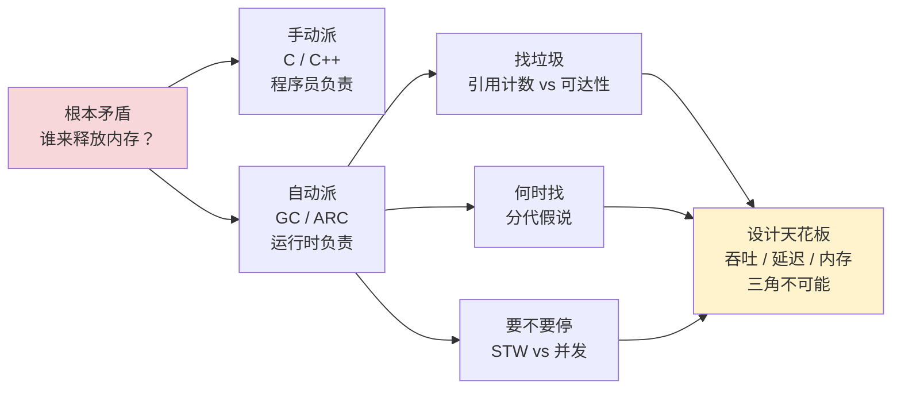
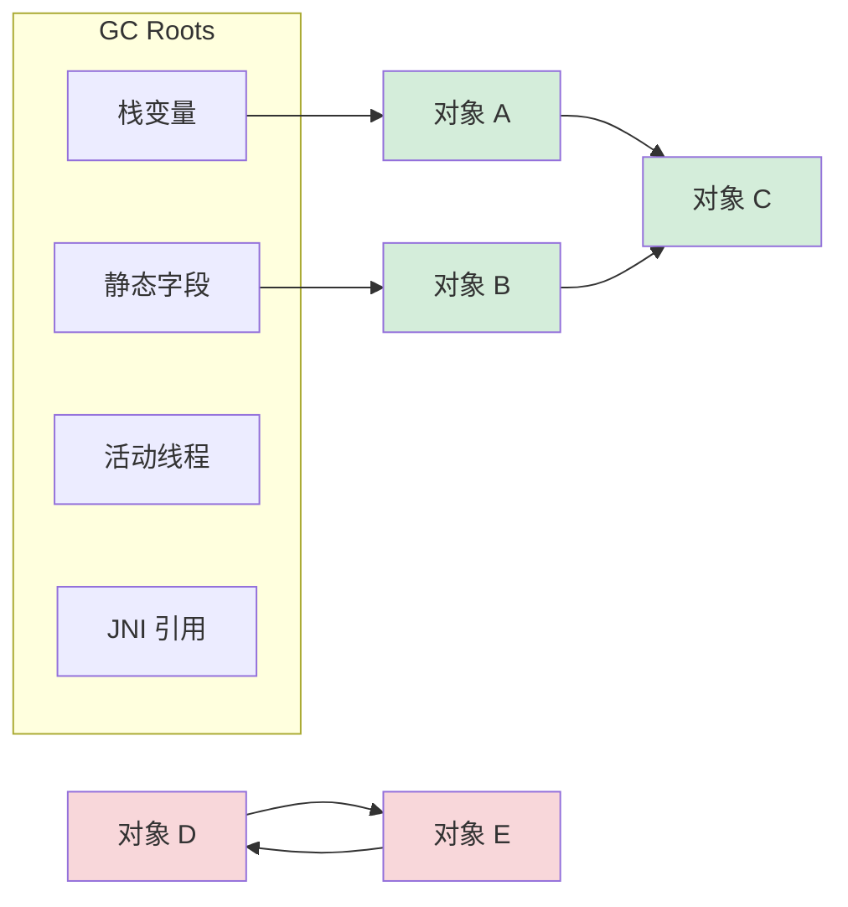
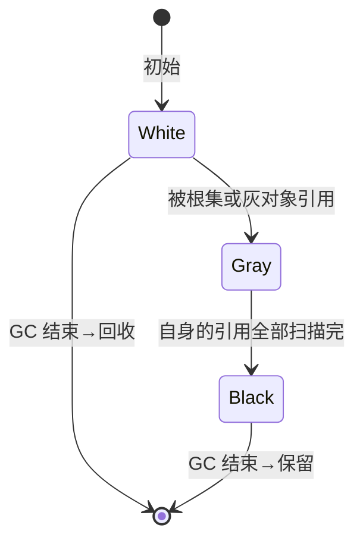
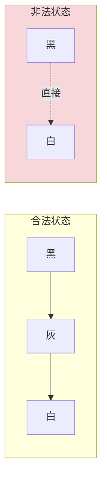
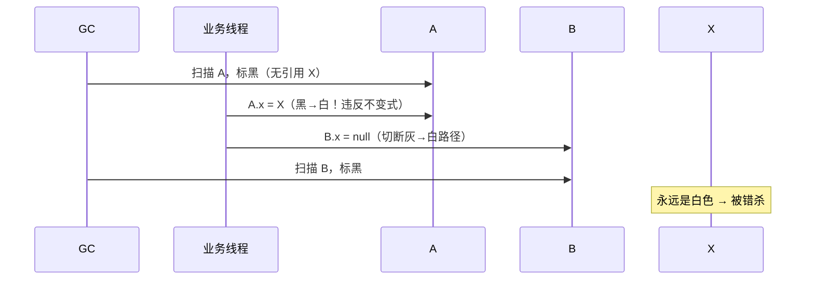
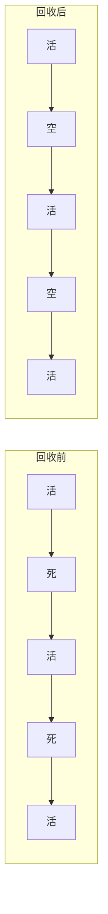
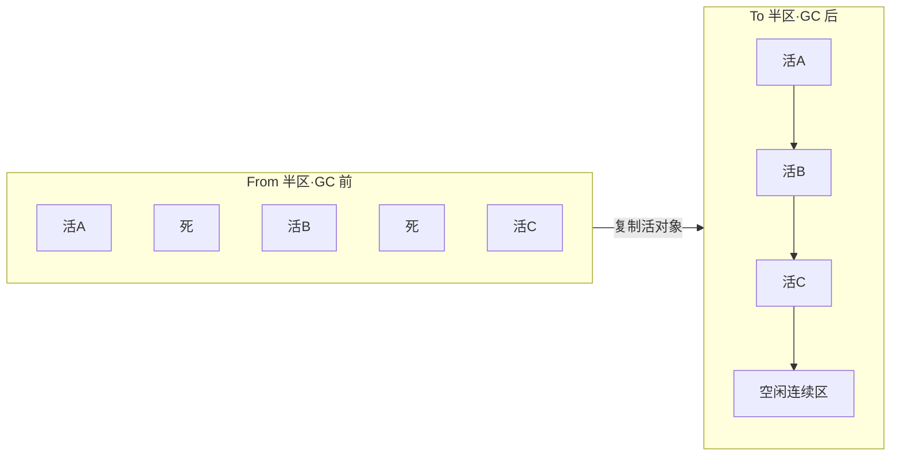
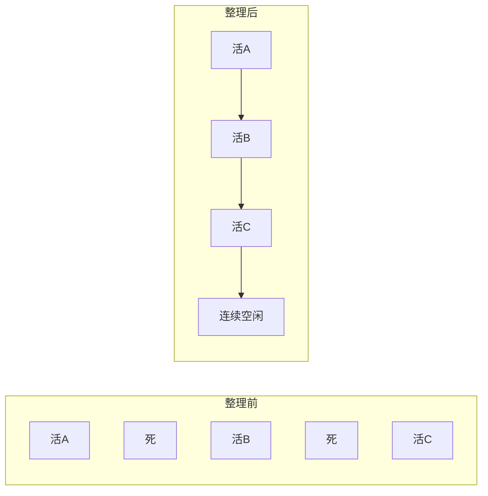
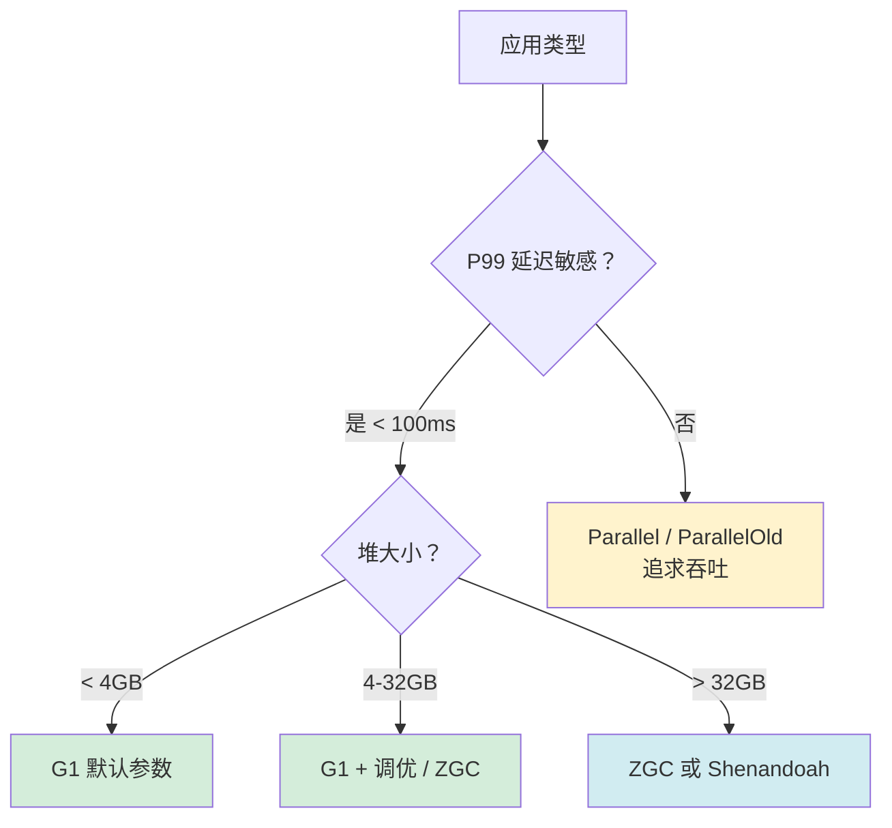
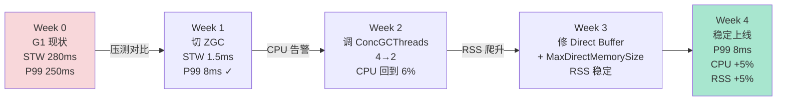

# 33.内存回收机制设计

> 📍 **本篇位置**：第 4 卷 · 内存与资源 · 第 3 篇（卷扛鼎之作）
> 🎯 **核心矛盾**：**自动释放 vs 性能可预测** —— 让程序员省心，就要让运行时多干活
> 🧭 **设计灵魂**：所有 GC 都在三件事上做取舍——**怎么找垃圾 / 什么时候找 / 找的时候要不要停**
> 🌐 **跨语言覆盖**：Java(分代 + G1/ZGC) · JavaScript(V8 增量标记) · Go(三色并发) · Python(引用计数+循环检测) · Swift(纯 ARC)
> 🔗 **延伸阅读**：→ [34.多种引用技术设计](https://yccoding.com/pages/9ff724/) · ← [32.堆和栈内存的设计](https://yccoding.com/pages/1f9524/) · ← [31.内存模型技术设计](https://yccoding.com/pages/cae9f3/)



---

#### 目录介绍
- [00.凌晨GC事故](#00凌晨gc事故)
  - [0.1 告警的那个晚上](#01-告警的那个晚上)
  - [0.2 GC日志倒推现场](#02-gc日志倒推现场)
  - [0.3 老司机灵魂三问](#03-老司机灵魂三问)
  - [0.4 事故揭示了什么](#04-事故揭示了什么)
  - [0.5 五个递进追问](#05-五个递进追问)
  - [0.6 GC五语言对照](#06-gc五语言对照)
- [01.手动管理时代](#01手动管理时代)
  - [1.1 C的手动账本](#11-c的手动账本)
  - [1.2 手动派三大死结](#12-手动派三大死结)
  - [1.3 GC诞生溯源](#13-gc诞生溯源)
- [02.找垃圾的演进](#02找垃圾的演进)
  - [2.1 朴素方案计数](#21-朴素方案计数)
  - [2.2 循环引用致命](#22-循环引用致命)
  - [2.3 范式切换溯源](#23-范式切换溯源)
  - [2.4 GC Roots是啥](#24-gc-roots是啥)
  - [2.5 两种范式对比](#25-两种范式对比)
- [03.三色标记灵魂](#03三色标记灵魂)
  - [3.1 为何需三种颜色](#31-为何需三种颜色)
  - [3.2 三色不变式](#32-三色不变式)
  - [3.3 并发标记错杀](#33-并发标记错杀)
  - [3.4 写屏障原理](#34-写屏障原理)
- [04.分代假说](#04分代假说)
  - [4.1 反直觉的发现](#41-反直觉的发现)
  - [4.2 分代假说三支柱](#42-分代假说三支柱)
  - [4.3 跨代引用代价](#43-跨代引用代价)
  - [4.4 记忆集设计](#44-记忆集设计)
- [05.回收算法演进](#05回收算法演进)
  - [5.1 标记清除算法](#51-标记清除算法)
  - [5.2 复制算法](#52-复制算法)
  - [5.3 标记整理算法](#53-标记整理算法)
  - [5.4 分代收集算法](#54-分代收集算法)
- [06.并发GC演进](#06并发gc演进)
  - [6.1 STW的代价](#61-stw的代价)
  - [6.2 G1分Region](#62-g1分region)
  - [6.3 ZGC染色指针](#63-zgc染色指针)
  - [6.4 Go三色并发GC](#64-go三色并发gc)
- [07.GC三角权衡](#07gc三角权衡)
  - [7.1 不可能三角](#71-不可能三角)
  - [7.2 真实选型决策](#72-真实选型决策)
- [08.跨语言GC对比](#08跨语言gc对比)
  - [8.1 Java分代路线](#81-java分代路线)
  - [8.2 V8增量分代](#82-v8增量分代)
  - [8.3 Go延迟优先](#83-go延迟优先)
  - [8.4 Python双策略](#84-python双策略)
  - [8.5 Swift Rust无GC](#85-swift-rust无gc)
  - [8.6 五语言API速查](#86-五语言api速查)
- [09.经典陷阱与回应](#09经典陷阱与回应)
  - [9.1 System.gc无效](#91-systemgc无效)
  - [9.2 对象置null疑问](#92-对象置null疑问)
  - [9.3 Full GC后变高](#93-full-gc后变高)
  - [9.4 ZGC是银弹吗](#94-zgc是银弹吗)
- [10.综合案例串讲](#10综合案例串讲)
  - [10.1 支付网关背景](#101-支付网关背景)
  - [10.2 决策上ZGC](#102-决策上zgc)
  - [10.3 切换前压测](#103-切换前压测)
  - [10.4 上线CPU涨15](#104-上线cpu涨15)
  - [10.5 DirectBuffer泄漏](#105-directbuffer泄漏)
  - [10.6 4周演进全景](#106-4周演进全景)
  - [10.7 知识点回归](#107-知识点回归)
  - [10.8 一句话提炼](#108-一句话提炼)
- [11.一句话总结](#11一句话总结)
  - [11.1 三层认知阶梯](#111-三层认知阶梯)
  - [11.2 GC调优清单](#112-gc调优清单)
  - [11.3 设计哲学一句](#113-设计哲学一句)
  - [11.4 与本卷的呼应](#114-与本卷的呼应)
  - [11.5 延伸阅读](#115-延伸阅读)

---

## 00.凌晨GC事故

### 0.1 告警的那个晚上

某互联网公司，订单系统稳定运行了 18 个月，QPS ~3000，平均延迟 50ms。**2022 年 11 月 11 日大促当晚 02:47**，监控告警齐刷刷红了：

```
告警 1：订单接口 P99 延迟 8.2 秒（基线 80ms）
告警 2：JVM 堆内存使用率 96%（基线 65%）
告警 3：YoungGC 频率 2 次/秒（基线 1 次/30 秒）
告警 4：Full GC 触发，单次暂停 12.3 秒 ★★★
```

值班工程师第一反应是"接口超时是不是数据库慢了"——查了 SQL，没有慢查询。再看 Redis、网卡，也都正常。然后他打开了 GC 日志：

```
2022-11-11T02:47:13.412+0800: [Full GC (Ergonomics)
 [PSYoungGen: 524288K->0K(524288K)]
 [ParOldGen: 1572863K->1572860K(1572864K)]    ← 几乎无回收
 1572863K->1572860K, [Metaspace: 89234K->89234K(1132544K)],
 12.3271234 secs] [Times: user=98.43 sys=0.21, real=12.33 secs]
```

**12.3 秒的 Full GC，老年代基本没回收下来。** 紧接着每 30 秒就来一次 Full GC，每次 12 秒——业务实际上已经卡死。

### 0.2 GC日志倒推现场

凌晨 4 点，工程师把 jmap 导出的堆转储拖到 MAT 里看：

```
Histogram of Heap (Top 5):
─────────────────────────────────────────────────────
Class                              Instances    Size
─────────────────────────────────────────────────────
char[]                              8,234,567    1.4 GB ★ 异常
java.lang.String                    8,234,510    197 MB
com.x.OrderCacheEntry               1,234,890    142 MB
byte[]                              234,567       89 MB
java.util.HashMap$Node              7,234,567    231 MB
─────────────────────────────────────────────────────

GC Roots Path（保留路径）：
  com.x.OrderCacheManager.cache (static HashMap)
    └── 1,234,890 个 OrderCacheEntry
        └── 持有 6,234,567 个 char[]
```

**根因瞬间清晰**——大促前研发团队为了抗压，加了一层"订单详情本地缓存"，但**忘记设过期时间**。18 个月里订单数据持续累积，老年代被它一点点撑满。大促 QPS 翻 5 倍，新对象大量分配到 Eden，Eden 满 → Young GC → 部分晋升到老年代 → 老年代满 → Full GC → **缓存对象都是强引用，回收不下来** → Full GC 持续触发。

### 0.3 老司机灵魂三问

第二天复盘会上，架构师问了三个穿透性的问题：

**问题 1**：为什么 18 个月一直没事，偏偏大促爆？

```
工程师：因为 QPS 涨了 5 倍。
架构师：错。日常 QPS 时也在累积，只是累积速度慢——
       老年代每天涨 0.3%，18 个月才到 65%。
       大促把 Eden 填满频率推到极限，
       存活对象晋升老年代速度暴增 → 老年代瞬间到 96% → Full GC。
       根因不是 QPS，是缓存设计错了。
```

**问题 2**：为什么 Full GC 12 秒不能回收？

```
工程师：因为缓存还在被用。
架构师：再深一步——为什么 GC 认为它"还在被用"？
       因为 OrderCacheManager 是 static，static 字段是 GC Root。
       Root 直接持有那个 HashMap，HashMap 持有所有 entry——
       从 Root 出发可达 → GC 算法层面就"必须保留"。
       这不是 GC 的错，是你写的"强可达"不允许它收。
工程师：那应该用什么？
架构师：SoftReference 或 LRU + 过期。GC 永远只服从一条法则：
       从根可达即不回收。你想让它回收，得告诉它"这是软引用"或者"这条路断了"。
```

**问题 3**：为什么平时没有这种监控告警？

```
工程师：因为日常情况老年代涨得慢。
架构师：所以 GC 监控不能只看"现在是不是高"，要看"涨速"。
       如果你每天监控老年代 promotion rate（晋升速率），
       发现连续一周比上周高 3 倍，就该排查了——
       GC 问题永远是"温水煮青蛙"，提前一周发现 vs 当晚救火，差一个数量级的成本。
```

### 0.4 事故揭示了什么

**事故的本质，不是 GC 算法有 bug，而是研发对"对象生命周期"的直觉建立在错误的心智模型上**：

```
我以为：
  把对象塞进 HashMap 当缓存，反正 JVM 会自动回收"用不到的"

实际：
  HashMap 强引用所有 entry → 这些 entry 在 GC 看来"100% 还在用"
  → JVM 永远不会回收
  → 我以为的"自动管理"实际是"自动累积"
```

| 视角 | 你以为的 | 实际发生的 |
|---|---|---|
| 写代码 | "GC 会自动管内存" | GC 只回收"不可达"对象 |
| 缓存层 | "缓存是临时的" | static + HashMap = 永久强引用 |
| 大促 | "QPS 高才是问题" | 真问题是积累 18 个月的隐患被引爆 |
| Full GC | "停一会就好了" | 强引用挡道，停 12 秒也回收不下来 |

整个 GC 设计的核心矛盾就藏在这里：

> **GC 自动化的前提是"程序员正确表达对象的生命周期"。GC 算得再快，也算不出"哪些对象你逻辑上不再需要"——它只能算"哪些对象从根不可达"。这两件事不是同一件事。**

### 0.5 五个递进追问

带着这次事故，整篇文章其实就是在回答下面五个递进的问题：

| 追问 | 答案章节 |
|---|---|
| 没有 GC 的 C 程序员怎么管内存？为什么这么累？ | §01 |
| GC 怎么"找垃圾"？为什么不能用引用计数？ | §02 |
| 并发 GC 怎么做到"边运行边回收"？ | §03 |
| 为什么所有现代 GC 都搞分代？分代真有那么神？ | §04 / §05 |
| ZGC 把 STW 压到 1ms 是怎么做到的？还能不能更快？ | §06 / §07 |

**带着这一晚踩过的坑，进入正题——你将看到，所有抽象的"三色标记、写屏障、记忆集、染色指针"原理，最终都能落到这次事故的根因图上。**

### 0.6 GC五语言对照

§0 的 12.3 秒 Full GC 是 JVM 早期分代收集器的"教科书式症状"——但**GC 引发用户可见的延迟，这件事在每种带 GC 的语言里都发生过**。下面把同一类故障在五种 runtime 里复现，能看出每种 GC 的"性格"：

| Runtime | 历史最差卡顿 | 现代典型 STW | 哲学 | 典型病灶 |
|---|---|---|---|---|
| **Java (HotSpot)** | 老 Parallel GC：10+ 秒 Full GC | ZGC < 1ms（堆任意大） | 给开发者最大选择权 | 缓存膨胀、元空间扩容、`-Xmx` 太小 |
| **Go runtime** | Go 1.4：100+ ms | Go 1.8+：< 1ms（恒定） | 延迟优先于吞吐 | 大量短命对象、GOGC 不当、cgo 阻塞 |
| **JavaScript (V8)** | 老 Chrome：单帧 100ms+ 卡顿 | 增量标记：< 16ms（一帧） | 利用人类感知阈值 | 闭包累积、DOM 引用、Map/Set 不清 |
| **Python (CPython)** | 引用计数 + 循环检测：周期性 50-200ms | 同左 | 实时回收 + GIL 简化模型 | 大字典持有、`__del__` 钩子链、numpy 大数组 |
| **Swift / ObjC (ARC)** | "释放雪崩"：deinit 链 100ms+ | ARC 是确定时机，但雪崩仍存在 | 编译期插桩，无 GC | 循环引用、大对象图同时释放 |

**4 种"卡顿哲学"的根本分歧**：

```
Java：    给你 6 种 GC，自己挑（Serial/Parallel/CMS/G1/ZGC/Shenandoah）
          → 假设：服务场景千差万别，没有 one-size-fits-all
Go：      只给你 1 种，但保证 STW 上限
          → 假设：云原生服务比"内存吃满"更怕"P99 抖动"
V8：      自动调度，对齐人眼帧率
          → 假设：终端用户体验是首要 KPI
CPython： 实时计数 + 兜底循环扫描
          → 假设：脚本场景里"对象立即释放"比"GC 速度"更重要
ARC：     完全无 GC，但要程序员标 weak/unowned
          → 假设：嵌入式/移动场景里 GC 进程的内存峰值不可接受
```

**给读者的小测验**（答案在 §8.x）：

> Go 1.5 之前是 100ms+ STW，Go 1.8 之后是 < 1ms STW——这 1000 倍的提升靠的是哪个算法变化？为什么 Java G1 / ZGC 不"抄"过去？

提示：Go 用混合写屏障避免栈扫描重写，前提是 Go 不支持泛型对象引用复杂度——这就是 Go 1.18 之前"为延迟牺牲泛型"的设计权衡。

---

## 01.手动管理时代

要真正理解 GC 的价值，最好先回到没有 GC 的世界看看。

### 1.1 C的手动账本

C 语言里，每一块堆内存都要程序员"申请-记账-归还"：

```c
typedef struct Node {
    int value;
    struct Node* next;
} Node;

Node* create_list(int n) {
    Node* head = malloc(sizeof(Node));   // 申请 1
    head->next = malloc(sizeof(Node));   // 申请 2
    head->next->next = malloc(sizeof(Node)); // 申请 3
    // ... n 个节点
    return head;
}

void use_list() {
    Node* list = create_list(100);
    // ... 用 list 干点事 ...
    
    // ★ 现在必须手动释放
    Node* cur = list;
    while (cur != NULL) {
        Node* next = cur->next;
        free(cur);            // ← 漏掉就泄漏，free 两次就崩
        cur = next;
    }
}
```

C 程序员每写一个 `malloc`，脑子里都要同步记一笔："哪里 free？谁来 free？free 几次？"——**这就是手动管理的"心智负担"**。

### 1.2 手动派三大死结

手动管理的痛不只是"麻烦"，它有三种**根本性**的错误模式：

#### 死结一：内存泄漏（Memory Leak）

```c
char* buf = malloc(1024);
process(buf);
return;   // ★ 忘了 free → 这 1024 字节永远丢失
```

**为什么这个 bug 难定位？** 因为程序还在跑，没有立刻报错——只是内存慢慢涨。Web 服务跑一个月才 OOM，但定位泄漏点要复现一个月的工作负载。微软统计：**70% 的安全漏洞与 C/C++ 内存安全相关**，泄漏只是其中一类。

#### 死结二：野指针（Dangling Pointer）

```c
char* p = malloc(100);
free(p);
// ... 100 行代码 ...
p[0] = 'A';   // ★ p 指向的内存已经被 free，写过去就是越界
```

`p` 还指着那个地址，但那块内存可能已被分配给别人。**这就是 Use-After-Free 漏洞的根源**，2014 年 OpenSSL Heartbleed、2017 年某些浏览器 0day 都属于这类。

#### 死结三：双重释放（Double Free）

```c
free(p);
free(p);   // ★ 同一块内存被 free 两次 → 堆元数据损坏 → 后续 malloc 崩溃
```

malloc/free 内部用元数据组织空闲链表，double free 会把链表搞乱，往往不是当场崩，而是**在几百行之后某次 malloc 崩**——调试地狱。

### 1.3 GC诞生溯源

**1958 年，John McCarthy 设计 Lisp 时遇到了一个问题**：Lisp 大量构造 cons cell（`(a . b)` 结构），如果靠程序员手动 free，整个语言根本没法用。

McCarthy 的解决方案极其大胆：**让运行时定期"扫描所有还在用的内存"，没扫到的就是垃圾，自动回收**。

这就是历史上第一个 GC——**Mark-Sweep**（标记-清除）。它解决了三大死结：

```
泄漏 → 不可达对象自动回收，永远不会"忘记 free"
野指针 → 还在用的对象不会被回收
double free → 程序员根本碰不到 free，没机会调两次
```

**代价是什么？** —— **Stop-The-World**：扫描时所有业务线程暂停。McCarthy 当年在 IBM 704 上跑 Lisp，扫描一遍 32KB 内存可能要几百毫秒。这个"停一下"的代价，从 1958 年开始就成了 GC 设计的核心矛盾——后面所有进化（增量、并发、染色指针）都是在和这个矛盾较劲。

---

## 02.找垃圾的演进

### 2.1 朴素方案计数

如果让你设计一个 GC，最直觉的方案是什么？大部分人第一反应：

> **每个对象记一个计数器：有人引用我，+1；没人引用我了（计数=0），就回收。**

这就是 **引用计数（Reference Counting, RC）**。CPython、Objective-C、Swift、C++ shared_ptr 都用这个方案：

```python
# Python 简化模型
class PyObject:
    refcount: int  # 每个对象都有这个字段

# 赋值：a = b
# CPython 内部：
# Py_INCREF(b);          # b 的 refcount + 1
# Py_DECREF(a_old);      # a 原来指的对象 refcount - 1
# a = b;                 # 真正赋值
```

**优点显而易见**：
- 对象一变垃圾立刻回收，无 STW
- 实现简单，每个赋值/拷贝插入两条计数指令
- 内存释放时机可预测（析构调用顺序确定）

### 2.2 循环引用致命

但你写两行代码就能戳破它：

```python
class Node:
    def __init__(self):
        self.ref = None

a = Node()    # a.refcount = 1
b = Node()    # b.refcount = 1
a.ref = b     # b.refcount = 2
b.ref = a     # a.refcount = 2

del a         # a.refcount = 1（不为 0，不回收）
del b         # b.refcount = 1（不为 0，不回收）

# ★ 现在外面没人能访问 a 和 b 了，但它们的 refcount 都是 1
# ★ 永远不会被释放——内存泄漏
```

**这是 RC 的"原罪"**：它只看"有几个引用指着我"，看不到"这些引用是不是从根可达的"。两个对象互相指着对方，就算外面没人用了，counter 也归不到 0。

CPython 的解决办法是**引用计数 + 循环检测**：定期跑一个"循环垃圾收集器"，扫描可疑的容器对象（list/dict/class）找循环。但这就**回到了 GC 的老路**——既然要扫，那 RC 单独存在的意义就被稀释了。

**真正在生产中纯 RC 还能活下来的，是 ARC**（Swift/Objective-C）：编译器在编译期插入 retain/release，并要求程序员**用 `weak` / `unowned` 显式打破循环**。代价是程序员要把循环引用的判断负担背回去——这是工程妥协，不是技术进化。

### 2.3 范式切换溯源

现代 GC 主流（Java/Go/JS/.NET）走的是**完全不同**的路：**可达性分析（Reachability Analysis）**。

核心思路：

```
不要问"这个对象有几个人引用它"，
要问"从程序的'根'（栈、静态、寄存器）出发，能走到这个对象吗"。

能走到 → 还在用 → 保留
走不到 → 不可能被使用了（程序根本拿不到它的引用）→ 回收
```



D 和 E 互相引用——但它们**从根集出发不可达**，所以可达性分析直接判定为垃圾。**循环引用问题被天然解决**。

### 2.4 GC Roots是啥

那么"根"到底是什么？这是面试常问、但很少人说全的问题。Java GC Roots 包括：

| 类别 | 含义 | 例子 |
|---|---|---|
| **虚拟机栈中的引用** | 当前每个线程栈帧里的局部变量 | 方法里的 `Order o = ...` |
| **本地方法栈中的引用** | JNI 调用栈 | C/C++ 代码持有的 jobject |
| **方法区中的静态字段** | 类的 static 引用 | `static Map cache = ...` ★ §0 事故元凶 |
| **方法区中的常量引用** | 字符串常量池 | `"hello"` 这种字面量 |
| **被同步锁持有的对象** | `synchronized(obj)` 里的 obj | 锁对象 |
| **JVM 内部引用** | Class 对象、异常对象、加载器 | `ClassLoader` 等 |

**§0 事故的"凶器" `static HashMap cache` 就是第三类**——任何 static 字段都是 Root，static 持有的所有对象链都是"强可达"。这就是为什么把它改成 SoftReference 或 LRU 缓存能解决问题：**一旦从 Root 到对象的路径不再是"全强引用"**，GC 就有权介入。

### 2.5 两种范式对比

| 维度 | 引用计数（RC） | 可达性分析（Tracing GC） |
|---|---|---|
| **回收时机** | 计数归零→立即回收 | 周期性扫描批量回收 |
| **循环引用** | 无法处理（需辅助算法） | 天然处理 |
| **吞吐成本** | 每次赋值 2-4 条指令 | 仅扫描时集中开销 |
| **暂停模式** | 析构链可能很长（雪崩） | STW 或并发 |
| **典型代表** | CPython、Swift ARC | Java、Go、V8 |

**深层洞察**：RC 是"分布式"的（每个对象自治），Tracing 是"中心化"的（GC 统一裁决）。**没有银弹**——CPython 选 RC 是因为 1991 年硬件慢、并发 GC 还不成熟；Java 选 Tracing 是因为 1995 年面向"大型企业应用"，对象图复杂、循环引用难免。

> 接下来我们聚焦主流的 Tracing GC，看它是怎么从"暴力扫描全部"演进到"边跑边收"的。

---

## 03.三色标记灵魂

### 3.1 为何需三种颜色

最朴素的可达性分析叫**两色标记**：未访问（白）、已访问（黑），扫描完后白色的就是垃圾。但这个方案有个致命问题——**它必须 STW**。

为什么？想象一下：

```
GC 正在扫描，标记到 A 是黑色
此时业务线程跑了一行：a.field = newObj
newObj 是新创建的，GC 还没看到 → 是白色
GC 扫描完成 → 把所有白色当垃圾回收 → newObj 被错杀！
```

业务线程"边修改边给 GC 添乱"——GC 被迫停下所有业务线程才能保证扫描的一致性。**对于 100GB 堆，STW 可能持续 5-10 秒**——大型系统不能接受。

突破口是 1978 年 Dijkstra 提出的**三色标记（Tri-color Marking）**：

```
白色：从未被发现（潜在垃圾）
灰色：已发现但还没扫描它的引用（待办）
黑色：自己和所有引用都扫描过了（确认存活）
```



**三色相比两色多了一个"中间态"灰**——这一个状态成了**并发 GC 的关键**。

### 3.2 三色不变式

三色标记的数学本质是两条不变式（Invariant）：

| 不变式 | 含义 |
|---|---|
| **强三色不变式** | 黑色对象不能直接指向白色对象 |
| **弱三色不变式** | 黑色对象可以指向白色对象，**但必须存在一条灰色路径能到达这个白色对象** |

**为什么？** 因为黑色意味着"我已经扫描过了，不会再回头"。如果黑色直接指向白色，GC 永远不会再访问到那个白色对象，扫描结束后它会被错杀。



只要算法保证"从黑色出发的所有白色都至少有一条灰色路径"，**GC 就可以在业务线程跑的同时扫描堆**——不再需要 STW 整个扫描过程。这是**并发 GC 的数学基础**。

### 3.3 并发标记错杀

但仅有三色规则还不够。看这个并发场景：

```
T0：GC 扫描 A，A 标黑（A 没指向 X）
T1：业务线程执行 A.x = X    ← X 当时是白色
T2：业务线程执行 B.x = null ← 切断了 B 到 X 的路径
T3：GC 扫描 B，B 标黑
T4：GC 扫描结束 → X 还是白色 → 被回收 ★ 错杀
```



**根因**：业务线程"偷偷"修改了引用关系，破坏了三色不变式。

### 3.4 写屏障原理

为了在并发场景下不错杀，GC 要给所有"修改引用"的操作加一个**钩子**——这就是 **写屏障（Write Barrier）**。

```
朴素的赋值：
  obj.field = newRef

加上写屏障后：
  obj.field = newRef
  write_barrier(obj, newRef)   ← 偷偷做点事，恢复三色不变式
```

不同 GC 用不同的策略：

#### Dijkstra 写屏障（插入屏障）：守住"黑→白"边界

```
write_barrier(obj, newRef):
    if newRef is white:
        把 newRef 标灰        ← 谁被加引用，谁立刻"待办"
```

效果：黑色对象指向白色时，立刻把白色变成灰色——**强不变式永远成立**。Go 1.7 之前用这个策略。

#### Yuasa 写屏障（删除屏障）：守住"老引用"

```
write_barrier(obj, newRef):
    if obj.field is not null:
        把 obj.field （旧引用）标灰   ← 删除前先"立此存照"
```

效果：保护"删除瞬间还活着"的对象，本轮 GC 不杀它（下轮再处理）。CMS、G1 在某些阶段用。

#### 混合屏障：Go 1.8+ 的妥协

```
write_barrier(obj, newRef):
    把 newRef 标灰（插入）
    把 obj.field 旧引用标灰（删除）
```

两侧都保护，但 Go 用了一个聪明优化：**栈上对象一律视为黑色**，只对堆做屏障——大幅降低屏障开销。

#### 写屏障的代价

```
没有写屏障：每次赋值 1 条 mov 指令
有写屏障：  每次赋值 1 mov + 1 函数调用（约 5-10 条指令）

→ 整体业务吞吐下降约 1-3%
→ 换来 STW 从 5 秒降到 10 毫秒
```

**这就是并发 GC 的根本权衡**：用稳定的小开销（写屏障），换不可预测的大暂停（STW）。**1% 吞吐换 50%+ 延迟收益**——值。

---

## 04.分代假说

### 4.1 反直觉的发现

1980 年代初，研究者在跑 Smalltalk、Lisp 程序时观察到一个稳定的**统计规律**：

> **大部分对象都是"朝生夕死"的——活不过 1 次 GC。**

这个发现来自 David Ungar 在 Berkeley 的实验：在 Smalltalk-80 程序里追踪每个对象的生存时间，画出柱状图：

```
存活时间 (GC 次数) │ 对象比例
─────────────────┼─────────
       0         │ ████████████████ 80%   ★ 大部分对象生命极短
       1         │ ████ 12%
       2         │ ██ 5%
       3         │ █ 2%
      ...        │ 极少
     >10         │ < 0.5%             ★ 真正长寿的对象很少
```

**这个统计规律不是偶然，它源于编程范式本身**：
- 函数返回值临时对象 → 立刻丢
- 字符串拼接中间结果 → 立刻丢  
- 循环里的迭代器、临时容器 → 立刻丢
- 但单例、缓存、配置对象一旦被创建，就活到进程结束

### 4.2 分代假说三支柱

基于这个观察，1984 年 Ungar 提出**分代假说（Generational Hypothesis）**：

| 假说 | 含义 | 工程含义 |
|---|---|---|
| **弱假说** | 大部分对象朝生夕死 | 把它们集中放一处，扫描时只扫这处即可 |
| **强假说** | 熬过几次 GC 的对象会更长寿 | 把它们移到另一处，今后少扫 |
| **跨代引用稀少** | 老对象引用新对象的情况少 | 扫新生代时几乎不用扫老年代 |

**于是把堆切两半**：

```
   新生代 (Young Gen)             老年代 (Old Gen)
   ┌──────────────────┐         ┌────────────────────────┐
   │  Eden + Survivor  │  晋升→  │   长生命周期对象       │
   │  快速回收（频繁）  │         │   慢速回收（稀少）     │
   └──────────────────┘         └────────────────────────┘
        每秒 GC 一次                  每分钟/小时 GC 一次
```

**为什么分代有用？** 看这个数字：

```
不分代：堆 8GB，每次扫描遍历所有对象 → 扫描 800ms
分代：  
  新生代 512MB，扫描遍历 → 50ms（90%+ 对象直接回收，极快）
  老年代 7.5GB，仅在老年代满时扫一次 → 600ms，但频率低 100 倍

总体开销下降 80%+，平均延迟下降 90%+
```

**这就是分代的魔力**：用**对象生命周期的统计规律**做空间分区，把"大暴力扫描"变成"小高频 + 大低频"。

### 4.3 跨代引用代价

但分代有个隐藏代价——**跨代引用**。

```
Eden 里的对象 X 被老年代里的对象 O 引用：

           老年代                新生代
           ┌────┐               ┌────┐
           │  O ├──── 引用 ────→│  X │
           └────┘               └────┘
```

GC 想只扫新生代——但 X 是不是被引用了？要回答这个问题，**必须扫一下老年代**——分代的好处全没了。

如果**强假说"跨代引用稀少"成立**，绝大多数对象 X 只被新生代里的对象引用，扫一遍新生代就够了。但只要存在一个 O→X，就要把整个老年代扫一遍——成本爆炸。

### 4.4 记忆集设计

工程上的解法是 **记忆集（Remembered Set, RSet）**：

```
新增一个数据结构，专门记录：
  "老年代中哪些区域可能引用了新生代"

每次老年代对象修改引用（写屏障捕获）：
  if 新引用指向新生代：
    把这一片老年代区域加入 RSet

扫新生代时：
  GC Roots ∪ RSet 中记录的老年代区域
  ↑ 这两个就是全部"可能指向新生代"的源头
```

**记忆集的精度 vs 开销**：

| 实现 | 精度 | 内存开销 | 代表 |
|---|---|---|---|
| **卡表（Card Table）** | 一个 card = 512 字节区域 | 堆的 1/512 | HotSpot G1 |
| **位图** | 每对象一位 | 堆的 1/64 | 部分小型 GC |
| **精确表** | 每个引用一条记录 | 高 | 学术原型 |

HotSpot 用 **卡表**：把老年代切成 512 字节的"卡"，每个卡一个 byte 的标志位。**每次写引用只需 `card[obj_addr >> 9] = 1`，3-4 条指令**。空间开销只有 1/512——堪称工程艺术。

---

## 05.回收算法演进

找到垃圾后怎么回收？这是 GC 的另一半故事，也经历了 60 年的演进。

### 5.1 标记清除算法

McCarthy 1958 年的最早 GC 用的就是它：

```
1. 标记阶段：从 Roots 出发遍历，可达对象标 "活"
2. 清除阶段：扫描整个堆，把没标记的释放回空闲列表
```



**优点**：实现极其简单，对存活对象零拷贝。

**致命缺点**：**内存碎片化**。回收后空闲空间是"破碎的小块"——明明总剩余 200MB，但分配一个 50MB 的对象都失败（找不到连续 50MB）。

```
堆物理状态：
[活|死|活|死|活|死|活|死]
   ↓ 清除
[活|空|活|空|活|空|活|空]
   ↑ 200MB 总剩余，但最大连续块只有 8MB → 大对象分配失败
```

这就是为什么后续算法都在解决"碎片"问题。

### 5.2 复制算法

1969 年 Cheney 提出：

```
把堆切两半（From / To）。
分配只在 From 半区。
GC 时把活对象"复制"到 To 半区（紧凑排布），然后整个 From 半区清空。
下次 GC From / To 角色互换。
```



**优点**：
- 零碎片（活对象紧凑排布）
- 分配极快（只需 `bump pointer`，移动指针即可）
- 复制时只关心活对象——**死对象多时极快**（"朝生夕死"）

**致命缺点**：
- **永远只用一半内存**——50% 的空间浪费
- 如果存活率高，复制成本巨大

**这就是为什么复制算法专门给新生代用**——新生代死亡率 80%+，复制开销小，碎片避免收益大；老年代死亡率低，再用复制就是亏本。

#### Eden + 双 Survivor 的精妙

HotSpot 把新生代切成 **Eden : S0 : S1 = 8 : 1 : 1**：

```
Eden（80%）  S0（10%）  S1（10%）
  分配区      老对象      新对象
```

每次 Young GC：
1. Eden + 当前用的 Survivor → 复制存活对象到另一个 Survivor
2. 历经多次仍存活 → 晋升到老年代

**为什么 8:1:1 而不是 5:5？** 因为分代假说告诉我们 90%+ 对象死在 Eden，所以 Eden 给大空间分配；S0/S1 只是"中转站"，存放"活过 1-15 次 Young GC"的少数对象。**只浪费 10% 内存（一个 Survivor 永远空）就换来零碎片** — 比标准复制算法的 50% 浪费经济得多。

### 5.3 标记整理算法

老年代不能用复制（浪费太大），怎么办？

1974 年 Lisa 提出 **标记-整理（Mark-Compact）**：

```
1. 标记阶段：和标记-清除一样
2. 整理阶段：把所有活对象"挤到"堆的一端，剩下的就是空闲
```



**优点**：零碎片 + 不浪费内存。

**致命缺点**：移动对象 → 所有指向它们的引用都要更新。在大堆（百 GB 级）上，整理时间可能达到秒级——这就是 §0 事故里 Full GC 12 秒的根源。

### 5.4 分代收集算法

终极方案是组合拳：

| 区域 | 死亡率 | 算法 | 理由 |
|---|---|---|---|
| **新生代** | 80%+ | 复制（Copy） | 死对象多，复制开销低 |
| **老年代** | 5-20% | 标记-整理 | 活对象多，复制太亏；标记-整理避免碎片 |
| **大对象区** | - | 直接老年代 | 避免复制大对象的代价 |

这就是 **CMS、Parallel Scavenge** 等经典 GC 的设计。但它们还有一个共同问题——**Full GC 时整个堆 STW**，老年代越大暂停越长。**G1 / ZGC 给出了下一代答案**。

---

## 06.并发GC演进

### 6.1 STW的代价

回到 §0 事故：12.3 秒 STW 意味着什么？

```
12.3 秒 = 12,300 ms
QPS = 3000
12.3 秒内 = 3000 × 12.3 = 36,900 个请求堆积
P99 暴增 100+ 倍
连接池耗尽 → 上游服务也开始失败 → 雪崩
```

**STW 不是"用户等一下"，是"全链路雪崩"**。所以从 G1 开始，所有现代 GC 都把"压低 STW"作为头号目标。

### 6.2 G1分Region

G1（Garbage First，2009）的关键洞察：**整堆扫描太贵，那就别整堆扫了**。

```
传统：堆是 [新生代 | 老年代] 两大块
G1：  堆是 [Region1, Region2, ..., Region2048] 切成 ~2048 个 1-32MB 的小块
```

每个 Region 在不同时刻可以被标记为 Eden / Survivor / Old / Humongous（大对象专用）：

```
┌─────────────────────────────────────────────┐
│ E S O O E O O O S E O O E O H H H O O E O ...│
└─────────────────────────────────────────────┘
   每帧标识可动态变化
```

GC 时**不扫整堆**，而是：
1. 算出每个 Region 的"垃圾比例"
2. 选垃圾最多的几个 Region
3. **只对它们做回收**

这就是名字 "Garbage First"——每次只啃垃圾最多的那几块。**用户可设置目标暂停时间（如 200ms）**，G1 自动选 Region 数量来满足。

**典型表现**：百 GB 堆，平均暂停 50-200ms，远好于 CMS 的秒级 Full GC。

### 6.3 ZGC染色指针

但 G1 还是有 STW，只是更短。**真正的"无感 GC" 来自 ZGC（2018）和 Shenandoah（2014）**。

它们的核心创新是 **染色指针（Colored Pointers）** + **读屏障**：

```
64 位指针的高位空着没用 → 拿来塞 GC 状态：

[Marked0|Marked1|Remapped|Finalizable| ... | 实际地址 |
   1 bit   1 bit    1 bit       1 bit    其它   42-44 bit
```

GC 阶段在指针的高位染色，而不是改对象本身：
- **Marked**：标记阶段在用
- **Remapped**：搬迁后地址需要更新

每次**读取**对象引用时，CPU 检查高位标记：

```
读屏障逻辑：
  load ref from heap
  if ref.color != current_phase_color:
      slow_path: 修复引用（更新地址、重新标记）
  else:
      fast_path: 直接用
```

**用读屏障的代价换得**：
- 标记阶段几乎全程并发，STW < 1ms
- 整理阶段对象搬迁也并发，业务无感
- ZGC 官方目标：**任意堆大小，STW < 10ms**——TB 级堆上做到了

**代价是什么？** 读屏障比写屏障频率高得多（每次读字段都要检查）——大约 5-15% 的吞吐损失。但对低延迟系统（金融、实时推荐），这是值的。

### 6.4 Go三色并发GC

Go 选了一条"看似简单"的路：

- **不分代**（Go 团队认为分代收益不足以抵消跨代引用复杂度）
- **三色标记 + 混合写屏障**
- **STW 目标 < 1ms**

```
Go GC 关键阶段：
  STW: 启动标记（< 1ms） → 让所有线程进入屏障状态
  并发: 标记                ← 业务正常跑
  STW: 标记终止（< 1ms）   → 处理写屏障期间的脏页
  并发: 清除                ← 业务正常跑
```

**Go 的设计哲学**：宁愿牺牲吞吐（GC 时业务变慢 ~10%），也不要长 STW。这适合 Go 主战场（云原生、API 服务）的"延迟敏感"特性。

但 Go GC 也有代价——**GC 在大对象 / 内存密集型场景**（比如游戏、大数据）表现远不如 JVM ZGC。这是设计取舍，不是 bug。

---

## 07.GC三角权衡

### 7.1 不可能三角

经过 §02-§06，所有 GC 设计都在这个三角里取舍：

```
        吞吐量（Throughput）
          /    \
         /      \
        /  GC   \
       / 设计三角\
      /          \
     /            \
延迟（Latency） ──── 内存（Memory）
```

| 顶点 | 含义 | 优化手段 |
|---|---|---|
| **吞吐量** | 业务时间占比 | 减少 GC 频率/总耗时 |
| **延迟** | 单次最大暂停 | 并发 GC、增量、染色指针 |
| **内存** | 堆空间消耗 | 减少冗余拷贝、复用 |

**不可能三角的数学证明**：你只能选两个，第三个必然受损。

| 想要的 | 牺牲的 | 典型代表 |
|---|---|---|
| 吞吐 + 内存 | 延迟（接受长 STW） | Parallel Scavenge（JVM 默认到 8） |
| 延迟 + 吞吐 | 内存（堆要预留更多余量） | ZGC（建议堆比工作集大 2x） |
| 延迟 + 内存 | 吞吐（业务变慢） | Go GC（强调延迟） |

### 7.2 真实选型决策



**典型场景**：

```
Hadoop 离线作业：吞吐第一 → Parallel GC
Spring Boot Web 服务（中等堆）：延迟 + 吞吐平衡 → G1
高频交易系统（百 GB 堆）：延迟极致 → ZGC
小型 Docker 服务（< 2GB）：内存敏感 → Serial GC（甚至不分代）
```

---

## 08.跨语言GC对比

### 8.1 Java分代路线

Java 的 GC 是"百花齐放"——任何应用都能找到合适的 GC：

```
Serial → Parallel → CMS → G1 → ZGC / Shenandoah
1996     2002       2004   2009  2018
吞吐为先              低延迟尝试    极致低延迟
```

Java 的策略是**给开发者最大选择权**，代价是参数极其复杂（`-XX:+UseG1GC -XX:MaxGCPauseMillis=200 ...`）。这反映了 Java 服务"通用平台"的定位——不预设你的场景。

### 8.2 V8增量分代

V8（Chrome、Node.js）：
- 新生代：Scavenge 复制算法
- 老生代：Mark-Sweep + Mark-Compact
- **增量标记**：把标记切成 5-10ms 的小片段，穿插在 JS 执行间隙
- **空闲时 GC**：浏览器空闲时（用户没操作）做老年代清理

V8 的精妙在于**对人类感知的精确利用**：人对 < 16ms 的暂停无感（一帧时间），所以把 GC 切到这个粒度，**用户永远感觉不到 GC 的存在**。

### 8.3 Go延迟优先

Go 的设计反映了云原生时代的特点：

```
不分代（简化设计）
+ 并发标记（STW < 1ms）
+ 混合写屏障（栈零开销）
+ GOGC 参数（控制 GC 触发阈值）
```

**优势**：API 服务的 P99 极其稳定。**劣势**：吞吐和峰值内存比 JVM 差 10-30%。Go 团队的取舍很明确——**延迟可预测 > 吞吐**。

### 8.4 Python双策略

CPython 选了别人都不选的路：

```
主：引用计数（实时回收）
辅：循环检测器（每 700/10/10 次分配跑一次，扫可疑容器）
```

**优势**：内存占用低、对象析构时机确定（适合资源管理）。**劣势**：每个赋值有原子计数开销、GIL 让多核 Python 性能受限。

### 8.5 Swift Rust无GC

**Swift** 用 ARC（编译期插入 retain/release）+ 程序员显式 weak/unowned 打破循环。**优势**：无 STW、可预测性能。**劣势**：循环引用要程序员负责。

**Rust** 更激进——靠**所有权 + 借用检查**让 GC 整个不存在。**优势**：零运行时开销。**劣势**：学习曲线极陡，复杂数据结构（图、双向链表）写起来很痛。

### 8.6 五语言API速查

把前面五节的"哲学"压成"实操速查"——线上排查 GC 问题时，按行索引即可：

| 能力 | Java (HotSpot) | Go | Python | JavaScript (V8/Node) | Swift/ObjC |
|---|---|---|---|---|---|
| **选择 / 切换 GC** | `-XX:+UseG1GC` / `-XX:+UseZGC` / `-XX:+UseShenandoahGC` | 唯一（自带） | 唯一（CPython） | 唯一（V8） | 唯一（ARC，编译期） |
| **设置堆上限** | `-Xmx8g` | `GOMEMLIMIT=8GiB`（Go 1.19+）| `resource.setrlimit(RLIMIT_AS, ...)` | `node --max-old-space-size=8192` | 系统级（OS 限） |
| **GC 触发阈值** | `-XX:NewRatio` / `-XX:SurvivorRatio` | `GOGC=100`（百分比触发） | `gc.set_threshold(700, 10, 10)` | `--gc-interval-ms`（启发式） | — |
| **目标暂停时长** | `-XX:MaxGCPauseMillis=200` | （恒定 < 1ms，无需调） | — | — | — |
| **强制 GC（不推荐）** | `System.gc()` / `Runtime.getRuntime().gc()` | `runtime.GC()` | `gc.collect()` | `global.gc()`（需 `--expose-gc`） | — |
| **关闭/暂停 GC** | `-XX:+DisableExplicitGC`（仅禁手动调用） | `debug.SetGCPercent(-1)` | `gc.disable()` / `gc.enable()` | （无） | — |
| **查看 GC 日志** | `-Xlog:gc*` (JDK9+) / `-XX:+PrintGCDetails` | `GODEBUG=gctrace=1` | `gc.set_debug(gc.DEBUG_STATS)` | `--trace-gc` | Instruments / Memory Graph |
| **运行时统计** | `ManagementFactory.getGarbageCollectorMXBeans()` | `runtime.ReadMemStats(&m)` | `gc.get_stats()` | `v8.getHeapStatistics()` | `mach_task_basic_info` |
| **Heap Dump** | `jmap -dump:live,format=b,file=h.bin <pid>` | `runtime/pprof.WriteHeapProfile` | `tracemalloc` + `objgraph` | `v8.writeHeapSnapshot()` | `heap` 命令 + Xcode |
| **持续性能采样** | JFR (`-XX:StartFlightRecording`) | `pprof` HTTP 端点 | `py-spy` / `tracemalloc` | `--prof` + `0x` / Chrome DevTools | Instruments |
| **生产推荐参数（8C16G 通用服务）** | `-Xmx10g -XX:+UseG1GC -XX:MaxGCPauseMillis=200 -Xlog:gc*:gc.log:t` | `GOMEMLIMIT=12GiB GOGC=100` | （默认即可） | `--max-old-space-size=8192` | — |

**4 条线上排查 GC 问题的"标准流程"**：

```
1. 看症状：响应延迟突增 + CPU 用户态空 + 内存吃满
   → 大概率是 GC 问题，进入步骤 2

2. 看 GC 日志：频率、单次暂停、回收量
   Java:   tail -f gc.log | grep "Full GC"
   Go:     GODEBUG=gctrace=1 ./app 看每次 GC 的 pause/cpu/mem
   Node:   --trace-gc 看 mark/sweep 耗时
   Python: gc.set_debug(gc.DEBUG_STATS) 看 gen0/gen1/gen2

3. 看堆里"谁占大头"——Dominator Tree
   Java:   jmap + MAT
   Go:     go tool pprof -alloc_space heap.prof
   Node:   v8 snapshot + DevTools Memory 面板
   Python: tracemalloc.take_snapshot().statistics('lineno')

4. 看引用链——找"长寿持有短命"的根
   所有工具都支持 Path to GC Root（或同义）功能
```

---

## 09.经典陷阱与回应

### 9.1 System.gc无效

`System.gc()` 是**建议**，不是命令——JVM 完全可以忽略它（`-XX:+DisableExplicitGC`）。生产代码里几乎不应该调用，因为：
- 你不知道 JVM 当前的 GC 策略适不适合
- Full GC 暂停可能比"留着不回收"代价更大
- 真有内存压力，JVM 自动会触发

**正确做法**：让 JVM 自动调度，监控 GC 日志找问题。

### 9.2 对象置null疑问

**不一定**。看这段代码：

```java
public void hold() {
    BigObject bo = new BigObject();  // bo 是局部变量
    use(bo);
    bo = null;        // ★ 这一行通常没必要！
    longRunningTask();  // 1 小时
}
```

JIT 已经做了**逃逸分析 + 局部变量槽复用**——`bo` 在 `use(bo)` 之后如果不再使用，槽位会被复用，**对象自然不可达**。手动置 null 大多数时候是噪音。

但**有一种情况要置 null**：

```java
// 长期持有的字段
class Cache {
    Object[] entries = new Object[1000];
    
    void evict(int i) {
        // entries[i] = null;  ← 必须显式置 null
        // 否则数组里那一格还强引用着对象，永不回收
    }
}
```

§0 事故就是这种情况——HashMap 里的 entry 不显式 remove，永远是强可达。

### 9.3 Full GC后变高

这通常是**元空间扩容**或**直接内存（DirectByteBuffer）泄漏**。GC 主要管堆，不管直接内存。`-Xmx` 之外还有：
- Metaspace（类元数据）
- Direct Memory（NIO Buffer）
- Code Cache（JIT 编译产物）
- Thread Stack（每线程 1MB+）

监控这些非堆区域是 GC 调优的另一半。

### 9.4 ZGC是银弹吗

不是。ZGC 的 trade-off：
- **吞吐损失 5-15%**（读屏障开销）
- **建议堆比工作集大 2-3x**（标记/搬迁要预留空间）
- **小堆（< 4GB）收益不明显**

**ZGC 适合**：堆 > 16GB、延迟敏感（金融、低延迟服务）。
**ZGC 不合适**：内存受限的小型服务、批处理（Hadoop 这种）、追求峰值吞吐的场景。

---

## 10.综合案例串讲

前面 9 节把"手动管理 / 引用计数 / 三色标记 / 分代 / 算法演进 / 并发 GC / 三角 / 跨语言 / 陷阱"都拆开讲了。这一节用一个**真实的生产支付网关从 G1 迁移到 ZGC** 的端到端故事，把全章的 9 个 H2 全部串一遍——这正是 §00 凌晨告警的"完整修复版"。

### 10.1 支付网关背景

公司的支付网关业务特征：

```
日均交易量：    8 亿笔
峰值 QPS：     5 万
SLA 要求：     P99 < 50ms（合规硬指标）
JVM 配置：     -Xms10g -Xmx10g -XX:+UseG1GC（线上 3 年）
GC 表现：      平均 STW 60ms，偶发 200-300ms（→ P99 飙到 250ms）
告警频次：     每周 2-3 次"P99 超过 50ms"告警
```

**问题定位**：业务团队用 §03 章节的工具链（jstat / GC log / Mission Control）翻日志：

```
2024-08-01 03:14:25 [GC pause (G1 Humongous Allocation) (young) (initial-mark), 0.276s]
   [Eden: 4.0G(4.0G)->0.0B(3.5G) Survivors: 256M->768M Heap: 8.2G(10.0G)->4.5G(10.0G)]
```

**根因 1**：业务里有大量"对账批量请求"，单次返回 List<Order> 序列化后 10MB+，被 G1 判定为 Humongous，**绕过 Eden 直接进 Old**，触发频繁 mixed GC。

**根因 2**：G1 的 STW 时间 = O(LiveSet × log(Region 数))，10GB 堆的活对象 ~3GB，**STW 不可能压到 10ms 以下**——G1 的"硬天花板"撞上了。

> 对应章节：§04 分代假说（Humongous 跨代失败）+ §06.2 G1 Region 模型的局限

### 10.2 决策上ZGC

技术评审会上的对比矩阵：

| 选项 | STW | CPU 开销 | 内存开销 | 工程成本 | 选择 |
|---|---|---|---|---|---|
| 留 G1 调参 | 60-200ms | +0% | +0% | 低（已有） | ❌ 已到天花板 |
| 改 Shenandoah | < 10ms | +15% | +5% | 中（OpenJDK 才支持） | △ 备选 |
| 改 ZGC | < 1ms | +10-15% | +5%（染色指针） | 中（JDK 17+ 默认即生产可用） | ✅ 主选 |
| 改 Go 重写 | N/A | N/A | N/A | 极高 | ❌ 不可能 |

**选 ZGC 的核心理由**：

```
1. 染色指针 + 读屏障 → STW 与堆大小解耦（即使 16TB 堆 STW 也 < 1ms）
2. Region-based 内存管理（与 G1 类似）→ 旧代码可平滑迁移
3. JDK 17+ 默认包含，不需额外依赖
4. 业务峰值时段集中，对 CPU 容忍度高
```

> 对应章节：§06.3 ZGC/Shenandoah 染色指针读屏障 + §07 三角权衡

### 10.3 切换前压测

切换不是拍脑袋——上线前用线上 1% 流量做 A/B 压测：

```bash
# A 组：G1（当前线上）
java -Xms10g -Xmx10g -XX:+UseG1GC \
     -XX:MaxGCPauseMillis=50 \
     -Xlog:gc*:file=g1.log

# B 组：ZGC（候选）
java -Xms10g -Xmx10g -XX:+UseZGC \
     -XX:ConcGCThreads=4 \
     -Xlog:gc*:file=zgc.log
```

**压测 1 小时后的关键指标**：

| 指标 | G1（A 组） | ZGC（B 组） | 提升 |
|---|---|---|---|
| 平均 STW | 62 ms | **0.8 ms** | -77× |
| P99 STW | 280 ms | **1.5 ms** | -187× |
| GC CPU 占用 | 4.2% | 12.8% | +3× ⚠️ |
| 业务吞吐 | 49 800 QPS | 47 200 QPS | -5.2% |
| **业务 P99 延迟** | 250 ms | **8 ms** | **-31×** ✅ |
| 内存常驻（RSS） | 12.1 GB | 12.7 GB | +0.6 GB |

**结论**：业务 P99 直接从 250ms 降到 8ms（远低于 50ms SLA），代价是 +8.6% CPU 和 +600MB 内存——**完全可接受**。

> 对应章节：§07 不可能三角的实战权衡——这次选了"延迟"，付出"吞吐 + 内存"

### 10.4 上线CPU涨15

上线第一周一切正常，第二周开始 CPU 告警频发——**业务高峰期 CPU 使用率从 60% 飙到 75%**。

排查过程：

```bash
# Step 1：看是不是 GC 自己的事
$ jstat -gc <pid> 1000 30
   ZGC Cycles    Total Time    Pause Avg    Pause Max
       142         2.3 s         0.8 ms       1.2 ms
```

GC 暂停没变化——但 ZGC 的**并发标记线程一直在跑**。

```bash
# Step 2：看 ZGC 内部线程
$ top -H -p <pid> | grep ZGC
   ZGC Worker#0     8.5%
   ZGC Worker#1     8.3%
   ZGC Worker#2     8.4%
   ZGC Worker#3     8.7%
```

**4 个 ZGC Worker 各占 8.5% CPU = 总共 34%！** —— `-XX:ConcGCThreads=4` 在 16 核机器上让 GC 占满了 4 核。

**调优**：把 ConcGCThreads 从 4 降到 2（业务高峰期 GC 频率本来就低）：

```bash
-XX:ConcGCThreads=2 -XX:ParallelGCThreads=8
```

调整后 GC CPU 降回 6%，业务 P99 仍然 8ms 以内。

> 对应章节：§06 并发 GC 的"CPU vs 暂停"权衡——并发线程数不是越多越好

### 10.5 DirectBuffer泄漏

切到 ZGC 第三周，**RSS 从 12.7GB 缓慢爬到 18GB**——疑似内存泄漏。

排查发现：业务用 Netty 处理大量 NIO，**Direct Buffer 不在 Java 堆**，ZGC 管不到它们。Netty 的 `PooledByteBufAllocator` 默认行为变更后，**Direct Buffer 池没有及时回收**。

**修复**：

```java
// 启动参数加显式上限
-XX:MaxDirectMemorySize=2g

// 监控 Direct Buffer
ManagementFactory.getPlatformMXBeans(BufferPoolMXBean.class)
    .stream()
    .filter(b -> "direct".equals(b.getName()))
    .forEach(b -> System.out.println(b.getMemoryUsed()));
```

这印证了 §07 的"GC 不是万能"——它只管堆内对象，**堆外内存（Direct Buffer / Native Memory / mmap）需要业务自己管**。

> 对应章节：§07 GC 边界 + §08 跨语言（C/Rust 没有 GC，所有内存自管）

### 10.6 4周演进全景



### 10.7 知识点回归

走到这里，本章 9 个 H2 都在这一次调优里到齐了：

```
§00 凌晨告警        → 本案例的"事故起点"是同一类（G1 STW 200ms）
§01 手动管理时代    → 决策"为什么不能改 C++"的反面教材
§02 计数 vs 可达性  → ZGC 选用追踪式（与 Python 引用计数对比）
§03 三色标记        → ZGC 的染色指针就是把"颜色"塞进指针高位
§04 分代假说        → ZGC 默认不分代（最新 ZGC 代际是 §04 的延续）
§05 算法演进        → 从 G1 mixed GC 进化到 ZGC region-based
§06 并发 GC         → §10.4 调 ConcGCThreads 的实战
§07 不可能三角      → 选延迟 → 牺牲吞吐 + 内存的真实数据
§08 跨语言          → §10.5 印证"Java GC 管不了 Direct Buffer"
§09 经典陷阱        → 反例集合：System.gc()、滥设大堆、ZGC 银弹论
```

### 10.8 一句话提炼

> **GC 调优的本质不是"调参数"，而是"识别哪一根支柱被业务压垮"——是 STW、是吞吐、还是内存？答案不在文档里，在你的 GC log 和业务延迟分布里。** 半个世纪的 GC 演进，从引用计数到 ZGC，每一代算法都在不可能三角里换了一次站位。**没有最好的 GC，只有最适合当前 SLA 的 GC**。

带回 §00 的事故：那位凌晨值班的工程师，**真正的成长不是学会"该怎么调 G1"，而是学会"什么时候该换 GC"**——这就是从中级到高级的跨越。

---

## 11.一句话总结

### 11.1 三层认知阶梯

| 阶段 | 思维 | 工具 |
|---|---|---|
| 初级 | "GC 自动回收，我不用管" | 无 |
| 中级 | "看 GC 日志、调参数" | jstat / GCViewer / MAT |
| 高级 | **"理解每个 GC 算法的取舍，按场景选型"** | 上面所有 + ZGC / Shenandoah / 自研 |

### 11.2 GC调优清单

```
问 1：现在卡在哪？
   ├─ STW 太长 → 换 G1 / ZGC，调小 -XX:MaxGCPauseMillis
   ├─ Young GC 太频繁 → 加大 -Xmn（新生代）
   ├─ 老年代涨太快 → 排查内存泄漏（MAT 看保留路径）
   └─ Full GC 频繁 → 老年代算法换 G1，或加堆

问 2：内存泄漏怎么排？
   ├─ jmap -dump 拿堆快照
   ├─ MAT 打开看 Histogram
   ├─ 找异常多的类 → 看保留路径（GC Root 到它的链）
   └─ 路径上谁是"罪魁"？通常是 static、缓存、监听器

问 3：选哪个 GC？
   └─ 按 §7.2 决策树，结合压测数据微调

问 4：要不要自己调？
   └─ 先用默认（G1）跑，有问题再改。盲目调参常见恶化性能
```

### 11.3 设计哲学一句

> **GC 是一场"运行时和程序员的责任分配博弈"**——
> 程序员让出"何时释放"的控制权，运行时承担"判断+执行"的复杂度。
> 这个交换的核心货币是"对象生命周期信息"——程序员通过引用结构（强/弱/软）告诉 GC 自己的意图，GC 通过算法（可达性、三色、分代）去精准识别和回收。
>
> **当意图和算法对齐时，GC 是隐形的祝福；当意图模糊（§0 事故里把缓存写成 static HashMap），GC 就成了显形的灾难。**

回到 §0 的"凌晨 3 点 Full GC"——真正的修复不是换更好的 GC，而是把 `static HashMap cache` 改成带过期的 LRU 或 SoftReference。**意图对了，算法的活就轻松了。**

### 11.4 与本卷的呼应

```
31.内存模型技术设计       ─→ JMM 是 GC 算法的并发基础
32.堆和栈内存的设计       ─→ 堆的分代布局是 GC 的物理基础
34.多种引用技术设计       ─→ 强/软/弱/虚是程序员表达意图的语言
35.数据拷贝设计原理       ─→ 复制算法是拷贝思想的极致应用
07.类的加载核心原理       ─→ Metaspace GC 与类卸载
03.第3卷-并发之道/19      ─→ STW 和上下文切换的关系
```

### 11.5 延伸阅读

- 论文：*A Unified Theory of Garbage Collection* (David Bacon, 2004)
- 书籍：《The Garbage Collection Handbook》（GC 圣经）
- 文档：[ZGC: A Scalable Low-Latency GC](https://wiki.openjdk.org/display/zgc/Main)
- 源码：HotSpot `gc/g1/g1CollectedHeap.cpp` —— G1 主循环
- 工具：jstat / jcmd / JFR / Async-Profiler / GCViewer
