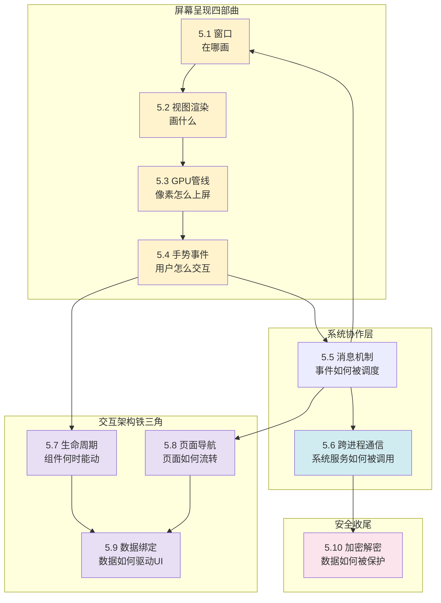

# 第 5 卷｜交互与系统

> **从硬件触点到屏幕像素，从消息循环到跨进程通信，从生命周期到响应式数据驱动**——用户交互与系统协作背后的全链路设计哲学。

---

## 🎯 这一卷要回答什么

App 用了十年，你写的每一行 `setText`、`onClick`、`addEventListener` 背后到底发生了什么？

- 屏幕上的"按钮"——它真的是个"按钮"吗？还是只是**一片像素 + 一段事件路由代码**？
- 当你点击屏幕，从硬件中断到 `onClick` 被调用，**OS 与运行时一共做了多少事**？
- 一个看似简单的透明遮罩为什么能把 60fps 拉到 30fps？**GPU 渲染管线**到底在忙什么？
- iOS 的 ResponderChain、Android 的 dispatchTouchEvent、Web 的事件冒泡——三套机制看似各异，**底层是同一件事**吗？
- Handler / Looper / MessageQueue —— 为什么所有 GUI 框架都长这样？
- 你的 Activity 被切到后台后系统什么时候会回收它？iOS 的 viewDidDisappear 和 Android 的 onStop **谁更先到**？
- 一个"返回上一页"手势，背后是手势识别 → 导航栈回退 → View 销毁 → 窗口回收——**四件事如何协同不卡顿**？
- 为什么 Vue 的 ref 改了值 UI 自动更新，而 Android 的 setText 必须手动调？**两种"数据驱动 UI"的设计差在哪**？
- 一台机器扛 10 万并发连接是怎么做到的？select / poll / epoll / io_uring 的演进解决了什么？
- HTTPS 的握手到底在握什么？AES、RSA、SHA 这些算法当初是为了解决什么矛盾？

这一卷把"看得见的 UI"和"看不见的系统"层层撕开，覆盖 **渲染、事件、生命周期、导航、数据驱动、消息、IPC、加密** 八条独立但相通的脉络。

---

## 📖 篇章总览（10 篇）

| 序号  | 文档 | 核心矛盾 |
|-----|------|---------|
| 5.1 | [窗口核心设计思想](https://yccoding.com/pages/2f009c/) | 为什么窗口是"矩形 + 事件 + 坐标系"——窗口系统的本质 |
| 5.2 | [视图加载渲染设计](https://yccoding.com/pages/070bb8/) | measure / layout / draw 三大阶段为何是这种顺序 |
| 5.3 | [图形渲染管线原理](https://yccoding.com/pages/318066/) | GPU 流水线 / 双缓冲 / 合成 / VSync 的工程艺术 |
| 5.4 | [手势事件设计灵魂](https://yccoding.com/pages/5b96db/) | 触点流 → 状态机 → 手势语义的多层抽象 |
| 5.5 | [消息机制设计思想](https://yccoding.com/pages/0aed31/) | Handler / Looper / MessageQueue 为何是 GUI 的标配 |
| 5.6 | [跨进程通信设计](https://yccoding.com/pages/e09fe7/) | 进程隔离要安全 vs 协作要通信——管道/共享内存/Binder 全景 |
| 5.7 | 组件生命周期管理 | Activity/Fragment 的回收时机 vs UIViewController 的内存警告——生命周期的跨平台共识 |
| 5.8 | 页面导航与路由设计 | 栈 / 图 / 树三种页面组织——Deep Link 如何贯通所有平台 |
| 5.9 | 响应式数据绑定设计 | 数据变化 → 依赖追踪 → UI 刷新——"推 vs 拉"两条路线谁更优 |
| 5.10 | [数据加密和解密](./5.7.数据加密和解密) | 对称 / 非对称 / 哈希 —— 三种密码学武器各自的矛盾 |

---

## 🔗 知识脉络



**5.1 / 5.2 / 5.3 / 5.4 是「屏幕呈现四部曲」**：窗口决定画在哪、视图决定画什么、GPU 管线决定像素怎么上屏、手势决定用户怎么操作。

**5.5 是这四者的调度中枢**——所有事件最终都流入消息循环。

**5.7 / 5.8 / 5.9 是「交互架构铁三角」**——这是专栏区别于任何单平台教程的核心价值所在：
- **生命周期**告诉你的代码"什么时候能动、什么时候不能动"
- **导航**串联窗口 → 视图 → 手势——一个返回手势触发四层协同
- **数据绑定**闭合交互闭环——手势是输入，UI 刷新是输出，中间靠依赖追踪

**5.6 / 5.10 是系统协作与安全维度**：本机跨进程通信 + 数据加密，闭合从"用户点击"到"数据出设备"的全链路。

---

## 🌉 与其他卷的承接

- **承接第 3 卷**：消息机制 = 单线程模型 + 事件循环 + 无锁队列，是第 3 卷范式篇的实战延伸；响应式数据绑定本质是"观察者模式"在 UI 层的极致应用，是设计模式的教材级案例。
- **承接第 4 卷**：手势事件每秒产生 60+ MotionEvent，对象池是第 4 卷拷贝原理的典型应用；零拷贝、共享内存又呼应虚拟内存。
- **延伸第 1 卷**：加密章节回到了"数据如何被表示"这一最初命题，闭合了整个专栏的环。
- **延伸第 2 卷**：生命周期 callback 是函数指针的经典应用；数据绑定中的依赖收集本质是"图遍历"——谁引用了谁。

---

## 💡 学完你能回答

- 为什么 Android 主线程必须有 Looper，子线程默认没有？子线程开 Looper 之后会不会内存泄漏？
- iOS 的 RunLoop、Android 的 Looper、JS 的 Event Loop —— **三者本质是不是同一个东西**？差异在哪？
- 一个 `RecyclerView` 滚动时为什么会卡？布局 / 测量 / 绘制 / 合成哪一步最容易成为瓶颈？
- 为什么 HTTPS 握手要先用非对称、然后切到对称？性能 trade-off 算下来到底差多少？
- 手势冲突的"父子拦截"在 Android 是 `onInterceptTouchEvent`，在 iOS 是 `requireGestureRecognizerToFail`，**两种机制是不是同一种思想的两种表达**？
- 为什么 Android Binder 能做到"一次拷贝"，而 Linux 经典 IPC 需要两次？mmap 在这里扮演了什么角色？
- Redis 单线程为什么能扛 10w QPS？Netty 的主从 Reactor 比它强在哪？
- 为什么 io_uring 被称为"下一代"——比 epoll 强在何处？
- **生命周期篇**：Activity.onPause 和 ViewController.viewDidDisappear 谁先到？为什么 Web 没有真正的"生命周期回调"？
- **导航篇**：Android 的 BackStack 和 iOS 的 NavigationStack 是不是同一回事？Web 的 History API 为什么是"半残"的栈？
- **数据绑定篇**：为什么 Compose 的 recomposition 和 Vue 的 VDOM diff 都叫"响应式"，但一个发生在编译期、一个发生在运行时？

---

## 🛣 推荐阅读顺序

```
5.1 窗口（先理解"舞台"）
   ↓
5.2 视图渲染（再理解"演员"）
   ↓
5.3 GPU 管线（再理解"舞台灯光"）
   ↓
5.4 手势事件（再理解"观众的互动"）
   ↓
5.5 消息机制（再理解"幕后调度"）
   ↓
5.6 跨进程通信（理解"幕后的幕后——系统服务"）
   ↓
5.7 组件生命周期（理解"组件何时能动"——桥接交互与系统）
   ↓
5.8 页面导航（理解"页面如何流转"——串联窗口/视图/手势）
   ↓
5.9 响应式数据绑定（闭合交互闭环——数据如何驱动 UI）
   ↓
5.10 数据加密（独立支线，保护数据传输安全）
```
