# 5.3 图形渲染管线原理

> 📍 **本篇位置**：第 5 卷 · 交互与系统 · 第 3 篇（屏幕呈现四部曲之"流"）
> 🎯 **核心矛盾**：**"声明式的画"很轻，"工业级的流水线"很重**——一个看似简单的"半透明阴影"动画让 60fps 掉到 30fps；CPU 不忙、内存不缺、代码"看上去没问题"。**因为帧不是"算出来"的，是"流水线流出来"的**，任何一个环节卡 1ms，整条管线都会塌方
> 🧭 **设计灵魂**：屏幕上每一个像素都经过 **CPU → Display List → GPU 提交 → 顶点变换 → 光栅化 → 片元着色 → 合成 → 显示** 的 8 阶段流水线。**理解渲染 = 理解每一阶段的"瓶颈位置 + 工程取舍 + 跨端落地"**——为什么有 VSync、为什么要多缓冲、为什么 OpenGL 让位给 Vulkan/Metal/WebGPU
> 🌐 **跨平台覆盖**：Android Skia/HWUI/SurfaceFlinger · iOS Core Animation/Metal/Render Server · Web Blink/Skia/Viz Compositor · Flutter Skia/Impeller · Chromium 多进程 · 游戏引擎(Unity/Unreal/Filament) · 嵌入式 LVGL 软光栅 · WebGPU 新一代标准
> 🔗 **延伸阅读**：← [5.2 视图加载渲染设计](https://yccoding.com/pages/070bb8/) · → [5.4 手势事件设计灵魂](https://yccoding.com/pages/5b96db/) · → [5.5 消息机制设计思想](https://yccoding.com/pages/0aed31/) · → [5.6 跨进程通信设计](https://yccoding.com/pages/e09fe7/)
> 💡 **通用心智**：忘掉具体平台的 API，记住一句话——**渲染 = 「应用录命令 + GPU 流水线 + 显示器扫描」三段接力**。Android 的 HWUI、iOS 的 CA、Web 的 Compositor、Flutter 的 Engine、游戏引擎的 Render Loop，本质都是「**怎么在 16.6ms 里把声明变成像素**」这一个工程问题的不同答卷。瓶颈三大类：**CPU 录制慢 / GPU fillrate 满 / VSync 错过**——任何一种都需要不同的解药。

---

> 5.2 我们看到了"视图加载渲染"在框架层做了什么——measure / layout / draw 三阶段。但 draw 之后呢？**像素是怎么从一段 Canvas 命令变成屏幕上发光点的？**
>
> 这是大多数应用层程序员的"知识断崖"——以为"调用 draw 就是渲染了"，遇到掉帧就懵。本篇要把"应用 draw → 屏幕发光"这条完整路径走一遍，揭开 GPU 管线、双缓冲、VSync、合成器、Skia 的所有底层秘密。

#### 目录介绍
- [0.真实事故引入](#0真实事故引入)
  - [0.1 半透明阴影掉帧](#01-半透明阴影掉帧)
  - [0.2 profiler 报丢帧](#02-profiler-报丢帧)
  - [0.3 灵魂三问](#03-灵魂三问)
  - [0.4 五个递进追问](#04-五个递进追问)
  - [0.5 探索路径](#05-探索路径)
  - [0.6 为何值得讲透](#06-为何值得讲透)
- [1.像素旅程八阶段](#1像素旅程八阶段)
  - [1.1 从 Text 到发光](#11-从-text-到发光)
  - [1.2 16ms 怎么来的](#12-16ms-怎么来的)
  - [1.3 双缓冲为何必须](#13-双缓冲为何必须)
  - [1.4 GPU 流水线工厂](#14-gpu-流水线工厂)
  - [1.5 管线契约与矩阵](#15-管线契约与矩阵)
- [2.双缓冲与 VSync](#2双缓冲与-vsync)
  - [2.1 VSync 信号本质](#21-vsync-信号本质)
  - [2.2 双缓冲 vs 三缓冲](#22-双缓冲-vs-三缓冲)
  - [2.3 VSync 输入延迟](#23-vsync-输入延迟)
  - [2.4 帧调度三段式](#24-帧调度三段式)
  - [2.5 缓冲策略全谱](#25-缓冲策略全谱)
- [3.合成器分层渲染](#3合成器分层渲染)
  - [3.1 为何需要分层](#31-为何需要分层)
  - [3.2 硬件合成 vs 软件合成](#32-硬件合成-vs-软件合成)
  - [3.3 过度绘制](#33-过度绘制)
  - [3.4 Flutter 为何自绘](#34-flutter-为何自绘)
  - [3.5 合成器跨端对照](#35-合成器跨端对照)
- [4.OpenGL 到 Vulkan](#4opengl-到-vulkan)
  - [4.1 OpenGL 设计局限](#41-opengl-设计局限)
  - [4.2 Vulkan/Metal/DX12](#42-vulkanmetaldx12)
  - [4.3 Metal 移动端特殊](#43-metal-移动端特殊)
  - [4.4 Impeller 为何诞生](#44-impeller-为何诞生)
  - [4.5 图形 API 全景矩阵](#45-图形-api-全景矩阵)
- [5.Skia 渲染标准](#5skia-渲染标准)
  - [5.1 Skia 统治地位](#51-skia-统治地位)
  - [5.2 Skia 核心架构](#52-skia-核心架构)
  - [5.3 Skia 对接 GPU](#53-skia-对接-gpu)
  - [5.4 命令录制价值](#54-命令录制价值)
- [5B.渲染后端选型矩阵](#5b渲染后端选型矩阵)
  - [5B.1 五大后端对比](#5b1-五大后端对比)
  - [5B.2 Skia vs Impeller](#5b2-skia-vs-impeller)
  - [5B.3 WebRender](#5b3-webrender)
  - [5B.4 Filament 3D 渲染](#5b4-filament-3d-渲染)
  - [5B.5 自研引擎代价](#5b5-自研引擎代价)
  - [5B.6 选型决策树](#5b6-选型决策树)
- [6.跨平台渲染架构](#6跨平台渲染架构)
  - [6.1 Android Skia HWUI](#61-android-skia-hwui)
  - [6.2 iOS CA + Metal](#62-ios-ca--metal)
  - [6.3 Web Blink + Skia](#63-web-blink--skia)
  - [6.4 Flutter 引擎](#64-flutter-引擎)
  - [6.5 游戏引擎](#65-游戏引擎)
- [7.经典陷阱与反模式](#7经典陷阱与反模式)
  - [7.1 onDraw 里 new 对象](#71-ondraw-里-new-对象)
  - [7.2 复杂 shader](#72-复杂-shader)
  - [7.3 纹理过大过多](#73-纹理过大过多)
  - [7.4 图层过多](#74-图层过多)
  - [7.5 RenderThread 卡死](#75-renderthread-卡死)
  - [7.6 动画用 setLayoutParams](#76-动画用-setlayoutparams)
  - [7.7 iOS 不设 opaque](#77-ios-不设-opaque)
  - [7.8 阴影无 shadowPath](#78-阴影无-shadowpath)
  - [7.9 Web 触发 Layout](#79-web-触发-layout)
  - [7.10 未升级 Impeller](#710-未升级-impeller)
  - [7.11 LVGL FB 撕裂](#711-lvgl-fb-撕裂)
- [8.总结](#8总结)
  - [8.1 三层认知阶梯](#81-三层认知阶梯)
  - [8.2 渲染瓶颈定位决策树](#82-渲染瓶颈定位决策树)
  - [8.3 七字真言](#83-七字真言)
  - [8.4 跨端术语对照](#84-跨端术语对照)
  - [8.5 本卷章节呼应](#85-本卷章节呼应)
  - [8.6 与下篇承接](#86-与下篇承接)

---

## 0.真实事故引入

### 0.1 半透明阴影掉帧

我曾经接到一个奇怪的性能 bug。Android App 首页有个"卡片飞入"动画——卡片底部带半透明阴影。设计师反馈：

> "新版本明显卡顿，旧版本流畅。但我对比代码——只是阴影颜色从灰改成半透明灰啊？"

我让他打开 GPU Profiler（开发者选项里的"GPU 呈现模式分析"），结果惊人：

```
旧版本（不透明阴影）：每帧 8 ms，稳定 60 fps
新版本（半透明阴影）：每帧 32 ms，掉到 30 fps

CPU 占用：低（< 20%）
内存：正常
GC：正常
```

**新人的反应**：

```
"半透明就多了一个 alpha 通道而已，能差 4 倍？？"
"会不会是 Bitmap 没复用？"
"会不会是阴影模糊算法太重？"
```

我们排查了 4 小时——直到打开 **Overdraw 调试**（"调试 GPU 过度绘制"）。屏幕一打开变成五颜六色：

```
绿色：1 次绘制
浅红：2 次绘制
红色：3 次绘制
深红：4+ 次绘制 ← 卡片区域全是深红！
```

**真相浮现**：

```
半透明意味着每个像素要"混合"——
GPU 必须先读取背景色 → 与卡片色按 alpha 混合 → 写回
而且半透明区域不能被"遮挡剔除"——下层像素也必须画

结果：原本 1 次写入的像素，要画 4 次（背景层 + 卡片层 + 阴影层 + 文字层）
GPU 的 fillrate（填充率）瞬间被打满
```

**修复仅一行**：

```xml
<!-- 把"阴影 + 卡片"提前合成成一张不透明 bitmap -->
<View android:layerType="hardware" />
```

```
让 Android 在硬件层把这一组 View 预合成一次
之后每帧只需要"贴一张图"——overdraw 从 4 降到 1
fps 立刻回到 60
```

**这次救火让我们刻骨铭心地体会到**——**渲染性能的瓶颈，在大多数情况下不是 CPU、不是内存，而是 GPU 的 fillrate**。而要看到这一点，必须懂 GPU 流水线。

### 0.2 profiler 报丢帧

另一个故事。我在 Flutter 开发一个图片列表，肉眼"流畅"，但用 DevTools 的 Performance Overlay 看：

```
红色条频繁出现 = 单帧超过 16ms
但用户视觉上没感觉卡顿

为什么？
```

打开 GPU Timeline：

```
帧 1：UI 线程 8ms，GPU 线程 5ms ✓
帧 2：UI 线程 6ms，GPU 线程 22ms ✗ ← GPU 超时
帧 3：UI 线程 7ms，GPU 线程 4ms ✓
帧 4：UI 线程 6ms，GPU 线程 18ms ✗
```

**根因**：**GPU 线程"瞬时丢帧"**——加载新图片时，GPU 要把图片纹理上传到显存，这个操作单帧约 20ms，但因为肉眼帧率约 30fps（用户感知不到 60→30 的降级），所以"看起来"流畅。

**修复**：

```dart
// 预加载下一屏图片到 GPU 纹理
precacheImage(NextImage, context);
```

**这次让我意识到**——**渲染管线是分阶段的，每个阶段都可能成为瓶颈**。CPU 慢 = 一种症状，GPU 慢 = 另一种症状，纹理上传慢 = 第三种症状——治疗方案完全不同。

### 0.3 灵魂三问

这两个事故让我反复追问：

1. **为什么 16ms 是道生死线？这个数字哪里来的？** —— 它和人眼有什么关系？和硬件有什么关系？
2. **为什么"半透明"就让性能暴跌？这背后的硬件机制是什么？** —— GPU 内部到底在做什么
3. **为什么 60fps 是"流畅"的标准，但 ProMotion / 高刷新率显示器 120Hz 又必须做？** —— 帧率追求的本质是什么

### 0.4 五个递进追问

要把"渲染管线"讲透，需要递进回答：

1. **像素到屏幕到底要经过几道关？** —— 8 阶段流水线
2. **为什么需要双缓冲？** —— 撕裂的物理本质
3. **VSync 是什么？为什么没它会撕裂？** —— 显示器的固定刷新节拍
4. **合成器为什么是现代 UI 的"必备"？** —— 分层的工程价值
5. **OpenGL 为什么被 Vulkan/Metal 取代？** —— 图形 API 的代际矛盾

### 0.5 探索路径

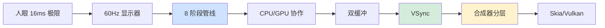

### 0.6 为何值得讲透

我想抛三个问题：

1. **为什么 90% 的应用层程序员对"渲染"是黑盒？** —— 因为 framework 屏蔽得太好——直到出问题才暴露。
2. **为什么 Flutter 选择自绘引擎而不是用原生 View？** —— 因为原生 View 的渲染管线"约束太多"，自绘才能控制每个像素。
3. **为什么游戏引擎和 UI 框架的渲染思路差异巨大？** —— 因为它们对帧率/精度/灵活性的取舍完全不同。

读完本章你会懂：**渲染不是"画图"——它是一条精密的工业流水线，每个阶段都有自己的物理约束和工程取舍**。

---

## 1.像素旅程八阶段

### 1.1 从 Text 到发光

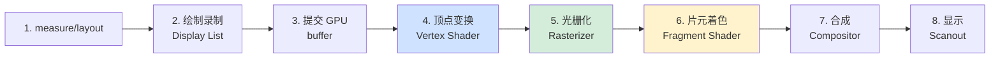

**每一阶段的功能与可能的瓶颈**：

| 阶段 | CPU/GPU | 做什么 | 典型瓶颈 |
|---|---|---|---|
| 1. measure/layout | CPU | 算每个 View 的大小和位置 | 嵌套深、复杂布局 |
| 2. 绘制录制 | CPU | 把"画什么"录成命令列表 | onDraw 里太多对象 |
| 3. 提交 GPU | CPU→GPU | 把命令传到 GPU 端 | 大量小对象的命令 |
| 4. 顶点变换 | GPU | 计算每个顶点的屏幕坐标 | 顶点过多 |
| 5. 光栅化 | GPU | 把三角形变成像素 | 过度绘制 |
| 6. 片元着色 | GPU | 计算每个像素的颜色 | shader 太复杂 / fillrate 满 |
| 7. 合成 | GPU | 把多个图层贴到一起 | 图层过多 |
| 8. 显示 | 硬件 | 把帧 buffer 内容扫描到屏幕 | VSync 错过 |

### 1.2 16ms 怎么来的

**§0.4 第一题答案**。为什么是 16ms？

**人眼的极限**：

```
20-30 fps：感觉到"动画"
40-50 fps：感觉到"流畅"
60 fps：达到"非常流畅"
120 fps：感觉"丝滑"（高刷设备）

→ 主流显示器都是 60Hz（每秒刷新 60 次）
→ 1000ms / 60 = 16.67ms
→ 这就是"每帧预算"
```

**16ms 内必须完成所有 8 个阶段**——超过就丢帧。

**这就是§0.6 第三题的答案**——**60Hz 是和硬件、人眼、能耗的共同妥协**。120Hz 给了"超流畅"但功耗翻倍——这是为什么 ProMotion 默认自适应（静止时 10Hz、动态时 120Hz）。

### 1.3 双缓冲为何必须

假设没有双缓冲——单缓冲场景：

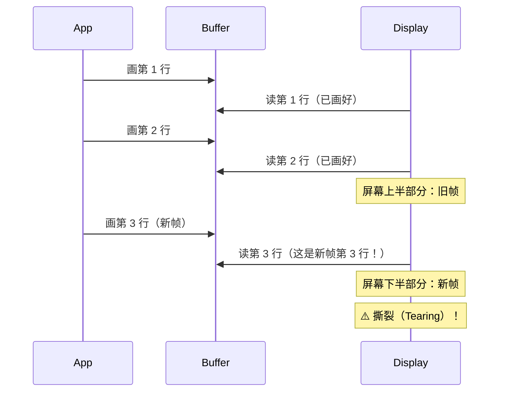

**根因**：显示器以 60Hz 节拍**逐行扫描** buffer——但 GPU 写入和扫描没有同步，扫描时如果 GPU 正写到一半，就会出现"上半旧帧 + 下半新帧"的撕裂画面。

**双缓冲的解法**：

```
两个 buffer：Front buffer（屏幕正在显示的）+ Back buffer（GPU 正在画的）
GPU 画完 Back buffer
等到下一次 VSync（显示器扫描完）
两个 buffer 整体交换（swap）
新一帧瞬间整体出现，不会撕裂
```

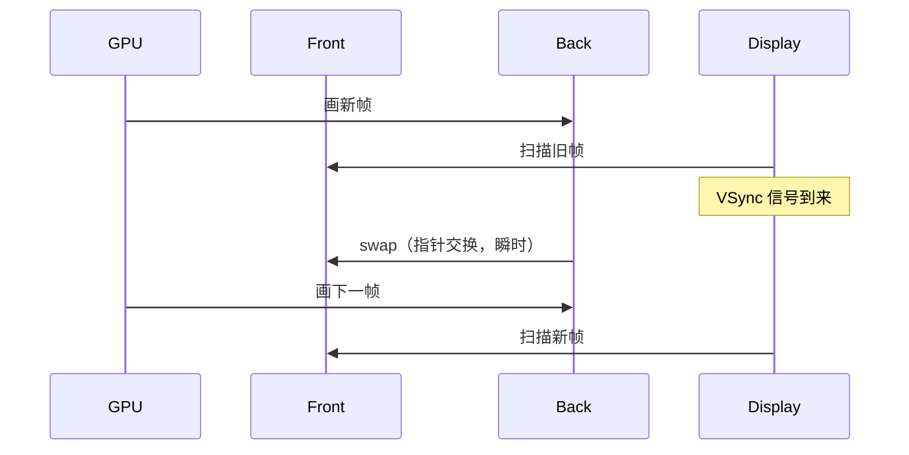

### 1.4 GPU 流水线工厂

**§0.3 第二题答案**。GPU 内部到底在做什么？

GPU 的核心特点：**大规模并行**——上千个核心同时跑同一份代码（SIMD）：

```
CPU：4-32 个核，每个核很强（执行复杂逻辑）
GPU：1000-10000 个核，每个核简单（只能做向量运算）

→ CPU 适合：复杂逻辑、分支多、数据少
→ GPU 适合：简单逻辑、无分支、数据海量（图形渲染就是典型）
```

**Vertex Shader（顶点着色器）**：

```glsl
// 对每个顶点跑一遍——并行
attribute vec3 position;
uniform mat4 mvpMatrix;

void main() {
    gl_Position = mvpMatrix * vec4(position, 1.0);
}
```

**Fragment Shader（片元着色器）**：

```glsl
// 对每个像素跑一遍——并行（这就是为什么半透明这么贵）
varying vec4 color;

void main() {
    gl_FragColor = color;
}
```

**§0.3 第二题深入答案**——**半透明让性能暴跌的物理机制**：

```
不透明像素：直接写入
  片元着色器输出 → 写到帧 buffer

半透明像素：
  1. 读取帧 buffer 当前值（一次内存访问）
  2. 与新值按 alpha 混合（运算）
  3. 写回（一次内存访问）
  → 多了 2 次内存访问 + 运算

而且半透明区域不能"遮挡剔除"
  即使被上层遮住，下层也必须画
  → 浪费大量 fillrate
```

### 1.5 管线契约与矩阵

剥离所有具体平台，**任何 GUI/游戏渲染系统都遵循同样的 8 阶段管线**。这是本篇最值得贴在 IDE 旁边的"渲染原理通用名片"：

```
通用管线契约（六端共享）：

   ┌─────────────┐  ┌─────────────┐  ┌─────────────┐
   │ 1.算位置     │→│ 2.录命令     │→│ 3.跨线程提交 │
   │ measure     │  │ paint       │  │ submit      │  ← CPU 侧
   │ /layout     │  │ /record     │  │ /enqueue    │
   └─────────────┘  └─────────────┘  └─────────────┘
                                          │
                                          ▼
   ┌─────────────┐  ┌─────────────┐  ┌─────────────┐
   │ 4.顶点变换   │→│ 5.光栅化     │→│ 6.片元着色   │  ← GPU 侧
   │ vertex      │  │ raster      │  │ fragment    │
   └─────────────┘  └─────────────┘  └─────────────┘
                                          │
                                          ▼
                              ┌─────────────────────┐
                              │ 7.合成 → 8.扫描上屏 │  ← 系统/硬件侧
                              └─────────────────────┘
```

**这八步在六端的对应名词**——任何应用开发者都能在自己的平台里找到对应位置：

| 阶段 | Android | iOS | Web (Blink) | Flutter | Compose | 游戏引擎 | LVGL(嵌入式) |
|------|---------|-----|-------------|---------|---------|---------|-------------|
| **1.算位置** | `measure/layout` | `layoutSubviews` | Style + Layout | `RenderObject.layout` | `Measurable.measure` | Scene Graph 更新 | `lv_obj_refr_size` |
| **2.录命令** | `onDraw → DisplayList` | `drawRect: → CALayer` | `Paint → DisplayItem` | `paint → Scene` | `DrawScope` | RenderQueue 装填 | 直接画 framebuffer |
| **3.跨线程提交** | UI→RenderThread | Main→Render Server (IPC) | Renderer→Viz (IPC) | UI→Raster Thread | 同 Android | 主线程→渲染线程 | 同线程（单线程） |
| **4.顶点变换** | Skia → GLES/Vulkan VS | Metal VS | Skia → GL VS | Skia/Impeller VS | 同 Android | 引擎专用 VS | 不适用（软光栅） |
| **5.光栅化** | GPU 固定流水线 | Metal Raster | GPU Raster | GPU Raster | 同 Android | GPU Raster | CPU 软件扫描线 |
| **6.片元着色** | Skia 内置 FS | Metal FS | Skia FS | Skia/Impeller FS | 同 Android | 自定义 FS（PBR） | CPU 计算颜色 |
| **7.合成** | SurfaceFlinger + HWC | Render Server + CA | Viz Compositor | Engine Compositor | 同 Android | SwapChain | **无合成**（单 framebuffer） |
| **8.扫描上屏** | Display Controller (DCI) | Display Pipeline | OS Display | Engine 提交 | 同 Android | SwapChain → DCI | flush_cb |

**这套契约的「跨端不变量」**——任何应用开发者必背：

1. **三段式：CPU 录 → GPU 算 → 硬件扫**。三段独立运行，但必须按节拍接力。
2. **VSync 是总节拍器**。无论平台，最后一段必然受显示器节拍约束。
3. **任一段超 16.6ms = 掉帧**。瓶颈可能在任何一段，不能只盯 CPU 或 GPU。
4. **嵌入式是「极简版」**：单线程、单缓冲、无 GPU、无合成——但管线骨架完全一致。

**给所有应用开发者的总记忆**：

> 不论你在做 Android App、iOS App、Web 页面、Flutter App、Unity 游戏，还是给智能手表写 UI——**像素从你写的"声明"到屏幕发光，必经这 8 段流水线**。学会这套抽象，下次掉帧时你能精准说出"瓶颈在第几段"，而不是"反正就是卡"。

---

## 2.双缓冲与 VSync

### 2.1 VSync 信号本质

**显示器的固定节拍**：

```
60Hz 显示器：每 16.67ms 发出一次 VSync 信号
告诉系统："我开始扫描下一帧了，请准备好新帧"
```

**Android 的 Choreographer**——把 VSync 信号转化为应用层节拍：

```java
Choreographer.getInstance().postFrameCallback(new FrameCallback() {
    public void doFrame(long frameTimeNanos) {
        // 在每次 VSync 到来时被调用
        // 应用 layout / draw 都从这里出发
    }
});
```

**iOS 的 CADisplayLink**——同等机制：

```swift
let displayLink = CADisplayLink(target: self, selector: #selector(step))
displayLink.add(to: .current, forMode: .default)
```

### 2.2 双缓冲 vs 三缓冲

**双缓冲的问题——丢帧时的"卡顿"**：

```
帧 1：GPU 在 16ms 内画完 Back buffer ✓
       VSync 来了 → swap → 显示
帧 2：GPU 画了 18ms（超时 2ms）
       VSync 来了但 Back buffer 没画完
       → 这一次 VSync 错过 → 屏幕显示旧帧（卡顿一帧）
       → 下一次 VSync 才能 swap
       → 实际新帧延迟了 16ms 才显示
```

**三缓冲的解法**：多一个 buffer 让 GPU 有"预留时间"：

```
Front buffer：正在扫描
Back buffer A：上一帧画好的
Back buffer B：GPU 正在画

帧 N：GPU 画 buffer B
       VSync 来 → swap A 上去显示（不等 B）
帧 N+1：GPU 继续画 B 或者画 A
       VSync 来 → swap B 上去
```

**代价**：多一个 buffer 内存（1080p×4 字节 ≈ 8MB）+ 延迟增加 16ms（buffer 多了一层）。

**取舍**：

```
游戏：常用三缓冲（追求流畅）
UI：常用双缓冲（追求低延迟，触摸响应快）
VR：双缓冲 + 异步时间扭曲（延迟必须 < 20ms 否则晕动症）
```

### 2.3 VSync 输入延迟

```
用户触摸屏幕（t=0）
应用收到事件（t=2ms）
draw 命令录制（t=8ms）
GPU 渲染（t=12ms）
等 VSync（t=16ms）
显示在屏幕（t=16ms）

→ 端到端延迟 ~16ms
```

**游戏机的"延迟优化"**：

```
关闭 VSync（容忍撕裂）+ 高帧率（240fps）
→ 延迟降到 ~4ms
→ 竞技游戏选手宁愿撕裂换响应
```

### 2.4 帧调度三段式

Android 一帧的具体阶段：

```mermaid
gantt
    title 一帧的 16ms 预算
    dateFormat X
    axisFormat %s
    
    section UI 线程
    Input 处理     :a1, 0, 1
    Animation     :a2, 1, 2
    Measure/Layout :a3, 2, 4
    Draw 录制      :a4, 4, 6
    
    section RenderThread
    Sync GPU      :b1, 6, 7
    GPU 执行      :b2, 7, 14
    
    section 显示
    VSync         :c1, 16, 17
```

**关键观察**：

```
UI 线程（CPU）和 RenderThread（GPU 端）可以并行
但下一帧的 UI 线程要等当前帧的 GPU sync
→ "GPU 慢"会反向卡 UI 线程
```

### 2.5 缓冲策略全谱

§2.2 只讲了双缓冲 / 三缓冲。**真实工业界存在五种缓冲策略**——它们都是「**延迟 vs 流畅 vs 撕裂 vs 内存**」四难权衡的不同答卷：

| 策略 | 缓冲数 | 延迟 | 撕裂 | 流畅 | 内存 | 适用场景 |
|------|-------|------|------|------|------|---------|
| **单缓冲** | 1 | 极低 | 严重 | 差 | 低 | 嵌入式 MCU、文字终端 |
| **双缓冲 + VSync** | 2 | 中（16ms） | 无 | 中（卡 1 帧就掉 1 帧） | 中 | 移动 UI（默认） |
| **三缓冲 + VSync** | 3 | 高（最多 32ms） | 无 | 高（容忍偶尔 GPU 慢） | 高 | Android Game / 桌面游戏 |
| **Mailbox（VR）** | 3+ | 极低 | 无 | 高 | 高 | VR、电竞、Vulkan/WebGPU 默认 |
| **Adaptive Sync** | 2 | 低（自适应） | 无 | 极高 | 中 | G-Sync / FreeSync / ProMotion |

**模式 1：单缓冲（嵌入式 MCU）**

```
LVGL 在内存 < 64KB 的 Cortex-M 上的常见做法：
  - 只分配一块 framebuffer（屏幕大小 × 字节深度）
  - 直接画到这块 buffer
  - 同时被显示控制器扫描
  
为什么不撕裂？
  - 嵌入式屏幕扫描率低（30Hz 甚至 10Hz）
  - 应用画速度 >> 扫描速度，画完再有可观时间窗口
  - 接受偶尔撕裂（用户看不出来）
```

**模式 2：双缓冲（移动 UI 主流）**

```
适合"事件驱动 + 静止时不画"的 UI 场景：
  - 没动画时 GPU 闲置，省电
  - 动画时按 VSync 节拍 swap
  
缺点：GPU 一旦超 16ms → 整帧丢
```

**模式 3：三缓冲（FIFO 模式）**

```
解决"双缓冲 GPU 偶尔慢就丢帧"问题：
  Front          ← 显示
  Back A         ← 上一帧画好的，排队等显示
  Back B         ← GPU 正在画
  
  GPU 慢一点也没事：A 顶上去显示，GPU 慢慢画 B
代价：最坏情况延迟 32ms（buffer 多排队一帧）
```

**模式 4：Mailbox（VR / WebGPU 默认）**

```
Vulkan 中的 VK_PRESENT_MODE_MAILBOX：
  - 多 buffer，但永远只展示"最新的"
  - GPU 画完就把最新的塞进 mailbox
  - 显示器要扫描时从 mailbox 拿最新的
  - 旧的直接丢
  
为什么 VR 必须用：
  - VR 延迟 > 20ms = 晕动症
  - 宁愿丢中间帧也要保证"显示的总是最新的"
```

**模式 5：Adaptive Sync（G-Sync / FreeSync / ProMotion）**

```
显示器主动配合 GPU——刷新率不是固定的：
  - GPU 画完 1 帧 = 18ms → 显示器等到 18ms 才刷
  - GPU 画完 1 帧 = 8ms  → 显示器立刻刷（120Hz）
  - GPU 画完 1 帧 = 50ms → 显示器 20Hz
  
彻底消除"等 VSync 浪费"+ 彻底消除撕裂
代价：显示器要支持（VRR 协议）+ 操作系统要支持
```

**iPhone ProMotion 的策略**——把 Adaptive Sync 推到极致：

```
静止时：10Hz（极省电）
慢速滚动：30Hz
快速滚动：60Hz
游戏：120Hz
→ 同一台设备根据负载自动切档
→ 能耗与流畅同时最优
```

**缓冲策略选型决策树**：

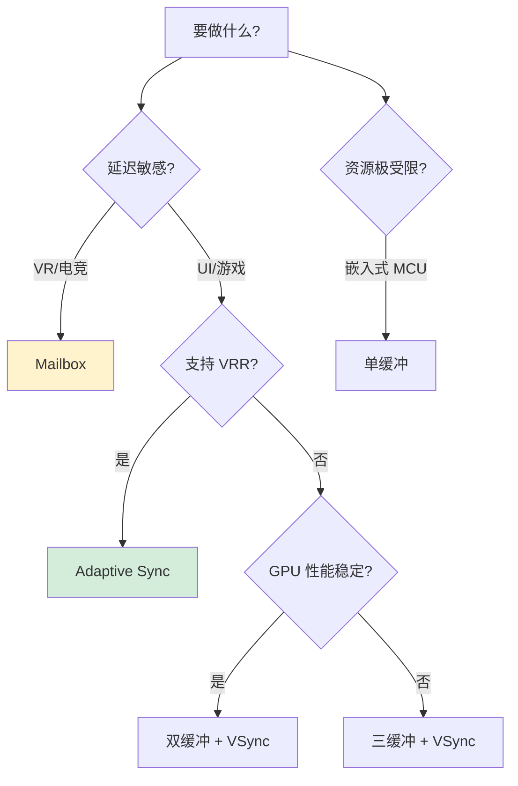

**给应用开发者的关键提示**：

> 你以为只能"选双缓冲或三缓冲"——其实背后是显示器 + 操作系统 + GPU 三方协议。
>
> **iPhone 高刷的"丝滑"+ Android Game 模式的"稳"+ VR 的"无晕"——都是不同缓冲策略下的产物**。
>
> 下次有人问你"为什么 iPhone 比 Android 看上去更顺"——答案的一半就在这里：**ProMotion 是 Adaptive Sync，Android 大部分还在双缓冲 + VSync**。

---

## 3.合成器分层渲染

### 3.1 为何需要分层

**朴素思路**：所有内容画到一张大画布上。

**问题**：

```
状态栏：基本不变
内容区：滚动时变
导航栏：基本不变
键盘：弹起时变

每帧都重画全部 → 90% 是无效绘制
```

**分层思路**：

```
每个"基本独立变化的区域"放一个图层（Layer）
GPU 把每个图层画到自己的纹理（texture）
最后合成器把所有纹理"贴在一起"
```

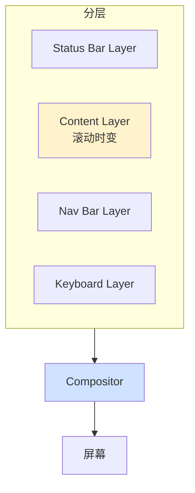

**优势**：

```
1. 滚动时只重画 Content Layer——其他层是缓存的纹理
2. 合成是 GPU 硬件加速的——非常快
3. 动画流畅——比如 "fade out" 一个 Layer 只是改 alpha，不重画
```

### 3.2 硬件合成 vs 软件合成

**硬件合成**——专用硬件（HWC，Hardware Composer）：

```
SurfaceFlinger（Android）/ WindowServer（iOS）
直接利用显示控制器的"图层叠加"能力
不经过 GPU——能耗更低
```

**软件合成**——退回 GPU：

```
当图层数量超过硬件支持的上限（如 8 层）
当图层有复杂效果（旋转、透明、模糊）
HWC 不能处理 → 退回 GPU 用 Skia 合成
```

**Android 的优化策略**：

```
GraphicBuffer 准备好
HWC 优先：能直接合成的图层 → 硬件直接贴
不能的（如带 RoundedCorner）→ GPU 合成
最后所有结果合并到 framebuffer
```

### 3.3 过度绘制

**§0.1 事故的根因**——过度绘制：

```
每个像素被画过几次：
  1 次：理想（绿）
  2 次：可接受（浅红）
  3 次：警惕（红）
  4+ 次：必须优化（深红）
```

**常见的 Overdraw 来源**：

```
1. 多层透明 View 叠加
2. 容器有背景色 + 子 View 也有背景色（背景被画两次）
3. 半透明的卡片 + 阴影 + 内容（4 次）
4. ScrollView + Item 都画自己的背景
```

**优化手段**：

```
1. 移除多余背景：clipChildren=true、移除 setBackground
2. 使用 ViewStub / RecyclerView 复用
3. 用 Layer Type Hardware 预合成静态部分
4. iOS：opaque=true（让系统知道下层不需要画）
```

### 3.4 Flutter 为何自绘

```
原生 View 的渲染管线：
  开发者 → View 框架 → SurfaceFlinger → Skia → GPU
  
Flutter 的渲染管线：
  开发者 → Flutter Widget → 自己的 Skia → GPU

为什么自绘？
1. 跨平台一致性：Android/iOS 像素级一致
2. 控制每一帧的所有细节（动画曲线、合成顺序）
3. 不依赖系统 View 的"约束"
4. 自定义 shader 更灵活
```

**代价**：

```
1. App 包变大（带了一份 Skia）
2. 与原生交互成本高（PlatformChannel）
3. 无障碍、文本输入等系统能力要重新对接
```

### 3.5 合成器跨端对照

合成器是"分层渲染"的核心引擎——**所有现代 GUI 平台都有它，只是名字不同、形态不同**：

| 平台 | 合成器名 | 进程模型 | 输入 | 输出 | 硬件路径 |
|------|---------|---------|------|------|---------|
| **Android** | **SurfaceFlinger** | 独立系统进程（system_server 旁） | 各 App 的 BufferQueue | framebuffer | HWComposer（HWC HAL） |
| **iOS / macOS** | **Render Server (backboardd)** | 独立进程（应用进程之外） | 各 App 的 CALayer Tree | framebuffer | Core Animation → Metal |
| **Chrome / Web** | **Viz Compositor** | 独立 GPU 进程 | 各 Tab 的 CompositorFrame | framebuffer | Skia → GPU |
| **Flutter** | **Engine Compositor** | App 内 Raster Thread | Layer Tree | platform view 或 framebuffer | Skia/Impeller → Metal/Vulkan |
| **Wayland (Linux)** | **Wayland Compositor** (Weston/Mutter/KWin) | 独立进程 | 各客户端 surface | framebuffer | DRM/KMS |
| **Windows (Win10+)** | **DWM (Desktop Window Manager)** | 独立系统进程 | 各窗口 swap chain | framebuffer | DirectComposition → DX |
| **嵌入式 LVGL** | **无（直接 framebuffer）** | 同应用线程 | widget tree | framebuffer | 软光栅直接写 |

**共性提炼**——所有合成器都做这五件事：

```
1. 收集图层（layers / surfaces / textures）
   → 从各应用/进程收集"待合成内容"
   
2. 排序与剔除
   → 按 Z 序、可见性、透明度剔除被遮挡部分
   
3. 选择合成路径
   → 硬件 HWC（能耗低、限制多）vs GPU 合成（万能但费电）
   
4. 同步 VSync
   → 等显示器节拍，避免撕裂
   
5. 提交 framebuffer
   → 写到显示控制器（DCI/DRM/Metal Display Pipeline）
```

**进程模型的"现代趋势"——合成器一定要独立**：

```
为什么所有平台都把合成器放到「独立进程」里？

应用进程崩溃 / 主线程卡死时，合成器仍能：
  - 显示"最后一帧"（状态栏、键盘、动画继续转）
  - 接收 ANR 弹窗、强杀回收
  - 让用户"感觉系统还活着"

这就是 iOS 给人"丝滑、不死机"的工程根因
也是为什么 Android 从 4.3 起把 SurfaceFlinger 放在系统进程
也是为什么 Chrome 把 Compositor 拆到 GPU 进程
```

**合成路径决策——HWC vs GPU 合成的现场逻辑**：

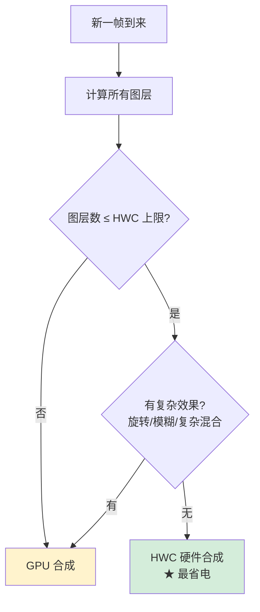

**iOS / Android 通过这套决策实现"动画时能耗最低"**——常见的滚动列表、简单卡片、状态栏更新，几乎都能命中 HWC 路径，**完全不经过 GPU**，所以即使长时间使用电池消耗也很低。

**给应用开发者的实战提示**：

> 你给一个 View 加了 `cornerRadius` + `masksToBounds`、或者加了带阴影的浮动卡片——**就把这个图层从「HWC 路径」踢到了「GPU 路径」**，能耗瞬间翻倍。
>
> 这就是 §0.1 半透明阴影事故的真正根因：**不是 GPU 算不动，而是把本来 HWC 能搞定的事踢给了 GPU**。

---

## 4.OpenGL 到 Vulkan

### 4.1 OpenGL 设计局限

OpenGL（1992 年生）——**状态机式**：

```c
glBindBuffer(GL_ARRAY_BUFFER, vbo);
glEnable(GL_BLEND);
glBlendFunc(GL_SRC_ALPHA, GL_ONE_MINUS_SRC_ALPHA);
glDrawArrays(GL_TRIANGLES, 0, count);
```

**特点**：

```
驱动层有大量"全局状态"
应用调一个函数 → 驱动可能要做大量验证、转换
驱动是"黑盒"——开发者无法控制
```

**问题**：

```
1. 多线程友好性差——状态是全局的
2. 难以预测性能——驱动里发生了什么不知道
3. 跨平台兼容性差——各家实现差异大
```

### 4.2 Vulkan/Metal/DX12

**显式 API 时代**（2015+）：

```cpp
// Vulkan：每一步都是显式的
VkCommandBuffer cmd = AllocateCommandBuffer(...);
BeginCommandBuffer(cmd);
CmdBindPipeline(cmd, pipeline);
CmdBindVertexBuffers(cmd, ...);
CmdDraw(cmd, ...);
EndCommandBuffer(cmd);
SubmitToQueue(cmd);   // 显式提交
```

**核心变化**：

```
1. 显式 Command Buffer——可在多线程构建
2. 显式同步（fence、semaphore）——开发者控制
3. 没有全局状态——所有状态绑在 pipeline 对象
4. 接近硬件——开销小，但学习曲线陡
```

**§0.6 第三题答案**：

```
OpenGL：易用，但驱动层抽象成本高 → 移动端电池伤不起
Vulkan/Metal：显式，性能好，但开发难度高
→ 工业界的取舍：
  游戏引擎：Vulkan/Metal（性能优先）
  UI 框架：依然用 OpenGL ES（够用即可）
  Flutter：从 OpenGL 迁到 Impeller（自研引擎）
```

### 4.3 Metal 移动端特殊

Metal（2014）的设计哲学：

```
专为移动端 SoC 设计（CPU + GPU 共享内存）
统一内存：避免显式拷贝
并发命令构建：多线程友好
低开销：每次 draw call 几乎零驱动开销
```

**移动端的核心约束**：

```
1. 能耗——电池有限
2. 散热——发热即降频
3. 内存——统一内存有限

→ Metal 的设计全部围绕这三点
```

### 4.4 Impeller 为何诞生

Flutter 早期用 Skia + OpenGL ES——遇到 **shader 编译卡顿**：

```
新画面第一次出现 → shader 即时编译 → 几十毫秒卡顿
"Janky 第一帧"问题严重
```

**Impeller 的解法**：

```
预编译 shader（构建期就生成）
基于 Metal/Vulkan
每次绘制都用预编译好的 pipeline
彻底消除 shader 编译卡顿
```

### 4.5 图形 API 全景矩阵

§4.1-4.4 讲了 OpenGL / Vulkan / Metal——但实际工业界存在 **8 个主流图形 API**，它们各自服务于不同生态：

| API | 厂商 | 诞生 | 抽象级别 | 目标平台 | 现状 |
|-----|-----|------|---------|---------|------|
| **OpenGL** | Khronos | 1992 | 高（状态机） | 桌面跨平台 | 维护模式，新项目避免 |
| **OpenGL ES** | Khronos | 2003 | 高 | 移动设备 | 仍是 Android 主流 |
| **WebGL / WebGL2** | Khronos | 2011 / 2017 | 高 | Web 浏览器 | 仍主流，但被 WebGPU 取代中 |
| **Vulkan** | Khronos | 2016 | 低（显式） | 跨平台（含移动） | 未来标准，复杂度高 |
| **Metal** | Apple | 2014 | 低 | Apple 生态独家 | macOS/iOS 唯一新 API |
| **DirectX 11** | Microsoft | 2009 | 高 | Windows / Xbox | Windows 桌面/游戏主流 |
| **DirectX 12** | Microsoft | 2015 | 低 | Windows / Xbox | AAA 游戏主流 |
| **WebGPU** | W3C | 2023 | 中（介于 GL/Vulkan） | Web 跨浏览器 | 新一代 Web 图形标准 |

**矩阵视角——选哪一个 API**：

| 维度 | OpenGL ES | Vulkan | Metal | DX 12 | WebGPU |
|------|----------|--------|-------|-------|--------|
| **学习曲线** | 平缓 | 陡峭 | 中等 | 陡峭 | 中等 |
| **多线程友好** | 差 | 极好 | 好 | 极好 | 好 |
| **驱动开销** | 高 | 低 | 极低 | 低 | 中 |
| **平台覆盖** | Android/Linux/Windows | 全平台（Apple 需 MoltenVK） | Apple 独家 | Windows/Xbox | 浏览器 |
| **shader 语言** | GLSL | SPIR-V (GLSL/HLSL 编译) | MSL | HLSL | WGSL |
| **现代特性** | ✗ | ✓ Raytrace/Mesh Shader | ✓ Raytrace | ✓ Raytrace/Mesh | ⏳ 演进中 |

**「显式 API 革命」的核心动机**——这是理解 Vulkan/Metal/DX12/WebGPU 同时出现的关键：

```
2010 年代后期，开发者发现：
  - 多核 CPU 普及，但 OpenGL 单线程驱动成为瓶颈
  - 移动端能耗敏感，OpenGL 驱动开销大
  - VR/4K 出现，需要"每帧 10000+ draw call"
  
传统 API 解决方案：让驱动做更多优化
显式 API 解决方案：让应用直接管理 → 性能可预测、CPU 开销低

代价：写代码量增加 5-10 倍
解决：用引擎（Unity/Unreal）封装，应用层不直接碰
```

**WebGPU 的特殊性**——为什么 2023 才标准化？

```
WebGL：本质上是 OpenGL ES 在浏览器里的包装
  → 同样的"单线程、状态机、驱动开销大"问题
  → 还多了"沙箱 + 同步限制"

WebGPU 的设计取舍：
  比 WebGL 现代（向 Vulkan/Metal/DX12 看齐）
  比 Vulkan 简单（不至于让前端崩溃）
  跨浏览器一致（W3C 标准）
  
→ 它是"显式 API 的浏览器版"
→ 2023+ 的 Web 3D / GPU 计算的未来
```

**「shader 语言碎片化」的工程苦恼**：

```
GLSL  → OpenGL / WebGL / Vulkan（编译为 SPIR-V）
MSL   → Metal
HLSL  → DirectX / Vulkan（编译为 SPIR-V）
WGSL  → WebGPU

跨端引擎的痛苦：要写 4 套 shader？

工业界解决方案：
  Unity：HLSL → 编译到各端
  Unreal：HLSL → 编译到各端
  Flutter Impeller：从 Skia GLSL 翻译到 Metal/Vulkan
  Filament：自己的 .mat 格式 → 各端 shader
```

**给应用开发者的选型口诀**：

> - 写 Android 应用：**OpenGL ES**（默认）或 Vulkan（性能极致）
> - 写 iOS 应用：**Metal**（唯一选择）
> - 写 Web 应用：**WebGL**（兼容）或 **WebGPU**（前沿）
> - 写 Windows 游戏：**DX 12** 或 **Vulkan**
> - 写跨端游戏：**Unity/Unreal 引擎**（让引擎选）
> - 写 UI 框架：**Skia / Impeller**（让框架选）
> - 写 VR：**Vulkan / Metal**（性能必须）

> **作为 "应用层" 开发者，你大概率永远不会直接写 Vulkan/Metal——但你必须懂这套矩阵，否则连框架的性能瓶颈都看不懂**。

---

## 5.Skia 渲染标准

### 5.1 Skia 统治地位

**用户列表（不完全）**：

```
Chrome/Chromium：Web 渲染
Android：HWUI 之下
Flutter：UI 引擎
Firefox：部分（WebRender 取代中）
LibreOffice：UI
Fuchsia OS：所有 UI
```

**为什么所有人都选 Skia？**

```
1. 开源（BSD 协议）
2. 跨后端：CPU / OpenGL / Vulkan / Metal / WebGPU
3. 命令录制 + 后端绘制分离
4. 文字、图片、几何、滤镜全功能
5. Google 持续投入 15+ 年
```

### 5.2 Skia 核心架构

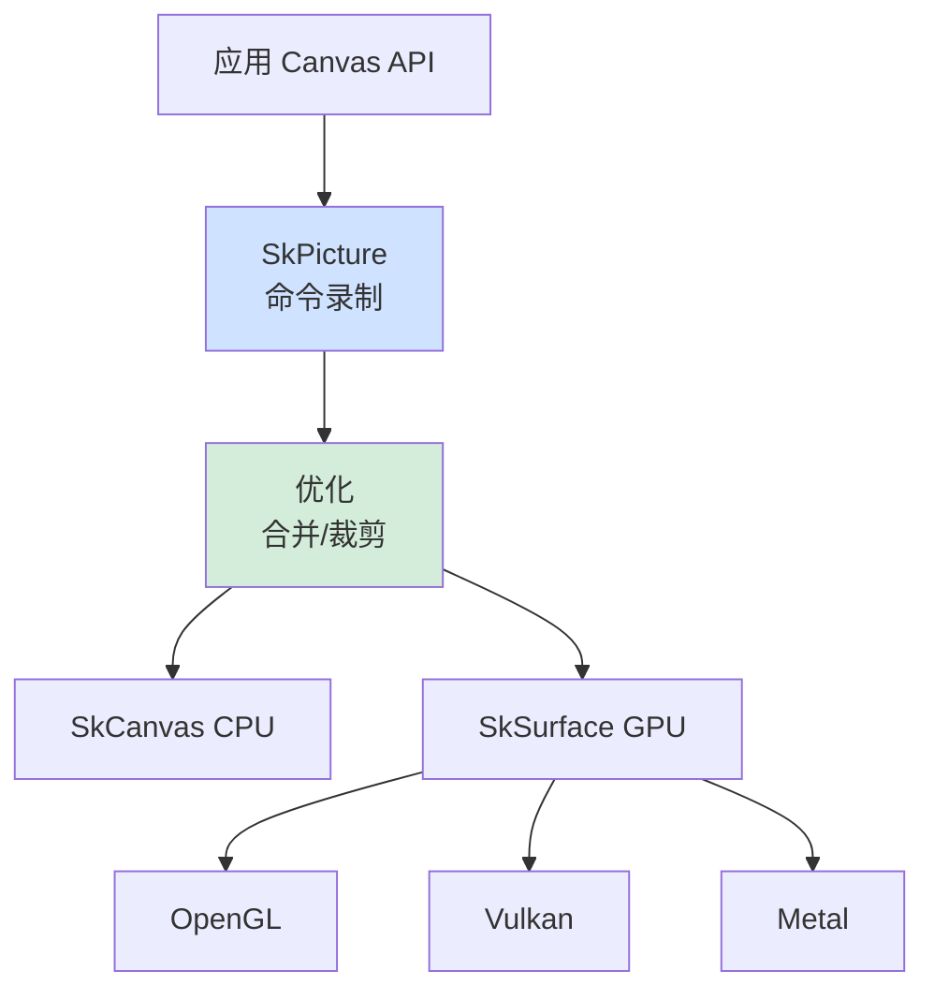

**录制 + 重放架构**：

```
应用调 canvas.drawRect / drawText
  → Skia 不立刻绘制，而是"录制"成 SkPicture
  → 等到提交时再"重放"到具体后端

好处：
1. 同一份命令可在 CPU 或 GPU 上重放
2. 可以离线优化（合并、裁剪、剔除）
3. 可序列化（用于跨进程传输）
```

### 5.3 Skia 对接 GPU

```cpp
// Skia 的 GPU 后端伪代码
SkSurface* surface = SkSurface::MakeRenderTarget(grContext, ...);
SkCanvas* canvas = surface->getCanvas();

canvas->drawRect(rect, paint);   // Skia 命令
// → 内部转化为 GL/Vulkan 调用：
//   glBindFramebuffer(...)
//   glDrawArrays(GL_TRIANGLES, ...)
```

**Skia 的优化技巧**：

```
1. Atlas（图集）：把多个小纹理合成一张大纹理 → 减少切换
2. Path 合批：连续的同类型操作合成一个 draw call
3. Geometry caching：缓存路径转换为顶点的结果
```

### 5.4 命令录制价值

```
应用层：每帧产生命令列表（16ms 预算）
Skia 层：优化命令列表（合并、裁剪、剔除）
GPU 层：执行优化后的命令

分工的好处：
应用关心"画什么"
Skia 关心"怎么高效画"
GPU 关心"硬件层执行"

每一层都聚焦自己的责任——这就是分层设计的力量
```

---

## 5B.渲染后端选型矩阵

§5 讲透了 Skia——但 Skia 不是唯一选择。**当你做"自绘引擎"或"高性能渲染"时，业界存在 5 个主流后端**，每个都代表一种工程哲学：

### 5B.1 五大后端对比

| 后端 | 厂商 | 类型 | 核心目标 | 代表用户 |
|------|-----|------|---------|---------|
| **Skia** | Google | 通用 2D | 跨端一致 + 全功能 | Chrome / Android / Flutter（旧）/ Firefox |
| **Impeller** | Google (Flutter) | 通用 2D + 优化 | 消除 shader 编译卡顿 | Flutter（新版默认） |
| **WebRender** | Mozilla | Web 专用 2D | 极致并行（GPU 优先） | Firefox |
| **Filament** | Google | 3D / PBR | 物理渲染、AAA 品质 | Google Earth / Sceneform |
| **自研引擎** | Unity/Unreal/微信 | 3D + UI | 极致定制 | 游戏 / 微信小程序自绘 |

### 5B.2 Skia vs Impeller

**Skia 的痛点**——shader 即时编译（JIT）：

```
应用：第一次画一个新效果（比如带阴影的圆角矩形）
  ↓
Skia：根据当前渲染状态生成 GLSL → 编译 → 提交 GPU
  ↓
GPU 驱动：编译这个 GLSL 到机器码（几十到几百 ms）
  ↓
用户：第一帧卡顿（jank）
```

**Impeller 的解法**——预编译（AOT）：

```
构建期：把所有可能的 shader 组合预编译成 SPIR-V/MSL/HLSL
        → 打包到 App 里
        
运行期：直接拿预编译产物提交 GPU
        → 零编译开销 → 第一帧也丝滑
        
代价：包体增大、shader 组合爆炸时静态枚举困难
```

**矩阵对比**：

| 维度 | Skia | Impeller |
|------|------|---------|
| shader 策略 | JIT 编译 | AOT 预编译 |
| 第一帧性能 | 可能卡 | 稳定 |
| 包体 | 小 | 略大 |
| 灵活性 | 任意效果 | 必须预知 |
| 后端 | GL/Vulkan/Metal/CPU | Metal/Vulkan |
| 复杂度 | 极高（15+ 年累计） | 重新设计、更现代 |

### 5B.3 WebRender

Firefox 不用 Skia 主路径——而用自研 WebRender：

```
WebRender 的哲学：
  "把所有 CSS/HTML 全部翻译成 GPU 三角形"
  
传统 Web 渲染：
  HTML → Layout → Paint → Skia 命令 → GPU
  ↑ Paint 阶段在 CPU 做
  
WebRender：
  HTML → Layout → 直接生成 GPU 顶点/纹理
  ↑ 全程 GPU
  
优势：
  - 复杂页面的滚动/缩放几乎免费
  - 多核 GPU 完全用上
  - 比 Skia 在大型 Web 场景下性能高 2-5x
  
代价：
  - 从零写引擎成本极高（Mozilla 投入 5+ 年）
  - 老硬件 GPU 不友好（特性要求高）
```

### 5B.4 Filament 3D 渲染

Filament 不和 Skia 竞争——**它做的是 3D 物理渲染（PBR）**：

```
2D 渲染（Skia）：
  关心：路径、文字、图片、混合
  目标：UI / 文档 / 网页
  
3D 物理渲染（Filament）：
  关心：光照、阴影、材质、反射
  目标：3D 场景、AR/VR
  
关键技术：
  - PBR（Physically Based Rendering）：基于物理的光照
  - IBL（Image-Based Lighting）：环境光
  - SSAO / Bloom / Tone Mapping
  - 移动端优化（vs Unity 重量级）
```

**Filament 的用户**：Google Earth 移动版、Sceneform（AR）、车载 HMI——**当你的应用需要"高质量 3D 但又不想用 Unity"，Filament 是事实标准**。

### 5B.5 自研引擎代价

游戏引擎和大型 App 经常选择自研，**目的是极致定制**：

```
Unreal Engine：    AAA 游戏，PBR + 全局光照 + Lumen + Nanite
Unity HDRP：       中等画质，跨端 + 易上手
微信小程序 Skyline： 自绘 UI 引擎（取代 WebView）
Lynx (字节)：       小程序自绘引擎
鸿蒙 ArkUI：       自研声明式 UI
```

**自研的代价**：

```
1. 团队规模：核心引擎 50-200 人
2. 时间：3-5 年才能稳定
3. 生态：要补齐文字、布局、动画、无障碍
4. 兼容性：碎片化设备调优

→ 不是所有公司都玩得起
→ 但一旦做出来就是巨大的技术资产
```

### 5B.6 选型决策树

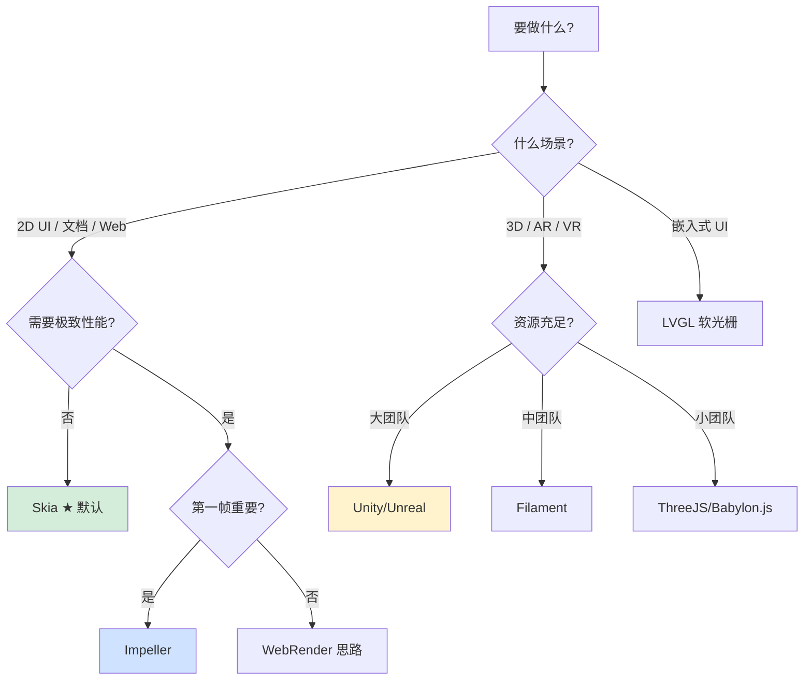

**给应用开发者的总记忆**：

> 90% 的应用开发者一辈子只接触 **Skia / Impeller**——剩下 10% 的人在做自研引擎、3D、游戏、嵌入式。
>
> 但**作为高级工程师，你必须知道这五个名字背后的工程哲学**——下次有人说"为什么 Flutter 切到 Impeller 了"，你能立刻给出答案：**JIT 编译 shader 在第一帧卡顿，AOT 是必经之路**。

---

## 6.跨平台渲染架构

### 6.1 Android Skia HWUI

```
View.draw()
  → DisplayListCanvas（命令录制）
  → RenderThread（异步执行）
  → Skia GPU 后端（OpenGL ES / Vulkan）
  → SurfaceFlinger（系统级合成）
  → HWComposer（硬件合成）
  → 屏幕
```

**核心机制**：

```
1. UI 线程和 RenderThread 解耦——主线程只录命令
2. SurfaceFlinger 是系统进程——所有 App 共用
3. HWComposer 是硬件——能耗最低
```

### 6.2 iOS CA + Metal

```
UIView 设置属性
  → CALayer（隐式动画）
  → Render Server（独立进程）
  → Core Animation 合成
  → Metal 渲染
  → 屏幕
```

**核心机制**：

```
1. Layer 是渲染单元（不是 View）
2. Render Server 独立进程——主进程崩溃不影响动画
3. 隐式动画——大量 UI 变化自动带动画
4. Metal 是统一后端
```

### 6.3 Web Blink + Skia

```
HTML/CSS → 解析 → Render Tree
  → Layout（计算盒模型）
  → Paint（生成绘制命令）
  → Layer Tree（合成层）
  → Compositor（GPU 进程）
  → Skia 绘制 → 屏幕
```

**Chrome 的多进程架构**：

```
Renderer Process：HTML 解析、Layout
GPU Process：Skia + 合成
Browser Process：界面 chrome

→ 即使 Renderer 崩溃，GPU 进程还能"显示最后一帧"
```

### 6.4 Flutter 引擎

```
Widget Tree → Element Tree → RenderObject Tree
  → Layer Tree（绘制录制）
  → Engine 提交到 GPU 线程
  → Skia/Impeller 渲染
  → Texture
  → 平台 View（PlatformView）合成
```

**Flutter 的特殊性**：

```
Widget 是声明式，每帧重建 → 但实际 RenderObject 复用
Layer Tree 是不可变快照——天然线程安全
```

### 6.5 游戏引擎

```
Game Loop（不依赖 VSync）
Scene Graph
  → 视锥剔除（cull）
  → 排序（透明物体后画）
  → Draw call 提交
  → GPU 渲染
  → SwapChain 交换
```

**与 UI 引擎的关键差异**：

```
UI：响应事件驱动（被动）
游戏：固定循环驱动（主动）

UI：节能优先（无变化不重画）
游戏：流畅优先（哪怕静止也保持 60+ fps）

UI：2D 为主
游戏：3D 为主，光照/阴影/物理
```

---

## 7.经典陷阱与反模式

### 7.1 onDraw 里 new 对象

```java
// ❌ 每帧 new 一个 Paint
@Override
protected void onDraw(Canvas canvas) {
    Paint paint = new Paint();   // 每秒 60 次！
    paint.setColor(Color.RED);
    canvas.drawRect(...);
}
```

**后果**：GC 频繁触发——每次 GC 都让帧抖动。

**修复**：Paint 提到字段，复用。

### 7.2 复杂 shader

```glsl
// ❌ 在 fragment shader 里做复杂运算
void main() {
    for (int i = 0; i < 100; i++) {
        // 复杂计算...
    }
}
```

**后果**：GPU fillrate 打满——半透明区域格外慢。

**修复**：把昂贵计算放到 CPU 或 vertex shader。

### 7.3 纹理过大过多

```kotlin
// ❌ 加载 4096×4096 的图片
val bitmap = BitmapFactory.decodeResource(res, R.raw.huge)
```

**后果**：

```
4096×4096×4 字节 = 64MB 显存
GPU 内存压力大
纹理上传耗时（PCIe 带宽）
```

**修复**：

```kotlin
val options = BitmapFactory.Options().apply {
    inSampleSize = 4   // 缩小 4 倍
}
```

### 7.4 图层过多

```html
<!-- 每个元素都加 will-change 或 transform: translateZ -->
<div style="will-change: transform">...</div>
<div style="will-change: transform">...</div>
<!-- ... 几百个 -->
```

**后果**：每个图层一份纹理——显存爆炸 + 合成慢。

**修复**：只对真正需要独立动画的元素分层。

### 7.5 RenderThread 卡死

```java
// 在 onDraw 里访问磁盘
@Override
protected void onDraw(Canvas canvas) {
    Bitmap b = BitmapFactory.decodeFile(...);   // ⚠️ 阻塞 RenderThread
    canvas.drawBitmap(b, ...);
}
```

**后果**：RenderThread 卡 → 主线程后续帧也排队卡 → 一卡一片。

**修复**：异步加载、纹理预热。

### 7.6 动画用 setLayoutParams

```java
// ❌ 用属性动画改 layout
ValueAnimator.ofInt(0, 100).addUpdateListener(a -> {
    view.getLayoutParams().width = (int) a.getAnimatedValue();
    view.requestLayout();   // 触发 measure/layout/draw 全套
});
```

**后果**：每帧走完整三阶段——CPU 爆。

**修复**：用 transform / scaleX——只走合成阶段。

### 7.7 iOS 不设 opaque

```swift
// ❌ 不透明 View 没设 opaque
view.backgroundColor = .red   // 实际不透明
view.isOpaque = false        // 默认值——告诉系统"我可能透明"
```

**后果**：合成器必须画下层——浪费 fillrate。

**修复**：

```swift
view.isOpaque = true   // ★ 显式声明不透明
```

### 7.8 阴影无 shadowPath

```swift
// ❌ 看似简单的阴影
view.layer.shadowColor = UIColor.black.cgColor
view.layer.shadowOpacity = 0.5
view.layer.shadowRadius = 10
view.layer.shadowOffset = CGSize(width: 0, height: 2)
// 没设 shadowPath！
```

**后果**：

```
没有 shadowPath 时：
  Core Animation 必须遍历 view 的所有像素
  → 算出"哪些区域是非透明的"
  → 在屏外缓冲区算阴影
  → 屏外渲染！

50 个带阴影的 cell 滚动 = 50 次屏外渲染 = 卡爆
```

**修复**：

```swift
// ✅ 显式提供路径，跳过遍历
view.layer.shadowPath = UIBezierPath(
    roundedRect: view.bounds,
    cornerRadius: 12
).cgPath
view.layer.shouldRasterize = true  // 可选：缓存阴影位图
view.layer.rasterizationScale = UIScreen.main.scale
```

**心智模型**：

```
iOS 性能优化三大件：
  1. opaque = true        ← 消除合成时的下层绘制
  2. shadowPath           ← 消除阴影屏外渲染
  3. cornerCurve / Bitmap ← 消除圆角屏外渲染（详见 5.2 §9.6）

这三件套是 iOS UI 性能的"工程基础"——可惜文档藏得深。
```

### 7.9 Web 触发 Layout

```css
/* ❌ 用 left / top / width 做动画 */
.box {
    transition: left 0.3s;
}
.box.moved {
    left: 100px;   /* 触发 Layout + Paint + Composite */
}
```

**后果**：

```
每一帧动画都走完整管线：
  Style → Layout（重排！）→ Paint（重绘！）→ Composite
  
60 fps × 完整管线 = 不可能
→ 复杂页面立刻掉帧
```

**修复**——只用 `transform` / `opacity`，这两个属性是 **composite-only**（只触发合成阶段）：

```css
/* ✅ 用 transform 做动画 */
.box {
    transition: transform 0.3s;
}
.box.moved {
    transform: translateX(100px);   /* 只走合成阶段 */
}
```

**心智模型**——Web 动画的「金科玉律」：

```
触发 Layout 的属性（最贵）：
  width / height / top / left / margin / padding / font-size / ...
  
触发 Paint 的属性（中等贵）：
  color / background-color / box-shadow / border-radius / ...
  
只触发 Composite 的属性（最便宜）：
  transform / opacity / filter (部分)
  
动画首选：transform + opacity → 60 fps 几乎免费
```

**这与 Android 的 §7.6"用 transform 替代 layoutParams"是同一原则**——所有平台的动画优化本质都是「**少触发管线前段，多用合成阶段**」。

### 7.10 未升级 Impeller

```yaml
# pubspec.yaml 中没启用 Impeller
# 或者 iOS 上没在 Info.plist 加 FLTEnableImpeller
```

**后果**：

```
Flutter 仍走 Skia + JIT shader 编译路径：
  - 首次进入新页面 → shader 编译 → 100-300ms 卡顿
  - 滚动到新效果 → 又卡一次
  - 用户感觉 "Flutter 就是卡"

实际上：3.10+ 默认 iOS 走 Impeller，3.27+ Android 也默认走 Impeller
```

**修复**：

```yaml
# iOS - Info.plist
<key>FLTEnableImpeller</key>
<true/>

# Android - AndroidManifest.xml
<meta-data
    android:name="io.flutter.embedding.android.EnableImpeller"
    android:value="true" />
```

**关键提示**：**Flutter 用户「卡顿到不能用」的体验，90% 出现在 Skia + JIT 时代**。升 3.10+ 用 Impeller 后，第一帧问题基本消失。

### 7.11 LVGL FB 撕裂

```c
// ❌ 单缓冲下直接画
lv_obj_set_pos(label, x, y);   // 修改位置
// 此时显示控制器可能正在扫描，撕裂！
```

**后果**：

```
嵌入式资源紧 → 默认单缓冲
直接画 → 显示控制器扫描时撞上
→ 画面上半 + 下半不一致（撕裂）
```

**修复**——三种思路：

```c
// ✅ 方案 1：开双缓冲（如果 RAM 允许）
static lv_color_t buf1[DISP_BUF_SIZE];
static lv_color_t buf2[DISP_BUF_SIZE];
lv_disp_draw_buf_init(&draw_buf, buf1, buf2, DISP_BUF_SIZE);

// ✅ 方案 2：开 VSync 中断同步
// 在显示控制器 VSync 中断里调 lv_disp_flush_ready()

// ✅ 方案 3：用 DMA 后台拷贝
// 让 DMA 把绘制缓冲区拷到 framebuffer，CPU 不阻塞
```

**心智模型**：

```
嵌入式 UI 没有 Compositor / RenderThread / VSync 框架——
但「双缓冲 + VSync」的原理跨平台不变。
只是要你「手写」出来。

这就是 LVGL 把整个管线"砍到最小"的代价——
"省事 vs 省钱"的取舍：嵌入式必须自己实现这些"通用机制"。
```

---

## 8.总结

### 8.1 三层认知阶梯

```
第一层（知其然）：知道有 60fps、双缓冲、VSync
  ↓
第二层（知其所以然）：理解 8 阶段流水线、合成器、shader 原理
  ↓
第三层（知其将所以然）：能用 GPU Profiler 定位瓶颈、能选型自绘 vs 原生 vs 跨平台
```

读完本章后，你应该能回答开头§0.3 提出的三个问题：

1. **16ms 哪里来？** → 60Hz 显示器的硬约束 + 人眼流畅阈值的共同妥协。
2. **半透明为什么暴跌？** → 强制混合（多 2 次内存访问）+ 不能遮挡剔除（多次重画）。
3. **60fps 是流畅，120Hz 又必须？** → 60 是流畅基线，120 是"超流畅"，但能耗翻倍——所以现代设备用自适应策略。

### 8.2 渲染瓶颈定位决策树

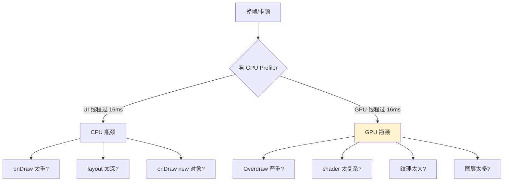

### 8.3 七字真言

1. **16ms 是死线**——一帧一阶段都不能错。
2. **GPU 流水线**——每阶段都可能成瓶颈。
3. **VSync 防撕裂**——用延迟换稳定。
4. **分层换性能**——以空间换时间。
5. **半透明是奢侈品**——不滥用。
6. **onDraw 不 new**——避免 GC 风暴。
7. **用 Profiler 定位**——不靠直觉优化。

### 8.4 跨端术语对照

任何图形渲染开发者必备的「同名异姓」字典——下次接触陌生平台，先查这张表：

| 通用概念 | Android | iOS | Web | Flutter | 游戏引擎 | LVGL |
|---------|---------|-----|-----|---------|---------|------|
| **绘制命令容器** | DisplayList (RenderNode) | CALayer backing store | DisplayItemList | Scene Layer Tree | RenderQueue / CommandBuffer | 直接 framebuffer |
| **绘制线程** | RenderThread | Render Server | Compositor Thread | Raster Thread | Render Thread | 主线程 |
| **合成器** | SurfaceFlinger | Render Server (backboardd) | Viz Compositor | Engine Compositor | SwapChain | 无（直接 framebuffer） |
| **节拍器** | Choreographer + VSync | CADisplayLink | requestAnimationFrame | SchedulerBinding | 引擎主循环 | 显示中断 |
| **GPU 抽象层** | HWUI + Skia | Core Animation + Metal | Skia/WebRender | Skia/Impeller | RHI（Render Hardware Interface） | 无 |
| **图层** | Layer (View 内部) | CALayer | Composited Layer | Layer / RenderObject | RenderTarget | 无（一张 framebuffer） |
| **过度绘制** | overdraw debug | Color Blended Layers | Paint flashing | DevTools 性能图层 | Profiler 视图 | 无（极致单缓冲） |
| **双缓冲** | BufferQueue (2 个) | Front/Back layer | 浏览器内部 | Skia surface (2 个) | SwapChain (2-3 个) | 可选第二个 buffer |
| **VSync** | HAL VSync 信号 | CVDisplayLink | OS VSync | Engine VSync | DXGI/CGL Present Wait | 显示控制器中断 |
| **图形 API** | OpenGL ES / Vulkan | Metal | WebGL / WebGPU | Metal/Vulkan/GLES | DX12/Vulkan/Metal | 无 GPU API |
| **shader 语言** | GLSL ES | MSL | GLSL/WGSL | GLSL → 翻译 | HLSL → 翻译 | 不适用 |
| **fillrate 杀手** | 半透明 + Overdraw | 圆角 + 阴影 | composite-only 之外 | RasterCache miss | 透明 + 大像素 | 全屏刷新 |

**把这张表贴在 IDE 旁边**——下次切换平台时不再需要"重新学渲染管线"，只需要查"在新平台里它叫什么"。

### 8.5 本卷章节呼应

```
5.1 窗口核心设计思想       ─→ 窗口是渲染管线的"输入容器"——Surface 来自这里
5.2 视图加载渲染设计       ─→ 本篇是 5.2 §3 三阶段之"draw"的下游延展
5.4 手势事件设计灵魂       ─→ 输入延迟（§2.3）和触摸响应链密切相关
5.5 消息机制设计思想       ─→ Choreographer/VSync = 消息机制对齐渲染节拍的关键
5.6 跨进程通信设计         ─→ SurfaceFlinger / Viz Compositor 的"独立进程"是 IPC 的典范
5.7 组件生命周期管理       ─→ Surface 创建/销毁就是渲染目标的生命周期
5.8 页面导航与路由设计     ─→ 转场动画 = 多 Layer 合成 + 离屏渲染
5.9 响应式数据绑定设计     ─→ 声明式数据变化驱动重绘的最后一公里

跨卷呼应：
- 第 2 卷·序列化数据       ─→ SkPicture 的命令录制是绘制的"序列化"
- 第 3 卷·对象访问原理     ─→ shader 编译/链接的反射机制
- 第 4 卷·内存回收机制     ─→ §0.1 半透明阴影事故的 GPU 显存压力
- 第 4 卷·数据拷贝原理     ─→ §3.2 BufferQueue 的零拷贝跨进程合成
```

### 8.6 与下篇承接

至此**渲染管线**这一难题被拆解清楚——8 阶段流水线、缓冲策略全谱、合成器跨端、图形 API 矩阵、渲染后端选型——全部串通。

下一篇 [5.4 手势事件设计灵魂](https://yccoding.com/pages/5b96db/) 我们要回到"用户输入侧"——**触摸点是怎么变成 onClick 的？多指手势的状态机是怎么搭的？为什么父 View 能"抢走"子 View 的事件？**

> **本篇的最大收获**：渲染不是"画图"——它是一条精密的工业流水线，**每个阶段都有自己的物理约束、工程取舍、跨端差异**。把"应用 draw → 屏幕发光"这条路彻底打通，你就拥有了用 Profiler 定位任何渲染问题的底层心智。

---

## 🔗 延伸阅读

- 同卷上篇：[5.2 视图加载渲染设计](https://yccoding.com/pages/070bb8/)
- 同卷下篇：[5.4 手势事件设计灵魂](https://yccoding.com/pages/5b96db/) ｜ [5.5 消息机制设计思想](https://yccoding.com/pages/0aed31/)
- 经典文献：
  - *Real-Time Rendering*（Akenine-Möller et al.）—— 渲染圣经，第 4 版
  - *GPU Gems* 系列（NVIDIA）—— GPU 编程经典案例集
  - *The Graphics Codex*（Morgan McGuire）—— 现代图形 API 的权威解读
  - *Filament Material Guide*（Google）—— PBR 渲染原理
  - *Skia 官方文档与博客*（skia.org）—— Skia 设计哲学
  - *Building Flutter's Impeller*（Flutter Team）—— shader 预编译方案
  - *iOS Core Animation: Advanced Techniques*（Nick Lockwood）—— Layer 渲染机制
  - *Inside the GPU*（NVIDIA Developer Blog）—— 现代 GPU 架构

