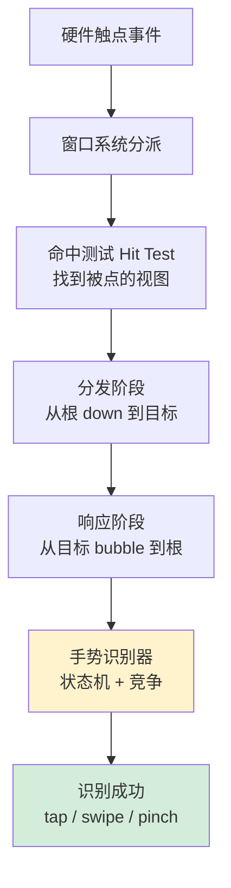
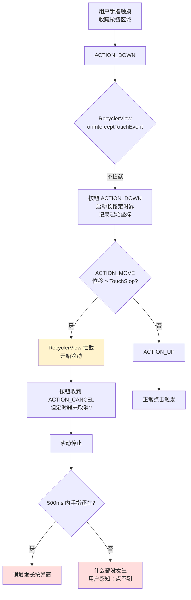
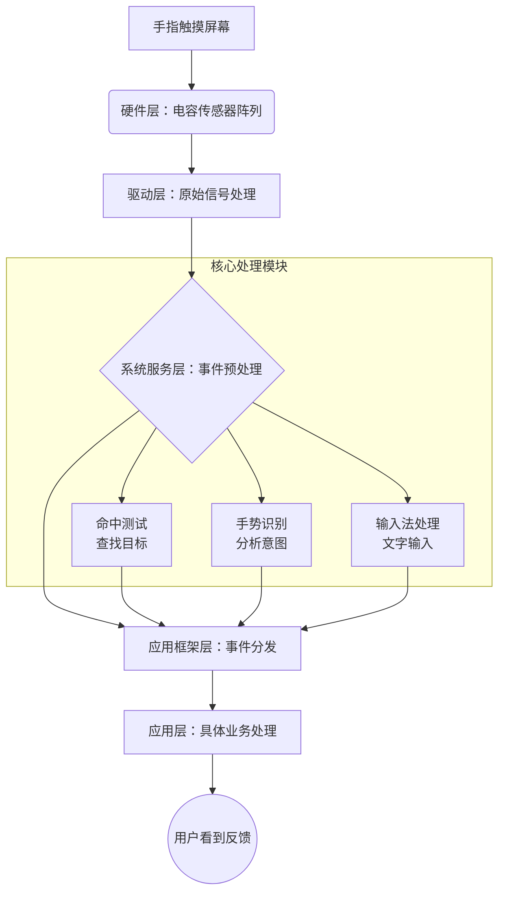
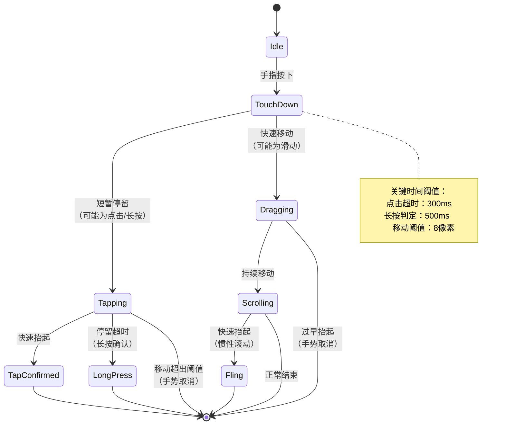
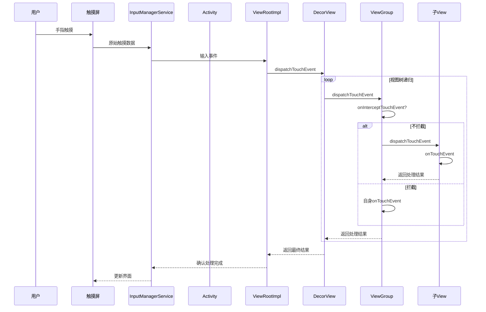
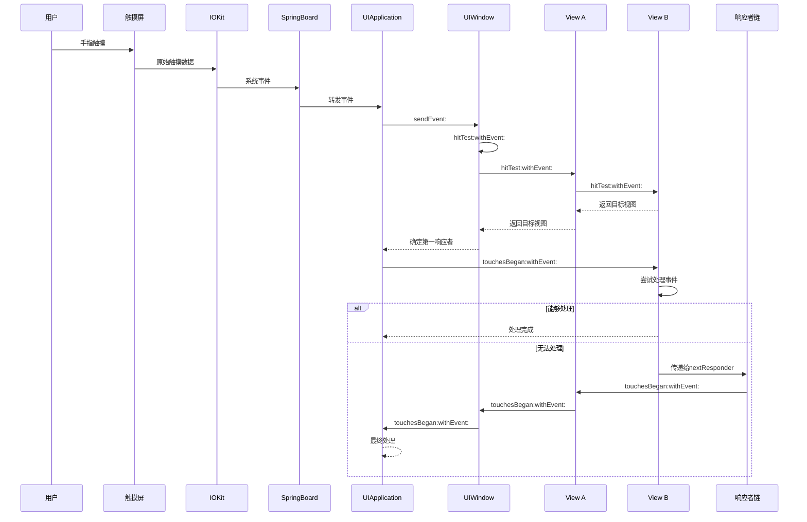
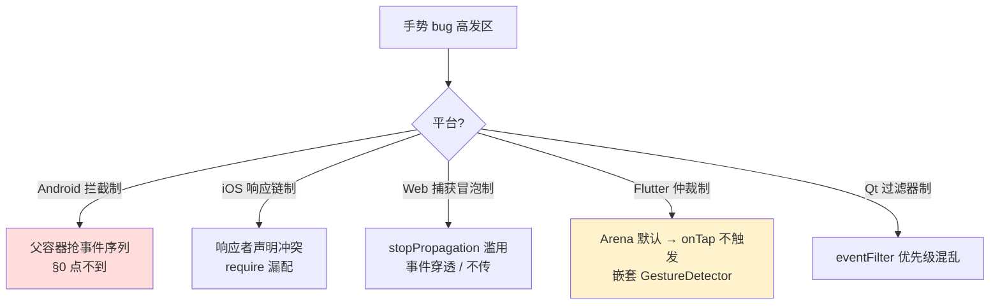
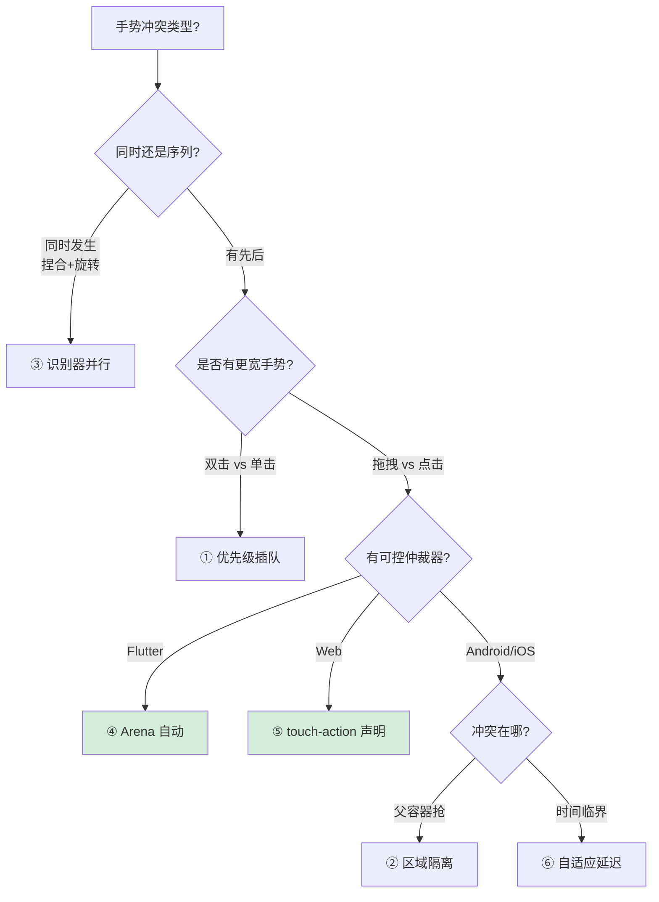

# 5.4 手势事件设计灵魂

> 📍 **本篇位置**：第 5 卷 · 交互与系统 · 第 4 篇（屏幕呈现四部曲之"应"）
> 🎯 **核心矛盾**：**「物理触点流」很客观，「业务语义手势」很主观**——一个 tap / swipe / pinch 要从 60-240Hz 的触点序列里"猜"出来。开发者眼里的 `onClick` 只是冰山顶尖，下面是「**事件序列 + 视图分发 + 状态机 + 竞争协议**」四层流水线，**任何一层出错 = 用户「点不到、乱触发、卡 300ms」**
> 🧭 **设计灵魂**：事件两阶段——**分发（从根向下找目标）+ 响应（从目标向上冒泡）**；识别器 GestureRecognizer 是「**状态机 + 竞争决策**」的教科书案例。**核心三件套：① 事件序列不可分割 ② 状态机驱动 ③ 竞争协议解冲突**
> 🌐 **跨平台覆盖**：Android(dispatch/Intercept/onTouchEvent) · iOS(Hit Test + UIGestureRecognizer + Responder Chain) · Web(capture/target/bubble + touch-action) · Flutter(Listener + GestureArena) · 鸿蒙 ArkUI · Qt(eventFilter) · 桌面端(Win32 WndProc / macOS AppKit) · 嵌入式 LVGL
> 🔗 **延伸阅读**：← [5.1 窗口核心设计思想](https://yccoding.com/pages/2f009c/) · ← [5.2 视图加载渲染设计](https://yccoding.com/pages/070bb8/) · ← [5.3 图形渲染管线原理](https://yccoding.com/pages/eef9d2/) · → [5.5 消息机制设计思想](https://yccoding.com/pages/0aed31/) · → [5.6 跨进程通信设计](https://yccoding.com/pages/aaaaaa/)
> 💡 **通用心智**：忘掉具体平台 API，记住一句话——**手势 = 「触点流 → 序列归属 → 状态机 → 语义」四段提纯**。Android 的 onTouch、iOS 的 GestureRecognizer、Web 的 Pointer Events、Flutter 的 Arena、鸿蒙的 ArkUI Gesture，本质都是「**如何在不可靠的触点流里精确识别用户意图**」这一个问题的不同答卷。**Bug 三大类：序列被抢 / 状态未重置 / 冲突无解**——每种都需要不同药方。



---

#### 目录介绍
- [0.按钮点不动事故](#0按钮点不动事故)
  - [0.1 用户反馈](#01-用户反馈)
  - [0.2 反直觉现象](#02-反直觉现象)
  - [0.3 手势视角拆解](#03-手势视角拆解)
  - [0.4 事故启示](#04-事故启示)
  - [0.5 五个追问](#05-五个追问)
- [1.为何要手势事件](#1为何要手势事件)
  - [1.1 思考一个问题](#11-思考一个问题)
  - [1.2 核心深层需求](#12-核心深层需求)
  - [1.3 分层处理流程](#13-分层处理流程)
  - [1.4 问题思考](#14-问题思考)
- [2.手势事件总架构](#2手势事件总架构)
  - [2.1 手势核心思想](#21-手势核心思想)
  - [2.2 事件元素设计](#22-事件元素设计)
  - [2.3 事件传递设计](#23-事件传递设计)
  - [2.4 事件响应设计](#24-事件响应设计)
  - [2.5 手势通用契约](#25-手势通用契约)
- [3.手势事件元素](#3手势事件元素)
  - [3.1 触摸事件](#31-触摸事件)
  - [3.2 事件序列思想](#32-事件序列思想)
  - [3.3 理解事件序列](#33-理解事件序列)
  - [3.4 手势分类体系](#34-手势分类体系)
  - [3.5 事件元素设计](#35-事件元素设计)
  - [3.6 点击还是长按](#36-点击还是长按)
- [4.手势事件传递](#4手势事件传递)
  - [4.1 事件传递思路](#41-事件传递思路)
  - [4.2 事件流程架构](#42-事件流程架构)
  - [4.3 事件如何分发](#43-事件如何分发)
  - [4.4 事件如何拦截](#44-事件如何拦截)
  - [4.5 分发模型矩阵](#45-分发模型矩阵)
- [5.手势事件响应](#5手势事件响应)
  - [5.1 事件处理思路](#51-事件处理思路)
  - [5.2 事件处理策略](#52-事件处理策略)
  - [5.3 设计哲学分析](#53-设计哲学分析)
  - [5.4 核心启示](#54-核心启示)
- [6.多手势冲突解决](#6多手势冲突解决)
  - [6.1 三种冲突场景](#61-三种冲突场景)
  - [6.2 Android disallowIntercept](#62-android-disallowintercept)
  - [6.3 iOS require+delegate](#63-ios-requiredelegate)
  - [6.4 三种解决模式](#64-三种解决模式)
  - [6.5 解决模式全谱](#65-解决模式全谱)
- [7.跨平台手势全景](#7跨平台手势全景)
  - [7.1 五个平台全景](#71-五个平台全景)
  - [7.2 Flutter Gesture Arena](#72-flutter-gesture-arena)
  - [7.3 Web touch-action](#73-web-touch-action)
  - [7.4 鸿蒙/桌面/嵌入式](#74-鸿蒙桌面嵌入式)
- [8.经典陷阱与反模式](#8经典陷阱与反模式)
  - [8.1 onTouchEvent 返 false](#81-ontouchevent-返-false)
  - [8.2 不处理 CANCEL](#82-不处理-cancel)
  - [8.3 多点触控只看 DOWN](#83-多点触控只看-down)
  - [8.4 dispatchTouch 打日志](#84-dispatchtouch-打日志)
  - [8.5 Web click 300ms](#85-web-click-300ms)
  - [8.6 iOS 嵌套 ScrollView](#86-ios-嵌套-scrollview)
  - [8.7 Flutter Detector InkWell](#87-flutter-detector-inkwell)
  - [8.8 cancelsTouchesInView](#88-cancelstouchesinview)
  - [8.9 pointer-events: none](#89-pointer-events-none)
  - [8.10 按键抖动未 debounce](#810-按键抖动未-debounce)
- [9.手势设计阶梯](#9手势设计阶梯)
  - [9.1 三层认知](#91-三层认知)
  - [9.2 设计哲学一句话](#92-设计哲学一句话)
  - [9.3 本卷章节呼应](#93-本卷章节呼应)
  - [9.4 跨端术语对照](#94-跨端术语对照)
  - [9.5 通用心智口诀](#95-通用心智口诀)
  - [9.6 延伸阅读](#96-延伸阅读)


## 0.按钮点不动事故

### 0.1 用户反馈

2021 年某次商品列表页改版后，客服后台开始出现奇怪的反馈：

```
用户A：「商品卡片右上角的小心心，我点了三五次都没反应」
用户B：「在 iPhone 上一点就触发了滚动，根本点不到收藏」
用户C：「我用力点了一下，结果触发了长按弹窗」
```

打开埋点一看：

```
商品列表页收藏按钮点击转化：12.3% → 4.7%（下降 62%）
商品列表页长按弹窗触发率：0.8% → 6.2%（暴涨 7.7 倍）
商品列表页滚动深度：未变化
```

看代码——一切「合理」：

```kotlin
// RecyclerView 的 Item 布局
<FrameLayout>
    <ImageView />               <!-- 商品图 -->
    <TextView />                <!-- 标题 -->
    <ImageView                  <!-- 收藏小心心，20dp×20dp -->
        android:layout_width="20dp"
        android:layout_height="20dp"
        android:onClick="toggleFav" />
</FrameLayout>
```

按钮明明设了 onClick，外层是 RecyclerView 也很正常——**为什么从「能点」变成了「点不到」？**

### 0.2 反直觉现象

复现这次事故需要凑齐三个看起来不相关的条件：

```
现象 1：按钮 20dp × 20dp（小于 Material 推荐的 48dp）
   → 用户手指落点经常在按钮外或边缘
   → 按下时 RecyclerView 已经标记 mFirstTouchTarget=按钮
   → 但任何超过 8px 的移动 → RecyclerView 拦截 → 按钮收到 CANCEL

现象 2：滚动 vs 点击的「速度临界」
   → 用户手指本能地不会绝对静止
   → 微小颤动 < TouchSlop(8px) → 不会被拦截 → 走点击
   → 微小颤动 > TouchSlop(8px) → 被 RecyclerView 拦截 → 触发滚动
   → 临界点附近表现像「掷骰子」

现象 3：长按定时器仍在跑
   → ACTION_DOWN 时按钮启动了 longPressTimer
   → 用户用力按时手指会下沉、压力面积变大、坐标抖动 > 8px
   → 父容器拦截 → 按钮收到 CANCEL
   → 但 longPressTimer 没有被取消（不同设备实现不一致）
   → 500ms 后触发了「错误的」长按
```

### 0.3 手势视角拆解

这次事故的根因图谱：



**关键洞察：触摸不是单点事件，而是事件序列；序列在传递路径上随时可能被「中途劫走」**。开发者经常把「按钮 onClick 设了」当成最终保障，但 onClick 只在 ACTION_UP 仍属于按钮的事件流中才触发——而事件流随时可能被父容器以 CANCEL 终止。

### 0.4 事故启示

开发者的朴素心智模型：

```
我以为：
  我给按钮加了 onClick → 按钮就会响应点击
  按钮在 RecyclerView 里 → 滚动归滚动、点击归点击
  按钮 20dp 小一点没事 → 反正能点中就行

实际：
  事件经过「分发链」层层传递，任意一层都可能拦截
  RecyclerView 的拦截规则是「按下不拦截，移动超阈值就拦截」
  按钮越小，落点偏差越容易诱发 MOVE → 越容易被拦截
  TouchSlop 是系统级常量（一般 8dp），无法关闭
```

**这是「触摸点」和「手势语义」的本质混淆**：

| 视角 | 你以为的 | 实际是 |
|---|---|---|
| 「点击」是什么 | 一个瞬间事件 | 一个事件序列：DOWN→MOVE×N→UP，全程未被拦截 |
| 谁决定能否点击 | 按钮自己 | 按钮 + 所有父容器（任一拦截就失败） |
| 多大算「移动」 | 用户感觉移动了 | 系统判定 > TouchSlop（≈8dp） |
| 长按何时取消 | 收到 CANCEL 时 | 开发者要在 CANCEL 中手动 removeCallbacks |

这就是本篇要回答的核心矛盾：

> **「手势」不是 UI 控件的属性，是「触点流 + 视图层级 + 状态机 + 竞争协议」四者协作的结果。理解这个，才能从根本上避免这类「该点的点不到、不该触发的乱触发」事故。**

### 0.5 五个追问

带着这次事故，整篇文章其实是在回答下面五个递进的问题：

| 追问 | 答案章节 |
|---|---|
| 触摸事件的最小单元是什么？为什么是「序列」而不是「点」？ | §3 |
| 事件在视图树上是怎么走的？谁有权拦截？谁有权回收？ | §4 |
| 为什么 RecyclerView 的拦截会让按钮「点不到」？怎么协调？ | §4.4、§6 |
| 多个手势识别器如何共存？冲突时谁让步？ | §5、§6 |
| 移动端、Web、Flutter、Qt 处理这件事的「同与不同」 | §2、§7 |

带着 §0 这个具体的「点不到事故」走进正题，所有抽象的手势系统原理，最后都能落到这次事故的根因图谱上。

---

## 1.为何要手势事件

### 1.1 思考一个问题

试想一下假如你是一台手机，当有人触摸了屏幕之后，你需要找到他具体触摸了什么东西，他可能触摸是一个按钮，或一个列表，也有可能是一个一不小心的误触，你会设计一个怎么样的机制和系统来处理呢？

假如有两个按钮重叠了，或者遇到在滚动列表上需要拖动某个按钮的情况，你设计的机制能正常的运作嘛？

### 1.2 核心深层需求

理解设计动机：为什么事件处理要这么复杂？不这样设计会有什么问题？

掌握设计原则：在面临类似系统设计时，应该遵循哪些核心原则？

抽象共通规律：抛开Android/iOS的差异，什么是所有触摸系统必须解决的共性问题？

先回归到“第一性原理”思考：触摸处理到底要解决什么？作为一台手机，我面临的核心挑战是：

1. 不确定性：触摸点可能落在任何地方，可能是按钮、空白区域、甚至多个重叠的控件。多个重叠控件，是那个控件消费事件？
2. 实时性：用户期待即时反馈，处理必须高效（16ms内完成）。
3. 意图判断：要区分是精确点击、双击、滑动、长按还是误触。如何设计手指按下，抬起，移动等？
4. 资源有限：不能为每个触摸都全屏扫描，需要优化。

### 1.3 分层处理流程

硬件→驱动→系统→应用。每一层解决不同层次的问题，像漏斗一样逐步收敛。硬件层负责“发生了什么”，驱动层负责“在哪里”，系统层负责“是谁的”，应用层负责“该怎么办”。

系统顶层架构：分层处理流水线。就像工厂的流水线，每个环节各司其职。



### 1.4 问题思考

在Android，iOS中，都有手势识别设计和处理逻辑。如何理解手势识别设计核心思想，手势识别中包含事件元素，事件传递，事件响应。

1.如何设计事件元素，比如有点击，双击，长按，滑动等各种不同事件元素，其核心设计思想是什么？
2.事件传递过程中，在父布局元素和子布局元素中，事件是如何分发的，事件是如何拦截的，事件传递的核心设计核心思路？
3.在事件响应中，谁来响应事件，响应事件链是什么样的，最终响应事件的处理流程是什么？

#### 一段不为人知的输入设备演进史

手势识别为什么这么复杂？因为输入设备本身在过去 50 年里彻底变了：

```
1968 年   鼠标发明（Engelbart 演示）
          单触点 + 三个明确按钮 + X/Y 二维坐标
          → 没有「序列」概念，每次 click 是独立事件

1984 年   Mac：鼠标 + 单击/双击的引入
          → 「双击」是历史上第一次「事件序列识别」
          → 但仍只有一个触点

1993 年   Newton MessagePad：电阻屏 + 单点触控
          → 第一次需要区分「移动」和「划」

2007 年   iPhone：电容屏 + 多点触控
          → 触点从 1 个 → N 个
          → 引入 pinch / rotate 等多指手势
          → 事件序列复杂度爆炸

2010 年   Android 2.0+ 全面支持多点
2014 年   Apple Pencil：压感 + 倾角
2019 年   Force Touch / Haptic Touch：压力维度
2022 年   折叠屏：跨屏手势、双指穿屏
```

每加一种维度（多点 / 压感 / 倾角 / 跨屏），手势识别就要多一层。这就是为什么「点击」这个看起来最简单的动作，在现代 OS 里要走 5–10 层抽象——**手势识别是为「物理输入设备的复杂演进」付的债**。

#### 反向论证：如果没有手势识别会怎样

```
场景：写一个滚动列表（无手势识别）
   你拿到 (x, y, t) 流：
      (100, 200, 0ms)
      (102, 215, 16ms)
      (105, 240, 32ms)
      (108, 270, 48ms)
      ...
   你要自己决定：
      - 这是点击还是滚动？(看位移)
      - 是慢滚还是快甩？(看速度)
      - 是多指捏合？(看其他触点)
      - 用户突然停顿了？(看时间间隔)
      - 手指离开瞬间还想要惯性吗？(看离开瞬间速度)
   → 一个滚动列表你要写 500 行触点逻辑
   → 同 App 里 100 个列表 → 5 万行重复逻辑
   → 不同开发者实现不一致 → 用户体验割裂
```

**手势识别的真正价值是把「触点流 → 语义」的转换从应用层抽到框架层**——这正是 §2 起讨论的「为什么要这样分层」的根本动因。

## 2.手势事件总架构

### 2.1 手势核心思想

手势识别的核心思想是将原始的触摸事件（如按下、移动、抬起等）转换成更高级的语义事件（如点击、双击、长按、滑动等）。这样，开发者可以更专注于业务逻辑，而不必处理复杂的原始事件流。

#### 三层抽象的背后逻辑

这个「原始 → 语义」的转换其实隐含三层：

```
【层 1】原始事件（Touch Stream）
   - 内容：(pointerId, x, y, pressure, t, action)
   - 频率：60–240Hz
   - 语义：「某点发生了事」
   - 例子：MotionEvent / UITouch / TouchEvent / PointerEvent

【层 2】事件序列（Event Sequence）
   - 内容：以 DOWN 开始、UP/CANCEL 结束的一串事件
   - 语义：「这是一次完整的触摸」
   - 例子：一个 TouchTarget 的生命周期

【层 3】手势语义（Gesture）
   - 内容：Tap / DoubleTap / LongPress / Pan / Pinch / Rotate / Fling
   - 语义：「用户意图是什么」
   - 例子：GestureDetector / UIGestureRecognizer / GestureDetector(Flutter)
```

为什么需要三层而不是两层？因为中间那层「事件序列」是「责任归属」的单元。**多个手势识别器所争夺的不是单点事件，而是「这个序列应该归谁」**。§0 事故中 RecyclerView 抢到事件序列后，按钮的 onClick 就不可能触发了。

### 2.2 事件元素设计

事件元素设计（如点击、双击、长按、滑动等）。设计思想：事件元素的设计基于对原始事件序列的抽象和模式识别。每个手势事件都有其特定的时间、空间特征。例如：

1. 点击：短时间内按下并抬起，且移动范围很小。
2. 双击：在短时间内发生两次点击，且两次点击时间间隔在一定范围内，位置相近。
3. 长按：按下后保持一段时间不移动，然后抬起。
4. 滑动：按下后移动一定距离，且速度达到一定阈值。

原理：通过定义一组规则（如时间阈值、距离阈值）来识别手势。通常使用状态机来跟踪手势的不同阶段。

#### 三个阈值为什么在这个量级上

为什么 TouchSlop 是 8dp 而不是 1dp 或 50dp？为什么长按是 500ms 而不是 100ms 或 2000ms？这些数字背后是人机交互的实验数据：

```
人手指服德森定律（Fitts's Law）的启示：
   1. 手指接触面积 ≈ 9mm × 9mm ≈ 36dp × 36dp
   2. 手指「静止」时的本能抵拗 ≈ ±4dp
   3. 人脑判断「一下」与「长按」的阈值 ≈ 400–600ms
   4. 人眼连续运动阈值（「滑」的感受） ≈ 50ms

这就是为什么 Android/iOS 选择：
   - TouchSlop = 8dp     # 在「本能抵拗」上限反这些，但低于「意图移动」下限
   - LongPress = 500ms   # 人脑认为「长」的临界点
   - DoubleTap = 300ms   # 人手指「连续两点」的上限
   - Fling 速度 = 50dp/s # 人眼从「按」转「拿走」的感知阈值
```

你不能随意调这些数字——调小会误触发（§0 现场里手指轻微颤动就抢事件），调大会响应迟钝。**手势阈值是生理学常量，不是设计者拍脑袋**。

### 2.3 事件传递设计

事件传递的核心思想：事件从根节点开始，沿着视图层次结构向下传递，直到找到最合适的视图来处理事件。如果这个视图不处理，事件会向上回溯，让父视图尝试处理。

事件拦截：在传递过程中，父视图可以拦截事件，阻止它向子视图传递，由父视图处理。

### 2.4 事件响应设计

响应者：通常是最内层的视图（或控件）有优先权响应事件。如果它不处理，则交给父视图，依次向上，直到有视图处理或者到达根视图。

事件响应链：是一个由视图组成的链，事件沿着这个链传递，直到被处理或丢弃。

### 2.5 手势通用契约

剥离所有具体平台，**任何 GUI 系统的手势识别都遵循同样的 5 阶段管线**。这是本篇最值得贴在 IDE 旁边的"手势原理通用名片"：

```
通用手势契约（八端共享）：

   ┌─────────────┐  ┌─────────────┐  ┌─────────────┐
   │ 1.原始触点   │→│ 2.命中测试   │→│ 3.事件分发   │
   │ pointer     │  │ hit-test    │  │ dispatch    │  ← 系统侧
   │ (x,y,t,p)   │  │ 找目标视图   │  │ 沿视图树     │
   └─────────────┘  └─────────────┘  └─────────────┘
                                          │
                                          ▼
                              ┌─────────────┐  ┌─────────────┐
                              │ 4.状态机识别 │→│ 5.竞争决议   │  ← 框架侧
                              │ recognizer  │  │ resolve     │
                              │ 序列→语义    │  │ 谁赢谁取序列 │
                              └─────────────┘  └─────────────┘
                                                      │
                                                      ▼
                                        ┌─────────────────────┐
                                        │ 6.业务回调（onTap）  │  ← 应用侧
                                        └─────────────────────┘
```

**这五步在八端的对应名词**——任何应用开发者都能在自己的平台里找到对应位置：

| 阶段 | Android | iOS | Web | Flutter | 鸿蒙 ArkUI | Qt | Win32 | LVGL |
|------|---------|-----|-----|---------|-----------|-----|-------|------|
| **1.原始触点** | `MotionEvent` | `UITouch` | `PointerEvent` | `PointerEvent` | `TouchEvent` | `QMouseEvent` | `WM_POINTERDOWN` | `lv_indev_data_t` |
| **2.命中测试** | `dispatchTouchEvent` 链路 | `hitTest:withEvent:` | DOM event target | `HitTestResult` | hitTest | `childAt` | `WindowFromPoint` | `lv_indev_search_obj` |
| **3.事件分发** | dispatch + intercept | Window.sendEvent → Responder | capture + target + bubble | RouterPointerEventListener | EventManager | event filter | WndProc 链 | 直接传 widget |
| **4.状态机识别** | `GestureDetector` 手写 | `UIGestureRecognizer` 对象 | 手写 JS / Pointer Events | `GestureRecognizer` | `Gesture` 修饰符 | `QGestureRecognizer` | 应用层手写 | `lv_event` |
| **5.竞争决议** | 拦截 + `requestDisallowIntercept` | `require(toFail:)` + delegate | `touch-action` CSS | **Gesture Arena**（仲裁器） | `parallelGesture` | grab/优先级 | 无（先到先得） | 无 |

**这套契约的「跨端不变量」**——任何应用开发者必背：

1. **触点是物理的，手势是语义的**——中间隔了 5 层抽象。
2. **事件序列是责任归属的最小单位**——不能"拿到一半"。
3. **状态机是唯一可靠识别方式**——纯函数式判断必出 bug（§3.6 已论证）。
4. **冲突必有协议**——要么"父优先"（Android）、要么"独立竞争"（iOS）、要么"仲裁器"（Flutter Arena）、要么"声明式"（Web touch-action）。
5. **CANCEL 是手势系统的灵魂**——告诉识别器"你输了竞争/被抢了"，否则状态泄漏（§0 长按误触发）。

**给所有应用开发者的总记忆**：

> 不论你在做 Android、iOS、Web、Flutter、鸿蒙、桌面端，还是嵌入式 LCD 触屏——**触点变成用户意图必经这 5 段流水线**。下次手势 bug 出现时你能精准说出"卡在第几段"，而不是"反正就是点不到"。

---

## 3.手势事件元素

### 3.1 触摸事件

一个典型的事件序列包括以下事件：

```text
ACTION_DOWN：手指按下屏幕，序列开始
ACTION_MOVE：手指在屏幕上移动（可能发生多次）
ACTION_UP：手指离开屏幕，序列结束
ACTION_CANCEL：序列被取消（如父视图拦截了事件）
```

#### CANCEL 为什么存在：它是 §0 事故的隐藏主角

如果只有 DOWN/MOVE/UP 会怎么样？考虑这个场景：

```
用户按了按钮 → 按钮进入 pressed 状态、启动长按计时器
用户手指滑动 → RecyclerView 决定抢事件去做滚动
问题：按钮是否能得知「事件序列被抢走」？

如果仅有 UP 表示「结束」：
   - 按钮永远收不到 UP 了（被抢走后不会再分发过来）
   - 按钮永远停在 pressed 状态
   - 长按计时器永远不会被取消
   - 500ms 后 → 误触发长按弹窗 ✅ §0 事故重现

有了 CANCEL：
   - RecyclerView 抢事件时会给按钮发一个 CANCEL
   - 按钮在 onTouchEvent 里处理 CANCEL → removeCallbacks
   - 状态重置、计时器取消
```

**CANCEL = 「别那个事件序列不属于你了，马上重置状态」的必要信号**。这是事件序列设计里最容易被忽视但最关键的一个事件。

为什么要把事件封装成一个对象，比如Android中的`MotionEvent`？

1. 统一事件表示：将触摸事件封装成一个对象，便于传递和处理。
2. 携带丰富信息：MotionEvent不仅包含事件类型，还有坐标、压力、接触面积、时间戳等信息。
3. 支持多点触控：通过指针索引（pointer index）和指针ID（pointer id）来区分多个手指。
4. 高效事件传递：Android系统需要将事件分发给正确的视图，MotionEvent提供了事件传递机制的基础。

MotionEvent 的核心设计目标，统一抽象层设计，为上层应用提供硬件无关的、标准化的触摸事件接口

```java
// MotionEvent 的统一抽象
public final class MotionEvent implements Parcelable {
    // 核心坐标信息（已转换到应用坐标系）
    private float mX;                    // 当前触点X坐标
    private float mY;                    // 当前触点Y坐标
    private float mRawX;                 // 原始屏幕坐标X
    private float mRawY;                 // 原始屏幕坐标Y
    
    // 时间信息
    private long mDownTime;             // 按下时间（序列开始）
    private long mEventTime;            // 当前事件时间
    
    // 动作类型
    private int mAction;                // 主动作类型
    private int mActionIndex;           // 动作索引（多点触控）
    
    // 触点信息数组（支持多点）
    private PointerProperties[] mPointerProperties;  // 触点属性
    private PointerCoords[] mPointerCoords;           // 触点坐标
    
    // 历史数据（用于轨迹追踪）
    private int mHistorySize;           // 历史事件数量
    private long[] mEventTimeHistory;   // 历史时间戳
    private PointerCoords[] mHistoricalData; // 历史坐标
}
```

性能与内存的平衡设计，触摸事件频率高达 60-120Hz，需要高效的内存管理。这里使用到了缓存池技术。

```java
// MotionEvent 对象池设计（减少GC压力）
public final class MotionEvent {
    private static final int MAX_RECYCLED = 10;
    private static final Object sRecyclerLock = new Object();
    private static MotionEvent sRecycler;  // 对象池链表头
    
    // 对象复用机制
    public static MotionEvent obtain(long downTime, long eventTime, int action, 
                                    float x, float y, int metaState) {
        MotionEvent ev;
        synchronized (sRecyclerLock) {
            ev = sRecycler;
            if (ev != null) {
                sRecycler = ev.mNext;
            }
        }
        
        if (ev == null) {
            ev = new MotionEvent();  // 创建新对象
        } else {
            ev.mRecycled = false;
        }
        
        // 初始化对象数据
        ev.initialize(...);
        return ev;
    }
    
    // 回收对象
    public void recycle() {
        if (mRecycled) return;
        
        // 清理敏感数据
        mPointerIds = null;
        mPointerCoords = null;
        
        synchronized (sRecyclerLock) {
            if (sRecyclerCount < MAX_RECYCLED) {
                mNext = sRecycler;
                sRecycler = this;
                sRecyclerCount++;
                mRecycled = true;
            }
        }
    }
}
```

### 3.2 事件序列思想

什么是事件序列？可以将其理解为 **用户一次完整的触摸操作流程**。

举例来说，用户单击按钮、用户滑动屏幕、用户长按屏幕中某个UI元素等等，都属于该范畴。

每一次我们触摸屏幕，都会产生一连串的触摸事件(`MotionEvent`)，这些一连串的触摸事件合起来就是一个触摸事件序列。

事件序列确实可以理解为**用户一次完整的触摸操作流程**，但它不仅仅是一个简单的操作记录，而是一个**有状态的、有时序的、有语义的交互单元**。

### 3.3 理解事件序列

事件分发的本质原理就是递归，对此简单的实现方式是：**每接收一个新的事件，都需要进行一次递归才能找到对应消费事件的View，并依次向上返回事件分发的结果**。

思考一下：以每个触摸事件作为最基本的单元，都对`View`树进行一次遍历递归？这对性能的影响显而易见，因此这种设计是有改进空间的。

将 **事件序列** 作为最基本的单元进行处理则更为合适。

首先，设计者根据用户的行为对MotionEvent中添加了一个Action的属性以描述该事件的行为：DOWN，MOVE，UP，其他Action事件……

针对用户的一次触摸操作，必然对应了一个事件序列，从用户手指接触屏幕，到移动手指，再到抬起手指 ——单个事件序列必然包含ACTION_DOWN、ACTION_MOVE ... ACTION_MOVE、ACTION_UP 等多个事件，这其中ACTION_MOVE的数量不确定，ACTION_DOWN和ACTION_UP的数量则为1。

任何事件列都是以DOWN事件开始，UP事件结束，中间有无数的MOVE事件，如下图：

```
事件序列时间线：
  手指触碰      手指滑动                   手指抬起
    │             │  │  │  │  │             │
    ▼             ▼  ▼  ▼  ▼  ▼             ▼
 ACTION_DOWN → MOVE MOVE MOVE MOVE MOVE → ACTION_UP
    │                                       │
    └──────── 完整的一次触摸事件序列 ─────────┘
```


### 3.4 手势分类体系

Android设计哲学：

```java
// 基于监听器模式的通用设计
public interface OnGestureListener {
    boolean onDown(MotionEvent e);                    // 按下确认
    void onShowPress(MotionEvent e);                 // 长按前提示
    boolean onSingleTapUp(MotionEvent e);            // 单击抬起
    // ... 更多手势回调
}
```

iOS设计哲学：

```objc
// 基于Target-Action的响应链设计
@protocol UIGestureRecognizerDelegate <NSObject>
- (BOOL)gestureRecognizerShouldBegin:(UIGestureRecognizer *)gestureRecognizer;
- (BOOL)gestureRecognizer:(UIGestureRecognizer *)gestureRecognizer 
       shouldReceiveTouch:(UITouch *)touch;
@end
```

### 3.5 事件元素设计

在 iOS 中，UIGestureRecognizer 是一个用于处理用户手势的抽象基类。手势类型(他们都继承自UIGestureRecognizer，而UIGestureRecognizer继承自NSObject)

```objc
UIPanGestureRecognizer（拖动）
UIPinchGestureRecognizer（捏合）
UIRotationGestureRecognizer（旋转）
UITapGestureRecognizer（点按）
UILongPressGestureRecognizer（长按）
UISwipeGestureRecognizer（轻扫）
```

#### 点击（Tap）事件设计

设计思想：平衡响应速度与误操作防护

```java
public class TapDesign {
    // 时间阈值：区分单击与长按
    private static final int TAP_TIMEOUT = 100;    // 毫秒
    private static final int LONG_PRESS_TIMEOUT = 500;
    
    // 空间容差：允许的操作误差
    private static final float TOUCH_SLOP = 8;      // 像素
    
    // 状态机设计
    enum TapState { IDLE, PRESSED, TAP_CONFIRMED }
}
```

iOS实现原理：

```objc
// UITapGestureRecognizer 核心逻辑
@implementation UITapGestureRecognizer {
    NSTimeInterval _maxTapDuration;     // 最大点击时长
    NSInteger _numberOfTapsRequired;    // 点击次数要求
    NSInteger _numberOfTouchesRequired; // 手指数要求
    CGPoint _startPoint;                // 起始位置
    CFTimeInterval _startTime;          // 开始时间
}
```

### 3.6 点击还是长按

简单点击和复杂手势的设计思路上，都遵循着相似的基本原则。通过时间和空间阈值作为区分不同手势的基本依据，从而准确解读用户的触摸意图。

两者最根本的设计思想都是状态机。系统不会只根据一个触摸点就做出判断，而是会追踪整个触摸事件序列（从手指按下、移动到抬起），根据一系列条件（如时间、移动距离）在不同状态间转换，最终确定用户意图。

#### 状态机在这里为什么不可替代

考虑不用状态机的「纯函数式」判定：

```python
# 反面教材
if move_distance < 8 and time < 100ms:
    return "tap"
elif move_distance < 8 and time > 500ms:
    return "longpress"
elif move_distance > 50 and time < 200ms:
    return "fling"
```

这个写法错在哪里？

```
问题1：每个 MOVE 事件都要重跟一边 → 60fps 下多级 if-else
问题2：状态不可逆 → 一旦走到「达到 longpress 阈值」，微小移动后又变成「算 fling」
问题3：多手势同时介入 → 你要同时跳五个 if-else 分支
问题4：外部事件（CANCEL）到达 → 你不知道该跳到哪
```

状态机解决了这几点：

```
[idle] —DOWN→ [touchDown] —计时中→ [tapping]
                │
                ├—MOVE>slop→ [dragging] —UP低速→ [scrolled]
                │                       └—UP高速→ [fling]
                ├—timer fired→ [longPressing] —UP→ [longPressEnd]
                └—CANCEL→ [idle]
[tapping] —UP→ [tapConfirmed]
```

**优势**：【状态】是「能能进入」的隔离闸门，一旦进入 longPressing 就不会反跳回 tap；CANCEL 可以统一跳回 idle；多个识别器可以各自跑状态机互不干扰。

#### 为什么 iOS 的状态机只有五个状态而 Android 需要几十个变量

```
iOS：UIGestureRecognizerState
  │  possible    — 初始状态
  │  began       — 识别成功
  │  changed     — 手势进行中
  │  ended       — 手势结束
  │  cancelled   — 被取消
  │  failed      — 识别失败
  → 隔离原则：谁调状态、谁负责重置都是识别器自己

Android：开发者手写的变量
  │  isPressed       boolean
  │  isLongPressTriggered  boolean
  │  startX/startY   float
  │  startTime       long
  │  longPressRunnable  Runnable
  │  velocityTracker VelocityTracker
  → 变量散在设应用代码里，不同开发者写法不一。
→ 这就是为什么 GestureDetector 被推出：官方提供一个「状态机实现」给你用
```

这个差异反过来会在 §5 手势响应中造成「指令式 vs 声明式」的根本性差别。



> Android 的设计思路：基于事件流的判断

Android 的处理更底层，它像一条传送带，将原始的触摸事件（MotionEvent）传递给视图，由视图或手势识别器（GestureDetector）根据事件流的历史信息来实时判断。

时间阈值（Timing Thresholds）：

1. TAP_TIMEOUT（约100ms）：区分点击和长按的初步界限。如果按压时间超过此值，则可能不是单击。
2. LONG_PRESS_TIMEOUT（约500ms）：长按确认的时间点。
3. DOUBLE_TAP_TIMEOUT（约300ms）：两次点击的最大间隔时间。

空间阈值（Slop）：

1. TouchSlop：系统认为的最小滑动距离（通常8-20像素）。如果手指移动距离超过此值，则认定为滑动，取消点击或长按的识别。

> iOS 的设计思路：基于手势识别器（Gesture Recognizer）的抽象

iOS 的设计更高级和抽象。它将每种手势封装成一个独立的、状态化的对象 UIGestureRecognizer。识别工作由这些对象完成，视图只需关心识别结果。

手势识别器状态：

1. 每个识别器都有自己的状态机（如 .possible, .began, .ended等），内部封装了判断逻辑。

依赖关系（Dependency）：

1. 这是解决手势冲突的关键。例如，为了让单击和双击共存，可以建立一种依赖关系。

## 4.手势事件传递

移动平台采用视图树（View Tree）作为事件传递的基础数据结构，事件从根节点开始，沿着树形结构向下传递。

Android： 基于“冒泡”机制的询问式分发。（问：你要不要处理？）Android 的事件传递围绕三个核心方法：dispatchTouchEvent、onInterceptTouchEvent和 onTouchEvent。

iOS： 基于“响应链”机制的指派式传递。（找：你就是处理者！）iOS 的事件传递基于 命中测试（Hit-Testing）和 响应者链（Responder Chain）。

### 4.1 事件传递思路

> Android事件传递体系，核心设计思想：责任链模式 + 拦截机制

```java
// Android事件传递伪代码
public boolean dispatchTouchEvent(MotionEvent event) {
    boolean handled = false;
    
    // 1. 安全检查
    if (onFilterTouchEventForSafety(event)) {
        return false;
    }
    
    // 2. 拦截检查
    final boolean intercepted;
    if (event.getAction() == MotionEvent.ACTION_DOWN || mFirstTouchTarget != null) {
        // 允许拦截
        intercepted = onInterceptTouchEvent(event);
    } else {
        // 后续事件默认拦截
        intercepted = true;
    }
    
    // 3. 分发逻辑
    if (!intercepted && !canceled) {
        // 向子视图分发。遍历所有子View
        for (View child in childrenReverseOrder) {
            if (child.isReceiveEvent(event)) {
                // 将事件分发给子View
                handled = child.dispatchTouchEvent(event);
                if (handled) {
                    // 如果子View处理了，循环终止，不再分发给其他子View
                    mFirstTouchTarget = child;  // 记录处理者
                    break;
                }
            }
        }
    }
    
    // 4. 自身处理（如果没有子视图处理）
    if (mFirstTouchTarget == null) {
        handled = onTouchEvent(event);
    }
    
    return handled;
}
```

决策点：onInterceptTouchEvent是父容器抢夺事件的关键。

回溯：如果所有子 View 都不处理，事件会沿着视图树向上冒泡，依次调用父容器的 onTouchEvent。

#### 三个微姙但至关重要的设计点

看似简单的 dispatchTouchEvent，藏了三个「为什么是这样」：

```
打听点 1：为什么 onInterceptTouchEvent 只在 DOWN 或 mFirstTouchTarget != null 时才问？
   → 因为一旦选定了 firstTouchTarget，后续事件不再「走一趟完整分发」
   → 直接路由给 firstTouchTarget→高性能
   → 但仍给了“中途抢」的机会（RecyclerView 动总中抢走靠这条路径）

打听点 2：为什么【后续事件默认拦截】？
   → 一旦 mFirstTouchTarget 为 null 说明上下文已变（例如上个 DOWN 被抢走过了）
   → 应该默认父自己吃，避免诡异「半个序列」现象

打听点 3：为什么【childrenReverseOrder】？
   → 后添加的子 View 在视觉上在上面 （Z 序高）
   → 逆序遍历 = 「上面的 View 优先拿事件」
   → 这正是 §40 窗口里 Hit Test 「自顶向下」的同一个思想的 View 层体现
```

> iOS事件传递体系。核心设计思想：响应者链 + 命中测试

```objc
// iOS事件传递核心逻辑
- (UIView *)hitTest:(CGPoint)point withEvent:(UIEvent *)event {
    // 1. 基础条件检查
    if (self.hidden || self.alpha <= 0.01 || !self.userInteractionEnabled) {
        return nil;
    }
    
    // 2. 点是否在视图范围内
    if ([self pointInside:point withEvent:event]) {
        // 3. 从后向前遍历子视图（最上层的视图优先）
        for (UIView *subview in [self.subviews reverseObjectEnumerator]) {
            CGPoint convertedPoint = [subview convertPoint:point fromView:self];
            UIView *hitView = [subview hitTest:convertedPoint withEvent:event];
            
            if (hitView) {
                return hitView;  // 找到合适的响应视图
            }
        }
        
        // 4. 没有子视图处理，自身处理
        return self;
    }
    
    return nil;
}
```

### 4.2 事件流程架构

Android 事件流程传递时序图



iOS 事件流程传递时序图



### 4.3 事件如何分发

Android 和 iOS 的事件分发机制虽然目标一致——将触摸事件准确传递给正确的响应者——但设计思路却截然不同。我们可以用两个生动的比喻来理解：

1. Android 像一场“自顶向下的民主投票”：事件从顶层开始，层层向下询问每一个子 View：“你要处理这个事件吗？” 如果没人要，就自己处理。
2. iOS 像一支“自底而上的军事化队伍”：事件发生后，先精准定位最前线的士兵（第一响应者）。如果他处理不了，就沿指挥链（响应者链）逐级向上汇报。

> Android 事件分发：冒泡与拦截模型

Android 的分发流程围绕三个核心方法：dispatchTouchEvent、onInterceptTouchEvent和 onTouchEvent。其核心是责任链模式。

1. 传递方向：自上而下。事件从最外层的 Activity、Window、DecorView 开始，一层一层向内传递，直到最内层的子 View。
2. 决策机制：拦截：父容器（ViewGroup）拥有至高无上的 拦截权(onInterceptTouchEvent)。它可以在事件传递的任何时刻决定“截胡”，阻止事件继续向子 View 传递，转而自己处理。这是 Android 事件分发的核心控制手段。
3. 典型场景：ScrollView嵌套 Button。当手指按下后轻微移动，ScrollView的 onInterceptTouchEvent判断移动距离超过滑动阈值，就会返回 true进行拦截。后续的 MOVE事件将直接交给 ScrollView处理以实现滚动，Button将不会收到这些事件，并会收到一个 ACTION_CANCEL。
4. 回溯机制：冒泡：如果事件一直传递到最内层的子 View，但没有任何 View 的 onTouchEvent返回 true（表示消费），那么事件会沿着原来的路径自下而上地“冒泡”，依次调用父容器的 onTouchEvent。
5. 性能优化：目标缓存：当一个 ACTION_DOWN事件被某个子 View 消费后，系统会缓存这个 View 为 mFirstTouchTarget。后续的 ACTION_MOVE、ACTION_UP等事件将直接分发给这个缓存的目标，而不会再次进行完整的视图树遍历，极大地提高了效率。

> iOS 的分发流程基于两个核心概念：命中测试（Hit-Testing）和 响应者链（Responder Chain）。其核心是响应者链模式。

寻找第一响应者：自下而上的命中测试：与 Android 相反，iOS 的第一步是自下而上地寻找事件处理者。它从根视图（UIWindow）开始，递归地调用每个视图的 hitTest:withEvent:方法。这个方法内部会：

1. 检查自身是否可交互（userInteractionEnabled、isHidden、alpha）。
2. 检查触摸点是否在自己范围内（pointInside:withEvent:）。
3. 逆序（从最后添加的子视图开始，即视觉上最顶层的视图）遍历子视图，重复此过程。
4. 最终，返回最深层的、包含触摸点且可交互的视图作为第一响应者（First Responder）。

传递机制：响应者链：如果第一响应者（例如一个 UIView）不处理事件，事件不会“冒泡”给父视图的某个方法，而是传递给它的 nextResponder。nextResponder构成了一个响应者链，其典型顺序为：

1. UIView -> 父UIView -> ... -> UIViewController -> UIWindow -> UIApplication -> AppDelegate
2. 设计精髓：每个响应者只关心自己能否处理，不能处理就交给“链上的下一个”。这是一种更松散、更灵活的耦合方式。

### 4.4 事件如何拦截

**Android：父容器拥有“霸权”，主动拦截**。其设计思想是 “拦截（Interception）”。事件传递的路径是预设好的，但父容器有至高无上的权力在传递途中“截获”事件流，停止向下分发，自己处理。

> 第一种方式：关键机制：ViewGroup.onInterceptTouchEvent(MotionEvent event)方法

作用：这是 父容器的专属权利。在事件分发给子 View 之前，父容器会调用此方法询问自己：“我要不要拦截这个事件序列？”

返回值：

true：拦截。事件不会继续向子 View 传递，后续的 MOVE、UP等事件会直接交给父容器的 onTouchEvent方法处理。子 View 会收到一个 ACTION_CANCEL事件。

false：不拦截。事件继续向下传递。

> 第二种方式：子 View 的反抗：requestDisallowInterceptTouchEvent

子 View 可以通过调用 getParent().requestDisallowInterceptTouchEvent(true)来请求父容器不要拦截。这在类似 ViewPager内嵌 ListView的场景中非常有用。

```java
// 子View内部，当检测到水平滑动时，请求父ViewPager不要拦截
@Override
public boolean onTouchEvent(MotionEvent event) {
    switch (event.getActionMasked()) {
        case MotionEvent.ACTION_DOWN:
            // 按下时，请求父容器不要拦截
            getParent().requestDisallowInterceptTouchEvent(true);
            break;
        case MotionEvent.ACTION_MOVE:
            if (isHorizontalScroll(event)) {
                // 如果是水平滑动，继续阻止父容器拦截
                getParent().requestDisallowInterceptTouchEvent(true);
            } else {
                // 如果是垂直滑动，允许父容器拦截（以便它处理滚动）
                getParent().requestDisallowInterceptTouchEvent(false);
            }
            break;
    }
    return true;
}
```

场景比喻：就像公司里的项目经理（父容器） 接到一个任务（触摸事件）。他有权决定是自己处理（拦截），还是把任务派给下属（子 View）。如果他发现这个任务更适合自己处理（比如判定为滚动），他就会说“这个任务我接了”（返回 true），并通知下属“原来的任务取消了”（发送 ACTION_CANCEL）。

**iOS：响应者平等“协商”，优先级决定**。其设计思想是 “响应链（Responder Chain）” 和 “优先级（Priority）”。事件首先会传递给最合适的视图（第一响应者），如果它不处理，事件会沿着响应链向上传递，由链上的响应者们根据优先级规则“协商”谁来处理。

#### §0 事故的「跨平台复现」对比实验

同一个「列表里的 20dp 收藏按钮」需求在三个平台上会发生什么：

```
Android（拦截制）：
   RecyclerView.onInterceptTouchEvent 中动总超过 8dp 就抢走
   → 按钮收到 CANCEL，onClick 不触发
   → §0 事故现场
   → 需要开发者手动调 requestDisallowInterceptTouchEvent

iOS（竞争制）：
   UICollectionView 的 panGesture 与 UIButton 的 tapGesture 同时存在
   默认：panGesture 在 8–10pt 后 began→tapGesture 被 cancel
   但 UIButton 不需要手动代码——手势识别器会自动 .cancelled
   → 场景表现不代码体验几乎一致，但错误问题几乎不发生
   → 根本原因：“识别器”是独立对象，可以独立 cancel

Web（混合制）：
   click 事件只在 mousedown 到 mouseup 中间坐标不位移超 5px 才触发
   touch 事件增加 touch-action: pan-y 可以只允许纵向滚动
   → 可以用 touch-action: manipulation 完全让出
   → 表现可能为「能点，但延迟 300ms」（古老问题，meta=viewport 修复）
```

三种机制背后是三种「说了算」的哲学：

```
Android 拦截制：父容器说了算       → 逆响应链需要子“请求别拦」
iOS 竞争制   ：识别器状态机说了算   → 谁先进 began 谁赢
Web 混合制   ：默认行为 + CSS 声明   → 需要双重逻辑才能控制
```

为什么 Android 经常出现§0 类事故？因为 Android 的拦截是「默认抢」的，需要子 View 主动请求不拦；而 iOS 的识别器是「默认独立」的，需要你主动表达依赖。**§0 事故只在 Android 上高发**——这是架构选择带来的系统性偷远。

### 4.5 分发模型矩阵

§4.1-4.4 讲了 Android 拦截制 vs iOS 响应链——但工业界存在**五种不同的事件分发模型**，每种代表不同的工程哲学：

| 模型 | 代表平台 | 默认行为 | 决策点 | 冲突解法 | 复杂度 |
|------|---------|---------|--------|---------|--------|
| **拦截制** | Android | 父优先抢 | `onInterceptTouchEvent` | `requestDisallowIntercept` | 中 |
| **命中 + 响应链制** | iOS / macOS | 命中视图先拿 | `hitTest` + Responder Chain | `require(toFail:)` + delegate | 低 |
| **捕获 + 冒泡制** | Web / DOM | 三阶段（capture → target → bubble） | `addEventListener` 第三参数 | `touch-action` + `stopPropagation` | 高 |
| **仲裁器制** | Flutter | 所有识别器并行竞争 | Gesture Arena 自动决议 | 自动（reject/accept） | 极低（用户层） |
| **过滤器制** | Qt / 鸿蒙 ArkUI | 链上每个节点都可过滤 | `eventFilter` / 修饰符 | 优先级 + grab | 中 |

**五种模型的本质差异**：

```
拦截制 (Android)：
   "父优先，子要喊叫"
   ─ 父容器默认有抢权
   ─ 子要主动调 requestDisallowIntercept
   ─ 优点：父容器全局控制力强（如 ScrollView 滚动）
   ─ 缺点：§0 事故高发，子 View 要被动防御

命中 + 响应链制 (iOS)：
   "先精准定位，再链式回退"
   ─ hitTest 一次找到第一响应者
   ─ 处理不了就传 nextResponder
   ─ 优点：识别器独立，冲突显式声明
   ─ 缺点：响应链长时调试成本高

捕获 + 冒泡制 (Web)：
   "三阶段：上→下→上"
   ─ capture: window 向下到 target
   ─ target: 命中视图
   ─ bubble: target 向上到 window
   ─ 优点：监听灵活，任何节点都能拦截
   ─ 缺点：JS 性能瓶颈、移动端 300ms 延迟

仲裁器制 (Flutter)：
   "所有人都是选手，Arena 当裁判"
   ─ 所有可能识别器同时入场
   ─ 谁先 accept 谁赢，其他自动 reject
   ─ 优点：用户层零冲突代码
   ─ 缺点：框架层复杂、定制难

过滤器制 (Qt / 鸿蒙)：
   "每一层都是过滤器"
   ─ 父节点可在 eventFilter 里截获子事件
   ─ 通过返回值决定是否继续传递
   ─ 优点：跨控件解耦
   ─ 缺点：过滤器堆叠时优先级难追踪
```

**「默认设计」决定了"bug 高发区"**：



**给应用开发者的选型口诀**：

> - 写 Android：默认会被父抢 → **主动 `requestDisallowIntercept` 或重写 `onInterceptTouchEvent`**
> - 写 iOS：默认识别器独立 → **显式 `require(toFail:)` 或 `shouldRecognizeSimultaneously`**
> - 写 Web：默认三阶段冒泡 → **`touch-action` CSS 声明意图、慎用 `stopPropagation`**
> - 写 Flutter：默认 Arena 自动 → **避免 GestureDetector 嵌套、相信仲裁器**
> - 写鸿蒙：默认链上过滤 → **`@parallelGesture` 声明并行、`@exclusiveGesture` 声明互斥**

> **§0 事故只在 Android 高发**——不是 iOS / Flutter 没有"按钮被滚动抢"的问题，而是它们的默认模型让冲突在框架层自动解决，**开发者大部分时候不需要写代码**。这就是「**默认设计 = 系统级生产力**」的力量。

---

## 5.手势事件响应

### 5.1 事件处理思路

> Android：基于"状态判断"的指令式处理

思想：在控件的 onTouchEvent()中，通过分析 MotionEvent序列，手动判断手势意图

特点：命令式编程，开发者完全控制识别逻辑

> iOS：基于"识别器"的声明式处理。

思想：为控件附加预定义的手势识别器，系统自动识别后回调

特点：声明式编程，关注"是什么"而非"如何识别"

### 5.2 事件处理策略

Android 要求开发者在控件内部扮演侦探角色，分析触摸事件流，推断用户意图。举一个简单例子，如何判断并处理点击事件，处理点击事件。代码如下所示：

```java
@Override
public boolean onTouchEvent(MotionEvent event) {
    switch (event.getActionMasked()) {
        case MotionEvent.ACTION_DOWN:
            // 记录按下位置和时间
            startX = event.getX();
            startY = event.getY();
            isPressed = true;
            isLongPressTriggered = false;
            
            // 发送延迟消息检测长按
            postDelayed(longPressRunnable, LONG_PRESS_TIMEOUT);
            return true;
            
        case MotionEvent.ACTION_MOVE:
            if (!isPressed) break;
            
            // 计算移动距离
            float dx = Math.abs(event.getX() - startX);
            float dy = Math.abs(event.getY() - startY);
            
            // 判断1：移动距离超过阈值，取消点击状态
            if (dx > TOUCH_SLOP || dy > TOUCH_SLOP) {
                removeCallbacks(longPressRunnable);
                isPressed = false;
                invalidate(); // 重绘取消按压状态
            }
            break;
            
        case MotionEvent.ACTION_UP:
            removeCallbacks(longPressRunnable);
            
            // 判断2：在按压状态且未触发长按，才是点击
            if (isPressed && !isLongPressTriggered) {
                performClick(); // 触发点击
            }
            
            isPressed = false;
            invalidate();
            break;
            
        case MotionEvent.ACTION_CANCEL:
            removeCallbacks(longPressRunnable);
            isPressed = false;
            invalidate();
            break;
    }
    return true;
}
```

Android 设计思想总结：

1. 手动状态管理：开发者需要维护按压、拖拽等状态变量
2. 阈值判断：通过距离、时间阈值区分不同手势
3. 细粒度控制：可以精确控制识别的每个环节
4. 代码量较大：但灵活性极高，适合复杂自定义手势

iOS：识别器的声明式处理。iOS 将常见手势封装成独立组件，开发者只需配置而无需关心识别过程。

```swift
class CustomButton: UIView {
    override init(frame: CGRect) {
        super.init(frame: frame)
        setupGestures()
    }
    
    required init?(coder: NSCoder) {
        super.init(coder: coder)
        setupGestures()
    }
    
    private func setupGestures() {
        // 1. 点击手势 - 声明式配置
        let tapGesture = UITapGestureRecognizer(target: self, action: #selector(handleTap))
        tapGesture.numberOfTapsRequired = 1
        self.addGestureRecognizer(tapGesture)
        
        // 2. 长按手势 - 声明式配置
        let longPressGesture = UILongPressGestureRecognizer(target: self, action: #selector(handleLongPress))
        longPressGesture.minimumPressDuration = 0.5 // 长按时间阈值
        longPressGesture.allowableMovement = 10    // 允许移动范围
        self.addGestureRecognizer(longPressGesture)
        
        // 3. 解决手势冲突：长按失败后才识别点击
        tapGesture.require(toFail: longPressGesture)
    }
    
    @objc private func handleTap(_ gesture: UITapGestureRecognizer) {
        // 系统已识别出点击，直接处理业务逻辑
        if gesture.state == .ended {
            print("点击触发")
            // 处理点击业务...
        }
    }
    
    @objc private func handleLongPress(_ gesture: UILongPressGestureRecognizer) {
        // 根据手势状态处理
        switch gesture.state {
        case .began:
            print("长按开始")
            // 显示按压效果...
        case .changed:
            // 长按中移动手指
            let translation = gesture.location(in: self)
            print("长按移动: \(translation)")
        case .ended, .cancelled:
            print("长按结束")
            // 触发长按业务...
        default: break
        }
    }
}
```


**iOS 设计思想总结**：

- **声明式配置**：通过设置属性（`numberOfTapsRequired`、`minimumPressDuration`）定义手势
- **状态驱动**：识别器内部维护状态机（`.possible` → `.began` → `.changed` → `.ended`）
- **自动识别**：系统处理复杂的数学计算和模式识别
- **冲突解决**：通过依赖关系（`require(toFail:)`）和代理方法解决手势冲突


### 5.3 设计哲学分析

| 维度 | Android（指令式） | iOS（声明式） |
|------|------------------|---------------|
| **开发者角色** | **手势侦探**：分析证据，推理结论 | **手势导演**：配置演员，等待表演 |
| **代码焦点** | **"如何识别"**：距离计算、时间判断、状态管理 | **"识别什么"**：手势类型、参数配置、回调处理 |
| **控制粒度** | **细粒度**：可控制识别的每个细节 | **粗粒度**：关注识别结果，不关心中间过程 |
| **学习曲线** | **陡峭**：需理解触摸事件流和数学计算 | **平缓**：简单配置即可实现常见手势 |


### 5.4 核心启示

**分层解耦**

手势系统的设计体现了经典的分层架构思想：

- **硬件层**：触摸屏将物理接触转换为电信号
- **驱动层**：将电信号转换为标准化的触摸事件数据
- **系统层**：事件分发和路由，决定事件传递路径
- **应用层**：手势识别和业务响应

每一层只关注自己的职责，通过标准接口与相邻层交互。

**责任链模式**

事件传递过程本质上是一个责任链：事件从顶层容器向下传递（分发），到达目标视图后向上回传（响应）。这种设计允许任何层级的视图都可以拦截和处理事件。

**状态机思想**

手势识别器的核心是一个状态机，通过状态转移来识别不同的手势类型。这种设计使得复杂的手势识别逻辑变得清晰可控。

#### 还有三个常被忽略的深层设计思想

**「事件序列」不可分原则**。一个完整的 DOWN→MOVE×N→UP 不能被拆走部分事件。要么你拿到完整序列，要么你拿到一个 CANCEL——不能「拿到一半」。这保证了状态机不会陷入不一致。

**「可预测性」优于「灵活性」**。Android 的拦截机制似乎更灵活但误使用率高，iOS 的识别器似乎更「黑盒」但出错率低。这是在「可预测性」和「控制粒度」之间的权衡。

**「默认」设计是谁赢**。Android 默认拦截从不拦截 + 默认下发从话简单出发哲学是「父容器优先」；iOS 默认识别器互不干扰，走后不争，哲学是「子 View 优先」。两者在 §0 事故、点击劫持、手势冲突三类问题上表现截然不同。

---

## 6.多手势冲突解决

§0 事故本质是「点击手势」与「滚动手势」争夺事件序列。在实际应用中，同时存在 5–10 种手势是常态，他们之间的冲突与竞争是手势设计的最大难点。

### 6.1 三种冲突场景

```
冲穸1：点击 vs 滚动（§0 事故）
   场景：列表里的点击按钮
   本质：都从 DOWN 开始，需等到 MOVE 超 slop 才能区分

冲穸2：点击 vs 双击
   场景：图片点击查看、双击点赞
   本质：点击结束后要等 300ms 才能确定不是双击
   后果：如不处理会出现 300ms 点击延迟

冲穸3：拖拽 vs 侧滑返回
   场景：iOS 的侧滑返回手势与页面内拖拽冲突
   本质：两个手势都是从左边边缘开始的 pan
```

### 6.2 Android disallowIntercept

```kotlin
// §0 事故修复方案一：按钮主动表达「别抢」
class FavButton @JvmOverloads constructor(
    context: Context, attrs: AttributeSet? = null
) : AppCompatImageView(context, attrs) {
    override fun onTouchEvent(event: MotionEvent): Boolean {
        when (event.actionMasked) {
            MotionEvent.ACTION_DOWN -> {
                // 表达「这个事件序列请不要抢」
                parent.requestDisallowInterceptTouchEvent(true)
            }
            MotionEvent.ACTION_UP, MotionEvent.ACTION_CANCEL -> {
                parent.requestDisallowInterceptTouchEvent(false)
            }
        }
        return super.onTouchEvent(event)
    }
}
```

但这个方案有限制：如果你是在用原生 View（不能改源码），就只能然后由父容器调。

```kotlin
// §0 事故修复方案二：父 RecyclerView 在特定区域不拦截
class FavAwareRecyclerView : RecyclerView {
    override fun onInterceptTouchEvent(e: MotionEvent): Boolean {
        // 检查点下位置是不是收藏按钮
        if (isHittingFavButton(e.x, e.y)) {
            return false   // 不拦截，让按钮优先
        }
        return super.onInterceptTouchEvent(e)
    }
}
```

### 6.3 iOS require+delegate

```swift
// 点击与双击共存
let single = UITapGestureRecognizer(target: self, action: #selector(onSingle))
let double = UITapGestureRecognizer(target: self, action: #selector(onDouble))
double.numberOfTapsRequired = 2
view.addGestureRecognizer(single)
view.addGestureRecognizer(double)

// 关键一行：双击识别失败后才启用点击
single.require(toFail: double)
```

```swift
// 多手势同时识别
class MyVC: UIViewController, UIGestureRecognizerDelegate {
    func gestureRecognizer(
        _ g: UIGestureRecognizer,
        shouldRecognizeSimultaneouslyWith other: UIGestureRecognizer
    ) -> Bool {
        // 返回 true 表示两个识别器可以同时识别
        return true
    }
}
```

### 6.4 三种解决模式

```
模式1：优先级插队（iOS require(toFail:)）
   A.require(toFail: B)
   → B 识别失败后 A 才启用
   → 适用于「双击 优于 点击」

模式2：区域隔离（Android requestDisallowIntercept）
   子区域主动表达「我要」
   → 父容器看明白了不抢
   → 适用于「快递按钮 不要被滚动抢」

模式3：识别器并行（iOS shouldRecognizeSimultaneously）
   多个识别器同时 began
   → 适用于「捏合 + 旋转 同时起作用」
```

### 6.5 解决模式全谱

§6.4 只讲了 3 种基础模式——但工业界**完整的冲突解决模式有 6 种**，覆盖了手势冲突的所有形态：

| 模式 | 思路 | 代表实现 | 适用场景 |
|------|------|---------|---------|
| **① 优先级插队** | A 等 B 失败 | iOS `require(toFail:)` / Flutter `RawGestureDetector` | 单击 vs 双击 |
| **② 区域隔离** | 子区域主动声明拥有 | Android `requestDisallowIntercept` / Web `pointer-events` | 列表里的按钮 |
| **③ 识别器并行** | 多识别器同时 accept | iOS `shouldRecognizeSimultaneously` / 鸿蒙 `@parallelGesture` | 捏合 + 旋转 |
| **④ 仲裁器竞争** | 所有识别器入场，仲裁器自动决议 | Flutter Gesture Arena | 全局自动冲突解决 |
| **⑤ 声明式约束** | CSS / 修饰符声明手势意图 | Web `touch-action` / 鸿蒙 `@gestureModifier` | 浏览器和声明式 UI |
| **⑥ 自适应延迟** | 给手势一个识别窗口后再触发 | iOS UIScrollView `delaysContentTouches` / Web 300ms 延迟 | 区分点击 vs 滑动 |

**六种模式的「适用决策树」**——下次遇到冲突先按这个图走：



**为什么 Flutter Arena 是「最优解」**：

```
1️⃣ 优先级插队（iOS require）：
   要求开发者预知所有可能冲突，显式声明
   → 冲突数量爆炸时配置爆炸

2️⃣ 区域隔离（Android）：
   要求子 View 主动防御，否则被抢
   → §0 事故高发，开发者要"记得调用"

3️⃣ 识别器并行（iOS）：
   要求开发者写 delegate 声明谁能并行
   → 默认互斥 = 错过容易冲突

4️⃣ 仲裁器（Flutter Arena）：
   所有识别器自动入场，框架自动决议
   → 用户层 95% 场景零代码
   → 唯一缺点：定制仲裁规则成本高
```

**「自适应延迟」的隐藏代价**——Web 300ms 是历史包袱：

```
Web 早期：
   click 事件 = mousedown + mouseup 在同位置
   但 iOS 引入双击缩放后，浏览器要等 300ms 才能确定不是双击
   → 用户感觉「Web 比 App 慢」
   
2014+ 修复：
   <meta name="viewport" content="width=device-width">  ← 禁双击缩放
   touch-action: manipulation;                             ← CSS 声明意图
   → 浏览器知道不需要等，立即触发 click
   
这是「⑤ 声明式约束」战胜「⑥ 自适应延迟」的胜利
```

**给应用开发者的核心提示**：

> 你以为"冲突就是写代码解决"——其实**冲突的最优解是「让框架自动解决」**。
>
> Flutter Arena 之所以优雅，是因为它把"几乎所有可能冲突"都纳入了仲裁器视野；Web touch-action 之所以优雅，是因为它把"意图"从 JS 抽到 CSS。
>
> **下次新项目选型时，多考虑一层：这个平台的冲突解决是「开发者负责」还是「框架负责」？前者人月成本永远高于后者**。

---

## 7.跨平台手势全景

不同平台面对同样的「触点 → 手势」问题选择了不同的架构。

### 7.1 五个平台全景

| 维度 | Android | iOS | Web | Flutter | Qt |
|---|---|---|---|---|---|
| **事件表示** | MotionEvent | UIEvent + UITouch | TouchEvent / PointerEvent | PointerEvent | QMouseEvent |
| **识别者** | GestureDetector | UIGestureRecognizer | 手写 + Pointer Events | GestureRecognizer | QGesture |
| **冲突解决** | 拦截 + requestDisallow | require(toFail:) | touch-action CSS | Arena 仓牌机制 | 优先级 grab |
| **默认行为** | 父优先 | 识别器并行 | 圈被浏览器控制 | Arena 竞夺 | 按顺序传递 |
| **多点支持** | 原生 | 原生 | Pointer Events 2.0+ | 原生 | 原生 |
| **压感** | API 14+ | 3D Touch | Pointer.pressure | PointerEvent.pressure | tabletEvent |

### 7.2 Flutter Gesture Arena

Flutter 在这个问题上走出了一条独特的路：**手势竞技场（Gesture Arena）**。

```dart
// Flutter 处理§0 事故同样场景
ListView.builder(
  itemBuilder: (ctx, i) => GestureDetector(
    onTap: () => toggleFav(items[i]),
    child: FavButton(),     // 点击手势选手
  ),
)
// 外部的 ListView 自带滚动手势选手

// 所有这些手势竟争一个 Pointer：
```

```
[手指下压]
   → 所有可能处理该点的识别器投递仓券进入 Arena
      - TapGestureRecognizer
      - VerticalDragGestureRecognizer（ListView 的）
   → 谁都不能依谁，并行评估
[MOVE 事件到达]
   → 位移 < kTouchSlop → 双方都还在犹豫
   → 位移 ≥ kTouchSlop → VerticalDrag 宣布 「accept」
   → 同时 Tap 变为 「reject」 → onTap 不会触发
[UP 事件时 Drag 还未宣布]
   → Tap 胜出，onTap 触发
```

**关键优势**：冲突解决不需要开发者写代码，运行时自动他动。**§0 事故在 Flutter 里不会发生**——TapGestureRecognizer 会宣布 reject 后不会再后后跳出“错误的长按”。

### 7.3 Web touch-action

```css
/* 类似 §0 事故场景 */
.fav-button {
    touch-action: manipulation;
    /* 让浏览器知道：这里只需要 tap，不需要双击缩放 */
    /* 于是取消 300ms 点击延迟，同时优先点击 */
}

.scroll-container {
    touch-action: pan-y;
    /* 只允许垂直滚动，水平手势留给内部组件 */
}
```

**这个设计哲学很独特**：Web 不要你在 JS 里调阈值，而是让你用 CSS "声明"这个元素需要什么手势。浏览器在 native 层面里面才会调 限定。Android 本项 13 到点才引入了类似机制（PointerCapture API）。

### 7.4 鸿蒙/桌面/嵌入式

§7.1-7.3 覆盖了 5 个主流平台——但工业界还有三个**经常被忽视但极重要**的端：

#### 7.4.1 鸿蒙 ArkUI：声明式手势修饰符

鸿蒙是后发优势——**直接学习 Flutter Arena + Web 声明式**，做出了一套混合方案：

```typescript
// ArkUI 声明式手势
Column() {
    Text('点我')
}
.gesture(
    TapGesture({ count: 1 })
        .onAction(() => { console.log('tap'); })
)
.parallelGesture(            // 并行手势（类似 iOS shouldRecognizeSimultaneously）
    LongPressGesture()
        .onAction(() => { console.log('long press'); })
)
.priorityGesture(            // 优先识别（类似 iOS require）
    SwipeGesture({ direction: SwipeDirection.Horizontal })
        .onAction(() => { console.log('swipe'); })
)
```

**ArkUI 的三大手势组合修饰符**——一次性解决冲突的所有维度：

| 修饰符 | 含义 | 对标 |
|--------|------|------|
| `.gesture()` | 默认绑定（与父容器互斥） | Android onTouchEvent |
| `.parallelGesture()` | 与父容器并行识别 | iOS shouldRecognizeSimultaneously |
| `.priorityGesture()` | 优先级（先识别） | iOS require(toFail:) |

**ArkUI 的哲学**：把"冲突解决"从代码层（Android/iOS 需要写）抽到修饰符层（声明即可）。

#### 7.4.2 桌面端：Win32 与 macOS AppKit

桌面端的手势处理**与移动端有本质差异**——以鼠标为主，触摸为辅：

```
Win32（消息循环）：
   WM_LBUTTONDOWN  ← 鼠标左键按下
   WM_MOUSEMOVE    ← 鼠标移动
   WM_LBUTTONUP    ← 鼠标左键抬起
   WM_LBUTTONDBLCLK ← 双击（系统帮你识别！）
   WM_POINTERDOWN  ← Win10+ 触摸/笔统一
   
   → 在 WndProc 中 switch 处理
   → 双击由系统识别（GetDoubleClickTime + GetSystemMetrics）
   → 拖拽由应用层处理（SetCapture 锁定鼠标到目标窗口）

macOS AppKit：
   mouseDown:   / mouseDragged: / mouseUp:    ← NSResponder 方法
   NSGestureRecognizer 子类                    ← 跟 iOS 一致
   NSEvent.modifierFlags                        ← 检测 Cmd/Shift/Option
   
   → 与 iOS 共享识别器架构
   → 但增加了「键盘修饰」维度（Cmd+点击 = 多选）
```

**桌面端的特殊点**：

```
1. 鼠标 hover 状态（移动端没有）
   → onMouseEnter / onMouseLeave / onMouseOver
   → 移动端只能模拟（长按提示）

2. 右键菜单（移动端没有）
   → Win32: WM_CONTEXTMENU
   → macOS: rightMouseDown:
   → 移动端: 长按模拟

3. 滚轮事件（移动端是滑动）
   → Win32: WM_MOUSEWHEEL
   → macOS: scrollWheel:
   → 移动端: pan + fling

4. 键盘 + 鼠标组合（极重要）
   → Cmd + 点击 / Shift + 拖拽 / Ctrl + 滚轮缩放
   → 这是桌面端生产力的核心
```

#### 7.4.3 嵌入式 LVGL：极简手势系统

嵌入式资源紧（Cortex-M4 / 64KB RAM），**LVGL 把整个手势系统砍到最小**：

```c
// LVGL 的事件回调
static void event_cb(lv_event_t * e) {
    lv_event_code_t code = lv_event_get_code(e);
    
    switch (code) {
        case LV_EVENT_PRESSED:        // 按下
        case LV_EVENT_PRESSING:       // 按住中
        case LV_EVENT_PRESS_LOST:     // 等同 CANCEL
        case LV_EVENT_SHORT_CLICKED:  // 短按（系统识别）
        case LV_EVENT_LONG_PRESSED:   // 长按（系统识别）
        case LV_EVENT_LONG_PRESSED_REPEAT:
        case LV_EVENT_CLICKED:        // 点击完成
        case LV_EVENT_RELEASED:       // 抬起
            break;
        case LV_EVENT_GESTURE:        // 滑动手势（上下左右）
            lv_dir_t dir = lv_indev_get_gesture_dir(lv_indev_get_act());
            break;
    }
}

// 配置阈值（编译期常量，省 RAM）
#define LV_INDEV_DEF_LONG_PRESS_TIME    400
#define LV_INDEV_DEF_LONG_PRESS_REP_TIME 100
#define LV_INDEV_DEF_GESTURE_LIMIT       50
#define LV_INDEV_DEF_GESTURE_MIN_VELOCITY 3
```

**LVGL 的取舍**：

```
✗ 不做：多点触控（节省 RAM）
✗ 不做：复杂手势识别器（节省 ROM）
✗ 不做：手势冲突仲裁（节省 CPU）

✓ 做：单点 4 大基础事件（按 / 抬 / 短按 / 长按）
✓ 做：4 方向 swipe（上下左右）
✓ 做：硬件中断驱动（不轮询，省电）

结果：整个手势系统 < 5KB ROM、< 200B RAM
```

**嵌入式的「手势降级」哲学**：

```
桌面 ✗ 鼠标 hover ✗
   ↓
移动 ✗ 多点触控 ✗
   ↓
嵌入式 ✓ 单点 + 4 方向 swipe
   ↓
极限场景 ✓ 物理按键（没有触摸）
```

**给跨端开发者的提示**——同一个"列表+收藏按钮"在五端的难度梯度：

| 平台 | 实现难度 | 主要工作 |
|------|---------|---------|
| **iOS** | ★ | 加 UITapGestureRecognizer，框架自动 |
| **Flutter** | ★ | GestureDetector 包按钮，Arena 自动 |
| **鸿蒙** | ★ | `.gesture(TapGesture())` 一行 |
| **Web** | ★★ | `<button>` 默认正确，需要注意 `touch-action` |
| **Android** | ★★★★ | 需要处理 `requestDisallowIntercept` 或自定义 `onInterceptTouchEvent` |
| **桌面 Win32** | ★★★ | WndProc 中区分鼠标按键，配合 SetCapture |
| **嵌入式 LVGL** | ★★ | 单点事件 + 自己判定区域 |

> **「冲突自动解决」的平台 = 应用开发者的福音**。这就是为什么 Flutter / 鸿蒙 / iOS 在手势上越走越靠近——**让应用层只写"是什么"，不写"怎么识别"**。

---

## 8.经典陷阱与反模式

### 8.1 onTouchEvent 返 false

```java
// ❌ 只处理了 DOWN、UP/MOVE 不走这里了
@Override
public boolean onTouchEvent(MotionEvent event) {
    if (event.getAction() == MotionEvent.ACTION_DOWN) {
        startX = event.getX();
        return false;   // ←— 错误！这一句让后续事件都不会再进来
    }
    return false;
}
```

**原因**：ACTION_DOWN 返回 false = 「我不要这个序列」，于是后面的 MOVE/UP 都不再分发过来。

**修复**：ACTION_DOWN 始终返回 true 表示「这个序列我要」。

### 8.2 不处理 CANCEL

```kotlin
// ❌ §0 事故代码
override fun onTouchEvent(e: MotionEvent): Boolean {
    when (e.action) {
        MotionEvent.ACTION_DOWN -> {
            isPressed = true
            postDelayed(longPressRunnable, 500)
        }
        MotionEvent.ACTION_UP -> {
            removeCallbacks(longPressRunnable)
            if (isPressed) performClick()
            isPressed = false
        }
        // ←— 忘了 ACTION_CANCEL
    }
    return true
}
```

**修复**：

```kotlin
override fun onTouchEvent(e: MotionEvent): Boolean {
    when (e.actionMasked) {
        MotionEvent.ACTION_DOWN -> {
            isPressed = true
            postDelayed(longPressRunnable, 500)
        }
        MotionEvent.ACTION_UP -> {
            removeCallbacks(longPressRunnable)
            if (isPressed) performClick()
            isPressed = false
        }
        MotionEvent.ACTION_CANCEL -> {
            // ‍‍超重要：被抢走了，重置状态
            removeCallbacks(longPressRunnable)
            isPressed = false
            invalidate()
        }
    }
    return true
}
```

### 8.3 多点触控只看 DOWN

```
事件序列：
  ACTION_DOWN          ← 第一个手指
  ACTION_POINTER_DOWN  ← 第二个手指加入 (最常被忘记)
  ACTION_MOVE
  ACTION_POINTER_UP    ← 第二个手指抬起
  ACTION_UP            ← 第一个手指抬起
```

忘了 POINTER_DOWN 的后果是「只实现了单点手势」：你以为在处理各种场景，实际上多点场景下你拿到的只是第一点。

```kotlin
// ✅ 正确使用 actionMasked
when (e.actionMasked) {
    MotionEvent.ACTION_DOWN, MotionEvent.ACTION_POINTER_DOWN -> {
        // 任何手指按下
    }
    MotionEvent.ACTION_MOVE -> {
        // 遍历所有点
        for (i in 0 until e.pointerCount) {
            val x = e.getX(i)
            val y = e.getY(i)
            val id = e.getPointerId(i)
        }
    }
}
```

### 8.4 dispatchTouch 打日志

```java
// ❌ 一个手指一秒钟有 60+ 个 MOVE 事件
override fun dispatchTouchEvent(e: MotionEvent): Boolean {
    Log.d(TAG, "dispatchTouchEvent: $e")    // ←— 多手指时频率可达 200+/s
    return super.dispatchTouchEvent(e)
}
```

生产环境里这种日志会让主线程仅在日志上就花 5–10ms 一帧 → 直接头头 60fps。

**修复**：只在 Debug 环境打，或者只打 ACTION_DOWN/UP。

### 8.5 Web click 300ms

```html
<!-- ❌ 古老写法 -->
<button onclick="like()">赞</button>
<!-- 珻瑙 + 指上可以双击缩放，所以点击后要等 300ms 才能确定不是双击 -->
```

**修复 1**：加 viewport meta

```html
<meta name="viewport" content="width=device-width, initial-scale=1.0">
<!-- 禁止双击缩放，浏览器就不需要等 300ms -->
```

**修复 2**：CSS

```css
.btn { touch-action: manipulation; }
```

**修复 3**：使用 pointerdown 代替 click（但要手动处理「点中取消」场景）。

### 8.6 iOS 嵌套 ScrollView

```
现象：UIScrollView 里放了个可拖拽的东西（拖动调色盘）
问题：拖动不动——事件被 UIScrollView 的 panGesture 抢走了

修复：
let adjuster = ColorAdjuster()
let drag = UIPanGestureRecognizer(target: adjuster, action: #selector(onDrag))
adjuster.addGestureRecognizer(drag)

// 关键设置
scrollView.panGestureRecognizer.require(toFail: drag)
// 含义：子调色盘识别失败后 ScrollView 才启用滚动
```

### 8.7 Flutter Detector InkWell

```dart
// ❌ 两个手势都听事件，会产生意外
GestureDetector(
  onTap: () => print('outer'),
  child: InkWell(
    onTap: () => print('inner'),  // 不会触发 (被外部 GestureDetector 夺走)
    child: ...
  )
)

// ✅ 只设一个
InkWell(
  onTap: () => print('tap'),
  child: ...
)
```

### 8.8 cancelsTouchesInView

```swift
// ❌ 默认情况下识别器会"吞掉"touches
let tap = UITapGestureRecognizer(target: self, action: #selector(onTap))
view.addGestureRecognizer(tap)
// view 的子按钮 touchesBegan 收不到事件！
// 因为 cancelsTouchesInView = true（默认）
```

**后果**：

```
父 view 装了 UITapGestureRecognizer 之后：
  - 父 view 的 tap 触发了
  - 但子 UIButton 的 touchUpInside 被吞掉
  - 子 ScrollView 的滚动被吞掉
  
现象：用户感觉「点击响应了，但按钮没反应」
```

**修复**：

```swift
// ✅ 显式声明不吞 touches
tap.cancelsTouchesInView = false
// 这样父识别器和子控件都能各自收到 touches
```

**心智模型**：

```
iOS 识别器的「默认吞 touches」是一个历史包袱设计。
Apple 当年觉得"识别器优先于普通 touch 处理"，
但现实是 90% 场景下你要的是「两者并存」。

→ 凡是给容器 view 加识别器，第一件事就是关 cancelsTouchesInView
```

### 8.9 pointer-events: none

```css
/* ❌ 不动脑子的 "禁用点击" */
.overlay {
    pointer-events: none;  /* 让覆盖层"穿透" */
}
.overlay button {
    /* 用户期望按钮还能点 */
    /* 但因为继承 pointer-events: none，按钮也不响应了！ */
}
```

**后果**：

```
原意：让覆盖层不阻挡下层点击
错果：连覆盖层里的按钮也不能点了
→ 用户感觉"按钮明明可见，就是点不到"
```

**修复**——子元素显式打开：

```css
/* ✅ 父穿透 + 子可点 */
.overlay {
    pointer-events: none;
}
.overlay button,
.overlay .clickable {
    pointer-events: auto;  /* 子元素显式打开 */
}
```

**心智模型**：

```
pointer-events 是 Web 端的「事件捕获开关」：
  - none: 当前元素完全不接收事件（穿透到下层）
  - auto: 默认正常接收
  - visiblePainted: 只在可见部分接收（SVG 用）

这跟 CSS 的 visibility/display 不同：
  - display:none      → 不渲染，不占空间
  - visibility:hidden → 不渲染，占空间  
  - opacity:0         → 渲染（仍接收事件！）
  - pointer-events:none → 渲染、占空间，但不接收事件 ★
```

### 8.10 按键抖动未 debounce

```c
// ❌ 嵌入式按键直接读电平
if (gpio_read(KEY_PIN) == LOW) {
    handle_key_press();   // 一个物理按键被识别成 5-10 次
}
```

**后果**：

```
物理按键的「金属触点」在按下瞬间会高速抖动 5-20ms：
  电平变化：HIGH → LOW → HIGH → LOW → ... → LOW（稳定）
  
直接读 → 系统判定按了 5-10 次
现象：「按一下灯亮，再按一下灯却没灭」（实际是按了 2 次）
```

**修复**——软件去抖（debounce）：

```c
// ✅ 软件去抖（20ms 稳定期）
static uint32_t last_press_time = 0;
static uint8_t last_state = HIGH;

void key_scan(void) {
    uint8_t now = gpio_read(KEY_PIN);
    uint32_t t = system_tick_ms();
    
    if (now != last_state) {
        if (t - last_press_time > 20) {  // 20ms 去抖窗口
            if (now == LOW) {
                handle_key_press();
            }
            last_state = now;
        }
        last_press_time = t;
    }
}
```

**心智模型**——「触屏 vs 物理按键」的本质差异：

```
触摸屏：电容传感器 → 硬件已去抖 → 应用直接收事件
物理按键：金属触点 → 必有 5-20ms 抖动 → 应用必须去抖

嵌入式 GUI 框架（LVGL/μGFX）：
  - 触摸输入：lv_indev_drv_register（直接事件）
  - 按键输入：lv_indev_drv_register（但要在驱动里去抖）

→ 这是「触屏 vs 按键」的差异，跟 GUI 框架无关
→ 不去抖 = 按键失灵的根因
```

**结论**——嵌入式手势系统的"硬件不会替你做"原则：

```
触摸屏       → 多点 / 压感 / 校准   → 硬件 + 驱动做
机械按键     → 去抖 / 长按 / 重复   → 应用自己做
编码器       → 步进 / 方向 / 加速   → 应用自己做
摇杆 / 触控板 → 死区 / 灵敏度       → 应用自己做
```

---

## 9.手势设计阶梯

### 9.1 三层认知

| 阶段 | 思维方式 | 典型问题 |
|---|---|---|
| 初级 | 「点击 = onClick 事件」 | §0 事故：onClick 设了但点不到 |
| 中级 | 「点击 = 事件序列 + 传递 + 拦截」 | 能手写 dispatchTouch 逆向调调者 |
| 高级 | **「点击 = 状态机 + 竞争 + 仓牌机制」** | 能设计跟 Flutter Arena 同级的手势决议e系统 |

### 9.2 设计哲学一句话

> **「手势」不是控件的属性，是「触点流」经过「视图层级 + 状态机 + 竞争协议」十三层过滤后净化出的「语义」。
>
> 看到 onClick 只是看到了峰山的顶台；要写出不出 Bug 的手势代码，必须看到下面的几层三：序列是如何被抢的、状态是如何被重置的、多手势是如何竞争的、CANCEL 是如何传递的。
>
> 理解了这个，你才能反错 §0 点不到、300ms 延迟、误触发长按这些「看似不相关」的问题为什么本质是同一个问题。

回到 §0 事故。真正的修复不是「把按钮改大」——而是重构心智模型：

```
旧心智：onClick 不动 → 查是不是按钮被覆盖
新心智：onClick 不动 → 查是不是事件序列被抢
         → 查哪个祖先在 onInterceptTouchEvent 中返回了 true
         → 查该祖先是在 MOVE 多大时拦截的
         → 评估是该调 slop 还是该用 requestDisallow
         → 或者从架构上换成 Flutter Arena 类型的识别器机制
```

**Bug 在架构设计层被消灭，而不是在调用层被修补**——这又一次应验了 §40 窗口事故中同样的结论。

### 9.3 本卷章节呼应

```
5.1 窗口核心设计思想       ─→ InputDispatcher → InputChannel 是 §4 事件传递的上游
                              "事件从硬件到 View" 的前半段在 5.1 讲完
                              
5.2 视图加载渲染设计       ─→ 手势反馈（pressed 态、ripple 动画）需要 invalidate 触发重绘
                              点击响应也是 5.2 §6 三阶段的触发源
                              
5.3 图形渲染管线原理       ─→ 手势触发动画 → 进入渲染管线
                              §3.5 合成器跨端对照 = 手势反馈的下游
                              
5.5 消息机制设计思想       ─→ 事件调度依赖 Looper + Choreographer + VSync
                              长按定时器、双击窗口都是消息延迟投递
                              
5.6 跨进程通信设计         ─→ Android InputDispatcher → App 通过 socket 跨进程派事件
                              iOS hidappd → SpringBoard → App 也是 IPC
                              
5.7 组件生命周期管理       ─→ View destroy 时识别器要释放，否则内存泄漏
                              
5.9 响应式数据绑定设计     ─→ onTap 是数据变化的最常见触发源

跨卷呼应：
- 第 2 卷·序列化数据       ─→ MotionEvent 跨进程传递的序列化机制
- 第 3 卷·对象访问原理     ─→ MotionEvent 对象池 = 经典对象管理案例
- 第 4 卷·多线程并发       ─→ 手势竞争 = 多者竞争问题的工业案例
- 第 4 卷·数据拷贝原理     ─→ 输入事件零拷贝跨进程传递（InputChannel）
```

### 9.4 跨端术语对照

任何手势开发者必备的「同名异姓」字典——下次接触陌生平台，先查这张表：

| 通用概念 | Android | iOS | Web | Flutter | 鸿蒙 | Qt | Win32 | LVGL |
|---------|---------|-----|-----|---------|-----|-----|-------|------|
| **触点事件对象** | MotionEvent | UITouch | PointerEvent | PointerEvent | TouchEvent | QMouseEvent | POINTER_INFO | lv_indev_data_t |
| **DOWN 事件** | ACTION_DOWN | touchesBegan | pointerdown | PointerDownEvent | onTouch(Down) | mousePressEvent | WM_POINTERDOWN | LV_EVENT_PRESSED |
| **MOVE 事件** | ACTION_MOVE | touchesMoved | pointermove | PointerMoveEvent | onTouch(Move) | mouseMoveEvent | WM_POINTERUPDATE | LV_EVENT_PRESSING |
| **UP 事件** | ACTION_UP | touchesEnded | pointerup | PointerUpEvent | onTouch(Up) | mouseReleaseEvent | WM_POINTERUP | LV_EVENT_RELEASED |
| **CANCEL 事件** | ACTION_CANCEL | touchesCancelled | pointercancel | PointerCancelEvent | onTouch(Cancel) | event 关闭 | WM_POINTERCAPTURECHANGED | LV_EVENT_PRESS_LOST |
| **多点触控标识** | pointerId | touch identifier | pointerId | pointer | pointerId | n/a | pointerId | n/a |
| **命中测试** | dispatchTouchEvent | hitTest:withEvent: | document.elementFromPoint | hitTest | hitTest | childAt | WindowFromPoint | lv_indev_search_obj |
| **响应链** | View 树 + Activity | UIResponder Chain | DOM bubble | RenderObject 链 | 组件树 | parent chain | Window 链 | Widget 父链 |
| **拦截/取消** | onInterceptTouchEvent | hitTest 返 nil | stopPropagation | Arena reject | onTouch 返 true | eventFilter 返 true | 不传 DefWindowProc | 直接返 |
| **识别器对象** | GestureDetector | UIGestureRecognizer | （手写） | GestureRecognizer | @Gesture 修饰符 | QGesture | （手写） | （硬编码） |
| **冲突解决方式** | requestDisallowIntercept | require(toFail:) + delegate | touch-action CSS | Gesture Arena | @parallelGesture | grab/优先级 | SetCapture | （单点不冲突） |
| **滑动阈值** | TouchSlop（8dp） | UIScrollView.panGesture（10pt） | （手写） | kTouchSlop（18px） | （配置） | startDragDistance | SM_CXDRAG | LV_INDEV_DEF_SCROLL_LIMIT |
| **长按阈值** | LONG_PRESS_TIMEOUT（500ms） | minimumPressDuration | （手写） | kLongPressTimeout | longPressTime | startSquaredDistance | GetMessageTime | LV_INDEV_DEF_LONG_PRESS_TIME |
| **双击窗口** | DOUBLE_TAP_TIMEOUT（300ms） | numberOfTapsRequired | （手写） | kDoubleTapTimeout | doubleTapInterval | doubleClickInterval | GetDoubleClickTime | （不支持） |
| **typical bug** | 父抢事件 / CANCEL 未处理 | require 漏配 / cancelsTouchesInView | 300ms 延迟 / pointer-events | 嵌套 GestureDetector | 默认互斥 | filter 优先级 | SetCapture 泄漏 | debounce 缺失 |

**把这张表贴在 IDE 旁边**——下次切换平台时不再需要"重新学手势"，只需要查"在新平台里它叫什么"。

### 9.5 通用心智口诀

```
1. 触点物理 / 手势语义 → 中间隔 5 层抽象
2. 序列不可分 → 要么完整、要么 CANCEL
3. 状态机驱动 → 不靠纯函数判断
4. 默认设计决定 bug 高发区 → 选平台时考虑
5. 冲突有 6 种通用解法 → 优先用框架自动的（Arena/touch-action）
6. CANCEL 是灵魂 → 必处理，否则状态泄漏
```

### 9.6 延伸阅读

- AOSP：`frameworks/base/core/java/android/view/GestureDetector.java`
- AOSP：`frameworks/base/services/core/java/com/android/server/input/`
- iOS：*UIKit Apprentice* / *iOS Animations by Tutorials*中 UIGestureRecognizer 章节
- Flutter：`packages/flutter/lib/src/gestures/arena.dart`
- Web：Pointer Events Level 3 Specification
- 书：《深入探索 Android 热修复技术原理》（事件分发章节）
- 调试工具：`adb shell getevent -l` / Xcode View Debugger / Chrome DevTools Pointer Events

---

**最后总结**：手势看似只是「点一下」，但它背后蕴含了分层、责任链、状态机、竞争协议、优先级决策这些计算机科学中最经典的设计设计思想。下次遇到奇怪的点击 bug，不妨倒排：按钮能拿到事件么？拿到的是完整序列么？状态机怎么跳的？谁赢了竞争？只要这四问能问出个所以然来，那你已经走在了手势设计哲学的高级路上。


