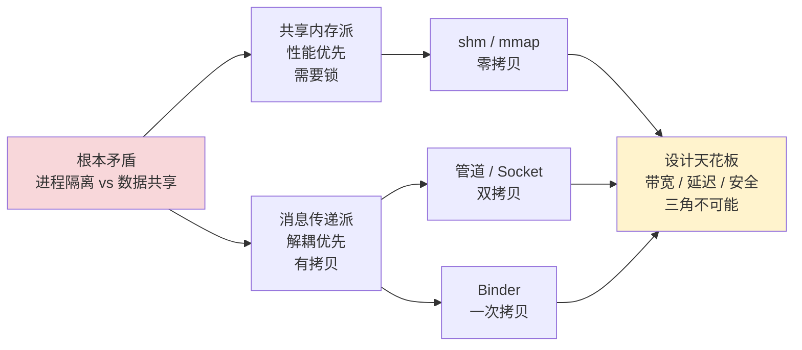
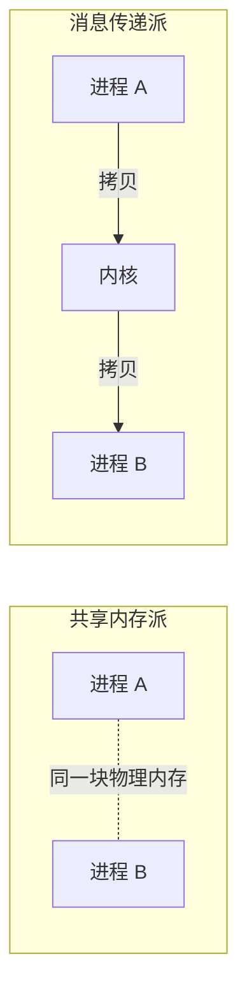
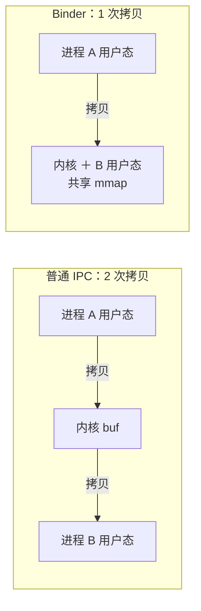
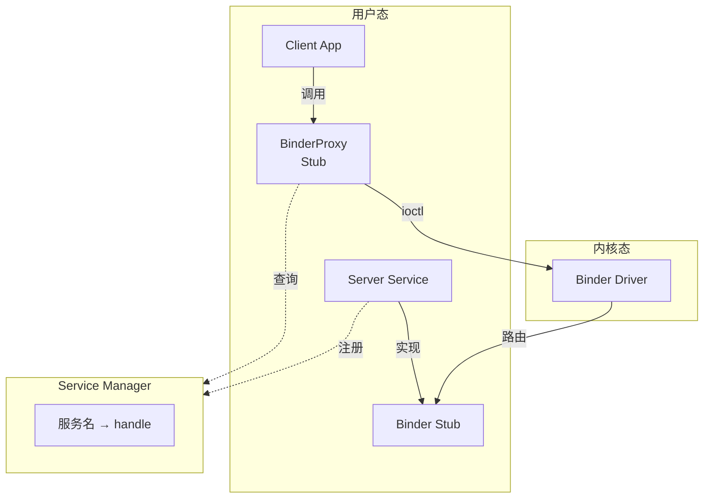
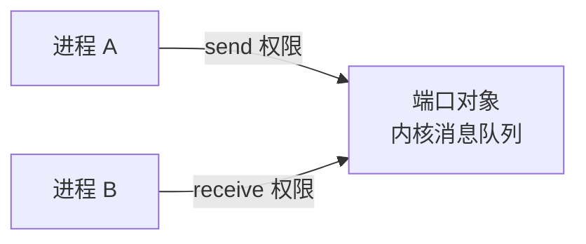
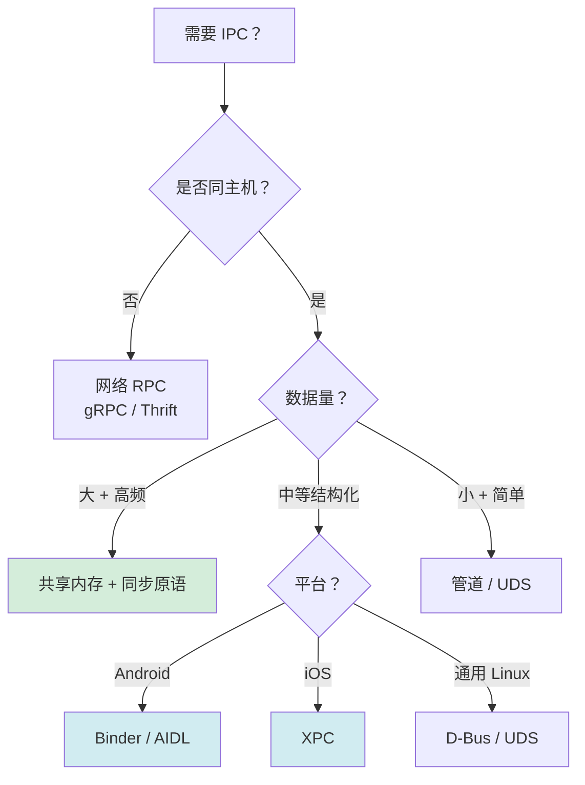

# 5.6 跨进程通信设计

> 📍 **本篇位置**：第 5 卷 · 交互与系统 · 第 6 篇（与 5.5「消息机制」并列为本卷的「跨边界通信」双子篇——5.5 解决「线程间」、5.6 解决「进程间」）
> 🎯 **核心矛盾**：**「进程隔离要安全」 vs 「程序协作要通信」**——OS 用 MMU + 虚拟地址空间在进程间砌起一堵高墙保证安全；但应用又必须协作（App 调 system_server、Tab 调浏览器主进程、微服务互相调用）。**两难解法只有一个：在墙上凿一扇受控的门——这就是 IPC**
> 🧭 **设计灵魂**：所有 IPC 都在「不可能三角」上取舍——**带宽 / 延迟 / 安全 三者只能取二**。**核心四件套：① 通道（Channel）② 序列化（Marshaling）③ 传输（Transport）④ 路由（Routing）**——任何 IPC 都在这四件套上做选择
> 🌐 **跨平台覆盖**：Linux(管道 / 共享内存 / Socket / 信号 / 消息队列 / D-Bus / io_uring) · Android(Binder / Messenger / AIDL / ContentProvider / Ashmem) · iOS/macOS(Mach Port / XPC / Distributed Notifications) · Windows(LPC / ALPC / Named Pipe / COM / RPC) · 鸿蒙(IPC / RPC / Subscribe) · 浏览器(postMessage / SharedArrayBuffer / BroadcastChannel / MessageChannel) · 分布式(gRPC / Thrift / Dubbo / RSocket / WebSocket)
> 🔗 **延伸阅读**：← [5.1 窗口核心设计思想](https://yccoding.com/pages/2f009c/) · ← [5.2 视图加载渲染设计](https://yccoding.com/pages/070bb8/) · ← [5.3 图形渲染管线原理](https://yccoding.com/pages/318066/) · ← [5.4 手势事件设计灵魂](https://yccoding.com/pages/5b96db/) · ← [5.5 消息机制设计思想](https://yccoding.com/pages/0aed31/) · → [5.7 组件生命周期管理](https://yccoding.com/pages/f54c32/) · ↔ [3.x 并发之道](..../04.并发的设计/) · ↔ [4.x 内存的真相](..../05.内存的真相/)
> 💡 **通用心智**：忘掉 Binder/Mach Port/管道这些具体名词，记住一句话——**IPC = 「在 OS 砌的墙上凿一扇能通过数据 + 能确认身份 + 能控成本的门」**。Android Binder、iOS XPC、Linux 管道、浏览器 postMessage、gRPC，本质都是这扇门的不同形态。**核心理解：① 每一次跨进程都至少 2 次用户态↔内核态切换 + 至少 1 次数据拷贝；② 同步 IPC 是\"性能埋雷\"，循环里调 IPC 必出事故（§0 案例）；③ 抽象不会消除成本，只会隐藏成本——本地调用 vs IPC 的代价差距是 1000-10000 倍**——把这三点想明白，所有 IPC 选型问题就有答案了。



---

#### 目录介绍
- [0.App 启动 8 秒事故](#0app-启动-8-秒事故)
  - [0.1 性能告警](#01-性能告警)
  - [0.2 Systrace 看风暴](#02-systrace-看风暴)
  - [0.3 灵魂三问](#03-灵魂三问)
  - [0.4 事故启示](#04-事故启示)
  - [0.5 五个追问](#05-五个追问)
- [1.为何需要 IPC](#1为何需要-ipc)
  - [1.1 单进程的悲剧](#11-单进程的悲剧)
  - [1.2 进程隔离代价](#12-进程隔离代价)
  - [1.3 三个核心矛盾](#13-三个核心矛盾)
- [2.IPC 范式分类](#2ipc-范式分类)
  - [2.1 共享内存 vs 消息](#21-共享内存-vs-消息)
  - [2.2 同步 vs 异步](#22-同步-vs-异步)
  - [2.3 单向 vs 双向](#23-单向-vs-双向)
  - [2.4 IPC 四件套契约](#24-ipc-四件套契约)
- [3.管道](#3管道)
  - [3.1 匿名管道](#31-匿名管道)
  - [3.2 命名管道](#32-命名管道)
  - [3.3 管道内核实现](#33-管道内核实现)
  - [3.4 管道的硬伤](#34-管道的硬伤)
- [4.共享内存](#4共享内存)
  - [4.1 物理本质](#41-物理本质)
  - [4.2 mmap 文件映射](#42-mmap-文件映射)
  - [4.3 同步代价](#43-同步代价)
  - [4.4 真实陷阱](#44-真实陷阱)
- [5.Socket](#5socket)
  - [5.1 Unix Domain Socket](#51-unix-domain-socket)
  - [5.2 网络 Socket](#52-网络-socket)
  - [5.3 Socket 拷贝路径](#53-socket-拷贝路径)
- [6.Binder 天才设计](#6binder-天才设计)
  - [6.1 为何不用现成 IPC](#61-为何不用现成-ipc)
  - [6.2 一次拷贝的秘密](#62-一次拷贝的秘密)
  - [6.3 驱动+SM+Proxy/Stub](#63-驱动smproxystub)
  - [6.4 AIDL 类本地调用](#64-aidl-类本地调用)
  - [6.5 1MB 限制来历](#65-1mb-限制来历)
- [7.Mach Port / XPC](#7mach-port--xpc)
  - [7.1 Mach Port 端口](#71-mach-port-端口)
  - [7.2 XPC 沙盒协作](#72-xpc-沙盒协作)
- [8.信号/消息队列/信号量](#8信号消息队列信号量)
  - [8.1 信号 异步通知](#81-信号-异步通知)
  - [8.2 SysV/POSIX 队列](#82-sysvposix-队列)
  - [8.3 信号量 同步](#83-信号量-同步)
- [9.分布式 IPC](#9分布式-ipc)
  - [9.1 RPC 本质](#91-rpc-本质)
  - [9.2 序列化抉择](#92-序列化抉择)
  - [9.3 网络异常 8 大谬误](#93-网络异常-8-大谬误)
  - [9.4 横向对比矩阵](#94-横向对比矩阵)
  - [9.5 现代演进](#95-现代演进)
- [10.选型与设计哲学](#10选型与设计哲学)
  - [10.1 不可能三角选型](#101-不可能三角选型)
  - [10.2 实战决策清单](#102-实战决策清单)
  - [10.3 经典陷阱与回应](#103-经典陷阱与回应)
  - [10.4 设计哲学总结](#104-设计哲学总结)
  - [10.5 跨端术语对照](#105-跨端术语对照)
  - [10.6 本卷章节呼应](#106-本卷章节呼应)
  - [10.7 通用心智口诀](#107-通用心智口诀)

---

## 0.App 启动 8 秒事故

### 0.1 性能告警

某头部电商 App，2022 年 10 月底大促前压测，性能团队跑出一份报告：

```
冷启动时间：3.2 秒（基线）→ 8.1 秒（当前版本）★ 退化 153%
低端机（Android 8，2GB RAM）：12.4 秒 → 用户大概率直接卸载
```

研发组长第一反应是"是不是新版本加了太多 SDK"——查了启动注册表，确实加了 5 个新 SDK。但即便全关掉，启动时间也只回到 6 秒——**还有 2.8 秒"凭空消失"了**。

### 0.2 Systrace 看风暴

性能工程师抓了一份 Systrace 跟踪，时间轴上看到一片密密麻麻的红条：

```
启动期间 0~8 秒，主线程上：
  Binder Transaction × 1247 次
  累计 Binder IPC 阻塞时长：4.3 秒  ★ 占总启动时间 53%

排在前列的 Binder 调用：
  PackageManager.getPackageInfo()      × 312 次  耗时 1.2 秒
  ContentResolver.query(settings)      × 89 次   耗时 0.6 秒
  AccountManager.getAccounts()         × 45 次   耗时 0.4 秒
  WindowManager.addView()              × 23 次   耗时 0.3 秒
  其它（位置、网络状态等）              × 778 次  耗时 1.8 秒
```

**4.3 秒的 IPC 阻塞**——主线程不是在干活，是在排队等待 system_server 进程的回复。

工程师追到 `getPackageInfo` 312 次的来源，发现是某个新加的反作弊 SDK：

```java
// 反作弊 SDK 内部代码
class AntiCheatSDK {
    void checkInstalled() {
        for (String pkg : KNOWN_RISKY_PACKAGES) {  // 数组里有 312 个包名
            try {
                PackageManager pm = ctx.getPackageManager();
                PackageInfo info = pm.getPackageInfo(pkg, 0);   // ★ 每次都是一次跨进程
                if (info != null) reportRiskyApp(pkg);
            } catch (NameNotFoundException ignored) {}
        }
    }
}
```

**312 次 Binder IPC，每次 3-5ms，累计 1.2 秒**——主线程被这一个循环卡住。

### 0.3 灵魂三问

**问题 1**：为什么一次 `getPackageInfo` 要 3-5ms？

```
工程师：跨进程嘛，肯定慢一点。
架构师：3-5ms 是什么概念？CPU 时钟 1GHz，3ms 能执行 300 万条指令——
       但实际它只是在 system_server 里查一个 HashMap，本身只要几微秒。
       那剩下的时间花在哪？
工程师：……Binder？
架构师：对。一次 Binder 调用要：
       1. 用户态 → 内核态切换（2 次：发起方陷入内核 + 内核唤醒目标方）
       2. 数据从用户空间拷贝到 Binder 驱动的共享内存
       3. 目标进程从内核态切换到用户态处理
       4. 回复时再走一遍同样的流程
       5. 上下文切换 + 调度延迟
       
       仅"调度+上下文切换"就 1-2ms，加上数据序列化、查询本身、反序列化，
       3-5ms 已经是"很优秀"的成绩了。
       
       真正的杀手是：你要做这件事 312 次。
```

**问题 2**：为什么不能批量？

```
工程师：API 就是这样啊，PackageManager 没提供批量接口。
架构师：API 没提供，是不是就只能挨个调？
       你可以调用一次 getInstalledPackages() 拿全量，再在内存里做检查：
       
       // 改造后
       List<PackageInfo> all = pm.getInstalledPackages(0);   // 1 次 IPC
       Set<String> installed = all.stream()
           .map(p -> p.packageName)
           .collect(toSet());
       for (String pkg : KNOWN_RISKY_PACKAGES) {
           if (installed.contains(pkg)) reportRiskyApp(pkg);  // 内存查询，0 IPC
       }
       
       312 次 → 1 次。
       
       规则就一条：永远把"循环里的 IPC"变成"IPC 外的循环"。
```

**问题 3**：为什么这种问题在内部测试时没暴露？

```
工程师：因为开发机性能强，IPC 也快。
架构师：本质问题是——同步 IPC 是"性能埋雷"。
       一次调用 3ms 你完全感觉不到，但循环 312 次就 1 秒。
       开发机 CPU 快、上下文切换快、内存大、调度延迟低，
       同样的代码在低端机上能慢 10 倍。
       
       所以 IPC 性能必须看"调用次数 × 单次成本"，
       而不是"看着挺快就行"。
```

### 0.4 事故启示

事故的本质，不是反作弊 SDK 写错了，而是研发对"IPC 成本"缺乏直觉：

```
我以为：
  pm.getPackageInfo() 就是一个普通的方法调用，写起来和 list.get(i) 没区别

实际：
  这一行代码背后是 ——
    用户态 → 内核态 → 进程切换 → system_server 处理 → 切换回来
  这是一次"跨越 OS 隔离边界"的旅行，
  比本地方法慢 1000-10000 倍
```

| 视角 | 你以为的 | 实际发生的 |
|---|---|---|
| 写代码 | "调用一个方法" | 跨进程跳板 + 内核态切换 + 数据序列化 |
| 性能 | "应该很快" | 比本地调用慢 3-4 个数量级 |
| 测试 | "开发机能跑就行" | 低端机的 IPC 延迟可能 10 倍于开发机 |
| 同步 | "等等就好" | 主线程卡住，掉帧 / ANR |

整个 IPC 设计的核心矛盾就藏在这里：

> **IPC 让"分布在不同进程的代码"看起来像本地调用，但你不能假装它真的是本地调用。每一次跨越进程边界，都要付出至少 1000 倍于本地调用的代价——而你在写代码时几乎看不到这个代价。**

### 0.5 五个追问

带着这次事故，整篇文章在回答下面五个递进问题：

| 追问 | 答案章节 |
|---|---|
| 为什么 OS 要隔离进程？这种隔离的代价是什么？ | §1 |
| 跨进程通信都有哪些方式？怎么分类？ | §2 |
| 经典 Unix IPC（管道/共享内存/Socket）各自适合什么？ | §3 / §4 / §5 |
| Android 的 Binder 凭什么能做到一次拷贝？ | §6 |
| 选型时怎么权衡带宽、延迟、安全？ | §10 |

**带着这次 8 秒启动的伤痛，正式进入 IPC 的世界——你将看到，所有抽象的"管道、共享内存、Binder、Mach Port"原理，最终都能落到这次事故的根因图上。**

---

## 1.为何需要 IPC

### 1.1 单进程的悲剧

要真正理解 IPC 的价值，最好回到没有"进程"概念的时代看看。

1960 年代早期的批处理系统（IBM 7094、CTSS）只跑一个程序：

```
┌─────────────────────────────────┐
│       整台机器的内存             │
│ ┌─────────────────────────────┐ │
│ │  程序代码 + 数据 + 栈 + 堆    │ │
│ │  全部混在一起                │ │
│ └─────────────────────────────┘ │
└─────────────────────────────────┘
```

后果是灾难性的：
- **一个程序崩了，整台机器重启** —— 一个数组越界写到了 OS 的内存
- **没办法跑多个任务** —— 第二个程序写到第一个程序的数据上
- **没有安全可言** —— 任何代码都能读取任何内存

1965 年 Multics 提出"进程"概念：**每个程序在自己的虚拟地址空间里跑，互相看不见**。这就是现代 OS 的基石——但**带来了一个新问题：进程之间怎么协作？**

### 1.2 进程隔离代价

进程隔离的本质是：**虚拟地址空间互相不可见**。

```
进程 A 看到的内存：           进程 B 看到的内存：
0x0000_0000                  0x0000_0000
  ↓                            ↓
0xFFFF_FFFF                  0xFFFF_FFFF

A.addr 0x1000 ─→ 物理 0x4000  ┐
                              │  互相看不到对方
B.addr 0x1000 ─→ 物理 0x9000  ┘  各自独立
```

A 要把数据传给 B，**直接传地址没用**——A 的 `0x1000` 在 B 那里指向另一块内存。**必须通过内核做中介**。

这就是 IPC 的**根本结构**：

```
进程 A ──→ 内核（IPC 机制）──→ 进程 B
        ↑                  ↑
     用户/内核 切换        用户/内核 切换
```

每一次 IPC 至少需要：
1. 进程 A 陷入内核态（系统调用）
2. 内核处理（拷贝/路由/调度）
3. 进程 B 被唤醒，从内核态返回用户态
4. 上下文切换 ×2（A 出 CPU，B 上 CPU）

**这就是为什么 §0 事故的 312 次 IPC 累计 1.2 秒**——每一次都要走这套流程。

### 1.3 三个核心矛盾

所有 IPC 设计都在三个矛盾上做取舍：

#### 矛盾一：性能 vs 安全

```
共享内存最快（无拷贝），但失去了进程隔离的安全性
消息传递最安全（数据复制，互不影响），但有拷贝开销
```

#### 矛盾二：易用性 vs 灵活性

```
RPC 让远程调用像本地调用，但隐藏了网络异常和延迟
原始 Socket 完全暴露异常，但每次都要写很多 boilerplate
```

#### 矛盾三：吞吐 vs 延迟

```
批量 IPC 吞吐高，但首条消息延迟高
单条 IPC 延迟低，但 QPS 上限低
```

§0 事故是同时踩了三个坑：**用同步 IPC（高延迟）、单条调用（低吞吐）、看不到成本（易用性陷阱）**。

---

## 2.IPC 范式分类

### 2.1 共享内存 vs 消息

按"数据是否经过拷贝"，IPC 分两大派系：



| 派系 | 代表 | 优点 | 缺点 |
|---|---|---|---|
| **共享内存** | shm / mmap / Binder mmap 区 | 零或一次拷贝，性能最高 | 需要锁，复杂；安全弱 |
| **消息传递** | 管道 / Socket / 消息队列 | 解耦，安全 | 多次拷贝，性能差 |

**精妙的中间派——Binder**：用 mmap 实现"内核到用户态零拷贝"，但接口看起来是消息传递。**用最简单的接口，达到最优的性能**——这就是工程艺术。

### 2.2 同步 vs 异步

```
同步 IPC：发起者阻塞等待结果（如 Binder.transact / RPC）
异步 IPC：发起者发完就走，结果通过回调/Future 拿（如管道写）
```

§0 事故的 312 次 IPC 是**同步**的——主线程必须等每次返回。如果改成异步（如发到 Handler）：

```java
// 异步改造
executor.submit(() -> {
    for (String pkg : KNOWN_RISKY_PACKAGES) {
        // ... IPC 调用，但不在主线程
    }
    return result;
}).thenAccept(result -> handleResult(result));
```

**主线程立刻返回，IPC 在后台慢慢做**——这是降低 IPC 影响的标准手段。

### 2.3 单向 vs 双向

```
单向（信号、广播）：     A ──→ B
双向半双工（管道）：     A ←→ B（一次只能一方说）
双向全双工（Socket）：   A ⇄ B（双方同时说）
```

不同流向决定了不同的 API 设计——比如管道要写 `pipe(int fd[2])` 创建两个端点，Socket 要 `socketpair()`。

### 2.4 IPC 四件套契约

剥离所有具体平台，**任何 IPC 系统都遵循同样的「四件套契约」**。这是本篇最值得贴在 IDE 旁边的"IPC 原理通用名片"：

```
通用 IPC 契约（七端共享）：

  ┌────────────────────────────────────────────────────────────────┐
  │  进程 A (Producer)                       进程 B (Consumer)     │
  │  ┌──────────┐                            ┌──────────┐          │
  │  │ 业务对象  │                            │ 业务对象  │          │
  │  └────┬─────┘                            └────▲─────┘          │
  │       │ ② 序列化 (Marshaling)                  │ ② 反序列化      │
  │       ▼                                       │                │
  │  ┌──────────┐    ① 通道 (Channel)    ┌──────────┐               │
  │  │字节/Parcel│───────────────────────▶│字节/Parcel│              │
  │  └────┬─────┘                        └──────────┘              │
  │       │                                       ▲                │
  │       │ ③ 传输 (Transport)                     │                │
  │       │   - 用户态→内核态 (syscall)             │                │
  │       │   - 拷贝/mmap                          │                │
  │       │   - 调度/上下文切换                    │                │
  │       ▼                                       │                │
  │  ┌────────────────────────────────────────────┴────────┐       │
  │  │           内核 (Kernel: 驱动 / 端口 / 队列)            │       │
  │  │           ④ 路由 (Routing: 找到目标进程)              │       │
  │  └────────────────────────────────────────────────────┘       │
  └────────────────────────────────────────────────────────────────┘
```

**这四件套在七大平台/范式的对应名词**——任何后端/客户端开发者都能在自己的平台找到对应位置：

| 要素 | Linux 管道 | Linux UDS | Linux 共享内存 | Android Binder | iOS Mach Port / XPC | Windows ALPC | 浏览器 postMessage | gRPC / RPC |
|------|-----------|-----------|---------------|----------------|---------------------|--------------|---------------------|-----------|
| **① 通道** | pipe fd | unix socket fd | shm_open / mmap 区 | IBinder 句柄 | Mach Port name | ALPC Port | MessagePort | TCP 连接 / HTTP/2 流 |
| **② 序列化** | 字节流（无格式） | 字节流 + 用户协议 | 内存布局即格式 | Parcel | NSXPCEncoder / NSKeyedArchiver | NDR / IDL | 结构化克隆 / Transferable | Protobuf / Thrift |
| **③ 传输** | read/write syscall | sendmsg/recvmsg | 直接读写内存 | ioctl(BINDER_WRITE_READ) | mach_msg | NtAlpcSendWaitReceivePort | 浏览器内部 IPC | TCP + HTTP/2 |
| **④ 路由** | fd 直接配对 | socket 路径名 / fd 传递 | 共享 key | Binder Driver + ServiceManager | bootstrap_register / launchd | ALPC Connection Port | window.opener / iframe ref | DNS + 服务发现 |
| **拷贝次数** | 2 次（A→内核→B） | 2 次 | 0 次（共享物理页） | **1 次（mmap）** | 1-2 次（mach_msg 优化） | 1-2 次 | 1 次（结构化克隆） | 2 次 + 网络 |
| **延迟量级** | ~5μs | ~5μs | ~100ns（内存访问） | ~50-100μs | ~50-100μs | ~50-100μs | ~10-50μs | ~100μs-数 ms |
| **安全机制** | fd 持有 | UDS 文件权限 + SO_PEERCRED | shm key 权限 | UID/PID + SELinux | Mach Port 权限 | ALPC token | Same-Origin / postMessage origin | TLS + Token |
| **同步语义** | 阻塞 read/write | 阻塞 / 非阻塞 / poll | 自行用信号量 | 同步 transact / oneway | 同步 / async | 同步 / async | 异步事件 | 同步 / async / stream |
| **典型限制** | 64KB 缓冲区 | 长度无限制 | 同步要程序员管 | 单事务 1MB | 端口名空间隔离 | Windows-only | 仅同源/跨源协议 | 网络 8 大谬误 |

**这套契约的「跨端不变量」**——任何应用开发者必背：

1. **进程边界 = 必须经过内核**——用户态进程不能直接读对方内存（MMU 保护），数据必须借道内核。
2. **拷贝次数决定带宽上限**——零拷贝 (共享内存) > 一次拷贝 (Binder mmap) > 两次拷贝 (Socket/管道) > 网络多次拷贝。
3. **路由是 IPC 的"邮政编码"**——管道靠 fd、Binder 靠 ServiceManager、网络 RPC 靠 DNS，"找到对方"本身就是个系统工程。
4. **序列化决定跨语言能力**——Parcel/Mach Encoder 是平台私有的，Protobuf/JSON 才能跨语言跨平台。
5. **同步 IPC 必须有超时**——没有超时机制的同步 IPC 是定时炸弹（§0 案例的根因之一）。

**给所有应用开发者的总记忆**：

> 不论你在做 Android、iOS、桌面端、浏览器、还是分布式微服务——**跨进程的每一次调用都经过同样四件事：① 通道建立 → ② 数据序列化 → ③ 内核中转 → ④ 路由到目标**。下次遇到「IPC 慢」问题时你能精准说出"瓶颈在第几件套"：通道太重（①，TCP 取代 UDS）/ 序列化太慢（②，JSON 取代 Protobuf）/ 拷贝太多（③，没用零拷贝）/ 路由开销大（④，没复用连接），而不是"反正就是慢"。

---

## 3.管道

### 3.1 匿名管道

1973 年 Doug McIlroy 在贝尔实验室发明了管道。Unix 一句话哲学的"组合小工具"，靠的就是管道：

```bash
ps aux | grep nginx | awk '{print $2}' | xargs kill -9
       ↑           ↑                  ↑
       管道        管道                管道
```

每个 `|` 创建一个匿名管道，把前一个进程的 stdout 接到下一个进程的 stdin。**一行命令完成"找进程→过滤→提取 PID→杀进程"四步**——这就是 Unix 的伟大。

C 代码实现：

```c
int fd[2];
pipe(fd);   // fd[0] 读端，fd[1] 写端

if (fork() == 0) {
    // 子进程：读端
    close(fd[1]);
    char buf[1024];
    read(fd[0], buf, 1024);
    // ...
} else {
    // 父进程：写端
    close(fd[0]);
    write(fd[1], "Hello", 5);
}
```

### 3.2 命名管道

匿名管道有个限制：**只能在有亲缘关系的进程间用**（fork 出来的父子进程）。两个无关进程怎么通信？**命名管道（FIFO）**：

```c
mkfifo("/tmp/mypipe", 0666);

// 进程 A
int fd = open("/tmp/mypipe", O_WRONLY);
write(fd, "Hello", 5);

// 进程 B（完全无关）
int fd = open("/tmp/mypipe", O_RDONLY);
read(fd, buf, 1024);
```

通过文件系统里的一个特殊文件作为"会面点"。**它就是 Linux 一切皆文件哲学的体现——IPC 的端点也是文件**。

### 3.3 管道内核实现

管道在内核里是一个**固定大小的环形缓冲区**（Linux 默认 64KB）：

```
                    ┌─────────────────┐
   read fd  ←──────│   环形缓冲区     │←────── write fd
                    │  容量 64KB       │
                    │  read_pos        │
                    │  write_pos       │
                    └─────────────────┘
```

**写满了怎么办？** 写阻塞——直到读端腾出空间。
**读空了怎么办？** 读阻塞——直到写端写入。

这就是管道的**天然背压**：消费者跟不上生产者，生产者会自动减速。

### 3.4 管道的硬伤

管道虽然简单优雅，但限制不少：

1. **半双工**：一根管道只能单向流，要双向得开两根
2. **字节流（无消息边界）**：写 `"AAA"` 和 `"BBB"`，读端可能一次读到 `"AAABBB"`，分不清
3. **缓冲区固定**：超大数据要分块发送
4. **本机限制**：只能本机用，跨机要用 Socket

字节流问题是个隐藏雷——业务往往要在管道之上自己加"消息边界协议"（比如先写长度再写内容），变成 TCP 一样的麻烦。

---

## 4.共享内存

### 4.1 物理本质

共享内存是性能最高的 IPC——**因为根本没"通信"，两个进程在看同一块物理内存**：

```
   进程 A 虚拟地址空间          进程 B 虚拟地址空间
   ┌─────────────────┐          ┌─────────────────┐
   │  ...            │          │  ...            │
   │  [shm 区域]      │──┐    ┌─│  [shm 区域]      │
   │  虚拟地址 0x5000 │  │    │ │  虚拟地址 0x8000 │
   │  ...            │  │    │ │  ...            │
   └─────────────────┘  │    │ └─────────────────┘
                        ▼    ▼
                  ┌──────────────────┐
                  │   同一块物理内存   │
                  │   物理地址 0x100M │
                  └──────────────────┘
```

**关键洞察**：A 写入"hello"到自己的虚拟地址 `0x5000`，**就是直接写到物理 `0x100M`**——B 通过自己的虚拟地址 `0x8000` 也指向同一物理内存，**立刻就能看到"hello"**。

**没有内核拷贝，没有上下文切换，速度就是 RAM 访问速度**——纳秒级。

### 4.2 mmap 文件映射

Linux 创建共享内存最常用的方式是 `mmap`：

```c
// 进程 A
int fd = shm_open("/myshm", O_CREAT | O_RDWR, 0666);
ftruncate(fd, 4096);
void* p = mmap(NULL, 4096, PROT_READ|PROT_WRITE, MAP_SHARED, fd, 0);
strcpy(p, "Hello from A");

// 进程 B
int fd = shm_open("/myshm", O_RDWR, 0666);
void* p = mmap(NULL, 4096, PROT_READ|PROT_WRITE, MAP_SHARED, fd, 0);
printf("%s\n", (char*)p);   // "Hello from A"
```

**mmap 的精妙处**：把"打开文件"的语义复用为"映射内存"——用熟悉的文件描述符接口，做完全不一样的事。

`MAP_SHARED` 标志告诉内核"这是共享映射"——多个进程映射同一个文件，内核做的是**虚拟地址→同一物理页**的映射，自动同步。

### 4.3 同步代价

共享内存有个致命问题——**没有任何同步**。两个进程同时写同一块内存就是数据竞争：

```c
// 进程 A 和进程 B 都跑这段代码
shared->counter++;   // 不是原子的！
// 可能 A 读了 0，B 也读了 0，各自 +1 写回，最终是 1 而不是 2
```

必须配合**信号量**或**互斥锁**做同步：

```c
sem_t* sem = sem_open("/mysem", O_CREAT, 0666, 1);   // 初值 1

// 临界区
sem_wait(sem);
shared->counter++;
sem_post(sem);
```

**这就是共享内存的工程现实**：性能极高，但同步要程序员自己背。一旦写错，竞态条件极难调试。

### 4.4 真实陷阱

#### 陷阱一：忘记反初始化

```
shm_open 创建的对象在内核里持久存在——
进程退出不会自动清理
下次启动会发现 "已经存在" 错误
```

要在退出时调 `shm_unlink("/myshm")` 显式清理，**否则机器重启前都不会消失**。

#### 陷阱二：地址不一样，指针失效

```c
struct Node {
    Node* next;   // ★ 这是个指针
    int value;
};

// 进程 A 写入：
shared->next = malloc(...);   // A 的虚拟地址，对 B 无效

// 进程 B 读取：
Node* p = shared->next;       // 拿到 A 的地址，访问就是 segfault
```

**修法**：共享内存里只能存"偏移量"或"基于共享内存基址的相对指针"，不能存绝对地址。

#### 陷阱三：跨进程对象的析构

```cpp
shared->str = string("hello");   // string 内部有指向堆的指针
                                 // 那个堆在 A 进程，B 看不到
```

**修法**：共享内存里只放"扁平数据"（POD），不放有指针的对象。或者用 `boost::interprocess` 提供的特殊容器。

---

## 5.Socket

### 5.1 Unix Domain Socket

Socket 不只是网络通信——本机进程间通信也能用 **Unix Domain Socket（UDS）**：

```c
// 服务端
int srv = socket(AF_UNIX, SOCK_STREAM, 0);
struct sockaddr_un addr = { .sun_family = AF_UNIX };
strcpy(addr.sun_path, "/tmp/myapp.sock");
bind(srv, (struct sockaddr*)&addr, sizeof(addr));
listen(srv, 5);
int conn = accept(srv, NULL, NULL);
read(conn, buf, sizeof(buf));

// 客户端
int sock = socket(AF_UNIX, SOCK_STREAM, 0);
connect(sock, (struct sockaddr*)&addr, sizeof(addr));
write(sock, "hello", 5);
```

**UDS 的优势**：
- API 和 TCP socket 完全一样，便于切换（本地 → 网络）
- 性能远高于 TCP socket（不走网络栈）
- 支持传递文件描述符（`SCM_RIGHTS`）—— Android Binder 也用这个传 fd

**Docker、X11、Nginx-PHP 之间的通信都是 UDS**——是工程界最广泛使用的本机 IPC 之一。

### 5.2 网络 Socket

跨主机就要用 TCP/UDP socket——但代价显著：

```
本机 UDS：     ~5 μs/次（仅内核拷贝）
本机 TCP：    ~30 μs/次（走 TCP 栈，但没出网卡）
跨主机 TCP：  ~500 μs - 数 ms（取决于网络）
```

**为什么本机 TCP 也比 UDS 慢 6 倍？** 因为 TCP socket 走完整的 TCP 协议栈：分片、checksum、滑动窗口、ACK——**这些都是为不可靠网络设计的，在本机上是浪费**。

### 5.3 Socket 拷贝路径

普通 Socket 的数据拷贝路径：

```
进程 A 用户态 buf  ─① 拷贝到内核 socket buf (写)
内核 socket buf    ─② 拷贝到进程 B 内核 socket buf (路由)
进程 B 内核 buf    ─③ 拷贝到用户态 buf (读)
```

**3 次拷贝**——这是 Socket 性能不如共享内存的根本原因。

`sendfile()` 系统调用可以省一次拷贝（用于文件 → socket 的特殊场景），现代内核还有 `splice()`、`zero-copy networking` 等优化，但都需要特殊用法。

---

## 6.Binder 天才设计

### 6.1 为何不用现成 IPC

2007 年 Android 团队设计 IPC 时，面对的现实是：
- Linux 已有 5+ 种 IPC（管道、Socket、shm、信号、消息队列）
- 每一种都不完美：管道单向、Socket 慢、shm 不安全、信号载荷小

Android 的需求很特殊：
- **极高频**：每个 App 启动都要和 system_server 频繁通信（§0 事故就是这个场景）
- **强类型**：要能传 Java 对象，不能只传字节
- **安全**：要能识别调用方身份（UID/PID）防伪造
- **性能**：要支持百 KB 级数据高效传递

现成 IPC 都不能完全满足——所以 Google 基于一个开源项目 OpenBinder 做了魔改，诞生了 Android Binder。

### 6.2 一次拷贝的秘密

Binder 最核心的创新是 **mmap 让通信只需一次拷贝**：



实现原理：

```
1. 进程 B 启动时，调 ProcessState 把一块虚拟内存（默认 1MB）和内核空间做 mmap 映射
   → B 的用户态地址空间和内核空间共享这 1MB
   
2. 进程 A 调用 Binder.transact：
   A 用户态数据 ─① 拷贝→ 内核（同时也是 B 的用户态映射区）
                                          ↓
                                          B 的用户态直接看到，无需再拷贝
```

**§0 事故里的每次 PackageManager 调用，就走这条 1 次拷贝路径**——已经是 IPC 中性能最优的方案之一。但即便如此，3-5ms 的成本依然存在（来自上下文切换、调度），在 312 次循环里被放大成灾难。

### 6.3 驱动+SM+Proxy/Stub

Binder 的整体架构：



四个关键角色：

| 角色 | 职责 |
|---|---|
| **Binder Driver** | 内核里的核心，做内存映射 + 进程间路由 |
| **Service Manager** | "电话簿"——按服务名找到 Binder handle |
| **Proxy（客户端代理）** | 把 Java 调用打包成数据包，通过 Binder 发出 |
| **Stub（服务端骨架）** | 收到数据包后解包，调实际方法，返回结果 |

调用流程：

```
1. App 通过 Context.getSystemService("package") 拿到 PackageManager
   → 实际拿到的是 PackageManagerProxy（客户端代理）

2. App 调 pm.getPackageInfo("com.x", 0)
   → Proxy 把方法名+参数打包成 Parcel
   → 通过 ioctl(BINDER_WRITE_READ) 发给 Binder Driver

3. Binder Driver 路由到 system_server 进程
   → mmap 区直接可见，无需第二次拷贝

4. system_server 的 Stub 解包，调 PackageManagerService.getPackageInfo()
   → 返回结果再走一遍同样的流程
```

### 6.4 AIDL 类本地调用

写 Binder 客户端/服务端的 Proxy / Stub 极其繁琐——AIDL（Android Interface Definition Language）是个"代码生成器"：

```text
// IMyService.aidl
interface IMyService {
    int add(int a, int b);
    String hello(String name);
}
```

AIDL 编译器自动生成：
- `IMyService.java` 接口
- `IMyService.Stub` 服务端骨架（你只要继承它实现方法）
- `IMyService.Stub.Proxy` 客户端代理（自动打包/解包参数）

**业务代码**：

```java
// 服务端
class MyService extends Service {
    private final IBinder binder = new IMyService.Stub() {
        @Override
        public int add(int a, int b) { return a + b; }
        @Override
        public String hello(String name) { return "Hi " + name; }
    };
    @Override
    public IBinder onBind(Intent i) { return binder; }
}

// 客户端
IMyService svc = IMyService.Stub.asInterface(binder);
int result = svc.add(1, 2);   // 像本地调用一样
```

**AIDL 的本质是把"序列化 / 跨进程路由 / 反序列化"都隐藏掉**——这就是高质量 RPC 框架的核心价值：让程序员心智上忽略"远程"。

但**这种隐藏也是 §0 事故的根源**——`pm.getPackageInfo` 看起来像本地调用，让程序员忘记它实际是 IPC。**抽象不会消除成本，只会隐藏成本**。

### 6.5 1MB 限制来历

Binder 的 mmap 区默认 **1MB - 8KB**（实际可用约 1MB，预留 8KB 给头部），**整个进程所有 Binder 调用共用**。

```
传 > 1MB 的数据：抛 TransactionTooLargeException
```

这是 Android 上传大数据的硬限制。常见踩坑：

- Activity onSaveInstanceState 超 1MB → 崩溃
- ContentProvider 传巨量数据 → 用 ParcelFileDescriptor 改走文件
- 传图：用 Ashmem（匿名共享内存）+ ParcelFileDescriptor

**为什么是 1MB？** 早期 Android 设备内存只有几十 MB，每个进程的 Binder 区不能太奢侈；1MB 是性能 / 内存 / 实用性的平衡点。这个值现在依然是默认——历史包袱在工程里很难甩掉。

---

## 7.Mach Port / XPC

### 7.1 Mach Port 端口

苹果的 IPC 基础是 Mach Port（来自卡内基梅隆 Mach 内核）：

```
端口（Port）= 内核里的一个消息队列
进程持有"端口名"（句柄）来发/收消息
端口有权限控制（send / receive 权限分离）
```



每个 Mach Task（进程）有自己的 port name space——**A 看到的端口名 5 和 B 看到的端口名 5 不一定是同一个端口**。这种"端口名空间"设计比 Linux 的全局 fd 更安全。

### 7.2 XPC 沙盒协作

iOS App Sandbox 严格隔离应用，但 App 经常要和"系统服务"或"扩展"通信——XPC 是上层 IPC：

```objc
NSXPCConnection* conn = [[NSXPCConnection alloc] 
    initWithServiceName:@"com.example.MyService"];
conn.remoteObjectInterface = [NSXPCInterface interfaceWithProtocol:@protocol(MyProto)];
[conn resume];

id<MyProto> proxy = [conn remoteObjectProxy];
[proxy doSomething];
```

**XPC 的设计哲学**：让进程通信像 Objective-C 消息一样自然，但底层走 Mach Port。

特殊价值：**XPC Service 是隔离的进程**——主进程崩了 XPC Service 不崩，反之亦然。Safari 把每个 Tab 跑成 XPC 子进程，单个网页崩溃不影响整个浏览器。

---

## 8.信号/消息队列/信号量

### 8.1 信号 异步通知

信号是 Unix 最古老的 IPC 之一——**一个进程给另一个进程发个"事件"**：

```c
kill(target_pid, SIGTERM);   // 发信号

// 接收方
signal(SIGTERM, handler);
void handler(int sig) {
    cleanup();
    exit(0);
}
```

**特点**：
- 载荷极小（就一个数字）
- 异步：发了就走，不等响应
- 进程必须在用户态才能处理（被信号打断）
- 不可靠：同一信号短时间内多次发送可能合并成一次

**典型用法**：
- `kill -9 pid`：发 SIGKILL
- Ctrl+C：发 SIGINT
- 进程崩溃前清理资源（捕获 SIGSEGV）

信号是"消息"，不是"通信"——载荷只有一个 int，要传数据得另想办法。

### 8.2 SysV/POSIX 队列

消息队列是有"消息边界"的管道：

```c
// POSIX 消息队列
mqd_t mq = mq_open("/myq", O_CREAT|O_WRONLY, 0666, NULL);
mq_send(mq, "hello", 5, 0);

// 接收
char buf[1024];
mq_receive(mq, buf, 1024, NULL);
```

**优点**：消息有边界（不是字节流），可设优先级，内核持久化（重启后还在）。
**缺点**：性能不如管道，载荷有上限（默认 8KB）。

**实际工业里用得不多**——比管道复杂，比 Socket 不灵活，处于"夹缝"中。

### 8.3 信号量 同步

严格说**信号量不是 IPC**——它不传数据，只做同步：

```c
sem_t* sem = sem_open("/mysem", O_CREAT, 0666, 0);

// 进程 A：等待
sem_wait(sem);   // 阻塞，直到 sem > 0
do_work();

// 进程 B：唤醒
sem_post(sem);   // sem++
```

**典型用法**：和共享内存配合做互斥（§4.3 见过）。

---

## 9.分布式 IPC

### 9.1 RPC 本质

RPC（Remote Procedure Call）是 IPC 的"分布式版本"——核心抽象是把"在另一台机器上跑代码"包装成方法调用：

```
client.getUserInfo(123)   // 看起来像本地
       ↓
       序列化参数
       ↓
       网络传输
       ↓
       服务端反序列化
       ↓
       真正执行 getUserInfo(123)
       ↓
       序列化结果
       ↓
       网络回传
       ↓
       客户端反序列化
       ↓
       返回值
```

**抽象的代价是"本地调用"和"RPC 调用"看起来一样，但成本天差地别**——和 §0 事故的 Binder 同源问题。

### 9.2 序列化抉择

| 序列化 | 大小 | 性能 | 可读 | 跨语言 |
|---|---|---|---|---|
| **JSON** | 大 | 慢 | 好 | 好 |
| **XML** | 巨大 | 慢 | 好 | 好 |
| **Protobuf** | 小 (~10x JSON) | 快 (~5x JSON) | 不好 | 极好 |
| **MessagePack** | 中 | 中 | 不好 | 中 |
| **FlatBuffers** | 小 | 极快（零拷贝） | 不好 | 中 |

**选型决策**：
- Web API：JSON（生态、可读、调试方便）
- 内部服务（gRPC）：Protobuf（性能、强类型、版本兼容）
- 游戏 / 实时系统：FlatBuffers（零拷贝读取）

### 9.3 网络异常 8 大谬误

L Peter Deutsch 1994 年总结了**分布式系统的 8 大谬误**，到今天仍每条都在坑人：

1. **网络是可靠的** —— 错，会丢包、断连
2. **延迟是 0** —— 错，至少几十毫秒
3. **带宽无限** —— 错，要省着用
4. **网络是安全的** —— 错，要加密、认证
5. **拓扑不变** —— 错，IP 会变、节点会下线
6. **只有一个管理员** —— 错，跨团队跨公司
7. **传输成本是 0** —— 错，云带宽很贵
8. **网络是同质的** —— 错，多种协议、多种 ISP

**RPC 框架要处理的本质问题就是这 8 条**：超时、重试、熔断、限流、降级、全链路追踪、幂等性——每一项都是博士论文级别的复杂度。

### 9.4 横向对比矩阵

§3-§9 各端是「挨个讲」，缺横向对比。这张矩阵把 **9 种主流 IPC × 8 个核心维度** 摆在同一张表里——选型时一眼定位：

| 维度 \\ IPC | 管道 | UDS | 共享内存 | Binder | Mach Port | ALPC (Win) | 信号 | 消息队列 | gRPC |
|------------|------|-----|---------|--------|-----------|------------|------|---------|------|
| **拷贝次数** | 2 | 2 | 0 | 1 | 1-2 | 1-2 | 0（仅信号号） | 2 | 2+网络 |
| **延迟（同主机）** | ~5μs | ~5μs | ~100ns | ~50μs | ~50μs | ~50μs | ~1μs | ~10μs | ~100μs |
| **带宽（GB/s）** | ~3 | ~5 | ~10+ | ~2 | ~2 | ~2 | N/A | ~1 | ~0.1 |
| **是否支持双向** | 否（半双工） | 是 | 是 | 是 | 是 | 是 | 否 | 否 | 是 |
| **是否支持跨主机** | 否 | 否 | 否 | 否 | 否 | 否 | 否（仅跨进程） | 否 | **是** |
| **是否支持身份认证** | fd 持有 | SO_PEERCRED | shm 权限 | **UID/PID 强保证** | 端口权限 | ALPC Token | 仅 PID | 系统权限 | TLS + Token |
| **复杂度** | 极低 | 低 | **极高**（要管同步） | 中（AIDL 隐藏） | 高 | 高 | 极低 | 中 | 中 |
| **适用场景** | Shell 流水线 | Docker / Nginx / X11 | 高频大数据（视频帧） | Android 系统服务 | iOS App ↔ XPC | Win32 子系统 | 进程控制 | 持久消息 | 微服务 |

**九种 IPC 的「场景定位图」**：

```
                  带宽
                   ▲
            shm    │
        ●─────────●│
       (零拷贝王者) │ ● Binder mmap
                   │  (一次拷贝)
                   │
        ───────────┼─────────────────▶
       ● 管道  ● UDS                  延迟
       (字节流)  (消息边界)
                   │
                   │   ● gRPC
                   │  (跨主机)
                   │  ● 消息队列
                   │   (持久化)
                   ▼
                  安全
```

**「九种 IPC 各自的"哲学站位"」**：

```
管道 (1973)：「最朴素的字节流」
   ─ 哲学：Unix 一切皆文件，IPC 也是 fd
   ─ 价值：写 50 行 C 代码就能造个 Shell

UDS (1980s)：「本机的 TCP，去掉网络栈」
   ─ 哲学：socket API 通用化，本机也用
   ─ 价值：Docker / Nginx-PHP / X11 全靠它

共享内存 (1980s)：「性能的极致，安全的代价」
   ─ 哲学：内核只做映射，剩下的程序员管
   ─ 价值：视频帧、数据库 buffer pool

Binder (2008)：「面向 Android 的特殊优化」
   ─ 哲学：mmap + UID/PID 鉴权 + AIDL = "安全的高性能 IPC"
   ─ 价值：Android 系统服务的命脉

Mach Port (1985)：「端口语义 + 内核对象 = 微内核哲学」
   ─ 哲学：一切皆消息，端口是一等公民
   ─ 价值：苹果整个系统的 IPC 基石

ALPC (Windows Vista)：「微软的高性能 LPC」
   ─ 哲学：兼容旧 LPC + 性能优化 + 安全增强
   ─ 价值：Win32 子系统与内核通信

信号 (1970s)：「最古老的事件通知」
   ─ 哲学：传一个数字就够了
   ─ 价值：进程控制、崩溃处理

消息队列 (1980s)：「持久化的管道」
   ─ 哲学：消息有边界，可持久化
   ─ 价值：解耦生产者消费者（但被现代 MQ 取代）

gRPC (2015)：「跨主机的 RPC 标准」
   ─ 哲学：Protobuf + HTTP/2 + 强类型 = 现代微服务
   ─ 价值：云原生时代的事实标准
```

**给应用开发者的选型口诀**：

```
要快 + 不跨机 + 数据大 → 共享内存
要稳 + 不跨机 + Android → Binder
要稳 + 不跨机 + iOS → XPC
要简单 + 不跨机 → 管道 / UDS
要跨机 + 同语言 → gRPC / Thrift
要跨机 + 跨语言 → gRPC + Protobuf
要持久化 → Kafka / RabbitMQ（不是 OS 消息队列）
要事件通知 → 信号 / DBus / postMessage
```

> **没有最好的 IPC，只有最适合场景的 IPC**。同样的数据交换需求，在 Android 上用 Binder、在 iOS 上用 XPC、在浏览器里用 postMessage、在微服务里用 gRPC——理解每种 IPC 的「拷贝次数 / 延迟 / 安全」三角，是跨端开发者的核心素养。

### 9.5 现代演进

§3-§8 讲的都是 1980-2010 年代的经典 IPC。但 **2018-2024 年，IPC 领域出现了 4 项革命性突破**，正在重塑高性能场景的 IPC 格局：

#### 演进一：io_uring（Linux 5.1, 2019）—— "无系统调用 IPC"

**传统问题**：read/write/sendmsg 每次都要 syscall（陷入内核），高频小包场景下 syscall 开销占比 30%+。

```c
// 传统：每次 read 都 syscall
while (n--) {
    read(fd, buf, size);  // ★ 每次都用户态↔内核态切换
}
```

**io_uring 革命**：用户态和内核态通过两个共享 ring buffer 通信，**无需 syscall**：

```
┌─────────────────────────────────────────┐
│        用户态                            │
│   ┌────────────┐                        │
│   │ SQ (提交队列) │ ──┐                  │
│   └────────────┘   │                    │
│                    │ 共享内存            │
│   ┌────────────┐   │                    │
│   │ CQ (完成队列) │ ◀─┘                  │
│   └────────────┘                        │
├─────────────────────────────────────────┤
│        内核态                            │
│   异步处理 SQ 中的请求，完成后写入 CQ    │
└─────────────────────────────────────────┘
```

**性能对比**（每秒小包数）：

```
传统 read/write：    100 万/秒
epoll + read：       300 万/秒
io_uring：           1500 万/秒  ★ 15 倍提升
```

**应用场景**：高频小包、高并发存储、数据库 WAL、Redis 7.x、Linux 6.x 内核网络栈。

#### 演进二：eBPF（Linux 4.x+, 2018 商用）—— "在内核态做 IPC 加速"

**传统问题**：内核态 ↔ 用户态切换是 IPC 性能瓶颈。能不能"让用户的代码跑在内核里"？

**eBPF 革命**：用户提交一段经验证的字节码（安全沙箱），由内核虚拟机执行：

```c
// 传统：用户态过滤
while (true) {
    packet = recv();
    if (packet.matches(rule)) process(packet);  // ★ 每个包都要 syscall
}

// eBPF：内核态过滤
SEC("xdp")
int xdp_filter(struct xdp_md *ctx) {
    if (matches_rule(ctx)) return XDP_PASS;
    return XDP_DROP;  // ★ 在网卡驱动层就丢弃，零拷贝
}
```

**典型应用**：
- **Cilium**：替代 iptables 做容器网络（Kubernetes 标配）
- **bpftrace**：动态追踪（替代部分 strace）
- **网络监控**：在内核态就把不需要的包过滤掉

**对 IPC 的影响**：**网络 IPC 路径从 7 次拷贝缩短到 1 次**——本质是把"用户态业务逻辑"下沉到内核态，绕过传统 socket 栈。

#### 演进三：RDMA（Remote Direct Memory Access）—— "跨主机的共享内存"

**传统问题**：跨主机网络通信要走完整 TCP 栈，CPU 占用高、延迟大。

**RDMA 革命**：网卡直接读写远程主机内存，**完全绕过 CPU 和内核**：

```
传统网络：
  用户态 → 内核态 → TCP 栈 → 网卡 → 网络 → 网卡 → TCP 栈 → 内核态 → 用户态
  （每跳都要 CPU 处理）

RDMA：
  网卡 ←────── 直接传输 ──────→ 网卡
  （CPU 全程不参与，零拷贝跨主机）
```

**性能对比**：

```
TCP/IP 跨主机：       延迟 ~50μs，吞吐 ~10 Gbps，CPU 占用高
RDMA (RoCE)：        延迟 ~1μs，吞吐 ~100 Gbps，CPU 占用极低
```

**应用场景**：
- 高频交易（HFT）：~1μs 的延迟意味着竞争优势
- AI 训练：GPU 之间的 AllReduce（NVIDIA NCCL 用 RDMA）
- 分布式存储：Ceph、SPDK 的高性能模式

#### 演进四：DPDK / kernel-bypass —— "完全绕过内核"

**传统问题**：内核网络栈为「通用性」设计，对高性能场景不够极致。

**DPDK 革命**：网卡内存直接映射到用户态，**完全绕过内核**：

```c
// DPDK: 用户态轮询网卡
while (true) {
    rte_mbuf_t* pkt = rte_eth_rx_burst(port, queue);  // 用户态直接读网卡
    process(pkt);
    rte_eth_tx_burst(port, queue, pkt);              // 用户态直接写网卡
}
```

**性能**：单核 10Gbps 线速包处理（传统 socket ~1Gbps）

**应用场景**：
- 高性能负载均衡（如阿里 ALB）
- 5G UPF 数据面
- 虚拟化交换机（OVS-DPDK）

#### 演进总结：四代 IPC 性能层级

```
第一代（1970s-2000s）：传统 IPC
   ─ 管道、Socket、信号、共享内存
   ─ 性能：~μs 级

第二代（2008-2018）：平台优化 IPC
   ─ Binder、Mach Port、ALPC
   ─ 性能：~10μs 级
   ─ 优化：减少拷贝（mmap）+ 强类型 + 鉴权

第三代（2018-2024）：内核协同 IPC
   ─ io_uring、eBPF
   ─ 性能：~ns 级（消除 syscall 开销）
   ─ 优化：用户态↔内核态共享内存 + 内核态执行用户逻辑

第四代（2020+）：硬件加速 IPC
   ─ RDMA、DPDK、SmartNIC
   ─ 性能：~ns 级 + 跨主机
   ─ 优化：完全绕过 CPU/内核，硬件直接 DMA
```

**给应用开发者的总结**：

> **如果你做普通业务**：80% 场景用平台默认 IPC（Binder/XPC/HTTP）就够了，**别过度优化**。
> **如果你做高性能中间件**（数据库/MQ/RPC 框架）：必须了解 io_uring 和 eBPF，**这是 2024 年的"标配高性能武器"**。
> **如果你做基础设施**（云厂商网络/AI 训练框架）：RDMA / DPDK 是必修课，**单 μs 的延迟差异 = 百万美金**。
>
> **IPC 演进的本质是「不断把成本从用户态/内核态切换中剥离」**——从 syscall 多次 → mmap 一次 → io_uring 零次 → RDMA 完全绕过——这就是 50 年来 IPC 工程化的灵魂主线。

---

## 10.选型与设计哲学

### 10.1 不可能三角选型

```
        带宽 / 吞吐
          /    \
         /      \
        /  IPC   \
       /  设计三角\
      /          \
     /            \
   延迟 ────────── 安全
```

| 顶点 | 优化手段 |
|---|---|
| **带宽** | 共享内存、Binder mmap、零拷贝 |
| **延迟** | 异步化、批量、本机优先（UDS > TCP） |
| **安全** | 强类型 RPC、认证、隔离（XPC Service） |



### 10.2 实战决策清单

```
问 1：性能瓶颈在哪？
   ├─ IPC 调用次数 → 减少调用（批量、合并）★ §0 事故的修法
   ├─ 单次拷贝大 → 换共享内存 / 零拷贝
   └─ 上下文切换多 → 异步化，主线程不等

问 2：需要多大数据？
   ├─ < 1KB → 任何 IPC 都行
   ├─ 1KB - 1MB → Binder / Socket / 管道
   ├─ 1MB - 100MB → 共享内存 / Ashmem
   └─ > 100MB → 文件 + ParcelFileDescriptor 传 fd

问 3：需要双向通信吗？
   ├─ 单向通知 → 信号 / 广播 / 单向 Socket
   ├─ 双向请求-响应 → Binder / RPC
   └─ 双向流式 → 全双工 Socket / gRPC stream

问 4：跨语言/跨平台吗？
   ├─ 同语言同平台 → 平台原生（Binder / XPC）
   ├─ 跨语言同主机 → UDS + Protobuf
   └─ 跨语言跨主机 → gRPC / Thrift

问 5：性能是不是关键？
   ├─ 极致延迟（< 1μs） → 共享内存 + lock-free
   ├─ 一般业务 → 平台默认 IPC
   └─ 不太关心 → 用最简单的（管道、HTTP）
```

### 10.3 经典陷阱与回应

#### 陷阱一：循环里调 IPC（§0 事故）

```java
for (item : items) {
    ipc.process(item);   // ★ 每次 IPC 3-5ms
}
```

**修法**：批量化。`ipc.processBatch(items)` 一次搞定。

#### 陷阱二：主线程同步 IPC

```java
String data = pm.getPackageInfo(...);   // 主线程阻塞
```

**修法**：异步化。`CompletableFuture.supplyAsync(...)` 或 Coroutine。

#### 陷阱三：以为"同进程通信"零成本

```kotlin
class MyService : Service() {
    override fun onBind(intent: Intent): IBinder {
        return MyBinder()   // ★ 即便 Service 在同一进程，也是 IBinder 调用
    }
}
```

**真相**：local Binder 在同进程内是直接 Java 调用，零成本——但你**不能假设 service 永远在同进程**。配置改成 `android:process=":remote"` 立刻变跨进程。

#### 陷阱四：Binder 1MB 限制

```kotlin
intent.putExtra("data", largeBitmap)   // 100MB 的 bitmap
startActivity(intent)                  // ★ 崩 TransactionTooLargeException
```

**修法**：传 URI（`content://`），让接收端通过 ContentResolver 自己读；或用 `ParcelFileDescriptor` 传文件描述符。

#### 陷阱五：网络 RPC 不处理超时

```java
String result = remoteService.call();   // 默认无限等
```

**修法**：所有 RPC 必须有超时；超时后要决定重试 / 降级 / 失败。

### 10.4 设计哲学总结

#### 三层认知阶梯

| 阶段 | 思维 | 表现 |
|---|---|---|
| 初级 | "调用一个方法而已" | 写出 §0 那种 312 次循环代码 |
| 中级 | "知道 IPC 慢，但不知道怎么慢" | 能改 bug，但选型靠经验 |
| 高级 | **"按数据量、频率、安全度选最合适的 IPC，并能解释为什么"** | 架构师 |

#### 与本卷其它章节的呼应

详见 §10.6——下面给一句话总结：

#### 设计哲学一句话

> **IPC 是程序员和 OS 之间的契约——OS 用进程隔离换来安全和稳定，程序员用 IPC 在隔离上凿门换协作。每一种 IPC 都是某种"凿门方式"——管道凿了一条字节流的细缝，共享内存凿了一扇大门但没装锁，Binder 凿了一扇带身份证检查的智能门。**
>
> **§0 事故的本质是把"凿门"当成了"开门"——以为跨进程调用和本地调用一样轻松。当你能"看见"每次 IPC 背后的内核切换和拷贝时，你才真正驾驭了 IPC。**
>
> **好的 IPC 设计，让程序员"忘记"它是 IPC（开发体验）；好的程序员，永远"记得"它是 IPC（性能直觉）。这个矛盾贯穿了从 1973 年管道到 2024 年 io_uring 的所有 IPC 演进——它就是这个领域的灵魂。**

### 10.5 跨端术语对照

任何 IPC 开发者必备的「同名异姓」字典——下次接触陌生平台，先查这张表：

| 通用概念 | Linux | Android | iOS/macOS | Windows | 浏览器 | gRPC / 分布式 | 鸿蒙 |
|---------|-------|---------|-----------|---------|--------|--------------|------|
| **通道** | pipe / socket fd | IBinder | Mach Port | ALPC Port / Named Pipe | MessagePort | TCP 连接 | IPC SAID |
| **服务发现** | 文件路径 / IP:Port | ServiceManager | bootstrap / launchd | RPC Endpoint Mapper | window.opener | DNS + Registry | SystemAbilityManager |
| **接口定义** | 手写协议 | AIDL / HIDL | NSXPCInterface / Protocol | IDL (MIDL) | 约定 message 格式 | Protobuf / Thrift IDL | IDL |
| **代理对象** | 手写 wrapper | Stub.Proxy | NSXPCProxy | RPC Proxy | 普通 JS 对象 | gRPC Stub | IRemoteBroker.AsInterface |
| **服务端骨架** | 手写 server | Stub | NSXPCListener | RPC Server | postMessage handler | gRPC Service | IRemoteStub |
| **数据封装** | 字节流 | Parcel | NSXPCEncoder / NSKeyedArchiver | NDR | 结构化克隆 + Transferable | Protobuf message | MessageParcel |
| **零拷贝优化** | shm / mmap / splice | Ashmem / mmap | Mach Memory Object | Section Object | SharedArrayBuffer | （网络层）RDMA | Ashmem |
| **身份认证** | UID/GID + 文件权限 | UID/PID + SELinux | code signing + entitlements | ALPC Token | Same-Origin Policy | TLS + JWT | UID/PID + Permission |
| **大数据传递** | mmap 文件 | ParcelFileDescriptor / Ashmem | XPC dictionary + fd | Section Object | Transferable (ArrayBuffer) | gRPC streaming | Ashmem + fd |
| **异步语义** | aio / io_uring | oneway / Messenger | XPC async | RPC async | postMessage（天生异步） | streaming RPC | async call |
| **超时控制** | 用 timer / signal | Binder 默认 5s 触发 ANR | XPC timeout | RPC timeout | 自行实现 | gRPC deadline | 默认超时 |
| **典型 bug** | 管道破裂 SIGPIPE | TransactionTooLarge (1MB) | XPC connection invalidate | RPC_S_SERVER_UNAVAILABLE | postMessage origin 检查缺失 | 网络 8 大谬误 | RPC 死锁 |
| **性能埋雷** | 循环 syscall | 循环里调 Binder（§0） | 同步 XPC 阻塞 UI | 同步 RPC 阻塞 UI | 跨 iframe 频繁通信 | 没复用连接 | 循环 IPC |

**把这张表贴在 IDE 旁边**——下次切换平台时不再需要"重新学 IPC"，只需要查"在新平台里它叫什么"。

### 10.6 本卷章节呼应

```
5.1 窗口核心设计思想       ─→ WindowManager.addView 是 Binder 调用
                              §0 事故的触发点就是 WMS 跨进程
                              SurfaceFlinger 渲染数据通过共享内存传递

5.2 视图加载渲染设计       ─→ 跨进程的 View 显示需要 Surface 共享
                              ViewRootImpl ↔ WMS 是高频 Binder 调用

5.3 图形渲染管线原理       ─→ GraphicBuffer 通过 BufferQueue（Binder + 共享内存）传到 SurfaceFlinger
                              零拷贝 IPC 是高 FPS 渲染的基石

5.4 手势事件设计灵魂       ─→ InputDispatcher → App 走 InputChannel (UDS-like 共享内存)
                              事件路径必经跨进程

5.5 消息机制设计思想       ─→ IPC 收到的数据最终进消息队列被主线程消费
                              Handler 是「单进程版」、Binder 是「跨进程版」
                              二者在「单消费者串行化」思想上是孪生兄弟

5.7 组件生命周期管理       ─→ Activity 生命周期回调通过 Binder 从 AMS 传递
                              onCreate/onResume/onDestroy 都跨进程而来

5.8 页面导航与路由设计     ─→ startActivity → AMS Binder 调用
                              路由跨进程是 Android 导航的本质

5.9 响应式数据绑定设计     ─→ ContentObserver 跨进程通知是 Binder
                              LiveData 跨进程版本需要 IPC 桥

跨卷呼应：
- 第 3 卷·并发之道         ─→ 共享内存的同步是并发问题的延伸（锁、原子操作、内存屏障）
- 第 4 卷·内存的真相       ─→ mmap 是 IPC 和虚拟内存的交集（同一物理页 × 多个虚拟地址）
- 第 4 卷·多线程并发       ─→ 生产者-消费者模式（IPC 是跨进程的版本）
- 第 6 卷·包管理与构建     ─→ AIDL 编译器是 IPC 自动化的代码生成
- 第 7 卷·安全与加密       ─→ 跨进程数据要加密（TLS）+ 身份认证（Token）
```

### 10.7 通用心智口诀

```
1. 进程隔离 = 安全 + 协作的不可能两难 → IPC 是凿在墙上的门
2. 每次 IPC ≥ 2 次切换 + 1 次拷贝 → 比本地调用慢 1000-10000 倍
3. 循环里调 IPC 必出事故 → 永远 "把循环里的 IPC 变成 IPC 外的循环"
4. 同步 IPC = 性能埋雷 → 主线程同步 IPC = 定时 ANR
5. 抽象不消除成本，只隐藏成本 → AIDL/gRPC 让你忘记是 IPC 才是真正危险
6. 选型四件套：通道 / 序列化 / 传输 / 路由 → 任何 IPC 都在这四件套上做选择
7. 现代演进只做一件事：剥离用户态↔内核态切换 → io_uring / RDMA / DPDK 都是这个主线
```

---

**最终升华**：

> **IPC 是程序员和 OS 之间的契约——OS 用进程隔离换来安全和稳定，程序员用 IPC 在隔离上凿门换协作**。每一种 IPC 都是某种"凿门方式"：管道凿了一条字节流的细缝，共享内存凿了一扇大门但没装锁，Binder 凿了一扇带身份证检查的智能门，gRPC 凿了一条跨越大陆的"超级高速"。
>
> **§0 事故的本质是把"凿门"当成了"开门"**——以为跨进程调用和本地调用一样轻松。**当你能"看见"每次 IPC 背后的内核切换和拷贝时，你才真正驾驭了 IPC**。
>
> **好的 IPC 设计，让程序员"忘记"它是 IPC**（开发体验）；**好的程序员，永远"记得"它是 IPC**（性能直觉）。这个矛盾贯穿了从 1973 年管道到 2024 年 io_uring 的所有 IPC 演进——它就是这个领域的灵魂。

#### 延伸阅读

- 论文：*The UNIX Time-Sharing System* (Ritchie & Thompson, 1974)
- 书籍：《UNIX 网络编程·卷 2：进程间通信》（W. Richard Stevens）
- 文档：[Android Binder 设计与实现](https://www.kernel.org/doc/html/latest/admin-guide/binderfs.html)
- 论文：*The Design and Implementation of the FreeBSD Operating System* (XPC / Mach 篇)
- 源码：Linux `ipc/`、Android `frameworks/native/libs/binder/`、io_uring liburing
- 工具：strace（跟踪 IPC 系统调用）、Systrace（Binder 可视化）、bpftrace（内核态跟踪）、perf（性能分析）
