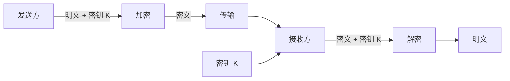
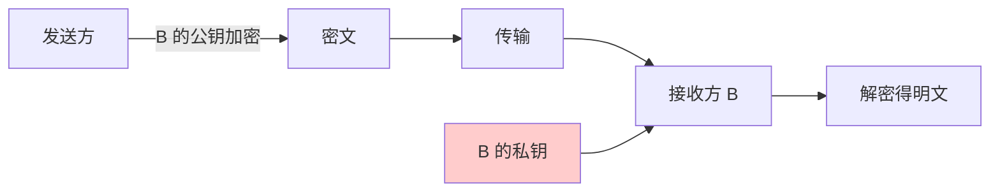
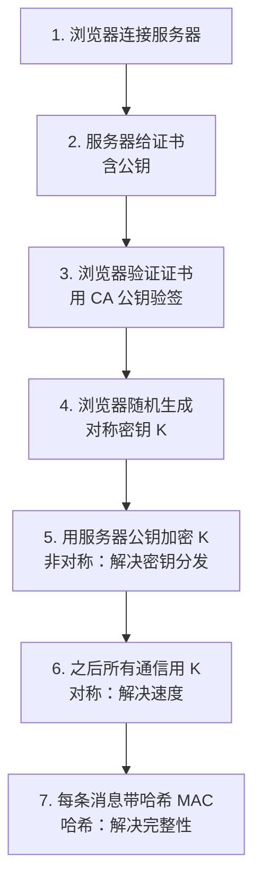
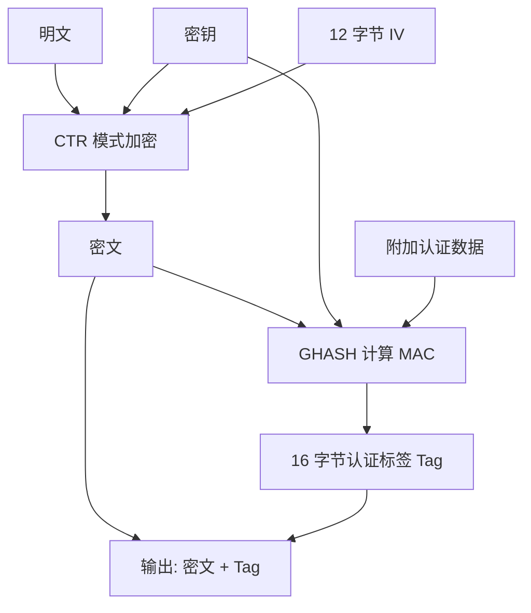
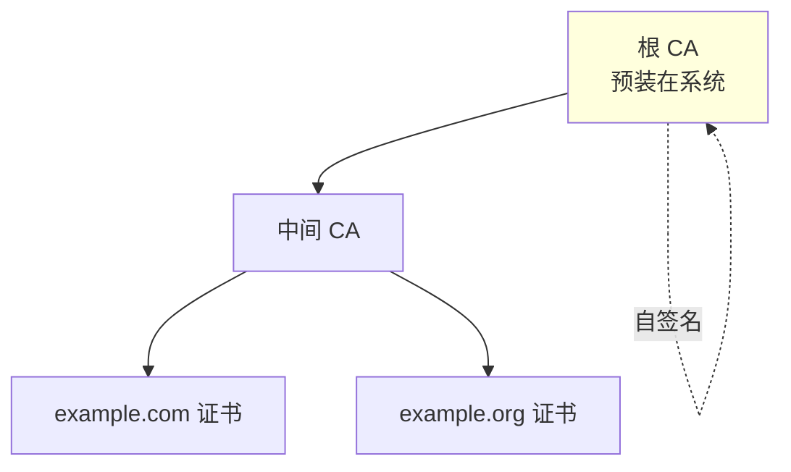
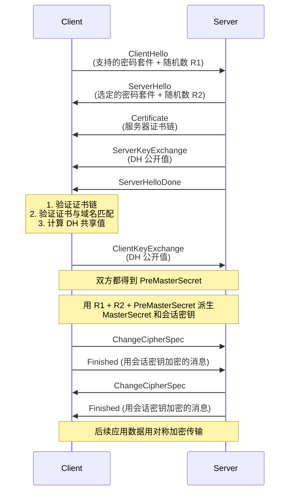
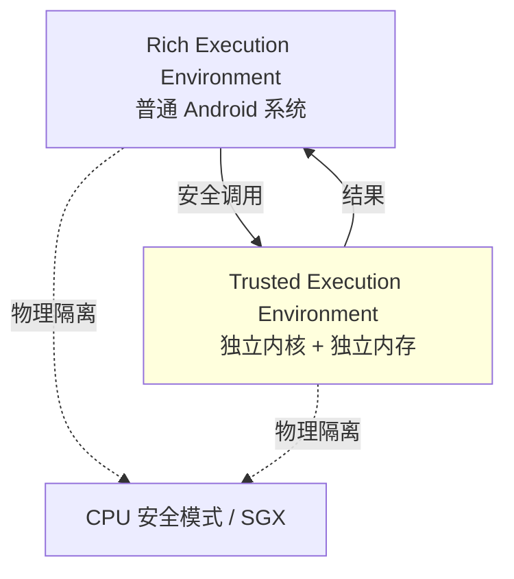
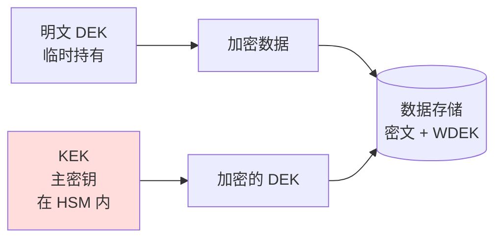

# 43.数据加密和解密

#### 目录介绍
- [00.一次密码被脱库事故说起](#00一次密码被脱库事故说起)
    - [0.1 凌晨三点的紧急电话](#01-凌晨三点的紧急电话)
    - [0.2 老板的灵魂三问](#02-老板的灵魂三问)
    - [0.3 用攻击者视角复盘](#03-用攻击者视角复盘)
    - [0.4 这次事故揭示了什么](#04-这次事故揭示了什么)
    - [0.5 五个层层递进的追问](#05-五个层层递进的追问)
    - [0.6 三层解药预演](#06-三层解药预演)
- [01.加密的本质与历史](#01加密的本质与历史)
    - [1.1 为什么需要加密](#11-为什么需要加密)
    - [1.2 从凯撒密码到现代密码学](#12-从凯撒密码到现代密码学)
    - [1.3 CIA 三角：机密性、完整性、认证性](#13-cia-三角机密性完整性认证性)
    - [1.4 Kerckhoffs 原则：算法公开，密钥保密](#14-kerckhoffs-原则算法公开密钥保密)
- [02.三大加密类别的设计哲学](#02三大加密类别的设计哲学)
    - [2.1 对称加密：快但难以分发](#21-对称加密快但难以分发)
    - [2.2 非对称加密：慢但能解决密钥分发](#22-非对称加密慢但能解决密钥分发)
    - [2.3 哈希函数：单向不可逆](#23-哈希函数单向不可逆)
    - [2.4 三件套的协同：HTTPS 的设计](#24-三件套的协同https-的设计)
- [03.哈希函数：从 MD5 到 SHA-3](#03哈希函数从-md5-到-sha-3)
    - [3.1 哈希函数的五大特性](#31-哈希函数的五大特性)
    - [3.2 MD5 的兴衰：王小云的破局](#32-md5-的兴衰王小云的破局)
    - [3.3 SHA 家族的演进](#33-sha-家族的演进)
    - [3.4 彩虹表攻击与"加盐"防御](#34-彩虹表攻击与加盐防御)
    - [3.5 密码哈希的正确姿势：bcrypt / Argon2](#35-密码哈希的正确姿势bcrypt--argon2)
- [04.对称加密：DES到AES与ChaCha20](#04对称加密des到aes与chacha20)
    - [4.1 DES 的兴衰：56 位密钥的悲剧](#41-des-的兴衰56-位密钥的悲剧)
    - [4.2 AES 的诞生：开放征集的胜利](#42-aes-的诞生开放征集的胜利)
    - [4.3 工作模式深入：ECB 为什么不能用](#43-工作模式深入ecb-为什么不能用)
    - [4.4 GCM 模式：加密 + 认证一体化](#44-gcm-模式加密--认证一体化)
    - [4.5 ChaCha20：移动端的新选择](#45-chacha20移动端的新选择)
- [05.非对称加密：RSA数学魔法](#05非对称加密rsa数学魔法)
    - [5.1 密钥分发难题：对称加密的死穴](#51-密钥分发难题对称加密的死穴)
    - [5.2 Diffie-Hellman：第一次密钥交换革命](#52-diffie-hellman第一次密钥交换革命)
    - [5.3 RSA 的数学根基：大整数分解](#53-rsa-的数学根基大整数分解)
    - [5.4 RSA 的实战陷阱](#54-rsa-的实战陷阱)
    - [5.5 ECC：用更短的密钥达到更高强度](#55-ecc用更短的密钥达到更高强度)
- [06.数字签名与证书体系](#06数字签名与证书体系)
    - [6.1 签名 vs 加密：方向相反的非对称用法](#61-签名-vs-加密方向相反的非对称用法)
    - [6.2 PKI 与证书链](#62-pki-与证书链)
    - [6.3 中间人攻击与证书钉扎](#63-中间人攻击与证书钉扎)
- [07.HTTPS：三件套的工业级组装](#07https三件套的工业级组装)
    - [7.1 TLS 握手的完整过程](#71-tls-握手的完整过程)
    - [7.2 为什么需要这么复杂](#72-为什么需要这么复杂)
    - [7.3 TLS 1.3 的简化与 0-RTT](#73-tls-13-的简化与-0-rtt)
- [08.国密算法：SM2 / SM3 / SM4](#08国密算法sm2--sm3--sm4)
    - [8.1 国密的由来与意义](#81-国密的由来与意义)
    - [8.2 SM2/SM3/SM4 与国际算法对照](#82-sm2sm3sm4-与国际算法对照)
    - [8.3 国密在 Java/Android 的工程实践](#83-国密在-javaandroid-的工程实践)
- [09.各端密钥安全存储](#09各端密钥安全存储)
    - [9.1 密钥存哪里：从硬编码到 KeyStore](#91-密钥存哪里从硬编码到-keystore)
    - [9.2 Android KeyStore 与 TEE](#92-android-keystore-与-tee)
    - [9.3 iOS Keychain 与 Secure Enclave](#93-ios-keychain-与-secure-enclave)
    - [9.4 服务端：HSM 与 KMS](#94-服务端hsm-与-kms)
- [10.经典陷阱与生产级反模式](#10经典陷阱与生产级反模式)
    - [10.1 陷阱一：硬编码密钥](#101-陷阱一硬编码密钥)
    - [10.2 陷阱二：用 ECB 模式](#102-陷阱二用-ecb-模式)
    - [10.3 陷阱三：IV 复用](#103-陷阱三iv-复用)
    - [10.4 陷阱四：用 MD5/SHA1 存密码](#104-陷阱四用-md5sha1-存密码)
    - [10.5 陷阱五：自己实现加密算法](#105-陷阱五自己实现加密算法)
    - [10.6 陷阱六：忽略证书校验](#106-陷阱六忽略证书校验)
    - [10.7 陷阱七：使用过时的随机数](#107-陷阱七使用过时的随机数)
- [11.量子计算威胁与后量子密码](#11量子计算威胁与后量子密码)
    - [11.1 Shor 算法的杀伤力](#111-shor-算法的杀伤力)
    - [11.2 后量子密码标准](#112-后量子密码标准)
- [12.一句话总结：加密设计哲学](#12一句话总结加密设计哲学)


## 00.一次密码被脱库事故说起

### 0.1 凌晨三点的紧急电话

某互联网公司的安全工程师小张在 2019 年某天凌晨三点被电话吵醒：

> "出大事了！黑客论坛上挂出一份我们的用户数据库，3000 万条用户名 + 密码 hash，正在公开兜售。"

小张冲到公司，登上服务器查日志——三天前一个员工误把数据库 root 密码提交到了公司开源仓库，被自动爬虫扫到，黑客拿到密码后导出了用户表。

老板冲进会议室：

> "数据库密码泄露我认了，是流程问题。但用户的密码不是已经加密了吗？黑客拿到加密的 hash 也没用啊？"

小张支支吾吾：

> "我们……用的是 MD5……加了点盐……"
> "但是……盐是固定的……所有用户用同一个盐……"

老板脸都绿了：

```
原代码：
   String hashed = md5("YIYI_SALT_2017" + password);
                       ↑ 全公司所有用户共享这一个固定盐
```

48 小时后，黑客论坛已经放出了 3000 万账户的明文密码。**根因是把"加密"当成"加防伪标签"**——加完就觉得安全了，根本不理解这串字符到底防住了谁、防不住谁。

### 0.2 老板的灵魂三问

**问题 1**：MD5 不是"不可逆"吗，黑客怎么"反推"出原始密码的？

```
小张：MD5 是单向函数，理论上不可逆。
老板：那他怎么解出来 3000 万个密码？
小张：……他没"反推"，他用的是"彩虹表"——
     提前算好所有常见密码的 MD5，反查就行。
老板：那加盐不是为了防彩虹表吗？
小张：是的，但我们加的是"固定盐"，黑客拿到盐后
     可以专门为我们这个盐生成一份彩虹表……
老板：……（沉默）
```

**问题 2**：为什么不直接用 AES 把密码"加密"，反正用户登录时也能解开比对？

```
小张：因为如果用可解密的算法，
     一旦数据库和"解密密钥"同时被偷，
     用户密码全部明文泄露。
     用 hash 至少黑客要"算"，要花时间。
老板：那为什么不用更难算的 hash？
小张：……我们当时图省事用了 MD5，没想这么多。
```

**问题 3**：业界标准答案是什么？

```
小张：bcrypt 或 Argon2。
     特点：
       1. 每个用户独立的随机盐
       2. 算一次 hash 故意要 100ms（让暴力破解慢一万倍）
       3. cost 因子可配置（硬件升级时可加大）
老板：为什么我们当年没用？
小张：因为开发觉得"MD5 够快、够简单"。
     ——他们把"密码 hash"当成"普通 hash"在用。
```

### 0.3 用攻击者视角复盘

把自己代入黑客拿到数据库后的工作流：

```
拿到数据库 → 看到 hash 是 32 位 hex（一眼 MD5）→ 小张笑了
   ↓
反查 hashes.com 在线彩虹表
   ↓
约 30% 用户的密码是"123456"、"qwerty"、"password"
   → 直接破解几百万账户
   ↓
对剩下的：
   提取所有 hash，发现盐都一样 = "YIYI_SALT_2017"
   ↓
租用 AWS GPU 集群，针对这个固定盐生成彩虹表
   单 H100 GPU：MD5 速度 ≈ 1 万亿次/秒
   8 位字母数字组合空间：62^8 ≈ 218 万亿
   → 几小时内基本算完
   ↓
98% 的常见密码在 24 小时内被破解
```

**对比：如果用了 bcrypt + 独立随机盐**

```
bcrypt 速度：故意慢，约 100 ms/次
H100 GPU：每秒最多 ~10 次（专用硬件 ~1 万次）
每个用户独立盐：彩虹表完全失效，必须一个一个暴力破

单用户破解 8 位密码：
   62^8 / 1万次/s = 218 万亿 / 1万 = 21.8 万亿秒 = 70 万年

→ 经济上不可行 → 攻击者放弃
```

**同样是"加盐 hash"，方案的细节决定了"半天破光"还是"70 万年"——这是工程师对加密"细节深度"的真实代价。**

### 0.4 这次事故揭示了什么

工程师对"加密"的直觉建立在**"加密 = 让数据看不懂"**的朴素心智模型上：

```
我以为：
  加密 = 数据从可读变不可读
  只要变得不可读，黑客就拿不到

实际：
  加密的安全性不取决于"算法看起来多复杂"
  而取决于：
    1. 算法在数学上是否还安全（MD5 早已不安全）
    2. 密钥/盐的分发与存储是否安全
    3. 算法的工作模式（ECB/CBC/GCM）选对了没
    4. 随机数源是否真随机
    5. 实现细节是否有侧信道泄露
  任何一环出问题，整个加密就形同虚设
```

**这个错位，本质上是"加密学概念"和"加密工程实践"之间的张力**：

| 视角 | 你看到的 | 实际发生的 |
|---|---|---|
| 教科书 | "AES 256 位 = 2^256 种可能 = 安全" | 数学层面 |
| 工程 | 调一行库就完事 | 模式选错就全暴露 |
| 攻击者 | "找最弱的一环下手" | 算法不动，绕过它 |

整个加密设计的核心矛盾就藏在这里：

> **"算法本身的强度"很重要，但"系统中最弱的那一环"才决定真实安全性。任何一处疏忽，都让前面所有努力归零。**

### 0.5 五个层层递进的追问

带着这次事故，整篇文章其实就是在回答下面五个递进的问题：

| 追问 | 答案章节 |
|---|---|
| 为什么需要加密？加密在解决什么物理问题？ | §01 |
| 三种加密（对称/非对称/哈希）各自解决什么子问题？ | §02 |
| 为什么 MD5 不安全？什么样的哈希适合存密码？ | §03 / §10.4 |
| 为什么要分对称和非对称？HTTPS 怎么把它们组合起来？ | §04 / §05 / §07 |
| 算法没问题，为什么我的系统还是被攻破？ | §10 工程陷阱 |

### 0.6 三层解药预演

后面会展开，这里先把三把"解药"清单列出来：

```
解药 1（选对算法）：
   存密码用 bcrypt/Argon2，对称加密用 AES-GCM 或 ChaCha20-Poly1305
   非对称用 ECC（256 位）替代 RSA-2048
   → 性能 + 安全双赢

解药 2（密钥安全存储）：
   不硬编码到代码、不放配置文件
   用平台 KeyStore（Android）、Keychain（iOS）、KMS（云端）
   → 即使应用被反编译，密钥不出 TEE/HSM

解药 3（拥抱标准协议）：
   不要自己组装"对称 + 非对称 + 哈希"
   直接用 TLS 1.3、Noise Protocol、libsodium
   → 把"工程陷阱"留给标准协议作者，自己只用 API
```

带着这次事故的"具体感"，进入正题——你将看到，**所有抽象的"对称/非对称/哈希"原理，最终都能落到这次脱库事故的根因图上**。

---

## 01.加密的本质与历史

### 1.1 为什么需要加密

要理解加密，先要理解**没有加密的网络是什么样**。这是后续所有设计的物理动机。

#### 网络通信的物理本质

互联网底层是 IP 包在公开链路上传输：

```
你的手机 ──→ WiFi 路由器 ──→ ISP 接入网 ──→ 骨干网 ──→ 数据中心
            │              │              │            │
            │              │              │            │
            可被嗅探       可被嗅探        可被嗅探      可被嗅探
            可被改包       可被改包        可被改包      可被改包
```

**网络中每一个节点都是潜在的攻击者**：
- 公共 WiFi：攻击者跟你坐同一个咖啡馆，开 Wireshark 直接看你的明文
- 路由器：被入侵的家用路由能改你访问的网页（注入广告）
- ISP：理论上能看到你所有 HTTP 流量
- 国家级网络：能截获跨境流量

**加密就是在不可信的链路上建立可信的通信。** 它的根本目的不是"让数据看起来乱"，而是**让中间任何环节即使拿到数据也无法读懂、也无法伪造**。

#### 加密要防的三类攻击者

| 攻击者类型 | 能力 | 防御目标 |
|---|---|---|
| **被动监听**（窃听） | 看流量但不改 | 机密性 |
| **主动篡改**（中间人） | 修改流量 | 完整性 + 认证性 |
| **离线破解** | 拿到密文事后慢慢算 | 算法强度 |

§0 的事故属于第三类——黑客拿到加密后的 hash，离线慢慢破。**对应的防御是"算得越慢越好"** ——这就是 bcrypt / Argon2 设计的初衷。

### 1.2 从凯撒密码到现代密码学

```
公元前 5 世纪    斯巴达密码棒（Scytale）—— 物理换位密码
                把羊皮纸缠在特定直径的木棒上写字，解开后字母错乱
                → 攻击者拿不到木棒就读不懂

公元前 1 世纪    凯撒密码 —— 字母替换（每个字母向后移 3 位）
                A→D, B→E, C→F...
                → 26 种可能，暴力破解轻松

1467 年         Alberti 密码盘 —— 多表替换
                → 大幅提升破解难度

1918 年         Enigma 密码机 —— 机械化多表替换 + 接线板
                德军二战核心通信
                → 图灵团队 1942 年破译，缩短二战

1949 年         Shannon《保密系统通信理论》
                → 密码学从"艺术"变成"数学学科"
                → 提出"完美保密"的数学定义

1976 年         Diffie-Hellman 密钥交换
                → 公钥密码学诞生
                → 解决了千年以来"密钥怎么送给对方"的问题

1977 年         RSA 算法
                → 第一个实用的非对称加密 + 数字签名

1991 年         MD5 公布
                → 16 字节哈希，长期作为标准

2001 年         AES 标准（取代 DES）
                → 至今仍是工业标准

2004 年         王小云团队找到 MD5 碰撞
                → MD5 退出安全用途

2013 年         斯诺登事件
                → 全球加密意识觉醒，HTTPS 普及

2018 年         TLS 1.3 标准化
                → 移除大量历史包袱，0-RTT 握手

2024 年         NIST 后量子密码标准（CRYSTALS-Kyber 等）
                → 应对量子计算机威胁
```

#### 历史给现代的启示

```
启示 1：所有"自创算法"最终都被破解
   斯巴达密码棒、凯撒密码、Enigma 都被破
   今天的"自研加密算法"99% 也撑不过专业攻击
   → 用经过同行评审的标准算法（NIST/ISO/RFC）

启示 2：算法长寿不等于永远安全
   MD5 用了 13 年才被破，DES 用了 22 年
   今天看着安全的算法，10-30 年后可能不安全
   → 系统必须有"算法可换"的能力（密码学敏捷性）

启示 3：进步靠"开放对抗"
   AES 是公开征集 + 全球密码学家攻击 5 年的产物
   闭门造车的算法（如俄罗斯 GOST 早期版本）问题多
   → 公开是安全的朋友，不是敌人
```

### 1.3 CIA三角：机密/完整/认证性

加密体系要实现的三个独立目标，称为 **CIA 三角**：

| 目标 | 英文 | 说明 | 对应技术 |
|---|---|---|---|
| 机密性 | **C**onfidentiality | 数据不被未授权读取 | 对称/非对称加密 |
| 完整性 | **I**ntegrity | 数据未被篡改 | 哈希 / MAC / 数字签名 |
| 认证性 | **A**uthentication | 确认数据来源真实 | 数字签名 / 证书 |

#### 三个目标的独立性

**只有机密性、没有完整性会怎样？**

```
你给银行发：转账 100 元 → 张三
   加密后："密文 X"

中间人虽然不知道内容，但可以"瞎改"：
   修改密文 X 的某些字节 → "密文 X'"

如果加密算法没有完整性保护：
   → 银行解密 X' 可能得到："转账 999 元 → 李四"（虽然攻击者不知道改成什么了）
   → 银行执行了一笔被破坏的指令
```

**这就是为什么纯 AES-CBC 不够用，必须 AES-GCM（加密 + 认证一体）**。

**只有完整性、没有认证性会怎样？**

```
你收到一份带哈希的报文："余额 100 元"，hash=abc...

中间人完全替换：
   报文："余额 0 元"，hash=def...

完整性校验通过（hash 和报文匹配）
但你不知道这是不是真银行发的
```

**所以需要数字签名——用银行的私钥签名 hash，攻击者无私钥无法伪造签名。**

### 1.4 Kerckhoffs原则：算法公开密钥保密

19 世纪荷兰密码学家 Auguste Kerckhoffs 提出：

> **"密码系统的安全性应当只依赖于密钥的保密性，而不依赖于算法的保密性。"**

#### 为什么这个原则反直觉但正确

直觉：算法越秘密越安全（"敌人不知道我怎么加密的"）。

现实：

```
算法保密的代价：
   1. 闭门造车 → 缺陷无法被同行发现
   2. 一旦泄露 → 整个系统崩溃，无法快速换算法
   3. 跨组织通信不可能（双方都得知道算法）

算法公开的红利：
   1. 全球密码学家审查 → 缺陷在部署前被发现
   2. 标准化 → 所有库、硬件加速都支持
   3. 密钥换了系统照常工作 → 灵活
```

#### 现实的反例与代价

```
反例 1：GSM 的 A5/1 算法（1987 年）
   秘密设计、秘密部署
   1999 年逆向后，被多种方式破解
   → 全球 GSM 通信几十年来不安全

反例 2：DVD 加密（CSS）
   秘密算法 + 弱 40 位密钥
   1999 年 DeCSS 工具发布，DVD 加密形同虚设

反例 3：很多企业自研"加密"算法
   通常 6 个月内被逆向
   → "obfuscation 不是 encryption"
```

#### 这一段的认知跃迁

| 表层认知 | 深层认知 |
|---|---|
| "加密 = 让数据看起来乱" | 加密的目的是在不可信链路上建立可信通信 |
| "算法越秘密越好" | Kerckhoffs 原则：算法公开，靠密钥保密 |
| "加密算法保护数据" | 加密只防三类不同攻击，每类要不同技术 |
| "加密了就是安全的" | 安全 = 算法 + 模式 + 密钥管理 + 实现，缺一不可 |


## 02.三大加密类别的设计哲学

### 2.1 对称加密：快但难以分发

#### 一句话定义

**加密和解密用同一把钥匙。**



#### 为什么对称加密快

对称加密的数学操作主要是：
- 异或（XOR）：CPU 单指令完成
- 字节替换（S-Box）：硬件查表
- 位移（Shift Rows）：CPU 单指令
- 矩阵混合（MixColumns）：少量乘法

这些操作都是**硬件原生支持**——Intel CPU 自 2010 年起内置 AES-NI 指令，单核每秒能加密 GB 级别数据。

```
现代 CPU AES-NI 性能：
   AES-128：约 5 GB/s 单核
   AES-256：约 4 GB/s 单核
   → 文件级加密几乎零开销
```

#### 对称加密的死穴：密钥分发

```
场景：A 想给 B 发加密邮件
   问题：A 怎么把密钥 K 安全地告诉 B？

   方案 1：邮件发 K → 攻击者一同看到 K → 凉
   方案 2：电话告诉 → 监听 → 凉
   方案 3：见面交换 → 不现实
```

**这是对称加密千年来的死穴**——直到 1976 年 Diffie-Hellman 解决（§5.2）。

### 2.2 非对称加密：慢但解决分发

#### 一句话定义

**两把钥匙，一公一私，互为锁与钥。**

- 公钥（Public Key）：公开发给所有人
- 私钥（Private Key）：自己秘密保管
- 数学性质：**用公钥加密的密文，只有私钥能解**；反之亦然



#### 神奇之处：公钥可以满世界飞

```
B 的公钥贴在网站首页：所有人都能用它加密给 B 的消息
B 的私钥锁在硬件里：只有 B 能解密

→ 任何人都能加密给 B，但只有 B 能读
→ 密钥分发问题被绕过：根本不需要"分发"私钥
```

#### 代价：奇慢

```
RSA-2048 加密：
   单次约 0.1ms（一次幂运算 mod 大数）
   每秒最多 1 万次

AES-128 加密：
   单核每秒 50 亿次（5GB/s ÷ 16 字节块）

→ RSA 比 AES 慢 50 万倍
```

**这就是为什么不能用 RSA 加密大文件**——光算就要几小时。

#### 实际工程方案：混合加密

```
A 给 B 发 1GB 文件：
   1. A 随机生成 AES 密钥 K（16 字节）
   2. A 用 B 的 RSA 公钥加密 K → 密文 K'（极小）
   3. A 用 K 加密 1GB 文件 → 密文 C（很快）
   4. 把 K' + C 一起发给 B
   
   B 解密：
   5. 用自己的 RSA 私钥解 K' → 拿到 K
   6. 用 K 解 C → 拿到文件

→ 用 RSA 解决"传 K"的问题
→ 用 AES 解决"传文件"的速度问题
→ HTTPS 就是这样组装的
```

### 2.3 哈希函数：单向不可逆

#### 一句话定义

**任意输入 → 固定长度输出，且不能从输出反推输入。**

```
输入："hello world"
SHA-256 →   b94d27b9934d3e08a52e52d7da7dabfac484efe37a5380ee9088f7ace2efcde9

输入："hello world!" （多了个感叹号）
SHA-256 →   7509e5bda0c762d2bac7f90d758b5b2263fa01ccbc542ab5e3df163be08e6ca9
                              ↑
                       完全不同（雪崩效应）
```

#### 哈希不是"加密"

```
误区：把哈希叫"加密"
   → 加密 = 可以解开
   → 哈希 = 不能解开

哈希更像"指纹"——
   每个数据有唯一指纹（理论上）
   从指纹反推数据极其困难
   两份不同数据有相同指纹的概率极低
```

#### 哈希的两大用途

```
用途 1：完整性校验
   下载软件后比对官方公布的 SHA-256
   → 防止下载过程中被篡改
   
用途 2：密码存储
   数据库存 hash，不存明文
   登录时算 hash 比对
   → 即使数据库泄露，明文密码不直接暴露
```

### 2.4 三件套协同：HTTPS设计

HTTPS（TLS）就是把"对称 + 非对称 + 哈希"组装成一个工业级协议：



**三件套各司其职**：

| 阶段 | 用什么 | 解决什么 |
|---|---|---|
| 验证服务器身份 | 数字签名（非对称） | 认证性 |
| 协商对称密钥 | 非对称加密 / DH | 密钥分发 |
| 传输数据 | 对称加密（AES） | 机密性 + 速度 |
| 防篡改 | MAC / GCM 标签 | 完整性 |

**§07 会展开 TLS 完整握手过程，这里先建立"三件套各做一件事"的整体观**。

#### 这一段的认知跃迁

| 表层认知 | 深层认知 |
|---|---|
| "选一个加密算法就行" | 实际系统都是"对称 + 非对称 + 哈希"组合 |
| "非对称加密更高级" | 非对称只解决"密钥分发"，速度奇慢，不能加密大数据 |
| "哈希就是加密的一种" | 哈希是单向函数，不能"解密"，用途不同 |
| "我自己组合就行" | 工业级组合（如 TLS）经过 30 年验证，不要重造 |


## 03.哈希函数：从 MD5 到 SHA-3

### 3.1 哈希函数的五大特性

一个"好的"密码学哈希函数必须满足以下五条：

| 特性 | 含义 | 数学表述 |
|---|---|---|
| **确定性** | 同一输入永远得同一输出 | f(x) 唯一 |
| **快速计算** | 计算 hash 必须高效 | O(n) 复杂度 |
| **抗原像攻击** | 已知 hash 反推 x 极难 | 给 h，找 x s.t. f(x)=h 难 |
| **抗第二原像** | 已知 x，找另一 x' 使 hash 相同极难 | 给 x，找 x'≠x s.t. f(x')=f(x) 难 |
| **抗碰撞** | 找到任意两个 x 和 x' 使 hash 相同极难 | 找 x≠x' s.t. f(x)=f(x') 难 |

#### 这五条为什么必要

**没有抗原像 → 用作密码存储就完蛋**：
```
存的 hash = abc123...
攻击者从 abc123 反推 → 得到原始密码
```

**没有抗第二原像 → 完整性校验失效**：
```
原文件 + 哈希 H1
攻击者构造另一份恶意文件，其哈希也是 H1
受害者下载替换文件，校验通过 → 中毒
```

**没有抗碰撞 → 数字签名失效**：
```
攻击者构造两份内容："转账 100" 和 "转账 100000"
两者哈希相同
让你签前者，他用签名套到后者上
→ 你"亲手"签了 10 万元转账
```

### 3.2 MD5 的兴衰：王小云的破局

#### MD5 的辉煌期（1991-2004）

```
1991：MD5 由 Ronald Rivest 设计
1995：成为 RFC 1321 标准
1995-2004：广泛用于密码存储、数字签名、文件校验
```

输出 128 位（16 字节），在 32 位机时代是合理的折中。

#### 王小云团队的攻击（2004）

```
2004 年 8 月，国际密码学会议 CRYPTO
王小云团队公布：
   找到 MD5 的两个不同输入，输出相同 hash
   
攻击的本质（差分密码分析）：
   MD5 内部 4 轮 + 64 步运算
   每步只引入 2 位的微小差异
   王团队发现一条特殊路径：
     差异在中间被精心抵消
     最终输出完全相同
   计算复杂度：2^39（普通 PC 一小时）
```

**这意味着 MD5 失去抗碰撞性**，但抗原像还相对较强。

#### MD5 的"半死不活"状态

```
还能用：
   ✅ 文件下载完整性校验（攻击者难以构造你下载的特定文件的碰撞）
   ✅ 非安全场景的去重（图片库判重）

已死透：
   ❌ 数字签名（碰撞攻击）
   ❌ 密码存储（彩虹表）
   ❌ HTTPS 证书（2008 已禁用）
```

#### 一个真实案例：Flame 病毒（2012）

```
攻击者利用 MD5 的弱点：
   1. 伪造一个微软证书
   2. 构造 MD5 碰撞，让伪证书的 MD5 = 真证书的 MD5
   3. Windows 系统验证证书时只检查 MD5
   4. 病毒成功冒充微软签名 → 大规模传播
   
影响：中东多国政府、能源企业被监控
   → 直接推动微软全面切换到 SHA-2
```

### 3.3 SHA 家族的演进

```
SHA-0  (1993)：NSA 设计，发布后立刻被撤回
SHA-1  (1995)：160 位输出，2017 Google 公布碰撞攻击 → 不再安全
SHA-2  (2001)：包括 SHA-224/256/384/512
              当前主流，至今未被破
SHA-3  (2015)：基于 Keccak 算法
              内部结构与 SHA-2 完全不同
              作为"备份"标准（万一 SHA-2 被破）
```

#### 为什么需要 SHA-3 作为备份

```
SHA-1 和 SHA-2 都基于 Merkle–Damgård 结构
   → 共享相同设计哲学
   → 一旦该结构被攻破，两者一起完蛋

SHA-3 用 Sponge 结构
   → 完全不同的设计哲学
   → 两个独立体系，不会一起倒
```

这是密码学的"鸡蛋分篮子"原则——**不要把所有标准都建立在同一个数学假设上**。

### 3.4 彩虹表攻击与"加盐"防御

#### 彩虹表是什么

预先计算大量"原文 → hash" 的对照表，攻击时反查：

```
原文                    MD5 hash
─────────────────────  ────────────────────────────────
123456                 e10adc3949ba59abbe56e057f20f883e
password               5f4dcc3b5aa765d61d8327deb882cf99
qwerty                 d8578edf8458ce06fbc5bb76a58c5ca4
admin                  21232f297a57a5a743894a0e4a801fc3
...（数十亿条）        ...
```

**实际彩虹表用"链式压缩"技术**，存储成本远低于"完整对照表"，但查询时间略增。开源彩虹表（rainbow tables）覆盖几亿到几十亿常见组合。

#### 加盐（Salt）的核心思想

在密码 hash 之前混入一段随机字符串：

```
没加盐：
   hash = MD5("123456")
   = e10adc3949ba59abbe56e057f20f883e
   → 彩虹表一查就破

加固定盐：
   hash = MD5("MY_APP_SALT" + "123456")
   = c8f1b6c3d2a4e5f6...
   → 旧彩虹表失效
   → 但攻击者拿到代码后，针对"MY_APP_SALT"重新生成彩虹表，依然有效
   → §0 事故的根因

加随机盐（每用户独立）：
   user1: hash = MD5("R7XKM9" + "123456") = ...
   user2: hash = MD5("F3NPL2" + "123456") = ...
   → 即使密码相同，hash 完全不同
   → 攻击者要为每个盐独立生成彩虹表
   → 经济上不可行
```

#### 加盐的实施细节

```
盐的长度：至少 16 字节（128 位）
   太短的盐空间小，可能重复
   
盐的来源：CSPRNG（密码学安全随机数）
   不能用 Math.random()
   要用 SecureRandom / /dev/urandom
   
盐的存储：和 hash 一起存
   不需要保密——盐本身就是公开的
   关键是"每用户独立 + 真随机 + 足够长"
```

### 3.5 密码哈希姿势：bcrypt/Argon2

#### 普通 hash + 盐还不够

即使加了独立随机盐，攻击者拿到一个用户的盐和 hash，依然可以：

```
针对该用户：
   for password in candidate_passwords:
       if MD5(salt + password) == hash:
           found!

MD5 速度：单 GPU 每秒 1 万亿次
8 位密码空间：62^8 ≈ 218 万亿
→ 一台 GPU 几小时破解一个用户
```

**根本问题：通用 hash 是为"快"而设计，但密码 hash 需要"慢"。**

#### bcrypt 的设计哲学

bcrypt 由 Niels Provos 和 David Mazières 在 1999 年设计，灵感来自 Blowfish：

```java
// 用法
String hashed = BCrypt.hashpw(password, BCrypt.gensalt(12));
//                                              ↑
//                                        cost 因子 = 12
//                                        意味着内部循环 2^12 次

boolean match = BCrypt.checkpw(password, hashed);
```

**bcrypt 的核心机制**：

```
1. 内部循环 2^cost 次（cost=12 → 4096 次循环）
   → 一次 hash 计算约 250ms（普通 CPU）
   → 比 MD5 慢 25 万倍

2. 每个 hash 独立随机盐（自动）
   → 彩虹表彻底失效

3. cost 可调
   → 硬件 10 年快了 1000 倍 → cost+10 → 速度持平
   → 系统不需要改密码 hash 算法，只升 cost

4. 输出格式自描述
   $2b$12$N9qo8uLOickgx2ZMRZoMye...
   ↑    ↑   ↑                    ↑
   版本 cost  盐(22字节)          hash(31字节)
   → 验证时知道用什么参数算
```

#### Argon2：更现代的密码 hash

Argon2 是 2015 年密码哈希竞赛（PHC）冠军：

```
Argon2 三个变种：
   Argon2d：抗 GPU 破解
   Argon2i：抗侧信道
   Argon2id：兼顾，推荐

参数：
   - 时间成本（迭代数）
   - 内存成本（占用 MB）
   - 并行度

特点：
   - 占用大量内存 → GPU 破解优势消失
   - GPU 内存少且贵 → 经济上不划算
```

#### 选哪个？

| 场景 | 推荐 |
|---|---|
| 老项目 / 无法升级 | bcrypt |
| 新项目 | Argon2id |
| 嵌入式 / 内存受限 | bcrypt |
| 高安全要求 | Argon2id（参数：64 MB 内存，3 次迭代） |

#### 这一段的认知跃迁

| 表层认知 | 深层认知 |
|---|---|
| "MD5 不可逆，所以安全" | MD5 已被王小云团队找到碰撞，且彩虹表泛滥 |
| "加盐就安全" | 固定盐无效，必须每用户独立随机盐 |
| "随机盐 + SHA-256 万事大吉" | SHA-256 太快，要用 bcrypt/Argon2 故意慢下来 |
| "通用 hash 和密码 hash 一回事" | 通用 hash 求快，密码 hash 求慢，目标相反 |


## 04.对称加密：DES到AES与ChaCha20

### 4.1 DES兴衰：56位密钥悲剧

#### DES 的辉煌（1977-1998）

```
1973：NSA 招标新加密标准
1977：IBM 提交的 Lucifer（删减后）成为 DES 标准
      密钥 56 位（NSA 砍了 8 位，至今争议）
      分组 64 位，16 轮 Feistel 网络
1977-1990s：全球银行、政府、企业广泛使用
```

#### 56 位密钥的死亡

```
1998：EFF 花 25 万美元造了一台专用机器 Deep Crack
      56 小时暴力破解 DES
      
1999：Deep Crack + distributed.net 联合
      22 小时破解 DES
      
2007：FPGA 集群破解时间降到 6.4 天（民用）
      → DES 退出历史舞台
```

**根因**：56 位密钥空间 = 2^56 ≈ 7.2 × 10^16 种可能。摩尔定律下硬件成本指数下降，1977 年算不动的，1998 年已经能算。

#### 3DES：续命二十年的折中

3DES 用三个 56 位密钥连续加密三次：

```
C = E(K3, D(K2, E(K1, P)))

为什么是 E-D-E 不是 E-E-E：
   E-D-E 模式下，K1=K2=K3 时退化为单 DES
   → 兼容老系统
```

3DES 有效密钥强度 112 位（meet-in-the-middle 攻击让 168 位降到 112 位）。

**3DES 也已退役**：
- 2017 年发现 SWEET32 攻击（生日攻击）
- 64 位分组在大流量场景下不安全
- 当前 NIST 推荐：2023 年后停止新使用，2030 年完全废弃

### 4.2 AES诞生：开放征集胜利

#### NIST 的开放征集（1997-2001）

```
1997：NIST 公开征集 DES 的继任者
1998：15 个候选算法提交
2000：经过两年全球密码学家分析，选出 5 个决赛
      MARS、RC6、Rijndael、Serpent、Twofish
2001：Rijndael（比利时人 Joan Daemen + Vincent Rijmen 设计）
      因综合性能 + 简洁性胜出，命名为 AES
```

**这次征集是密码学史上最重要的"开放对抗"**——所有候选算法被全球攻击 4 年，没倒下的 Rijndael 才被信任。

#### AES 的核心结构

```
分组：128 位（不像 DES 的 64 位，避免 SWEET32 类攻击）
密钥：128 / 192 / 256 位
轮数：10 / 12 / 14 轮

每轮四步：
   1. SubBytes：字节替换（S-Box）
   2. ShiftRows：行循环移位
   3. MixColumns：列混合
   4. AddRoundKey：与轮密钥异或
```

每一步都设计得**易于硬件实现 + 数学上有抗差分/线性分析的保证**。

#### AES-NI：硬件层面的"加密免费"

```
2010：Intel 推出 AES-NI 指令集
       AESENC / AESENCLAST / AESDEC 等单指令完成一轮
       
性能对比：
   软件实现 AES：约 100 MB/s
   AES-NI：约 5 GB/s（50 倍）
   
影响：
   全盘加密、HTTPS、磁盘加密 → 几乎零开销
   → 加密变成"必选项"而不是"性能权衡"
```

**这是为什么 2010 年后所有数据库、操作系统都默认开启加密**——硬件让"加密 vs 不加密"的性能差消失了。

### 4.3 工作模式深入：ECB为何不能用

AES 本身只能加密 16 字节的"一块"。要加密任意长度数据，需要"工作模式"。

#### ECB（Electronic Codebook）：最简单也最危险

```
明文：分成 16 字节块 P1, P2, P3...
密文：C1 = AES(K, P1), C2 = AES(K, P2), C3 = AES(K, P3)...
```

#### ECB 的致命缺陷：保留模式

```
原图（黑白企鹅图片，逐像素加密）
   ↓ AES-ECB
"加密后"图：还能看出企鹅轮廓！

为什么：图中相同颜色区域 → 相同 16 字节明文块 → 相同密文块
        密文图保留了原图的"形状信息"
```

**这就是著名的"ECB 企鹅图"实验**——直观证明 ECB 即使密钥安全也不保密。

```
现实场景：
   加密一份英文文档
   "the the the the" 这种重复短语 → 重复密文块
   攻击者通过频率分析推测内容
```

#### CBC（Cipher Block Chaining）：链式依赖

```
C1 = AES(K, P1 ⊕ IV)
C2 = AES(K, P2 ⊕ C1)
C3 = AES(K, P3 ⊕ C2)
...

每块加密前先与前一块密文异或
→ 相同明文 → 不同密文（因为前一块密文不同）
→ 解决了 ECB 的模式保留问题
```

**IV（初始化向量）**：
- 必须随机
- 不需要保密（和密文一起传）
- 但**不能复用**（同一密钥下，相同 IV + 相同明文 = 相同密文）

#### CBC 的问题：填充提示攻击（Padding Oracle）

CBC 需要把明文填充到 16 字节倍数。如果服务端在解密失败时返回不同错误（"填充错误" vs "MAC 错误"），攻击者可以：

```
反复发送修改后的密文
观察服务端响应
逐字节恢复明文
→ 1.6 万次请求恢复 1 字节明文
→ 完全不需要密钥
```

**真实案例**：
- 2010 ASP.NET 漏洞（影响数百万网站）
- 2014 POODLE 攻击（SSL 3.0 完蛋）
- 2016 BEAST 攻击

**这就是为什么不要再用 CBC——直接用 GCM**。

### 4.4 GCM模式：加密+认证一体化

#### GCM 的核心思想

GCM = CTR + GHASH：
- CTR：把分组密码变流密码（加密快）
- GHASH：基于 Galois 域的 MAC（认证）



#### 为什么 GCM 是当前最佳

```
1. 加密 + 认证一次完成
   → 没有 CBC 的填充提示攻击
   → 解密时如果 Tag 校验失败，直接拒绝
   
2. CTR 模式可并行
   → 多核 CPU 加速
   → 每块独立加密，可以乱序解密
   
3. 硬件加速
   AES-NI + PCLMULQDQ 指令直接支持
   → 性能比 CBC 还快
   
4. 标准化
   NIST SP 800-38D
   IETF RFC 5288
   广泛部署在 TLS 1.2+ / SSH / IPsec
```

#### GCM 的雷区：IV 不能复用

```
GCM 数学：使用 IV 推导计数器
如果同一密钥下两次用相同 IV：
   → CTR 流相同
   → 两份密文 XOR = 两份明文 XOR（密钥消失）
   → 攻击者从两份密文异或推测明文
   → "Forbidden attack"，2016 年公开

防御：
   - 使用 12 字节随机 IV（96 位足够分散）
   - 或使用计数器型 IV（不要重复）
   - 单密钥下加密次数 < 2^32（10 亿次后换密钥）
```

#### Java AES-GCM 完整示例

```java
import javax.crypto.Cipher;
import javax.crypto.SecretKey;
import javax.crypto.spec.GCMParameterSpec;
import java.security.SecureRandom;

public class AESGCMUtil {
    private static final int GCM_TAG_LENGTH = 128;  // 16 字节
    private static final int GCM_IV_LENGTH = 12;    // 12 字节

    public static byte[] encrypt(byte[] plaintext, SecretKey key) throws Exception {
        // 1. 生成随机 IV
        byte[] iv = new byte[GCM_IV_LENGTH];
        new SecureRandom().nextBytes(iv);

        // 2. 初始化 Cipher
        Cipher cipher = Cipher.getInstance("AES/GCM/NoPadding");
        cipher.init(Cipher.ENCRYPT_MODE, key, new GCMParameterSpec(GCM_TAG_LENGTH, iv));

        // 3. 加密（密文 + Tag 自动拼接在 doFinal 输出）
        byte[] ciphertext = cipher.doFinal(plaintext);

        // 4. 输出格式：IV || (密文 + Tag)
        byte[] result = new byte[iv.length + ciphertext.length];
        System.arraycopy(iv, 0, result, 0, iv.length);
        System.arraycopy(ciphertext, 0, result, iv.length, ciphertext.length);
        return result;
    }

    public static byte[] decrypt(byte[] data, SecretKey key) throws Exception {
        // 1. 拆出 IV
        byte[] iv = new byte[GCM_IV_LENGTH];
        System.arraycopy(data, 0, iv, 0, GCM_IV_LENGTH);

        // 2. 拆出 (密文 + Tag)
        byte[] ciphertext = new byte[data.length - GCM_IV_LENGTH];
        System.arraycopy(data, GCM_IV_LENGTH, ciphertext, 0, ciphertext.length);

        // 3. 解密 + 校验 Tag（失败抛 AEADBadTagException）
        Cipher cipher = Cipher.getInstance("AES/GCM/NoPadding");
        cipher.init(Cipher.DECRYPT_MODE, key, new GCMParameterSpec(GCM_TAG_LENGTH, iv));
        return cipher.doFinal(ciphertext);
    }
}
```

### 4.5 ChaCha20：移动端的新选择

#### 为什么要 ChaCha20

```
移动设备（早期 ARM）：
   没有 AES-NI 硬件加速
   软件实现 AES 慢且耗电
   
ChaCha20（Daniel Bernstein 设计，2008）：
   纯 ARX 操作（加 + 旋转 + 异或）
   ARM Cortex-A53 上比软件 AES 快 3 倍
   抗时序攻击更强
```

#### ChaCha20-Poly1305：Google 推动的标准

```
2014 年，Google 在 Android + Chrome 中推广 ChaCha20-Poly1305
2015 年，IETF RFC 7539
2018 年，TLS 1.3 默认套件之一

ChaCha20：流密码
Poly1305：MAC（类似 GCM 中的 GHASH）
组合后：与 AES-GCM 同等地位的 AEAD
```

#### 选 AES 还是 ChaCha20

| 场景 | 推荐 |
|---|---|
| 服务端 / x86 桌面 | AES-GCM（AES-NI 加速） |
| 老 ARM 设备 / 嵌入式 | ChaCha20-Poly1305 |
| TLS 1.3 客户端 | 让浏览器自动选 |
| 跨平台库 | libsodium 默认 ChaCha20 |

#### 这一段的认知跃迁

| 表层认知 | 深层认知 |
|---|---|
| "AES 就是 AES" | AES 必须配工作模式才能用，模式选错就完蛋 |
| "ECB 加密了应该够用" | ECB 保留明文模式，著名"企鹅图"反例 |
| "CBC 是经典模式" | CBC 易受填充提示攻击，多次造成大规模漏洞 |
| "加密就行，认证另说" | 必须用 AEAD（GCM/Poly1305），加密 + 认证一体 |


## 05.非对称加密：RSA数学魔法

### 5.1 密钥分发难题：对称死穴

#### 千年未决的问题

```
公元前 100 年：凯撒怎么把密钥告诉前线将军？
   → 派可信信使，但信使被抓就完蛋

二战 Enigma：每月发新密钥本到所有 U 艇
   → 一艘 U 艇被俘 → 整月密码本暴露

冷战 苏联谍报：用一次一密 + 物理交付密钥本
   → 极度繁琐，任何泄露代价极大
```

**对称加密的致命循环**：要安全通信先有共享密钥 → 共享密钥需要安全通信。**这是个鸡生蛋问题。**

### 5.2 Diffie-Hellman：密钥交换革命

#### 1976 年的爆炸性论文

Whitfield Diffie 和 Martin Hellman 发表《New Directions in Cryptography》——人类第一次知道："**两个陌生人在公开信道上对话，可以建立只有他们俩知道的共享密钥**"。

#### DH 的精巧构造

```
公开参数：大素数 p、生成元 g

Alice 的操作：
   1. 选随机 a（保密）
   2. 计算 A = g^a mod p
   3. 把 A 发给 Bob（公开）

Bob 的操作：
   1. 选随机 b（保密）
   2. 计算 B = g^b mod p
   3. 把 B 发给 Alice（公开）

共享密钥：
   Alice 算：B^a mod p = (g^b)^a = g^(ab) mod p
   Bob 算：  A^b mod p = (g^a)^b = g^(ab) mod p
   
→ 两人得到同一个数 g^(ab) mod p，作为共享密钥
```

#### 为什么攻击者算不出

```
攻击者看到的：g, p, A=g^a, B=g^b
攻击者要算的：g^(ab)

数学难题（离散对数问题）：
   给 g 和 g^a，反推 a 极其困难
   2048 位素数下，宇宙寿命都算不完
   
→ 攻击者拿到 A 也提取不出 a
→ 即使把 A 和 B 都拿到，也凑不出 g^(ab)
```

#### DH 的局限：易受中间人攻击

```
原始 DH：
   Alice → Mallory → Bob
   Mallory 冒充 Bob 与 Alice 协商一套密钥
   Mallory 冒充 Alice 与 Bob 协商另一套密钥
   两边解密 + 重新加密转发
   → 双方以为是直接通信，实际全被监听
```

**解决方案**：身份认证（用证书）+ DH。这就是 §07 TLS 的做法。

### 5.3 RSA数学根基：大整数分解

#### RSA 的诞生（1977）

MIT 的 Rivest、Shamir、Adleman 三人受 DH 论文启发，1977 年发明 RSA：

```
RSA 的数学难题：
   计算 p × q = N（容易，几纳秒）
   分解 N → p 和 q（极难，2048 位 N 需要几亿年）
```

#### RSA 的具体构造

**密钥生成**：

```
1. 选两个大素数 p、q（各 1024 位）
2. 计算 N = p × q（2048 位）
3. 计算 φ(N) = (p-1)(q-1)（欧拉函数）
4. 选公钥指数 e，常用 65537（计算快）
5. 计算私钥指数 d，使 e × d ≡ 1 (mod φ(N))

公钥：(N, e)
私钥：(N, d) 或 (p, q, d)
```

**加密**：`C = M^e mod N`

**解密**：`M = C^d mod N`

#### 为什么解密能还原明文

数学上的精妙：

```
费马小定理 + 欧拉定理 推导：
   M^(e·d) ≡ M (mod N)
   
所以：
   C^d = (M^e)^d = M^(e·d) ≡ M (mod N)
   
→ 用 d 可以还原 M，但要算 d 必须知道 φ(N)
→ 算 φ(N) 必须知道 p、q
→ 知道 p、q 必须分解 N
→ 分解 N 极难
→ 私钥安全
```

#### RSA 真实例子（教学规模）

```
取 p = 11, q = 13
N = 143
φ(N) = 10 × 12 = 120

选 e = 7（gcd(7, 120) = 1）
算 d = 103（因为 7 × 103 = 721 = 6 × 120 + 1）

明文 M = 9
加密：C = 9^7 mod 143 = 48
解密：48^103 mod 143 = 9 ✓

→ 工业级 RSA 的 p, q 各有 1024 位（约 308 位十进制数字）
   分解 2048 位的 N 是当前最强超算的极限挑战
```

### 5.4 RSA 的实战陷阱

#### 陷阱 1：密钥太短

```
2009：768 位 RSA 被分解（学术团队 2 年）
2020：829 位 RSA 被分解
当前：1024 位 RSA 已被认为不安全（NSA 推断）
推荐：2048 位（民用）/ 3072 位（高安全）/ 4096 位（长期）
```

#### 陷阱 2：直接用 RSA 加密大数据

```
RSA-2048 单次加密上限：约 245 字节
加密 1KB 文件需要 5 块
慢得离谱（每块 0.1 ms × 5 = 0.5 ms）
而 AES 加密 1KB 不到 1 微秒

→ 永远不要直接用 RSA 加密数据
→ 用 RSA 加密 AES 密钥，用 AES 加密数据（混合加密）
```

#### 陷阱 3：填充模式选错

```
教科书 RSA：M^e mod N（直接用 M，叫"无填充"）
   → 完全不安全
   → 相同 M 永远产生相同 C
   → 攻击者可暴力试明文

PKCS#1 v1.5 填充：广泛使用，但 1998 年被发现 Bleichenbacher 攻击
OAEP 填充：当前推荐
   随机化 + Hash + Mask
   语义安全 + 选择密文安全
```

```java
// 错误：教科书 RSA
Cipher cipher = Cipher.getInstance("RSA/ECB/NoPadding");

// 不推荐：PKCS#1 v1.5
Cipher cipher = Cipher.getInstance("RSA/ECB/PKCS1Padding");

// 推荐：OAEP
Cipher cipher = Cipher.getInstance("RSA/ECB/OAEPWithSHA-256AndMGF1Padding");
```

#### 陷阱 4：用同一密钥既加密又签名

```
理论上 RSA 公钥可加密、私钥可解密
也可以反过来：私钥加密（签名）、公钥解密（验签）

陷阱：用同一密钥对同时做这两件事
   → 攻击者构造特殊明文要你"签"
   → 实际是要你"解密"一段密文
   → 私钥变相泄露

最佳实践：
   加密用一对密钥
   签名用另一对密钥
   两者不混用
```

### 5.5 ECC：更短密钥达更高强度

#### ECC 的核心优势

```
密钥强度对比：
   RSA-2048    ≈ ECC-256
   RSA-3072    ≈ ECC-384
   RSA-15360   ≈ ECC-512

→ ECC 用 1/8 的密钥长度达到同等安全
→ 计算快 5-15 倍
→ 网络传输的密钥/签名小得多
→ 移动设备首选
```

#### ECC 的数学基础

```
椭圆曲线方程：y² = x³ + ax + b
在椭圆曲线上定义"加法"运算
难题：椭圆曲线离散对数问题（ECDLP）

给曲线上的点 P 和 Q = kP
反推 k 极其困难
（其中 kP 表示 P 自加 k 次）
```

#### 主流椭圆曲线

```
P-256（NIST）：
   - 256 位密钥
   - 美国政府推荐
   - 移动 / TLS 1.3 主流

Curve25519（Daniel Bernstein 设计）：
   - 256 位密钥
   - 安全性更可证、抗侧信道更强
   - Signal、WireGuard、SSH 现代版默认

secp256k1：
   - 比特币使用
   - 256 位
```

#### ECDSA：椭圆曲线版本的数字签名

```java
// Java ECDSA 示例
KeyPairGenerator kpg = KeyPairGenerator.getInstance("EC");
kpg.initialize(new ECGenParameterSpec("secp256r1"));
KeyPair pair = kpg.generateKeyPair();

// 签名
Signature sig = Signature.getInstance("SHA256withECDSA");
sig.initSign(pair.getPrivate());
sig.update(message);
byte[] signature = sig.sign();   // 约 64 字节，比 RSA-2048 的 256 字节小 4 倍

// 验签
sig.initVerify(pair.getPublic());
sig.update(message);
boolean valid = sig.verify(signature);
```

#### 这一段的认知跃迁

| 表层认知 | 深层认知 |
|---|---|
| "RSA 加密就行" | RSA 不能加密大数据，必须配对称加密混合 |
| "密钥长度越长越好" | 太长性能差，2048 RSA / 256 ECC 是当前甜点 |
| "RSA 比 ECC 好" | ECC 同等安全下密钥小 8 倍、速度快几倍 |
| "用一对密钥所有场景" | 加密、签名要分开密钥对，避免互相损害 |


## 06.数字签名与证书体系

### 6.1 签名vs加密：反向非对称用法

#### 加密的方向

```
A 给 B 发加密消息：
   用 B 的【公钥】加密
   只有 B 的【私钥】能解
   
目的：机密性（只有 B 能读）
```

#### 签名的方向

```
A 给所有人发签名消息：
   用 A 的【私钥】签名
   所有人用 A 的【公钥】验签
   
目的：认证性（证明确实是 A 发的）+ 完整性（消息没被改）
```

**关键区别**：方向相反。加密"只有目标能读"，签名"所有人都能验"。

#### 签名的实施细节

```
原始想法：直接用私钥"加密"整个消息
   → 慢得离谱（消息可能 GB 级）
   → 输出是密文，验证还要解密
   
实际做法：
   1. 计算消息的哈希 H = SHA256(message)
   2. 用私钥"加密"哈希 → 签名 S
   3. 把 (message, S) 一起发出
   
验签：
   4. 用公钥"解密" S → H'
   5. 自己算 H = SHA256(message)
   6. 比较 H == H'
   
→ 哈希很快（GB/s）
→ 签名只算一次小哈希
→ 任何人都可验证（用公钥）
```

### 6.2 PKI 与证书链

#### 单纯的公钥不够

```
B 在网站上贴一个公钥："这是我的公钥"
A 用它加密发给 B

问题：A 怎么知道这真是 B 的公钥？
   攻击者可以挂自己的公钥，冒充 B
   
→ 公钥需要"身份背书"
→ PKI（Public Key Infrastructure）应运而生
```

#### 证书：公钥 + 身份 + CA 签名

```
证书内容（X.509 标准）：
   - Subject：身份信息（域名、组织名）
   - Public Key：公钥
   - Issuer：签发者（CA）
   - Validity：有效期
   - Signature：CA 用自己私钥签名上面所有内容

→ 证书 = "权威机构（CA）签名认可的'身份+公钥'绑定"
```

#### 证书链：信任传递

```
你的浏览器信任根 CA（如 DigiCert、Let's Encrypt）
   → 这些根 CA 的公钥预装在系统/浏览器
   
访问 example.com：
   ① 服务器返回 example.com 证书（中间 CA 签发）
   ② 服务器返回中间 CA 证书（根 CA 签发）
   
浏览器验证：
   ③ 用预装的根 CA 公钥验证中间 CA 证书签名 → 信任中间 CA
   ④ 用中间 CA 公钥验证 example.com 证书签名 → 信任 example.com
   ⑤ 用 example.com 公钥进行 TLS 握手
```



#### CA 的责任与脆弱性

```
CA 的职责：
   1. 验证申请者真实拥有域名（域名所有权挑战）
   2. 签发证书
   3. 维护吊销列表（CRL）
   4. 提供 OCSP 服务（实时查询是否吊销）

CA 一旦被攻破：
   2011：DigiNotar 被入侵 → 大规模 google.com 假证书 → 该 CA 被全球浏览器移除
   2014：CNNIC 被发现签发 google.com 假证书 → 部分浏览器移除
   
→ CA 是 Web 信任体系的"单点风险"
```

### 6.3 中间人攻击与证书钉扎

#### 经典 MITM 流程

```
原本：
   App → HTTPS → server.com

被中间人代理：
   App → HTTPS → 攻击者 → HTTPS → server.com
                  ↑
              代理拥有自己的证书
              如果 App 信任这个证书，全部明文暴露
```

#### 为什么 MITM 还能成功

```
情况 1：用户被诱导安装恶意根证书
   公司 MDM 强制安装、伪造的"公共 WiFi 登录页"
   
情况 2：CA 被攻破或叛变
   即使你只信任正版 CA，被入侵的 CA 也能签发假证书
   
情况 3：开发者关闭证书校验
   "测试环境用 trustAllCerts，上线忘改" → 用户全裸奔
```

#### 证书钉扎（Certificate Pinning）

App 在代码里硬编码服务器的证书或公钥指纹：

```java
// OkHttp 证书钉扎示例
CertificatePinner pinner = new CertificatePinner.Builder()
    .add("api.example.com",
         "sha256/AAAAAAAAAAAAAAAAAAAAAAAAAAAAAAAAAAAAAAAAAAAAA=")
    .build();

OkHttpClient client = new OkHttpClient.Builder()
    .certificatePinner(pinner)
    .build();
```

**钉扎的作用**：

```
即使整个 PKI 体系沦陷
即使根 CA 给攻击者签发了假证书
App 还会校验"指纹是否匹配"
→ MITM 即使有"合法"假证书也无法成功
```

#### 钉扎的代价

```
1. 证书过期前必须发版换钉扎
   → 密钥轮换变成发版风险

2. App 一旦发出去，钉扎无法远程更新
   → 只能等用户升级
   → 老版本用户可能被永久锁死在旧证书

3. 应急方案：钉公钥而不是钉证书
   → 证书可以续签，公钥不变
   → 钉扎更耐久
```


## 07.HTTPS：三件套的工业级组装

### 7.1 TLS 握手的完整过程

#### TLS 1.2 握手（经典版本）



### 7.2 为什么需要这么复杂

每个步骤都对应一个安全目标：

| 步骤 | 解决问题 | 不做的代价 |
|---|---|---|
| ClientHello / ServerHello 协商套件 | 算法可降级、可升级 | 老客户端连不上新服务器 |
| 服务器证书 | 认证服务器身份 | 被中间人冒充服务器 |
| 验证证书链 | 信任传递 | 假证书畅通无阻 |
| DH 密钥交换 | 前向安全 | 私钥泄露 → 历史流量全暴露 |
| Random R1/R2 | 防重放 | 攻击者重放旧握手包 |
| Finished 消息 | 完整性确认 | 中间人篡改握手参数不被发现 |

#### 前向安全（Forward Secrecy）的关键

```
没有 DH 的版本：
   用 RSA 公钥加密 PreMasterSecret 发给服务器
   → 5 年后服务器私钥泄露
   → 攻击者翻出 5 年前抓的流量
   → 用泄露的私钥解密所有历史会话
   → 5 年的通信全部明文暴露

有 DH 的版本：
   每次会话用临时 DH 密钥
   会话结束后丢弃
   → 即使长期私钥泄露
   → 历史流量也无法解密
   → "前向安全"成立
```

### 7.3 TLS 1.3 的简化与 0-RTT

#### TLS 1.3 的精简（2018 标准化）

```
TLS 1.2：完整握手 2-RTT（两轮往返）
TLS 1.3：完整握手 1-RTT
        恢复会话 0-RTT（无往返直接发数据）

主要改进：
   1. 把"协商参数"和"密钥交换"合并到一轮
   2. 强制 Forward Secrecy（移除 RSA 密钥交换）
   3. 移除已知不安全的密码套件（CBC、MD5、SHA-1、RC4）
   4. AEAD 强制（GCM 或 ChaCha20-Poly1305）
   5. 0-RTT 模式（重连快如 HTTP/2）
```

#### 0-RTT 的代价

```
优势：
   重连服务器时直接发数据
   省掉一轮 RTT（移动网络下省 100-300 ms）

代价：
   0-RTT 数据可能被重放
   → 攻击者抓包后重发同一份请求
   → 服务端可能执行两次（如下单）
   
解决：
   仅对幂等请求开启 0-RTT
   (GET /api/article/123 → 重放无害)
   (POST /api/order → 不开 0-RTT)
```


## 08.国密算法：SM2 / SM3 / SM4

### 8.1 国密的由来与意义

```
2010 年前后，中国开始推动自主密码标准
原因：
   1. 关键基础设施依赖外国算法（金融、政务、军工）
   2. 国际算法标准的"信任问题"
      （如 NIST 椭圆曲线 P-256 被怀疑有 NSA 后门）
   3. 主权与产业链安全考量
   
国密算法：
   SM1：硬件对称（不公开）
   SM2：椭圆曲线公钥（替代 RSA）
   SM3：哈希（替代 SHA-256）
   SM4：分组对称（替代 AES）
   SM7：低强度对称（IC 卡）
   SM9：标识密码
```

### 8.2 SM2/SM3/SM4与国际算法对照

| 国密 | 类型 | 国际对应 | 关键参数 |
|---|---|---|---|
| SM2 | 椭圆曲线公钥 | ECDSA / ECDH | 256 位曲线 sm2p256v1 |
| SM3 | 哈希 | SHA-256 | 输出 256 位 |
| SM4 | 分组对称 | AES-128 | 密钥 128 位、分组 128 位 |

#### SM2 的设计要点

```
基于椭圆曲线 sm2p256v1
- 曲线参数：自主选择，避开 NIST P-256 的"魔法数"质疑
- 用途：加密、签名、密钥交换
- 性能：与 ECDSA 相当
```

#### SM3 的设计要点

```
- Merkle-Damgård 结构（与 SHA-256 同类）
- 输出 256 位
- 内部 64 步压缩函数
- 当前未发现实质性攻击
```

#### SM4 的设计要点

```
- 32 轮非线性迭代
- 分组 128 位、密钥 128 位
- 与 AES-128 同等强度
- 已在 WAPI（中国 WLAN 标准）和金融 IC 卡广泛使用
```

### 8.3 国密在Java/Android工程实践

#### 用 Bouncy Castle 实现国密

```java
import org.bouncycastle.jce.provider.BouncyCastleProvider;
import org.bouncycastle.jce.spec.ECNamedCurveParameterSpec;
import org.bouncycastle.jce.ECNamedCurveTable;
import java.security.*;

public class SM2Util {
    static {
        Security.addProvider(new BouncyCastleProvider());
    }

    public static KeyPair generateKeyPair() throws Exception {
        KeyPairGenerator kpg = KeyPairGenerator.getInstance("EC", "BC");
        ECGenParameterSpec spec = new ECGenParameterSpec("sm2p256v1");
        kpg.initialize(spec, new SecureRandom());
        return kpg.generateKeyPair();
    }

    public static byte[] encrypt(byte[] plaintext, PublicKey pub) throws Exception {
        Cipher cipher = Cipher.getInstance("SM2", "BC");
        cipher.init(Cipher.ENCRYPT_MODE, pub);
        return cipher.doFinal(plaintext);
    }

    public static byte[] sign(byte[] data, PrivateKey priv) throws Exception {
        Signature sig = Signature.getInstance("SM3withSM2", "BC");
        sig.initSign(priv);
        sig.update(data);
        return sig.sign();
    }
}
```

#### SM4 加密示例

```java
public static byte[] sm4Encrypt(byte[] plaintext, byte[] key) throws Exception {
    Cipher cipher = Cipher.getInstance("SM4/CBC/PKCS7Padding", "BC");
    SecretKeySpec keySpec = new SecretKeySpec(key, "SM4");
    byte[] iv = new byte[16];
    new SecureRandom().nextBytes(iv);
    cipher.init(Cipher.ENCRYPT_MODE, keySpec, new IvParameterSpec(iv));
    byte[] ct = cipher.doFinal(plaintext);
    // 输出 IV + 密文
    byte[] result = new byte[16 + ct.length];
    System.arraycopy(iv, 0, result, 0, 16);
    System.arraycopy(ct, 0, result, 16, ct.length);
    return result;
}
```

#### 国密的应用场景

```
金融：网银、第三方支付、央行 DCEP
政务：电子政务、电子签章、电子发票
通信：WAPI 无线、电网通信
身份：第二代居民身份证（SM7）
车联网：V2X（部分省份要求）
```

#### 选 AES 还是 SM4

| 场景 | 推荐 |
|---|---|
| 国际产品 / 海外用户 | AES |
| 国内金融 / 政务合规 | SM4 |
| 等保 2.0 三级及以上 | SM 系列 |
| 算法敏捷性 | 双算法切换（AES + SM4） |


## 09.各端密钥安全存储

### 9.1 密钥存哪里：硬编码到KeyStore

#### 反面教材：硬编码

```java
// 万恶之源
private static final String AES_KEY = "MySecretKey12345";
```

```
反编译 APK 用 jadx 一秒看到
strings 命令一行能搜出来
→ "加密"形同虚设
```

#### 进阶反面：放配置文件

```properties
# config.properties
aes.key=MySecretKey12345
```

```
配置文件随 APK 打包：和硬编码一样
配置文件在服务器：被 SSH 攻入即可拿走
环境变量：进程列表 + /proc/<pid>/environ 都能看
```

#### 正确方向：分级存储

```
分级原则：
   1. 应用配置/启动参数：用环境变量 + 加密
   2. 应用层密钥：用平台 KeyStore
   3. 长期身份密钥：用 TEE / Secure Enclave / HSM
   4. 数据加密密钥（DEK）：被密钥加密密钥（KEK）保护
   
密钥分层（KEK + DEK）：
   一个 KEK 解所有 DEK
   DEK 才用于实际加密数据
   → 密钥轮换时只换 DEK，不动数据
```

### 9.2 Android KeyStore 与 TEE

#### Android KeyStore 提供什么

```
1. 密钥不暴露给应用代码
   只能拿到"句柄"，不能拿到密钥字节

2. 硬件支持时，密钥在 TEE（可信执行环境）中
   即使 Root 也拿不出明文密钥
   只能调用 KeyStore 来"用"密钥

3. 可以绑定到生物识别 / 锁屏密码
   解锁后才能用，锁屏后不可用
```

#### Android KeyStore 使用

```java
// 生成 AES 密钥
KeyGenerator keyGen = KeyGenerator.getInstance(
    KeyProperties.KEY_ALGORITHM_AES, "AndroidKeyStore");
keyGen.init(new KeyGenParameterSpec.Builder(
    "my_key_alias",
    KeyProperties.PURPOSE_ENCRYPT | KeyProperties.PURPOSE_DECRYPT)
    .setBlockModes(KeyProperties.BLOCK_MODE_GCM)
    .setEncryptionPaddings(KeyProperties.ENCRYPTION_PADDING_NONE)
    .setUserAuthenticationRequired(true)  // 需要用户认证
    .build());
SecretKey key = keyGen.generateKey();

// 后续使用：从 KeyStore 拿出（不是 byte[]，而是 SecretKey 句柄）
KeyStore keyStore = KeyStore.getInstance("AndroidKeyStore");
keyStore.load(null);
SecretKey storedKey = (SecretKey) keyStore.getKey("my_key_alias", null);

Cipher cipher = Cipher.getInstance("AES/GCM/NoPadding");
cipher.init(Cipher.ENCRYPT_MODE, storedKey);
byte[] ciphertext = cipher.doFinal(plaintext);
```

#### TEE 的硬件保护原理



```
即使 Android 系统被 Root：
   攻击者能看 RAM、能改任何文件
   但 TEE 的内存对外不可见
   → 密钥永远不离开 TEE
   → 攻击者只能"调用 TEE 加解密"
   → 但拿不到密钥本身
```

### 9.3 iOS Keychain与Secure Enclave

#### Keychain：iOS 版 KeyStore

```swift
// 存密钥到 Keychain
let key = SymmetricKey(size: .bits256)
let query: [String: Any] = [
    kSecClass as String: kSecClassKey,
    kSecAttrApplicationTag as String: "com.example.aeskey",
    kSecValueRef as String: key,
    kSecAttrAccessible as String: kSecAttrAccessibleWhenUnlockedThisDeviceOnly
]
SecItemAdd(query as CFDictionary, nil)
```

#### Secure Enclave：硬件 TEE

```
iOS 设备的协处理器（SEP）：
   - 独立 CPU、独立 RAM、独立 ROM
   - 与主 CPU 物理隔离
   - 通过邮箱机制通信
   - 即使 iOS 内核被攻破，SEP 仍安全

TouchID / FaceID：
   生物特征数据 → 永远在 SEP 内
   主系统拿到的只是"是/否"答案
   
密钥保护：
   "Secure Enclave Backed" 密钥
   → 私钥永远在 SEP 内生成、签名
   → App 调用接口，但拿不到私钥字节
```

### 9.4 服务端：HSM 与 KMS

#### HSM（硬件安全模块）

```
专用密码学硬件：
   - FIPS 140-2 Level 3/4 认证
   - 防物理篡改（开盖即销毁密钥）
   - 真随机数发生器
   - 高速密码运算（专用芯片）

应用：
   银行核心系统（密钥永不出 HSM）
   证书签发（CA 的根私钥在 HSM）
   支付（HSM 验证 PIN、签发交易）
```

#### KMS（密钥管理服务）：云时代的 HSM

```
AWS KMS / 阿里云 KMS / Google Cloud KMS：
   - 后端是 HSM 集群
   - 暴露 API 给应用
   - 计费 + 审计 + 权限
   
典型用法：
   1. 应用调 KMS 生成 DEK
   2. KMS 返回明文 DEK + 加密 DEK
   3. 应用用明文 DEK 加密数据，丢弃明文
   4. 加密 DEK 与数据一起存
   5. 解密时把加密 DEK 传给 KMS，KMS 返回明文 DEK
   
→ 应用从不持久化明文 DEK
→ KMS 永不暴露主密钥（KEK）
→ KEK 在云厂商 HSM 内
```

#### 信封加密（Envelope Encryption）



```
存：
   1. 调 KMS：生成 DEK
   2. 返回明文 DEK + 加密 DEK
   3. 用明文 DEK 加密数据
   4. 存：(密文数据, 加密 DEK)，丢弃明文 DEK

读：
   1. 取出 (密文数据, 加密 DEK)
   2. 调 KMS：解密 加密 DEK → 明文 DEK
   3. 用明文 DEK 解密数据
   4. 用完丢弃明文 DEK
```


## 10.经典陷阱与生产级反模式

### 10.1 陷阱一：硬编码密钥

```java
// ❌ 反面教材
private static final String SECRET = "MyApp_Secret_2023";
```

**为什么致命**：APK / 二进制文件随时被反编译。`strings xxx.apk | grep -i secret` 三秒搞定。

**修复**：
```java
// ✅ 用 Android KeyStore
KeyStore ks = KeyStore.getInstance("AndroidKeyStore");
SecretKey key = (SecretKey) ks.getKey("my_alias", null);
```

### 10.2 陷阱二：用 ECB 模式

```java
// ❌ 默认就是 ECB，最坑
Cipher cipher = Cipher.getInstance("AES");
```

**为什么致命**：相同明文产生相同密文，泄露模式信息（"企鹅图"现象）。

**修复**：
```java
// ✅ 用 GCM，自带 AEAD
Cipher cipher = Cipher.getInstance("AES/GCM/NoPadding");
```

### 10.3 陷阱三：IV 复用

```java
// ❌ 固定 IV
private static final byte[] IV = "1234567890123456".getBytes();
```

**为什么致命**：
- CBC：相同明文产生相同密文头，部分泄露
- GCM：直接破密钥（forbidden attack）

**修复**：
```java
// ✅ 每次加密生成新 IV
byte[] iv = new byte[12];
new SecureRandom().nextBytes(iv);
// 把 IV 和密文一起存/传，IV 不需要保密
```

### 10.4 陷阱四：用MD5/SHA1存密码

```java
// ❌ §0 事故现场
String hashed = md5("salt" + password);
```

**为什么致命**：MD5 速度太快（GPU 每秒万亿次），加上彩虹表，分分钟破解。

**修复**：
```java
// ✅ bcrypt
String hashed = BCrypt.hashpw(password, BCrypt.gensalt(12));

// ✅ 或 Argon2id
Argon2 argon2 = Argon2Factory.create();
String hash = argon2.hash(3, 65536, 1, password.toCharArray());
```

### 10.5 陷阱五：自己实现加密算法

```java
// ❌ "我加个异或就足够了"
byte[] encrypt(byte[] data, byte[] key) {
    byte[] result = new byte[data.length];
    for (int i = 0; i < data.length; i++)
        result[i] = (byte)(data[i] ^ key[i % key.length]);
    return result;
}
```

**为什么致命**：
- 单字节异或 = 凯撒密码升级版，频率分析直接破
- 短密钥重复 = 密钥流可被预测
- 完全没有完整性保护

**修复原则**：**永远不要自己实现密码学算法。** 用 OpenSSL、libsodium、JCE、Bouncy Castle 等经过审计的库。

### 10.6 陷阱六：忽略证书校验

```java
// ❌ 测试代码上线
TrustManager[] trustAll = new TrustManager[]{
    new X509TrustManager() {
        public void checkServerTrusted(...) { }  // 什么都不做
    }
};
```

**为什么致命**：所有 HTTPS 都被中间人能破，"假"加密。

**修复**：
```java
// ✅ 用系统默认 + 钉扎
CertificatePinner pinner = new CertificatePinner.Builder()
    .add("api.example.com", "sha256/AAAAAAAA...")
    .build();
OkHttpClient client = new OkHttpClient.Builder()
    .certificatePinner(pinner)
    .build();
```

### 10.7 陷阱七：使用过时的随机数

```java
// ❌ 被攻击者预测
Random r = new Random();
byte[] salt = new byte[16];
for (int i = 0; i < 16; i++) salt[i] = (byte)r.nextInt(256);

// ❌ 更糟的："优化"种子
Random r = new Random(System.currentTimeMillis());
```

**为什么致命**：`Random` 是线性同余生成器，知道 4-5 个输出能预测后续所有值。`Math.random()` 同样不安全。

**修复**：
```java
// ✅ 用 SecureRandom
SecureRandom r = new SecureRandom();
byte[] salt = new byte[16];
r.nextBytes(salt);
```

```
真随机数源对照：
   /dev/urandom（Linux）
   /dev/random（Linux，阻塞）
   CryptGenRandom（Windows）
   SecRandomCopyBytes（iOS）
   
Java/Kotlin：用 SecureRandom（封装了上述）
Go：用 crypto/rand（不要用 math/rand）
Node.js：用 crypto.randomBytes（不要用 Math.random）
```


## 11.量子计算威胁与后量子密码

### 11.1 Shor 算法的杀伤力

#### Shor 算法（1994）

Peter Shor 证明：**有足够大的量子计算机，可以多项式时间分解大整数**。

```
经典计算机分解 2048 位 N：
   最快算法（GNFS）：约 10^20 次运算
   全球算力总和（含超算）：宇宙寿命也算不完

量子计算机用 Shor 算法：
   理论上 O((log N)^3) 次运算
   2048 位 N 约 10^9 次运算
   → 2-3 小时分解
```

#### 量子计算机的现状（2024）

```
IBM 1121 量子比特（2023）
Google Sycamore 70+ 量子比特
但都是"嘈杂"量子比特（NISQ）

破解 RSA-2048 需要：
   ~ 4000 个稳定逻辑量子比特
   ~ 2000 万个物理量子比特（含纠错）

预测：
   乐观：2030 年代后期
   悲观：2050 年甚至更远
```

#### 受影响的算法

```
全军覆没：
   ❌ RSA（任何长度）
   ❌ ECC / ECDSA（任何曲线）
   ❌ DH 密钥交换
   ❌ DSA

减半但还能用：
   ⚠️ AES-128 → 等同 64 位（不安全）
   ⚠️ AES-256 → 等同 128 位（仍安全）
   ⚠️ SHA-256 → 等同 128 位抗碰撞

完全不受影响：
   ✅ 对称加密（用 AES-256）
   ✅ 哈希（用 SHA-256/SHA-3）
```

### 11.2 后量子密码标准

#### NIST 后量子标准（2024 公布）

```
2016：NIST 公开征集后量子算法
2022：选出 4 个第一批标准
2024：正式发布 FIPS 标准

推荐算法：
   - CRYSTALS-Kyber：密钥封装（替代 RSA/ECDH）
        基于格密码（Lattice-based）
        密钥/密文比 RSA 大但仍可用
   
   - CRYSTALS-Dilithium：数字签名
        基于格密码
   
   - SPHINCS+：哈希签名（保守备份）
   
   - FALCON：紧凑签名
```

#### 工业部署进度

```
2022：Cloudflare、Google 在 TLS 1.3 中实验性部署
       Hybrid 模式（X25519 + Kyber）
       
2023：Signal 协议 PQXDH（后量子 X3DH）
       OpenSSH 9.0 默认 sntrup761x25519

2024：Apple iMessage PQ3
       Chrome 124 默认 X25519Kyber768

预测：
   2025-2027：主流 TLS 默认混合模式
   2030：完全后量子
```

#### "现在抓密、未来解密"威胁

```
大问题：
   攻击者今天抓 HTTPS 流量存起来
   等 10-20 年后量子机出现
   把所有历史流量解密

防御：
   敏感数据传输今天就用混合模式（Hybrid）
   即使经典部分被破，后量子部分顶住
   
适用：
   政府机密、医疗记录、长期商业秘密
   普通 App 流量价值低，可慢慢迁移
```


## 12.一句话总结：加密设计哲学

### 12.1 加密的三层认知阶梯

| 阶段 | 思维方式 | 典型工具 |
|---|---|---|
| 初级 | "调一下加密 API 就完事" | `Cipher.getInstance("AES")` |
| 中级 | "选对算法 + 模式 + 填充 + IV" | `AES/GCM/NoPadding` + SecureRandom |
| 高级 | **"用经过审计的协议（TLS/Noise/libsodium），不要自己组装"** | OkHttp + CertificatePinner |

### 12.2 工程级安全决策清单

```
问 1：要保护什么？
   ├─ 传输数据 → TLS 1.3（不要自己造）
   ├─ 静态数据 → AES-GCM 或 SM4-GCM
   ├─ 用户密码 → bcrypt / Argon2id（不是 SHA-256）
   ├─ 文件完整性 → SHA-256
   └─ 数字签名 → ECDSA / Ed25519 / SM2

问 2：密钥放哪里？
   ├─ 客户端 → Android KeyStore / iOS Keychain（必须 TEE/SE 支持）
   ├─ 服务端 → KMS / HSM（不要自己持有 KEK）
   ├─ 配置文件 → 加密 + 限权 + 审计
   └─ 永远不要：硬编码 / Git 提交 / 日志打印

问 3：算法选哪个？
   ├─ 对称：AES-256-GCM 或 ChaCha20-Poly1305
   ├─ 非对称：ECDH（X25519）+ ECDSA（Ed25519）
   ├─ 哈希：SHA-256 或 SHA-3
   ├─ 密码：Argon2id（首选）/ bcrypt（兼容）
   └─ 国内合规：SM2 + SM3 + SM4

问 4：随机数从哪来？
   ├─ Java：SecureRandom
   ├─ Android：SecureRandom（API 26+ 自动用 /dev/urandom）
   ├─ iOS：SecRandomCopyBytes
   ├─ Go：crypto/rand
   └─ 永远不要：Random / Math.random / 当前时间

问 5：怎么防中间人？
   ├─ HTTPS 是基线
   ├─ 高敏感场景：证书钉扎（钉公钥而非证书）
   └─ App 测试不要 trustAllCerts

问 6：怎么应对算法升级？
   ├─ 在密文头加版本号（"v2:..." → 解析时知道用哪个算法）
   ├─ 数据库密码字段记录算法标识
   └─ 定期审计：当前算法是否还安全
```

### 12.3 设计哲学一句话

> **"加密是把信任问题转移，不是消灭。"**
>
> 加密把"通信安全"问题转移成"密钥安全"问题。密钥安全又转移成"密钥存储介质"问题（KeyStore / TEE / HSM）。介质安全又依赖"硬件可信"假设。每一次转移，都是把"难以解决的物理问题"变成"可以管理的工程问题"。
>
> 你的工作不是发明加密——是在**完整的转移链上找到最弱的一环**，并用工业标准把它补上。

回到 §0 的"用户密码脱库"事故：真正的修复不是"把 MD5 换成 SHA-256"——而是**整条链条的重建**：

```
旧链：硬编码盐 → MD5 → 数据库
       ↓
新链：每用户随机盐 → Argon2id → 数据库
        + 数据库静态加密（KMS-DEK）
        + 服务器密钥在 HSM
        + 应用层调 KMS 而不持有 DEK
        + 定期密钥轮换（KEK 90 天一换）
        + 审计日志追踪所有加解密调用
```

**Bug 在系统设计层被消灭，而不是在算法层修补**——这才是工业级加密设计的真正姿态。

### 12.4 与本卷其它章节的呼应

```
05.序列化数据的思想       ─→ 加密的输入往往是序列化后的字节流
09.对象和函数访问原理     ─→ 反射可读出硬编码密钥的根因
33.内存回收机制设计       ─→ 密钥用完应主动 zero-out 防内存攻击
35.数据拷贝设计原理       ─→ 加密 API 默认拷贝输入避免修改
40.窗口核心设计思想       ─→ 防截屏 / 防键盘记录是密码输入的延伸
42.手势事件设计灵魂       ─→ 生物识别解锁 KeyStore 的入口
```

### 12.5 延伸阅读

- 经典：Bruce Schneier《Applied Cryptography》
- 入门：Jean-Philippe Aumasson《Serious Cryptography》
- 实践：OWASP Cryptographic Storage Cheat Sheet
- 协议：RFC 8446 (TLS 1.3) / RFC 7748 (X25519) / RFC 7539 (ChaCha20-Poly1305)
- 国密：GM/T 0003-2012 (SM2) / GM/T 0004-2012 (SM3) / GM/T 0002-2012 (SM4)
- 后量子：NIST FIPS 203/204/205 (2024)
- 库：libsodium / Bouncy Castle / OpenSSL
- 工具：testssl.sh / ssllabs.com / cryptii.com
