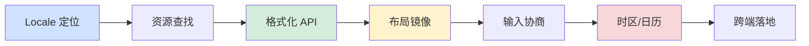
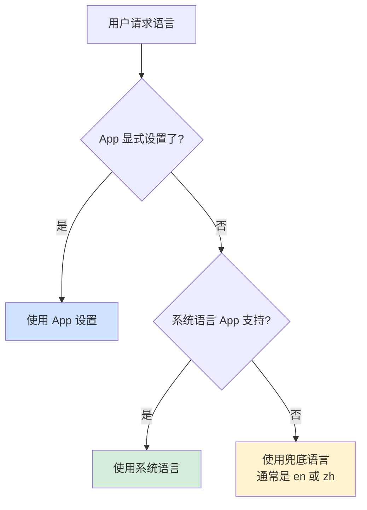
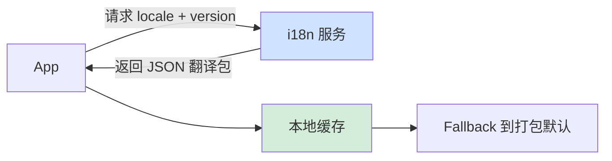
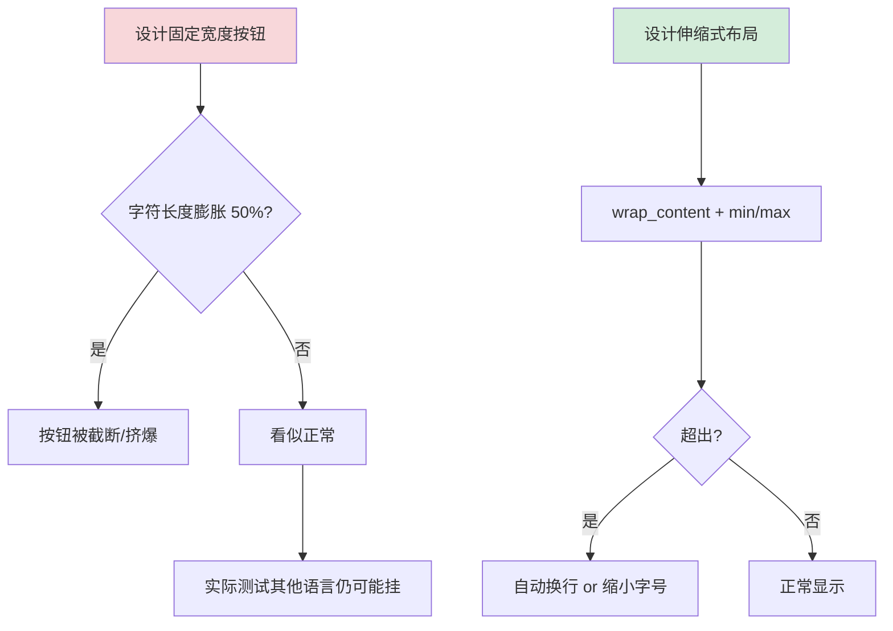
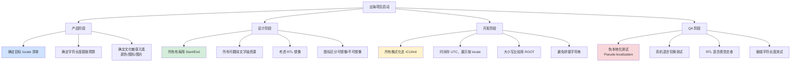

# 10.国际化适配的设计

📍 **本篇位置**：第 5 卷 · 交互与系统 · 第 11 篇（跨端跨文化的"最后一公里"）

🎯 **核心矛盾**：**"程序员的世界只有英文和 UTF-8" vs "用户的世界有 200+ 语言、40+ 书写系统、160+ 货币、200+ 时区、数十种日历"**，一个看似简单的 `"Hello, " + name` 到了阿拉伯语就左右颠倒、到了德语就撑爆按钮、到了土耳其语大写小写规则完全不同、到了日语连"逗号"和"句号"都不一样。**国际化不是"翻译"，是把「语言 + 文化 + 地域 + 硬件」四个变量从代码里彻底解耦**

🧭 **设计灵魂**：所有平台的国际化本质都是**「Locale 标识 + 资源分发 + 格式化 API + 布局适配 + 输入法协作」五层协议**，区别只在「Locale 由谁决定」（系统/App/用户）、「资源怎么打包」（分包/远端/兜底）、「格式化谁来做」（ICU/自实现/OS）

🌐 **跨平台覆盖**：Android(res 目录 + AppCompat) · iOS(Localizable.strings + NSLocale) · Web(i18next / Intl API) · Flutter(intl + ARB) · React Native(i18n-js) · 桌面(gettext / .po / Qt Linguist) · 嵌入式(Unicode 字体切片 / 精简 ICU) · 服务端(Accept-Language 协商)

🔗 **延伸阅读**：← [5.2 视图加载渲染设计](https://yccoding.com/pages/070bb8/) · ← [5.3 图形渲染管线原理](https://yccoding.com/pages/318066/) · → [5.10 数据加密和解密](./10.数据加密和解密.md)

💡 **通用心智**：忘掉具体平台的 API，记住一句话，**国际化 = 「locale 定位 + 资源查找 + 数据格式化 + 视觉适配 + 输入协商」五段流水线**。Android 的 `values-zh-rCN`、iOS 的 `zh-Hans.lproj`、Web 的 `Accept-Language`、Flutter 的 `AppLocalizations`、gettext 的 `.mo` 都只是同一套抽象在不同平台的落地。**真正难的不是翻译文字，是「日期是 2026/1/15 还是 15-01-2026、货币是 ¥100 还是 100 元、姓名是 张三 还是 San Zhang、地址从省到街还是从街到国」，每一项都是文化的密码**。

#### 目录介绍
- [1.真实事故引入](#1真实事故引入)
  - [1.1 阿拉伯语用户投诉](#11-阿拉伯语用户投诉)
  - [1.2 德语按钮撑爆](#12-德语按钮撑爆)
  - [1.3 灵魂三问](#13-灵魂三问)
  - [1.4 五个递进追问](#14-五个递进追问)
  - [1.5 探索路径](#15-探索路径)
  - [1.6 为何值得讲透](#16-为何值得讲透)
- [2.国际化本质](#2国际化本质)
  - [2.1 i18n 与 l10n 之别](#21-i18n-与-l10n-之别)
  - [2.2 Locale 三要素](#22-locale-三要素)
  - [2.3 Unicode 的救赎](#23-unicode-的救赎)
  - [2.4 CLDR 数据源](#24-cldr-数据源)
  - [2.5 五层协议模型](#25-五层协议模型)
- [3.多语言资源体系](#3多语言资源体系)
  - [3.1 键值分离思想](#31-键值分离思想)
  - [3.2 资源查找回退链](#32-资源查找回退链)
  - [3.3 复数与性别规则](#33-复数与性别规则)
  - [3.4 占位符与插值](#34-占位符与插值)
  - [3.5 资源打包与热更](#35-资源打包与热更)
- [4.格式化 API 全景](#4格式化-api-全景)
  - [4.1 数字格式化](#41-数字格式化)
  - [4.2 货币格式化](#42-货币格式化)
  - [4.3 日期时间格式化](#43-日期时间格式化)
  - [4.4 相对时间与列表](#44-相对时间与列表)
  - [4.5 姓名地址格式化](#45-姓名地址格式化)
- [5.RTL 与视觉适配](#5rtl-与视觉适配)
  - [5.1 RTL 语言清单](#51-rtl-语言清单)
  - [5.2 镜像与不镜像](#52-镜像与不镜像)
  - [5.3 双向文本 Bidi](#53-双向文本-bidi)
  - [5.4 字体与字重回退](#54-字体与字重回退)
  - [5.5 布局伸缩策略](#55-布局伸缩策略)
- [6.时区与日历](#6时区与日历)
  - [6.1 UTC/本地/时区 ID](#61-utc本地时区-id)
  - [6.2 夏令时陷阱](#62-夏令时陷阱)
  - [6.3 非公历日历](#63-非公历日历)
  - [6.4 存储与展示分离](#64-存储与展示分离)
- [7.输入法与文本处理](#7输入法与文本处理)
  - [7.1 IME 输入协商](#71-ime-输入协商)
  - [7.2 大小写与折叠](#72-大小写与折叠)
  - [7.3 排序 Collation](#73-排序-collation)
  - [7.4 分词与断行](#74-分词与断行)
- [8.跨平台落地矩阵](#8跨平台落地矩阵)
  - [8.1 Android 资源体系](#81-android-资源体系)
  - [8.2 iOS Localizable](#82-ios-localizable)
  - [8.3 Web Intl 与 i18n 库](#83-web-intl-与-i18n-库)
  - [8.4 Flutter 与 ARB](#84-flutter-与-arb)
  - [8.5 嵌入式精简方案](#85-嵌入式精简方案)
  - [8.6 服务端语言协商](#86-服务端语言协商)
- [9.经典陷阱与反模式](#9经典陷阱与反模式)
  - [9.1 拼接字符串](#91-拼接字符串)
  - [9.2 硬编码货币符号](#92-硬编码货币符号)
  - [9.3 用字符串排序数字](#93-用字符串排序数字)
  - [9.4 忽略复数规则](#94-忽略复数规则)
  - [9.5 硬编码日期格式](#95-硬编码日期格式)
  - [9.6 图片里写死文字](#96-图片里写死文字)
  - [9.7 忘记 RTL 镜像](#97-忘记-rtl-镜像)
  - [9.8 土耳其语 I 大写](#98-土耳其语-i-大写)
  - [9.9 时区当 UTC 存](#99-时区当-utc-存)
  - [9.10 字体不含目标语言](#910-字体不含目标语言)
- [10.总结](#10总结)
  - [10.1 三层认知阶梯](#101-三层认知阶梯)
  - [10.2 出海项目决策清单](#102-出海项目决策清单)
  - [10.3 八字真言](#103-八字真言)
  - [10.4 跨端术语对照](#104-跨端术语对照)
  - [10.5 本卷章节呼应](#105-本卷章节呼应)
  - [10.6 与本卷承接](#106-与本卷承接)

---

## 1.真实事故引入

### 1.1 阿拉伯语用户投诉

我曾接手过一款教育类 App 出海的国际化项目。项目组把英文版翻译成阿拉伯语后就直接上线，上线三天后运营收到大量 1 星差评：

> "界面全乱了，返回箭头往右指了但是点了没反应"
> "价格显示 100 ﷼ 但是逗号跑到左边了，我以为价格是 001"
> "输入姓名的框里我打 محمد，光标居然从左往右跑，字都错位了"

工程师打开阿拉伯语真机，**整个页面像贴错了的墙纸**：

```
❌ 现象：
  1. 头部返回按钮箭头是 →（应该 ←，因为阿拉伯语从右到左）
  2. 数字 "1,234.56 SAR" 显示成 "1,234.56 SAR"（应该是 "١٬٢٣٤٫٥٦ ر.س."）
  3. 输入框光标位置错乱
  4. 图标顺序（左头像 + 右昵称）没镜像
  5. 混合英文和阿拉伯语的段落，词序全乱
```

新人的第一反应：

```
"翻译的时候没有做特殊处理啊？"
"是不是字体没装？"
"能不能强制把所有阿拉伯语当英文渲染？"
```

我们排查了两天，最后发现根因是**三层都错了**：

**第一层（资源层）**：翻译团队直接把 `.strings` 文件里所有英文换成阿拉伯语字符串，但**没有配置语言方向**：

```xml
<!-- Android values-ar/strings.xml -->
<string name="back">رجوع</string>   <!-- 只翻译了文字 -->
<!-- 但没有开启 RTL 支持 -->
```

**第二层（布局层）**：所有布局用了 `android:layout_marginLeft` / `paddingLeft`，而不是 `Start/End`。到了 RTL 语言，"Left" 依然是屏幕左边，导致布局不镜像。

**第三层（格式化层）**：数字直接用 `String.format("%.2f", price)` 拼接货币符号，完全没走 `NumberFormat.getCurrencyInstance(locale)`。

**修复方案（三箭齐发）**：

```xml
<!-- 1. AndroidManifest.xml 开启 RTL -->
<application android:supportsRtl="true">

<!-- 2. 布局用 Start/End 替代 Left/Right -->
<TextView android:paddingStart="16dp" android:paddingEnd="8dp"/>

<!-- 3. Java 代码走 ICU 格式化 -->
NumberFormat nf = NumberFormat.getCurrencyInstance(new Locale("ar", "SA"));
nf.format(price)  // 输出正确的 "١٬٢٣٤٫٥٦ ر.س."
```

**这次救火让我们刻骨铭心地体会到**，**国际化不是"翻译"这一件事，而是「资源 + 布局 + 格式化」三件套**。任何一层缺失，用户看到的就是"半成品出海"。

### 1.2 德语按钮撑爆

另一个故事。我在开发一个跨端购物 App，UI 走查阶段发现：**同一个"确认支付"按钮，英文完美居中，德语直接撑爆卡片**。

```
英文：Confirm Payment           (15 chars)
德语：Zahlung bestätigen         (18 chars)
俄语：Подтвердить оплату         (18 chars)
日语：支払いを確認する               (9 chars 但字宽 2 倍)
阿拉伯语：تأكيد الدفع              (11 chars)
```

设计师给的按钮宽度是 `120dp`，按英文的字宽算刚好。但**德语的复合词非常长**，一个 "Rindfleischetikettierungsüberwachungsaufgabenübertragungsgesetz" 就是 63 个字符。

**新人第一反应**：

```
"能不能后端根据语言返回不同的字符串长度？"
"设计师改宽点不就行了？"
"截断加省略号？"
```

**真正的解药**：

```
1. 设计阶段就要"字符长度膨胀预算"：
   英文 → 其他语言，最多膨胀 30-50%
   短词膨胀更严重（"OK" → "Klar" 膨胀 100%）
   
2. 布局用 wrap_content + 最小/最大宽度
   而不是固定宽度
   
3. 字体大小自适应（autoSizeTextType）
   
4. 极端情况允许换行，但对齐规则要预设
```

**修复后**：把所有关键按钮改成 `wrap_content + minWidth=120dp + autoSize`，所有 12 种语言全部通过走查。

**这次事故让我意识到**，**国际化不是「上线前一天翻译」，是「设计稿画第一笔就要考虑的约束」**。字体长度、布局伸缩、图标是否镜像、颜色是否有文化禁忌，每一条都是产品经理 + 设计师 + 工程师三方约定。

### 1.3 灵魂三问

这两个事故让我反复追问：

**1."翻译"到底是国际化的第几步？前面还有什么？后面还有什么？** ， 大多数程序员的国际化认知起点太靠后。

**2.为什么同样是 "1234.56"，中文写 "1,234.56"、德文写 "1.234,56"、阿拉伯文写 "١٬٢٣٤٫٥٦"？谁在管这套规则？** ， 隐藏的 CLDR / ICU 底座。

**3.为什么 Android/iOS/Web/Flutter 都有各自的国际化 API，但底层几乎都在用同一份数据？** ， Unicode 联盟的"世界公约"。

### 1.4 五个递进追问

要把"国际化"讲透，需要递进回答：

1. **Locale 到底由什么组成？系统的、App 的、用户的三个 locale 谁说了算？** ， 三级优先级模型
2. **资源怎么按 Locale 查找？找不到怎么办？** 资源回退链
3. **数字、货币、日期、复数、姓名，这五种格式化背后有什么共通规律？** ICU + CLDR 数据驱动
4. **RTL 语言到底改了什么？只是"文字方向"吗？**镜像布局的完整链条
5. **时区和日历为什么是国际化里"最容易翻车"的部分？** UTC / 时区 / 日历三层解耦

### 1.5 探索路径



### 1.6 为何值得讲透

我想抛三个问题：

1. **为什么大多数国内应用做出海时都翻车？** 因为国内很少接触 RTL、复数变体、非公历，一到海外全是新坑。
2. **为什么"国际化"和"本地化"是两件事？** i18n 是工程能力（把可翻译内容抽出），l10n 是文化适配（翻译 + 调整），一个是"能不能"，一个是"好不好"。
3. **为什么系统 API（ICU/NSLocale/Intl）能省掉 90% 的坑，但很多工程师还在自己 `String.format`？** ， 因为不知道有这些 API，不知道 CLDR 数据的存在。

读完本章你会懂：**国际化不是"翻译文字"，它是一套贯穿产品设计、工程实现、运维部署的系统工程**，每个环节都有自己的物理约束和跨文化取舍。

---

## 2.国际化本质

### 2.1 i18n 与 l10n 之别

**i18n（Internationalization）**：把 App 做成"能被任何 locale 使用"的架构，**工程能力**。

**l10n（Localization）**：为某个具体 locale 做翻译、图片替换、文化适配，**内容工作**。

```
i18n（一次性）：
  - 抽离硬编码文本 → 资源文件
  - 布局用 Start/End
  - 数字/日期走 ICU
  - 支持 RTL、复数、多字体
  
l10n（每语言一次）：
  - 翻译具体字符串
  - 提供各语言的图片资源
  - 校对文化敏感内容
  - QA 走查视觉

数字关系：
  一次 i18n × N 次 l10n = 全球化产品
```

**为什么用 18 和 10 这两个数字？**

```
Internationalization：i + 18 个字母 + n
Localization：l + 10 个字母 + n

这是 20 世纪 80 年代 DEC 工程师的黑话
```

### 2.2 Locale 三要素

Locale = **语言 + 地区 + 变体**（`ll-Cccc-CC-vvvv`）。

```
标准格式（BCP 47 / RFC 5646）：

    zh - Hans - CN - u - nu - hanidec
    │     │      │      │           │
    语言  文字   地区   扩展前缀    数字系统扩展

组成：
  语言（Language）：zh、en、ar、ja
  文字（Script）：Hans（简体）、Hant（繁体）、Arab、Latn
  地区（Region）：CN、TW、HK、US、GB
  变体（Variant）：稀有，如 zh-Hans-CN-u-ca-chinese（用中国农历）
```

**为什么"语言 + 地区"不够？**

```
zh（只写语言）：
  是简体？还是繁体？→ 需要 Script
  
zh-CN（语言 + 地区）：
  中国大陆，简体
  能推断出 Script = Hans
  
zh-TW：
  中国台湾，繁体
  能推断出 Script = Hant
  
zh-Hans-SG：
  新加坡，简体
  Script 必须显式（否则会推断错）
```

**locale 的三级优先级**，**§1.4 第一题答案**：



```
优先级从高到低：
  1. App 内用户切换（最高，用户明确选择）
  2. OS 系统语言（次高，用户默认习惯）
  3. App 兜底 default（最低，都不支持时）
  
Android 的实现：AppCompatDelegate.setApplicationLocales()
iOS 的实现：Bundle.main.preferredLocalizations
Web 的实现：navigator.languages + <html lang="...">
```

### 2.3 Unicode 的救赎

**没有 Unicode 之前的地狱**：

```
GBK：中文简体
Big5：中文繁体
Shift-JIS：日文
EUC-KR：韩文
ISO-8859-1：西欧
ISO-8859-5：俄文
Windows-1256：阿拉伯

同一个字节 0xE7 在不同编码里是不同字：
  GBK：某个汉字的第一个字节
  ISO-8859-1：ç
  Windows-1256：ط
  
→ 保存 / 传输 / 显示时必须知道编码
→ 编码错 = 乱码（"锟斤拷"就是这么来的）
```

**Unicode 的解法**：

```
给"世界上所有字符"一个统一的编号（Code Point）：
  U+0041 = A
  U+4E2D = 中
  U+1F600 = 😀
  U+0627 = ا（阿拉伯字母 alif）
  
编码方式：
  UTF-8：变长（1-4 字节），兼容 ASCII，Web/存储默认
  UTF-16：变长（2 或 4 字节），Java/Windows 内部
  UTF-32：定长（4 字节），研究用
```

**"锟斤拷" 的语言学解剖**，为什么工程师看到这四个字就知道有 bug：

```
UTF-8 遇到"无法解码的字节"时用 U+FFFD（� 替换字符）表示
U+FFFD 的 UTF-8 编码是 EF BF BD

三个 U+FFFD 连起来：
  EF BF BD  EF BF BD  EF BF BD
  
按 GBK 解码：
  EF BF = 锟
  BD EF = 斤
  BF BD = 拷
  
→ 一个 Unicode 出错 + 二次编码错误 = 锟斤拷
→ 这个词是 UTF-8 与 GBK 混用的经典事故
```

### 2.4 CLDR 数据源

**§1.3 第三题答案**，Unicode 联盟做的不只是"字符编码"，还有 **CLDR（Common Locale Data Repository）**：

```
CLDR = 全球 locale 数据的"世界公约"
  - 500+ 语言变体的数字、货币、日期、时间格式
  - 复数规则（英语 2 种，阿拉伯语 6 种）
  - 姓名格式、地址格式
  - 度量衡（英制 vs 公制）
  - 星期起点（美国周日、欧洲周一）
  - 时间格式（12h vs 24h）
  - 电话号码格式
  - RTL/LTR 方向

数据格式：XML/JSON
更新频率：每年 2 次
```

**谁在用 CLDR？**

```
Android：ICU4J（Java 版 ICU）
iOS/macOS：ICU4C（C 版 ICU）
Chrome/V8：ICU
Java JDK：ICU
Firefox：ICU
Node.js：ICU
Flutter：intl 包（内嵌部分 CLDR）
```

**这就是为什么"所有平台的国际化底层是同一份数据"**，CLDR 是事实标准。

### 2.5 五层协议模型

任何 GUI/后端国际化系统都遵循同样的 5 层协议，本篇最值得贴在 IDE 旁边的"国际化通用名片"：

```
通用国际化五层协议（跨端共享）：

   ┌─────────────────────────────────────┐
   │ 1. Locale 定位                       │
   │   ├─ 用户偏好 / 系统语言 / URL 参数    │
   │   └─ 输出：BCP 47 语言标签             │
   └────────────────────┬────────────────┘
                        ▼
   ┌─────────────────────────────────────┐
   │ 2. 资源查找                          │
   │   ├─ 按 locale 查找 → 回退链          │
   │   └─ 输出：翻译好的字符串              │
   └────────────────────┬────────────────┘
                        ▼
   ┌─────────────────────────────────────┐
   │ 3. 数据格式化                        │
   │   ├─ 数字/货币/日期/复数/姓名          │
   │   └─ 输出：locale 友好的文本            │
   └────────────────────┬────────────────┘
                        ▼
   ┌─────────────────────────────────────┐
   │ 4. 视觉适配                          │
   │   ├─ RTL 镜像 / 字体切换 / 布局伸缩    │
   │   └─ 输出：可展示的 UI                │
   └────────────────────┬────────────────┘
                        ▼
   ┌─────────────────────────────────────┐
   │ 5. 输入协商                          │
   │   ├─ IME / 键盘布局 / 排序 / 断行     │
   │   └─ 输出：用户可读写的最终产品         │
   └─────────────────────────────────────┘
```

**这五层在六端的对应名词**，任何应用开发者都能在自己的平台里找到对应位置：

| 层 | Android | iOS | Web | Flutter | 桌面(Qt/gettext) | 嵌入式(LVGL) |
|-----|---------|-----|-----|---------|----------------|-------------|
| **1.Locale 定位** | `LocaleList` | `Locale.current` | `navigator.language` | `Locale` | `QLocale` / `setlocale()` | 编译期宏 |
| **2.资源查找** | `res/values-xx/` | `xx.lproj/` | i18n 库（json） | `.arb` 文件 | `.po/.mo` | 字符串表 |
| **3.数据格式化** | `NumberFormat` / `SimpleDateFormat` | `NumberFormatter` / `DateFormatter` | `Intl.*` | `intl` package | `QNumberFormat` | 极简格式化 |
| **4.视觉适配** | `supportsRtl` + Start/End | `Semantic Content Attribute` | `dir="rtl"` + `logical properties` | `TextDirection` | Qt 布局属性 | 手动镜像 |
| **5.输入协商** | InputMethodManager | UITextInput | Input Events | TextInputConnection | Qt Input Framework | 无 |

**这套协议的「跨端不变量」**，任何应用开发者必背：

1. **Locale 是"信号"，不是"内容"**，只标识"用户是谁"，不承载数据本身。
2. **资源和代码分离**，所有可翻译内容必须在资源文件里，不能硬编码。
3. **格式化交给系统**，数字/货币/日期永远不要自己拼字符串。
4. **布局用"逻辑方向"**，用 Start/End 代替 Left/Right，让镜像自动完成。
5. **存储用 UTC + 展示用本地**，时间是国际化里最容易翻车的点。

**给所有应用开发者的总记忆**：

不论你在做 Android、iOS、Web、Flutter、嵌入式 UI，还是后端 API，**用户看到的每一个字符串、数字、日期，都必经这 5 层协议**。学会这套抽象，下次做出海时你能精准说出"漏在哪一层"，而不是"反正就是翻译不对"。

---

## 3.多语言资源体系

### 3.1 键值分离思想

**核心矛盾**：代码不能耦合具体语言。

**错误示范**：

```java
// ❌ 硬编码，彻底完蛋
Button btn = new Button();
btn.setText("确认支付");  // 只能中文

// ❌ if/else 分支，维护地狱
if (locale.equals("zh")) {
    btn.setText("确认支付");
} else if (locale.equals("en")) {
    btn.setText("Confirm Payment");
}
```

**正确姿势**：

```xml
<!-- res/values/strings.xml（默认） -->
<string name="confirm_payment">Confirm Payment</string>

<!-- res/values-zh/strings.xml -->
<string name="confirm_payment">确认支付</string>

<!-- res/values-ar/strings.xml -->
<string name="confirm_payment">تأكيد الدفع</string>
```

```java
// 代码里只用 key
btn.setText(getString(R.string.confirm_payment));
```

**为什么这套设计跨平台通行**：

```
1. 代码只依赖"稳定的 key"，语言变了代码不动
2. 资源可以由翻译团队独立维护
3. 打包时按 locale 分包，用户只下自己需要的
4. 支持热更新，线上改文案不用发版
5. 便于 QA 自动化，检查有没有漏译
```

### 3.2 资源查找回退链

**§1.4 第二题答案**，找不到翻译时怎么办？**回退链**（Fallback Chain）。

**Android 的回退规则**：

```
用户 locale：zh-Hant-HK（繁体中文 - 香港）

查找顺序：
  1. values-zh-rHK/       ← 精确匹配
  2. values-b+zh+Hant+HK/ ← BCP 47 精确匹配
  3. values-zh-rTW/       ← 同 Script 的地区
  4. values-b+zh+Hant/    ← 同语言 + 同 Script
  5. values-zh/           ← 同语言（默认简体）
  6. values/              ← 默认资源（英文）
  
→ 依次查找，第一个存在就用
```

**iOS 的回退规则**，`preferredLocalizations`：

```swift
Bundle.main.preferredLocalizations
// 返回 App 支持且用户偏好的 locale 列表：
// ["zh-Hant", "zh", "en"]

// 系统会自动按这个顺序查找 xx.lproj
```

**Web / i18next 的回退**：

```js
i18next.init({
    lng: 'zh-HK',
    fallbackLng: {
        'zh-HK': ['zh-Hant', 'zh', 'en'],
        'zh-TW': ['zh-Hant', 'zh', 'en'],
        default: ['en']
    }
});
```

**回退设计的三大原则**：

```
1. 语言优先于地区：zh-XX 优先回退到 zh，而不是别的语言
2. 文字系统敏感：繁体不回退到简体（虽然都是中文）
3. 兜底必须存在：values/（默认）永远不能空
```

**回退链失败的经典事故**：

```
用户是台湾用户（zh-TW）
  App 有 values-zh/（简体）但没有 values-zh-rTW/
  → 台湾用户看到简体中文
  → 用户炸锅："你们把我当大陆人？"

修复：
  提供 values-zh-rTW/（繁体）
  或者至少提供 values-b+zh+Hant/
```

### 3.3 复数与性别规则

**英语程序员的惯性思维**：

```
1 apple
2 apples
5 apples
```

**其他语言就复杂了**：

```
英语（en）：
  one: 1 apple
  other: 2 apples

法语（fr）：
  one: 1 pomme（0 也用 one）
  other: 2 pommes

俄语（ru）：
  one: 1 яблоко
  few: 2, 3, 4 яблока
  many: 5-20 яблок
  other: 21 яблоко

阿拉伯语（ar）：6 种规则
  zero: 0
  one: 1
  two: 2
  few: 3-10
  many: 11-99
  other: 100+
```

**如果直接用 `"You have " + count + " apple" + (count>1?"s":"")` 会怎样？**

```
俄语用户看到："У вас 5 apples"（一半英文一半俄文，笑掉大牙）
```

**CLDR 提供的复数规则**，由系统 API 自动选：

```java
// Android
Resources res = getResources();
String text = res.getQuantityString(
    R.plurals.apples,   // resource id
    count,              // 数量
    count               // 参数（要显示的数字）
);
```

```xml
<!-- res/values-ru/plurals.xml -->
<plurals name="apples">
    <item quantity="one">%d яблоко</item>
    <item quantity="few">%d яблока</item>
    <item quantity="many">%d яблок</item>
    <item quantity="other">%d яблока</item>
</plurals>
```

**性别规则**，某些语言需要根据主语性别选择不同措辞：

```
法语：Il est parti / Elle est partie（男/女不同）
阿拉伯语：أهلا وسهلا（男）/ أهلاً وسهلاً بكِ（女）
西班牙语：Bienvenido / Bienvenida
```

CLDR / ICU 支持 `select` 语法：

```
{gender, select,
    male {Welcome, Mr. {name}}
    female {Welcome, Ms. {name}}
    other {Welcome, {name}}
}
```

**给出海项目的关键提示**：**任何"数量 + 名词"或"你/他/她"的文案，必须走复数/性别 API**。不然俄罗斯、阿拉伯、法国、西班牙用户会看到语法惨案。

### 3.4 占位符与插值

**错误示范**：

```java
// ❌ 拼接字符串，彻底翻车
String text = "You have " + count + " new messages";
```

到了德语：

```
❌ 直译："Sie haben 5 neue Nachrichten"
❌ 但如果按 en 结构直译："Sie haben 5 neu Nachrichten haben"
```

到了日语：

```
❌ 主语顺序不同："5 件の新しいメッセージがあります"
   数字 5 的位置在句首
```

**正确姿势**，用命名占位符：

```xml
<!-- 支持位置调整 -->
<string name="messages_count">You have %1$d new messages</string>
```

```xml
<!-- 日语 - 允许调整位置 -->
<string name="messages_count">%1$d 件の新しいメッセージがあります</string>
```

**ICU MessageFormat**，工业级方案：

```
{count, plural,
    =0 {No new messages}
    one {You have 1 new message}
    other {You have # new messages}
}
```

**iOS 的 stringsdict**，专门处理复数：

```xml
<plist>
<dict>
    <key>messages_count</key>
    <dict>
        <key>NSStringLocalizedFormatKey</key>
        <string>%#@count@</string>
        <key>count</key>
        <dict>
            <key>NSStringFormatSpecTypeKey</key>
            <string>NSStringPluralRuleType</string>
            <key>NSStringFormatValueTypeKey</key>
            <string>d</string>
            <key>one</key>
            <string>You have %d new message</string>
            <key>other</key>
            <string>You have %d new messages</string>
        </dict>
    </dict>
</dict>
</plist>
```

### 3.5 资源打包与热更

**资源打包策略矩阵**：

| 策略 | 打包时机 | 包体 | 更新 | 适用场景 |
|-----|---------|-----|-----|---------|
| **全量打包** | 构建期 | 大 | 发版 | 语言少（<10） |
| **按 locale 分包** | 构建期 | 小 | 分包下载 | Android App Bundle |
| **服务端下发** | 运行期 | 极小 | 实时 | 多语言 / 频繁变动 |
| **热更新** | 运行期 | 极小 | 无需发版 | 修错字 / 应急 |

**Android App Bundle 的按需分发**：

```
用户是英文用户 → 只下载 values-en 的资源
用户切换到日文 → 动态下载 values-ja 的模块

优势：
  - 包体缩小 30-50%
  - 用户流量友好
```

**服务端下发方案的架构**：



**热更新的关键点**：

```
1. 版本号必须严格控制（避免旧 App 用新 key）
2. 本地必须有兜底（服务器挂了不能白屏）
3. 加密传输（防止翻译文案被篡改）
4. 差量下载（只下改动部分）
```

**安全提示**：热更新拉的 i18n 文件本质是**远端可执行的 UI 内容**，如果被劫持，可能变成社工攻击的载体（"您的账号异常，请转账到..."）。

```
必须做到：
  1. HTTPS + 证书校验（防中间人）
  2. 签名校验（防篡改）
  3. 白名单域名（防 SSRF 到内网）
  4. 严格 schema 校验（防注入 HTML/JS）
```

---

## 4.格式化 API 全景

**§1.3 第二题答案**，为什么同样是 1234.56，各地写法完全不同？因为**数字格式**本身就是文化的一部分。

### 4.1 数字格式化

**同一个 1234567.89 在世界的写法**：

| Locale | 显示 | 千分位 | 小数点 |
|--------|------|-------|-------|
| en-US | 1,234,567.89 | `,` | `.` |
| de-DE | 1.234.567,89 | `.` | `,` |
| fr-FR | 1 234 567,89 | ` `（空格） | `,` |
| zh-CN | 1,234,567.89 | `,` | `.` |
| ar-EG | ١٬٢٣٤٬٥٦٧٫٨٩ | `٬` | `٫` |
| hi-IN | 12,34,567.89 | 印度数字系统（3-2-2） | `.` |
| bn-BD | ১২,৩৪,৫৬৭.৮৯ | 孟加拉数字 | `.` |

**印度数字系统的"神奇"**：

```
标准：1,234,567.89（每 3 位一个分隔）
印度：12,34,567.89（第一个 3 位，后面每 2 位）
  → 因为印度有"十万（लाख）"、"千万（करोड़）"等单位
  → 分隔符对应这些自然单位
```

**正确调用**，每种平台都有 ICU 支持：

```java
// Android / Java
NumberFormat nf = NumberFormat.getInstance(new Locale("hi", "IN"));
nf.format(1234567.89);  // "12,34,567.89"
```

```swift
// iOS
let formatter = NumberFormatter()
formatter.locale = Locale(identifier: "hi_IN")
formatter.numberStyle = .decimal
formatter.string(from: 1234567.89)  // "12,34,567.89"
```

```javascript
// Web
new Intl.NumberFormat('hi-IN').format(1234567.89)
// "12,34,567.89"
```

### 4.2 货币格式化

**货币比数字更复杂**，涉及**符号 + 位置 + 小数位**：

| Locale | 货币 | 显示 |
|--------|-----|------|
| en-US | USD | $1,234.56 |
| en-GB | GBP | £1,234.56 |
| de-DE | EUR | 1.234,56 € |
| fr-FR | EUR | 1 234,56 € |
| ja-JP | JPY | ￥1,235（无小数位） |
| ar-SA | SAR | 1,234.56 ر.س.（阿拉伯位置和符号） |
| zh-CN | CNY | ￥1,234.56 |
| bh-BD | BDT | ৳1,234.56 |

**规则维度**：

```
1. 符号：$、£、€、¥、₹、₽、₩
2. 位置：符号在前 / 后 / 前带空格
3. 小数位：JPY = 0 位，USD = 2 位，KWD = 3 位
4. 大额单位：中文有"万/亿"、印度有"千万（cr）"
5. 负数格式：-$100 / ($100) / $-100
```

**正确调用**：

```java
NumberFormat nf = NumberFormat.getCurrencyInstance(new Locale("ja", "JP"));
nf.format(1234.56);  // "￥1,235"（自动四舍五入到 0 位）

// 显式指定货币（与 locale 分离）
Currency currency = Currency.getInstance("USD");
NumberFormat nf2 = NumberFormat.getCurrencyInstance(new Locale("ja", "JP"));
nf2.setCurrency(currency);
nf2.format(1234.56);  // "US$1,234.56"（日文 locale 显示美元）
```

**电商出海的坑**：

```
❌ 硬编码 "¥" 前缀 → 到欧洲变成日元？
❌ 硬编码 2 位小数 → 到日本多了两位
❌ 硬编码符号在前 → 到欧洲很多货币在后

✅ 一律走 NumberFormat.getCurrencyInstance
✅ 后端返回 amount + currency code（"USD"），不返回带符号的字符串
```

### 4.3 日期时间格式化

**同一时刻在不同 locale 的写法**：

| Locale | 短日期 | 长日期 | 时间 |
|--------|--------|--------|------|
| en-US | 3/15/2026 | March 15, 2026 | 2:30 PM |
| en-GB | 15/03/2026 | 15 March 2026 | 14:30 |
| de-DE | 15.03.2026 | 15. März 2026 | 14:30 |
| ja-JP | 2026/03/15 | 2026年3月15日 | 14:30 |
| zh-CN | 2026/3/15 | 2026年3月15日 | 下午2:30 |
| ar-EG | ١٥‏/٣‏/٢٠٢٦ | ١٥ مارس ٢٠٢٦ | ٢:٣٠ م |
| fa-IR | 25/12/1404 | 25 اسفند 1404 | 14:30（波斯历） |

**变量维度**：

```
1. 年/月/日顺序：YMD（东亚）/ DMY（欧洲）/ MDY（美国）
2. 分隔符：/、-、.
3. 12h vs 24h：美国用 12h（AM/PM），欧洲用 24h
4. 月份表示：数字 / 缩写 / 全称
5. 日历系统：公历 / 波斯历 / 佛教历 / 伊斯兰历
6. 数字系统：阿拉伯数字 / 天城文 / 波斯文
```

**正确调用**：

```java
// 用"格式风格"而不是"格式串"
DateFormat df = DateFormat.getDateInstance(DateFormat.LONG, Locale.US);
df.format(date);  // "March 15, 2026"

// 只有实在需要固定格式（如日志、文件名）才用 SimpleDateFormat
SimpleDateFormat fixed = new SimpleDateFormat("yyyy-MM-dd", Locale.ROOT);
```

**Locale.ROOT 的用途**，**"给机器读的格式"**：

```
文件名 / 数据库主键 / 网络协议：用 Locale.ROOT（永远英文）
UI 展示：用用户的 Locale
日志：混合（时间用 ROOT，业务字段用用户 locale）
```

### 4.4 相对时间与列表

**相对时间**，"3 天前"、"2 小时后"：

```java
// Android
RelativeDateTimeFormatter fmt = RelativeDateTimeFormatter.getInstance(locale);
fmt.format(3, Direction.LAST, Unit.DAY);  // "3 天前"
```

```javascript
// Web
new Intl.RelativeTimeFormat('zh-CN', { numeric: 'auto' }).format(-3, 'day')
// "3 天前"
new Intl.RelativeTimeFormat('en', { numeric: 'auto' }).format(-1, 'day')
// "yesterday"
```

**注意"yesterday"的智能化**，numeric='auto' 会把 -1 转成"昨天"而不是"1 天前"。

**列表格式化**，"苹果、香蕉和橘子"：

```
英语：apples, bananas, and oranges
中文：苹果、香蕉和橘子
德语：Äpfel, Bananen und Orangen
西班牙语：manzanas, plátanos y naranjas
```

```javascript
new Intl.ListFormat('zh-CN', { type: 'conjunction' })
    .format(['苹果', '香蕉', '橘子'])
// "苹果、香蕉和橘子"
```

### 4.5 姓名地址格式化

**姓名顺序**：

```
英语：First Last → John Smith
中文：Last First → 张三
日语：Last First → 山田太郎
匈牙利：Last First → Nagy István
阿拉伯：给定名 + 父名 + 家族名 → محمد بن سعيد الحسني
```

**地址顺序**：

```
美国：从小到大
  123 Main St
  Springfield, IL 62701
  USA

中国：从大到小
  中国上海市浦东新区世纪大道 100 号

日本：从大到小
  〒100-0005
  東京都千代田区丸の内 1-1-1

德国：混合
  Musterstraße 1
  12345 Berlin
  Deutschland
```

**为什么这套顺序敏感？**

```
输入表单的字段顺序应该匹配用户习惯：
  - 美国表单：姓名 → 街道 → 城市 → 州 → 邮编
  - 中国表单：省 → 市 → 区 → 街道 → 门牌
  - 日本表单：邮编（前提自动填省市）→ 城市 → 街道
  
错了会导致：
  1. 用户填错顺序 → 提交失败
  2. 快递上门找不到（顺序错乱）
  3. 用户流失（"这 App 好难用"）
```

---

## 5.RTL 与视觉适配

**§1.4 第四题答案**，RTL 不只是"从右往左写字"，是**整个视觉系统的镜像**。

### 5.1 RTL 语言清单

```
阿拉伯语（ar）：ar-SA、ar-EG、ar-AE...
希伯来语（he）：以色列
波斯语（fa）：伊朗、阿富汗
乌尔都语（ur）：巴基斯坦
库尔德语（ku）
维吾尔语（ug）
帕什图语（ps）
迪维希语（dv）：马尔代夫
```

**用户基数**：全球约 5-6 亿人日常使用 RTL 语言，绝对不是"小语种"。

### 5.2 镜像与不镜像

**需要镜像的元素**：

```
✅ 布局方向（水平顺序）
✅ 返回箭头 ← 变成 →
✅ 进度条方向
✅ 列表左右滑动手势
✅ 抽屉从左出 → 从右出
✅ 段落对齐（左对齐 → 右对齐）
✅ 数字输入框对齐
```

**不需要镜像的元素**：

```
❌ 播放按钮（▶ 永远指向"未来"，不镜像）
❌ 相机图标
❌ 时钟指针
❌ 检查勾（✓）
❌ 数字本身（1234 不变成 4321，但阿拉伯语用户可能看到 ١٢٣٤）
❌ Logo、品牌图标
```

**判断原则**：

```
"有方向语义" + "方向和语言有关" → 镜像
"有方向语义" + "方向是自然规律" → 不镜像（时钟、播放）
"无方向语义" → 不镜像（图标、Logo）
```

### 5.3 双向文本 Bidi

**Bidi（Bidirectional）算法**，处理"中英混排"、"阿英混排"：

```
情景：阿拉伯语用户看到 "购买 iPhone 15 需要 5000 元"
      → 混合了 RTL 主体 + LTR 词汇

Unicode Bidi Algorithm 自动处理：
  1. 分段：把文本按方向属性分成 runs
  2. 排序：RTL 段整体从右往左，但内部 LTR 段（如 "iPhone 15"）保持从左往右
  3. 渲染：最终视觉呈现
```

**Bidi 的坑**，数字方向：

```
阿拉伯语的数字方向：
  1234 → 用户视觉上从左到右读："1234"
  但是段落整体从右往左

结果：
  "价格 1234 元" 在阿拉伯语上下文中：
     显示成："元 1234 价格"（逻辑顺序）
     视觉上：从右往左 "价格" → 中间 "1234"（LTR）→ 左边 "元"
```

**Unicode 提供的"方向控制字符"**：

```
U+202A LRE  Left-to-Right Embedding
U+202B RLE  Right-to-Left Embedding
U+202C PDF  Pop Directional Formatting
U+200E LRM  Left-to-Right Mark
U+200F RLM  Right-to-Left Mark
```

在极端情况下（如 URL、代码、混排数字），需要显式插入这些字符控制方向。

### 5.4 字体与字重回退

**问题**：一个 App 的字体资源支持中文、英文，但用户切到韩文/日文/泰文/阿拉伯文，字体没有相应字符 → **豆腐块 □□□**。

**字体回退（Font Fallback）机制**：

```
渲染引擎收到字符 U+D55C（한）
  → 主字体 Noto Sans 里没有？
  → 查第二回退 Noto Sans KR
  → 查第三回退 系统默认
  → 都没有 → 显示"tofu"（□）
```

**iOS 的解决方案**，系统内置 "PingFang / Hiragino / San Francisco"，按 locale 自动切换。

**Android 的解决方案**，`fonts.xml` 配置字体家族链：

```xml
<family>
    <font weight="400" style="normal">Roboto-Regular.ttf</font>
</family>
<family lang="zh-Hans">
    <font weight="400" style="normal">NotoSansCJK-Regular.otf</font>
</family>
<family lang="ar">
    <font weight="400" style="normal">NotoNaskhArabic-Regular.ttf</font>
</family>
```

**Web 的解决方案**，CSS `font-family` 链：

```css
body {
    font-family:
        -apple-system,           /* macOS/iOS */
        "PingFang SC",           /* 中文 */
        "Hiragino Sans",         /* 日文 */
        "Noto Sans Arabic",      /* 阿拉伯 */
        sans-serif;              /* 兜底 */
}
```

**移动端的字体大小陷阱**：

```
中文的方块字宽 = 英文的 2 倍
阿拉伯语字符 x-height 更高 → 视觉上比拉丁文大
泰文有上下堆叠元音 → 行高要预留 40%+

结果：
  英文 14sp 好看
  中文 14sp 好看
  泰文 14sp 拥挤（元音互相重叠）
  → 泰文可能需要 16sp

对策：
  设计稿多语言真机验证
  或用 auto-size TextView（Android）/ 自适应 label（iOS）
```

### 5.5 布局伸缩策略

**§1.2 事故的通用解**，布局必须"能伸能缩"：



**跨端布局伸缩 API**：

| 平台 | 伸缩 API |
|-----|---------|
| Android | `wrap_content` + `minWidth/maxWidth` + `autoSizeTextType` |
| iOS | Auto Layout + `numberOfLines=0` + Dynamic Type |
| Web | `flexbox` + `min-width/max-width` + `text-overflow` |
| Flutter | `Flex/Expanded` + `FittedBox` + `AutoSizeText` |

**Start/End 的通用逻辑属性**：

| 逻辑属性 | Android | iOS | Web |
|---------|---------|-----|-----|
| 起始（左/RTL 右） | Start | leading | inline-start |
| 结束（右/RTL 左） | End | trailing | inline-end |
| 上 | Top | top | block-start |
| 下 | Bottom | bottom | block-end |

**Web CSS 逻辑属性**：

```css
/* ❌ 物理方向，不适应 RTL */
padding-left: 16px;
padding-right: 8px;

/* ✅ 逻辑方向，自动适应 */
padding-inline-start: 16px;
padding-inline-end: 8px;
```

---

## 6.时区与日历

**§1.4 第五题答案**，为什么时间是国际化"最容易翻车"的部分？因为**时间 = UTC 时刻 + 时区偏移 + 日历系统**，三层容易混淆。

### 6.1 UTC/本地/时区 ID

```
UTC 时刻：世界时（Unix timestamp）
  例：1710518400（2024-03-15 12:00:00 UTC）
  
时区偏移：本地相对于 UTC 的偏移
  例：+08:00（北京）、-05:00（纽约）、+05:30（新德里，半小时偏移）
  
时区 ID：IANA 时区数据库标识
  例：Asia/Shanghai、America/New_York、Europe/London
```

**为什么要"时区 ID"而不是"偏移量"？**

```
偏移量的问题：
  - 夏令时会变（美国夏天 -4，冬天 -5）
  - 历史规则会变（某国改过时区）
  - 无法区分同偏移的不同地区
  
时区 ID 的好处：
  Asia/Shanghai 天然对应"上海的所有时区规则历史 + 未来"
  时区数据库（tzdata）会更新
  由 IANA 维护，全球公认
```

### 6.2 夏令时陷阱

**夏令时（DST，Daylight Saving Time）**：

```
纽约 3 月的某个周日凌晨 2:00：
  时钟跳到 3:00（"春季前进"）
  → 2:00-3:00 这一小时"不存在"

纽约 11 月的某个周日凌晨 2:00：
  时钟跳回 1:00（"秋季倒退"）
  → 1:00-2:00 这一小时"出现两次"
```

**经典事故**：

```
Case 1：定时任务在 2:30 触发
  春季前进那天 → 不会触发（这个时刻不存在）
  秋季倒退那天 → 触发两次

Case 2：把北京时间存成 "2024-11-03 01:30:00" 字符串
  纽约用户看到时区偏移错了
  变成不确定是第一次 1:30 还是第二次 1:30
```

**正确做法**：

```
存储：一律用 UTC 时间戳（毫秒/秒 int）
展示：加上目标时区 ID 做格式化
定时任务：用 UTC + 时区偏移，避免踩 DST
```

**中国的特殊性**：

```
中国不实行夏令时（1991 年停用）
中国全国用 UTC+8（虽然新疆按经度应该 UTC+6）

→ 中国程序员容易忽视 DST 的存在
→ 出海项目必踩坑
```

### 6.3 非公历日历

**世界上还有 20+ 种日历系统**：

| 日历 | 使用地区 | 与公历差异 |
|-----|---------|-----------|
| 公历（Gregorian） | 全球主流 | 基准 |
| 农历（Chinese） | 中国节日 | 阴阳合历，闰月 |
| 波斯历（Persian） | 伊朗、阿富汗 | 1404 年 = 2026 年 |
| 伊斯兰历（Islamic） | 中东、宗教用途 | 1447 年 = 2026 年 |
| 佛教历（Buddhist） | 泰国 | 2569 年 = 2026 年 |
| 印度历（Indian） | 印度官方 | 1948 年 = 2026 年 |
| 日本纪年 | 日本 | 令和 8 年 = 2026 年 |
| 民国纪年 | 台湾 | 民国 115 年 = 2026 年 |

**ICU 支持所有主流日历**：

```java
Calendar cal = Calendar.getInstance(new ULocale("th_TH@calendar=buddhist"));
cal.get(Calendar.YEAR);  // 2569
```

**日历敏感的产品场景**：

```
1. 泰国航司：出票日期显示佛历（用户认知）
2. 伊朗电商：促销活动按波斯历
3. 中国日历 App：农历日期 + 节气
4. 日本政府 App：年号（令和）+ 公历
5. 沙特银行：可选伊斯兰历
```

### 6.4 存储与展示分离

**国际化时间处理的"金科玉律"**：

```
┌──────────────┐
│  存储层        │  一律用 UTC + Unix timestamp（long）
│  ↑            │  永远不存"字符串日期"
│  ↓            │  永远不存"本地时间"
├──────────────┤
│  业务逻辑      │  用 UTC 计算（避免时区加减错）
├──────────────┤
│  展示层        │  加上用户时区 + 用户 locale 做格式化
│               │  用户 A（北京）看到北京时间
│               │  用户 B（纽约）看到纽约时间
└──────────────┘
```

**API 设计的最佳实践**：

```json
// ❌ 服务端返回本地格式
{
    "created_at": "2024-03-15 12:00:00"
}
// 前端猜是哪个时区？北京？UTC？

// ✅ 服务端返回 ISO 8601 with timezone
{
    "created_at": "2024-03-15T04:00:00Z"
}
// Z = UTC，前端自己按用户时区展示
```

**Web 的最佳实践**：

```javascript
// 存储的 ISO 字符串
const utcString = "2024-03-15T04:00:00Z";

// 展示按用户时区（自动）
const date = new Date(utcString);
date.toLocaleString('zh-CN', { timeZone: 'Asia/Shanghai' });
// "2024/3/15 12:00:00"

date.toLocaleString('en-US', { timeZone: 'America/New_York' });
// "3/15/2024, 12:00:00 AM"
```

---

## 7.输入法与文本处理

### 7.1 IME 输入协商

**IME（Input Method Editor）**，用户输入非直接键盘字符（中文、日文、韩文等）的转换层：

```
用户按键：ni hao
IME 拦截 → 显示候选：你好、拟好、腻好...
用户选择：你好
最终提交到输入框：你好
```

**IME 与 App 协商的关键 API**：

```java
// Android EditText 的关键属性
android:inputType="text"          // 弹标准键盘
android:inputType="textEmailAddress"  // 弹邮箱键盘（有 @）
android:inputType="phone"         // 弹数字键盘
android:inputType="textMultiLine" // 弹回车键盘
android:imeOptions="actionSearch" // "回车"按钮变成"搜索"
```

**iOS 对等属性**：

```swift
textField.keyboardType = .emailAddress
textField.returnKeyType = .search
textField.textContentType = .username  // 支持密码填充
```

**IME 的国际化敏感点**：

```
1. IME 类型（拼音 / 五笔 / Kana / Hangul / 阿拉伯）
2. 键盘布局（QWERTY / AZERTY / QWERTZ / Colemak）
3. 组合输入（欧洲元音 ä / ö / ü）
4. 输入法切换（多语言用户频繁切）
```

### 7.2 大小写与折叠

**土耳其语的 I/i 陷阱**：

```
标准英语：
  i.toUpperCase() = "I"
  I.toLowerCase() = "i"

土耳其语（tr-TR）：
  i.toUpperCase() = "İ"（带点的大写）
  I.toLowerCase() = "ı"（无点的小写）

  额外的 iİ 组合是土耳其字母表的一部分
```

**经典事故**：

```
// ❌ Java 默认用当前 locale 做大小写
if (username.toLowerCase().equals("admin"))
    // 在土耳其手机上：ADMIN.toLowerCase() = "admın"
    // ！= "admin"
    // 登录失败

// ✅ 大小写用于比较时，用 Locale.ROOT
if (username.toLowerCase(Locale.ROOT).equals("admin"))
    // 永远英语规则
```

**Unicode 折叠（Case Folding）**：

```
"München" → 大写 "MÜNCHEN"
但 "ß"（德语）→ 大写 "SS"（一个字符变两个字符）

Unicode 提供了 case fold 表，
统一"用于比较的形式"
```

### 7.3 排序 Collation

**"苹果、香蕉、桔子"怎么排序？**

**朴素做法**：按 Unicode 码点排序：

```
苹果 → 82 4F 82 9C
香蕉 → 99 99 8B 89
桔子 → 6A 54 5B 50

按字节：桔子 < 苹果 < 香蕉
用户预期：按拼音 pin < xiang < ju？
```

**Collation 排序**，按语言习惯排序：

```java
Collator collator = Collator.getInstance(Locale.CHINA);
Arrays.sort(names, collator);
// 中文按拼音排序：apple、banana、orange
// 或"苹果、桔子、香蕉"（按拼音字母）
```

**跨语言排序规则**：

```
英语：a b c d... z（26 字母 + 大写 = 52 阶）
德语：ß = "ss"（用于姓氏排序）
西班牙语：n 之后是 ñ
中文：按拼音 or 按笔画 or 按部首
日语：50 音顺 or 姓氏
韩语：初声顺
阿拉伯语：从右到左，但字母顺序独立
```

### 7.4 分词与断行

**中文分词**：

```
"上海市长江大桥"
可以是：上海市 + 长江大桥
也可以是：上海 + 市长 + 江大桥

分词是"没有空格的语言"的第一道难题
```

**断行（Line Breaking）**：

```
英语：只在空格处断行
中文：任意汉字后都可以断行
日语：任意假名后都可以，但不能在小假名（ゃゅょっ）前
韩语：单词后
泰语：单词后（但泰语单词间没空格！需要词库分词）
```

**CSS 的断行控制**：

```css
/* 默认（西文规则） */
word-break: normal;

/* 任意字符可断（东亚常用） */
word-break: break-all;

/* 保持词汇完整，只在允许处断 */
word-break: keep-all;

/* 长单词允许断 */
overflow-wrap: break-word;
```

**Android 的 justificationMode（对齐模式）**：

```xml
<TextView
    android:justificationMode="inter_word"
    android:breakStrategy="high_quality"
    android:hyphenationFrequency="normal"
/>
```

---

## 8.跨平台落地矩阵

### 8.1 Android 资源体系

```
res/
├── values/            ← 默认（通常英文）
│   ├── strings.xml
│   ├── plurals.xml
│   └── arrays.xml
├── values-zh/         ← 中文（简繁不分）
├── values-zh-rCN/     ← 简体（中国大陆）
├── values-zh-rHK/     ← 繁体（香港）
├── values-b+zh+Hant/  ← 繁体（BCP 47 严格）
├── values-en-rUS/     ← 美式英文
├── values-en-rGB/     ← 英式英文
├── values-ar/         ← 阿拉伯语
├── values-ldrtl/      ← RTL 专用资源（layout dir rtl）
└── mipmap-mdpi/       ← 图片资源按 dpi 分包
```

**AppCompat 的运行时切换**：

```kotlin
// 用户切换语言
val locale = Locale("zh", "CN")
AppCompatDelegate.setApplicationLocales(
    LocaleListCompat.create(locale)
)
// App 立即重启到新语言
```

**RTL 支持**：

```xml
<application
    android:supportsRtl="true"
    ...>
```

### 8.2 iOS Localizable

```
en.lproj/
  ├── Localizable.strings
  ├── InfoPlist.strings
  └── LaunchScreen.storyboard
zh-Hans.lproj/
  ├── Localizable.strings
  └── ...
ar.lproj/
  └── ...
```

**Localizable.strings 格式**：

```
/* Localizable.strings (en) */
"confirm_payment" = "Confirm Payment";
"welcome_%@" = "Welcome, %@";
```

**代码调用**：

```swift
// 简单字符串
label.text = NSLocalizedString("confirm_payment", comment: "")

// 带参数
let text = String.localizedStringWithFormat(
    NSLocalizedString("welcome_%@", comment: ""),
    userName
)
```

**Swift 5.5+ 的字符串插值**：

```swift
label.text = String(localized: "Welcome, \(userName)")
```

**xcstrings 文件（Xcode 15+）**，统一管理复数、性别等复杂规则的现代格式。

### 8.3 Web Intl 与 i18n 库

**浏览器原生 Intl API**（无依赖）：

```javascript
// 数字
new Intl.NumberFormat('de-DE').format(1234.5);
// "1.234,5"

// 货币
new Intl.NumberFormat('en-US', { 
    style: 'currency', 
    currency: 'USD' 
}).format(1234.5);
// "$1,234.50"

// 日期
new Intl.DateTimeFormat('ja-JP', { 
    dateStyle: 'full' 
}).format(new Date());
// "2026年3月15日日曜日"

// 相对时间
new Intl.RelativeTimeFormat('zh-CN', { numeric: 'auto' })
    .format(-1, 'day');
// "昨天"

// 列表
new Intl.ListFormat('en', { style: 'long', type: 'conjunction' })
    .format(['A', 'B', 'C']);
// "A, B, and C"

// 复数规则
new Intl.PluralRules('en').select(2);
// "other"

// 排序
['b', 'ä', 'z'].sort(new Intl.Collator('de').compare);
// ["ä", "b", "z"]

// 地区名字
new Intl.DisplayNames(['zh-CN'], { type: 'region' }).of('US');
// "美国"
```

**主流 i18n 库**：

| 库 | 特点 | 适合 |
|----|------|------|
| **i18next** | 最流行，插件丰富 | React/Vue 通用 |
| **react-intl** | React 官方 | React 项目 |
| **vue-i18n** | Vue 官方 | Vue 项目 |
| **FormatJS** | 底层，ICU 完整 | 需要 ICU 全功能 |
| **LinguiJS** | 编译期优化 | 极致性能 |

**加载策略**：

```javascript
// 按需加载语言包
async function loadLocale(locale) {
    const module = await import(`./locales/${locale}.json`);
    i18n.addResourceBundle(locale, 'translation', module.default);
}
```

### 8.4 Flutter 与 ARB

**ARB（Application Resource Bundle）** 格式：

```json
{
    "@@locale": "zh_CN",
    "confirmPayment": "确认支付",
    "welcomeUser": "欢迎，{name}",
    "@welcomeUser": {
        "placeholders": {
            "name": {
                "type": "String"
            }
        }
    },
    "messageCount": "{count, plural, =0{没有消息} one{1 条消息} other{{count} 条消息}}"
}
```

**代码生成**，`flutter_localizations` + `intl_utils` 自动生成强类型代码：

```dart
Text(AppLocalizations.of(context).confirmPayment)
Text(AppLocalizations.of(context).welcomeUser('张三'))
Text(AppLocalizations.of(context).messageCount(count))
```

**RTL 支持**：

```dart
MaterialApp(
    localizationsDelegates: [
        AppLocalizations.delegate,
        GlobalMaterialLocalizations.delegate,
        GlobalWidgetsLocalizations.delegate,
        GlobalCupertinoLocalizations.delegate,
    ],
    supportedLocales: [
        Locale('en'),
        Locale('ar'),  // Flutter 自动处理 RTL
    ],
)
```

### 8.5 嵌入式精简方案

**LVGL 的国际化挑战**：

```
资源约束：
  - Flash 空间小（100KB-1MB）
  - RAM 极小（16KB-256KB）
  - 无法全量嵌入 ICU（数 MB）
  - 无法全量嵌入 CJK 字体（数 MB）
```

**LVGL 的取舍**：

```c
// 1. 字体切片（只带用到的字符）
lv_font_t my_font = { ... };  // 只包含 "确认支付" 4 个汉字

// 2. 字符串表（编译期）
const char* strings_en[] = { "OK", "Cancel" };
const char* strings_zh[] = { "确认", "取消" };

// 3. 运行时切换
static uint8_t current_locale = 0;
const char* T(int idx) {
    return current_locale == 0 ? strings_en[idx] : strings_zh[idx];
}

// 4. RTL 支持
lv_obj_set_style_base_dir(scr, LV_BASE_DIR_RTL, 0);
```

**MCU 上做多语言的关键**：

```
1. 字体切片工具（fontforge / lvgl online font tool）
2. 只支持有限 locale（英 + 本地语言）
3. 数字/日期格式简化（不用 ICU，写死格式）
4. 长文案要严格控制（Flash 抠字节）
```

### 8.6 服务端语言协商

**HTTP `Accept-Language` 头**，客户端告诉服务端偏好：

```http
GET /api/products
Accept-Language: zh-CN, zh;q=0.9, en;q=0.8
```

**q（quality）值**：

```
q=1.0（默认，最高优先级）
q=0.9（次优先级）
q=0（明确不接受）

→ 客户端表达"我最想要 zh-CN，其次 zh，再其次 en"
```

**服务端选择算法**：

```java
// Spring MVC 自动处理
@GetMapping("/hello")
public String hello(Locale locale) {
    // locale 已经根据 Accept-Language 协商好
    return messageSource.getMessage("hello", null, locale);
}
```

**API 的语言化设计模式**：

```
方案 1：URL 参数
  /api/products?lang=zh-CN

方案 2：Header
  Accept-Language: zh-CN

方案 3：URL 路径
  /zh-CN/api/products

方案 4：Cookie
  Cookie: lang=zh-CN

推荐：Header + URL 参数（可覆盖）
不推荐：Cookie（对 CDN 不友好）
```

**API 返回错误消息的国际化**：

```json
// ❌ 硬编码英文错误消息
{
    "error": "Insufficient balance"
}

// ✅ 错误码 + 消息（前端自己翻译）
{
    "error_code": "INSUFFICIENT_BALANCE",
    "message": "余额不足"
}
```

---

## 9.经典陷阱与反模式

### 9.1 拼接字符串

```java
// ❌ 拼接
String greeting = "Hello, " + userName + ", you have " + count + " messages";
```

**后果**：

```
1. 无法翻译（key 无从提取）
2. 语序错乱（日语主谓宾顺序不同）
3. 复数处理错误（"1 messages"）
```

**修复**：

```xml
<string name="greeting">Hello, %1$s, you have %2$d messages</string>
```

```java
String greeting = getString(R.string.greeting, userName, count);
```

### 9.2 硬编码货币符号

```java
// ❌ 硬编码
label.setText("¥" + price);
```

**后果**：

```
到美国：显示 "¥100"（用户以为是日元）
到欧洲：符号位置错（欧元在后）
```

**修复**：

```java
NumberFormat nf = NumberFormat.getCurrencyInstance(locale);
label.setText(nf.format(price));
```

### 9.3 用字符串排序数字

```javascript
// ❌ 字符串排序
["10", "2", "1"].sort();
// ["1", "10", "2"]
```

**修复**：

```javascript
["10", "2", "1"].sort((a, b) => Number(a) - Number(b));
// 或者
["10", "2", "1"].sort(new Intl.Collator(undefined, { numeric: true }).compare);
// ["1", "2", "10"]
```

### 9.4 忽略复数规则

```java
// ❌ 三目运算符
String text = count + " item" + (count > 1 ? "s" : "");
```

**修复**，用 `getQuantityString`。

### 9.5 硬编码日期格式

```java
// ❌ 
new SimpleDateFormat("MM/dd/yyyy").format(date);
```

**后果**：

```
美国：3/15/2026 ✓
德国：3/15/2026 ✗（应该是 15.03.2026）
中国：3/15/2026 ✗（习惯 2026/3/15）
```

**修复**：

```java
DateFormat.getDateInstance(DateFormat.SHORT, locale).format(date);
```

### 9.6 图片里写死文字

```
❌ 设计师做了张图片，上面写着 "Get Started"
   → 所有语言都用这张图
   → 中文用户看到 "Get Started"，一脸问号
```

**修复**：

```
1. 图片和文字分离（图片纯装饰，文字用 TextView 叠加）
2. 每种语言提供不同图片（res/drawable-zh/, drawable-ar/）
3. SVG + 运行时替换文字
```

### 9.7 忘记 RTL 镜像

```xml
<!-- ❌ 用了 Left/Right ， 阿拉伯语不镜像 -->
<ImageView 
    android:layout_marginLeft="16dp"
    android:src="@drawable/ic_arrow_right" />

<!-- ✅ 用 Start/End，箭头选可镜像的 -->
<ImageView 
    android:layout_marginStart="16dp"
    android:src="@drawable/ic_arrow_forward"
    android:autoMirrored="true" />
```

### 9.8 土耳其语 I 大写

```java
// ❌ 默认 locale 敏感
if (userInput.toLowerCase().equals("admin"))

// ✅ 明确用 ROOT
if (userInput.toLowerCase(Locale.ROOT).equals("admin"))
```

**JavaScript 的对等**：

```javascript
// ❌ 默认 locale
"I".toLowerCase();  // 土耳其手机上是 "ı"

// ✅ ES2018 API
"I".toLocaleLowerCase('en-US');  // "i"
```

### 9.9 时区当 UTC 存

```java
// ❌ 存本地时间字符串
"2024-03-15 12:00:00"
// 是哪个时区？纽约还是北京？谁知道

// ✅ 存 UTC timestamp
1710518400  // 或 ISO 8601 "2024-03-15T04:00:00Z"
```

### 9.10 字体不含目标语言

```
❌ 使用自定义字体但不含 CJK 字符
   → 中文用户全是豆腐块

✅ 三种解法：
   1. 让 CJK 走系统字体（fallback）
   2. 提供 Noto Sans CJK 完整字体（体积大）
   3. 字体切片：只带 App 用到的字符（工具生成）
```

**Flutter 的处理**：

```dart
Text(
    "你好 Hello مرحبا",
    style: TextStyle(
        fontFamily: 'CustomFont',
        // 系统会自动 fallback CJK 和阿拉伯字符
    ),
)
```

---

## 10.总结

### 10.1 三层认知阶梯

```
第一层（知其然）：知道要翻译字符串、要有多语言资源
  ↓
第二层（知其所以然）：理解 Locale、CLDR、RTL、复数规则、时区
  ↓
第三层（知其将所以然）：能设计出海产品的完整国际化架构、能定位跨文化 bug、能选型 i18n 库和翻译工作流
```

读完本章后，你应该能回答开头§1.3 提出的三个问题：

1. **翻译是国际化第几步？** → 第 2 步（资源查找的一部分），前面有 Locale 定位、后面有格式化、视觉、输入协商，一共 5 层。
2. **数字/货币/日期背后是谁？** → CLDR（Unicode 联盟）的数据 + ICU（各平台实现），是全球公约。
3. **各平台底层为什么用同一份数据？** → 因为 Unicode/CLDR/ICU 是事实标准，避免每个平台重造轮子。

### 10.2 出海项目决策清单



**伪本地化（Pseudo-localization）**，不用真翻译就能发现 i18n bug 的神器：

```
把英文自动"变形"：
  "Hello" → "[Ĥéļļõ ãĉćéñťéð]"
  
特点：
  1. 加重音符号，发现字体不支持
  2. 加中括号，发现字符串被截断
  3. 增加长度 30%，发现布局撑爆
  4. 保留原意，测试者能读

Android Studio: Test → Pseudolocales
iOS: Scheme → Application Language → Double-Length Pseudolanguage
```

### 10.3 八字真言

1. **字符抽资源**，绝不硬编码。
2. **数字走 ICU**，绝不 String.format。
3. **时间存 UTC**，绝不存本地字符串。
4. **布局用 Start/End**，绝不 Left/Right。
5. **图标标可镜像**，RTL 自动翻转。
6. **复数走规则**，绝不 if/else 处理。
7. **大小写用 ROOT**，绝不默认 locale。
8. **QA 用伪本地化**，绝不等翻译回来才测。

### 10.4 跨端术语对照

任何国际化开发者必备的「同名异姓」字典，下次接触陌生平台，先查这张表：

| 通用概念 | Android | iOS | Web | Flutter | 桌面 |
|---------|---------|-----|-----|---------|------|
| **Locale 标识** | LocaleList / Locale | Locale | navigator.language | Locale | QLocale |
| **资源文件** | values-XX/strings.xml | XX.lproj/Localizable.strings | JSON/YAML | .arb | .po/.mo |
| **资源查找** | Resources.getString(R.string.x) | NSLocalizedString | i18next.t() | AppLocalizations.of(context).x | gettext(msgid) |
| **占位符** | %1$s / %1$d | %@ / %d | {name} | {name} | %s / %d |
| **复数** | plurals.xml + quantityString | stringsdict | ICU MessageFormat | ICU MessageFormat | ngettext |
| **数字格式化** | NumberFormat | NumberFormatter | Intl.NumberFormat | intl.NumberFormat | QLocale::toString |
| **日期格式化** | DateFormat | DateFormatter | Intl.DateTimeFormat | intl.DateFormat | QLocale::toString |
| **RTL 支持** | supportsRtl + Start/End | Semantic Content + Auto Layout | dir="rtl" + logical properties | TextDirection | Qt LayoutDirection |
| **相对时间** | RelativeDateTimeFormatter | RelativeDateTimeFormatter | Intl.RelativeTimeFormat | timeago 包 | 自实现 |
| **排序** | Collator | NSString.localizedStandardCompare | Intl.Collator | intl.Collator | QCollator |
| **时区** | TimeZone.getTimeZone("Asia/Shanghai") | TimeZone(identifier:) | Intl DateTimeFormat 的 timeZone 参数 | tz package | QTimeZone |
| **切换语言** | AppCompatDelegate.setApplicationLocales | Bundle.main + relaunch | i18next.changeLanguage | Locale + rebuild | QTranslator |
| **翻译工作流** | Google Play 翻译 / Lokalise | App Store Connect / Crowdin | Crowdin / Lokalise / POEditor | Crowdin / .arb 工具链 | .po 编辑器 |

**把这张表贴在 IDE 旁边**，下次切换平台时不再需要"重新学国际化"，只需要查"在新平台里它叫什么"。

### 10.5 本卷章节呼应

```
5.1 窗口核心设计思想       ─→ 窗口方向属性是 RTL 布局的基础
5.2 视图加载渲染设计       ─→ 布局伸缩策略是 §5.5 的实现基础
5.3 图形渲染管线原理       ─→ 文字渲染 = 光栅化 + Bidi + 字形替换
5.4 手势事件设计灵魂       ─→ RTL 下的滑动手势方向也要镜像
5.5 消息机制设计思想       ─→ 语言切换 = 全局重启事件 → 消息广播
5.6 跨进程通信设计         ─→ 输入法 IME 是"独立进程"的典型
5.7 组件生命周期管理       ─→ 语言切换会触发 Configuration change → 组件重建
5.8 页面导航与路由设计     ─→ URL 路径带 locale（/zh-CN/... vs /en/...）
5.9 响应式数据绑定设计     ─→ locale 变化 → 全局响应式更新
5.10 数据加密和解密        ─→ 热更新翻译文件必须签名 + HTTPS

跨卷呼应：
- 第 1 卷·数据表示        ─→ Unicode 是"字符表示"最经典的案例
- 第 2 卷·序列化数据      ─→ CLDR 数据本身就是 XML/JSON 序列化的应用
- 第 3 卷·对象访问原理    ─→ i18n 库的资源查找 = key-value 反射
- 第 4 卷·数据拷贝原理    ─→ 大字体资源的按需加载 = 内存映射
```

### 10.6 与本卷承接

至此**国际化适配**这一难题被拆解清楚，五层协议模型、资源回退链、CLDR/ICU 数据、RTL 布局、时区日历、跨端矩阵，全部串通。

**国际化的最高境界**，是让全球用户"感觉不到 App 是外国做的"：

```
第一境界：能翻译文字
第二境界：能格式化数字/日期
第三境界：能自动 RTL 镜像
第四境界：能理解文化差异（颜色/图标/隐私）
第五境界：让用户产生"这就是我们本地做的产品"的错觉
```

Netflix、Airbnb、TikTok、Shein、Temu，它们成功出海的一半功力，都在**这五个境界的沉淀**。

> **本篇的最大收获**：国际化不是"翻译文字"，它是一套贯穿**产品设计、工程实现、运维部署**的系统工程，**每个环节都有自己的物理约束、工程取舍、跨端差异**。把「英文写死 → 全球化产品」这条路彻底打通，你就拥有了做出海产品的底层心智。

---

## 🔗 延伸阅读

- 同卷相关：[5.2 视图加载渲染设计](https://yccoding.com/pages/070bb8/) ｜ [5.3 图形渲染管线原理](https://yccoding.com/pages/318066/) ｜ [5.10 数据加密和解密](./10.数据加密和解密.md)
- 经典文献：
  - *Unicode Standard*（Unicode Consortium）， 字符编码圣经
  - *CLDR 数据文档*（cldr.unicode.org）， 全球 locale 数据库
  - *ICU User Guide*（unicode-org.github.io/icu）， 国际化 API 全景
  - *Android 官方国际化指南*（developer.android.com/guide/topics/resources/localization）
  - *Apple Internationalization and Localization Guide*
  - *W3C Internationalization*（w3.org/International）， Web 国际化标准
  - *Flutter Internationalization*（docs.flutter.dev/ui/accessibility-and-internationalization/internationalization）
  - *Time Zones and Daylight Saving Time*（tz database）， 时区数据库
  - *Bidi Algorithm*（unicode.org/reports/tr9）， 双向文本算法
