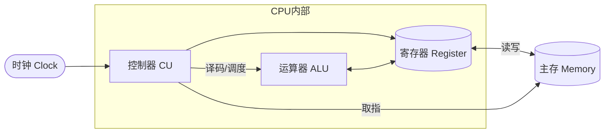
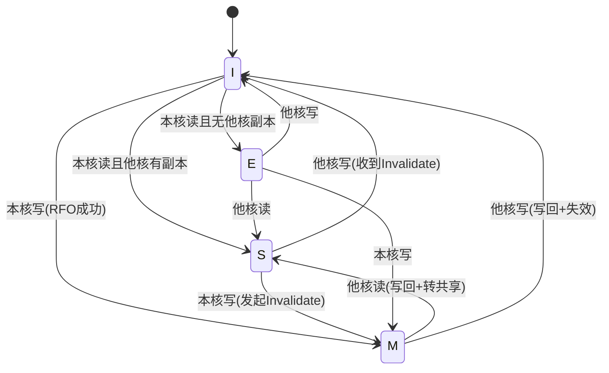
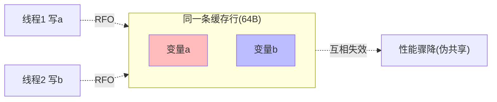

# 03.计算机基础CPU设计
#### 目录介绍
- [01.工作案例引入](#01工作案例引入)
  - [1.1 counter++总是少](#11-counter总是少)
  - [1.2 追问的脉络](#12-追问的脉络)
- [02.认识CPU处理器](#02认识cpu处理器)
  - [2.1 什么是CPU](#21-什么是cpu)
  - [2.2 为何学习CPU](#22-为何学习cpu)
  - [2.3 通用专用处理器](#23-通用专用处理器)
  - [2.4 CPU和GPU](#24-cpu和gpu)
  - [2.5 CPU内部微架构](#25-cpu内部微架构)
  - [2.6 思考一些问题](#26-思考一些问题)
- [03.CPU指令集架构](#03cpu指令集架构)
  - [3.1 CPU指令集架构](#31-cpu指令集架构)
  - [3.2 两种主流指令集](#32-两种主流指令集)
  - [3.3 复杂精简指令集](#33-复杂精简指令集)
  - [3.4 CISC对RISC谁胜出](#34-cisc对risc谁胜出)
  - [3.5 RISC-V的崛起](#35-risc-v的崛起)
- [04.CPU的性能指标](#04cpu的性能指标)
  - [4.1 执行系统参数](#41-执行系统参数)
  - [4.2 存储系统参数](#42-存储系统参数)
  - [4.3 CPU性能公式解析](#43-cpu性能公式解析)
- [05.影响CPU性能因素](#05影响cpu性能因素)
  - [5.1 提升CPU主频](#51-提升cpu主频)
  - [5.2 多核并行执行](#52-多核并行执行)
  - [5.3 指令重排序](#53-指令重排序)
  - [5.4 主频为何停5GHz](#54-主频为何停5ghz)
- [06.缓存一致性设计](#06缓存一致性设计)
  - [6.1 通过案例看CPU读写](#61-通过案例看cpu读写)
  - [6.2 指令重排解决什么](#62-指令重排解决什么)
  - [6.3 缓存一致性问题](#63-缓存一致性问题)
  - [6.4 案例理解一致性](#64-案例理解一致性)
  - [6.5 一致性总思路](#65-一致性总思路)
- [07.纵向Cache一致性](#07纵向cache一致性)
  - [7.1 Cache的读取过程](#71-cache的读取过程)
  - [7.2 写直达策略](#72-写直达策略)
  - [7.3 写回策略](#73-写回策略)
- [08.多核Cache一致性](#08多核cache一致性)
  - [8.1 多核Cache不一致](#81-多核cache不一致)
  - [8.2 写传播与串行化](#82-写传播与串行化)
  - [8.3 总线嗅探与仲裁](#83-总线嗅探与仲裁)
  - [8.4 MESI协议](#84-mesi协议)
  - [8.5 写缓冲失效队列](#85-写缓冲失效队列)
- [09.什么是伪共享](#09什么是伪共享)
  - [9.1 并发伪共享](#91-并发伪共享)
  - [9.2 如何解决伪共享](#92-如何解决伪共享)
  - [9.3 并发集合避伪共享](#93-并发集合避伪共享)
- [10.CPU设计演进总结](#10cpu设计演进总结)
  - [10.1 单核到多核演变](#101-单核到多核演变)
  - [10.2 CPU与编程的关系](#102-cpu与编程的关系)
  - [10.3 面向未来的CPU](#103-面向未来的cpu)
- [11.综合案例LongAdder](#11综合案例longadder)
  - [11.1 案例背景](#111-案例背景)
  - [11.2 AtomicLong瓶颈](#112-atomiclong瓶颈)
  - [11.3 LongAdder三板斧](#113-longadder三板斧)
  - [11.4 本章知识串讲](#114-本章知识串讲)
- [12.思考题与作业](#12思考题与作业)
  - [12.1 基础思考题](#121-基础思考题)
  - [12.2 进阶思考题](#122-进阶思考题)
  - [12.3 动手作业](#123-动手作业)


## 01.工作案例引入

### 1.1 counter++总是少

**场景**：小陈做了个"微服务监控埋点"，需要在每个请求入口给一个全局计数器 `requestCount++`。单机 QPS 大约 5 万。上线后发现：监控面板显示的请求数比 Nginx access log 统计的要**少 30% 左右**，排查半天没找到原因。

代码就这么简单：

```java
public class Counter {
    private long count = 0;          // 最初版本
    public void inc() { count++; }   // 谁能想到这行代码会出问题？
    public long get() { return count; }
}
```

小陈给同事展示代码：10 个线程各跑 100 万次 `inc()`，期望值 1000 万。实测平均只有 620 万。

同事：`count++` 不是原子的，得加 `synchronized` 或者用 `AtomicLong`。

小陈加了 `AtomicLong`，数字对上了，但是——QPS 从 5 万掉到了 1.8 万。性能被砍了一大半。

同事又说：用 `LongAdder` 吧，JDK 8 专门解决高并发计数场景的，比 `AtomicLong` 快好几倍。小陈换上 `LongAdder` 后，QPS 不仅没降反而涨到了 5.6 万。

### 1.2 追问的脉络

这一连串"代码一字之差，性能差几倍"的背后，全部指向 CPU 层面的知识：

- **"为什么 `count++` 不是原子的？"** → 因为它被编译成"读-改-写"三条机器指令
- **"为什么多核上结果会丢？"** → 因为每个 CPU 核有自己的 L1 Cache，**缓存一致性问题**
- **"`AtomicLong` 为什么慢？"** → 它用 CAS 自旋，底层依赖 **MESI 协议** 的 RFO 广播，高并发下核心间互相失效，有效工作时间被缓存同步吃光
- **"`LongAdder` 为什么能快 3 倍？"** → 它用**分桶 + 伪共享填充**，让不同线程写不同的缓存行，从根本上避开了缓存行竞争
- **"@Contended 注解是干嘛的？"** → 就是给字段前后填充字节，让它独占一个 64 字节的**缓存行**，这正是本章第 9 节"伪共享"的实战

本章的主线就是带你把 CPU 剖开看：微架构长什么样、指令怎么流水、缓存分几层、核心之间怎么同步，最终你会在第 11 节看到 `AtomicLong → LongAdder` 这道"性能魔法"背后清晰的硬件逻辑。


## 02.认识CPU处理器

### 2.1 什么是CPU

如何理解CPU呢，它是中央处理单元（Central Processing Unit，CPU），也叫中央处理器或主处理器，是整个计算机的核心，也是整台计算机中造价最昂贵的部件之一。

从硬件的角度： CPU 由超大规模的晶体管组成；

从功能的角度： CPU 内部由时钟、寄存器、控制器和运算器 4 大部分组成。

- 1、时钟（Clock）： 负责发出时钟信号，也可以位于 CPU 外部；
- 2、寄存器（Register）： 负责暂存指令或数据，位于存储器系统金字塔的顶端。使用寄存器能够弥补 CPU 和内存的速度差，减少 CPU 的访存次数，提高 CPU 的吞吐量；
- 3、控制器（Control Unit）： 负责控制程序指令执行，包括从主内存读取指令和数据发送到寄存器，再将运算器计算后的结果写回主内存；
- 4、运算器（Arithmetic Logic Unit，ALU）： 负责执行控制器取出的指令，包括算术运算和逻辑运算。



冯·诺依曼架构


### 2.2 为何学习CPU

日常所处理的工作都是在跟 Java 和 C++ 等高级语言打交道，并不会直接地与 CPU 打交道。那么，为什么我们还要花这么多时间去学习 CPU 呢？我认为有以下原因：

1.掌握 CPU 原理能够开发更高性能的程序： 理解 CPU 的工作原理有助于设计出更高性能的算法或代码，例如通过避免伪共享、提高缓存命中率等方式提高程序运行效率，就需要对 CPU 的缓存机制有一定的理解；

2.扩展方案积累： CPU 是整个计算机系统中最复杂的模块，也是当代计算机科学的制高点。积累 CPU 内部的解决方案，能够为将来的遇到类似问题提供思路，达到触类旁通的作用。例如 CPU 缓存淘汰策略与应用内存的缓存淘汰策略有相似之处；

3.CPU 是知识体系最底层的知识： 当我们在思考或解决某一个问题时，就需要利用到更深层次的知识积累来解释，而 CPU 就是位于知识体系中最底层知识。例在内存系统的可见性、线程池设计等问题中，都需要对 CPU 的执行机制有一定理解。

### 2.3 通用专用处理器

在早期的计算机系统中，只有 1 个通用处理器，使用 1 个处理器就能够完成所有计算任务。后来人们发现可以把一些计算任务分离出来，单独设计专门的芯片微架构，在执行效率上会远远高于通用处理器，最典型的专用处理器就是 GPU 图形处理器。

这种用来专门处理某种计算任务的处理器就是专用处理器，那为什么专用处理器在处理某些特定问题时更快呢，我认为有 3 点解释：

1、最优架构： 专用处理器只处理少量类型的工作，可以为特定工作设计最优芯片架构，而通用处理器只能设计全局最优架构，但不一定是执行特定工作的最优机构；

2、硬件加速： 可以把多条指令的计算工作直接用硬件实现，相比于 CPU 一条条地执行指令，能够节省大量指令周期；

3、成本更低： 专用处理器执行的计算流程是固定的，不需要 CPU 的流水线控制、乱序执行等功能，实现相同计算性能的造价更低。

### 2.4 CPU和GPU

CPU是计算机的主要处理器，负责执行计算机的大部分任务。

它是一个通用处理器，可以执行各种不同类型的指令，包括算术、逻辑、控制和输入/输出操作。

CPU通常具有较少的核心（通常为几个核心），但每个核心都非常强大，可以处理复杂的任务。CPU在操作系统、应用程序和数据处理方面发挥着重要作用。

GPU是专门用于图形处理的处理器。它主要用于处理图形和图像相关的任务，如图形渲染、图像处理、视频解码等。

GPU具有大量的并行处理单元，可以同时处理多个任务。这使得GPU在处理大规模数据和并行计算方面非常高效。GPU在游戏、计算机图形学、科学计算和人工智能等领域发挥着重要作用。

一句话概括CPU和GPU的功能

CPU负责控制和协调计算机的整体运行，处理通用任务和复杂的逻辑操作。而GPU则专注于处理图形和并行计算任务，通过并行处理提供更高的计算性能。

从架构上对比CPU和GPU：

| 对比维度 | CPU | GPU |
|----------|-----|-----|
| 核心数量 | 少（4-64核） | 多（数千核） |
| 单核能力 | 强（复杂逻辑） | 弱（简单运算） |
| 缓存 | 大（多级缓存） | 小 |
| 控制单元 | 复杂（分支预测、乱序执行） | 简单 |
| 适合任务 | 串行、逻辑复杂 | 并行、计算密集 |
| 设计哲学 | 延迟优先（快速完成单个任务） | 吞吐优先（同时处理大量任务） |

### 2.5 CPU内部微架构

**疑惑**：CPU到底是怎么执行一条指令的？内部的各个部件如何协作？

**答疑**：现代CPU的微架构可以简化为以下流程：

```
                    ┌─────────────────────────────┐
                    │          CPU 核心             │
                    │                              │
  指令内存 ───────>│  取指单元（Fetch）              │
                    │     │                        │
                    │     ▼                        │
                    │  译码单元（Decode）             │
                    │     │                        │
                    │     ├──────────┐             │
                    │     ▼          ▼             │
                    │   ALU运算    内存访问          │
                    │  （Execute） （Memory）        │
                    │     │          │             │
                    │     └────┬─────┘             │
                    │          ▼                   │
                    │   写回（Write Back）           │
                    │          │                   │
                    └──────────│───────────────────┘
                               ▼
                          寄存器/内存
```

这就是经典的**五级流水线**：取指（IF）→ 译码（ID）→ 执行（EX）→ 访存（MEM）→ 写回（WB）。现代CPU的流水线级数远超5级（Intel的Skylake有14-19级），但基本思想相同。

### 2.6 思考一些问题

思考一些问题

- 01.CPU优化中，主要是涉及到那些点的优化？如何进行优化和衡量标准？
- 02.CPU主要是跟线程有关吗？如何理解CPU？如何搞懂CPU架构？

一些核心概念

CPU，这里也可以叫做CPU寄存器。一般计算器是多核的，有多个CPU，主要是为了提高计算效率！

## 03.CPU指令集架构

### 3.1 CPU指令集架构

CPU 所能理解的机器语言就是 指令（Instruction Code）， 一个 CPU 所能理解的所有指令就是 指令集（Instruction Set）。

为了保证芯片间的兼容性，芯片厂商并不为每款新芯片设计一个新的指令集，而是将指令集推广为标准规范，这个规范就是 指令集架构（Instruction Set Architecture，ISA） ，

相对于指令集架构，CPU 在实现具体指令集功能的硬件电路设计就是 微架构（Micro Architecture）。

如果用软件的思考方式，ISA 就是 CPU 的功能接口，定义了 CPU 的标准规范，而微架构就是 CPU 的功能实现，定义了 CPU 的具体电路设计，一种指令集可以兼容不同的微架构。

### 3.2 两种主流指令集

因为 CPU 位于整个计算机系统最底层且最核心的部件，如果 CPU 的兼容性都出问题了，那么以前开发的应用软件甚至操作系统将无法在新的 CPU 上运行，这对芯片厂商的生态破坏是致命的。因此，指令集架构是相对稳定的，芯片厂商在 ISA 中添加或删除指令时会非常谨慎。

目前，能够有效占领市场份额的只有 2 个 ISA ，它们也分别代表了复杂与精简 2 个发展方向：

x86 架构： Intel 公司在 1970 年代推出的复杂指令集架构；

ARM 架构： ARM 公司在 1980 年代推出的精简指令集架构，我们熟悉的 Apple M1 芯片、华为麒麟芯片和高通骁龙芯片都是 ARM 架构

### 3.3 复杂精简指令集

在 CPU 指令集的发展过程中，形成了 2 种指令集类型：

复杂指令集（Complex Instruction Set Computer，CISC）： 强调单个指令可以同时执行多个基本操作，用少量指令就可以完成大量工作，执行效率更高；

精简指令集（Reduced Instruction Set Computer，RISC）： 强调单个指令只能执行一个或少数基础操作，指令之间没有重复或冗余的功能，完成相同工作需要使用更多指令。

在早期的计算机系统中，指令集普遍很简单，也没有复杂和精简之分。

随着应用软件的功能越来越丰富，应用层也在反向推动芯片架构师推出更强大的指令集，以简化程序编写和提高性能。例如，一些面向音视频的指令可以在一条指令内同时完成多个数据进行编解码。

CPU 和主存的速度差实在太大了，用更少的指令实现程序功能（指令密度更高）可以减少访存次数。

复杂指令集对精简指令集的优势是几乎全面性的：

1. 优势 1： 可以减少程序占用的内存和磁盘空间大小；
2. 优势 2： 可以减少从内存或磁盘获取指令所需要的带宽，能够提高总线系统的传输效率；
3. 优势 3： CPU L1 Cache 可以容纳更多指令，可以提高缓存命中率。且现代计算机中多个线程会共享 L1 Cache，指令越少对缓存命中率越有利；
4. 优势 4： CPU L2 Cache 可以容纳更多数据，对操作大量数据的程序也有利于提高缓存命中率。

这些优势都是有代价的：

1. 缺点 1 - 处理器设计复杂化： 指令越复杂，用于解析指令的处理器电路设计肯定会越复杂，执行性能功耗也越大；
2. 缺点 2 - 指令功能重叠： 很多新增的指令之间产生了功能重叠，不符合指令集的正交性原则，而且新增的很多复杂指令使用率很低，但处理器却付出了不成正比的设计成本；
3. 缺点 3 - 指令长度不统一： 指令长度不统一，虽然有利于使用哈夫曼编码进一步提高指令密度（频率高的指令用短长度，频率高的指令用大长度），但是指令长度不同，执行时间也有长有短，不利于实现流水线式结构。

### 3.4 CISC对RISC谁胜出

**疑惑**：CISC和RISC争论了几十年，到底谁赢了？

**答疑**：答案是——**谁也没赢，它们融合了**。

现代x86处理器（Intel/AMD）虽然对外暴露的是CISC指令集，但内部实际上会将复杂指令**解码为微操作（μops）**，这些微操作本质上就是RISC风格的简单指令。这样既保持了与CISC生态的兼容，又获得了RISC架构易于流水线化的优势。

```
外部（CISC指令集）          内部（类RISC执行）
┌─────────────────┐    ┌──────────────────┐
│ mov [rbx], eax  │───>│ μop1: 地址计算    │
│ (复杂：寄存器→内存) │    │ μop2: 存储数据    │
└─────────────────┘    └──────────────────┘

┌─────────────────┐    ┌──────────────────┐
│ add eax, ebx    │───>│ μop1: 加法运算    │
│ (简单：1对1)      │    └──────────────────┘
└─────────────────┘
```

**论证**：从市场份额看融合趋势

| 领域 | 主导架构 | 原因 |
|------|----------|------|
| 桌面/服务器 | x86（CISC外壳+RISC内核） | 历史生态 + 极致性能 |
| 手机/嵌入式 | ARM（RISC） | 低功耗需求 |
| 苹果电脑 | ARM（Apple M系列） | ARM性能已追上x86，功耗更低 |
| 超级计算机 | ARM/x86混合 | 富岳超算用ARM |

结论：CISC和RISC不是对立的，而是互相借鉴。重要的不是指令集的风格，而是**微架构的设计水平**。

### 3.5 RISC-V的崛起

RISC-V是加州大学伯克利分校2010年推出的开源指令集架构，正在快速发展。

**为什么RISC-V重要？**

1. **完全开源**：不需要支付授权费（x86和ARM都要），降低芯片设计门槛
2. **模块化设计**：基础指令集极简，按需添加扩展（如浮点、向量、原子操作等）
3. **干净的设计**：吸取了几十年的ISA设计经验，没有历史包袱

```
RISC-V的模块化设计：
┌──────┐
│  I   │ ← 基础整数指令（必选，47条）
├──────┤
│  M   │ ← 乘除法扩展
├──────┤
│  A   │ ← 原子操作扩展
├──────┤
│  F   │ ← 单精度浮点扩展
├──────┤
│  D   │ ← 双精度浮点扩展
├──────┤
│  C   │ ← 压缩指令扩展（16位指令）
├──────┤
│  V   │ ← 向量扩展
└──────┘
```

## 04.CPU的性能指标

### 4.1 执行系统参数

1、主频（Frequency/Clock Rate）：

在 CPU 内部有一个 晶体振荡器（Oscillator Crystal） ，晶振会以一定的频率向控制器发出信号，这个信号频率就是 CPU 的主频。

主频是 CPU 最主要的参数，主频越快，计算机单位时间内能够完成的指令越快。

CPU 的主频并不是固定的，CPU 在运行时可以选择低频、满频甚至超频运行， 但是工作频率越高，意味着功耗也越高；

2、时钟周期（Clock Cycle）：

主频的另一面，即晶振发出信号的时间间隔， 时钟周期=1/主频；

3、外频：

外频是主板为 CPU 提供的时钟频率，早期计算机中 CPU 主频和外频是相同的，但随着 CPU 主频越来越高，而其他设备的速度还跟不上，所以现在主频和外频是不相等的；

4、程序执行时间：

4.1 流逝时间（Wall Clock Time / Elapsed Time）： 程序开始运行到程序结束所流逝的时间；

4.2 CPU 时间（CPU Time）： CPU 实际执行程序的时间，仅包含程序获得 CPU 时间片的时间（用户时间 + 系统时间）。由于 CPU 会并行执行多个任务，所以程序执行时间会小于流逝时间；

4.3 用户时间（User Time）： 用户态下，CPU 切换到程序上执行的时间；

4.4 系统时间（Sys Time）： 内核态下，CPU 切换到程序上执行的时间；

### 4.2 存储系统参数

字长（Word）：

CPU 单位时间内同时处理数据的基本单位，多少位 CPU 就是指 CPU 的字长是多少位，比如 32 位 CPU 的字长就是 32 位，64 位 CPU 的字长就是 64 位；

地址总线宽度（Address Bus Width）：

地址总线传输的是地址信号，地址总线宽度也决定了一个 CPU 的寻址能力，即最多可以访问多少数据空间。举个例子，32 位地址总线可以寻址 4GB 的数据空间；

数据总线宽度（Data Bus Width）：

数据总线传输的是数据信号，数据总线宽度也决定了一个 CPU 的信息传输能力。

区分其它几种容量单位：

1. 字节（Byte）： 字节是计算机数据存储的基本单位，即使存储 1 个位也需要按 1 个字节存储；
2. 块（Block）： 块是 CPU Cache 管理数据的基本单位，也叫 CPU 缓存行；
3. 段（Segmentation）/ 页（Page）： 段 / 页是操作系统管理虚拟内存的基本单位。

### 4.3 CPU性能公式解析

**疑惑**：CPU性能到底由什么决定？主频越高性能就越好吗？

**答疑**：不是。CPU性能由三个因素共同决定：

```
CPU执行时间 = 指令数 × CPI × 时钟周期
            = 指令数 × CPI / 主频
```

其中：
- **指令数（Instruction Count）**：程序需要执行的指令总数，取决于算法和编译器
- **CPI（Cycles Per Instruction）**：每条指令平均需要的时钟周期数，取决于CPU微架构
- **时钟周期（Clock Period）= 1/主频**：取决于制程工艺和电路设计

**论证**：为什么不能只看主频

假设CPU A主频5GHz，CPI=4；CPU B主频3GHz，CPI=1。执行同一个1000条指令的程序：

```
CPU A: 1000 × 4 / 5GHz = 800ns
CPU B: 1000 × 1 / 3GHz = 333ns
```

主频低的CPU B反而快了2.4倍！因为它的CPI更低（每条指令执行更快）。

这就是为什么Intel的奔腾4（Pentium 4）虽然主频高达3.8GHz，性能却不如主频更低的Core 2 Duo。奔腾4使用了超深流水线（31级），虽然提高了主频，但也增加了分支预测失败的惩罚，反而导致CPI上升。

**结论**：评估CPU性能要看综合指标，不能只看主频。

## 05.影响CPU性能因素

1、提升 CPU 性能不止是 CPU 的任务： 计算机系统是多个部件组成的复杂系统，脱离整体谈局部没有意义；

2、平衡性能与功耗： 一般来说，CPU 的计算性能越高，功耗也越大。我们需要综合考虑性能和功耗的关系，脱离功耗谈性能没有意义。

### 5.1 提升CPU主频

提升主频对 CPU 性能的影响是最直接的，过去几十年 CPU 的主要发展方向也是在怎么提升 CPU 主频的问题上。

最近几年 CPU 主频的速度似乎遇到瓶颈了。因为想要主频越快，要么让 CPU 满频或超频运行，要么升级芯片制程，在单位体积里塞进去更多晶体管。

这两种方式都会提升 CPU 功耗，带来续航和散热问题。如果不解决这两个问题，就无法突破主频瓶颈。

### 5.2 多核并行执行

既然单核 CPU 的性能遇到瓶颈，那么在 CPU 芯片里同时塞进去 2 核、4 核甚至更多，那么整个 CPU 芯片的性能不就直接翻倍提升吗？

理想很美好，现实是性能并不总是随着核心数线性增加。在核心数较小时，增加并行度得到的加速效果近似于线性提升，但增加到一定程度后会趋于一个极限， 说明增加并行度的提升效果也是有瓶颈的。

为什么呢？因为不管程序并行度有多高，最终都会有一个结果汇总的任务，而汇总任务无法并行执行，只能串行执行。例如，我们用 Java 的 Fork/Join 框架将一个大任务分解为多个子任务并行执行，最终还是需要串行地合并子任务的结果。

### 5.3 指令重排序

现代 CPU 为了提高并行度，会在遵守单线程数据依赖性原则的前提下，对程序指令做一定的重排序。事实上不止是 CPU，从源码到指令执行一共有 3 种级别重排序：

1、编译器重排序： 例如将循环内重复调用的操作提前到循环外执行；

2、处理器系统重排序： 例如指令并行技术将多条指令重叠执行，或者使用分支预测技术提前执行分支的指令，并把计算结果放到重排列缓冲区（Reorder Buffer）的硬件缓存中，当程序真的进入分支后直接使用缓存中的结算结果；

3、存储器系统重排序： 例如写缓冲区和失效队列机制，即是可见性问题，从内存的角度也是指令重排问题。

指令重排序类型


### 5.4 主频为何停5GHz

**疑惑**：从1990年代到2000年代，CPU主频从几十MHz一路飙升到3GHz以上。但从2004年至今，主频几乎没有增长，一直徘徊在3-5GHz。为什么？

**答疑**：这就是著名的**"功耗墙"（Power Wall）**问题。

CPU的功耗（动态功耗）与主频的关系：

```
P = C × V² × f

P = 功耗
C = 电容（与晶体管数量和制程相关）
V = 电压
f = 频率（主频）
```

要提高主频f，往往需要同时提高电压V（更高频率需要更强的电信号驱动）。而功耗与电压的**平方**成正比！

```
主频 ×2 → 电压大约 ×1.3 → 功耗大约 ×2.6
主频 ×4 → 电压大约 ×1.7 → 功耗大约 ×11.6
```

功耗过高带来的连锁问题：
1. **散热困难**：芯片温度过高会导致晶体管失效
2. **续航缩短**：对笔记本和手机影响巨大
3. **Dennard Scaling终结**：晶体管缩小后电压无法等比例降低

**技术演变过程**：

```
1990-2004: 频率竞赛时代
  主频从 33MHz → 3.8GHz（100倍提升）
  Intel Pentium 4 NetBurst架构，31级流水线
  功耗达到100W+，散热成为大问题
                │
                ▼ 撞上"功耗墙"
                │
2005至今: 多核并行时代
  放弃追求极致主频
  转向多核心（2核 → 4核 → 8核 → 16核 → 64核...）
  提高微架构效率（IPC，每周期指令数）
  Apple M1: 高效能核心3.2GHz + 高能效核心2GHz
```

**结论**：CPU的发展方向从"更快"转向了"更聪明"——通过更好的微架构设计、更多的核心、更智能的调度来提升性能。


## 06.缓存一致性设计

### 6.1 通过案例看CPU读写

CPU寄存器读和写数据

当CPU需要读取主内存的时候，他会将部分数据读到CPU缓存中，甚至可以将CPU缓存中的部分数据读到寄存器中，然后在寄存器中操作，操作完成后，需要将数据写入主存中的时候，先将数据刷新至CPU缓存中，然后在某个时间点将数据刷新到主存中。

当CPU需要在缓存层存放一些东西的时候，存放在缓存中的内容通常会被刷新回主存。CPU缓存可以在某一时刻将数据局部写到它的内存中，和在某一时刻局部刷新它的内存。它不会再某一时刻读/写整个缓存。

举一个案例理解CPU执行读写操作

For example : int i = i + 1

当线程执行这个语句时，会先从主内存中读取i的值，然后复制一份到CPU的高速缓存中，然后CPU执行指令对i进行加1的操作，然后将数据写入高速缓存，最后将最新的i值刷新到主存当重。

### 6.2 指令重排解决什么

**疑惑**：为什么CPU要对指令进行重排序？这不会导致程序逻辑出错吗？

**答疑**：CPU指令重排的目的是**填充流水线的空闲周期**，提高指令级并行度。

考虑这样的指令序列：

```
指令1: a = b + c      // 需要从内存读取b和c，假设耗时100个周期
指令2: d = a + 1      // 依赖指令1的结果a，必须等指令1完成
指令3: e = f + g      // 与指令1、2完全无关
```

**不重排**：指令3必须等指令2完成才能执行，总耗时 = 100 + 1 + 1 = 102周期

**重排后**：
```
指令1: a = b + c      // 开始执行，等待内存
指令3: e = f + g      // 与指令1并行执行（填充等待时间）
指令2: d = a + 1      // 指令1完成后执行
```

总耗时 ≈ 100 + 1 = 101周期（指令3的执行时间被"隐藏"了）

CPU保证**单线程语义不变**——as-if-serial原则。重排后的执行结果与顺序执行完全一致。

但在**多线程环境**下，指令重排可能导致其他线程看到"中间状态"，这就是Java中volatile和内存屏障（Memory Barrier）要解决的可见性问题。

### 6.3 缓存一致性问题

CPU 缓存一致性（Cache Coherence）问题指 CPU Cache 与内存的不一致性问题。

事实上， 在分析缓存一致性问题时，考虑 L1 / L2 / L3 的多级缓存没有意义， 所以我们提出缓存一致性抽象模型，只考虑核心独占的缓存。

在单核 CPU 中，只需要考虑 Cache 与内存的一致性。

在多核 CPU 中，由于每个核心都有一份独占的 Cache，就会存在一个核心修改数据后，两个核心 Cache 数据不一致的问题。

因此，我认为 CPU 的缓存一致性问题应该从 2 个维度理解：

纵向：Cache 与内存的一致性问题： 在修改 Cache 数据后，如何同步回内存？

横向：多核心 Cache 的一致性问题： 在一个核心修改 Cache 数据后，如何同步给其他核心 Cache？

### 6.4 案例理解一致性

现代 CPU 通常有多个核心

每个核心也都有自己独立的缓存（L1、L2 缓存），当多个核心同时操作同一个数据时，如果核心 2 在核心 1 还未将更新的数据同步回内存之前读取了数据，就出现了缓存不一致问题。

举个例子，假设线程 A 和线程 B 同时对一个变量执行 i++，就可能存在缓存不一致问题：

1、核心 A 和核心 B 从内存中加载了 i 的值，并且缓存到各自的高速缓存中，此时两个副本都为0；

2、核心 A 进行加一操作，副本值变成了 1，最后回写到主存中，主存中的值为 1；

3、核心 B 进行加一操作，副本值变成了 1，最后回写到主存中，主存中的值为 1；

4、最终主存的值为 1，而不是期望的 2。

### 6.5 一致性总思路

解决CPU缓存不一致性问题

**锁总线**：

锁总线是对整个内存加锁，在锁总线期间，其他处理器无法访问内存，可想而知会严重降低 CPU 性能。

**缓存一致性协议**：

「锁内存方案」相当于保证了整块内存的一致性，而「缓存一致性协议方案」本质上相当与一致性保护范围，从整块内存缩小为单个缓存行（缓存行是缓存的基本单元）。

缓存一致性协议提供了一种高效的内存数据管理方案。当 CPU 核心准备写数据时，如果发现操作的变量是共享变量（即在其他核心中也存在该变量的副本），就会通知其他核心该变量「缓存行」无效，需要重新从内存读取。

## 07.纵向Cache一致性
### 7.1 Cache的读取过程

讨论 Cache 的读取过程。事实上，Cache 的读取过程会受到 Cache 的写入策略影响，我们暂且用相对简单的 “写直达策略” 的读取过程：

1、CPU 在访问内存地址时，会先检查该地址的数据是否已经加载到 Cache 中（Valid bit 是否为 1）；

2、如果数据在 Cache 中，则直接读取 Cache 块上的字到 CPU 中；

3、如果数据不在 Cache 中：

3.1 如果 Cache 已装满或者 Cache 块被占用，先执行替换策略，腾出空闲位置；

3.2 访问内存地址，并将内存地址所处的整个内存块写入到映射的 Cache 块中；

3.3 读取 Cache 块上的字到 CPU 中。

CPU 不仅会读取 Cache 数据，还会修改 Cache 数据，这就是第 1 个一致性问题

在修改 Cache 数据后，如何同步回内存？有 2 种写入策略：写直达策略（Write-Through）；写回策略（Write-Back）

### 7.2 写直达策略

写直达策略是解决 Cache 与内存一致性最简单直接的方式： 在每次写入操作中，同时修改 Cache 数据和内存数据，始终保持 Cache 数据和内存数据一致：

1、如果数据不在 Cache 中，则直接将数据写入内存；

2、如果数据已经加载到 Cache 中，则不仅要将数据写入 Cache，还要将数据写入内存。

写直达的优点和缺点都很明显：

优点： 每次读取操作就是纯粹的读取，不涉及对内存的写入操作，读取速度更快；

缺点： 每次写入操作都需要同时写入 Cache 和写入内存，在写入操作上失去了 CPU 高速缓存的价值，需要花费更多时间。

### 7.3 写回策略

既然写直达策略在每次写入操作都会写内存，那么有没有什么办法可以减少写回内存的次数呢？这就是写回策略：

1、写回策略会在每个 Cache 块上增加一个 “脏（Dirty）” 标记位 ，当一个 Cache 被标记为脏时，说明它的数据与内存数据是不一致的；

2、在写入操作时，我们只需要修改 Cache 块并将其标记为脏，而不需要写入内存；

3、那么，什么时候才将脏数据写回内存呢？—— 就发生在 Cache 块被替换出去的时候：

3.1 在写入操作中，如果目标内存块不在 Cache 中，需要先将内存块数据读取到 Cache 中。如果替换策略换出的旧 Cache 块是脏的，就会触发一次写回内存操作；

3.2 在读取操作中，如果目标内存块不在 Cache 中，且替换策略换出的旧 Cache 块是脏的，就会触发一次写回内存操作；

## 08.多核Cache一致性

### 8.1 多核Cache不一致

在单核 CPU 中，我们通过写直达策略或写回策略保持了Cache 与内存的一致性。但是在多核 CPU 中，由于每个核心都有一份独占的 Cache，就会存在一个核心修改数据后，两个核心 Cache 不一致的问题。

举个例子：

1、Core 1 和 Core 2 读取了同一个内存块的数据，在两个 Core 都缓存了一份内存块的副本。此时，Cache 和内存块是一致的；

2、Core 1 执行内存写入操作：

2.1 在写直达策略中，新数据会直接写回内存，此时，Cache 和内存块一致。但由于之前 Core 2 已经读过这块数据，所以 Core 2 缓存的数据还是旧的。此时，Core 1 和 Core 2 不一致；

2.2 在写回策略中，新数据会延迟写回内存，此时 Cache 和内存块不一致。不管 Core 2 之前有没有读过这块数据，Core 2 的数据都是旧的。此时，Core 1 和 Core 2 不一致。

3、由于 Core 2 无法感知到 Core 1 的写入操作，如果继续使用过时的数据，就会出现逻辑问题。

多核 Cache 不一致

由于两个核心的工作是独立的，在一个核心上的修改行为不会被其它核心感知到，所以不管 CPU 使用写直达策略还是写回策略，都会出现缓存不一致问题。

所以，我们需要一种机制，将多个核心的工作联合起来，共同保证多个核心下的 Cache 一致性，这就是缓存一致性机制。

### 8.2 写传播与串行化

缓存一致性机制需要解决的问题就是 2 点：

特性 1 - 写传播（Write Propagation）： 每个 CPU 核心的写入操作，需要传播到其他 CPU 核心；

特性 2 - 事务串行化（Transaction Serialization）： 各个 CPU 核心所有写入操作的顺序，在所有 CPU 核心看起来是一致。

第 1 个特性解决了 “感知” 问题，如果一个核心修改了数据，就需要同步给其它核心，很好理解。但只做到同步还不够，如果各个核心收到的同步信号顺序不一致，那最终的同步结果也会不一致。

举个例子：假如 CPU 有 4 个核心，Core 1 将共享数据修改为 1000，随后 Core 2 将共享数据修改为 2000。

在写传播下，“修改为 1000” 和 “修改为 2000” 两个事务会同步到 Core 3 和 Core 4。

但是，如果没有事务串行化，不同核心收到的事务顺序可能是不同的，最终数据还是不一致。

### 8.3 总线嗅探与仲裁

写传播和事务串行化在 CPU 中是如何实现的呢？—— 此处隆重请出计算机总线系统。

写传播 - 总线嗅探： 总线除了能在一个主模块和一个从模块之间传输数据，还支持一个主模块对多个从模块写入数据，这种操作就是广播。要实现写传播，其实就是将所有的读写操作广播到所有 CPU 核心，而其它 CPU 核心时刻监听总线上的广播，再修改本地的数据；

事务串行化 - 总线仲裁： 总线的独占性要求同一时刻最多只有一个主模块占用总线，天然地会将所有核心对内存的读写操作串行化。如果多个核心同时发起总线事务，此时总线仲裁单元会对竞争做出仲裁，未获胜的事务只能等待获胜的事务处理完成后才能执行。

基于总线嗅探和总线仲裁，现代 CPU 逐渐形成了各种缓存一致性协议，例如 MESI 协议。

### 8.4 MESI协议

MESI 协议其实是 CPU Cache 的有限状态机，一共有 4 个状态（MESI 就是状态的首字母）：

1. M（Modified，已修改）： 表明 Cache 块被修改过，但未同步回内存；
2. E（Exclusive，独占）： 表明 Cache 块被当前核心独占，而其它核心的同一个 Cache 块会失效；
3. S（Shared，共享）： 表明 Cache 块被多个核心持有且都是有效的；
4. I（Invalidated，已失效）： 表明 Cache 块的数据是过时的。 

如何理解

在 “独占” 和 “共享” 状态下，Cache 块的数据是 “清” 的，任何读取操作可以直接使用 Cache 数据；

在 “已失效” 和 “已修改” 状态下，Cache 块的数据是 “脏” 的，它们和内存的数据都可能不一致。在读取或写入 “已失效” 数据时，需要先将其它核心 “已修改” 的数据写回内存，再从内存读取；

在 “共享” 和 “已失效” 状态，核心没有获得 Cache 块的独占权（锁）。在修改数据时不能直接修改，而是要先向所有核心广播 RFO（Request For Ownership）请求 ，将其它核心的 Cache 置为 “已失效”，等到获得回应 ACK 后才算获得 Cache 块的独占权。这个独占权这有点类似于开发语言层面的锁概念，在修改资源之前，需要先获取资源的锁；

在 “已修改” 和 “独占” 状态下，核心已经获得了 Cache 块的独占权（锁）。在修改数据时不需要向总线发送广播，能够减轻总线的通信压力。



事实上，完整的 MESI 协议更复杂，但我们没必要记得这么细。我们只需要记住最关键的 2 点：

关键 1 - 阻止同时有多个核心修改的共享数据： 当一个 CPU 核心要求修改数据时，会先广播 RFO 请求获得 Cache 块的所有权，并将其它 CPU 核心中对应的 Cache 块置为已失效状态；

关键 2 - 延迟回写： 只有在需要的时候才将数据写回内存，当一个 CPU 核心要求访问已失效状态的 Cache 块时，会先要求其它核心先将数据写回内存，再从内存读取。

### 8.5 写缓冲失效队列

MESI协议要求每次写入前都要等待其他核心的ACK响应，这会严重拖慢CPU性能。为此引入了两个优化：

**写缓冲区（Store Buffer）**：

CPU核心写入数据时，不等待其他核心ACK，先将数据写入Store Buffer，然后继续执行后续指令。当收到ACK后，再将Store Buffer中的数据写入Cache。

```
CPU核心 → Store Buffer → 等待ACK → 写入Cache
          （CPU不等待，继续执行）
```

**失效队列（Invalidation Queue）**：

当CPU核心收到其他核心的"失效"通知时，不立即处理（因为处理需要时间），而是先放入失效队列，返回ACK。之后再异步处理失效操作。

```
收到失效通知 → 放入失效队列 → 立即返回ACK
               （稍后异步处理）
```

**带来的问题**：这两个优化虽然提高了性能，但破坏了严格的顺序一致性——一个核心可能看到过期的数据（失效队列中的通知还没处理），或其他核心看不到最新数据（数据还在Store Buffer中）。

这就是为什么编程语言层面需要**内存屏障（Memory Barrier）**来保证可见性：

```java
// Java中的volatile就是通过内存屏障实现的
volatile boolean flag = false;

// 线程A
data = 42;           // 普通写
flag = true;         // volatile写 → 插入StoreStore屏障 + StoreLoad屏障
                     // 保证data=42对其他线程可见

// 线程B
if (flag) {          // volatile读 → 插入LoadLoad屏障 + LoadStore屏障
    use(data);       // 保证能看到线程A写入的data=42
}
```

## 09.什么是伪共享

### 9.1 并发伪共享

在并行场景中，当多个处理器核心修改同一个缓存行变量时，有 2 种情况：

情况 1 - 修改同一个变量：

两个处理器并行修改同一个变量的情况，CPU 会通过 MESI 机制维持两个核心的缓存中的数据一致性（Conherence）。

简单来说，一个核心在修改数据时，需要先向所有核心广播 RFO 请求，将其它核心的 Cache Line 置为 “已失效”。

其它核心在读取或写入 “已失效” 数据时，需要先将其它核心 “已修改” 的数据写回内存，再从内存读取；

情况 2 - 修改不同变量：

两个处理器并行修改不同变量的情况，从程序员的逻辑上看，两个核心没有数据依赖关系，因此每次写入操作并不需要把其他核心的 Cache Line 置为 “已失效”。

但从 CPU 的缓存一致性机制上看，由于 CPU 缓存的颗粒度是一个个缓存行，而不是其中的一个个变量。当修改其中的一个变量后，缓存控制机制也必须把其它核心的整个 Cache Line 置为 “已失效”。

那么什么是伪共享问题

多个核心修改同一个变量时，使用 MESI 机制维护数据一致性是必要且合理的。但是多个核心分别访问不同变量时，MESI 机制却会出现不符合预期的性能问题。

在高并发的场景下，核心的写入操作就会交替地把其它核心的 Cache Line 置为失效，强制对方刷新缓存数据，导致缓存行失去作用，甚至性能比串行计算还要低。



### 9.2 如何解决伪共享

那么，怎么解决伪共享问题呢？其实方法很简单 —— 缓存行填充：

1、分组： 首先需要考虑哪些变量是独立变化的，哪些变量是协同变化的。协同变化的变量放在一组，而无关的变量分到不同组；

2、填充： 在变量前后填充额外的占位变量，避免变量和其他分组的被填充到同一个缓存行中，从而规避伪共享问题。

### 9.3 并发集合避伪共享

很多高性能并发框架都内置了伪共享的解决方案：

**Java的@Contended注解**（JDK 8+）：

```java
// JDK内部的LongAdder就使用了这个技术
@sun.misc.Contended
static final class Cell {
    volatile long value;
    // @Contended 会自动在value前后填充128字节
    // 确保不同Cell对象不在同一个缓存行
}
```

**C/C++的缓存行对齐**：

```cpp
// 手动填充到缓存行大小（通常64字节）
struct alignas(64) PaddedCounter {
    volatile long value;
    // 编译器自动填充到64字节对齐
};
```

**Go的缓存行填充**：

```go
type CacheLinePad struct {
    _ [64]byte  // 填充一个缓存行
}

type SharedData struct {
    CacheLinePad
    counter1 int64
    CacheLinePad
    counter2 int64  // counter1和counter2不在同一个缓存行
    CacheLinePad
}
```

**结论**：伪共享是硬件级别的性能陷阱，理解CPU缓存机制对编写高性能并发程序至关重要。


## 10.CPU设计演进总结

### 10.1 单核到多核演变

```
1940s-1970s: 单处理器时代
  │  电子管 → 晶体管 → 集成电路
  │  主要提升：从无到有，建立基本架构
  │
  ▼
1970s-2000s: 频率竞赛时代
  │  Intel 8086(5MHz) → Pentium 4(3.8GHz)
  │  主要提升：提高主频、加深流水线、增加缓存
  │  终结原因：功耗墙（P ∝ V²×f）
  │
  ▼
2005-至今: 多核并行时代
  │  双核 → 四核 → 八核 → 64核
  │  主要提升：核心数量、微架构效率（IPC）
  │  辅助技术：超线程、SIMD、乱序执行
  │
  ▼
未来: 异构计算时代
     CPU + GPU + NPU + DSP
     大小核架构（如ARM big.LITTLE，Apple M系列）
     芯粒（Chiplet）封装技术
```

### 10.2 CPU与编程的关系

作为程序员，理解CPU设计对编写高性能代码有直接帮助：

| CPU原理 | 编程影响 | 优化建议 |
|---------|---------|---------|
| 缓存行（64B） | 数据布局影响性能 | 将频繁一起访问的数据放在一起 |
| 分支预测 | if/else顺序有讲究 | 将高概率分支放在前面 |
| 指令流水线 | 分支导致流水线刷新 | 减少不可预测的分支 |
| 缓存一致性 | 多线程共享变量有开销 | 减少共享，避免伪共享 |
| 乱序执行 | 内存可见性问题 | 正确使用volatile/atomic |
| SIMD | 向量运算可加速 | 数据对齐、循环向量化 |

### 10.3 面向未来的CPU

当前CPU发展的几个重要趋势：

1. **异构计算**：CPU不再是唯一的计算核心，GPU、NPU（神经网络处理器）、DPU（数据处理器）各司其职
2. **大小核架构**：高性能核心处理计算密集型任务，高效能核心处理后台任务，平衡性能和功耗
3. **Chiplet技术**：将单片SoC拆分为多个小芯片（chiplet）互联封装，提高良率、降低成本
4. **UCIe标准**：芯粒间的统一互联标准，类比PCB上的PCIe
5. **3D堆叠**：将缓存芯片堆叠在CPU上方，缩短数据传输距离


## 参考

程序员学习 CPU 有什么用？

https://juejin.cn/post/7166625448254767118


## 11.综合案例LongAdder

本章讲了指令集、流水线、重排序、Cache 一致性、MESI、伪共享一整套 CPU 设计。我们用 JDK 里 `AtomicLong → LongAdder` 这道经典演化，把这些知识全部串起来。

### 11.1 案例背景

高并发计数场景（比如监控埋点、QPS 统计、抖音点赞数）对"自增操作"要求极高。JDK 先后提供了三套方案，它们的性能差距可以在实测中差出 10 倍：

| 实现 | JDK 版本 | 原理 | 高并发性能（16 核） |
|------|---------|------|------------------|
| `synchronized long` | 任意 | 重量级锁 | ~1x（基准） |
| `AtomicLong` | 1.5 | CAS + volatile | ~3x |
| `LongAdder` | 1.8 | 分桶 + 伪共享填充 | ~10x |

### 11.2 AtomicLong瓶颈

`AtomicLong.incrementAndGet()` 的核心是一个 CAS 自旋循环：

```java
public final long incrementAndGet() {
    for (;;) {
        long current = get();
        long next = current + 1;
        if (compareAndSet(current, next))
            return next;
    }
}
```

它的问题藏在 CPU 层面：

```
Core 0 要 CAS                     Core 1 要 CAS
   │                                 │
   │ 1. 先 RFO 广播，声明独占          │
   │────────总线─────→其它核心置 I    │
   │ 2. L1 进入 M 状态                │
   │ 3. CAS 成功                     │
   │                                 │ 1. 它也要 RFO
   │                                 │ 广播，把 Core0 的 I
   │ ← 被动置为 I                     │ 改成 I，自己进 M
   │ 4. 下一轮要再次 RFO 抢回          │
   └──────────── 乒 乓 球 ───────────┘
```

**根因**：这个 long 字段只有一个物理地址，多核想写它就必须轮流独占同一个缓存行。16 核同时抢一个缓存行，总线广播 + RFO 等待 + 缓存失效 + 重新加载，CPU 有效工作时间被同步开销吃光。这就是 7.4 节讲的 **MESI 协议在高竞争下的副作用**。

### 11.3 LongAdder三板斧

LongAdder 的思路叫"**能不共享就不共享**"，三个优化刚好对应本章的三个核心知识点：

**板斧一：分桶（对应第 9 节伪共享的反向应用）**

```java
// LongAdder 内部维护一个 Cell[]
transient volatile Cell[] cells;
transient volatile long base;

public void add(long x) {
    // 低竞争：直接 CAS base
    // 高竞争：按线程哈希到不同 Cell，每个 Cell 独立 CAS
    Cell cell = cells[hash(Thread.currentThread()) & (cells.length - 1)];
    cell.cas(cell.value, cell.value + x);
}
```

16 个线程散列到 16 个 Cell，每个 Cell 独立累加。**最终求和**：`sum() = base + Σ cells[i].value`。这相当于把"一个 long 被 16 核抢"变成"16 个 long 各被 1 核独占"。

**板斧二：缓存行填充（@Contended）**

光分桶还不够。`Cell` 本身只有 16 字节（对象头 + long），多个 `Cell` 对象可能被分配到相邻地址，**挤进同一个 64 字节缓存行**——这正是 8.1 节的"伪共享"。

JDK 的解法：

```java
@jdk.internal.vm.annotation.Contended
static final class Cell {
    volatile long value;
    // @Contended 在字段前后各填充 64/128 字节
    // 保证每个 Cell 独占一个缓存行
}
```

配合 JVM 参数 `-XX:-RestrictContended`，让每个 Cell 独占 128 字节，彻底消除 Cell 之间的伪共享。

**板斧三：减少写传播**

分桶 + 填充后，Core 0 写 Cell[0]，Core 1 写 Cell[1]，它们在不同的缓存行里。MESI 协议**不需要广播 RFO 让其它核失效**，因为其它核本来就没缓存这一行。

```
AtomicLong（坏）             LongAdder（好）
                              
   Core 0 ─┐                   Core 0 → Cell[0]（独占缓存行）
   Core 1 ─┤─ 抢同一            Core 1 → Cell[1]（独占缓存行）
   Core 2 ─┤  缓存行             Core 2 → Cell[2]（独占缓存行）
   Core 3 ─┘                   Core 3 → Cell[3]（独占缓存行）
   
  → 互相失效，乒乓球             → 零缓存行竞争
  → CAS 成功率低，大量自旋         → CAS 一次成功
```

### 11.4 本章知识串讲

把上面的分析映射到本章每一节：

| 本章节点 | 在 LongAdder 故事里的角色 |
|---------|------------------------|
| 1.5 CPU 微架构 | `count++` 被解码成三条微指令（load / add / store），并行能力弱 |
| 2.x 指令集 | CAS 底层是 `lock cmpxchg`（x86）或 `ldxr/stxr`（ARM），指令级支持 |
| 4.3 指令重排 | 为什么 `AtomicLong` 的字段要 volatile：保证可见性 + 禁止乱序 |
| 5.x 缓存一致性 | 为什么多核争抢 `AtomicLong` 会慢：缓存行在多核间乒乓 |
| 6.3 写回策略 | CAS 成功后脏数据要刷回内存，写回策略决定了何时真正可见 |
| 7.4 MESI 协议 | `AtomicLong` 高并发下卡在 RFO 广播上 |
| 7.5 Store Buffer | 为什么 volatile 要插内存屏障，确保 Store Buffer 刷出 |
| 8.1 伪共享 | Cell 数组之间如果不填充就会踩坑 |
| 8.3 @Contended | JDK 给出的硬件级优化工具 |

**结论一句话**：`LongAdder` 不是算法变强了，而是它**充分理解并配合了 CPU 的缓存一致性机制**——让写操作尽量"在自己那一行"完成，避免触发核心间的同步。这是"懂 CPU"的代码和"不懂 CPU"的代码在高并发场景下的本质差距。


## 12.思考题与作业

### 12.1 基础思考题

1. **`count++` 拆成几条指令？** 请用伪汇编写出 `count = count + 1` 在 CPU 层面实际执行的步骤，并解释它为什么不是原子的。

2. **CISC vs RISC**：Intel x86 对外是 CISC，内部解码成 μops 后实际是 RISC 风格。为什么 Intel 不干脆只做 RISC？保留 CISC 外壳的理由是什么？

3. **功耗墙**：为什么 2004 年之后 CPU 单核主频几乎不再增长？请用 `P = C × V² × f` 解释"双倍主频带来的功耗代价"。

4. **MESI 四状态对号入座**：把"刚 new 出来的对象"、"只读共享的配置"、"正在被当前线程高频修改的计数器"、"被其它线程写过的过期数据"分别对应到 M / E / S / I 四个状态。

5. **伪共享的判定**：下面哪些场景会踩到伪共享？
   - 两个线程分别写同一个 Java 对象的两个 `long` 字段
   - 两个线程分别写数组 `long[]` 的不同下标
   - 两个线程分别写两个对象的各自 `long` 字段（对象由 JVM 连续分配）

### 12.2 进阶思考题

1. **`AtomicLong` 的"伪原子"成本**：为什么说 CAS 并不是"免费的原子"？在什么场景下 `AtomicLong` 的性能会比 `synchronized` 还差？

2. **LongAdder 的权衡**：LongAdder 在极端情况下会比 AtomicLong 慢——是哪些情况？提示：考虑低并发时的开销、内存占用、读操作（`sum()`）的成本。

3. **volatile 和内存屏障**：Java 的 `volatile` 在 x86 和 ARM 上编译出的机器码不一样。为什么 x86 只需要插一条 `mfence`，而 ARM 需要插 `dmb ish`？提示：两种架构的内存模型强弱不同。

4. **伪共享的代价有多大？** 设计一个实验：两个线程分别写数组 `long[8]` 的 `a[0]` 和 `a[1]`（相邻），对比改为 `a[0]` 和 `a[8]`（跨一个缓存行）的耗时。你预期能看到多少倍差距？为什么？

5. **为什么 L1 要分 I-Cache 和 D-Cache？** 这是哈佛架构的设计。从"取指"和"取数据"在流水线中的并行需求出发解释。

### 12.3 动手作业

**作业一（必做）**：复现 LongAdder vs AtomicLong 的性能差异。

```java
// 设计实验：
// 1. 起 16 个线程，每个线程循环 1000 万次自增
// 2. 分别用 synchronized long、AtomicLong、LongAdder 实现
// 3. 记录各自的耗时和最终值
// 4. 绘制性能对比图
```

- 思考：如果只起 1 个线程呢？`AtomicLong` 和 `LongAdder` 谁快？为什么？
- 思考：线程数从 1 加到 64，三条曲线分别是什么形状？

**作业二（选做）**：手动制造伪共享并消除它。

写两份代码：

```java
// 版本 A（容易踩坑）
class BadPair {
    volatile long a;
    volatile long b;  // a 和 b 大概率在同一缓存行
}

// 版本 B（安全）
class GoodPair {
    volatile long a;
    long p1, p2, p3, p4, p5, p6, p7;  // 填充 56 字节
    volatile long b;
}
```

两个线程分别高频写 `a` 和 `b`，对比两种版本的耗时。你会直观感受到伪共享的"硬件惩罚"。

**作业三（拓展）**：读一段汇编看 CAS。

```java
AtomicLong al = new AtomicLong(0);
al.incrementAndGet();
```

用 `-XX:+UnlockDiagnosticVMOptions -XX:+PrintAssembly` 打印出 `incrementAndGet` 的本地汇编，找到 `lock cmpxchgq` 指令，理解 `lock` 前缀是如何让这条指令变成"原子"的（提示：`lock` 会锁总线或锁缓存行）。

做完这三个作业，你会彻底明白：**高性能并发代码从来不只是算法问题，而是你对 CPU 硬件特性的理解深度问题**。

