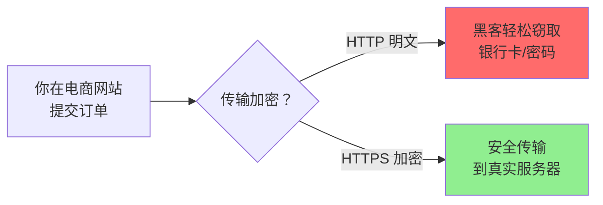

#### 目录介绍
- 01.工作案例引入
  - 1.1 网上支付被截胡了
  - 1.2 为什么要学加密协议
- 02.点外卖可以HTTP吗
  - 2.1 HTTP的安全隐患
  - 2.2 加密的基本思路
  - 2.3 为什么需要加密
- 03.对称加密
  - 3.1 对称加密的原理
  - 3.2 密钥分发的困境
  - 3.3 对称加密的实际应用
- 04.非对称加密
  - 4.1 非对称加密思路
  - 4.2 公钥私钥的配合
  - 4.3 双向公私钥体系
- 05.数字证书
  - 5.1 证书解决了什么
  - 5.2 CA的信任链
  - 5.3 证书的生成过程
  - 5.4 证书验证的完整流程
- 06.HTTPS的工作模式
- 07.重放与篡改
- 08.小结一下
- 09.加密算法深度解析
  - 9.1 对称加密算法对比
  - 9.2 非对称加密原理
  - 9.3 HTTPS加密演进
- 10.密钥交换协议设计
  - 10.1 RSA密钥交换的缺陷
  - 10.2 DH密钥交换原理
  - 10.3 ECDHE密钥交换
  - 10.4 前向安全性
- 11.证书体系深度剖析
  - 11.1 X.509证书结构
  - 11.2 证书链验证过程
  - 11.3 证书吊销机制
  - 11.4 证书透明度(CT)
- 12.HTTPS性能优化
  - 12.1 TLS握手开销分析
  - 12.2 会话复用技术
  - 12.3 OCSP Stapling
  - 12.4 HTTP/2与TLS
- 13.思考题与作业
  - 13.1 基础思考题目
  - 13.2 进阶思考题目
  - 13.3 动手实践作业


## 01.工作案例引入

### 1.1 网上支付被截胡了

**场景**：小周是一名工作三年的后端工程师，负责公司电商平台的支付模块。某天运营紧急反馈：**"部分用户反馈下单后显示支付成功，但我们的后台没有收到任何订单"**。

小周登录后台查看：

```text
# 问题订单的共同特征：
1. 下单时间集中在晚上9-11点
2. 所有受害用户的IP都来自同一个地区
3. 支付成功的回调日志中，HTTP请求的来源（Referer）为空
4. 正常订单的来源应该是 weixin.pay.com 或 alipay.com
```

继续排查发现：这些用户在公共WiFi环境下下单。黑客在这个WiFi上做了一个**DNS劫持**——把 `pay.our-shop.com` 解析到了自己搭建的假支付页面。用户输入了真实的银行卡信息后，假页面显示"支付成功"，但黑客已经拿到了完整的银行卡号和密码。

更深入的取证表明，黑客不仅做了DNS劫持，还在用户和真实服务器之间截获并修改了数据包——这就是**中间人攻击（Man-in-the-Middle, MITM）**。

```text
正常流程：
  你 → [HTTPS加密] → 电商服务器
            ↑ 安全的加密通道

被攻击流程（HTTP）：
  你 →[明文]→ 黑客路由器 → 电商服务器
              ↓ 黑客能看到你的：收货地址、联系方式、支付密码...
```

**疑惑**：为什么用公共WiFi就会出这种问题？网站不是有账号密码保护吗？支付页面地址栏显示的是 https 开头，为什么还会被盗？

**追问链**：

- "账号密码不能保护安全吗？" → 账号密码只能验证身份，但**不能保护传输过程中的数据**。黑客不需要知道你的密码，只需在传输途中截获并篡改数据包
- "那改成 HTTPS 不就行了吗？" → HTTPS 正是用来解决这个问题的。但当时这个支付页面仍然用了 HTTP 协议发送敏感数据。更糟糕的是，即使地址栏显示 `https://`，黑客也可以通过伪造证书绕过浏览器的安全警告
- "https 为什么能防截获？" → 因为 HTTPS 对传输内容做了**加密**——即使黑客拿到数据包，没有密钥也解不开
- "那加密到底是怎么工作的？为什么有对称加密和非对称加密？" → 这就是本章要回答的核心问题
- "那怎么确保你手里的公钥真的是服务器的，而不是黑客伪造的？" → 这就需要**数字证书**（CA）来给公钥"盖章"担保
- "为什么现在几乎所有网站都用 HTTPS 了？性能损失大吗？" → TLS 1.3 和硬件加速已经让加密的开销降到了可以忽略的程度

小周最后重构了整个支付网关——强制 HTTPS、禁用对支付成功回调和页面 URL 的明文传输、接入网络安全扫描。但问题的根源，是团队对加密协议的理解停留在"用了 HTTPS 就安全了"的层面，而不知道 HTTPS 到底保护了什么、没保护什么。

这一串追问，答案全部写在加密协议的知识体系里。

### 1.2 为什么要学加密协议



作为开发者，你可能每天都在用 HTTPS 接口，但有多少人能回答这些问题：

- 为什么 HTTP 是明文，HTTPS 加密后为什么就安全了？加密到底是怎么算的？
- 对称加密和非对称加密有什么区别？为什么不用非对称一撸到底？
- 为什么浏览器会提示"该网站的安全证书有问题"？这个"证书"是什么？
- 为什么 HTTPS 网站的第一次连接总是会慢一些？TLS 握手到底做了什么？
- 什么是"中间人攻击"？HTTPS 能 100% 防住中间人吗？

本章的目标，就是通过一个"网上购物"的完整安全场景，把密码学的核心概念串起来：

- **HTTP 的安全缺陷**：为什么明文传输在购物场景下不可接受？
- **对称加密**：速度快，但密钥怎么安全地给到对方？
- **非对称加密**：解决了密钥分发，但性能太差
- **数字证书**：CA 如何为公钥做信用背书？
- **HTTPS 握手**：TLS 怎么把对称+非对称结合起来？
- **深度剖析**：加密算法演进、密钥交换协议、证书体系、性能优化

带着这六个问题，我们从一次支付攻击事件开始，走进加密协议的世界。

## 点外卖可以HTTP吗

### 2.1 HTTP的安全隐患

用 HTTP 协议，看个新闻还没有问题，但是换到更加严肃的场景中，就存在很多的安全风险。例如，你要下单做一次支付，如果还是使用普通的 HTTP 协议，那你很可能会被黑客盯上。

你发送一个请求，说我要点个外卖，但是这个网络包被截获了，于是在服务器回复你之前，黑客先假装自己就是外卖网站，然后给你回复一个假的消息说："好啊好啊，来来来，银行卡号、密码拿来。"如果这时候你真把银行卡密码发给它，那你就真的上套了。

HTTP协议在设计之初就是明文传输的，这意味着：

```text
HTTP的三大安全问题：

1. 窃听风险（Eavesdropping）
   你的请求和响应就像明信片一样，任何中间节点都能看到内容
   
2. 篡改风险（Tampering）
   中间人可以修改数据内容，你收到的可能不是服务器发的原始数据
   
3. 冒充风险（Impersonation）
   你无法确认对方真的是你想通信的服务器，而不是冒充者
```

### 2.2 加密的基本思路

那怎么解决这个问题呢？当然一般的思路就是加密。加密分为两种方式一种是对称加密，一种是非对称加密。

在对称加密算法中，加密和解密使用的密钥是相同的。也就是说，加密和解密使用的是同一个密钥。因此，对称加密算法要保证安全性的话，密钥要做好保密。只能让使用的人知道，不能对外公开。

在非对称加密算法中，加密使用的密钥和解密使用的密钥是不相同的。一把是作为公开的公钥，另一把是作为谁都不能给的私钥。公钥加密的信息，只有私钥才能解密。私钥加密的信息，只有公钥才能解密。

因为对称加密算法相比非对称加密算法来说，效率要高得多，性能也好，所以交互的场景下多用对称加密。

### 2.3 为什么需要加密

**疑惑：在互联网上不加密传输数据，到底有多危险？**

**答疑**：危险程度超乎想象。了解一下常见的攻击场景：

```text
公共WiFi场景下的中间人攻击：

你(手机) ←────→ 恶意WiFi热点 ←────→ 真正的服务器

1. 黑客在咖啡店架设一个同名WiFi
2. 你连上后，所有HTTP流量都经过黑客的设备
3. 黑客可以：
   - 看到你的账号密码（窃听）
   - 在网页中插入恶意代码（篡改）
   - 伪装成银行网站骗你输入信息（冒充）
```

更可怕的是，这种攻击门槛极低。用一台笔记本电脑和一些开源工具就能实现。所以在所有涉及敏感数据的场景中，加密是必须的。


## 03.对称加密

### 3.1 对称加密的原理

假设你和外卖网站约定了一个密钥，你发送请求的时候用这个密钥进行加密，外卖网站用同样的密钥进行解密。这样就算中间的黑客截获了你的请求，但是它没有密钥，还是破解不了。

对称加密的本质是一种**可逆的数学变换**。发送方和接收方共享同一个密钥K：

```text
加密：密文 = Encrypt(明文, K)
解密：明文 = Decrypt(密文, K)

              密钥K                    密钥K
               │                        │
  明文 ──→ [加密算法] ──→ 密文 ──→ [解密算法] ──→ 明文
```

### 3.2 密钥分发的困境

这看起来很完美，但是中间有个问题，你们两个怎么来约定这个密钥呢？如果这个密钥在互联网上传输，也是很有可能让黑客截获的。黑客一旦截获这个密钥，它可以佯作不知，静静地等着你们两个交互。这时候你们之间互通的任何消息，它都能截获并且查看，就等你把银行卡账号和密码发出来。

我们在谍战剧里面经常看到这样的场景，就是特工破译的密码会有个密码本，截获无线电台，通过密码本就能将原文破解出来。怎么把密码本给对方呢？只能通过线下传输。

比如，你和外卖网站偷偷约定时间地点，它给你一个纸条，上面写着你们两个的密钥，然后说以后就用这个密钥在互联网上定外卖了。当然你们接头的时候，也会先约定一个口号，什么"天王盖地虎"之类的，口号对上了，才能把纸条给它。但是，"天王盖地虎"同样也是对称加密密钥，同样存在如何把"天王盖地虎"约定成口号的问题。而且在谍战剧中一对一接头可能还可以，在互联网应用中，客户太多，这样是不行的。

**这就是对称加密的核心困境——密钥分发问题（Key Distribution Problem）**：

```text
对称加密的"鸡生蛋"问题：

要安全通信 → 需要共享密钥 → 共享密钥需要安全通道 → 安全通道需要加密 → 加密需要共享密钥
     ↑                                                                    │
     └────────────────────────── 死循环 ──────────────────────────────────┘
```

### 3.3 对称加密的实际应用

虽然密钥分发有困难，但对称加密本身性能极高，在实际中应用广泛：

```text
对称加密的应用场景：

1. HTTPS数据传输
   TLS握手后协商出的会话密钥就是对称密钥
   之后所有HTTP数据都用这个对称密钥加密

2. 磁盘加密
   如BitLocker、FileVault使用AES加密整个磁盘
   密钥存储在TPM芯片或由用户密码派生

3. 数据库加密
   TDE（透明数据加密）使用AES加密存储数据
   
4. VPN隧道
   IPSec/WireGuard用对称加密加密隧道数据
```


## 04.非对称加密

### 4.1 非对称加密思路

只要是对称加密，就会永远在这个死循环里出不来，这个时候，就需要非对称加密介入进来。

非对称加密的私钥放在外卖网站这里，不会在互联网上传输，这样就能保证这个密钥的私密性。但是，对应私钥的公钥，是可以在互联网上随意传播的，只要外卖网站把这个公钥给你，你们就可以愉快地互通了。

```text
非对称加密的核心特性：

  公钥加密 ──→ 只有私钥能解密
  私钥加密 ──→ 只有公钥能解密（用于数字签名）

  公钥 → 可公开，任何人都能获得
  私钥 → 严格保密，只有持有者知道
```

### 4.2 公钥私钥的配合

比如说你用公钥加密，说"我要定外卖"，黑客在中间就算截获了这个报文，因为它没有私钥也是解不开的，所以这个报文可以顺利到达外卖网站，外卖网站用私钥把这个报文解出来，然后回复，"那给我银行卡和支付密码吧"。

先别太乐观，这里还是有问题的。回复的这句话，是外卖网站拿私钥加密的，互联网上人人都可以把它打开，当然包括黑客。那外卖网站可以拿公钥加密吗？当然不能，因为它自己的私钥只有它自己知道，谁也解不开。

另外，这个过程还有一个问题，黑客也可以模拟发送"我要定外卖"这个过程的，因为它也有外卖网站的公钥。

### 4.3 双向公私钥体系

为了解决这个问题，看来一对公钥私钥是不够的，客户端也需要有自己的公钥和私钥，并且客户端要把自己的公钥，给外卖网站。

这样，客户端给外卖网站发送的时候，用外卖网站的公钥加密。而外卖网站给客户端发送消息的时候，使用客户端的公钥。这样就算有黑客企图模拟客户端获取一些信息，或者半路截获回复信息，但是由于它没有私钥，这些信息它还是打不开。

```text
双向非对称加密通信：

客户端（持有：自己的私钥 + 服务端的公钥）
服务端（持有：自己的私钥 + 客户端的公钥）

客户端→服务端：用服务端公钥加密 → 只有服务端私钥能解
服务端→客户端：用客户端公钥加密 → 只有客户端私钥能解

黑客：有两个公钥，但没有任何一方的私钥，什么也解不开
```

**疑惑：这样看非对称加密已经很安全了，为什么不直接用它？**

**答疑**：因为非对称加密的性能太差了。RSA加密的速度大约是AES的1/1000。如果所有数据都用非对称加密，一个普通网页的加载时间会从1秒变成十几分钟。所以实际方案是：用非对称加密来安全地交换对称密钥，然后用对称密钥来加密实际数据。这就是HTTPS的核心思路。


## 05.数字证书

### 5.1 证书解决了什么

不对称加密也会有同样的问题，如何将不对称加密的公钥给对方呢？一种是放在一个公网的地址上，让对方下载；另一种就是在建立连接的时候，传给对方。

这两种方法有相同的问题，那就是，作为一个普通网民，你怎么鉴别别人给你的公钥是对的。会不会有人冒充外卖网站，发给你一个它的公钥。接下来，你和它所有的互通，看起来都是没有任何问题的。毕竟每个人都可以创建自己的公钥和私钥。

```text
中间人攻击（Man-in-the-Middle Attack）：

你 ←───→ 黑客（假装是外卖网站） ←───→ 真正的外卖网站

1. 黑客截获了外卖网站发给你的公钥
2. 黑客把自己的公钥发给你，假装是外卖网站的
3. 你用黑客的公钥加密数据发出去
4. 黑客用自己的私钥解密（看到了你的数据！）
5. 黑客用外卖网站的真正公钥重新加密，转发给外卖网站
6. 外卖网站和你都以为通信是安全的

问题的根源：你无法验证"这个公钥真的属于外卖网站"
```

这个时候就需要权威部门的介入了，就像每个人都可以打印自己的简历，说自己是谁，但是有公安局盖章的，就只有户口本，这个才能证明你是你。这个由权威部门颁发的称为证书（Certificate）。

### 5.2 CA的信任链

证书里面有什么呢？当然应该有公钥，这是最重要的；还有证书的所有者，就像户口本上有你的姓名和身份证号，说明这个户口本是你的；另外还有证书的发布机构和证书的有效期，这个有点像身份证上的机构是哪个区公安局，有效期到多少年。

这个证书是怎么生成的呢？会不会有人假冒权威机构颁发证书呢？就像有假身份证、假户口本一样。生成证书需要发起一个证书请求，然后将这个请求发给一个权威机构去认证，这个权威机构我们称为CA（ Certificate Authority）。

你有没有发现，又有新问题了。要想验证证书，需要 CA 的公钥，问题是，你怎么确定 CA 的公钥就是对的呢？

所以，CA 的公钥也需要更牛的 CA 给它签名，然后形成 CA 的证书。要想知道某个 CA 的证书是否可靠，要看 CA 的上级证书的公钥，能不能解开这个 CA 的签名。就像你不相信区公安局，可以打电话问市公安局，让市公安局确认区公安局的合法性。这样层层上去，直到全球皆知的几个著名大 CA，称为root CA，做最后的背书。通过这种层层授信背书的方式，从而保证了非对称加密模式的正常运转。

```text
CA信任链（Certificate Chain）：

  根CA（Root CA）         ← 自签名，预装在操作系统/浏览器中
    │
    ├─── 签发 ───→ 中间CA 1
    │                │
    │                ├─── 签发 ───→ 中间CA 2
    │                │               │
    │                │               └─── 签发 ───→ 网站证书
    │                │
    │                └─── 签发 ───→ 其他网站证书
    │
    └─── 签发 ───→ 另一个中间CA
```

**为什么需要中间CA？**

如果根CA直接签发所有网站证书，那根CA的私钥需要频繁使用，一旦泄露就是灾难性的。使用中间CA可以：
1. 根CA的私钥可以离线保管（存在保险柜中）
2. 如果中间CA被攻破，只需吊销该中间CA，根CA仍然安全
3. 不同的中间CA可以管理不同类型的证书

### 5.3 证书的生成过程

例如，我自己搭建了一个网站 cliu8site，可以通过这个命令先创建私钥。

```bash
openssl genrsa -out cliu8siteprivate.key 1024
```

然后，再根据这个私钥，创建对应的公钥。

```bash
openssl rsa -in cliu8siteprivate.key -pubout -out cliu8sitepublic.pem
```

证书请求可以通过这个命令生成。

```bash
openssl req -key cliu8siteprivate.key -new -out cliu8sitecertificate.req
```

将这个请求发给权威机构，权威机构会给这个证书卡一个章，我们称为**签名算法**。问题又来了，那怎么签名才能保证是真的权威机构签名的呢？当然只有用只掌握在权威机构手里的东西签名了才行，这就是 CA 的私钥。

签名算法大概是这样工作的：一般是对信息做一个 Hash 计算，得到一个 Hash 值，这个过程是不可逆的，也就是说无法通过 Hash 值得出原来的信息内容。在把信息发送出去时，把这个 Hash 值加密后，作为一个签名和信息一起发出去。

```text
签名过程：

  证书内容 ──→ Hash函数 ──→ Hash值 ──→ CA私钥加密 ──→ 数字签名
  
  最终证书 = 证书内容 + 数字签名

验证过程：

  数字签名 ──→ CA公钥解密 ──→ Hash值A
  证书内容 ──→ Hash函数    ──→ Hash值B
  
  Hash值A == Hash值B？ → 是：证书有效 / 否：证书被篡改
```

权威机构给证书签名的命令是这样的。

```bash
openssl x509 -req -in cliu8sitecertificate.req -CA cacertificate.pem -CAkey caprivate.key -out cliu8sitecertificate.pem
```

这个命令会返回 Signature ok，而 cliu8sitecertificate.pem 就是签过名的证书。CA 用自己的私钥给外卖网站的公钥签名，就相当于给外卖网站背书，形成了外卖网站的证书。

我们来查看这个证书的内容。

```bash
openssl x509 -in cliu8sitecertificate.pem -noout -text
```

这里面有个 Issuer，也即证书是谁颁发的；Subject，就是证书颁发给谁；Validity 是证书期限；Public-key 是公钥内容；Signature Algorithm 是签名算法。

这下好了，你不会从外卖网站上得到一个公钥，而是会得到一个证书，这个证书有个发布机构 CA，你只要得到这个发布机构 CA 的公钥，去解密外卖网站证书的签名，如果解密成功了，Hash 也对的上，就说明这个外卖网站的公钥没有啥问题。

除此之外，还有一种证书，称为Self-Signed Certificate，就是自己给自己签名。这个给人一种"我就是我，你爱信不信"的感觉。

### 5.4 证书验证的完整流程

浏览器验证HTTPS证书的完整流程：

```text
1. 收到服务器的证书链（网站证书 + 中间CA证书）
2. 检查网站证书的有效期
3. 检查证书的域名是否与访问的域名匹配
4. 用中间CA证书的公钥验证网站证书的签名
5. 用根CA证书的公钥验证中间CA证书的签名
6. 检查根CA是否在本地信任列表中
7. 检查证书是否被吊销（CRL或OCSP）
8. 全部通过 → 连接安全（浏览器显示锁头图标）
   任一失败 → 显示安全警告
```


## 06.HTTPS的工作模式

前面讲到对称加密效率高但密钥分发难，非对称加密解决了密钥分发但性能太差。那能否将两者结合起来？答案是肯定的——这就是 HTTPS 的核心思路：**用非对称加密安全地交换对称密钥，再用对称密钥加密传输数据**。

（图示：HTTPS双向加密通信流程——客户端与服务端通过非对称加密协商对称密钥，再用对称密钥加密传输数据）

以登录外卖网站为例，HTTPS 的握手过程如下：

客户端先发送 **ClientHello**，以明文告知服务器自己支持的 TLS 版本、加密套件列表、压缩算法和随机数，就像在说："您好，我想定外卖，但你要保密。这是我的加密套路，再给你个随机数。"

服务器回复 **ServerHello**，从中选出一套加密方案，连同自己的随机数和服务器证书一起返回，相当于说："保密没问题，咱们就按套路2来，这是我的随机数和身份证。"

客户端拿到证书后，去自己信任的 CA 仓库中取出 CA 的公钥来验证证书签名。如果能解密成功，说明证书是真的。这个过程会沿着证书链不断向上追溯，直到信任的根 CA。验证通过后，客户端生成一个 **Pre-Master 随机数**，用证书中的公钥加密后发给服务器，服务器用私钥解密得到它。

此时双方都有了三个随机数（自己的、对方的、Pre-Master），用它们计算出相同的**对称会话密钥**。

随后客户端发送 **ChangeCipherSpec** 通知："后面改用协商的密钥加密通信了"，接着发送一段加密的 **Finished** 消息做握手验证。服务器同样回复 ChangeCipherSpec 和 Finished。握手完成，之后的 HTTP 数据全部用对称密钥加密传输。

上述是 HTTPS 单向认证（客户端验证服务端），也是最常见的场景。在更高安全要求下可以启用双向认证——双方互相验证证书。


## 07.重放与篡改

加密解决了数据被窃听的问题，但还有两个隐患：**重放攻击**和**篡改攻击**。

有了加密，黑客截获了包也解不开，但可以把加密包原封不动地再发送一次（重放），让服务器误以为收到了新的合法请求。防止重放的手段是**时间戳（Timestamp）+ 随机数（Nonce）**。Nonce 保证唯一性，服务器记录已收到的 Nonce，重复的 Nonce 直接丢弃。如果再配合 Timestamp，还可以限定请求的有效窗口。

至于篡改，有了加密密钥后可以通过**数字签名**保证数据完整性——发送方对数据做 Hash 后签名，接收方验证签名是否匹配。如果有人试图篡改 Timestamp 或 Nonce，签名验证就会失败，数据被丢弃。


## 08.小结

本章的核心脉络可以用三句话概括：

1. **对称加密**效率高，但密钥如何安全地给到对方是个死循环。
2. **非对称加密**解决了密钥分发问题，但性能差，不能用于所有数据。
3. **HTTPS** = 非对称加密安全交换对称密钥 + 对称加密传输数据，再通过**数字证书**保证公钥的真实性，通过**时间戳+Nonce**防止重放。


## 09.加密算法深度解析

### 9.1 对称加密算法对比

常见的对称加密算法及其特点：

| 算法 | 密钥长度 | 安全性 | 性能 | 应用场景 |
|------|---------|--------|------|---------|
| DES | 56位 | 已不安全 | 快 | 已淘汰 |
| 3DES | 168位 | 中等 | 慢 | 兼容旧系统 |
| AES-128 | 128位 | 高 | 非常快 | HTTPS数据传输 |
| AES-256 | 256位 | 极高 | 快 | 高安全需求场景 |
| ChaCha20 | 256位 | 极高 | 移动端更快 | 移动设备HTTPS |

**疑惑：AES为什么是当前的主流？**

AES（Advanced Encryption Standard）在2001年被NIST选为标准，原因：
1. 安全性经过全球密码学家的长期验证
2. 硬件支持：现代CPU都有AES-NI指令集，加密速度接近内存读写速度
3. 灵活性：支持128/192/256位密钥长度

### 09.2 非对称加密原理

非对称加密的数学基础是**大数分解难题**（RSA）或**椭圆曲线离散对数问题**（ECC）。

RSA的核心原理（简化）：

```text
1. 选两个大素数 p 和 q
2. 计算 n = p × q（公开）
3. 计算 φ(n) = (p-1)(q-1)（保密）
4. 选一个整数 e，满足 1 < e < φ(n)，且 e 与 φ(n) 互质
5. 计算 d，满足 e × d ≡ 1 (mod φ(n))

公钥 = (n, e)    ← 公开
私钥 = (n, d)    ← 保密

加密：密文 = 明文^e mod n
解密：明文 = 密文^d mod n
```

安全性依赖于：知道 n 的情况下，要分解出 p 和 q 在计算上是不可行的（当 n 足够大时）。

### 09.3 HTTPS加密演进

HTTPS的加密方案经历了多次演进：

| 时期 | TLS版本 | 密钥交换 | 对称加密 | 特点 |
|------|---------|---------|---------|------|
| 2000s | SSL 3.0 | RSA | RC4 | 已废弃 |
| 2010s | TLS 1.2 | RSA/ECDHE | AES-CBC | 广泛使用 |
| 2020s | TLS 1.3 | ECDHE | AES-GCM/ChaCha20 | 更快更安全 |

TLS 1.3的主要改进：

1. **握手只需1-RTT**：比TLS 1.2的2-RTT更快
2. **废弃不安全的算法**：移除RSA密钥交换、RC4、3DES等
3. **前向安全**：即使私钥泄露，也无法解密之前的通信
4. **0-RTT恢复**：已建立过的连接可以零延迟恢复


## 10.密钥交换协议设计

### 10.1 RSA密钥交换的缺陷

在TLS 1.2及之前的版本中，最常见的密钥交换方式是RSA：

```text
RSA密钥交换流程：

客户端                                    服务端
  │                                        │
  │ ────── ClientHello ─────────→          │
  │ ←────── ServerHello + 证书 ──          │
  │                                        │
  │  生成Pre-Master Secret                 │
  │  用服务端公钥加密                       │
  │ ─── 加密的Pre-Master ─────→            │
  │                                 用私钥解密得到Pre-Master
  │                                        │
  │  双方用3个随机数计算Master Secret       │
  │  再派生出对称加密密钥                   │
```

**RSA密钥交换的致命缺陷——没有前向安全性**：

如果服务端的私钥在未来某天泄露了，攻击者可以：
1. 用泄露的私钥解密之前录制的所有流量中的Pre-Master Secret
2. 用Pre-Master Secret计算出Master Secret
3. 用Master Secret解密所有历史通信数据

这意味着，即使你的通信在当时是安全的，只要私钥在未来泄露，过去的所有加密通信都会暴露。

### 10.2 DH密钥交换原理

Diffie-Hellman（DH）密钥交换协议可以解决这个问题。它的核心思想是：**双方在不传输密钥本身的情况下，协商出一个共同的密钥**。

```text
DH密钥交换的数学原理：

1. 公开参数：大素数p，生成元g
2. Alice选随机数a（私密），计算 A = g^a mod p，发送A
3. Bob选随机数b（私密），计算 B = g^b mod p，发送B
4. Alice计算：密钥 = B^a mod p = g^(ab) mod p
5. Bob计算：密钥 = A^b mod p = g^(ab) mod p
6. 双方得到相同的密钥 g^(ab) mod p

窃听者知道 g, p, A, B
但不知道 a 和 b（离散对数难题）
无法计算出 g^(ab) mod p
```

类比理解：

```text
颜色混合类比：

公开颜色：黄色
Alice的秘密色：红色    Bob的秘密色：蓝色

Alice发送：黄+红=橙色     Bob发送：黄+蓝=绿色
                ↓                      ↓
Alice收到绿色：绿+红=棕色  Bob收到橙色：橙+蓝=棕色

双方得到相同的棕色（共享密钥）
窃听者看到橙色和绿色，但无法分解出秘密颜色
（混合颜色容易，分解颜色极难）
```

### 10.3 ECDHE密钥交换

ECDHE（Elliptic Curve Diffie-Hellman Ephemeral）是DH的改进版，使用椭圆曲线代替大素数，并且每次连接使用不同的临时密钥对。

```text
ECDHE vs RSA密钥交换对比：

              RSA密钥交换        ECDHE密钥交换
密钥生成      无需生成            每次连接生成临时密钥对
前向安全      ✗ 不支持           ✓ 支持
密钥长度      2048位+            256位（同等安全性）
计算速度      较慢               快（椭圆曲线运算更高效）
TLS 1.3      已废弃             唯一选择
```

### 10.4 前向安全性

**前向安全性（Forward Secrecy / Perfect Forward Secrecy）**是密码学中的重要概念：

```text
前向安全 = 即使长期密钥（私钥）泄露，也无法解密之前的通信

实现方式：每次连接使用不同的临时密钥

连接1：临时密钥对 (a1, A1)  →  会话密钥 K1
连接2：临时密钥对 (a2, A2)  →  会话密钥 K2
连接3：临时密钥对 (a3, A3)  →  会话密钥 K3

连接结束后，临时私钥 a1, a2, a3 立即销毁
即使服务器私钥泄露，也无法恢复 a1, a2, a3
因此无法计算 K1, K2, K3
历史通信仍然安全
```

这就是TLS 1.3强制使用ECDHE并废弃RSA密钥交换的根本原因。


## 11.证书体系深度剖析

### 11.1 X.509证书结构

X.509是最常用的证书格式标准。一个X.509 v3证书包含以下字段：

```text
Certificate:
    Data:
        Version: 3
        Serial Number: 唯一序列号
        Signature Algorithm: sha256WithRSAEncryption
        Issuer: CN=DigiCert SHA2 Extended Validation Server CA
        Validity:
            Not Before: Jan  1 00:00:00 2024 GMT
            Not After : Dec 31 23:59:59 2025 GMT
        Subject: CN=www.example.com, O=Example Inc, L=City, ST=State, C=US
        Subject Public Key Info:
            Public Key Algorithm: rsaEncryption
            RSA Public-Key: (2048 bit)
        X509v3 extensions:
            Subject Alternative Name:
                DNS:www.example.com, DNS:example.com
            Key Usage: Digital Signature, Key Encipherment
            Extended Key Usage: TLS Web Server Authentication
            Authority Information Access:
                OCSP - URI:http://ocsp.digicert.com
    Signature Algorithm: sha256WithRSAEncryption
    Signature Value: (CA的数字签名)
```

**证书类型**：

| 类型 | 验证内容 | 颁发时间 | 信任程度 | 价格 |
|------|---------|---------|---------|------|
| DV (Domain Validation) | 域名所有权 | 分钟级 | 基础 | 免费~低 |
| OV (Organization Validation) | 域名+组织真实性 | 天级 | 中等 | 中等 |
| EV (Extended Validation) | 域名+组织+法律实体 | 周级 | 最高 | 高 |

### 11.2 证书链验证过程

浏览器验证证书时，需要构建并验证整个证书链：

```text
验证过程（从下往上）：

[根CA证书]    ← 预装在OS/浏览器中，隐式信任
     │
     ↓ 用根CA公钥验证中间CA证书的签名
     │
[中间CA证书]  ← 由服务器一起发送
     │
     ↓ 用中间CA公钥验证网站证书的签名
     │
[网站证书]    ← 服务器发送的第一个证书

验证项目：
├── 签名验证：每一级签名是否正确
├── 有效期：每个证书是否在有效期内
├── 域名匹配：网站证书的CN或SAN是否匹配请求的域名
├── 吊销检查：证书是否被吊销
├── 密钥用途：证书的keyUsage是否允许当前用途
└── 信任锚：根CA是否在信任列表中
```

### 11.3 证书吊销机制

证书一旦颁发，在有效期内都是有效的。但如果私钥泄露了怎么办？需要**吊销（Revocation）**机制。

**两种吊销检查方式**：

```text
方式1：CRL（Certificate Revocation List，证书吊销列表）

  CA定期发布完整的吊销证书列表
  浏览器下载CRL并检查证书是否在列表中
  
  问题：
  - CRL文件可能很大（几MB），下载慢
  - 更新频率低（通常每天），有时间窗口
  - 如果下载失败，通常选择"软失败"（不阻止连接）

方式2：OCSP（Online Certificate Status Protocol）

  浏览器实时向CA的OCSP服务器查询证书状态
  
  问题：
  - 增加了一次网络请求（延迟）
  - OCSP服务器知道你访问了哪些网站（隐私）
  - 如果OCSP服务器宕机，也是"软失败"
```

### 11.4 证书透明度(CT)

**疑惑：如果CA被攻破或被胁迫，颁发了虚假证书怎么办？**

**答疑**：2011年，DigiNotar CA被黑客入侵，为google.com颁发了虚假证书。2013年，一个法国政府CA为多个Google域名颁发了虚假证书。

这催生了**证书透明度（Certificate Transparency, CT）**机制：

```text
CT的核心思想：让所有证书颁发行为都公开可审计

1. CA颁发证书时，必须将证书提交到公开的CT日志服务器
2. CT日志是只追加的（append-only），无法删除记录
3. 任何人都可以监视CT日志，发现可疑的证书颁发
4. 浏览器要求证书附带CT日志的签名证明（SCT）

结果：
- 如果有人为你的域名颁发了虚假证书，你可以通过监视CT日志发现
- 让CA的行为完全透明，增加了问责性
```

实际上Google运营的 crt.sh 和 Censys 等服务允许任何人搜索CT日志中的证书记录。


## 12.HTTPS性能优化

### 12.1 TLS握手开销分析

TLS握手是HTTPS相比HTTP额外增加的开销：

```text
TLS 1.2完整握手（2-RTT）：

客户端                              服务端
  │──── ClientHello ──────────→      │  ┐
  │←─── ServerHello + 证书 ──        │  │ 1 RTT
  │                                  │  ┘
  │──── ClientKeyExchange ───→       │  ┐
  │──── ChangeCipherSpec ────→       │  │ 1 RTT
  │←─── ChangeCipherSpec ───         │  ┘
  │                                  │
  │←──── 加密的HTTP响应 ────         │  数据传输
  
总计：TCP握手(1RTT) + TLS握手(2RTT) + HTTP请求(1RTT) = 4RTT

TLS 1.3完整握手（1-RTT）：

客户端                              服务端
  │── ClientHello + KeyShare ──→     │  ┐
  │←── ServerHello + KeyShare ──     │  │ 1 RTT
  │←── 加密的证书 + Finished ──      │  ┘
  │── Finished + HTTP请求 ─────→     │
  │←── 加密的HTTP响应 ─────────      │
  
总计：TCP握手(1RTT) + TLS握手(1RTT) = 2RTT（数据随Finished一起发送）
```

### 12.2 会话复用技术

为了避免每次连接都进行完整的TLS握手，有多种会话复用机制：

```text
方式1：Session ID

  首次握手后，服务端分配一个Session ID
  下次连接时，客户端携带Session ID
  服务端查找缓存，找到则跳过密钥协商
  
  问题：服务端需要存储大量会话状态
        在负载均衡场景下，不同服务器无法共享

方式2：Session Ticket

  服务端将会话状态加密后发给客户端（Ticket）
  下次连接时，客户端携带Ticket
  服务端解密Ticket恢复会话状态
  
  优势：服务端无需存储状态（stateless）
  问题：加密Ticket的密钥如果泄露，影响前向安全

方式3：TLS 1.3 的 0-RTT

  基于PSK（Pre-Shared Key）的0-RTT恢复
  客户端在第一个消息中就携带加密的应用数据
  
  优势：零延迟恢复（0-RTT）
  风险：0-RTT数据可能被重放攻击
        因此只适合幂等请求（如GET）
```

### 12.3 OCSP Stapling

传统OCSP需要浏览器单独请求CA的OCSP服务器，增加延迟且有隐私问题。OCSP Stapling让服务端代为查询：

```text
传统OCSP：
  浏览器 → 服务器（获取证书）
  浏览器 → CA的OCSP服务器（查询证书状态）← 额外延迟+隐私泄露
  
OCSP Stapling：
  服务器定期向CA查询自己证书的OCSP响应
  将OCSP响应缓存起来
  TLS握手时，将OCSP响应"装订"（staple）在证书一起发送
  
  浏览器 → 服务器（获取证书 + OCSP响应）← 一次请求搞定
```

### 12.4 HTTP/2与TLS

HTTP/2几乎总是和TLS一起使用（虽然协议本身不要求）。它们的结合带来了一些特殊的优化：

```text
HTTP/2 + TLS的协同优势：

1. ALPN（Application-Layer Protocol Negotiation）
   在TLS握手中就协商好使用HTTP/2
   不需要额外的HTTP Upgrade请求
   
2. 多路复用 + 加密
   所有HTTP/2流共享一个TLS连接
   只需一次TLS握手的开销
   
3. 头部压缩（HPACK）减少数据量
   加密前先压缩，减少需要加密的数据量
```

**性能优化总结**：

| 优化手段 | 效果 | 复杂度 |
|---------|------|--------|
| TLS 1.3 | 减少1个RTT | 低（升级配置即可） |
| Session复用 | 减少密钥协商开销 | 中等 |
| OCSP Stapling | 减少证书验证延迟 | 低 |
| HTTP/2 | 多路复用，减少连接数 | 低 |
| 证书链优化 | 减少证书传输大小 | 低 |
| 硬件加速(AES-NI) | 加解密速度提升10-100倍 | 无（现代CPU内置） |


## 13.思考题与作业

### 13.1 基础思考题目

1. **对称加密 vs 非对称加密**：列出两者的三个核心区别。在 HTTPS 中，为什么先用非对称加密交换密钥，再用对称加密传输数据？而不是反过来？

2. **中间人攻击**：画一张图说明中间人攻击的完整过程。HTTPS 是如何防止中间人攻击的？如果用户忽略了浏览器的安全证书警告，中间人攻击还能成功吗？

3. **数字证书验证**：浏览器收到一个 HTTPS 网站的证书后，会做哪些检查？（至少列出 4 项）如果证书的域名和访问的域名不匹配，会发生什么？

4. **TLS 握手流程**：TLS 1.2 完整握手需要几次往返（RTT）？TLS 1.3 把这个优化到了几次？每次往返中交换了什么信息？

5. **前向安全性**：什么是前向安全性（Forward Secrecy）？为什么 RSA 密钥交换不支持前向安全？ECDHE 是如何做到每次连接使用不同密钥的？

### 13.2 进阶思考题目

1. **1.1 节复盘**：小周的电商支付安全问题。除了强制 HTTPS，你还能给出哪些防御措施？如果黑客使用了合法的 HTTPS 证书（通过 CA 漏洞签发），HTTPS 还能保护用户吗？该如何防御这种攻击？

2. **公共 WiFi 安全**：在咖啡店的免费 WiFi 上，一个没有做任何防护的 HTTP 网站和一个使用自签名证书的 HTTPS 网站，哪个更安全？请从数据加密、身份验证、中间人攻击三个角度分析。

3. **证书吊销的缺陷**：CRL 和 OCSP 两种证书吊销机制各有优缺点。你知道 OCSP"软失败"（soft-fail）的缺陷吗？2012 年 Comodo 和 DigiNotar CA 被攻破的事件中，如果浏览器严格执行 OCSP 硬检查，损失会减少多少？

4. **量子计算对加密的威胁**：量子计算机理论上能破解 RSA 和 ECC，但对对称加密（如 AES）的影响要小得多。这会对 TLS 的未来设计产生什么影响？后量子密码学（Post-Quantum Cryptography）目前有哪些候选方案？

5. **HTTPS 性能优化的取舍**：TLS 1.3 的 0-RTT 恢复在提升性能的同时，存在重放攻击的风险。哪些类型的 HTTP 请求可以安全地使用 0-RTT？哪些不可以？如果你是淘宝的技术负责人，你会对 0-RTT 做什么样的策略？

### 13.3 动手实践作业

**作业一（必做）**：用 OpenSSL 亲手创建自签名证书并配置 HTTPS。

```bash
# 1. 生成私钥
openssl genrsa -out mykey.pem 2048

# 2. 生成自签名证书
openssl req -new -x509 -key mykey.pem -out mycert.pem -days 365   -subj "/CN=localhost"

# 3. 用 Python 启动一个 HTTPS 服务器
python3 -c "
from http.server import HTTPServer, BaseHTTPRequestHandler
import ssl
class Handler(BaseHTTPRequestHandler):
    def do_GET(self):
        self.send_response(200)
        self.end_headers()
        self.wfile.write(b'Hello, HTTPS!')
httpd = HTTPServer(('localhost', 4443), Handler)
httpd.socket = ssl.wrap_socket(httpd.socket, certfile='mycert.pem', keyfile='mykey.pem', server_side=True)
httpd.serve_forever()
"

# 4. 用 curl 访问，观察 TLS 握手详情
curl -v https://localhost:4443/
# 注意：浏览器访问会显示安全警告，因为证书是自签名的
```

**作业二（选做）**：用 Wireshark 抓包分析 HTTPS 握手。

```bash
# 1. 启动 Wireshark 抓包，过滤 tcp.port == 443
# 2. 用浏览器访问 https://www.baidu.com
# 3. 找到 TLS 握手的数据包：
#    - ClientHello：包含 TLS 版本、加密套件列表、随机数
#    - ServerHello：服务器选择的加密套件
#    - Certificate：服务器证书
#    - ClientKeyExchange：密钥交换（如果是 ECDHE，会发送公钥参数）
# 4. 回答：你的浏览器和服务器协商使用了什么加密套件？
```

**作业三（选做）**：验证证书链。

```bash
# 查看 www.baidu.com 的证书链
openssl s_client -connect www.baidu.com:443 -showcerts

# 查看证书的详细信息
# 注意输出中的 Certificate chain 部分
# 从叶子证书到根证书，每一级的 Issuer 和 Subject
```

**作业四（架构思考）**：对你当前负责的一个服务，分析它的"安全协议全景图"。

- 列出所有对外接口的传输协议（HTTP/HTTPS/gRPC/WebSocket）
- 标注每个接口的 TLS 版本、加密套件配置
- 分析是否存在"混合内容"（页面通过 HTTPS 加载但引用了 HTTP 资源）
- 给出至少 3 条安全加固建议

#### 参考内容
来源:刘超-趣谈网络协议系列课
