# OS进程与线程原理

> 从"程序怎么跑起来"讲起——进程模型、线程模型、协程、上下文切换

#### 目录介绍
- [01.工作案例引入](#01工作案例引入)
  - [1.1 Go服务半夜崩了](#11-go服务半夜崩了)
  - [1.2 为什么要学进程线程](#12-为什么要学进程线程)
- [02.进程基本概念](#02什么是进程)
  - [2.1 程序vs进程](#21-程序vs进程)
  - [2.2 进程组成详解](#22-进程的组成)
  - [2.3 进程的地址空间](#23-进程的地址空间)
  - [2.4 进程资源分配单位](#24-进程资源分配的基本单位)
- [03.进程状态与模型](#03进程的状态与生命周期)
  - [3.1 进程五状态模型](#31-五状态模型)
  - [3.2 进程七状态模型](#32-七状态模型)
  - [3.3 状态切换的触发条件](#33-状态切换的触发条件)
  - [3.4 僵尸进程与孤儿进程](#34-僵尸进程与孤儿进程)
- [04.进程控制块PCB](#04进程控制块pcb)
  - [4.1 PCB里存了什么](#41-pcb里存了什么)
  - [4.2 task_struct结构](#42-linux中的task_struct)
  - [4.3 PCB的组织方式](#43-pcb的组织方式)
- [05.线程——轻量级进程](#05线程轻量级进程)
  - [5.1 为什么需要线程](#51-为什么需要线程)
  - [5.2 线程定义与特点](#52-线程是什么)
  - [5.3 线程组成结构](#53-线程的组成)
  - [5.4 进程与线程的对比](#54-进程与线程的对比)
- [06.线程的实现模型](#06线程的实现模型)
  - [6.1 用户态线程模型](#61-用户级线程)
  - [6.2 内核态线程模型](#62-内核级线程)
  - [6.3 混合线程模型](#63-混合线程模型)
  - [6.4 三种模型对比](#64-三种模型对比)
- [07.上下文切换机制](#07上下文切换)
  - [7.1 什么是上下文切换](#71-什么是上下文切换)
  - [7.2 进程上下文切换](#72-进程上下文切换)
  - [7.3 线程上下文切换](#73-线程上下文切换)
  - [7.4 系统调用与切换](#74-系统调用vs上下文切换)
  - [7.5 上下文切换的代价](#75-上下文切换的代价)
- [08.进程创建与fork](#08进程创建与fork)
  - [8.1 fork的语义](#81-fork的语义)
  - [8.2 写时拷贝COW](#82-写时拷贝cow)
  - [8.3 fork的坑](#83-fork的坑)
  - [8.4 exec替换程序](#84-exec替换程序)
- [09.协程并发模型](#09协程更轻量的并发)
  - [9.1 协程基本概念](#91-协程是什么)
  - [9.2 协程vs线程](#92-协程vs线程)
  - [9.3 有栈协程与无栈协程](#93-有栈协程与无栈协程)
  - [9.4 协程调度机制](#94-协程的调度)
- [10.Web服务器案例](#10综合案例web服务器)
  - [10.1 场景需求分析](#101-场景与需求)
  - [10.2 方案一多进程模型](#102-方案一多进程模型)
  - [10.3 方案二多线程模型](#103-方案二多线程模型)
  - [10.4 方案三线程池模型](#104-方案三线程池模型)
  - [10.5 方案四协程模型](#105-方案四协程模型)
  - [10.6 四种方案横向对比](#106-四种方案横向对比)
  - [10.7 知识图谱回顾](#107-知识图谱回顾)
- [11.思考题与作业](#11思考题与作业)
  - [11.1 基础思考题目](#111-基础思考题)
  - [11.2 进阶思考题目](#112-进阶思考题)
  - [11.3 动手实践作业](#113-动手作业)


## 01.工作案例引入

### 1.1 Go服务半夜崩了

**场景**：小王是一名工作两年的后端工程师，负责公司的一个Go微服务。某天凌晨两点，监控告警炸了：服务的P99延迟从 20ms 飙升到 3s，部分请求直接 502。值班同事紧急重启，无效。

小王登上服务器，`htop` 一看：

```
Tasks: 47, 4813 thr; 2 running
Load average: 96.31 72.15 45.88
```

**疑惑**：才 47 个进程，怎么开出了 4813 个线程？负载 96，但 CPU 使用率却不高，明明没有在做计算，为什么这么"忙"？

继续排查发现：每一个HTTP请求进来，代码里 `go func()` 创建了一个新的goroutine，但某个下游依赖超时 5 秒，goroutine 没有及时退出。高并发下，几千个goroutine全部堆积，Go调度器在这些goroutine之间频繁切换，系统几乎把所有时间都花在了"切换"上，真正做业务的时间少得可怜。

**追问链**：

- "为什么 47 个进程能开 4813 个线程？" → 因为一个进程可以创建多个线程，线程共享进程资源，创建开销比进程小得多
- "那为什么不直接用进程来隔离？" → 因为进程创建慢（fork开销大）、进程间通信复杂、进程切换代价远高于线程切换
- "为什么线程的切换比进程快？" → 因为同一个进程的线程共享地址空间，切换时不需要刷新页表、TLB，也不需要替换内存映射
- "Go明明是协程，为什么要提线程？" → 因为Go的goroutine最终还是要跑在线程上，Goroutine调度器（G-M-P模型）是在用户态实现的一套"线程之上的线程"
- "那什么情况下该用多进程，什么时候该用多线程？" → 答案就藏在"隔离性 vs 效率"这个永恒的权衡里

这一连串问题，答案都写在"进程与线程原理"这一章里。

### 1.2 为什么要学进程线程

小王这次事故的根本问题不是代码写错了，而是**对并发模型没有感觉**。他知道 `go func()` 可以创建goroutine，但不知道：

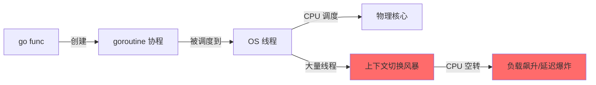

本章的目标，就是把"并发执行的抽象"拆开给你看，让你建立起最核心的操作系统直觉：

- 程序是怎么变成进程跑起来的？
- 进程和线程到底差在哪里？
- 为什么线程切换比进程快？快了多少？
- 协程又是什么？和线程有什么关系？
- 写并发代码时，怎么选进程/线程/协程？

带着这五个问题，我们开始。


## 02.进程基本概念

### 2.1 程序vs进程

**疑惑：我写了一个 `hello.c` 编译成 `a.out`，双击运行。这个 `a.out` 是进程吗？**

**答疑**：还不是。在运行之前，`a.out` 只是一堆二进制躺在硬盘上，它是一个**程序（Program）**，是静态的。当你双击它（或者在终端执行 `./a.out`），操作系统会创建对应的**进程（Process）**，把程序加载到内存，分配资源，然后CPU开始执行。进程是程序的**一次执行实例**，是动态的。

```
程序（静态）：a.out 文件，躺在硬盘上
    ↓ 操作系统加载
进程（动态）：运行中的 a.out，占用内存、CPU、文件描述符等资源
```

**类比理解**：

| | 程序 | 进程 |
|------|------|------|
| 类比 | 菜谱 | 厨师正在做这道菜 |
| 存储位置 | 硬盘 | 内存 |
| 生存周期 | 永久存在（除非删除文件） | 有始有终（创建→运行→结束） |
| 是否占用资源 | 不占用 | 占用CPU、内存、文件等 |
| 实体数量 | 一个程序可对应多个进程 | 如多个用户同时运行 `vim`，就是一个程序对应多个进程 |

### 2.2 进程组成详解

一个进程在操作系统眼里，由三部分组成：

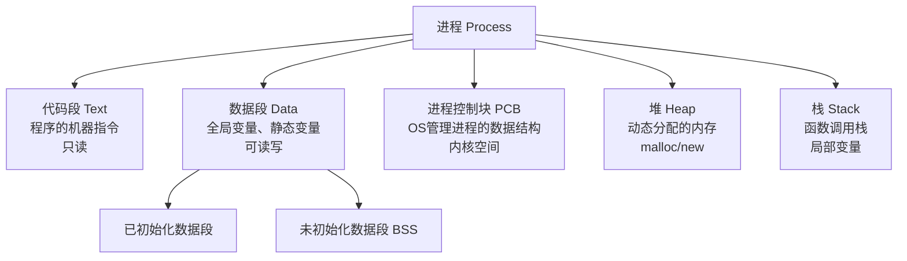

**代码段（Text Segment）**：存放程序的机器指令。这段内存是只读的，防止程序意外修改自身指令。

**数据段（Data Segment）**：存放全局变量和静态变量。分为已初始化（.data）和未初始化（.bss）两部分。

**堆（Heap）**：运行时动态分配的内存区域。`malloc()` / `new` 分配的内存来自堆，由程序员或GC管理。

**栈（Stack）**：存放函数调用信息——局部变量、返回地址、参数。每次函数调用，在栈上压一个栈帧（Stack Frame）；函数返回，弹出栈帧。

**进程控制块（PCB）**：操作系统为每个进程维护的数据结构，存储了操作系统管理该进程所需的所有信息。这是操作系统"认识"一个进程的方式。

### 2.3 进程的地址空间

每个进程都觉得自己独占整个内存空间，这得益于**虚拟内存**机制。操作系统给每个进程画了一个假象：

```
高地址  0xFFFFFFFF
       ┌─────────────┐
       │   内核空间    │  ← 所有进程共享，用户态不可访问
       ├─────────────┤
       │    栈  ↓     │  ← 向下增长
       │             │
       │             │
       │    堆  ↑     │  ← 向上增长
       ├─────────────┤
       │  数据段      │  ← .data / .bss
       ├─────────────┤
       │  代码段      │  ← .text（只读）
低地址  0x00000000
```

**关键点**：

- 每个进程有**独立的虚拟地址空间**，进程A看不到进程B的内存
- 堆和栈之间的"空隙"是留给两者增长的，如果堆和栈相撞，就OOM了
- 内核空间在每个进程的页表里都有映射，但用户态访问会触发段错误

### 2.4 进程资源分配单位

**疑惑：操作系统说"进程是资源分配的基本单位"，到底分配了什么？**

**答疑**："资源"这个词涵盖以下几个维度：

| 资源类型 | 具体内容 | 进程隔离的 |
|---------|---------|-----------|
| 内存资源 | 虚拟地址空间（代码/数据/堆/栈） | 完全隔离 |
| 文件资源 | 打开的文件描述符表 | 各自独立 |
| 时间资源 | CPU时间片 | 由调度器分配 |
| 信号处理 | 信号处理器表 | 各自独立 |
| 用户身份 | UID/GID | 各自独立 |
| 工作目录 | 当前工作目录 | 各自独立 |

**论证**：这就是为什么进程是**隔离性最好的并发单位**——假如一个进程内存泄漏了，崩溃了，另一个进程不受任何影响。但代价是跨进程通信非常贵（需要内核参与），进程的创建和销毁也很重。

**结论**：用一句话总结进程的本质——**进程是程序的一次执行，是操作系统进行资源分配和调度的基本单位**。理解这一点，是进入操作系统世界的第一把钥匙。


## 03.进程状态与模型

### 3.1 进程五状态模型

进程从创建到消亡，会经历多种状态。最基本的五状态模型：

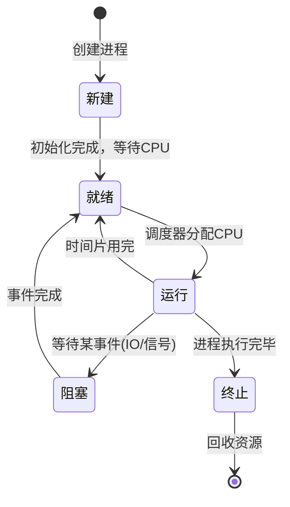

| 状态 | 含义 | 进程在干什么 |
|------|------|------------|
| 新建（New） | 进程正在被创建 | 分配PCB、分配内存、加载程序 |
| 就绪（Ready） | 一切就绪，只等CPU | 在就绪队列排队 |
| 运行（Running） | 正在CPU上执行 | 执行指令 |
| 阻塞（Blocked） | 等待某个事件 | 等IO、等信号、等锁释放 |
| 终止（Terminated） | 进程执行完毕 | 等待父进程回收 |

**关键理解**：进程自己不会从"阻塞"直接跳到"运行"——必须先经过"就绪"。即使IO已经完成，CPU也可能正在运行别的进程，所以新就绪的进程要排队。

### 3.2 进程七状态模型

在有虚拟内存的系统上，五状态会扩展为七状态，增加了两个"挂起"状态：

```
        新建  →  就绪挂起  →  就绪  →  运行  →  终止
                  ↑ ↕          ↑ ↕       ↙
               阻塞挂起  ↔  阻塞
```

**挂起（Suspend）**意味着进程的某些数据被换出到硬盘（Swap），不再占用物理内存。

| 状态 | 放在哪 | 能跑吗 |
|------|--------|--------|
| 就绪 | 物理内存 | 能，排队等CPU |
| 就绪挂起 | 硬盘 Swap | 不能，需要先换入内存 |
| 阻塞 | 物理内存 | 不能，还在等IO |
| 阻塞挂起 | 硬盘 Swap | 不能，即要等IO，也没在内存 |

**疑惑：为什么要设计"挂起"状态？直接让进程都在内存里不好吗？**

**答疑**：当物理内存不足时，操作系统必须把一些暂时不用的进程数据换到硬盘上（Swap），腾出空间给更需要的进程。这就是为什么你的电脑开很多程序后，切换回一个很久没用的程序会"卡一下"——它的数据要从硬盘换回内存。

### 3.3 状态切换的触发条件

用一个真实的时间线来理解状态切换：

```
时间轴：一个网络请求的处理过程
─────────────────────────────────────────────────
T=0ms    进程创建，进入"新建"态
T=1ms    加载完成，进入"就绪"态（在就绪队列排队）
T=3ms    调度器选中，进入"运行"态（开始执行代码）
T=5ms    执行到 read(socket_fd, buf, 4096) 
         数据还没到 → 进入"阻塞"态（放弃CPU）
T=10ms   网卡收到数据，DMA传输完成，中断通知CPU
         数据到达 → 进入"就绪"态（重新排队）
T=12ms   调度器再次选中 → 进入"运行"态
T=15ms   处理完成，进程exit → 进入"终止"态
─────────────────────────────────────────────────
```

**结论**：进程大部分时间其实不在"运行"，而是在"就绪"或"阻塞"。现代操作系统的调度器就是让多个进程在"就绪↔运行"之间频繁切换，造成"多个程序同时在跑"的假象。

### 3.4 僵尸进程与孤儿进程

**疑惑：进程执行完了不就消失了？为什么还有"僵尸""孤儿"这种问题？**

**答疑**：进程的终止不是瞬间完成的。父进程需要收到子进程的**退出状态**才能彻底清理子进程的PCB，否则子进程就会变成"僵尸"。

```c
// 僵尸进程示例
#include <stdio.h>
#include <unistd.h>

int main() {
    pid_t pid = fork();
    if (pid == 0) {
        // 子进程：执行完就走
        printf("child exiting...\n");
        return 0;
    } else {
        // 父进程：一直不wait，子进程变僵尸
        printf("parent sleeping, child will be zombie\n");
        sleep(30);
        // 如果这里依然不调用 wait()，子进程就是僵尸
    }
    return 0;
}

// 查看僵尸进程: ps aux | grep 'Z'
```

| 类型 | 成因 | 后果 | 解决办法 |
|------|------|------|---------|
| 僵尸进程 | 子进程已退出，父进程未调用 wait() | 占用PCB槽位，浪费系统资源 | 父进程主动 wait()，或父进程退出让 init 收养 |
| 孤儿进程 | 父进程先于子进程退出 | 无严重后果，子进程被 init(PID=1) 收养 | 不需要特别处理，OS自动处理 |

**记忆口诀**：子比父先走，父不收尸 → 僵尸；父比子先走，子没爹了 → 孤儿。


## 04.进程控制块PCB

### 4.1 PCB里存了什么

进程控制块（Process Control Block, PCB）是操作系统用来管理进程的**数据结构**。你可以把PCB理解为进程的"身份证"——包含了操作系统管理该进程所需的一切信息。

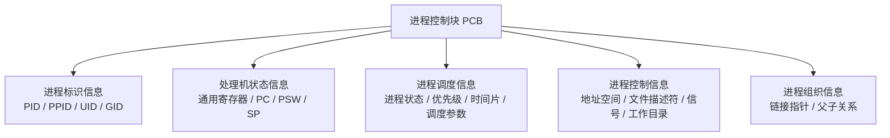

### 4.2 task结构体

在 Linux 内核中，PCB 的具体实现就是 `task_struct` 结构体。它大约有 **1.7KB**，包含了上百个字段。下面抽取一些关键的：

```c
// Linux 内核中 task_struct 的关键字段（简化版）
struct task_struct {
    // ========= 标识信息 =========
    pid_t               pid;           // 进程ID（用户态可见）
    pid_t               tgid;          // 线程组ID（getpid() 返回这个）
    struct task_struct  *group_leader; // 线程组的主线程

    // ========= 状态与调度 =========
    volatile long       state;         // 进程状态（TASK_RUNNING等）
    int                 prio;          // 动态优先级
    int                 static_prio;   // 静态优先级（nice值）
    unsigned int        rt_priority;   // 实时优先级
    unsigned int         policy;       // 调度策略
    struct sched_entity  se;           // CFS调度实体

    // ========= 内存管理 =========
    struct mm_struct    *mm;          // 内存描述符（地址空间）

    // ========= 文件系统 =========
    struct files_struct *files;       // 打开的文件描述符表
    struct fs_struct    *fs;          // 文件系统信息（root/pwd）

    // ========= 信号处理 =========
    struct signal_struct *signal;     // 信号处理信息
    struct sighand_struct *sighand;   // 信号处理器表

    // ========= 组织关系 =========
    struct list_head    tasks;        // 所有进程的链表节点
    struct task_struct  *parent;      // 父进程
    struct list_head    children;     // 子进程链表
    struct list_head    sibling;      // 兄弟进程链表
};
```

**关键细节**——`pid` 和 `tgid`：

- 对于**进程**：`pid` 和 `tgid` 相同，都是进程ID
- 对于**线程**：`pid` 是线程ID，`tgid` 是所属进程（线程组）的ID
- `getpid()` 返回的是 `tgid`——用户态视角，"线程属于哪个进程"就看 `tgid`

### 4.3 PCB的组织方式

操作系统如何快速找到某一个进程的PCB？常用的组织方式：

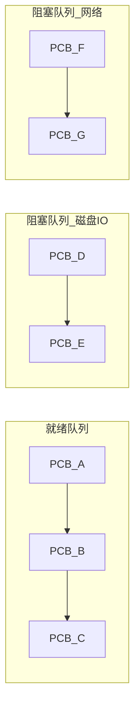

- **就绪队列**：所有"就绪"状态的进程PCB组成一个或一组链表，调度器从这里选下一个要跑的进程
- **阻塞队列**：按等待原因分多条队列（等磁盘、等网络、等锁），事件发生时把对应队列上的PCB移到就绪队列
- **PID哈希表**：需要根据PID快速定位某进程PCB时，用哈希查找


## 05.线程——轻量级进程

### 5.1 为什么需要线程

**疑惑：已经有进程能做并发（比如开多个nginx worker进程），为什么要引入线程？**

**答疑**：因为进程太重了。我们来对比一下：

```
创建一个进程的开销：
  1. 分配新的虚拟地址空间（页表、VMA等）
  2. 复制父进程的地址空间（或使用COW简历映射）
  3. 分配新的文件描述符表
  4. 分配新的信号处理表
  5. 创建新的 task_struct（~1.7KB）
  → 总耗时：约 0.5~2ms

创建一个线程的开销：
  1. 复用当前进程的地址空间（共享 mm_struct）
  2. 共享文件描述符表、信号处理表
  3. 只分配线程自己的栈（通常 1~8MB）
  4. 创建新的 task_struct
  → 总耗时：约 10~50μs
```

**论证**：线程的创建比进程快约 20~100 倍，上下文切换也更快（因为不需要切换地址空间）。对于高并发场景（比如Web服务器每秒几千个请求），如果用进程，创建和销毁的开销就会吃掉大部分CPU；用线程，这些开销大幅降低。

### 5.2 线程定义与特点

线程是操作系统能够进行**运算调度的最小单位**。它被包含在进程之中，是进程中的实际运行单位。

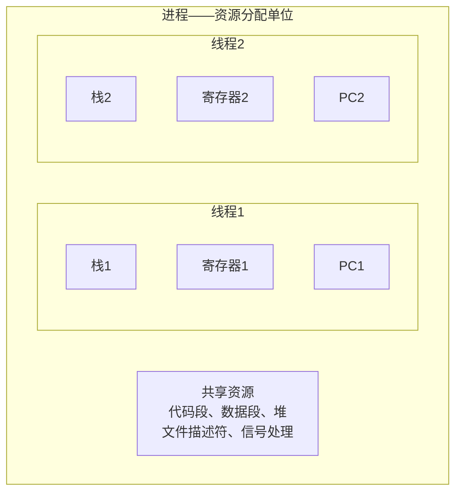

一个进程内的所有线程：
- **共享**：代码段、数据段、堆、文件描述符、信号处理器、当前工作目录
- **独立拥有**：栈、寄存器（包括PC）、线程ID、信号掩码、errno

**关键结论**：

| | 进程 | 线程 |
|------|------|------|
| 资源分配 | 进程是资源分配的基本单位 | 线程不"拥有"资源，只使用进程的资源 |
| 调度 | 传统的调度单位 | **现代OS的调度单位**（Linux调度的是task，不区分进程/线程） |
| 隔离性 | 强，一个进程崩溃不影响其他 | 弱，一个线程崩溃可能拖垮整个进程 |
| 通信 | IPC（管道、消息队列、共享内存） | 直接读写共享内存（需要同步） |

### 5.3 线程组成结构

每个线程最少需要拥有：

```
线程私有存储:
┌─────────────┐
│  线程ID TID  │  ← 在进程内唯一
│  程序计数器  │  ← 当前执行到哪条指令
│  寄存器组    │  ← 通用寄存器、状态寄存器
│  栈指针 SP   │  ← 指向线程自己的栈
│  线程栈      │  ← 存放局部变量和调用链
│  信号掩码    │  ← 决定哪些信号被屏蔽
│  errno       │  ← 线程安全，每个线程独立
└─────────────┘
```

### 5.4 进程与线程的对比

**疑惑：面试常问"进程和线程的区别"，标准答案是什么？**

**答疑**：这不是一个死记硬背的八股题，你需要从四个维度去理解：

| 维度 | 进程 | 线程 |
|------|------|------|
| 资源 | 拥有独立的地址空间和系统资源 | 共享进程资源，只持有少量私有资源 |
| 创建销毁 | 重（fork+exec，~ms级） | 轻（pthread_create，~μs级） |
| 切换代价 | 大（需切换地址空间、页表、TLB） | 小（同一进程的线程共享地址空间） |
| 通信方式 | 需要IPC（管道/消息队列/共享内存） | 直接读写共享变量（需同步） |
| 独立性 | 独立运行，一个崩溃不影响其他 | 一个线程崩溃可能影响整个进程 |
| 并发粒度 | 粗粒度 | 细粒度 |

**一句话总结**：进程是"房东"（拥有房子），线程是"租客"（住在房子里，共享厨房客厅，有自己的卧室）。


## 06.线程的实现模型

### 6.1 用户态线程模型

用户级线程（User-Level Thread，ULT）完全在用户空间中实现，操作系统内核**不知道线程的存在**——内核只看到进程。

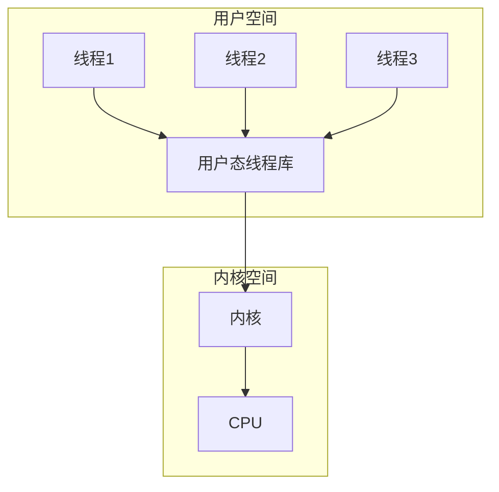

**工作原理**：用户态线程库（如早期的POSIX Threads库、Java早期Green Threads）负责在线程之间切换。切换时不需要陷入内核态，直接在用户态保存/恢复线程上下文。

**优点**：
- 线程切换极快（不需要内核参与，纯用户态操作）
- 不需要内核支持，跨平台性好
- 每个进程可以自定义调度算法

**缺点**：
- 一个线程发起阻塞式系统调用（如读磁盘），**整个进程的所有线程都会被阻塞**——因为内核不知道有其他线程存在，它认为进程在等待IO
- 无法利用多核CPU并行——内核只给一个进程分配一个CPU
- 不能做到真正的抢占式调度（除非用户态库实现了定时器中断模拟）

### 6.2 内核态线程模型

内核级线程（Kernel-Level Thread，KLT）由操作系统内核直接管理。内核知道每个线程的存在，调度也以线程为单位。

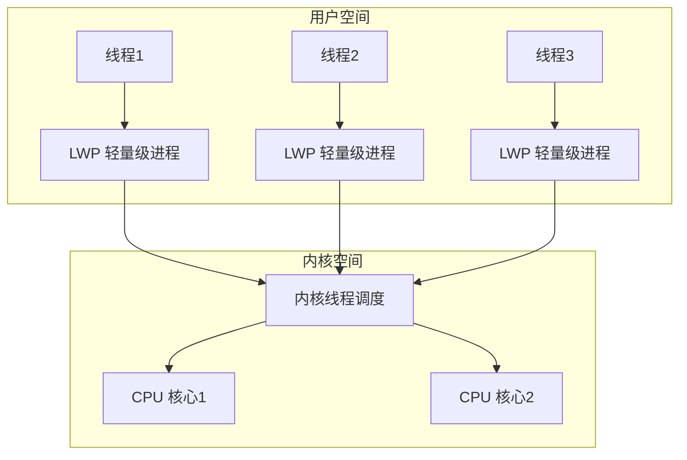

**内核线程 = 轻量级进程（LWP）**

在Linux中，没有独立的"线程"数据结构——线程就是与父进程共享一些资源的**轻量级进程**（Lightweight Process, LWP）。创建线程的 `clone()` 系统调用，本质上是创建了一个新的 task_struct，但指定了与父task共享哪些资源：

```c
// Linux创建线程的本质：clone() 共享资源
// pthread_create 底层调用:
clone(CLONE_VM |        // 共享地址空间
      CLONE_FS |        // 共享文件系统信息
      CLONE_FILES |     // 共享文件描述符
      CLONE_SIGHAND |   // 共享信号处理
      CLONE_THREAD,     // 放到同一线程组
      stack_addr);      // 新线程的栈
```

**优点**：
- 可以真正利用多核CPU并行
- 一个线程阻塞（比如IO等待），不影响同进程内其他线程被调度

**缺点**：
- 创建、切换开销比用户级线程高（需要内核介入）
- 每种操作都需要系统调用，增加了开销

### 6.3 混合线程模型

混合模型是用户级线程 + 内核级线程的折中方案：用户态线程被复用（multiplexed）到少量内核线程上。

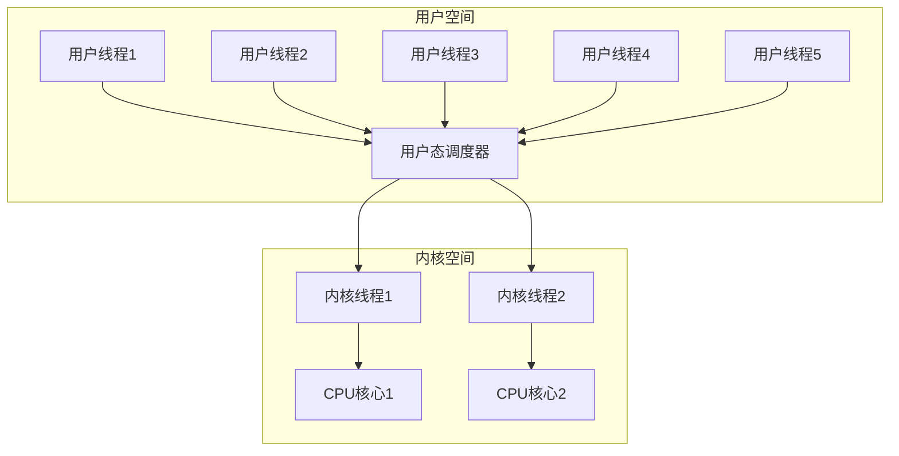

**典型实现**：

| 实现 | 用户级调度 | 内核级调度 | 特点 |
|------|-----------|-----------|------|
| Go goroutine (G-M-P) | G在M上调度 | M是内核线程 | 抢占式、work stealing |
| Java虚拟线程(JDK 21) | 虚拟线程复用到平台线程 | 平台线程=内核线程 | 无需池化、一请求一线程 |
| Erlang进程 | Actor模型 | BEAM VM调度器 | 轻量、隔离、容错 |

### 6.4 三种模型对比

| 特性 | 用户级线程 | 内核级线程 | 混合模型 |
|------|-----------|-----------|---------|
| 创建/切换速度 | ★★★★★ 极快 | ★★☆☆☆ 较慢 | ★★★★☆ 快 |
| 多核并行 | ✗ 不能 | ✓ 能 | ✓ 能 |
| 阻塞不拖累其他线程 | ✗ 会拖累 | ✓ 不拖累 | ✓ 不拖累 |
| 内核支持 | 不需要 | 需要 | 需要 |
| 典型代表 | 早期Java Green Thread | LinuxThreads, NPTL | Go, Java Loom |

**技术演进路线**：

```
1990s: 多进程（Apache prefork）
   ↓ 进程太重，切换代价高
2000s: 内核级线程（NPTL, pthreads）
   ↓ 线程也有开销，高并发时创建/切换仍然是瓶颈
2010s: 混合模型（Go goroutine, Erlang）
   ↓ 用用户态调度器在少量内核线程上复用大量协程
   → 用户态切协程几乎零开销，真正的"高并发"
```


## 07.上下文切换机制

### 7.1 什么是上下文切换

上下文切换（Context Switch）是操作系统将CPU从一个进程/线程的执行切换到另一个进程/线程的过程。

核心动作：**保存当前任务的运行上下文，恢复下一个任务的运行上下文**。

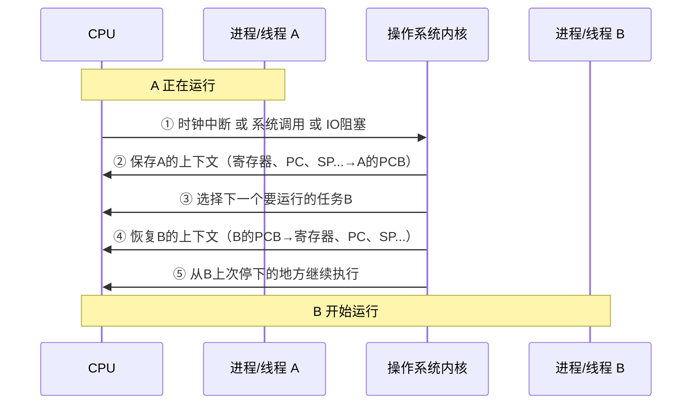

### 7.2 进程上下文切换

进程上下文切换需要保存/恢复的内容非常多：

```
进程A → 进程B 的切换过程：

1. 保存A的硬件上下文：
   ├── 通用寄存器（EAX, EBX, ...）
   ├── 段寄存器
   ├── 程序计数器 PC（指向A下一条要执行的指令）
   ├── 栈指针 SP
   └── 状态寄存器 PSW/EFLAGS

2. 切换地址空间（最重的部分）：
   ├── 切换页表基址寄存器（CR3）
   ├── 刷新TLB（Translation Lookaside Buffer）
   └── 可能需要切换IO权限位图

3. 恢复B的硬件上下文：
   └── 从B的PCB中恢复所有寄存器
```

**最昂贵的部分：切换虚拟地址空间**。这涉及到：

- 修改 CR3 寄存器指向新的页表
- **TLB（快表）全部失效**——这是最大的性能损耗
- 新进程刚运行时，TLB全是Miss，每次内存访问都要走完整的页表遍历（至少多出几十个CPU周期的惩罚）

### 7.3 线程上下文切换

同一个进程内的线程切换就轻量得多，因为**不需要切换地址空间**：

```
线程A → 线程B（同一进程）的切换过程：

1. 保存A的硬件上下文（同进程切换）
2. 不需要切换CR3 ← 关键区别！
3. 不需要刷新TLB ← 关键区别！
4. 恢复B的硬件上下文

额外需要切换的（线程私有数据）：
├── 内核栈指针
├── 用户态栈指针
└── 如果支持线程局部存储(TLS)，需切换FS/GS段寄存器
```

### 7.4 系统调用与切换

**疑惑：执行系统调用（比如 `read()`）算不算是上下文切换？**

**答疑**：不算。系统调用是**模式切换（Mode Switch）**——从用户态切到内核态，再切回用户态——但切换前后是**同一个进程/线程**在做自己的事，不涉及任务的替换。

| | 模式切换（系统调用） | 上下文切换（进程切换） |
|------|------|------|
| 发生时机 | 主动调用（syscall指令） | 被动发生（时钟中断/IO阻塞） |
| 切换范围 | 用户态 ↔ 内核态 | 进程A 的上下文 → 进程B 的上下文 |
| 保存内容 | 只需保存用户态寄存器 | 保存全部硬件上下文 |
| TLB | 不受影响 | **全部失效（进程切换时）** |
| 开销 | 约0.1-1μs | 约1-5μs（线程），约3-10μs（进程） |

**注意**：虽然系统调用不触发上下文切换，但**系统调用返回后，调度器可能会决定切换到另一个进程**——这时候才会发生上下文切换。

### 7.5 上下文切换的代价

**疑惑：上下文切换到底有多贵？这些开销从哪来？**

以一次典型的进程切换为例，我们把开销拆开看：

```
一次进程上下文切换的耗时剖析（典型 x86-64 Linux）：

直接开销（必须做的）：
  ├── 保存/恢复寄存器           ~0.1μs
  ├── CR3写操作                 ~0.05μs
  ├── 选择下一个进程(调度算法)   ~0.2μs
  └── 合计直接开销             ~0.5-1μs

间接开销（后续访问惩罚）：
  ├── TLB 全部失效，重填        ~5-50μs
  ├── L1/L2 Cache 冷启动        ~5-20μs
  └── 合计间接开销             ~10-70μs

总计：单次进程切换约 1~20μs，取决于Cache/TLB的重填情况
```

**实战数据——用 `vmstat` 看切换频率**：

```bash
$ vmstat 1
procs -----------memory---------- ---swap-- -----io---- -system-- ------cpu-----
 r  b   swpd   free   buff  cache   si   so    bi    bo   in   cs us sy id wa st
 3  0      0 294872  85624 1834388    0    0     2    12    2    3  1  1 98  0  0
```

- `r`：就绪队列长度（等待CPU的进程数）
- `cs`：每秒上下文切换次数
- 如果 `cs` > 10000（单核），说明切换太频繁，出现"上下文切换风暴"
- 如果 `r` 远大于CPU核心数，说明系统严重过载

**回到1.1节的案例**：小王的服务器 `Load average: 96`，意味着平均有96个任务在等待CPU。配合48个核心，理论上已经超载2倍。再加上大量的上下文切换——CPU的时间绝大部分不是在做业务计算，而是在"保存→恢复→保存→恢复"之间空转。


## 08.进程创建与fork

### 8.1 fork的语义

在类Unix系统中，创建新进程的唯一方式是 `fork()`——一种"复制自身"的奇妙机制：

```c
#include <stdio.h>
#include <unistd.h>

int main() {
    pid_t pid = fork();

    if (pid == 0) {
        // 子进程：fork() 返回 0
        printf("I am child, pid=%d\n", getpid());
    } else if (pid > 0) {
        // 父进程：fork() 返回子进程的pid
        printf("I am parent, child pid=%d\n", pid);
    } else {
        // fork() 返回 -1，创建失败
        perror("fork failed");
    }
    return 0;
}
```

**fork的神奇之处**：调用一次，返回两次——分别在父进程和子进程中返回不同的值。

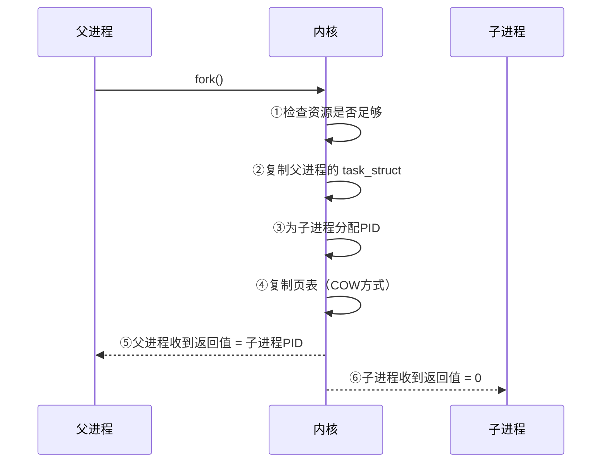

### 8.2 写时拷贝COW

**疑惑：fork要复制父进程的整个地址空间（可能几GB），岂不是非常慢？**

**答疑**：现代操作系统使用**写时拷贝（Copy-on-Write, COW）**技术，fork时并不立即复制内存，而是：

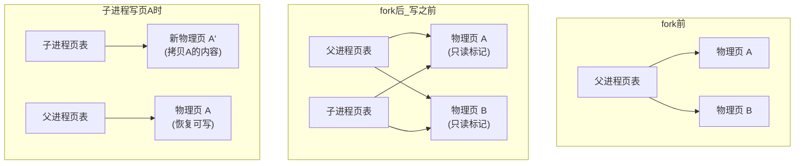

**COW的工作原理**：

1. `fork()` 时：不复制页的内容，只复制页表。父子的页都标记为**只读**
2. 父子进程只读数据：相安无事，物理页共享
3. 任一进程写数据：触发**缺页保护异常**，内核捕获异常，为该进程复制一页新物理页，恢复权限为可写
4. 这样，大部分页面实际上从未被拷贝过

**论证**：

```
fork 的实际开销分析：
├── 复制 task_struct（~1.7KB）         ~1μs
├── 复制页表（不是页面内容）            ~10-50μs（取决于页表大小）
├── 分配PID                             ~1μs
└── 后续COW缺页（按需发生）            每页~2μs

如果进程有 1GB 内存，页表的大小约：
  1GB / 4KB = 262,144 页
  每页表项 8 字节 = ~2MB 页表
  fork时只复制这 2MB 页表，不是复制 1GB 数据！
```

### 8.3 fork的坑

**坑1：多线程环境下fork**

```c
// 危险！多线程程序中的 fork
void *worker(void *arg) {
    pthread_mutex_lock(&global_lock);
    // ... 临界区代码 ...
    // 此时另一个线程调用了 fork()
    pthread_mutex_unlock(&global_lock);
}
```

如果在某线程持有锁的时候，另一个线程执行了 `fork()`，子进程会继承这把锁的**锁定状态**，但持有锁的那个线程在子进程中不存在了——这把锁**永远不会被释放**。这就是经典的"fork死锁"问题。

**解决方案**：在多线程程序中，fork之后子进程应尽快执行 `exec()`，因为 `exec()` 会用新程序替换整个地址空间，"清理"掉这些继承来的锁状态。

**坑2：fork时复制文件描述符**

`fork()` 会复制父进程的所有文件描述符。父子进程共享同一个文件偏移量。如果两个进程同时写同一个文件，可能出现交错：

```c
// fork后父子同时写日志
int fd = open("log.txt", O_WRONLY | O_CREAT, 0644);
if (fork() == 0) {
    write(fd, "[child] hello\n", 14);
} else {
    write(fd, "[parent] world\n", 15);
}
// 文件内容可能是: "[chil[parenthewolrd\n] ello\n"（交错写）
```

### 8.4 exec替换程序

`fork()` 创建了父进程的副本，但子进程通常不想做和父进程一样的工作。`exec()` 系列函数用于**用新程序完全替换当前进程的镜像**：

```c
#include <unistd.h>

pid_t pid = fork();
if (pid == 0) {
    // 子进程：换成 /bin/ls 程序
    execl("/bin/ls", "ls", "-l", NULL);
    // exec 成功后，下面的代码永远不会执行
    // 如果执行到了这里，说明 exec 失败了
    perror("exec failed");
    exit(1);
}
// 父进程继续原来的任务
```

**exec 做了什么**：

```
exec 的执行步骤：
1. 释放旧地址空间（清空代码段、数据段、堆、栈）
2. 从磁盘加载新程序，建立新的地址空间
3. 重置寄存器、PC设为新程序入口
4. 保留原有的 PID、文件描述符（除非设置了 FD_CLOEXEC）、信号掩码
5. 开始执行新程序
```

**fork + exec = 创建新进程的标准姿势**。这也是 `popen()`、`system()` 等高层接口的底层实现。


## 09.协程并发模型

### 9.1 协程基本概念

协程（Coroutine）是一种**用户态的轻量级线程**，它的调度完全由程序自己控制，不依赖操作系统。

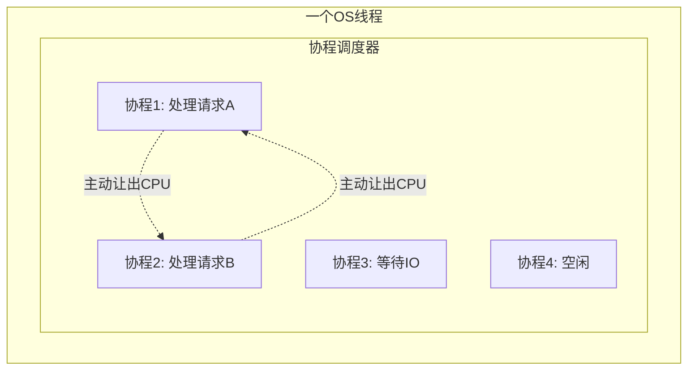

**协程的核心特征**：

| 特征 | 说明 |
|------|------|
| 用户态调度 | 协程切换不需要内核参与，不涉及系统调用 |
| 协作式 | 协程主动让出CPU（yield），不是被抢占 |
| 轻量 | 创建协程只需分配几KB的栈（甚至更少），远轻于线程 |
| 一比多 | 多个协程复用一个或少数几个OS线程 |

### 9.2 协程vs线程

**疑惑：协程和线程到底有什么区别？为什么Go说goroutine比线程快？**

**答疑**：用一张表说清楚：

| 维度 | 线程 | 协程 |
|------|------|------|
| 调度者 | 操作系统内核 | 用户态调度器（Go运行时/libco等） |
| 切换代价 | 约1-5μs（涉及模式切换） | 约几十ns（纯用户态寄存器保存/恢复） |
| 栈大小 | 固定（Linux默认8MB） | 可动态增长（Go协程初始2KB） |
| 创建数量 | 受限于内存（万级） | 轻松十万~百万级 |
| 抢占式 | 是（时钟中断抢占） | 否（协作式，主动让出） |
| 并发模型 | 一个任务一个线程 | 多个协程复用到少数线程 |
| 调度时机 | 时钟中断、IO等待、锁 | yield点、IO操作自动切换 |

**Go goroutine 的栈为什么能这么小？**

```
普通线程栈：
  ┌──────────────┐
  │   8MB 栈      │  ← 固定分配，不管用不用
  │  (只用2KB)    │  ← 浪费了 99.98%
  └──────────────┘

Go goroutine 栈：
  ┌────┐ ← 初始 2KB（最小）
  │    │
  │    │  需要更多时，自动分配更大的栈
  │    │  并把旧栈内容复制过去（栈扩容）
  │    │
  └────┘
  最大可到 1GB
```

### 9.3 有栈协程与无栈协程

| 类型 | 有栈协程 (Stackful) | 无栈协程 (Stackless) |
|------|-------------------|---------------------|
| 实现方式 | 每个协程有独立的调用栈 | 依赖编译器转换（状态机） |
| 挂起点 | 可在任意嵌套函数中挂起 | 只能在最外层函数挂起 |
| 内存开销 | 每个协程需要一个独立栈（可动态增长） | 只需存储状态变量，开销极小 |
| 切换开销 | 需要保存/恢复 SP、BP 等寄存器 | 只需改变状态变量的值 |
| 典型代表 | Go goroutine、libco、Boost.Coroutine | C++20 coroutine、JS async/await、Rust async |

**有栈协程的切换示意**：

```c
// 有栈协程的手动切换（简化版 libco 风格）
void co_swap(co_ctx *curr, co_ctx *target) {
    // 保存当前协程的寄存器到 curr->regs
    asm volatile(
        "movq %%rsp, %0\n"  // 保存栈指针
        "movq %%rbp, %1\n"  // 保存帧指针
        "movq %%rbx, %2\n"  // 保存通用寄存器
        // ... 保存其他寄存器
        : "=m"(curr->regs[0]), "=m"(curr->regs[1]), ...
    );

    // 如果target之前没有被调度过，跳转到它的入口函数
    // 否则，恢复target的寄存器，让它从上次yield的地方继续
    // ...
}
```

### 9.4 协程调度机制

以 Go 的 **G-M-P 模型**为例：

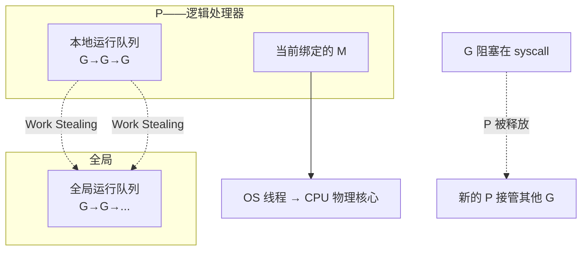

- **G（Goroutine）**：协程本身，只有简单的执行栈和状态
- **M（Machine）**：操作系统线程，G 在 M 上执行
- **P（Processor）**：逻辑处理器，持有 G 的本地运行队列，负责将 G 绑定到 M 上执行

**Work Stealing（工作窃取）**：当某个 P 的本地队列空了，它会从全局队列或其他 P 的本地队列"偷"一些 G 过来执行。这保证了负载均衡。


## 10.Web服务器案例

### 10.1 场景需求分析

现在用一个贯穿整个进程/线程/协程知识体系的综合案例来收尾。

**需求**：设计一个 Web 服务器，需要处理大量并发HTTP请求。每个请求的处理逻辑是：解析请求 → 读数据库（或缓存） → 计算 → 返回响应。平均每个请求的处理时间是 10ms，其中 8ms 在等数据库返回（IO等待），2ms 在计算。

**目标**：在 4 核 CPU 的服务器上，支持每秒 10000 个请求。


我们将用四种不同的并发模型来实现这个服务器，并逐一分析它们的优劣。

### 10.2 方案一多进程模型

**设计**：主进程 `accept()` 连接后 `fork()` 子进程处理，类似 Apache prefork 模式。

```c
// 多进程模型伪代码
void run_server() {
    int listen_fd = create_listen_socket(8080);
    while (1) {
        int client_fd = accept(listen_fd, ...);
        pid_t pid = fork();
        if (pid == 0) {
            // 子进程：处理请求
            close(listen_fd);  // 子进程不需要监听socket
            handle_request(client_fd);
            close(client_fd);
            exit(0);
        }
        close(client_fd);  // 父进程不需要client_fd
        // 不要忘了回收僵尸子进程！
    }
}
```

**性能分析**——假设每秒10000个请求，每个请求10ms：

```
需要同时运行的进程数 = 10000 req/s × 0.01s = 100 个进程

单个进程的内存占用：
├── 代码段（nginx）     ~2MB
├── 数据段/堆/栈       ~5-10MB
├── 内核开销（页表等）  ~1-2MB
└── 合计               ~8-14MB

100 个进程：需要 ~1GB 内存
```

**问题**：
- `fork()` + `exec()` 的开销（虽然没有exec，但fork本身也不轻）
- 100个进程的CS频率很高（每次调度都要切换地址空间）
- 子进程回收管理（僵尸进程风险）
- 进程间如果共享数据（如缓存）需要额外的IPC机制
- **无法利用IO等待时间**：数据库返回 8ms 期间，进程整个被阻塞，白白占用内存而什么都不做

### 10.3 方案二多线程模型

**设计**：每个请求创建一个新线程处理。

```c
// 多线程模型伪代码
void *handle_thread(void *arg) {
    int client_fd = *(int *)arg;
    free(arg);
    handle_request(client_fd);
    close(client_fd);
    return NULL;
}

void run_server() {
    int listen_fd = create_listen_socket(8080);
    while (1) {
        int *client_fd = malloc(sizeof(int));
        *client_fd = accept(listen_fd, ...);
        pthread_t tid;
        pthread_create(&tid, NULL, handle_thread, client_fd);
        pthread_detach(tid);  // 分离线程，自动回收
    }
}
```

**性能对比**：

| 维度 | 多进程 | 多线程 |
|------|--------|--------|
| 创建开销 | ~0.5-2ms | ~10-50μs |
| 每请求内存增量 | 8-14MB | ~8MB（主要线程栈） |
| 上下文切换 | 重（切地址空间） | 轻（共享地址空间） |
| 通信 | IPC | 共享内存 |

**问题**：
- 仍然需要 100 个线程（线程数 = 并发请求数）
- 100 个线程的切换开销累计仍然可观
- 线程栈的固定开销：100 线程 × 8MB = 800MB！
- **线程爆炸**：如果请求延迟变大（数据库从 8ms变 80ms），并发数就需要 800 个线程

### 10.4 方案三线程池模型

**设计**：预先创建固定数量的工作线程（线程池），请求排队等待处理。

```c
// 线程池模型伪代码
typedef struct {
    int client_fd;
} task_t;

// 任务队列（生产者-消费者模式）
task_queue_t queue;
pthread_t workers[THREAD_POOL_SIZE];

void *worker_loop(void *arg) {
    while (1) {
        task_t *task = dequeue(&queue);  // 阻塞等待任务
        handle_request(task->client_fd);
        close(task->client_fd);
        free(task);
    }
}

void run_server() {
    // 创建线程池（假设4核，创建8个线程）
    for (int i = 0; i < 8; i++) {
        pthread_create(&workers[i], NULL, worker_loop, NULL);
    }

    int listen_fd = create_listen_socket(8080);
    while (1) {
        int client_fd = accept(listen_fd, ...);
        task_t *task = malloc(sizeof(task_t));
        task->client_fd = client_fd;
        enqueue(&queue, task);  // 入队
    }
}
```

**为什么8个线程就够了？**

```
分析：每个请求有 8ms IO等待 + 2ms 计算

如果 8 个线程都做计算（纯CPU）：
  每秒处理 = 8 / 0.002s = 4000 个请求 ← 不够

实际上 IO 期间线程在阻塞，CPU空闲：
  1 个线程：处理一个请求的过程中，CPU利用率只有 2/10 = 20%
  8 个线程：8 × 20% = 160% → 2个核接近满负荷

要满足 10000 req/s：
  需要同时进行的计算量 = 10000 × 2ms = 20 秒-CPU
  需要 CPU 核心数 = 20 / 4核 ≈ 5 ← 8个线程足够！
```

**优点**：
- 线程数固定，避免线程爆炸
- 消除了频繁创建/销毁线程的开销
- 内存占用可控（8线程 × 8MB = 64MB）

**局限**：
- 如果所有线程都在等IO（比如数据库慢），新请求就得在队列里排队
- 请求的处理逻辑如果不是"先读数据库再计算"这么简单，而是多次IO穿插，线程池模型就很难发挥全部效率

### 10.5 方案四协程模型

**设计**：用协程处理每个请求，IO操作自动挂起当前协程、切换到其他协程。

```go
// Go协程模型 - 最简洁的版本
func handleRequest(conn net.Conn) {
    defer conn.Close()
    buf := make([]byte, 4096)
    n, _ := conn.Read(buf)         // 读请求，IO自动挂起
    req := parseRequest(buf[:n])
    data := queryDB(req.userId)    // 查数据库，IO自动挂起
    resp := computeResponse(data)
    conn.Write(resp)               // 写响应，IO自动挂起
}

func main() {
    listener, _ := net.Listen("tcp", ":8080")
    for {
        conn, _ := listener.Accept()
        go handleRequest(conn)     // 每个请求一个goroutine
    }
}
```

**为什么协程模型最优雅？**

```
对比：

线程池模型（8个线程）：
  线程1: [请求A 计算] → [等待DB] → [请求A 继续] → [请求C 计算] → ...
  线程2: [请求B 计算] → [等待DB] → [请求B 继续] → ...
  → 业务逻辑被切成了不连续的片段，代码结构复杂
  → 每个"等待"都是线程阻塞，浪费线程资源

协程模型（10000个协程，复用8个线程）：
  协程1: handleRequest() {
            读请求 → 查DB → 计算 → 返回  ← 完整的业务逻辑！
         }
  → 代码就像同步写的一样清晰
  → Go运行时在IO操作处自动挂起协程，切换到下一个可运行的协程
  → 线程被"多个协程分时复用"，几乎不会空转
```

### 10.6 四种方案横向对比

| 维度 | 多进程 | 多线程 | 线程池 | 协程 |
|------|--------|--------|--------|------|
| 创建开销 | ~1ms | ~30μs | 无（预创建） | ~几十ns |
| 并发单位数 | 100 | 100 | 8 | 10000 |
| 内存占用 | ~1GB | ~800MB | ~64MB | ~20MB（10000 × 2KB栈） |
| 上下文切换频率 | 高（100进程） | 高（100线程） | 低（8线程） | 极低（用户态切换） |
| CPU利用率 | 差（进程休眠时CPU空转） | 一般 | 好 | 极好 |
| 代码可读性 | 每请求一个子进程 | 每请求一个线程 | 需要拆分逻辑 | **像同步代码一样写异步** |
| 适用场景 | 偶尔的并发、强隔离 | 适度并发 | 高并发 + CPU密集 | 超高并发 + IO密集 |
| 典型代表 | Apache prefork | 传统Java Servlet | Nginx worker | Go/Java Loom |

**选型决策树**：

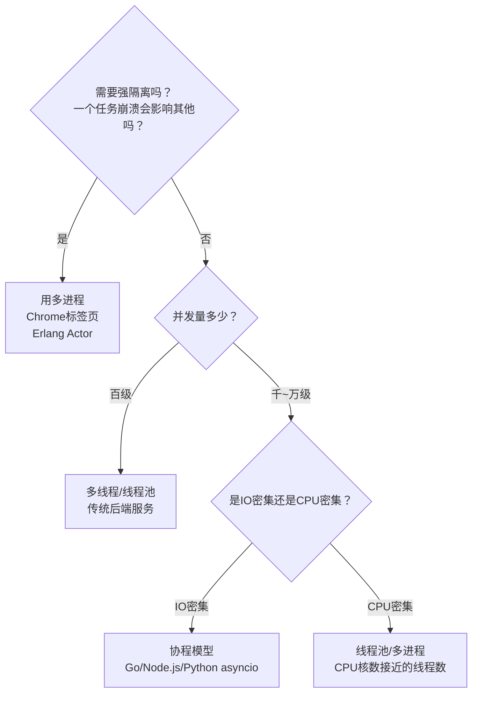

### 10.7 知识图谱回顾

用一张图把本章所有知识点串起来，回顾我们走过的路：

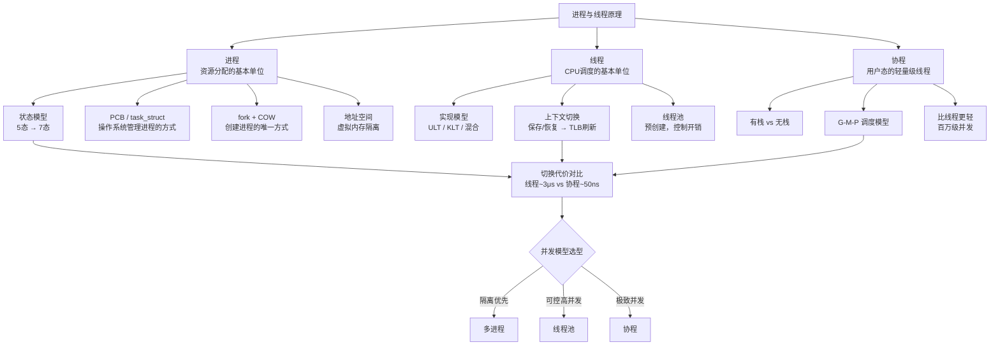

**最终的方法论沉淀**——面对一个并发编程问题，你可以用这三个问题来引导选型：

1. **这个任务需要和别的任务隔离吗？**（会崩溃、会内存泄漏、有不同的安全等级）→ 是的话选多进程
2. **并发量大概多大？**（百级/千级/万级/百万级）→ 千级以上用协程、百级用线程池
3. **计算和IO的比例？**（IO密集还是CPU密集）→ IO密集用协程（释放线程给其他任务），CPU密集用固定大小线程池（核数相关）

把这三个问题问到位，你就从"会用 `go func()`"进化到了"理解并发模型本质"的工程师。这正是这一整篇文章希望传递给你的核心能力。


## 11.思考题与作业

### 11.1 基础思考题目

1. **状态转换**：一个进程在执行 `read()` 系统调用后，经历了什么状态变化？画出它的状态转换图。如果 `read()` 被 `SIGALRM` 信号中断（设置了 `SA_RESTART` 和不设置分别会怎样），状态又会怎么变？

2. **fork的执行次数**：下面这段代码会输出多少个 `-` ？
   ```c
   int main() {
       int i;
       for (i = 0; i < 2; i++) {
           fork();
           printf("-");
       }
       return 0;
   }
   ```
   **提示**：注意 `printf` 的缓冲区——默认是行缓冲，这里输出没带 `\n`。

3. **僵尸进程排查**：线上服务器 `ps aux | grep Z` 发现大量 `Z` 状态进程，`top` 中 CPU 不高但 `tasks` 数量很大。请问：
   - 这些僵尸进程会导致系统不可用吗？
   - 为什么进程数多了系统会出问题？
   - 如何在代码层面避免僵尸进程？

4. **进程 vs 线程 vs 协程**：请用一句话说明三者的本质区别。并回答：一个进程最多能创建多少个线程？限制因素是什么？

5. **上下文切换触发**：列出至少 4 种会触发上下文切换的场景，并指出哪些是"主动"的，哪些是"被动"的。

### 11.2 进阶思考题目

1. **1.1 节的复盘**：回到开头 Go 服务崩溃的案例，如果你是小王，回答以下问题：
   - 为什么 `Load Average` 高达 96，但 CPU 使用率不高？
   - "goroutine 堆积导致上下文切换风暴"——这里指的是线程级的上下文切换还是协程级的？为什么协程的切换没有帮上忙？
   - 你会如何修复这个问题？（至少给出 3 种方案）

2. **COW 的极限**：Copy-on-Write 可以大幅优化 fork 的性能，但它的效果在什么场景下会大打折扣？举例说明。

3. **goroutine 的调度时机**：Go 的 goroutine 是协作式的，哪些操作会触发 goroutine 让出 CPU？如果一个 goroutine 执行纯死循环（没有任何函数调用），会发生什么？Go 是怎么解决这个问题的？

4. **多线程 vs 多进程的缓存**：为什么 Redis 选择单线程（主线程）+ 事件循环，而 Nginx 选择多进程？请从"内存访问"和"缓存效率"的角度分析单线程和多线程各自的优势。

5. **Python 的 GIL**：Python（CPython）的 GIL 导致多线程不能在多核上并行。为什么 Python 选择了这种做法？如果要去掉 GIL，技术上会遇到哪些挑战？这和本章讲的"进程 vs 线程"有什么关系？

### 11.3 动手实践作业

**作业一（必做）**：实测进程/线程/协程的创建和切换开销。

- 分别测量创建10000个进程、10000个线程、10000个goroutine的总时间和内存增加量。
- 分别测量在两个进程间、两个线程间（同一进程）、两个goroutine间的切换耗时。
- 把你的实测结果填入表格，与本章给出的理论值对比。

| 操作 | 实测耗时 | 理论值 | 差异分析 |
|------|---------|--------|---------|
| fork 10000次 | | ~0.5-2ms/次 | |
| pthread_create 10000次 | | ~10-50μs/次 | |
| go func() 10000次 | | ~几十ns/次 | |

**作业二（选做）**：实现一个简单的线程池。

- 用你熟悉的语言实现一个线程池，支持"提交任务 → 任务队列 → 工作线程消费"的基本模式。
- 分别用"无线程池（每次新建线程）"和"线程池（固定8线程）"处理10000个任务（每个任务 sleep 1ms 模拟IO）。
- 对比两种方式的耗时和CPU利用率，分析差异原因。

**作业三（架构思考）**：对你当前负责的一个服务，画一张"并发模型图"。

- 从"一个请求进来"画到"返回响应"，中间涉及哪些进程？哪些线程？有没有协程？
- 每一步标注：当前有多少个这样的执行单元？它们的数量是固定的还是动态变化的？
- 如果你的服务突然增加 10 倍流量，瓶颈会在哪里？是进程数不够，线程不够，还是协程调度器顶不住？给出你的判断和理由。

**作业四（源码阅读）**：阅读 Go 运行时的 G-M-P 模型源码骨架。

- 去 `$GOROOT/src/runtime/proc.go` 找 `schedule()` 函数，理解Goroutine是如何被调度的。
- 找 `findrunnable()` 函数，理解 Work Stealing 的实现。
- 画出你理解的"一个goroutine从创建到被调度执行"的完整流程图。
