# CPU调度算法

> FCFS→SJF→RR→多级队列→CFS——Linux 内核如何决定下一个进程

#### 目录介绍
- [01.工作案例引入](#01工作案例引入)
  - [1.1 为什么Nginx明明不忙却被投诉](#11-为什么nginx明明不忙却被投诉)
  - [1.2 为什么要学调度策略](#12-为什么要学调度策略)
- [02.调度概述](#02调度概述)
  - [2.1 什么是CPU调度](#21-什么是cpu调度)
  - [2.2 调度的三个层次](#22-调度的三个层次)
  - [2.3 调度的时机](#23-调度的时机)
  - [2.4 调度性能指标](#24-调度性能指标)
  - [2.5 抢占式vs非抢占式](#25-抢占式vs非抢占式)
- [03.先来先服务FCFS](#03先来先服务fcfs)
  - [3.1 FCFS算法原理](#31-fcfs算法原理)
  - [3.2 FCFS的护卫效应](#32-fcfs的护卫效应)
  - [3.3 FCFS的适用场景](#33-fcfs的适用场景)
- [04.短作业优先SJF](#04短作业优先sjf)
  - [4.1 SJF算法原理](#41-sjf算法原理)
  - [4.2 抢占式SRTF](#42-抢占式srtf)
  - [4.3 SJF的预测问题](#43-sjf的预测问题)
- [05.优先级调度](#05优先级调度)
  - [5.1 优先级调度原理](#51-优先级调度原理)
  - [5.2 静态优先级vs动态优先级](#52-静态优先级vs动态优先级)
  - [5.3 优先级反转](#53-优先级反转)
- [06.时间片轮转RR](#06时间片轮转rr)
  - [6.1 RR算法原理](#61-rr算法原理)
  - [6.2 时间片大小的权衡](#62-时间片大小的权衡)
  - [6.3 虚拟轮转VRR](#63-虚拟轮转vrr)
- [07.多级队列与反馈队列](#07多级队列与反馈队列)
  - [7.1 多级队列MLQ](#71-多级队列mlq)
  - [7.2 多级反馈队列MLFQ](#72-多级反馈队列mlfq)
  - [7.3 MLFQ的五条规则](#73-mlfq的五条规则)
  - [7.4 MLFQ的演进逻辑](#74-mlfq的演进逻辑)
- [08.Linux CFS完全公平调度](#08linux-cfs完全公平调度)
  - [8.1 从O(n)到CFS](#81-从on到cfs)
  - [8.2 CFS的核心思想](#82-cfs的核心思想)
  - [8.3 虚拟运行时间vruntime](#83-虚拟运行时间vruntime)
  - [8.4 红黑树组织就绪队列](#84-红黑树组织就绪队列)
  - [8.5 nice值与权重映射](#85-nice值与权重映射)
  - [8.6 CFS的周期性调度](#86-cfs的周期性调度)
  - [8.7 调度实体与组调度](#87-调度实体与组调度)
- [09.实时调度](#09实时调度)
  - [9.1 实时vs非实时](#91-实时vs非实时)
  - [9.2 SCHED_FIFO和SCHED_RR](#92-sched_fifo和sched_rr)
  - [9.3 实时调度的风险](#93-实时调度的风险)
- [10.多核调度](#10多核调度)
  - [10.1 多核调度的新问题](#101-多核调度的新问题)
  - [10.2 负载均衡](#102-负载均衡)
  - [10.3 调度域与调度组](#103-调度域与调度组)
  - [10.4 CPU亲和性](#104-cpu亲和性)
- [11.综合案例延迟敏感服务调度](#11综合案例延迟敏感服务调度)
  - [11.1 场景三层服务的调度困境](#111-场景三层服务的调度困境)
  - [11.2 第一层Nginx事件驱动](#112-第一层nginx事件驱动)
  - [11.3 第二层业务微服务CPU密集](#113-第二层业务微服务cpu密集)
  - [11.4 第三层存储服务IO密集](#114-第三层存储服务io密集)
  - [11.5 调度参数调优实战](#115-调度参数调优实战)
  - [11.6 知识图谱回顾](#116-知识图谱回顾)
- [12.思考题与作业](#12思考题与作业)
  - [12.1 基础思考题](#121-基础思考题)
  - [12.2 进阶思考题](#122-进阶思考题)
  - [12.3 动手作业](#123-动手作业)


## 01.工作案例引入

### 1.1 为什么Nginx明明不忙却被投诉

**场景**：小陈是一名刚入职三个月的 DevOps 工程师。公司有一台 8 核的 Nginx 反向代理服务器，平时负载都在 20% 左右，稳得一批。最近业务团队投诉：**"接口偶尔卡 2-3 秒，不是一直卡，就是不定时抽风，用户体验很差"**。

小陈登上机器，先看 `top`：

```
%Cpu(s):  18.3 us,  5.2 sy,  0.0 ni, 75.1 id,  0.8 wa
```

CPU 才用 23%，闲得很。再看 Nginx 的配置：

```
worker_processes 8;
events {
    worker_connections 1024;
}
```

也不是配置问题。再看 `perf top`：

```
Samples: 382K of event 'cpu-clock', 4000 Hz
Overhead  Shared Object     Symbol
  15.21%  [kernel]          [k] __schedule
   8.13%  [kernel]          [k] pick_next_task_fair
   5.42%  [kernel]          [k] update_curr
```

**疑惑**：`__schedule` 占了 15% 的 CPU？调度器本身成了热点？明明是轻载，调度器怎么这么忙？

继续排查发现：Nginx 的 8 个 worker 进程旁边，还跑着几个**数据库的备份脚本**（cron job 触发的 `mysqldump`），以及一个**日志压缩任务**（`gzip` 大文件）。这些"后台任务"和 Nginx worker 抢 CPU。在 CFS 调度器眼里，大家都是平等的——每个任务都有权获得公平的 CPU 份额。

**更隐蔽的根因在于调度时延**：

- Nginx worker 正持有 epoll 事件的上下文准备给客户端返回数据
- CFS 调度器认为这个 worker 已经"跑了足够的时间"，切换到 `mysqldump`
- `mysqldump` 跑满自己的时间片后又触发了一次调度
- 但这个调度需要检查整个运行队列，在内核里花了几百微秒
- Nginx worker 再次拿到 CPU 时，已经过去了 1~2ms
- 对客户端来说，这就是 P99 延迟从 5ms 变成 50ms 甚至 200ms

**追问链**：

- "为什么 Nginx worker 的 CPU 时间会被抢占？" → 因为 CFS 采用**时间片轮转 + 虚拟时间**机制，时间片到了就切
- "那把 Nginx worker 的优先级调高不就行了？" → 可以，`nice -n -10` 能用，但这不是最优解
- "最优解是什么？" → **cgroup + cpu shares**，给 Nginx 分配更大的权重，而不是简单调 nice 值
- "为什么 cgroup 比 nice 好？" → 因为 cgroup 可以做**组级别的公平**——Nginx 的 8 个 worker 作为一个整体获得 80% CPU，剩下的才给后台任务
- "那能不能让 Nginx worker 永远不被换出？" → 可以用 `SCHED_FIFO` 实时调度，但风险极大——一个 bug 死循环，整台机器就挂了

这串追问背后，藏着的就是**处理器调度策略**的全部核心知识。小陈最后不是靠升级硬件，而是靠理解调度器、配置 cgroup 来解决的——成本 0，效果立竿见影。

### 1.2 为什么要学调度策略

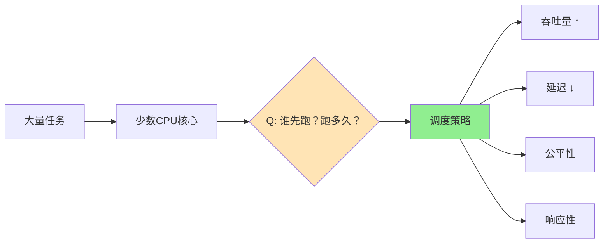

CPU 调度是操作系统的**"交通指挥员"**——在任意时刻，就绪的进程可能成百上千，但 CPU 只有几个核心。调度器必须回答两个问题：

1. **谁**应该获得 CPU？（选择策略）
2. 给它跑**多久**？（时间片长度）

这两个问题的答案，直接决定了系统的吞吐量、延迟、响应性和公平性。本章的目标就是把这四个维度拆解清楚：

- 最早的 FCFS 为什么被 SJF 取代？SJF 又有什么致命缺陷？
- RR 的时间片定多少？太大和太小的后果各是什么？
- MLFQ 是怎么在没有先知能力的情况下，兼顾长短作业的？
- Linux CFS 的 "完全公平" 到底怎么量化？vruntime 是什么鬼？
- 多核时代，负载均衡和 CPU 亲和性怎么取舍？

带着这五个问题，我们开始。


## 02.调度概述

### 2.1 什么是CPU调度

CPU 调度的本质是：当 CPU 空闲时，从就绪队列中**选择一个进程**，把 CPU 分配给它。

```
一个 CPU 核心的运行时间线：

   进程A      进程B      进程C      进程A
|████████|▁▁▁▁▁▁▁▁|████████|▁▁▁▁▁▁▁▁|████████|  ...
    ↑          ↑                    ↑
 调度A     调度B（A被抢占）       调度C
```

每次切换，就是一次"调度决策"。一个好的调度算法，能让系统的整体体验更好；一个差的调度算法，可能让系统严重"偏袒"某些进程，造成饥饿。

### 2.2 调度的三个层次

操作系统中的"调度"不是只发生一次，而是在三个层次上依次进行：

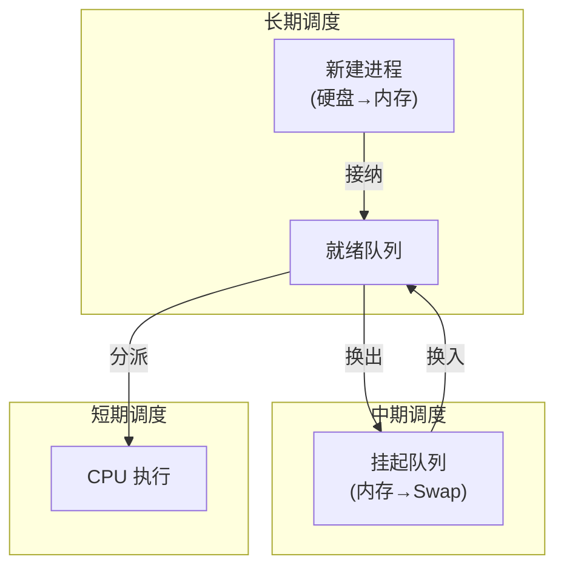

| 层次 | 名称 | 频率 | 做什么 | 对性能的影响 |
|------|------|------|--------|-------------|
| 长期调度 | 作业调度 | 分钟/小时 | 决定哪些作业被装入内存开始执行 | 控制系统整体并发度 |
| 中期调度 | 内存调度 | 秒/分钟 | 决定哪些进程被换出到Swap | 缓解内存压力，平衡并发度 |
| 短期调度 | CPU调度 | 毫秒/微秒 | 决定下一个要执行的进程 | 直接影响交互体验和吞吐量 |

本章聚焦于**短期调度（CPU调度）**——因为它发生得最频繁，对系统响应的影响最大。长期调度和中期调度更多地涉及内存管理的范畴，在后续章节展开。

### 2.3 调度的时机

**疑惑：操作系统什么时候会执行调度？是定时的，还是随机的？**

**答疑**：调度发生在四种典型时机：

| 时机 | 触发方式 | 典型场景 |
|------|---------|---------|
| 进程主动放弃CPU | 进程调用阻塞系统调用（如 `read()`） | IO密集型进程等待数据 |
| 进程主动放弃CPU | 进程调用 `yield()` / `sleep()` | 协作式让出 |
| 进程被动失去CPU | 时间片用完，时钟中断触发 | 抢占式调度的核心机制 |
| 进程重新就绪 | 新进程fork完成 / IO完成 / 锁释放 | 新进程优先级可能更高，触发抢占 |

**关键理解**：上述第四种情况是否触发抢占，取决于调度器的**抢占策略**。非抢占式调度只在"进程主动放弃"时切换；抢占式调度则在"有更高优先级进程就绪"时就立即切换。

### 2.4 调度性能指标

评价一个调度算法好坏，不能只凭直觉，需要有量化的指标：

| 指标 | 定义 | 关注者 |
|------|------|--------|
| CPU利用率 | CPU忙碌时间的比例 | 系统管理员 |
| 吞吐量（Throughput） | 单位时间内完成的进程数量 | 数据中心 |
| 周转时间（Turnaround Time） | 从进程创建到完成的总时间 | 批处理用户 |
| 等待时间（Waiting Time） | 进程在就绪队列中的等待总时间 | 任何用户 |
| 响应时间（Response Time） | 从提交到**首次**获得CPU的时间 | 交互式用户 |
| 公平性 | 各进程获得的CPU时间的均衡程度 | 多租户系统 |

**用一个Gantt图直观感受这四个时间概念**：

```
进程P的时间线：
  创建          首次运行                           完成
  |──── 等待 ────|████ 运行 ████|──── 等待 ────|████|── ...
  |←──────────── 响应时间 ──────→|
  |←──────────────────────── 周转时间 ────────────────────→|
```

### 2.5 抢占式vs非抢占式

这是调度算法的第一个分岔口：

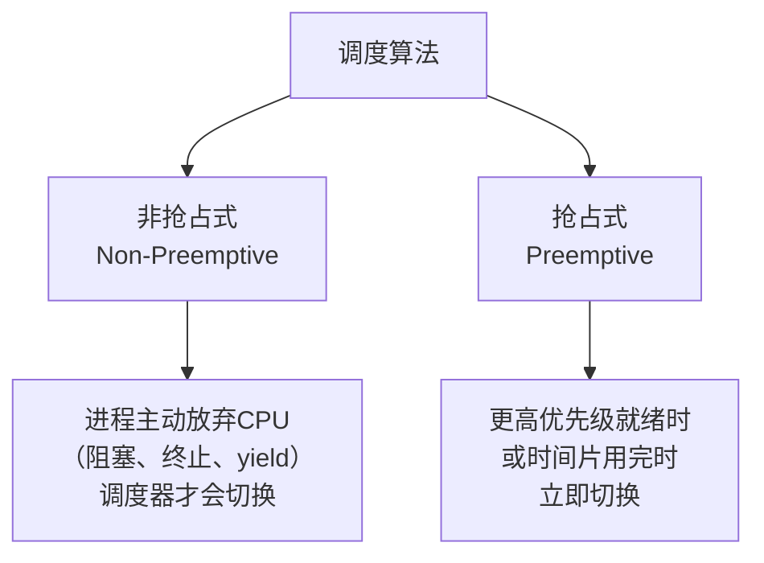

| 特性 | 非抢占式 | 抢占式 |
|------|---------|--------|
| 谁决定切换 | 进程自己 | 调度器 |
| 上下文切换频率 | 低 | 高 |
| 响应性 | 差（交互式场景不可用） | 好 |
| 实现复杂度 | 简单 | 复杂（涉及锁、同步） |
| 开销 | 低 | 较高（频繁切换） |
| 典型算法 | FCFS, SJF | RR, MLFQ, CFS |
| 适用场景 | 批处理系统 | 通用/交互式系统 |

**现代通用操作系统全部采用抢占式调度**。你不可能接受在 Word 里输一个字等上一分钟才能看到结果——那就回到了 DOS 的远古时代。


## 03.先来先服务FCFS

### 3.1 FCFS算法原理

先来先服务（First Come First Served）是最朴素的想法：**谁先到，谁先跑；没跑完，后面排队**。

```
就绪队列: P1 → P2 → P3 → P4
                ↑
           队头（下一个调度）

规则：总是选择队头进程，不允许插队
性质：非抢占式
```

**模拟示例**——假设三个进程同时到达，但按 FCFS 意味着队列已经有顺序了：

```
进程    需要的CPU时间
P1      24
P2       3
P3       3

假设到达顺序: P1 → P2 → P3

Gantt图:
|████████ P1(24) ████████|██ P2(3) ██|██ P3(3) ██|
0                         24           27          30

P1 等待时间:  0
P2 等待时间: 24
P3 等待时间: 27

平均等待时间: (0 + 24 + 27) / 3 = 17
平均周转时间: (24 + 27 + 30) / 3 = 27
```

如果到达顺序反过来——P3 → P2 → P1：

```
Gantt图:
|██ P3(3) ██|██ P2(3) ██|████████ P1(24) ████████|
0           3           6                          30

平均等待时间: (0 + 3 + 6) / 3 = 3
平均周转时间: (3 + 6 + 30) / 3 = 13
```

**结论**：同样的任务，仅仅是到达顺序的不同，平均等待时间从 3 飙升到 17——差了近 6 倍。这就是 FCFS 的核心问题。

### 3.2 FCFS的护卫效应

FCFS 的致命缺陷叫做**护卫效应（Convoy Effect）**——一个"长作业"堵在队首，后面的所有"短作业"都只能干等。


**类比**：你去便利店买一瓶水，前面有个人买 100 箱水正在结账。虽然你只需要 5 秒，但你必须等那个人把所有 100 箱水结完。这体验极差。

**论证**：护卫效应对**IO密集型**的交互式应用打击最大。一个 IO 密集进程需要频繁地获得 CPU 来处理数据，但因为有长作业堵在前面，每次它都排在队尾重新等——即使它只需要很小的 CPU 时间片。这就是为什么 FCFS 不能用于现代交互式操作系统。

### 3.3 FCFS的适用场景

FCFS 虽然缺陷明显，但它有一个不可替代的优点：**实现极简、公平感强**（先来后到是直觉上的公平）。在以下场景仍有应用：

- **批处理系统**（不需要交互响应）
- **FIFO管道**（pipe 的底层语义就是 FCFS）
- **某些特定硬件驱动**（简单顺序处理）

**结论**：FCFS 是调度算法的起点，理解了它的缺陷，就自然而然引出了后续所有"更聪明"的算法。


## 04.短作业优先SJF

### 4.1 SJF算法原理

短作业优先（Shortest Job First）是对 FCFS 的第一次优化：**谁需要的时间最短，谁先跑**。

```
就绪队列中三个进程:
  P1: 需要 6ms
  P2: 需要 8ms
  P3: 需要 3ms  ← 最短，先调度

执行顺序: P3 → P1 → P2

Gantt图:
|██ P3(3) ██|██████ P1(6) ██████|████████ P2(8) ████████|
0           3                   9                        17

平均等待时间: (0 + 3 + 9) / 3 = 4     ← FCFS同样顺序是 (0 + 6 + 14) / 3 ≈ 6.7
平均周转时间: (3 + 9 + 17) / 3 ≈ 9.7  ← FCFS约 13.3
```

**SJF 在理论上是最优的**——在所有非抢占式算法中，它能给出**最短的平均等待时间**。证明思路：把短作业放在长作业之前执行，短作业的等待时间减少了（少等了长作业的时间），而长作业的等待时间只增加了短作业的时间（这个增量很小）。净效果为正。

### 4.2 抢占式SRTF

SJF 的抢占式版本叫做**最短剩余时间优先（Shortest Remaining Time First, SRTF）**：

> 当一个新进程到达时，比较它和当前运行进程的"剩余执行时间"，如果新进程剩余时间更短，就抢占。

```
P1: 到达时间 0, 需要 8ms
P2: 到达时间 1, 需要 4ms
P3: 到达时间 2, 需要 1ms

SRTF 执行过程：

T=0:  P1 开始执行(剩余8ms)
T=1:  P2 到达(剩余4ms) < P1 剩余7ms → 抢占！P2 开始
T=2:  P3 到达(剩余1ms) < P2 剩余3ms → 抢占！P3 开始
T=3:  P3 完成
      P2 恢复(剩余3ms) < P1 剩余7ms → P2 继续
T=6:  P2 完成
      P1 恢复(剩余7ms)
T=13: P1 完成

Gantt图:
|P1(1)|P2(1)|P3(1)|██ P2(3) ██|███████ P1(7) ███████|
0     1     2     3            6                      13
```

**SRTF 的优势**：它能充分利用每个新到达的信息，做出比 SJF 更优的决策。理论上，SRTF 的平均等待时间比 SJF 还要短。

### 4.3 SJF的预测问题

**疑惑：SJF 需要提前知道每个进程需要多少 CPU 时间，但你怎么可能提前知道？**

**答疑**：对于批处理系统中的作业，用户可以在提交时提供估计值。但对于通用操作系统中的交互式进程，没有办法提前知道——这就是 SJF 在实践中的**致命伤**。

不过，可以用**指数平均法**来预测下一次的 CPU 区间长度：

```
预测下一段CPU时间: τ_{n+1} = α · t_n + (1-α) · τ_n

其中:
  t_n  = 第n次的**实际**CPU时间
  τ_n  = 第n次的**预测**CPU时间
  α    = 加权系数（0 ≤ α ≤ 1）

α 越接近 1：更"相信"最近一次的实际值（对变化敏感）
α 越接近 0：更"相信"历史预测值（平滑、稳定）
```

**实例演示（α = 0.5）**：

```
实际CPU时间序列: 6, 4, 6, 4, 13, 13, 13, ...
初始预测 τ₀ = 10

τ₁ = 0.5 × 6  + 0.5 × 10 = 8.0
τ₂ = 0.5 × 4  + 0.5 × 8  = 6.0
τ₃ = 0.5 × 6  + 0.5 × 6  = 6.0
τ₄ = 0.5 × 4  + 0.5 × 6  = 5.0
τ₅ = 0.5 × 13 + 0.5 × 5  = 9.0   ← 突然多了，预测跟上了！
```

**结论**：虽然预测不可能完全精确，但指数平均法在实践中效果好且实现简单。不过现代通用调度器（如 CFS）已经不再依赖"预测执行时间"这种思路了——它们换了一种全新的公平性视角。


## 05.优先级调度

### 5.1 优先级调度原理

优先级调度是更通用的抽象：每个进程有一个优先级，调度器总是选择**优先级最高**的进程执行。

```
FCFS 可以视为：优先级 = 到达时间越早，优先级越高
SJF 可以视为：优先级 = CPU时间越短，优先级越高
```

```
就绪队列（按优先级排列）:
  [Pri 10: 视频解码]  ← 最高优先级，需要低延迟
  [Pri 8:  浏览器UI]
  [Pri 5:  编译器]
  [Pri 2:  备份脚本]   ← 最低优先级，可以慢慢跑
  [Pri 0:  空闲进程]
```

优先级调度可以是**抢占式**的（高优先级进程一到就抢CPU）或**非抢占式**的（等当前进程主动放弃）。

### 5.2 静态优先级vs动态优先级

| 类型 | 优先级如何确定 | 是否可变 | 典型应用 |
|------|-------------|---------|---------|
| 静态优先级 | 创建时指定，运行期间不变 | 否 | 实时系统 |
| 动态优先级 | 运行时根据行为调整 | 是 | MLFQ、CFS |

**动态优先级的精妙之处**——它可以让调度器根据进程的实际行为"自适应"地调整优先级：

```c
// 动态优先级的调整逻辑（简化版 MLFQ 思想）
if (进程用完了整个时间片) {
    降低优先级;  // 可能是CPU密集型，给它更少的调度机会
} else if (进程在时间片用完前就阻塞了) {
    提高优先级;  // 可能是IO密集型，需要快速响应
}
```

这就是著名的**"奖励IO密集进程、惩罚CPU密集进程"**策略——在通用操作系统中几乎是标准做法。

### 5.3 优先级反转

**疑惑：优先级高了就一定好吗？有没有优先级调度反而不如不调的时候？**

**答疑**：有的，这就是著名的**优先级反转（Priority Inversion）**问题——高优先级进程因为等待低优先级进程持有的资源，反而无法执行。

```
经典场景（火星探路者号就栽在这上面）：

  高优先级进程 H：需要锁 L
  中优先级进程 M：纯计算，不需要锁 L
  低优先级进程 L：持有锁 L

时间线：
  T1: 低优先级 L 获得锁 L，开始执行
  T2: 高优先级 H 就绪 → 抢占低优先级 L
  T3: H 尝试获取锁 L → 失败！因为 L 持有锁 → H 被阻塞
  T4: 低优先级 L 恢复执行 → 但又被中优先级 M 抢占了！
  T5: M 一直在跑，L 拿不到CPU也就无法释放锁
  T6: H 虽然优先级最高，但**被M间接地无限阻塞了**！
```

```
优先级反转的时间线:

H:      |████ 被阻塞(等锁) ████████████████████|  ← 本应最高优先级
M:      |████████████ 纯计算 ███████████████████|  ← 间接"劫持"了系统
L: |████|  ← 持有锁，但拿不到CPU → 无法释放锁
     ↑
  锁被L持有
```

**经典案例**：1997年，NASA的火星探路者号（Mars Pathfinder）在火星表面遭遇了优先级反转，导致系统反复重启。工程师通过远程诊断发现了这个问题，修复后任务才得以继续。

**解决方案**：

| 方案 | 做法 | 效果 |
|------|------|------|
| 优先级继承 | 持有锁的低优先级进程**临时继承**等待者的高优先级 | 让L不被M抢占，尽快释放锁 |
| 优先级天花板 | 锁本身有一个"天花板优先级"（等于所有可能用到它的进程的最高优先级） | 持锁期间优先级自动提升 |
| 禁用抢占 | 在临界区内禁止抢占 | 简单粗暴，但影响实时性 |

Linux 内核中的 `rt_mutex` 实现了优先级继承，专门解决实时调度中的优先级反转问题。


## 06.时间片轮转RR

### 6.1 RR算法原理

时间片轮转（Round Robin, RR）专门为**交互式/分时系统**设计：每个进程轮流获得一个固定长度的时间片（Time Quantum），时间到了就排到队尾。

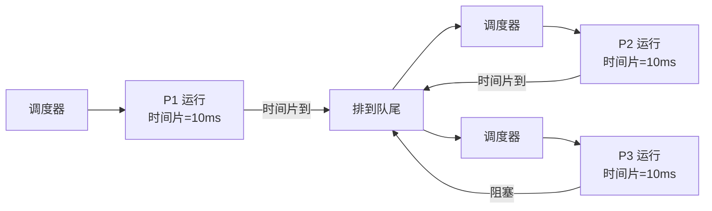

```
假设时间片 = 4ms

进程    需要的CPU时间
P1       24
P2        3
P3        3

Gantt图:
|P1(4)|P2(3)|P3(3)|P1(4)|P1(4)|P1(4)|P1(4)|P1(4)|
0     4     7    10    14    18    22    26    30

P1 等待时间: (0 + (7-4)) + ((10-7)-4) + ... = 6
P2 等待时间: 4
P3 等待时间: 4 + 3 = 7

平均等待时间: (6 + 4 + 7) / 3 ≈ 5.7
（对比：FCFS同样顺序为17，SJF为4）
```

**关键洞察**：RR 牺牲了周转时间（长作业被切碎了），但换来了**公平性和响应性**——每个进程在一定时间内都能获得CPU。对交互式用户来说，不必等长作业跑完就能看到进度。

### 6.2 时间片大小的权衡

**疑惑：时间片设多大合适？设大一点还是小一点？**

**答疑**：这是 RR 算法最核心的调优参数，设大和设小各有代价：

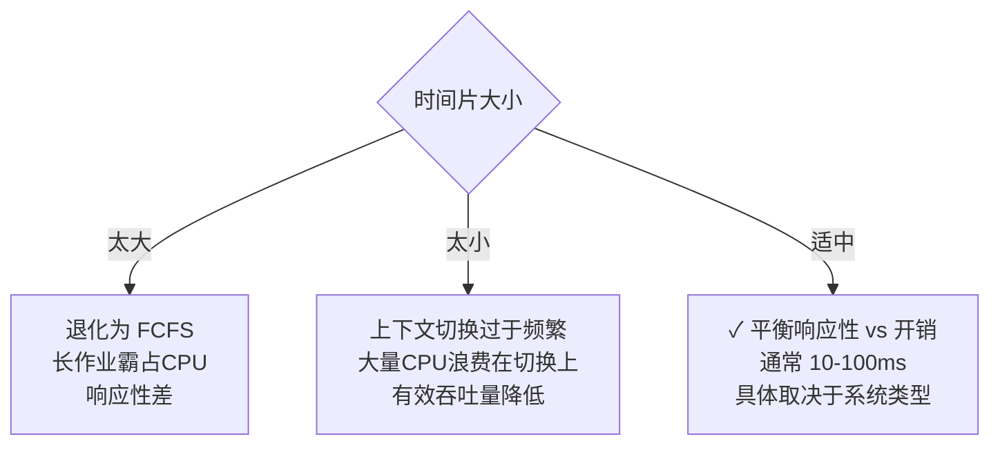

**量化分析**：

```
假设：一次上下文切换开销 = 10μs，时间片 = q ms

上下文切换开销占比 = 10μs / (q × 1000μs) × 100%

q = 1ms:   开销占比 = 1.0%   ← 可接受的惩罚
q = 0.1ms: 开销占比 = 10.0%  ← 明显的浪费
q = 0.01ms:开销占比 = 50.0%  ← CPU一半时间在做无用功
q = 100ms: 开销占比 = 0.01%  ← 开销极低，但用户体验差

实践经验法则：
  q 应远大于上下文切换时间，但远小于典型交互的容忍延迟
  Linux CFS: 动态时间片（目标延迟 6ms / 进程数）
  Windows:   20-120ms（根据前台/后台窗口自适应）
```

**结论**：时间片通常在 **10~100 毫秒**之间。现代调度器（如 CFS）已经不再使用固定时间片，而是动态计算——这将在第 8 章详细展开。

### 6.3 虚拟轮转VRR

标准 RR 有一个微妙的问题：如果一个 IO 密集进程在时间片用完**之前**就主动阻塞了（比如读磁盘），当 IO 完成它回到就绪队列时，只能排到队尾。它其实只用了很少的 CPU，却要等所有进程都跑一遍才能再次获得 CPU。

**虚拟轮转（Virtual Round Robin, VRR）**的改进：

```
标准 RR：
  进程 IO后回来 → 排到队尾 → 等所有人都跑完才能轮到

虚拟轮转 VRR：
  进程 IO后回来 → 排到"辅助队列" → 优先于普通就绪队列被调度
  但辅助队列里的进程只能使用"上次没用完的时间片"
```

这本质上就是"奖励 IO 密集进程"的一种实现方式——你主动让出 CPU，我就让你回来时不用排那么久的队。


## 07.多级队列与反馈队列

### 7.1 多级队列MLQ

多级队列（Multi-Level Queue, MLQ）把进程按**类型**分到不同的队列，每个队列有自己的调度算法：

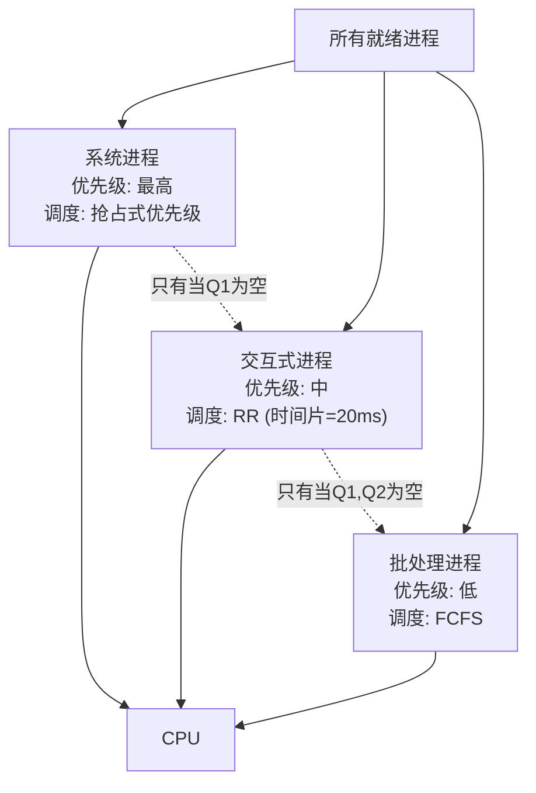

**MLQ 的问题**：进程被分配到一个队列后就**固定在那个队列里**。一个批处理任务即使表现出 IO 密集的特征，也不会被提升到交互式队列。这种"分类打标签"的方式缺乏自适应性。

### 7.2 多级反馈队列MLFQ

多级反馈队列（Multi-Level Feedback Queue, MLFQ）是 MLQ 的升级版——**进程可以在不同队列之间迁移**。这让调度器可以在不需要先知能力的情况下，自动适应进程的行为。

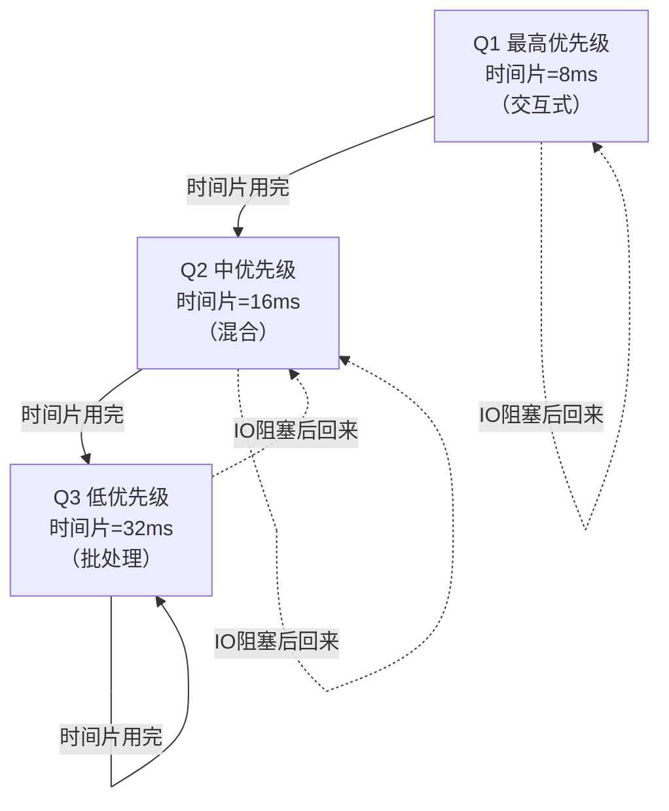

**关键机制**：

1. **降级**：如果进程用完了整个时间片，说明它是 CPU 密集的，被降到低优先级队列
2. **保持**：如果进程在时间片用完前主动放弃 CPU（如 IO 阻塞），它保持在当前队列
3. **优先级越高，时间片越小**——交互式进程需要快速响应但不需要长运行，CPU 密集进程可以容忍被换出但需要更大的时间片来摊销切换开销

### 7.3 MLFQ的五条规则

MLFQ 的经典设计可以归纳为五条规则：

| 规则 | 内容 | 目的 |
|------|------|------|
| 规则1 | 如果 Priority(A) > Priority(B)，运行A | 高优先级优先 |
| 规则2 | 如果 Priority(A) = Priority(B)，轮转运行A和B | 同队列内公平 |
| 规则3 | 新进程在最高优先级队列 | 给每个进程一个"被当成交互式进程"的机会 |
| 规则4(a) | 进程用完时间片，降低优先级 | 长作业逐渐沉降到低优先级 |
| 规则4(b) | 进程在时间片用完前放弃CPU，保持优先级 | 奖励IO密集行为 |
| 规则5 | 定期将所有进程提升到最高优先级 | 防止饥饿，适应行为变化 |

**规则5 是最巧妙的一条**——它定期"重置"所有进程的优先级，确保：

- 一个CPU密集进程如果转变成了IO密集，能被及时识别
- 低优先级的批处理进程不会被永久饿死
- 这就叫"Boost"机制

### 7.4 MLFQ的演进逻辑

**疑惑：MLFQ 看起来规则很多很复杂，但它的设计思想是什么？**

**答疑**：MLFQ 背后有两个核心洞见：

```
洞见1：不用"预测"执行时间，而是根据"实际行为"调整
  → 你表现得像IO密集（没跑完时间片就阻塞）→ 我就给你高优先级
  → 你表现得像CPU密集（跑满时间片）        → 我就给你低优先级

洞见2：高低优先级的"收益"设计不同
  → 高优先级：时间片小，调度频繁 → 适合"频繁需要小段CPU"的交互式进程
  → 低优先级：时间片大，调度不频繁 → 适合"需要大段CPU"的批处理进程
```

**MLFQ 是现代调度器的思想先驱**——虽然 Linux CFS 没有直接用 MLFQ 的多队列结构，但"根据行为动态调整"这一核心理念是一脉相承的。CFS 用了一种更精妙的数学框架来实现同一个目标。


## 08.Linux CFS完全公平调度

### 8.1 从O(n)到CFS

Linux 的调度器经历了漫长的演进：

| 版本 | 调度器 | 特点 |
|------|--------|------|
| Linux 2.4 | O(n) 调度器 | 每次调度遍历所有进程，复杂度 O(n) |
| Linux 2.6.0-2.6.22 | O(1) 调度器 | 固定140个优先级队列，O(1)选择下一个进程 |
| Linux 2.6.23+ | CFS | 完全公平调度器，基于vruntime和红黑树 |
| Linux 3.14+ | CFS + EAS | 加入能耗感知调度（Energy Aware Scheduling） |

**O(n) 调度器有多慢？**

```
假设系统有 10000 个就绪线程：

O(n):  每次调度遍历10000个线程，比较它们的"goodness"值
       如果调度频率1000Hz → 每秒1000次遍历 × 10000 = 1000万次比较/秒
       
O(1):  每次直接取最高优先级队列的头 → 1次操作
       
CFS:   红黑树取最左节点 → O(log n) ≈ 14次操作
```

### 8.2 CFS的核心思想

CFS（Completely Fair Scheduler）没有引入"时间片"的概念（至少不是传统意义上的固定大小时间片），而是引入了"公平份额"：

> 在有 N 个任务的理想世界中，每个任务应获得 **1/N** 的 CPU 时间。

```
如果你有 4 个任务，CPU 只有 1 个核心：
  理想情况：每个任务获得 25% 的CPU时间
  实际问题：怎么在"不固定时间片"的情况下实现这个目标？
```

CFS 的回答是**虚拟运行时间（vruntime）**——不是用墙上的钟来衡量公平，而是用一个"加权过的虚拟时钟"。


### 8.3 虚拟运行时间vruntime

**疑惑：vruntime 到底是什么？和物理时间有什么区别？**

**答疑**：vruntime 是 CFS 的**公平性度量**——每个任务都有一个 `vruntime`，记录它"在 CFS 眼里"已经使用了多少 CPU 时间。

```
核心公式：
  vruntime = 实际运行时间 × (NICE_0_LOAD / 当前进程的权重)

理解关键：
  ┌─────────────────────────────────────────────┐
  │ vruntime 增长越慢 → CFS 认为它"消耗得少"    │
  │ vruntime 最小的进程 → 下一个被调度          │
  │ 目标：让所有进程的 vruntime 趋于相等         │
  └─────────────────────────────────────────────┘
```

**权重的影响**：

```
假设两个进程 A（nice=0, 权重=1024）和 B（nice=5, 权重≈335）：

A 运行 10ms:
  vruntime_A += 10ms × (1024/1024) = 10ms

B 运行 10ms:
  vruntime_B += 10ms × (1024/335)  ≈ 30.6ms  ← 增长更快！

结果：
  B 的 vruntime 增长更快 → B 更容易被"认为已经跑够了"
  → A 获得更多的实际CPU时间（因为A的vruntime增长慢）
  → 这就实现了 nice 值的语义：nice 越高（越友好），拿到的CPU越少
```

```
vruntime 曲线对比（物理时间 30ms）：

vruntime
 30ms │              ╱ B (nice=5, vruntime增长快)
      │            ╱
 20ms │          ╱
      │        ╱
 10ms │    ╱╱ A (nice=0, vruntime增长慢)
      │ ╱╱
  0ms └─────────────────── 物理时间
       0    10    20    30
```

### 8.4 红黑树组织就绪队列

CFS 用**红黑树（Red-Black Tree）**来存储所有就绪进程，以 vruntime 为键值：

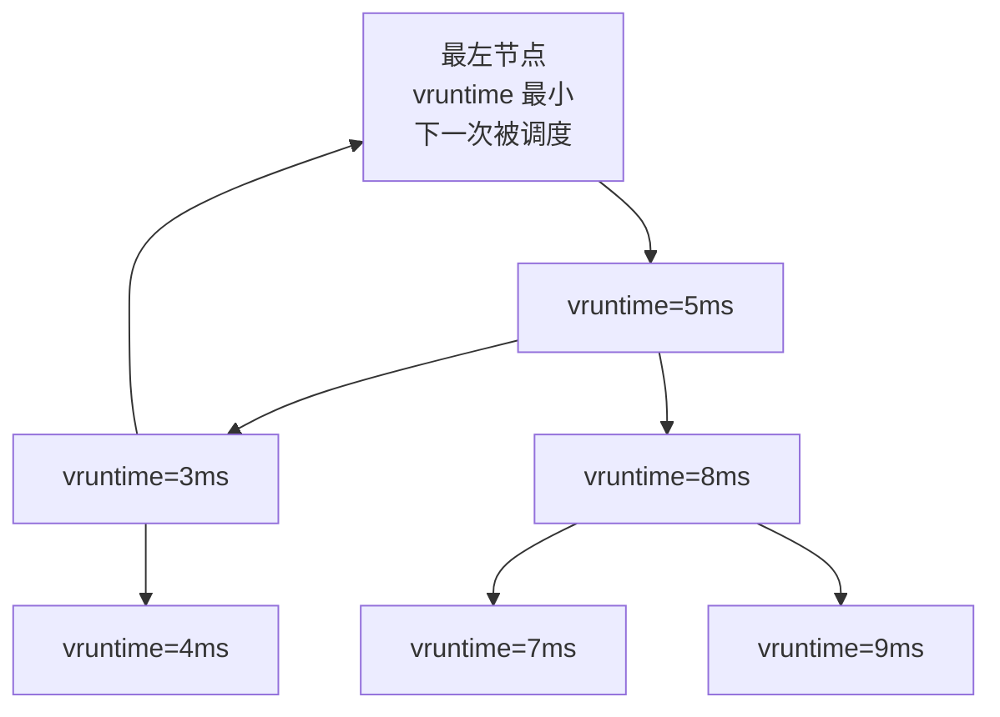

**为什么用红黑树？**

| 操作 | 红黑树 | 链表（O(n)时代的做法） |
|------|--------|----------------------|
| 找下一个（vruntime最小） | O(log n) | O(n) |
| 插入新进程 | O(log n) | O(1)（但结合查找就是O(n)） |
| 删除进程 | O(log n) | O(n) |

**取下一个进程的代码逻辑**（简化版）：

```c
// CFS 选择下一个进程
static struct sched_entity *pick_next_entity(struct cfs_rq *cfs_rq) {
    // 取红黑树最左节点 = vruntime最小的进程
    struct rb_node *left = rb_first(&cfs_rq->tasks_timeline);
    if (!left)
        return NULL;
    return rb_entry(left, struct sched_entity, run_node);
}
```

### 8.5 nice值与权重映射

nice 值在 CFS 中被映射为一组权重，这是 CFS 实现"基于比例的公平"的核心：

| nice 值 | 权重 | 相对CPU份额（假设两个进程） |
|---------|------|---------------------------|
| -20 | 88761 | 几乎独占CPU |
| -10 | 11046 | ~73% |
| 0 | 1024 | 50% |
| 5 | 335 | ~25% |
| 10 | 110 | ~10% |
| 19 | 15 | ~1.5% |

```
计算示例：进程A(nice=0, 权重=1024) vs 进程B(nice=5, 权重=335)

  A的CPU份额 = 1024 / (1024 + 335) ≈ 75.4%
  B的CPU份额 =  335 / (1024 + 335) ≈ 24.6%

验证：nice=0 比 nice=5 多获得约 3 倍的CPU时间
```

**注意**：这是**相对比例**，不是绝对百分比。如果有 100 个相同 nice 的进程，每个获得约 1% 的 CPU——CFS 只保证**相对比例**的公平性。

### 8.6 CFS的周期性调度

CFS 的每个 CPU 都有一个周期性定时器（`scheduler_tick()`），以频率 `HZ`（通常 250Hz 或 1000Hz）触发。每次 tick 时：

```c
// 每次时钟中断时 CFS 做的事情（简化）
void scheduler_tick(void) {
    struct rq *rq = cpu_rq(smp_processor_id());
    struct task_struct *curr = rq->curr;

    // 1. 更新当前进程的 vruntime
    update_curr(cfs_rq_of(&curr->se));

    // 2. 检查是否需要重新调度
    if (当前进程的vruntime - 最左节点的vruntime > 阈值) {
        // 标记需要抢占：设置 TIF_NEED_RESCHED 标志
        set_tsk_need_resched(curr);
    }
}
```

**CFS 的一个关键参数：`sched_latency`（目标调度延迟）**

```
sched_latency: CFS 希望能在这个时间内让所有可运行进程至少执行一次

默认 sched_latency = 6ms

假设有 3 个就绪进程：
  每个进程的时间片 = 6ms / 3 = 2ms

假设有 100 个就绪进程：
  每个进程的时间片 = 6ms / 100 = 60μs  ← 太小了！上下文切换会很频繁

CFS 引入了 sched_min_granularity（最小粒度）：
  每个进程至少获得 sched_min_granularity = 0.75ms
  
  100 个进程时，sched_latency 会扩大到 100 × 0.75ms = 75ms
```

**这体现了 CFS 的实用主义**：它在"理想公平"和"现实开销"之间做了一个优雅的折中。

### 8.7 调度实体与组调度

CFS 的一个强大特性是**调度实体（sched_entity）**——它不是只能调度进程，还能调度**进程组**。

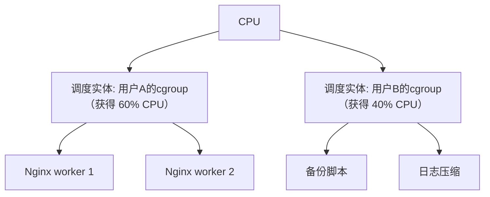

**cgroup 的 CPU 份额配置**：

```bash
# 创建两个 cgroup
mkdir /sys/fs/cgroup/cpu/high_priority
mkdir /sys/fs/cgroup/cpu/low_priority

# 设置 CPU shares（高优先级:低优先级 = 3:1）
echo 768  > /sys/fs/cgroup/cpu/high_priority/cpu.shares
echo 256  > /sys/fs/cgroup/cpu/low_priority/cpu.shares

# 把 Nginx 放进高优先级组
echo $NGINX_PID > /sys/fs/cgroup/cpu/high_priority/tasks

# 把备份脚本放进低优先级组
echo $BACKUP_PID > /sys/fs/cgroup/cpu/low_priority/tasks
```

**回到 1.1 节的案例**：小陈最后的解决方案就是这样——用 cgroup 给 Nginx 的 8 个 worker **作为一个整体**分配 70% 的 CPU 份额，后台任务瓜分剩下的 30%。Nginx 的 P99 延迟从 200ms 降回了 5ms。


## 09.实时调度

### 9.1 实时vs非实时

通用调度器（如 CFS）追求的是**公平**——所有进程都有机会运行。但实时系统追求的是**确定性**（determinism）——某个高优先级任务必须在截止时间前完成。

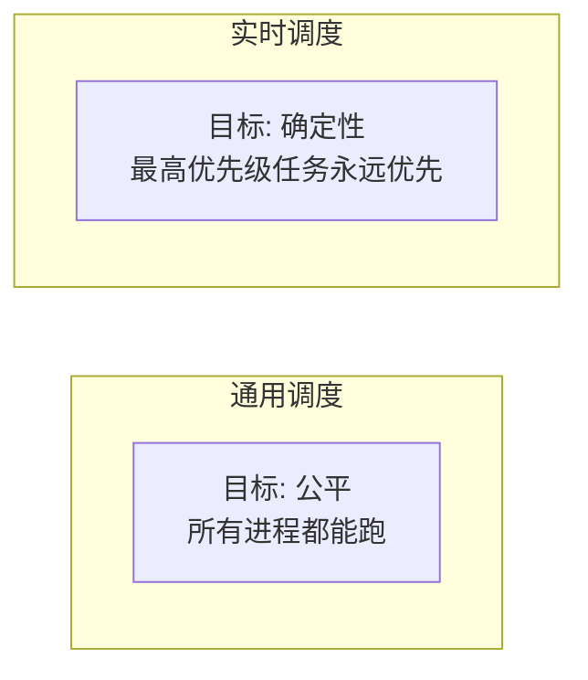

Linux 支持的调度策略：

| 策略 | 类别 | 特点 |
|------|------|------|
| `SCHED_OTHER` | 普通 | CFS 调度，默认策略 |
| `SCHED_BATCH` | 普通 | 类似 OTHER，但更不适合抢占（批处理优化） |
| `SCHED_IDLE` | 普通 | 极低优先级，只有系统完全空闲时才运行 |
| `SCHED_FIFO` | 实时 | 先入先出，无时间片，运行直到阻塞或主动放弃 |
| `SCHED_RR` | 实时 | 轮转，同优先级实时任务间有时间片 |
| `SCHED_DEADLINE` | 实时 | EDF（最早截止时间优先），最先进的实时策略 |

### 9.2 SCHED_FIFO和SCHED_RR

**SCHED_FIFO**：简单粗暴——最高优先级的实时任务一旦拿到CPU，就一直运行，直到它主动阻塞或更高优先级的任务出现。

```
SCHED_FIFO（优先级从高到低）:
  Task A (prio=99): |████████████████████| ← 一直跑，直到阻塞
  Task B (prio=50):                     |████| ← A阻塞后B才轮得到
  Task C (prio=50):                          |████|
  Task D (普通):                                |██| ← 实时任务都阻塞了才轮到普通
```

**SCHED_RR**：在 SCHED_FIFO 的基础上，**相同优先级**的实时任务之间用时间片轮转，避免一个任务永久霸占CPU。

**设置实时优先级**：

```c
#include <sched.h>

struct sched_param param;
param.sched_priority = 80;  // 实时优先级 1-99，越大越高

// 设置为 SCHED_FIFO
sched_setscheduler(0, SCHED_FIFO, &param);
```

### 9.3 实时调度的风险

**疑惑：那我能不能把自己的程序设为 SCHED_FIFO？这样不就永远不被换出了？**

**答疑**：技术上可以（需要 `CAP_SYS_NICE` 权限），但**极其危险**：

```c
// 致命代码：SCHED_FIFO + 死循环 = 系统假死
int main() {
    struct sched_param param = { .sched_priority = 99 };
    sched_setscheduler(0, SCHED_FIFO, &param);

    while (1) {
        // 高优先级实时任务 + 死循环
        // 结果：CPU 被这个进程独占，连内核线程都可能饿死
        // SSH 登录不了、kill 信号发不进来、只能硬重启
    }
}
```

**为什么危险？**

- 实时任务优先级高于**所有**普通任务，甚至高于部分内核线程
- 一个 SCHED_FIFO(99) 的死循环会让整个CPU核心完全无法响应
- 在多核系统上，即使只占满一个核心，中断路由和内核线程调度也可能被影响

**防护措施**：Linux 内核有一个 `sched_rt_runtime_us` 参数（默认 950ms/秒），限制实时任务每秒最多占用 CPU 的 95%，给普通任务留下 5% 的"生存空间"。

```bash
# 查看实时调度的带宽限制
cat /proc/sys/kernel/sched_rt_runtime_us   # 默认 950000 （微秒）
cat /proc/sys/kernel/sched_rt_period_us    # 默认 1000000

# 含义：每 1 秒周期内，实时任务最多跑 0.95 秒，留 0.05 秒给普通任务
```


## 10.多核调度

### 10.1 多核调度的新问题

单个 CPU 的调度问题基本解决了，但多核系统带来了全新的挑战：

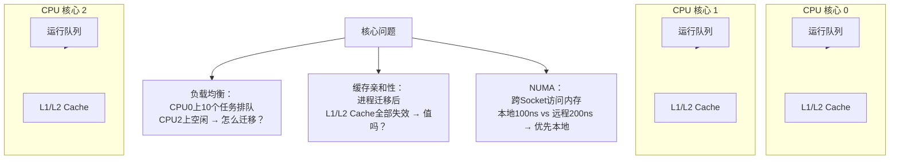

### 10.2 负载均衡

Linux 的负载均衡器定期检查各 CPU 的运行队列，将任务从繁忙的 CPU 迁移到空闲的 CPU：

```
简化逻辑：

每隔一定时间（tick）:
  for each 调度域:
    找到 "最忙" 的 CPU（运行队列长度最大）
    找到 "最闲" 的 CPU（运行队列长度最小）
    if (最忙 - 最闲 > 阈值):
      从最忙CPU迁移一些任务到最闲CPU
```

**迁移的代价权衡**：

```
进程从 CPU0 迁移到 CPU1 的代价：
  ├── 丢失 CPU0 的 L1 Cache (32KB, ~1ns)
  ├── 丢失 CPU0 的 L2 Cache (256KB, ~3ns)
  ├── 可能丢失 CPU0 的 L3 Cache (共享但独占行, ~10ns)
  ├── 新CPU需要重新加载 → 大量 Cache Miss → 性能短暂下降
  └── 总代价：前几个时间片内可能有 30-50% 的性能惩罚

迁移 vs 不迁移的权衡：
  - 如果新CPU完全空闲 → 迁移是净收益（哪怕有缓存惩罚）
  - 如果新CPU只是"稍空一点" → 迁移可能得不偿失
```

### 10.3 调度域与调度组

Linux 按硬件拓扑分层组织调度域，避免不合理的跨 NUMA 节点迁移：

```
一台双路（2个CPU Socket）服务器的调度域层次：

  机器（全部CPU）
  ├── NUMA节点0（Socket 0 上的所有核心）
  │   ├── 核心0 + 核心1（共享L2 Cache的核对）
  │   ├── 核心2 + 核心3
  │   └── ...
  └── NUMA节点1（Socket 1 上的所有核心）
      ├── 核心8 + 核心9
      └── ...
```

**负载均衡的层级策略**：

```
1. 先在 "共享 L2 Cache 的核对" 内均衡 → 代价最小
2. 再在 "同一 NUMA 节点" 内均衡          → 代价中等
3. 最后才跨 NUMA 节点均衡                 → 代价最大，谨慎操作
```

### 10.4 CPU亲和性

**疑惑：既然迁移有代价，能不能让进程固定在某个CPU上？**

**答疑**：可以。这叫 **CPU 亲和性（CPU Affinity）**——让进程"粘"在某个 CPU 上：

```bash
# 把 Nginx worker 绑定到特定CPU
taskset -c 0,1,2,3 ./nginx

# 查看进程的CPU亲和性
taskset -p $PID
# 输出: pid 12345's current affinity mask: f  (二进制 1111 = CPU 0-3)
```

```c
// 代码级别设置CPU亲和性
#include <sched.h>

cpu_set_t cpuset;
CPU_ZERO(&cpuset);
CPU_SET(2, &cpuset);  // 绑定到CPU 2

sched_setaffinity(0, sizeof(cpuset), &cpuset);
```

**亲和性 vs 负载均衡**：这是多核调度中永恒的权衡——

| 维度 | 强亲和性 | 强负载均衡 |
|------|---------|-----------|
| 缓存命中率 | 高（Cache Hot） | 低（频繁失效） |
| CPU利用率 | 可能不均衡 | 均衡 |
| 延迟抖动 | 低（稳定） | 高（迁移惩罚） |
| 适用场景 | 延迟敏感服务（Nginx） | 吞吐优先（批处理） |

**最佳实践**：对延迟敏感的服务（如 Nginx），手动设置亲和性，避免被负载均衡器乱迁移。对计算密集的批处理，交给内核的负载均衡器自动处理。


## 11.综合案例延迟敏感服务调度

### 11.1 场景三层服务的调度困境

用一个真实的三层架构案例来串联本章所有知识。

**场景**：你负责一个在线交易系统，部署在一台 16 核服务器上：

```
┌──────────────────────────────────────────┐
│  Nginx (8 workers)     ← 反向代理层      │
│  ├── 特点：IO密集（网络IO + epoll）      │
│  └── 需求：极低延迟（P99 < 5ms）         │
├──────────────────────────────────────────┤
│  业务服务 (16 threads)  ← 计算层         │
│  ├── 特点：CPU密集（JSON解析 + 业务逻辑）│
│  └── 需求：高吞吐                        │
├──────────────────────────────────────────┤
│  Redis + 备份脚本       ← 存储层         │
│  ├── 特点：混合（Redis主要是IO）         │
│  └── 需求：稳定                          │
└──────────────────────────────────────────┘
```

**当前问题**：每当备份脚本启动，Nginx 的 P99 延迟就会从 5ms 飙升到 100ms。

### 11.2 第一层Nginx事件驱动

Nginx 使用事件驱动 + 非阻塞 IO 的模型，8 个 worker 进程处理所有网络请求。在调度器眼里，这些 worker 表现出典型的**IO 密集特征**：

```
一个 Nginx worker 的典型时间线：
  epoll_wait() → 就绪事件 → 处理 → epoll_wait()

在 CFS 中的行为：
  worker 大部分时间在 epoll_wait 阻塞（等待网络数据）
  → vruntime 增长很慢
  → 一旦有数据到达，CFS 通常会立即调度它
  → 这正是我们想要的：IO密集进程需要快速响应
```

### 11.3 第二层业务微服务CPU密集

业务服务做大量 JSON 序列化/反序列化、数据校验、业务逻辑计算。它表现出典型的**CPU密集**行为：

```
在 CFS 中的行为：
  业务线程总是跑满时间片
  → vruntime 增长很快
  → 相对于 Nginx worker，vruntime 更大
  → CFS 在有 Nginx worker 就绪时优先调度 Nginx
  → 这看起来不错！
```

### 11.4 第三层存储服务IO密集

Redis 也是 IO 密集，问题不大。但**备份脚本**（`redis-bgsave` 触发 `fork()` + COW）是个混合型怪物：

```
redis-bgsave 的 CPU 使用特征：
  fork() 后子进程遍历所有内存页
  → 需要大量CPU时间（COW缺页处理）
  → 纯CPU密集行为
  → vruntime 暴涨
  
但是它对延迟不敏感——用户根本不在乎备份是花 5 秒还是 10 秒。
```

**为什么备份脚本会导致 Nginx 延迟飙升？**

```
问题不是 "备份脚本抢了Nginx的CPU"：
  ── CFS已经给了Nginx更高的相对份额
  
真正的问题是 "CFS 不知道备份脚本对延迟不敏感"：
 ── CFS 仍然保证备份脚本获得它的"公平份额"
 ── 备份脚本每获得 10ms CPU，Nginx worker 就要被换出
 ── 当 Nginx 回来时：
     ├── 缓存可能已经被备份脚本"污染"了
     ├── 调度延迟增加了 ~10ms
     └── P99 延迟从 5ms 涨到 100ms（累积效应）
```

### 11.5 调度参数调优实战

**方案一：用 nice 值调节（简单但不精准）**

```bash
# 降低备份脚本的优先级
nice -n 19 redis-bgsave  # nice=19，最低优先级

# 提升 Nginx 的优先级（需要root）
renice -n -10 -p $NGINX_PID
```

效果：有改善，但 Nginx worker 之间相互独立地竞争 CPU，无法体现 "Nginx 整体优先" 的语义。

**方案二：cgroup CPU shares（推荐）**

```bash
# Nginx：分配 60% CPU
mkdir /sys/fs/cgroup/cpu/nginx
echo 6144 > /sys/fs/cgroup/cpu/nginx/cpu.shares
echo $NGINX_PID1 > /sys/fs/cgroup/cpu/nginx/tasks
echo $NGINX_PID2 > /sys/fs/cgroup/cpu/nginx/tasks
# ... 所有 8 个 worker

# 业务服务：分配 30% CPU
mkdir /sys/fs/cgroup/cpu/business
echo 3072 > /sys/fs/cgroup/cpu/business/cpu.shares
# ...

# 备份：分配 10% CPU
mkdir /sys/fs/cgroup/cpu/backup
echo 1024 > /sys/fs/cgroup/cpu/backup/cpu.shares
# ...
```

**方案三：CPU亲和性（针对延迟敏感服务）**

```bash
# Nginx 独占 CPU 0-5（6个核），避免被负载均衡乱迁移
taskset -c 0-5 nginx

# 备份脚本限制在 CPU 14-15（2个核）
taskset -c 14-15 redis-bgsave

# 业务服务使用 CPU 6-13（8个核）
taskset -c 6-13 business-service
```

**方案四：cgroup cpuset（硬件级隔离）**

```bash
# Nginx cpuset：独占 CPU 0-5，不允许其他任务使用
mkdir /sys/fs/cgroup/cpuset/nginx
echo "0-5" > /sys/fs/cgroup/cpuset/nginx/cpuset.cpus
echo "0"   > /sys/fs/cgroup/cpuset/nginx/cpuset.mems

# 备份脚本 cpuset：只能使用 CPU 14-15
mkdir /sys/fs/cgroup/cpuset/backup
echo "14-15" > /sys/fs/cgroup/cpuset/backup/cpuset.cpus
```

**四种方案对比**：

| 方案 | P99延迟改善 | 实现难度 | CPU利用率 | 适用场景 |
|------|-----------|---------|-----------|---------|
| nice | ★★☆☆☆ 有改善 | 极低 | 高 | 快速修复、非关键服务 |
| cpu.share | ★★★★☆ 效果显著 | 低 | 高 | 长驻服务（推荐起点） |
| CPU亲和性 | ★★★★☆ 效果显著 | 中 | 中 | 延迟敏感 + 服务数量固定 |
| cpuset隔离 | ★★★★★ 彻底解决 | 中 | 低（NUMA绑定） | 性能极致要求 |

### 11.6 知识图谱回顾

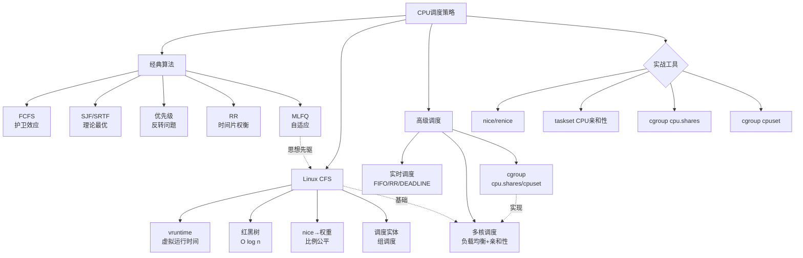

**最终的方法论沉淀**——当你的服务遇到调度相关的问题，按这个顺序排查：

1. **确定问题类型**：是延迟不稳定？吞吐量不够？还是某个进程被饿死？
2. **看调度器开销**：`perf top` 看 `__schedule` 占比，确认是不是调度风暴
3. **查优先级配置**：`ps -eo pid,ni,cls,comm` 看各个进程的 nice 值和调度策略
4. **调 cgroup 权重**：使用 `cpu.shares` 做组级别的公平分配（比 nice 更精准）
5. **隔离 CPU**：用 `cpuset` 或 `taskset` 做物理隔离（延迟敏感的终极方案）
6. **监控效果**：对比 P99 延迟、上下文切换频率、CPU 利用率的变化

把这张排查清单记在心里，你就从"调度代码的工程师"进化到了"调度系统的工程师"。


## 12.思考题与作业

### 12.1 基础思考题

1. **算法走一遍**：假设 P1(到达0, 需要8), P2(到达1, 需要4), P3(到达2, 需要9), P4(到达3, 需要5)。分别用 FCFS、SJF（非抢占）、SRTF（抢占）、RR（时间片=3）计算 Gantt 图、每个进程的等待时间和平均等待时间。

2. **时间片大小**：如果上下文切换开销是 5μs，时间片设为 1ms，那么上下文切换消耗了 CPU 的百分之几？如果时间片设为 100ms 呢？假设系统需要同时服务交互式用户（要求响应时间 < 100ms）和批处理任务，你会怎样设计时间片？

3. **vruntime 计算**：进程 A（nice=0, 权重=1024）和进程 B（nice=10, 权重=110）同时运行，A 实际运行了 100ms，B 也实际运行了 100ms。它们的 vruntime 分别是多少？为什么 B 的 vruntime 更大？

4. **CFS 红黑树**：画一棵 CFS 红黑树，包含 5 个进程（vruntime 分别为 3ms, 5ms, 7ms, 2ms, 8ms）。标记出"下一个被调度"的进程。如果这个进程运行了 2ms 后，vruntime 变成 5ms，红黑树会怎么调整（画出调整后的树）？

5. **调度策略对比**：一个系统中同时存在实时任务（音频播放，需要每 10ms 获得一次 CPU）和普通任务。如果它们都跑在 CFS 下，音频卡顿的概率有多大？改用 `SCHED_FIFO` 呢？请分析两种方案各自的优缺点。

### 12.2 进阶思考题

1. **1.1 节的复盘**：回到 Nginx 被投诉的案例，如果不用 cgroup，还有哪些调度层面的方案可以解决？请至少列出 3 种方案，并分析各自的适用场景和副作用。

2. **CFS 的公平性边界**：假设有两个进程，A 是 IO 密集（每秒阻塞/唤醒 100 次，每次只用 0.1ms CPU），B 是 CPU 密集（从不阻塞）。CFS 能否做到"真正的公平"？如果不能，CFS 偏向谁？为什么这种偏向在实际系统中是合理的？

3. **MLFQ vs CFS**：MLFQ 和 CFS 都试图在"短作业响应"和"长作业不饿死"之间取得平衡。请分析它们各自的实现手段，以及哪种方案在什么场景下更优。如果让你设计一个游戏主机的调度器（同时跑游戏和后台下载），你会基于哪种方案改造？

4. **多核负载均衡的陷阱**：假设一台 2 Socket 的 NUMA 服务器，Socket 0 上跑了 8 个 Nginx worker（绑核），Socket 1 上跑了 8 个计算任务。内核负载均衡器突然把一个计算任务迁移到 Socket 0 的一个核心上——这个迁移可能带来什么样的性能问题？为什么"好心办坏事"？

5. **火星探路者复盘**：1997 年火星探路者号的优先级反转问题，如果用本章学到的知识来分析——是什么调度策略导致的？如果你来设计一个"绝对不会发生优先级反转"的调度系统，你会怎么做？（提示：考虑优先级天花板协议的实现）

### 12.3 动手作业

**作业一（必做）**：用实验验证 nice 值的效果。

```bash
# 1. 编译一个纯CPU消耗程序
cat > cpu_burn.c << 'EOF'
int main() {
    volatile unsigned long long i;
    while (1) { i++; }
    return 0;
}
EOF
gcc -O0 cpu_burn.c -o cpu_burn

# 2. 同时启动两个不同 nice 值的实例
timeout 10 ./cpu_burn &                    # nice=0
timeout 10 nice -n 10 ./cpu_burn &         # nice=10
# 观察 top 中两个进程的 CPU% 比例
```

- 记录两个进程的实际 CPU% 比例。
- 和 CFS 权重表（nice=0 权重 1024, nice=10 权重 110）对比，理论比例是 10:1，实测是多少？为什么可能有偏差？

**作业二（选做）**：用 `perf` 分析调度开销。

```bash
# 启动一个大量创建/销毁线程的程序
# 用 perf 统计调度相关函数的调用次数
perf stat -e 'sched:sched_switch' -e 'sched:sched_wakeup' \
    -e 'context-switches' -a -- sleep 10

# 分析上下文切换频率，如果 > 10000/s/cpu，可能有问题
```

**作业三（选做）**：编写一个模拟调度器。

- 用你熟悉的语言实现 FCFS、SJF、RR 三种调度器。
- 输入：进程列表（到达时间，需要 CPU 时间）。
- 输出：Gantt 图、每个进程的等待时间、平均等待时间。
- 对比三种算法在同一组测试数据下的表现差异。

**作业四（架构思考）**：画出你当前最熟悉的一个服务的"CPU 调度全景图"。

- 列出所有进程/线程：它们的数量、nice 值、调度策略（SCHED_OTHER? SCHED_FIFO?）。
- 哪些进程对延迟敏感？哪些对吞吐敏感？哪些无所谓？
- 按 11.6 节的排查清单，分析当前调度配置是否存在问题。如果有，给出改进方案并预测改进后的效果。
