# 进程间通信IPC

> 管道/消息队列/共享内存/信号量/Socket——什么时候该用哪个？

#### 目录介绍
- [01.工作案例引入](#01工作案例引入)
  - [1.1 一个诡异的OOM](#11-一个诡异的oom)
  - [1.2 为什么要学进程间通信](#12-为什么要学进程间通信)
- [02.IPC概述](#02ipc概述)
  - [2.1 什么是进程间通信](#21-什么是进程间通信)
  - [2.2 IPC的分类方式](#22-ipc的分类方式)
  - [2.3 IPC的核心矛盾](#23-ipc的核心矛盾)
- [03.管道Pipe](#03管道pipe)
  - [3.1 匿名管道](#31-匿名管道)
  - [3.2 管道的底层实现](#32-管道的底层实现)
  - [3.3 命名管道FIFO](#33-命名管道fifo)
  - [3.4 管道的局限性](#34-管道的局限性)
- [04.消息队列](#04消息队列)
  - [4.1 消息队列是什么](#41-消息队列是什么)
  - [4.2 POSIX消息队列](#42-posix消息队列)
  - [4.3 System V消息队列](#43-system-v消息队列)
  - [4.4 消息队列vs管道](#44-消息队列vs管道)
- [05.共享内存](#05共享内存)
  - [5.1 共享内存的原理](#51-共享内存的原理)
  - [5.2 System V共享内存](#52-system-v共享内存)
  - [5.3 POSIX共享内存](#53-posix共享内存)
  - [5.4 共享内存为什么最快](#54-共享内存为什么最快)
- [06.信号量Semaphore](#06信号量semaphore)
  - [6.1 信号量是什么](#61-信号量是什么)
  - [6.2 POSIX信号量](#62-posix信号量)
  - [6.3 信号量解决生产者消费者](#63-信号量解决生产者消费者)
  - [6.4 信号量vs互斥锁](#64-信号量vs互斥锁)
- [07.信号Signal](#07信号signal)
  - [7.1 信号是什么](#71-信号是什么)
  - [7.2 常用信号一览](#72-常用信号一览)
  - [7.3 信号的发送与处理](#73-信号的发送与处理)
  - [7.4 信号的局限性](#74-信号的局限性)
- [08.Socket通信](#08socket通信)
  - [8.1 Socket IPC原理](#81-socket-ipc原理)
  - [8.2 Unix Domain Socket](#82-unix-domain-socket)
  - [8.3 UDS vs TCP本地回环](#83-uds-vs-tcp本地回环)
- [09.mmap文件映射IPC](#09mmap文件映射ipc)
  - [9.1 mmap怎么用作IPC](#91-mmap怎么用作ipc)
  - [9.2 mmap IPC的性能特点](#92-mmap-ipc的性能特点)
- [10.IPC选型指南](#10ipc选型指南)
  - [10.1 七种IPC横向对比](#101-七种ipc横向对比)
  - [10.2 选型决策树](#102-选型决策树)
  - [10.3 经典组合模式](#103-经典组合模式)
- [11.综合案例日志采集系统](#11综合案例日志采集系统)
  - [11.1 场景Agent采集进程日志](#111-场景agent采集进程日志)
  - [11.2 方案一管道重定向](#112-方案一管道重定向)
  - [11.3 方案二Unix Domain Socket](#113-方案二unix-domain-socket)
  - [11.4 方案三共享内存环形缓冲](#114-方案三共享内存环形缓冲)
  - [11.5 三种方案横向对比](#115-三种方案横向对比)
  - [11.6 知识图谱回顾](#116-知识图谱回顾)
- [12.思考题与作业](#12思考题与作业)
  - [12.1 基础思考题](#121-基础思考题)
  - [12.2 进阶思考题](#122-进阶思考题)
  - [12.3 动手作业](#123-动手作业)


## 01.工作案例引入

### 1.1 一个诡异的OOM

**场景**：小刘是一名后端工程师，负责公司的"统一日志采集 Agent"。架构很简单——Agent 进程收集本机各业务进程日志，聚合后上报到 Kafka：

```
业务进程 (写日志) → Agent 进程 (采集聚合) → Kafka (上报)
```

一切看似正常，直到运维报障：**"日志 Agent 把整台机器内存吃光，触发 OOM Killer，连带杀死了业务进程"**。

小刘登上机器：

```
$ ps aux | grep log_agent
root  12345  12.3  45.2  7280000 7260000 ?  Ssl  ...

# Agent 进程占用 7.2GB！
```

排查发现：Agent 和业务进程之间用的是**管道（Pipe）**。Agent `read(pipe_fd, buf, 4096)` 读日志，但业务进程日志写入速度远超 Agent 处理速度（Kafka 上报慢）。管道内核缓冲区写满后，业务进程被阻塞，堆了大量待发送日志。Agent 为"加速"又开了巨大的应用层缓冲区预读——内核管道 + Agent 缓冲区 + 业务积压，三处叠加撑爆了机器。

**追问链**——小刘绕了一圈，最终把方案改成"共享内存环形缓冲 + POSIX 信号量"，内存从 7.2GB 降到 50MB，吞吐反升 10 倍。这一串问题的答案，全部写在本章。

### 1.2 为什么要学进程间通信

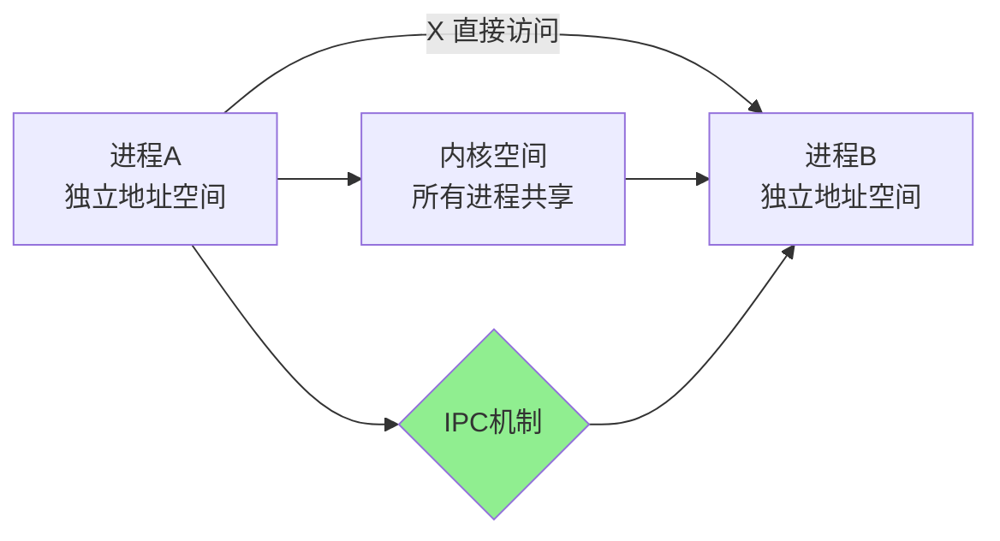

进程地址空间互相隔离（第 1 章核心），但业务需要它们协作。IPC 解决的就是**"独立地址空间之间如何交换数据"**这个问题。本章把七种主流 IPC 全部拆解：

- 管道为什么最古老但依然好用？匿名和命名的区别在哪？
- 消息队列解决了管道的哪些痛点？POSIX vs System V 怎么选？
- 共享内存为什么是最快的 IPC？快到什么程度？
- 信号量不传数据——那它是干嘛的？为什么总是和共享内存搭档？
- 信号能传数据吗？SIGKILL 为什么不能被捕获？
- Socket 做本地通信有什么优势？Unix Domain Socket 比 TCP 快多少？


## 02.IPC概述

### 2.1 什么是进程间通信

进程间通信（IPC）是指在不同进程之间**传递数据或信号**的机制。

```
为什么需要 IPC？三个典型场景：

场景1 数据传输：
  浏览器 → 下载管理器: "把这个文件下载到 /tmp/"
  需要传递: URL + 文件路径

场景2 事件通知：
  init → 业务进程: "系统要关机了，请保存状态" (SIGTERM)
  需要传递: 一个信号

场景3 资源共享：
  Nginx master → workers: "新配置加载完毕"
  需要传递: 共享内存中的配置数据指针
```

### 2.2 IPC的分类方式

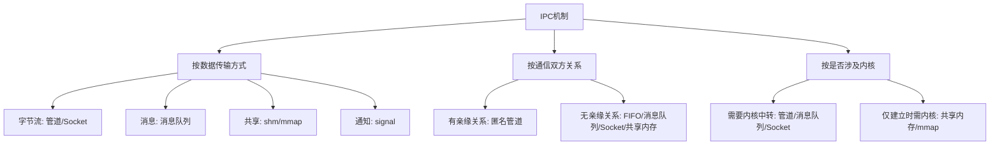

### 2.3 IPC的核心矛盾

所有 IPC 都在**三个维度**之间做权衡——没有银弹：

```
         速度快
          /  \
         /    \
        / IPC  \
       / 三元悖论\
      /          \
  易用 ───────── 功能强

管道:       易用 ★★★★★ | 速度 ★★★☆☆ | 功能 ★★☆☆☆
消息队列:   易用 ★★★★☆ | 速度 ★★★☆☆ | 功能 ★★★★☆
共享内存:   易用 ★★☆☆☆ | 速度 ★★★★★ | 功能 ★★☆☆☆
Socket:     易用 ★★★☆☆ | 速度 ★★★☆☆ | 功能 ★★★★★
信号:       易用 ★★★★☆ | 速度 ★★★★☆ | 功能 ★☆☆☆☆
```


## 03.管道Pipe

### 3.1 匿名管道

匿名管道是 Unix 中最古老的 IPC。你每天都在 Shell 里用它：

```bash
cat access.log | grep "ERROR" | wc -l
# 本质：cat stdout → grep stdin → wc stdin
```

**核心特征**：

| 特征 | 说明 |
|------|------|
| 通信方向 | **半双工**（单向，一端写、一端读） |
| 数据格式 | 无格式字节流（没有消息边界） |
| 生命周期 | 随进程（所有引用 fd 关闭后自动销毁） |
| 容量 | 固定内核缓冲区（Linux 默认 64KB） |
| 使用范围 | 只能**有亲缘关系**的进程（父子进程共享 fd） |

```c
#include <unistd.h>

int main() {
    int pipefd[2];   // pipefd[0]:读端  pipefd[1]:写端
    pipe(pipefd);

    pid_t pid = fork();
    if (pid == 0) {
        // 子进程：关闭读端，只写
        close(pipefd[0]);
        write(pipefd[1], "hello", 5);
        close(pipefd[1]);
    } else {
        // 父进程：关闭写端，只读
        close(pipefd[1]);
        char buf[128];
        read(pipefd[0], buf, sizeof(buf));
        close(pipefd[0]);
    }
    return 0;
}
```

### 3.2 管道的底层实现

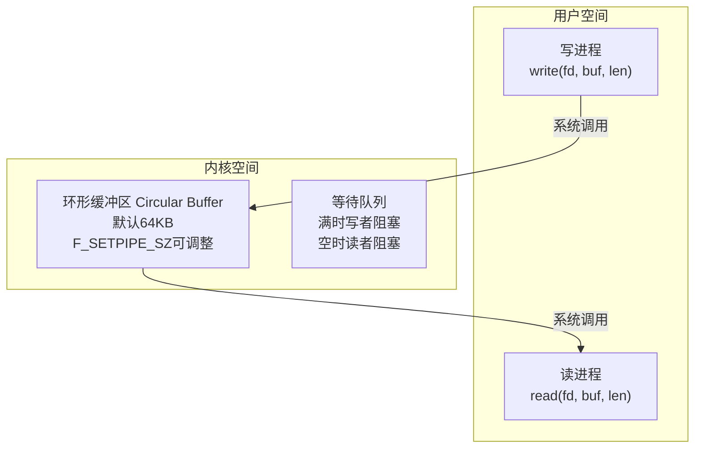

**阻塞行为（1.1 节 OOM 根因）**：
- 缓冲区未满 → `write()` 直接写入
- 缓冲区已满 → `write()` **阻塞**，直到有空间
- 缓冲区为空 + 写端还开着 → `read()` 阻塞等待
- 缓冲区为空 + 所有写端关闭 → `read()` 返回 0（EOF）

```c
// 调整管道容量
fcntl(pipefd[0], F_SETPIPE_SZ, 1048576);  // 调到 1MB
```

### 3.3 命名管道FIFO

匿名管道致命的局限是只能用于亲缘进程。**命名管道（FIFO）打破这个限制**——通过文件系统中的一个特殊文件作为"挂载点"：

```c
// 创建 FIFO
mkfifo("/tmp/my_fifo", 0666);

// 进程A（写入）：
int fd = open("/tmp/my_fifo", O_WRONLY);
write(fd, "hello", 5);
close(fd);

// 进程B（读取，另一个进程）：
int fd = open("/tmp/my_fifo", O_RDONLY);
char buf[128];
read(fd, buf, sizeof(buf));
close(fd);
```

**FIFO 文件只是"名字"，不占磁盘空间**——数据仍然走内核缓冲区，文件只是让两个无关进程找到彼此。

### 3.4 管道的局限性

| 局限 | 表现 | 应对 |
|------|------|------|
| 半双工 | 单向，双向需两个管道 | 用 Socket |
| 无消息边界 | 写3次"abc"，读出来可能是"abcabc"或"a""bcabc" | 应用层分包协议 |
| 容量固定 | 默认64KB，满则阻塞 | 调大，或换消息队列/共享内存 |
| 匿名管道只限亲缘 | 无关进程不能用 | 用 FIFO |

**结论**：管道最适合"单向、流式、数据量可控"的场景。Shell 管道是它的最佳舞台。


## 04.消息队列

### 4.1 消息队列是什么

消息队列解决了管道最痛的三个问题：**无消息边界、不可寻址、固定读写顺序**。

```
管道（字节流）：
  写入: "msg1" "msg2" "msg3"
  ─────────────────────────  → 混在一起，无边界

消息队列：
  写入: [msg1] [msg2] [msg3]
  ───┬───  ──┬───  ──┬───    → 条条独立，有边界
     ↓        ↓        ↓
  读第1条  读第2条  读第3条
```

Linux 有两套 API：

| | POSIX 消息队列 | System V 消息队列 |
|------|--------------|-----------------|
| API | `mq_open/mq_send/mq_receive` | `msgget/msgsnd/msgrcv` |
| 标识方式 | 名字（如 `/myqueue`） | 整数 key（`ftok()`生成） |
| 优先级 | 支持 | 支持（消息类型作优先级） |
| 多路复用 | ✅ 可被 select/poll/epoll 监听 | ❌ 不能 |
| 资源清理 | 进程退出自动清理 | 需显式 `msgctl(IPC_RMID)` |
| 推荐度 | ✅ **推荐** | ⚠️ 遗留系统兼容 |

### 4.2 POSIX消息队列

```c
#include <mqueue.h>

int main() {
    struct mq_attr attr = {
        .mq_maxmsg  = 10,     // 最大消息数
        .mq_msgsize = 256,    // 单条最大字节
    };
    mqd_t mq = mq_open("/my_queue", O_CREAT | O_RDWR, 0644, &attr);

    // 发送消息（priority=10，越高越优先）
    mq_send(mq, "High priority!", 15, 10);
    mq_send(mq, "Low priority!",  14, 1);

    // 接收（总是拿到优先级最高的那条）
    char buf[256];
    unsigned int prio;
    mq_receive(mq, buf, sizeof(buf), &prio);
    printf("收到(优先级=%u): %s\n", prio, buf);  // 先收到priority=10那条

    mq_close(mq);
    mq_unlink("/my_queue");  // 删除
}
```

**关键特性**：
- 消息按**优先级排序**，高优先级先出队
- fd 可被 `select/poll/epoll` 监听——这是一个巨大优势
- 队列满了 → 发送者阻塞（或返回 EAGAIN）

**查看系统中的 POSIX 消息队列**：

```bash
mkdir -p /dev/mqueue && mount -t mqueue none /dev/mqueue
ls -la /dev/mqueue/
cat /dev/mqueue/my_queue  # 查看队列状态
```

### 4.3 System V消息队列

System V 用整数 key 标识队列，最大的特色是**按消息类型选择性接收**：

```c
#include <sys/msg.h>

struct my_msgbuf {
    long mtype;       // 消息类型，必须 > 0
    char mtext[256];
};

int main() {
    key_t key = ftok("/tmp/msgkey", 'A');
    int msqid = msgget(key, IPC_CREAT | 0666);

    // 发送（不同类型）
    struct my_msgbuf s1 = { .mtype = 1 };
    strcpy(s1.mtext, "Type-1 message");
    msgsnd(msqid, &s1, strlen(s1.mtext) + 1, 0);

    struct my_msgbuf s2 = { .mtype = 2 };
    strcpy(s2.mtext, "Type-2 message");
    msgsnd(msqid, &s2, strlen(s2.mtext) + 1, 0);

    // 选择接收：只要 type=2 的消息
    struct my_msgbuf r;
    msgrcv(msqid, &r, sizeof(r.mtext), 2, 0);  // mtype=2
    printf("%s\n", r.mtext);  // 输出: Type-2 message
}
```

| `msgrcv` mtype 参数 | 行为 |
|---------------------|------|
| `> 0` | 接收类型等于 mtype 的第一条 |
| `= 0` | 接收第一条（不管类型） |
| `< 0` | 接收类型 ≤ |mtype| 中**最小**的那条 |

```bash
# 管理 System V IPC
ipcs          # 查看所有 System V IPC
ipcrm -q <id> # 删除某个消息队列
```

### 4.4 消息队列vs管道

| 维度 | 管道 | 消息队列 |
|------|------|---------|
| 数据格式 | 无格式字节流 | 有边界消息 |
| 读写顺序 | 严格 FIFO | 可按优先级插队 |
| 寻址能力 | 无 | System V 可选择性接收 |
| 多路复用 | 可 select/poll | POSIX支持, System V不支持 |
| 生命周期 | 随进程 | 随内核（需显式删除） |
| 跨网络 | 不能 | 不能 |


## 05.共享内存

### 5.1 共享内存的原理

共享内存是**最快的 IPC**——因为它绕开了内核的数据拷贝。

```
普通IPC（管道/消息队列）：
  进程A →[copy1]→ 内核缓冲区 →[copy2]→ 进程B
  开销：2 次拷贝 + 2 次系统调用

共享内存：
  进程A → 共享物理页 ← 进程B
  ↑ 直接读写，0 次拷贝！
```

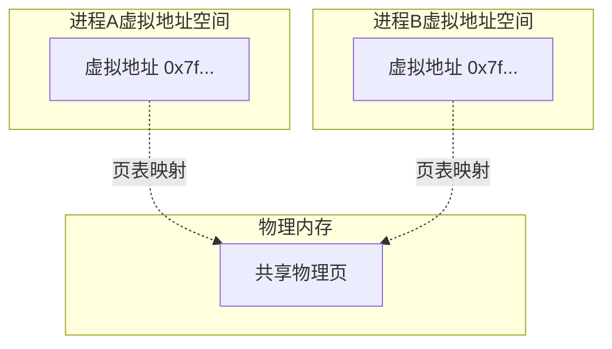

一张物理页同时映射到两个进程的地址空间——一个进程写，另一个马上能看到。

### 5.2 POSIX共享内存（推荐）

```c
#include <sys/mman.h>
#include <sys/stat.h>
#include <fcntl.h>

int main() {
    int size = 4096;

    // 1. 创建共享内存对象（类文件接口）
    int fd = shm_open("/my_shm", O_CREAT | O_RDWR, 0666);
    ftruncate(fd, size);  // 新创建必须设大小

    // 2. 映射到本进程地址空间
    char *shm = (char *)mmap(NULL, size,
                              PROT_READ | PROT_WRITE,
                              MAP_SHARED, fd, 0);

    // 3. 直接读写（就像普通内存！）
    strcpy(shm, "Hello via shared memory!");
    printf("读出: %s\n", shm);

    // 4. 清理
    munmap(shm, size);
    close(fd);
    shm_unlink("/my_shm");  // 删除
    return 0;
}
```

### 5.3 System V共享内存

```c
#include <sys/shm.h>

key_t key = ftok("/tmp/shmkey", 'S');
int shmid = shmget(key, 4096, IPC_CREAT | 0666);  // 创建
char *shm = (char *)shmat(shmid, NULL, 0);          // 附加
strcpy(shm, "System V shared memory");               // 使用
shmdt(shm);                                          // 分离
// shmctl(shmid, IPC_RMID, NULL);                    // 销毁
```

### 5.4 共享内存为什么最快

实测数据：

```
传输 100 万条消息（每条 256 字节）的耗时：

管道:        ~1200 ms   ← 每次内核拷贝
消息队列:    ~800  ms   ← 也是内核拷贝
共享内存:    ~20   ms   ← 0 次拷贝！
（加信号量同步 ~50ms）

共享内存 vs 管道：快 60 倍
共享内存 vs 消息队列：快 40 倍
```

但共享内存**缺少同步机制**——两个进程同时写同一块内存怎么办？这就是下一节"信号量"要解决的问题。


## 06.信号量Semaphore

### 6.1 信号量是什么

**疑惑：信号量和共享内存有什么关系？为什么要一起讲？**

**答疑**：共享内存解决"数据放哪"，信号量解决"谁先读、谁后写"——一个数据通道、一个红绿灯。

```
[生产者] ─┬→ 写数据 → [共享内存] ─→ 读数据 ─┬→ [消费者]
          │                                  │
     P操作(sem_wait)                    V操作(sem_post)
     ↓ 信号量=0                         ↓ 信号量+1
     阻塞                               唤醒等待者
```

信号量是内核维护的计数器，提供两个原子操作：

| 操作 | 别名 | 含义 |
|------|------|------|
| P 操作 | wait/down/decrement | 如果值>0，减1；否则阻塞 |
| V 操作 | post/up/increment | 值加1，唤醒等待者 |

### 6.2 共享内存+信号量实战

```c
#include <semaphore.h>
#define BUF_SIZE 8

// 环形缓冲区（放在共享内存中）
typedef struct {
    int buffer[BUF_SIZE];
    int in, out;
} ring_buf_t;

// 信号量集合
typedef struct {
    sem_t mutex;   // 互斥锁（保护 in/out）
    sem_t empty;   // 空闲槽位计数（初始=BUF_SIZE）
    sem_t full;    // 已填充计数（初始=0）
} sem_set_t;

// 生产者
void producer(ring_buf_t *rb, sem_set_t *s, int item) {
    sem_wait(&s->empty);    // ① 等空位
    sem_wait(&s->mutex);    // ② 锁
    rb->buffer[rb->in] = item;
    rb->in = (rb->in + 1) % BUF_SIZE;
    sem_post(&s->mutex);    // ③ 解锁
    sem_post(&s->full);     // ④ 通知有数据
}

// 消费者
int consumer(ring_buf_t *rb, sem_set_t *s) {
    sem_wait(&s->full);     // ① 等数据
    sem_wait(&s->mutex);    // ② 锁
    int item = rb->buffer[rb->out];
    rb->out = (rb->out + 1) % BUF_SIZE;
    sem_post(&s->mutex);    // ③ 解锁
    sem_post(&s->empty);    // ④ 通知有空位
    return item;
}
```

**关键**：必须先 `sem_wait(&empty)` 再 `sem_wait(&mutex)`，不能反过来——否则死锁（消费者持锁等数据，生产者等锁放数据）。

### 6.3 信号量vs互斥锁

| | 互斥锁（Mutex） | 信号量（Semaphore, init=1） |
|------|----------------|---------------------------|
| 所有权 | 谁 lock 谁 unlock | 无所有权（其他进程也能 post） |
| 跨进程 | 需 `PTHREAD_PROCESS_SHARED` | ✅ 天然跨进程 |
| 使用场景 | 线程间互斥 | **进程间同步** + 资源计数 |

**结论**：进程间同步优先用信号量，线程间互斥优先用互斥锁。


## 07.信号Signal

### 7.1 信号是什么

信号（Signal）是一种**异步通知机制**——不传数据，只通知进程"某件事发生了"。

```
类比：
  管道/消息队列 = 寄信（有内容）
  共享内存     = 共用白板（直接写）
  信号         = 拍肩膀（只通知，不传数据）
```

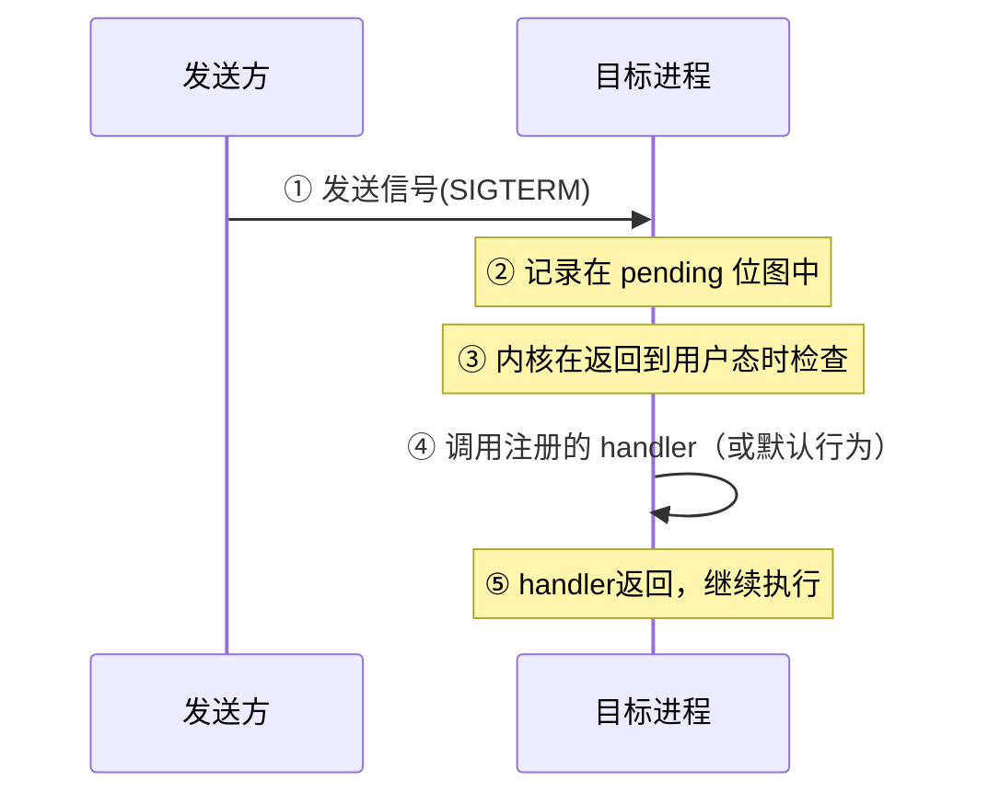

### 7.2 常用信号一览

| 信号 | 编号 | 默认行为 | 含义 | 能否捕获 |
|------|------|---------|------|---------|
| `SIGINT` | 2 | 终止 | Ctrl+C 中断 | ✅ |
| `SIGQUIT` | 3 | 终止+Core | Ctrl+\ 退出 | ✅ |
| `SIGKILL` | 9 | 终止 | **无条件杀死**，不可忽略 | ❌ |
| `SIGTERM` | 15 | 终止 | 优雅终止（`kill`默认） | ✅ |
| `SIGSTOP` | 19 | 暂停 | **无条件暂停**，不可忽略 | ❌ |
| `SIGSEGV` | 11 | 终止+Core | 段错误（非法内存访问） | ✅ |
| `SIGPIPE` | 13 | 终止 | 向已关闭管道写数据 | ✅ |
| `SIGCHLD` | 17 | 忽略 | 子进程状态改变 | ✅ |
| `SIGUSR1` | 10 | 终止 | 用户自定义信号1 | ✅ |
| `SIGUSR2` | 12 | 终止 | 用户自定义信号2 | ✅ |
| `SIGALRM` | 14 | 终止 | `alarm()` 定时器到期 | ✅ |

**SIGKILL 和 SIGSTOP 为什么不能捕获？**

这是操作系统最后的**兜底手段**——如果一个进程陷入死循环、或者注册了一个什么都不做的 SIGTERM handler，系统必须有一种"绝对能杀死它"的方式。SIGKILL 不经过信号处理流程，内核直接销毁进程，不给进程任何"辩解"的机会。

### 7.3 信号的发送与处理

```c
#include <signal.h>
#include <stdio.h>
#include <unistd.h>

// 信号处理器
void sigint_handler(int signo) {
    printf("\n捕获到 SIGINT (Ctrl+C)\n");
    printf("正在保存状态...\n");
    sleep(1);  // 模拟清理工作
    printf("安全退出\n");
    _exit(0);
}

int main() {
    // 注册信号处理器（推荐用 sigaction, 更安全）
    struct sigaction sa = {
        .sa_handler = sigint_handler,
        .sa_flags   = 0
    };
    sigemptyset(&sa.sa_mask);
    sigaction(SIGINT, &sa, NULL);

    printf("进程 PID=%d, 按 Ctrl+C 试试\n", getpid());
    while (1) {
        printf("工作中...\n");
        sleep(2);
    }
    return 0;
}
```

**发送信号的方式**：

```bash
kill -SIGTERM <pid>   # 发送 SIGTERM
kill -9 <pid>          # 发送 SIGKILL（强制杀）
kill -USR1 <pid>       # 发送自定义信号
kill -0  <pid>         # 不发送信号，只检查进程是否存在

# 代码中发送
#include <signal.h>
kill(pid, SIGUSR1);         // 向指定进程发
raise(SIGUSR1);             // 向自己发
kill(0, SIGTERM);           // 向同进程组所有进程发
```

### 7.4 信号的局限性

| 局限 | 说明 |
|------|------|
| 不传数据 | 最多传一个整数信号编号（SIGUSR1/2的实时扩展除外） |
| 不可靠 | 传统信号不排队——连续发两次 SIGUSR1，可能只收到一次 |
| 异步 | handler 运行时机不确定，可能在任何代码点被中断 |
| 重入 | handler 中只能调用**异步信号安全**的函数（`malloc`、`printf` 都不安全！） |
| 无确认 | 发送方不知道接收方是否处理了信号 |

**实时信号（SIGRTMIN ~ SIGRTMAX）** 部分解决了这些问题：可以排队、可以携带少量数据（一个 `union sigval`），用 `sigqueue()` 发送。


## 08.Socket通信

### 8.1 Socket IPC原理

Socket 是最强大的 IPC——它不仅能用在**同一台机器**上的进程间通信，还能用完全相同的 API 做**跨网络**通信。这是其他 IPC 都不具备的优势：

```
管道、消息队列、共享内存 = 只能本机
Socket = 本机也可以，跨网络也可以 —— 同一套代码！
```

**Socket 通信的通用模型**：

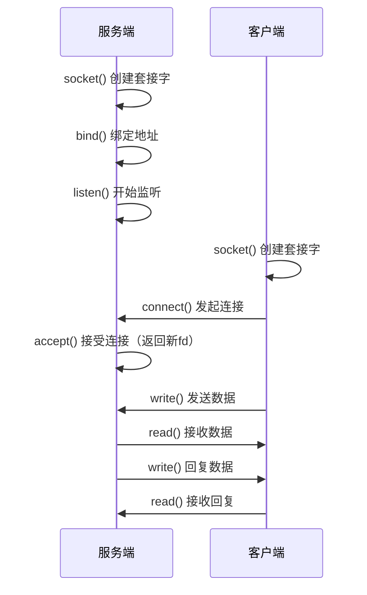

### 8.2 Unix Domain Socket

**Unix Domain Socket（UDS）**是 Socket 家族中专门用于**本机进程间通信**的成员。它不使用 IP 地址和端口，而是使用文件系统路径：

```c
#include <sys/socket.h>
#include <sys/un.h>

// 服务端
int server() {
    int fd = socket(AF_UNIX, SOCK_STREAM, 0);  // AF_UNIX = 本机通信

    struct sockaddr_un addr = { .sun_family = AF_UNIX };
    strcpy(addr.sun_path, "/tmp/my_socket");   // 用文件路径做地址
    unlink("/tmp/my_socket");                   // 删除可能存在的旧文件

    bind(fd, (struct sockaddr *)&addr, sizeof(addr));
    listen(fd, 5);

    int client_fd = accept(fd, NULL, NULL);
    char buf[256];
    read(client_fd, buf, sizeof(buf));
    printf("收到: %s\n", buf);
    write(client_fd, "pong", 4);
    close(client_fd);
    close(fd);
    unlink("/tmp/my_socket");
}

// 客户端
int client() {
    int fd = socket(AF_UNIX, SOCK_STREAM, 0);

    struct sockaddr_un addr = { .sun_family = AF_UNIX };
    strcpy(addr.sun_path, "/tmp/my_socket");

    connect(fd, (struct sockaddr *)&addr, sizeof(addr));
    write(fd, "ping", 4);

    char buf[256];
    read(fd, buf, sizeof(buf));
    printf("回复: %s\n", buf);
    close(fd);
}
```

**UDS 支持两种模式**：

| 模式 | Socket类型 | 特点 |
|------|-----------|------|
| SOCK_STREAM | 面向连接 | 类似 TCP——可靠、有序、有连接 |
| SOCK_DGRAM | 无连接 | 类似 UDP——不可靠、保留消息边界 |

**UDS 的高级特性**：

- **传递文件描述符**：通过 `SCM_RIGHTS` 辅助数据，进程A可以把一个 fd "发"给进程B（这在其他 IPC 中做不到）
- **对等认证**：通过 `SO_PEERCRED` 获取对端进程的 PID/UID/GID——天然支持权限控制

```c
// UDS 传递文件描述符（简化示例）
// 进程A 把一个打开的文件的 fd 发送给进程B
sendmsg(sockfd, &msg, 0);  // msg 的辅助数据中包含要传递的 fd
// 进程B 收到后，就像自己打开了那个文件一样
```

### 8.3 UDS vs TCP本地回环

**疑惑：既然 TCP 也能本机通信（127.0.0.1），为什么还要用 UDS？**

| 维度 | Unix Domain Socket | TCP 127.0.0.1 |
|------|-------------------|---------------|
| 协议栈 | 不走 TCP/IP 栈（纯内核内存操作） | 走完整 TCP/IP 栈 |
| 数据拷贝 | 1 次（用户→内核→用户，但内核层已优化） | 2 次（含协议头封装/解封装） |
| 延迟 | ~30μs | ~50-100μs |
| 吞吐量 | ~5GB/s | ~3GB/s |
| 可靠性 | 100%（内核内部，不会丢） | 99.99%（理论上本地不会丢） |
| 安全性 | 可通过文件权限 + SO_PEERCRED 控制 | 需额外防火墙规则 |
| 跨机器 | ❌ 不能 | ✅ 能 |

**结论**：纯本机通信用 UDS，未来可能扩展到网络则用 TCP。UDS 比 TCP 回环快约 **2-3 倍**，而且可以用文件权限做访问控制。

**知名软件的 UDS 应用**：

| 软件 | UDS 用途 |
|------|---------|
| Docker | `docker.sock`——CLI 与 daemon 通信 |
| MySQL | `mysql.sock`——客户端本地连接（比 TCP 快） |
| Redis | `redis.sock`——本地客户端（默认 TCP，可选 UDS） |
| Nginx+PHP-FPM | PHP-FPM 监听 UDS，Nginx fastcgi_pass |
| systemd | journald 用 `/run/systemd/journal/socket` 收日志 |


## 09.mmap文件映射IPC

### 9.1 mmap怎么用作IPC

在第 5 章我们已经用 `mmap + shm_open` 做了共享内存。但 `mmap` 还有另一个 IPC 用法：**将普通文件映射到多个进程的地址空间**：

```c
// 进程A：创建文件并 mmap
int fd = open("/tmp/ipc_file", O_RDWR | O_CREAT, 0666);
ftruncate(fd, 4096);
char *map = (char *)mmap(NULL, 4096, PROT_READ | PROT_WRITE,
                          MAP_SHARED, fd, 0);
strcpy(map, "data from process A");
munmap(map, 4096);

// 进程B：打开同一个文件并 mmap（可以看到进程A写的数据）
int fd = open("/tmp/ipc_file", O_RDWR);
char *map = (char *)mmap(NULL, 4096, PROT_READ,
                          MAP_SHARED, fd, 0);
printf("读到: %s\n", map);  // 输出: data from process A
```

**关键点**：`MAP_SHARED` 标志让修改对所有映射此文件的进程可见。操作系统负责把修改同步到底层文件（通过 Page Cache），因此崩溃后数据仍保留——这是 `shm_open` 不具备的"持久性"。

### 9.2 mmap IPC的性能特点

| 维度 | shm_open + mmap | 普通文件 mmap |
|------|----------------|-------------|
| 持久性 | ❌ 不持久（匿名内存） | ✅ 持久（有文件支撑） |
| 速度 | ★★★★★ 最快 | ★★★★☆ 稍慢（涉及文件系统元数据） |
| 容量 | 受物理内存限制 | 受磁盘空间限制（可建 TB 级别） |
| 典型场景 | 高性能临时数据交换 | 持久化数据共享 + 崩溃恢复 |

**经典应用**：`mmap` 文件 IPC 是**进程间共享大容量数据的首选**——比如机器学习场景下多个 worker 共享训练数据，一次 `mmap` 全部进程都能访问，无需拷贝。


## 10.IPC选型指南

### 10.1 七种IPC横向对比

| 机制 | 速度 | 数据量 | 消息边界 | 双向 | 跨网络 | 持久化 | 实现复杂度 |
|------|------|--------|---------|------|--------|--------|-----------|
| 匿名管道 | ★★★☆☆ | 小（64KB） | 无 | 否（需两个） | 否 | 否 | 极低 |
| 命名管道 | ★★★☆☆ | 中 | 无 | 否 | 否 | 否 | 低 |
| 消息队列(POSIX) | ★★★☆☆ | 中 | 有 | 是 | 否 | 否 | 中 |
| 共享内存 | ★★★★★ | 大 | 自定义 | 是 | 否 | 否 | 高（需同步） |
| 信号量 | ★★★★★ | 极小 | — | 是 | 否 | 否 | 中（只做同步） |
| 信号 | ★★★★☆ | 极小(无数据) | — | 单向 | 否 | 否 | 低 |
| Unix Socket | ★★★★☆ | 大 | 有 | 是 | 否 | 否 | 中 |
| TCP Socket | ★★★☆☆ | 大 | 有 | 是 | ✅ | 否 | 中 |
| mmap文件 | ★★★★★ | 极大 | 自定义 | 是 | 否 | ✅ | 中 |

### 10.2 选型决策树

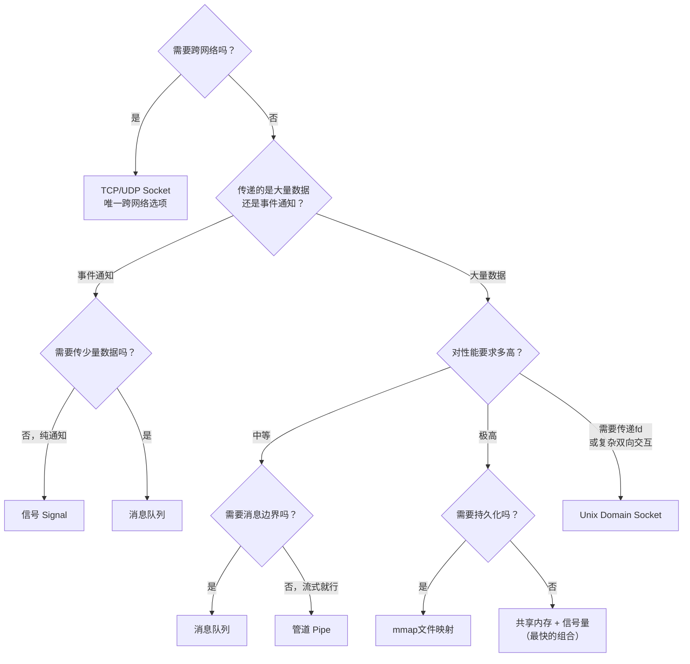

### 10.3 经典组合模式

| 组合 | 为什么这样搭配 | 典型场景 |
|------|---------------|---------|
| **管道 + fork** | 父子进程天然共享 fd | Shell 管道 `cmd1 | cmd2` |
| **共享内存 + 信号量** | SHM 做通道，Sem 做锁 | 高性能日志、视频帧传递 |
| **共享内存 + 消息队列** | SHM 传大数据，MQ 传控制消息 | Chrome 多进程架构 |
| **UDS + JSON** | UDS 高效传输，JSON 灵活编码 | Docker CLI ↔ Daemon |
| **mmap + 原子操作** | 无锁共享数据结构 | 多进程计数、状态同步 |


## 11.综合案例日志采集系统

### 11.1 场景Agent采集进程日志

回到 1.1 节小刘的日志采集系统。用"IPC 选型"的视角完整走一遍：业务进程产生日志 → Agent 采集聚合 → 上报 Kafka。


**需求**：每秒 10000 条日志，每条 200 字节 → 2MB/s 流量。要求低延迟、低 CPU、不能丢日志。

### 11.2 方案一管道重定向

```bash
# 业务进程 stdout → Agent stdin
./business_app 2>&1 | ./log_agent
```

```
工作原理：
  业务 write(stdout) → 内核管道缓冲区(64KB) → Agent read(stdin)

优点：
  ✅ 实现极简（连代码都不用改）
  ✅ 适合进程间能建立父子关系的情况

问题（回到1.1节的OOM）：
  ❌ 管道容量有限（64KB），Agent 处理慢时写入端阻塞
  ❌ 字节流无边界，Agent 需要自己做日志分行
  ❌ 当 Agent 需要同时采集多个业务进程时，管道管理变得混乱
```

### 11.3 方案二Unix Domain Socket

```c
// 业务进程
int fd = socket(AF_UNIX, SOCK_STREAM, 0);
connect(fd, (struct sockaddr *)&addr, sizeof(addr));
write(fd, log_line, len);  // 发送一行日志

// Agent 用 epoll 多路复用监听多个业务连接
```

```
优点：
  ✅ 面向连接，天然支持多业务进程（每个连接独立管理）
  ✅ epoll 多路复用，高效
  ✅ 消息边界可用换行符约定（比纯字节流好处理）
  ✅ 即使 Agent 重启（UDS 文件还在），业务进程自动重连

缺点：
  ❌ 仍有内核拷贝（每条日志都要 copy 到内核→Agent）
  ❌ 高吞吐场景下，系统调用开销（sendmsg/recvmsg）成为瓶颈
```

**适用**：中等吞吐（< 每秒 5 万条），对实现复杂度敏感的场景。

### 11.4 方案三共享内存环形缓冲

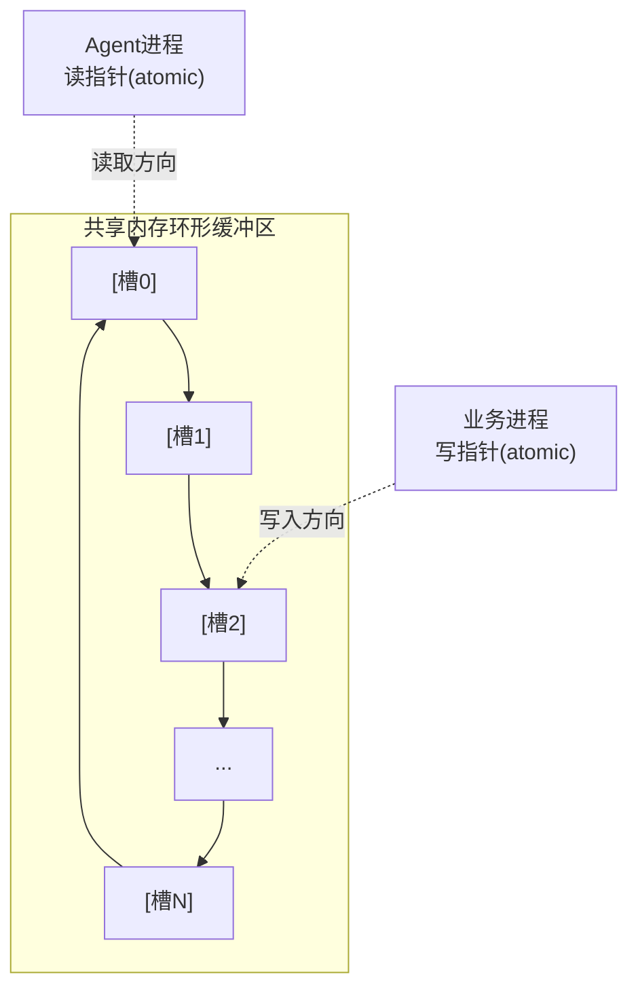

**核心数据结构**：

```c
#define RING_SIZE 1024

typedef struct {
    uint32_t write_pos;   // 原子递增的写位置
    uint32_t read_pos;    // 原子递增的读位置
    uint32_t buf_size;    // 缓冲区总大小
    char     data[];      // 柔性数组，实际数据区
} ring_buffer_t;

// 写入日志（无锁！）
void ring_write(ring_buffer_t *rb, const char *log, size_t len) {
    // 1. 原子上获取写入位置
    uint32_t pos = __atomic_fetch_add(&rb->write_pos, len, __ATOMIC_RELAXED);

    // 2. 直接写入共享内存
    memcpy(rb->data + (pos % rb->buf_size), log, len);

    // 注意：如果消费者太慢，写者会**覆盖**旧数据（而非阻塞）
    // 这是有意的取舍——宁丢旧日志，不阻塞业务进程
}

// 读取日志（无锁！）
size_t ring_read(ring_buffer_t *rb, char *dst, size_t max_len) {
    // 原子读可读范围
    uint32_t w = __atomic_load_n(&rb->write_pos, __ATOMIC_ACQUIRE);
    uint32_t r = __atomic_load_n(&rb->read_pos, __ATOMIC_RELAXED);

    size_t available = w - r;
    if (available == 0) return 0;

    size_t to_read = available > max_len ? max_len : available;
    memcpy(dst, rb->data + (r % rb->buf_size), to_read);

    __atomic_store_n(&rb->read_pos, r + to_read, __ATOMIC_RELEASE);
    return to_read;
}
```

**为什么不用信号量？** 因为这里用了**原子操作**——`__atomic_fetch_add` 和 `__atomic_store_n` 保证了无锁的并发安全。这比信号量更快（信号量每次 wait/post 都是系统调用），但也更激进（允许覆盖旧数据）。

**方案优点**：
- 零拷贝——日志直接写入共享内存，Agent 直接读
- 无系统调用——每次写日志不需要进内核
- 不阻塞业务进程——即使 Agent 跟不上，也只覆盖旧数据，不阻塞生产者
- 内存可控——环形缓冲区固定大小（如 16MB），不会无限制增长

**方案代价**：
- 实现复杂度高——原子操作、内存序、环形缓冲区边界处理
- 可能丢数据——消费者太慢时，旧数据被覆盖
- 调试困难——数据不在文件系统中，出了问题不好排查

### 11.5 三种方案横向对比

| 维度 | 管道 | Unix Domain Socket | 共享内存环形缓冲 |
|------|------|-------------------|----------------|
| 吞吐量 | ≤ 2MB/s | ≤ 10MB/s | ≥ 500MB/s |
| 延迟 | ~10-50μs | ~5-30μs | ~0.1-1μs |
| 内存占用 | 64KB+应用缓冲区 | 内核缓冲区+应用缓冲区 | 固定（如16MB） |
| CPU开销 | 中（每次read/write都是syscall） | 中（每次sendmsg/recvmsg都是syscall） | **极低**（无系统调用） |
| 丢数据风险 | 低（阻塞机制保护） | 低（流控） | **高**（覆盖旧数据） |
| 实现复杂度 | ★☆☆☆☆ 极低 | ★★★☆☆ 中等 | ★★★★★ 高 |
| 多进程支持 | 需父子关系或多管道 | ✅ epoll 天然支持 | ✅ 多写者原子操作 |

**小刘的最终选择**：共享内存环形缓冲——用 50MB 内存拿到 500MB/s 吞吐，CPU 几乎无感。

### 11.6 知识图谱回顾

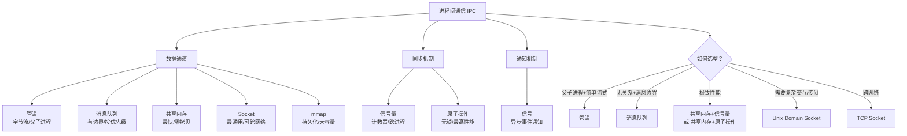

**最终的方法论沉淀**——选择 IPC 时，按这个顺序问自己：

1. **需要跨网络吗？** → TCP/UDP Socket
2. **需要传文件描述符吗？** → Unix Domain Socket
3. **需要极致性能和吞吐吗？** → 共享内存（+ 信号量/原子操作）
4. **需要消息边界或选择接收吗？** → 消息队列
5. **只是简单的父子进程流式通信吗？** → 管道
6. **只是通知事件吗？** → 信号

记住：**没有万能 IPC，只有最适合场景的选择**。就像小刘的日志采集——管道简单但撑不住吞吐，UDS 中等但仍有开销，共享内存最快但要处理覆盖语义。理解了每种 IPC 的边界和代价，你才能做出正确的架构决策。


## 12.思考题与作业

### 12.1 基础思考题

1. **管道的阻塞规则**：假设一个管道缓冲区大小为 4KB，进程 A 调用 `write(fd, buf, 8192)`（一次写入 8KB），在默认阻塞模式下会发生什么？（提示：`write` 的返回值是什么？）

2. **消息队列优先级**：POSIX 消息队列中，先发送三条消息：`mq_send(mq, "A", 2, prio=5)`、`mq_send(mq, "B", 2, prio=10)`、`mq_send(mq, "C", 2, prio=1)`。随后调用三次 `mq_receive`，收到的顺序是什么？为什么？

3. **共享内存性能**：为什么共享内存是最快的 IPC？请从"数据拷贝次数""系统调用次数""上下文切换次数"三个维度量化对比共享内存和管道。

4. **信号的安全问题**：下列函数中，哪些可以安全地在 signal handler 中调用？为什么？
   ```
   printf   malloc   write   exit    pthread_mutex_lock   _exit
   ```
   （提示：查阅 `man 7 signal-safety`）

5. **UDS vs TCP 回环**：两台本机进程用 TCP 127.0.0.1 通信，数据包会经过物理网卡吗？为什么 UDS 比 TCP 回环快？

### 12.2 进阶思考题

1. **1.1 节 OOM 复盘**：小刘遇到的 OOM 问题，如果用消息队列替代管道，会不会也 OOM？为什么？消息队列有"队列满时发送者阻塞"的机制，这和小刘的"缓冲区无限制增长"有什么区别？

2. **无锁环形缓冲的 ABA 问题**：11.4 节的共享内存环形缓冲使用原子操作，但没有提到 ABA 问题。在高并发场景下，一个写者读到 `write_pos=100`，准备写入，但在这期间另一个写者已经把 `write_pos` 写到了 `100+ring_size`（绕了一圈又回到位置 100）。这会导致数据损坏吗？怎么解决？

3. **信号量 vs 条件变量**：既然信号量可以用于进程间同步，为什么 pthread 还提供了条件变量？两者在语义上有什么本质区别？什么场景下只能用条件变量？

4. **Chrome 的多进程 IPC 架构**：Chrome 浏览器使用多进程架构（每个 tab 一个进程），它内部大量使用 IPC。请查阅资料，列出的 Chrome 进程中使用了哪些 IPC 机制（提示：Mojo IPC 框架、共享内存等），并分析为什么 Chrome 要混合使用多种 IPC。

5. **Android Binder**：Android 系统没有使用 System V 共享内存或 POSIX 消息队列，而是设计了自己的 IPC 机制——Binder。请简要说明 Binder 的原理，并分析它相对于传统 Linux IPC 的优势（提示：从"安全性""引用计数""死亡通知"三个角度思考）。

### 12.3 动手作业

**作业一（必做）**：实测三种 IPC 的吞吐量。

- 分别用管道、POSIX 消息队列、POSIX 共享内存传输 100 万条消息（每条 256 字节）。
- 记录总耗时，计算吞吐量（MB/s），与本章 5.4 节的理论值对比。
- 将结果填入下表：

| IPC 机制 | 总耗时 | 吞吐量(MB/s) | 与理论值偏差 | 偏差原因分析 |
|---------|--------|-------------|-------------|-------------|
| 管道 | | | | |
| 消息队列 | | | | |
| 共享内存 | | | | |

**作业二（选做）**：用共享内存 + 信号量实现多生产者-多消费者模型。

- 实现 11.4 节描述的环形缓冲区（BUF_SIZE=1024，每条消息 256 字节）。
- 启动 4 个生产者线程（模拟 4 个业务进程写日志）和 2 个消费者线程（模拟 Agent 读日志）。
- 测量：每秒吞吐量、CPU 使用率、有无数据丢失。
- 对比 "信号量同步版本" 和 "原子操作版本" 的性能差异。

**作业三（选做）**：用 Unix Domain Socket 实现一个简单的请求-响应服务。

- 服务端：接收 JSON 格式的请求（如 `{"cmd":"add","a":1,"b":2}`），返回 `{"result":3}`。
- 客户端：发送 10000 次请求，记录平均 RTT（往返时间）。
- 对比同一份逻辑用 TCP 127.0.0.1 实现的 RTT，计算 UDS 比 TCP 快了多少。

**作业四（架构思考）**：对你当前最熟悉的一个系统，画出它的"IPC 全景图"。

- 列出系统中有哪些进程？它们之间怎么通信？
- 如果让你重新设计 IPC 方案，你会改变哪一处？为什么？
- 标注当前方案的性能瓶颈，预测改进后的效果。


## 07.信号Signal

### 7.1 信号是什么

信号（Signal）是一种**异步通知机制**——它不传输数据，而是通知进程"某件事发生了"。

```
类比：
  管道       = 写信（有内容）
  消息队列   = 寄快递（有包裹）
  共享内存   = 共用白板（直接写）
  信号       = 拍肩膀（告诉你一件事，带少量信息）
```

**信号的完整传送过程**：

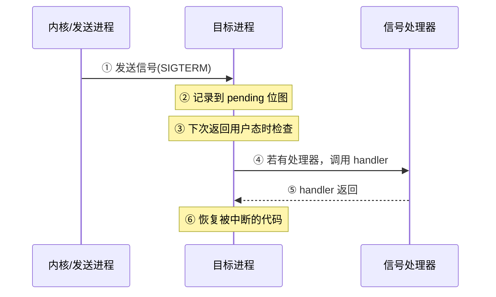

### 7.2 常用信号一览

| 信号 | 编号 | 默认行为 | 含义 | 能捕获？ |
|------|------|---------|------|---------|
| `SIGINT` | 2 | 终止 | Ctrl+C | ✅ |
| `SIGQUIT` | 3 | 终止+Core | Ctrl+\ | ✅ |
| `SIGKILL` | 9 | 终止 | 无条件杀进程 | ❌ **不能** |
| `SIGTERM` | 15 | 终止 | 优雅终止（`kill`默认） | ✅ |
| `SIGSTOP` | 19 | 暂停 | 无条件暂停 | ❌ **不能** |
| `SIGSEGV` | 11 | 终止+Core | 段错误（非法内存） | ✅ |
| `SIGPIPE` | 13 | 终止 | 向关闭的管道写 | ✅ |
| `SIGCHLD` | 17 | 忽略 | 子进程状态改变 | ✅ |
| `SIGUSR1` | 10 | 终止 | 用户自定义1 | ✅ |
| `SIGUSR2` | 12 | 终止 | 用户自定义2 | ✅ |
| `SIGALRM` | 14 | 终止 | `alarm()` 定时器到期 | ✅ |

**为什么 SIGKILL 和 SIGSTOP 不能被捕获？**——这是内核的"最后手段"。想象一个恶意进程把所有信号都忽略/捕获了，用户还怎么杀它？所以内核保留了这两个无条件信号。

### 7.3 信号的发送与处理

```c
#include <signal.h>
#include <stdio.h>
#include <unistd.h>

// 信号处理器
void handle_sigint(int sig) {
    printf("\n收到 SIGINT，优雅退出中...\n");
    // 保存状态、关闭文件...
    _exit(0);  // 注意：handler 中要用 _exit 而非 exit
}

int main() {
    // 注册信号处理器
    signal(SIGINT, handle_sigint);

    // 忽略 SIGPIPE（避免向关闭的 socket 写时代进程崩溃）
    signal(SIGPIPE, SIG_IGN);

    // 从其他进程发送信号
    // kill(getpid(), SIGINT);

    printf("PID=%d, 按 Ctrl+C 试试\n", getpid());
    while (1) pause();  // 等待信号
}
```

**信号处理器中的陷阱**：
- 信号处理器中只能调用**异步信号安全**的函数（`write`、`_exit` 等），不能调 `printf`（实际可能不安全）、`malloc`、`pthread_mutex_lock`（可能死锁）
- 推荐做法：handler 只设置一个 `volatile sig_atomic_t` 标志位，主循环检查标志位

### 7.4 信号的局限性

| 局限 | 说明 |
|------|------|
| 信息量极小 | 只传一个 int 信号编号，不能传字符串/结构体 |
| 不可靠交付 | 实时信号外的普通信号不排队——连续发两次，接收方可能只收到一次 |
| 中断系统调用 | 可能打断 `read()` 等阻塞调用（返回 EINTR） |
| 异步安全限制 | handler 中能做的事极其有限 |

**结论**：信号用于"通知事件"（进程终止、定时器到期）、不适合"传递数据"。实际项目中，信号常用于优雅关闭（SIGTERM）、重新加载配置（SIGHUP）、定时任务（SIGALRM）。


## 08.Socket通信

### 8.1 Socket IPC原理

Socket 是唯一能**跨网络**的 IPC——同一台机器上的进程可以用，不同机器上的进程也能用。这种"统一性"是它最大的优势——代码不需要改，换个 IP 就能从本地 IPC 变网络通信。

### 8.2 Unix Domain Socket

在**同一台机器**上，用 Unix Domain Socket（UDS）做本地 IPC，性能远超 TCP：

```c
// ============ 服务端 ============
#include <sys/un.h>
#include <sys/socket.h>

int main() {
    int sfd = socket(AF_UNIX, SOCK_STREAM, 0);  // AF_UNIX = 本地

    struct sockaddr_un addr = { .sun_family = AF_UNIX };
    strcpy(addr.sun_path, "/tmp/my.sock");
    unlink("/tmp/my.sock");  // 先删除旧的

    bind(sfd, (struct sockaddr *)&addr, sizeof(addr));
    listen(sfd, 5);

    int cfd = accept(sfd, NULL, NULL);

    // 可以通过 SO_PASSCRED 获取对端进程的 PID/UID/GID
    // 这是普通管道做不到的"身份认证"

    char buf[256];
    read(cfd, buf, sizeof(buf));
    printf("收到: %s\n", buf);
    close(cfd);
    unlink("/tmp/my.sock");
}
```

```c
// ============ 客户端 ============
int cfd = socket(AF_UNIX, SOCK_STREAM, 0);

struct sockaddr_un addr = { .sun_family = AF_UNIX };
strcpy(addr.sun_path, "/tmp/my.sock");

connect(cfd, (struct sockaddr *)&addr, sizeof(addr));
write(cfd, "hello from client", 17);
close(cfd);
```

### 8.3 UDS vs TCP本地回环

**疑惑：都在本机上，用 UDS 和 TCP 127.0.0.1 有什么区别？**

**答疑**：差很多。UDS 跳过整个 TCP/IP 协议栈，直接在内核中传递数据：

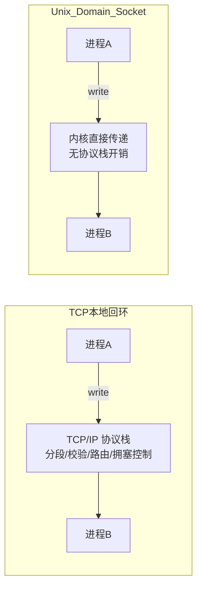

| | Unix Domain Socket | TCP 本地回环 127.0.0.1 |
|------|-------------------|------------------------|
| 吞吐量 | **高**（无协议栈） | 低（经过完整 TCP/IP） |
| 延迟 | ~2-5μs | ~10-30μs |
| 数据拷贝 | 1 次 | 2-3 次（经过 sk_buff） |
| 协议开销 | 无（不需三次握手/四次挥手） | 完整 TCP 状态机 |
| 跨机器 | ❌ | ✅ |

**UDS 的额外优势**：
- **传递文件描述符**：通过 `sendmsg()` + `SCM_RIGHTS` 可以在进程间传递 fd——这是其他 IPC 做不到的
- **获取对端凭证**：`SO_PASSCRED` 可获取对端的 PID/UID/GID，实现"权限校验"

```c
// 传递文件描述符（简化示意）
// 进程A 把一个打开的文件 fd 传给 进程B
// 进程B 收到后可以像自己打开的一样使用这个 fd
sendmsg(sockfd, &msg, 0);  // msg 中包含 SCM_RIGHTS
```

**结论**：本机通信优先用 UDS，性能更好且功能更强，还能随时扩展到跨机器（只需把 `AF_UNIX` 换成 `AF_INET`）。


## 09.mmap文件映射IPC

### 9.1 mmap怎么用作IPC

`mmap` 除了可以把共享内存映射到进程地址空间（第 5 章），还可以把**普通文件**映射进来。当使用 `MAP_SHARED` 标志时，多个进程映射同一个文件 → 修改对所有进程可见 → 这就是一种 IPC。

```c
// 两个进程都执行这段代码，映射同一个文件
int fd = open("/tmp/shared_data", O_RDWR | O_CREAT, 0666);
ftruncate(fd, 4096);

char *data = (char *)mmap(NULL, 4096,
                           PROT_READ | PROT_WRITE,
                           MAP_SHARED,   // 关键：共享模式
                           fd, 0);

// 进程A 写：
strcpy(data, "written by process A");

// 进程B 读（另一个进程，映射了同一个文件）：
printf("%s\n", data);  // 看到 "written by process A"
// 修改会由内核在适当时候写回文件（msync 可主动触发）
```

### 9.2 mmap IPC的性能特点

| | mmap 文件映射 | 共享内存 (shm_open) | 管道 | Socket |
|------|-------------|-------------------|------|--------|
| 持久化 | ✅ 数据落盘 | ❌ 重启丢失 | ❌ | ❌ |
| 速度 | 中等（涉及页回写） | 最快 | 慢 | 中等 |
| 同步 | 无（需额外信号量） | 无 | 自带阻塞同步 | 自带 |

**mmap IPC 适合的场景**：需要**持久化**的进程间共享数据——比如 MMKV（第 2 章存储器详述）用 mmap + 文件做 Android 上的 KV 存储，崩溃不丢数据。但如果纯粹追求极致速度且不要求持久化，`shm_open` 更快（纯内存）。


## 10.IPC选型指南

### 10.1 七种IPC横向对比

| IPC | 数据量 | 速度 | 持久化 | 双向 | 跨网络 | 同步 | 典型场景 |
|-----|--------|------|--------|------|--------|------|---------|
| 匿名管道 | 小~中 | ★★☆☆☆ | ❌ | ❌半双工 | ❌ | 自带阻塞 | Shell管道、父子进程 |
| 命名管道FIFO | 小~中 | ★★☆☆☆ | ❌ | ❌半双工 | ❌ | 自带阻塞 | 无关进程单向流 |
| 消息队列POSIX | 小~中 | ★★★☆☆ | ❌ | ✅ | ❌ | 自带（满则阻塞） | 多对一消息收发 |
| 共享内存 shm | **大** | ★★★★★ | ❌ | ✅ | ❌ | 无（需信号量） | 高频大数据交换 |
| 信号量 | — | ★★★★☆ | ❌ | — | ❌ | **这就是同步** | 配合共享内存做同步 |
| 信号 | 极小 | ★★★★☆ | ❌ | ❌ | ❌ | 异步通知 | 优雅关闭、定时器 |
| Unix Socket | 中~大 | ★★★★☆ | ❌ | ✅ **全双工** | ❌ | 自带 | 微服务本地通信 |
| mmap 文件 | 大 | ★★★★☆ | ✅ | ✅ | ❌ | 无（需信号量） | 持久化共享 |

### 10.2 选型决策树

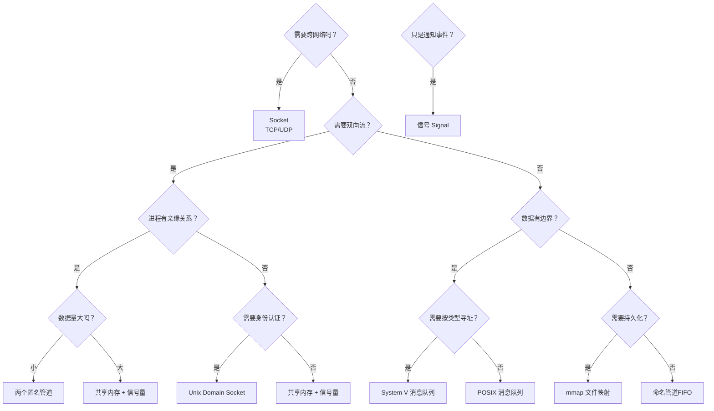

### 10.3 经典组合模式

**模式一：共享内存 + 信号量（高性能数据交换）**
```
场景：Nginx worker 之间共享缓存
  ├── 共享内存：存放缓存数据（http cache）
  └── 信号量：多个 worker 互斥写、通知读
```

**模式二：Unix Domain Socket + 多路复用（微服务本地通信）**
```
场景：PHP-FPM 和 Nginx 通信
  ├── UDS：双向流、全双工
  └── epoll：一个线程管理多个连接
```

**模式三：管道 + select/poll（Shell编程）**
```
场景：日志流水线处理
  └── cat log | grep ERROR | sort | uniq -c
```

**模式四：消息队列 + 多生产者单消费者（任务分发）**
```
场景：异步任务处理
  ├── 多个 worker 生产任务消息
  └── 单个消费者按优先级依次处理
```


## 11.综合案例日志采集系统

### 11.1 场景Agent采集进程日志

回到 1.1 节的案例。用一整节把三种 IPC 方案逐一剖析，看它们在小刘的日志采集场景下的表现。

**需求**：一台机器上跑着 10 个业务进程，每个每秒产生约 1000 条日志（每条 200 字节）。Agent 进程需要收集这些日志，聚合后上报 Kafka。**核心指标**：不丢日志、内存可控、不阻塞业务进程。

```
当前状态：
  业务进程(×10) →[管道]→ Agent → Kafka
  每条日志 200 B × 1000 条/秒 × 10 进程 = 2 MB/秒
  管道默认 64KB → 0.03 秒就能写满 → 频繁阻塞
```

### 11.2 方案一管道重定向

**做法**：业务进程 stdout/stderr 重定向到 Agent 管道的读端。

```c
// Agent 端：read 循环
char buf[4096];
while (1) {
    ssize_t n = read(pipe_fd, buf, sizeof(buf));
    if (n > 0) {
        // 问题：读到的可能是半条日志！
        //"2024-01-15 ERROR: conn"
        //"ection timeout\n2024-01-15..."
        // 必须自己做消息拼接和分包
        append_and_split(buf, n);
    }
}
```

**问题分析**：

| 问题 | 根因 | 严重度 |
|------|------|--------|
| 内存暴涨 | 管道满 → 业务进程阻塞 → 积压 | 🔴 致命 |
| 消息拆包 | 字节流无边界，要自己做协议 | 🟡 复杂 |
| 无背压反馈 | 管道满时写者阻塞，但不知道"阻塞多久" | 🟠 不可控 |
| 多路复用复杂 | 10 个业务进程 = 10 个管道 → 需要 epoll | 🟡 |

**结论**：管道适合"流量平稳"的场景，不适合"流量尖刺"。

### 11.3 方案二Unix Domain Socket

**做法**：Agent 开一个 UDS 监听，10 个业务进程各自连接。

```c
// Agent 端（简化的 epoll 循环）
int epfd = epoll_create(1);
for (每个客户端) {
    struct epoll_event ev = { .events = EPOLLIN, .data.fd = cfd };
    epoll_ctl(epfd, EPOLL_CTL_ADD, cfd, &ev);
}
while (1) {
    struct epoll_event events[32];
    int n = epoll_wait(epfd, events, 32, -1);
    for (int i = 0; i < n; i++) {
        read_and_process(events[i].data.fd);
    }
}
```

**UDS 方案解决了管道哪些问题？**

| | 管道 | Unix Domain Socket |
|------|------|-------------------|
| 多对一 | 每个业务进程一个独立管道，epoll 管理 | 一个监听 socket，accept 连接 |
| 全双工 | ❌ 单向 | ✅ 双向（Agent 可以告诉业务进程"慢点写"——背压） |
| 身份识别 | ❌ | ✅ 通过 SO_PASSCRED 知道是哪个业务进程 |
| 传输 fd | ❌ | ✅ 可以传文件描述符 |

**UDS 方案仍有的问题**：
- 每次读写仍然是系统调用 → 吞吐量 2MB/秒足够，但 20MB/秒就开始吃紧
- Agent 读出来 → 应用层处理 → 还要拷一次才能发 Kafka → 两次拷贝

### 11.4 方案三共享内存环形缓冲

**做法**：每个业务进程和 Agent 之间各有一个**环形缓冲区**（放在共享内存里）+ 一对信号量。

```c
// 共享内存布局
typedef struct {
    char buffer[RING_SIZE];   // 环形缓冲区，比如 4MB
    int write_pos;            // 生产者写入位置
    int read_pos;             // 消费者读取位置
    sem_t sem_empty;          // 可用空间
    sem_t sem_full;           // 已写入数据
    sem_t sem_mutex;          // 保护 pos
} log_ring_t;
```

**为什么快？**

```
管道方案的数据流：
  业务内存 →[copy]→ 管道内核buf →[copy]→ Agent 内存 →[copy]→ Kafka buf
  3 次拷贝！

共享内存方案的数据流：
  业务内存 → 共享内存 ← Agent 内存
  业务写完后 Agent 直接读同一块内存 →[copy]→ Kafka buf
  1 次拷贝！
```

**环形缓冲区怎么避免"覆盖未读数据"？**

```
信号量机制保障：
  sem_empty = 环形缓冲区大小（可写字节数）
  sem_full  = 0（可读字节数）

生产者写之前：sem_wait(&sem_empty) —— 等有空位
  写完：      sem_post(&sem_full)  —— 通知有新数据

消费者读之前：sem_wait(&sem_full)  —— 等有数据
  读完：      sem_post(&sem_empty) —— 通知空位增加

这样保证：
  - 永远不会有"覆盖未读数据"（sem_empty 保证有空位才写）
  - 永远不会有"读到空数据"（sem_full 保证有数据才读）
```

### 11.5 三种方案横向对比

| 维度 | 管道重定向 | Unix Domain Socket | 共享内存+信号量 |
|------|-----------|-------------------|----------------|
| 数据拷贝次数 | 3 次 | 2 次 | **1 次** |
| 系统调用次数 | 每条日志一次 | 每条日志一次 | **0**（仅信号量） |
| 内存占用（Agent+业务） | 7.2GB（积压场景） | ~200MB | **~50MB** |
| 10进程×1000条/秒吞吐 | ✅ | ✅ | ✅ |
| 10进程×10000条/秒吞吐 | ❌ 管道满 | ⚠️ 吃力 | ✅ |
| 背压能力 | 被动（管道满→阻塞） | 主动（Agent 可控制） | 主动（信号量控制） |
| 实现复杂度 | 低 | 中 | 高 |
| 业务进程改动 | 无（stdout 重定向） | 小（连 socket） | 中（需用信号量） |

**最终推荐**：

```
日志量 < 10000 条/秒，实现成本低优先：
  → Unix Domain Socket（全双工 + 身份识别 + 可扩展）

日志量 > 10000 条/秒，性能优先：
  → 共享内存环形缓冲 + 信号量

管道：
  → 原型验证阶段可用，生产环境慎用（容量和背压问题）
```

### 11.6 知识图谱回顾

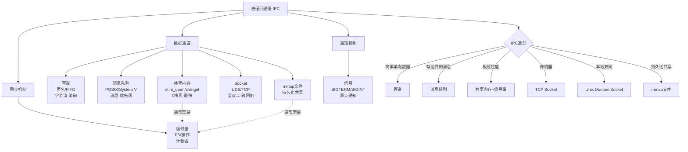

**最终的方法论沉淀**——面对 IPC 选型，问自己三个问题：

1. **数据量多大？需要什么速度？**（KB 级随便选，MB 级用共享内存）
2. **数据有没有消息边界？**（字节流用管道/Socket，消息用消息队列）
3. **需要跨网络吗？**（要跨网络只能用 Socket；本机优先 UDS 或共享内存）

把这三个问题问到位，你就从"会起一个管道"进化到了"会选 IPC"的工程师。


## 12.思考题与作业

### 12.1 基础思考题

1. **管道 vs 消息队列**：用管道实现"发送方连发 3 条消息，接收方每条消息单独处理"需要考虑什么问题？用消息队列呢？由此说出"字节流"和"消息模式"的本质区别。

2. **命名管道的 open 行为**：写一个用 FIFO 通信的程序。如果读端先 `open(O_RDONLY)`，写端还没来——读端会怎样？如果写端先 `open(O_WRONLY)`，读端还没来——写端会怎样？如果用 `O_NONBLOCK` 标志，行为分别是怎么变？

3. **共享内存和普通内存的区别**：`malloc()` 分配的内存和 `shmat()` 附加的共享内存，在虚拟地址空间的位置一样吗？能通过 `free()` 释放共享内存吗？

4. **System V IPC 的资源泄漏**：写一个创建 System V 共享内存的程序（不显式删除），多次运行后 `ipcs -m` 看效果。为什么 System V IPC 有独立的生命周期？`ipcrm` 命令是如何清理的？

5. **信号的不可靠**：连续快速向某进程发送 5 次 `SIGUSR1`，信号处理器实际被调用了几次？Linux 的实时信号（`SIGRTMIN` ~ `SIGRTMAX`）是怎么解决这个问题的？

### 12.2 进阶思考题

1. **1.1 节复盘**：小刘的日志采集系统，从 7.2GB 降到 50MB——分析三个内存开销来源（管道内核缓冲、Agent应用缓冲、业务积压），并用小 C 改变单位量化内存节省的主要来源是哪个。

2. **D-Bus 的选型**：Linux 桌面的 D-Bus 为什么选择 Unix Domain Socket 而不是共享内存？提示：考虑 N对N 通信、安全性、传输可靠性。

3. **PostgreSQL 为什么用多进程**：PostgreSQL 每个连接一个进程——那这些进程之间怎么通信？`PGPROC` 结构体存在哪？用了什么 IPC？为什么 PostgreSQL 不改成多线程？（提示：PostgreSQL 用 fork 而非线程的隔离性优势）

4. **Android Binder 的设计**：Android 的 Binder IPC 只做一次拷贝——它怎么做到的？和 Linux 传统共享内存的"零拷贝"有什么区别？Binder 为什么要基于内核驱动，而不是普通系统调用？

5. **"零拷贝"真零吗**：共享内存说是零拷贝，但进程 A 写的数据，进程 B 能立刻看到吗？如果不能，需要什么操作？这和 CPU 多核缓存一致性协议（MESI）有什么关系？

### 12.3 动手作业

**作业一（必做）**：实测三种 IPC 的传输速度。

- 分别用管道、POSIX 消息队列、POSIX 共享内存实现 100 万条消息传输（每条 256 字节）。
- 测量总耗时，计算吞吐量（MB/s），和本章 5.4 节的理论值对比。

| IPC 方式 | 100万条耗时 | 吞吐量(MB/s) |
|---------|-----------|-------------|
| 管道 | | |
| 消息队列 | | |
| 共享内存 | | |
| 共享内存+信号量 | | |

**作业二（选做）**：实现一个"共享内存环形缓冲区 + 信号量"的多生产者单消费者模型。

- 环形缓冲区大小 4KB，10 个生产者线程（模拟 10 个业务进程），1 个消费者线程（Agent）。
- 注意：多生产者需要互斥锁保护写入位置指针。
- 测试在缓冲区被写满时的行为——消费者能不能跟上？生产者会不会被阻塞？

**作业三（选做）**：实现一个 Unix Domain Socket + 多路复用的简单聊天服务器。

- 支持多个客户端同时连接
- 支持群发消息
- 通过 `SO_PASSCRED` + `getsockopt` 获取发送者 PID
- 用 `epoll` 管理所有连接

**作业四（架构思考）**：分析你当前负责的某个系统，哪个地方用到了 IPC？

- 画图标注所有跨进程的通信点，标注当前用的 IPC 方式
- 按本章选型指南分析：每个点用当前的 IPC 是否合适？有没有更优的选择？
- 如果让你重新设计，你会选什么？为什么？
