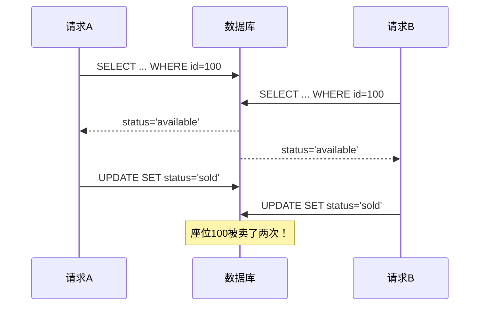
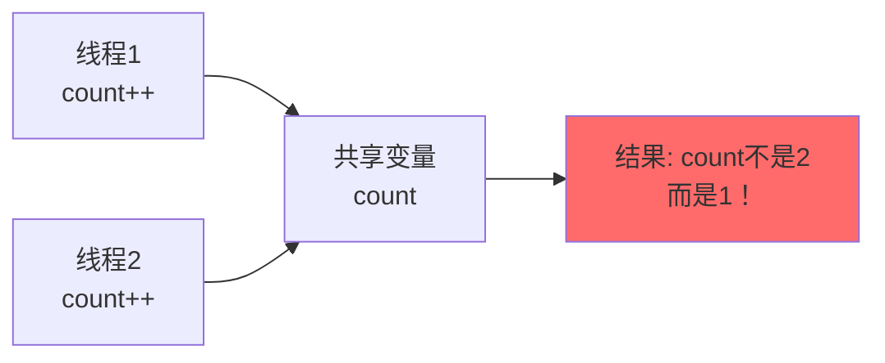
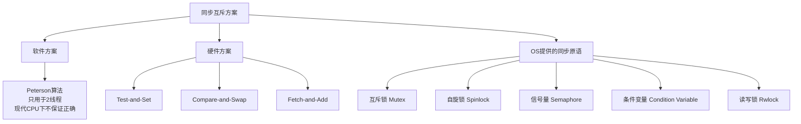
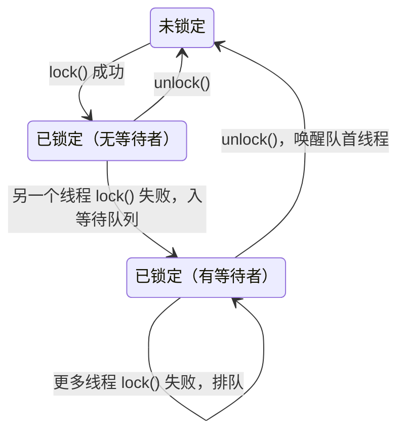
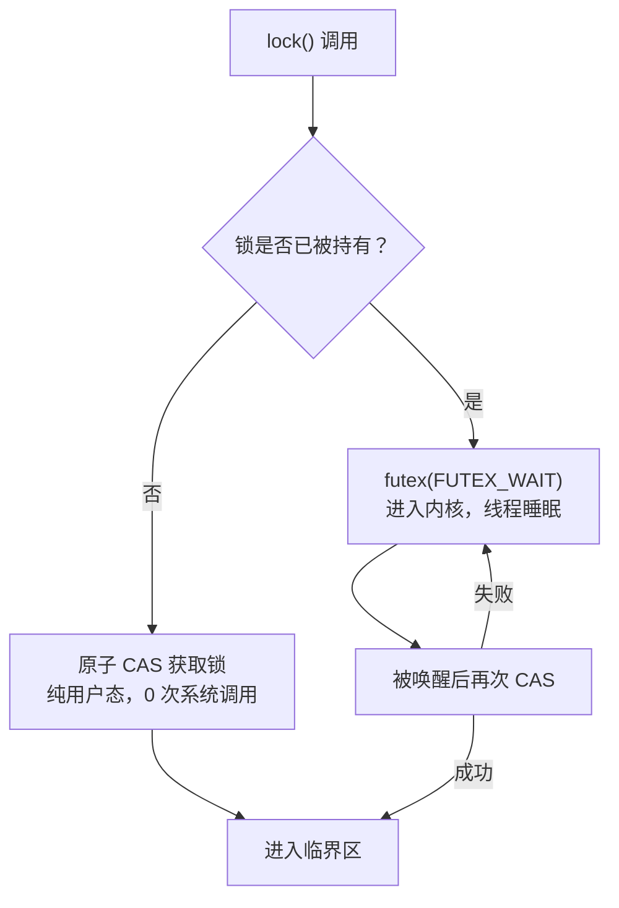
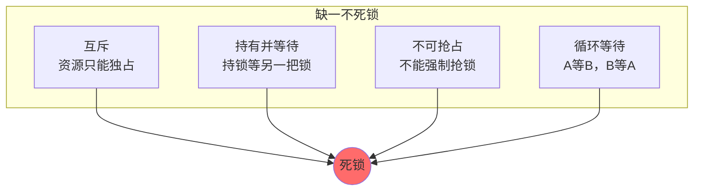
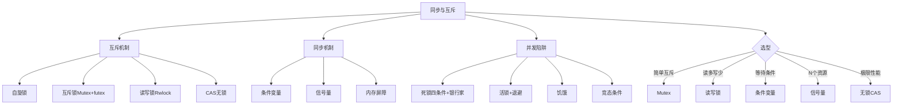

# 同步与互斥

> 锁/条件变量/信号量/死锁四条件/银行家算法——并发编程的地基

#### 目录介绍
- [01.工作案例引入](#01工作案例引入)
  - [1.1 一天卖了两次票](#11-一天卖了两次票)
  - [1.2 为什么要学同步互斥](#12-为什么要学同步互斥)
- [02.并发编程的基本问题](#02并发编程的基本问题)
  - [2.1 竞态条件Race Condition](#21-竞态条件race-condition)
  - [2.2 临界区Critical Section](#22-临界区critical-section)
  - [2.3 临界区问题的四个要求](#23-临界区问题的四个要求)
  - [2.4 解决思路概述](#24-解决思路概述)
- [03.互斥锁Mutex](#03互斥锁mutex)
  - [3.1 自旋锁Spinlock](#31-自旋锁spinlock)
  - [3.2 互斥锁Mutex](#32-互斥锁mutex)
  - [3.3 自旋锁vs互斥锁如何选择](#33-自旋锁vs互斥锁如何选择)
  - [3.4 读写锁Rwlock](#34-读写锁rwlock)
  - [3.5 递归锁与死锁陷阱](#35-递归锁与死锁陷阱)
- [04.硬件支持的互斥](#04硬件支持的互斥)
  - [4.1 关中断——单核时代的方案](#41-关中断单核时代的方案)
  - [4.2 Test-and-Set指令](#42-test-and-set指令)
  - [4.3 Compare-and-SwapCAS](#43-compare-and-swapcas)
  - [4.4 Linux中futex的实现](#44-linux中futex的实现)
- [05.条件变量](#05条件变量)
  - [5.1 为什么需要条件变量](#51-为什么需要条件变量)
  - [5.2 条件变量的使用模式](#52-条件变量的使用模式)
  - [5.3 丢失唤醒与虚假唤醒](#53-丢失唤醒与虚假唤醒)
- [06.信号量同步视角](#06信号量同步视角)
  - [6.1 信号量用作同步](#61-信号量用作同步)
  - [6.2 信号量vs条件变量](#62-信号量vs条件变量)
  - [6.3 信号量实现读写锁](#63-信号量实现读写锁)
- [07.经典同步问题](#07经典同步问题)
  - [7.1 生产者消费者问题](#71-生产者消费者问题)
  - [7.2 读者写者问题](#72-读者写者问题)
  - [7.3 哲学家就餐问题](#73-哲学家就餐问题)
  - [7.4 理发师问题](#74-理发师问题)
- [08.死锁Deadlock](#08死锁deadlock)
  - [8.1 死锁的四个必要条件](#81-死锁的四个必要条件)
  - [8.2 死锁预防Prevention](#82-死锁预防prevention)
  - [8.3 死锁避免Avoidance](#83-死锁避免avoidance银行家算法)
  - [8.4 死锁检测与恢复](#84-死锁检测与恢复)
  - [8.5 活锁与饥饿](#85-活锁与饥饿)
- [09.内存序与原子操作](#09内存序与原子操作)
  - [9.1 指令重排序问题](#91-指令重排序问题)
  - [9.2 内存屏障](#92-内存屏障)
  - [9.3 C11的原子操作模型](#93-c11的原子操作模型)
- [10.综合案例高并发转账系统](#10综合案例高并发转账系统)
  - [10.1 场景与并发陷阱](#101-场景与并发陷阱)
  - [10.2 方案一粗粒度锁](#102-方案一粗粒度锁)
  - [10.3 方案二锁顺序+超时](#103-方案二锁顺序超时)
  - [10.4 方案三无锁CAS](#104-方案三无锁cas)
  - [10.5 三种方案横向对比](#105-三种方案横向对比)
  - [10.6 知识图谱回顾](#106-知识图谱回顾)
- [11.思考题与作业](#11思考题与作业)
  - [11.1 基础思考题](#111-基础思考题)
  - [11.2 进阶思考题](#112-进阶思考题)
  - [11.3 动手作业](#113-动手作业)


## 01.工作案例引入

### 1.1 一天卖了两次票

**场景**：小张是某票务平台的后端工程师，系统处理"锁定座位 → 扣款 → 出票"的流程。国庆黄金周前夜，一个热门演唱会的售票接口突然出现重复出票——同一个座位被卖给了两个用户。客服电话被打爆，公关连夜发道歉声明。

小张排查代码，发现了问题的根源——一段看似无辜的库存扣减代码：

```go
// 问题代码（Go - 有竞态条件）
func buyTicket(seatID int) error {
    seat := db.Query("SELECT status FROM seats WHERE id = ?", seatID)
    if seat.Status == "available" {
        db.Exec("UPDATE seats SET status = 'sold' WHERE id = ?", seatID)
        return nil
    }
    return errors.New("seat not available")
}
```

**疑惑**："先查后改"这种逻辑写在单线程里没有任何问题，但在高并发下——两个请求同时走到 `if seat.Status == "available"`，都看到座位是"可售"，然后两个请求都执行了 `UPDATE`，同一个座位被卖了两次。



**追问链**：

- "加个锁不就行了？" → 加了，但加的是进程内的 `sync.Mutex`，而线上是 8 个进程实例，锁不住跨进程的并发
- "那用数据库锁呢？" → `SELECT ... FOR UPDATE` 可以，但这是悲观锁，高并发下大量事务排队，吞吐量掉 80%
- "有没有乐观的方案？" → 用 CAS 思想：`UPDATE seats SET status='sold' WHERE id=? AND status='available'`，靠 WHERE 条件做原子判断，返回 `affected_rows=0` 表示被别人抢了
- "这就是 CAS 啊！那 CAS 的 ABA 问题呢？" → 在这个场景不担心 ABA（状态只有 available/sold 两种），但在其他场景（如无锁栈）ABA 会致命
- "死锁又是怎么回事？" → 如果两个事务 A 先锁座位1 再等座位2，B 先锁座位2 再等座位1——就死锁了

这串追问背后，就是**同步与互斥机制**的全部核心知识。小张最后用了乐观锁（CAS 思想的 SQL）解决了超卖，又引入了超时机制避免了死锁。

### 1.2 为什么要学同步互斥



当多个执行流（线程、进程）同时访问共享资源，且至少有一个是**写操作**，就产生了竞态条件。现代并发编程的核心挑战不是"写并发代码"，而是**"写正确的并发代码"**。本章的目标：

- 竞态条件到底是怎么产生的？CPU 指令层面拆给你看
- 自旋锁、互斥锁、读写锁——选哪个？差在哪？
- 条件变量解决什么问题？为什么不能只用锁？
- 死锁的四个条件是什么？银行家算法怎么工作？
- CAS 是什么？无锁编程怎么"不用锁也能同步"？


## 02.并发编程的基本问题

### 2.1 竞态条件Race Condition

竞态条件（Race Condition）：多个执行流**并发**访问共享数据，且**最终结果依赖于执行流的执行顺序**。

**最经典的例子——`count++` 不是原子的**：

```c
// C 代码
int count = 0;
count++;  // 看似一行，实际是三条指令
```

拆成汇编看看：

```asm
; count++ 在 x86-64 上的三条指令
mov  eax, [count]    ; ① 从内存加载 count 到寄存器
add  eax, 1          ; ② 寄存器中加 1
mov  [count], eax    ; ③ 写回内存
```

两个线程同时执行 `count++` 时的交错：

```
线程A                          线程B
─────────────────────        ─────────────────────
mov eax, [count]  ; eax=0
                              mov eax, [count]  ; eax=0（也是0！）
add eax, 1        ; eax=1
                              add eax, 1        ; eax=1
mov [count], eax  ; count=1
                              mov [count], eax  ; count=1

结果：count 应该是 2，实际是 1——丢了一次更新！
```

这就是最经典的**Read-Modify-Write**竞态——读和写之间被另一个线程插入了。

### 2.2 临界区Critical Section

临界区：访问共享资源的那段代码。**同一时刻，只允许一个线程进入临界区**。

```c
// 临界区 = 访问共享变量 count 的代码段
int count = 0;

void increment() {
    // ↓ 进入临界区之前需要"加锁"
    count++;       // 这是临界区
    // ↑ 离开临界区之后"解锁"
}
```

### 2.3 临界区问题的四个要求

一个好的同步方案必须满足：

| 要求 | 含义 | 违反的后果 |
|------|------|-----------|
| **互斥** | 同一时刻最多一个线程在临界区 | 数据不一致 |
| **前进** | 不在临界区的线程不能阻止其他线程进入 | 死锁 |
| **有限等待** | 一个线程申请进入后，等待次数/时间必须有上限 | 饥饿 |
| **性能** | 额外开销要小 | 吞吐量差 |

**注意**：前三条是正确性要求，第四条是工程要求。很多时候"正确"和"快"是矛盾的——比如一把全局大锁肯定正确，但性能极差。

### 2.4 解决思路概述



本章重点关注**硬件方案**和**OS 同步原语**——这是你日常编程实际会用到的。


## 03.互斥锁Mutex

### 3.1 自旋锁Spinlock

自旋锁是最简单、最底层的锁：当锁被占用时，**不停循环检查**直到锁释放。

```c
// 自旋锁的实现（用硬件 TAS 指令）
typedef struct {
    int locked;   // 0=未锁, 1=已锁
} spinlock_t;

void spin_lock(spinlock_t *lock) {
    while (1) {
        // TAS: 原子地读取 lock->locked，并将其设为 1
        // 如果返回值是 0（原来未锁）→ 获取成功
        // 如果返回值是 1（原来已锁）→ 继续循环
        if (test_and_set(&lock->locked) == 0)
            break;
        // CPU 提示：在等待时可以降低功耗
        __builtin_ia32_pause();  // x86 PAUSE 指令
    }
}

void spin_unlock(spinlock_t *lock) {
    lock->locked = 0;
}
```

**自旋锁的行为**：

```
线程A获取锁:
  test_and_set(&locked) → 0 → 获取成功 → 进入临界区

线程B尝试获取:
  test_and_set(&locked) → 1 → 失败 → 循环重试...
  test_and_set(&locked) → 1 → 失败 → 循环重试...
  ...（"自旋"中，CPU 空转）...
  test_and_set(&locked) → 0 → 获取成功！（A释放了锁）
```

**自旋锁的适用场景**：

| 场景 | 适合自旋锁？ | 理由 |
|------|-----------|------|
| 临界区极短（几纳秒） | ✅ | 等待时间 < 切换开销，不如自旋 |
| 临界区较长（> 几微秒） | ❌ | CPU 空转浪费、功耗高 |
| 单核 CPU | ❌ | 自旋时另一个线程根本没法运行（除非抢占） |
| 中断上下文 | ✅ | 中断中不能睡眠，只能用自旋锁 |
| 用户态应用程序 | ❌ | 用互斥锁代替 |

### 3.2 互斥锁Mutex

互斥锁（Mutex）在竞争失败时**让线程进入睡眠**，而不是自旋。这正是它和自旋锁的核心区别：

```
自旋锁：没抢到 → 一直检查（CPU空转）
互斥锁：没抢到 → 把自己挂到等待队列 → 让出CPU → 调度器选其他线程
```

```c
#include <pthread.h>

pthread_mutex_t mutex = PTHREAD_MUTEX_INITIALIZER;
int shared_counter = 0;

void *worker(void *arg) {
    for (int i = 0; i < 1000000; i++) {
        pthread_mutex_lock(&mutex);
        shared_counter++;             // 临界区
        pthread_mutex_unlock(&mutex);
    }
    return NULL;
}
```

**互斥锁的完整生命周期**：



### 3.3 自旋锁vs互斥锁如何选择

| 维度 | 自旋锁 Spinlock | 互斥锁 Mutex |
|------|----------------|-------------|
| 等待方式 | CPU 空转（忙等） | 线程睡眠（阻塞） |
| 上下文切换 | 无 | 有（~2μs 的代价） |
| 持有时间 | ≤ 几微秒 | 可以较长 |
| 适用场景 | 内核/中断上下文、极短临界区 | 用户态应用、临界区较长 |
| CPU 消耗 | 等待时 100% 占用核心 | 等待时 CPU 空闲 |
| 典型实现 | Linux `spin_lock()` | `pthread_mutex_t` |

**经验法则**：
- 临界区 < 上下文切换开销（~2μs）→ 自旋锁
- 临界区 > 上下文切换开销 → 互斥锁
- 不确定 → 互斥锁（更安全，不会意外浪费CPU）

### 3.4 读写锁Rwlock

共享资源往往"读多写少"——比如缓存配置，每天读一百万次但只更新一次。如果每次读都加互斥锁，大量的读操作被串行化。

**读写锁**允许多个读者同时进入临界区（读不互斥），但写者独占：

```c
#include <pthread.h>

pthread_rwlock_t rwlock = PTHREAD_RWLOCK_INITIALIZER;

// 读者
void read_config() {
    pthread_rwlock_rdlock(&rwlock);  // 读者锁：允许多个读者同时持锁
    // ... 读共享数据 ...
    pthread_rwlock_unlock(&rwlock);
}

// 写者
void update_config() {
    pthread_rwlock_wrlock(&rwlock);  // 写者锁：独占，阻塞所有读者和其他写者
    // ... 更新共享数据 ...
    pthread_rwlock_unlock(&rwlock);
}
```

| 锁状态 | 可以再加读锁？ | 可以再加写锁？ |
|--------|-------------|-------------|
| 无人持锁 | ✅ | ✅ |
| 有读者持锁 | ✅ | ❌（写者等待） |
| 有写者持锁 | ❌（读者等待） | ❌ |

**读写锁的陷阱——写者饥饿**：如果读者源源不断，写者可能永远等不到锁。解决方案是"写者优先"（writer-preference）——新读者如果发现已经有写者在等，就排在写者后面。

### 3.5 递归锁与死锁陷阱

**递归锁**（Reentrant Lock）允许同一个线程多次加锁：

```c
pthread_mutex_t mutex;
pthread_mutexattr_t attr;
pthread_mutexattr_init(&attr);
pthread_mutexattr_settype(&attr, PTHREAD_MUTEX_RECURSIVE);
pthread_mutex_init(&mutex, &attr);

void outer_func() {
    pthread_mutex_lock(&mutex);
    inner_func();        // 内部再申请同一把锁 → 不会死锁！
    pthread_mutex_unlock(&mutex);
}

void inner_func() {
    pthread_mutex_lock(&mutex);   // 已持有，引用计数 +1
    // ... 操作 ...
    pthread_mutex_unlock(&mutex); // 引用计数 -1，可能还没真正释放
}
```

**普通互斥锁 vs 递归锁**：

```
普通互斥锁：
  lock() 两次 → 第二次 lock() 时死锁（等自己释放锁）
  → 但自己正在等锁，不可能释放 → 永远锁死

递归锁：
  lock() 两次 → 引用计数 2
  unlock()   → 引用计数 1
  unlock()   → 引用计数 0，真正释放
```

**警告**：递归锁是对糟糕设计的"止疼药"，不是好设计的"参考标准"。能用普通锁就不要用递归锁。


## 04.硬件支持的互斥

### 4.1 关中断——单核时代的方案

在单核 CPU 上，如果在进入临界区前**关闭中断**，就不会有时钟中断来触发调度，其他线程就无法被切换进来——天然互斥。

```c
// 单核时代的"锁"（伪代码）
void lock()  { cli(); }  // 关中断
void unlock(){ sti(); }  // 开中断
```

**为什么现代系统不用了？**
- 多核系统：关中断只影响当前核心，其他核心上的线程照样跑
- 用户态程序不能关中断（特权指令）
- 关中断太久会导致系统"假死"（网络中断、时钟中断全丢）

### 4.2 Test-and-Set指令

现代的方案是用**硬件原子指令**。Test-and-Set（TAS）是最简单的一种：

```asm
; x86 的 TAS 等效指令——XCHG（原子交换）
test_and_set:
    mov  eax, 1            ; 想要设置为 1
    xchg eax, [lock_var]   ; 原子交换：eax ← 旧值，[lock_var] ← 1
    test eax, eax          ; 检查旧值是否为 0
    ret
; 返回 0 = 成功获取锁，返回 1 = 锁已被占用
```

**原子性的保证**：`XCHG` 指令在执行期间**锁住内存总线**（或缓存行），其他核心无法同时访问同一内存位置。

### 4.3 Compare-and-SwapCAS

CAS 是更强大的原子指令——**它不只是"读并设"，而是"比较，相等才设"**：

```c
// CAS 语义（C11 原子操作）
// 伪代码：如果 *ptr == expected，则 *ptr = desired，返回 true
//         否则 expected = *ptr，返回 false
bool CAS(int *ptr, int *expected, int desired) {
    if (*ptr == *expected) {
        *ptr = desired;
        return true;
    } else {
        *expected = *ptr;
        return false;
    }
}
```

**用 CAS 实现无锁的 `count++`**：

```c
void atomic_increment(int *ptr) {
    int old, new_val;
    do {
        old = *ptr;         // 读取当前值
        new_val = old + 1;  // 计算新值
    } while (!CAS(ptr, &old, new_val));
    // 如果 CAS 失败（期间其他线程改了 *ptr），重试
}
```

**CAS 的 ABA 问题**：

```
线程A: 读取值 A=10
线程B: 把 10 改成 20
线程B: 把 20 改回 10
线程A: CAS(ptr, 10, 30) → 成功！（因为现在值又是 10 了）

但在这期间，数据结构可能已经"变过"了！
对于无锁链表，这意味着被删除的节点可能已被复用 → 灾难性错误
```

**解决 ABA**：加版本号——在指针的高位放一个递增的计数器。`CAS2`（双字 CAS）或 `atomic_compare_exchange` 同时比较指针+版本号。

### 4.4 Linux中futex的实现

Linux 的 `futex`（Fast Userspace Mutex）是互斥锁的高效实现——**无竞争时纯用户态、有竞争时才进内核**：



**futex 的精妙之处**：

```
大部分时候锁没有被争用：
  lock():   用户态 CAS → 成功 → 不需要内核 → 极快
  unlock(): 用户态 CAS → 成功 → 不需要内核

偶尔有竞争：
  lock():   用户态 CAS → 失败 → futex(FUTEX_WAIT) → 线程睡眠
  unlock(): 发现有等待者 → futex(FUTEX_WAKE) → 唤醒一个线程

这种"fast path / slow path" 设计是高性能并发库的基石
Go 的 sync.Mutex、Java 的 ReentrantLock 都借鉴了这个思想
```


## 05.条件变量

### 5.1 为什么需要条件变量

**疑惑：已经有锁了，为什么还需要条件变量？**

**答疑**：锁解决"互斥"——保证同一时刻只有一个线程访问共享数据。但互斥不等于同步——当一个线程需要"等某个条件成立"时，锁本身没法做。

```c
// 只用锁的等待（错误做法——忙等）
pthread_mutex_lock(&mutex);
while (queue_is_empty()) {
    pthread_mutex_unlock(&mutex);  // 释放，让生产者有机会放数据
    usleep(100);                    // 拍脑袋决定睡多久
    pthread_mutex_lock(&mutex);    // 重新拿锁
}
// 处理数据
pthread_mutex_unlock(&mutex);
```

**问题**：`usleep(100)` 太小了浪费 CPU，太大了延迟高。条件变量提供"等条件 + 被通知"机制——条件不满足时睡着等，条件可能满足时被唤醒。

### 5.2 条件变量的使用模式

```c
pthread_mutex_t mutex = PTHREAD_MUTEX_INITIALIZER;
pthread_cond_t  cond  = PTHREAD_COND_INITIALIZER;
int ready = 0;  // 共享条件

// ===== 等待方（消费者） =====
void *waiter(void *arg) {
    pthread_mutex_lock(&mutex);

    while (!ready) {                          // ① while 不是 if！
        pthread_cond_wait(&cond, &mutex);     // ② 原子地：释放锁 + 睡眠
        // ③ 被唤醒后自动重新获取锁
    }
    // 条件满足，执行业务逻辑
    do_work();

    pthread_mutex_unlock(&mutex);
}

// ===== 通知方（生产者） =====
void *signaler(void *arg) {
    pthread_mutex_lock(&mutex);
    ready = 1;
    pthread_cond_signal(&cond);     // 唤醒一个等待者（broadcast 唤醒所有）
    pthread_mutex_unlock(&mutex);
}
```

**三个必须记住的细节**：

1. **用 `while` 不是 `if`**——虚假唤醒可能让 wait 返回但条件仍未满足
2. **wait 入参带 mutex**——内部先释放锁再睡眠，唤醒后重新获取锁
3. **signal 前持锁**——避免"消费者还没 wait，信号已发出"的丢失唤醒

### 5.3 丢失唤醒与虚假唤醒

| 现象 | 原因 | 解决方案 |
|------|------|---------|
| 丢失唤醒 | 消费者还没 wait，生产者已 signal | signal 前必须持锁 |
| 虚假唤醒 | 操作系统可能无故唤醒线程 | 用 while 而非 if 检查 |


## 06.信号量同步视角

### 6.1 信号量用作同步

第 3 章（IPC）讲了信号量用于进程间同步。这里从**线程同步**的角度：信号量 = 计数器 + 等待队列 + 两个原子操作。

```c
sem_t barrier;
sem_init(&barrier, 0, 0);  // 0=线程间共享，初始值=0

// 线程A：等线程B完成初始化
void *thread_a(void *arg) {
    sem_wait(&barrier);     // sem=0 → 阻塞
    read_config();          // B 完成初始化后才执行
}

// 线程B：初始化，完成后通知
void *thread_b(void *arg) {
    init_database();
    sem_post(&barrier);     // sem++ → 唤醒 A
}
```

### 6.2 信号量vs条件变量

| | 信号量 | 条件变量 |
|------|--------|---------|
| 状态记忆 | 有：post 后值+1，即使无人 wait | 无：无人等待时 signal 丢失 |
| 使用模式 | 简单：post/wait | 需配合 mutex + while |
| 语义 | "有 N 个资源可用" | "等某个条件变成真" |
| 典型场景 | 资源池、生产者消费者 | 等待某条件成立 |


## 07.经典同步问题

### 7.1 生产者消费者问题

固定大小缓冲区，生产者放、消费者取——核心用两个信号量控制：

```
sem_empty = N   (空位数)
sem_full  = 0   (已填充)
sem_mutex = 1   (保护 buffer)

生产者: sem_wait(&empty) → 加数据 → sem_post(&full)
消费者: sem_wait(&full)  → 取数据 → sem_post(&empty)
```

### 7.2 读者写者问题

读操作不互斥（多人同时读），写操作必须互斥。三种变体：

| 变体 | 策略 | 饿死谁 |
|------|------|--------|
| 读者优先 | 只要有读者，写者就等 | 写者 |
| 写者优先 | 写者到达后阻塞后续读者 | 读者 |
| 公平 | 先来先服务队列 | 都不饿 |

```c
// 读者优先实现核心逻辑
sem_t rw_mutex = 1;  // 保护文件
sem_t r_mutex  = 1;  // 保护 reader_count
int reader_count = 0;

// 读者
void reader() {
    sem_wait(&r_mutex);
    if (++reader_count == 1) sem_wait(&rw_mutex);  // 第一个读者锁文件
    sem_post(&r_mutex);
    read_file();
    sem_wait(&r_mutex);
    if (--reader_count == 0) sem_post(&rw_mutex);  // 最后一个读者放文件
    sem_post(&r_mutex);
}
```

### 7.3 哲学家就餐问题

5 个哲学家，5 根筷子——每人需两根才能吃饭。如果都先拿左边→死锁。

**三种防止死锁的方案**：

| 方案 | 做法 | 原理 |
|------|------|------|
| 限制人数 | 最多 4 人同时拿筷子 | 打破循环等待 |
| 非对称 | 奇数先左、偶数先右 | 打破循环等待 |
| 原子拿 | 用互斥锁保护整个"拿筷子"动作 | 打破持有并等待 |

```c
// 方案：同时拿两根（用全局 mutex 保护）
sem_t mutex = 1;
sem_t chopstick[5] = {1,1,1,1,1};

void philosopher(int i) {
    think();
    sem_wait(&mutex);                    // 原子地
    sem_wait(&chopstick[i]);             // 拿左
    sem_wait(&chopstick[(i+1)%5]);       // 拿右
    sem_post(&mutex);
    eat();
    sem_post(&chopstick[i]);
    sem_post(&chopstick[(i+1)%5]);
}
```

### 7.4 理发师问题

理发师 = 工作线程，等候椅 = 任务队列。没有客人时睡觉（阻塞），客人来叫醒。这是线程池的原始模型。


## 08.死锁Deadlock

### 8.1 死锁的四个必要条件

死锁是并发编程中**最难排查**的 bug。四个条件**同时满足**才会死锁：



```c
// 经典死锁
pthread_mutex_t lockA, lockB;

// 线程1: lockA → lockB
// 线程2: lockB → lockA
// → 线程1 拿着 A 等 B，线程2 拿着 B 等 A → 死锁
```

### 8.2 死锁预防打破四个条件

| 打破的条件 | 方法 | 实用性 |
|-----------|------|--------|
| 互斥 | 资源共享（读写锁、无锁结构） | 不能应用于所有场景 |
| 持有并等待 | 一次性申请所有锁 | 降低并发度 |
| 不可抢占 | 允许强制收回 | 不现实（数据损坏） |
| **循环等待** | **规定锁顺序** | ✅ **最实用** |

**锁顺序法**——简单有效：

```c
// 死锁之前：两个线程锁顺序不同
// 修复：统一按地址排序
void transfer(Account *a, Account *b) {
    if ((uintptr_t)a < (uintptr_t)b) {
        lock(a); lock(b);
    } else {
        lock(b); lock(a);
    }
    // ... 转账 ...
    unlock(a); unlock(b);
}
```

**`try_lock` + 退避**——无法统一排序时的备选：

```c
while (1) {
    lock(&a->lock);
    if (try_lock(&b->lock) == 0) break;  // 两把都拿到了
    unlock(&a->lock);
    usleep(rand() % 100);  // 随机退避，打破同步
}
```

### 8.3 死锁避免银行家算法

银行家算法（Dijkstra 提出）——每次分配前模拟检查"是否安全"：

```
安全性检查伪代码：
Work = Available   // 模拟剩余资源
Finish = [false]   // 进程是否完成

while (存在未完成进程 i 且 Need[i] ≤ Work):
    Work = Work + Allocation[i]    // i完成，释放它占有的资源
    Finish[i] = true

如果所有进程都能完成 → 安全，可以分配
否则 → 不安全，拒绝分配
```

**实际应用**：银行家算法在通用 OS 中很少使用（开销大），但在数据库死锁检测中思想一致——InnoDB 维护锁等待图，检测到环就回滚代价最小的那个事务。

### 8.4 死锁检测与恢复

| 策略 | 做法 | 代价 |
|------|------|------|
| 终止所有死锁进程 | 杀死环中所有进程 | 丢失所有工作 |
| 终止一个 | 一次杀一个直到解除 | 需选择"最小代价" |
| 资源抢占 | 抢资源给另一个 | 被抢的要回滚 |

**MySQL InnoDB 的做法**——死锁检测 + 自动回滚：

```sql
-- 死锁检测默认开启
-- 检测到时：选择 undo log 最小的事务回滚
-- 返回错误：Deadlock found ... try restarting transaction
```

### 8.5 活锁与饥饿

| | 死锁 | 活锁 | 饥饿 |
|------|------|------|------|
| 状态 | 阻塞（睡眠） | **在运行**但无进展 | 就绪但永远不被调度 |
| 自愈 | 不能 | 有时能 | 可能持续 |
| 解决 | 打破循环等待 | **随机退避** | 公平算法 |

活锁的解决方案——指数退避：每次失败等待时间翻倍（上限 1 秒），加随机因子打破"同步"。


## 09.内存序与原子操作

### 9.1 指令重排序问题

**疑惑：代码按顺序写，CPU 就一定按顺序执行吗？**

**答疑**：不一定。CPU 和编译器都可能重排序。以下代码可能出错：

```c
// 线程1：初始化
data = 42;       // ①
ready = 1;       // ②

// 线程2：等待
while (!ready)   // ③
    ;
printf("%d\n", data);  // ④ 可能读到旧值！
// 原因：CPU 可能把 ② 重排到 ① 前面
```

### 9.2 内存屏障

内存屏障告诉 CPU/编译器："这道指令前的操作必须已完成，之后的操作不能提前"。

**C11 的四种内存序**：

| memory_order | 含义 |
|-------------|------|
| `relaxed` | 无顺序保证，只保证原子性 |
| `acquire` | 读屏障：之后的读/写不能重排到它前面 |
| `release` | 写屏障：之前的读/写不能重排到它后面 |
| `seq_cst` | 全局顺序一致性（默认，最安全最慢） |

```c
// 用 acquire/release 修复上述例子
// 线程1：
data = 42;
atomic_store_explicit(&ready, 1, memory_order_release);

// 线程2：
while (atomic_load_explicit(&ready, memory_order_acquire) == 0)
    ;
printf("%d\n", data);  // 保证看到 42
```

**核心理解**：`mutex.lock()` 隐含 acquire 语义，`mutex.unlock()` 隐含 release 语义。这就是锁为什么能保证可见性——它底层就是靠内存屏障。


## 10.综合案例高并发转账系统

### 10.1 场景与并发陷阱

**需求**：10 线程，各跑 10 万次转账。100 账户初始各 1000 元，总额永远 = 100000。

**最简单的错误实现——没有保护**：

```c
void transfer(Account *from, Account *to, int amount) {
    if (from->balance >= amount) {
        from->balance -= amount;  // ①
        to->balance   += amount;  // ②
        // ① 和 ② 之间被插入 → 总额可能不对！
    }
}
```

### 10.2 方案对比

**方案一：全局大锁**——正确但完全串行，10 线程 = 1 线程的吞吐。

**方案二：锁顺序（按地址排序）**：

```c
// 每个账户一把锁 + 按地址排序防死锁
Account *first  = (uintptr_t)a < (uintptr_t)b ? a : b;
Account *second = (uintptr_t)a < (uintptr_t)b ? b : a;
lock(first); lock(second);
transfer();
unlock(second); unlock(first);
```

**方案三：无锁 CAS**：

```c
// 扣款
do {
    old = atomic_load(&from->balance);
    if (old < amount) return;
} while (!CAS(&from->balance, old, old - amount));

// 加款
do {
    old = atomic_load(&to->balance);
} while (!CAS(&to->balance, old, old + amount));
// 注意：扣款和加款之间不是原子的！
```

### 10.3 三种方案横向对比

| 维度 | 全局锁 | 锁顺序 | 无锁 CAS |
|------|--------|--------|---------|
| 正确性 | ✅ | ✅ | ✅（单变量级） |
| 死锁风险 | 无 | 无 | 无 |
| 10线程吞吐 | ~1x | ~4x | ~8x |
| 跨操作原子 | ✅ | ✅ | ❌ 扣和加非原子 |
| 适用场景 | 极简系统 | 通用 | 极限性能 |


## 11.知识图谱回顾



**最终方法论**——面对并发问题，四步排查法：

1. **识别共享数据**：哪些多线程访问？哪些是写？
2. **加互斥保护**：锁或读写锁保护临界区
3. **需要等待吗？** 是则引入条件变量或信号量
4. **检查死锁**：画锁依赖图，确保无循环等待；try_lock+超时做防线


## 12.思考题与作业

### 12.1 基础思考题

1. **count++ 的原子性**：用 `gcc -S` 看 `count++` 的汇编，画两个线程所有可能的执行交错及结果。

2. **自旋锁 vs 互斥锁**：给一个临界区 500ns、上下文切换 5μs 的场景，算自旋锁盈亏平衡的自旋次数上限。

3. **条件变量 while vs if**：给出一个虚假唤醒导致 if 判定错误的具体场景。

4. **死锁四条件**：找出一个同时满足四条件但不会死锁的例子（说明是必要非充分条件）。

5. **内存屏障修复双检锁**：分析 DCL（Double-Checked Locking）在无内存屏障时的问题，以及如何修复。

### 12.2 进阶思考题

1. **售票三种方案**：`SELECT FOR UPDATE` / 乐观锁 `WHERE status='available'` / Redis 分布式锁，在 1000 QPS 下的延迟与吞吐。

2. **Go 的 sync.Mutex**：Go 1.13+ mutex 的"先自旋再睡眠"策略——为什么？和 G-M-P 模型的关系？

3. **RCU 为什么更快**：Linux RCU 读者永远不阻塞，解释 grace period 和写者同步机制。

4. **OS 不检测死锁，DB 检测**：从"锁持有时间"和"可回滚性"分析为什么。

5. **哲学家问题实战**：找出你工作中的一个死锁风险，画资源分配图，给出修复方案。

### 12.3 动手作业

**作业一（必做）**：实现 10.2 节三种转账方案。

- 10 线程 × 10 万次转账，对比全局锁、锁顺序、无锁 CAS 的吞吐量和正确性。

**作业二（选做）**：实现一个带"写者优先"策略的读写锁。

- 100 读者 + 1 写者，读 1000 次写 10 次。对比读者优先 vs 写者优先。

**作业三（选做）**：手写死锁检测器。

- 输入：线程持有的锁 + 等待的锁。输出：是否存在死锁环。

**作业四（架构题）**：画你当前系统的锁依赖图，找出环并修复。
