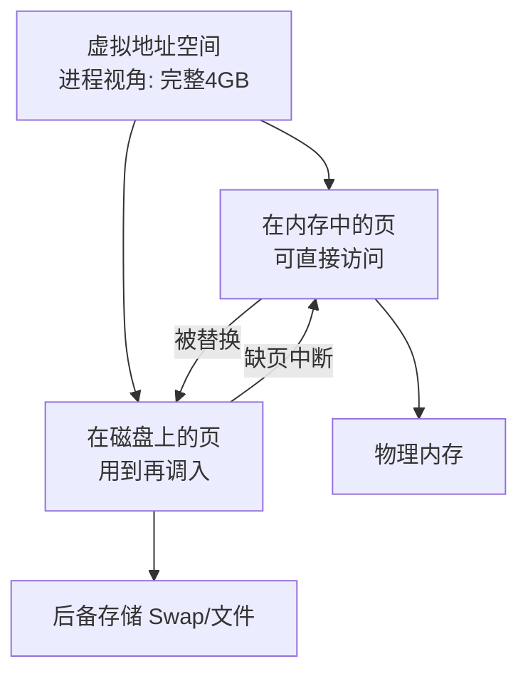
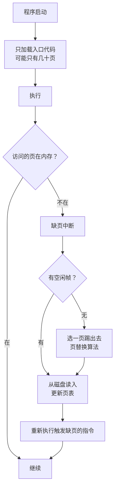
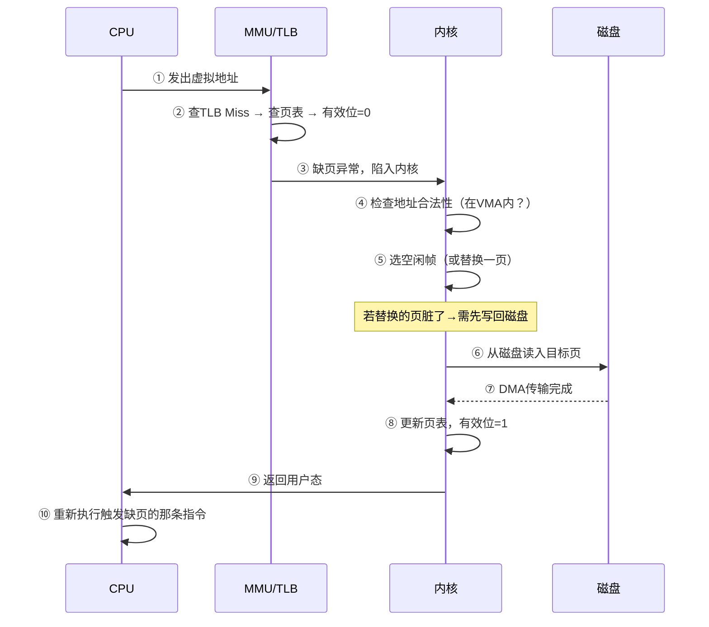
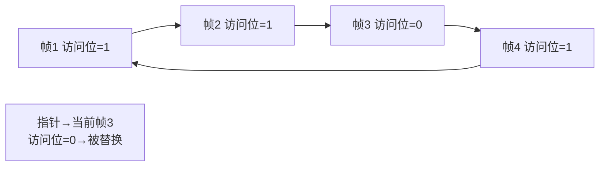
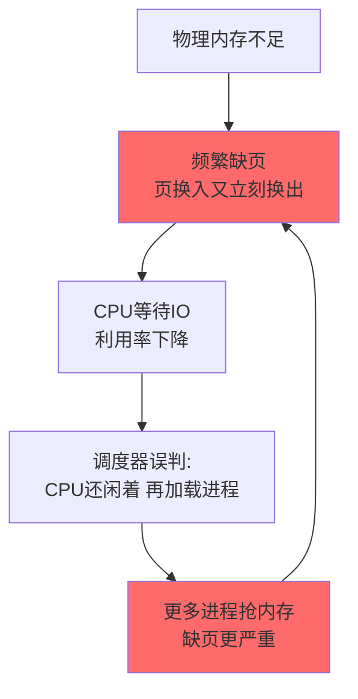
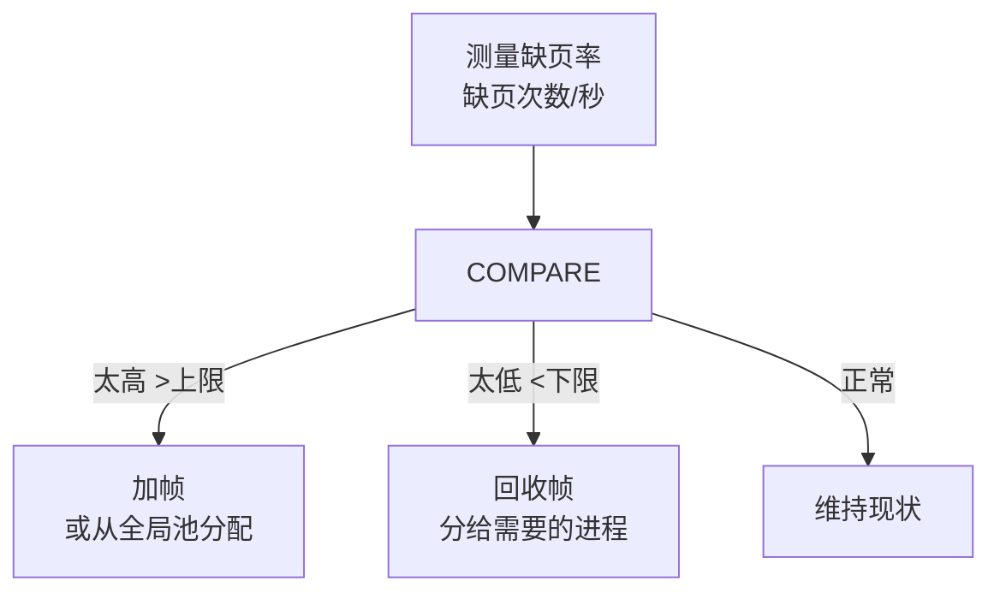
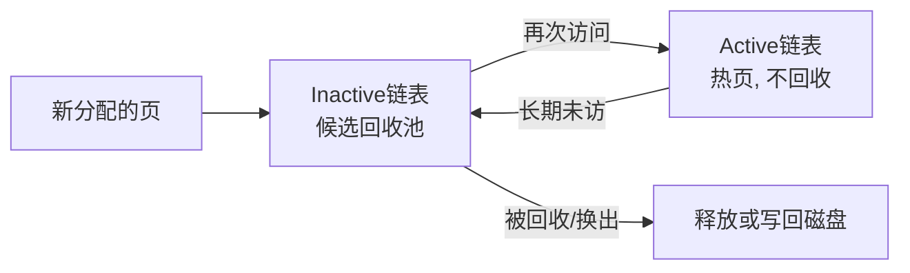
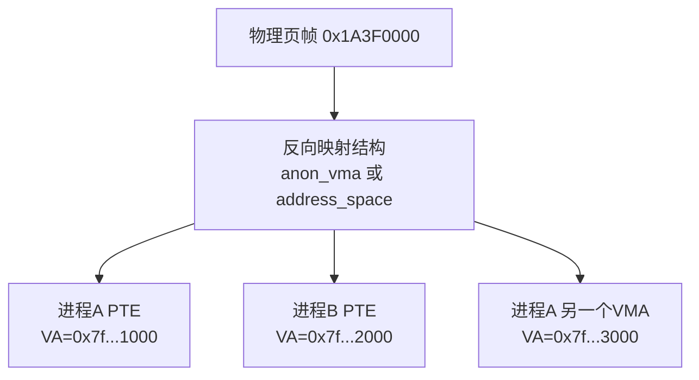
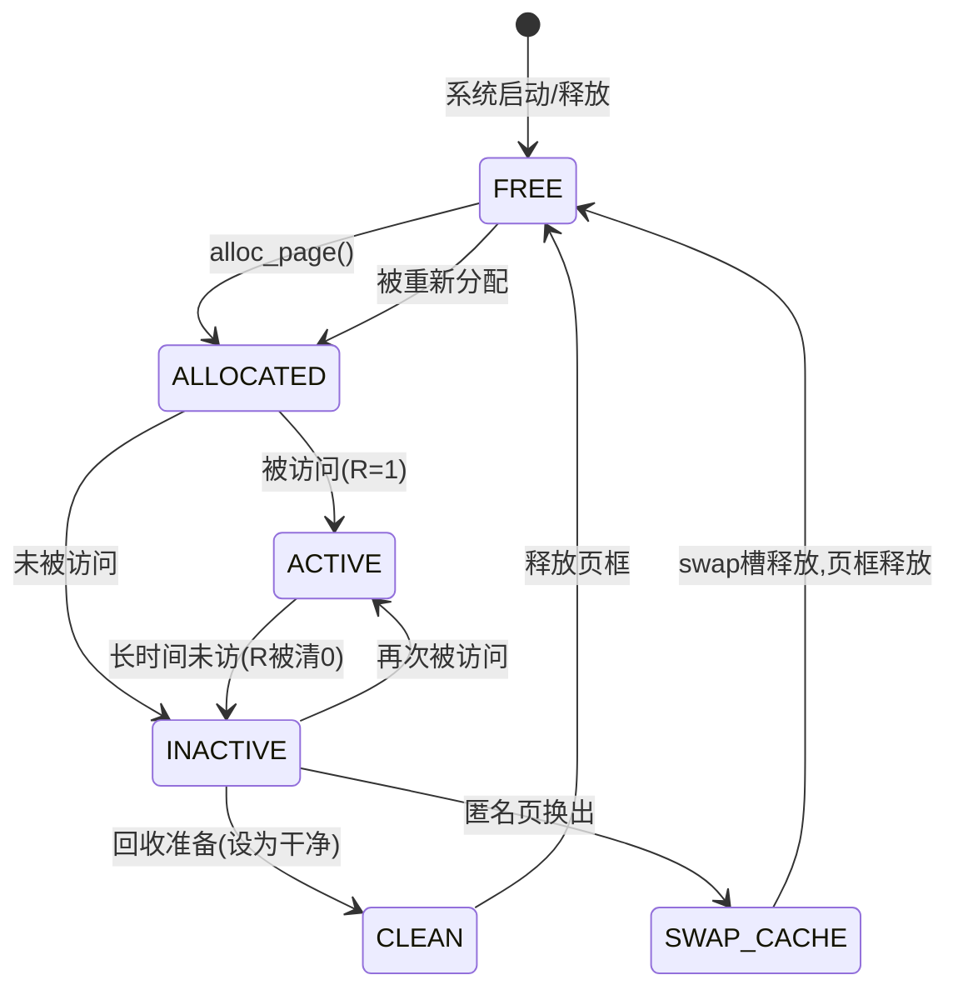
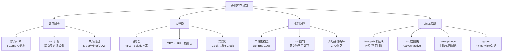

# 虚拟内存机制

> 缺页中断→页替换→工作集——物理内存不够用时，操作系统如何"变"出更多？

#### 目录介绍
- [01.工作案例引入](#01工作案例引入)
  - [1.1 Kubernetes反复杀Pod的诡异现象](#11-kubernetes反复杀pod的诡异现象)
  - [1.2 为什么要学虚拟内存](#12-为什么要学虚拟内存)
- [02.虚拟内存的概念](#02虚拟内存的概念)
  - [2.1 虚拟内存解决什么问题](#21-虚拟内存解决什么问题)
  - [2.2 虚拟内存的本质](#22-虚拟内存的本质)
  - [2.3 虚拟地址空间大于物理内存](#23-虚拟地址空间大于物理内存)
- [03.请求调页](#03请求调页)
  - [3.1 按需加载页](#31-按需加载页)
  - [3.2 缺页中断的完整流程](#32-缺页中断的完整流程)
  - [3.3 缺页的类型](#33-缺页的类型)
  - [3.4 有效访问时间EAT](#34-有效访问时间eat)
- [04.页替换算法理论篇](#04页替换算法理论篇)
  - [4.1 FIFO先进先出](#41-fifo先进先出)
  - [4.2 Belady异常](#42-belady异常)
  - [4.3 OPT最佳置换](#43-opt最佳置换)
  - [4.4 LRU最近最久未使用](#44-lru最近最久未使用)
  - [4.5 栈算法与Belady免疫](#45-栈算法与belady免疫)
- [05.页替换算法实践篇](#05页替换算法实践篇)
  - [5.1 Clock时钟算法](#51-clock时钟算法)
  - [5.2 增强型Clock算法](#52-增强型clock算法)
  - [5.3 算法对比总结](#53-算法对比总结)
- [06.帧分配策略](#06帧分配策略)
  - [6.1 固定分配vs可变分配](#61-固定分配vs可变分配)
  - [6.2 平均分配vs比例分配](#62-平均分配vs比例分配)
  - [6.3 全局替换vs局部替换](#63-全局替换vs局部替换)
  - [6.4 分配策略的权衡](#64-分配策略的权衡)
- [07.系统抖动](#07系统抖动)
  - [7.1 什么是抖动](#71-什么是抖动)
  - [7.2 抖动的原因](#72-抖动的原因)
  - [7.3 工作集模型](#73-工作集模型)
  - [7.4 缺页频率PFF控制](#74-缺页频率pff控制)
- [08.Linux的页回收机制](#08linux的页回收机制)
  - [8.1 kswapd与直接回收](#81-kswapd与直接回收)
  - [8.2 LRU双链表Active/Inactive](#82-lru双链表activeinactive)
  - [8.3 Page Cache与脏页回写](#83-page-cache与脏页回写)
  - [8.4 swap分区与交换机制](#84-swap分区与交换机制)
  - [8.5 swappiness参数调优](#85-swappiness参数调优)
- [09.综合案例Swap风暴排查](#09综合案例swap风暴排查)
  - [9.1 场景数据库性能断崖下跌](#91-场景数据库性能断崖下跌)
  - [9.2 排查路线图](#92-排查路线图)
  - [9.3 根因确认与修复](#93-根因确认与修复)
  - [9.4 知识图谱回顾](#94-知识图谱回顾)
- [10.思考题与作业](#10思考题与作业)


## 01.工作案例引入

### 1.1 Kubernete

**场景**：老赵是基础架构工程师，维护一个 32GB 节点的 K8s 集群。某天告警：**"PostgreSQL Pod 反复被 OOM Kill，一小时重启 8 次"**。

`kubectl describe pod` 显示 `Exit Code: 137`（SIGKILL），memory limit=8GB。但 `kubectl top pod` 显示仅用 6.2GB——不到上限：

```bash
$ free -h
              total   used   free   shared   buff/cache   available
Mem:            31G   5.8G   0.2G     2.1G         25G        22G
Swap:           0B    0B     0B

$ vmstat 1
 r  b  swpd free buff cache  si so  bi   bo   in   cs us sy id wa
 8  3     0  400  100  25G   0  0 8900 3800 45000 12000 20 15 10 55
```

**疑惑矩阵**：`free` 只有 200MB 但 `available` 高达 22GB——为什么不用？`wa=55%`、`bi=8900/s`——明明没配 swap，为什么像在疯狂换页？

**根因链**：集群上有个**日志分析 CronJob** 定期扫描大文件，把大量文件内容加载进 Page Cache → 挤占了 PostgreSQL 依赖的缓存数据页 → PG 查询时数据页不在内存 → 触发**缺页中断**从磁盘读 → 刚读入的数据页马上又被日志任务挤出去 → **刚换入的页立刻被换出**，CPU 大量时间在等磁盘 IO（`wa=55%`）→ PG 响应变慢 → 积压 → 内存暴涨 → OOM Killer 出手。

**追问链**：

- "没有 swap 为什么会有换页？" → 文件映射页（如共享库、mmap文件）被踢出内存时直接丢弃即可，磁盘上有原文件，不需要 swap
- "`available` 22GB 是什么？" → available = 可回收的 Page Cache。但"可回收"不等于"回收零代价"——回收需要时间，抖动时回收速度跟不上分配速度
- "怎么判断是否在抖动？" → `vmstat` 中 `bi`（块读入）持续很高 + CPU `wa` 高 + 吞吐量暴跌
- "不配 swap 是好是坏？" → 双刃剑。不配 swap 避免了"换页到磁盘的灾难性延迟"，但也让内存紧张时只能杀进程

这一串问题，答案全部写在**虚拟内存机制**里。

### 1.2 为什么要学虚拟内存


第 5 章讲了分页如何做地址转换。但虚拟内存不止于此——它的核心是**"欺骗"程序**，让它以为拥有比物理内存大得多的空间。本章聚焦于：

- 程序真的需要所有页都加载才能跑吗？（请求调页：不需要）
- 物理内存满了踢谁出去？（五种替换算法博弈）
- 刚踢出去的又要用 → 系统抖动了怎么办？（工作集模型）
- Linux 怎么管理换入换出？kswapd 到底在做什么？


## 02.虚拟内存的概念

### 2.1 虚拟内存解决什么问

第 5 章的分页解决了"外部碎片"。但一个问题没解决：**进程需要的总内存超过物理内存怎么办？**

虚拟内存的回答：**不需要把所有页都装进物理内存**。只装入"当前正在用"的那些页。

```
传统方式：进程需4GB → 必须有4GB空闲 → 否则运行不了
虚拟内存：进程需4GB → 同一时刻只用一部分
         物理内存只装当前用的 → 其余留磁盘 → 用到再调入
```

### 2.2 虚拟内存的本质



虚拟内存 = 分页（第5章） + **请求调页** + **页替换**。分页提供地址转换基础设施，请求调页允许"用到才加载"，页替换决定"满了踢谁"。

### 2.3 虚拟地址空间远大于

64位地址空间=16EB，物理内存只有几十GB。大部分虚拟地址从未被访问过，甚至不占页表空间：

```
典型64位进程：
  虚拟地址空间: 128TB（48位）
  实际有效VMA:  ~几百MB
  实际物理内存: RSS
```

核心原则：**虚拟地址空间大小 ≠ 实际占用的物理内存**。前者是虚的，后者才是实的。


## 03.请求调页机制

### 3.1 按需加载页详解

请求调页（Demand Paging）：程序启动时只加载"必需"的少量页，其余用到再调入。



**为什么请求调页重要？** 假设程序有10000页（40MB），启动后只用其中200页。无请求调页需要全部 10000 次磁盘IO；有请求调页只需约 50 次——启动快得多，大多数页永远用不到。

### 3.2 缺页中断的完整流程



| 步骤 | 耗时 | 说明 |
|------|------|------|
| ①-③ 硬件检查 | ~100ns | 自动完成 |
| ④-⑤ 内核处理 | ~1-5μs | 软件判断 |
| ⑥-⑦ **磁盘IO** | **~5-10ms** | 99.9% 的开销在这里 |
| ⑧-⑩ 恢复 | ~1μs | 重跑指令 |

### 3.3 缺页的类型详解

| 类型 | 数据在哪 | 处理方式 |
|------|---------|---------|
| **Major Fault** | 磁盘 | 读磁盘→分配帧→重跑 → **最慢** |
| **COW Fault** | fork后共享页 | 复制物理页→两页都可写→重跑 |
| **Minor Fault** | 内核已分配未映射 | 直接映射→有效位=1→重跑 → **很快** |
| **越界访问** | 不存在 | SIGSEGV 段错误 |

```bash
$ cat /proc/$PID/stat | awk '{print "min_flt="$10, "maj_flt="$12}'
min_flt=89345 maj_flt=12
```

### 3.4 有效访问时间EAT

```
EAT = (1-p)×内存访问时间 + p×缺页处理时间

p=缺页率, 内存访问=100ns, 缺页处理=10ms

p=0.001（千分之一）:
  EAT = 99.9ns + 10,000ns ≈ 10,100ns → 慢了100倍

p=0.00001（十万分之一）:
  EAT = 100ns + 100ns = 200ns → 只慢2倍 ✓
```

**结论**：虚拟内存能工作的前提是**缺页率必须极低**（十万分之一级别）。这依赖局部性原理和高效的页替换算法。

### 3.5 一次缺页指令级别追

**疑惑：缺页中断触发的瞬间，CPU 到底执行了什么？**

让我们用汇编级别追踪一条 `mov (%rax), %rbx` 指令——假设 `%rax` 指向的虚拟地址对应的物理页在 swap 中：

```
========================= 硬件阶段 =========================
① CPU执行 mov (%rax), %rbx
   发出虚拟地址 VA = 0x7f8a1234_5000

② MMU 分割 VA:
   页号 = VA >> 12 = 0x7f8a1234_5 (查页表用)
   偏移 = VA & 0xFFF = 0x000

③ TLB 查找: 页号 0x7f8a1234_5 → MISS

④ MMU 走内存页表 (CR3 → PML4 → PDPT → PD → PT):
   PT[0x1234_5].Present = 0  ← 不在物理内存！
   PT[0x1234_5].低12位 = swap_entry(swap分区+偏移)

⑤ MMU 产生 #PF 异常 (错误码: 用户态+读+Present=0)
   CPU保存现场: RIP=mov指令地址, CS, RFLAGS → 内核栈

========================= 软件阶段 =========================
⑥ 内核 page_fault_handler():
   addr = CR2寄存器值 = 0x7f8a1234_5000  (引发缺页的地址)
   error_code = 所访问页类型
   
   检查: addr 在某个VMA内? 有读权限? → 是 ✓

⑦ __handle_mm_fault():
   分配一个空闲物理页帧 (通过Buddy系统, order=0)
   若没有空闲帧 → 进入页回收 (shrink_lruvec)
   
   从 PTE 中取出 swap_entry → 找到 swap 分区中的位置

⑧ swapin_readahead():
   发起磁盘读: "把 swap 分区偏移 X 处的 4KB 读到物理帧 Y"
   当前进程进入 TASK_UNINTERRUPTIBLE (D状态)
   调度器切换到其他进程 ← 这里消耗 5-10ms

========================= DMA完成 =========================
⑨ 磁盘控制器通过DMA将数据写入物理帧 Y
   发中断 → 内核把等待进程唤醒 → 回到就绪队列

⑩ do_swap_page():
   更新 PTE: PTE[0x1234_5] = 物理帧Y的地址 | P=1 | R/W=1
   刷新 TLB 中对应的条目 (INVLPG)
   把 swap_entry 标记为"空闲"

⑪ iretq 返回用户态 → CPU恢复现场 → 重新执行 mov (%rax),%rbx
   这次 TLB 命中 → 物理地址 = 帧Y + 0x000 → 读到数据 ✓
```

**在这个过程中，CPU 真正"等"的是步骤⑧-⑨。如果在 SSD 上，这段耗时约 100μs-1ms；在 HDD 上，约 5-15ms（含寻道等待）。**

**探索性问题**：如果步骤⑥发现 addr 不在任何 VMA 内呢？

```
内核遍历进程的 VMA 红黑树 (mm->mm_rb):
  查找地址区间 [addr, addr+4KB]
  
  不在任何 VMA 中? → 可能是:
    a) 用户程序 bug (访问了已 free 的内存) → SIGSEGV
    b) 栈自动扩展 (addr 刚好在栈下方) → expand_stack() 扩展 VMA
    c) 缺页发生在内核态访问用户内存 → 特殊处理 (fixup_exception)
```

### 3.6 什么时候缺页不是"

**疑惑：`mmap` 一个 1GB 文件——难道会触发 262,144 次缺页中断？**

**答疑**：会，但不是一次性全部触发。这体现了请求调页的精髓——**按需触发，但批量优化**：

```
场景: mmap(1GB文件, MAP_SHARED)

mmap 时刻:
  → 只创建 VMA（记录映射关系），不分配任何物理页
  → 页表中所有页的 P=0

第一次访问 0x7f000000_0000:
  → 缺页中断 → 从文件读 4KB

但 Linux 会做 readahead (预读):
  → 缺页时不仅读目标页，还把"后面连续几页"一起读入
  → /sys/block/sda/queue/read_ahead_kb 控制预读大小（默认 128KB=32页）
  → 这样后续连续访问就不缺页了
  
结果: 262,144 次潜在缺页 → 实际约 262,144/32 ≈ 8192 次
```

**这引出一个深刻洞察**：缺页中断不是坏事。恰恰相反——它是虚拟内存的**动力源**，每次缺页都意味着"刚刚好及时"地加载了需要的数据。问题不在于缺页本身，而在于**缺页频率超过了磁盘吞吐能力**。


## 04.页替换理论详解

### 4.1 FIFO先进先出

简单：谁来得最早就踢谁。3个帧，序列 `1,2,3,4,1,2,5,1,2,3,4,5`：

```
1:[1]× 2:[1,2]× 3:[1,2,3]× 
4:[4,2,3]× (踢1)  1:[4,1,3]× (踢2)
2:[4,1,2]× (踢3)  5:[5,1,2]× (踢4)
1:✓ 2:✓  3:[3,1,2]× (踢5)  4:[3,4,2]× (踢1)
5:[3,4,5]× (踢2)

缺页: 12次/12 = 100%
```

FIFO 只看"来得早"，不管"还用不用"。频繁使用的页因来得早被反复踢出。

### 4.2 Belady异常

**疑惑：给 FIFO 多分一帧，缺页率一定降低吗？**

**不。FIFO 有 Belady 异常——帧数增加，缺页数反而可能增加。**

同一序列：3帧缺9次 vs 4帧缺10次。FIFO 没有利用局部性，增加帧反而让"早该被踢但赖着不走的旧页"占住位置。

### 4.3 OPT最佳置换

踢掉**未来最长时间不会用到的**页——理论最优但无法实现（需预知未来）。价值在于作为其他算法的**参考基准**。

### 4.4 LRU最近最久未使

踢掉**最近最久没被访问过的**页。用"过去"推测"未来"：

| 优点 | 缺点 |
|------|------|
| 接近 OPT | 需记录每次访问时间 |
| 无 Belady 异常 | 硬件实现成本高 |
| 利用局部性 | 每次访存都要更新 LRU 顺序 |

### 4.5 栈算法与Belad

LRU 是**栈算法**：`f` 帧时内存中的页 ⊆ `f+1` 帧时的页。增加帧不会挤出原有页 → 缺页率不增。FIFO 不满足此性质 → 有 Belady 异常。

### 4.6 LRU两种硬件实现

**疑惑：LRU 需要知道每页"上次被访问的时间"，硬件怎么实现？**

有两种实现方式：

**方式一：计数器法（每次访存都要更新，开销大）**

```
每个页表项配一个硬件计数器（如 64 位）

每次内存访问:
  CPU 内置的全局计数器 T 自增
  被访问页的计数器 = T  ← 记录"最后访问时刻"
  
替换时:
  遍历所有帧，找计数器值最小的 → 最近最久未用
  复杂度: O(n)
  
问题: 每次访存都要写计数器 → 多一次内存写操作
     需要大位宽计数器 (64位) → 硬件成本高
```

**方式二：移位寄存器法（近似 LRU，实际硬件使用）**

```
每帧配一个 n 位的移位寄存器

每次内存访问:
  被访问帧的寄存器: 最高位置1，右移一位
  未访问帧的寄存器: 最高位置0，右移一位
  → 最近被访问的帧，寄存器值最大

替换时:
  找寄存器值最小的帧

例 (8位寄存器, 访问序列: 帧0, 帧1, 帧0):
  初始:     帧0=0000_0000  帧1=0000_0000  帧2=0000_0000
  访问帧0:  帧0=1000_0000  帧1=0000_0000  帧2=0000_0000
  访问帧1:  帧0=0100_0000  帧1=1000_0000  帧2=0000_0000
  访问帧0:  帧0=1010_0000  帧1=0100_0000  帧2=0000_0000
  → 帧0 > 帧1 > 帧2，帧2寄存器最小 → 被替换
```

**但这两种方法在现代 CPU 中都不常用**。原因是它们需要专用硬件，而通用 CPU 只提供访问位（Reference Bit）——MMU 在每次 TLB 命中时自动置访问位=1，操作系统只需定期检查。这就是为什么 Clock 算法（基于访问位）成为了主流。

**探索性思考**：如果真的要在通用 x86 上实现精确 LRU，可以怎么做？

```
软件模拟 LRU (Linked List法——全软件):
  维护一个双向链表:
    每次访问一页 → 把该页移到链表头
    表尾 = 最久未用的页
  替换时: 取表尾

  问题: 每次访问都要操作链表 → 必须捕获每次内存访问
  → 如果通过 mprotect 把所有页设为只读，每次访问触发缺页?
  → 每访问一次就要两次上下文切换 → 性能灾难
  → 这就是为什么没人这么干
```


## 05.页替换实践详解

### 5.1 Clock时钟算法

LRU 完美但太贵。Clock（Second Chance）是廉价近似——环形链表 + 访问位 + 指针：

```
需要替换时：
  1. 指针往前走
  2. 访问位=0 → 替换它
     访问位=1 → 清0 → 指针继续走
  3. 直到找到访问位=0的帧

如果一个帧被扫过一整圈后访问位还是0
→ 说明整整一圈都没被访问过
→ 近似于"最近最少使用"
```



### 5.2 增强型Clock算

标准 Clock 只看访问位。增强版加上**修改位（Dirty Bit）**，形成二维优先级：

| (访问位,修改位) | 替换优先级 | 需写回？ |
|:---:|:---:|:---:|
| (0,0) | 🥇最优 | ❌ 零成本 |
| (0,1) | 🥈次优 | ✅ 需写回 |
| (1,0) | 🥉 | ❌ |
| (1,1) | 最后 | ✅ |

### 5.3 算法对比总结

| 算法 | 缺页率 | Belady异常 | 硬件支持 | 实际使用 |
|------|--------|-----------|---------|---------|
| OPT | 最优 | ❌ | — | 理论基准 |
| LRU | 优 | ❌ | 时间戳/栈 | 很少纯实现 |
| Clock | 良 | ❌ | 访问位 | ✅ 广泛 |
| 增强Clock | 良+ | ❌ | 访问+修改位 | ✅ Linux基础 |
| FIFO | 差 | ⚠️有 | 无 | 基本不用 |

### 5.4 增强型Clock完

用一个完整的例子感受增强 Clock 如何利用**修改位（Dirty Bit）**避免不必要的磁盘回写：

```
物理内存: 4 个帧，环状排列
初始: 指针 → 帧0
访问序列: 读0, 读1, 写0, 读3, 写1, 读2 (触发缺页，需要替换)

帧状态 (访问位R, 修改位M):
  帧0: (1,1)  ← 读后又写了
  帧1: (1,1)  ← 读后又写了
  帧2: (1,0)  ← 只读过
  帧3: (0,1)  ← 某次写过但很久以前

指针→帧0

======== 需要替换一帧，开始扫描 ========

第1轮扫描 (找 (0,0)):
  帧0: (1,1) → 不是(0,0)，R清0 → (0,1)
  帧1: (1,1) → 不是(0,0)，R清0 → (0,1)
  帧2: (1,0) → 不是(0,0)，R清0 → (0,0)
  帧3: (0,1) → 不是(0,0)，R清0 → (0,1)
  一圈没找到!

第2轮扫描 (还是找 (0,0)):
  帧0: (0,1) → 不是(0,0)
  帧1: (0,1) → 不是(0,0)
  帧2: (0,0) → ✓ 找到了! 替换帧2

替换帧2: R=0,M=0 → 无需写回磁盘 → 直接读入新页 → 零成本!

如果第2轮还没找到 (0,0):
  说明所有帧都 M=1 → 至少有一个脏页要写回
  第3轮: 重复第1轮，但这次肯定有 (0,1) 出现
  → 找到后先写回磁盘，再替换 (比干净页慢 1000 倍)
```

**对比：如果只用标准 Clock（不看修改位）**：

```
标准Clock第1轮就会在帧3停止 (访问位本来就是0)
→ 帧3的 M=1 → 必须先写回磁盘 → 浪费一次 IO
→ 而增强版避免了这次不必要的 IO，因为帧2更"干净"
```

**这就是增强 Clock 的精妙之处——两个比特的信息（访问+修改），实现了对页面状态的粗略四分类，无需跟踪精确的"最近访问时间戳"。**

### 5.5 Linux非纯Cl

Linux 2.6 早期确实用了类似 Clock 的算法，但从 2.6.28 开始转向 **LRU 双链表**。为什么？

```
Clock 的问题:
  1. 只区分"一轮内有没有被访问"，粒度太粗
  2. 扫描整个环时，所有页的访问位都要被"吃掉"（清0）
     → 可能误伤刚刚被访问过的页
  3. 不区分"文件页"和"匿名页"
     → 无法实现"文件页优先回收"策略

LRU 双链表的优势:
  1. Active/Inactive 两条链表，精确定义"热"和"冷"
  2. 页在两个链表间迁移，不需要全局扫描
  3. 可以给文件页和匿名页分别维护链表
     → 实现 swappiness 控制的回收偏向
  4. 回收时只需看 Inactive 链表尾部 → O(1) 选择
```

探索性问题：**如果让你重新设计页替换算法，你会引入什么新的信息？** 提示：考虑"页的访问频率"和"访问间隔模式"。


## 06.帧分配策略详解

### 6.1 固定分配与可变分配

页替换解决了"踢谁"，但没解决"每个进程该有多少帧"：

| 策略 | 含义 | 特点 |
|------|------|------|
| **固定分配** | 进程生命周期内帧数不变 | 简单但无法适应行为变化 |
| **可变分配** | 帧数根据缺页率动态调整 | ✅ 现代 OS 标准做法 |

### 6.2 平均分配与比例分配

固定分配下的两种方式：

```
平均分配：100帧/5进程 = 每进程20帧
  问题：DB需要50帧（频缺页），小程序只需5帧（浪费）

比例分配：按进程大小比例
  进程A(100页): 100/210×100 = 48帧
  进程B( 20页):  20/210×100 =  9帧
```

### 6.3 全局替换与局部替换

| | 全局替换 | 局部替换 |
|------|---------|---------|
| 替换范围 | 从**所有进程**中选 | 只从**当前进程**中选 |
| 特点 | 灵活、整体缺页率更低 | 不会误伤其他进程 |
| Linux | ✅ **默认** | ❌ |

### 6.4 分配策略的权衡

给进程分配更多帧能降低缺页率，但存在**边际递减效应**——超过工作集大小后加帧几乎无效。最佳策略：分配"刚好等于工作集大小"的帧。少了抖动，多了浪费。


## 07.系统抖动分析

### 7.1 什么是抖动详解

**抖动（Thrashing）**是虚拟内存最可怕的故障——系统花在换页上的时间远超计算。



这就是 1.1 节老赵看到的——`wa=55%`，CPU 看似闲实际在等磁盘。

### 7.2 抖动的原因详解

根本原因：每个进程分配的帧数**低于其工作集大小**。

### 7.3 工作集模型详解

工作集（Working Set, Denning 1968）——进程在最近 Δ 次内存访问中用到的不同页的集合：

```
WS(t, Δ) = {在[t-Δ, t]时间内被访问的页}

举例：访问序列 2,2,1,3,4,2,3,4,5,2,3,2,1,4,3,4
  Δ=5, t=5: WS = {最近5次: 1,3,4,2,3} 去重 = {1,2,3,4} = 4页
  Δ=5, t=8: WS = {最近5次: 4,2,3,4,5} 去重 = {2,3,4,5} = 4页
```

**抖动预防**：调度器加载新进程前检查 `Σ WSi > 可用物理帧` → 不加载，或挂起现有进程。

### 7.4 缺页频率PFF控制

工作集需跟踪每次访存——太贵。实践中用**缺页频率（PFF）控制**：



缺页率高→说明工作集装不下→加帧；缺页率低→帧太多浪费→减帧。全局帧不够→挂起整个进程，别让它抖动。


## 08.页回收机制详解

### 8.1 kswapd回收

Linux 页回收由 **kswapd 内核线程**驱动，配合三个水位线：

```
物理内存水位线：
  ┌───────────┐
  │ 可用内存   │
  ├───────────┤ ← high  (高于此: kswapd休眠)
  ├───────────┤ ← low   (低于此: kswapd唤醒, 异步回收)
  ├───────────┤ ← min   (低于此: 直接回收, 阻塞分配进程!)
  └───────────┘
```

**直接回收（Direct Reclaim）是性能杀手**——分配进程被阻塞，等待 IO 完成。

### 8.2 LRU双链表Act

Linux 维护两对 LRU 链表：匿名页（Active/Inactive anon）和文件页（Active/Inactive file）：



**回收优先级（由高到低）**：
1. Inactive(file) 干净页 → **直接释放（最快，零成本）**
2. Inactive(anon) → 换出到 swap
3. Inactive(file) 脏页 → 写回文件再释放
4. Active 链表 → 先降级再回收

**文件页优先于匿名页被回收**——文件页有原文件可随时读回，匿名页必须写 swap。

### 8.3 PageCache

Page Cache 除了加速文件读写，还是**文件页回收的直接来源**：

```bash
$ cat /proc/meminfo | grep -E "Cached|Dirty"
Cached:   15234568 kB   # Page Cache总量
Dirty:        1234 kB   # 未写回的脏页
```

| 脏页回写触发 | 条件 |
|------------|------|
| 强制回写 | 脏页占总内存 > `dirty_ratio`（默认20%） |
| 后台回写 | 脏页 > `dirty_background_ratio`（默认10%） |
| 定时回写 | 脏页存在 > `dirty_expire_centisecs`（默认30秒） |

### 8.4 swap分区与交换

Swap 是匿名页的后备存储。换出流程：kswapd 选 Inactive(anon) 页 → 写 swap 分区 → PTE 改为 swap entry → 下次访问触发缺页读回。

```bash
$ swapon --show
NAME      TYPE SIZE USED PRIO
/dev/sda3 partition 4G  2.1G   -2
```

### 8.5 swappines

`vm.swappiness`（0-100）决定文件页 vs 匿名页的回收偏向：

```bash
$ cat /proc/sys/vm/swappiness
60   # 默认值，文件页和匿名页大致平等
```

| 场景 | swappiness | 理由 |
|------|-----------|------|
| 数据库（依赖文件缓存） | 0-10 | 文件缓存是性能关键，别回收 |
| 桌面/通用 | 60 | 默认平衡 |
| 无 swap 容器 | 0 | 回收 swap 没意义 |
| 大量匿名内存 | 100 | 倾向回收文件页，减少 OOM |

### 8.6 页回收的完整调用链

深入追踪一次 `shrink_lruvec()` 的内部流程——这是 Linux 页回收的核心函数：

```
调用链:
  kswapd()                         ← 内核线程
    → balance_pgdat()              ← 跨zone平衡
      → shrink_node()              ← 单NUMA节点回收
        → shrink_lruvec()          ← ★ 核心!

shrink_lruvec(lruvec, sc):
  参数 sc (scan_control):
    .priority = 12 (回收优先级, 值越小越激进, DEF_PRIORITY=12)
    .nr_to_reclaim = 32 (本次要回收的页数)
    .may_writepage = 1 (允许写回脏页)
    .may_swap = 1 (允许swap)

  1. get_scan_count(): 决定要扫描多少匿名页 vs 文件页
     计算 swappiness 比例 → 
       例: swappiness=60, 文件页活跃度低:
         anon_scan = total_scan × 40%  ← 匿名页扫少一点
         file_scan = total_scan × 60%  ← 文件页扫多一点

  2. shrink_list(INACTIVE_ANON): 从 Inactive Anon 尾部扫描
     isolate_lru_pages()   ← 把候选页从链表摘下来, 数量=32
     shrink_page_list()    ← 逐个处理:
       if 页被锁住(PG_locked) → 跳过
       if 页是脏的(M=1) → 发起回写 (pageout())
       if 页被再次访问(R=1) → 放回 Active 链表 (activate)
       if 页干净(R=0,M=0) → 释放! free_page()
       if 匿名页需swap → add_to_swap() → swap_writepage()

  3. shrink_list(INACTIVE_FILE): 同2, 但文件页可以直接丢弃

  4. 如果回收量不够 → 从 Active 链表降级更多页到 Inactive
     shrink_active_list(): 扫描 Active, 把"R=0"的页降级

  5. 如果还不够 → shrink_slab(): 回收 Slab 缓存
     (dentry/inode 缓存 → 释放内核对象占用的页)

  6. 如果还不够且 priority=0 → 触发 OOM Killer
```

**探索性问题**：为什么 `shrink_page_list()` 可能跳过被锁定的页，而不是等待它解锁？

```
答案: 如果不跳过 → kswapd 被阻塞在等锁 → 
kswapd 本身占用一个内核线程 → 如果所有 kswapd 线程都被阻塞
→ 内存回收完全停止 → 系统死锁！
→ 所以必须"碰到的页锁了就跳过，不给它时间解锁"
→ 这也是为什么极端内存压力下回收效率会骤降
```

### 8.7 反向映射：从物理页

**疑惑：回收一个物理页之前，必须让所有进程的页表中对应的 PTE 失效。内核怎么知道"这个物理页被哪些进程映射了"？**

**答疑**：通过**反向映射（Reverse Mapping, rmap）**——从物理页反查所有映射它的 PTE。



**反向映射的两种类型**：

```
匿名页的反向映射 (anon_vma):
  每页通过 page->mapping 指向一个 anon_vma 结构
  anon_vma 下挂所有"通过 fork 共享这块内存"的 VMA
  遍历 VMA → 查该 VMA 的页表中是否有指向本页的 PTE

文件页的反向映射 (address_space):
  每页通过 page->mapping 指向文件 inode 的 address_space
  address_space 用 XArray(原Radix Tree) 管理所有缓存页
  但要找到哪些进程映射了这页，需要遍历 address_space 的 i_mmap 树
  i_mmap 是一棵优先树(priority tree)，存储所有映射该文件的 VMA
```

**回收时的操作——try_to_unmap()**：

```
try_to_unmap(page):
  1. 通过反向映射找到所有 PTE
  2. 对每个 PTE:
     a) 如果 PTE 存在且 P=1:
        - 如果页是脏的 → PTE 的 Dirty 位置1 (回写时用)
        - PTE 清零 → 下次访问触发缺页
        - 刷掉 TLB 中对应条目
     b) 如果 PTE 已经在 swap → 跳过
  3. 检查 page->_mapcount (引用计数) 是否为 0
     → 可能还有其他映射 (如 GUP pin, 内核映射)
  4. 所有 PTE 都清完后 → 页可以安全回收/换出

这一步的开销: 遍历所有映射进程的所有映射 → O(映射数量)
一个被 100 个进程共享的页 → 需要清 100 个 PTE
这就是"共享内存页回收反而更贵"的悖论
```

### 8.8 页面状态机详解

每个物理页在内核中有一个完整的状态生命周期：



**页面标志位（Page Flags）**——每个页有 20+ 个标志位，选出关键几个：

```c
// include/linux/page-flags.h (简化)
enum pageflags {
    PG_locked,    // 页被锁定 (正在IO, 不能回收)
    PG_dirty,     // 页被修改过 (需要回写)
    PG_reclaim,   // 标记为待回收 (在Inactive尾部)
    PG_writeback, // 正在回写磁盘
    PG_swapbacked,// 此页有swap后备 (匿名页)
    PG_unevictable,// 不可回收 (被mlock锁定的页)
    PG_active,    // 在Active链表
    PG_referenced,// 硬件访问位 (R位)
};
```

**一个页从"被写入"到"被换出"的完整标志位变化**：

```
用户进程写一个匿名页 → 物理页的状态变化:

  1. 初始:    PG_active, PG_dirty, PG_referenced
     (刚访问过, 有修改未回写)

  2. kswapd 扫描: 清 PG_referenced → 降级 PG_active
     移到 Inactive 尾部

  3. 再次扫描:   PG_referenced=0, PG_dirty=1
     → 准备换出: 加 PG_locked, 分配 swap 槽
     → swap_writepage() 发起 IO

  4. IO 进行中:  PG_locked, PG_writeback
     (这期间页不能被回收)

  5. IO 完成后:  清 PG_writeback, PG_dirty
     PG_reclaim → 等待回收

  6. 回收:       try_to_unmap() 清所有 PTE
     __free_page() → 页框归还 Buddy 系统
     → FREE 状态
```

### 8.9 内存压缩与碎片化

**疑惑：分页消灭了外部碎片，但内核有时需要连续物理页（如 DMA 缓冲、大页），"内部碎片"不存在但"物理连续页不足"怎么解决？**

**答疑**：Linux 有 **内存压缩（Memory Compaction）**——通过迁移可移动页，在物理内存中"拼"出连续区域：

```
压缩前:  [A][B][空][C][空][空][D][空][E]
         ← 零散的 1-page 空闲帧，无法分配 4 个连续页

压缩过程:
  扫描空闲帧 → 找到可迁移页 → 复制到空闲帧 → 更新 PTE
  [A][B][ ][C][ ][ ][D][ ][E]    扫描中...
  [A][B][C][ ][ ][ ][D][ ][E]    C 迁移
  [A][B][C][D][ ][ ][ ][ ][E]    D 迁移
  [A][B][C][D][E][ ][ ][ ][ ]    E 迁移

压缩后: 连续 4 个空闲帧 → 可以分配 order=2(4页) ✓
```

```bash
# 查看碎片指数
$ cat /proc/pagetypeinfo
# 或手动触发压缩
$ echo 1 > /proc/sys/vm/compact_memory
```

**只有"可移动页"才能被迁移**——匿名页和 Page Cache 页可以，内核直接分配的页（如 Slab）在 `PG_unevictable` 状态时不能移动。这就是为什么内核自身的内存分配往往需要预留"低端内存区域"。

### 8.10 水位线的计算原理

回到 8.1 节水线图——这些值是怎么算出来的？

```bash
$ cat /proc/zoneinfo | grep -A5 "Node 0, zone Normal"
  min      12919    # pages (约 50MB)
  low      16148    # pages (约 63MB)
  high     19378    # pages (约 76MB)
```

**计算公式**（简化）：

```
min_free_kbytes = sqrt(16 × 物理内存KB) × watermark_scale_factor/10000

例: 32GB 物理内存
min_free_kbytes = sqrt(16 × 33554432) × 1000/10000
               ≈ 23170 KB ≈ 5792 pages (4KB页)

每个zone按比例分配:
  Normal zone 占 80% 物理内存 → min ≈ 5792 × 0.8 ≈ 4634 pages

low  = min × 125%  ≈ 5792 pages
high = min × 150%  ≈ 6950 pages
```

**探索性问题**：为什么 min_free_kbytes 不是简单的线性比例，而是平方根？

```
线性:  min = 物理内存 × 1%
       32GB → min=320MB → 白白浪费 320MB 不用

平方根: min ≈ sqrt(物理内存)
       1GB  → min ≈ 14MB
       32GB → min ≈ 50MB
       1TB  → min ≈ 300MB
       
→ 小内存给足够百分比 (紧急预留), 大内存用平方根压低占比
→ 保证"水位线够用"但"不浪费太多"
```


## 09.Swap案例

### 9.1 场景数据库性能断崖

回到 1.1 节老赵的 PostgreSQL Pod，完整走一遍排查全流程。

```
环境: K8s Pod, Memory Limit=8GB, Node=32GB, No swap
现象: PG P99从5ms→500ms, 每小时OOM Kill 8次
vmstat: wa=55%, bi=8900/s, 磁盘利用率95%
```

### 9.2 排查路线图详解

**Step 1：`vmstat 1`** → `wa=55%`, `bi=8900/s` → 疯狂缺页读入

**Step 2：`iostat -x 1`** → 磁盘 95% 利用率 → 磁盘被打满

**Step 3：`perf record -e page-faults`** → 热点在 PG 的索引扫描 + 日志分析的 `read_file`

**Step 4：`vmtouch` + `pcstat`** → 大量日志文件占用了 Page Cache，PG 数据文件几乎没缓存

### 9.3 根因确认与修复

**根因**：日志扫描 CronJob 加载大文件 → Page Cache 膨胀 → 挤占 PG 数据页 → PG 每次查数据都触发 Major Fault → 刚读入又被挤出 → 跨进程抖动。

**修复方案对比**：

| 方案 | 效果 | 复杂度 |
|------|------|--------|
| 给 CronJob 限制内存 cgroup | ★★★★★ | 低 |
| `swappiness=1` 倾向保留文件缓存 | ★★★★☆ | 极低 |
| cgroup v2 `memory.low` 保护 PG | ★★★★★ | 中 |
| 定期 `drop_caches` | ★★☆☆☆ | 低(应急) |

```
修复效果:
  PG P99: 500ms → 8ms
  OOM频率: 8次/h → 0
  CPU wa: 55% → 2%
  Page Cache命中率: 30% → 95%
```

### 9.4 知识图谱回顾



**最终方法论——排查虚拟内存问题四步法**：

1. `vmstat 1` 看 `bi/wa`：`bi`>1000 且 `wa`>30% = 频繁缺页
2. `perf top` 找缺页热点：哪个进程/哪个文件？
3. 区分回收 vs 装入：`pgsteal_kswapd` 高=回收压力大，`pgpgin` 高=缺页装入多
4. 对症下药：cgroup 限内存 → 调 swappiness → 优化工作集 → 加物理内存


## 10.思考题与作业

### 10.1 基础思考题目

1. **FIFO vs LRU vs OPT**：访问序列 `1,2,3,4,2,1,5,6,2,1,2,3,7,6,3,2,1,2,3,6`，帧数=4。计算三种算法的缺页次数。LRU 比 FIFO 好多少？离 OPT 差多远？

2. **Belady 异常演示**：给出一个 3 帧比 4 帧缺页少的序列，解释为什么 FIFO 有此异常而 LRU 没有（栈算法性质）。

3. **工作集计算**：序列 `a,b,c,d,a,b,e,a,b,c,d,e`，Δ=4。计算 t=5、t=8、t=12 时的工作集。工作集大小在增大还是减小？

4. **EAT 计算**：访存 100ns、缺页处理 8ms。要求 EAT ≤ 200ns，缺页率不能超过多少？

5. **Clock 走一圈**：环中 4 帧，访问位 `[1,1,0,1]`，指针指向第3帧。执行一次替换后，各帧的访问位和被替换的帧分别是？

### 10.2 进阶思考题目

1. **1.1 节复盘**：`available` 显示 22GB 但系统频繁缺页。为什么"可回收"的内存不能零成本立即使用？`available` 的计算公式是什么？

2. **无 swap 的利弊**：K8s 社区建议关闭 swap，但 Linux 文档说 swap 有助于缓解内存压力。从"缺页处理""抖动""OOM 频率"三个角度分析有/无 swap 的优劣。什么场景该开 swap？

3. **数据库双缓存问题**：PostgreSQL/MySQL 自己管理 Buffer Pool 而非依赖 OS Page Cache。双缓存（DB自身 + OS Page Cache）带来什么问题？DB 如何缓解？

4. **swappiness=0 的陷阱**：设为 0 系统就不 swap 了？代价是什么？

5. **大页的缺页副作用**：2MB 大页让 TLB 更高效，但虚拟内存层面有什么副作用？什么场景大页会导致**更多**缺页？

### 10.3 动手实践作业

**作业一（必做）**：写模拟器对比五种页替换算法。

- 实现 FIFO、OPT、LRU、Clock、增强 Clock
- 输入：访问序列 + 帧数，输出：每种算法的缺页次数
- 用 3 组不同序列测试，分析哪种最接近 OPT

**作业二（选做）**：观测真实缺页行为。

```bash
# 分配 100MB 数组，先顺序访问再随机访问
perf stat -e page-faults,minor-faults,major-faults ./your_program
# 用 /proc/PID/stat 实时观测 min_flt/maj_flt
# 分析: 顺序访问 vs 随机访问的缺页率差异
```

**作业三（选做）**：cgroup 模拟内存压力。

```bash
# 创建 50MB 限制的 cgroup
mkdir /sys/fs/cgroup/memory/test_group
echo 52428800 > /sys/fs/cgroup/memory/test_group/memory.limit_in_bytes
# 运行内存消耗程序，观测 pgsteal_kswapd 变化
```

**作业四（架构思考）**：对你最熟悉的数据库/缓存服务，估算工作集大小。查询实际 RSS 和 VSZ 差异。如果物理内存缩减到工作集大小会发生什么？当前内存配置是过度、刚好还是不足？
