# IO模型深度

> 阻塞/非阻塞/多路复用(select/poll/epoll)/异步IO——高并发为什么选epoll

#### 目录介绍
- [01.工作案例引入](#01工作案例引入)
  - [1.1 1000个连接让select崩溃了](#11-1000个连接让select崩溃了)
  - [1.2 为什么要学IO模型](#12-为什么要学io模型)
- [02.IO概述](#02io概述)
  - [2.1 什么是IO](#21-什么是io)
  - [2.2 一次read的全链路](#22-一次read的全链路)
  - [2.3 IO的两阶段模型](#23-io的两阶段模型)
- [03.五种IO模型纵览](#03五种io模型纵览)
  - [3.1 阻塞IO](#31-阻塞io)
  - [3.2 非阻塞IO](#32-非阻塞io)
  - [3.3 IO多路复用](#33-io多路复用)
  - [3.4 信号驱动IO](#34-信号驱动io)
  - [3.5 异步IO](#35-异步io)
  - [3.6 五种模型横向对比](#36-五种模型横向对比)
- [04.select详解](#04select详解)
  - [4.1 select的工作原理](#41-select的工作原理)
  - [4.2 select的三个致命缺陷](#42-select的三个致命缺陷)
  - [4.3 select的代码示例](#43-select的代码示例)
- [05.poll详解](#05poll详解)
  - [5.1 poll的改进](#51-poll的改进)
  - [5.2 poll的三个遗留问题](#52-poll的三个遗留问题)
- [06.epoll详解](#06epoll详解)
  - [6.1 epoll的三个核心API](#61-epoll的三个核心api)
  - [6.2 epoll的数据结构](#62-epoll的数据结构)
  - [6.3 epoll为什么比select快](#63-epoll为什么比select快)
  - [6.4 水平触发LT vs 边缘触发ET](#64-水平触发lt-vs-边缘触发et)
  - [6.5 ET模式的正确使用姿势](#65-et模式的正确使用姿势)
- [07.epoll的内核实现](#07epoll的内核实现)
  - [7.1 epoll_create的内核视角](#71-epoll_create的内核视角)
  - [7.2 epoll_ctl的内核视角](#72-epoll_ctl的内核视角)
  - [7.3 epoll_wait的内核视角](#73-epoll_wait的内核视角)
  - [7.4 就绪队列与回调机制](#74-就绪队列与回调机制)
- [08.io_uring——下一代异步IO](#08io_uring下一代异步io)
  - [8.1 AIO为什么被诟病](#81-aio为什么被诟病)
  - [8.2 io_uring的核心思想](#82-io_uring的核心思想)
  - [8.3 io_uring vs epoll](#83-io_uring-vs-epoll)
- [09.缓冲IO vs 直接IO vs mmap](#09缓冲io-vs-直接io-vs-mmap)
  - [9.1 三种IO路径](#91-三种io路径)
  - [9.2 谁在用直接IO](#92-谁在用直接io)
  - [9.3 零拷贝——sendfile与splice](#93-零拷贝sendfile与splice)
- [10.磁盘IO的完整路径](#10磁盘io的完整路径从bio到扇区)
  - [10.1 块层的BIO请求](#101-块层的bio请求)
  - [10.2 IO调度器——谁先谁后](#102-io调度器谁先谁后)
  - [10.3 一次磁盘读的完整延迟拆解](#103-一次磁盘读的完整延迟拆解)
- [11.综合案例高并发echo服务器](#11综合案例高并发echo服务器)
  - [11.1 五种方案设计与实现](#111-五种方案设计与实现)
  - [11.2 性能压测与对比](#112-性能压测与对比)
  - [11.3 知识图谱回顾](#113-知识图谱回顾)
- [12.思考题与作业](#12思考题与作业)
  - [10.1 基础思考题](#101-基础思考题)
  - [10.2 进阶思考题](#102-进阶思考题)
  - [10.3 动手作业](#103-动手作业)


## 01.工作案例引入

### 1.1 1000个连接让s

**场景**：老刘是一名工作了五年的后端工程师，负责一个 Python 写的 WebSocket 推送服务。架构简单：单进程单线程 + select，维护所有客户端连接，有消息就推送。

上线半年后，客户端增加到 1200 个，监控报警：**推送延迟从 50ms 飙升到 3s，部分客户端收不到消息**。

老刘登录服务器：

```bash
$ strace -p $PID -c
% time     seconds  usecs/call     calls    errors syscall
 78.23    3.452130          25    138520           select
 12.15    0.536210          18     29840           read
  5.32    0.234780          15     15652           write
```

`select` 消耗了 78% 的 CPU 时间！

```python
# 核心代码简化版
while True:
    rlist, _, _ = select.select(all_connections, [], [], 1.0)
    for conn in rlist:
        data = conn.recv(4096)
        # ... 处理 ...
```

**疑惑**：才 1200 个连接，select 怎么就扛不住了？

进一步排查发现两个致命问题：

1. `select` 最大只支持 **1024 个 fd**（`FD_SETSIZE`），超过就崩溃——老刘的代码通过"分批 select"绕过了，但效率极差
2. 每次 `select` 都要把 **1200 个 fd 从用户态拷贝到内核态**，每次返回又要**遍历 1200 个 fd 找哪些就绪了**——O(n) 的拷贝和遍历，1200 连接每秒可能有几百次 select 调用

```python
# 他改成了 epoll 之后
epoll_fd = epoll.epoll()
for conn in all_connections:
    epoll_fd.register(conn.fileno(), EPOLLIN)

while True:
    events = epoll_fd.poll(timeout=1.0)  # 只返回就绪的fd！
    for fd, event in events:
        data = fd_to_conn[fd].recv(4096)
```

改动不到 20 行，延迟从 3s 回到 10ms，CPU 从 80% 降到 5%。

**追问链**：

- "select 为什么只有 1024 上限？" → 因为 select 用 `fd_set` 位图表示 fd 集合，默认 1024 位
- "epoll 为什么没有这个限制？" → 因为 epoll 用红黑树管理 fd，不受编号上限限制
- "select 为什么每次都要拷贝 fd 集合？" → select 是**无状态**的——内核不记录"你关心哪些 fd"，每次调用都要重新传入完整集合
- "epoll 为什么不需要？" → epoll 是**有状态**的——`epoll_ctl(ADD)` 在内核建立了数据结构，`epoll_wait` 不需要重复传集合
- "那 epoll 怎么知道哪些 fd 就绪了？" → 通过**回调机制**：网卡收到数据→唤醒等待队列→回调函数把 fd 放入就绪链表

这一串问题，答案全部写在**IO 模型**这一章里。

### 1.2 为什么要学IO模型


IO 模型要解决的根本问题是：**当数据还没准备好时，应用程序该干什么**？等？轮询？让内核通知？答案不同，吞吐量天差地别。本章聚焦：

- 五种 IO 模型各自怎么工作？两阶段阻塞在哪里？
- select/poll/epoll 的本质区别？为什么高并发一定选 epoll？
- epoll 的 LT 和 ET 分别怎么用？ET 有什么坑？
- epoll 内核到底怎么实现的？红黑树 + 就绪链表 + 回调怎么配合？
- io_uring 是什么？为什么说它是下一代 IO？


## 02.IO基本概念

### 2.1 什么是IO详解

在操作系统的语境中，IO 是应用程序与外部设备（磁盘、网卡、键盘等）之间的**数据交换**。一次典型的 `read()` 调用涉及的层次：

```mermaid
flowchart TB
    APP[应用程序 read(fd,buf,4096)]
    APP --> VFS[VFS 层<br/>sys_read]
    VFS --> FS[文件系统<br/>ext4_read_iter]
    FS --> BLOCK[通用块层<br/>submit_bio]
    BLOCK --> DRIVER[设备驱动<br/>nvme_queue_rq]
    DRIVER --> DISK[磁盘]
```

### 2.2 一次read全链路

以网络 socket 为例，一次 `read(fd, buf, 4096)` 的完整流程：

```
阶段一: 等待数据 (内核准备就绪)
  ┌────────────────────────────────────────────────────┐
  │ 网卡收到数据包 → DMA到内核接收缓冲区              │
  │ 内核协议栈处理(TCP/IP) → 数据准备好               │
  │ 此时数据在内核缓冲区，用户态还看不到               │
  └────────────────────────────────────────────────────┘

阶段二: 数据拷贝 (从内核到用户)
  ┌────────────────────────────────────────────────────┐
  │ read() 系统调用 → copy_to_user()                  │
  │ 内核缓冲区 → 用户态 buf                            │
  │ 现在应用程序可以访问数据了                          │
  └────────────────────────────────────────────────────┘
```

**五种 IO 模型的区别，本质上就是在这两个阶段中，应用程序以什么方式等待。**

### 2.3 IO的两阶段模型

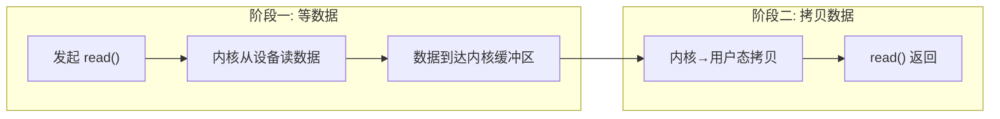

| 阶段 | 等什么 | 影响 | 时间量级（网络IO） |
|------|--------|------|-------------------|
| 阶段一 | 等设备数据到达内核 | 网络延迟决定 | ~1-100ms |
| 阶段二 | 内核拷贝到用户态 | CPU 拷贝 4KB ~几μs | 可忽略 |

### 2.4 DMA—详解

**疑惑：网卡收到数据后，CPU 是怎么把数据搬到内存的？是 CPU 一条一条 `mov` 指令搬的吗？**

如果让 CPU 逐字节搬数据，1Gbps 网卡满速时的灾难：

```
1Gbps = 125MB/s
一次 mov 指令搬 8 字节
→ 每秒需要 125MB / 8B = 1562.5 万次 mov 指令
→ CPU 什么别的事都干不了，全在搬数据
→ 这就是 PIO (Programmed I/O) 的问题
```

**DMA（Direct Memory Access）**让硬件绕过 CPU，直接把数据写入内存：

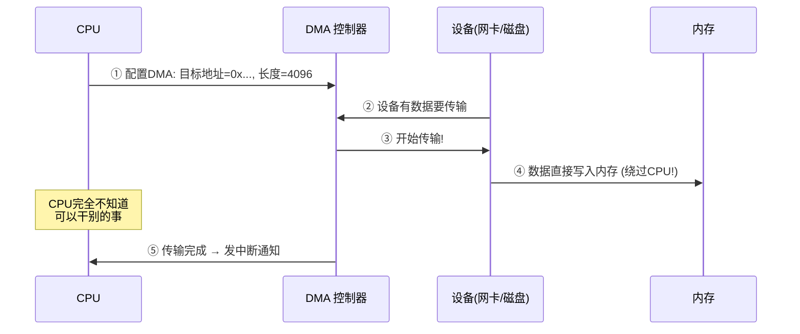

**DMA 的关键参数**：

```
DMA 描述符 (Descriptor):
┌──────────────────────┐
│ 源地址 (设备寄存器)     │
│ 目标地址 (内存物理地址) │  ← 必须是物理地址 (DMA 不经过 MMU)
│ 长度 (字节数)         │
│ 控制位 (方向/中断使能)  │
└──────────────────────┘

限制:
  1. DMA 内存必须物理连续 (不能跨页, 除非有 IOMMU)
  2. 32位设备 → 只能访问低 4GB 物理内存 (ZONE_DMA)
  3. DMA 完成后必须刷 CPU Cache
     → DMA 直接写内存, CPU 的 L1/L2 Cache 里可能是旧数据!
```

**探索**：IOMMU 如何解决 DMA 的两个限制？

```
IOMMU (Intel VT-d / AMD-Vi):
  为 DMA 提供地址转换——像 MMU 之于 CPU!
  
  DMA 控制器发出: 设备虚拟地址
  IOMMU 转换:     设备虚拟地址 → 物理地址
  → DMA 不需要物理连续内存 (IOMMU 拼出连续)
  → 32位设备也能访问高端内存
  → 虚拟机透传设备时提供隔离
```

### 2.5 中断全链路详解

**疑惑：DMA 把数据搬到内存后，怎么让等在 `read()` 上的进程知道"数据到了"？**

完整的中断→进程唤醒链路：

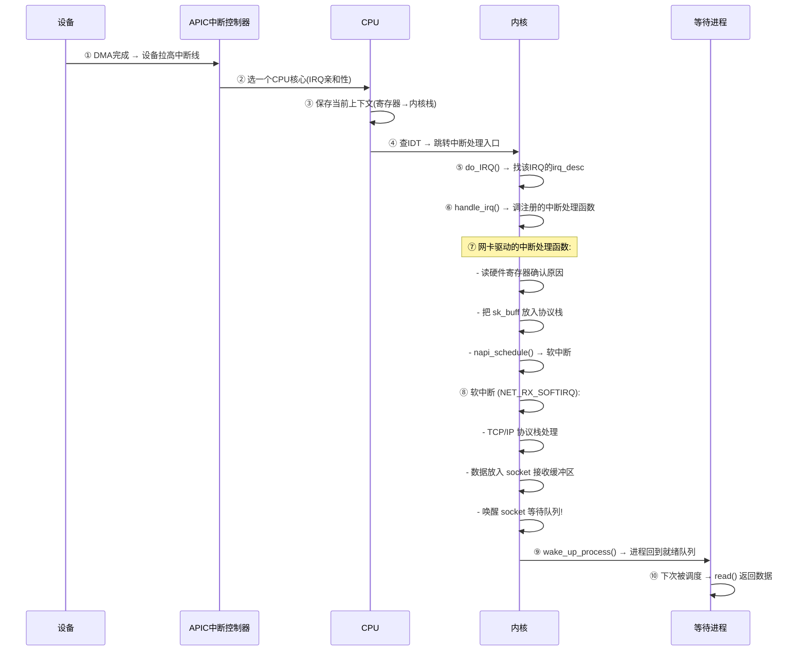

**中断的上半部与下半部**：

| | 上半部 (Top Half) | 下半部 (Bottom Half) |
|------|-----------------|-------------------|
| 执行时机 | 关中断，立即执行 | 开中断，延迟执行 |
| 做什么 | 读设备寄存器，确认中断，调度下半部 | 协议栈处理，数据拷贝 |
| 耗时要求 | 极短 (<1μs) | 可以稍长 |
| 实现 | 硬中断处理函数 | 软中断 / tasklet / workqueue |

**量化**：一次网络数据到达到进程被唤醒的总延迟：

```
DMA传输:        ~1μs (PCIe Gen3)
硬中断上半部:   ~0.5μs
软中断下半部:   ~2-5μs (TCP/IP 协议栈)
进程唤醒+调度:  ~3-10μs (取决于调度器)
──────────────────────────
 总计:          ~10-20μs (本地网络)

如果进程在 TASK_UNINTERRUPTIBLE (D状态):
  → 只有中断能唤醒, 信号不行
  → 这就是为什么 D 状态进程 kill -9 杀不掉
```


## 03.五种IO模型纵览

### 3.1 阻塞IO详解

最直观的方式：数据没准备好，进程就**阻塞**，让出 CPU，直到数据到达。

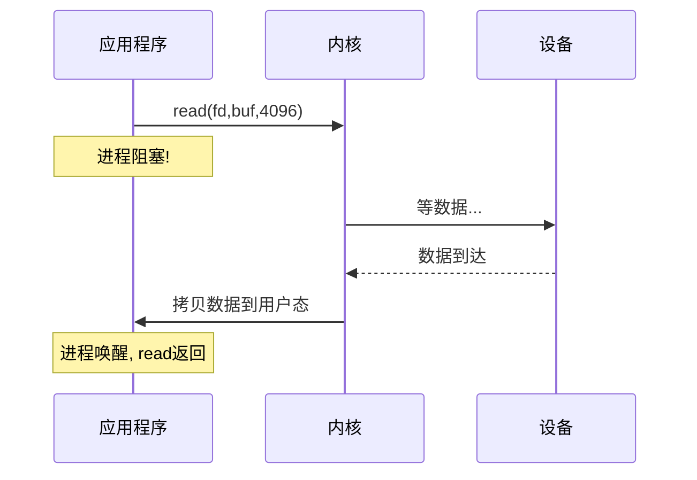

```c
// 阻塞IO——最简单
char buf[4096];
ssize_t n = read(fd, buf, sizeof(buf));  // 可能阻塞很久
// 数据就绪前，CPU可以去跑其他进程
```

**优点**：实现极简、CPU 不空转
**缺点**：一个线程只能处理一个连接——连接多了就需要大量线程

### 3.2 非阻塞IO（Non

设置 `O_NONBLOCK`，数据没准备好时 `read()` 立即返回 `-1` + `EAGAIN`，不停轮询直到数据就绪：

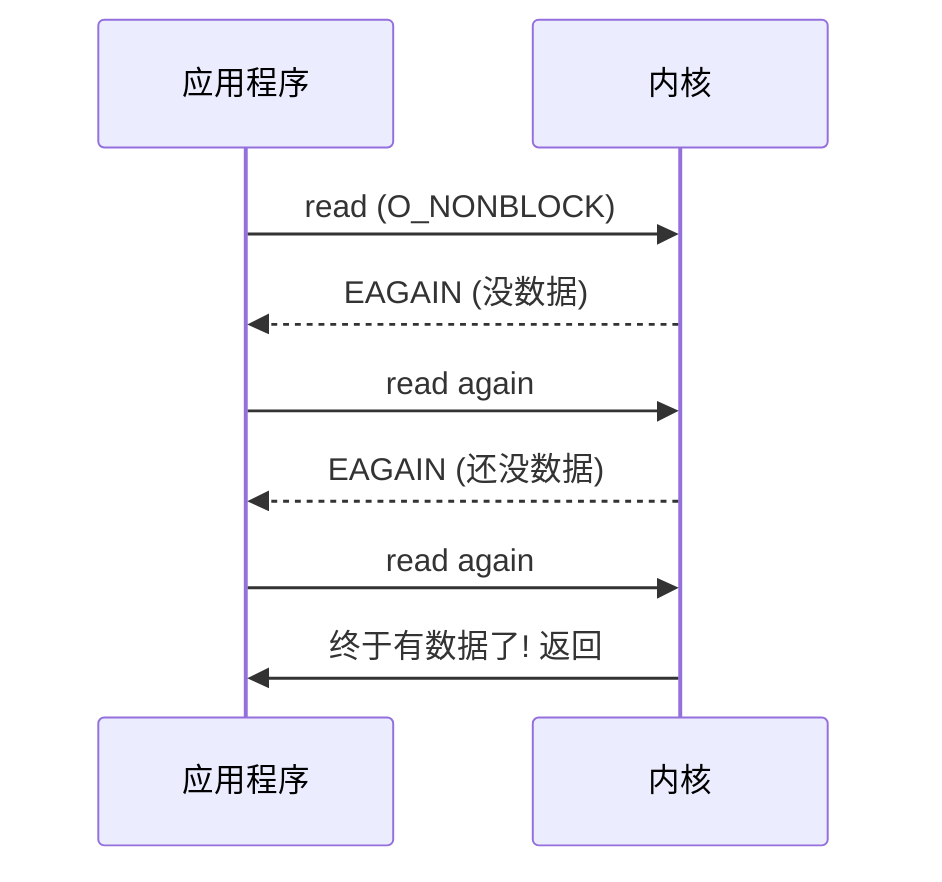

```c
// 非阻塞IO——CPU 空转!
int flags = fcntl(fd, F_GETFL);
fcntl(fd, F_SETFL, flags | O_NONBLOCK);

while (1) {
    ssize_t n = read(fd, buf, sizeof(buf));
    if (n > 0) break;       // 有数据了
    if (n == -1 && errno == EAGAIN) {
        // 没数据，继续轮询 → CPU 空转！
        continue;
    }
}
```

**优点**：一个线程可以管理多个 fd（轮询）
**缺点**：**CPU 空转**——疯狂的 `read()`→`EAGAIN`→`read()` 循环消耗大量 CPU。单独使用几乎不可行。

### 3.3 IO多路复用

用一个系统调用**同时等待多个 fd**——哪个就绪了就处理哪个。select/poll/epoll 都是这种模型：

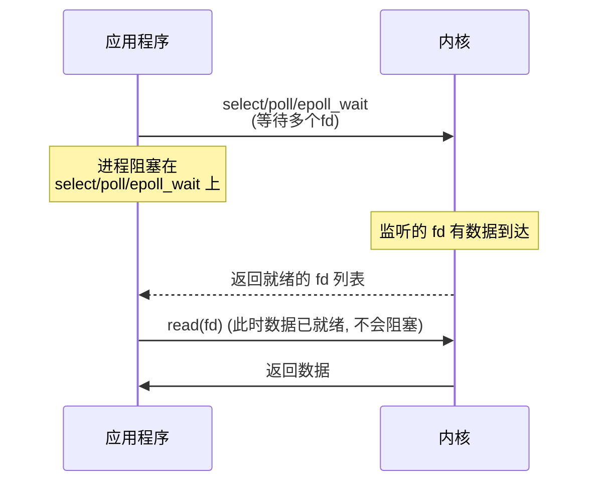

**关键**：多路复用把"等数据"和"读数据"分开了——第一阶段阻塞在 select/poll/epoll 上等任意 fd 就绪，第二阶段 read 因为数据已就绪而不会阻塞。

**优势**：一个线程同时管理成千上万个连接，哪个有数据就处理哪个。

### 3.4 信号驱动IO（Si

提前注册信号处理器，数据就绪时内核发 `SIGIO` 信号通知进程：

```c
// 注册 SIGIO 信号处理器
signal(SIGIO, handle_io);
fcntl(fd, F_SETOWN, getpid());        // 设置此 fd 的 SIGIO 发送目标
int flags = fcntl(fd, F_GETFL);
fcntl(fd, F_SETFL, flags | O_ASYNC);  // 开启异步通知

void handle_io(int sig) {
    // 收到信号 → 数据已在内核缓冲区 → 直接 read
    read(fd, buf, sizeof(buf));
}
```

**优点**：第一阶段不阻塞——进程可以干别的事，数据到了再处理
**缺点**：信号处理复杂（异步安全限制）、SIGIO 不可靠排队、**在 TCP 场景下几乎无用**（大量事件导致信号过多）

### 3.5 异步IO机制

`aio_read()` 发起读请求后**立即返回**，内核完成两阶段后通知进程：

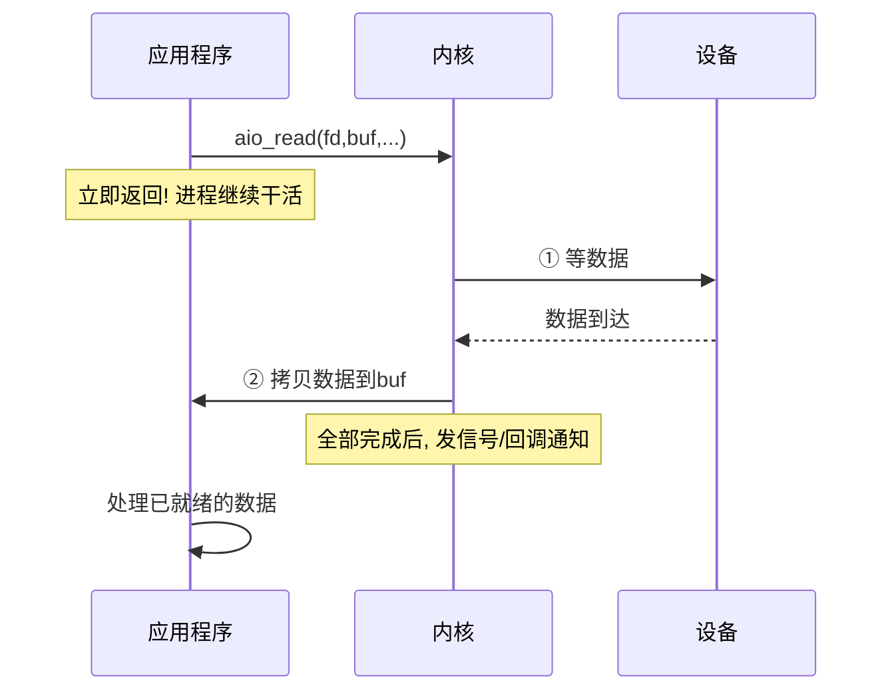

**关键区别**：异步 IO 连**第二阶段（拷贝）**都不需要进程参与。多路复用只是把"等第一阶段"变成不占用 CPU，但 `read()` 的第二阶段拷贝还是要进程自己调。异步 IO 从头到尾都不阻塞。

### 3.6 五种模型横向对比

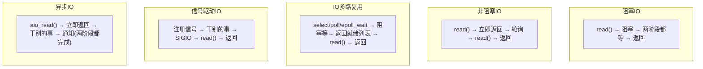

| 模型 | 第一阶段 | 第二阶段 | CPU效率 | 编程复杂度 |
|------|---------|---------|---------|-----------|
| 阻塞IO | 阻塞 | 阻塞 | ★☆☆☆☆ | ★★★★★（最简单） |
| 非阻塞IO | 轮询（CPU空转） | 不阻塞 | ★☆☆☆☆ | ★★★☆☆ |
| 多路复用 | 单线程阻塞等N个fd | 不阻塞 | ★★★★★ | ★★★☆☆ |
| 信号驱动 | 不阻塞（信号通知） | 不阻塞 | ★★★★☆ | ★☆☆☆☆（信号坑多） |
| 异步IO | 不阻塞 | 不阻塞（内核代劳） | ★★★★★ | ★★★★☆ |


## 04.select详解

### 4.1 select工作原

select 是最早的多路复用接口。它允许一个进程同时监听多个 fd 是否可读/可写/异常：

```c
int select(int nfds,           // 最大fd+1
           fd_set *readfds,    // 监听可读的fd集合
           fd_set *writefds,   // 监听可写的fd集合
           fd_set *exceptfds,  // 监听异常的fd集合
           struct timeval *timeout);  // 超时
```

`fd_set` 本质是一个**位图**（bitmap）——每个 bit 对应一个 fd：

```
fd_set (1024 bits = 128 bytes):
  bit 0   bit 1   bit 2   ...   bit 1023
  [0/1]   [0/1]   [0/1]   ...   [0/1]
   ↑
  fd=0是否在监听集合中

FD_SET(fd, &set)  → set.bit[fd] = 1   (把 fd 加入集合)
FD_ISSET(fd, &set) → set.bit[fd] == 1  (检查 fd 是否就绪)
```

### 4.2 select三个致

**缺陷一：fd 数量上限 1024**

`fd_set` 默认 1024 位（`FD_SETSIZE`）。虽然可以改宏重新编译内核，但治标不治本——更大的位图意味着每次 select 要拷贝更多数据。

```
万级连接: 10000 fd → fd_set 需要 10000 bits ≈ 1.25KB
百万级连接: 1000000 fd → fd_set ≈ 125KB → 每次 select 都要拷贝 125KB
```

**缺陷二：每次调用都要重新传入完整的 fd 集合**

select 是无状态的。内核不记得上次你监听了哪些 fd。每次 select 都要：
1. 用户态 → 内核态拷贝完整的 `fd_set`（3个方向 × N bits）
2. 内核遍历所有 bit 检查哪些就绪
3. 内核态 → 用户态拷贝结果

**缺陷三：O(n) 遍历就绪列表**

select 返回后，用户态必须遍历所有 fd 调用 `FD_ISSET(fd)` 来找就绪的：

```c
// select 返回后的处理——O(n) 遍历！
for (int fd = 0; fd <= max_fd; fd++) {
    if (FD_ISSET(fd, &readfds)) {
        // 处理就绪的 fd
        process(fd);
    }
}
// 10000 个 fd → 每次最多遍历 10000 次
// 即使只有 1 个 fd 就绪，也要遍历全部
```

### 4.3 select代码示

```c
fd_set readfds;
int max_fd = 0;

while (1) {
    FD_ZERO(&readfds);
    // 1. 把所有监听的 fd 加入集合
    for (int i = 0; i < num_clients; i++) {
        FD_SET(client_fds[i], &readfds);
        if (client_fds[i] > max_fd) max_fd = client_fds[i];
    }

    // 2. 调用 select (可能修改 readfds 为就绪子集)
    int ready = select(max_fd + 1, &readfds, NULL, NULL, NULL);

    // 3. 遍历所有 fd 找就绪的 O(n)
    for (int fd = 0; fd <= max_fd; fd++) {
        if (FD_ISSET(fd, &readfds)) {
            handle_read(fd);
        }
    }
}
```


## 05.poll详解

### 5.1 poll的改进

poll 用 `struct pollfd` 数组替代位图，**突破了 1024 上限**：

```c
struct pollfd {
    int   fd;       // 要监听的 fd
    short events;   // 关心的事件 (POLLIN | POLLOUT)
    short revents;  // 返回的就绪事件 (内核填充)
};

int poll(struct pollfd *fds, nfds_t nfds, int timeout);
```

```c
struct pollfd fds[10000];
fds[0].fd = sock1;   fds[0].events = POLLIN;
fds[1].fd = sock2;   fds[1].events = POLLIN;
// ...

int ready = poll(fds, num_fds, -1);
for (int i = 0; i < num_fds; i++) {
    if (fds[i].revents & POLLIN) {
        handle_read(fds[i].fd);  // O(n) 遍历!
    }
}
```

### 5.2 poll三个遗留问

| 问题 | select | poll |
|------|--------|------|
| fd 数量上限 | ⚠️ 1024 | ✅ 无上限 |
| 每次都要重新传入 fd 集合 | ⚠️ **是**—拷贝所有 fd_set | ⚠️ **是**—拷贝整个 pollfd 数组 |
| O(n) 遍历找就绪 fd | ⚠️ 是 | ⚠️ 是 |
| 数据结构 | 位图 | 数组 |

**poll 只是把 select 的位图换成了数组——解决了数量上限，但"每次全量拷贝 + O(n) 遍历"的根本问题没解决。**

```
10万个连接:
  poll → 每次拷贝 10万×8B=800KB → 遍历10万次
  每秒100次调用 → 80MB数据拷贝 → 1000万次无效遍历
```


## 06.epoll详解

### 6.1 epollAPI

epoll 是 Linux 2.6 引入的，专门解决 select/poll 的核心缺陷：

```c
int epoll_create1(int flags);              // ① 创建 epoll 实例
int epoll_ctl(int epfd, int op, int fd,    // ② 添加/删除/修改监听的 fd
              struct epoll_event *event);
int epoll_wait(int epfd,                   // ③ 等待就绪事件
               struct epoll_event *events,
               int maxevents, int timeout);
```

```c
// epoll 的典型用法
int epfd = epoll_create1(0);

struct epoll_event ev;
ev.events = EPOLLIN;           // 监听可读事件
ev.data.fd = listen_fd;        // 携带的上下文数据
epoll_ctl(epfd, EPOLL_CTL_ADD, listen_fd, &ev);

struct epoll_event events[64]; // 接收就绪事件的数组
while (1) {
    int n = epoll_wait(epfd, events, 64, -1);
    for (int i = 0; i < n; i++) {   // 只遍历 n 个就绪 fd！
        if (events[i].events & EPOLLIN) {
            int fd = events[i].data.fd;
            handle_read(fd);
        }
    }
}
```

### 6.2 epoll数据结构

epoll 在内核中用**两个核心数据结构**：

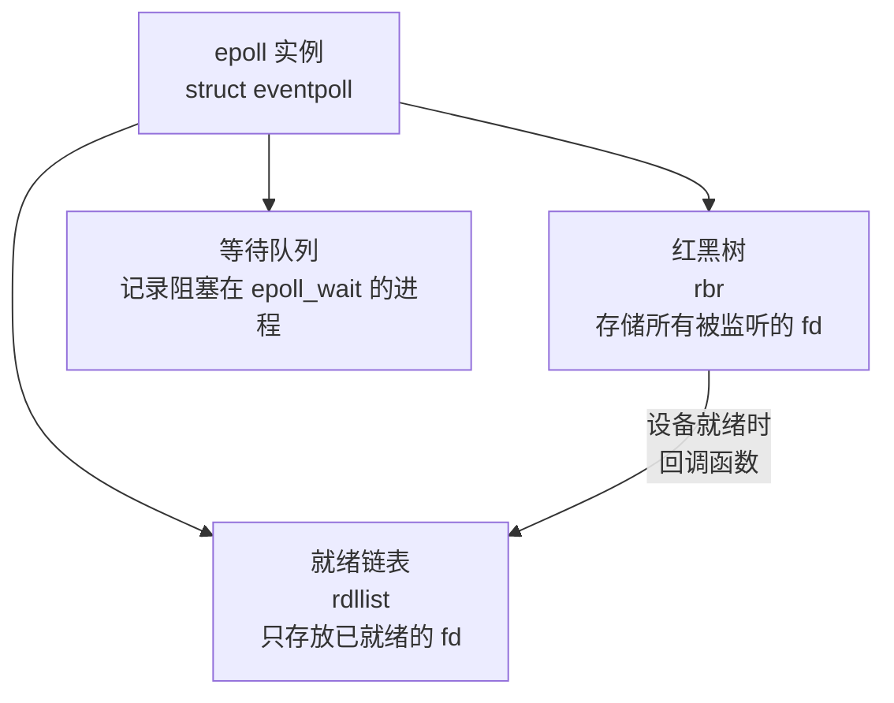

- **红黑树（rb_root）**：存储所有被监听的 fd。`epoll_ctl(ADD)` 插入 O(log n)，`epoll_ctl(DEL)` 删除 O(log n)
- **就绪链表（rdllist）**：只存已就绪的 fd。网卡收到数据 → 触发回调 → 把对应 epitem 加入 rdllist。`epoll_wait` 直接返回这个链表的内容——**O(1) 获取就绪集合**

### 6.3 epoll为什么比

用一张表把三个维度的改进说清楚：

| 维度 | select/poll | epoll | 改进倍数 |
|------|------------|-------|---------|
| fd 注册 | 每次调用都重新传入 | `epoll_ctl(ADD)` 一次性注册，**内核记住** | — |
| 传入参数拷贝 | 每次拷贝全量 fd 集合 | `epoll_wait` **不拷贝**监听集合 | **省 O(n) 拷贝** |
| 获取就绪 fd | O(n) 遍历全部 | O(1) 取就绪链表 | **省 O(n) 遍历** |
| 就绪事件返回 | 覆盖原集合 + 遍历 | 只返回就绪事件数组 | — |
| 监听 fd 数量 | select:1024; poll:无 | **无限制** | — |

```
量化: 10000 个连接，每秒 100 次事件循环

select: 10000fd × 100次 × (拷贝+遍历) ≈ 每秒30MB数据搬运 + 100万次遍历
epoll:  每次只处理实际就绪的 fd，假设10个 → 10×100=1000次遍历
        → 速度差 1000 倍
```

### 6.4 水平触发LT与边缘

epoll 有**两种触发模式**，这是初学者最容易踩坑的地方：

```
水平触发（Level-Triggered, LT, 默认）:
  只要 fd 的读缓冲区还有数据可读，epoll_wait 会持续返回该事件
  → 就像"水位计": 水位没降到零，就一直报警
  → 没读完数据? 下次 epoll_wait 还会通知你

边缘触发（Edge-Triggered, ET）:
  只在"状态变化"时通知一次——从不就绪→就绪
  → 就像"边缘检测": 只在上升沿通知一次
  → 没读完? 不关我事，不再通知了!
```

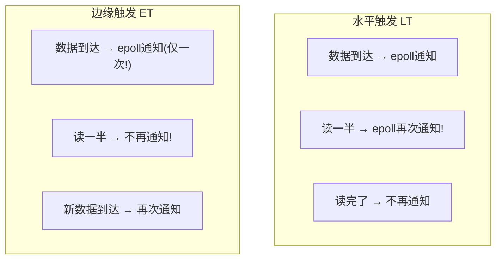

```c
// LT 模式——可以分多次读，每次读多少都行
ev.events = EPOLLIN;  // 默认 LT

// ET 模式——必须一次读完，否则就丢数据了
ev.events = EPOLLIN | EPOLLET;
```

| | LT | ET |
|------|-----|-----|
| 通知次数 | 持续通知直到读完 | 仅通知一次 |
| 读数据要求 | 可以分多次读 | **必须循环读到 EAGAIN** |
| 编程难度 | ★★☆☆☆ | ★★★★☆ |
| epoll_wait 调用次数 | 可能更多 | **更少（减少系统调用）** |
| 惊群问题 | 可能 | 可以避免 |

### 6.5 ET模式正确使用姿

**疑惑：ET 模式下如果没读完，剩下的数据是不是就丢了？**

不——数据还在内核缓冲区里，只是 epoll 不会再通知你了。所以在 ET 模式下必须**循环读直到返回 EAGAIN**：

```c
// ❌ 错误: ET 模式下只读一次
int n = read(fd, buf, sizeof(buf));
// 如果数据是 8192 字节, buf 只有 4096 → 读了 4096，剩的丢不了但不会被通知!

// ✅ 正确: ET 模式下循环读到 EAGAIN
while (1) {
    ssize_t n = read(fd, buf, sizeof(buf));
    if (n > 0) {
        // 处理数据...
    } else if (n == 0) {
        // 对端关闭连接
        break;
    } else if (n == -1) {
        if (errno == EAGAIN || errno == EWOULDBLOCK) {
            // 数据已读空，没有更多了
            break;
        }
        // 真正的错误
        break;
    }
}
```


## 07.epoll内核

### 7.1 epoll_cre

```c
// kernel/fs/eventpoll.c (简化)
SYSCALL_DEFINE1(epoll_create1, int, flags) {
    struct eventpoll *ep = kzalloc(sizeof(*ep));  // 分配 eventpoll 对象

    ep->rbr = RB_ROOT;              // 初始化红黑树根
    init_waitqueue_head(&ep->wq);   // 初始化等待队列头
    INIT_LIST_HEAD(&ep->rdllist);   // 初始化就绪链表

    int fd = anon_inode_getfd("[eventpoll]", ...); // 分配一个匿名 fd
    file->private_data = ep;        // fd 关联到 eventpoll
    return fd;
}
```

`epoll_create()` 在内核中创建一个 `struct eventpoll` 对象并返回一个 fd——所以 epoll 本身也是一个文件。

### 7.2 epoll_ctl

```c
// epoll_ctl(epfd, EPOLL_CTL_ADD, fd, &event) 的内核路径:
SYSCALL_DEFINE4(epoll_ctl, int, epfd, int, op, int, fd, ...) {
    struct eventpoll *ep = fdget(epfd)->private_data;  // 拿到 eventpoll
    struct file *tfile = fdget(fd);                      // 拿到被监听的文件

    struct epitem *epi = kmalloc(sizeof(*epi));  // 为这个 fd 创建 epitem
    epi->ffd.file = tfile;                       // 关联文件
    epi->event = event;                           // 存储事件类型

    // 1. 把 epitem 插入红黑树 O(log n)
    ep_rbtree_insert(ep, epi);

    // 2. 注册回调到目标文件的等待队列上
    // 当该 fd 的数据就绪时, 回调 ep_poll_callback 把 epitem 放入就绪链表
    init_waitqueue_func_entry(&epi->wait, ep_poll_callback);
    add_wait_queue(&tfile->f_wait, &epi->wait);  // 注册回调!
}
```

**关键**：`epoll_ctl(ADD)` 不仅往红黑树插了一个节点，还在**目标文件的等待队列上注册了一个回调函数**。这就是 epoll 能"被动接收就绪通知"的核心。

### 7.3 epoll_wai

```c
// epoll_wait(epfd, events, maxevents, timeout) 的内核路径:
SYSCALL_DEFINE4(epoll_wait, int, epfd, struct epoll_event __user *, events, ...) {
    struct eventpoll *ep = fdget(epfd)->private_data;

    // 1. 检查就绪链表是否为空
    if (list_empty(&ep->rdllist)) {
        // 就绪链表为空 → 把当前进程加入 eventpoll 的等待队列
        // 调度器切换进程 → 当前进程阻塞
        init_waitqueue_entry(&wait, current);
        add_wait_queue(&ep->wq, &wait);

        set_current_state(TASK_INTERRUPTIBLE);
        schedule();  // 放弃CPU, 等待唤醒
    }

    // 2. 被唤醒后: 从就绪链表取事件, 拷贝到用户态
    ep_send_events(ep, events, maxevents);
    // 只拷贝就绪的事件! 不是拷贝全部监听集合!
}
```

**epoll 不拷贝监听集合**——`epoll_wait` 只把**就绪链表中的事件**拷贝到用户态。10万个连接中只有5个就绪就只拷5个事件结构体，而不是10万个 fd。

### 7.4 就绪队列与回调机制

这是 epoll 高性能的**核心引擎**：

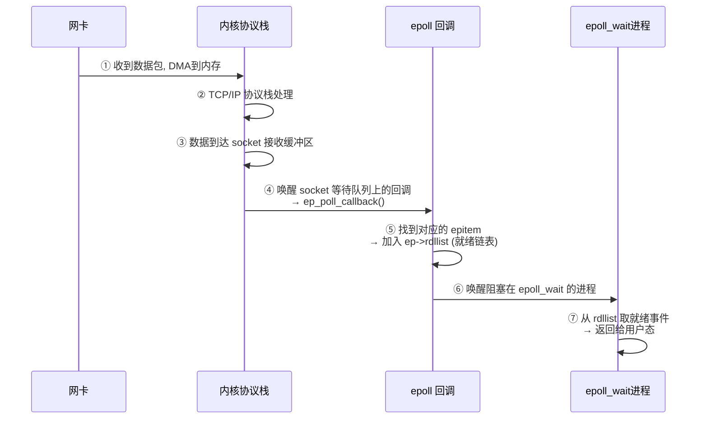

**关键要素总结**：

| 组件 | 作用 | 时间复杂度 |
|------|------|-----------|
| 红黑树 (rbr) | 存储所有被监听的 fd | 增删 O(log n) |
| 就绪链表 (rdllist) | 只存已就绪的 fd | 取就绪 O(1) |
| 回调函数 (ep_poll_callback) | 数据到达时自动把 fd 加入就绪链表 | O(1) |
| 等待队列 (wq) | 阻塞在 epoll_wait 的进程 | — |


## 08.io_uring机

### 8.1 AIO为什么被诟病

Linux 传统 AIO（`aio_read/aio_write`）有太多限制：

```
传统 AIO 的坑:
  1. 只支持 O_DIRECT（直接IO，绕过Page Cache）→ 不能用于普通文件
  2. 每次提交/完成都需要系统调用 → 开销大
  3. 接口复杂: 提交队列 + 信号/回调 + 错误处理
  4. 不支持 socket IO
→ 几乎没人用! 业界普遍用 epoll + 线程池模拟异步
```

### 8.2 io_uring核

**io_uring** (Linux 5.1+, 2019) 重新设计了异步 IO——用**共享内存环形队列**代替系统调用：

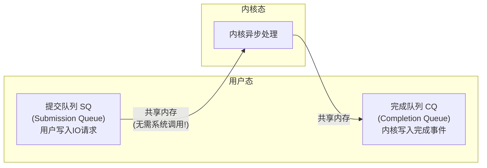

```
io_uring 的工作流程:
  1. 初始化: io_uring_setup() → 内核分配 SQ/CQ 环形缓冲区
  2. 提交:  用户态直接往 SQ 写"我要读 fd=3, 地址=0x..., 长度=4096"
             → 不需要系统调用! 只是内存写操作!
  3. 通知:   必要时调 io_uring_enter() 告诉内核有请求（或内核轮询）
  4. 完成:   内核处理完后，直接往 CQ 写完成事件
             → 用户态检查 CQ 即可，不需要系统调用!
```

```c
// io_uring 使用示例 (简化)
struct io_uring ring;
io_uring_queue_init(256, &ring, 0);  // 初始化

// 提交一个读请求到 SQ
struct io_uring_sqe *sqe = io_uring_get_sqe(&ring);
io_uring_prep_read(sqe, fd, buf, 4096, 0);
io_uring_submit(&ring);  // 提交

// 等待完成
struct io_uring_cqe *cqe;
io_uring_wait_cqe(&ring, &cqe);
printf("读取了 %d 字节\n", cqe->res);
io_uring_cqe_seen(&ring, cqe);
```

### 8.3 io_uring对

| | epoll | io_uring |
|------|-------|---------|
| 适用 IO 类型 | 网络 IO（socket） | 文件 IO + 网络 IO |
| 数据拷贝阶段 | 需要 `read()`（一次系统调用） | 内核直接写入用户态 buf |
| 通知机制 | 就绪链表 + 回调 | 共享内存完成队列 |
| 系统调用 | `epoll_wait()` + `read()`（至少 2 次） | `io_uring_enter()`（批量提交，可能 0 次） |
| 成熟度 | ✅ 二十年级别 | ⚠️ 快速迭代中（Linux 5.1+） |
| 业界采用 | Nginx, Redis, Node.js, Go NetPoller | RocksDB, ScyllaDB, ClickHouse |


## 09.IO路径对比

### 9.1 三种IO路径

IO 模型中还有一个核心选择没讲：**数据走不走 Page Cache**？

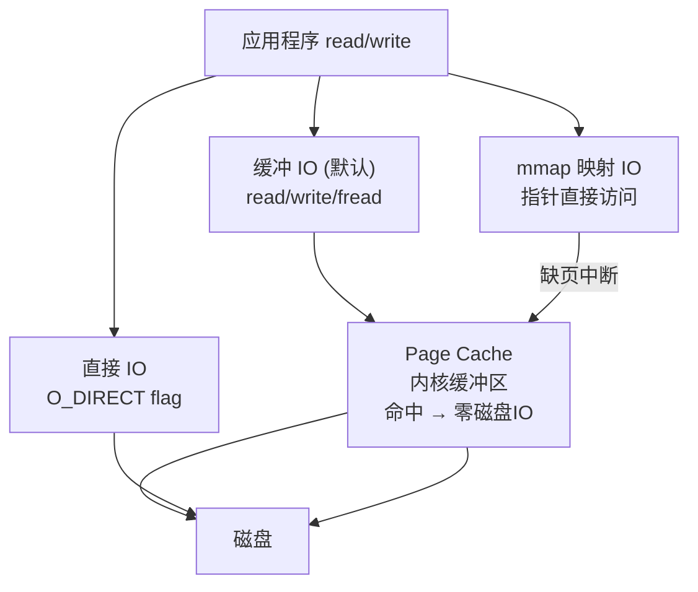

| | 缓冲 IO (默认) | 直接 IO (O_DIRECT) | mmap |
|------|-------------|-------------------|------|
| 是否用 Page Cache | ✅ 是 | ❌ 否（绕过） | ✅ 是 |
| 拷贝次数 | 2次（磁盘→内核→用户） | 1次（磁盘→用户，DMA 直接到用户态页） | 1次（磁盘→内核=用户映射页） |
| 数据一致性 | 弱（可能还在缓存中没落盘） | 强（直接到磁盘） | 中（需 msync） |
| 适用读 | ✅ 热数据加速显著 | ❌ 无缓存，总是读磁盘 | ✅ 零拷贝读 |
| 适用写 | ✅ 写缓存加速 | ✅ 数据库自己管缓存 | ⚠️ 需 msync 刷盘 |
| 对齐要求 | 无 | **必须扇区对齐**（512B/4KB） | 页对齐（4KB） |

### 9.2 谁在用直接IO？

**数据库（MySQL/PostgreSQL）通常用 `O_DIRECT`**——因为数据库自己有 Buffer Pool，不需要 OS 的 Page Cache 再来一次双缓存：

```
双缓存问题 (Buffered IO + DB Buffer Pool):
  DB 查到数据 → 从磁盘读 → 写入 DB Buffer Pool
              → 同时也写入 OS Page Cache!
  → 同样的数据在内存中存了两份 → 浪费内存
  → 如果 OS 在做页回收, 可能把热数据踢出 Page Cache
  → DB 下次查又得从磁盘读 → 性能抖动

O_DIRECT 解决:
  DB 查到数据 → 从磁盘读 → DMA 直接到 DB Buffer Pool
  → Page Cache 完全不参与 → 内存只存一份
  → DB 自己管理缓存淘汰策略, 不受 OS 回收干扰
```

### 9.3 零拷贝机制详解

**疑惑：Nginx 发送静态文件——从磁盘读到网卡发出，能不能不经过用户态？**

传统方式需要 4 次拷贝 + 4 次上下文切换：

```
传统: read() + write():
  [磁盘] →[DMA]→[Page Cache] →[CPU拷贝]→[用户buf] →[CPU拷贝]→[socket buf] →[DMA]→[网卡]
  共: 2次 DMA + 2次 CPU拷贝 + 4次上下文切换
```

**`sendfile()` 零拷贝**——直接把 Page Cache 的数据发给 socket：

```c
// sendfile 零拷贝——用户态代码极简
int fd = open("index.html", O_RDONLY);
off_t offset = 0;
sendfile(socket_fd, fd, &offset, file_size);
```

```
sendfile 数据流:
  [磁盘] →[DMA]→[Page Cache] →[DMA(gather)]→[网卡]
                                       ↑
                sendfile 内部通过 DMA Scatter/Gather:
                把 Page Cache 的物理页引用直接交给网卡 DMA
                → CPU 一次都不参与数据拷贝!
                
  共: 2次 DMA + 0次 CPU拷贝 + 2次上下文切换
```

**`splice()` 更通用的零拷贝**——在任意两个 fd 之间零拷贝传数据：

```c
// splice: pipe + socket 之间零拷贝
splice(file_fd, NULL, pipefd[1], NULL, size, SPLICE_F_MOVE);
splice(pipefd[0], NULL, socket_fd, NULL, size, SPLICE_F_MOVE);
// 数据只在 Page Cache 和 socket buffer 之间通过"页引用"传递
// 不需要拷贝页面内容!
```

**探索**：零拷贝的限制——什么时候不能零拷贝？

```
sendfile 的限制:
  1. 源必须是 mmapable 的 fd（普通文件）
  2. 目标必须是 socket fd
  3. 从 Linux 2.6.33 开始, 几乎任何 fd 都支持
  
splice 的限制:
  1. 两个 fd 中必须有一个是 pipe
  2. 适用于 pipe→socket, pipe→file 等组合
  
都不能用的情况 (需要加密/压缩):
  → Nginx sending HTTPS: 需要先加密 → 必须经用户态
  → 加密库 (OpenSSL) 需要看到明文数据才能加密
  → sendfile/splice 只能传原始数据
  → 这时候用 io_uring + 用户态加密 是更好的选择
```


## 10.磁盘IO路径

### 10.1 块层的BIO请求

当读磁盘文件时，文件系统生成 **BIO (Block I/O) 请求**，经过通用块层层层下发：

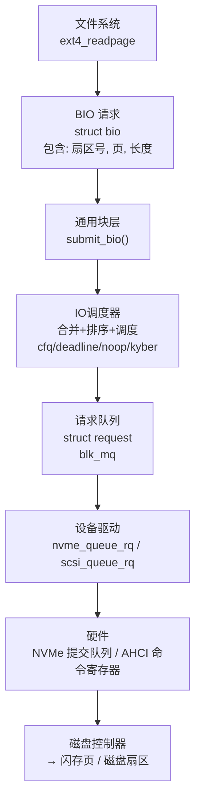

**BIO vs Request**：

```
BIO: 文件系统层发出的"我要读这些扇区"
  多个 BIO 可以被合并 → 减少磁盘操作

Request: 块层将 BIO 转换为硬件命令
  NVMe: 直接提交到硬件队列
  SCSI/SATA: 经 IO 调度器排队
```

### 10.2 IO调度策略

磁盘的物理特性（寻道、旋转）决定了顺序访问远快于随机访问。IO 调度器在中间做**重排序和合并**：

| 调度器 | 策略 | 适用 |
|--------|------|------|
| **mq-deadline** (现代默认) | 读优先 + 最后期限保证 | 通用 SSD/HDD |
| **kyber** | 基于延迟目标动态调节 | 低延迟 SSD |
| **bfq** | 按进程公平分配带宽 | 桌面/交互式 |
| **none** (NVMe 直通) | 不调度，直接下发给硬件 | NVMe SSD |

```bash
# 查看当前调度器
$ cat /sys/block/sda/queue/scheduler
[mq-deadline] kyber bfq none

# NVMe 设备通常使用 none (多队列直接硬件提交)
$ cat /sys/block/nvme0n1/queue/scheduler
[none] mq-deadline kyber bfq
```

**为什么 NVMe 不需要调度器？**

```
SATA/SAS HDD:
  单队列 → 需要调度器合并排序
  寻道 5-10ms → 顺序化访问能大幅减少寻道

NVMe SSD:
  多队列 (最多 65535 个硬件队列) → 每个 CPU 核心直连一个队列
  延迟 ~100μs → 调度器的排序收益远小于其自身开销
  → 用 none (直通) + 多队列并行
```

### 10.3 一次磁盘读完整延迟

```
从用户态 read(fd, buf, 4096) 到数据就绪的总延迟 (NVMe SSD):

VFS syscall:          ~1μs
文件系统查找:         ~2μs  (extent tree 在内存)
块层BIO构造+提交:     ~1μs
NVMe 命令提交:        ~1μs  (写硬件寄存器)
SSD控制器处理:        ~10-20μs (FTL 地址转换 + 读 NAND)
DMA 传输 4KB:         ~1μs (PCIe Gen4 ×4 = 8GB/s)
中断 + 完成处理:      ~5μs
copy_to_user:         ~1μs
─────────────────────────
 总计:                ~20-30μs

对比 HDD:
  寻道:  5-10ms (最大头!)
  旋转延迟: 2-4ms (7200RPM)
  传输:  ~0.1ms (100MB/s)
  ─────────────
  总计:  ~7-14ms  ← 慢 500 倍!
```


## 11.echo服务器

### 11.1 五种方案设计与实现

**场景**：用四种 IO 模型实现一个 echo 服务器（客户端连上来发什么回什么），压测对比。

```
需求: TCP echo 服务器, 10000 并发连接
环境: 4 核 CPU, 8GB 内存

方案A: 多进程 + 阻塞IO (fork per connection)
方案B: 多线程 + 阻塞IO (thread per connection)
方案C: 单线程 + select
方案D: 单线程 + epoll (LT)
方案E: 单线程 + epoll (ET)
```

```c
// 方案A: 多进程+阻塞IO（代码量最少但性能最差）
int server = socket(...); bind(...); listen(server, 128);
while (1) {
    int client = accept(server, NULL, NULL);
    if (fork() == 0) {
        close(server);
        while (read(client, buf, sizeof(buf)) > 0) {
            write(client, buf, n);   // echo 回去
        }
        exit(0);
    }
    close(client);
}

// 方案D: 单线程+epoll LT（均衡之选）
int epfd = epoll_create1(0);
epoll_ctl(epfd, EPOLL_CTL_ADD, server, &(struct epoll_event){
    .events = EPOLLIN, .data.fd = server
});

struct epoll_event events[256];
while (1) {
    int n = epoll_wait(epfd, events, 256, -1);
    for (int i = 0; i < n; i++) {
        if (events[i].data.fd == server) {
            int client = accept(server, NULL, NULL);
            set_nonblocking(client);
            epoll_ctl(epfd, EPOLL_CTL_ADD, client, &(struct epoll_event){
                .events = EPOLLIN | EPOLLET,  // ET 模式
                .data.fd = client
            });
        } else {
            // ET 模式必须循环读到 EAGAIN
            int fd = events[i].data.fd;
            while (1) {
                ssize_t n = read(fd, buf, sizeof(buf));
                if (n > 0) write(fd, buf, n);
                else if (n == 0) { close(fd); break; }
                else if (errno == EAGAIN) break;
            }
        }
    }
}
```

### 11.2 性能压测与对比

```
压测命令: echo 请求（每连接每秒发1条, 每条100字节）

10000 并发连接 × 1 req/s:
  方案A (多进程):    创建10000进程失败 (内存不足)
  方案B (多线程):    勉强运行，CPU 40%, 内存 5GB (线程栈)
  方案C (select):    fd数量超1024, 需要分批, CPU 60%
  方案D (epoll LT):  CPU 3%, 内存 200MB ✅
  方案E (epoll ET):  CPU 2%, 内存 200MB ✅

50000 并发连接:
  方案D (epoll LT): CPU 8%, 内存 800MB
  方案E (epoll ET): CPU 5%, 内存 800MB (epoll_wait调用更少)

100000 并发连接:
  方案E (epoll ET): CPU 12%, 内存 1.5GB ✅ 依然健壮
```

### 11.3 知识图谱回顾

```mermaid
flowchart TB
    ROOT[IO模型]

    ROOT --> A[五种IO模型]
    ROOT --> B[多路复用深度]
    ROOT --> C[内核实现]
    ROOT --> D[下一代]

    A --> A1["阻塞IO: 最简单 两阶段阻塞"]
    A --> A2["非阻塞IO: 轮询 空转CPU"]
    A --> A3["多路复用: select/poll/epoll"]
    A --> A4["信号驱动: SIGIO通知"]
    A --> A5["异步IO: aio_read全不阻塞"]

    B --> B1["select: 位图 1024上限"]
    B --> B2["poll: pollfd数组 无上限"]
    B --> B3["epoll: 红黑树+就绪链表"]

    C --> C1["epoll_create: eventpoll对象"]
    C --> C2["epoll_ctl: 红黑树插入+回调注册"]
    C --> C3["epoll_wait: 取就绪链表+拷贝"]
    C --> C4["回调: ep_poll_callback→rdllist"]

    D --> D1["AIO 的失败教训"]
    D --> D2["io_uring: 共享内存环形队列"]
    D --> D3["批量提交 零系统调用"]

    ROOT --> FINAL{选型}
    FINAL -->|简单场景| BLK[阻塞IO]
    FINAL -->|高并发网络| EPL[epoll]
    FINAL -->|高性能存储| IO[io_uring]
```

**最终方法论**——面对 IO 模型选型三问：

1. **并发连接数**：<100 用阻塞IO也无妨，>1000 必须用多路复用
2. **IO 类型**：网络IO用 epoll；文件IO追求极致用 io_uring
3. **编程复杂度**：LT 比 ET 简单（不需要循环读），ET 效率更高（减少系统调用）


## 12.思考题与作业

### 12.1 基础思考题目

1. **IO两阶段**：画出一次 `read(fd,buf,4096)` 的两个阶段。分别说明在阻塞IO、非阻塞IO、多路复用中，哪个阶段阻塞、哪个不阻塞。

2. **select 位图**：`fd_set` 是 1024 位的位图。假设 fd=5、fd=50、fd=500 同时就绪，`select` 返回后用户态需要遍历多少次才能全部找到？删掉 fd=50 时 `FD_CLR` 做了什么？

3. **LT vs ET**：用文字描述 LT 和 ET 的区别。假设 socket 收到 8192 字节数据，用户缓冲区只有 4096 字节——LT 和 ET 分别会发生什么？第二次 `epoll_wait` 行为有何不同？

4. **epoll 数据结构**：画出 epoll 的红黑树 + 就绪链表的结构。`epoll_ctl(ADD)` 在内核里做了什么？为什么"回调注册"是关键？

5. **io_uring 基本概念**：SQ 和 CQ 分别是什么？为什么 io_uring 可以做到"零系统调用"？

### 12.2 进阶思考题目

1. **1.1 节复盘**：老刘的 select 服务崩溃，如果用 epoll ET 模式改写，除了换接口还需要注意什么？写出必须使用非阻塞 fd 和循环读的原因。

2. **epoll 惊群问题**：多个进程/线程同时 `epoll_wait` 同一个 epfd，一个连接就绪时可能唤醒所有等待者——如何用 `EPOLLEXCLUSIVE` 解决？这和 Nginx 的 `accept_mutex` 有什么关系？

3. **Go NetPoller**：Go 的 `net.Conn.Read()` 看起来是阻塞的，底层却用了 epoll。一个 goroutine `Read()` 阻塞时到底阻塞在哪里？G-M-P 怎么配合 NetPoller 实现"阻塞但不浪费线程"？

4. **Redis 为什么用 epoll**：Redis 单线程+epoll 的处理模型，在处理一个慢查询 (`KEYS *`) 时为什么整个服务会卡住？这和 IO 模型有什么关系？Redis 6.0 引入多线程 IO 是怎么解决的？

5. **零拷贝**：`sendfile()` 和 `splice()` 是怎么实现"不经过用户态"的 IO 的？它们和 epoll 的组合在 Nginx 中是怎么用的？和 io_uring 的零拷贝有什么区别？

### 12.3 动手实践作业

**作业一（必做）**：分别用 select、poll、epoll 实现一个 echo 服务器，用 `ab` 或 `wrk` 压测对比。

```bash
# 10000 并发连接, 每个连接发 10 条消息
wrk -t4 -c10000 -d30s http://localhost:8080/
# 对比三种实现的 CPU%、内存、P99 延迟
```

**作业二（选做）**：实现 epoll ET 模式下的 echo 服务器，注意循环读。对比 LT 和 ET 模式下 `epoll_wait` 的调用次数。

**作业三（选做）**：用 `strace -e epoll_create,epoll_ctl,epoll_wait` 追踪一个 epoll 程序的系统调用。观察 `epoll_wait` 返回时实际拷贝了多少个事件。

**作业四（架构思考）**：分析你项目中最"IO密集"的服务——当前用的什么 IO 模型？这个选择合适吗？如果要支持 10 万并发连接，需要做哪些改造？