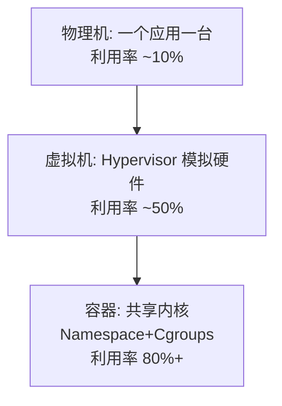
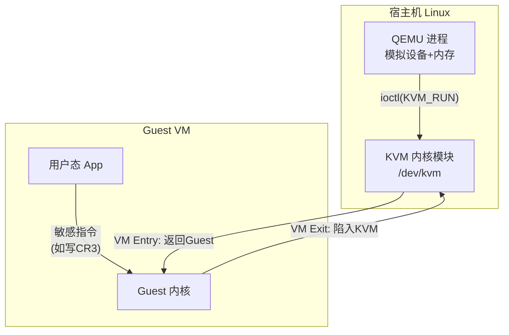
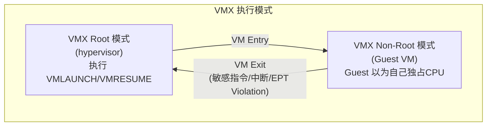
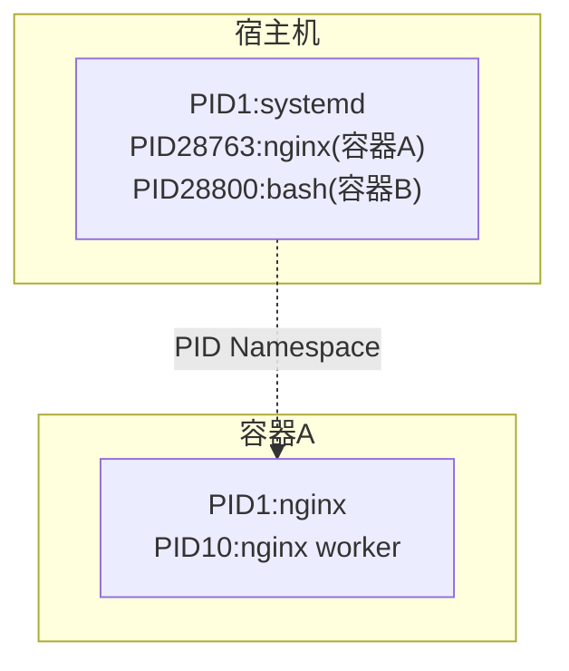
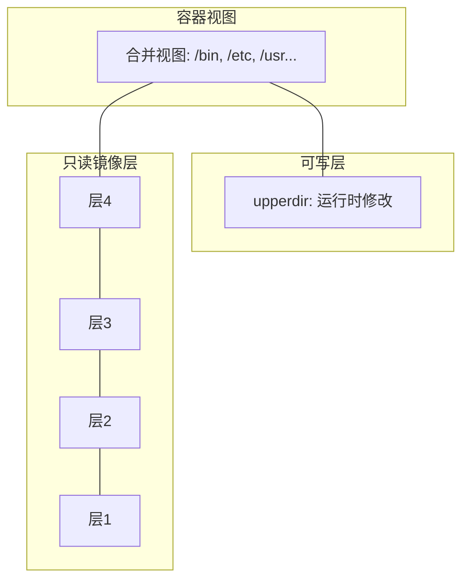
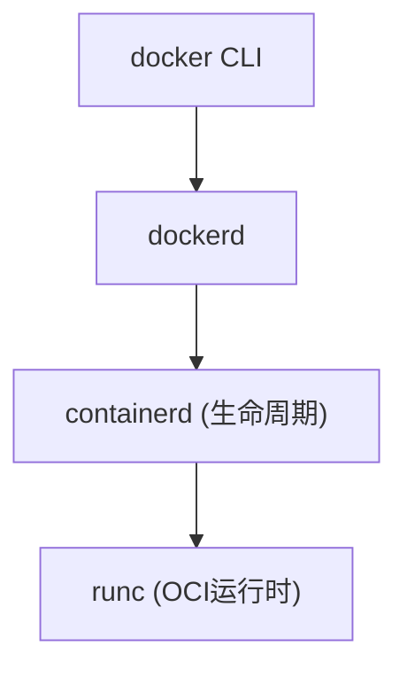
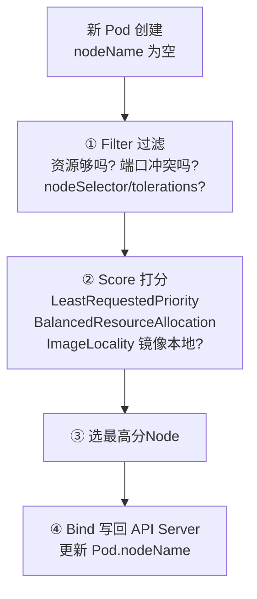
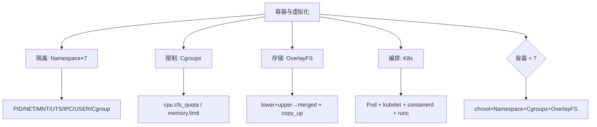

# 容器与虚拟化

> Namespace/Cgroups、从chroot到Docker、K8s基础——容器本质是OS特性

#### 目录介绍
- [01.工作案例引入](#01工作案例引入)
  - [1.1 Docker容器内存泄漏把整个node拖垮了](#11-docker容器内存泄漏把整个node拖垮了)
  - [1.2 为什么要学容器与虚拟化](#12-为什么要学容器与虚拟化)
- [02.虚拟化概述](#02虚拟化概述)
  - [2.1 什么是虚拟化](#21-什么是虚拟化)
  - [2.2 从物理机到虚拟机到容器](#22-从物理机到虚拟机到容器)
  - [2.3 虚拟机 vs 容器——本质区别](#23-虚拟机-vs-容器本质区别)
- [03.从chroot说起](#03从chroot说起)
  - [3.1 chroot——文件系统隔离的雏形](#31-chroot文件系统隔离的雏形)
  - [3.2 chroot为什么不足以做容器](#32-chroot为什么不足以做容器)
- [04.Linux Namespace——隔离的七把锁](#04linux-namespace隔离的七把锁)
  - [4.1 Namespace是什么](#41-namespace是什么)
  - [4.2 PID Namespace——进程隔离](#42-pid-namespace进程隔离)
  - [4.3 NET Namespace——网络隔离](#43-net-namespace网络隔离)
  - [4.4 MNT Namespace——挂载点隔离](#44-mnt-namespace挂载点隔离)
  - [4.5 UTS/IPC/USER/Cgroup Namespace](#45-utsipcusercgroup-namespace)
  - [4.6 用unshare手动创建一个容器](#46-用unshare手动创建一个容器)
- [05.Cgroups——资源限制的盾牌](#05cgroups资源限制的盾牌)
  - [5.1 Cgroups是什么](#51-cgroups是什么)
  - [5.2 Cgroups v1 vs v2](#52-cgroups-v1-vs-v2)
  - [5.3 CPU限制实战](#53-cpu限制实战)
  - [5.4 内存限制实战](#54-内存限制实战)
- [06.联合文件系统OverlayFS](#06联合文件系统overlayfs)
  - [6.1 容器镜像为什么分层](#61-容器镜像为什么分层)
  - [6.2 OverlayFS的工作原理](#62-overlayfs的工作原理)
  - [6.3 镜像的写时复制](#63-镜像的写时复制)
- [07.Docker架构与docker run全流程](#07docker架构与docker-run全流程)
  - [7.1 Docker的架构组件](#71-docker的架构组件)
  - [7.2 docker run背后发生了什么](#72-docker-run背后发生了什么)
  - [7.3 runc——OCI容器运行时](#73-runcoci容器运行时)
- [08.K8s基础](#08k8s基础)
  - [8.1 K8s为什么需要](#81-k8s为什么需要)
  - [8.2 Pod——最小的调度单位](#82-pod最小的调度单位)
  - [8.3 核心组件](#83-核心组件)
- [09.综合案例排查容器内存问题](#09综合案例排查容器内存问题)
  - [9.1 场景与分析](#91-场景与分析)
  - [9.2 知识图谱回顾](#92-知识图谱回顾)
- [10.思考题与作业](#10思考题与作业)


## 01.工作案例引入

### 1.1 Docker容器内存泄漏把整个node拖垮了

**场景**：小陈是公司 K8s 集群管理员。某天凌晨告警：**一个 Node 上所有 Pod 被驱逐**，包括核心 Redis。

```bash
$ kubectl describe node worker-3
Conditions:
  MemoryPressure   True    ← 内存压力！

$ kubectl top node worker-3
NAME       CPU(cores)   MEMORY(bytes)   MEMORY%
worker-3   4500m        37Gi            60%
```

**疑惑**：内存才 60% 就驱逐了？查下去发现 Pod 的 memory limit 是 48GB，实际用 30GB。但 **kubelet 驱逐看的是节点可用内存**——Pod 生前 mmap 的文件占据了大量 Page Cache，驱逐后也没立刻释放。

**追问链**：

- "容器的 limit 和 Node 内存是什么关系？" → 容器 limit 是 Cgroups 限制；Node 内存是实际物理内存，两者独立
- "那 Cgroups 到底干了什么？" → Cgroups 限制资源（CPU/内存/IO）；Namespace 让进程以为自己独占系统——**容器 = Namespace（隔离）+ Cgroups（限制）**
- "VM 和容器的隔离性差在哪？" → VM 有自己独立内核；容器共享宿主机内核，隔离依赖 Namespace——bug 可能导致容器逃逸
- "容器逃逸是什么？" → 容器进程因内核漏洞拿到宿主机 root——因为共享内核，突破 Namespace 就拿到"上帝视角"

### 1.2 为什么要学容器与虚拟化



容器不是新技术——它是 Linux 内核已有特性的组合。本章拆开容器的三个基石：

- Namespace 怎么"骗"进程让它独占系统？七种各隔离什么？
- Cgroups 怎么"管"资源？CPU 和内存限制怎么生效？
- OverlayFS 为什么能秒级启动？分层怎么工作？


## 02.虚拟化概述

### 2.1 什么是虚拟化

虚拟化的本质：**在物理资源之上创建抽象的虚拟资源**——让多个租户共享硬件但互不感知。

| 层次 | 抽象什么 | 代表 |
|------|---------|------|
| 硬件虚拟化 | CPU/内存/IO | KVM, VMware ESXi |
| OS 虚拟化 | 内核资源 | **Namespace + Cgroups（容器）** |
| 语言级 | 运行时 | JVM, WebAssembly |

### 2.2 从物理机到容器

```
物理机: App们共享一个OS → 资源争抢、依赖冲突

虚拟机: 每个VM独立OS → 隔离完美, 但开销大(~100MB+内核)

容器:   多个容器共享一个内核 → OS只跑一份
        Namespace隔离进程/网络/文件
        Cgroups限制资源
        → 隔离性接近VM, 开销接近原生进程
```

### 2.3 虚拟机 vs 容器——本质区别

| | 虚拟机 (KVM) | 容器 (Docker) |
|------|------------|-------------|
| 隔离级别 | **硬件级** | **OS 级** |
| 内核 | 每个VM独有(~100MB+) | **共享宿主机内核** |
| 启动时间 | 30秒~分钟 | **毫秒~秒** |
| 密度 | 一台跑几十个 | 一台跑几百上千 |
| 安全性 | ★★★★★ | ★★★☆☆ |
| CPU 损失 | ~2-5% | **~0%（原生）** |

### 2.4 KVM——硬件辅助虚拟化原理

**疑惑：虚拟机怎么在物理 CPU 上执行"假的" CPU 指令？**

KVM（Kernel-based Virtual Machine）利用 Intel VT-x / AMD-V 硬件特性实现 CPU 虚拟化：



**虚拟机执行循环（vCPU 的核心）**：

```
while (vm_running) {
    ioctl(vcpu_fd, KVM_RUN, 0);    // 进入Guest模式

    // CPU在Guest模式下执行, 直到遇到:
    // ① HLT指令 (Guest空闲) → VM Exit
    // ② 访问设备IO端口 → VM Exit → QEMU模拟
    // ③ EPT Violation (缺页) → VM Exit → KVM处理

    switch (exit_reason) {
    case EXIT_REASON_IO_INSTRUCTION:
        qemu_emulate_io(vcpu);     // QEMU模拟IO
        break;
    case EXIT_REASON_EPT_VIOLATION:
        kvm_handle_page_fault(vcpu); // KVM处理缺页
        break;
    }
}
```

**EPT（Extended Page Tables）——内存虚拟化**：

```
没有 EPT (影子页表):
  Guest虚拟地址 → Guest物理地址 → Host物理地址
  每次 Guest 改页表都要 VM Exit → 极慢

有 EPT (硬件支持):
  Guest虚拟地址 →[Guest页表]→ Guest物理地址 →[EPT]→ Host物理地址
  Guest改自己的页表不需要VM Exit!
  EPT由KVM管理, 只有真正访问未映射的内存才VM Exit
```

**探索**：为什么 VM 密度不如容器？

```
每个VM独占:
  → QEMU进程本身 ~30MB
  → Guest内核 ~100MB+
  → 独立的页表 (EPT) ~10-20MB
  → 总计: ~150MB/VM 纯开销

容器:
  → 无额外内核 → 0MB
  → 无额外页表 → 0MB
  → 共享宿主机内存管理

这就是为什么 64GB 机器:
  VM:  约400个
  容器: 约数千个 (瓶颈在网络端口, 不是内存)
```

### 2.4 KVM硬件辅助虚拟化——VMX与EPT

**疑惑：KVM 能把 CPU、内存、IO 都"虚拟"出来——在硬件层面到底怎么做到的？**

KVM 依赖 Intel VT-x（VMX）/ AMD-V 的硬件虚拟化支持。核心机制是 **VMX root / non-root 模式** 和 **EPT 二级页表**：



**Guest 物理内存如何隔离——EPT 二级页表**：

```
普通进程:  虚拟地址 VA → 页表(CR3) → 物理地址 PA

VM Guest:  Guest VA → Guest PT (gCR3) → Guest PA (gPA)
                         ↓ EPT 转换
                       Host PA (hPA) ← 真实的物理内存

EPT (Extended Page Table):
  Guest 的"物理内存"实际上是 Host 的一个大 mmap 区域
  Guest PA → EPT 页表 → Host PA

  Guest 访问自己以为的"物理地址 0x1000":
    → MMU 做两次转换: gVA→gPA + gPA→hPA
    → 如果 gPA 没有对应的 hPA → EPT Violation → VM Exit → KVM 处理
```

**IO 虚拟化——VT-d (IOMMU)**：

```
未虚拟化:  设备 DMA → 直接写到物理内存 (可能写到其他 VM 的内存!)

VT-d 开启: 设备 DMA → IOMMU 页表转换 → 只能写到自己的 hPA 区域
           → 设备透传 (PCI Passthrough) 的安全基石
```

**探索：为什么容器的 CPU 损耗是 0%？**

```
KVM: 每条指令直接在物理 CPU 执行，但:
  - VM Exit 发生时需要保存/恢复 VMCS (虚拟化控制结构) → ~500-2000 周期
  - 频繁的 EPT Violation 触发 VM Exit
  → 平均损失 2-5%

容器: 进程就是普通 Linux 进程 (task_struct)
  - 没有任何 VM Exit
  - Namespace 只是限制了进程"能看到什么"
  - Cgroups 只是在调度和内存分配时加了一道检查
  → 0% CPU 损失
```


## 03.从chroot说起

### 3.1 chroot——文件系统隔离的雏形

1979 年的 `chroot` 把进程根目录改到子目录，看不到外面：

```bash
mkdir -p /tmp/miniroot/{bin,lib64}
cp /bin/bash /tmp/miniroot/bin/
sudo chroot /tmp/miniroot /bin/bash
# ls / → 只有 bin lib64，看不到真正的/
```

### 3.2 chroot为什么不足以做容器

```
chroot 的致命缺陷:
  1. 只隔离文件系统——进程、网络还是共享的
  2. 没有资源限制
  3. root 可逃逸 (mknod+mount)

真正的容器 = chroot（文件隔离）
            + Namespace（进程/网络/用户隔离）×7
            + Cgroups（资源限制）
            + OverlayFS（镜像分层）
            + Seccomp/Capability（安全增强）
```


## 04.Linux Namespace——隔离的七把锁

### 4.1 Namespace是什么

Namespace 让一组进程以为某些系统资源是"自己独有的"：

| Namespace | 创建标志 | 隔离内容 | 容器内看到 |
|-----------|---------|---------|-----------|
| **PID** | `CLONE_NEWPID` | 进程ID | PID=1 |
| **NET** | `CLONE_NEWNET` | 网卡/路由/iptables | 独立 eth0, lo |
| **MNT** | `CLONE_NEWNS` | 挂载点 | 自己的 /proc, /sys |
| **UTS** | `CLONE_NEWUTS` | 主机名/域名 | 独立 hostname |
| **IPC** | `CLONE_NEWIPC` | 信号量/消息队列 | 独立 IPC |
| **USER** | `CLONE_NEWUSER` | UID/GID | 容器 root = 宿主机普通用户 |
| **Cgroup** | `CLONE_NEWCGROUP` | cgroup 视图 | 只能看自己的子树 |

### 4.2 PID Namespace——进程隔离

容器内 PID=1 的 nginx，宿主机上 PID 可能是 28763：



### 4.3 NET Namespace——网络隔离

每个容器独立网络栈，通过 veth pair 连到 docker0 网桥：

```
容器A(172.17.0.2)          容器B(172.17.0.3)
    │ eth0(veth)               │ eth0(veth)
    └──── docker0 网桥 ────────┘
              │ NAT
         宿主机 eth0 → 公网
```

```bash
$ docker exec my-container ip addr
1: lo: <LOOPBACK>
2: eth0@if45: inet 172.17.0.3/16
```

### 4.4 MNT Namespace——挂载点隔离

容器有独立的挂载视图——`/proc`、`/sys` 被替换为容器专属：

```bash
$ docker exec my-container cat /proc/mounts | head -3
overlay / overlay rw,lowerdir=/var/lib/docker/overlay2/...
proc /proc proc rw
tmpfs /sys/fs/cgroup tmpfs rw
```

### 4.5 UTS/IPC/USER/Cgroup Namespace

```bash
# UTS: 独立主机名
$ docker exec my-container hostname    # a1b2c3d4e5f6

# USER: 容器内 root → 宿主机普通用户 (开启 userns-remap 时)
$ docker run --user 1000:1000 ubuntu id
uid=1000 gid=1000
```

### 4.6 用unshare手动创建一个容器

不用 Docker，纯 Linux 命令创建容器：

```bash
sudo unshare \
    --pid --fork --mount-proc \    # PID隔离+挂载/proc
    --net --uts --ipc \            # 网络+主机名+IPC
    --mount \                      # 挂载隔离
    /bin/bash

# 进入后:
bash# echo $$        # PID=1
bash# ip addr        # 只有 lo
bash# hostname isolated-container
bash# mount -t proc proc /proc
bash# ps aux          # 只看到自己和子进程
PID   USER     COMMAND
1     root     /bin/bash
```

**这就是容器的本质——Namespace 的组合。Docker 只是自动化了这个过程。**

### 4.7 Namespace的内核实现——nsproxy结构体

**疑惑：内核怎么知道一个进程属于哪些 Namespace？**

每个 `task_struct` 中有 `nsproxy` 指针，指向该进程所属的所有 Namespace 对象：

```c
// kernel/nsproxy.c (简化)
struct nsproxy {
    struct uts_namespace  *uts_ns;   // 主机名
    struct ipc_namespace  *ipc_ns;   // 信号量/消息队列
    struct mnt_namespace  *mnt_ns;   // 挂载点
    struct pid_namespace  *pid_ns_for_children; // 子进程的PID空间
    struct net            *net_ns;   // 网络栈
    struct time_namespace *time_ns;  // 时钟
    struct cgroup_namespace *cgroup_ns;
};

// fork/clone 时决定是否复制或创建新 Namespace
struct nsproxy *new_nsproxy = old;
if (flags & CLONE_NEWNS)  new_nsproxy->mnt_ns = clone_mnt_ns();
if (flags & CLONE_NEWNET) new_nsproxy->net_ns  = clone_net_ns();
if (flags & CLONE_NEWPID) new_nsproxy->pid_ns  = create_pid_ns();
// ...
```

**PID Namespace的树状结构**：

```
Initial PID Namespace (宿主机):
  pid_ns->level = 0
  pid_ns->parent = NULL
  ├── PID 1: systemd
  │   └── child PID NS (level=1):
  │       ├── PID 1: container_init
  │       │   └── child PID NS (level=2):
  │       │       └── PID 1: docker's init (tini)
  │       │           └── PID 2: app

/proc/<pid>/status 中的 NSpid 字段:
  NSpid: 1   2    ← level=0看到PID=1, level=1看到PID=2
```

探索：一个进程能看到"祖先Namespace"但看不到"兄弟Namespace"的进程。

### 4.8 容器安全——Capability, Seccomp, AppArmor

**容器逃逸的三道防线**：

```
1. Capability(权能): 把 root 的超能力拆成 ~40 个独立开关
   → 容器默认丢弃所有危险权能(CAP_SYS_ADMIN, CAP_NET_RAW...)
   → 容器内 root 不能加载内核模块、不能改内核参数

2. Seccomp(安全计算): 限制进程能调用的系统调用
   → Docker 默认白名单 ~300 个 syscall
   → 禁止 reboot, kexec_load, mount(部分)...

3. AppArmor/SELinux: 路径级别的访问控制
   → 容器进程只能访问白名单路径
   → /proc/sysrq-trigger → deny
```

```json
// Docker 默认的 Seccomp 配置片段
{
  "defaultAction": "SCMP_ACT_ALLOW",
  "syscalls": [
    { "names": ["reboot"],         "action": "SCMP_ACT_ERRNO" },
    { "names": ["kexec_load"],     "action": "SCMP_ACT_ERRNO" },
    { "names": ["bpf"],            "action": "SCMP_ACT_ERRNO" },
    { "names": ["perf_event_open"],"action": "SCMP_ACT_ERRNO" }
  ]
}
// 这些syscall在容器内调用 → 直接返回错误, 不执行!
```

### 4.7 容器安全——Capability与Seccomp

**疑惑：容器内 `root` 能 `insmod`、能 `mount`、能改内核参数吗？为什么比宿主机 root 弱？**

因为容器启动时被**剥夺了大部分 Linux Capability**——把 root 的"超级权力"拆成了 40+ 个细粒度权限：

| Capability | 作用 | 容器默认？ |
|-----------|------|----------|
| `CAP_SYS_ADMIN` | mount/insmod/swapon... | ❌ 默认剥离 |
| `CAP_NET_RAW` | 原始 socket (ping) | ❌ 默认剥离 |
| `CAP_SYS_PTRACE` | ptrace 其他进程 | ❌ 默认剥离 |
| `CAP_NET_BIND_SERVICE` | 绑定 1024 以下端口 | ✅ 保留 |
| `CAP_CHOWN` | 改文件所有者 | ✅ 保留 |

```bash
# 查看容器拥有的 Capability
$ docker run --rm alpine cat /proc/1/status | grep CapEff
CapEff: 00000000a80425fb   # 位图只有14个cap
# 对比宿主机 root:
$ cat /proc/1/status | grep CapEff
CapEff: 0000003fffffffff   # 全部40个cap都有!

# 给容器额外的 Capability
$ docker run --cap-add=NET_RAW alpine ping 8.8.8.8   # 允许 raw socket
$ docker run --privileged alpine ...                   # 所有cap都授予!
```

**Seccomp（Secure Computing Mode）** 进一步限制容器能调用的系统调用：

```json
// Docker 默认 seccomp 配置文件 (简化)
{
  "defaultAction": "SCMP_ACT_ERRNO",  // 默认拒绝
  "syscalls": [
    { "names": ["read","write","open","close","fstat",...], "action": "ALLOW" },
    // 阻断了: ptrace, mount, kexec_load, bpf, ...
  ]
}
```

```
Capability:    控制"谁能做" → root 的权限拆分
Seccomp:       控制"能怎么调" → 限制系统调用白名单
AppArmor/SELinux: 控制"能访问什么" → 文件路径级别的访问控制

三者叠加 = 容器安全的三层防线
```


## 05.Cgroups——资源限制的盾牌

### 5.1 Cgroups是什么

Cgroups 限制一组进程能使用的 CPU、内存、IO：

```
/sys/fs/cgroup/
├── cpu/
│   └── kubepods/         ← K8s Pod
│       └── pod-xxx/      ← 每 Pod
│           ├── container-1/  ← 容器1
│           └── container-2/  ← 容器2
└── memory/
    └── kubepods/...
```

### 5.2 Cgroups v1 vs v2

| | v1 | v2 |
|------|-----|-----|
| 结构 | 每个子系统独立目录 | **统一层级** |
| 线程控制 | ❌ | ✅ |
| 示例路径 | `/sys/fs/cgroup/cpu/docker/` | `/sys/fs/cgroup/system.slice/docker-xxx/` |
| 推荐 | ⚠️ 淘汰 | ✅ 现代标准 |

```bash
$ stat -fc %T /sys/fs/cgroup
cgroup2fs     # v2
tmpfs         # v1
```

### 5.3 CPU限制实战

```bash
# 限制 CPU 使用：给 0.5 个核（50%）
sudo mkdir /sys/fs/cgroup/cpu/mygroup
echo 50000 > /sys/fs/cgroup/cpu/mygroup/cpu.cfs_quota_us
echo 100000 > /sys/fs/cgroup/cpu/mygroup/cpu.cfs_period_us
# quota/period = 50000/100000 = 50%

echo $$ > /sys/fs/cgroup/cpu/mygroup/cgroup.procs
stress --cpu 4 &       # 启动4个CPU密集型任务
top                     # CPU限制在50%!
```

### 5.4 内存限制实战

```bash
sudo mkdir /sys/fs/cgroup/memory/mygroup
echo 268435456 > /sys/fs/cgroup/memory/mygroup/memory.limit_in_bytes
echo $$ > /sys/fs/cgroup/memory/mygroup/cgroup.procs

stress --vm 1 --vm-bytes 300M   # 超过256MB → OOM Killer!
$ dmesg | tail -1
Memory cgroup out of memory: Killed process 12345 (stress)
```

**`docker run --memory 256m` 底层就是这个——写 cgroup 文件。**

### 5.5 CPU带宽控制——CFS如何执行限制

**疑惑：`cfs_quota_us=50000` 是如何让进程只用 50% CPU 的？**

CFS 调度器内部用**带宽记账**实现：

```
CFS 的带宽控制 (CPU Bandwidth Control):

  每个周期 (cfs_period_us = 100ms):
    给 cgroup 分配预算 (cfs_quota_us = 50ms)
    → 该 cgroup 的进程被调度运行时，预算减少
    → 预算耗尽 → 进程被"节流" (throttled)
    → 被移出就绪队列，不再分配 CPU
    → 下一个周期开始，预算恢复 → 重新可调度

  50ms / 100ms = 50% of one core

内核实现关键:
  cfs_rq->runtime_remaining  ← 剩余预算
  每次 tick: runtime_remaining -= delta
  当 runtime_remaining <= 0: 
    throttle_cfs_rq(cfs_rq) → 不再被 pick_next_task 选中

$ cat /sys/fs/cgroup/cpu/mygroup/cpu.stat
nr_periods 142        # 经历了142个周期
nr_throttled 38       # 其中38次被节流了
throttled_time 3.8s   # 总计被节流3.8秒
```

### 5.6 容器网络——kube-proxy的iptables与IPVS

**疑惑：K8s Service 的 ClusterIP 10.96.0.1——这个 IP 没有网卡对应，怎么路由到 Pod 的？**

kube-proxy 在 Node 上操作 iptables/IPVS 实现虚拟 IP 的负载均衡：

```bash
# kube-proxy iptables 模式 (默认)
$ iptables -t nat -L KUBE-SERVICES -n
Chain KUBE-SERVICES
target     prot opt source   destination
KUBE-SVC-XXX tcp  --  0.0.0.0  10.96.0.1  tcp dpt:443
# 访问 Service IP 10.96.0.1:443 → 跳到 KUBE-SVC-XXX 链

$ iptables -t nat -L KUBE-SVC-XXX -n
Chain KUBE-SVC-XXX
target     prot opt source   destination
KUBE-SEP-A tcp  --  0.0.0.0  0.0.0.0  statistic mode random 0.33  # 33%概率
KUBE-SEP-B tcp  --  0.0.0.0  0.0.0.0  statistic mode random 0.50  # 50%概率
KUBE-SEP-C tcp  --  0.0.0.0  0.0.0.0                              # 其余
# → 随机选一个 Pod endpoint (DNAT)

$ iptables -t nat -L KUBE-SEP-A -n
Chain KUBE-SEP-A
DNAT  tcp  --  0.0.0.0  0.0.0.0  tcp to:10.244.1.5:8443  # 实际 Pod IP
```

| 模式 | 原理 | 规则数 | 适用规模 |
|------|------|--------|---------|
| **iptables** | DNAT + 随机概率链 | O(n) | <5000 Service |
| **IPVS** | 内核 L4 负载均衡 | O(1) | >5000 Service |
| **eBPF/Cilium** | 内核内可编程转发 | 按需 | 超大规模 |


## 06.联合文件系统OverlayFS

### 6.1 容器镜像为什么分层

Docker 镜像采用**分层存储**，每层只读：

```
镜像: nginx:latest
  层4: nginx binary
  层3: nginx.conf
  层2: libpcre3
  层1: ubuntu:22.04

优势: 共享底层(磁盘存一份), 构建缓存, 秒级启动(只加可写层)
```

### 6.2 OverlayFS的工作原理



```bash
$ docker inspect my-container | grep MergedDir
"MergedDir": "/var/lib/docker/overlay2/<id>/merged"
"UpperDir":  "/var/lib/docker/overlay2/<id>/diff"
"LowerDir":  "/var/lib/docker/overlay2/<id1>/diff:..."
```

### 6.3 镜像的写时复制

- **读** lower 层文件 → 直接返回, 无需拷贝
- **修改** lower 层文件 → **copy_up**: 整文件从 lower 拷到 upper → 在 upper 修改
- **删除** lower 层文件 → 在 upper 创建 whiteout 文件 (字符设备 0:0)
- **新建** 文件 → 直接在 upper 创建


## 07.Docker架构与docker run全流程

### 7.1 架构组件



### 7.2 docker run的完整流程

`docker run --cpus=1 --memory=512m ubuntu /bin/bash`:

1. dockerd 准备配置 (Cgroups/NET/rootfs)
2. containerd → runc create
3. runc: unshare(创建Namespace) → 写Cgroups文件 → mount OverlayFS → pivot_root
4. runc start → 容器进程运行

### 7.3 runc——OCI容器运行时

```bash
$ runc spec      # 生成 config.json
{
  "process": {"args": ["/bin/sh"]},
  "linux": {
    "namespaces": [{"type":"pid"},{"type":"network"},...],
    "resources": {"memory": {"limit": 536870912}, "cpu": {"shares": 1024}}
  }
}
$ sudo runc run mycontainer   # 读config.json→unshare→设cgroups→pivot_root
```


## 08.K8s基础

### 8.1 K8s为什么需要

1000个容器手动管理是噩梦。K8s=调度+自愈+服务发现+滚动更新。

### 8.2 Pod——最小的调度单位

一个Pod含1~N容器, 共享NET Namespace和Volume:

```yaml
spec:
  containers:
  - name: nginx
    image: nginx:1.25
    resources:
      requests: {memory: "256Mi", cpu: "500m"}
      limits:   {memory: "512Mi", cpu: "1000m"}
```

### 8.3 核心组件

控制平面: API Server + Scheduler + etcd + Controller Manager
工作节点: kubelet + kube-proxy + containerd

### 8.4 K8s调度器——Pod放在哪台Node

调度器的核心流程：

```
1. 过滤 (Filtering):
   遍历所有 Node, 排除不满足条件的:
     → 资源不够 (CPU/memory request > available)
     → Node 有 taint 且 Pod 没有对应 toleration
     → NodeSelector / NodeAffinity 不匹配

2. 打分 (Scoring):
   对剩余 Node 打分, 选出最优:
     → LeastRequestedPriority: 优先放请求少的 Node
     → BalancedResourceAllocation: CPU/memory 比例均衡的 Node
     → ImageLocality: 镜像已经在 Node 上的加分
     → NodeAffinity: 加了亲和性标签的 Node 加分

3. 绑定 (Binding):
   选最高分的 Node → 通知 API Server → kubelet 创建 Pod
```

### 8.5 容器网络深度——iptables/CNI

**Docker bridge 背后的 iptables 规则**：

```bash
$ sudo iptables -t nat -L POSTROUTING -n
Chain POSTROUTING
MASQUERADE  all  172.17.0.0/16  0.0.0.0/0
# 容器出公网的 SNAT: 172.17.x.x → 宿主机IP

$ sudo iptables -t nat -L DOCKER -n
DNAT  tcp  0.0.0.0/0  0.0.0.0/0  tcp dpt:8080  to:172.17.0.3:80
# docker run -p 8080:80 的 DNAT: 宿主机:8080 → 容器:80
```

**CNI 插件体系**：

```
K8s 网络模型: 每个 Pod 有独立 IP, Pod 间直接通信

CNI 插件实现:
  flannel:  Overlay (VXLAN) → 简单稳定, 但封装有性能损耗
  calico:   BGP 路由 → 纯三层, 高性能, 可做 NetworkPolicy
  cilium:   eBPF → 内核态网络策略, 性能+可观测性最佳
```

```bash
# CNI 配置示例 (/etc/cni/net.d/10-flannel.conf)
{
  "name": "cbr0",
  "type": "flannel",
  "delegate": {
    "isDefaultGateway": true
  }
}
```

### 8.4 K8s调度器——Pod如何被分配到Node

**疑惑：一个 Pod 创建后，K8s 怎么决定它该跑到哪台 Node？**

Scheduler 的核心流程——过滤 + 打分：



```
Filter 阶段筛选:
  Node 1: CPU 可用 1.0 core (需要 0.5) ✅
          内存可用 2GB (需要 1GB) ✅        → 通过
  Node 2: CPU 可用 0.2 core (需要 0.5) ❌   → 过滤掉
  Node 3: 端口 80 被占用 ❌                  → 过滤掉

Score 阶段打分 (LeastRequestedPriority):
  Node 1: 可用资源多 → 高分 → 选中!
  Node 4: 可用资源少 → 低分

# 查看调度器事件
$ kubectl describe pod my-pod | grep -A5 Events
Events:
  Type    Reason     Age   From               Message
  Normal  Scheduled  5m    default-scheduler   Successfully assigned
```

**探索：为什么 scheduling 是异步的？**

```
Scheduler 不直接调 kubelet → 改 API Server 的 Pod.nodeName 字段
→ kubelet watch API Server → 发现 nodeName 是自己的 → 调 containerd 启动容器
→ 解耦! Scheduler 挂了不影响 Pod 运行, 只是新 Pod 不能被调度
```


## 09.综合案例排查容器内存问题

### 9.1 场景与分析

回到 1.1 节：Pod limit=48GB, Node=64GB, 只用 30GB 却被驱逐。

```bash
$ kubectl describe node worker-3 | grep -A5 Allocated
  memory  45Gi requests  58Gi limits   ← 超分!

$ cat /var/lib/kubelet/config.yaml | grep eviction
evictionHard:
  memory.available: "500Mi"   ← 可用<500MB 就驱逐

$ free -h
Mem:  62Gi  20Gi used  1Gi free  41Gi buff/cache  38Gi available
# available太小→驱逐!
```

**根因**: limits 总和超物理内存, 操作系统保留内存(Page Cache+slab)吃掉可用→跌破驱逐阈值。修复: 合理设requests/limits, 不超分。

### 9.2 知识图谱回顾



**三层递进**: 内核层(Namespace+Cgroups) → 运行时(runc+containerd+OverlayFS) → 编排层(K8s)。


## 10.思考题与作业

### 10.1 基础思考题

1. **Namespace 种类**: 列出 7 种及隔离内容。不创建 NET Namespace 会怎样？

2. **PID 映射**: 容器 PID=1(nginx), 宿主机 PID 是多少? 怎么找到?

3. **Cgroups 限制**: `docker run --cpus=1.5 --memory=256m` 在 cgroup v1 对应哪些文件写入?

4. **OverlayFS 层**: 镜像 4 层, 修改 `/etc/hosts` 写到哪层? 删除 lower 层文件怎么处理?

5. **VM vs 容器**: 64GB 服务器, KVM 跑几个 VM? Docker 跑几个容器? 解释差距。

### 10.2 进阶思考题

1. **1.1 节复盘**: Pod limit=48GB, Node=64GB, 为什么只用 30GB 就驱逐? requests 和 limits 的不同影响?

2. **容器逃逸**: 列出 3 种以上容器逃逸手段(privileged模式, /proc漏洞, CVE-2019-5736)。

3. **User Namespace**: 开启 userns-remap 后容器内 root 在宿主机是什么身份? 为什么默认不开启?

4. **Docker 网络**: `--network host` 和 bridge 区别? 什么场景用 host?

5. **Firecracker**: microVM 和 runc 容器的本质区别? 为什么 AWS Lambda 选 Firecracker?

### 10.3 动手作业

**作业一(必做)**: 用 `unshare` 手动创建容器。

```bash
sudo unshare --pid --fork --net --uts --mount --mount-proc /bin/bash
# 观察 ps, ip addr, hostname 的隔离效果
```

**作业二(选做)**: 手写 cgroup CPU 限制。

```bash
mkdir /sys/fs/cgroup/cpu/test
echo 30000 > /sys/fs/cgroup/cpu/test/cpu.cfs_quota_us
echo $$ > /sys/fs/cgroup/cpu/test/cgroup.procs
stress --cpu 4 &    # 验证限制效果
```

**作业三(选做)**: 用 `strace` 追踪 `runc`。

```bash
strace -f -e clone,unshare,mount,pivot_root runc run mycontainer | grep CLONE_NEW
```

**作业四(架构思考)**: 分析团队 K8s 集群——Pod 的 requests/limits 合理吗? 超分了吗? 画 Pod→Node 资源分配图。
