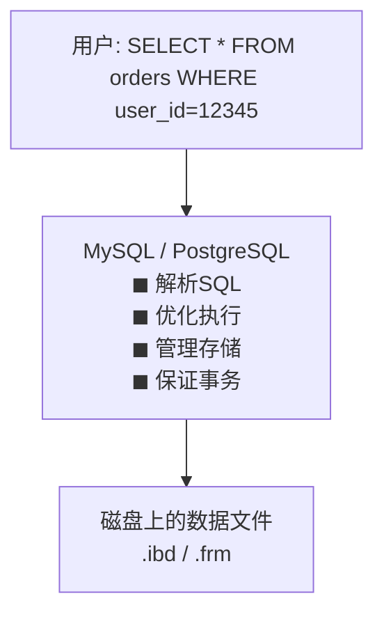
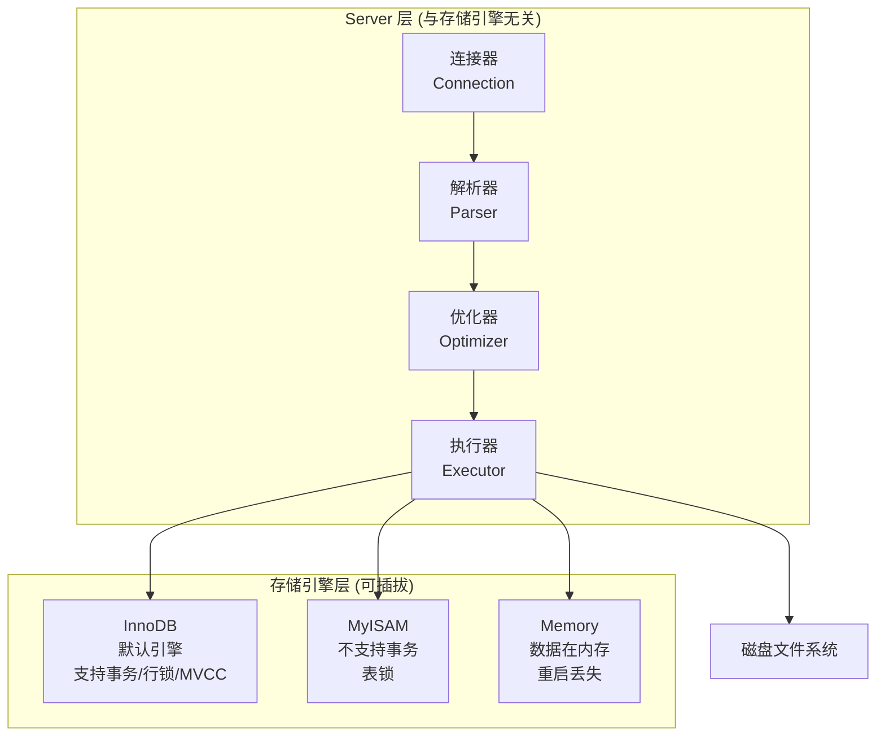
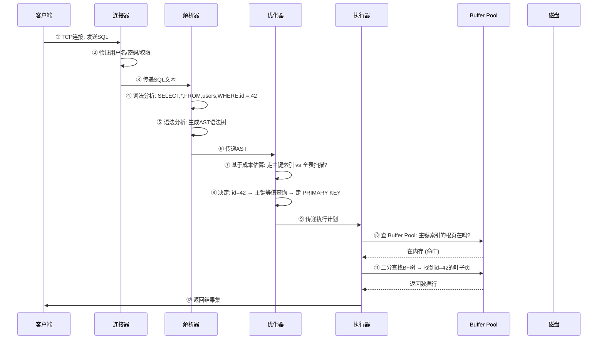
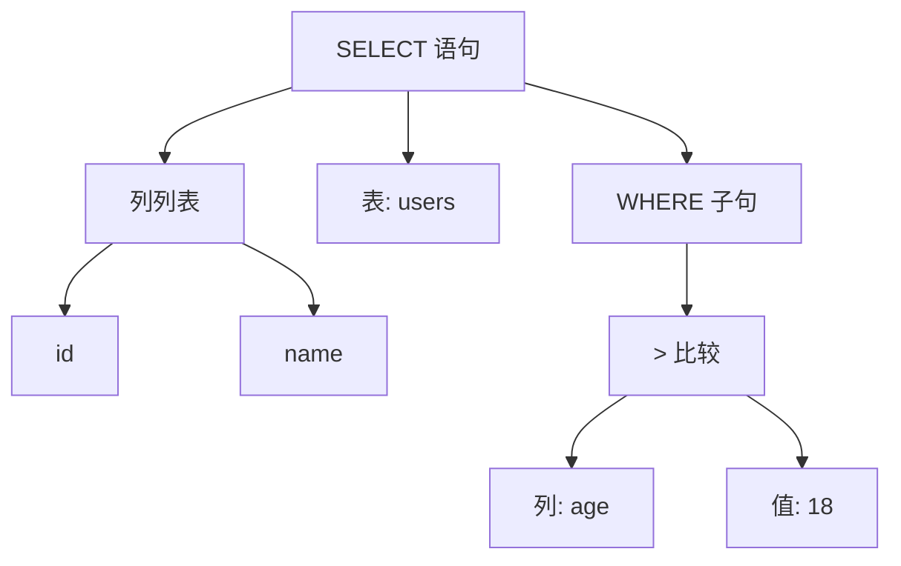
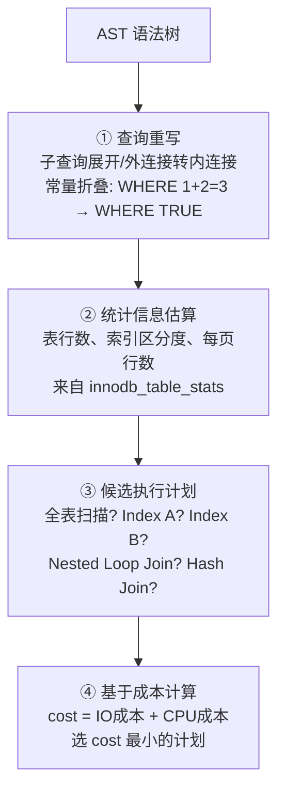
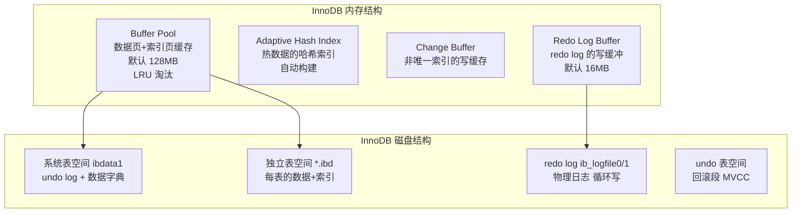
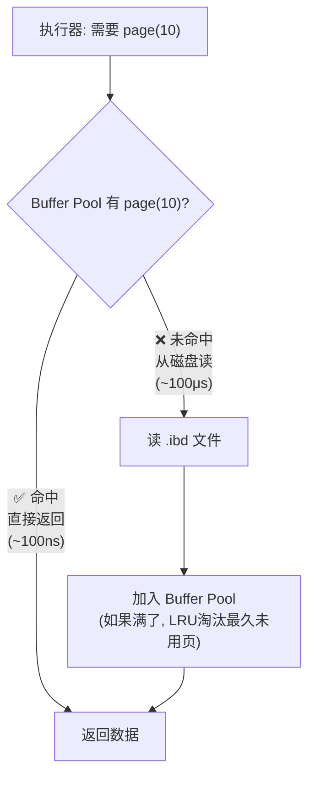
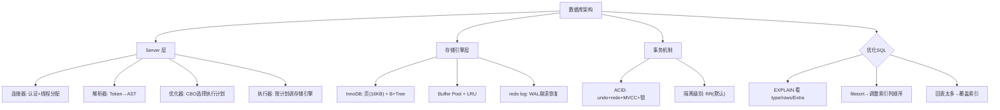

# 数据库整体架构概览

> 一条 SELECT 语句的奇幻旅程——连接器→解析器→优化器→执行器→存储引擎

#### 目录介绍
- [01.工作案例引入](#01工作案例引入)
  - [1.1 加索引反变慢](#11-加索引反变慢)
  - [1.2 为何学架构原理](#12-为何学架构原理)
- [02.数据库宏观架构](#02数据库宏观架构)
  - [2.1 数据库是什么](#21-数据库是什么)
  - [2.2 MySQL分层](#22-mysql分层)
  - [2.3 SQL的一生](#23-sql的一生)
- [03.连接器](#03连接器)
  - [3.1 连接是什么](#31-连接是什么)
  - [3.2 连接池](#32-连接池)
  - [3.3 连接的代价](#33-连接的代价)
- [04.解析器](#04解析器)
  - [4.1 词法分析](#41-词法分析)
  - [4.2 AST语法树](#42-ast语法树)
  - [4.3 语法错代价](#43-语法错代价)
- [05.优化器](#05优化器)
  - [5.1 优化器做什么](#51-优化器做什么)
  - [5.2 CBO成本优化](#52-cbo成本优化)
  - [5.3 优化器陷阱](#53-优化器陷阱)
  - [5.4 EXPLAIN解读](#54-explain解读)
- [06.执行器](#06执行器)
  - [6.1 执行器的工作](#61-执行器的工作)
  - [6.2 全表vs索引](#62-全表vs索引)
- [07.存储引擎](#07存储引擎)
  - [7.1 InnoDB架构](#71-innodb架构)
  - [7.2 页结构](#72-页结构)
  - [7.3 Buffer Pool](#73-buffer-pool)
  - [7.4 WAL与redo](#74-wal与redo)
- [08.事务与ACID](#08事务与acid)
  - [8.1 什么是事务](#81-什么是事务)
  - [8.2 ACID拆解](#82-acid拆解)
  - [8.3 隔离级别](#83-隔离级别)
- [09.综合案例](#09综合案例)
  - [9.1 用户列表慢](#91-用户列表慢)
  - [9.2 排查与修复](#92-排查与修复)
- [10.思考题与作业](#10思考题与作业)


## 01.工作案例引入

### 1.1 加索引反变慢

**场景**：老李是一名工作四年的后端工程师，负责一个电商系统的订单模块。有一张 `orders` 表，约 500 万行。某天产品经理投诉：**"订单列表页加载要 5 秒，用户受不了"**。

老李看了慢查询日志，定位到这条 SQL：

```sql
SELECT * FROM orders
WHERE user_id = 12345
  AND status = 'paid'
  AND created_at > '2024-01-01'
ORDER BY created_at DESC
LIMIT 20;
```

现有索引只有 `user_id` 上的单列索引。`EXPLAIN` 显示用了 `user_id` 索引，但还需要**回表**查 `status` 和 `created_at`——500 万行中这个用户的订单有 10 万条，回表 10 万次。

老李想："建个联合索引不就行了？"于是他加了一条：

```sql
ALTER TABLE orders ADD INDEX idx_uid_status_time (user_id, status, created_at);
```

第二天，监控报警——**这条查询反而从 5 秒变成了 15 秒！**老李懵了。

**真正的原因**：这条联合索引**遵循最左前缀原则**，但老李的查询条件是 `user_id = ? AND status = ? AND created_at > ?`，">" 范围查询让 `created_at` 之后的排序无法利用索引，MySQL 需要**额外文件排序（filesort）**。而新的联合索引比旧的单列索引更大（每页存的条目更少），回表次数没减少但扫描了更多索引页——结果更慢。

**追问链**：

- "为什么加了索引反而慢？" → 因为优化器选错了执行计划——索引更大导致扫描成本高于预期
- "优化器怎么选执行计划的？" → 基于**成本估算**（CBO），但统计信息可能不准
- "什么是 filesort？" → 当 ORDER BY 无法利用索引时，MySQL 把结果集放入排序缓冲区（sort_buffer）排序——内存不够就落盘，极慢
- "为什么不直接用 `user_id + created_at` 的索引？" → 因为 `status = 'paid'` 在中间，等值查询可以利用索引，但 `created_at > ?` 是范围查询——范围查询后面的列不能用索引
- "那到底怎么优化？" → 调整联合索引顺序为 `(user_id, created_at)`，让范围查询在最后，前面的等值查询仍能利用索引

**老李最终把索引改成 `(user_id, created_at)`，查询从 15 秒降到 0.1 秒。**

这一串问题的答案，全部写在数据库架构原理里。

### 1.2 为何学架构原理


大多数程序员写 SQL 只关心"语法对不对"和"结果对不对"，但数据库内部从 SQL 文本到磁盘字节的整个过程，决定了这条 SQL 是 0.01 秒还是 10 秒。本章把 MySQL 的完整架构拆开：

- 一条 SQL 在数据库内部经历了哪些组件？每个组件做了什么？
- 优化器是怎么选索引的？为什么有时"好心办坏事"？
- `EXPLAIN` 的输出到底怎么看？`type=ALL` 和 `type=ref` 差在哪？
- InnoDB 的页结构、Buffer Pool、redo log 是怎么配合的？
- 事务的 ACID 到底靠什么机制保证？


## 02.数据库宏观架构

### 2.1 数据库是什么

数据库（Database）是一个**有组织的数据集合**，由**数据库管理系统（DBMS）**统一管理。用户通过 SQL 告诉 DBMS "我要什么数据"，DBMS 负责"怎么找到这些数据"：



**关系型数据库的核心抽象**：数据以**表（Table）**的形式组织，每张表有**行（Row）**和**列（Column）**，通过外键关联表间关系。用户不关心数据在磁盘上的物理布局——这是存储引擎的工作。

### 2.2 MySQL分层

MySQL 最独特的设计是**插件式存储引擎**——Server 层负责解析 SQL 和优化执行，存储引擎层负责数据的物理存取：



| 层级 | 组件 | 职责 | 类比 |
|------|------|------|------|
| Server 层 | 连接器 | 管理客户端连接、权限验证 | 餐厅迎宾 |
| Server 层 | 解析器 | 语法检查、生成 AST | 翻译菜单 |
| Server 层 | 优化器 | 选择最优执行计划 | 厨师长调度 |
| Server 层 | 执行器 | 调用存储引擎接口执行 | 厨师炒菜 |
| 引擎层 | InnoDB | 数据存取、事务、锁 | 食材仓库 |

### 2.3 SQL的一生

以 `SELECT * FROM users WHERE id = 42` 为例，追踪从客户端到磁盘的完整路径：



**关键**：优化器在第 ⑧ 步的决策**直接决定了这条 SQL 是 0.01ms 还是 100ms**。如果它选错执行计划（比如放弃主键索引走全表扫描），性能可能差 10000 倍。


## 03.连接器

### 3.1 连接是什么

当客户端 `mysql -h 127.0.0.1 -u root -p` 时，连接器做三件事：

```
1. TCP 三次握手 (网络层)
2. MySQL 握手协议: 版本协商 + 加密能力交换
3. 身份认证: 用户名 + 密码 + 来源IP

认证通过后:
  → 分配一个线程 (thread) 处理该连接的所有后续请求
  → 查询权限表 (mysql.user/db/tables_priv) → 缓存权限
  → 后续该连接的所有操作都基于此次缓存的权限
```

**探索**：权限缓存的深坑——`FLUSH PRIVILEGES` 对新连接立即生效，但对**已有连接**不生效：

```
管理员: GRANT SELECT ON db.* TO 'user'@'%';
        FLUSH PRIVILEGES;
新连接: ✅ 能查到
老连接: ❌ 权限还是旧的! 必须重连才生效
→ 这就是为什么修改权限后常说"请重新连接"
```

### 3.2 连接池

数据库为每个连接分配一个线程，线程栈默认 ~256KB：

```
1000 个连接 = 1000 个线程 × 256KB = 256MB 线程栈
+ 每个连接可能有的临时表/排序缓冲区
+ 线程切换开销

最佳实践:
  - 应用层用连接池 (HikariCP/Druid)，控制连接数
  - 长连接执行大查询后要 `mysql_reset_connection` 重置状态
  - 短连接开销大: 每次连接都要 TCP 握手 + 权限验证
```

### 3.3 连接的代价

```bash
# 查看当前连接数
$ mysql -e "SHOW STATUS LIKE 'Threads_connected'"
+-------------------+-------+
| Threads_connected | 47    |

# 查看历史最大连接数
$ mysql -e "SHOW STATUS LIKE 'Max_used_connections'"
+----------------------+-------+
| Max_used_connections | 128   |

# 查看连接超时设置
$ mysql -e "SHOW VARIABLES LIKE 'wait_timeout'"
+---------------+-------+
| wait_timeout  | 28800 |  # 8小时无操作自动断开
```


## 04.解析器

### 4.1 词法分析

解析器第一步是把 SQL 字符串拆成 Token（词法单元）：

```sql
SELECT id, name FROM users WHERE age > 18
```

```
词法分析输出:
  Token(SELECT)  Token(id)  Token(,)  Token(name)
  Token(FROM)    Token(users)
  Token(WHERE)   Token(age)  Token(>)  Token(18)
```

**每一个 Token 都有类型和值**：`SELECT` 是关键字（`SQL_SYM`），`id` 是标识符，`18` 是整数常量。

### 4.2 AST语法树

语法分析器根据 SQL 语法规则把 Token 序列组织成**抽象语法树（AST）**：



**解析器的容错能力**：

```sql
-- MySQL 解析器能容忍的:
SELECT * FROM users WHERE name = "O'Brien";   -- 引号转义
SELECT * FROM users WHERE id = 42;            -- 整数隐式转换

-- 不能容忍的 (解析阶段就报错):
SELEC * FROM users;     -- 关键字拼写错误
SELECT * FORM users;     -- 语法错误
```

### 4.3 语法错代价

**疑惑：语法错误能提前发现吗？为什么 MySQL 不先检查 SQL 语法再执行？**

MySQL 的流程是**解析→优化→执行**一体化的——解析器是整个查询处理的入口，无法跳过。但可以通过以下方式提前发现问题：

```bash
# 用 EXPLAIN 只走到优化器，不执行 (提前暴露语法错误)
EXPLAIN SELECT * FROM users WHERE id = 42;
# 如果语法错误，EXPLAIN 阶段就会报错
```


## 05.优化器

### 5.1 优化器做什么

优化器是数据库**最复杂的组件**——它不执行 SQL，而是决定"怎么执行最划算"。



### 5.2 CBO成本优化

MySQL 优化器是**基于成本的（Cost-Based Optimizer, CBO）**：

```
全表扫描的代价:
  cost = 数据页数 × 读取一页的IO代价 + 行数 × 检查一行的CPU代价

索引扫描的代价:
  cost = 索引页数 × IO代价 + 回表行数 × 回表IO代价 + ...

最终选择: cost 最小的执行计划

# 查看 MySQL 估算的行数
EXPLAIN SELECT * FROM orders WHERE user_id = 12345;
+----+------+---------------+---------+------+-------+-------------+
| id | type | possible_keys | key     | rows | Extra              |
+----+------+---------------+---------+------+-------+-------------+
|  1 | ref  | idx_user_id   | idx_uid | 100000| Using index cond. |
+----+------+---------------+---------+------+-------+-------------+
# rows=100000: MySQL 估算需要扫描 10 万行
```

### 5.3 优化器陷阱

优化器不是万能的——它依赖**统计信息**，统计信息不准 = 决策失准：

```
常见的优化器陷阱:

1. 统计信息过时
   表刚插入 1000 万行，但 ANALYZE TABLE 没跑
   → 优化器以为表只有 10 万行 → 选了全表扫描
   解决: 定期 ANALYZE TABLE / 开启 innodb_stats_auto_recalc

2. 索引选择错误 (1.1节案例)
   optimizer_search_depth 默认 62 (太深)
   → 5 表 JOIN 时可能因搜索空间太大而选次优计划
   解决: SET optimizer_search_depth = 3

3. 隐式类型转换
   WHERE phone = 13800138000 (phone 是 VARCHAR)
   → 索引失效! 因为 MySQL 把字符串列转成整数
   → 全表扫描
   解决: WHERE phone = '13800138000'
```

### 5.4 EXPLAIN解读

`EXPLAIN` 是理解优化器决策的**唯一窗口**。每一个字段都有重要意义：

```sql
EXPLAIN SELECT * FROM orders WHERE user_id = 12345 AND status = 'paid';
```

| 字段 | 含义 | 本次值 | 解读 |
|------|------|--------|------|
| `id` | 查询序号 | 1 | 第一层查询 |
| `select_type` | 查询类型 | SIMPLE | 简单查询（非子查询/UNION） |
| `table` | 访问的表 | orders | — |
| `type` | **访问类型（最重要!）** | ref | 非唯一索引等值查找 ✅ |
| `possible_keys` | 候选索引 | idx_uid, idx_status | 两个索引都可用 |
| `key` | **实际使用的索引** | idx_uid | 优化器选了 idx_uid |
| `rows` | **估算扫描行数** | 100000 | 预计 10 万行 |
| `Extra` | 额外信息 | Using where | 在存储引擎层用WHERE过滤 |

**type 字段——从好到差**：

| type | 含义 | 速度 |
|------|------|------|
| `const` | 主键等值（最多 1 行） | ★★★★★ 最快 |
| `eq_ref` | JOIN 时走主键/唯一索引 | ★★★★☆ |
| `ref` | 非唯一索引等值 | ★★★★☆ |
| `range` | 索引范围扫描 | ★★★☆☆ |
| `index` | 全索引扫描（扫整个索引树） | ★★☆☆☆ |
| **`ALL`** | **全表扫描** | ★☆☆☆☆ 最慢 |


## 06.执行器

### 6.1 执行器的工作

优化器选定执行计划后，执行器按计划**逐行**调用存储引擎的接口：

```
优化器给出的计划: "走 idx_user_id 索引，返回 user_id=12345 的行"

执行器的执行过程 (伪代码):
  handler = open_table("orders");
  index = handler->ha_index_init(handler, "idx_user_id");

  // 在索引中找 user_id=12345 的第一条
  handler->ha_index_read_map(index, key_of(12345));

  while (还有符合条件的行) {
      // 从索引叶子页找到主键 id → 回表读完整行
      handler->ha_rnd_next(index);
      if (user_id != 12345) break;  // 索引断点

      // 在 Server 层检查 status = 'paid'
      if (row->status == "paid") {
          send_to_client(row);  // 返回给客户端
      }
  }
```

### 6.2 全表vs索引

执行器两种最基本的读取方式：

```
全表扫描 (type=ALL):
  执行器: handler->ha_rnd_init() → 从第一页第一条开始
  存储引擎: 遍历表空间所有数据页
  复杂度: O(N) 数据页
  适合: 需要读大量行时 (如导出)

索引扫描 (type=ref/range):
  执行器: handler->ha_index_read_map() → 从B+树根找叶子
  存储引擎: 在 B+树上二分查找，到叶子页
  复杂度: O(log N) + 回表成本
  适合: 只查少量行
```


## 07.存储引擎

### 7.1 InnoDB架构

InnoDB 是 MySQL 的默认存储引擎，也是功能最全面的：



### 7.2 页结构

InnoDB 以**页（Page）**为基本单位管理磁盘，默认 16KB：

```
InnoDB 页的结构 (16KB):
┌────────────────────────────┐
│ File Header (38B)          │ ← 页类型、页号、校验和
├────────────────────────────┤
│ Page Header (56B)          │ ← 槽数量、空闲空间指针
├────────────────────────────┤
│ Infimum + Supremum (26B)   │ ← 虚拟最小/最大记录
├────────────────────────────┤
│ User Records               │ ← 实际用户数据行 (从低地址向高增长)
│   row1, row2, row3, ...    │
├────────────────────────────┤
│ Free Space                 │ ← 未使用空间
├────────────────────────────┤
│ Page Directory (槽)        │ ← 二分查找用的记录指针数组 (从高向低)
├────────────────────────────┤
│ File Trailer (8B)          │ ← 校验和 (检测页损坏)
└────────────────────────────┘

InnoDB 在页内用"页目录"做二分查找 → O(log n) 页内搜索
```

**探索**：为什么页大小是 16KB？

```
16KB 的权衡:
  太小 (如 4KB): B+树更深 → 更多层 → 更多磁盘IO
  太大 (如 64KB): 读一行也要加载 64KB → Buffer Pool 浪费
  16KB: 与操作系统 Page Cache 页 (4KB) 对齐 → 4 个 OS 页
        SSD 的 NAND 页通常 4-16KB → 更适配
        可以通过 innodb_page_size 调整为 4KB/8KB/32KB/64KB
```

### 7.3 Buffer Pool

Buffer Pool 是 InnoDB 的**核心缓存**——缓存数据页和索引页在内存中：



```bash
# 查看 Buffer Pool 命中率
$ mysql -e "SHOW ENGINE INNODB STATUS\G" | grep "Buffer pool hit"
Buffer pool hit rate 999 / 1000    # 99.9% 命中率

# 命中率 < 95% → 考虑增大 Buffer Pool
# innodb_buffer_pool_size 一般设为物理内存的 50%-80%
```

**Buffer Pool 的 LRU 改进——冷热分离**：

```
标准 LRU 的问题:
  全表扫描 → 大量"只访问一次"的页冲进 BP
  → 真正热数据被挤出 → "缓冲池污染"

InnoDB 的 LRU 变体 (5/8 分割):
  ┌──────────────────┬─────────────────────────┐
  │ New Sublist (5/8)│ Old Sublist (3/8)        │
  │ 热数据           │ 冷数据候选                │
  └──────────────────┴─────────────────────────┘
  ↑ 新页先入 Old 区头部
  在 Old 区停留 >1秒 才升入 New 区
  → 全表扫描的页在 Old 区很快被淘汰 ← 不污染热区
```

### 7.4 WAL与redo

**疑惑：如果 MySQL 崩溃了，Buffer Pool 中还没有写到磁盘的脏数据不都丢了？**

这就是 **WAL（Write-Ahead Log）** 机制——**先写日志，后写磁盘**：

```mermaid
flowchart LR
    UPDATE["UPDATE users SET name='Bob' WHERE id=42"]
    UPDATE --> BP["① 修改 Buffer Pool 中的页<br/>(此时页变成脏页)"]
    BP --> RLOG["② 写 redo log<br/>(记录对页的修改)<br/>先写 log buffer"
    RLOG --> FLUSH["③ 事务提交 → fsync 把<br/>redo log 刷到磁盘"]
    Note over BP,FLUSH: 此时数据页还没写到磁盘!
    FLUSH --> CHECK["④ 后台线程异步<br/>把脏页写回 ibd 文件"]
```

**崩溃恢复**：

```
MySQL 启动时:
  1. 扫描 redo log → 找到最后一次检查点 (checkpoint)
  2. 从检查点之后开始重放 redo log
  3. 把"已提交但数据页未落盘"的修改重新应用到 Buffer Pool
  4. 恢复完成 → 数据库回到崩溃前的一致状态

WAL 的核心思想:
  写 redo log 是顺序写 (快!) → ~100MB/s 顺序写
  写数据页是随机写 (慢) → ~1MB/s 随机写
  → 用户只需等待 redo log 落盘 → 事务"提交"速度由顺序写决定
```


## 08.事务与ACID

### 8.1 什么是事务

事务是一组**要么全做，要么全不做**的 SQL 操作——保证数据的一致性。

```sql
-- 转账: 扣 100 元 + 加 100 元, 要么都成功, 要么都不做
START TRANSACTION;
UPDATE accounts SET balance = balance - 100 WHERE id = 1;
UPDATE accounts SET balance = balance + 100 WHERE id = 2;
COMMIT;
```

### 8.2 ACID拆解

| 属性 | 含义 | InnoDB 如何保证 |
|------|------|---------------|
| **A** 原子性 | 事务要么全部成功，要么全部回滚 | undo log (回滚日志) |
| **C** 一致性 | 事务前后数据满足业务规则 | A+I+D 共同保证 |
| **I** 隔离性 | 并发事务互不干扰 | **MVCC + 锁** |
| **D** 持久性 | 提交后数据永不丢失 | redo log (WAL) |

### 8.3 隔离级别

SQL 标准定义了四种隔离级别，在"性能"和"一致性"之间权衡：

| 隔离级别 | 脏读 | 不可重复读 | 幻读 | InnoDB 实现 |
|---------|------|-----------|------|------------|
| READ UNCOMMITTED | ✅ 会 | ✅ 会 | ✅ 会 | 几乎不用 |
| READ COMMITTED | ❌ | ✅ 会 | ✅ 会 | 每次语句创建新 Read View |
| **REPEATABLE READ** (默认) | ❌ | ❌ | ❌ (InnoDB 用间隙锁消除) | 事务开始创建 Read View |
| SERIALIZABLE | ❌ | ❌ | ❌ | 读加共享锁 |

**MVCC（多版本并发控制）是 InnoDB 实现隔离的核心机制**——每个事务看到的是**数据在某个时间点的"快照"**（Read View），而不是最新数据：

```
MVCC 工作原理 (简化):
  每行有隐藏列: DB_TRX_ID (最后修改的事务ID), DB_ROLL_PTR (指向 undo log)

  事务 T(trx_id=100) SELECT * FROM users WHERE id=42:
    → 读到 trx_id=98 的版本 (undo log 中)
    → 看不到 trx_id=99 的版本 (未提交)
    → 如果 trx_id=99 已提交且 99<100 → 能看到
```


## 09.综合案例

### 9.1 用户列表慢

回到 1.1 节——把排查全链路走一遍。

```sql
-- 慢查询日志中的 SQL
SELECT * FROM orders
WHERE user_id = 12345
  AND status = 'paid'
  AND created_at > '2024-01-01'
ORDER BY created_at DESC LIMIT 20;
```

### 9.2 排查与修复

**Step 1: `EXPLAIN` 看执行计划**

```sql
EXPLAIN SELECT * FROM orders WHERE user_id=12345 AND status='paid'
        AND created_at>'2024-01-01' ORDER BY created_at DESC LIMIT 20;
+----+------+---------------------+------+-------+-------------+
| id | type | key                 | rows | Extra                         |
+----+------+---------------------+------+-------+-------------+
|  1 | ref  | idx_uid_status_time | 100000| Using where; Using filesort  |
+----+------+---------------------+------+-------+-------------+
```

**解读**：`Using filesort` = 无法用索引排序，需要额外排序；`rows=100000` = 需检查 10 万行。

**Step 2: 修复——调整索引列顺序**

```sql
-- ❌ 错误: 范围查询在中间, 后面排序不走索引
INDEX (user_id, created_at, status)

-- ✅ 正确: 等值查询在前, 范围查询在后
CREATE INDEX idx_uid_ctime ON orders (user_id, created_at);
EXPLAIN ...
+----+------+---------------+------+-------+-------------+
| id | type | key           | rows | Extra                    |
+----+------+---------------+------+-------+-------------+
|  1 | range| idx_uid_ctime |   20 | Using index condition   |
+----+------+---------------+------+-------+-------------+
# rows 从 100000 降到 20! filesort 消失!
```

**效果**：查询从 15 秒 → 0.1 秒。



**最终方法论**——排查慢查询三步走：

1. `EXPLAIN` 看 `type`（ALL=灾难）→ `key`（用了哪个索引）→ `rows`（扫描行数）→ `Extra`（filesort/using temporary）
2. 如果 rows 远大于实际返回行数 → 索引选择性差 → 重排索引列顺序
3. 如果 Extra 有 filesort → ORDER BY 不走索引 → 把排序列加入索引、范围查询列放最后


## 10.思考题与作业

### 10.1 基础思考题

1. **SQL全生命周期**：画出 `UPDATE users SET age=age+1 WHERE id=42` 从客户端到磁盘的完整路径，标注每个阶段涉及到哪些组件。

2. **EXPLAIN 解读**：`type=ALL, rows=5000000, Extra=Using filesort`——这个执行计划有多差？每个字段分别说明什么？

3. **索引最左前缀**：索引 `(a, b, c)`，以下哪些查询能用索引？`WHERE a=1`、`WHERE b=2`、`WHERE a=1 AND c=3`、`WHERE a=1 AND b>2 AND c=3`。说出每个的索引利用情况。

4. **redo log vs undo log**：redo log 和 undo log 分别解决什么问题？崩溃恢复时先用哪个？为什么？

5. **Buffer Pool 命中率**：为什么全表扫描会导致 Buffer Pool 命中率骤降？InnoDB 怎么缓解（冷热分离 LRU）？

### 10.2 进阶思考题

1. **1.1 节复盘**：为什么 `(user_id, status, created_at)` 的联合索引比单列 `user_id` 索引更慢？filesort 在什么情况下会被触发？除了调整索引顺序，还有哪些优化手段？

2. **优化器的信息缺口**：CBO 基于统计信息做决策，什么情况下统计信息会失准？MySQL 怎么维护统计信息？`ANALYZE TABLE` 做了什么？和 `OPTIMIZE TABLE` 有什么区别？

3. **MVCC 的实现**：MySQL 的 Read View 是怎么判断一行数据是否"可见"的？为什么 undo log 不能被随意清除？长事务对 undo log 有什么影响？

4. **B+Tree vs LSM-Tree**：MySQL InnoDB 用 B+Tree，RocksDB 用 LSM-Tree——为什么 B+Tree 适合 OLTP（在线事务），LSM-Tree 适合写密集型？各自的读写放大是多少？

5. **PostgreSQL vs MySQL**：MySQL 的优化器是 CBO，但 PostgreSQL 还支持 GEC/GPO（基因查询优化）。PostgreSQL 的优化器在复杂 JOIN（>10表）时为什么优于 MySQL？（提示：动态规划 vs 贪心算法）

### 10.3 动手作业

**作业一（必做）**：建表测试 EXPLAIN。

```sql
CREATE TABLE test_orders (
  id INT PRIMARY KEY AUTO_INCREMENT,
  user_id INT NOT NULL,
  status VARCHAR(20),
  created_at DATETIME,
  INDEX idx_uid (user_id)
);
-- 插入 100 万行后, 分别 EXPLAIN:
-- WHERE user_id=xxx (走索引)
-- WHERE status='paid' (全表扫描)
-- 对比 type 和 rows 的差异
```

**作业二（选做）**：观测 Buffer Pool 行为。

```bash
# 查看 Buffer Pool 状态
mysql -e "SHOW ENGINE INNODB STATUS\G" | grep -A20 "BUFFER POOL"
# 执行一次全表扫描 (SELECT * FROM large_table)
# 再次查看 Buffer Pool → 命中率变化？
```

**作业三（选做）**：用 `EXPLAIN FORMAT=JSON` 查看优化器的成本估算。

```sql
EXPLAIN FORMAT=JSON SELECT * FROM orders WHERE user_id=12345;
# 看 query_cost 字段——这就是优化器估算的总成本
```

**作业四（架构思考）**：分析你项目中最"数据库密集"的场景——找出 TOP 5 慢查询，用 EXPLAIN 分析。它们的 type 是什么？有没有 filesort？你能做哪些优化？