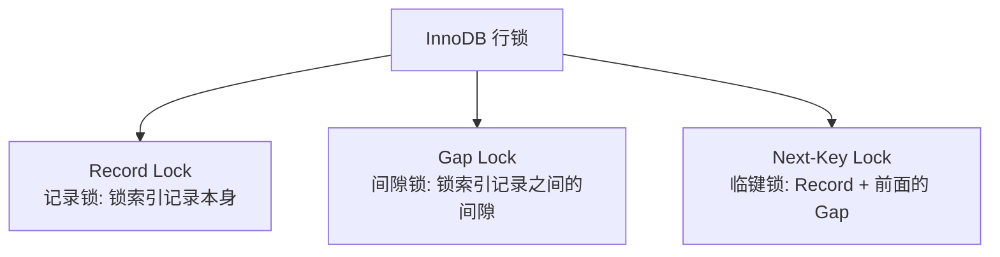
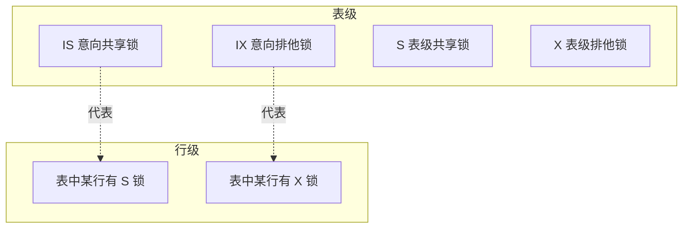
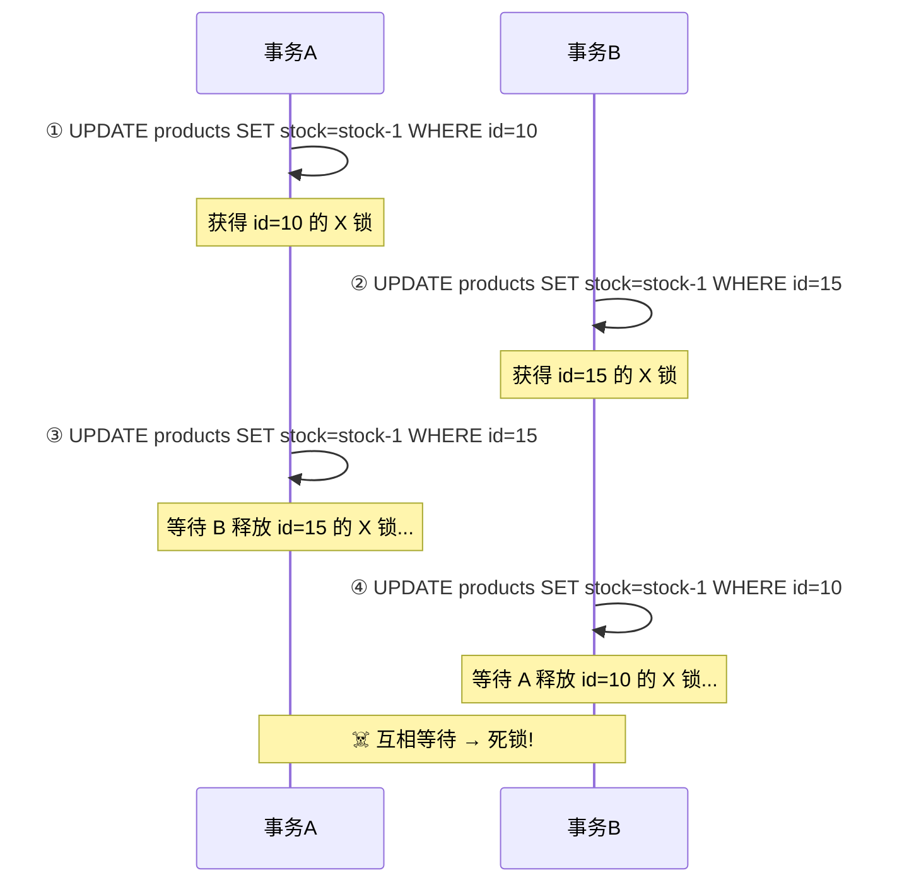
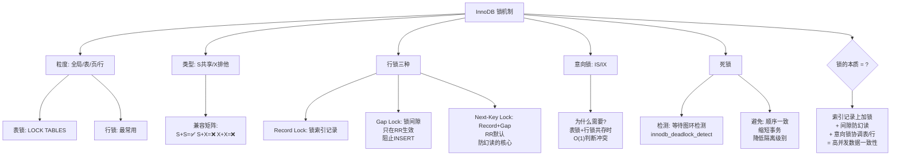

# 数据库锁的实现原理

> 行锁/表锁/间隙锁/意向锁——一条 UPDATE 到底加了哪些锁

#### 目录介绍
- [01.工作案例引入](#01工作案例引入)
  - [1.1 秒杀死锁](#11-一次死锁事故秒杀系统的瘫痪)
  - [1.2 为何学锁原理](#12-为什么要深入学锁原理)
- [02.锁的基本概念](#02锁的基本概念)
  - [2.1 什么是锁](#21-什么是锁)
  - [2.2 锁与隔离级别](#22-锁与事务隔离级别的关系)
  - [2.3 快照读vs当前读](#23-快照读-vs-当前读谁用锁)
- [03.锁的粒度](#03锁的粒度)
  - [3.1 全局锁](#31-全局锁)
  - [3.2 表级锁](#32-表级锁)
  - [3.3 页级锁](#33-页级锁)
  - [3.4 行级锁](#34-行级锁)
- [04.共享锁与排他锁](#04共享锁与排他锁)
  - [4.1 兼容矩阵](#41-s锁与x锁的兼容矩阵)
  - [4.2 加锁方式](#42-加锁方式)
  - [4.3 索引与锁](#43-索引与锁没有索引会怎样)
- [05.InnoDB的三种行锁](#05innodb的三种行锁)
  - [5.1 记录锁](#51-record-lock记录锁)
  - [5.2 间隙锁](#52-gap-lock间隙锁)
  - [5.3 临键锁](#53-next-key-lock临键锁)
  - [5.4 RR下临键锁](#54-为什么rr下默认用next-key-lock)
- [06.意向锁](#06意向锁表锁与行锁的桥梁)
  - [6.1 为何意向锁](#61-为什么需要意向锁)
  - [6.2 锁兼容性](#62-锁兼容性)
- [07.自增锁](#07自增锁auto-inc-lock)
  - [7.1 自增并发](#71-auto_increment的并发问题)
  - [7.2 自增模式](#72-三种自增锁模式)
- [08.UPDATE加锁](#08一条update到底加了哪些锁)
  - [8.1 唯一索引等值](#81-等值查询唯一索引命中)
  - [8.2 普通索引等值](#82-等值查询普通索引命中)
  - [8.3 范围查询](#83-范围查询)
  - [8.4 无索引的情况](#84-无索引的情况)
- [09.死锁](#09死锁)
  - [9.1 死锁条件](#91-死锁的四个必要条件)
  - [9.2 死锁复现](#92-死锁复现两个事务互相等待)
  - [9.3 检测与解除](#93-死锁检测与解除)
  - [9.4 日志解读](#94-死锁日志解读)
  - [9.5 避免死锁](#95-如何避免死锁)
- [10.综合案例](#10综合案例秒杀系统的锁优化)
  - [10.1 场景分析](#101-场景分析)
  - [10.2 方案对比](#102-方案对比与知识图谱)
- [11.思考题与作业](#11思考题与作业)
  - [11.1 基础思考题](#111-基础思考题)
  - [11.2 进阶思考题](#112-进阶思考题)
  - [11.3 动手作业](#113-动手作业)


## 01.工作案例引入

### 1.1 秒杀死锁

**场景**：继上一章的库存超卖之后，小陈的秒杀系统又出问题了。这次不是超卖——而是**整个系统僵住了**。

大促第 5 分钟，监控告警：数据库连接池耗尽，所有请求都在排队等待。小陈登上数据库一看：

```sql
SHOW ENGINE INNODB STATUS\G
-- 输出显示:
-- LATEST DETECTED DEADLOCK
-- *** (1) TRANSACTION:
-- UPDATE products SET stock = stock - 1 WHERE id = 10
-- *** (1) WAITING FOR THIS LOCK TO BE GRANTED:
-- RECORD LOCKS space id 58 page no 3 n bits 72 index PRIMARY of table `shop`.`products`
-- trx id 4891 lock_mode X locks rec but not gap waiting
-- *** (2) TRANSACTION:
-- UPDATE products SET stock = stock - 10 WHERE id BETWEEN 5 AND 15
-- *** (2) HOLDS THE LOCK(S):
-- RECORD LOCKS ... lock_mode X locks rec but not gap
-- *** WE ROLL BACK TRANSACTION (1)
```

**"LATEST DETECTED DEADLOCK"——死锁了！**

**疑惑链条**：

- "两个事务不是各锁各的行吗？id=10 和 id=5~15 范围有重叠就会死锁？" → 是的！当事务需要获取**对方已经持有的锁**时，且双方都不释放自己的锁，就形成死锁
- "InnoDB 不是有死锁检测吗？为什么还会有问题？" → 死锁检测本身有代价——等待图每增加一个节点，检测开销就增大。高并发下检测本身也会消耗 CPU
- "那行锁到底锁的是什么？是锁一行数据吗？" → 实际上锁的是**索引记录**——如果没有索引，行锁退化为表锁！这是最容易被忽视的陷阱
- "间隙锁到底是什么？为什么 RR 级别下会有？" → 间隙锁锁的是**索引记录之间的间隙**，用来防止幻读。但它也增加了死锁的概率
- "我怎么知道一条 UPDATE 到底加了哪些锁？" → 这取决于索引类型（唯一/普通）、查询条件（等值/范围）、隔离级别、记录是否存在

小陈这次学到了：**锁不是一句"加行锁"就能概括的——InnoDB 有记录锁、间隙锁、临键锁三种行锁，还有表级意向锁、自增锁**。每一种锁的加锁规则都不同。

### 1.2 为何学锁原理

```
两个事务同时更新:
  事务A: UPDATE ... WHERE id = 10                → 锁住 id=10
  事务B: UPDATE ... WHERE id BETWEEN 5 AND 15    → 要先锁 id=5,6,7,...15
                                                  但 id=10 已被 A 锁住!
  事务A: 需要继续锁 id=11?                       → 但 B 锁住了 id=11!
  → 死锁!
```

**锁是数据库并发控制的最后一道防线**。MVCC 解决"读不阻塞写"，但两个写操作之间必须有锁来协调。本章的目标，是把 InnoDB 的锁体系完整拆开：

- **三种行锁**（Record/Gap/Next-Key）各自的加锁场景和规则
- **表锁与行锁如何共存**——意向锁的巧妙设计
- **一条 UPDATE 到底加了哪些锁**——完整推演
- **死锁如何发生、如何检测、如何避免**


## 02.锁的基本概念

### 2.1 什么是锁

锁是一种**并发控制机制**——当多个事务同时操作同一数据时，锁保证数据的正确性。

```
类比: 公共厕所的"有人/无人"标识
  一个人进去 → 锁门(加锁) → 外面的人等待
  用完出来 → 解锁 → 下一个人进入

数据库锁也一样:
  事务A 写一行 → 加排他锁 → 其他事务不能读写这行
  事务A COMMIT → 释放锁 → 其他事务可以操作
```

### 2.2 锁与隔离级别

| 隔离级别 | 使用的锁 | 锁的力度 |
|---------|---------|---------|
| READ UNCOMMITTED | 几乎不加锁 | — |
| READ COMMITTED | 行锁（只锁命中的行） | 精确，死锁少 |
| REPEATABLE READ | **行锁 + 间隙锁** | 范围更大，死锁多 |
| SERIALIZABLE | 所有读加共享锁 | 最大，并发最低 |

**本章重点讨论 InnoDB 在 RR（默认）和 RC 级别下的锁机制。**

### 2.3 快照读vs当前读

这是理解锁的第一个关键——**不是所有 SELECT 都加锁**：

| 操作类型 | 示例 | 加锁? | 原理 |
|---------|------|:---:|------|
| **快照读** | `SELECT * FROM t WHERE id=1` | ❌ 不加 | MVCC Read View，读历史版本 |
| **当前读** | `SELECT ... FOR UPDATE` | ✅ S锁/X锁 | 读最新版本并加锁 |
| **当前读** | `SELECT ... LOCK IN SHARE MODE` | ✅ S锁 | 共享锁 |
| **写操作** | `INSERT / UPDATE / DELETE` | ✅ X锁 | 排他锁 |

**锁定读（Locking Read）即当前读——这是锁真正发挥作用的地方。**


## 03.锁的粒度

### 3.1 全局锁

锁住整个数据库实例，让数据库变为只读。典型场景：全库逻辑备份。

```sql
FLUSH TABLES WITH READ LOCK;  -- 加全局读锁，所有表只读
UNLOCK TABLES;                -- 释放
```

生产环境几乎不用——因为有 `mysqldump --single-transaction`（通过 MVCC 快照实现一致性备份，不阻塞写）。

### 3.2 表级锁

MySQL 的 Server 层提供的锁，InnoDB 也可以用：

```sql
LOCK TABLES products READ;   -- 表级共享锁
LOCK TABLES products WRITE;  -- 表级排他锁
UNLOCK TABLES;
```

**InnoDB 一般不用表锁**——除非 DDL（ALTER TABLE）或 `LOCK TABLES` 显式调用。DDL 的锁涉及**元数据锁（MDL）**，不在本章讨论范围。

### 3.3 页级锁

BDB 引擎使用，InnoDB 不用。跨在表锁和行锁之间的一种折中——锁住一个数据页（16KB），介于两者之间。

### 3.4 行级锁

InnoDB 的默认锁粒度。**锁的是索引记录，而不是数据行本身**：

```
InnoDB 行锁的本质:
  行锁 = 对索引记录加锁
  表没有索引 → 行锁退化为表锁 → 全表所有行被锁 → 并发度归零!

这就是为什么 WHERE 条件列必须建索引——不是为了查询快，而是为了锁的粒度!
```


## 04.共享锁与排他锁

### 4.1 兼容矩阵

这是锁体系的基础——行锁只有两种类型：

| | **S锁（共享锁）** | **X锁（排他锁）** |
|------|:---:|:---:|
| **S锁** | ✅ 兼容 | ❌ 冲突 |
| **X锁** | ❌ 冲突 | ❌ 冲突 |

```
S锁 (Shared Lock): 读锁——允许其他事务也加S锁读，但不允许加X锁写
X锁 (eXclusive Lock): 写锁——不允许其他事务加任何锁（读也不行）
```

### 4.2 加锁方式

```sql
-- 加 S 锁 (共享锁)
SELECT * FROM products WHERE id = 1 LOCK IN SHARE MODE;  -- MySQL 8.0 前
SELECT * FROM products WHERE id = 1 FOR SHARE;            -- MySQL 8.0+

-- 加 X 锁 (排他锁)
SELECT * FROM products WHERE id = 1 FOR UPDATE;

-- INSERT/UPDATE/DELETE: 自动加 X 锁
UPDATE products SET stock = stock - 1 WHERE id = 1;
DELETE FROM products WHERE id = 1;
-- INSERT: 对插入的行加 X 锁（同时可能触发插入意向锁）
```

### 4.3 索引与锁

**这是最多人被坑的一点**：InnoDB 的行锁是加在**索引**上的，不是加在数据行上。

```sql
-- products 表: id 有主键索引, name 没有索引

-- 会话A:
START TRANSACTION;
UPDATE products SET stock = 0 WHERE name = 'iPhone';  -- name 没有索引!
-- 结果: InnoDB 只能全表扫描 → 对扫描到的每一行都加 X 锁
-- → 全表所有行被锁! → 其他事务连读都不行!

-- 会话B:
SELECT * FROM products WHERE id = 10 FOR UPDATE;  -- 阻塞! 等待 A 释放锁
```

```sql
-- 验证: 创建没有索引的表
CREATE TABLE t_no_idx (id INT, name VARCHAR(20));
INSERT INTO t_no_idx VALUES (1,'a'), (2,'b'), (3,'c'), (4,'d');

-- 会话A:
BEGIN;
UPDATE t_no_idx SET name = 'x' WHERE name = 'b';  -- 全表扫描，锁全部4行

-- 会话B:
BEGIN;
SELECT * FROM t_no_idx WHERE id = 3 FOR UPDATE;    -- 等待! A 锁了所有行!
```

**探索：为什么 InnoDB 不能"先找到目标行再加锁"？**

```
MySQL 的 UPDATE 执行分为两步:
  ① Server层: 根据 WHERE 条件找出所有行 (全表扫描)
  ② InnoDB层: 对找到的行加锁后更新

如果 name 列没有索引:
  Server层 需要把所有行都读出来 → 每读一行就加锁 → 全表锁

如果有 idx_name:
  Server层 通过索引定位到 name='b' 的行 → 只锁这一行 → 精确锁
```

**生产铁律：`WHERE` 条件、`JOIN` 条件、`ORDER BY` 列，必须建索引——不仅为了查询快，更是为了锁的粒度！**


## 05.InnoDB的三种行锁

InnoDB 的行锁不只是"锁一行"那么简单。在 RR 级别下，为了防止幻读，InnoDB 有三种行锁：



### 5.1 记录锁

**锁住一条索引记录**，是最基本的行锁：

```
表 products, 主键 id: [1, 5, 10, 15, 20]

SELECT * FROM products WHERE id = 10 FOR UPDATE;
→ Record Lock: 只锁 id=10 这一条索引记录
→ 其他事务可以操作 id=1,5,15,20
→ 不能 UPDATE/DELETE id=10（X锁互斥）
```

### 5.2 间隙锁

**锁住索引记录之间的间隙**（左开右开区间），防止其他事务在间隙中 INSERT。只在 RR 级别下生效：

```
表 products, 主键 id: [1, 5, 10, 15, 20]
间隙: (-∞, 1), (1,5), (5,10), (10,15), (15,20), (20, +∞)

SELECT * FROM products WHERE id = 10 FOR UPDATE;
→ 在 RR 级别下:
  Gap Lock: 锁住 (5,10) 间隙 + (10,15) 间隙? 不完全是——
  实际加的是 Next-Key Lock（下节详述）
```

**Gap Lock 的关键特性**：

```
1. Gap Lock 之间不冲突——两个事务可以同时锁同一个间隙
   事务A: Gap Lock on (5,10)  ✅
   事务B: Gap Lock on (5,10)  ✅ 同时持有!

2. Gap Lock 与 INSERT 冲突——目的就是阻止插入
   事务A: Gap Lock on (5,10)
   事务B: INSERT INTO t VALUES (7) → 阻塞! 等待 A 释放

3. 唯一索引等值查询且记录存在 → 退化为 Record Lock（不加 Gap Lock）
4. 在 RC 级别下 → Gap Lock 不生效
```

**探索性问题**：为什么两个事务可以同时持有同一个 Gap Lock？

```
Gap Lock 的目的不是"保护已有数据"，而是"阻止新数据出现"
→ 两个事务都"声明"要阻止这个间隙被插入 → 不冲突
→ 但如果有一个要插入 → 就和所有 Gap Lock 冲突

这就像多个施工队都可以在同一个路口放置"禁止通行"标志
→ 但如果有人想通过 → 会被所有标志挡住
```

### 5.3 临键锁

**Next-Key Lock = Record Lock + 前面的 Gap Lock**（左开右闭区间）。InnoDB RR 级别的默认行锁：

```
表 products, 主键 id: [1, 5, 10, 15, 20]

Next-Key Lock 锁住的区间 (左开右闭):
  (-∞, 1], (1,5], (5,10], (10,15], (15,20], (20, +∞)

SELECT * FROM products WHERE id = 10 FOR UPDATE;
→ Next-Key Lock on (5, 10]:
    Record Lock: 锁住 id=10
    Gap Lock:    锁住 (5,10) 间隙
  → 其他事务不能: 修改 id=10, 在 (5,10) 之间插入新行
```

**这就是 RR 级别下"防幻读"的核心机制**——Next-Key Lock 同时锁住记录和间隙，其他事务既不能改已有行，也不能在间隙插入。

### 5.4 RR下临键锁

回到第 3 章的 MVCC 知识——MVCC 快照读只能防"读到的行值变化"，不能防"新行出现"。所以：

```
MVCC 快照读: 解决"读不阻塞写" + 防不可重复读
Next-Key Lock (当前读): 解决"幻读"——防止新行插入到查询范围内

两者互补:
  MVCC → 快照读 → 不加锁 → 高性能读
  Next-Key Lock → 当前读 → 加锁 → 精确控制写
```

**探索：RC 级别为什么不需要 Next-Key Lock？**

```
RC 的隔离性目标:
  - 不需要防不可重复读（允许同事务内两次读不同）
  - 不需要防幻读（允许同事务内两次查结果集大小不同）
  → Gap Lock 不需要 → Next-Key Lock 退化为 Record Lock
  → 锁的范围更小 → 死锁概率更低 → 并发性能更高

这就是为什么高并发场景更推荐 RC + 乐观锁。
```


## 06.意向锁

### 6.1 为何意向锁

**疑惑：表锁和行锁怎么共存？如果一个事务加了行锁，另一个事务想加表锁——怎么快速判断冲突？**

没有意向锁时——加表锁需要遍历所有行检查是否存在行锁，O(n) 开销巨大。意向锁解决了这个问题：



**加行锁前，必须先加对应的意向锁**：

```
事务A: SELECT * FROM t WHERE id=10 FOR UPDATE;
  → 先加 IX 锁（表级意向排他锁）→ 再加 Record X Lock（行级排他锁）

事务B: LOCK TABLES t WRITE;  （要加表级 X 锁）
  → 检查 t 上是否有 IX 锁 → 有! IX 和 X 冲突 → 等待!
  → 不需要遍历所有行 → O(1) 判断
```

### 6.2 IS/IX锁的兼容性

| | IS | IX | S | X |
|------|:--:|:--:|:--:|:--:|
| **IS** | ✅ | ✅ | ✅ | ❌ |
| **IX** | ✅ | ✅ | ❌ | ❌ |
| **S** | ✅ | ❌ | ✅ | ❌ |
| **X** | ❌ | ❌ | ❌ | ❌ |

关键规则：
- **IS/IX 之间永远兼容**——意向锁只是"声明"，不实际锁住数据
- **IS 和 S 兼容**——你声明想读 + 我确实在读 = 不冲突
- **IX 和 S 冲突**——你声明要写了我还加表级读锁？不行
- **IX 和 X, S 和 X, IS 和 X**——只要涉及 X 就冲突


## 07.自增锁

### 7.1 自增并发

当多个事务同时 INSERT 时，自增主键的分配需要保证**唯一且连续**：

```sql
-- 两个事务同时插入
-- 事务A: INSERT INTO t (name) VALUES ('a');  → 期待 id=101
-- 事务B: INSERT INTO t (name) VALUES ('b');  → 期待 id=102
-- 如果并发分配: 可能都拿到 101 → 主键冲突!
```

### 7.2 自增模式

通过 `innodb_autoinc_lock_mode` 控制（默认=2）：

| 模式 | 值 | 行为 | 适用场景 |
|------|:--:|------|---------|
| 传统模式 | 0 | 所有 INSERT 加表级 AUTO-INC 锁，语句结束释放 | 需要主从严格一致 |
| 连续模式 | 1 | 批量 INSERT 用表锁，简单 INSERT 用轻量级互斥锁 | 大多数场景（5.7默认） |
| 交错模式 | 2 | 所有 INSERT 用轻量级互斥锁，性能最高 | **8.0 默认**，不保证连续 |

```bash
SHOW VARIABLES LIKE 'innodb_autoinc_lock_mode';
```

模式 2 下自增值可能不连续（事务回滚后 ID 被跳过），但这是为高并发付出的合理代价。


## 08.UPDATE加锁

这是本章的**核心技能**——能说出任意一条 SQL 在 InnoDB RR 级别下加了哪些锁。

### 8.1 唯一索引等值

```sql
-- 表: products, 主键 id: [1, 5, 10, 15, 20]
-- 隔离级别: REPEATABLE READ

-- Case 1: 命中的记录存在
SELECT * FROM products WHERE id = 10 FOR UPDATE;
→ 加锁: Record Lock on id=10
→ Next-Key Lock (5,10] 退化为 Record Lock
  （因为 id 是唯一索引 + 等值查询 + 记录存在 → 不需要锁定间隙）

-- Case 2: 命中的记录不存在
SELECT * FROM products WHERE id = 8 FOR UPDATE;
→ 加锁: Gap Lock on (5,10)
→ 防止其他事务在 (5,10) 之间插入 id=8
  （虽然记录不存在，但为了防止幻读，锁住这个间隙）
```

**唯一索引等值查询总结**：

| 记录存在? | RR 级别 | RC 级别 |
|:--------:|--------|--------|
| 存在 | Record Lock | Record Lock |
| 不存在 | **Gap Lock** | 无锁 |

### 8.2 普通索引等值

```sql
-- 表: products, 普通索引 idx_name(name)
-- 数据: name=[A, B, C, C, D]  (name=C 有两行)
-- 隔离级别: REPEATABLE READ

SELECT * FROM products WHERE name = 'C' FOR UPDATE;
→ 加锁:
  1. 在 idx_name 索引上:
     Next-Key Lock on (B, C] + Next-Key Lock on (C, C] → 两个 C 之间的间隙也被锁
     再加 Gap Lock on (C, D) → 防止新 C 插入到 C 和 D 之间
  2. 在聚簇索引上:
     对找到的两行主键加 Record Lock
```

**普通索引比唯一索引多锁了间隙**——因为可能有多个相同的值，必须锁住它们之间的所有间隙。

### 8.3 范围查询

```sql
-- 表: products, 主键 id: [1, 5, 10, 15, 20]

SELECT * FROM products WHERE id > 10 AND id < 18 FOR UPDATE;
-- 命中的行: 15
-- RR 级别下加锁:
   1. Next-Key Lock on (10, 15]  → 锁 id=15 + (10,15) 间隙
   2. Next-Key Lock on (15, 20]  → 锁 id=20 + (15,20) 间隙
      （虽然 id=18 不存在, 但 20 在 (15,20] 范围内 → 一并锁住!）

-- 等效于: 锁定区间 [11, 20] 内的所有行和间隙
-- → 其他事务无法在 (10,20) 范围内插入新行 → 防幻读
```

**这就是 1.1 节死锁的根因**——范围查询锁住的间隙比想象中大得多！

### 8.4 无索引

```sql
-- name 列没有索引
UPDATE products SET stock = 0 WHERE name = 'iPhone';
→ RR 级别下:
  全表扫描 → 对扫描到的**每一行**加 Next-Key Lock
  → 全表所有行 + 所有间隙 → 相当于表锁!
  
→ RC 级别下:
  全表扫描 → 对扫描到的每一行加 Record Lock
  但扫描完后释放不匹配的行 → 最终只锁匹配行
  → RC 比 RR 在无索引时更"智能"一些（但仍不建议）
```

**再次强调：WHERE 条件列无索引 = 风险极大！RR 下退化为表锁！**


## 09.死锁

### 9.1 死锁条件

死锁需要**四个条件同时满足**：

1. **互斥**：资源不能被共享，一次只能一个事务使用
2. **持有并等待**：事务持有至少一个资源，同时等待获取其他资源
3. **不可剥夺**：资源只能由持有者自愿释放，不能被强制夺走
4. **循环等待**：存在事务 T1→T2→...→Tn→T1 的循环等待链

破坏任意一个条件就能防止死锁。

### 9.2 死锁复现

这是最常见的死锁模式——两个事务以不同顺序访问相同的资源：



```sql
-- 会话A:
START TRANSACTION;
UPDATE products SET stock = stock - 1 WHERE id = 10;  -- 持有 id=10 的 X 锁
-- 暂停一会儿
UPDATE products SET stock = stock - 1 WHERE id = 15;  -- 等待 id=15 的 X 锁

-- 会话B (几乎同时):
START TRANSACTION;
UPDATE products SET stock = stock - 1 WHERE id = 15;  -- 持有 id=15 的 X 锁
-- 暂停一会儿
UPDATE products SET stock = stock - 1 WHERE id = 10;  -- 等待 id=10 的 X 锁 → 死锁!
```

### 9.3 检测与解除

InnoDB 用**等待图（Wait-for Graph）**检测死锁——节点是事务，边是"等待"关系。如果图中出现环 → 死锁。

```
检测到死锁后 InnoDB 的处理:
  选择"代价最小"的事务 → 回滚这个事务 → 释放它的锁 → 打破循环
  "代价最小" = 插入/更新/删除行数最少的事务

查看:
SHOW ENGINE INNODB STATUS\G
-- 搜索 "LATEST DETECTED DEADLOCK"
```

**死锁检测的代价**：

```
死锁检测的时间复杂度: O(n) 或更差
当并发连接数 n=1000 → 每次等待图检查需要遍历 1000 个节点
→ 高并发下死锁检测本身消耗大量 CPU

对策:
  innodb_deadlock_detect = OFF   → 关闭死锁检测，依赖 innodb_lock_wait_timeout
  innodb_lock_wait_timeout = 5   → 等待 5 秒后自动超时回滚
```

### 9.4 日志解读

```sql
SHOW ENGINE INNODB STATUS\G
-- 摘录:
------------------------
LATEST DETECTED DEADLOCK
------------------------
*** (1) TRANSACTION:                          ← 被回滚的事务
TRANSACTION 4891, ACTIVE 2 sec starting index read
mysql tables in use 1, locked 1
LOCK WAIT 2 lock struct(s), heap size 1136, 1 row lock(s)
MySQL thread id 23, query id 4582 updating
UPDATE products SET stock = stock - 1 WHERE id = 10

*** (1) WAITING FOR THIS LOCK TO BE GRANTED:   ← 事务1在等什么锁
RECORD LOCKS space id 58 page no 3 n bits 72 index PRIMARY of table `shop`.`products`
trx id 4891 lock_mode X locks rec but not gap waiting   ← 等 X Record Lock
Record lock, heap no 5 PHYSICAL RECORD: ...             ← 等哪条记录

*** (2) TRANSACTION:                          ← 持有锁的事务
TRANSACTION 4892, ACTIVE 3 sec starting index read
mysql tables in use 1, locked 1
3 lock struct(s), heap size 1136, 2 row lock(s)
MySQL thread id 24, query id 4585 updating
UPDATE products SET stock = stock - 1 WHERE id = 15

*** (2) HOLDS THE LOCK(S):                    ← 事务2持有的锁
RECORD LOCKS space id 58 page no 3 n bits 72 index PRIMARY ...
trx id 4892 lock_mode X locks rec but not gap  ← 持有 X Record Lock
Record lock, heap no 5 PHYSICAL RECORD: ...    ← 持有哪条记录

*** WE ROLL BACK TRANSACTION (1)               ← 回滚了事务1
```

**解读技巧**：
- `lock_mode X locks rec but not gap` = Record Lock（X锁，不是间隙锁）
- `lock_mode X locks gap before rec` = Gap Lock
- `locks rec but not gap waiting` = 在等待获取这个锁
- `heap no` = 记录在页内的物理位置

### 9.5 避免死锁

| 方法 | 原理 | 实现 |
|------|------|------|
| **访问顺序一致** | 破坏"循环等待" | 所有事务按相同顺序访问资源（如都按 id 升序更新） |
| **缩短事务** | 减少"持有并等待"的时间窗口 | 事务只包含必要的操作，尽快提交 |
| **降低隔离级别** | RC 无 Gap Lock → 锁范围小 | `SET SESSION TRANSACTION ISOLATION LEVEL READ COMMITTED` |
| **合理使用索引** | 避免锁升级为表锁 | WHERE 条件的列必须建索引 |
| **死锁重试** | 应用层容错 | catch DeadlockLoserDataAccessException → 重试 |
| **超时设置** | 快速失败 | `innodb_lock_wait_timeout = 5` |


## 10.综合案例

### 10.1 场景分析

回到小陈的秒杀系统——扣库存的 SQL：

```sql
-- 当前方案 (有死锁风险)
UPDATE products SET stock = stock - 1 WHERE id = ?;
-- 多个扣库存操作并发 → 都在等同一行的 X 锁 → 串行化 → 吞吐量低
```

```sql
-- 优化方案 1: 乐观锁（减少锁持有时间）
UPDATE products SET stock = stock - 1, version = version + 1
WHERE id = ? AND stock > 0 AND version = ?;
-- 没有 SELECT FOR UPDATE → 不加锁直接更新 → 失败重试 → 无等待
```

```sql
-- 优化方案 2: 分库存行（减少热点）
-- 把库存 1000 拆成 10 行, 每行 100 件
SELECT SUM(stock) FROM inventory WHERE product_id = ? FOR UPDATE;  -- 查总库存
-- 随机选一行扣减
UPDATE inventory SET stock = stock - 1 WHERE id = ? AND stock > 0;
-- 多行分散竞争 → 热点降低 10 倍
```

### 10.2 方案对比

| 方案 | 锁类型 | 并发度 | 死锁风险 | 实现复杂度 |
|------|--------|:---:|:---:|:---:|
| SELECT FOR UPDATE + UPDATE | X Record Lock | 低（串行） | 低 | 低 |
| 乐观锁 (CAS) | 无显式锁 | **高** | **无** | 中（需重试逻辑） |
| 分库存行 | X Record Lock (多行) | 中高 | 低 | 高 |
| Redis 预减 + 数据库兜底 | Redis 无锁 + DB 乐观锁 | **最高** | **无** | 高 |



**最终方法论——排查锁问题的四步法**：

1. **看等待**：`SHOW ENGINE INNODB STATUS` → LATEST DETECTED DEADLOCK 或 LOCK WAIT
2. **定 SQL**：找到死锁日志中的两条 SQL → 确定它们各锁了哪些资源
3. **找循环**：画出"事务→等待→事务"的有向图 → 找到环
4. **改代码**：调整访问顺序、加索引、降低隔离级别、拆分热点行


## 11.思考题与作业

### 11.1 基础思考题

1. **锁的三种粒度**：全局锁、表锁、行锁各适用于什么场景？为什么 InnoDB 默认用行锁而 MyISAM 只能用表锁？

2. **S 锁 vs X 锁兼容矩阵**：画出 S/X 锁的 2×2 兼容矩阵。如果事务 A 持有某行的 S 锁，事务 B 能否对该行加 S 锁？加 X 锁？

3. **索引与锁**：`UPDATE t SET c=1 WHERE name='xxx'`——如果 name 列没有索引，在 RR 和 RC 下各会加什么锁？为什么 RR 下更严重？

4. **三种行锁**：用自己的话解释 Record Lock、Gap Lock、Next-Key Lock 的区别，各举一个加锁场景。

5. **死锁四条件**：说出死锁的四个必要条件。在秒杀扣库存场景中，如果所有事务都"先锁 id=10 再锁 id=15"，能破坏哪个条件？

### 11.2 进阶思考题

1. **1.1 节复盘**：小陈的死锁——`UPDATE WHERE id=10` 和 `UPDATE WHERE id BETWEEN 5 AND 15`。画一张等待图，标注谁持有谁等待。如果改成 RC 隔离级别，还会死锁吗？

2. **Gap Lock 的并发特性**：为什么两个事务可以同时持有同一个 Gap Lock，但不能同时持有同一个 Record X Lock？这体现了 Gap Lock 和 Record Lock 在设计目的上的什么区别？

3. **唯一索引等值查询不存在时的锁**：`WHERE id = 8` 且 id=8 不存在——RR 下加 Gap Lock、RC 下不加锁。从"防止幻读"的角度解释为什么有这个差异。

4. **插入意向锁**：InnoDB 的 INSERT 操作还会加一种"插入意向锁（Insert Intention Lock）"——它和 Gap Lock 的关系是什么？为什么 INSERT 遇到 Gap Lock 会阻塞？

5. **分布式锁 vs 数据库锁**：秒杀系统中 Redis 分布式锁 + 数据库乐观锁组合——两者的职责分别是什么？如果只用数据库锁（`SELECT FOR UPDATE`），高并发下会有什么问题？

### 11.3 动手作业

**作业一（必做）**：复现不同索引下的锁范围差异。

```sql
-- 创建两张表: t1 有索引, t2 无索引
-- 分别在 RR 和 RC 下执行 UPDATE WHERE 非索引列 = ?
-- 用 information_schema.INNODB_LOCKS 观察锁住的记录数
-- 记录结果并解释差异
```

**作业二（选做）**：复现死锁。

```sql
-- 用两个会话，按 9.2 节的方式复现死锁
-- 观察 SHOW ENGINE INNODB STATUS 的死锁日志
-- 标注出:
--   谁持有了什么锁
--   谁在等待什么锁
--   InnoDB 回滚了谁
```

**作业三（选做）**：实测不同锁机制的性能。

用脚本模拟 100 个并发线程扣库存 1000 次：
- 方案 A: `SELECT FOR UPDATE` + `UPDATE`
- 方案 B: `UPDATE ... WHERE stock > 0`（乐观锁）
- 记录吞吐量、死锁次数、平均延迟

**作业四（架构思考）**：分析当前项目中涉及锁的场景——有没有隐式的锁问题（如无索引列做 WHERE 条件）？有没有潜在的倒序访问死锁风险？如果有高并发写，当前的锁策略是否足够？