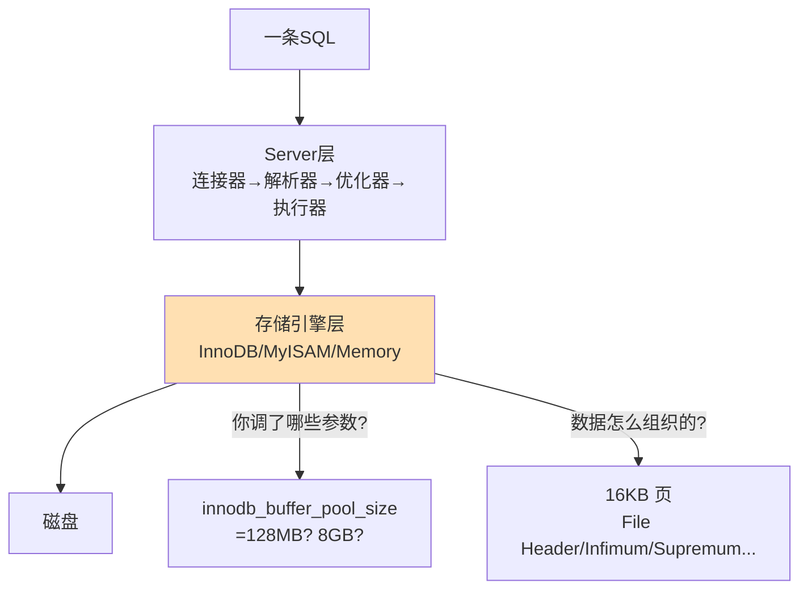
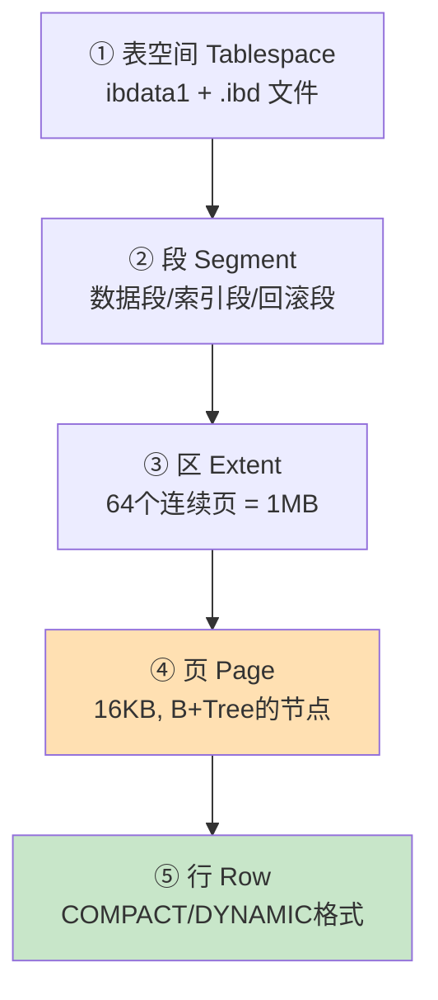
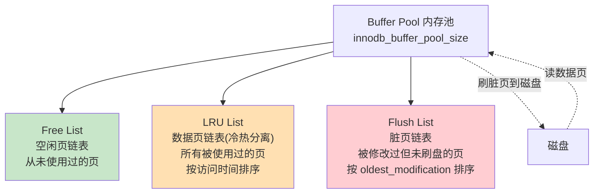
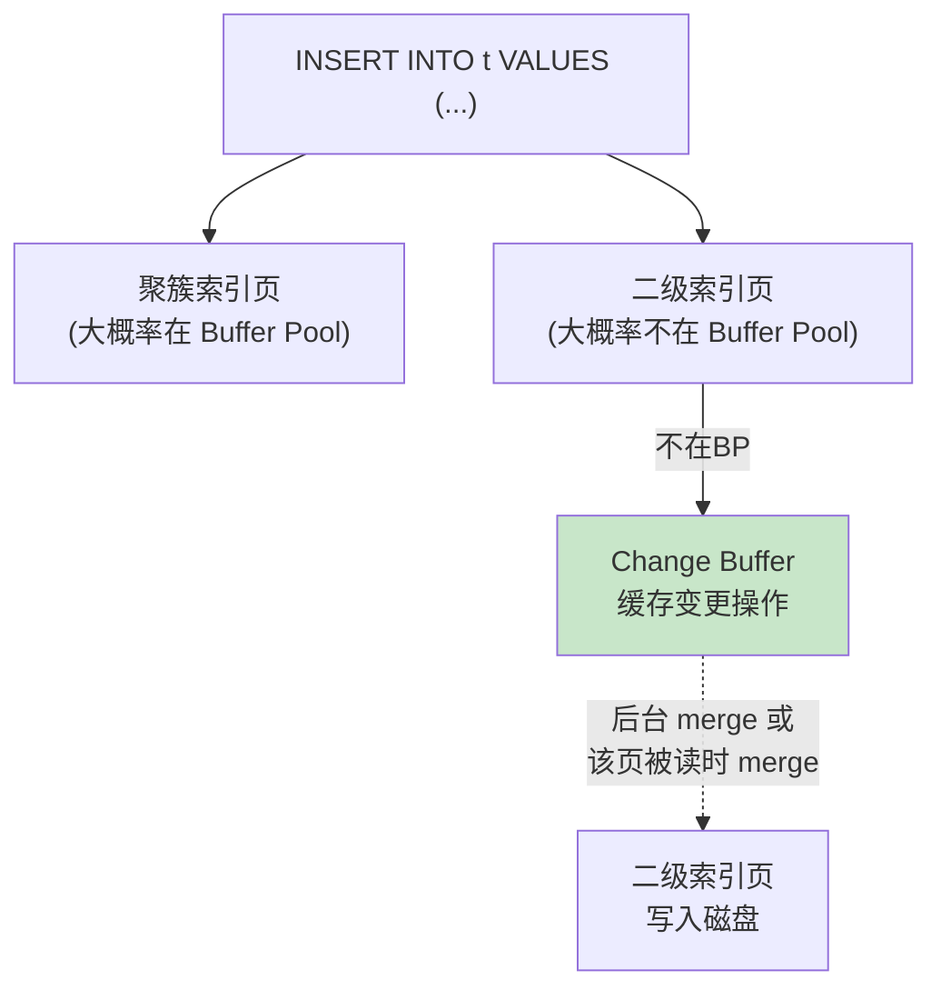
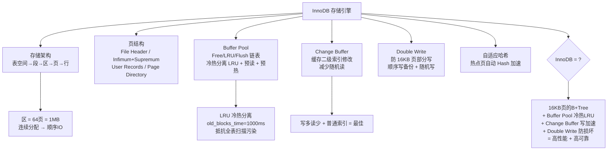

# 存储引擎对比

> InnoDB vs MyISAM、页结构、Buffer Pool 预热、Change Buffer 写入优化

#### 目录介绍
- [01.工作案例引入](#01工作案例引入)
  - [1.1 BP过小血案](#11-buffer-pool-太小引发的血案)
  - [1.2 为何学引擎](#12-为什么要深入存储引擎)
- [02.什么是存储引擎](#02什么是存储引擎)
  - [2.1 引擎职责](#21-存储引擎的职责)
  - [2.2 插件式架构](#22-mysql的插件式引擎架构)
  - [2.3 为何是InnoDB](#23-为什么innodb是默认引擎)
- [03.InnoDB存储架构](#03innodb存储架构)
  - [3.1 五层结构](#31-表空间的五层结构)
  - [3.2 文件详解](#32-表空间文件详解)
  - [3.3 段和区](#33-段segment和区extent)
- [04.InnoDB数据页结构](#04innodb数据页结构)
  - [4.1 页布局](#41-16kb页的完整布局)
  - [4.2 页目录](#42-页目录页内二分查找)
  - [4.3 记录格式](#43-记录格式compact与redundant)
  - [4.4 行溢出](#44-行溢出与blob页)
- [05.Buffer Pool](#05buffer-poolinnodb的心脏)
  - [5.1 三大链表](#51-buffer-pool的三大链表)
  - [5.2 冷热分离LRU](#52-冷热分离的lru)
  - [5.3 预读机制](#53-预读机制)
  - [5.4 脏页刷新策略](#54-脏页刷新策略)
  - [5.5 BP预热](#55-buffer-pool的预热)
  - [5.6 多实例BP](#56-多实例buffer-pool)
- [06.Change Buffer](#06change-buffer写入加速器)
  - [6.1 什么是Change Buffer](#61-什么是change-buffer)
  - [6.2 vs直接写盘](#62-change-buffer-vs-直接写磁盘)
  - [6.3 适用场景](#63-change-buffer的适用场景)
- [07.DoubleWrite](#07double-write-buffer)
  - [7.1 为何需要](#71-为什么需要double-write)
  - [7.2 工作流程](#72-double-write的工作流程)
- [08.自适应Hash](#08自适应哈希索引)
  - [8.1 AHI原理](#81-ahi的工作原理)
  - [8.2 开关与监控](#82-ahi的开关与监控)
- [09.InnoDB vs MyISAM](#09innodb-vs-myisam)
  - [9.1 维度对比](#91-八大维度对比)
  - [9.2 COUNT快](#92-为什么myisam的count快)
  - [9.3 何时MyISAM](#93-什么时候选myisam)
- [10.其他存储引擎速览](#10其他存储引擎速览)
  - [10.1 Memory引擎](#101-memory引擎)
  - [10.2 Archive引擎](#102-archive引擎)
  - [10.3 8.0新格局](#103-mysql-80引擎新格局)
- [11.综合案例](#11综合案例大促前的buffer-pool调优)
  - [11.1 场景与排查](#111-场景与排查)
  - [11.2 方案与效果](#112-调优方案与效果)
  - [11.3 知识图谱](#113-知识图谱回顾)
- [12.思考题与作业](#12思考题与作业)
  - [12.1 基础思考题](#121-基础思考题)
  - [12.2 进阶思考题](#122-进阶思考题)
  - [12.3 动手作业](#123-动手作业)


## 01.工作案例引入

### 1.1 BP过小血案

**场景**：大刘是一家社交平台的后端负责人。大促当晚，平台"动态流"接口的 P99 延迟从 30ms 飙升到 800ms，数据库 CPU io_wait 飙到 60%。大刘登上数据库：

```bash
$ vmstat 1
procs -----------memory---------- ---swap-- -----io---- -system-- ------cpu-----
 r  b   swpd   free   buff  cache   si   so    bi    bo   in   cs us sy id wa st
 8  5      0  200M    50M   1.2G    0    0  12000  8000  ...  ... 20 15 5 60  0
                                                       ^^^^^^ 磁盘读 12000 块/秒！
```

监控大盘显示：Buffer Pool 命中率从 99% 骤降到 75%。

```sql
SHOW ENGINE INNODB STATUS\G
-- Buffer pool hit rate: 752 / 1000  ← 命中率只有 75%！
-- Pages read: 48291, created 2943, written 18234
-- 0.00 reads/s, 0.00 creates/s, 890.00 writes/s  ← 疯狂刷脏页
-- LRU len: 8192, unzip_LRU len: 0
-- Free buffers: 64  ← 空闲页只有 64 个! 几乎耗尽!
-- Database pages: 8128  ← Buffer Pool 里的数据页
-- Modified db pages: 3890  ← 脏页占了近一半!
```

**疑惑链条**：

- "Buffer Pool 命中率从 99%→75%，意味着什么？" → 75% 的读请求要从磁盘读 → 每次 0.1-1ms → 请求全堵在磁盘 IO 上
- "为什么命中率突然骤降？" → 大促流量暴涨 → 数据访问范围扩大 → 热数据装不进 Buffer Pool → 频繁淘汰和读入
- "那加大 Buffer Pool 不就行了？" → 说得对，但为什么之前设那么小？因为线上跑了多个实例，不敢把内存都分给 MySQL
- "脏页占比接近 50% 说明什么？" → Buffer Pool 里将近一半的页都被修改过 → 内存压力大时大量刷脏页 → 磁盘写压力也上来了
- "Change Buffer 在这里起作用吗？" → 有用——如果大量非唯一普通索引的 INSERT，Change Buffer 可以显著减少随机 IO

大刘最后把 Buffer Pool 从 2GB 调整为 8GB，命中率回升到 98%。但他知道——他只是调了一个参数，对 Buffer Pool 内部的 LRU、free list、flush list 一知半解。

### 1.2 为何学引擎



**存储引擎是数据库性能的命脉**。索引原理告诉你"怎么找得快"，锁机制告诉你"怎么写不冲突"——但**数据到底存在磁盘的什么位置？内存怎么缓存？写入怎么加速？**——这些才是决定数据库吞吐量的底层因素。

本章以 InnoDB 为绝对主线，深入六层结构：
- **表空间 → 段 → 区 → 页 → 行** 的存储架构
- **Buffer Pool 的冷热分离 LRU** + 脏页刷新策略
- **Change Buffer** 如何让写入快 5 倍
- **Double Write** 如何防 16KB 页写一半崩溃


## 02.什么是存储引擎

### 2.1 引擎职责

存储引擎负责**数据的存储和提取**——把表数据写到磁盘、从磁盘读表数据：

```
Server 层: "我要读 products 表 id=10 这行"
存储引擎: "好的，我去表空间文件里找到 page 42，返回给你"
```

| 存储引擎的职责 | 具体做什么 |
|-------------|---------|
| 数据组织 | 行在磁盘上怎么存（行格式） |
| 索引实现 | 怎么建 B+Tree / Hash 索引 |
| 缓存管理 | Buffer Pool 怎么缓存数据页 |
| 事务支持 | 能不能回滚、支不支持 MVCC |
| 锁机制 | 行锁还是表锁 |
| 崩溃恢复 | 用 redo log / double write 恢复 |

### 2.2 插件式架构

MySQL 的存储引擎是**插件式**的——换引擎就像换硬盘，上层 SQL 接口不变：

```sql
-- 查看支持的引擎
SHOW ENGINES;
-- InnoDB: DEFAULT, 支持事务/行锁/XA/savepoints
-- MyISAM: 不支持事务/行锁
-- Memory: 所有数据在内存, 重启丢失
-- Archive: 只支持INSERT/SELECT, 高压缩比

-- 指定表的引擎
CREATE TABLE t (id INT) ENGINE = InnoDB;
ALTER TABLE t ENGINE = MyISAM;
```

**关键**：同一个数据库的不同表可以用不同引擎——但生产环境几乎全是 InnoDB。本章重点在 InnoDB，但会在第 9 章做 InnoDB vs MyISAM 的完整对比。

### 2.3 为何是InnoDB

从 MySQL 5.5.5 开始 InnoDB 成为默认引擎，因为它是**唯一同时满足**以下需求的引擎：

| 需求 | InnoDB | MyISAM | Memory |
|------|:---:|:---:|:---:|
| 事务(ACID) | ✅ | ❌ | ❌ |
| 行锁 | ✅ | ❌ 表锁 | ❌ 表锁 |
| MVCC | ✅ | ❌ | ❌ |
| 外键 | ✅ | ❌ | ❌ |
| 崩溃恢复 | ✅ redo log | ❌ repair table | ❌ 重启丢失 |
| 热备份 | ✅ xtrabackup | ⚠️ 需锁表 | ❌ |


## 03.InnoDB存储架构

### 3.1 五层结构

InnoDB 的数据从大到小分为五层：



### 3.2 文件详解

```
系统表空间 (ibdata1):
  - 数据字典 (8.0 已移除到独立的 .sdi 文件)
  - Change Buffer
  - Double Write Buffer
  - Undo 表空间 (8.0 默认独立出来)

独立表空间 (.ibd 文件, 每个表一个):
  - 表数据 + 索引
  - 每个表独立管理 → 碎片整理(optimize table)不影响其他表

查看文件:
$ ls -lh /var/lib/mysql/mydb/
-rw-r----- 1 mysql mysql  12M  orders.ibd
-rw-r----- 1 mysql mysql 256K  products.ibd

innodb_file_per_table = ON (默认, 推荐)
innodb_file_per_table = OFF → 所有表数据存在 ibdata1 → 难管理
```

### 3.3 段和区

**段（Segment）**是逻辑概念，一个索引对应两个段——叶子节点段 + 非叶子节点段。段由**区（Extent）**组成：

```
区 (Extent) = 64 个连续页 = 1MB
  → 提高磁盘顺序 IO 效率
  → 一个区内的页在磁盘上连续 → 一次磁盘旋转可以读到多页

分配策略:
  - 新段的前 32 个碎片页: 一个一个分配 (防止小表浪费 1MB)
  - 之后每次分配一个完整的区 (64页=1MB)
  - 大表大部分数据在连续的区中 → 顺序IO → 快
```


## 04.InnoDB数据页结构

### 4.1 页布局

**InnoDB 的磁盘读写最小单位是 16KB 页**。每个页有一个标准结构：

```
16KB InnoDB 页结构 (16384 字节):
┌─────────────────────────────────┐  ← 页开始
│ File Header (38B)               │  页类型/页号/校验和/LSN
├─────────────────────────────────┤
│ Page Header (56B)               │  记录数/槽数/空闲空间偏移
├─────────────────────────────────┤
│ Infimum + Supremum (26B)        │  虚拟最小/最大记录(用于边界)
├─────────────────────────────────┤
│ User Records (动态增长 ↓)       │  实际数据行(从前往后写)
├─────────────────────────────────┤
│ Free Space (中间空隙)            │  空闲空间
├─────────────────────────────────┤
│ Page Directory (动态增长 ↑)      │  页目录: 每4-8条记录一个槽(二分查找)
├─────────────────────────────────┤
│ File Trailer (8B)               │  校验和 + LSN(尾部) 防部分写
└─────────────────────────────────┘  ← 页结束
```

| 组件 | 大小 | 作用 |
|------|------|------|
| **File Header** | 38B | 页类型(B+Tree叶子/非叶子/undo等)、页号(4B, 最多 2^32 页=64TB) |
| **Page Header** | 56B | 该页有多少条记录、第一个空闲位置的偏移、槽数量 |
| **Infimum / Supremum** | 26B | 两个虚拟记录——标记页内所有"真实记录"的最小和最大边界 |
| **User Records** | 可变 | 实际数据行，以单链表的逻辑顺序排列(主键从小到大) |
| **Page Directory** | 可变 | 槽数组——每 4-8 条记录的"最大键"存一个槽 → 二分查找 → O(log n) |
| **File Trailer** | 8B | 页尾校验和 + LSN——如果和 File Header 的校验和不一致 → 页损坏了 |

### 4.2 页目录

**疑惑：一页可能有 100 条记录——怎么快速找到特定主键的行？**

通过 **页目录（Page Directory）** 在页内做二分查找：

```
假设一页有 16 条记录，每 4 条分一组:
  槽0 → Infimum → 记录1 → 记录2 → 记录3 → 记录4 (槽0指向记录4)
  槽1 → 记录5 → 记录6 → 记录7 → 记录8 (槽1指向记录8)
  槽2 → 记录9 → 记录10 → 记录11 → 记录12
  槽3 → 记录13 → 记录14 → 记录15 → 记录16 → Supremum

找主键=11:
  二分槽数组: 槽0主键=4, 槽1主键=8, 槽2主键=12
  11 在 8 和 12 之间 → 定位到槽1
  从记录8开始顺序扫描 → 10→11 → 命中!

页内查找: O(log₂ n) 二分 + O(4-8) 扫描 → 极快 (都在内存)
```

### 4.3 记录格式

InnoDB 的行格式经历了多次演进：

| 格式 | 时代 | 特点 |
|------|------|------|
| **REDUNDANT** | 古老 | 字段偏移列表在行头，冗余、空间利用率低 |
| **COMPACT** | 5.0+ | 字段长度逆序存储、NULL 位图、变长字段优化 |
| **DYNAMIC** | 5.7+ 默认 | BLOB/TEXT 完全存溢出页，行本身只存 20B 指针 |
| **COMPRESSED** | 5.7+ | 类似 DYNAMIC，额外支持页级压缩 |

COMPACT 行格式布局：

```
COMPACT 行格式:
┌──────────────┬──────────┬─────────┬──────────┐
│ 变长字段长度列表 │ NULL位图 │ 记录头   │ 列1 │ 列2 │ ... │
│ (逆序: 每列1-2B)│ (1B起)  │ (5B)    │     │     │     │
└──────────────┴──────────┴─────────┴──────────┘

记录头 (5B) 包含:
  - 下一条记录的相对位置 (2B)  → 形成单链表
  - 记录类型: 普通/Infimum/Supremum
  - 该记录是否被删除 (1bit)   → 标记删除, 不真正删除
  - 记录的槽号 (变量)
```

### 4.4 行溢出

**疑惑：一行数据 20KB，但一页只有 16KB——怎么存？**

DYNAMIC 和 COMPRESSED 格式下：

```
普通列: 存在本页 → 行必须能放进一页

BLOB/TEXT/超长VARCHAR (COMPACT/以前):
  → 前 768 字节存本页 + 其余存溢出页 (多页存储)

BLOB/TEXT/超长VARCHAR (DYNAMIC, MySQL 5.7+默认):
  → 本页只存 20 字节指针 → 完全存溢出页
  → 优点: 主键索引更紧凑, B+Tree 高度更低
```

**探索性问题**：为什么 VARCHAR(65535) 实际最大是 65533？

```
VARCHAR 最大 65535 字节
但 InnoDB 每行开销: 2B 长度 + 1B NULL位图 + 5B 记录头 + ... ≈ 至少 2B 额外
→ 65535 - 2 = 65533 (utf8mb4 下更少, 因为一个字符 4 字节上限)
```


## 05.Buffer Pool

### 5.1 三大链表

Buffer Pool 是 InnoDB 在内存中的**数据页缓存池**。所有读/写操作首先通过它：



```
三大链表的关系:
  - 一个页从 Free List 取出 → 放入 LRU List
  - 如果页被修改(DML) → 同时也在 Flush List 中
  - 如果页被淘汰出 LRU → 脏页先刷盘 → 放回 Free List

查询 Buffer Pool 状态:
SHOW ENGINE INNODB STATUS\G
  Free buffers:      1024   ← 空闲页数
  Database pages:    7168   ← LRU List 中的页数
  Modified db pages:  512   ← Flush List 中的脏页数
```

### 5.2 冷热分离LRU

**疑惑：如果只用标准 LRU，一次全表扫描会把热数据全部踢出 Buffer Pool——怎么避免？**

InnoDB 的 LRU 是**冷热分离**的——新读入的页先放入"冷区"（old sublist），只有再次访问才会晋升到"热区"（young sublist）：

```
Buffer Pool LRU 链表 (冷热分离):

[热区 young sublist] ←────────→ [冷区 old sublist]
 5/8 的空间                      3/8 的空间
 真正被频繁访问的页                  刚读入、不确定是否热的页

新页读入:
  1. 插入冷区头部 (不是热区尾部!)
  2. 如果在 innodb_old_blocks_time(默认1000ms) 内被再次访问 → 不晋升到热区
     → 这是为了防止全表扫描的页占用热区
  3. 如果超过 1000ms 后被访问 → 晋升到热区头部

innodb_old_blocks_pct = 37 (冷区占 37%)
innodb_old_blocks_time = 1000 (冷区停留 1000ms 后才允许晋升)
```

**这就是 InnoDB 能抵抗全表扫描冲击的原因**——全表扫描的页快速读完就丢弃，不会污染热区。

### 5.3 预读

InnoDB 在检测到**顺序访问模式**时，会主动把后续页预读到 Buffer Pool：

```
线性预读 (Linear Read-Ahead):
  触发条件: 一个 extent(64页) 中连续 56 页(innodb_read_ahead_threshold) 被顺序访问
  行为: 预读整个 extent 剩余页

随机预读 (Random Read-Ahead):
  触发条件: 同一个 extent 中连续 13 页被访问(不管顺序)
  行为: 预读该 extent 剩余页
  8.0 默认关闭(innodb_random_read_ahead=OFF)
```

### 5.4 脏页刷新

当 Free List 页不够时，InnoDB 需要把 Flush List 中的脏页**刷回磁盘**：

```
脏页刷新触发条件:
  1. Redo log 快满了 → 必须刷脏页来释放 redo 空间 (最紧急!)
  2. Free List 空闲页 < innodb_lru_scan_depth → 扫描 LRU 冷区尾部, 释放空间
  3. Buffer Pool 不够用 → 淘汰 LRU 尾部的脏页

innodb_max_dirty_pages_pct = 75  → 脏页占比上限
innodb_max_dirty_pages_pct_lwm = 10 → 预刷: 低于此值不主动刷

脏页刷新是"Buffer Pool 命中率骤降"时的罪魁祸首:
  → 如果 innodb_io_capacity(200) 设得太小 → 刷盘太慢
  → 脏页堆积 → Redo log 快满 → 触发"Sharp Checkpoint" → 疯狂刷盘 → IO 打满
```

### 5.5 BP预热

**疑惑：MySQL 重启后 Buffer Pool 是空的，查询全部走磁盘——怎么加速冷启动？**

```
MySQL 5.6+: 关闭时 dump Buffer Pool 的页号列表
  innodb_buffer_pool_dump_at_shutdown = ON
  → 关闭时把 LRU 中的页号写到 ib_buffer_pool 文件

MySQL 5.6+: 启动时加载页号列表
  innodb_buffer_pool_load_at_startup = ON
  → 启动后异步把这些页从磁盘读入 Buffer Pool
  → 新请求不会全部命中磁盘 → 冷启动性能大幅提升

手动操作:
SET GLOBAL innodb_buffer_pool_dump_now = ON;   -- 手动 dump
SET GLOBAL innodb_buffer_pool_load_now = ON;   -- 手动 load
```

### 5.6 多实例BP

MySQL 5.7.5+，当 `innodb_buffer_pool_size >= 1GB` 时，InnoDB 自动拆分为多个实例：

```
innodb_buffer_pool_instances = 8 (最大 64)

每个实例独立管理自己的 Free/ LRU / Flush List
→ 减少"多线程并发访问 Buffer Pool"时的锁竞争
→ 高并发下性能提升显著

经验公式:
  BP < 1GB: instances = 1
  BP 1-8GB: instances = min(8, 每 GB 一个)
  BP > 8GB: instances = 8-16
```


## 06.Change Buffer

### 6.1 定义

**疑惑：INSERT 一条数据到有二级索引的表——InnoDB 怎么处理？**

```
一次 INSERT 的磁盘操作:
  1. 在聚簇索引的叶子页插入行 ✓  (一次性操作)
  2. 在每个二级索引的叶子页插入索引记录 ✗ (多次随机 IO!)

Change Buffer 优化:
  如果二级索引页不在 Buffer Pool 中:
    → 不立刻去磁盘读这个页
    → 而是把"我要插入这条记录"这个操作缓存到 Change Buffer
    → 等后续有读请求需要这个页时 → merge Change Buffer 到页 + 返回
    → 或后台线程定期 merge
```



### 6.2 vs直接写盘

```
没有 Change Buffer:
  每次 INSERT → 检查二级索引页是否在 BP
  → 不在 → 从磁盘读入 BP → 修改 → 标记脏页 → 后续批量刷盘
  → 每次 INSERT 多一次随机磁盘读 (0.1-1ms)
  → 1000 INSERT/s → 1000 次额外磁盘读 → IO 瓶颈

有 Change Buffer:
  每次 INSERT → 检查二级索引页是否在 BP
  → 不在 → 直接在 Change Buffer 记录"这里要插入一条" → 完成!
  → 没有磁盘读!
  → 1000 INSERT/s → 0 次额外磁盘读
  → 写入吞吐量提升 5-10 倍!
```

### 6.3 适用场景

```
✅ 适用场景: 写多读少 + 普通索引
  - 大量 INSERT 到冷表 (二级索引页不在 BP)
  - 批量数据导入
  - 日志类表 (几乎只有写入，很少查询二级索引)

❌ 不适用场景:
  - 唯一索引: 插入前必须读磁盘确认不重复 → 无法用 Change Buffer
  - SSD: 随机读仅 0.1ms → Change Buffer 收益降低
  - 读多写少: 大部分索引页在 BP → 不需要 Change Buffer

调优:
innodb_change_buffering = all      ← 缓存所有操作(insert/delete/purge)
innodb_change_buffer_max_size = 25 ← Change Buffer 占 BP 的最大比例
```

**探索性问题**：为什么唯一索引不能用 Change Buffer？

```
唯一索引要求"插入前确认不重复"

如果目标页在磁盘 → 必须读到内存才能判断是否重复
→ 读磁盘这一步没法省
→ Change Buffer 只缓存"写操作", 不能跳过"判断唯一性"所需的磁盘读
→ 所以唯一索引的 INSERT 不能用 Change Buffer

这就是为什么高写入场景建议普通索引+应用层保证唯一性
```


## 07.DoubleWrite

### 7.1 为何需要

**疑惑：InnoDB 页是 16KB，但磁盘的最小写入单位是 512B/4KB（扇区）——如果写 16KB 页时突然断电，会发生什么？**

这就是**部分写失效（Partial Write）**——页只有一部分被写入磁盘，另一部分是旧数据或全零。单靠 redo log 无法恢复这种损坏（redo log 假设页本身是完整的）。

### 7.2 工作流程

```
Double Write Buffer 是磁盘上的一块连续区域(2MB=128个16KB页):

写脏页的流程:
  Step 1: 把 16KB 脏页先顺序写到 Double Write Buffer (内存→Double Write磁盘)
          → 这是顺序写, 快 (1次磁盘操作写多个页)
  Step 2: 确认 Double Write 写完后 → 再把页随机写到表空间的实际位置
          → 这是随机写, 慢 (但数据已安全)
  Step 3: 如果 Step 2 中崩溃 → 重启恢复时从 Double Write Buffer 复制完整页覆盖损坏位置

Double Write 的开销:
  每个脏页多写一次(顺序写) → 总体写入量增加约 5-10%
  换来的是: 16KB 页永远不会部分损坏 → 值得!
```

**探索性问题**：为什么 redo log 不能替代 Double Write？

```
Redo log 记录的是"物理逻辑日志"——"把页 100 偏移 200 处的 4 字节改成 0xFF"
如果页本身已经损坏(部分写) → redo log 修改的是"损坏页" → 改完仍然是错的

Double Write 保证页本身是完整的 → redo log 修复的是"完整但内容旧的页"
两者分工:
  Double Write: 保证页的物理完整性
  Redo log:     保证页内容的逻辑正确性
```


## 08.自适应Hash

### 8.1 AHI原理

InnoDB 会自动监控 Buffer Pool 中的页访问模式——如果某个索引页**被频繁等值查询**，InnoDB 自动给它建一个 Hash 索引：

```
AHI 的触发条件:
  - 某个索引页被连续等值查询 N 次 (N=16 或更少)
  - 访问模式是等值查找 (非范围扫描)

AHI 存储在哪:
  - 存于 Buffer Pool 的 Adaptive Hash Index 区域
  - 重启后丢失，自动重建
```

### 8.2 开关与监控

```sql
-- 查看 AHI 状态
SHOW ENGINE INNODB STATUS\G
-- 搜索 "INSERT BUFFER AND ADAPTIVE HASH INDEX"
-- Hash table size 4425293
-- Hash searches/s: 15283.45    ← AHI 命中的次数
-- Non-hash searches/s: 821.20  ← 没命中，走 B+Tree

-- 关闭 AHI (写入密集型可能反而拖慢)
SET GLOBAL innodb_adaptive_hash_index = OFF;
```

**AHI 的局限**：范围查询不能用 Hash，写入密集时维护 Hash 的开销 > 收益。


## 09.InnoDB vs MyISAM

### 9.1 维度对比

| 维度 | InnoDB | MyISAM |
|------|--------|--------|
| **事务** | ✅ ACID | ❌ |
| **行锁** | ✅ 行锁 + 间隙锁 | ❌ 只支持表锁 |
| **MVCC** | ✅ | ❌ |
| **外键** | ✅ | ❌ |
| **崩溃恢复** | ✅ redo log 自动恢复 | ❌ 手动 REPAIR TABLE |
| **数据存储** | 聚簇索引(数据即索引) | 堆表(数据+索引分离) |
| **COUNT(*)** | 需扫描索引 (~0.1s/千万行) | **O(1)** 维护计数器 |
| **压缩** | COMPRESSED 行格式 | 静态/动态压缩表 |
| **全文索引** | MySQL 5.6+ 支持 | ✅ 原生支持 |
| **表空间文件** | .ibd (每表一个) | .MYD(数据) + .MYI(索引) |

### 9.2 COUNT快

MyISAM 维护了每张表的**行数计数器**——`SELECT COUNT(*)` 直接返回这个数，而 InnoDB 需要扫描索引。代价是 MyISAM 并发写入时更新计数器需要表锁。

### 9.3 何时MyISAM

```
MyISAM 的唯二优势场景:
  1. 纯读、不需要事务的日志归档表 (但 Archive 引擎压缩更高)
  2. MySQL 5.6 之前的全文索引 (现在 InnoDB 已支持)

生产环境铁律: 默认都用 InnoDB
  除非你有非常确定且无可替代的理由
```


## 10.其他存储引擎速览

### 10.1 Memory

数据全部存在内存，重启丢失。适合临时表、会话数据。默认 Hash 索引（O(1) 等值），不支持事务。

### 10.2 Archive

只支持 INSERT 和 SELECT，用 zlib 压缩（压缩比 ~10:1），适合日志归档。不支持索引（5.6+ 支持自增列索引）。

### 10.3 8.0新格局

```
已移除的引擎: FEDERATED, ndbcluster 相关
新增特性: InnoDB 支持 DDL 原子性(8.0+), 数据字典统一为 InnoDB
趋势: InnoDB 一家独大, 其他引擎向 InnoDB 靠拢
```


## 11.综合案例

### 11.1 场景排查

回到 1.1 节大刘的场景——32GB 服务器跑 MySQL + Redis：

```bash
# 当前配置
innodb_buffer_pool_size = 2G       # 只用了 32G 的 6%!
innodb_buffer_pool_instances = 1    # 单实例, 高并发下锁竞争
innodb_io_capacity = 200            # 低配磁盘, 脏页刷太慢
innodb_change_buffer_max_size = 25  # 正常

# 大促期间监控
SHOW ENGINE INNODB STATUS\G
  Buffer pool hit rate: 752 / 1000   ← 致命! 75% 命中率
  Free buffers: 64                   ← 空闲页几乎耗尽
  Modified db pages: 3890            ← 脏页一半
```

### 11.2 方案与效果

```ini
# /etc/my.cnf 调整
innodb_buffer_pool_size = 8G          # 2G → 8G → 提升命中率
innodb_buffer_pool_instances = 8      # 1 → 8 → 减少锁竞争
innodb_io_capacity = 2000             # 200 → 2000(SSD) → 加快脏页刷新
innodb_io_capacity_max = 4000         # 紧急情况最大刷新速度
innodb_max_dirty_pages_pct = 50       # 75 → 50 → 控制脏页水位
innodb_max_dirty_pages_pct_lwm = 10   # 水位下不主动刷
innodb_flush_neighbors = 0            # SSD 不需要刷相邻脏页
innodb_read_ahead_threshold = 0       # 关闭预读(随机访问为主)
```

```
调优效果:
  Buffer Pool 命中率: 75% → 98%
  P99 延迟: 800ms → 35ms
  CPU wa: 60% → 5%
  Free buffers: 64 → 1800
  Dirty pages: 50% → 15%
```

### 11.3 知识图谱



**最终方法论——Buffer Pool 调优四步法**：

1. **看命中率**：`SHOW ENGINE INNODB STATUS` → Buffer pool hit rate < 95% = 太小
2. **看空闲页**：Free buffers 经常 < 100 = Buffer Pool 不够
3. **看脏页比例**：Modified db pages / Database pages > 50% = 刷盘跟不上
4. **调 io_capacity**：SSD=2000-4000, HDD=200-400


## 12.思考题与作业

### 12.1 基础思考题

1. **五层结构**：InnoDB 的表空间→段→区→页→行分别是什么？为什么区要设计成 64 页=1MB 连续空间？

2. **页结构**：InnoDB 的 16KB 页有哪些组成部分？页目录（Page Directory）是怎么实现页内二分查找的？

3. **Buffer Pool 三大链表**：Free List、LRU List、Flush List 分别存什么样的页？一个脏页同时存在于哪两个链表中？

4. **冷热分离 LRU**：InnoDB 为什么要把 LRU 分成热区和冷区？`innodb_old_blocks_time=1000ms` 参数的作用是什么？

5. **Change Buffer 适用条件**：什么场景下 Change Buffer 效果好？为什么唯一索引不能用 Change Buffer？

### 12.2 进阶思考题

1. **1.1 节复盘**：大刘的 Buffer Pool 命中率从 99%→75%。如果他把 `innodb_buffer_pool_size` 从 2G 继续推到 16G（物理内存的一半），可能存在什么风险？（提示：OS Page Cache 被挤压）

2. **Double Write 到底费不费**：SSD 上 Double Write 的额外写入量大约占 5-10%——为什么生产环境还是建议开启？什么情况下可以关？

3. **Change Buffer merge 时机**：Change Buffer 里的操作什么时候被 merge 到真正的索引页？三种触发方式分别是什么？如果突然大量读取冷的二级索引会发生什么？

4. **Buffer Pool 预热 vs 冷启动**：MySQL 重启后，Buffer Pool 预热是"异步加载"而不是"同步阻塞"——这意味着什么？如果刚重启就来大量流量怎么办？

5. **COMPACT vs DYNAMIC 行格式**：为什么 MySQL 5.7 把默认行格式从 COMPACT 改为 DYNAMIC？对大表有哪些实际影响？

### 12.3 动手作业

**作业一（必做）**：查看当前 Buffer Pool 状态。

```sql
SHOW ENGINE INNODB STATUS\G
-- 找到 BUFFER POOL AND MEMORY 段
-- 记录: 命中率 / Free buffers / Database pages / Modified db pages
-- 判断你的 BP 是否够用
```

**作业二（选做）**：对比 InnoDB vs MyISAM 的 COUNT 性能。

```sql
-- 创建 1000 万行测试表 (分别用 InnoDB 和 MyISAM)
-- 执行 SELECT COUNT(*) 对比耗时
-- 同时在另一个会话做 INSERT → MyISAM 的 COUNT 会被阻塞吗？
```

**作业三（选做）**：复现 Buffer Pool 冷热分离。

```sql
-- 用全表扫描冲掉 Buffer Pool
SELECT COUNT(*) FROM large_table;  -- 扫描全表
SHOW ENGINE INNODB STATUS\G  -- 观察 LRU 链表长度的变化
```

**作业四（架构思考）**：对你最熟悉的数据库实例——当前 `innodb_buffer_pool_size` 设多大？物理内存占比合理吗？命中率多少？脏页占比多少？Change Buffer 和 Double Write 开了吗？是否需要调优？