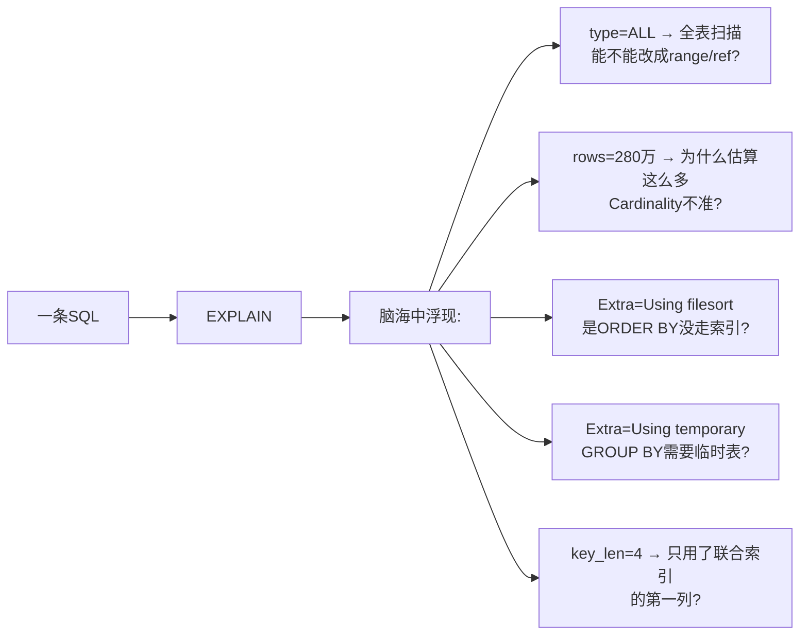
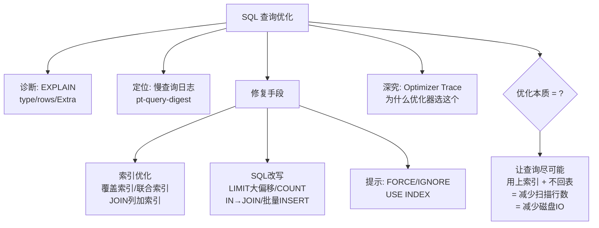

# 数据库查询优化精要

> EXPLAIN 字段逐行解读、慢查询定位、索引失效十大场景、SQL 改写技巧

#### 目录介绍
- [01.工作案例引入](#01工作案例引入)
  - [1.1 首页加载5秒](#11-首页加载5秒一条sql引发的血案)
  - [1.2 为何学优化](#12-为什么要学查询优化)
- [02.EXPLAIN解读](#02explain深度解读)
  - [2.1 EXPLAIN是什么](#21-explain是什么)
  - [2.2 执行顺序](#22-id表的执行顺序)
  - [2.3 查询类型](#23-select_type查询类型)
  - [2.4 访问类型](#24-type访问类型最重要的字段)
  - [2.5 选了何索引](#25-possible_keys与key选了什么索引)
  - [2.6 索引字节](#26-key_len用了索引的多少字节)
  - [2.7 扫描行数](#27-rows估算扫描行数)
  - [2.8 额外信息](#28-extra额外信息第二重要的字段)
  - [2.9 JSON格式](#29-explain-formatjson更精确的信息)
- [03.慢查询日志](#03慢查询日志)
  - [3.1 开启与配置](#31-开启与配置)
  - [3.2 慢查询工具](#32-mysqldumpslow分析工具)
  - [3.3 慢查询之王](#33-pt-query-digest慢查询之王)
- [04.索引优化](#04sql优化实战索引篇)
  - [4.1 失效清单](#41-索引失效的排查清单)
  - [4.2 JOIN优化](#42-join优化)
  - [4.3 排序分组优化](#43-order-by与group-by优化)
  - [4.4 子查询优化](#44-子查询优化)
- [05.改写优化](#05sql优化实战改写篇)
  - [5.1 大偏移量](#51-limit-大偏移量优化)
  - [5.2 COUNT优化](#52-count优化)
  - [5.3 IN vs EXISTS](#53-in-vs-exists)
  - [5.4 分页姿势](#54-分页查询的正确姿势)
  - [5.5 批量写入](#55-多值insert批量写入加速)
- [06.优化器追踪](#06查询优化器追踪)
  - [6.1 选全表原因](#61-optimizer-trace为什么选了全表扫描)
  - [6.2 强制索引](#62-强制索引的边界)
- [07.综合案例](#07综合案例多表关联订单查询优化)
  - [7.1 原始SQL](#71-场景与原始sql)
  - [7.2 优化流程](#72-优化全流程)
  - [7.3 知识图谱回顾](#73-知识图谱回顾)
- [08.思考题与作业](#08思考题与作业)
  - [8.1 基础思考题](#81-基础思考题)
  - [8.2 进阶思考题](#82-进阶思考题)
  - [8.3 动手作业](#83-动手作业)


## 01.工作案例引入

### 1.1 首页加载5秒

**场景**：小赵是一家电商公司的后端开发。周一早会，运营总监发来一张截图："App 首页加载要 5 秒，用户全在吐槽"。小赵打开慢查询日志：

```sql
# Time: 2024-06-17 09:30:15
# Query_time: 5.123456  Lock_time: 0.000123  Rows_sent: 20  Rows_examined: 2893456
# Rows_examined: 289 万行! 返回只有 20 行!

SELECT o.order_id, o.user_id, o.amount, o.status, o.create_time,
       u.nickname, u.avatar,
       p.product_name, p.price
FROM orders o
LEFT JOIN users u ON o.user_id = u.user_id
LEFT JOIN products p ON o.product_id = p.product_id
WHERE o.status = 'paid'
  AND o.create_time >= '2024-06-10'
ORDER BY o.create_time DESC
LIMIT 20;
```

小赵先跑 EXPLAIN：

```sql
EXPLAIN SELECT ...\G
-- 结果:
-- id: 1 | table: o        | type: ALL  | key: NULL | rows: 2800000 | Extra: Using where; Using filesort
-- id: 1 | table: u        | type: ALL  | key: NULL | rows: 500000  | Extra: Using where
-- id: 1 | table: p        | type: ALL  | key: NULL | rows: 300000  | Extra: Using where
```

**"三张表全表扫描 + filesort！"**——小赵瞬间明白了问题根源。

**疑惑链条**：

- "为什么 `orders` 表 280 万行全表扫描？" → `status` 和 `create_time` 没建联合索引，优化器只能扫全表过滤
- "`Using filesort` 是什么意思？" → ORDER BY 的列没走索引 → MySQL 必须在内存/磁盘上额外排序 → 慢！
- "为什么三个表都是 `type=ALL`？" → JOIN 的两边都没索引 → `users` 和 `products` 也是全表扫描 → 每次从 orders 找到一行就去 users 和 products 各扫一次全表
- "怎么优化？" → ① 建联合索引覆盖 WHERE + ORDER BY ② 确保 JOIN 列有索引 ③ SELECT 只取需要的列

**小赵的修复**：

```sql
-- 建索引
ALTER TABLE orders ADD INDEX idx_status_time (status, create_time);
ALTER TABLE users ADD INDEX idx_user_id (user_id);
ALTER TABLE products ADD INDEX idx_product_id (product_id);

-- 重跑 EXPLAIN
-- o: type=ref, key=idx_status_time, rows=15000, Extra=Using index condition
-- u: type=ref, key=idx_user_id, rows=1
-- p: type=ref, key=idx_product_id, rows=1

-- 从 289 万行扫描 → 15000 行, 从 5 秒 → 0.05 秒!
```

### 1.2 为何学优化

小赵的这次优化只改了三行 `ALTER TABLE`——但背后的知识量远超"加个索引"。真正的查询优化工程师，每次看到 `EXPLAIN` 输出时，脑海中浮现的是：



本章是前 5 章的**综合应用**——索引原理、事务隔离、锁机制、存储引擎的知识，最终都落实到"这条 SQL 能不能更快"这一个问题上。


## 02.EXPLAIN解读

### 2.1 EXPLAIN是什么

`EXPLAIN` 让你在**不实际执行 SQL** 的情况下，看到 MySQL 优化器的执行计划：

```sql
EXPLAIN SELECT ...\G               -- 查看执行计划
EXPLAIN FORMAT=JSON SELECT ...\G   -- JSON格式, 更精确
EXPLAIN ANALYZE SELECT ...\G       -- MySQL 8.0.18+, 实际执行并统计
```

`EXPLAIN` 输出是一个表格，每个字段对应一条执行计划信息：

| 字段 | 含义 | 重要性 |
|------|------|:---:|
| `id` | SELECT 的执行顺序 | ⭐⭐ |
| `select_type` | 查询类型（简单/子查询/UNION） | ⭐⭐ |
| `table` | 访问的表名 | ⭐ |
| **`type`** | **访问类型——最重要** | ⭐⭐⭐⭐⭐ |
| `possible_keys` | 可选的索引 | ⭐⭐ |
| `key` | 实际使用的索引 | ⭐⭐⭐ |
| `key_len` | 用到的索引字节数 | ⭐⭐⭐ |
| `ref` | 与索引比较的列/常量 | ⭐⭐ |
| **`rows`** | 估算扫描行数 | ⭐⭐⭐⭐ |
| **`Extra`** | **额外信息——第二重要** | ⭐⭐⭐⭐⭐ |

### 2.2 执行顺序

```sql
-- id 相同: 从上往下执行(MySQL 优化器决定的顺序)
EXPLAIN SELECT * FROM o JOIN u ON o.user_id = u.id;
-- id: 1 | table: u  ← 优化器决定先读 users
-- id: 1 | table: o  ← 再读 orders

-- id 不同: 值越大越先执行
EXPLAIN SELECT * FROM o WHERE user_id IN (SELECT id FROM u WHERE status=1);
-- id: 1 | table: u  ← 子查询先执行
-- id: 2 | table: o  ← 外层查询后执行
```

### 2.3 查询类型

| select_type | 含义 | 示例 |
|-------------|------|------|
| `SIMPLE` | 简单查询，不用子查询/UNION | `SELECT * FROM t` |
| `PRIMARY` | 最外层查询 | — |
| `SUBQUERY` | SELECT/WHERE 中的子查询 | `WHERE id IN (SELECT ...)` |
| `DERIVED` | FROM 子句中的子查询（派生表） | `FROM (SELECT ...) AS tmp` |
| `UNION` | UNION 中第二个及之后的 SELECT | — |
| `DEPENDENT SUBQUERY` | **相关子查询**——严重低效！ | `WHERE col = (SELECT col2 FROM t2 WHERE t2.id = t1.id)` |

**`DEPENDENT SUBQUERY` 是性能杀手**——外层每行都要执行一次子查询。应尽量改写为 JOIN。

### 2.4 访问类型

**从最好到最差排列**：

```
system > const > eq_ref > ref > range > index > ALL
       唯一索引   唯一索引  普通索引  范围    全索引  全表
       等值1行    等值1行   等值     扫描    扫描    扫描
```

| type | 含义 | 示例 | 性能 |
|------|------|------|:---:|
| **system** | 表只有一行（系统表） | — | 极快 |
| **const** | 主键/唯一索引等值查，最多一行 | `WHERE id = 1` | 极快 |
| **eq_ref** | JOIN时被驱动表用主键/唯一索引关联 | `ON a.id = b.id` | 快 |
| **ref** | 普通索引等值查 | `WHERE name = 'Tom'` | 快 |
| **range** | 索引范围扫描 | `WHERE id > 10 AND id < 100` | 中等 |
| **index** | 扫描整个索引（不扫数据行） | `SELECT id FROM t` | 慢 |
| **ALL** | 全表扫描 | `WHERE name LIKE '%Tom'` | **极慢** |

**生产铁律：`type` 目标至少 `range`，争取 `ref`。`ALL` 必须优化。**

### 2.5 选了何索引

```
possible_keys: NULL          ← 没有可用的索引 → 必须建索引
possible_keys: idx_a, idx_b  ← 有两个可用
key:          idx_a          ← 优化器选了 idx_a

key: NULL 且 possible_keys: NOT NULL → 优化器认为全表扫描更快
  → 可能原因: Cardinality 太低, 回表代价太高
  → 对策: ANALYZE TABLE 更新统计信息, 或用 FORCE INDEX
```

### 2.6 索引字节

`key_len` 告诉你**联合索引中实际用了几列**——是判断最左前缀是否命中的关键：

```sql
-- 联合索引 idx(a INT, b VARCHAR(20), c INT)
-- 索引 a: 4B(INT) + 1B(NULLable) = 5B
-- 索引 b: 20*3(utf8) + 2B(变长) + 1B(NULLable) = 63B
-- 索引 c: 4B(INT) + 1B(NULLable) = 5B

EXPLAIN SELECT * FROM t WHERE a = 1 AND b = 'x';
-- key_len = 68 (5+63) → 用了 a 和 b, c 没用上 ✅

EXPLAIN SELECT * FROM t WHERE a = 1 AND c = 1;
-- key_len = 5 (只有 a) → b 跳过了, c 没用上! ⚠️ 最左前缀被破坏
```

**`key_len` 越长越好**——意味着联合索引越多列被利用。

### 2.7 扫描行数

这是**估算值**，基于 Cardinality 统计信息——不是精确值，但有参考意义：

```
目标: rows << 总行数
  rows = 10 且返回 10 行 → 完美
  rows = 1000000 且返回 10 行 → 严重低效 → 需要优化

如果 rows 明显偏高:
  → Cardinality 过期 → ANALYZE TABLE 刷新统计信息
```

### 2.8 额外信息

| Extra | 含义 | 严重度 | 如何处理 |
|-------|------|:---:|---------|
| **Using index** | **覆盖索引，不回表** | ✅ 优秀 | 这是目标！ |
| Using index condition | ICP 引擎层过滤 | ✅ 不错 | 减少了回表 |
| Using where | Server 层过滤 | 🟡 一般 | 数据在引擎层返回后还需过滤 |
| **Using filesort** | **额外排序** | 🔴 高危 | ORDER BY 列加索引 |
| **Using temporary** | **创建临时表** | 🔴 高危 | GROUP BY/DISTINCT 列加索引 |
| Using join buffer | JOIN 用了内存缓冲 | 🟠 中等 | JOIN 列加索引 |
| Impossible WHERE | WHERE 永远为 false | 🟢 信息 | 检查逻辑 |

**`Using filesort` 和 `Using temporary` 是 `Extra` 里的两个雷**——看到它们必须优化：

```sql
-- ❌ Using filesort: ORDER BY 没走索引
EXPLAIN SELECT * FROM orders WHERE status='paid' ORDER BY create_time DESC;
-- Extra: Using where; Using filesort

-- ✅ 修复: 加联合索引
ALTER TABLE orders ADD INDEX idx_st_ct (status, create_time);
-- Extra: Using index condition  ← filesort 消失了!
```

### 2.9 JSON格式

传统 `EXPLAIN` 输出有些信息被隐藏了，JSON 格式给出更完整的成本估算：

```sql
EXPLAIN FORMAT=JSON SELECT ...\G
{
  "query_cost": "1523.45"    ← 总查询成本
  "table": {
    "access_type": "ref",
    "rows_examined_per_scan": 100,
    "filtered": 50,           ← 引擎层过滤后剩余 50%
    "cost_info": {
      "read_cost": "100.00",    ← IO 成本
      "eval_cost": "50.00",     ← CPU 成本
      "prefix_cost": "150.00"   ← 本表累计成本
    },
    "used_columns": [ ... ],
    "attached_condition": "orders.status = 'paid'"
  }
}
```

`query_cost` 是优化器做决策的依据——成本越低越好。


## 03.慢查询日志

### 3.1 开启与配置

```sql
-- 查看慢查询配置
SHOW VARIABLES LIKE 'slow_query%';
SHOW VARIABLES LIKE 'long_query_time';

-- 开启慢查询日志
SET GLOBAL slow_query_log = ON;
SET GLOBAL long_query_time = 0.1;          -- 超过 100ms 记录
SET GLOBAL log_queries_not_using_indexes = ON;  -- 记录没走索引的查询
SET GLOBAL min_examined_row_limit = 1000;  -- 扫描超过 1000 行才记录
```

```bash
# 慢日志位置
$ cat /var/lib/mysql/slow-query.log
# Time: 2024-06-17T09:30:15.123456Z
# User@Host: app[app] @ [10.0.1.5]
# Query_time: 5.123456  Lock_time: 0.000123  Rows_sent: 20  Rows_examined: 2893456
SELECT ...;
```

### 3.2 慢查询工具

```bash
# 按查询时间排序，返回前 10
mysqldumpslow -s t -t 10 /var/lib/mysql/slow-query.log

# 按锁定时间排序
mysqldumpslow -s l -t 10 slow-query.log

# 按返回行数排序
mysqldumpslow -s r -t 10 slow-query.log
```

### 3.3 慢查询之王

Percona Toolkit 的 `pt-query-digest` 能对慢查询做指纹分组和统计分析：

```bash
# 分析慢查询日志
pt-query-digest /var/lib/mysql/slow-query.log > report.txt

# 输出中能看到:
# - 每个"查询指纹"的执行次数、总耗时、平均耗时
# - 最慢的查询排序
# - EXPLAIN 的汇总信息
```


## 04.索引优化

### 4.1 失效清单

| # | 场景 | 问题SQL | 修复 |
|---|------|---------|------|
| 1 | 对列用函数 | `WHERE DATE(create_time)='2024-06-01'` | `WHERE create_time >= '2024-06-01' AND create_time < '2024-06-02'` |
| 2 | 对列运算 | `WHERE amount+10 > 100` | `WHERE amount > 90` |
| 3 | 隐式类型转换 | `WHERE phone = 13800138000` | `WHERE phone = '13800138000'` |
| 4 | 左模糊 | `WHERE name LIKE '%Tom'` | 改用全文索引/FULLTEXT |
| 5 | OR 非索引列 | `WHERE a=1 OR b=2` | 两个列各建索引, 或用 UNION |
| 6 | NOT IN / != | `WHERE status != 'paid'` | 范围大则不建索引, 直接全表 |
| 7 | 联合索引跳列 | `WHERE b=2` (idx a,b,c) | 重新设计索引字段顺序 |
| 8 | IS NULL / IS NOT NULL | 索引列含大量 NULL | 给列设 NOT NULL DEFAULT '' |
| 9 | ORDER BY 列没索引 | `ORDER BY rand()` | 没办法加速, 避免使用 |
| 10 | SELECT * | 无法覆盖索引, 必须回表 | 只取需要的列 |

### 4.2 JOIN优化

**核心原则：驱动表越小越好，被驱动表的 JOIN 列必须有索引**：

```sql
-- ❌ 驱动表 50万行 × 被驱动表无索引 → 灾难
EXPLAIN SELECT * FROM orders o
LEFT JOIN users u ON o.user_id = u.id
WHERE o.status = 'paid';
-- o: type=ALL, rows=500000
-- u: type=ALL, rows=500000  ← 每次从 o 取一行, 都要全表扫 u!

-- ✅ 被驱动表 JOIN 列加索引
ALTER TABLE users ADD INDEX idx_id (id);
-- u: type=eq_ref, rows=1  ← 每次只查 1 行!
```

```sql
-- ✅ Straight_Join: 手动指定驱动表顺序
SELECT STRAIGHT_JOIN u.*, o.*
FROM users u JOIN orders o ON u.id = o.user_id
WHERE u.status = 1;
```

### 4.3 排序分组优化

```sql
-- ❌ Using filesort: ORDER BY 和 WHERE 用的不是同一个索引
EXPLAIN SELECT * FROM orders
WHERE user_id = 123 ORDER BY create_time;

-- ✅ 联合索引覆盖 WHERE + ORDER BY
ALTER TABLE orders ADD INDEX idx_uid_time (user_id, create_time);
-- Extra: NULL (不需要 filesort!)
```

```sql
-- ❌ Using temporary; Using filesort: GROUP BY 没走索引
EXPLAIN SELECT status, COUNT(*) FROM orders GROUP BY status;

-- ✅ status 建索引 (或联合索引前缀)
ALTER TABLE orders ADD INDEX idx_status (status);
```

### 4.4 子查询

```sql
-- ❌ DEPENDENT SUBQUERY: 外层每行执行一次子查询
SELECT * FROM orders o
WHERE o.user_id IN (SELECT id FROM users WHERE status = 1);

-- ✅ 改写为 JOIN
SELECT DISTINCT o.* FROM orders o
JOIN users u ON o.user_id = u.id AND u.status = 1;

-- ✅ 或改写为 EXISTS (有时优化器能自动优化)
SELECT * FROM orders o
WHERE EXISTS (SELECT 1 FROM users u WHERE u.id = o.user_id AND u.status = 1);
```


## 05.改写优化

### 5.1 大偏移量

```sql
-- ❌ LIMIT 1000000, 20: 扫描 1000020 行, 丢弃 1000000 行
SELECT * FROM orders ORDER BY id LIMIT 1000000, 20;

-- ✅ 方案1: 用主键范围替代 (如果主键自增)
SELECT * FROM orders WHERE id > 1000000 ORDER BY id LIMIT 20;

-- ✅ 方案2: 子查询先定位起始ID
SELECT * FROM orders WHERE id >= (SELECT id FROM orders ORDER BY id LIMIT 1000000, 1) LIMIT 20;

-- ✅ 方案3: 延迟关联 (先用覆盖索引找ID, 再用主键关联取完整行)
SELECT * FROM orders o
JOIN (SELECT id FROM orders ORDER BY id LIMIT 1000000, 20) AS tmp
ON o.id = tmp.id;
```

### 5.2 COUNT优化

```sql
-- ❌ COUNT(*) 在 InnoDB 需要扫索引
SELECT COUNT(*) FROM orders WHERE status = 'paid';

-- ✅ 如果有统计需求, 用汇总表
CREATE TABLE order_stats (
    status VARCHAR(20) PRIMARY KEY,
    cnt INT NOT NULL
);
-- 每次订单状态变更时, 更新这个计数器
```

### 5.3 IN vs EXISTS

```sql
-- 外层表大, 子查询表小 → 用 IN (子查询作驱动表)
SELECT * FROM orders WHERE user_id IN (SELECT id FROM vip_users);

-- 外层表小, 子查询表大 → 用 EXISTS
SELECT * FROM vip_users v WHERE EXISTS (SELECT 1 FROM orders o WHERE o.user_id = v.id);

-- 其实 MySQL 8.0 对 IN 子查询做了大量优化, 大多数场景能自动选对执行计划
```

### 5.4 分页姿势

```sql
-- ❌ 两层查询——COUNT 全表 + SELECT 分页 = 两次扫描
SELECT COUNT(*) FROM orders WHERE status = 'paid';  -- 全表扫第一次
SELECT * FROM orders WHERE status = 'paid' LIMIT 0, 20;  -- 全表扫第二次

-- ✅ 用 SQL_CALC_FOUND_ROWS (MySQL 8.0.17 已废弃, 但思路有价值)
-- 或用缓存: COUNT 结果缓存在 Redis, 定时刷新

-- ✅ 游标分页: 用上一页最后一条的主键作为下一页的起点
SELECT * FROM orders WHERE id > ? AND status = 'paid' ORDER BY id LIMIT 20;
```

### 5.5 批量写入

```sql
-- ❌ 1000 条 INSERT, 1000 次网络往返 + 1000 次事务
INSERT INTO orders (...) VALUES (...);
INSERT INTO orders (...) VALUES (...);
...

-- ✅ 批量 INSERT, 1 次网络往返 + 1 次事务
INSERT INTO orders (...) VALUES (...), (...), (...), ...;
-- 建议每批 500-1000 行, 避免单条 SQL 太大
```


## 06.优化器追踪

### 6.1 选全表原因

**疑惑：明明有索引，EXPLAIN 却显示全表扫描——优化器怎么想的？**

`Optimizer Trace` 让你看到优化器的**完整决策过程**：

```sql
SET optimizer_trace='enabled=on';

SELECT * FROM orders WHERE status = 'paid' AND user_id = 12345;

SELECT * FROM information_schema.OPTIMIZER_TRACE\G
-- 输出:
{
  "steps": [
    {
      "join_preparation": { ... },     -- SQL 预处理
      "join_optimization": {
        "condition_processing": { ... },  -- WHERE 条件分析
        "table_dependencies": [ ... ],    -- 表依赖
        "ref_optimizer_key_uses": [       -- 可用的索引候选
          { "index": "idx_user_id",  ... },
          { "index": "idx_status",   ... }
        ],
        "considered_execution_plans": [   -- 候选执行计划
          {
            "plan_prefix": [],
            "table": "orders",
            "best_access_path": {
              "considered_access_paths": [
                { "access_type": "ref", "index": "idx_user_id",
                  "rows": 50, "cost": 60.5, "chosen": true },    ← 选了!
                { "access_type": "ref", "index": "idx_status",
                  "rows": 2000000, "cost": 2400000, "chosen": false }  ← 太贵,没选
              ]
            }
          }
        ]
      }
    }
  ]
}
```

**关键输出解读**：
- `considered_access_paths`：优化器评估了哪些索引
- `cost`：每个索引的估算成本（IO + CPU）
- `chosen: true/false`：最终选没选
- `cause: "cost"`：如果没选，原因是成本太高

### 6.2 强制索引

```sql
-- FORCE INDEX: 强制使用某个索引
SELECT * FROM orders FORCE INDEX(idx_user_id) WHERE status = 'paid' AND user_id = 12345;

-- IGNORE INDEX: 禁止使用某个索引
SELECT * FROM orders IGNORE INDEX(idx_status) WHERE status = 'paid';

-- USE INDEX: 建议（不强制）使用
SELECT * FROM orders USE INDEX(idx_user_id) WHERE ...;
```

**原则**：先让优化器自己选，选错了用 Optimizer Trace 了解原因，修正统计信息 `ANALYZE TABLE`，最后才考虑 `FORCE INDEX`。


## 07.综合案例

### 7.1 原始SQL

回到 1.1 节小赵的查询——首页需展示用户最近订单列表，涉及三表 JOIN：

```sql
-- 原始 SQL (5 秒)
SELECT o.order_id, o.user_id, o.amount, o.status, o.create_time,
       u.nickname, u.avatar,
       p.product_name, p.price
FROM orders o
LEFT JOIN users u ON o.user_id = u.user_id
LEFT JOIN products p ON o.product_id = p.product_id
WHERE o.status = 'paid' AND o.create_time >= '2024-06-10'
ORDER BY o.create_time DESC
LIMIT 20;
```

### 7.2 优化流程

```sql
-- ===== Step 1: 跑 EXPLAIN 找问题 =====
EXPLAIN SELECT ...;
-- orders:  type=ALL,  rows=2800000, Extra=Using where; Using filesort   ← 致命
-- users:   type=ALL,  rows=500000,  Extra=Using where                   ← JOIN 无索引
-- products:type=ALL,  rows=300000,  Extra=Using where                   ← JOIN 无索引

-- ===== Step 2: 先优化 orders ——覆盖 WHERE + ORDER BY =====
ALTER TABLE orders ADD INDEX idx_status_time (status, create_time);
-- orders: type=ref, rows=15000, Extra=Using index condition  ✅

-- ===== Step 3: JOIN 列加索引 =====
ALTER TABLE users ADD INDEX idx_user_id (user_id);
ALTER TABLE products ADD INDEX idx_product_id (product_id);
-- users: type=ref, rows=1    ✅
-- products: type=ref, rows=1 ✅

-- ===== Step 4: 改成覆盖索引, 消灭回表 =====
ALTER TABLE orders DROP INDEX idx_status_time;
ALTER TABLE orders ADD INDEX idx_st_time_cover
  (status, create_time, user_id, product_id, amount, order_id);

SELECT order_id, user_id, amount, status, create_time, product_id
FROM orders
WHERE status = 'paid' AND create_time >= '2024-06-10'
ORDER BY create_time DESC
LIMIT 20;
-- Extra: Using index  ← 覆盖索引! 零回表! 极致!

-- Then JOIN with users/products to get nickname/avatar/product_name
```

### 7.3 知识图谱

**最终效果对比**：

| 指标 | 优化前 | 优化后 | 提升 |
|------|--------|--------|:---:|
| 耗时 | 5000ms | 8ms | **625x** |
| rows 估算 | 2,893,456 | ~50 | **57869x** |
| type | ALL×3 | ref+ref+ref | — |
| Extra | Using filesort | Using index | — |



**最终方法论——SQL 优化六步法**：

1. **跑 EXPLAIN**：看 `type`/`rows`/`Extra`——找到最大的一个性能问题
2. **看索引**：`possible_keys` 和 `key`——有没有可用索引？有没有选错？
3. **改索引**：覆盖 WHERE + ORDER BY + JOIN 列——消灭 `Using filesort`/`Using temporary`
4. **改 SQL**：子查询改 JOIN、LIMIT 优化、`SELECT *` 改指定列
5. **验证**：重跑 EXPLAIN，确认 `type` 提升、`rows` 下降、`Extra` 清爽
6. **追踪**：如果优化器选错索引，用 Optimizer Trace 分析原因


## 08.思考题与作业

### 8.1 基础思考题

1. **type 优先级**：`system > const > eq_ref > ref > range > index > ALL`——每种分别代表什么访问方式？给每种举一个 SQL 示例。

2. **Extra 两个雷**：`Using filesort` 和 `Using temporary` 分别是什么意思？各举一个产生它的 SQL 并写出修复方案。

3. **key_len 判读**：联合索引 `(user_id INT, status VARCHAR(20), create_time DATETIME)`，以下查询的 key_len 各是多少？
   - `WHERE user_id = 1`
   - `WHERE user_id = 1 AND status = 'paid'`
   - `WHERE user_id = 1 AND create_time > '2024-01-01'`

4. **rows 是精确值吗**：为什么 `EXPLAIN` 的 `rows` 有时和实际扫描行数差很多？怎么让估算更准确？

5. **DEPENDENT SUBQUERY**：是什么？为什么说它是性能杀手？把它改写成 JOIN。

### 8.2 进阶思考题

1. **1.1 节复盘**：小赵的优化用了覆盖索引——但如果 SELECT 列太多，覆盖索引的代价是什么？（提示：索引大小、写入性能、Buffer Pool 利用率）

2. **优化器为什么"选错"**：`FORCE INDEX` 有时反而更慢——什么情况下"用索引"不如"全表扫描"？结合回表代价和随机 IO vs 顺序 IO 分析。

3. **LIMIT 大偏移量**：三种优化方案（主键范围、子查询定位、延迟关联）各有什么适用条件？如果主键不是自增的怎么办？

4. **EXPLAIN FORMAT=JSON vs 传统 EXPLAIN**：JSON 格式多了哪些信息？`filtered` 和 `attached_condition` 在判断 ICP 是否生效时有什么作用？

5. **MySQL 8.0 的优化器新特性**：Hash Join、CTE（递归公用表表达式）、不可见索引——各举一个能大幅提升性能的使用场景。

### 8.3 动手作业

**作业一（必做）**：找出你们项目中最慢的 3 条 SQL。

```sql
-- 1. 开启慢查询日志, 跑一天
-- 2. 用 pt-query-digest 分析
-- 3. 对每条慢 SQL 跑 EXPLAIN
-- 4. 按本章六步法优化
```

记录优化前后对比：

| SQL | 优化前耗时 | type | rows | Extra | 优化方案 | 优化后耗时 | type | rows |
|-----|----------|------|------|-------|---------|----------|------|------|
| | | | | | | | | |

**作业二（选做）**：复现 Optimizer Trace。

```sql
SET optimizer_trace='enabled=on';
-- 找一条用了索引但你认为应该用另一个索引的 SQL
SELECT * FROM ...;
SELECT * FROM information_schema.OPTIMIZER_TRACE\G
-- 找出优化器为什么没选你期望的索引
```

**作业三（选做）**：对比 `LIMIT 1000000,20` 三种优化方案的实际性能。

```sql
-- 准备 1000 万行测试数据
-- 分别测试: 直接 LIMIT / 子查询定位 / 延迟关联
-- 记录每种方案的耗时和 EXPLAIN 输出
```

**作业四（架构思考）**：给你当前最核心的业务接口，列出所有涉及的 SQL——画出"SQL→表→索引→EXPLAIN type→耗时"的完整链路图。有没有索引缺失？有没有冗余索引？有没有可以合并的索引？