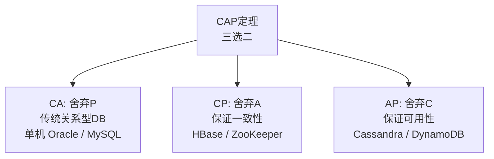
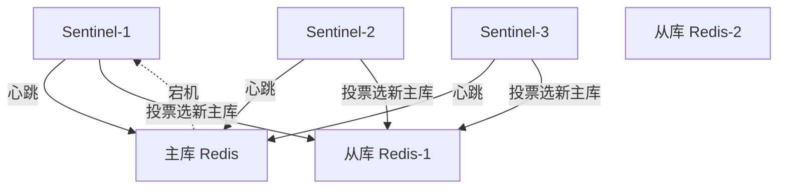
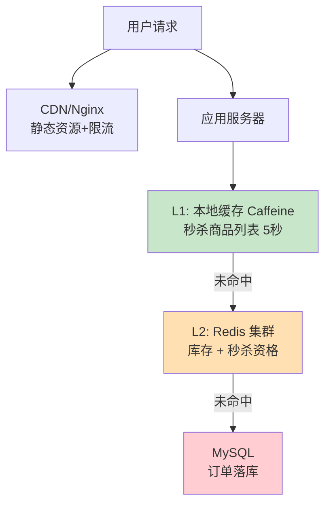
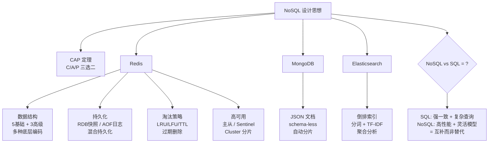

# NoSQL设计精要

> Redis 数据结构/持久化RDB&AOF/淘汰策略、与关系型 DB 的选型边界

#### 目录介绍
- [01.工作案例引入](#01工作案例引入)
  - [1.1 热点击垮MySQL](#11-热点数据击垮了mysql)
  - [1.2 为何学NoSQL](#12-为什么要学nosql)
- [02.NoSQL的诞生与CAP定理](#02nosql的诞生与cap定理)
  - [2.1 为何NoSQL](#21-为什么需要nosql)
  - [2.2 CAP定理](#22-cap定理)
  - [2.3 NoSQL的四种类型](#23-nosql的四种类型)
- [03.Redis核心数据结构](#03redis核心数据结构)
  - [3.1 为何快](#31-为什么redis这么快)
  - [3.2 基本结构](#32-五种基本数据结构)
  - [3.3 高级结构](#33-三种高级数据结构)
  - [3.4 底层编码](#34-底层编码一个类型多种实现)
  - [3.5 渐进Rehash](#35-redis字典与渐进式rehash)
  - [3.6 事务Pipeline](#36-redis事务与pipeline)
- [04.持久化](#04redis持久化内存数据库的可靠性)
  - [4.1 RDB快照](#41-rdb快照)
  - [4.2 AOF日志](#42-aof日志)
  - [4.3 混合持久化](#43-rdb--aof-混合持久化)
  - [4.4 COW原理](#44-cow原理深度解析)
  - [4.5 AOF重写](#45-aof重写机制的深层原理)
- [05.淘汰策略](#05redis淘汰策略与过期机制)
  - [5.1 过期删除](#51-过期删除策略)
  - [5.2 内存淘汰](#52-内存淘汰策略)
  - [5.3 策略选择](#53-淘汰策略的选择)
  - [5.4 采样淘汰池](#54-近似lru的采样淘汰池)
- [06.高可用](#06redis高可用哨兵与集群)
  - [6.1 主从复制](#61-主从复制)
  - [6.2 哨兵Sentinel](#62-哨兵sentinel)
  - [6.3 Cluster集群](#63-cluster集群)
  - [6.4 Gossip协议](#64-gossip协议与节点通信)
  - [6.5 Stream](#65-redis-stream与消费者组)
- [07.选型决策](#07nosql-vs-sql选型决策)
  - [7.1 五种场景](#71-五种场景的选择)
  - [7.2 多级缓存](#72-多级缓存架构)
  - [7.3 三大问题](#73-缓存三大问题)
- [08.Mongo与ES](#08mongodb与elasticsearch速览)
  - [8.1 MongoDB](#81-mongodb文档数据库)
  - [8.2 ES搜索引擎](#82-elasticsearch搜索引擎)
  - [8.3 WiredTiger](#83-wiredtiger存储引擎原理)
  - [8.4 ES分片合并](#84-es的分片与段合并机制)
- [09.综合案例](#09综合案例秒杀系统的多级缓存)
  - [9.1 场景设计](#91-场景与设计)
  - [9.2 知识图谱](#92-知识图谱回顾)
- [10.思考题与作业](#10思考题与作业)
  - [10.1 基础思考题](#101-基础思考题)
  - [10.2 进阶思考题](#102-进阶思考题)
  - [10.3 动手作业](#103-动手作业)


## 01.工作案例引入

### 1.1 热点击垮MySQL

**场景**：大刘的电商公司在"双11"当天，首页秒杀商品列表 QPS 飙到 5 万，MySQL 从库全部打满——数据库 CPU 100%。大刘打开监控一看——大量重复的 SQL 正在运行：

```sql
-- 每秒 2 万次执行同一条查询
SELECT * FROM products WHERE id IN (101,102,103,104,105);
```

这几个商品就是秒杀品，每秒钟 2 万人都在查——**热门数据反复查、数据库受不了一次请求一次磁盘IO**。

**疑惑链条**：

- "加索引、做读写分离还不够吗？" → 读写分离解决了"读压力分散"，但没解决"重复计算"——2 万次同样的查询，从库还是执行了 2 万次磁盘 IO
- "那把结果缓存起来不就行了？加个本地 HashMap？" → 单机可以，但这是分布式系统——一台机器缓存了，另一台没有 → 换个实例又打到数据库
- "用 Redis？" → 对！**Redis 就是为这种场景而生的**：数据全在内存 → 一次访问 ~0.1ms vs MySQL ~5ms → 快 50 倍。而且 Redis 集群共享同一份缓存——所有应用实例都能命中
- "Redis 也存磁盘吗？断电数据会丢吗？" → Redis 虽然是内存数据库，但有 RDB/AOF 两种持久化方案——可以配置为"尽量不丢"（AOF always）或"允许丢 1 秒"（RDB 默认）
- "Redis 能存多少数据？内存满了怎么办？" → 有 8 种淘汰策略（LRU/LFU/TTL）——按规则淘汰旧数据，保证内存可用

大刘给首页商品列表加了 Redis 缓存——命中率 95% 时，MySQL 压力从 2 万 QPS 降到 1000 QPS。但他开始好奇：**为什么 Redis 能这么快？内存满了如何保证热数据不丢？淘汰策略选哪个最好？**

### 1.2 为何学NoSQL

```
关系型数据库(MySQL)的强项:
  ✅ 复杂查询 (JOIN / GROUP BY / 子查询)
  ✅ 事务 (ACID)
  ✅ 数据一致性

关系型数据库的弱项:
  ❌ 高并发读 (单行查询也要走 B+Tree + Buffer Pool)
  ❌ 数据格式不固定 (加字段要 ALTER TABLE)
  ❌ 全文搜索 (LIKE '%xxx%' 走不了索引)
  ❌ 海量数据的简单KV访问

NoSQL 不是替代 SQL —— 而是填补 SQL 不擅长的场景。
Redis = 高速缓存 + KV 存储
MongoDB = 灵活的文档存储
ES = 全文搜索引擎
```


## 02.NoSQL的诞生与CAP定理

### 2.1 为何NoSQL

NoSQL（Not Only SQL）的诞生源于互联网的三大挑战：

```
挑战1: 高并发读写
  传统方案: 读写分离 + 分库分表
  局限性: 单库 TPS 天花板 ~5000-10000
  NoSQL 方案: Redis 单机 10万+ TPS → 直接放内存

挑战2: 海量数据存储
  传统方案: 分库分表 + 冷热分离
  局限性: 跨分片查询复杂
  NoSQL 方案: MongoDB 自动分片, HBase 基于 HDFS 的 PB 级存储

挑战3: 灵活的数据结构
  传统方案: ALTER TABLE 加列 (锁表!)
  局限性: 频繁变更的数据模型
  NoSQL 方案: MongoDB 的 JSON 文档模型 (schema-less)
```

### 2.2 CAP

**疑惑：为什么 NoSQL 经常被说成"牺牲一致性换性能"？**

**答疑**：这源于 **CAP 定理**——分布式系统中，一致性（Consistency）、可用性（Availability）、分区容错性（Partition Tolerance）三者不可兼得：



| 选择 | 代表 | 特点 |
|------|------|------|
| **CA** (不用P) | 传统 RDBMS | 单机强一致, 但无法容忍网络分区 |
| **CP** (不用A) | HBase, ZooKeeper, MongoDB | 分区时牺牲可用性, 保证一致 |
| **AP** (不用C) | Cassandra, DynamoDB | 分区时牺牲一致性, 保证可用 |
| **BASE** (AP的实践) | Redis (缓存场景) | Basically Available → 最终一致性 |

**Redis 在哪里？** Redis 本身是**单机 CP**（单线程无并发一致性问题），但在集群模式下——主从复制异步→偏向 AP → 允许短暂的不一致（最终一致性）。

### 2.3 四种类型

| 类型 | 代表 | 数据模型 | 典型场景 |
|------|------|---------|---------|
| **KV 存储** | Redis, Memcached | Key → Value | 缓存/计数器/排行榜 |
| **文档存储** | MongoDB, CouchDB | JSON 文档 | 用户画像/商品详情 |
| **列族存储** | HBase, Cassandra | 行键→列族→列 | 日志/IoT数据/时序 |
| **图存储** | Neo4j, JanusGraph | 节点+边 | 社交关系/推荐/风控 |

本章以 **Redis 为主线**（最通用），第 8 节速览 MongoDB/ES。


## 03.Redis核心数据结构

### 3.1 为何快

```
传统数据库: 数据在磁盘 → 查询 = 磁盘IO (0.1-10ms)
Redis:      数据在内存 → 查询 = 内存操作 (~100ns)
→ 快 1000-100000 倍!

Redis 单线程模型:
  ① 所有命令在一个线程中串行执行 → 没有锁竞争
  ② 基于 epoll 的事件驱动 → 一个线程处理 10 万并发连接
  ③ 数据结构极简 → O(1) 操作居多

瓶颈在哪? 
  不是 CPU, 是网络带宽和内存大小
  → 单机 10万 QPS → 需要 ~100MB/s 带宽
  → 内存不够 → 淘汰策略介入
```

**探索——Redis 事件循环的底层：epoll 到底做了什么？**

"单线程 + epoll"是 Redis 高性能的核心骨架。理解它才能理解 Redis 为什么能"单线程处理 10 万连接"：

```
Redis 事件循环 (main loop in ae.c):

void aeMain(aeEventLoop *eventLoop) {
    eventLoop->stop = 0;
    while (!eventLoop->stop) {
        aeProcessEvents(eventLoop, AE_ALL_EVENTS|AE_CALL_AFTER_SLEEP);
    }
}

每一轮循环做的事:
  ① aeApiPoll(): 调用 epoll_wait() — 阻塞等待事件, 超时时间 = 最近一个定时任务的时间
  ② processTimeEvents(): 处理到期的时间事件 (如 key 过期清理、serverCron)
  ③ processFileEvents(): 处理网络事件 (读/写就绪的客户端 socket)
  ④ 本轮处理完毕 → 回到 ①

关键点:
  ⚡ epoll_wait 不是"空转死循环" — 没有事件时线程休眠, CPU 接近 0%
  ⚡ 单线程处理命令 — 不存在"两个线程同时改一个 key" → 无需锁 → 无锁竞争
  ⚡ 零拷贝(sendfile) — 大 value 返回时减少内核→用户态拷贝
```

```
epoll 的工作机制:

① epoll_create: 在内核创建 eventpoll 对象 → 一棵红黑树 + 一个就绪链表
② epoll_ctl: 把客户端 socket 注册到红黑树 → 告诉内核"这个 fd 可读/可写时通知我"
③ epoll_wait: 从就绪链表取出就绪的 fd → O(1) 获取, 不像 select 那样 O(n) 扫描

select vs poll vs epoll:
  select: 最多 1024 个 fd → 每次都要全量拷贝到内核 → O(n) 轮询
  epoll:   无 fd 数量上限 → 通过 mmap 共享内存 → O(1) 返回就绪 → 适合 10万+ 连接
```

```
Redis 6.0 的"多线程"到底是什么?

"Redis 6.0 支持多线程了!" — 但网络 IO 和命令执行是两回事:

  5.x: 单线程读网络 → 单线程执行命令 → 单线程写网络
  6.0: 多线程读网络 → 单线程执行命令 → 多线程写网络
              ↑ 命令执行仍然是单线程的!

为什么命令执行不放开多线程?
  ① Redis 瓶颈是网络带宽, 不是 CPU → 多线程执行命令收益极小
  ② 单线程无锁 = 简单 + 可预测延迟 → 引入多线程锁开销可能反而更慢
  ③ 数据结构极简(O(1)居多) → 不存在"一个慢命令拖慢所有"

所以 Redis 6.0 的"多线程"只对 IO 层面 — 协议解析和结果回写并行化。
```

### 3.2 基本结构

| 结构 | 操作 | 时间复杂度 | 典型场景 |
|------|------|:---:|---------|
| **String** | `SET/GET/INCR` | O(1) | 缓存/计数器/分布式锁 |
| **Hash** | `HSET/HGET/HGETALL` | O(1)/O(n) | 用户信息/购物车 |
| **List** | `LPUSH/RPOP/LRANGE` | O(1)/O(n) | 消息队列/最新列表 |
| **Set** | `SADD/SMEMBERS/SINTER` | O(1)/O(n) | 标签/共同关注 |
| **ZSet** | `ZADD/ZRANGE/ZRANK` | O(log n) | 排行榜/延迟队列 |

```bash
-- String: 缓存
SET product:101 '{"name":"iPhone","price":6999}' EX 3600
GET product:101

-- Hash: 用户购物车
HSET cart:user123 item:101 2    -- 商品101, 数量2
HSET cart:user123 item:102 1
HGETALL cart:user123

-- List: 最新 10 条订单
LPUSH orders:user123 order_1001
LTRIM orders:user123 0 9        -- 只保留最新 10 条

-- Set: 共同关注
SADD follow:123 456 789 101
SADD follow:124 456 789 202
SINTER follow:123 follow:124   -- [456, 789] 共同关注

-- ZSet: 排行榜 (按分数排序)
ZADD rank:score 9500 user:123
ZADD rank:score 8800 user:456
ZREVRANGE rank:score 0 9 WITHSCORES  -- Top 10
```

### 3.3 高级结构

| 结构 | 用途 | 原理简述 |
|------|------|---------|
| **HyperLogLog** | UV 统计 (允许误差) | 概率算法, 12KB 内存可统计 2^64 个元素 |
| **Bitmap** | 签到打卡 | 1 bit 表示一个用户的签到状态, 1 亿用户=12MB |
| **Geo** | 附近的人/店铺 | 基于 ZSet 的 Geohash, 计算地理位置距离 |

```bash
-- HyperLogLog: UV 统计 (误差 ~0.81%)
PFADD uv:20240601 user:123 user:456 user:789
PFCOUNT uv:20240601  → 3

-- Bitmap: 签到
SETBIT sign:user:123 20240601 1   -- 6月1日签到
BITCOUNT sign:user:123             -- 签到天数

-- Geo: 附近 5 公里内的店铺
GEOADD shops 116.397 39.908 shop:A
GEORADIUS shops 116.397 39.908 5 km
```

### 3.4 底层编码

**疑惑：`ZSET` 元素少的时候用什么存？多了又会变吗？**

**答疑**：Redis 的每个类型有**多种底层编码**，根据数据量自动切换——小数据用紧凑结构、大数据转高效结构：

| 类型 | 少量数据时的编码 | 数据量阈值 | 超阈值后的编码 |
|------|---------------|---------|--------------|
| String | `embstr` (≤44B) | 44B | `raw` |
| Hash | `ziplist` (紧凑数组) | 512元素/64B | `hashtable` |
| List | `quicklist` (ziplist 链表) | — | — |
| Set | `intset` (整数集合) | 512元素 | `hashtable` |
| ZSet | `ziplist` (紧凑数组) | 128元素/64B | `skiplist` + hashtable |

```
为什么有这种设计?
  小数据: ziplist 紧凑存储 → 连续内存 → 缓存友好 → 省内存
  大数据: skiplist 跳过长的链表 → O(log n) vs O(n)

查看编码:
OBJECT ENCODING mykey  → "ziplist" / "skiplist" / "hashtable"
```

**探索——跳表（SkipList）为什么是 ZSet 的底层？**

```
排行榜需要: 按分数排序 + 按排名查询 + 范围查询
红黑树也能 O(log n), 但跳表更简单:

跳表: 多层索引链表
  Level 2: 1 ──────────> 30 ──────────> 80
  Level 1: 1 ──> 10 ──> 30 ──> 50 ──> 80 ──> 100
  Level 0: 1→5→10→20→30→40→50→70→80→90→100

查找 50: 从Level2开始, 1→30→80(超过了,回退)→ Level1的30→50 → 找到!
插入: 随机决定新节点"竖多高" → 不需要像红黑树那样旋转
```


### 3.5 渐进Rehash

**疑惑：Redis 的 Hash 底层是怎么存的？如果 Hash 里插入 100 万个 field——会一次性扩容然后阻塞主线程吗？**

**答疑**：Redis 的核心数据结构 dict（字典）支撑了 Hash 类型、全局 key 空间、Set（hashtable 编码）等。它的**渐进式 Rehash**是其"不阻塞"的基石：

```
Redis dict 的结构:

┌─────────────────────────────┐
│  dict                       │
│  ├── ht[0]: 哈希表1 (当前)   │
│  ├── ht[1]: 哈希表2 (扩容用) │
│  ├── rehashidx: -1(不rehash) │
│  └── iterators: 迭代器计数   │
└─────────────────────────────┘

哈希表 (dictht):
  ├── table: 指针数组 (bucket)
  ├── size: bucket 数量 (总是 2^n)
  ├── sizemask: size - 1 (用于 hash & sizemask 确定 bucket)
  └── used: 已有节点数
```

```
Rehash 的触发条件 (load_factor = used / size):

场景1: 扩容 (没有 BGSAVE/BGREWRITEAOF 时)
  load_factor ≥ 1 → 开始扩容
  扩容目标: 第一个 ≥ used * 2 的 2^n

场景2: 扩容 (有 BGSAVE/BGREWRITEAOF 时)  
  为了减少 COW 内存开销 → 放宽阈值
  load_factor ≥ 5 → 才开始扩容

场景3: 缩容
  load_factor < 0.1 → 开始缩容
  缩容目标: 第一个 ≥ used 的 2^n
  → 例如 1000 个 key, size=16384 → 缩到 1024
```

```
渐进式 Rehash 的核心——分步迁移, 绝不阻塞:

初始状态: ht[0].size=4, ht[1].size=8, rehashidx=0
  ht[0]: [A] → [B,C] → [ ] → [D]
  ht[1]: [ ] → [ ] → [ ] → [ ] → [ ] → [ ] → [ ] → [ ]

步骤1: rehashidx=0 → 把 ht[0] bucket 0 的 A 移到 ht[1]
  → hash("A") & 7 = 3 → ht[1][3] = A
  → rehashidx = 1

步骤2: rehashidx=1 → 把 ht[0] bucket 1 的 B,C 移到 ht[1]
  → hash("B") & 7 = 2 → ht[1][2] = B
  → hash("C") & 7 = 5 → ht[1][5] = C
  → rehashidx = 2

... 每步只迁移 1 个 bucket → 分摊到多次操作中

什么时机触发迁移?
  ① 每次对 dict 进行增删改查 — 顺带迁移 1 个 bucket
  ② 定时任务 serverCron — 每次迁移若干 bucket
  → 这样即使有 100 万 key, 每次操作只多花迁移 1 个 bucket 的时间
  → 延迟从 "秒级阻塞" 降为 "微秒级分摊"
```

```
rehash 期间的查找: 双表查询

  dictFind(d, key):
    ① 先查 ht[0]: idx = hash(key) & ht[0].sizemask → 遍历 bucket 链表
    ② 如果 ht[0] 没有 且 rehashidx != -1 → 再查 ht[1]:
       idx = hash(key) & ht[1].sizemask → 遍历 bucket 链表
    ③ 都没找到 → 返回 NULL

  rehash 期间的插入: 只写 ht[1] — 保证数据逐步向新表汇集
  rehash 期间的删除: 两个表都查, 找到就删
```

```
Redis 字典的 hash 冲突: 链地址法 (Separate Chaining)

  bucket[2]: dictEntry1 → dictEntry2 → dictEntry3 → NULL
              key=A,val=1   key=G,val=7   key=M,val=13
              (hash%size=2) (hash%size=2) (hash%size=2)

  而不是开放地址法(Java的ThreadLocal那样) — 链地址法删除和扩容更简单

  Redis 的 hash 函数:
    不是简单的 hash%size
    而是: hash & sizemask (因为 size 总是 2^n, sizemask=size-1)
    比取模运算快 — 位运算 1 个 CPU 周期 vs 取模 20+ 周期
```

**为什么不用"一次性 Rehash"？**

考虑：100 万个 key 的 Hash → 扩容到 200 万 bucket → 一次性迁移 → 需要至少遍历 100 万个 entry → 计算 hash → 插入新 bucket → 即使每个 entry 1μs → 总耗时 1 秒！**主线程阻塞 1 秒对 Redis 意味着 1 秒内所有请求全部挂起——连接超时、服务不可用。** 渐进式 rehash 把 1 秒钟的工作分摊到几百万次操作中——每次操作只多花 ~1μs → 用户完全无感知。


### 3.6 事务Pipeline

**疑惑：Redis 有事务吗？和 MySQL 的事务一样吗？Pipeline 又是什么——和批量命令有区别吗？**

**答疑**：Redis 的事务和 MySQL 完全不同——它不保证原子性回滚：

```
Redis 事务 (MULTI/EXEC):

  > MULTI            ← 开启事务
  > SET k1 v1        ← 命令入队(不执行)
  > INCR counter     ← 命令入队(不执行)
  > LPUSH list a     ← 命令入队(不执行)
  > EXEC             ← 一次性执行所有命令
  1) OK
  2) (integer) 1
  3) (integer) 1

关键特征:
  ① 不支持回滚: SET k1 v1 成功了, INCR counter 失败了(类型错误)
     → SET k1 v1 不会回滚! 已执行的命令效果保留
  ② 隔离性: EXEC 期间所有命令连续执行, 中间不插入其他客户端的命令
  ③ 无预编译: 没有"预编译→执行"两阶段, 只是把命令攒起来一起发
```

```
WATCH — Redis 的乐观锁:

场景: 两个客户端同时扣减库存 → 防止超卖

  客户端A:                   客户端B:
  WATCH stock:prod:101      WATCH stock:prod:101
  GET stock:prod:101 → 10   GET stock:prod:101 → 10
                             MULTI
                             DECR stock:prod:101
                             EXEC → 成功, stock=9
  MULTI
  DECR stock:prod:101
  EXEC → (nil) ← 失败! A 的 WATCH 检测到 key 被 B 改了
  → 需要重试整个事务

原理:
  WATCH key 在 redisDb.watched_keys 中建立 key→client 映射
  B 修改 key 时 → touchWatchedKey() → 标记所有 WATCH 该 key 的 client 为 CLIENT_DIRTY_CAS
  A 执行 EXEC 时 → 检查自己的 CLIENT_DIRTY_CAS → 是 → 拒绝执行 → 返回 nil
```

```
Pipeline — 减少 RTT (Round Trip Time):

  无 Pipeline:
    客户端发送: SET k1 v1
    客户端等待响应 (RTT: 0.5ms)
    ...
    客户端发送: SET k1000 v1000  
    客户端等待响应
    → 1000 次 RTT + 1000 次读/写系统调用 = 500ms+

  有 Pipeline:
    客户端一口气发送 1000 条命令 (一次 write)
    客户端一次性读取 1000 条响应 (一次 read)
    → 1 次 RTT + 1 次读/写系统调用 = 0.5ms+

  Pipeline 与事务的区别:
    事务: MULTI/EXEC — 保证原子性 — 命令不执行, 先入队
    Pipeline: 无 MULTI/EXEC — 不保证原子性 — 只是打包发送
    → Pipeline 可在事务中使用: MULTI → Pipeline 发送多条命令 → EXEC
```

```
Redis 事务 vs MySQL 事务:

| 维度 | Redis | MySQL (InnoDB) |
|------|-------|---------------|
| 原子性 | ❌ 不回滚, 错误命令后继续 | ✅ undo log 回滚 |
| 隔离性 | ✅ EXEC 期间串行 | ✅ MVCC + 锁 多级别 |
| 持久性 | 取决于 appendfsync | ✅ redo log |
| WATCH | 乐观锁, 类似 CAS | — |
| 用途 | 批量操作不被打断 | 强一致性业务逻辑 |
```


## 04.持久化

### 4.1 RDB

**RDB（Redis DataBase）**：定时把整个内存**快照**写入磁盘。是全量备份，适合灾备：

```
触发方式:
  ① save 命令: 主线程执行 → 阻塞!
  ② bgsave 命令: fork 子进程 → 写时复制(COW) → 不阻塞主线程
  ③ 自动触发: save 900 1  (900秒内至少1次修改)

RDB 的文件:
  dump.rdb → 压缩的二进制快照

优点: ① 文件紧凑 → 适合灾备 ② fork COW → 不影响主线程 ③ 恢复快
缺点: ① 两次快照之间的数据会丢失 ② fork 时内存翻倍(COW要拷贝)
```

```
RDB 的 COW (写时复制) 原理:
  ① bgsave → fork 子进程
  ② 父子共享同一块物理内存(页表标记为只读)
  ③ 主线程修改数据 → 触发页保护 → 内核拷贝该页 → 子进程仍读旧页
  → 快照数据 = fork 那一瞬间的完整内存
  → 代价: 内存使用 = 主进程 + 被修改的脏页(通常 5-10%)
```

### 4.2 AOF

**AOF（Append Only File）**：记录每个**写命令**，类似 MySQL 的 binlog。重启时逐条重放：

```
AOF 写入流程:
  客户端: SET k1 v1
    → ① 执行命令
    → ② 写 AOF 缓冲区
    → ③ 根据 appendfsync 策略刷盘

appendfsync 策略:
  - always: 每次命令都 fsync → 最安全, 最慢 (~几千 TPS)
  - everysec: 每秒 fsync 一次 → 最多丢 1 秒数据 (默认, 推荐)
  - no: 由操作系统决定 → 最快, 可能丢 30 秒数据

AOF 重写:
  当 AOF 文件过大时 → 自动触发 BGREWRITEAOF
  → 读取内存数据 → 生成等价的精简命令(set 代替 100 次 incr)
  → 不影响主线程 (也是 fork 子进程)
```

| 维度 | RDB | AOF |
|------|-----|-----|
| 数据安全 | fork 间隔内的数据丢失 | everysec 最多丢 1 秒 |
| 文件大小 | 小（压缩快照） | 大（所有写命令） |
| 恢复速度 | 快（二进制加载） | 慢（逐条重放命令） |
| 对主线程影响 | fork 时瞬时阻塞 | fsync 每秒一次 |
| 适用 | 灾备/冷备 | 持久化/不丢数据 |

### 4.3 混合持久化

Redis 4.0+ 支持混合模式——AOF 文件前半部分是 RDB 快照，后半部分是增量 AOF：

```
混合持久化文件结构:
  [RDB 快照数据] [AOF 增量日志]
  ← 恢复时先加载 RDB(快) → 再重放 AOF(少)

配置:
  aof-use-rdb-preamble yes  (Redis 4.0+)
```

**生产环境最佳实践**：开启混合持久化——既有 RDB 的恢复速度，又有 AOF 的数据安全性。


### 4.4 COW原理

**疑惑：`bgsave` fork 子进程时说"不阻塞主线程"——但如果内存是 20GB，fork 本身要拷贝 20GB 内存吗？会不会卡住？**

**答疑**：这是对 COW（Copy-On-Write，写时复制）的经典误解。fork 不是拷贝内存，而是**拷贝页表**：

```
fork 的过程 — 不拷贝数据, 只拷贝页表映射:

fork 前:
  父进程虚拟地址 → 物理页帧
  0x1000 → PFN 0xA100 (存 "hello")
  0x2000 → PFN 0xA200 (存 "world")

fork 后 (父子共享物理内存—读共享):
  父 0x1000 ──┐
              ├→ PFN 0xA100 (页表标记为只读)
  子 0x1000 ──┘
  
  父 0x2000 ──┐
              ├→ PFN 0xA200 (页表标记为只读)
  子 0x2000 ──┘

关键: fork 只拷贝了页表(4KB 页表映射 2MB 内存)!
  20GB 内存 → 页表大小 ≈ 20GB / 2MB * 4KB = ~40MB
  → fork 只需要拷贝 40MB 的页表 → 毫秒级完成
  → 不是拷贝 20GB 的数据!
```

```
COW 的触发 — 父进程写数据时:

          fork 前              fork 后              父进程写
  父 0x1000 → PFN_A          父→PFN_A(只读)        父→PFN_A'(新)
  内存: "hello"              子→PFN_A(只读)        子→PFN_A (旧="hello")
                                                     父→PFN_A'(新="HELLO")

  ① 父进程 SET k1 "HELLO" → 尝试写 PFN_A
  ② MMU 检查页表 → 标记为只读 → 触发 Page Fault
  ③ 内核处理 Page Fault:
     - 分配新物理页 PFN_A'
     - 将 PFN_A 的内容拷贝到 PFN_A'
     - 更新父进程页表: 0x1000 → PFN_A' (可写)
     - 子进程仍指向旧页 PFN_A → 不受影响!
  ④ 父进程写 "HELLO" 到 PFN_A' → 成功

  代价: 每修改一页 → 多花一次 4KB 拷贝 + Page Fault 处理 (~几微秒)
```

```
COW 的两种极端场景 — 内存会不会翻倍?

场景A: fork 后父进程几乎不修改 → 浪费极少
  子进程: 读取 20GB 数据做快照
  父进程: 只处理少量写请求
  → 新增内存: 少量脏页 (可能几百 MB)

场景B: fork 后父进程疯狂修改 → 内存翻倍!
  子进程: 还在读旧页
  父进程: 持续大量写入 → 每写一页 COW 拷贝一页
  极端: 20GB 全部被修改 → 额外分配 20GB → 总内存 40GB → OOM!
  
  什么场景触发场景B?
    - 大量 DEL 操作 → 修改 key 空间 → 大量页变脏
    - 大量 SET 写新数据 → 大量新页分配
    - RDB 生成时写流量仍然很高

  风险监控:
    查看 COW 开销: INFO stats → latest_fork_usec
    > 1 秒 → 说明拷贝页表就花了 1 秒 (页表大 / 系统忙)
    查看内存增长: 关注 used_memory_rss 在 bgsave 前后的变化
```

### 4.5 AOF重写

**疑惑：AOF 重写时，新的写命令会不会丢失？**

AOF 重写的巧妙之处在于**双缓冲区 + COW**的配合：

```
AOF 重写流程 (BGREWRITEAOF 触发):

步骤1: fork 子进程
  → 子进程拿到 fork 瞬间的内存快照 (COW)

步骤2: 子进程读取内存, 生成等价精简 AOF
  内存: k1=v1, counter=100
  子进程生成:
    SET k1 v1
    SET counter 100
  (而不是原来 AOF 中的 1 次 SET + 99 次 INCR)

步骤3: 同时, 父进程继续接收写命令
  新写的命令去哪了?
  
  → "AOF 重写缓冲区" (专门为此目的!)
  
  父进程每收到一条写命令:
    ① 写 AOF 缓冲区 (正常流程, 刷到老 AOF 文件)
    ② 写 AOF 重写缓冲区 (专门给子进程的!)
  
  双缓冲保证: 老 AOF 文件继续写, 重写缓冲区暂存增量

步骤4: 子进程完成重写 → 新 AOF 文件生成完毕
  → 父进程收到子进程结束信号 (SIGCHLD)
  → 父进程: 把 AOF 重写缓冲区中的增量命令追加到新 AOF 文件
  → rename: 新 AOF 覆盖老 AOF
  → 完成!

为什么不会丢数据?
  子进程负责: fork 瞬间的"存量数据"
  AOF 重写缓冲区负责: fork 之后的"增量数据"
  → 存量 + 增量 = 完整数据 ✅
```

```
重写期间的 IO 分析:

  磁盘 IO:
    老 AOF 文件: 父进程持续追加写
    新 AOF 文件: 子进程生成 → 最终 rename 取代老文件
    需要空间: 老 AOF + 新 AOF ≈ 2× AOF 大小
  
  内存:
    COW: 如果写入多 → 脏页多 → 内存增长
    重写缓冲区: 如果写入多 → 缓冲区大 → 内存增长

  AOF 重写触发条件 (自动):
    auto-aof-rewrite-percentage 100  → AOF 大小增长 100% 时触发
    auto-aof-rewrite-min-size 64mb  → AOF 至少 64MB 才触发

  手动触发: BGREWRITEAOF
```


## 05.淘汰策略

### 5.1 过期删除

**疑惑：SET key value EX 60 —— 60 秒后这个 key 是被删了还是懒删除？**

Redis 结合**惰性删除 + 定期删除**两种方式：

```
惰性删除: 访问 key 时检查是否过期 → 过期则删除
  ✅ 对 CPU 友好 (不用定时扫描)
  ❌ 不访问的过期 key 永远占内存

定期删除: 每秒 10 次随机抽查 → 删除过期的
  ✅ 能清掉冷数据
  ❌ 随机抽查 → 不能保证全部清除

两者互补:
  热 key → 访问时惰性删除
  冷 key → 定期扫描删除
```

### 5.2 内存淘汰

当 Redis 内存达到 `maxmemory` 时，需要淘汰已有的 key 来腾出空间：

| 策略 | 行为 | 适用场景 |
|------|------|---------|
| **noeviction** | 不淘汰，写入报错 | 不允许丢数据的纯缓存? 不推荐 |
| **allkeys-lru** | 所有 key 中淘汰**最近最少用** | **通用缓存（推荐）** |
| **volatile-lru** | 有过期时间的 key 中淘汰 LRU | 持久 + 缓存混合 |
| **allkeys-random** | 所有 key 中随机淘汰 | 读写均匀 |
| **volatile-random** | 有过期时间的 key 中随机淘汰 | 同上 |
| **volatile-ttl** | 淘汰**剩余 TTL 最短**的 | 希望即将过期的先淘汰 |
| **allkeys-lfu** (4.0+) | 所有 key 中淘汰**最不常用** | 热度区分明显的缓存 |
| **volatile-lfu** (4.0+) | 有过期时间的 key 中淘汰 LFU | 同上 |

### 5.3 策略选择

```
Redis 的 LRU 是近似 LRU (采样 N 个 key, 淘汰其中最老的):
  maxmemory-samples 5 (默认采样 5 个)
  → 不是精确 LRU, 但省内存 (不需要维护双向链表)

LRU vs LFU:
  LRU: 最近被访问过的 → 保留 (不管访问频率)
    适合: 通用缓存
    坑: 很少访问但刚被访问的大 key → 可能保留 (扫全表的热 key)

  LFU: 访问频率高的 → 保留
    适合: 热度差异大的场景
    坑: 新 key 热度低 → 可能刚加就被淘汰 → LogFactor 计数器补偿

推荐:
  默认场景 → allkeys-lru (简单有效)
  热度区分明显 → allkeys-lfu
  数据全部有过期时间 → volatile-lru
```

**探索**：Redis LFU 的计数器对数增长：

```
LFU 计数器: 不是每次访问都 +1, 而是对数增长
  访问 1 次 → 计数器 ~1
  访问 10 次 → 计数器 ~3
  访问 100 次 → 计数器 ~5
  → 防止短时间大量访问把计数器顶到天花板(255)
  → lfu-log-factor 控制增长速度(默认 10)
  → lfu-decay-time 控制衰减速度(默认 1 → 每分钟减 1)
```

### 5.4 采样淘汰池

**疑惑：Redis 说自己的 LRU 是"近似 LRU"，为什么不实现精确 LRU？不精确会造成什么问题？**

**答疑**：精确 LRU 需要维护一个全局双向链表，每次访问把 key 移到链表头部。这对 Redis 来说代价太大——**每次 GET 都要加锁更新链表指针**，单线程也会因为内存操作过多而降低吞吐。Redis 的近似 LRU 用**采样 + 淘汰池**的方式大幅减少开销：

```
精确 LRU 的代价:
  GET k1 → ① 查 dict 找到 value → ② 把 k1 移到链表头 → 返回 value
                                   ↑ 更新指针: prev, next, head, tail
  每次访问都有 O(1) 链表操作 → 10 万 QPS = 10 万次指针更新
  → Redis 不存在单独的 LRU 链表 → 而是利用 redisObject 里的 lru 字段

Redis 的 redisObject (每个 key 都有的元数据):
  typedef struct redisObject {
      unsigned type:4;        // 类型 (string/hash/...)
      unsigned encoding:4;    // 编码 (int/embstr/...)
      unsigned lru:24;        // LRU 时钟 或 LFU 计数器
      int refcount;           // 引用计数 (共享对象)
      void *ptr;              // 指向实际数据
  } robj;

  24 位的 lru 字段 — 双用途:
    在 LRU 策略下: 存的是最近一次被访问的 unix 时间戳 (秒级)
    在 LFU 策略下: 高 16 位存 last_decrement_time, 低 8 位存访问计数器
```

```
近似 LRU 的淘汰流程 (内存满时触发):

步骤1: 创建淘汰池 (eviction pool)
  一个固定大小的数组, 按 idle time (当前时间 - lru 时间) 降序排列
  默认大小: EVPOOL_SIZE = 16

步骤2: 随机采样 N 个 key
  maxmemory-samples 5 (默认采样 5 个)
  从整个 key 空间中随机抽取 (不是每次从 0 开始, 而是用游标延续)

步骤3: 计算每个采样 key 的 idle time
  idle = estimateObjectIdleTime(obj)
       = server.unixtime - obj->lru     (LRU 模式)
       = 255 - obj->lru    (LFU 模式简化版)

步骤4: 把采样 key 插入淘汰池
  evictionPoolPopulate:
    对每个采样 key:
      ① 如果 idle < 池中最小的 → 跳过
      ② 如果 idle > 池中最大的 → 插入合适位置(保持有序)
      ③ 池满了 → 挤掉 idle 最小的那个
  → 淘汰池始终保存采样到的"最久未访问"的 16 个 key

步骤5: 从淘汰池中挑 idle 最大的淘汰
  淘汰 1 个 key → 检查内存是否还超限 → 不够再循环步骤2-5

这就是"近似 LRU"的完整流程 — 每次淘汰只采样 N 个, 而不是遍历所有 key
```

```
采样数量的权衡:

  maxmemory-samples 5 (默认):
    每轮采样 5 个 → 淘汰 1 个 → 淘汰精度 ≈ 精确 LRU 的 80-90%
    开销: 每淘汰 1 个 ≈ 计算 5 次 idle + 操作淘汰池

  maxmemory-samples 10:
    每轮采样 10 个 → 淘汰 1 个 → 精度 ↑ (更接近精确 LRU)
    但开销 ↑ → CPU 多花时间采样

  maxmemory-samples 1:
    退化为"近似随机淘汰" → 精度极差, 但最省 CPU

  生产建议:
    默认 5 对绝大多数场景足够
    如果观察到"热 key 被淘汰后立刻又加载回来" → 增大到 10
    不要设太大: 采样 50 个 vs 遍历 10 万个 → 精度提升有限但开销线性增长
```

```
淘汰的触发时机 — 不是主动轮询:

  Redis 不会有一个线程一直在"检查内存是否超限"
  而是在每次处理命令前检查:

  执行命令 → 检查 used_memory > maxmemory?
             → 是 → 进入淘汰循环:
               while (used_memory > maxmemory)
                 采样 → 填淘汰池 → 淘汰 1 个
             → 内存够 → 执行命令

  如果淘汰速度赶不上写入速度?
    → while 循环一直转 → 主线程一直卡在淘汰
    → 表现: Redis 响应变慢, 所有命令等待
    → 解决: 提高 maxmemory 或降低写入速率
```


## 06.高可用

### 6.1 主从

Redis 的主从复制与 MySQL 类似——从库异步复制主库的数据：

```
主从复制流程:
  ① 从库: REPLICAOF 主库IP 主库端口
  ② 主库: fork 子进程生成 RDB → 发送给从库
  ③ 从库: 加载 RDB
  ④ 主库: 持续发送增量写命令给从库

区别 MySQL 主从:
  Redis 默认异步复制 → 不具备持久性保证 → 主库宕机可能丢数据
  Redis 不支持半同步复制(Cluster 模式除外)
```

### 6.2 哨兵

**哨兵（Sentinel）** 是 Redis 高可用的守护进程——监控主库、自动故障切换：



```
Sentinel 的工作流程:
  ① 监控: 定期 PING → 超时 → 标记主观下线(SDOWN)
  ② 投票: 多个 Sentinel 确认 → 客观下线(ODOWN)
  ③ 选主: 从从库中选一个最优(数据最新/延迟最小)
  ④ 通知: 将新主库地址通知应用(通过发布订阅)
```

### 6.3 集群

当单机内存不够（如需要 500G）时，Sentinel 无法解决——它只能做高可用，不能做**水平扩展**。需要 **Cluster**：

```
Redis Cluster (3.0+):
  ① 分片: 16384 个槽(slot) → 每个节点负责一部分
  ② 路由: key → CRC16(key) % 16384 → 定位槽 → 定位节点
  ③ 高可用: 每个分片可以有主从 → 主挂 → 从顶上

槽分配示例:
  节点A: slot 0-5460
  节点B: slot 5461-10922
  节点C: slot 10923-16383

多 key 操作限制:
  ✅ mget k1 k2 → 在同一个 slot 才可以 (使用 {hash_tag} 强制同slot)
  ❌ mget k1 k2 → 不在同一个 slot → 报错 CROSSSLOT
```

| 方案 | 解决的问题 | 不解决的问题 |
|------|---------|------------|
| **主从** | 读压力分摊 | 写压力/单机容量 |
| **Sentinel** | 自动故障切换 | 容量扩展 |
| **Cluster** | **水平扩展 + 高可用** | 多key跨slot操作 |


### 6.4 Gossip协议

**疑惑：Cluster 有 100 个节点——节点之间怎么知道彼此还活着？怎么知道哪些 slot 在哪个节点上？**

**答疑**：Redis Cluster 通过 **Gossip 协议**（流行病协议）实现去中心化的节点发现和状态传播。每个节点不需要连接所有其他节点，而是像谣言传播一样——每个节点随机选几个"朋友"交换信息：

```
Gossip 协议的五种消息类型:

┌──────────────────────────────────────────────────┐
│ 类型        │ 作用               │ 触发          │
├──────────────────────────────────────────────────┤
│ PING        │ 心跳检测 + 信息交换  │ 每秒随机 N 个  │
│ PONG        │ 回复 PING / 自己加入 │ 收到 PING     │
│ MEET        │ 邀请新节点加入集群   │ CLUSTER MEET   │
│ FAIL        │ 宣告某节点不可达     │ 超半数确认     │
│ UPDATE      │ 发布配置更新         │ slot 迁移时    │
└──────────────────────────────────────────────────┘

PING 消息的内容:
  Gossip 协议不会每次都发送完整集群信息
  而是携带"发送者自己的信息" + "它知道的少数几个节点的信息":

  PING {
    header: {
      sender: "node_A:6379",
      currentEpoch: 10,        // 配置纪元(选主用)
      ...  
    },
    gossip: [                   // 携带 1/10 个其他节点的信息
      { name:"node_B", ip:"10.0.1.2", port:6379, flags:NORMAL },
      { name:"node_C", ip:"10.0.1.3", port:6379, flags:PFail },
    ]
  }
```

```
Gossip 的传播过程 — 像病毒传播一样扩散:

时间 T0: node_B 给 node_A 发 PING 超时
  → node_A 标记 node_B 为 PFAIL (Possible Fail — 疑似下线)

时间 T1: node_A 在接下来的 PING/PONG 中, 附带消息:
  gossip: [{name:"node_B", flags:PFAIL}]

时间 T2: node_C 收到来自 node_A 的 PING → 知道 node_B 被标记 PFAIL
  → node_C 尝试连接 node_B → 也超时 → node_C 也标记 node_B 为 PFAIL

时间 T3: 多个节点确认 node_B 不可达
  → 当 ≥ N/2+1 个主节点确认 → 标记 node_B 为 FAIL
  → 广播 FAIL 消息: 所有节点立即知道 node_B 挂了 → 触发故障转移

为什么是 N/2+1? 
  防止网络分区误判 — 如果是 node_A 自己网络有问题, 
  只有它一个标记 PFAIL → 不会触发 FAIL → 避免不必要的故障转移
```

```
Cluster 总线 (Cluster Bus) — 节点通信的专用通道:

  每个 Redis 节点有 2 个端口:
    普通端口 6379: 服务客户端
    集群总线端口 16379: 节点间通信 (6379 + 10000)

  集群总线特点:
    ① 二进制协议 — 比 RESP 更紧凑, 减少带宽
    ② 不经过命令处理队列 — 不走事件循环的读/写事件
    ③ 独立处理 — 即使普通端口阻塞(慢命令), 集群总线仍能通信

  cluster-node-timeout 15000 (默认 15 秒):
    如果节点 A 15 秒内没收到节点 B 的 PONG
    → 标记 B 为 PFAIL → 开始 Gossip 传播
```

```
Gossip 的扩展性分析:

  优点:
    ① 去中心化 — 没有单点(不像 Sentinel 靠少数节点投票)
    ② 最终一致 — 每个节点最终都知道完整的集群拓扑
    ③ 容错 — 即使部分节点通信故障, 信息仍能通过其他路径传播

  代价:
    PING 频率 = 每秒随机选择 N 个节点
    N = min(总数/10, 某阈值)
    → 100 个节点的集群: 每秒发送 10 条 PING (可配置)
    → 带宽占用: ~1 KB/条 × 10 条/秒 = 10 KB/秒/节点
    → 加上 PONG 和其他消息 → 每个节点约 20-30 KB/秒集群通信

  不建议超过 ~1000 个节点 — 否则 Gossip 消息量太大
```

### 6.5 Stream

**疑惑：Redis 能做消息队列吗？和 Kafka/RabbitMQ 有什么不同？**

**答疑**：Redis 5.0 引入的 **Stream** 是一个轻量级但功能完整的消息队列——它支持**消费者组、消息确认、消息回溯**，弥补了 List (Pub/Sub) 的不足：

```
为什么不能用 List 做消息队列?

  List 做消息队列: LPUSH + BRPOP
    问题1: 一条消息只能被一个消费者消费 → 无法做"广播"
    问题2: 消费者宕机 → BRPOP 已经取走的消息丢失!
    问题3: 没有 ACK 机制 → 消费者处理失败了也无法重试

  Pub/Sub 做消息队列: PUBLISH + SUBSCRIBE
    问题1: 消息不持久 — 如果没消费者在线 → 消息直接丢弃!
    问题2: 没有历史消息 — 新订阅者看不到之前发的消息
```

```
Stream 的核心数据结构:

  ① Stream 本身是一个 append-only log (类似 Kafka partition):
    XADD mystream * field1 value1 field2 value2
    → "1680000000000-0" ← 自动生成 ID (时间戳-序号)

  ② 消息 ID 格式: <milliseconds>-<sequence>
    1680000000000-0 → 2023年3月28日 某个时刻的第 0 条消息
    1680000000000-1 → 同一毫秒的第 1 条消息
    (支持手动指定 ID 来保证有序插入)

  ③ 底层存储: Radix Tree (基数树) + listpack
    每个 Stream 在内存中是一棵 Radix Tree — 用于快速定位任意 ID
    每个节点(listpack)存储多条消息 — 紧凑内存布局
```

```
消费者组 (Consumer Group) — 核心差异化特性:

  XGROUP CREATE mystream mygroup $   ← 从最新的消息开始

  组内消费者:
    消费者 A XREADGROUP GROUP mygroup consumer_a COUNT 1 STREAMS mystream >
    消费者 B XREADGROUP GROUP mygroup consumer_b COUNT 1 STREAMS mystream >
    消费者 C XREADGROUP GROUP mygroup consumer_c COUNT 1 STREAMS mystream >
    → 三条消息分给三个消费者 (类似 Kafka consumer group)

  ACK 确认:
    XACK mystream mygroup 1680000000000-0  ← 告诉 Redis "这条处理完了"

  PEL (Pending Entries List) — 未确认消息列表:
    XPENDING mystream mygroup
    → 查看哪些消息被分出去了但还没 ACK
    → 消费者宕机 → 消息在 PEL 中 → 其他消费者可以 XCLAIM 认领

  XCLAIM — 消息重分配:
    消费者 A 拿了消息但 60 秒没 ACK → 死了
    消费者 B: XCLAIM mystream mygroup consumer_b 60000 1680000000000-0
    → 把这条消息"抢"过来, 归 consumer_b 处理
```

```
Stream vs Kafka vs RabbitMQ:

| 维度 | Redis Stream | Kafka | RabbitMQ |
|------|:---:|:---:|:---:|
| 消息持久化 | ✅ (AOF/RDB) | ✅ (磁盘, 保留策略) | ✅ |
| 消费者组 | ✅ | ✅ (核心特性) | ❌ (AMQP 不同模型) |
| 消息回溯 | ✅ (按 ID 重读) | ✅ (按 offset) | ❌ (消费即删) |
| ACK 机制 | ✅ XACK | ✅ offset commit | ✅ ack |
| 死信队列 | ❌ (需手动实现) | ✅ | ✅ |
| 吞吐量 | ~10万/秒 (单机) | ~100万/秒 (分区) | ~几万/秒 |
| 数据大小限制 | Redis 内存 | TB 级磁盘 | 内存/磁盘 |

适用: 轻量级消息队列 — 不需要复杂的路由/死信/重试策略
不适用: 需要消息积压到 TB 级别的场景 → 内存不够 → 用Kafka
```


## 07.选型决策

### 7.1 五种场景

| 场景 | 数据库选择 | 理由 |
|------|---------|------|
| 订单/支付/账务 | **MySQL** + Redis 缓存 | 需要事务、数据绝对不能丢 |
| 热点数据缓存 | **Redis** | 10万 QPS, 0.1ms 延迟 |
| 计数器/排行榜 | **Redis** ZSet / INCR | 内存操作, 原子递增 |
| 用户画像(字段不定) | **MongoDB** | schema-less, JSON 存储 |
| 搜索/日志分析 | **Elasticsearch** | 全文索引 + 聚合分析 |
| 消息队列 | Redis List / Stream | 轻量级 MQ (非核心业务) |
| 分布式锁 | Redis `SET NX EX` | 原子操作 + TTL 自动释放 |

### 7.2 多级缓存

```
浏览器缓存 (Cache-Control: max-age=60)
    ↓ 未命中
Nginx 本地缓存 (proxy_cache / openresty lua)
    ↓ 未命中
Redis 分布式缓存
    ↓ 未命中
MySQL 数据库

每一层命中 → 减少下一层的压力
最终到达 MySQL 的请求只是"千分之一"
```

### 7.3 三大问题

| 问题 | 现象 | 解决方案 |
|------|------|---------|
| **缓存穿透** | 查不存在的数据 → 每次穿透到 DB | ① 布隆过滤器 ② 缓存空值(TTL 短) |
| **缓存击穿** | 热点 key 过期 → 大量请求同时打 DB | ① 互斥锁(只有一个回源) ② 永不过期+异步更新 |
| **缓存雪崩** | 大量 key 同时过期 → DB 瞬时高负载 | ① TTL + 随机值分散 ② 集群高可用 ③ 多级缓存 |

```bash
-- 缓存穿透: 布隆过滤器
BF.ADD product_filter 101   -- 把存在的 ID 加入布隆过滤器
BF.EXISTS product_filter 999  -- 查询前先判断 → 0(不存在) → 直接返回

-- 缓存击穿: 互斥锁回源
SET lock:hotkey 1 NX EX 10  -- 只有一个线程拿到锁
-- 拿到锁 → 查 DB → 更新缓存 → DEL lock
-- 没拿到 → sleep + 重试

-- 缓存雪崩: TTL 随机化
SET product:101 data EX 3600  -- 不写 3600
SET product:101 data EX 3480  -- 改写成 3600 - random(0,300)
```


## 08.Mongo与ES

### 8.1 MongoDB

```
MongoDB 的特点:
  ① JSON 存储: {name:"Tom", age:25, tags:["tech","sports"]}
  ② schema-less: 不需要预先定义表结构 → 字段随意加
  ③ 自动分片: shard key → 自动数据分布
  ④ 支持事务(MongoDB 4.0+): 多文档 ACID

适用:
  ✅ 用户画像(每人字段不一样)
  ✅ 日志存储(结构多变)
  ✅ 物联网数据(设备上报数据灵活)

不适用:
  ❌ 需要 JOIN 的复杂查询
  ❌ 需要强事务保证的金融场景
```

### 8.2 ES搜索引擎

```
ES 的核心: 倒排索引 + 分词
  文档: "Redis 是一个内存数据库"
  分词: [Redis, 是, 一个, 内存, 数据库]
  倒排索引: Redis → [doc1], 内存 → [doc1, doc5, doc9]

适用:
  ✅ 全文搜索(商品/文章/日志)
  ✅ 聚合分析(按时间段汇总/TOP N)
  ✅ 日志分析(ELK 经典组合)

不适用:
  ❌ 频繁更新的场景(删除再重建)
  ❌ 需要事务保证
```

### 8.3 WiredTiger

**疑惑：MongoDB 怎么存数据的？和 MySQL InnoDB 的 B+Tree 一样吗？**

**答疑**：MongoDB 3.2+ 默认使用 **WiredTiger** 存储引擎。它和 InnoDB 有相似的设计理念，但数据结构不同——用 **B-Tree**（不是 B+Tree），并内置了压缩：

```
WiredTiger 的数据结构:

  每个集合 → 一篇 B-Tree + 一个 WAL (Write-Ahead Log)

  B-Tree vs B+Tree:
    B+Tree: 数据只存在叶子节点 (InnoDB 的做法)
    B-Tree:  内部节点也存数据    (WiredTiger 的做法)
    
    为什么 WiredTiger 用 B-Tree?
      原因: MongoDB 的 JSON 文档大小差异大 — 小到几十字节, 大到几MB
      B-Tree 内部节点直接存小文档 → 可能 1 次 IO 就找到
      B+Tree 必须走到叶子 → 固定 log(N) 次 IO

  Checkpoint — 类似 InnoDB 的 checkpoint:
    每隔 60 秒 (默认) → 把 B-Tree 全部刷到磁盘 → 减少崩溃恢复时间
    中间的修改存在 WAL (journal) 中 — 类似 redo log

  Snappy/Zstd 压缩:
    WiredTiger 的 B-Tree 节点按页(4KB-32KB)压缩存储
    好处: 磁盘空间节省 50-80%, 解压开销仅几微秒
    代价: CPU 开销轻微增加 — 现代 CPU 解压 snappy 极快, 基本无感
```

```
WiredTiger vs InnoDB 的存储对比:

| 维度 | WiredTiger (MongoDB) | InnoDB (MySQL) |
|------|---------------------|----------------|
| 索引结构 | B-Tree (节点也可以存数据) | B+Tree (数据仅在叶子) |
| 最小 IO 单元 | Page (4KB-32KB) | Page (16KB) |
| 事务日志 | WAL (journal) | redo log + undo log |
| 事务隔离 | Snapshot Isolation (快照隔离) | MVCC (多种隔离级别) |
| 并发控制 | 乐观锁 (CAS) + 意向锁 | MVCC + 行锁 + Gap Lock |
| 压缩 | 内置 snappy/zstd | 独立表压缩 (5.7+) |
```

```
MongoDB 的写入路径 — 和 InnoDB 惊人地相似:

  客户端: db.orders.insertOne({...})

  → ① 写 WAL (journal) — 顺序追加 — 类似 InnoDB redo log
  → ② 更新内存中的 B-Tree — 修改在内存中完成
  → ③ 返回客户端 "OK" — 数据已在 WAL 中, 不会丢
  → ④ 60 秒后 Checkpoint — 把内存 B-Tree 全量刷到磁盘
  → ⑤ WAL 中 Checkpoint 之前的日志可以截断

  (和 InnoDB 的 WAL → redo log 写入 → Buffer Pool 修改 → checkpoint  流程几乎一样!)
```

### 8.4 ES分片合并

**疑惑：ES 为什么查得快但不适合频繁更新？一条更新到底发生了什么？**

**答疑**：理解 ES 的存储模型需要理解"不可变段"这个核心概念：

```
ES 的层次结构:

  索引 (Index) — 类似 MySQL 的 database
    ├── 分片 (Shard) — 类似 分表, 水平拆分数据
    │     ├── 主分片 (Primary Shard) — 写入入口
    │     └── 副本分片 (Replica Shard) — 只读, 高可用
    └── 段 (Segment) — 实际存储的最小单元, 不可变!
          ├── 倒排索引
          ├── 正排数据 (Stored Fields)
          └── 文档值 (Doc Values — 列式存储, 用于聚合/排序)
```

```
为什么段不可变 — 写入和搜索的巧妙分工:

  写入: 
    文档来了 → 不修改任何现有段 → 写入内存 buffer
    → 每秒 refresh: buffer → 新段 → 段可搜索
    → 定期 flush: 段从内存 fsync 到磁盘

  搜索:
    查询来了 → 遍历所有段 → 每段独立搜索 → 合并结果

  删除/更新:
    不是真的删除! 
    删除: .del 文件标记 "该 doc_id 已删除"
    更新: 旧文档标记删除 + 写入新文档 = 一个新段
    → 段不修改, 不产生碎片, 但磁盘占用增大!

  好处: 
    ① 段不变 → 不需要锁 → 读写永不互斥
    ② 段是只读 → OS 文件缓存友好 (page cache 大量命中)
    ③ 段按需生成 → 没有"页分裂"这种 B+Tree 开销
  
  代价: 频繁更新 → 大量标记删除 → 大量段 → 搜索变慢
```

```
段合并 (Segment Merge) — 解决"段爆炸":

  小段太多 → 搜索要遍历 100+ 个段 → 慢!

  后台 merge 线程:
    选择若干小段 → 合并成一个更大的段
   合并中: .del 标记的文档 → 真正删除
           同一个 doc_id 的多个版本 → 只保留最新

  合并后:
    旧段被删除 → 磁盘释放
    新段: 更大, 更少 → 搜索遍历段数从 100 降到 10

  merge 的策略: tiered merge (分层合并)
    根据段大小分 tier → 只合并同 tier 的段
    类似 LSM-Tree 的 compaction

  ES merge 的 IO 放大:
    合并 10 个小段 (每个 5MB = 共 50MB)
    → 生成 1 个 50MB 的大段
    → 写放大: 50MB 写入 → 但实际有效数据可能只有 30MB (20MB 已删除)
    → 如果 merge 的同时还有写入 → 磁盘 IO 双倍压力
```

```
ES refresh interval — 近实时搜索的代价:

  refresh_interval = 1s (默认):
    每 1 秒, 内存 buffer → 生成新段 → 可搜索
  
  调到 5s: 
    段数量减少 5 倍 → merge 压力降低 → 写入吞吐 ↑
    但新数据 5 秒后才可见 → 搜索实时性 ↓

  写入峰值优化: 
    如果正在大批量写入(如数据迁移)
    → refresh_interval = -1 (关闭自动 refresh)
    → 减少段生成频率 → 避免 merge 风暴
    → 写入完成后再打开

  ES 不适合高频更新:
    每更新一次 → 新段 + .del 标记 → 段膨胀 → merge 追不上 → 性能恶化
    → 适用: 一次写入, 多次搜索 (日志/商品搜索)
    → 不适用: 频繁更新同一文档 (库存数量/计数器)
```


## 09.综合案例

### 9.1 场景设计

回到前几章反复出现的秒杀系统——从数据库层层优化，最终的多级缓存架构：



```
各层的职责:
  CDN: 静态页面 + 限流 → 挡住 90% 无效流量
  L1 本地缓存: 秒杀列表(5秒刷新) → 减少 Redis 压力
  L2 Redis: 库存预减 + 秒杀资格判断
    - 开始前预热库存到 Redis: SET stock:product:101 999
    - 秒杀请求: DECR stock:product:101 → ≥0 → 抢到 → 发 MQ
  MySQL: 异步消费 MQ → 真正减库存 + 创建订单
    - Redis 宕机 → DECR 失败 → 数据库中 stock > 0 做最后兜底

Redis 的配置:
  maxmemory-policy allkeys-lru  → 淘汰冷门商品
  持久化: RDB(每小时) + AOF(everysec)  → 兼顾恢复速度和安全
  高可用: Sentinel(一主二从三哨兵)
```

### 9.2 知识图谱



**最终方法论——缓存设计的四个原则**：

1. **越近越好**：缓存离用户越近收益越大（CDN > Nginx > Redis > DB）
2. **越热越缓存**：只缓存热点数据—二八定律—20% 的数据承受 80% 的访问
3. **设好 TTL**：TTL = 业务能接受的数据延迟—太长浪费内存—太短数据库压力大
4. **兜底永不忘**：Redis 挂了不能把 DB 打挂——要有降级、限流、兜底策略


## 10.思考题与作业

### 10.1 基础思考题

1. **Redis 为什么快**：从"数据在内存""单线程模型""数据结构简洁"三个角度解释 Redis 为什么能达到 10 万 QPS。

2. **五种数据结构场景**：String/Hash/List/Set/ZSet 各自最合适的业务场景是什么？举例说明。

3. **RDB vs AOF**：RDB 快照和 AOF 日志各有什么优缺点？为什么生产环境推荐混合持久化？

4. **LRU vs LFU**：解释 Redis 的 LRU 和 LFU 淘汰策略的区别。什么场景适合 LFU？

5. **缓存三大问题**：缓存穿透、缓存击穿、缓存雪崩分别是什么？各自的解决方案是什么？

### 10.2 进阶思考题

1. **Redis 跳表 vs 红黑树**：ZSet 底层为什么用跳表（Skiplist）而不是红黑树？从实现复杂度和范围查询角度对比。

2. **COW 写时复制原理**：bgsave 时 fork 子进程用了写时复制——为什么 fork 之后内存不会立刻翻倍？什么情况下 COW 会导致内存翻倍？

3. **Sentinel 的投票机制**：为什么 Sentinel 需要至少 3 个节点？如果只有 2 个，主库真的挂了但网络抖动导致一个 Sentinel 误判——会发生什么？

4. **Redis Cluster 的 MOVED vs ASK**：Cluster 模式下客户端收到 `MOVED` 和 `ASK` 的重定向分别是什么场景？有什么区别？

5. **MySQL + Redis 一致性**：怎么保证数据库更新和 Redis 缓存更新的一致性？先删缓存还是先写数据库？延迟双删又是什么？

### 10.3 动手作业

**作业一（必做）**：用 Redis 实现一个简单的排行榜。

```
需求: 游戏积分排行榜 (Top 100)
  ZADD rank <score> <user_id>
  ZREVRANGE rank 0 99 WITHSCORES
  ZRANK rank <user_id>  → 查看自己的排名
```

**作业二（选做）**：配置 Redis 主从 + Sentinel。

```
3 个 Redis 实例 (1主2从) + 3 个 Sentinel
模拟主库宕机: kill 主库进程
观察 Sentinel 日志: 是否自动切换? 应用是否感知到新主库?
```

**作业三（选做）**：测试 Redis 淘汰策略。

```bash
# 设置 maxmemory = 10MB
# 写入数据直到触发淘汰
# 分别测试 allkeys-lru 和 allkeys-lfu 的区别
redis-cli INFO stats | grep evicted_keys
```

**作业四（架构思考）**：梳理你当前项目中所有使用缓存的地方——什么场景用了 Redis？有本地缓存吗？TTL 设计合理吗？缓存三大问题（穿透/击穿/雪崩）有没有防护措施？