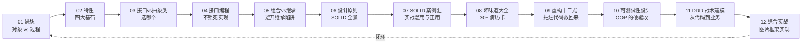
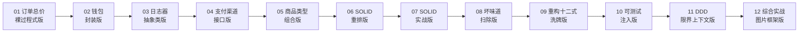
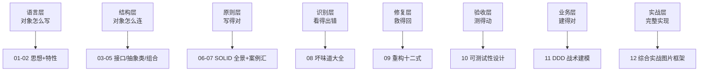
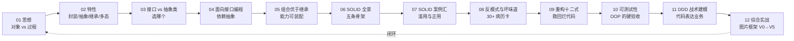

# 面向对象设计 · 12 篇主线之旅

一条主线、十二篇文章、一个真实可跑的电商订单系统，从**对象的本质**到**业务的本质**，由浅入深、案例贯穿、Mermaid 图加深理解。

---

## 1.🎯 这个专栏特色

市面上的面向对象专栏大多是"教科书式精炼"，你读完会同意，但不会**被震撼**，也不会**想立刻去重构自己的代码**。

本专栏做了三件市面少见的事：

| 差异点 | 我们怎么做 |
|---|---|
| **沉浸式开篇** | 每一篇都从一次**真实事故**开篇，不是讲定义，是讲翻车 |
| **探索式论证** | 不直接给结论，用"假设 → 反驳 → 实证 → 升华"的推理过程让你"看见思考" |
| **连续剧式综合案例** | 11 篇**共用一条主线**：电商订单系统从 0 到 DDD 的完整演化，读完即拥有一个真实系统 |

---

## 2.📚 阅读路径

---

## 3.📖 章节列表

| # | 章节 | 主题 | 关键案例 | 关键图表 |
|---|---|---|---|---|
| 01 | [面向对象设计思想](https://yccoding.com/pages/oop/) | 范式之别 | 双 11 雪崩订单系统 | 网状 vs 线性流程图 |
| 02 | [面向对象的特性](https://yccoding.com/pages/f9fcfa/) | 封装/抽象/继承/多态 | 钱包余额对不上排查 | vtable 内存布局图 |
| 03 | [接口vs抽象类比较](https://yccoding.com/pages/eceb4b/) | 何时选哪个 | 日志器 47 次改动复盘 | 决策树、模板时序图 |
| 04 | [接口而非实现编程](https://yccoding.com/pages/d080c5/) | 依赖抽象不依赖具体 | 云迁移 6 万行连锁修改 | 三步重构演化图 |
| 05 | [多用组合和少继承](https://yccoding.com/pages/3b28c3/) | 继承陷阱与组合优雅 | 企鹅会飞继承翻车 | 类爆炸 vs 正交组合 |
| 06 | [设计原则全景图](https://yccoding.com/pages/c51d4c/) | SOLID + 23 模式 | 8000 行上帝类失控 | SOLID 关系图 |
| 07 | [SOLID 原则案例汇](https://yccoding.com/pages/f7d8c6/) ⭐ | SOLID 在战场上 | 团队三年 SOLID 之争 | 滥用现场扫描图 |
| 08 | [反模式与坏味道](https://yccoding.com/pages/69d9e3/) ⭐ | 30+ 嗅觉清单 | PR 被驳回 17 次 | 坏味道地图 |
| 09 | [重构十二式实战](https://yccoding.com/pages/82ced2/) | 12 个最常用手法 | 1200 行结算函数救援 | 重构节奏循环 |
| 10 | [可测试性设计](./10.可测试性实战设计) ⭐ | OOP 的硬验收 | 95% 覆盖率上线即崩 | 测试金字塔 |
| 11 | [DDD 与战术建模](11.DDD与战术的建模) ⭐ | 从代码到业务 | 需求文档 70% 失真 | 限界上下文图 |
| 12 | [综合实战图片框架](https://yccoding.com/pages/c3c34b/) ⭐ | 完整系统实现 | 图片处理系统实战 | 完整架构图 |

---

## 4.🎬 主线案例12次演化

每篇都在前一篇的基础上演化，读完全栏，你就拥有一个**真实可运行**的"电商订单+支付+风控+营销"系统。

每篇结尾会留下一段"半成品代码"，作为下一篇综合案例的起点。你将像看连续剧一样，亲眼看着一个粗糙脚本演化为一个工程级系统。

---

## 5.🎓 你将学到什么

| 层次 | 核心能力 | 对应篇目 |
|---|---|---|
| 语言层 | 对象、类、四大特性的本质 | 01-02 |
| 结构层 | 用接口、抽象类、组合连接对象 | 03-05 |
| 原则层 | SOLID 在真实战场的滥用与正用 | 06-07 |
| 识别层 | 30+ 坏味道的嗅觉训练 | 08 |
| 修复层 | 12 式安全重构 | 09 |
| 验收层 | 让设计可被测试验证 | 10 |
| 业务层 | 用 DDD 表达业务而非数据 | 11 |
| 实战层 | 完整系统实现与架构设计 | 12 |

---

## 6.👥 适合人群

| 人群 | 收获 |
|---|---|
| 0-3 年工程师 | 建立对象式心智模型，写出"不被未来打脸"的代码 |
| 3-5 年工程师 | 识别已有项目的坏味道，用 SOLID 与重构手法救活遗留代码 |
| 架构师/Tech Lead | 用 DDD 与限界上下文重塑业务建模，统一团队语言 |
| 面试备战者 | 学会用真实事故案例阐述 OOP，超越教科书答法 |

---

## 7.🔗 配套延伸

| 方向 | 推荐 |
|---|---|
| 23 种设计模式 | [设计模式实战](https://yccoding.com//YCDesignBlog) |
| 架构思想 | DDD、整洁架构、六边形架构（详见第 11 篇） |
| 重构进阶 | Martin Fowler《重构》、Kent Beck《实现模式》 |
| 编程进阶网站 | [yccoding.com](https://yccoding.com) |

## 8.快速总结

12 篇主线一站式速览。每篇一张"速通卡"：**遇到什么场景 → 暴露什么问题 → 核心矛盾 → 核心知识 → 演变路径 → 加深理解**。

### 一句话定位每一篇

### 八个能力层与对应篇目

| 层次 | 核心能力 | 对应篇 |
|---|---|---|
| 语言层 | 对象/类/四大特性 | 01-02 |
| 结构层 | 接口/抽象类/组合 | 03-05 |
| 原则层 | SOLID 全景与战场 | 06-07 |
| 识别层 | 30+ 坏味道 | 08 |
| 修复层 | 12 式重构 | 09 |
| 验收层 | 可测试性 | 10 |
| 业务层 | DDD 与限界上下文 | 11 |
| 实战层 | 完整框架演化 | 12 |

### 主线案例 12 次演化

```mermaid
flowchart LR
    V1[01 订单总价<br/>过程式裸版] --> V2[02 钱包<br/>封装版]
    V2 --> V3[03 日志器<br/>接口+抽象类]
    V3 --> V4[04 支付渠道<br/>依赖接口]
    V4 --> V5[05 商品体系<br/>能力组合]
    V5 --> V6[06 订单中台<br/>SOLID 重排]
    V6 --> V7[07 风控接入<br/>SOLID 实战]
    V7 --> V8[08 坏味道<br/>30+ 扫除]
    V8 --> V9[09 退款风暴<br/>12 式重构]
    V9 --> V10[10 注入版<br/>可测改造]
    V10 --> V11[11 限界上下文版<br/>DDD 重塑]
    V11 --> V12[12 图片框架<br/>V0→V5 大综合]
```

