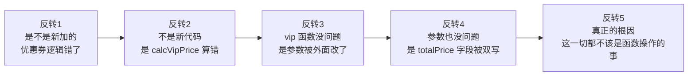
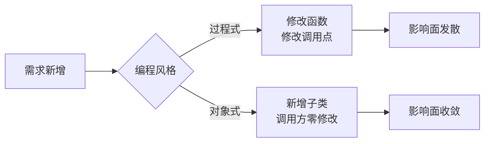
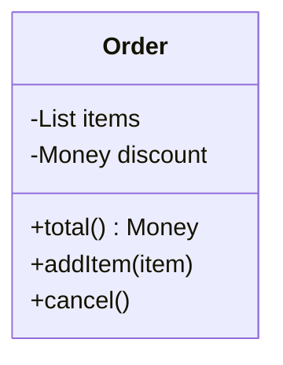
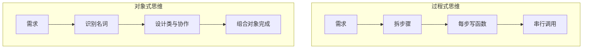
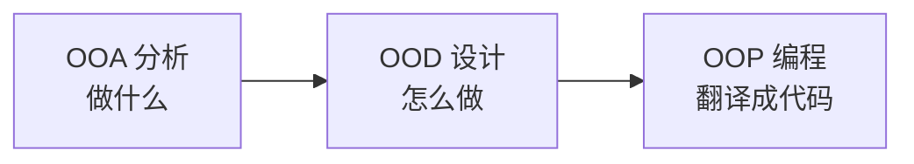
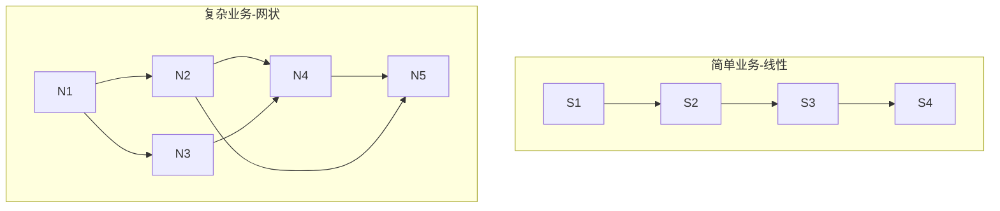
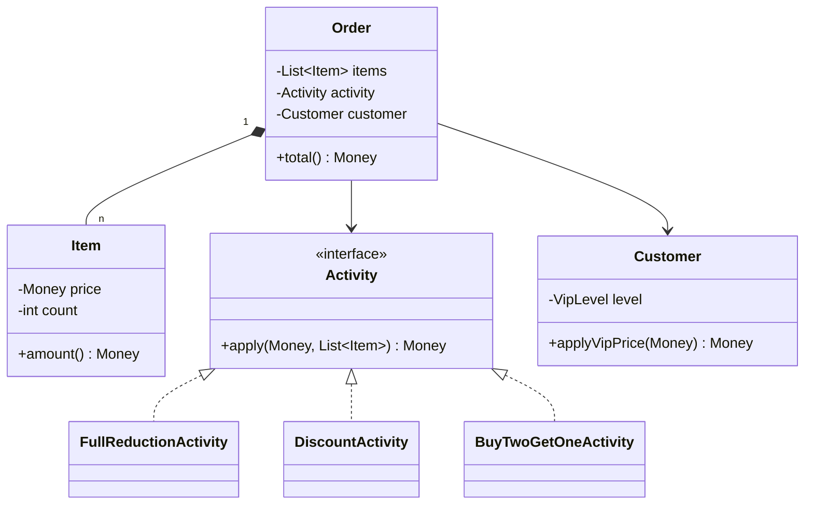
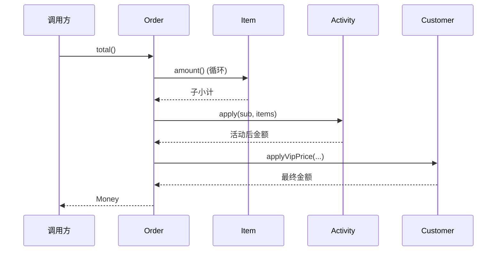

# 第一卷第1章：面向对象设计思想

#### 目录介绍
- [1.双11订单雪崩](#1双11订单雪崩)
  - [1.1 凌晨1点的告警](#11-凌晨1点的告警)
  - [1.2 五次反转排查](#12-五次反转排查)
  - [1.3 真正的根因](#13-真正的根因)
  - [1.4 灵魂五连问](#14-灵魂五连问)
- [2.从一个案例切入](#2从一个案例切入)
  - [2.1 订单需求](#21-订单需求)
  - [2.2 看过程式实现](#22-看过程式实现)
  - [2.3 把痛点暴露出来](#23-把痛点暴露出来)
  - [2.4 对象式重构](#24-对象式重构)
  - [2.5 两种风格对比](#25-两种风格对比)
- [3.对象到底是什么](#3对象到底是什么)
  - [3.1 现实的映射](#31-现实的映射)
  - [3.2 数据加行为](#32-数据加行为)
  - [3.3 类是模板](#33-类是模板)
- [4.从过程到对象](#4从过程到对象)
  - [4.1 过程式范式](#41-过程式范式)
  - [4.2 演化的动力](#42-演化的动力)
  - [4.3 对象式范式](#43-对象式范式)
  - [4.4 思维差异](#44-思维差异)
- [5.OOP 三阶段](#5oop-三阶段)
  - [5.1 OOA 分析](#51-ooa-分析)
  - [5.2 OOD 设计](#52-ood-设计)
  - [5.3 OOP 编程](#53-oop-编程)
  - [5.4 UML 工具](#54-uml-工具)
- [6.两种范式取舍](#6两种范式取舍)
  - [6.1 复杂度阈值](#61-复杂度阈值)
  - [6.2 网状 vs 线性](#62-网状-vs-线性)
  - [6.3 伪 OOP 风险](#63-伪-oop-风险)
- [7.综合实战案例](#7综合实战案例)
  - [7.1 营销系统接需求](#71-营销系统接需求)
  - [7.2 过程式版本翻车](#72-过程式版本翻车)
  - [7.3 对象式演化三步](#73-对象式演化三步)
  - [7.4 类图与时序](#74-类图与时序)
  - [7.5 留下三道思考题](#75-留下三道思考题)
- [8.认知跃迁总结](#8认知跃迁总结)
  - [8.1 一句话回望](#81-一句话回望)
  - [8.2 与下一篇衔接](#82-与下一篇衔接)

---

## 1.双11订单雪崩

### 1.1 凌晨1点的告警

2023 年 11 月 11 日 01:03，某电商平台监控大屏一片血红：**核心订单服务 CPU 100%、平均响应 9.7 秒、错误率 23%**。运营同事在群里发出第一条求救：「优惠叠加算错了，所有订单都要重算！」

值班工程师拉起代码，`OrderUtil.calculate()` 这个函数，从 2016 年的 47 行长成了 **1284 行**，里面塞着 9 种折扣逻辑、4 种运费规则、3 种税费表，外加 17 个 `if (activityType == ...)` 分支。每一次大促前，都有人在这里"加一行小逻辑"，没有人敢删旧的。

直接故障的代码片段（脱敏后）大致是这样：

> ```java
> // OrderUtil.java  L843-L1062
> if (activityType == 1) {
>     total = subtotal * 0.9;
> } else if (activityType == 2 || activityType == 22) {
>     total = subtotal - 50;
>     if (isVip) total -= 30;
>     // ... 200 行后
>     total = total * (1 - couponDiscount);  // ← 重复打了一次折
> } else if (activityType == 3) {
>     // ...
> }
> ```

短短 220 行 `else if` 链里，**同一个 `total` 被读写了 17 次**，任何一处疏忽，全盘错算。

### 1.2 五次反转排查

事故复盘那天，我们以为答案显而易见。**但真相经历了五次反转**：



**反转 1**：以为是新加的「双 11 满 300 减 50」逻辑算错。回滚，错误依旧。

**反转 2**：以为是会员价计算函数 `calcVipPrice` 内部 bug。单测，通过。

**反转 3**：以为是参数 `subtotal` 在调用前被某个上游函数改写。日志，干净。

**反转 4**：以为是 `OrderDTO.totalPrice` 字段被多个函数同时写入。**确实如此**。

**反转 5**：但堵掉双写还是会出事，**因为下一个加新逻辑的人，照样会再去写它**。

真正的根因不是代码错，是**架构错**：`OrderDTO` 是一个**裸数据袋子**，谁拿到都能读、能改；而 `OrderUtil` 是一堆**漂浮在数据之外的函数**，这个组合，注定让"算错"成为时间问题，而非概率问题。

### 1.3 真正的根因

把这次事故抽象一层，会发现它根本不是一个 bug，而是**一类 bug**：

| 现象 | 本质 |
|------|------|
| 同一个字段被 17 处函数写入 | 数据没有守门人 |
| 加一个新优惠就要改 17 处 | 行为没有归属 |
| 单测覆盖率 92%，仍然出事 | 测试只测函数，不测「业务规则」 |
| 改不动、又删不掉 | 复杂度被均匀摊在所有调用点 |

四行现象，根因只有一句话：**数据和行为没被绑定到同一个边界里。** 而把数据和行为绑到同一个边界，这件事本身，就叫「面向对象」。

### 1.4 灵魂五连问

为了把这次事故讲透，本文将围绕五个层层递进的问题展开，**它们就是全篇的骨架**：

```
Q1 ── 同样一段业务，为什么过程式写法过几年就一定烂？
       └─→ §1 用订单案例对比两种风格
Q2 ── 「对象」到底是什么？只是带方法的结构体吗？
       └─→ §2 拆开「对象」的本质
Q3 ── 既然都能跑，为什么我们要从过程式迁到对象式？
       └─→ §3 范式演化的内在动力
Q4 ── 「想清楚再写」具体是想清楚什么？
       └─→ §4 OOA / OOD / OOP 三阶段
Q5 ── 是不是所有项目都该用对象式？
       └─→ §5 复杂度阈值与伪 OOP 风险
```

读完全文，再回头看这次双 11 雪崩，你会发现：**它不是一个加班能解决的问题，是一个范式选错了的问题**。

---

## 2.从一个案例切入

### 2.1 看订单需求

设想电商平台一个朴素需求：**给定一个订单，计算实付金额（含商品总价、折扣、运费、税费）并打印**。

刚接到这个需求时，几乎所有人脑海里浮现的第一版伪代码都是相似的：取出商品列表 → 把单价乘以数量加起来 → 减去折扣 → 加上运费 → 加上税。它如此自然，以致我们很容易低估它在工程上的演化复杂度。

但需求看似简单，工程中却会被叠加：会员折扣、优惠券、跨境税费、海运/空运运费、不同地区税率、跨币种结算、活动期叠加规则……更糟的是，这些规则不是一次性写进文档的，而是**一年内每一两周就有人提出新的"小调整"**。这些"小调整"中的每一项，都会落到一段被无数下游函数共享的代码里。

我们用这个订单案例贯穿全篇，对比两种范式在面对 **"持续叠加的复杂度"** 时表现有何不同。看到第 5 篇你会发现，几乎所有面向对象设计原则要解决的，都是这同一类问题，只是抽象层级不同而已。

### 2.2 看过程式实现

最直观的写法：函数 + 数据。代码如下所示：

```java
public class OrderProcedural {
    public static void main(String[] args) {
        double[] prices = {100.0, 200.0, 50.0};
        int[] counts = {1, 2, 3};
        double discount = 0.9;
        double shipFee = 20.0;
        double taxRate = 0.06;

        double subtotal = calcSubtotal(prices, counts);
        double afterDisc = subtotal * discount;
        double total = afterDisc + shipFee + afterDisc * taxRate;

        System.out.println("应付：" + total);
    }

    static double calcSubtotal(double[] p, int[] c) {
        double s = 0;
        for (int i = 0; i < p.length; i++) s += p[i] * c[i];
        return s;
    }
}
```

数据是裸数组，行为是静态函数，二者各自漂浮、靠参数串起来。这种写法在脚本工具或者算法题里完全没问题，甚至效率高、易理解。

但它隐含了一个致命假设：**所有调用方都"懂规矩"**，知道 `prices` 和 `counts` 必须等长、知道 `discount` 是乘数而非百分数、知道 `taxRate` 不能为负。一旦项目成员超过 3 人，这种"心照不宣"的规矩就会被一次次破坏。

### 2.3 把痛点暴露出来

把需求滚动一轮：

- 加一种折扣策略 → 改 `main` 的拼装顺序；
- 同一个订单要既导出 PDF 又发短信 → 又得新增两组函数；
- 多人协作时，数组下标含义全靠注释维护，调用方写错下标 → 静默 bug。

这些问题都不是单一的"代码风格不好看"，而是会让线上事故率随代码规模呈指数增长的真实风险。在百万行规模的工程里，过程式代码每多一个全局函数，就多一份"潜在被调错"的可能。

**根因**：数据和行为没有边界，复杂度随需求线性扩散到调用点。换言之，**复杂度并没有消失，只是被你"摊到了未来每一个调用方头上"**，这正是面向对象设计要修复的根本问题。

### 2.4 对象式重构

把"订单"当作一等公民：

```java
class Order {
    private List<Item> items;
    private DiscountPolicy discount;   // 多态扩展点
    private ShippingPolicy shipping;
    private TaxPolicy tax;

    public Order(List<Item> items,
                 DiscountPolicy d, ShippingPolicy s, TaxPolicy t) {
        this.items = items; this.discount = d; this.shipping = s; this.tax = t;
    }

    public Money total() {
        Money sub = items.stream().map(Item::amount)
                                  .reduce(Money.ZERO, Money::add);
        Money afterDisc = discount.apply(sub);
        return afterDisc.add(shipping.fee(this))
                        .add(tax.of(afterDisc));
    }
}
```

调用方只关心 `order.total()`，**新增折扣只需新加一个 `DiscountPolicy` 实现**，不改 `Order`、不改调用点。

请仔细体会这句话，它是面向对象与面向过程在"扩展成本"上的根本差距。在过程式版本里，新增一种折扣策略意味着 `main` 函数里的拼装顺序、参数清单、判断分支都要随之调整；而在对象版本里，这种新增几乎是"加法式的"：新增一个文件、新增一个类、注入到容器里，已有代码完全不需要触碰。

更深一层看，`Order` 不再是一个被动的"数据袋子"，而成了一个**主动的业务概念**，它知道自己由哪些商品构成、知道自己应当套用什么折扣、知道自己最终的总价应当怎么算。调用方的代码因而变成了"声明式"：**告诉对象做什么，不告诉它怎么做**。这是面向对象与面向过程在"心智模型"上的根本分歧。

### 2.5 两种风格对比

| 维度 | 过程式 | 对象式 |
|------|--------|--------|
| 组织单元 | 函数 + 全局数据 | 类（数据+行为） |
| 扩展方式 | 改函数/加分支 | 加新类，旧码不动 |
| 复杂度承载 | 全部压在调用点 | 切片到各类内部 |
| 协作友好度 | 靠纪律 | 靠类型与边界 |



---

## 3.对象到底是什么

### 3.1 现实的映射

OOP（Object Oriented Programming）的核心隐喻是 **"用对象模拟现实世界"**。

> 一辆车、一张订单、一次远程连接，都可以是对象；对象之间的关系（聚合、依赖、组合）就是现实关系的映射。

这种映射不是装饰，而是**降低认知负担**：人脑天然擅长以名词+动词理解世界，过程式则强迫你切换到"步骤序列"的思维。

在产品经理嘴里说出来的需求，几乎从来不是"先做 A，再做 B，最后做 C"，而是"用户应该能下单、订单可以取消、商家可以发货"。需求天然以"实体 + 行为"的方式存在，而面向对象的代码只是把这种自然语言"低损"地翻译进了程序。这种"贴近需求语言"的特性，让代码在长期演化中更容易被理解和修改，你不需要先在脑海里把"步骤"反推回"业务概念"，再去做改动。

### 3.2 数据加行为

对象 = **属性**（数据/状态）+ **方法**（行为/能力）。



属性是"它是什么"，方法是"它能做什么"。**两者绑定**是对象式与过程式最根本的区别。

在过程式编程里，数据是"被加工的原料"，函数是"加工车间"，二者通过参数链接。这种"分离"在小规模代码里很轻巧，但当业务规则越来越多时，数据走到哪里，规则就要在哪里被重新校验一次，校验逻辑因此散落在系统各处，没人能保证它们彼此一致。

而对象把数据与守护它的行为锁在同一个边界里，**规则只写一次，永远不会被绕过**。这就是后面要讲的"封装"特性的真正价值。

### 3.3 类是模板

类（class）是对象的蓝图，对象（object）是类的实例。

```
Class:  Order （定义结构与行为）
          ↓ new
Object: order1, order2, order3 …（带具体状态）
```

类是编译期的概念，对象是运行期的实体；类描述"形状"，对象拥有"内容"。

---

## 4.从过程到对象

### 4.1 过程式范式

把"大象装冰箱"作为典型样本：

1. 打开冰箱
2. 放入大象
3. 关上冰箱

每一步都是参与者要亲自完成的动作，**面向过程**就是这种"我是执行者"的视角。它在小脚本、单一线性流程里高效、直观。

### 4.2 演化的动力

需求一旦从"装一头大象"变成"装多种动物、多种容器、还要校验空间"，过程式就不堪重负：

- 步骤会爆炸 → 函数列表越来越长；
- 数据散落 → 每个函数都要传一堆参数；
- 复用困难 → 每个新场景重写一遍流程。

工程界对此的回应就是：**把"高内聚的步骤+数据"打包成一个类**。

### 4.3 对象式范式

```
冰箱.open()
冰箱.put(大象)
冰箱.close()
```

调用者从"亲自做每一步"转变为"指挥对象做事"，角色从**执行者** → **指挥者**。

### 3.4 思维差异



**过程式问"怎么做"，对象式问"谁来做"**。问法不同，复杂度的归宿就不同。

### 4.4 看个演进案例

TODO：补充一个，从过程，到对象式的代码案例。然后在总结

---

## 5.OOP 三阶段

软件开发中三个连贯阶段：



### 5.1 OOA 分析

**搞清楚做什么**。从需求中识别名词（候选类）、动词（候选方法）、关系（候选关联），输出领域模型草图。

### 5.2 OOD 设计

**搞清楚怎么做**。把候选类细化为：哪些类、各自属性方法、类之间是聚合/继承/依赖、接口边界在哪。这一阶段直接决定后续编码的难易。

### 5.3 OOP 编程

把 OOD 的产物翻译为具体语言代码。这是最易被简化甚至被跳过的一步，但**OOA/OOD 做得好，OOP 才会顺畅**。

### 5.4 UML 工具

UML（Unified Modeling Language）是 OOA/OOD 的可视化沟通工具：

| 图类 | 用途 |
|------|------|
| 类图 | 静态结构（类/属性/方法/关系） |
| 时序图 | 动态调用顺序 |
| 用例图 | 用户角度的功能边界 |
| 状态图 | 单对象的状态机 |

不必苛求全部掌握，**会画类图与时序图即可应付 90% 设计沟通**。

---

## 6.两种范式取舍

### 6.1 复杂度阈值

简单脚本（百行以内、单一线程、一次性使用）选过程式；可演进系统（多模块、多人协作、长期维护）选对象式。**复杂度是范式选择的唯一硬指标**。

### 6.2 网状 vs 线性



线性流程，过程式贴合；网状协作，对象式才能把局部复杂度封住。

### 6.3 伪 OOP 风险

最常见的误区：**用面向对象语言写面向过程代码**，比如全是 `static` 工具类、几百行的"上帝类"、一切公开字段。

判断标准很简单：把字段全设 public 之后，**程序行为是否依然正确？** 如果是，说明类没承担任何不变量保护，等于过程式包了一层壳。

---

## 7.综合实战案例

> 这是 11 篇主线案例的**第 1 站**，电商订单系统的"裸版"。后续 10 篇会在它身上一次次重塑。每一次"重塑"都对应一次认知跃迁。

### 7.1 营销系统接需求

PM 给到这次的小需求：「我们要支持三种活动：满减、折扣、买二送一。每个活动都可能叠加会员价。最终输出一个订单总价。」

听起来很普通对不对？我们就用它，把过程式与对象式两种实现各跑一遍。

### 7.2 过程式版本翻车

工程师 A 接到需求，10 分钟写完：

```java
public class OrderCalc {
    public static double calc(double[] prices, int[] counts,
                              int activityType, boolean isVip) {
        double sub = 0;
        for (int i = 0; i < prices.length; i++) sub += prices[i] * counts[i];

        double total = sub;
        if (activityType == 1) {                 // 满减
            if (sub >= 300) total = sub - 50;
        } else if (activityType == 2) {          // 折扣
            total = sub * 0.9;
        } else if (activityType == 3) {          // 买二送一
            // 这里其实需要细到 item 级，但 item 已经被拍扁成数组
            total = sub * (counts.length - 1) / counts.length;
        }

        if (isVip) total *= 0.95;
        return total;
    }
}
```

它**能跑**。但下面任何一个新需求，都会让它原地爆炸：

| 新需求 | 改动范围 |
|---|---|
| 满减改成"满 300 减 50、满 500 减 100、满 1000 减 250"阶梯 | 改 `if (activityType==1)` 分支 |
| 加一种「优惠券」 | 加 `activityType==4`，且要排"满减+优惠券"叠加规则 |
| 「买二送一」要支持指定商品 | 入参 `prices/counts` 必须升级为 `Item[]`，**调用方全改** |
| 不同会员等级有不同折扣 | `isVip` 升级为 `vipLevel`，**所有调用点修改** |

每一次需求，**都不是"加一段"，而是"全身手术"**。这正是开篇 §1 双 11 雪崩的来源。

### 7.3 对象式三步演化

工程师 B 拿到同一个需求，**先停下来问 §4 的三个问题**：

```
OOA: 这里有什么"名词"？  → 订单 Order、商品 Item、活动 Activity、会员 Customer
OOD: 它们之间什么关系？   → Order 聚合 Item，Order 适用 Activity，Order 归属 Customer
OOP: 让谁守哪条规则？     → 订单守"总价正确"，活动守"打折规则"，会员守"会员价规则"
```

这三个问题想清楚了，代码自然长成这样：

```java
// 第 1 步：把名词建模为类
public class Item {
    private final Money price;
    private final int count;
    public Money amount() { return price.times(count); }
}

public class Order {
    private final List<Item> items;
    private final Activity activity;
    private final Customer customer;

    public Money total() {
        Money sub = items.stream()
                         .map(Item::amount)
                         .reduce(Money.ZERO, Money::add);
        Money afterActivity = activity.apply(sub, items);
        return customer.applyVipPrice(afterActivity);
    }
}

// 第 2 步：把"会变化的部分"做成抽象
public interface Activity {
    Money apply(Money subtotal, List<Item> items);
}

// 第 3 步：每种活动是一个独立实现
public class FullReductionActivity implements Activity { /*满减*/ }
public class DiscountActivity     implements Activity { /*折扣*/ }
public class BuyTwoGetOneActivity implements Activity { /*买二送一*/ }
```

注意三个细节，它们已经预演了后面 10 篇的全部主题：

- 把 `price` 包成 `Money` 而不是 `double`，预告了 [11 篇 DDD 的值对象](11.DDD与战术的建模)；
- 把 `Activity` 设成接口，预告了 [04 篇接口编程](https://yccoding.com/pages/d080c5/)；
- 让 `Order.total()` 是**唯一入口**，预告了 [02 篇封装](./02.面向对象特性思考) 与 [11 篇聚合根](11.DDD与战术的建模)。

### 7.4 类图与时序



调用方一直只看到 `order.total()` 一个方法。**新增第 4 种活动？只新增 1 个 `Activity` 实现类，其余文件零修改**，这就是面向对象在"扩展成本"上的胜利。



### 7.5 留下三道思考题

这三道题的答案，会在第 02 篇开头揭晓。

**🟢 易**：上面 `Order.total()` 里，假设我把 `items` 字段改成 `public`，会发生什么坏事？请至少举出 2 种。

**🟡 中**：「买二送一」需要按"最便宜的那一件免费"来送，请你修改 `BuyTwoGetOneActivity`，但**不能修改 `Order` 类一行代码**。你做得到吗？

**🔴 难**：如果同一个订单可以叠加多个活动（满减 + 优惠券 + 会员价），你会怎么改造 `Activity` 接口？说明你的取舍，是改成 `List<Activity>`、还是改成"装饰器链"，还是改成"管道"？三种方案各有什么代价？

---

## 8.认知跃迁总结

### 8.1 一句话回望

回到开篇双 11 雪崩。如果当年订单系统不是 `OrderUtil.calculate(...)` 这一堆漂浮的函数，而是 `order.total()` 这一个有边界的对象，

**那些 17 个 `else if`，根本没机会出现**。

复杂度并不会因为我们写了 OOP 而消失，它只是被**切片**进了不同的对象内部，每个对象只看自己那一片。这也是本篇最想送给你的一句话：**过程式问"怎么做"，对象式问"谁来做"，问法不同，复杂度的归宿就不同。**

### 8.2 与下一篇衔接

但**只懂"什么是对象"还不够**。要写出真正的对象式代码，必须掌握四大特性：

- **封装**，不变量的守卫（解决「字段被任意写」）
- **抽象**，隐藏实现复杂度（解决「细节泄漏到调用方」）
- **继承**，复用与类型层级（解决「重复代码」）
- **多态**，统一接口处理一族类型（解决「if-else 满天飞」）

下一篇 [02.面向对象的特性](./02.面向对象特性思考) 会从一次"钱包余额对不上"的真实事故切入，把四大特性逐一拆穿，并且，**会回答本篇遗留的三道思考题**。

同时，你写下的 `Order` 类，将作为**第 02 篇的开篇代码**。我们要在它身上动一次封装手术，看完你就懂为什么"有方法的类"不等于"封装"。

