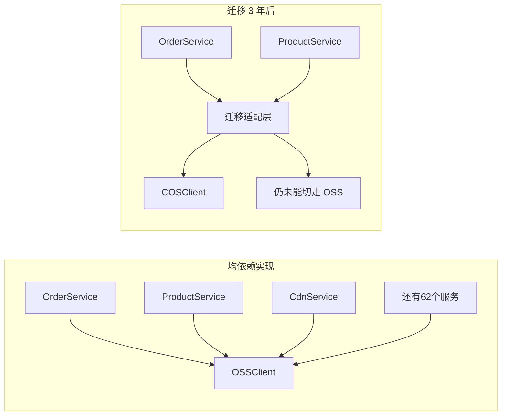
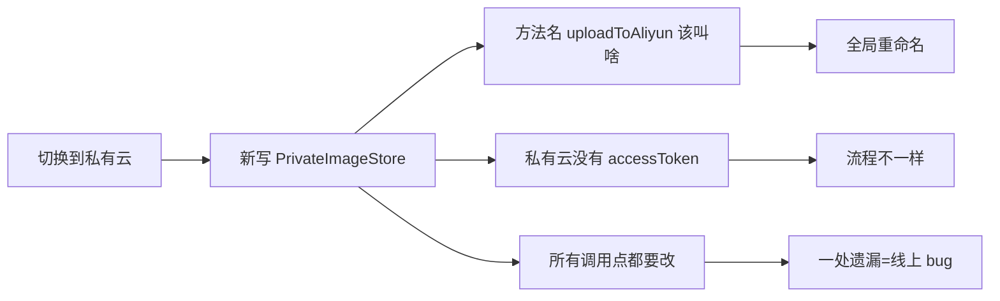
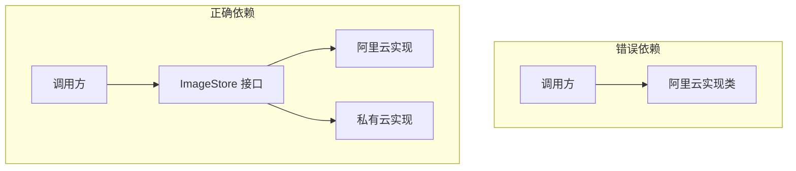
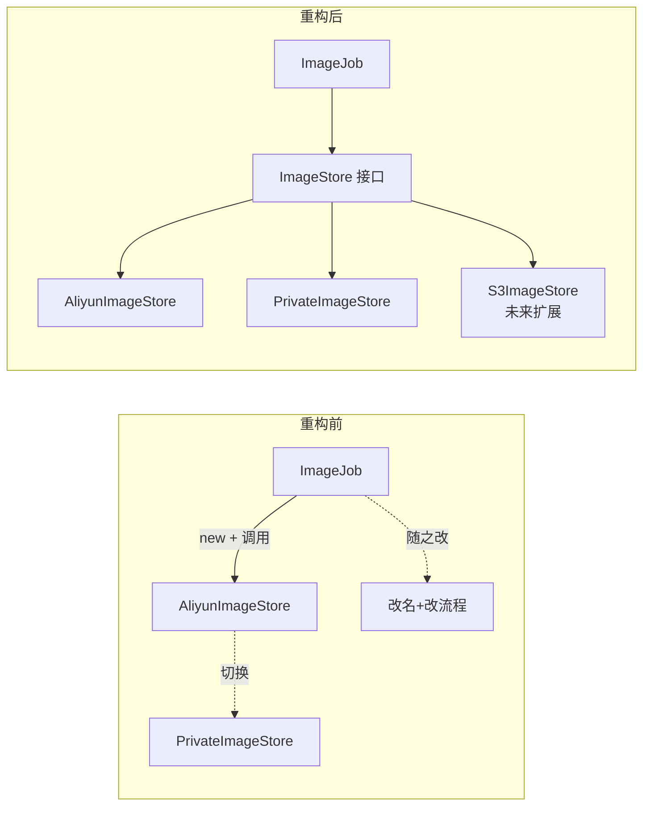
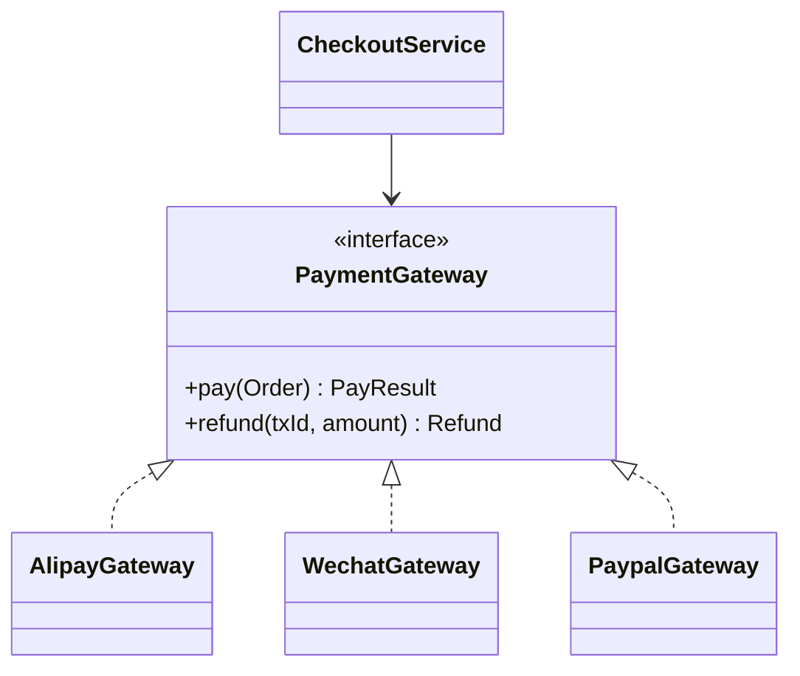
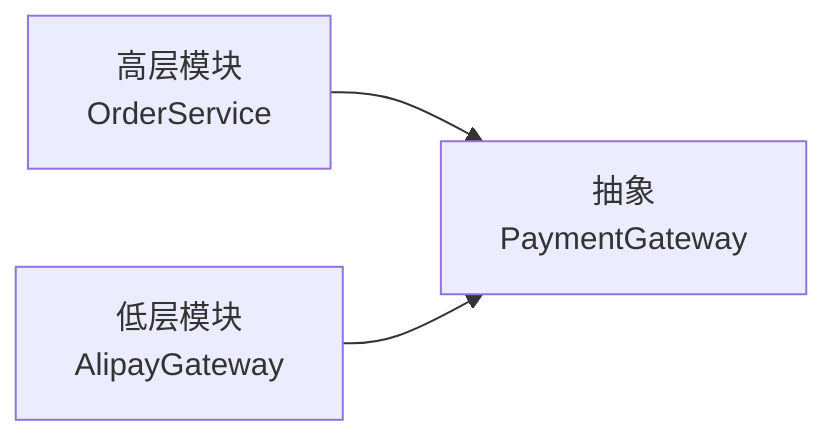
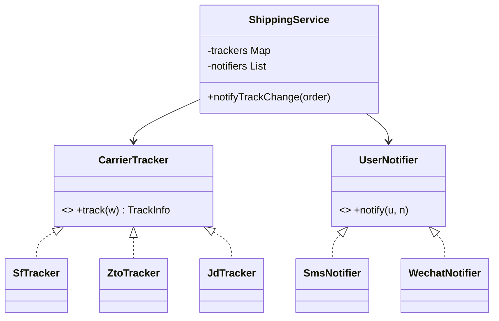

# 第一卷第4章：接口而非实现编程

#### 目录介绍
- [1.先回答上篇思考题](#1先回答上篇思考题)
  - [1.1 上篇遗留三道题](#11-上篇遗留三道题)
  - [1.2 云迁移6万行代码](#12-云迁移6万行代码)
  - [1.3 五次反转补锅](#13-五次反转补锅)
  - [1.4 灵魂五连问](#14-灵魂五连问)
- [2.从一个搬迁切入](#2从一个搬迁切入)
  - [2.1 上云搬迁案例](#21-上云搬迁案例)
  - [2.2 改造的代价](#22-改造的代价)
  - [2.3 问题的根因](#23-问题的根因)
- [3.原则的本质](#3原则的本质)
  - [3.1 一句话理解](#31-一句话理解)
  - [3.2 接口的双重含义](#32-接口的双重含义)
  - [3.3 抽象层的价值](#33-抽象层的价值)
- [4.重构图片存储](#4重构图片存储)
  - [4.1 三步重构法](#41-三步重构法)
  - [4.2 重构后代码](#42-重构后代码)
  - [4.3 演化对比图](#43-演化对比图)
- [5.支付渠道实战](#5支付渠道实战)
  - [5.1 多支付场景](#51-多支付场景)
  - [5.2 抽象统一接口](#52-抽象统一接口)
  - [5.3 调用方零修改](#53-调用方零修改)
- [6.设计的边界](#6设计的边界)
  - [6.1 接口的代价](#61-接口的代价)
  - [6.2 何时不需要](#62-何时不需要)
  - [6.3 反模式警示](#63-反模式警示)
- [7.原则进阶](#7原则进阶)
  - [7.1 与依赖倒置](#71-与依赖倒置)
  - [7.2 与开闭原则](#72-与开闭原则)
  - [7.3 与可测试性](#73-与可测试性)
- [8.总结与延伸](#8总结与延伸)
- [9.综合实战案例](#9综合实战案例)
  - [9.1 货运推送接需求](#91-货运推送接需求)
  - [9.2 依赖实现的崩塌](#92-依赖实现的崩塌)
  - [9.3 接口化三步重构](#93-接口化三步重构)
  - [9.4 类图与可测性](#94-类图与可测性)
  - [9.5 留下三道思考题](#95-留下三道思考题)
- [10.认知跃迁总结](#10认知跃迁总结)

---

## 1.先回答上篇思考题

### 1.1 上篇遗留三道题

上一篇 [03.接口vs抽象类比较](https://yccoding.com/pages/eceb4b/) 末尾留下了三道题：

- 🟢 `AbstractStandardGateway.pay` 加 `final` 的原因？
- 🟡 多插拔点该怎么设计？
- 🔴 合规检查等「横切关注」该怎么加进去？

| 题 | 本篇答案 |
|---|---|
| 🟢 | 不加 `final` → 子类可以重写「骨架流程」 → **模板失效**，所有“公共动作”可被跳过 |
| 🟡 | **多插拔点 → 多个接口**。每个可插拔点提取为接口（`RateLimiter`/`FinChecker`/`Retryer`），抽象类只作为「接口装配者」 |
| 🔴 | 横切关注 = AOP / Decorator。**不走接口，也不走抽象类**，走**装饰器链**，这是本篇「依赖接口而非实现」的另一面 |

三道题本质指向一个问题：**调用方不应该看到具体实现**。它不仅是「面向接口编程」，更是「**面向能力契约**编程」。

### 1.2 云迁移6万行代码

2022 年某互联网公司「去阿里云」：从阿里云 OSS 迁到腾讯云 COS。调研阶段估计「2 人月12 天完成」。实际：

```
年中启动 → 预计Q3完成
实际进度：
Q3末完成 30%、上线出了 17 个由「调用 SDK 差异」引起的事故
Q4末完成 65%、为了兼容两个 SDK，加了中间适配层
Q1今未全完：还有3 个老服务依然依赖 OSS SDK，谁也不敢动
```

事后复盘 git，发现代码里出现了 **62873 个 `OSSClient` 字符串**。这意味着是迫在**几万处**代码背后作修改，而非某个抽象中枢。



如果开发人从第一天就让 `OrderService` 依赖于 `ImageStore` **接口**而不是 `OSSClient` **实现**，迁移只需改 1 个 `Bean` 配置。但实际付出的是 **3 年 + 几十个工程师 + 17 个线上事故** 的代价。

> 这不是「代码不够优雅」的问题，这是**企业生死存亡**级别的设计选择。

### 1.3 五次反转补锅

手术现场五次反转：

**反转 1**：动动手把 `OSSClient` 改名为 `ImageStore` → 调用方代码看起来凅了，**实际还是同一个类**。

**反转 2**：抽出接口 `ImageStore`，让 `OSSImageStore` 实现 → 调用方仍然写 `new OSSImageStore()`，**耦合在 new 表达式里**。

**反转 3**：发现调用方调用了以下 8 个 OSS 独有特性方法（`bucketAcl`/`presignUrl`/`expireRule`...），接口里要不要加？**加了就不抽象，不加调用方要重写**。

**反转 4**：抽象 PresignUrl、ExpireRule 为独立接口 → 可能会出现 5个接口，调用方发现「代码里一堆 if instanceof XxxAware」。

**反转 5**：最终落定，不是「接口越庞大越好」，而是「**接口要面向「调用场景」，不面向「实现能力」**」。多出来的能力要么不该走接口，要么该举升为独立能力接口。

这五个反转又一次揭示：**「面向接口编程」不是难在语法，难在「选哪些能力走接口」**。

### 1.4 灵魂五连问

```
Q1 ── 「依赖接口」与「依赖实现」在字节码层看有什么区别？
       └─→ §02 原则的本质
Q2 ── 不是已经用了抽象类了吗，为什么还要接口？
       └─→ §02.2 接口的双重含义
Q3 ── 哪些东西不该抽象为接口？
       └─→ §05 设计的边界Q4 ── 为什么「依赖接口」几乎等价于「可测性」？
       └─→ §06.3 与可测性
Q5 ── 「依赖抽象」与「依赖倒置」到底一样不一样？
       └─→ §06.1 与依赖倒置
```

---

## 2.从一个搬迁切入

### 2.1 上云搬迁案例

承接上一篇电商系统。系统里有图片处理模块，最初图片传阿里云：

```java
public class AliyunImageStore {
    public void createBucketIfNotExisting(String bucketName) { /* … */ }
    public String generateAccessToken() { /* 阿里云鉴权 */ }
    public String uploadToAliyun(Image img, String bucket, String token) { /* … */ }
    public Image downloadFromAliyun(String url, String token) { /* … */ }
}

public class ImageJob {
    public void process() {
        AliyunImageStore store = new AliyunImageStore();
        store.createBucketIfNotExisting("ai_images");
        String token = store.generateAccessToken();
        store.uploadToAliyun(image, "ai_images", token);
    }
}
```

代码看起来"很正常"。

### 2.2 改造的代价

公司决定切换到自建私有云。**只是换个存储**，结果改造量惊人：



- `uploadToAliyun()` 这个名字写死了"阿里云" → 调用点全要重命名；
- 私有云不需要 `accessToken` → 调用流程也要改；
- 散落在几十个文件里的 `new AliyunImageStore()` 一处改漏就翻车。

### 2.3 问题的根因

**调用方依赖了具体实现**，而具体实现把"阿里云"这个易变细节渗透进了：

- 类名（AliyunImageStore）
- 方法名（uploadToAliyun）
- 流程结构（必须 generateAccessToken）

调用方与一个"会变的东西"绑死了，变化的代价就以**乘法**形式爆炸。

---

## 3.原则的本质

### 3.1 一句话理解

> **Program to an interface, not an implementation.**
>
> 依赖抽象的契约，不依赖具体的实现。



### 3.2 接口的双重含义

这里的"接口"有两层：

1. **语法层**：Java `interface`、C++ 抽象类，具体的语法机制；
2. **设计层**：一组**协议/契约**，描述"做什么"而非"怎么做"。

设计层的含义比语法层更广：**只要你定义了稳定的对外能力清单**，哪怕用普通类承载，本质也是"面向接口编程"。

### 3.3 抽象层的价值

```
不稳定的实现       稳定的接口          调用方
   ↓                ↓                ↓
易变细节  ─封装─→  统一契约  ←─依赖─  关心 what 不关心 how
```

**接口是"防火墙"**：把不稳定的底层与稳定的上层隔开，变化被堵在防火墙之内。

---

## 4.重构图片存储

### 4.1 三步重构法


| 步骤 | 反例 | 正例 |
|------|------|------|
| 1.命名抽象 | `uploadToAliyun` | `upload` |
| 2.流程封装 | 调用方拼装 token+upload | 接口内部一次完成 |
| 3.接口提取 | 直接 new AliyunImageStore | new ImageStore 接口 |

### 4.2 重构后代码

```java
// 1. 接口：只描述"做什么"
public interface ImageStore {
    String upload(Image image, String bucketName);
    Image download(String url);
}

// 2. 阿里云实现：把 token、bucket 等内部流程封进 upload
public class AliyunImageStore implements ImageStore {
    @Override
    public String upload(Image image, String bucketName) {
        ensureBucket(bucketName);
        String token = generateToken();    // 内部细节
        return doUpload(image, bucketName, token);
    }
    @Override
    public Image download(String url) {
        String token = generateToken();
        return doDownload(url, token);
    }
    private void ensureBucket(String n) { /* … */ }
    private String generateToken() { /* … */ }
    private String doUpload(Image i, String b, String t) { /* … */ }
    private Image  doDownload(String u, String t) { /* … */ }
}

// 3. 私有云实现：流程不同，但接口一致
public class PrivateImageStore implements ImageStore {
    @Override
    public String upload(Image image, String bucketName) {
        ensureBucket(bucketName);
        return doUpload(image, bucketName);   // 不需要 token
    }
    @Override
    public Image download(String url) { return doDownload(url); }
    private void ensureBucket(String n) { /* … */ }
    private String doUpload(Image i, String b) { /* … */ }
    private Image  doDownload(String u) { /* … */ }
}

// 4. 调用方：永远只看到 ImageStore
public class ImageJob {
    private final ImageStore store;
    public ImageJob(ImageStore store) { this.store = store; }
    public void process(Image image) {
        store.upload(image, "ai_images");
    }
}
```

### 4.3 演化对比图



切换实现 → **构造时换一行**，调用方零改动。

---

## 5.支付渠道实战

### 5.1 多支付场景

电商系统支付：支付宝、微信、信用卡、PayPal……且未来还要加。

```java
// ❌ 反例：开关变成调用方的负担
public class CheckoutService {
    public void pay(Order order, String channel) {
        if ("alipay".equals(channel)) new Alipay().pay(...);
        else if ("wechat".equals(channel)) new Wechat().pay(...);
        else if ("paypal".equals(channel)) new PayPal().pay(...);
    }
}
```

加一种渠道 → 改 `CheckoutService` → 改测试 → 改调用方……**坏味道全套齐了**。

### 5.2 抽象统一接口

```java
public interface PaymentGateway {
    PayResult pay(Order order);
    Refund    refund(String txId, Money amount);
}

public class AlipayGateway implements PaymentGateway { /* … */ }
public class WechatGateway implements PaymentGateway { /* … */ }
public class PaypalGateway implements PaymentGateway { /* … */ }
```



### 5.3 调用方零修改

```java
public class CheckoutService {
    private final Map<String, PaymentGateway> gateways;  // 注入

    public CheckoutService(Map<String, PaymentGateway> gateways) {
        this.gateways = gateways;
    }

    public void pay(Order order, String channel) {
        PaymentGateway g = gateways.get(channel);
        if (g == null) throw new UnsupportedChannelException(channel);
        g.pay(order);
    }
}
```

新增 PayPal → **只加一个 `PaypalGateway` + 注入 Map**，业务层完全不动。

```java
// 第 1 步：新建实现类（20 行）
public class PaypalGateway implements PaymentGateway {
    public PayResult pay(Order order)   { /* 调 PayPal API */ }
    public Refund    refund(String txId, Money amount) { /* 调 PayPal 退款 */ }
}

// 第 2 步：在初始化处注册一行，CheckoutService 零修改
gateways.put("paypal", new PaypalGateway());

// 第 3 步：调用方 order.pay("paypal") → CheckoutService 仍然是那 12 行代码
```

三周后 PM 说"接 Stripe"。再来一次：**加类 + 加一行注入**，其余所有文件不动。

---

## 6.设计的边界

### 6.1 接口的代价

抽象不是免费的：

| 代价 | 说明 |
|------|------|
| 类爆炸 | 每个实现一个接口 → 类数量翻倍 |
| 间接调用 | 多一层调度，调试栈更深 |
| 阅读负担 | 看到接口要再找实现 |
| 过度设计 | 永远只会有一种实现的也加接口，纯负担 |

### 6.2 何时不需要

不是所有地方都要"基于接口"。判断标准：**这个能力未来可能被替换吗？**

| 情况 | 是否抽接口 |
|------|------------|
| 一次性脚本 | 否 |
| 内部工具类（StringUtil） | 否 |
| 业务实体（Order） | 否 |
| 三方依赖（支付/消息/存储） | **是** |
| 跨模块协议 | **是** |
| 易变策略（折扣/风控） | **是** |

### 6.3 反模式警示

**反推接口陷阱**，先写实现类，再把它的方法照搬成接口：

```java
// ❌ 把 generateAccessToken 也放进接口 → 接口被实现污染
public interface ImageStore {
    String upload(...);
    String generateAccessToken();   // 这是阿里云的细节，泄漏了
}
```

接口要"自上而下"设计，先想清楚**调用方需要什么能力**，才决定接口长什么样，**绝不能由实现反推**。

---

## 7.原则进阶

### 7.1 与依赖倒置

依赖倒置原则（DIP）：**高层不依赖低层，二者都依赖抽象**。

"接口而非实现编程"是 DIP 的具体落地手段：



依赖关系从"高层 → 低层"反转为"两侧 → 抽象"，故得名"倒置"。

### 7.2 与开闭原则

开闭原则（OCP）：**对扩展开放，对修改关闭**。

```
新增 PayPal → 加新类（扩展开放）
不改 CheckoutService（修改关闭）
```

**接口编程是 OCP 的入场券**，没有抽象层，扩展就只能靠改旧码。

### 7.3 与可测试性

```java
// 单测时注入假实现
class FakeGateway implements PaymentGateway {
    public PayResult pay(Order o) { return PayResult.success("fake_tx"); }
    public Refund refund(String t, Money m) { return Refund.ok(); }
}

@Test
void test_checkout() {
    CheckoutService svc = new CheckoutService(Map.of("fake", new FakeGateway()));
    svc.pay(order, "fake");
    // 验证业务逻辑，不需要真支付宝
}
```

**没有接口就没有 Mock，没有 Mock 就没有可靠单测**。可测试性是接口编程的副产品，也是衡量设计质量的硬指标。

---

## 8.总结与延伸

| 关键点 | 内容 |
|--------|------|
| 一句话 | 依赖抽象，不依赖实现 |
| 解决的痛 | 实现切换的连锁修改 |
| 三步重构 | 命名抽象 → 流程封装 → 接口提取 |
| 边界 | 仅一种实现且不会变 → 不必抽 |
| 配套原则 | DIP、OCP、可测性 |

到这里，你已经能写出"调用方依赖接口"的代码。但接口/抽象类只是组装代码的方式之一，**"继承"也常被用来做扩展点**。问题是：继承用多了会带来什么？

下一篇 [05.多用组合和少继承](https://yccoding.com/pages/3b28c3/) 将揭示继承的暗坑，并展示组合如何成为更优解。

---

## 9.综合实战案例

> 主线接力，03 篇为支付网关选了抽象，本篇要让**调用方**发生根本性转变。

### 9.1 货运推送接需求

PM 给出需求：

```
1. 订单发货后需发货运信息给用户
2. 支持三家快递：顺丰 / 中通 / 京东物流
3. 只主要调用他们接口查物流状态
4. 并将状态变化推送给用户（短信/公众号/站内信）
5. 后期要接亲邮、万国邮政、DHL
```

### 9.2 依赖实现的崩塌

工程师第一版：

```java
public class ShippingService {
    private final SfClient   sf   = new SfClient();    // 顺丰 SDK
    private final ZtoClient  zto  = new ZtoClient();   // 中通 SDK
    private final JdLogClient jd  = new JdLogClient(); // 京东物流 SDK

    public void notify(Order order) {
        TrackInfo info;
        switch (order.carrier()) {
            case SF:  info = sf.queryTrack(order.waybill()); break;
            case ZTO: info = zto.track(order.waybill());     break;
            case JD:  info = jd.getStatus(order.waybill());  break;
            default: throw new IllegalStateException();
        }
        // 推送逻辑同样是 switch
        switch (order.user().pushPref()) {
            case SMS: smsClient.send(...); break;
            ...
        }
    }
}
```

三个问题一起出现：

| 现象 | 本质 |
|---|---|
| 接亲邮 → 多一个 `case`、多一次 `if` | OCP 违反 |
| 单测时发现 SDK 依赖真实网络 → **无法 mock** | 可测性崩塌 |
| `ShippingService` 同时抱住 3 个 SDK、3 个推送渠道、业务三个职责 | SRP 违反 |

### 9.3 接口化三步重构

**第 1 步：提炼能力接口**，调用方只表达「我要查物流」，不表达「我使用顺丰」：

```java
public interface CarrierTracker {
    TrackInfo track(String waybill);
}
public interface UserNotifier {
    void notify(User u, Notice n);
}
```

**第 2 步：调用方只认识接口**：

```java
public class ShippingService {
    private final Map<Carrier, CarrierTracker> trackers;  // 类型 → 实现
    private final List<UserNotifier> notifiers;            // 多推送渠道同时

    public ShippingService(Map<Carrier, CarrierTracker> t, List<UserNotifier> n) {
        this.trackers = t; this.notifiers = n;
    }

    public void notifyTrackChange(Order order) {
        TrackInfo info = trackers.get(order.carrier()).track(order.waybill());
        Notice n = NoticeBuilder.from(info);
        notifiers.forEach(x -> x.notify(order.user(), n));   // 多推送渠道
    }
}
```

**第 3 步：实现接入**，每个 SDK 一个实现类、Spring 自动装配：

```java
@Component class SfTracker  implements CarrierTracker { @Override public TrackInfo track(String w) { return ... ; } }
@Component class ZtoTracker implements CarrierTracker { ... }
@Component class JdTracker  implements CarrierTracker { ... }
@Component class SmsNotifier   implements UserNotifier { ... }
@Component class WechatNotifier implements UserNotifier { ... }
```

接一家亲邮？`@Component class YouzhengTracker` 加 1 个 `@Bean` 注册，**`ShippingService` 一行不改**。这才是原则价值的最直接体现。

### 9.4 类图与可测性



现在写单测变得近乎微笑：

```java
@Test void notifyShouldFanOutToAllChannels() {
    var fakeSf  = mock(CarrierTracker.class);
    when(fakeSf.track("w1")).thenReturn(new TrackInfo("已发货"));
    var fakeSms = mock(UserNotifier.class);
    var fakeWx  = mock(UserNotifier.class);

    var svc = new ShippingService(Map.of(Carrier.SF, fakeSf), List.of(fakeSms, fakeWx));
    svc.notifyTrackChange(orderWithSf("w1"));

    verify(fakeSms).notify(any(), any());
    verify(fakeWx).notify(any(), any());
}
```

> 这就是接口编程的隐藏复利：**单测不需要任何真实 SDK / 真实网络 / 真实手机**。它预告了第 10 篇《可测性设计》。

### 9.5 留下三道思考题

> 答案在第 05 篇开头揭晓。

- **🟢 易**：为什么我们把 `trackers` 写成 `Map<Carrier, CarrierTracker>` 而不是 `List<CarrierTracker>`？二者语义有什么本质差别？
- **🟡 中**：`SfTracker` 里要调用顺丰 SDK，而 SDK 包含一个 `SfApiClient` 该怎么设计？是「`SfTracker` 继承 `SfApiClient`」还是「`SfTracker` 含有一个 `SfApiClient` 字段」？
- **🔴 难**：如果「顺丰」、「中通」、「京东物流」他们 **80% 共同逻辑**（例如身份鉴权、重试、限流）你会怎么复用？是抽公共抽象类还是包装一个 `RestApiBase` 字段？提示：这道题就是下一篇《多用组合少用继承》的核心争论。

---

## 10.认知跃迁总结

回到云迁移 6 万行代码那件事。如果从代码的第一天，**调用方看到的是 `ImageStore` 接口而不是 `OSSClient`**，迁移可能只需要一个 `@Bean` 配置、三个工作日、一个工程师。

一句话：

> **不是「有了接口才能切换实现」，是「所有调用都锁定在接口，实现才脱离了环境锁定」。**
>
> 接口不是为了抽象而抽象，是为了「年后的你」能走。

下一篇 [05.多用组合和少继承](https://yccoding.com/pages/3b28c3/)，你会发现：接口能解决「调用方锁死」，但解不了「**多个能力拼装**」。后者需要 OOP 最被滥用也最被误解的机制：继承 vs 组合。