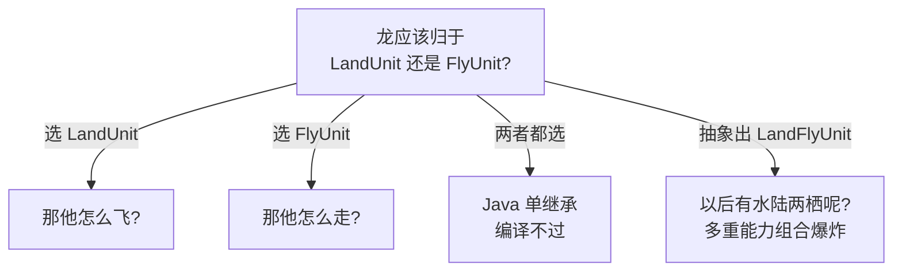
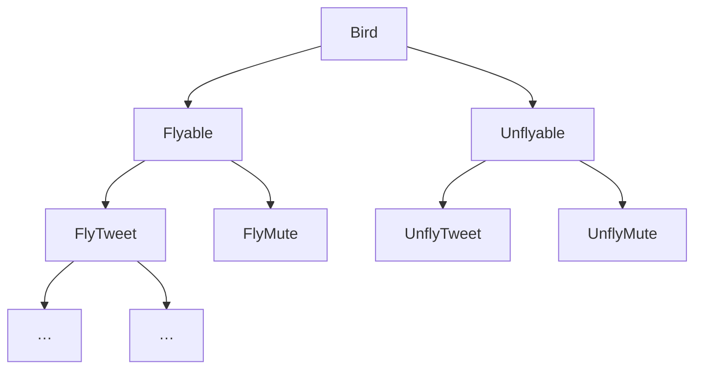
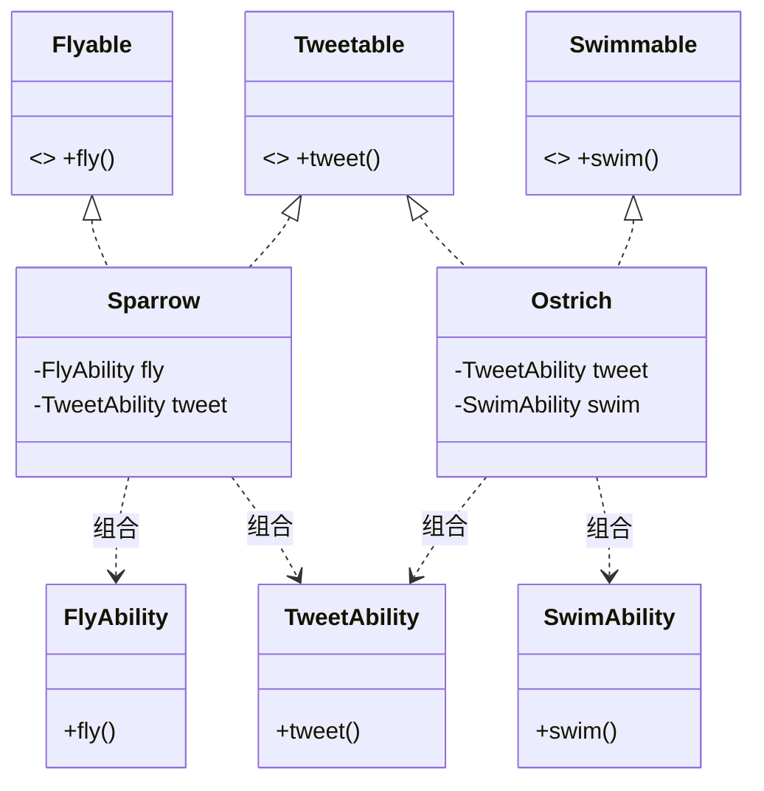
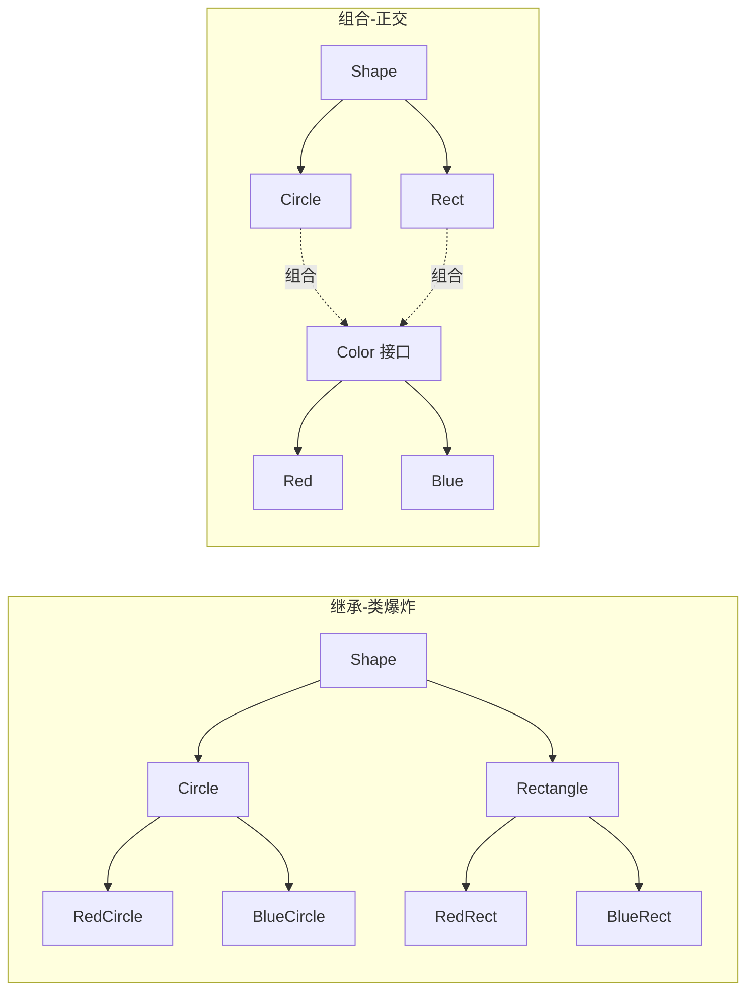
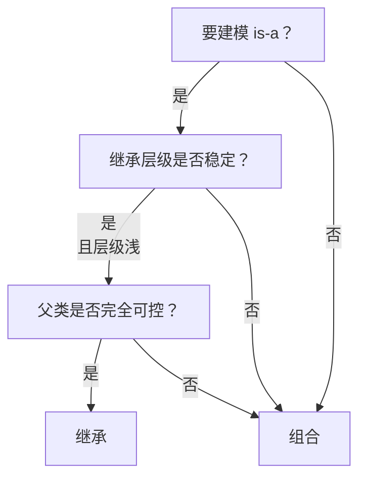
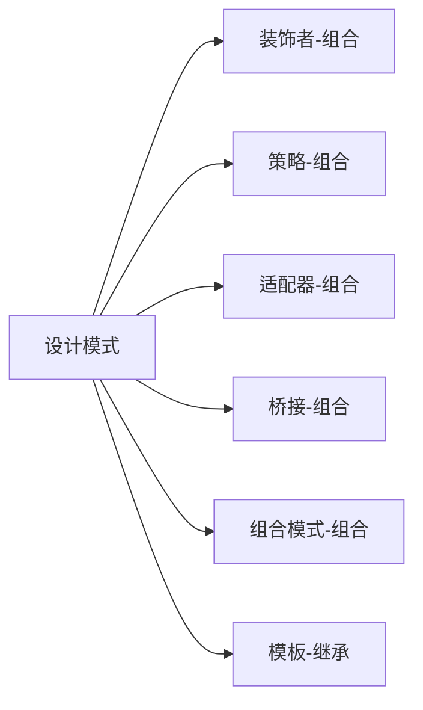
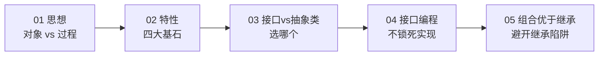
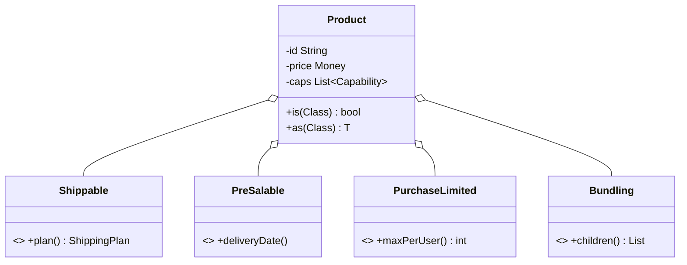

# 第一卷第5章：多用组合和少继承

#### 目录介绍
- [1.先回答上篇思考题](#1先回答上篇思考题)
  - [1.1 上篇遗留三道题](#11-上篇遗留三道题)
  - [1.2 企鹅会飞的决策事故](#12-企鹅会飞的决策事故)
  - [1.3 五层继承被迫重构](#13-五层继承被迫重构)
  - [1.4 灵魂五连问](#14-灵魂五连问)
- [2.从一个翻车说起](#2从一个翻车说起)
  - [2.1 鸟类继承谜题](#21-鸟类继承谜题)
  - [2.2 层级越拆越乱](#22-层级越拆越乱)
  - [2.3 问题的根因](#23-问题的根因)
- [3.继承的三宗罪](#3继承的三宗罪)
  - [3.1 强耦合](#31-强耦合)
  - [3.2 层级膨胀](#32-层级膨胀)
  - [3.3 静态绑定](#33-静态绑定)
- [4.组合解题](#4组合解题)
  - [4.1 用接口拆能力](#41-用接口拆能力)
  - [4.2 用组合复用代码](#42-用组合复用代码)
  - [4.3 鸟类组合方案](#43-鸟类组合方案)
- [5.绘图程序对比](#5绘图程序对比)
  - [5.1 继承的爆炸](#51-继承的爆炸)
  - [5.2 组合的优雅](#52-组合的优雅)
  - [5.3 类图对比](#53-类图对比)
- [6.如何选择](#6如何选择)
  - [6.1 三大判据](#61-三大判据)
  - [6.2 继承适用场景](#62-继承适用场景)
  - [6.3 组合适用场景](#63-组合适用场景)
- [7.设计模式映射](#7设计模式映射)
  - [7.1 装饰者模式](#71-装饰者模式)
  - [7.2 策略模式](#72-策略模式)
  - [7.3 模板方法](#73-模板方法)
- [8.总结与延伸](#8总结与延伸)
- [9.综合实战案例](#9综合实战案例)
  - [9.1 商品体系需求](#91-商品体系需求)
  - [9.2 继承版类爆炸](#92-继承版类爆炸)
  - [9.3 能力组合重构](#93-能力组合重构)
  - [9.4 类图与动态能力](#94-类图与动态能力)
  - [9.5 留下三道思考题](#95-留下三道思考题)
- [10.认知跃迁总结](#10认知跃迁总结)

---

## 1.先回答上篇思考题

### 1.1 上篇遗留三道题

上一篇 [04.接口而非实现编程](04.接口而非实现编程.md) 末尾留下了三道题：

- 🟢 `Map<Carrier, CarrierTracker>` vs `List<CarrierTracker>`本质区别？
- 🟡 `SfTracker` 应该 `extends SfApiClient` 还是 含有 `SfApiClient` 字段？
- 🔴 三家快递 80% 共同逻辑如何复用？

本篇要回答的是后两道题：

| 题 | 本篇答案 |
|---|---|
| 🟢 | `Map` = **根据快递公司路由**、`List` = **多实现同时生效**。这是「路由 vs 广播」两种多态语义 |
| 🟡 本篇答 | **含有字段**（组合）。理由看§02 「继承的三宗罪」 |
| 🔴 本篇答 | **提炼能力、用组合**——三家都拼装 `[认证, 限流, 重试, HttpCaller]`，而不是控制一个 `RestApiBase` 抽象类 |

这三道题几乎在问同一个问题：**当你看到两个类“很像”时，是该走继承还是该走组合？**

### 1.2 企鹅会飞的决策事故

2018 年某动物园业务系统中发生了一起「企鹅起飞」的荐题。

```java
public abstract class AbstractBird {
    public void fly() { /* 默认会飞 */ }
    public void layEgg() { ... }
    public void chirp() { ... }
}

public class Penguin extends AbstractBird { /* 使用默认 fly */ }
```

代码主人以为「企鹅不会飞」是常识，谁都不会调。直到一名实习生写了：

```java
zoo.allBirds().forEach(Bird::fly);   // 果然，企鹅也“飞”起来了
```

后果是企鹅馆的展示屏出现了“企鹅正在飞行”的字样。**这不是笑话，是在 GitHub 能搜到的真实事故调例**。

这里骨子里不是「`Penguin` 应该重写 `fly()` 让它 throw 异常」——那只是「补丁」。

**骨子里的错误是「把 `fly()` 放进了所有鸟都能看到的地方」**——也就是继承体系的“公共套餐”设计。不适合的能力被「继承」这个机制强加到了子类身上。

### 1.3 五层继承被迫重构

走得更远一些。某游戏引擎项目 `GameUnit` 类树：

```
GameObject
 ├─ MovableObject
 │    ├─ LandUnit
 │    │    ├─ Footman      (步兵)
 │    │    └─ Knight       (骑士)
 │    ├─ SwimUnit
 │    │    └─ Mermaid
 │    └─ FlyUnit
 │         └─ Dragon       (龙，会飞还会走)
 └─ StaticObject
      └─ Tower
```

问题出现在 `Dragon`——「龙」既会走又会飞。在这个继承树里**它该归哪里？**



实际项目里发生过五次重构：

- 重构 1：为 `Dragon` 抽 `LandFlyUnit` → 出现「人鱼」需要 `LandSwimUnit`
- 重构 2：抽 `LandSwimFlyUnit` → ...
- 重构 3：表面可以运行，但加「会隐身」能力 → 重来
- 重构 4：重设计为 `interface CanWalk / CanFly / CanSwim` → 发现 4 个能力有 14 个重复逻辑点
- 重构 5：最终落定为「**能力接口 + 能力组合**」 → `class Dragon { walker; flyer; }`

> **两件事同时发生**：「业务状态而不变」、「调用方代码不改一行」。不是「继承不能用」，是「能力的组合不汇」。

### 1.4 灵魂五连问

```
Q1 ── 为什么继承、这么学院派的工具，在工程里却如此危险？
       └─→ §02 三宗罪
Q2 ── 组合不也是依赖吗？为什么耦合更低？
       └─→ §03.1 / §03.2 能力维度划分
Q3 ── 什么时候继承反而是最佳选择？
       └─→ §05.2 继承适用场景
Q4 ── 设计模式中哪些是“伪装成继承的组合”？
       └─→ §06 三个模式反面例
Q5 ── 「能力组合」与「领域驱动」有什么关系？
       └─→ §08 末尾伏笔，对接第 11 篇 DDD
```

---

## 2.从一个翻车说起

### 2.1 鸟类继承谜题

定义抽象类 `AbstractBird`，所有鸟都继承它，并提供 `fly()` 方法：

```java
public abstract class AbstractBird {
    public void fly() { /* 默认会飞 */ }
}
public class Sparrow extends AbstractBird { /* 麻雀，会飞 */ }
public class Ostrich extends AbstractBird {  // 鸵鸟，不会飞
    @Override public void fly() {
        throw new UnsupportedOperationException("鸵鸟不会飞");
    }
}
```

第一处尴尬出现：**鸵鸟仍然继承了 `fly()` 方法，只能靠抛异常"撇清"**。这违反里氏替换原则——客户端拿到一个 `AbstractBird` 调用 `fly()`，结果 RuntimeException。

### 2.2 层级越拆越乱

为了精确建模，再加一层：

```
AbstractBird
   ├── AbstractFlyableBird（会飞）
   │      ├── Sparrow
   │      └── Crow
   └── AbstractUnflyableBird（不会飞）
          ├── Ostrich
          └── Penguin
```

需求继续叠加："是否会叫？是否会游泳？"——
继续按维度切，类的数量呈**笛卡尔积爆炸**：

```
能力组合 = 飞? × 叫? × 游? = 2 × 2 × 2 = 8 个抽象类
再加哺乳/卵生 = 16 个
再加……
```

### 2.3 问题的根因

```mermaid
flowchart LR
    A[继承用来表达<br/>"具有某种能力"] --> B[每加一种能力维度]
    B --> C[就要再切一层继承]
    C --> D[层级爆炸]
    D --> E[可读性差<br/>耦合度高]
```

**根本错误**：用 is-a 关系（继承）去建模 has-a 关系（能力）。鸵鸟"是一种鸟"成立，但"是否会飞"是**能力维度**，不该用类型层级表达。

---

## 3.继承的三宗罪

### 3.1 强耦合

子类与父类是**编译期绑定**：

```java
// 父类改一行：
public abstract class AbstractBird {
    public void fly() {
        System.out.println("拍翅膀");   // 后来改为日志埋点
        flap();
    }
}
// 所有子类的 fly() 行为都被影响，但子类作者可能毫不知情
```

子类**透视到了父类的内部实现**——这正好破坏了封装。

### 3.2 层级膨胀



每多一个**正交维度**，层级就要乘上一倍。这不是"复用"，是**自虐**。

### 3.3 静态绑定

继承结构在编译期就钉死，**运行时不可改**：

```java
// 想让一只鸵鸟暂时"会飞"（魔法状态）→ 不可能
ostrich.fly();   // 永远抛异常，除非改类层级重新编译
```

---

## 4.组合解题

### 4.1 用接口拆能力

把"能力"用**接口**表达：

```java
public interface Flyable   { void fly();   }
public interface Tweetable { void tweet(); }
public interface Swimmable { void swim();  }
```

每只鸟按需实现：

```java
public class Sparrow implements Flyable, Tweetable { /* … */ }
public class Ostrich implements Tweetable, Swimmable { /* 不实现 Flyable */ }
public class Penguin implements Swimmable { /* … */ }
```

**接口让能力维度正交**——加一种能力只需加一个接口，不动任何已有类。

### 4.2 用组合复用代码

接口只声明，没复用代码。把行为实现抽成"能力对象"，再**组合 + 委托**：

```java
public class FlyAbility {
    public void fly() { /* 拍翅膀飞行的通用逻辑 */ }
}
public class TweetAbility {
    public void tweet() { /* 鸣叫逻辑 */ }
}

public class Sparrow implements Flyable, Tweetable {
    private final FlyAbility   fly   = new FlyAbility();    // 组合
    private final TweetAbility tweet = new TweetAbility();  // 组合

    @Override public void fly()   { fly.fly();     }       // 委托
    @Override public void tweet() { tweet.tweet(); }
}
```

### 4.3 鸟类组合方案



继承的三个职能——**类型表达、多态、代码复用**——被分别交给：

| 职能 | 替代方案 |
|------|----------|
| 类型表达（is-a） | 接口（has-a / can-do） |
| 多态 | 接口多态 |
| 代码复用 | 组合 + 委托 |

---

## 5.绘图程序对比

### 5.1 继承的爆炸

绘图系统：形状 × 颜色 → 类爆炸：

```java
class RedCircle extends Circle { /* … */ }
class BlueCircle extends Circle { /* … */ }
class RedRectangle extends Rectangle { /* … */ }
class BlueRectangle extends Rectangle { /* … */ }
// 加一种颜色 → 形状数 × 1 个新类
// 加一种形状 → 颜色数 × 1 个新类
```

### 5.2 组合的优雅

把"颜色"作为正交维度，组合进形状：

```java
interface Color { void apply(); }
class Red  implements Color { public void apply() { /* 红 */ } }
class Blue implements Color { public void apply() { /* 蓝 */ } }

abstract class Shape {
    protected final Color color;     // 组合
    Shape(Color color) { this.color = color; }
    abstract void draw();
}
class Circle extends Shape {
    Circle(Color c) { super(c); }
    void draw() { color.apply(); /* 画圆 */ }
}
class Rectangle extends Shape {
    Rectangle(Color c) { super(c); }
    void draw() { color.apply(); /* 画矩形 */ }
}

// 使用
Shape s = new Circle(new Red());
```

类的数量从 `N×M` 降为 `N+M`。这正是**桥接模式**的精髓。

### 5.3 类图对比



---

## 6.如何选择

### 6.1 三大判据



继承的安全姿势：**层级 ≤ 2 层，关系稳定，父类自己写**。三者缺一就改组合。

### 6.2 继承适用场景

| 场景 | 例子 |
|------|------|
| 框架钩子 | Android `Activity`、Spring `JdbcDaoSupport` |
| 模板方法 | `AbstractList`、`InputStream` |
| 改写第三方类 | 重写 FeignClient.encode() |

### 6.3 组合适用场景

| 场景 | 例子 |
|------|------|
| 能力维度正交 | 鸟、形状+颜色 |
| 行为可运行时切换 | 策略模式 |
| 可叠加多个能力 | 装饰者模式 |
| 跨业务领域复用 | URL 工具类被 Crawler 和 Analyzer 持有 |

---

## 7.设计模式映射

组合优于继承，并不是抽象口号，**23 种设计模式中绝大多数都基于组合**：

### 7.1 装饰者模式

动态叠加能力：

```java
new TimingDecorator(
    new LoggingDecorator(
        new RateLimitDecorator(realService)));
```

每层都"组合"前一层，行为可在运行时拼装。**靠继承做不到**。

### 7.2 策略模式

```java
public class Order {
    private DiscountPolicy discount;   // 组合策略
    public void setDiscount(DiscountPolicy p) { this.discount = p; }   // 运行时切换
}
```

策略对象作为字段被持有，**热替换**毫无压力。

### 7.3 模板方法

模板方法是**继承的合法用法**——父类定义骨架，子类填空：

```java
abstract class HttpClient {
    public final Response send(Request req) {
        beforeSend(req);
        Response r = doSend(req);   // 子类填
        afterSend(r);
        return r;
    }
    protected abstract Response doSend(Request req);
}
```

这种"骨架 + 钩子"的固定流程，正是继承的擅长场景。



---

## 8.总结与延伸

| 维度 | 继承 | 组合 |
|------|------|------|
| 关系 | is-a（编译期） | has-a（运行期） |
| 耦合度 | 强（父类暴露给子类） | 弱（仅依赖接口） |
| 灵活性 | 静态、不可换 | 动态、可热插拔 |
| 复用粒度 | 整块复用 | 细粒度组合 |
| 复杂度 | 易爆炸 | 类多但关系扁平 |

> "多用组合少用继承" 不是"杜绝继承"，而是把继承用在**对的场景**——浅层、稳定、可控。其他时候，组合永远是更安全的默认选项。

到此为止，前 5 篇构成了一条主线：



**有了对象、特性、契约、依赖与组合**，就具备了写出"高内聚低耦合"代码的全部砖头。但砖头怎么砌成稳健的房子？这需要更高层的指导原则——SOLID 五大原则与 23 种设计模式。

下一篇 [06.设计原则全景图](./06.设计原则的全景图) 将以此前案例为线索，串联 SOLID 与设计模式，把面向对象设计推向工程落地。

---

## 9.综合实战案例

> 主线接力——04 篇货运推送用接口解了「调用方锁死」，本篇要解「能力拼装」：商品类型体系。

### 9.1 商品体系需求

电商上架需求：

```
1. 普通实物商品：需要发货
2. 虚拟商品（课程/会员卡）：不发货，不运费
3. 亲邮商品：走包裹个量限制
4. 预售商品：需推迟发货
5. 组合商品：含多个子商品
6. 后续会不断增加「会员专享」「限购」「需预约」等能力...
```

### 9.2 继承版类爆炸

工程师以为「这不是类的经典选择题吗」，当场画了一棵类继承树：

```
Product
 ├─ PhysicalProduct
 │    ├─ NormalPhysical
 │    ├─ PreSalePhysical
 │    ├─ OverseasPhysical
 │    └─ BundlePhysical
 └─ VirtualProduct
      ├─ Course
      └─ Membership
```

第一次迫重构出现在 PM 说「**虚拟会员卡也能预售**」：

```
PreSaleVirtualProduct?
OverseasVirtualProduct?  // 如果也要呢?
BundleVirtualProduct?    // 组合 × 虚拟...
```

在添加第 4 个能力「**限购**」后，**以简单乘法计算：4 个能力×2 个大类 = 16 个叶子类型**。「加一项能力」的代价是「叶子类型翻倍」。

这是「能力中多选」场景用继承的必然下场：**正交能力的乘积爆炸**。

### 9.3 能力组合重构

重构的核心是**三个判断**：

1. 这些变化点是"is-a"还是"can"？——都是 "can"（可发货/可限购/可预售）
2. 有多少维度？——有3+个独立变化维度
3. 是否运行期可变？——同一 SKU 在不同阶段可能被动态加上「限购」

三个都是 "是"，「能力组合」是唯一答案。

```java
// 能力接口（只表达「能干什么」）
public interface Shippable      { ShippingPlan plan(); }
public interface PreSalable     { LocalDateTime deliveryDate(); }
public interface PurchaseLimited{ int maxPerUser(); }
public interface Bundling       { List<Product> children(); }

// 商品仅是“能力代理人”
public class Product {
    private final String id;
    private final Money  price;
    private final List<ProductCapability> caps;   // 组合

    public boolean is(Class<? extends ProductCapability> c) {
        return caps.stream().anyMatch(c::isInstance);
    }
    public <T extends ProductCapability> T as(Class<T> c) {
        return caps.stream().filter(c::isInstance).map(c::cast).findFirst().orElseThrow();
    }
}

// 调用例
if (product.is(Shippable.class)) {
    ShippingPlan p = product.as(Shippable.class).plan();
    ...
}
```

**深刻变化**：

| 场景 | 继承版 | 组合版 |
|---|---|---|
| 加一个能力 | 叶子类×2 | 加1个接口 |
| 动态上架「限购」 | 需重新创建实例 | `caps.add(new PurchaseLimited(...))` |
| 测试 | 继承树越深 mock 越难 | 能力独立 mock |
| 业务表达力 | `OverseasPreSaleBundlePhysical` | `[跨境, 预售, 组合, 可发货]` |

### 9.4 类图与动态能力



注意关系使用了菱形空心​​`o--`​​ （组合/聚合）而非三角​​`<|--`​​（继承）。这不是 UML 语义的细节，是**设计哲学的本质差别**。

### 9.5 留下三道思考题

> 答案在第 06 篇开头揭晓。

- **🟢 易**：上面的商品设计里，`Product.caps` 我写了类型为 `List<ProductCapability>`。为什么不写成 `Set` 或 `Map<Class, Capability>`？答案其实是“可以都写，但三者的语义不同”——你能说出区别吗？
- **🟡 中**：「限购」能力可以被**运行期动态加上**。但这样一来，`Product` 变得可变。怎么扣住「不变量」又保证「运行期可加能力」？写下你的技术方案。
- **🔴 难**：现在设计中「`Product.is(Shippable.class)`」这种调用依然是「类型检查」。**你认为这是设计问题吗？如果是，能不能不需要类型检查也能表达『可发货』这件事？**提示：这道题是「设计原则」与「多态」的交叉，是下一篇《设计原则全景图》的入口问题。

---

## 10.认知跃迁总结

回到开篇企鹅会飞、龙归属哪里、商品体系类爆炸三件事。它们表面不同，**本质都是「谁都不能预言『未来会出现哪些能力组合』**」。继承需要设计者提前看准层级表，而组合允许心安理得说「以后再说」。

一句话：

> **继承是面向过去的联姻，组合是面向未来的联姻。代码的生命周期里“未来不可预言”是常态，于是在多数场合里“多用组合」胜在了“少用继承”。**

到这里，你已经拥有了面向对象的全部「砖块」：对象、特性、契约、依赖、组合。但砖块怎么砥成稳健的房子？这需要一份带骨架的“施工手册”——下一篇 [06.设计原则全景图](./06.设计原则的全景图) 会从「吃 8000 行上帝类」的事故进入 SOLID 与设计模式的全景。
