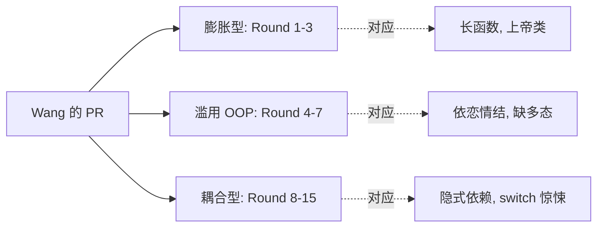
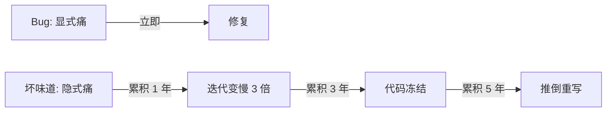
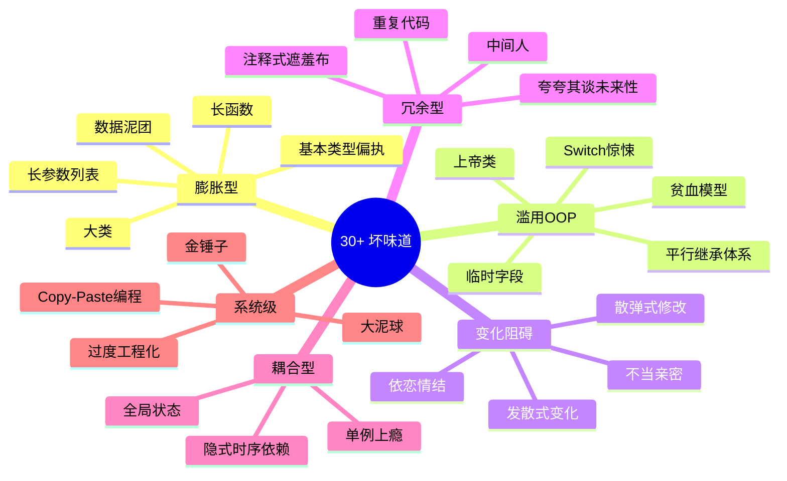
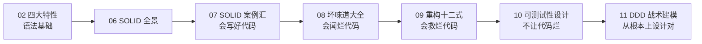

# 第一卷第8章：反模式与坏味道大全

#### 目录介绍
- [1.一次CR地狱](#1一次cr地狱)
  - [1.1 永远过不了的PR](#11-永远过不了的pr)
  - [1.2 三次驳回的轨迹](#12-三次驳回的轨迹)
  - [1.3 灵魂五连问](#13-灵魂五连问)
- [2.坏味道是什么](#2坏味道是什么)
  - [2.1 嗅觉的来源](#21-嗅觉的来源)
  - [2.2 与Bug的差异](#22-与bug的差异)
  - [2.3 识别即重构起点](#23-识别即重构起点)
- [3.膨胀型坏味道](#3膨胀型坏味道)
  - [3.1 长函数](#31-长函数)
  - [3.2 大类](#32-大类)
  - [3.3 长参数列表](#33-长参数列表)
  - [3.4 数据泥团](#34-数据泥团)
  - [3.5 基本类型偏执](#35-基本类型偏执)
- [4.滥用OOP坏味道](#4滥用oop坏味道)
  - [4.1 上帝类](#41-上帝类)
  - [4.2 贫血模型](#42-贫血模型)
  - [4.3 临时字段](#43-临时字段)
  - [4.4 Switch惊悚](#44-switch惊悚)
  - [4.5 平行继承体系](#45-平行继承体系)
- [5.变化阻碍味道](#5变化阻碍味道)
  - [5.1 散弹式修改](#51-散弹式修改)
  - [5.2 发散式变化](#52-发散式变化)
  - [5.3 依恋情结](#53-依恋情结)
  - [5.4 不当亲密](#54-不当亲密)
- [6.冗余型坏味道](#6冗余型坏味道)
  - [6.1 重复代码](#61-重复代码)
  - [6.2 中间人](#62-中间人)
  - [6.3 夸夸其谈未来性](#63-夸夸其谈未来性)
  - [6.4 注释式遮羞布](#64-注释式遮羞布)
- [7.耦合型坏味道](#7耦合型坏味道)
  - [7.1 全局状态](#71-全局状态)
  - [7.2 隐式时序依赖](#72-隐式时序依赖)
  - [7.3 单例上瘾](#73-单例上瘾)
- [8.系统级反模式](#8系统级反模式)
  - [8.1 大泥球](#81-大泥球)
  - [8.2 金锤子](#82-金锤子)
  - [8.3 过度工程化](#83-过度工程化)
  - [7.4 Copy-Paste编程](#74-copy-paste编程)
- [08.坏味道地图](#08坏味道地图)
  - [8.1 30+ 味道全景图](#81-30-味道全景图)
  - [8.2 与重构手法对照表](#82-与重构手法对照表)
  - [8.3 优先级评估](#83-优先级评估)
- [09.综合案例实战](#09综合案例实战)
  - [9.1 一段真实坏代码](#91-一段真实坏代码)
  - [9.2 嗅觉清单扫描](#92-嗅觉清单扫描)
  - [9.3 病历卡填写](#93-病历卡填写)
  - [9.4 留下三道思考题](#94-留下三道思考题)
- [10.总结与下一篇](#10总结与下一篇)

---

> 本篇是「面向对象设计」系列第 08 篇。  
> 上一篇 [07.SOLID原则案例汇](https://yccoding.com/pages/f7d8c6/) 教你"如何写得对"。  
> 但工程师面对的现实多半是"已经写错了"——本篇就是一份**完整的代码病历卡**，让你**先认病，再开方**。

---

## 1.一次CR地狱

### 1.1 永远过不了的PR

2024 年 6 月，新人 Wang 提交了一个 PR：「**优化订单结算流程**」。+832 行 / -612 行。Reviewer 是工作 8 年的老 Z。

```
Round 1   Reviewer: "这个函数 220 行,先拆"               → Wang 拆函数
Round 2   Reviewer: "你拆出来的 _doStep1 还是 87 行"     → Wang 再拆
Round 3   Reviewer: "OrderHelper 类已经 1100 行了"        → Wang 再拆
Round 4   Reviewer: "拆出去的 PriceUtil 引用了 5 处别的 Service" → Wang 搬移
Round 5   Reviewer: "为什么这里 new 了 RedisClient?"       → Wang 注入
Round 6   Reviewer: "这段魔法字符串是干嘛的?"               → Wang 抽常量
Round 7   Reviewer: "Order 字段全 public,谁动了你都不知道"   → Wang 加 getter
Round 8   Reviewer: "枚举 OrderType 缺一个 default 分支"    → Wang 改写
Round 9-15 ...
Round 17  Reviewer: "OK,LGTM"
```

**18 次驳回，PR 评论区 247 条**。最终代码只剩 30% 是 Wang 原写的。Wang 私信问老 Z：

> 「老哥，你每次说**这里有问题**，但我**完全闻不到**——为什么你能闻到，我闻不到？」

老 Z 回了一段话——这段话也正是本篇要讲的：

> 「**坏味道有名字**。每一种异常都对应一个工程界已经命名过的范式。你现在闻不到，是因为**词汇表是空的**。等你脑子里装了 30+ 个名字，每段代码扫一眼就知道**它得了什么病**——这是工程师从『能跑就行』走到『资深』的分水岭。」

### 1.2 三次驳回的轨迹

把 Wang 那 18 次驳回归类，本质只对应**3 种坏味道家族**：



每一个家族都对应**3-5 个具体名字**，凑起来恰好 30+ 个。本篇就是把这 30+ 个名字一次性铺全。

### 1.3 灵魂五连问

```
Q1 ── 为什么"能跑的代码"也是烂代码?
       └─→ §01.2 与 Bug 的差异
Q2 ── 坏味道与 Bug 究竟差在哪?
       └─→ §01.2 行为正确 vs 演化能力
Q3 ── 为何我们能闻到味道但说不出名字?
       └─→ §01.1 直觉的来源
Q4 ── 同一段代码可能有几种味道?
       └─→ §09 综合案例 8-12 种共病
Q5 ── 治理坏味道的优先级如何排?
       └─→ §08.3 三维打分模型
```

---

## 2.坏味道是什么

### 2.1 嗅觉的来源

「坏味道（Code Smell）」一词由 **Kent Beck** 1999 年口头提出，被 **Martin Fowler** 写进《重构》一书。原话有意思：

> 「我之所以选『味道』这个词，是因为它**比任何精确指标都更准**。一段代码到底有没有『200 行算长』的客观标准？没有。但当你**鼻子皱起来**的瞬间，几乎一定有问题。」

为什么「鼻子」比「指标」更准？因为坏味道是**多维度叠加**的产物：

- 200 行的纯 SQL 拼接函数——可能不是味道。
- 50 行的方法但混合了 5 种业务规则——肯定是味道。

**单一指标会冤枉好人，也会放过坏人**。直觉融合了「行数 + 嵌套 + 命名 + 抽象层 + 调用链」多种特征，所以更敏锐。

但直觉**不可教**——除非给它**词汇**。这就是本篇的方法：**把直觉拆成 30+ 个具名概念**，让你能命名、能讨论、能在 Code Review 里精确指出。

### 2.2 与Bug的差异

| 维度 | Bug | 坏味道 |
|---|---|---|
| 表现 | 行为不对 | 行为可能完全正确 |
| 检测 | 测试用例 | 阅读 + 直觉 |
| 后果 | 立刻产生用户问题 | **拖慢未来的演化** |
| 紧迫性 | P0/P1 | 长期累积 |
| 修复时机 | 立刻 | 在变更触及时顺手修 |

> **Bug 是「现在的痛」，坏味道是「未来的痛」**。后者更隐蔽，因为它**今天不痛**——但它在按复利累积。



### 2.3 识别即重构起点

「**先识别，再重构**」是 Fowler 反复强调的纪律。盲目重构本身就是一种反模式：

- **没识别就重构** = 把烂代码搅得更烂
- **识别后重构** = 每一刀都有的放矢

本篇先把 30+ 种味道讲清——下一篇 [09.重构十二式](https://yccoding.com/pages/82ced2/) 才教你**对应每种味道用什么手法治**。

---

## 3.膨胀型坏味道

膨胀型 = **代码体量超过认知负载**。人脑工作记忆 7±2 项，膨胀型味道的本质就是**塞超过这个数**。

### 3.1 长函数

**定义**：一个函数超过一屏（约 30-50 行）就值得警惕，超过 100 行几乎一定是坏味道。

**典型反例**：
```java
public OrderResult placeOrder(...) {  // 234 行
    // 1. 参数校验（30 行）
    // 2. 库存检查（45 行）
    // 3. 优惠券计算（55 行）
    // 4. 支付调用（40 行）
    // 5. 落库（30 行）
    // 6. 发消息（20 行）
    // 7. 兜底处理（14 行）
}
```

**嗅觉信号**：
- 滚动条出现
- 中间出现「分隔注释」（`// === 校验 ===`）
- IDE 的「方法结构」面板里看不全

**阈值参考**：

| 行数 | 状态 |
|---|---|
| ≤ 20 | 健康 |
| 20-50 | 待观察 |
| 50-100 | 应当拆分 |
| > 100 | 必须重构 |

> 对应重构手法：**提炼函数（Extract Function）**——见 09 篇 §1。

### 3.2 大类

**定义**：超过 500 行 / 超过 30 个字段 / 超过 50 个方法的类，是「上帝类」候选。

**嗅觉信号**：
- 类名里出现 `Manager / Helper / Util / Service` 之一**且功能描述模糊**
- 文件大小 > 30 KB
- Git 历史显示该文件**被 10+ 个不同作者频繁修改**（多 actor 信号 → §1.3 SRP 违反）

> 对应重构手法：**提炼类（Extract Class）+ 搬移函数（Move Function）**——09 篇 §9 / §3。

### 3.3 长参数列表

**定义**：函数有超过 4 个参数 / 超过 3 个同类型参数。

```java
// 反例 1: 7 个参数
void send(String to, String cc, String bcc, String subject, String body, String attach, boolean async) { ... }

// 反例 2: 同类型连续参数（容易传错位置）
void rect(int x1, int y1, int x2, int y2) { ... }   // 任何调用方都可能写成 (y1, x1)
```

**为什么是坏味道**：
- 调用方记不住顺序
- 加一个参数破坏所有调用方
- 暗示**参数们其实是一个对象**（数据泥团 §2.4）

> 对应重构手法：**引入参数对象（Introduce Parameter Object）**——09 篇 §5。

### 3.4 数据泥团

**定义**：**同一组字段总是一起出现**——它们应该是一个对象。

```java
// 散落各处
void searchFlight(String dep, String dest, LocalDate dateStart, LocalDate dateEnd, int adults, int children) { ... }
void searchHotel (String dep, String dest, LocalDate dateStart, LocalDate dateEnd, int adults, int children) { ... }
void searchTrain (String dep, String dest, LocalDate dateStart, LocalDate dateEnd, int adults, int children) { ... }
```

这 6 个字段就是 `TripQuery` 对象。**没有把它们组合成对象，是建模缺失**。

```java
// 重构后
record TripQuery(String dep, String dest, DateRange dates, Travelers travelers) {}
void searchFlight(TripQuery q) { ... }
void searchHotel (TripQuery q) { ... }
```

> 对应重构：**引入参数对象 + 提炼类**。

### 3.5 基本类型偏执

**定义**：用基本类型（String / int）表达**任何概念**。

```java
// 反例
String userId = "123";
String email  = "abc@x.com";
String phone  = "13800138000";
String token  = "xyz";

void sendSms(String userId, String phone, String content) { ... }
sendSms(phone, userId, content);   // ← 编译器查不出参数顺序错了
```

**修复**：

```java
record UserId(String value) {}
record Phone(String e164)   { public Phone { if (!e164.startsWith("+")) throw new IllegalArgumentException(); } }
record SmsContent(String text) {}

void sendSms(UserId uid, Phone phone, SmsContent content) { ... }   // 顺序错=编译失败
```

**好处**：
- 顺序错位变编译错误
- 校验逻辑集中（构造时一次到位）
- 阅读代码时直接看到语义

> 对应重构：**Tiny Type / Value Object 模式**。

---

## 4.滥用OOP坏味道

OOP 提供的工具被用错——坏味道分类二。

### 4.1 上帝类

**定义**：一个类承担系统**绝大部分核心职责**，删掉它系统就瘫。

**特征**：
- 类名叫 `XxxManager / XxxFacade`，但事实上扮演了 5+ 个角色
- 1500+ 行
- 50+ 个 `public` 方法
- 几乎所有其他类都依赖它

> 上帝类是 §2.2 大类的**极端形式**，也是 SRP 最严重的违反。修复手法见 09 篇 §9 提炼类。

### 4.2 贫血模型

**定义**：实体只有字段（getter/setter），所有行为都在 Service 里。

```java
// 贫血实体
class Order {
    Long id;
    BigDecimal amount;
    String status;
    // 50 个 getter/setter
}
// 行为全在外面
class OrderService {
    public void confirm(Order order) {
        order.setStatus("CONFIRMED");
        order.setConfirmTime(...);
        repo.save(order);
    }
}
```

**为什么是味道**：违反封装（§02 篇）。`Order` 不变量「只有 PAID 状态能 confirm」**没人守**——任何代码都能强行 `setStatus("CONFIRMED")`。

**修复**：把行为搬回到实体——**充血模型**（DDD 战术建模）：

```java
class Order {
    public Order confirm() {
        if (this.status != PAID) throw new IllegalStateException();
        return new Order(...status=CONFIRMED, confirmTime=now());
    }
}
```

> 对应原则：02 篇封装 + 11 篇 DDD 聚合根。

### 4.3 临时字段

**定义**：某个字段只在**部分方法**里使用，平时是 null。

```java
class Calculator {
    BigDecimal x, y;
    BigDecimal tempInput;       // ← 只在 chainAdd 用
    List<BigDecimal> history;   // ← 只在 audit 模式用
    boolean inAuditMode;        // ← 只在 audit 模式用
}
```

**信号**：这个类里**藏着另一个类**。把临时字段相关的方法和字段提炼出去。

> 修复手法：**提炼类**——09 篇 §9。

### 4.4 Switch惊悚

**定义**：根据某个类型字段做大量分支判断。**散落多处**就更糟。

```java
// 文件 A
switch (order.type()) {
    case NORMAL: ...; break;
    case VIP:    ...; break;
    case CROSS_BORDER: ...; break;
}
// 文件 B
switch (order.type()) {   // 同样的分支逻辑又来一次
    case NORMAL: ...;
    ...
}
```

**为什么是坏味道**：违反 OCP——加一种 type 要改所有 switch 点。这是**多态缺失**的最强信号。

**修复**：以多态取代条件——09 篇 §6。

```java
abstract class Order {
    abstract void confirm();
    abstract void ship();
}
class NormalOrder       extends Order { ... }
class VipOrder          extends Order { ... }
class CrossBorderOrder  extends Order { ... }
```

### 4.5 平行继承体系

**定义**：每加一个子类都要在另一棵继承树上加一个对应类。

```
Animal              ←── 树 A
├── Dog
├── Cat
└── Bird

AnimalSpec          ←── 树 B（必须平行存在）
├── DogSpec
├── CatSpec
└── BirdSpec
```

**信号**：加一种动物要**同时**改两棵树。这两棵树**应当合并或一者消除**——通常 Spec 树可以变成 `Animal` 内部的字段或策略。

> 对应原则：05 篇组合优于继承。

---

## 5.变化阻碍味道

不是「现在丑」，而是「**变化时不爽**」。

### 5.1 散弹式修改

**定义**：一个改动需要**散落地修改 N 处**。

```
新需求: 「订单超过 1 万要审批」

需要改: OrderController, OrderValidator, OrderService, OrderRepository, 
        OrderEventHandler, OrderExportTask, AdminOrderUI ... 共 11 处
```

**根因**：相关逻辑**没有内聚到一处**。

> 修复手法：**搬移函数 + 提炼类**——把"超过 1 万要审批"集中到 `OrderApprovalRule` 类。

### 5.2 发散式变化

**定义**：一个类要**因 N 种不同原因**修改。

```
OrderService 修改原因:
  - 财务规则改 → 改这个类
  - 物流接入新供应商 → 改这个类
  - 营销加新活动 → 改这个类
  - 风控加新规则 → 改这个类
```

**关系**：`散弹式修改` 与 `发散式变化` 是**对偶**——

| 散弹式 | 发散式 |
|---|---|
| 一个原因 → 多处改 | 多个原因 → 一处改 |
| 内聚不足 | 内聚错位（包含太多 actor） |
| 修复：合并 | 修复：拆分 |

两者都违反 SRP，是 SRP 在「变化频率」维度的两面。

### 5.3 依恋情结

**定义**：一个方法对**别的类的字段**比对自己类的还熟。

```java
class ReportGenerator {
    void generate(Order o) {
        BigDecimal total = o.items().stream()
                            .map(i -> i.price().multiply(BigDecimal.valueOf(i.quantity())))
                            .reduce(BigDecimal.ZERO, BigDecimal::add);
        // ↑ 此方法 95% 的代码在操作 Order 的字段
    }
}
```

**信号**：方法应该搬到它「迷恋」的那个类里去。

```java
class Order {
    BigDecimal total() { ... }  // 搬过来
}
class ReportGenerator {
    void generate(Order o) {
        BigDecimal total = o.total();   // 一行
    }
}
```

> 修复手法：**搬移函数（Move Method）**——09 篇 §3。

### 5.4 不当亲密

**定义**：两个类**相互访问对方私有字段/包私有方法**——边界模糊。

```java
class A {
    void doSomething() {
        b.privateState = 1;     // ← 直接动 B 的内部
        b.internalRecompute();
    }
}
class B {
    String log() {
        return a.history.toString();   // ← 又反向动 A
    }
}
```

**信号**：A、B 形成"双胞胎"，**应该合并或重新切分边界**。

---

## 6.冗余型坏味道

「**这段代码不该存在**」。

### 6.1 重复代码

三个层次：

| 层次 | 例子 | 修复 |
|---|---|---|
| **完全重复** | 复制粘贴的 50 行 | 提炼函数 |
| **结构重复** | 5 个 Controller 都写 try-catch + 日志 + 转换 | 抽公共拦截器/AOP |
| **概念重复** | 「订单总价」在 3 处分别用不同算法计算 | 统一到一个 `Order.total()` |

**最危险的是概念重复**——3 处算法可能某次只改了 1 处，导致**业务规则不一致** Bug。

### 6.2 中间人

**定义**：一个类**只是单纯转发**，不做任何加工。

```java
class OrderFacade {
    public Order get(Long id)        { return orderService.get(id); }
    public void  cancel(Long id)     { orderService.cancel(id); }
    public void  confirm(Long id)    { orderService.confirm(id); }
    // 30 个方法都是单纯转发
}
```

**修复**：去除中间人——直接让调用方依赖 `orderService`。或者，**只保留有加工逻辑的方法**：

```java
class OrderFacade {
    public Order getWithItems(Long id) {  // 真有加工
        Order o = orderService.get(id);
        o.attachItems(itemService.findByOrder(id));
        return o;
    }
    // 其他单纯转发的全删除
}
```

> 09 篇 §11 「去除中间人」专门讲此手法。

### 6.3 夸夸其谈未来性

**定义**：为「未来可能用到」而预留的接口、抽象、扩展点。

```java
public interface UsernameValidatorStrategy { boolean valid(String s); }   // 只有一个实现
public abstract class AbstractValidatorBase { ... }                        // 没有第二个子类
public interface UserNameNormalizer { ... }                                // 永远不会有第二种实现
```

> **YAGNI**：You Aren't Gonna Need It。**§07-2.4** 已经说过——预留扩展点 = 浪费，除非有「过去/现在/未来」三个变化信号之一。

### 6.4 注释式遮羞布

**定义**：注释多到**用来遮盖坏代码**。

```java
// === 计算订单总价 ===
// 注意:这里如果 user 是 VIP 要打 8 折
// 如果是首单要再减 10
// 如果用了优惠券要叠加
// 如果是双 11 要 ×0.5
// 但跨境单不参与双 11
// 如果 amount > 1000 还要免运费
// 但是如果 weight > 50kg 不免
BigDecimal x = ...;
```

**信号**：注释在解释「**业务规则**」——这些规则应该**用代码表达**：

```java
class OrderPricingRules {
    BigDecimal apply(Order order) {
        return rules.stream()
            .reduce(order.amount(), (acc, rule) -> rule.apply(order, acc), ...);
    }
}
```

> 注释要解释**为什么（why）**，不是解释**做什么（what）**。`what` 应该用代码表达。

---

## 7.耦合型坏味道

代码之间形成「隐秘连结」。

### 7.1 全局状态

**定义**：静态字段、单例、模块级变量——**任何代码都能改**。

```java
public class GlobalConfig {
    public static int MAX_RETRY = 3;   // 任何代码改: GlobalConfig.MAX_RETRY = 5;
}
```

**问题**：
- 测试隔离失败（一个测试改了，下一个测试受影响）
- 多线程并发问题
- 阅读时无法预测某段代码会受谁影响

> 修复：**配置注入 + 不可变**——`final` + 构造时注入。

### 7.2 隐式时序依赖

**定义**：方法 A 必须在 B 之前调用，但代码上**无任何强制**。

```java
class FileProcessor {
    public void open(String path)  { ... }
    public void process()          { ... }   // ← 必须先 open
    public void close()            { ... }   // ← 必须 process 之后
}

// 调用方写错没人发现
fp.process();   // 此时 NullPointerException
```

**修复**：用**类型系统**或**Builder 模式**强制顺序：

```java
OpenedFile  file   = FileProcessor.open(path);     // 返回新类型
ProcessedFile pf   = file.process();                // 必须 OpenedFile 才能 process
ClosedFile  closed = pf.close();
```

每一步**返回不同类型**，编译器代你检查时序。

### 7.3 单例上瘾

**定义**：万物皆单例——`OrderManager.getInstance()`、`UserManager.getInstance()` ... 

**问题**：
- 单例 = 全局状态（§6.1 的所有问题都来）
- Mock 困难（无法注入 mock 实例）
- 隐藏依赖（构造方法看不出依赖什么）

**修复**：**全部改成构造函数注入**。Spring 容器在生产环境管理生命周期，测试时手动 `new`——**两全其美**。

```java
class OrderService {
    public OrderService(OrderRepo repo, PaymentGateway pg) { ... }   // 显式依赖
}
```

> 与 07 篇 DIP 强相关。「单例上瘾」是 DIP 反模式之一。

---

## 8.系统级反模式

不是单段代码的味道，而是**整个项目级别**的腐败。

### 9.1 大泥球

**定义**：Brian Foot & Joseph Yoder 1997 年论文 *Big Ball of Mud* 创造的术语：

> 「**没有可见结构、所有部分都和所有部分相连**的系统，但奇迹般地能跑。」

**特征**：
- 没有清晰的分层（Controller/Service/Repo 互相 import）
- 没有清晰的模块边界（user 包 import 了 order 包 import 了 payment 包 import 了 user 包）
- 包循环依赖
- 一处改动可能影响任何地方

**根因**：**多年累积的 §6 耦合 + §4 变化阻碍 + §3 滥用**叠加。

**修复**：**Strangler Fig（绞杀榕）模式**——新功能写在新模块，老功能逐步绕道，最终老模块整体下线。**不要试图一次性大重写**。

### 9.2 金锤子

**定义**：「**当你只有锤子，所有东西都看起来像钉子**。」

工程界例子：
- 学了 DDD，所有项目都建模成限界上下文（连 5 人小工具也搞 4 层）
- 学了响应式，所有地方都用 `Flux`，把同步逻辑也包成异步
- 学了微服务，把 1 万行代码拆成 30 个服务，运维比业务复杂

**信号**：**工具的复杂度 > 业务的复杂度**——杀鸡用牛刀。

> 治疗：在采用任何"高级"工具前，先问「**这个工具消除的具体问题在我的项目里发生过吗?**」如果没有，**先不要用**。

### 9.3 过度工程化

**定义**：5 行能解决的事用了 5 个抽象层。

```java
// 真实见过的:为「读取一个本地配置文件」设计了
interface ConfigSource          { ... }
abstract class AbstractConfig   { ... }
class FileConfig extends AbstractConfig implements ConfigSource { ... }
class FileConfigFactory         { ... }
class FileConfigBuilder         { ... }
class FileConfigValidator       { ... }
class FileConfigCache           { ... }
class FileConfigCacheInvalidator{ ... }
// 调用方:
config = FileConfigFactory.getInstance().builder()
            .withValidator(new FileConfigValidator())
            .withCache(...).build();
```

原本一行：`var config = Files.readString(Path.of("conf.yml"));`

> §07-2.4 OCP 过度设计陷阱的扩大版。**简单优先**——直到证据要求复杂。

### 9.4 Copy-Paste编程

**定义**：从 StackOverflow / 同事的代码复制 → **不理解** → 加魔法常量绕过报错 → 提交。

**典型痕迹**：
```java
// 这里加 0.01 不知道为什么,加上就好了
amount = amount.add(new BigDecimal("0.01"));

// 网上说要这样配,我也不懂
config.set("magic-flag", "true");
```

**根因**：理解成本被推迟到「未来某天某 Bug 触发时」——通常那天会成为**重大事故**。

> 治疗：每行代码都要能回答「**为什么这样写**」。不能回答的，删掉重读文档。

---

## 08.坏味道地图

### 10.1 30+ 味道全景图



### 10.2 与重构手法对照表

| 坏味道 | 主要重构手法（09 篇章节） |
|---|---|
| 长函数 | 提炼函数（§1）|
| 大类 | 提炼类（§9）+ 搬移函数（§3） |
| 长参数列表 | 引入参数对象（§5）+ 分解参数（§8）|
| 数据泥团 | 引入参数对象（§5）+ 提炼类（§9）|
| 基本类型偏执 | 引入 Tiny Type（§5 的扩展）|
| 上帝类 | 提炼类（§9）+ 搬移函数（§3）|
| 贫血模型 | 搬移行为（§3 的逆用）|
| 临时字段 | 提炼类（§9）|
| Switch 惊悚 | 多态替条件（§6）|
| 平行继承 | 组合替继承（§12）|
| 散弹式修改 | 搬移函数（§3）|
| 发散式变化 | 提炼类（§9）|
| 依恋情结 | 搬移函数（§3）|
| 不当亲密 | 搬移函数 + 提炼类 |
| 重复代码 | 提炼函数（§1）+ 多态（§6）|
| 中间人 | 去除中间人（§11）|
| 夸夸其谈未来性 | 内联类（§10）+ 内联函数（§2）|
| 注释式遮羞布 | 提炼函数 + 重命名 |
| 全局状态 | 依赖注入（07 篇 §5.2 IoC）|
| 隐式时序依赖 | 状态对象重构 |
| 单例上瘾 | 构造函数注入 |
| 大泥球 | Strangler Fig（增量替换）|
| 金锤子 | 删除多余工具 |
| 过度工程化 | 内联类 + 内联函数 |
| Copy-Paste | 重读 + 重写 |

> **每一种味道都有对应的解药**。这就是 09 篇要交付的「12 把手术刀」。

### 10.3 优先级评估

不是所有味道都要立刻治。用三维打分：

```
病灶严重度 = 影响范围 × 出现频率 × 修复成本系数
                                    ↑ 越低越优先
```

| 影响范围 | 1 分 | 5 分 |
|---|---|---|
| 局部 | 单方法内 | / |
| 中等 | 单类内 | / |
| 全局 | 跨多个模块 | × |

| 出现频率 | 1 分 | 5 分 |
|---|---|---|
| 低 | git 上一年没动 | / |
| 高 | 最近 3 个月改过 5+ 次 | × |

| 修复成本系数 | 1 = 简单 | 5 = 困难 |
|---|---|---|
| 提炼函数 | 1 | / |
| 提炼类 | 2 | / |
| 拆分模块 | 4 | / |
| 改架构 | 5 | / |

**优先治理**：分数 ≥ 50 的（高影响 × 高频率 / 中等成本）。低分的可以「**手到擒来时顺手修**」。

---

## 09.综合案例实战

> **本节是 06-07 篇的练兵场**——给一段 200 行真实生产代码，教你**用本篇的词汇表系统扫描**，写出一张完整的"病历卡"。下一篇 09 重构十二式直接接这张病历卡开方。

### 11.1 一段真实坏代码

某公司生产代码（脱敏后）：

```java
public class OrderHelper {                       // 1: 类名是 *Helper
    public static OrderHelper INSTANCE = new OrderHelper();  // 2: 单例
    public Map<String, Object> cache = new HashMap<>();      // 3: public 全局可变
    public RedisTemplate redis;                              // 4: public 字段
    public DataSource ds;
    public KafkaProducer<String, String> kafka;
    public RestTemplate http;

    public Map<String, Object> processOrder(Long oid, String type, BigDecimal amt,
                                            String userId, String channel,
                                            Map<String, String> extras) throws Exception {
        // 5: 长参数列表 + 基本类型偏执
        Map<String, Object> result = new HashMap<>();        // 6: 用 Map 当返回值
        Order order = null;

        // ===== 阶段 1:加载 =====                              // 7: 注释分隔
        if (cache.containsKey("order:" + oid)) {
            order = (Order) cache.get("order:" + oid);
        } else {
            try (Connection conn = ds.getConnection()) {     // 8: 直连数据库
                PreparedStatement ps = conn.prepareStatement("SELECT * FROM orders WHERE id = ?");
                ps.setLong(1, oid);
                ResultSet rs = ps.executeQuery();
                if (rs.next()) {
                    order = new Order();
                    order.id = rs.getLong("id");             // 9: public 字段直接赋值
                    order.amount = rs.getBigDecimal("amount");
                    order.status = rs.getString("status");
                    cache.put("order:" + oid, order);
                }
            }
        }

        // ===== 阶段 2:风控 =====
        if ("MALL".equals(type)) {
            // ... 50 行风控判断,switch (channel)
            switch (channel) {                                // 10: switch 惊悚
                case "alipay":   /* 12 行 */ break;
                case "wechat":   /* 14 行 */ break;
                case "bankcard": /* 11 行 */ break;
            }
        } else if ("TICKET".equals(type)) {
            // ... 又一坨 switch                            // 11: 散弹+发散同时
        } else if ("RESALE".equals(type)) {
            // ...
        }

        // ===== 阶段 3:HTTP 调外部 =====
        try {
            String body = http.postForObject(                // 12: 直接 new HTTP
                "https://api.tongdun.com/v1/check",
                buildRiskBody(order, extras),
                String.class);
            // 这里加 0.001 是为了避免某种浮点问题,不要删除  // 13: Copy-Paste 注释
            BigDecimal score = new BigDecimal(body).add(new BigDecimal("0.001"));
            if (score.compareTo(new BigDecimal("80")) > 0) {
                kafka.send(new ProducerRecord<>("risk-alert",  // 14: 直接 new Kafka
                    "BLOCKED:" + oid));
                result.put("status", "BLOCKED");
                return result;
            }
        } catch (Exception e) { /* 吞掉 */ }                // 15: 吞异常

        // ===== 阶段 4:落库 + 发邮件 + 写日志 =====
        // ... 80 行 ...                                    // 16: 一个方法 5 个职责
        return result;
    }

    private Map<String, String> buildRiskBody(Order o, Map<String, String> extras) {
        // 30 行字符串拼接                                    // 17: 字符串拼接 JSON
    }
}
```

### 11.2 嗅觉清单扫描

按本篇 30+ 词汇表逐一对号入座：

| # | 行号位置 | 坏味道 | 严重度（1-5）|
|---|---|---|---|
| 1 | 类名 `OrderHelper` | **类名模糊**（夸夸其谈未来性） | 2 |
| 2 | `INSTANCE` 静态字段 | **单例上瘾** | 4 |
| 3 | `public cache` Map | **全局状态** + 公共可变集合 | 5 |
| 4 | `public redis/ds/kafka/http` | **不当亲密**（外部能改） | 4 |
| 5 | `processOrder` 6 个参数 | **长参数列表 + 基本类型偏执** | 4 |
| 6 | 返回 `Map<String, Object>` | **基本类型偏执** | 3 |
| 7 | `// === 阶段 1 ===` 等 | **长函数**信号 | 5 |
| 8 | 直接 `getConnection` | **DIP 缺失**（07 篇） | 5 |
| 9 | `order.id =` 直接赋值 | **贫血模型 + 封装缺失** | 4 |
| 10 | `switch (channel)` | **Switch 惊悚** | 5 |
| 11 | 三处 `else if` | **散弹+发散同时** | 5 |
| 12 | `http.postForObject` 硬编码 | **DIP 缺失** | 4 |
| 13 | `加 0.001 是为了` | **Copy-Paste 编程** | 5 |
| 14 | `kafka.send` 直连 | **DIP + 中间人缺失** | 4 |
| 15 | `} catch (Exception e) {}` | **吞异常**（隐藏 Bug） | 5 |
| 16 | 80 行落库+邮件+日志 | **长函数 + 上帝类 + 散弹** | 5 |
| 17 | 字符串拼接 JSON | **过度自制**（应该用库） | 3 |

**总分**：30+ 个味道里，这一段命中 **17 处**。**这就是「能跑的烂代码」的真实形态**。

### 11.3 病历卡填写

```
═══════════════════ 病  历  卡 ═══════════════════
患者: OrderHelper.processOrder
就诊日期: 2026-05-15
主诉:    "改一行测试要 20 分钟,加一个渠道要 3 天"
═══════════════════════════════════════════════════
【主病】 上帝类 + 长函数 + 单例上瘾
        合计违反 SOLID 5 条 / 5 条

【伴随病】
  - 全局状态 (public cache)
  - 基本类型偏执 (Map<String,Object>)
  - Switch 惊悚 (×3)
  - DIP 缺失 (直连 DB/HTTP/Kafka/Redis)
  - 贫血模型 + 封装缺失
  - Copy-Paste 编程 (加 0.001 注释)
  - 吞异常

【急症】
  ⚠️ 吞异常 → 线上 Bug 无法定位（应立即修）
  ⚠️ 全局可变 cache → 多线程数据错乱（应立即修）

【手术方案】（指向 09 篇手法）
  Step 1  特征化测试 (09 §0 + §16.2)         → 锁住当前行为
  Step 2  提炼函数 (09 §1)                   → 4 段拆出
  Step 3  以多态替条件 (09 §6)               → switch 消除
  Step 4  提炼类 (09 §9)                     → 5 个职责拆服务
  Step 5  依赖注入 (07 §5.2)                 → 解决 DIP 缺失
  Step 6  组合替继承 (09 §12)                → 业务线扩展可插拔

【预后】
  完成 6 步后,以下能力恢复:
  ✓ 加新渠道 = 加 1 个文件
  ✓ 加新业务线 = 加 1 个 Strategy
  ✓ 单元测试可用 (mock 注入)
  ✓ 线上事故可定位 (异常不再被吞)
═══════════════════════════════════════════════════
```

> **病历卡这种方式本身就是新工程师的能力放大器**。下一次 Code Review 时，**写一张病历卡**比写 100 句"建议优化"更有冲击力。

### 11.4 留下三道思考题

> 答案在第 09 篇开头揭晓。

- **🟢 易**：`9.2` 表里我把"`类名 OrderHelper` 模糊"列为坏味道但只给了 2 分。**取一个好名字真的不重要吗?** 你认为命名应该几分? 它在哪一类味道下？
- **🟡 中**：「过度设计」（§7.3）和「不足设计」（§5.3 反向）之间，工程师如何把握？请用一个**判据公式**回答（不能用「依经验判断」这种不可操作的话）。
- **🔴 难**：09 案例里的代码已经在生产跑了 5 年。**它有 Bug 吗?** 严格地说，「能跑」不等于「正确」——但**坏味道既然不影响行为，怎么判断它今天是不是已经在产生隐性 Bug?** 这道题就是 09 篇 §0 「**特征化测试**」要回答的核心矛盾。

---

## 10.总结与下一篇

**一句话总结**：

> **识别坏味道的能力，是工程师从初级到资深的核心分水岭。** 30+ 词汇装进脑子后，你看代码的速度会变快 10 倍——因为你不再"读"代码，而是在"扫描特征"。

与全系列的关系——



**07 教你写对、08 教你闻坏、09 教你救烂、10 教你预防、11 教你设计**——五步走完，你走完了从「能写代码」到「能驾驭代码生命周期」的完整进化。

下一篇 [09.重构十二式的实战](https://yccoding.com/pages/82ced2/)——**病历卡已填好，开方治病**。本篇 §9.4 的三道思考题答案，也将在下一篇 §0 揭晓。
