# 第一卷第9章：重构十二式的实战

#### 目录介绍

- 1.先回答上篇思考题
  - 1.1 上篇遗留三道题
  - 1.2 重构师的硬币观
  - 1.3 五次反转的真相
  - 1.4 灵魂五连问
- 2.从一段烂代码说起
- 3.什么是重构
- 4.坏味道地图
- 5.第一式：提炼函数
- 6.第二式：内联函数
- 7.第三式：搬移函数
- 8.第四式：以查询取代临时变量
- 9.第五式：引入参数对象
- 10.第六式：以多态取代条件
- 11.第七式：以策略取代分支
- 12.第八式：分解长参数列表
- 13.第九式：提炼类
- 14.第十式：内联类
- 15.第十一式：去除中间人
- 16.第十二式：以组合取代继承
- 17.重构的节奏感
- 18.总结与延伸
- 19.综合实战案例
  - 19.1 退款风暴需求
  - 19.2 烂代码原貌
  - 19.3 十二式连续应用
  - 19.4 类图与节奏复盘
  - 19.5 留下三道思考题
- 20.认知跃迁总结

---

## 1.先回答上篇思考题

### 1.1 上篇遗留三道题

上一篇 [08.反模式与坏味道大全](https://yccoding.com/pages/69d9e3/) 末尾留下了三道题：

- 🟢 「上帝类」「数据泥团」「依恋情结」三个坏味道里，谁是其他两个的「症状」？
- 🟡 「过度设计」与「不足设计」之间，工程师该靠什么把握平衡？
- 🔴 当一个项目所有人都说「不能动」、连测试都不敢写时，重构应该从哪一步开始？

| 题 | 本篇答案 |
|---|---|
| 🟢 | 三者本质是「**职责未划分**」的不同投影。一旦 SRP 被守住，三者同时消失——这正是重构 12 式中 §12「提炼类」+ §3「搬移函数」组合拳要解决的 |
| 🟡 本篇答 | **靠节奏**——每一次重构只走一小步，并在每一步都让测试通过。过度/不足是「停的位置」错了，不是「方向」错了。详见 §16 节奏感 |
| 🔴 本篇答 | **从「特征化测试」开始**——在原代码外围套一层「黑盒回放测试」，让它锁住当下行为。然后再动刀。详见 §18.3 退款风暴的第一刀 |

### 1.2 重构师的硬币观

重构有一句广为流传的话：

> **「重构是为了让代码更好理解，而不是为了让代码更短。」**——Martin Fowler

但这句话很容易被误读。让我们看两段真实代码：

```java
// A 版：8 行
public BigDecimal calc(Order o) {
    BigDecimal r = BigDecimal.ZERO;
    for (Item it : o.items()) {
        BigDecimal s = it.price().multiply(BigDecimal.valueOf(it.qty()));
        if (it.discount() != null) s = s.subtract(it.discount());
        r = r.add(s);
    }
    return r;
}

// B 版：14 行
public Money totalPrice(Order order) {
    return order.items().stream()
        .map(this::lineSubtotal)
        .reduce(Money.ZERO, Money::add);
}
private Money lineSubtotal(Item item) {
    Money raw = item.unitPrice().times(item.quantity());
    return item.discount()
        .map(raw::minus)
        .orElse(raw);
}
```

A 版**短**，但有 8 个名词（r、it、s、price、qty、discount、subtract、add）需要读者**翻译**才能理解。  
B 版**长**，但每个名字都是业务语言（`totalPrice`、`lineSubtotal`、`unitPrice`）。

> **重构师的硬币观**：硬币的一面是「写得短」，另一面是「读得懂」。**写代码的人有 1 次机会，读代码的人有 100 次机会**——重构是把成本从读者那一面，搬一点点到作者这一面。

这个观念会贯穿本篇 12 式。每一式都是「为读者优化」。

### 1.3 五次反转的真相

本篇要拆解的「订单结算函数」——它不是一夜变烂的。复盘其 git log：

```
2020-08  init: calculatePrice 22 行
2020-11  +满减活动 → 41 行
2021-03  +会员折扣 → 67 行 (出现第一个 if-else 嵌套)
2021-09  +优惠券 + 退款重算 → 134 行
2022-04  +限时秒杀 + 跨境税 → 219 行 (出现第一个 if (channel == "alipay"))
2022-10  +直播带货抽佣 → 312 行
2023-06  +首单返券 + 拼团结算 → 487 行
2024-01  → 600+ 行 (谁也不敢动)
```

**没有任何一次提交是「不专业」的**。每一次都只多了几个 if、几行计算。但累积到第 12 个版本，它已无法理解。

这就是「**渐进式腐烂**」——重构必须主动出击，否则代码总是输给时间。

### 1.4 灵魂五连问

```
Q1 ── 重构和重写到底差在哪？为什么不直接推倒？
       └─→ §02 重构的定义
Q2 ── 没有测试覆盖的代码能重构吗？
       └─→ §16.2 / §18.3 特征化测试
Q3 ── 12 式里哪一式最危险？哪一式最常被滥用？
       └─→ §13 内联类、§09 多态替条件
Q4 ── 「越短越好」是不是真理？
       └─→ §0.2 硬币观 / §17 节奏感
Q5 ── 工程师如何在「按时交付」与「持续重构」之间取舍？
       └─→ §16 节奏感 / §18 退款风暴
```

---

## 2.从一段烂代码说起

接续上一篇 `06.设计原则全景图`——SOLID 描述了"好代码长什么样"，但实际工作中，我们 80% 的时间面对的是**已经烂掉的代码**。怎么把它救回来？这就是重构。

先看一段真实项目里抠出来的订单结算函数（化名）：

```java
public double calc(Order o) {
    double total = 0;
    for (Item it : o.items) {
        if (it.type == 1) {                    // 普通商品
            total += it.price * it.qty;
        } else if (it.type == 2) {             // 生鲜
            total += it.price * it.qty * 0.95;
            if (o.user.level >= 3) total -= 5;
        } else if (it.type == 3) {             // 数码
            total += it.price * it.qty;
            if (it.price * it.qty > 1000) total -= 50;
        }
    }
    if (o.couponCode != null && o.couponCode.startsWith("VIP")) {
        total = total * 0.9;
    }
    if (total < 0) total = 0;
    System.out.println("订单 " + o.id + " 金额 " + total);
    return total;
}
```

它能跑、有单测、上线一年。但每加一种商品类型都要改它一次，每次改都要全部回归。这就是**坏味道**——代码没坏，但闻起来不对。

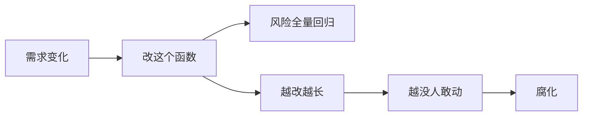

本篇要做的，就是用 12 个最常用的重构手法，把这段代码（以及它代表的一类问题）一步步救回来。

---

## 3.什么是重构

> **重构**：在不改变外部行为的前提下，调整代码内部结构，使其更易理解、更易修改。 ——Martin Fowler

四个关键词缺一不可：

| 关键词 | 含义 |
|--------|------|
| 不改外部行为 | 单测必须先在 → 重构后仍全绿 |
| 调整内部结构 | 改的是结构而非功能 |
| 易理解 | 降低读代码的认知负担 |
| 易修改 | 把"将来一定会变"的部分隔离出去 |

### 3.1 重构 ≠ 重写

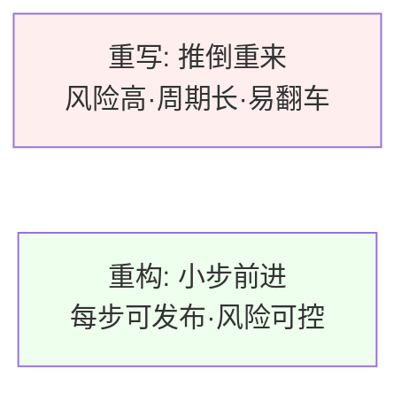

### 3.2 重构的两顶帽子

写代码时戴**两顶帽子**，但**永远只戴一顶**：

- **加功能帽**：只加新行为，不动旧结构；
- **重构帽**：只调结构，不加新行为。

频繁切换，但绝不混戴——这是 Fowler 的核心纪律。

---

## 4.坏味道地图

重构不是看心情改代码，而是**闻到坏味道才动手**。常见 12 种坏味道与对应的"解药"：

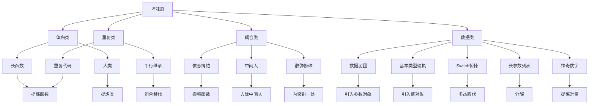

下面 12 式按"由浅入深"排序——前 5 式是函数级，中间 4 式是类型级，后 3 式是关系级。

---

## 5.第一式：提炼函数

### 5.1 嗅觉

一段代码超过 10 行、或需要写注释解释"这一段在干嘛"，就该被提炼出去。

### 5.2 手法

回到开篇代码，第一刀切在循环体：

```java
public double calc(Order o) {
    double total = 0;
    for (Item it : o.items) {
        total += itemAmount(it, o.user);   // ← 提炼
    }
    total = applyCoupon(total, o.couponCode); // ← 提炼
    return Math.max(total, 0);
}

private double itemAmount(Item it, User user) {
    if (it.type == 1) return it.price * it.qty;
    if (it.type == 2) {
        double a = it.price * it.qty * 0.95;
        return user.level >= 3 ? a - 5 : a;
    }
    if (it.type == 3) {
        double a = it.price * it.qty;
        return a > 1000 ? a - 50 : a;
    }
    return 0;
}
```

### 5.3 收益

- `calc` 从 18 行降到 7 行，主流程一眼可见；
- 每个分支可独立单测；
- 给后续"以多态取代条件"铺好路。

> **口诀**：函数应该只做一件事，而且把这件事做好。

---

## 6.第二式：内联函数

提炼的反向操作。当一个函数体本身就比函数名更清晰、或只被调用一次且没有复用价值时，把它**摊回去**。

```java
// 反例：过度提炼
private boolean isPositive(double x) { return x > 0; }
if (isPositive(total)) { ... }

// 内联回去
if (total > 0) { ... }
```

提炼和内联是**对偶**——重构没有"越拆越好"，**只有越合适越好**。

---

## 7.第三式：搬移函数

### 8.1 嗅觉：依恋情结

一个函数对**别人家的字段**比对自己家的还热衷，它就该搬家。

观察上面的 `itemAmount`——它读 `it.price`、`it.qty`、`it.type`，全是 `Item` 的字段，几乎没用 `Order` 的东西。它该搬到 `Item` 里。

### 8.2 手法

```java
class Item {
    double amount(User user) {
        return switch (type) {
            case 1 -> price * qty;
            case 2 -> {
                double a = price * qty * 0.95;
                yield user.level >= 3 ? a - 5 : a;
            }
            case 3 -> {
                double a = price * qty;
                yield a > 1000 ? a - 50 : a;
            }
            default -> 0;
        };
    }
}

// 调用方
total += it.amount(o.user);
```

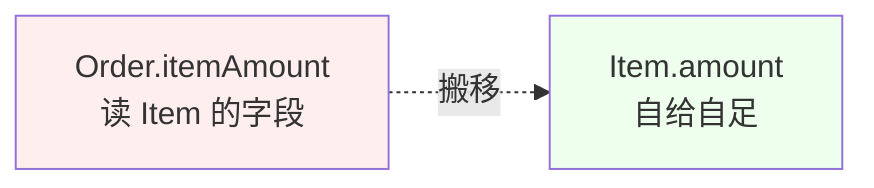

### 8.3 收益

数据和行为聚到一起——这正是 OOP 封装的初心。

---

## 8.第四式：以查询取代临时变量

### 8.1 嗅觉

临时变量散落在长函数里，命名随意（`tmp`/`a`/`x`），让人不敢删。

```java
double a = price * qty;
return a > 1000 ? a - 50 : a;
```

### 8.2 手法

把 `a` 抽成查询函数：

```java
private double gross() { return price * qty; }

double amount() {
    return gross() > 1000 ? gross() - 50 : gross();
}
```

> 担心多次调用性能？现代 JIT/编译器在纯函数上几乎零成本，**先求清晰，再求性能**。

---

## 9.第五式：引入参数对象

### 9.1 嗅觉：数据泥团

几个参数总是**结伴出现**，就是一个隐藏对象在喊"把我提出来"。

```java
// 反例
sendMail(String city, String street, String zip, String country, String to);

// 正例
sendMail(Address addr, String to);
```

### 9.2 应用到主案例

订单计算里 `(price, qty)` 总是一起出现，可以提炼成 `Money` 值对象：

```java
record Money(double price, int qty) {
    double gross() { return price * qty; }
}
```

值对象把"概念"显式化，是从坏味道"基本类型偏执"里逃出来的关键一步。

---

## 10.第六式：以多态取代条件

### 10.1 嗅觉：Switch 惊悚

`Item.amount()` 仍然有 `switch (type)`——每加一种商品都要回来改它。这是 OCP 的反例。

### 10.2 手法

```java
abstract class Item {
    double price; int qty;
    double gross() { return price * qty; }
    abstract double amount(User user);
}

class Normal extends Item {
    double amount(User u) { return gross(); }
}
class Fresh extends Item {
    double amount(User u) {
        double a = gross() * 0.95;
        return u.level >= 3 ? a - 5 : a;
    }
}
class Digital extends Item {
    double amount(User u) {
        return gross() > 1000 ? gross() - 50 : gross();
    }
}
```

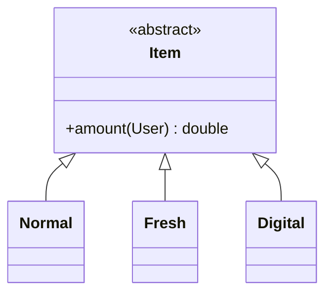

### 10.3 收益

新增"图书"类型？**新建一个类**就行，不再修改 `Item.amount`。这正是 04 篇"接口而非实现编程"在重构层面的回响。

---

## 11.第七式：以策略取代分支

多态适合**对象本身**有差异；但当差异在**算法**而非对象时，更合适用策略。

```java
interface DiscountStrategy {
    double apply(double total, Order o);
}

class CouponVip implements DiscountStrategy {
    public double apply(double total, Order o) {
        return o.couponCode != null && o.couponCode.startsWith("VIP")
            ? total * 0.9 : total;
    }
}

// 主流程
List<DiscountStrategy> strategies = List.of(new CouponVip(), new FullCut(), ...);
for (DiscountStrategy s : strategies) total = s.apply(total, o);
```

策略 vs 多态对比：

| 维度 | 多态 | 策略 |
|------|------|------|
| 差异点 | 对象类型 | 算法/规则 |
| 选择时机 | 编译期由类型决定 | 运行期可注入/替换 |
| 适用 | 商品类型 | 优惠规则 |

---

## 12.第八式：分解长参数列表

参数超过 4 个就该警觉。三种解法：

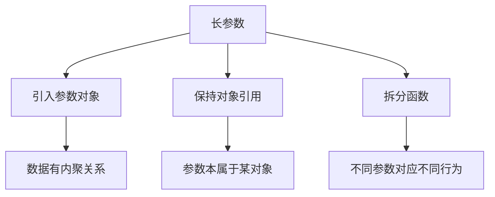

```java
// 反例
register(name, age, email, phone, address, gender, level, source);

// 正例
register(UserProfile profile, RegisterContext ctx);
```

---

## 13.第九式：提炼类

### 13.1 嗅觉：大类

一个类有 20+ 字段、500+ 行，往往**藏了好几个类**。

```java
// 反例
class User {
    String name; int age;
    String province; String city; String street; String zip;
    String bankName; String cardNo; String cvv;
}
```

### 13.2 手法

```java
class User {
    String name; int age;
    Address address;
    BankCard card;
}
class Address { String province, city, street, zip; }
class BankCard { String bankName, cardNo, cvv; }
```

> 判定标准：**字段是否能形成内聚的小团体**。能，就提一个类。

---

## 14.第十式：内联类

提炼类的反向。当一个类只剩一两个字段、又没有独立行为，就把它内联回去——**保持模型与认知复杂度匹配**。

---

## 15.第十一式：去除中间人

### 15.1 嗅觉：只是转发

```java
class Manager {
    Employee secretary;
    public String getSecretaryName() { return secretary.getName(); }
    public String getSecretaryPhone() { return secretary.getPhone(); }
    public String getSecretaryEmail() { return secretary.getEmail(); }
    // 全是转发……
}
```

### 16.2 手法

让客户直接拿 `secretary` 用：

```java
class Manager {
    public Employee secretary() { return secretary; }
}
// 调用方
manager.secretary().getName();
```

> 但若 `Manager` 真的需要**屏蔽内部结构**（如做权限/审计），中间人是合理的。**不是所有委托都该被打掉**。

---

## 16.第十二式：以组合取代继承

这一式直接呼应 `05.多用组合和少继承`——重构里最常做的就是把误用的继承拆回组合。

### 16.1 经典反例

```java
class ArrayList<E> extends Vector<E>  // ← Java 早期错误
```

`Stack extends Vector` 是 JDK 公认的设计黑历史——`Stack` 因此暴露了 `add(int, E)` 这种**违反栈语义**的方法。

### 16.2 手法

```java
// 反例：用继承复用
class LoggingList<E> extends ArrayList<E> {
    public boolean add(E e) {
        log.info("add " + e);
        return super.add(e);
    }
}

// 正例：用组合 + 委托
class LoggingList<E> implements List<E> {
    private final List<E> delegate = new ArrayList<>();
    public boolean add(E e) {
        log.info("add " + e);
        return delegate.add(e);
    }
    // 其他方法委托 delegate……
}
```

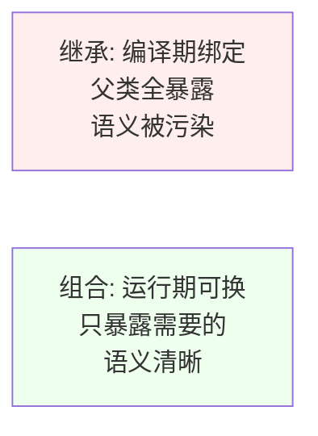

---

## 17.重构的节奏感

12 式不是按顺序做完一遍，而是按**节奏**循环：

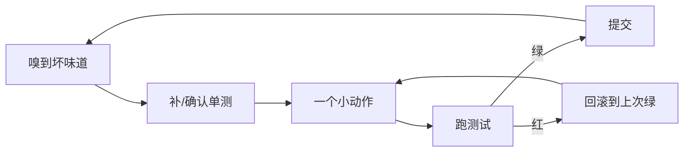

三个底线规矩：

1. **测试先行**：没单测的代码先补测，不补不重构；
2. **小步快跑**：每个动作 5–15 分钟内必须能跑通测试；
3. **频繁提交**：每绿一次就 commit，红了直接 reset，不靠脑子记。

### 17.1 什么时候不要重构？

- 已决定推倒重写；
- 距离 deadline 只剩几天；
- 这段代码近期不会再被改动（**最划算的重构永远是高频代码**）。

---

## 18.总结与延伸

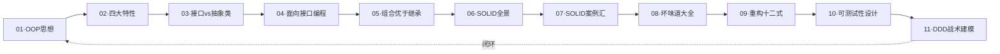

### 18.1 12 式速查

| 编号 | 名字 | 解决的坏味道 |
|------|------|--------------|
| 1 | 提炼函数 | 长函数 |
| 2 | 内联函数 | 过度抽象 |
| 3 | 搬移函数 | 依恋情结 |
| 4 | 查询替临时 | 临时变量乱飞 |
| 5 | 参数对象 | 数据泥团 |
| 6 | 多态替条件 | Switch 惊悚 |
| 7 | 策略替分支 | 算法分支膨胀 |
| 8 | 分解参数 | 长参数列表 |
| 9 | 提炼类 | 大类 |
| 10 | 内联类 | 没事干的小类 |
| 11 | 去除中间人 | 全是转发 |
| 12 | 组合替继承 | 继承被滥用 |

### 18.2 12 式与坏味道、SOLID 的对应关系

| 重构式 | 治哪个坏味道（08 篇） | 兑现哪条原则（06/07 篇） |
|---|---|---|
| 提炼函数 | 长函数 / 重复代码 | SRP |
| 搬移函数 | 依恋情结 | 高内聚低耦合 |
| 多态替条件 | switch 风暴 | OCP / LSP |
| 策略替分支 | 算法分支膨胀 | OCP |
| 提炼类 | 上帝类 / 数据泥团 | SRP |
| 去除中间人 | 透传链 | 直接依赖 |
| 组合替继承 | 错误继承 | 05 篇 / LSP |

这张表说明：**重构 12 式不是 12 个独立技巧，而是 SOLID 的「实施工具」**。当你说「这段代码闻起来不对」，背后其实是某条原则在被违反；而每一式重构，都对应到「修复某条原则」的具体路径。

### 18.3 重构的四个层次

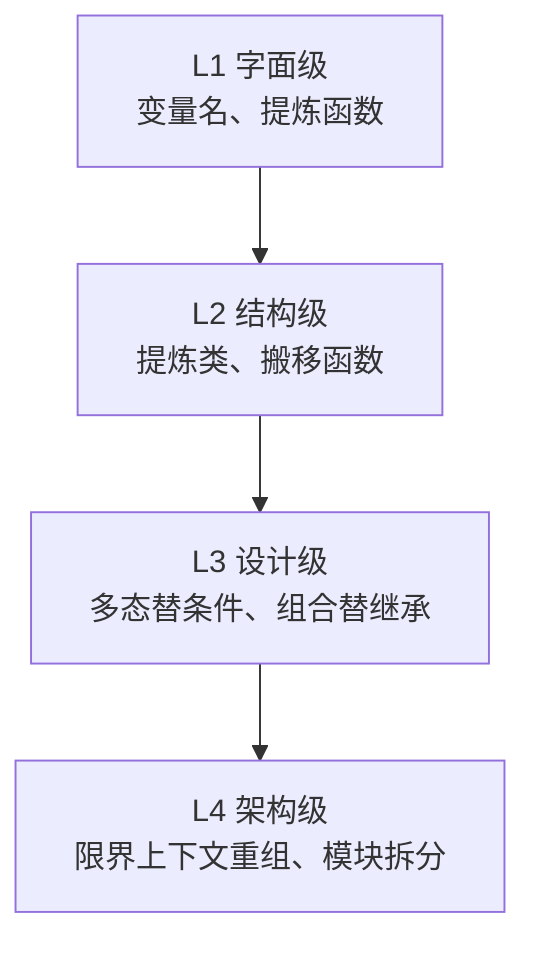

12 式覆盖 L1-L3。L4 是 11 篇 DDD 的范畴——重构会从「函数」走到「模块」，再走到「服务」。

下一篇 [10.可测试性设计](https://yccoding.com/pages/24ae4b/) 会回答 §0.4 的 Q2：**没有测试覆盖的代码能重构吗？** 答案是「能，但代价巨大」。要让重构变得轻盈，前提是代码本身**生来可测**。

---

## 19.综合实战案例

> 主线接力——06 篇我们用 SOLID 武装了 `OrderManager`，但当时的代码假设「从零开始写」。现实中你 80% 的时间面对的是「已经烂了的 `OrderManager`」。本节就把它救回来。

### 19.1 退款风暴需求

2024 年某电商「退款风暴」——大促后 7 天内退款率 23%，原 `RefundService.refund()` 函数 487 行，包含：

```
- 12 种退款渠道（原路返回、平台余额、银行卡、礼品卡...）
- 7 种退款规则（部分退、整单退、跨店退、跨境退...）
- 5 种退款时机（自动、人工、争议、风控、客服...）
- 3 种退款触发源（用户主动、商家、系统）
- 全部塞在一个 `refund(RefundReq req)` 大方法里
```

业务方需求：「再加个『先用后付退款』流程，下周必须上线」。  
架构师的回复：「这块代码谁动谁背锅，重写要 3 个月」。  
**怎么破？这就是重构 12 式真正的考场。**

### 19.2 烂代码原貌

```java
public class RefundService {
    public RefundResult refund(RefundReq req) {
        // ① 487 行：参数校验混着业务规则
        if (req.getOrderId() == null || req.getOrderId().isEmpty()) { ... }
        if (req.getAmount().compareTo(BigDecimal.ZERO) <= 0) { ... }
        Order order = orderMapper.selectById(req.getOrderId());
        if (order == null) { ... }
        if ("CROSS_BORDER".equals(order.getType())) {
            // 跨境单独 80 行
            ...
        } else if ("VIRTUAL".equals(order.getType())) {
            // 虚拟单独 60 行
            ...
        } else {
            // 实物 240 行
            switch (req.getChannel()) {
                case "ALIPAY":   ...
                case "WECHAT":   ...
                case "BANKCARD": ...
                ...
            }
        }
        // ② 财务核账
        if (order.getMerchant().isCrossBorder()) {
            // 又是 50 行
        }
        // ③ 通知
        if (req.isNotifyUser()) {
            smsClient.send(...);
            wechatClient.send(...);
            // ...
        }
        // ④ 写日志、发事件、记 BI...
    }
}
```

这就是教科书级的「上帝方法」——SRP 全违反、OCP 不存在、可测试性为零。

### 19.3 十二式连续应用

**第 0 式（前置）：特征化测试**——回答 §0.4 Q2。  
**没有测试，不能重构**。先用 5 类典型 case 录制现网回放（输入 + 输出快照），让它锁住当下行为：

```java
@ParameterizedTest
@MethodSource("recordedCases")  // 从生产回放 5000 条
void characterization(RefundCase c) {
    assertThat(refundService.refund(c.req())).isEqualTo(c.expectedResult());
}
```

这层网撑住后，再动刀。

**第 1 式：提炼函数**——把 487 行的大方法切成 30+ 小函数，每个函数 ≤ 20 行，名字就是它做的事：

```java
public RefundResult refund(RefundReq req) {
    Order order = loadAndValidate(req);          // ← 提炼
    RefundContext ctx = buildContext(req, order);// ← 提炼
    RefundResult result = doRefund(ctx);         // ← 提炼
    finReconcile(ctx, result);                   // ← 提炼
    notify(ctx, result);                         // ← 提炼
    publishEvents(ctx, result);                  // ← 提炼
    return result;
}
```

这一步**只搬代码、不改逻辑**。但读者已经能 30 秒看懂主流程。

**第 5 式：引入参数对象**——`buildContext` 返回 `RefundContext`，把原来的 12 个临时变量打包：

```java
record RefundContext(Order order, RefundReq req, User user, Merchant merchant, ...) {}
```

**第 6 式：以多态取代条件**——把 `if (order.type == VIRTUAL)` 链转成多态：

```java
abstract class RefundStrategy {
    abstract RefundResult refund(RefundContext ctx);
}
class VirtualRefundStrategy   extends RefundStrategy { ... }
class PhysicalRefundStrategy  extends RefundStrategy { ... }
class CrossBorderRefundStrategy extends RefundStrategy { ... }
```

**第 7 式：以策略取代分支**——`switch (req.getChannel())` 转为 Map 查表：

```java
Map<Channel, ChannelRefunder> refunders;   // Spring 自动注入所有实现
refunders.get(req.channel()).refund(ctx);
```

**第 9 式：提炼类**——`finReconcile` 单独成 `FinReconciler` 类，`notify` 拆成 `RefundNotifier`，`publishEvents` 拆成 `RefundEventPublisher`。三块彻底解耦。

**第 12 式：以组合取代继承**——`CrossBorderRefundStrategy` 原本想 `extends PhysicalRefundStrategy`，但发现 80% 不是「跨境是实物的子类」，而是「跨境额外多几个能力」。改为组合：

```java
class CrossBorderRefundStrategy implements RefundStrategy {
    private final RefundStrategy base;        // 实物退款的基础
    private final TaxReporter   tax;
    private final FxRateConverter fx;
}
```

**新需求接入「先用后付退款」**——只需 1 个新类 `BuyNowPayLaterRefundStrategy implements RefundStrategy` + 1 行 Bean 注册。**老代码一行不动**。

这就是「OCP 在重构后兑现」的瞬间。

### 19.4 类图与节奏复盘

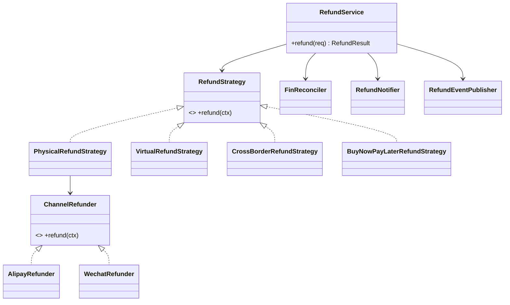

**节奏复盘**——这次重构的真正秘密不是「12 式很厉害」，而是「**每一式都不超过 30 分钟、每一式后都跑全量回放测试**」：

| 阶段 | 时长 | 风险 |
|---|---|---|
| 第 0 式：特征化测试 | 2 天 | 低（无侵入） |
| 第 1 式：提炼函数 ×30 | 1 天 | 低（IDE 自动） |
| 第 5/9 式：参数对象 + 提炼类 | 1.5 天 | 中（需重跑回放） |
| 第 6/7 式：多态 + 策略 | 2 天 | 中 |
| 第 12 式：组合替继承 | 0.5 天 | 低（已有抽象层） |
| 接「先用后付」需求 | 0.5 天 | 极低 |
| **合计** | **7.5 天** | 全程绿灯 |

相比「重写 3 个月」，这是 12 倍的速度差距。**重构不是慢工，重构是快工**——只要节奏对。

### 19.5 留下三道思考题

> 答案在第 10 篇「可测试性设计」开头揭晓。

- **🟢 易**：上面 §18.3 第 0 式的「特征化测试」用了「输入 → 输出快照」回放。如果 `refund` 内部调用了**真实第三方支付 API**，这种测试还能跑吗？为什么？
- **🟡 中**：`RefundContext` 是个 record（不可变）。但 `doRefund` 过程中需要「累积」一些中间结果（比如已退金额、产生的事件列表）。**不可变** vs **累积变化**——你怎么设计？
- **🔴 难**：本节我们走了「特征化测试 → 重构 → 持续测试」的路径。但**特征化测试只能锁住已知行为，无法发现「重构暴露的潜在 Bug」**。比如旧代码可能本来就漏算了某种边界——重构后行为和旧代码一致，但都是错的。怎么设计一种「重构后才能发现的 Bug」也能被测试发现的机制？提示：这道题就是第 10 篇「可测试性的逆向工程」要回答的。

---

## 20.认知跃迁总结

回到开篇 §0.3 的真相：**没有任何一次提交是「不专业」的，但累积下来代码就烂了**。

这背后藏着一个深刻的工程事实：

> **代码总是输给时间——除非你定期向时间反击。**

重构 12 式不是技巧清单，是「**程序员对抗熵增的工具集**」。学会它们意味着：

- 你不再害怕看到 600 行的函数，因为你知道用哪一式开第一刀；
- 你不再因为「下周必须上线」就堆 if-else，因为你知道一周里有 2 天可以反向投资；
- 你不再相信「重写比重构快」的神话，因为你做过 7 天救活 487 行的实战。

一句话送给你：

> **重构不是为了让代码完美，是为了让代码能继续被改。设计能力的本质，是让团队 3 年后依然敢动这段代码。**

但 12 式的所有价值，都建立在一个隐含前提上：「**测试网撑得住**」。如果网破了，重构就是裸奔。

下一篇 [10.可测试性设计](https://yccoding.com/pages/24ae4b/) 将回答：**怎么让代码生来就好测？** 我们会从「隐藏在依赖注入背后的可测性密码」开始，讲清为什么有些代码改 1 行要花 1 天写测试，而另一些代码改 100 行只要 3 分钟。
