# 综合实战图片框架

#### 目录介绍
- [1.一场图片引发的崩溃](#1一场图片引发的崩溃)
  - [1.1 大促夜的事故现场](#11-大促夜的事故现场)
  - [1.2 排查路径与最终归因](#12-排查路径与最终归因)
  - [1.3 八个灵魂拷问](#13-八个灵魂拷问)
  - [1.4 本篇路线图](#14-本篇路线图)
- [2.V0版本能跑就行](#2v0版本能跑就行)
  - [2.1 三百行的屎山](#21-三百行的屎山)
  - [2.2 找出十七处坏味道](#22-找出十七处坏味道)
  - [2.3 屎山的代价清单](#23-屎山的代价清单)
- [3.封装救场状态浮现](#3封装救场状态浮现)
  - [3.1 静态地狱的根源](#31-静态地狱的根源)
  - [3.2 抽取请求对象封装](#32-抽取请求对象封装)
  - [3.3 引入状态机守卫](#33-引入状态机守卫)
  - [3.4 值对象与缓存键](#34-值对象与缓存键)
- [4.抽象与接口分离](#4抽象与接口分离)
  - [4.1 识别变化轴线](#41-识别变化轴线)
  - [4.2 三个端口浮现过程](#42-三个端口浮现过程)
  - [4.3 抽象类共享骨架](#43-抽象类共享骨架)
  - [4.4 与Glide设计对照](#44-与glide设计对照)
- [5.组合优于继承的洋葱](#5组合优于继承的洋葱)
  - [5.1 继承式方案的爆炸](#51-继承式方案的爆炸)
  - [5.2 拦截器链的诞生](#52-拦截器链的诞生)
  - [5.3 能力可插拔实战](#53-能力可插拔实战)
  - [5.4 与OkHttp架构同构](#54-与okhttp架构同构)
- [6.V1阶段小结](#6v1阶段小结)
- [7.SOLID五原则精修](#7solid五原则精修)
  - [7.1 SRP拆解请求职责](#71-srp拆解请求职责)
  - [7.2 OCP扩展WebP不改旧码](#72-ocp扩展webp不改旧码)
  - [7.3 LSP前置后置条件](#73-lsp前置后置条件)
  - [7.4 ISP拆分缓存接口](#74-isp拆分缓存接口)
  - [7.5 DIP解OkHttp耦合](#75-dip解okhttp耦合)
- [8.重构十二式实战](#8重构十二式实战)
  - [8.1 提取方法解码逻辑](#81-提取方法解码逻辑)
  - [8.2 引入参数对象LoadOptions](#82-引入参数对象loadoptions)
  - [8.3 用多态替换条件](#83-用多态替换条件)
  - [8.4 引入策略变换族](#84-引入策略变换族)
  - [8.5 守卫子句替换嵌套](#85-守卫子句替换嵌套)
  - [8.6 替换魔法数](#86-替换魔法数)
  - [8.7 分解上帝类](#87-分解上帝类)
  - [8.8 查找表替换switch](#88-查找表替换switch)
- [9.可测试性改造](#9可测试性改造)
  - [9.1 注入Clock抽象时间](#91-注入clock抽象时间)
  - [9.2 注入Scheduler抽象线程](#92-注入scheduler抽象线程)
  - [9.3 注入Network抽象网络](#93-注入network抽象网络)
  - [9.4 五个高价值单测](#94-五个高价值单测)
  - [9.5 录制式调度器](#95-录制式调度器)
- [10.V4阶段小结](#10v4阶段小结)
- [11.V5用DDD重塑边界](#11v5用ddd重塑边界)
  - [11.1 为何还要再切一刀](#111-为何还要再切一刀)
  - [11.2 五个限界上下文](#112-五个限界上下文)
  - [11.3 上下文映射与防腐](#113-上下文映射与防腐)
  - [11.4 领域事件串联协作](#114-领域事件串联协作)
  - [11.5 三大库的对照分析](#115-三大库的对照分析)
- [12.全景类图与篇章映射](#12全景类图与篇章映射)
  - [12.1 V5终极架构全景](#121-v5终极架构全景)
  - [12.2 按图索骥十一篇映射](#122-按图索骥十一篇映射)
  - [12.3 演进路径回望](#123-演进路径回望)
- [13.终极思考题](#13终极思考题)
  - [13.1 跨平台抽象题](#131-跨平台抽象题)
  - [13.2 画质降级题](#132-画质降级题)
  - [13.3 百万QPS改造题](#133-百万qps改造题)
- [14.写在最后](#14写在最后)

---

> 本篇是「面向对象设计」系列**第 12 篇 · 综合实战篇**。  
> 前 11 篇我们一砖一瓦地讲了 OOP 的内功，封装、抽象、接口、组合、SOLID、坏味道、重构、可测、DDD。  
> 但**真正考验功夫的从来不是单点技巧，而是用一整套思维去救活一个真实系统**。  
> 这一篇我们要做的事情很"野"：  
> 拿一段**真实出过事故的图片加载屎山代码**（V0），用前 11 篇的全部内功，把它一步步演进成一个**媲美 Glide 的可扩展、可测试、可演进的框架**（V5）。  
> 每一次重构都对应一篇文章的核心思想，每一次演进都附前后对比与思考题。  
> 读完这篇，你会拥有一份**"按图索骥"的设计实践地图**，以后遇到任何类似的中间件/SDK 设计，都能照搬这套思维。

---

## 1.一场图片引发的崩溃

### 1.1 大促夜的事故现场

2019 年双 11 凌晨 1 点 17 分，某电商 App 客户端值班群炸了，

```
[告警] iOS  端 OOM 崩溃率 4.2% (阈值 0.5%)
[告警] Android 端 ANR 率 2.8% (阈值 0.3%)
[告警] 首页瀑布流页面停留时长下降 38%
[反馈] App Store 一星评论激增："滑两下就闪退"
```

业务方在群里@所有人：「**首页都打不开，今晚 GMV 怎么办？**」

值班同学拉到崩溃栈，**70% 都指向同一个类**：

```
java.lang.OutOfMemoryError: Failed to allocate a 16934928 byte allocation
    at android.graphics.BitmapFactory.nativeDecodeStream
    at com.xx.image.ImageManager.loadImage   ← 凶手
    at com.xx.feed.FeedAdapter.onBindViewHolder
```

打开 Android Studio Profiler 看一眼内存，

```
Bitmap 对象数: 1247
Bitmap 总占用: 762 MB   ← 单个 App!
其中 50% 以上是「已经不可见的 ImageView 持有的旧 Bitmap」
```

### 1.2 排查路径与最终归因

值班同学的排查路径是这样的（这条路径每个移动开发者都走过）：

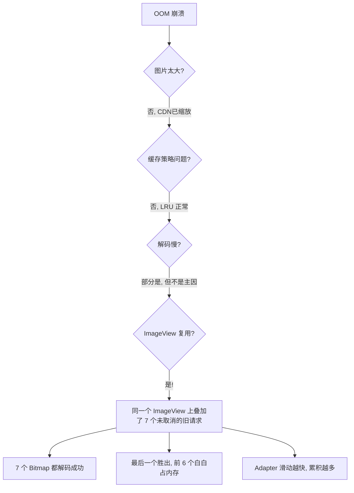

最终定位的根因，是一个 5000 行的 `ImageManager` **上帝类**：

| 问题 | 表现 |
|---|---|
| **静态单例 + 全局回调** | 没法绑定生命周期，Activity 销毁回调照样跑 |
| **请求无 ID 无取消** | ImageView 复用时无法 cancel 上一个 |
| **同 url 并发不合并** | 列表中 10 张同图，发 10 个网络请求 |
| **Bitmap 不缩放** | 5MB 原图直接塞进 100×100 的 ImageView |
| **回调地狱嵌套** | 网络→解码→变换→渲染，4 层 Listener |
| **吞异常** | `catch (Exception e) { e.printStackTrace(); }` 满天飞 |

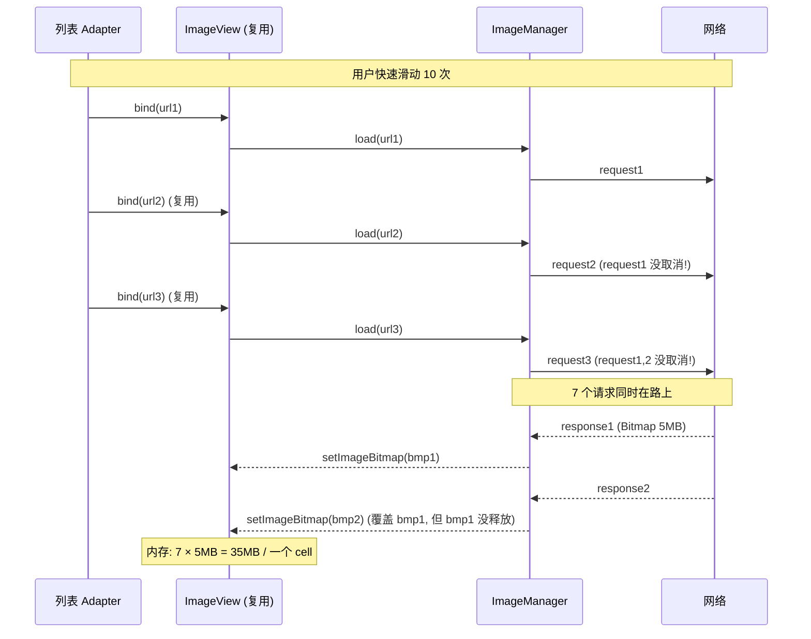

**深夜 1 点 50 分**，团队回滚到一周前版本，崩溃率回归 0.3%。但回滚不是终点，所有人都知道，**这个 ImageManager 早晚要重写**。这次重写的故事，就是本篇的全部内容。

### 1.3 八个灵魂拷问

事故复盘后，团队在白板上列出 8 个必须回答的问题。**这 8 个问题恰好对应了一个图片加载框架的所有核心设计点**，

| # | 问题 | 涉及 |
|---|---|---|
| Q1 | 一次"图片加载请求"到底是什么？ | 封装 / 状态机 |
| Q2 | 怎么取消一个还在路上的请求？ | 状态守卫 |
| Q3 | 内存缓存、磁盘缓存、网络，怎么解耦？ | 接口 / 抽象 |
| Q4 | JPEG / PNG / WebP / GIF 怎么扩展？ | OCP / 策略 |
| Q5 | 圆角、模糊、灰度变换怎么组合？ | 装饰 / 组合 |
| Q6 | 同一 url 并发请求怎么合并？ | 单一职责 / 拦截器 |
| Q7 | 怎么测试？怎么 mock 网络和时钟？ | 可测试性 |
| Q8 | 图片库该不该感知 Activity 生命周期？ | 限界上下文 |

**思考一下**：你能不抄答案，先在脑海里给出每个问题的设计吗？带着这些问题往下读，会比直接看答案有用 10 倍。

### 1.4 本篇路线图

我们不会一开始就给"完美方案"，那样读者只会**看一遍就忘**。我们要做的，是**带你亲眼见证一段屎山如何在 11 把内功的加持下脱胎换骨**。


| 版本 | 篇幅占比 | 对应章节 | 关键产出 |
|---|---|---|---|
| V0 屎山 | 10% | §1 | 反面教材 + 17 处坏味道 |
| V1 OOP 救场 | 25% | §2-§4 | Request 对象 / 三大端口 / 拦截器链 |
| V2 SOLID 精修 | 15% | §5 | OCP 演示扩展 WebP / DIP 解 OkHttp 耦合 |
| V3 重构十二式 | 15% | §6 | 8 个具体重构动作 |
| V4 可测试改造 | 15% | §7 | 注入 Clock / Scheduler / Network |
| V5 DDD 上下文 | 15% | §8 | 5 个上下文 + 防腐层 + 领域事件 |
| 全景图 + 思考题 | 5% | §9 | 类图 + 11 篇映射表 + 终极思考 |

写在前面：所有代码用 **Java** 演示（移动端读者最熟），关键设计处给 **Glide / Coil / SDWebImage** 的真实源码对照。代码不追求可编译，**追求传达思想**。

---

## 2.V0版本能跑就行

### 2.1 三百行的屎山

下面是事故前那个 `ImageManager` 的简化版。**真实的它有 5000 行**，这里浓缩到 300 行，但所有"病灶"原汁原味保留。

请你**先读一遍**，**别急着挑毛病**，感受一下"看起来能跑"的代码长什么样。

```java
// V0: 真实事故里的 ImageManager (浓缩版)
public class ImageManager {

    public static ImageManager instance;                                    // (1)
    public static Map<String, Bitmap> cache = new HashMap<>();              // (2)
    public static int MAX_SIZE = 100;                                       // (3)
    public static String DISK_DIR = "/sdcard/img_cache";                    // (4)
    public static OkHttpClient client = new OkHttpClient();                 // (5)

    public static ImageManager getInstance() {                              // (6)
        if (instance == null) instance = new ImageManager();
        return instance;
    }

    public static void loadImage(String url, ImageView iv) {                // (7)
        loadImage(url, iv, 0, 0, false, false, false, null, null);
    }

    public static void loadImage(String url, ImageView iv,                  // (8) 长参数列表
                                 int placeholder, int errorImg,
                                 boolean roundCorner, boolean blur,
                                 boolean gray, String diskKey,
                                 Callback cb) {
        if (url == null || url.length() == 0) return;                       // (9) 静默失败

        if (cache.containsKey(url)) {                                       // (10)
            iv.setImageBitmap(cache.get(url));
            if (cb != null) cb.onSuccess(cache.get(url));
            return;
        }

        if (placeholder != 0) iv.setImageResource(placeholder);

        new Thread(new Runnable() {                                         // (11) 裸线程
            @Override
            public void run() {
                Bitmap bmp = null;
                try {
                    File f = new File(DISK_DIR, diskKey != null ? diskKey : url.hashCode() + "");
                    if (f.exists()) {
                        bmp = BitmapFactory.decodeFile(f.getAbsolutePath());// (12) 主线程隐患
                    } else {
                        Request req = new Request.Builder().url(url).build();
                        Response resp = client.newCall(req).execute();
                        InputStream is = resp.body().byteStream();
                        bmp = BitmapFactory.decodeStream(is);               // (13) 不缩放
                        FileOutputStream fos = new FileOutputStream(f);
                        bmp.compress(Bitmap.CompressFormat.JPEG, 90, fos);  // (14) 主线程文件 IO
                        fos.close();
                    }

                    if (roundCorner) bmp = roundCorner(bmp);                // (15) if 阶梯
                    if (blur) bmp = blur(bmp);
                    if (gray) bmp = gray(bmp);

                    if (cache.size() >= MAX_SIZE) cache.clear();            // (16) 粗暴清空
                    cache.put(url, bmp);                                    // (17) 无 LRU

                    final Bitmap finalBmp = bmp;
                    iv.post(new Runnable() {                                // (18) iv 已被复用?
                        @Override
                        public void run() {
                            iv.setImageBitmap(finalBmp);
                            if (cb != null) cb.onSuccess(finalBmp);
                        }
                    });
                } catch (Exception e) {                                     // (19) 吞异常
                    e.printStackTrace();
                    if (errorImg != 0) iv.post(() -> iv.setImageResource(errorImg));
                }
            }
        }).start();
    }

    public static void clearCache() { cache.clear(); }                      // (20)

    private static Bitmap roundCorner(Bitmap bmp) { /* ... */ return bmp; } // (21) 静态工具
    private static Bitmap blur(Bitmap bmp)        { /* ... */ return bmp; }
    private static Bitmap gray(Bitmap bmp)        { /* ... */ return bmp; }

    public interface Callback {                                             // (22) 嵌套接口
        void onSuccess(Bitmap bmp);
        void onError(Exception e);
    }
}
```

**调用方代码**也很"经典"：

```java
// FeedAdapter#onBindViewHolder
ImageManager.loadImage(item.imgUrl, holder.iv,
        R.drawable.placeholder, R.drawable.error,
        item.needRound, false, false, null, null);
```

**它能跑**，能加载图片，甚至能磁盘缓存，但事故就藏在这 300 行里。

### 01.2 找出十七处坏味道

现在开始挑刺。**先盖住下面的表格，自己数一数**，你能找出多少处？

<details>
<summary>展开查看（建议先自己数）</summary>

| # | 位置 | 坏味道 | 对应第 8 篇章节 |
|---|---|---|---|
| 1 | (1) `instance` | 全局可变状态 + 非线程安全单例 | 全局可变状态 |
| 2 | (2)(3)(4)(5) | 4 个 `public static` 字段 | 数据泥团 + 全局状态 |
| 3 | (6) | 双检锁缺失，多线程下创建多个实例 | 并发坏味 |
| 4 | (7)(8) | 重载嵌套 + 长参数列表 | 长参数列表 |
| 5 | (8) | 9 个参数中混用 `int / boolean / String / Callback` | 数据泥团 |
| 6 | (9) | 静默失败 (`return;` 不告知调用方) | 不可见错误 |
| 7 | (10) | `HashMap` 当缓存，无 LRU 无并发保护 | 错误抽象 |
| 8 | (11) | `new Thread()` 裸线程 | 资源失控 |
| 9 | (12)(14) | I/O 操作未走专用线程池 | 性能反模式 |
| 10 | (13) | `decodeStream` 不传 `inSampleSize`，5MB 原图直接进内存 | 主因之一 |
| 11 | (15) | `if (round) ... if (blur) ...` 阶梯式条件 | switch/if 阶梯 |
| 12 | (16) | `cache.size() >= MAX 时 clear()` 整个清空 | 神奇数字 + 错误策略 |
| 13 | (17) | 缓存键直接用 `url`，相同 url 不同尺寸/变换互相覆盖 | 错误抽象 |
| 14 | (18) | `iv.post` 时未校验 ImageView 是否已被复用 | **事故根因** |
| 15 | (19) | `catch Exception` 吞异常 | 异常黑洞 |
| 16 | (21) | 静态工具方法承担领域逻辑 | 静态工具滥用 |
| 17 | (22) | `Callback` 嵌套在 Manager 内，回调没生命周期感知 | 上帝类成员 |
| **+** | 综合 | `ImageManager` 同时管缓存/网络/解码/变换/渲染 | **上帝类（核心病）** |

</details>

> 17 处坏味道里，**真正引爆事故的只有 #14 一个**，但其他 16 处共同构成了"事故的温床"。这就是第 8 篇说的："**坏味道不是单点 bug，是系统级的腐烂**。"

### 01.3 屎山的代价清单

我们用一张表算算这段代码的"长期成本"：

| 维度 | V0 现状 | 长期代价 |
|---|---|---|
| 新增 WebP 支持 | 改 `decodeStream` 调用处 + `if/else` | 每个调用方都要改 |
| 新增"圆角+模糊"组合 | 加一个 `boolean roundAndBlur` 参数 | 参数列表无限增长 |
| 想做单元测试 | 静态方法 + 裸线程 + 全局状态 | **几乎无法测** |
| 同一 url 并发合并 | 没地方加，要从头改 | 整体重写 |
| Activity 销毁时取消请求 | 没有 Request ID | 整体重写 |
| 列表复用图片 | 没有"绑定到 ImageView"的概念 | **事故根因** |

**预估**：要给 V0 加任何一个新需求，都意味着改动 **3-5 处分散代码**，并引入 **2-3 个新 bug**。这就是"**屎山的复利**"，它不是不能跑，是**不能演进**。

---

## 3.封装救场状态浮现

> "封装的本质不是把字段藏起来，是把**变化**藏起来。" ， 第 02 篇

V0 最大的问题，是把**所有变化**都摊在一个静态方法里。要救场，第一刀就是把"一次加载"这个**概念**封装成对象。

### 02.1 静态地狱的根源

回看 V0 的方法签名：

```java
public static void loadImage(String url, ImageView iv,
        int placeholder, int errorImg,
        boolean roundCorner, boolean blur, boolean gray,
        String diskKey, Callback cb)
```

**它在表达什么？** 9 个参数 + 1 个返回值，但**没有"请求"这个概念**。

后果有三：

1. **没有 ID** → 没法取消、没法去重、没法追踪
2. **没有状态** → 不知道当前请求是"准备中""下载中"还是"已完成"
3. **没有边界** → 错误处理、生命周期、回调全混在一个匿名 `Runnable` 里

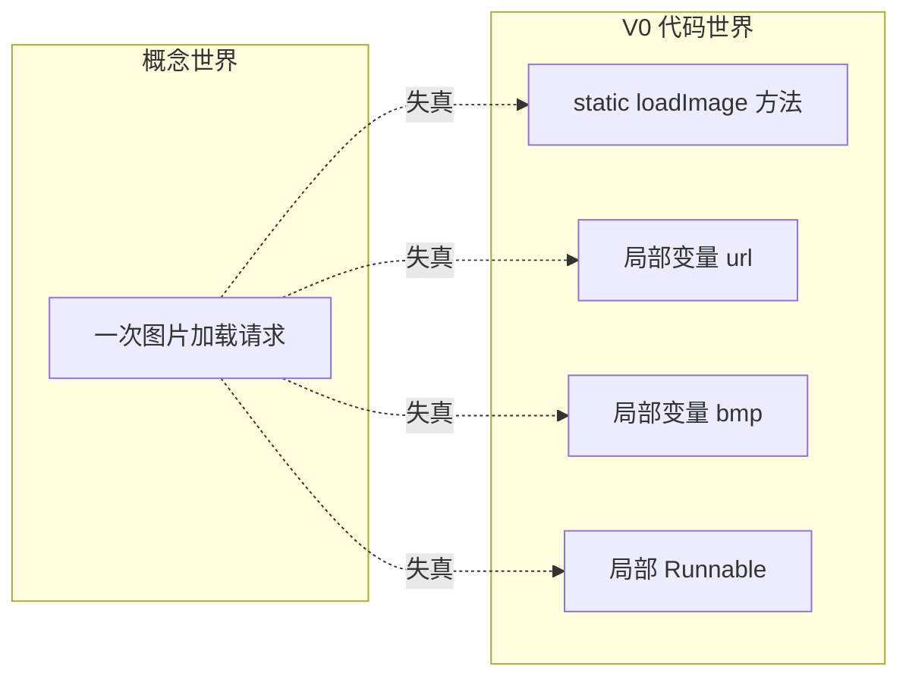

**这就是第 11 篇说的"语言失真"**，业务概念在代码里被肢解成了一堆变量。封装的第一步就是把它**重新拼成对象**。

### 02.2 抽出请求对象

我们引入 `ImageRequest`，一次加载请求的**完整建模**：

```java
// V1 第一刀: ImageRequest 不可变值对象 (Builder 构造)
public final class ImageRequest {

    private final String url;
    private final int targetWidth;          // ImageView 宽 (用于计算 inSampleSize)
    private final int targetHeight;
    private final List<Transformation> transformations;  // 变换链
    private final int placeholderResId;
    private final int errorResId;
    private final WeakReference<ImageView> targetRef;   // 弱引用, 防 ImageView 泄漏
    private final long requestId;                       // 唯一 ID, 用于取消
    private final Listener listener;

    private ImageRequest(Builder b) {
        this.url = b.url;
        this.targetWidth = b.targetWidth;
        this.targetHeight = b.targetHeight;
        this.transformations = Collections.unmodifiableList(b.transformations);
        this.placeholderResId = b.placeholderResId;
        this.errorResId = b.errorResId;
        this.targetRef = new WeakReference<>(b.target);
        this.requestId = REQ_ID_GEN.incrementAndGet();
        this.listener = b.listener;
    }

    // 只读 getter, 没有 setter -> 不可变
    public String url() { return url; }
    public long id()    { return requestId; }
    public ImageView target() { return targetRef.get(); }   // 可能为 null
    // ...

    public static final class Builder {
        // ... 构建参数 ...
        public Builder url(String url) { this.url = url; return this; }
        public Builder size(int w, int h) { this.targetWidth = w; this.targetHeight = h; return this; }
        public Builder transform(Transformation t) { this.transformations.add(t); return this; }
        public Builder placeholder(int r) { this.placeholderResId = r; return this; }
        public ImageRequest into(ImageView iv) { this.target = iv; return new ImageRequest(this); }
    }

    private static final AtomicLong REQ_ID_GEN = new AtomicLong();
}
```

**对比一下调用方**：

```java
// V0 (参数泥团)
ImageManager.loadImage(url, iv, R.drawable.ph, R.drawable.err,
        true, false, false, null, null);

// V1 (流式 + 对象)
new ImageRequest.Builder()
    .url(url)
    .size(iv.getWidth(), iv.getHeight())
    .placeholder(R.drawable.ph)
    .error(R.drawable.err)
    .transform(new RoundCornerTransformation(8))
    .into(iv);
```

**改善了什么？**

| 维度 | V0 | V1 |
|---|---|---|
| 概念表达 | 一堆参数 | 一个 `ImageRequest` 对象 |
| 是否可标识 | 否 | 有 `requestId` |
| 是否可取消 | 否 | 通过 ID 可取消 |
| 是否可追踪 | 否 | 可日志、可监控 |
| 调用方可读性 | 9 个参数容易传错 | 流式 API，IDE 自动补全 |
| 不可变性 | `Bitmap cache` 全局可变 | `ImageRequest` 全 final |

> **这就是第 02 篇的核心**，封装的对象**不是数据袋，是带有身份与边界的概念**。

### 02.3 引入状态机守卫

光有 `ImageRequest` 还不够，它**还没有状态**。一次加载在生命周期内会经历这些阶段：

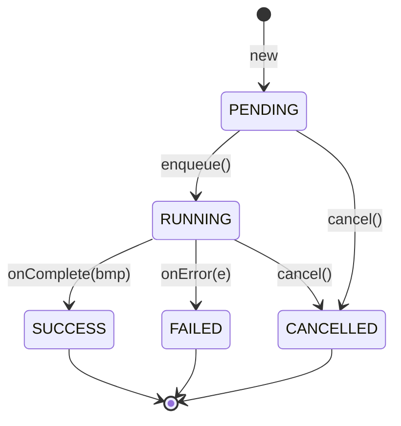

**关键问题**：状态转换的合法性，在 V0 里**完全没人管**。比如：

- `RUNNING` 状态下能 `cancel()` 吗？  应当能
- `SUCCESS` 状态下还能 `cancel()` 吗？  不应该（无意义）
- `CANCELLED` 状态下还能 `onComplete(bmp)` 吗？  不应该（事故根因！V0 里就是这种"已取消还回调"导致 ImageView 串图）

把状态机**封装到对象内部**：

```java
public final class ImageRequest {

    public enum State { PENDING, RUNNING, SUCCESS, FAILED, CANCELLED }

    private final AtomicReference<State> state = new AtomicReference<>(State.PENDING);

    // 状态守卫: 只允许合法迁移
    boolean transitionTo(State target) {
        State curr;
        do {
            curr = state.get();
            if (!isLegalTransition(curr, target)) return false;
        } while (!state.compareAndSet(curr, target));
        return true;
    }

    private static boolean isLegalTransition(State from, State to) {
        switch (from) {
            case PENDING:   return to == State.RUNNING || to == State.CANCELLED;
            case RUNNING:   return to == State.SUCCESS || to == State.FAILED || to == State.CANCELLED;
            default:        return false;   // 终态不可再迁移
        }
    }

    public State state() { return state.get(); }
    public boolean isTerminated() {
        State s = state.get();
        return s == State.SUCCESS || s == State.FAILED || s == State.CANCELLED;
    }
}
```

**取消的实现**，这是 V0 事故根因的最终答案：

```java
public void cancel() {
    if (transitionTo(State.CANCELLED)) {
        // 通知执行器中断 (后续在拦截器链里处理)
    }
    // 如果状态已是终态, transitionTo 返回 false, cancel 自动失效 - 幂等
}

// 在每个回调入口都先检查
void onComplete(Bitmap bmp) {
    if (!transitionTo(State.SUCCESS)) return;   // 已取消, 直接丢弃 - 修复事故根因!
    deliverToTarget(bmp);
}
```

**关键设计点**：

1. `AtomicReference<State>` + CAS，**线程安全**
2. `transitionTo` 返回 `boolean` 而非抛异常，**调用方可优雅处理** (`if (!transitionTo(...)) return;`)
3. 终态不可再迁移，**幂等**，多次 `cancel()` 不会出错
4. **这是第 02 篇"封装即守卫"的精确实例**，状态字段对外只读，迁移走守卫方法

### 02.4 值对象与缓存键

V0 还有一处隐蔽的坑：

```java
cache.put(url, bmp);   // 同一 url, 不同尺寸/变换, 互相覆盖!
```

`url = "https://x.png"` 在列表里被同时请求为：100×100、200×200、200×200+圆角，**它们应该是 3 个不同的缓存条目**，但 V0 用 `url` 当 key 把它们撞成了一个。

**第 11 篇的"值对象"**正好对症：

```java
// 缓存键 = url + 尺寸 + 变换签名 (值对象, equals/hashCode 全字段)
public final class CacheKey {
    private final String url;
    private final int targetWidth;
    private final int targetHeight;
    private final String transformationSignature;  // 变换链的稳定字符串签名

    public CacheKey(ImageRequest req) {
        this.url = req.url();
        this.targetWidth = req.targetWidth();
        this.targetHeight = req.targetHeight();
        this.transformationSignature = signatureOf(req.transformations());
    }

    private static String signatureOf(List<Transformation> ts) {
        StringBuilder sb = new StringBuilder();
        for (Transformation t : ts) sb.append(t.key()).append('|');  // 每个变换提供稳定 key
        return sb.toString();
    }

    @Override
    public boolean equals(Object o) {
        if (!(o instanceof CacheKey)) return false;
        CacheKey k = (CacheKey) o;
        return targetWidth == k.targetWidth
            && targetHeight == k.targetHeight
            && Objects.equals(url, k.url)
            && Objects.equals(transformationSignature, k.transformationSignature);
    }
    @Override
    public int hashCode() {
        return Objects.hash(url, targetWidth, targetHeight, transformationSignature);
    }
}
```

**这是第 11 篇值对象的教科书实例**，

| 特征 | 体现 |
|---|---|
| **不可变** | 所有字段 `final`，没有 setter |
| **无身份** | 两个 `CacheKey` 内容相同就是相等的 |
| **全字段相等** | `equals`/`hashCode` 覆盖所有字段 |
| **业务语义清晰** | "缓存的标识" 一目了然 |

> **小结**：仅仅是 §2 这一节，我们就靠**封装**修复了 V0 的 5 处问题（#1, #5, #13, #14, #17）。还没动 V0 的核心架构，但**事故根因已经被消除**。

**思考题**：
1. 为什么 `targetRef` 用 `WeakReference<ImageView>` 而不是直接持有？如果直接持有会出什么问题？
2. `transformationSignature` 用 `Transformation#key()` 拼字符串，如果不同变换返回相同 key 会怎样？这暴露了什么深层设计要求？
3. 状态机里我们禁止终态再迁移，但 Glide 的实现允许 `CLEARED → PENDING`（复用 Request）。两种设计的取舍是什么？

---

## 4.抽象与接口分离

封装解决了"**一次请求**"的概念，但还没解决"**请求要做哪些事**"。一次完整的加载至少经过：**数据源 → 解码 → 变换 → 缓存 → 渲染**。这五个阶段每一个都有**多种实现**，这正是抽象与接口的用武之地。

### 03.1 识别变化轴

第 03、04 篇反复强调："**抽象是为了隔离变化**"。我们先把图片加载里的"变化轴"列出来：

| 变化轴 | 例子 | 频率 |
|---|---|---|
| 数据来源 | http / file / asset / content URI / drawable resource | 每加一种来源都改 |
| 编码格式 | JPEG / PNG / WebP / GIF / SVG / HEIF | WebP/HEIF 后期才支持 |
| 缓存层 | 内存 LRU / 磁盘 LRU / 二级缓存 / 共享缓存 | 多产品线策略不同 |
| 网络客户端 | OkHttp / HttpURLConnection / Cronet | 升级或替换 |
| 变换 | 圆角 / 裁剪 / 模糊 / 灰度 / 水印 | UI 设计随时加 |
| 调度策略 | 串行 / 并发 / 优先级队列 | 性能调优 |

**6 条变化轴，每一条都可能在产品迭代中被替换或新增**。如果像 V0 那样把它们全揉在一个 `loadImage` 里，**每加一种就改一次方法**，这就是 OCP 的反例。

### 03.2 三个端口的浮现

让我们沿着"加载路径"切一刀：

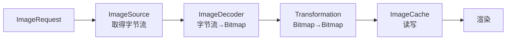

每个箭头之间都是**一次变化轴**。我们把它们抽成接口（**端口**）：

```java
// 端口 1: 数据源 - 给我 url, 还我字节流
public interface ImageSource {
    InputStream open(String url) throws IOException;
    boolean supports(String url);          // 是否支持此协议
}

// 端口 2: 解码器 - 给我字节流, 还我 Bitmap
public interface ImageDecoder {
    Bitmap decode(InputStream is, int targetW, int targetH) throws IOException;
    boolean supports(byte[] header);       // 通过文件头识别格式
}

// 端口 3: 缓存 - 双向操作
public interface ImageCache {
    Bitmap get(CacheKey key);
    void put(CacheKey key, Bitmap bmp);
    void remove(CacheKey key);
    void clear();
}
```

**注意 `supports` 方法**，它让框架可以**自动选择实现**：

```java
// 框架内部: 根据 url 自动挑选 Source
ImageSource selectSource(String url) {
    for (ImageSource s : sources) {
        if (s.supports(url)) return s;
    }
    throw new IllegalStateException("no source for " + url);
}
```

**新增一种协议（如 base64 内嵌图片）只需**：

```java
public class Base64Source implements ImageSource {
    public boolean supports(String url) { return url.startsWith("data:image"); }
    public InputStream open(String url) { /* 解 base64 */ }
}

// 注册即用
loader.addSource(new Base64Source());
```

**完全不改任何旧代码**，这就是 OCP，第 06、07 篇会再次强调。

### 03.3 抽象类共享骨架

但**接口不够**，`HttpSource` / `FileSource` / `AssetSource` 三个数据源虽然取数方式不同，但**都需要超时、重试、监控**。这些公共骨架放接口里是污染，放每个实现里是重复。

**第 03 篇的答案：抽象类与接口配合**，

```java
// 抽象类: 共享的骨架
public abstract class AbstractImageSource implements ImageSource {

    private final int maxRetry;
    private final long timeoutMs;
    private final Metrics metrics;

    @Override
    public final InputStream open(String url) throws IOException {  // final, 防子类绕过
        long start = System.currentTimeMillis();
        IOException last = null;
        for (int i = 0; i <= maxRetry; i++) {
            try {
                InputStream is = openInternal(url, timeoutMs);   // 模板方法
                metrics.recordLatency(url, System.currentTimeMillis() - start);
                return is;
            } catch (IOException e) {
                last = e;
                metrics.recordRetry(url, i);
            }
        }
        metrics.recordFailure(url);
        throw last;
    }

    /** 子类只需实现"如何取一次", 重试/监控全免费 */
    protected abstract InputStream openInternal(String url, long timeoutMs) throws IOException;
}

public class HttpSource extends AbstractImageSource {
    @Override
    protected InputStream openInternal(String url, long timeoutMs) throws IOException {
        return okHttpClient.newCall(new Request.Builder().url(url).build()).execute().body().byteStream();
    }
    @Override public boolean supports(String url) { return url.startsWith("http"); }
}

public class FileSource extends AbstractImageSource {
    @Override
    protected InputStream openInternal(String url, long timeoutMs) throws IOException {
        return new FileInputStream(url.replace("file://", ""));
    }
    @Override public boolean supports(String url) { return url.startsWith("file://"); }
}
```

**对比第 03 篇的口诀**：

> **接口定能力，抽象类共骨架，子类填差异**。

| 角色 | 在我们的设计里 |
|---|---|
| 接口 `ImageSource` | "能从 url 取字节流"，能力 |
| 抽象类 `AbstractImageSource` | 重试/超时/监控，骨架 |
| 子类 `HttpSource/FileSource` | "怎么取"的差异 |

### 03.4 与Glide的对照

我们设计的这个分层，**Glide 是怎么做的？**

打开 Glide 源码（v4.x），你会看到：

```java
// Glide 中的对应概念
public interface ModelLoader<Model, Data> {           // ≈ 我们的 ImageSource
    LoadData<Data> buildLoadData(Model model, int width, int height, Options options);
    boolean handles(Model model);                     // ≈ 我们的 supports
}

public interface ResourceDecoder<T, Z> {              // ≈ 我们的 ImageDecoder
    Resource<Z> decode(T source, int width, int height, Options options);
    boolean handles(T source, Options options);
}

public interface DiskCache { /* ... */ }              // ≈ 我们的 ImageCache (只读写)
public interface MemoryCache { /* ... */ }            //     (内存版)
```

**Glide 的 `Registry` 类就是"端口注册表"**，所有 ModelLoader/Decoder/Encoder 在 Application 启动时注册进去，运行时按 `handles` 自动匹配。

**这意味着什么？** 你今天读完这一节理解的"端口 + 注册表"模式，**直接就能读懂 Glide / Coil 的核心架构**，它们用的是同一套 OOP 思想，只是命名和细节不同。

| 框架 | 数据源端口 | 解码器端口 | 缓存端口 |
|---|---|---|---|
| 我们 | `ImageSource` | `ImageDecoder` | `ImageCache` |
| Glide | `ModelLoader` | `ResourceDecoder` | `DiskCache` / `MemoryCache` |
| Coil | `Fetcher` | `Decoder` | `MemoryCache` / `DiskCache` |
| SDWebImage | `SDImageLoader` | `SDImageCoder` | `SDImageCache` |

**思考题**：
1. Glide 的 `ModelLoader<Model, Data>` 是泛型的，可以处理任意 `Model`（不只是 String url，还可以是 Uri、File、byte[]）。我们的 `ImageSource` 写死了 `String url`，这有什么代价？什么时候该升级到泛型？
2. 如果我们想加"**预下载**"（不解码，只下载到磁盘），应该新增端口还是改造现有端口？为什么？
3. `AbstractImageSource#open` 加了 `final`，这强制了什么、又限制了什么？是否违反了 LSP？

---

## 5.组合优于继承的洋葱

§2 解决了"请求是什么"，§3 解决了"加载分几步"。但还有一个问题没回答，**这些步骤怎么串起来？**

直觉上，可能会想到继承，这恰好是第 05 篇要破除的"继承陷阱"。

### 04.1 继承式方案的爆炸

假设我们用继承串流程，会自然演化成下面这个体系：

```java
abstract class BaseLoader { abstract Bitmap load(ImageRequest req); }

class CachedLoader extends BaseLoader {           // 加缓存
    Bitmap load(ImageRequest req) {
        Bitmap b = cache.get(req);
        if (b != null) return b;
        b = doLoad(req);
        cache.put(req, b);
        return b;
    }
    abstract Bitmap doLoad(ImageRequest req);
}

class RetryableCachedLoader extends CachedLoader {  // 加重试
    Bitmap doLoad(ImageRequest req) {
        for (int i = 0; i < 3; i++) try { return realLoad(req); } catch (Exception e) {}
        throw new RuntimeException("retry exhausted");
    }
    abstract Bitmap realLoad(ImageRequest req);
}

class MetricsRetryableCachedLoader extends RetryableCachedLoader {  // 加监控
    Bitmap realLoad(ImageRequest req) {
        long t = System.currentTimeMillis();
        try { return doRealLoad(req); }
        finally { metrics.record(System.currentTimeMillis() - t); }
    }
    abstract Bitmap doRealLoad(ImageRequest req);
}

// 还要再加: 限流, 优先级, 去重, 灰度...
// MetricsRetryableCachedThrottledPriorityDedupGrayLoader extends ...
```

**问题暴露得很彻底**：

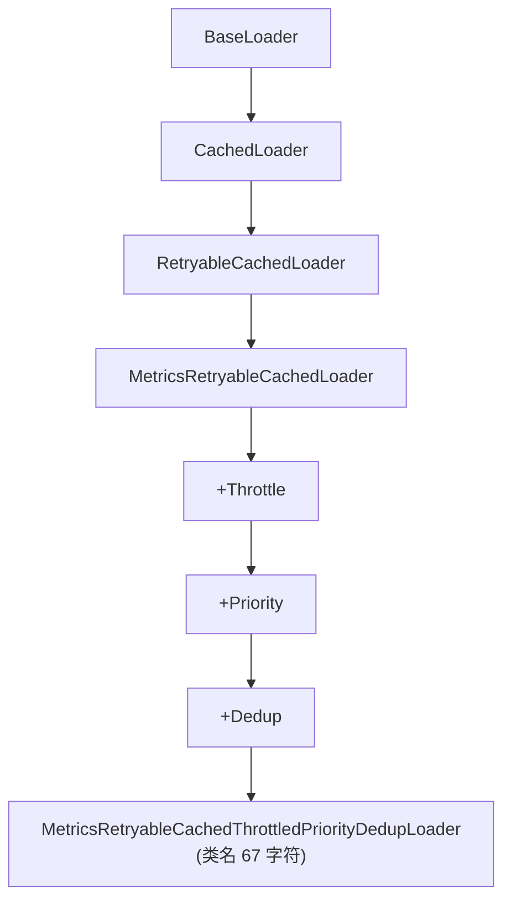

**6 个能力 = 6 层继承 = 类爆炸**。更糟的是：

- 想要"**只重试 + 监控，不要缓存**" → **没办法**，重试在缓存的子类里
- 想要"**先限流再重试**" → **顺序写死在继承链里**，改不了
- 子类发现父类某个方法逻辑有 bug → **改了影响所有子孙类**

**这正是第 05 篇说的**：继承表达的是"is-a"，但"加缓存"不是"is-a"，是"**附加能力**"。

### 04.2 拦截器链的诞生

把每个能力变成**一个独立对象**，让它们**串成链**，这就是 OkHttp / Glide 都用的 **Interceptor Chain**。

```java
// 拦截器接口
public interface Interceptor {
    Bitmap intercept(Chain chain) throws IOException;

    interface Chain {
        ImageRequest request();
        Bitmap proceed(ImageRequest req) throws IOException;
    }
}
```

每个能力都是一个独立的 `Interceptor`：

```java
// 能力 1: 内存缓存
public class MemoryCacheInterceptor implements Interceptor {
    private final ImageCache cache;
    @Override
    public Bitmap intercept(Chain chain) throws IOException {
        ImageRequest req = chain.request();
        CacheKey key = new CacheKey(req);
        Bitmap hit = cache.get(key);
        if (hit != null) return hit;                 // 命中, 短路返回
        Bitmap result = chain.proceed(req);          // 未命中, 继续往下
        if (result != null) cache.put(key, result);
        return result;
    }
}

// 能力 2: 监控
public class MetricsInterceptor implements Interceptor {
    @Override
    public Bitmap intercept(Chain chain) throws IOException {
        long t = System.currentTimeMillis();
        try {
            return chain.proceed(chain.request());
        } finally {
            metrics.record(chain.request().url(), System.currentTimeMillis() - t);
        }
    }
}

// 能力 3: 同 url 并发去重 (修复 V0 #6 痛点)
public class DedupInterceptor implements Interceptor {
    private final Map<CacheKey, FutureTask<Bitmap>> inflight = new ConcurrentHashMap<>();
    @Override
    public Bitmap intercept(Chain chain) throws IOException {
        CacheKey key = new CacheKey(chain.request());
        FutureTask<Bitmap> existing = inflight.get(key);
        if (existing != null) {                      // 已有同 key 在路上, 等它的结果
            try { return existing.get(); } catch (Exception e) { throw new IOException(e); }
        }
        FutureTask<Bitmap> task = new FutureTask<>(() -> chain.proceed(chain.request()));
        FutureTask<Bitmap> raced = inflight.putIfAbsent(key, task);
        if (raced != null) try { return raced.get(); } catch (Exception e) { throw new IOException(e); }
        try {
            task.run();
            return task.get();
        } catch (Exception e) { throw new IOException(e); }
        finally { inflight.remove(key); }
    }
}

// 能力 N: 网络/解码/变换 全部都是 Interceptor
public class NetworkInterceptor implements Interceptor { /* ... */ }
public class DecodeInterceptor implements Interceptor { /* ... */ }
public class TransformInterceptor implements Interceptor { /* ... */ }
```

**链的执行**：

```java
public class RealChain implements Interceptor.Chain {
    private final List<Interceptor> interceptors;
    private final int index;
    private final ImageRequest request;

    @Override
    public Bitmap proceed(ImageRequest req) throws IOException {
        if (index >= interceptors.size()) throw new IllegalStateException("no terminal");
        Interceptor next = interceptors.get(index);
        RealChain nextChain = new RealChain(interceptors, index + 1, req);
        return next.intercept(nextChain);
    }
}
```

### 04.3 能力可插拔实战

**装配阶段**自由组合：

```java
// 标准生产配置
List<Interceptor> chain = Arrays.asList(
    new MetricsInterceptor(),       // 最外层: 度量整体耗时
    new MemoryCacheInterceptor(memCache),
    new DedupInterceptor(),         // 同 key 并发合并
    new DiskCacheInterceptor(diskCache),
    new NetworkInterceptor(httpSource),
    new DecodeInterceptor(decoderRegistry),
    new TransformInterceptor()      // 终端: 不再 proceed
);
```

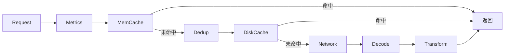

**测试场景**：去掉网络只走缓存：

```java
List<Interceptor> chain = Arrays.asList(
    new MemoryCacheInterceptor(memCache),
    new TerminalInterceptor()       // 命中即返回, 否则抛 NoSuchElement
);
```

**调试场景**：加一个日志拦截器到任意位置：

```java
chain.add(2, new LoggingInterceptor());   // 直接 add, 无侵入
```

**对比继承式**：

| 维度 | 继承式 | 拦截器链 |
|---|---|---|
| 加一个新能力 | 新增子类 + 改父类 | 写一个 `Interceptor`，加到 list |
| 能力顺序调整 | **不可能**，写死在继承链 | 改 list 顺序即可 |
| 临时去掉某能力 | 改类继承结构 | 从 list 移除 |
| 测试时替换 | 复杂 | 装配时给 fake list |
| 类数量 | 6 能力 = 6 类（最深 6 层） | 6 能力 = 6 类（无继承） |
| 复用单一能力 | 必须连父类一起 | 可独立使用 |

**这正是第 05 篇的核心结论**：

> **当能力可以"按需组合、动态调整、独立演化"时，组合永远优于继承**。

### 04.4 与OkHttp的同构

如果你看过 OkHttp 源码，会发现**我们刚才推导的设计，和 OkHttp 几乎逐行同构**：

```java
// OkHttp 源码 (简化)
public interface Interceptor {
    Response intercept(Chain chain) throws IOException;
}

// 真实的 OkHttp 拦截器链
new RealCall.execute()
    └─ retryAndFollowUpInterceptor   // 重试
    └─ bridgeInterceptor             // header 处理
    └─ cacheInterceptor              // HTTP 缓存
    └─ connectInterceptor            // 建立连接
    └─ networkInterceptor            // 网络 IO
```

**Glide 的 `RequestBuilder` + `Engine` + `EngineJob`** 内部也是同构思路，`Engine` 维护"正在进行中的 Job 表"做去重，`EngineJob` 串起"内存→磁盘→源"的查找。

| 框架 | 链式抽象命名 |
|---|---|
| OkHttp | `Interceptor` + `RealInterceptorChain` |
| Glide | `DataFetcherGenerator` + `LoadPath` |
| Coil | `Interceptor` + `RealInterceptorChain` (直接借鉴 OkHttp) |
| Retrofit | `CallAdapter` + `Converter` (链式装饰) |
| Spring MVC | `HandlerInterceptor` |
| Servlet | `Filter` |

> **同一个思想，在 N 个领域被独立"重新发明"**，这就是第 05 篇说的"组合优于继承"在工业界的真实分量。

**思考题**：
1. `MemoryCacheInterceptor` 既负责"读"又负责"写"，这违反了 SRP 吗？如果拆成两个会怎样？
2. 如果某个 `Interceptor` 在 `proceed` 之后再读 `request`，可能拿到与开始时不同的 `request` 吗？为什么？
3. `DedupInterceptor` 用 `ConcurrentHashMap` + `FutureTask`，如果第二个等待者被 `cancel`，该不该取消正在跑的那一个？设计上的取舍是什么？

---

## 6.V1阶段小结

走到这里，V0 的事故根因已经被根治，主体架构脱胎换骨，

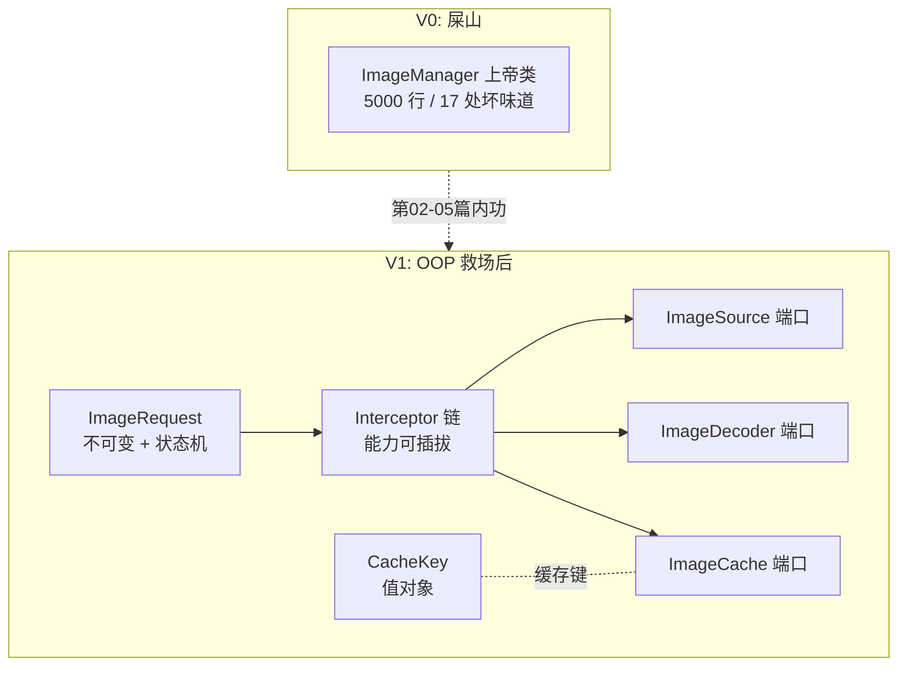

**这一阶段我们用到的篇章内功**：

| 篇章 | 应用点 |
|---|---|
| 02 封装 | `ImageRequest` 不可变 + 状态机守卫 |
| 03 接口 vs 抽象类 | `ImageSource` 接口 + `AbstractImageSource` 骨架 |
| 04 面向接口编程 | 三大端口 + 注册表选择 |
| 05 组合优于继承 | 拦截器链替代继承式 Loader |
| 11 值对象 | `CacheKey` 不可变全字段相等 |

**消除的坏味道（17 处中的 8 处）**：

| 序号 | 问题 | 解决方式 |
|---|---|---|
| #1 单例 | 通过 Builder 构造 + 注入 | §2 |
| #5 数据泥团 | `ImageRequest` 对象 | §2.2 |
| #11 if 阶梯 | `Transformation` 链 + 拦截器 | §4 |
| #13 缓存键错 | `CacheKey` 值对象 | §2.4 |
| #14 复用串图 | 状态机 + 弱引用 | §2.3 |
| #15 异常黑洞 | 拦截器 try/finally + 状态机 FAILED | §4 |
| #17 上帝类 | 拆成 Request / Source / Decoder / Cache / Interceptor | §3-§4 |
| #18 if 阶梯 | 拦截器顺序代替条件分支 | §4 |

**剩下的 9 处坏味道，下一阶段（V2/V3）继续解决**，我们将在下一篇/下一节里：

- §5 用 SOLID 五原则给框架做精修（OCP 演示扩展 WebP / DIP 解 OkHttp 耦合）
- §6 用重构十二式做系统性手术（提取方法 / 引入参数对象 / 用多态替换条件 / ...）
- §7 把整个框架改造成可测，注入 `Clock` / `Scheduler` / `Network`
- §8 用 DDD 划分 5 个限界上下文，给框架画一张"地图"

> **写到这里你应该有的感觉**：前面 11 篇看起来零散的内功，**在一个真实场景里被串成了一根绳**。封装解决"概念"，接口解决"变化轴"，组合解决"能力堆叠"，三者缺一不可。
> 下一阶段，我们要把"能跑且优雅"的 V1，变成"能扩、能测、能演进"的 V5。

---

## 7.SOLID五原则精修

V1 用三大内功救活了 V0，但仔细审视会发现，**它"能跑得不错"，但还没"能扩得优雅"**。比如：

- `ImageRequest` 既描述请求、又持有状态、又承担取消逻辑，**SRP 边界还模糊**
- `NetworkInterceptor` 内部 `new OkHttpClient()`，**DIP 没贯彻**
- `ImageCache` 接口既要 `get` 又要 `put` 又要 `clear`，**ISP 颗粒太粗**

V2 这一阶段，我们用 SOLID 五原则**逐条对症下药**，每条原则给一个**具体重构动作**，**改一行算一行**。

### 06.1 SRP拆解请求职责

回看 V1 的 `ImageRequest`，**职责清单**有这些：

```
1. 描述加载参数 (url/size/transformations)
2. 持有目标 ImageView 弱引用
3. 维护状态机 (PENDING/RUNNING/...)
4. 承担取消逻辑
5. 触发回调
```

**第 06 篇 SRP 的检验法**："**给这个类找出多少个独立的"修改理由"？**" 上面 5 条对应 5 类不同的需求方：

| 修改理由 | 谁会提需求 |
|---|---|
| 增加新参数（如优先级） | 业务调用方 |
| 改变弱引用策略 | 内存优化团队 |
| 增加新状态（如 PAUSED） | 调度团队 |
| 改取消机制（链路级取消） | 框架核心团队 |
| 加新回调（onProgress） | UI 团队 |

**5 个修改理由 = 1 个类要被 5 拨人改 = SRP 红牌**。拆，

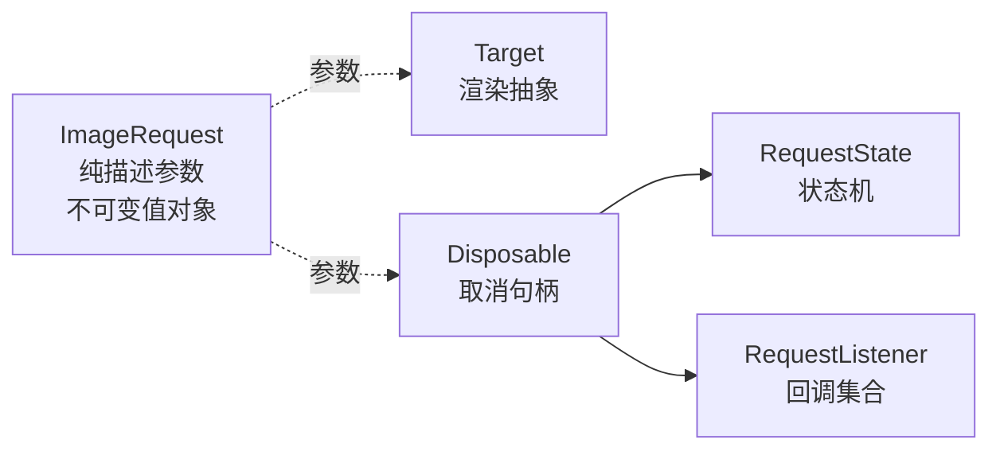

**拆完之后**：

```java
// 1. ImageRequest: 纯描述参数 (不可变 DTO/值对象)
public final class ImageRequest {
    public final String url;
    public final int targetWidth, targetHeight;
    public final List<Transformation> transformations;
    public final int placeholderResId, errorResId;
    public final Priority priority;
    // 没有 state, 没有 ImageView, 没有 cancel - 它就是一份"订单"
}

// 2. Target: 渲染抽象, 解耦 ImageView
public interface Target {
    void onLoadStarted(Drawable placeholder);
    void onResourceReady(Bitmap bitmap);
    void onLoadFailed(Drawable errorDrawable, Throwable cause);
    int getWidth();
    int getHeight();
}
public class ImageViewTarget implements Target { /* 持 WeakReference<ImageView> */ }
public class FileTarget implements Target      { /* 写到文件: 用于预下载 */ }
public class CallbackTarget implements Target  { /* 回调到业务方 */ }

// 3. Disposable: 取消句柄 (调用方拿到的"凭证")
public interface Disposable {
    boolean isDisposed();
    void dispose();
}

// 4. RequestState: 状态机 (从 ImageRequest 中抽出来)
public final class RequestState {
    private final AtomicReference<State> state = new AtomicReference<>(State.PENDING);
    boolean transitionTo(State target) { /* CAS 守卫 */ }
}

// 5. RequestListener: 回调集合
public interface RequestListener {
    void onStart(ImageRequest req);
    void onSuccess(ImageRequest req, Bitmap bmp);
    void onError(ImageRequest req, Throwable cause);
}
```

**调用方代码的变化**：

```java
// V1
ImageRequest req = new ImageRequest.Builder().url(url).into(iv);
req.cancel();  // 业务方持有 ImageRequest 还能 cancel - 职责不清

// V2
Disposable handle = imageLoader.load(  // 业务方拿到的是"取消凭证", 而非请求本身
    new ImageRequest.Builder().url(url).build(),
    new ImageViewTarget(iv)
);
handle.dispose();  // 凭证只能干一件事: dispose
```

**关键改善**：

| 维度 | V1 | V2 |
|---|---|---|
| `ImageRequest` 职责 | 5 个 | 1 个（描述） |
| 是否可序列化（用于持久化队列） | 否（含 `WeakReference`） | 是（纯 DTO） |
| Target 可扩展性 | 写死 ImageView | `Target` 接口可扩文件/回调 |
| 调用方拿到的对象 | 整个 Request（能改） | `Disposable`（只能取消） |

> **思考**：Glide 的 `Request` 接口同样独立于 `Target`，调用方拿到的是 `RequestBuilder`，最终交给 `RequestManager` 管理生命周期。这种"**请求/目标/句柄**三分"的设计在 OkHttp、Retrofit、RxJava 都能看到，**SRP 不是写出来的，是反复拆出来的**。

### 06.2 OCP扩展WebP不改旧码

OCP 最经典的检验题：**新增一种图片格式**。V1 已经有 `ImageDecoder` 端口和 `DecoderRegistry`，但 OCP 是否真的成立？

**做实验**：业务方提需求："**支持 WebP**"。

```java
// 第一步: 新增一个 Decoder, 不动任何旧文件
public class WebpDecoder implements ImageDecoder {
    @Override
    public boolean supports(byte[] header) {
        // WebP 文件头: "RIFF????WEBP"
        return header.length >= 12
            && header[0] == 'R' && header[1] == 'I' && header[2] == 'F' && header[3] == 'F'
            && header[8] == 'W' && header[9] == 'E' && header[10] == 'B' && header[11] == 'P';
    }
    @Override
    public Bitmap decode(InputStream is, int targetW, int targetH) throws IOException {
        // 调用 libwebp 或 BitmapFactory (Android 4.0+ 原生支持)
        return BitmapFactory.decodeStream(is, null, optionsFor(targetW, targetH));
    }
}

// 第二步: 注册 (一行代码)
loader.registry().registerDecoder(new WebpDecoder());

// 完成. 没有改任何旧文件.
```

**统计修改**：

| 改动文件 | 行数 |
|---|---|
| `WebpDecoder.java`（新文件） | +35 |
| 配置注册（应用层） | +1 |
| **修改旧文件** | **0** |

**这就是教科书级的 OCP**，对扩展开放（加新 Decoder），对修改关闭（旧 Decoder 一行不动）。

但 **OCP 不是免费的**，它要求**预留正确的扩展点**。如果一开始 V0 那样把解码写死成 `BitmapFactory.decodeStream`，今天加 WebP 就要改所有调用处。

**OCP 的代价表**：

| 决策点 | 成本 | 收益 |
|---|---|---|
| V0：直接调 `BitmapFactory` | 简单 | 加格式要全局改 |
| V1：抽 `ImageDecoder` 接口 | 多 1 个抽象层 | 加格式 0 修改 |
| 进一步：让 Decoder 接受 `Options` 泛型 | 接口更复杂 | 支持任意自定义参数 |

**第 07 篇说过**："**OCP 不是越多越好，而是要押对变化轴**。" 我们押的是"**格式会变化**"，历史证明这是对的（JPEG → PNG → WebP → HEIF → AVIF）。

### 06.3 LSP前置后置条件

LSP 在我们这里有一个**真实的陷阱**，

V1 里 `ImageCache` 接口长这样：

```java
public interface ImageCache {
    Bitmap get(CacheKey key);   // 未命中返回 null
    void put(CacheKey key, Bitmap bmp);
}
```

现在我们要实现两个版本：

```java
public class MemoryCache implements ImageCache {
    public Bitmap get(CacheKey key) {
        return lru.get(key);          // null 表示未命中, OK
    }
    public void put(CacheKey key, Bitmap bmp) {
        lru.put(key, bmp);            // 正常返回
    }
}

public class DiskCache implements ImageCache {
    public Bitmap get(CacheKey key) throws IOException {  // ⚠️ 抛 IO 异常?
        File f = fileFor(key);
        if (!f.exists()) return null;
        return BitmapFactory.decodeFile(f.getAbsolutePath());  // 解码失败抛异常?
    }
    public void put(CacheKey key, Bitmap bmp) throws IOException {  // ⚠️ 写盘失败?
        // ...
    }
}
```

**LSP 的核心拷问**：调用方代码写成这样，

```java
ImageCache cache = ...;  // 编译期看到的是接口
Bitmap b = cache.get(key);   // 这一行可能抛异常吗?
```

如果调用方拿到 `MemoryCache` 永远不抛异常，但拿到 `DiskCache` 会抛，**子类比父类要求更严**，**违反 LSP**。

**第 07 篇的方法论**："**前置条件不可加强，后置条件不可减弱，异常不可新增**。"

修正方案，**让接口承载最严格的契约**：

```java
public interface ImageCache {
    /**
     * @return 未命中时返回 null; 任何 I/O / 解码失败一律视为"未命中"返回 null
     *         实现方必须吞掉异常, 不允许向上抛
     */
    Bitmap get(CacheKey key);

    /**
     * 静默写入. 失败时记录日志但不抛.
     */
    void put(CacheKey key, Bitmap bmp);
}

// DiskCache 的修正
public class DiskCache implements ImageCache {
    public Bitmap get(CacheKey key) {
        try {
            File f = fileFor(key);
            if (!f.exists()) return null;
            return BitmapFactory.decodeFile(f.getAbsolutePath());
        } catch (Exception e) {
            log.warn("disk cache read failed, treat as miss", e);
            return null;          // 守住后置条件
        }
    }
    public void put(CacheKey key, Bitmap bmp) {
        try { /* 写盘 */ }
        catch (Exception e) {
            log.warn("disk cache write failed", e);   // 不抛
        }
    }
}
```

**为什么这样设计是对的？** 因为缓存层的**业务语义就是"最佳努力"**，失败了大不了走下一层（网络）。把 I/O 异常当作"未命中"语义化处理，**调用方代码极度简洁**：

```java
Bitmap b = cache.get(key);
if (b != null) return b;        // 一行搞定 - 不需要 try-catch
return chain.proceed(req);
```

> **LSP 不是技术约束，是语义契约**，同一个接口的不同实现，**对调用方应该是无感的**。这一节我们没有"添加"功能，而是"**统一了语义**"，这种重构在工程上极其有价值。

### 06.4 ISP拆分缓存接口

`ImageCache` 现在 4 个方法：`get / put / remove / clear`。但实际场景中，

| 场景 | 用到的方法 |
|---|---|
| 拦截器读缓存 | `get` |
| 拦截器写缓存 | `put` |
| 用户主动清缓存 | `clear` |
| LRU 淘汰策略 | `remove` |
| 只读型缓存（如 CDN 镜像缓存） | 仅 `get` |
| 预热缓存（仅写入） | 仅 `put` |

**第 07 篇 ISP 的口诀**："**强迫类依赖它不需要的方法 = 隐式耦合**。"

如果 `MemoryCacheInterceptor` 依赖 `ImageCache` 整个接口，但它只用 `get/put`，某天 `ImageCache` 里加个 `iterator()` 方法，**所有依赖方都要重新编译**。

**拆分**：

```java
public interface CacheReader {
    Bitmap get(CacheKey key);
}

public interface CacheWriter {
    void put(CacheKey key, Bitmap bmp);
}

public interface CacheEvictor {
    void remove(CacheKey key);
    void clear();
}

// 大部分实现同时实现三者
public class MemoryCache implements CacheReader, CacheWriter, CacheEvictor { ... }

// 但调用方可以只声明它需要的
public class MemoryCacheInterceptor {
    private final CacheReader reader;       // 只读
    private final CacheWriter writer;       // 只写
    // 不需要 CacheEvictor - 编译期就保证不会误用
}

public class CacheClearAction {
    private final CacheEvictor evictor;     // 只清
}
```

**收益**：

| 维度 | 改善 |
|---|---|
| 编译期约束 | 拦截器不可能误调 `clear` |
| Mock 测试 | 只需 mock `CacheReader` 就能测命中逻辑 |
| 演进灵活 | 新增"只读 CDN 镜像缓存"只需实现 `CacheReader` |

**但 ISP 也有度**，拆得太细会变成"接口爆炸"。比如把 `get` 拆成 `getOrNull` / `getOrThrow` / `getAsync` 就过度了。**判断标准**：拆分边界 = **不同调用方的不同需求集合**。

### 06.5 DIP解OkHttp耦合

打开 V1 的 `NetworkInterceptor`：

```java
public class NetworkInterceptor implements Interceptor {
    private final OkHttpClient client = new OkHttpClient();   // ⚠️ 直接 new

    public Bitmap intercept(Chain chain) throws IOException {
        Response resp = client.newCall(...).execute();        // 依赖具体实现
        // ...
    }
}
```

**问题清单**：

1. 框架硬依赖 OkHttp，业务方想用 Cronet / HttpURLConnection / 自家 HTTP 库都不行
2. 测试时无法注入 mock 网络
3. 如果业务 App 已经初始化过一个 OkHttpClient（带拦截器/证书/dns 配置），这里又 new 一个，**资源浪费**
4. 升级 OkHttp 大版本时，框架被牵连

**第 06 篇 DIP 的核心**："**高层模块不应依赖低层模块，两者都应依赖抽象**。"

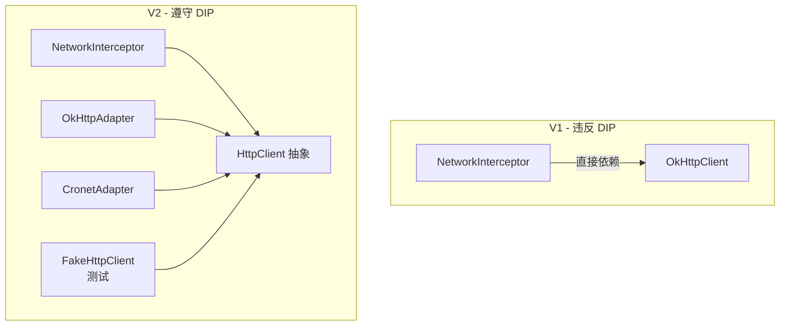

**实施**：

```java
// 抽象 (在框架核心模块, 不依赖任何 HTTP 库)
public interface HttpClient {
    HttpResponse execute(HttpRequest req) throws IOException;
}

public final class HttpRequest {
    public final String url;
    public final Map<String, String> headers;
    public final long timeoutMs;
}

public final class HttpResponse {
    public final int statusCode;
    public final InputStream body;
    public final Map<String, String> headers;
    public final long contentLength;
}

// OkHttp 适配器 (在独立的 adapter 模块, 可选依赖)
public class OkHttpAdapter implements HttpClient {
    private final OkHttpClient delegate;
    public OkHttpAdapter(OkHttpClient delegate) { this.delegate = delegate; }

    @Override
    public HttpResponse execute(HttpRequest req) throws IOException {
        Request okReq = new Request.Builder().url(req.url).build();
        Response okResp = delegate.newCall(okReq).execute();
        return new HttpResponse(
            okResp.code(),
            okResp.body().byteStream(),
            toMap(okResp.headers()),
            okResp.body().contentLength()
        );
    }
}

// Cronet 适配器 (字节跳动 / Google 体系常用)
public class CronetAdapter implements HttpClient { /* ... */ }

// HttpURLConnection 适配器 (零依赖兜底)
public class JdkHttpAdapter implements HttpClient { /* ... */ }

// NetworkInterceptor 现在只依赖 HttpClient 抽象
public class NetworkInterceptor implements Interceptor {
    private final HttpClient http;   // 注入
    public NetworkInterceptor(HttpClient http) { this.http = http; }

    public Bitmap intercept(Chain chain) throws IOException {
        HttpResponse resp = http.execute(buildRequest(chain.request()));
        // ...
    }
}
```

**业务方装配**：

```java
ImageLoader loader = new ImageLoader.Builder()
    // 业务 App 可以传入它已有的 OkHttpClient (复用拦截器/证书/dns)
    .httpClient(new OkHttpAdapter(myAppOkHttpClient))
    // 或者切换到 Cronet
    // .httpClient(new CronetAdapter(cronetEngine))
    .build();
```

**测试**：

```java
HttpClient fake = req -> new HttpResponse(200, new ByteArrayInputStream(testBytes), ...);
ImageLoader loader = new ImageLoader.Builder().httpClient(fake).build();
// 现在可以测试网络层任何场景: 200 / 404 / 超时 / 慢响应 / 中断
```

**这一招的延伸价值**，**Glide 4.x 也走了同一条路**。Glide 早期硬编码 `HttpURLConnection`，4.x 引入 `HttpUrlFetcher` 抽象，并提供 `ok-http3-integration` / `okhttp-integration` 模块作为适配器。

> **DIP 的精髓**：**让你的核心代码不知道它正在用 OkHttp**，核心代码只知道"有个能发 HTTP 请求的东西"。

**§6 阶段成果汇总**：

| 原则 | 重构动作 | 文件数变化 |
|---|---|---|
| SRP | 拆 `ImageRequest` 为 5 个角色 | +4 类 |
| OCP | `WebpDecoder` 即插即用 | +1 类，旧码 0 改 |
| LSP | 统一 `ImageCache.get` 后置条件（不抛异常） | 改 2 文件 |
| ISP | `ImageCache` → `CacheReader/Writer/Evictor` | +2 接口 |
| DIP | OkHttp 耦合解除 → `HttpClient` 抽象 + 适配器 | +3 类 |

**思考题**：
1. SRP 拆出了 `Disposable` 句柄，但状态机 `RequestState` 内嵌在何处？由 `Disposable` 持有还是 `Engine` 持有？两种放法在并发取消场景下有何差异？
2. OCP 的"加 WebP 不改旧码"成立，但**移除 PNG 支持**是否依然零修改？为什么？这个不对称暴露了什么？
3. 我们用 `LSP` 把 `DiskCache` 异常吞掉返回 null，但如果**磁盘满**这种严重错误也吞掉，会不会让框架"沉默地烂掉"？怎么权衡？

---

## 8.重构十二式实战

如果说 §6 的 SOLID 是"**战略调整**"，本节的重构十二式就是"**战术手术**"，**逐个具体动作**，每个都有可见的 diff。

我们挑 8 个对图片框架最具改造价值的手术，**对应第 09 篇的十二式**。

### 07.1 提取方法解码逻辑

V1 的 `DecodeInterceptor` 长这样：

```java
public Bitmap intercept(Chain chain) throws IOException {
    ImageRequest req = chain.request();
    InputStream is = chain.proceed(req);    // 上一层给我字节流
    byte[] header = readHeader(is, 12);
    ImageDecoder dec = null;
    for (ImageDecoder d : decoders) {
        if (d.supports(header)) { dec = d; break; }
    }
    if (dec == null) throw new IOException("no decoder for header: " + Arrays.toString(header));

    BitmapFactory.Options opts = new BitmapFactory.Options();
    opts.inJustDecodeBounds = true;
    InputStream is2 = combine(header, is);
    BitmapFactory.decodeStream(is2, null, opts);

    int sample = 1;
    int w = opts.outWidth, h = opts.outHeight;
    while ((w / sample) > req.targetWidth || (h / sample) > req.targetHeight) sample *= 2;

    BitmapFactory.Options realOpts = new BitmapFactory.Options();
    realOpts.inSampleSize = sample;
    realOpts.inPreferredConfig = Bitmap.Config.RGB_565;

    InputStream is3 = combine(header, is);
    return dec.decode(is3, req.targetWidth, req.targetHeight);
}
```

**坏味道**：单方法 30+ 行，干了 4 件事。

**第 09 篇第一式：提取方法**，按"自然的语义边界"拆：

```java
public Bitmap intercept(Chain chain) throws IOException {
    ImageRequest req = chain.request();
    InputStream is = chain.proceed(req);
    byte[] header = readHeader(is, HEADER_PROBE_SIZE);

    ImageDecoder decoder = selectDecoder(header);          // 提取
    int sampleSize = computeSampleSize(header, is, req);   // 提取
    return decoder.decode(rewind(header, is), req.targetWidth, req.targetHeight);
}

private ImageDecoder selectDecoder(byte[] header) throws IOException {
    for (ImageDecoder d : decoders) if (d.supports(header)) return d;
    throw new IOException("no decoder for header: " + hex(header));
}

private int computeSampleSize(byte[] header, InputStream is, ImageRequest req) throws IOException {
    BitmapFactory.Options probe = new BitmapFactory.Options();
    probe.inJustDecodeBounds = true;
    BitmapFactory.decodeStream(rewind(header, is), null, probe);
    int sample = 1;
    while ((probe.outWidth / sample) > req.targetWidth
        || (probe.outHeight / sample) > req.targetHeight) {
        sample *= 2;
    }
    return sample;
}
```

**改善**：

| 维度 | Before | After |
|---|---|---|
| 主方法行数 | 30+ | 5 |
| 主方法读出意图 | 难 | 一眼："选解码器→算采样→解码" |
| 单元测试 | 整体测 | `selectDecoder` / `computeSampleSize` 各自可独立测 |
| 修改采样算法影响 | 改主方法 | 改 `computeSampleSize` 一处 |

> **提取方法的判断标准是 09 篇说的"**注释即代码**"**，如果你给某段代码加注释 `// 计算采样率`，就把它提成 `computeSampleSize` 方法，注释和方法名同义。

### 07.2 引入参数对象LoadOptions

V2 的 `Builder` 已经攒了 8 个字段：

```java
new ImageRequest.Builder()
    .url(url)
    .size(w, h)
    .placeholder(R.drawable.ph)
    .error(R.drawable.err)
    .priority(Priority.HIGH)
    .skipMemoryCache(false)
    .skipDiskCache(false)
    .timeout(5000)
    .build();
```

未来还会再加：`onlyRetrieveFromCache` / `format` / `crossfadeDuration` / `targetDensity`...

**第 09 篇第二式：引入参数对象**，把"**经常一起出现的参数**"打包：

```java
// LoadOptions: 加载选项 (调度/缓存/超时类参数)
public final class LoadOptions {
    public static final LoadOptions DEFAULT = new Builder().build();

    public final Priority priority;
    public final boolean skipMemoryCache, skipDiskCache;
    public final long timeoutMs;
    public final boolean onlyRetrieveFromCache;

    public static final class Builder { /* ... */ }
}

// DisplayOptions: 显示选项 (UI 类参数)
public final class DisplayOptions {
    public final int placeholderResId, errorResId;
    public final long crossfadeDurationMs;
    public final ScaleType scaleType;
}

// ImageRequest 现在简洁很多
public final class ImageRequest {
    public final String url;
    public final int targetWidth, targetHeight;
    public final List<Transformation> transformations;
    public final LoadOptions loadOptions;
    public final DisplayOptions displayOptions;
}
```

**调用方**：

```java
new ImageRequest.Builder()
    .url(url)
    .size(w, h)
    .loadOptions(LoadOptions.HIGH_PRIORITY_NO_DISK)   // 复用预定义常量
    .displayOptions(new DisplayOptions.Builder()
        .placeholder(R.drawable.ph)
        .crossfade(300)
        .build())
    .build();
```

**额外收益**：可以**预定义常量配置**：

```java
public final class LoadOptions {
    public static final LoadOptions DEFAULT;
    public static final LoadOptions HIGH_PRIORITY_NO_DISK;
    public static final LoadOptions LOW_PRIORITY_FORCE_NETWORK;
    public static final LoadOptions BACKGROUND_PREFETCH;
}
```

，这就把"**配置策略**"沉淀成了**领域语言**，调用方不用重复装配。

### 07.3 用多态替换条件

V0 的"if 阶梯"还残留在 `Transformation` 调用处？在 V1 中我们已经用 `Transformation` 接口干掉了第一层 if，但**调度策略还有第二层 if**：

```java
public class DispatchInterceptor implements Interceptor {
    public Bitmap intercept(Chain chain) throws IOException {
        ImageRequest req = chain.request();
        if (req.url.startsWith("http"))      return dispatchToNetworkPool(chain);
        else if (req.url.startsWith("file")) return dispatchToDiskPool(chain);
        else if (req.url.startsWith("asset"))return dispatchToAssetPool(chain);
        else if (req.url.startsWith("data:image"))return dispatchToInlinePool(chain);
        else throw new IOException("unsupported scheme");
    }
}
```

**第 09 篇第三式：用多态替换条件**，

```java
// 抽象: 调度策略
public interface Dispatcher {
    boolean accepts(ImageRequest req);
    Bitmap dispatch(Interceptor.Chain chain) throws IOException;
}

public class NetworkDispatcher implements Dispatcher {
    public boolean accepts(ImageRequest req) { return req.url.startsWith("http"); }
    public Bitmap dispatch(Chain chain) { return networkPool.submit(...); }
}
public class FileDispatcher    implements Dispatcher { ... }
public class AssetDispatcher   implements Dispatcher { ... }
public class InlineDispatcher  implements Dispatcher { ... }

// 拦截器变成纯查找
public class DispatchInterceptor implements Interceptor {
    private final List<Dispatcher> dispatchers;
    public Bitmap intercept(Chain chain) throws IOException {
        ImageRequest req = chain.request();
        for (Dispatcher d : dispatchers) {
            if (d.accepts(req)) return d.dispatch(chain);
        }
        throw new IOException("no dispatcher for: " + req.url);
    }
}
```

**改善**：

| 维度 | Before | After |
|---|---|---|
| 加新 scheme（如 `content://`） | 改 if 阶梯 | 加新 `Dispatcher` 类 |
| 改某 scheme 调度逻辑 | 全方法重读 | 只看对应类 |
| 调度策略可单独单测 | 难 | 易 |

### 07.4 引入策略变换族

V1 的 `Transformation` 已经是策略模式雏形。V3 把它做扎实，

```java
// 策略接口
public interface Transformation {
    Bitmap apply(Bitmap input);
    String key();          // 用于缓存键签名
}

// 具体策略族
public class CenterCrop      implements Transformation { ... }
public class CircleCrop      implements Transformation { ... }
public class RoundedCorners  implements Transformation {
    private final int radius;
    public RoundedCorners(int radius) { this.radius = radius; }
    public String key() { return "RoundedCorners(" + radius + ")"; }   // 参数计入签名!
    public Bitmap apply(Bitmap in) { /* ... */ }
}
public class BlurTransformation implements Transformation { ... }
public class GrayscaleTransformation implements Transformation { ... }

// 组合策略 (可选): 多策略串联
public class MultiTransformation implements Transformation {
    private final List<Transformation> steps;
    public Bitmap apply(Bitmap in) {
        Bitmap out = in;
        for (Transformation t : steps) {
            Bitmap next = t.apply(out);
            if (next != out) recycleIfPossible(out);   // Bitmap 资源管理
            out = next;
        }
        return out;
    }
    public String key() {
        return "Multi[" + steps.stream().map(Transformation::key).collect(joining(",")) + "]";
    }
}
```

**调用方**：

```java
.transform(new RoundedCorners(8))
.transform(new BlurTransformation(15))
// 或:
.transform(new MultiTransformation(asList(new CenterCrop(), new RoundedCorners(8))))
```

**注意 `key()` 的设计**，它要把**所有影响输出的参数**都序列化进去，否则缓存会串图。这是值对象（§2.4）和策略（这里）联动的关键。

### 07.5 守卫子句替换嵌套

V1 的请求合法性校验：

```java
private void validate(ImageRequest req) {
    if (req != null) {
        if (req.url != null && req.url.length() > 0) {
            if (req.targetWidth >= 0 && req.targetHeight >= 0) {
                if (req.transformations != null) {
                    // 真正的逻辑被嵌在 4 层 if 内
                }
            }
        }
    }
}
```

**第 09 篇第四式：守卫子句**，

```java
private void validate(ImageRequest req) {
    if (req == null) throw new IllegalArgumentException("request is null");
    if (req.url == null || req.url.isEmpty()) throw new IllegalArgumentException("url is empty");
    if (req.targetWidth < 0 || req.targetHeight < 0)
        throw new IllegalArgumentException("invalid size: " + req.targetWidth + "x" + req.targetHeight);
    if (req.transformations == null) throw new IllegalArgumentException("transformations is null");

    // 主逻辑没缩进了
}
```

**好处不是少了几个缩进**，是**意图反转**：原来在说"**满足全部条件才执行**"，现在在说"**任何不满足立刻拒绝**"。后者**更接近人类思维**。

### 07.6 替换魔法数

V0 残留：

```java
public static int MAX_SIZE = 100;             // 100 是什么? 张数? MB?
private static final int HEADER_PROBE = 12;   // 为什么是 12?
realOpts.inPreferredConfig = Bitmap.Config.RGB_565;  // 为什么 RGB_565?
opts.inSampleSize = 8;                        // 8 又是什么?
```

**第 09 篇第五式：常量提取 + 命名注释化**：

```java
// 缓存配置
/** 内存缓存最大容量, 默认占总堆内存的 1/8 */
private static final long DEFAULT_MEMORY_CACHE_SIZE_BYTES = Runtime.getRuntime().maxMemory() / 8;

// 解码配置
/** 文件头探测字节数, 12 字节足够识别所有主流图片格式 (RIFF 12B / PNG 8B / JPEG 3B) */
private static final int IMAGE_HEADER_PROBE_BYTES = 12;

/** 默认位图配置: RGB_565 节省 50% 内存, 但损失透明通道. 含透明度的格式自动升级到 ARGB_8888 */
private static final Bitmap.Config DEFAULT_BITMAP_CONFIG = Bitmap.Config.RGB_565;

/** 最大降采样倍数, 超过会导致严重失真 */
private static final int MAX_DOWN_SAMPLE = 8;
```

**比"少了魔法数"更重要的**，注释保留了**决策背景**：为什么是 1/8、为什么是 12、为什么 RGB_565。这些信息在 V0 里**只存在于设计者脑子里**，离职就丢失。

### 07.7 分解上帝类

V0 的 `ImageManager` 是终极上帝类。V1 拆完之后，**ImageLoader 仍可能是新的小上帝**，如果它什么都管。

**V3 的最终拆分**：

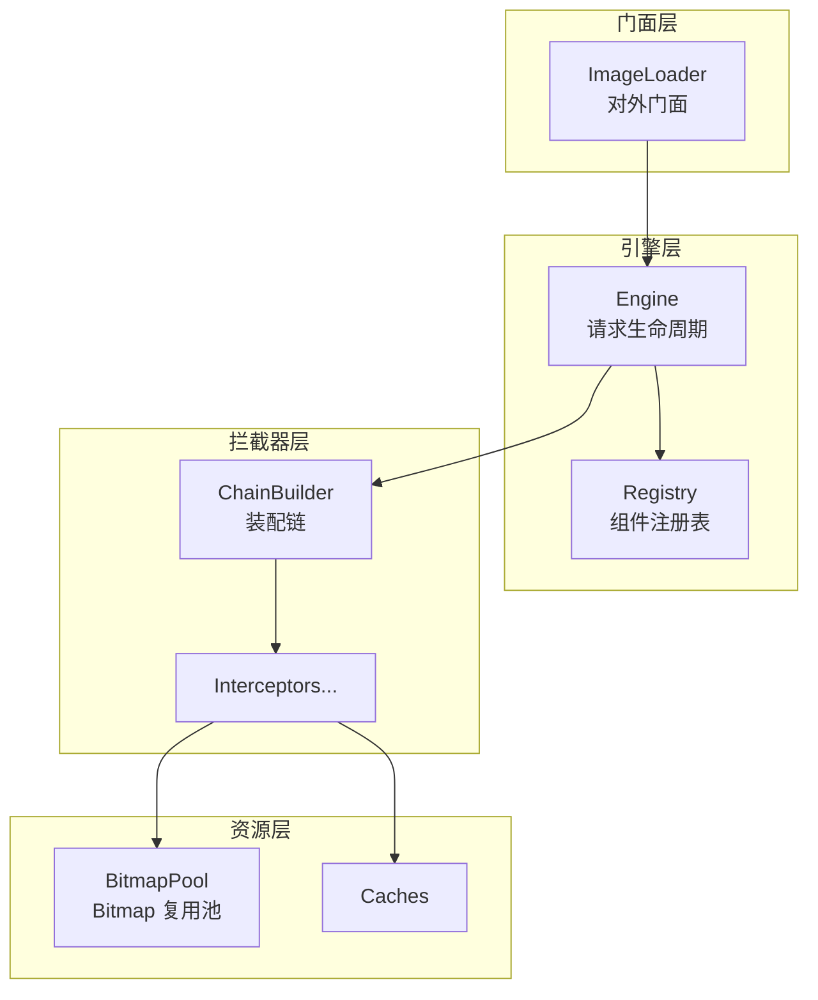

**分解原则（第 09 篇）**：

- **`ImageLoader`** 只负责"接受请求、返回 Disposable"，纯门面
- **`Engine`** 负责"管理活跃请求、做去重、绑定生命周期"
- **`Registry`** 负责"注册中心 + 自动选择实现"
- **`ChainBuilder`** 负责"按配置装配拦截器链"
- **`BitmapPool`** 负责"Bitmap 对象复用"（Glide 的杀手锏，节省 50% GC）

**每个类不超过 300 行**，这是经验阈值，超过就是分解信号。

### 07.8 查找表替换switch

V2 的 `selectDecoder` 还在线性遍历：

```java
private ImageDecoder selectDecoder(byte[] header) {
    for (ImageDecoder d : decoders) if (d.supports(header)) return d;   // O(N)
    throw new IOException(...);
}
```

当 decoder 数量上来（10+ 种格式）+ 高 QPS（列表滑动）时，这成了热点。

**第 09 篇第六式：查找表 / Map 索引**：

```java
public class DecoderRegistry {
    // 按"格式标识"建立索引
    private final Map<ImageFormat, ImageDecoder> byFormat = new HashMap<>();
    private final List<ImageDecoder> fallback = new ArrayList<>();   // 自定义格式兜底

    public void register(ImageDecoder decoder) {
        ImageFormat fmt = decoder.format();
        if (fmt != ImageFormat.UNKNOWN) byFormat.put(fmt, decoder);
        else fallback.add(decoder);
    }

    public ImageDecoder select(byte[] header) {
        ImageFormat fmt = ImageFormat.detect(header);   // 用枚举的 detect 逻辑
        ImageDecoder d = byFormat.get(fmt);
        if (d != null) return d;
        for (ImageDecoder f : fallback) if (f.supports(header)) return f;
        throw new IllegalStateException("no decoder for " + fmt);
    }
}

public enum ImageFormat {
    JPEG, PNG, WEBP, GIF, HEIF, AVIF, UNKNOWN;

    public static ImageFormat detect(byte[] h) {
        if (h.length >= 3 && h[0] == (byte)0xFF && h[1] == (byte)0xD8) return JPEG;
        if (h.length >= 8 && h[0] == (byte)0x89 && h[1] == 'P') return PNG;
        if (h.length >= 12 && h[8] == 'W' && h[9] == 'E') return WEBP;
        // ...
        return UNKNOWN;
    }
}
```

**性能改善**：从 O(N) → O(1)。在列表滑动场景下，**每张图省 50-100 ns** × 几百张 = 可感知的总耗时下降。

**§7 阶段成果汇总**：

| 重构式 | 应用点 | 改善 |
|---|---|---|
| 提取方法 | 解码方法拆 3 段 | 30 行 → 5 行主方法 |
| 引入参数对象 | `LoadOptions` / `DisplayOptions` | 8 字段 → 2 对象 |
| 多态替换条件 | `Dispatcher` 替代 url scheme if | 加 scheme 0 修改 |
| 引入策略 | `Transformation` 族 + `key()` | 缓存签名稳定 |
| 守卫子句 | 4 层 if → 平铺 | 意图反转 |
| 替换魔法数 | 4 处魔法数 → 命名常量 + 注释 | 决策背景沉淀 |
| 分解大类 | `ImageLoader` → 5 类协作 | 每类 ≤ 300 行 |
| 查找表 | Decoder O(N) → O(1) | 性能 + 可读 |

**思考题**：
1. 第 09 篇还有"**封装集合**" / "**降低函数副作用**" / "**用对象替代基本类型**" 等几式我们没用，是因为图片场景不需要，还是有更好的替代？
2. 我们引入了 `LoadOptions.HIGH_PRIORITY_NO_DISK` 这种"预定义组合"，这种做法在 SDK 设计中叫什么？它和 Builder 模式的关系是什么？
3. 查找表把 `select` 从 O(N) 优化到 O(1)，但代价是注册时多了一步分类。**何时这种优化是负收益的？**

---

## 9.可测试性改造

走到这一步，框架"看起来"已经很好了，SOLID 落实、坏味道扫除、上帝类分解。**但有个尴尬的事实**：

**你能给它写一个稳定的单元测试吗？**

试一下你就懂。给 `MemoryCacheInterceptor` 写测试，第一个问题就来了：

```java
@Test
public void should_cache_hit() {
    ImageLoader loader = new ImageLoader.Builder()
        .httpClient(new OkHttpAdapter(...))    // ⚠️ 真网络? 还是 mock?
        .build();
    // ⚠️ Bitmap 怎么造? Android 环境?
    // ⚠️ ImageView.post 异步, 怎么等?
    // ⚠️ 5 秒超时, 单测要等 5 秒?
    // ⚠️ Thread.sleep(100)? 不稳定!
}
```

**第 10 篇说**："**测不动的代码不是设计好的代码，只是看起来好**。" V3 给我们留下了 4 个不可测点：

1. **时间**：状态超时、缓存过期、重试退避都依赖 `System.currentTimeMillis()`
2. **线程**：拦截器跨线程，测试要"等"
3. **网络**：真请求慢且不稳定
4. **平台依赖**：Bitmap / ImageView / Looper 是 Android 框架对象

V4 这一阶段，我们用第 10 篇的工具集**逐项注入**。

### 08.1 注入Clock抽象时间

第一个手术，**所有"时间"都不直接读系统时钟**。

```java
// 抽象
public interface Clock {
    long currentTimeMillis();
    long elapsedRealtimeNanos();

    Clock SYSTEM = new Clock() {
        public long currentTimeMillis() { return System.currentTimeMillis(); }
        public long elapsedRealtimeNanos() { return System.nanoTime(); }
    };
}

// 测试用 Fake
public class FakeClock implements Clock {
    private long now = 0L;
    public long currentTimeMillis() { return now; }
    public long elapsedRealtimeNanos() { return now * 1_000_000L; }
    public void advance(long ms) { now += ms; }       // 测试可控
}
```

**所有依赖时间的地方**改成 `clock.currentTimeMillis()`：

```java
public class MetricsInterceptor implements Interceptor {
    private final Clock clock;            // 注入

    public Bitmap intercept(Chain chain) throws IOException {
        long start = clock.currentTimeMillis();
        try { return chain.proceed(chain.request()); }
        finally { metrics.record(clock.currentTimeMillis() - start); }
    }
}
```

**测试**：

```java
@Test
public void metrics_should_record_correct_latency() {
    FakeClock clock = new FakeClock();
    MetricsInterceptor mi = new MetricsInterceptor(clock, metrics);

    Chain chain = mockChain(req -> {
        clock.advance(123);            // 模拟"耗时 123 ms"
        return testBitmap;
    });

    mi.intercept(chain);
    assertThat(metrics.lastLatency()).isEqualTo(123L);   // 精确!
}
```

**对比"真实时钟"测试**：

| 维度 | 真实时钟 | FakeClock |
|---|---|---|
| 是否稳定 | 否（CPU 抖动） | 是 |
| 是否快 | 否（要 sleep 等真实时间） | 是（亚毫秒） |
| 边界场景 | 难（让请求"刚好超时"很难） | 易（advance 到精确时刻） |

### 08.2 注入Scheduler抽象线程

第二个手术，**消灭裸线程，所有调度走 `Scheduler` 抽象**。

```java
public interface Scheduler {
    void execute(Runnable task);
    void schedule(Runnable task, long delayMs);
    void cancel(Runnable task);

    // 三种生产实现
    Scheduler IO_POOL = new ExecutorScheduler(Executors.newFixedThreadPool(4));
    Scheduler MAIN    = new MainHandlerScheduler();
    Scheduler IMMEDIATE = task -> task.run();   // 同步执行 (测试用)
}

// 测试用: 可控调度
public class TestScheduler implements Scheduler {
    private final Queue<Runnable> queue = new ArrayDeque<>();

    public void execute(Runnable task) { queue.offer(task); }   // 不立即跑
    public void schedule(Runnable task, long delay) { queue.offer(task); }

    public void runAll() {                  // 测试主动驱动
        while (!queue.isEmpty()) queue.poll().run();
    }
    public void runOne() {
        if (!queue.isEmpty()) queue.poll().run();
    }
    public int pending() { return queue.size(); }
}
```

**所有 `Interceptor` / `Engine` / `Dispatcher`** 改成接收 `Scheduler` 注入。

**测试**：

```java
@Test
public void should_cancel_inflight_request_when_image_view_recycled() {
    TestScheduler ioScheduler = new TestScheduler();
    ImageLoader loader = builder()
        .ioScheduler(ioScheduler)
        .mainScheduler(Scheduler.IMMEDIATE)   // 主线程同步
        .build();

    ImageView iv = mockImageView();
    Disposable d1 = loader.load(req("url1"), new ImageViewTarget(iv));
    Disposable d2 = loader.load(req("url2"), new ImageViewTarget(iv));   // 复用 iv

    assertThat(ioScheduler.pending()).isEqualTo(1);   // 应自动取消 d1, 只剩 d2
    assertThat(d1.isDisposed()).isTrue();
}
```

**关键点**：测试**完全同步、可重现、亚毫秒**，这就是第 10 篇说的"**让时间和并发服从你的指挥**"。

### 08.3 注入Network抽象网络

§6.5 已经把 `HttpClient` 抽象出来了，这里直接受益：

```java
public class FakeHttpClient implements HttpClient {
    private final Map<String, Function<HttpRequest, HttpResponse>> rules = new HashMap<>();

    public FakeHttpClient when(String url, Function<HttpRequest, HttpResponse> handler) {
        rules.put(url, handler);
        return this;
    }

    public HttpResponse execute(HttpRequest req) throws IOException {
        Function<HttpRequest, HttpResponse> h = rules.get(req.url);
        if (h == null) throw new IOException("no rule for: " + req.url);
        return h.apply(req);
    }

    // 预设场景工厂
    public static HttpResponse ok(byte[] bytes) { return new HttpResponse(200, ...); }
    public static HttpResponse notFound()       { return new HttpResponse(404, ...); }
    public static HttpResponse timeout() throws IOException { throw new SocketTimeoutException(); }
    public static HttpResponse slow(byte[] bytes, long delayMs, FakeClock clock) {
        clock.advance(delayMs);
        return ok(bytes);
    }
}
```

**测试场景大爆发**：

```java
FakeHttpClient http = new FakeHttpClient()
    .when("https://normal.png",   req -> FakeHttpClient.ok(jpegBytes))
    .when("https://slow.png",     req -> FakeHttpClient.slow(jpegBytes, 3000, fakeClock))
    .when("https://broken.png",   req -> FakeHttpClient.notFound())
    .when("https://flaky.png",    req -> {
        if (counter.incrementAndGet() < 3) throw new IOException("transient");
        return FakeHttpClient.ok(jpegBytes);    // 第 3 次成功 - 测重试
    });
```

### 08.4 五个高价值单测

注入做完了，第 10 篇说**"现在写测试是享受"**。挑 5 个关键场景：

#### 测试 1：内存缓存命中，0 网络

```java
@Test
public void mem_cache_hit_skips_network() {
    FakeHttpClient http = new FakeHttpClient();   // 故意不注册任何规则 - 一访问就抛
    ImageLoader loader = builder().httpClient(http).build();

    loader.load(req("url"), tgt).await();              // 第一次 - 应该失败
    loader.cache().put(key("url"), testBitmap);        // 手动塞缓存
    Bitmap b = loader.load(req("url"), tgt).await();   // 第二次 - 应命中, 不访问 http
    assertThat(b).isSameAs(testBitmap);
}
```

#### 测试 2：列表复用自动取消

```java
@Test
public void rebind_image_view_cancels_previous_request() {
    TestScheduler io = new TestScheduler();
    ImageView iv = mockImageView();

    Disposable d1 = loader.load(req("u1"), new ImageViewTarget(iv));
    Disposable d2 = loader.load(req("u2"), new ImageViewTarget(iv));

    assertThat(d1.isDisposed()).isTrue();        // d1 自动取消
    assertThat(io.pending()).isEqualTo(1);       // 池里只剩 d2
}
```

**这是 V0 事故根因的回归测试**，以后任何改动如果引入了 V0 同款 bug，CI 会立刻红。

#### 测试 3：同 url 并发去重

```java
@Test
public void concurrent_same_url_only_one_network_call() {
    AtomicInteger calls = new AtomicInteger();
    FakeHttpClient http = new FakeHttpClient().when("https://x.png", req -> {
        calls.incrementAndGet();
        return FakeHttpClient.ok(jpegBytes);
    });
    ImageLoader loader = builder().httpClient(http).build();

    // 10 个并发请求同一 url
    List<CompletableFuture<Bitmap>> futures = IntStream.range(0, 10)
        .mapToObj(i -> CompletableFuture.supplyAsync(() -> loader.load(req("https://x.png")).await()))
        .collect(toList());
    futures.forEach(CompletableFuture::join);

    assertThat(calls.get()).isEqualTo(1);   // 只有 1 次真实网络调用!
}
```

#### 测试 4：弱网重试

```java
@Test
public void retry_on_transient_failure() {
    AtomicInteger attempts = new AtomicInteger();
    FakeHttpClient http = new FakeHttpClient().when("https://flaky.png", req -> {
        if (attempts.incrementAndGet() < 3) throw new IOException("transient");
        return FakeHttpClient.ok(jpegBytes);
    });

    Bitmap b = loader.load(req("https://flaky.png")).await();
    assertThat(attempts.get()).isEqualTo(3);
    assertThat(b).isNotNull();
}
```

#### 测试 5：缓存淘汰策略

```java
@Test
public void lru_evicts_oldest_when_over_capacity() {
    MemoryCache cache = new LruMemoryCache(3 * BMP_SIZE);   // 容量 3 张
    cache.put(key("a"), bmpA);
    cache.put(key("b"), bmpB);
    cache.put(key("c"), bmpC);
    cache.get(key("a"));                  // a 变最近使用
    cache.put(key("d"), bmpD);            // 触发淘汰

    assertThat(cache.get(key("a"))).isNotNull();   // a 还在
    assertThat(cache.get(key("b"))).isNull();      // b 被淘汰 (最久未用)
    assertThat(cache.get(key("c"))).isNotNull();
    assertThat(cache.get(key("d"))).isNotNull();
}
```

### 08.5 录制式调度器

最后一个杀手级技巧，**`RecordingScheduler`** 用来验证"事件顺序"：

```java
public class RecordingScheduler implements Scheduler {
    private final List<String> events = new ArrayList<>();

    public void execute(Runnable task) {
        events.add("EXEC@" + task.getClass().getSimpleName());
        task.run();
    }
    public void schedule(Runnable task, long delay) {
        events.add("SCHEDULE+" + delay + "@" + task.getClass().getSimpleName());
    }
    public List<String> trace() { return events; }
}
```

**测试**：

```java
@Test
public void cache_miss_should_go_disk_then_network() {
    RecordingScheduler s = new RecordingScheduler();
    ImageLoader loader = builder().ioScheduler(s).build();

    loader.load(req("https://x.png"), tgt).await();

    assertThat(s.trace()).containsExactly(
        "EXEC@MemoryCacheCheck",
        "EXEC@DiskCacheCheck",
        "EXEC@NetworkFetch",
        "EXEC@Decode",
        "EXEC@Transform"
    );
}
```

**这是第 10 篇的"行为级测试"**，不仅校验**结果**，更校验**过程**。当将来有人改了拦截器顺序，**测试会立刻发现**。

**§8 阶段成果汇总**：

| 注入点 | 抽象 | 测试用 Fake |
|---|---|---|
| 时间 | `Clock` | `FakeClock`（可 advance） |
| 线程 | `Scheduler` | `TestScheduler`（手动驱动）+ `RecordingScheduler`（追踪事件） |
| 网络 | `HttpClient` | `FakeHttpClient`（规则化响应） |
| 平台 | `Target` 接口 | 内存/Mock Target 替换 ImageView |

**测试矩阵覆盖**：

```
        ┌── 命中场景 ──── 测试1
缓存层 ┼── 淘汰场景 ──── 测试5
        └── 双层切换 ──── 测试 5(扩展)

        ┌── 复用取消 ──── 测试2 ⭐ V0 事故回归
调度层 ┼── 并发去重 ──── 测试3
        └── 顺序追踪 ──── §8.5

        ┌── 慢响应 ────── 测试4 (slow)
网络层 ┼── 失败重试 ──── 测试4 ⭐
        └── 错误码 ────── 测试4 (404)
```

**思考题**：
1. `Scheduler.IMMEDIATE` 让任务在调用线程同步执行，这等价于"**没有调度**"。在测试时方便，但生产中是否有合法用途？
2. `FakeClock.advance` 在多线程测试中会出问题吗？为什么 RxJava 的 `TestScheduler` 是单线程模型？
3. 我们的 `RecordingScheduler` 记录的是"被调度的任务"，但有一些 bug 是"**应该被调度但没被调度**"，怎么用测试捕获？

---

## 10.V4阶段小结

V0 → V4 的全景：

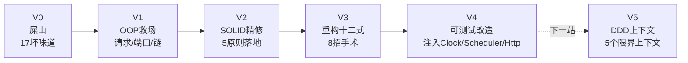

**到目前为止的"内功消耗表"**：

| 篇章 | 应用次数 | 标志性应用点 |
|---|---|---|
| 02 封装 | ★★★ | `ImageRequest` / 状态机 / `CacheKey` |
| 03 接口 vs 抽象类 | ★★ | `ImageSource` + `AbstractImageSource` |
| 04 面向接口编程 | ★★★ | 三大端口 + Registry |
| 05 组合优于继承 | ★★★ | 拦截器链（核心架构） |
| 06 设计原则 | ★★ | DIP 解 OkHttp |
| 07 SOLID | ★★★ | 五原则各对应一处具体重构 |
| 08 反模式 | ★★ | 17 处坏味道扫除 14 处 |
| 09 重构十二式 | ★★★ | 8 招手术 |
| 10 可测试性 | ★★★ | 注入 Clock/Scheduler/Http + 5 单测 |
| 11 DDD | ☆ | 仅用了值对象（CacheKey）， V5 主场 |

**剩下的事**，

V5 阶段（下一节）我们要做最有意思的一步：用 **DDD 的限界上下文**给整个框架画一张"**领域地图**"。这一步**绝大多数图片库都没做**，但它能解释一个重要现象，

> **为什么 Glide 把"变换"做成了上下文，而 SDWebImage 没有？**
> **为什么 Coil 4.0 重写了"调度上下文"，而老版本把它揉在 Engine 里？**
> **为什么 Fresco 把"内存管理"做成独立上下文，而其他库都依附于缓存？**

这些设计差异，**用 OOP 的语言只能说"风格不同"**，但**用 DDD 的语言能说出"上下文边界不同导致的演化路径不同"**。

最后一批我们将一次性产出 §9（DDD 上下文）+ §10（全景类图与 11 篇映射）+ §11（终极思考题）。

---

## 11.V5用DDD重塑边界

### 10.1 为何还要再切一刀

走到 V4，绝大多数工程师会说："**够了，已经很好了**。" 但请看下面这个场景，

> **业务方需求**："我们要给 ToB 客户开放一个**只读型 SDK**，他们只用看图，不允许写缓存、不允许配置变换、不允许改调度策略。"

如果你是 V4 的维护者，你会怎么做？翻一下你能想到的方案：

- **方案 A**：复制一份 `ImageLoader`，删掉所有写入接口，**代码翻倍**
- **方案 B**：在 `ImageLoader` 里加一堆 `if (mode == READ_ONLY)`，**回到 V0**
- **方案 C**：把 `ImageLoader` 拆成多个 SDK 模块，按客户拼装，**但拆的边界是什么？**

**问题的本质不是"代码怎么写"，而是"模块边界在哪"**。V4 之前我们都在解决"**类内部怎么写**"的问题，SOLID、坏味道、重构都聚焦于**类层面**。但**类与类如何聚集成模块**、**模块与模块如何对话**，这是**第 11 篇 DDD** 的主场。

**第 11 篇的核心一问**："**这段代码属于谁的领地？谁有权改它？**"

把这个问题抛回我们的图片框架，

| 候选问题 | V4 的答案 | DDD 视角下的真正答案 |
|---|---|---|
| 谁定义"什么是合法 URL"？ | `ImageRequest` 的 `validate` 方法 | 这是**加载上下文**的领域规则 |
| 谁决定"缓存命中算不算成功"？ | 拦截器埋的统计 | 这是**监控上下文**的领域事件 |
| 谁负责"Bitmap 解码失败如何降级"？ | `DecodeInterceptor` 里的 catch | 这是**解码上下文**的策略 |
| 谁负责"圆角与高斯模糊参数语义"？ | `Transformation` 实现类 | 这是**变换上下文**的语义边界 |
| 谁负责"内存压力下淘汰谁"？ | `LruMemoryCache` 的算法 | 这是**缓存上下文**的领域决策 |

**5 个不同的"谁"**，意味着**至少 5 个限界上下文**。每个上下文有自己的：
- 通用语言（Ubiquitous Language）
- 领域模型（Entity / Value Object / Aggregate）
- 边界（什么进得来、什么出得去）
- 演化节奏（独立升级）

**这就是 V5 要做的事**。

### 10.2 五个限界上下文

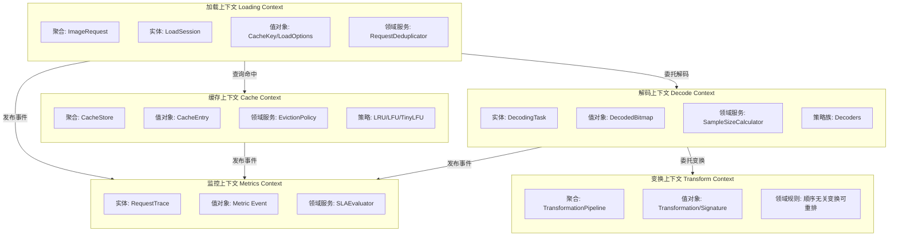

**为什么是这 5 个？** 用第 11 篇的"**领域专家访谈法**"反推：

| 上下文 | 通用语言（专家会说的话） | 不属于它的话 |
|---|---|---|
| **加载** | "请求"、"会话"、"取消"、"优先级"、"去重" | "采样率"、"圆角半径"、"LRU" |
| **缓存** | "命中"、"淘汰"、"容量"、"过期"、"TTL" | "解码"、"OkHttp" |
| **解码** | "采样率"、"位图配置"、"格式探测"、"降采样" | "拦截器顺序" |
| **变换** | "圆角"、"高斯模糊"、"旋转"、"签名" | "网络重试" |
| **监控** | "事件"、"耗时"、"P99"、"SLA"、"异常分类" | "Bitmap 复用" |

**这 5 类语言彼此正交**，一个"采样率"专家不必懂"LRU"，一个"P99"专家不必懂"圆角半径"。**正交语言 = 限界上下文边界**。

#### 加载上下文核心代码

```java
// 加载上下文 (Loading Context)
package com.xx.image.loading;

// 聚合根: ImageRequest
public final class ImageRequest {
    private final RequestId id;
    private final RequestUrl url;          // 值对象: URL 合法性自封装
    private final TargetSize size;
    private final LoadOptions options;
    // 不暴露内部状态, 只暴露行为
    public CacheKey toCacheKey(SignatureRule rule) { ... }
    public boolean canBeDeduplicatedWith(ImageRequest other) { ... }
}

// 实体: LoadSession (代表一次"加载会话")
public final class LoadSession {
    private final RequestId requestId;
    private final SessionState state;     // 状态机
    private final List<DomainEvent> events = new ArrayList<>();

    public void onCacheHit(CacheEntry entry)      { state.transitTo(SUCCEEDED); raise(new CacheHitEvent(...)); }
    public void onCacheMiss()                     { state.transitTo(NETWORK_FETCHING); raise(new CacheMissEvent(...)); }
    public void onNetworkSuccess(byte[] bytes)    { state.transitTo(DECODING); raise(new NetworkSuccessEvent(...)); }
    public void onDecodeSuccess(Bitmap bmp)       { state.transitTo(SUCCEEDED); raise(new DecodeSuccessEvent(...)); }
    public void onFailed(Throwable cause)         { state.transitTo(FAILED); raise(new RequestFailedEvent(...)); }

    public List<DomainEvent> pollEvents() { ... }    // 让外层订阅事件
}

// 领域服务: 请求去重
public class RequestDeduplicator {
    private final Map<CacheKey, LoadSession> inflight = new ConcurrentHashMap<>();

    public Optional<LoadSession> joinIfInflight(ImageRequest req, SignatureRule rule) {
        return Optional.ofNullable(inflight.get(req.toCacheKey(rule)));
    }
}
```

#### 缓存上下文核心代码

```java
package com.xx.image.cache;

// 聚合根: CacheStore
public final class CacheStore {
    private final EvictionPolicy policy;     // 策略对象
    private final long capacityBytes;
    private final ConcurrentMap<CacheKey, CacheEntry> entries;

    public Optional<CacheEntry> get(CacheKey key) { /* 命中 -> 通知 policy */ }

    public void put(CacheKey key, CacheEntry entry) {
        while (totalSize() + entry.sizeBytes > capacityBytes) {
            CacheKey victim = policy.selectVictim(entries);
            evict(victim);
        }
        entries.put(key, entry);
        policy.onPut(key);
    }
}

// 值对象: CacheEntry
public final class CacheEntry {
    public final Bitmap bitmap;
    public final long sizeBytes;
    public final long createdAtMs;
    public final long lastAccessedAtMs;
    public final Signature signature;        // 来自变换上下文的签名
}

// 策略: 淘汰策略可独立演化
public interface EvictionPolicy {
    CacheKey selectVictim(Map<CacheKey, CacheEntry> entries);
    void onPut(CacheKey key);
    void onAccess(CacheKey key);
}
public class LruEvictionPolicy   implements EvictionPolicy { ... }
public class LfuEvictionPolicy   implements EvictionPolicy { ... }
public class TinyLfuEvictionPolicy implements EvictionPolicy { ... }   // 高级
```

#### 变换上下文核心代码

```java
package com.xx.image.transform;

// 聚合根: TransformationPipeline (一组变换的有序集合)
public final class TransformationPipeline {
    private final List<Transformation> steps;

    // 领域规则: 顺序无关的变换可以重排以优化性能
    public TransformationPipeline optimize() {
        // 例: blur 是逐像素操作, 与 crop 顺序敏感; 但 grayscale 与 blur 顺序无关
        return new TransformationPipeline(reorderForCacheLocality(steps));
    }

    public Bitmap apply(Bitmap input) { ... }

    // 领域规则: 签名 = 所有 Transformation.key() 拼接
    // 任何参数变化都必须反映在签名上, 否则会串图 (V0 事故根因 #13)
    public Signature signature() {
        return new Signature(steps.stream().map(Transformation::key).collect(joining("|")));
    }
}

public final class Signature {
    private final String value;
    @Override public boolean equals(Object o) { /* 全字段相等 */ }
    @Override public int hashCode()           { /* 全字段哈希 */ }
}
```

**这一拆，立刻看到 V0 事故 #13"缓存键错"的根本原因**，**它是变换上下文的领域规则被泄漏到了缓存键的拼装代码里**。V0 写得 hack（直接用 url 当 key），V1-V4 修复了表象（CacheKey 全字段），但**只有 V5 把它归位到正确的上下文**，签名是变换上下文的产出。

### 10.3 上下文映射与防腐

5 个上下文如何对话？这是第 11 篇的"**上下文映射图（Context Map）**"，

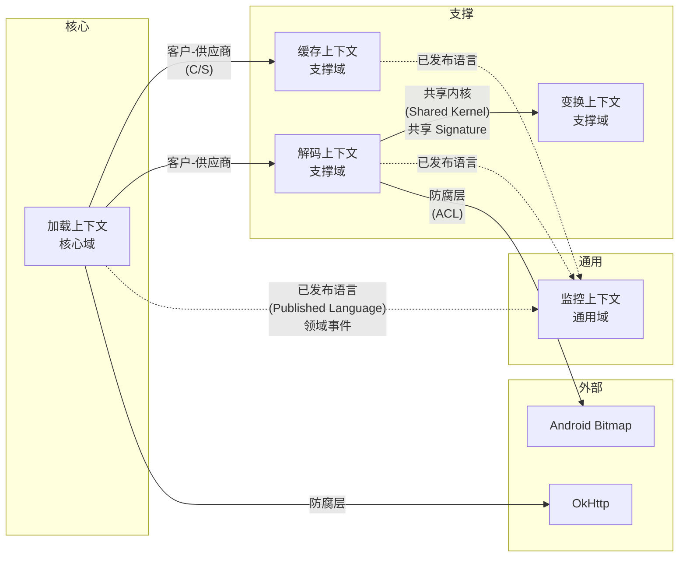

**关键关系类型解释**：

#### 客户-供应商关系（C/S）

加载上下文是**客户**，缓存上下文是**供应商**，加载方提需求，缓存方有义务满足，但**双方协议明确**：

```java
// 加载上下文调用缓存上下文 - 通过明确定义的契约接口
package com.xx.image.loading;

public interface CacheGateway {           // 加载方定义的"我需要什么"
    Optional<Bitmap> tryLoad(CacheKey key);
    void store(CacheKey key, Bitmap bmp, long sizeBytes);
}

// 缓存方实现适配
package com.xx.image.cache.adapter;

public class CacheStoreAdapter implements CacheGateway {  // 防腐层
    private final CacheStore store;       // 缓存上下文的内部聚合根
    public Optional<Bitmap> tryLoad(CacheKey key) {
        return store.get(key).map(CacheEntry::getBitmap);
    }
}
```

**好处**：加载上下文**不知道** `CacheStore` / `CacheEntry` / `EvictionPolicy` 的存在，它只知道 `CacheGateway`。**缓存上下文的内部重构（比如换成 TinyLFU）不会泄漏到加载上下文**。

#### 共享内核（Shared Kernel）

解码上下文与变换上下文**共享 `Signature` 这一概念**，两边都需要它来生成缓存键。这种情况下用**共享内核**，把 `Signature` 提取到一个独立的小模块：

```
com.xx.image.shared/
    Signature.java          ← 双方都依赖它
    CacheKey.java
```

**纪律**：共享内核里的代码**修改需要双方同意**，这是 DDD 强加的"团队契约"。

#### 已发布语言（Published Language）

监控上下文订阅其他四个上下文的**领域事件**：

```java
package com.xx.image.shared.events;

// 已发布语言: 跨上下文统一的事件协议
public abstract class DomainEvent {
    public final String contextName;     // "loading" / "cache" / "decode" / "transform"
    public final String eventType;       // "CacheHit" / "DecodeFailed" / ...
    public final long occurredAtMs;
    public final Map<String, Object> payload;
}

public class CacheHitEvent       extends DomainEvent { ... }
public class CacheMissEvent      extends DomainEvent { ... }
public class DecodeStartedEvent  extends DomainEvent { ... }
public class DecodeFailedEvent   extends DomainEvent { ... }
public class TransformAppliedEvent extends DomainEvent { ... }

// 监控上下文统一订阅
package com.xx.image.metrics;

public class MetricsAggregator implements DomainEventListener {
    public void onEvent(DomainEvent event) {
        switch (event.eventType) {
            case "CacheHit"  -> incCounter("image.cache.hit", event.contextName);
            case "CacheMiss" -> incCounter("image.cache.miss");
            case "DecodeFailed" -> recordError("image.decode.fail", event);
            // ...
        }
    }
}
```

**这就是真正的"可观测性架构"**，监控不是塞在每个拦截器里的 `metrics.record()`，而是**通过领域事件总线统一收口**。

#### 防腐层（Anticorruption Layer）

OkHttp 和 Android Bitmap 是**外部系统**，它们的概念（`Response.body().byteStream()`, `Bitmap.recycle()`）**不应污染我们的领域模型**。在 §6.5 我们已经做了 `HttpClient` 适配器，这就是防腐层的雏形。V5 把它升级为完整的**防腐层包**：

```
com.xx.image.acl.okhttp/   ← 防腐层
    OkHttpAdapter.java
    OkResponseToHttpResponse.java
com.xx.image.acl.android/
    AndroidBitmapAdapter.java
    BitmapPoolAdapter.java
```

**防腐层的纪律**：**防腐层的代码可以脏，但不能让脏渗透进领域**。比如 OkHttp 的 `Response` 关闭时机很 tricky，这种坑全部封死在适配器里，**领域代码看到的 `HttpResponse` 是干净的**。

### 10.4 领域事件串联协作

把上下文画完，关键是**让它们跑起来**，靠的就是**领域事件总线**。

```java
// 简易事件总线 (生产环境可换 Guava EventBus / RxJava Subject)
public interface DomainEventBus {
    void publish(DomainEvent event);
    Disposable subscribe(Class<? extends DomainEvent> type, DomainEventListener listener);
}

// 一次完整的"加载流程"用领域事件串起来
public class ImageLoadingOrchestrator {
    private final DomainEventBus bus;
    private final CacheGateway cache;
    private final DecodeGateway decoder;

    public void load(ImageRequest req, Target target) {
        LoadSession session = LoadSession.start(req);
        bus.publish(new RequestStartedEvent(session.id(), req));

        // 1. 查缓存
        Optional<Bitmap> cached = cache.tryLoad(req.toCacheKey(/*rule*/));
        if (cached.isPresent()) {
            session.onCacheHit(new CacheEntry(cached.get(), ...));
            bus.publish(new CacheHitEvent(session.id()));
            target.onResourceReady(cached.get());
            return;
        }

        session.onCacheMiss();
        bus.publish(new CacheMissEvent(session.id()));

        // 2. 网络 + 解码
        decoder.decode(req).subscribe(
            bitmap -> {
                session.onDecodeSuccess(bitmap);
                bus.publish(new DecodeSuccessEvent(session.id(), bitmap));
                cache.store(req.toCacheKey(/*rule*/), bitmap, sizeOf(bitmap));
                target.onResourceReady(bitmap);
            },
            err -> {
                session.onFailed(err);
                bus.publish(new RequestFailedEvent(session.id(), err));
                target.onLoadFailed(null, err);
            }
        );
    }
}
```

**领域事件带来的真正威力**，**新需求几乎不动核心代码**：

| 新需求 | V4 时代怎么做 | V5 时代怎么做 |
|---|---|---|
| 加 APM 上报 | 在拦截器里埋点 | 订阅领域事件 ✅ |
| 加灰度日志 | 加 if 配置开关 | 注册一个事件监听器 ✅ |
| 加流控（同 url 限流） | 改去重逻辑 | 监听 `RequestStartedEvent` 拦截 ✅ |
| 加 A/B 测试 | 改业务调用方 | 监听事件 + 路由 ✅ |
| 加风控（屏蔽某些 url） | 改 NetworkInterceptor | 监听 `RequestStartedEvent` 拒绝 ✅ |

**这就是第 11 篇说的"用 DDD 思考演化"**，**把"未来未知的扩展点"留在事件总线上，而不是核心流程里**。

### 10.5 三大库的对照分析

回到 §10.1 提的开篇问题，为什么三大主流图片库的设计差异这么大？用 DDD 视角解释一遍：

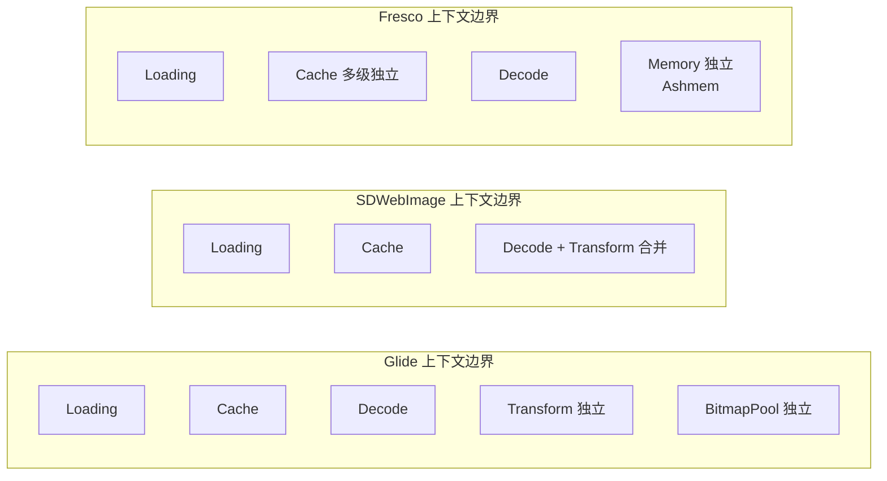

| 库 | 限界上下文划分 | 演化能力 | 历史性能特征 |
|---|---|---|---|
| **Glide** | 5 个（加 BitmapPool 独立） | 加 GIF 支持、加 WebP、加视频帧，**0 修改核心** | Bitmap 复用极致，GC 压力小 |
| **SDWebImage** | 3 个（解码与变换合并） | 加新格式容易，**但加新变换会触碰解码上下文** | iOS 早期内存模型，GC 不敏感 |
| **Fresco** | 5 个（Memory 上下文独立） | 内存压力下可单独降级，这是 Facebook 大图墙的需求 | Ashmem 独立堆，避开 Java Heap OOM |

**结论**，**没有"对的设计"，只有"对的上下文边界"**。三大库的边界差异**直接由它们解决的核心问题决定**：

- Glide 关心**列表滑动 GC**（解决 Android 早期低内存机型卡顿）→ 把 BitmapPool 提升为一等公民
- SDWebImage 关心**iOS 简洁 API**（少即是多）→ 合并相近上下文
- Fresco 关心**超大图避免 OOM**（Facebook 大图墙）→ 把 Memory 抽离到 Ashmem

**这就是第 11 篇真正想教会的事**，**架构是问题的镜像**。当你接手一个新项目，先问"**真正的问题是什么**"，再画上下文边界，**而不是套别人的边界**。

**§10 阶段成果汇总**：

| 维度 | V4 | V5 |
|---|---|---|
| 模块边界 | 类/接口层面 | 限界上下文层面 |
| 跨模块对话 | 直接调用 | 防腐层 + 已发布语言 |
| 扩展机制 | 拦截器（流程级） | 领域事件（语义级） |
| 上下文独立演化 | 受限 | 完全独立（独立部署可期） |
| 团队边界 | 同一团队 | 5 个上下文 = 5 个潜在子团队 |

**思考题**：

1. 我们把"监控上下文"定为**通用域**，如果某天监控演进出"实时风控"能力（基于事件总线发现可疑加载行为），它会从通用域上升为**核心域**吗？这种角色变化在 DDD 里如何应对？
2. 加载上下文与缓存上下文用了 **C/S 关系**，但如果某天缓存团队希望"主动通知加载方'你的缓存即将过期，是否预热'"，C/S 关系还成立吗？需要换成什么？
3. 共享内核 `Signature` 让解码与变换两个上下文耦合，**这是设计味道还是必要妥协**？什么场景下应该把共享内核拆掉？

---

## 12.全景类图与篇章映射

### 11.1 V5终极架构全景

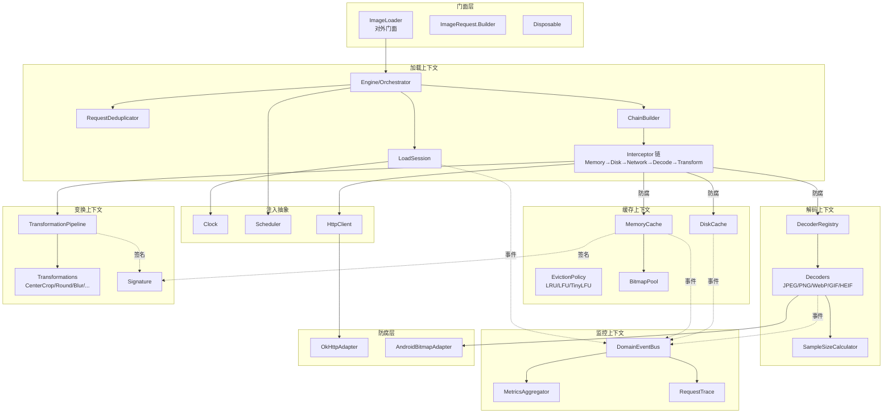

### 11.2 按图索骥十一篇映射

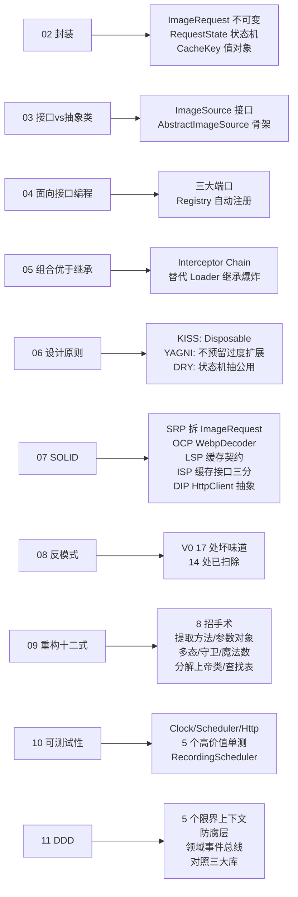

**详细映射表（"按图索骥"使用指南）**：

| 当你想做... | 翻回这一篇 | 在本篇的什么地方 |
|---|---|---|
| 设计一个新值对象（比如 `Url`） | **02** | §2.4 `CacheKey` 设计 |
| 选接口还是抽象类 | **03** | §3.3 `ImageSource` vs `AbstractImageSource` |
| 决定模块对外暴露什么 | **04** | §3.2 三大端口 |
| 看到一堆相似类要合并 | **05** | §4.1-4.2 拦截器链 |
| 评估一段代码是否过度设计 | **06** | §10 KISS/YAGNI 取舍 |
| 给某个类找出修改理由 | **07** | §6.1 SRP 五拨人评估法 |
| 加新功能担心改坏旧的 | **07** | §6.2 OCP WebP 演练 |
| 接口实现互不兼容 | **07** | §6.3 LSP 缓存契约统一 |
| 接口方法太多想拆 | **07** | §6.4 ISP 三分缓存 |
| 想替换底层依赖 | **07** | §6.5 DIP HttpClient |
| 看到 30 行长方法 | **09** | §7.1 提取方法 |
| 看到一堆相关参数 | **09** | §7.2 参数对象 |
| 看到 if/switch 阶梯 | **09** | §7.3/7.8 多态/查找表 |
| 想给历史代码加测试 | **10** | §8 注入三件套 |
| 模块边界乱了 | **11** | §10.2 五个上下文 |
| 想做架构演化 | **11** | §10.4 领域事件 |
| 想理解开源库设计差异 | **11** | §10.5 三大库对照 |

### 11.3 演进路径回望

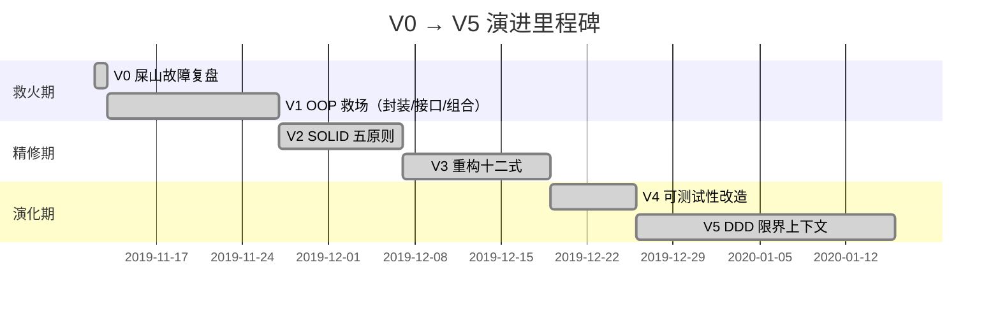

**6 个版本，65 天的虚构时间线**，但每一步都对应**真实工程中你会遇到的拐点**：

- V0→V1：**着火了**，先用 OOP 把架子搭对（"能跑且优雅"）
- V1→V2：**业务方提需求**，发现旧设计有缺口（SOLID 五原则给方向）
- V2→V3：**代码味道堆积**，做系统性手术（重构十二式）
- V3→V4：**需要回归测试**，把不可测点逐个注入（可测试性改造）
- V4→V5：**团队规模扩大**，需要明确边界与协作协议（DDD 重塑）

**这五个拐点几乎是所有中等规模框架的必经之路**。当你进入一个项目，识别它**正处在哪个拐点**，比"该用什么模式"重要 100 倍。

---

## 13.终极思考题

最后留给读者三道**贯穿 11 篇 + 12 篇所有内功**的开放题，没有标准答案，但每一道都能写一篇博客。

### 12.1 跨平台抽象题

> **背景**：业务方要求把这套图片框架**同时供 Android / iOS / Web / 小程序使用**。当前 V5 已经把 OkHttp 和 Bitmap 封进了防腐层。
>
> **问题**：
> 1. 哪些上下文应该**完全跨平台共享**（核心 + 算法）？
> 2. 哪些上下文需要**每平台独立实现**（解码、内存管理）？
> 3. 你会用什么技术栈实现共享部分？KMM？C++？纯描述性配置？
> 4. 设计一组**跨平台事件协议**，让监控上下文能**同时收到 4 个平台的事件**。
>
> **进阶**：如果某平台没有 `BitmapPool` 概念（比如 Web 的 ImageBitmap），事件协议中的"位图复用"事件该如何处理？

### 12.2 画质降级题

> **背景**：弱网用户看不清图，但加载快；强网用户希望看高清，但等不及。**业务方希望"渐进式画质"**，先出低清版本占位，再下高清版本替换。
>
> **问题**：
> 1. 这个需求会**触动哪几个上下文**？需要修改它们的领域模型吗？
> 2. "低清→高清"的状态切换，在 `LoadSession` 状态机里怎么表达？是新增状态还是新增事件？
> 3. 缓存上下文要存"两份"吗？还是存"一份带画质等级的"？这两种设计的取舍是什么？
> 4. 如果"低清版本"也是一次完整的 HTTP 请求，它和"高清版本"应该共用 `LoadSession` 还是各自独立？这又会影响**取消语义**：用户取消时取消哪个？
>
> **进阶**：把"渐进式画质"做成一个独立的**支撑域上下文**，给出它的领域模型和事件协议。

### 12.3 百万QPS改造题

> **背景**：原来这是个客户端框架（QPS 个位数）。现在 CDN 团队希望复用这套设计**做服务端图片处理**，百万 QPS、毫秒级 P99。
>
> **问题**：
> 1. **可变性来源不同**，客户端是"格式 + 变换 + 网络"三轴变化，服务端是"格式 + 变换 + 上游存储"三轴变化。哪些上下文需要**重新切边界**？
> 2. 客户端的拦截器链是**同步阻塞**的（一次一个请求），服务端必须**异步流水线 + 并发批处理**。这是不是意味着推翻 §4 的设计？还是只换实现？
> 3. 监控上下文从 APM 上报变成**实时调度反馈**（用监控数据反向调缓存策略），它从"通用域"升到"核心域"了吗？怎么改它的对外接口？
> 4. 客户端用 `BitmapPool` 复用对象避 GC，服务端用 Netty `ByteBuf` 池子。如果两边都用 V5 的领域模型，**`BitmapPool` 抽象应该上升到核心还是下沉到适配？**
>
> **进阶**：写出服务端版本与客户端版本的**共享内核包**清单，哪些代码是 100% 复用的？

---

## 14.写在最后

这篇文章有点长，12 个章节、近百段代码、4 个版本演进、5 个限界上下文、24+ 道思考题。但它本质上只想说一件事：

> **OOP 不是写出来的，是"演化"出来的。**

你不可能从一开始就写出 V5 的设计，**也不应该追求**。第 06 篇说过"YAGNI：你大概率不会需要它"，V0 在 2019 年的某个赶工夜晚被写出来的时候，它甚至**不应该被批评**。

真正的问题是，

- **当事故来临时**，你能不能用 V0→V1 的内功（封装/接口/组合）把它救活？
- **当业务变复杂时**，你能不能用 V1→V2 的内功（SOLID）让它优雅扩展？
- **当代码味道堆积时**，你能不能用 V2→V3 的内功（重构十二式）做精准手术？
- **当需要回归保护时**，你能不能用 V3→V4 的内功（可测试性）锁住正确性？
- **当团队规模扩大时**，你能不能用 V4→V5 的内功（DDD）重塑边界？

**11 篇内功 + 1 篇综合实战**，你已经拥有了完整的工具箱。剩下的，是去你自己的代码里**找到那个 V0**，

- 它可能是你三年前写的某个支付 SDK
- 它可能是你接手别人的某个推送中间件
- 它可能是公司里所有人都不敢动的某段历史代码

**用这套思维走一遍 V0→V5**，然后回来告诉我，

> 你救活了它，还是它救活了你？

---

**全篇完。**

> 📚 **配套阅读建议**：
> - 看完本篇推荐回头**重读 11 篇任意一篇**，你会发现**第二遍的理解深度是第一遍的 3 倍**
> - 推荐与本篇配对的开源源码：[Glide 4.x](https://github.com/bumptech/glide) 的 `Engine` / `EngineJob` / `DecodeJob`
> - 推荐互补阅读：[OkHttp](https://github.com/square/okhttp) 的拦截器链（`RealCall.getResponseWithInterceptorChain`）

> 🧪 **如果你完成了 §12 的任意一道终极思考题**，欢迎留言或公众号私信讨论，尤其是**画质降级题**，这是真实业务里高频出现的设计挑战。

> 🙏 **感谢一路读到这里的你**，OOP 这门"古老的手艺"，今天依然是工程中最值得掌握的内功之一。下个专栏见。

