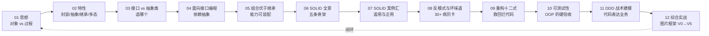
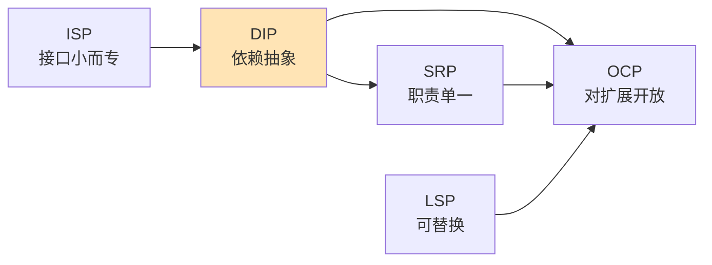
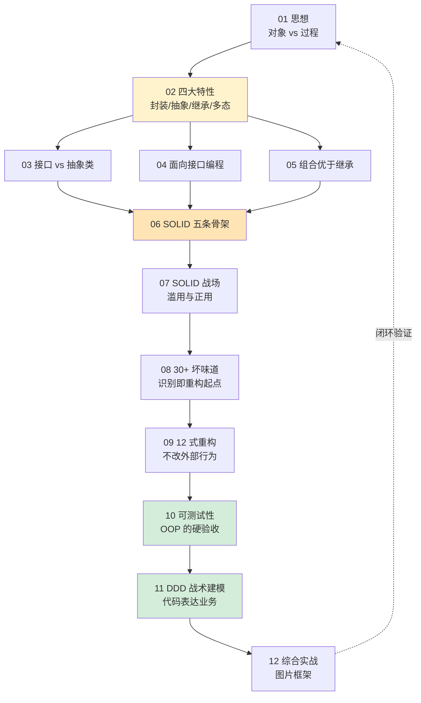

# 面向对象快速总结

> 12 篇主线一站式速览。每篇一张"速通卡"：**遇到什么场景 → 暴露什么问题 → 核心矛盾 → 核心知识 → 演变路径 → 加深理解**。
>
> 读不完 12 篇时，先看本篇；读完 12 篇后，本篇是你的"复盘地图"。

---

## 0.全景三张图

### 0.1 一句话定位每一篇



### 0.2 八个能力层与对应篇目

| 层次 | 核心能力 | 对应篇 |
|---|---|---|
| 语言层 | 对象/类/四大特性 | 01-02 |
| 结构层 | 接口/抽象类/组合 | 03-05 |
| 原则层 | SOLID 全景与战场 | 06-07 |
| 识别层 | 30+ 坏味道 | 08 |
| 修复层 | 12 式重构 | 09 |
| 验收层 | 可测试性 | 10 |
| 业务层 | DDD 与限界上下文 | 11 |
| 实战层 | 完整框架演化 | 12 |

### 0.3 主线案例 12 次演化


---

## 1.第 01 篇·面向对象设计思想

### 1.1 速通卡

| 维度 | 内容 |
|---|---|
| **遇到场景** | 2023 双 11：`OrderUtil.calculate()` 长成 1284 行，17 个 `else if`，一次大促全盘错算 |
| **暴露问题** | `OrderDTO` 是裸数据袋子、`OrderUtil` 是漂浮函数，"加一行小逻辑"成为时间问题 |
| **核心矛盾** | **复杂度持续叠加** vs **代码不能持续返工**。过程式把复杂度均摊到每个调用点，对象式把复杂度切片进对象内部 |
| **核心知识** | 对象 = 数据 + 行为绑定；类是模板，对象是实例；OOA/OOD/OOP 三阶段；复杂度阈值决定范式 |
| **演变路径** | 过程式（执行者视角）→ 对象式（指挥者视角）：从"怎么做"到"谁来做" |
| **加深理解** | 把字段全部 `public` 后程序仍正确？说明类没承担任何不变量——这就是"伪 OOP" |

### 1.2 展开：过程式 vs 对象式的真正分水岭

**症状对照**：

```text
// 过程式（漂浮函数 + 裸数据）
OrderDTO o = repo.find(id);
double total = OrderUtil.calc(o);           // 17 个 else if 都堆这里
DiscountUtil.apply(o, total);                // 多人维护、彼此偷改字段
StockUtil.lock(o); RiskUtil.check(o); ...

// 对象式（指挥者视角）
Order order = repo.find(id);
order.checkout();                             // 一句话：谁来做
```

**两个关键判断**：
- **复杂度阈值**：3 个字段 + 1 条规则 → 过程式更轻；30 个字段 + 跨规则不变量 → 对象式才扛得住。
- **OOA / OOD / OOP**：分析（找名词与职责）→ 设计（划边界、定接口）→ 编程（落语法）。**90% 的"OOP 写得难看"都是缺前两步**。

**反 OOP 信号灯**：
- 类里 90% 是 getter/setter，没有业务方法 → 贫血。
- 任何外部代码都能让对象进入非法态 → 没承担不变量。
- 改一个业务规则要扫 N 处调用点 → 行为没归位。

### 1.3 一句话拎走

> 过程式问"怎么做"，对象式问"谁来做"。**问法不同，复杂度的归宿就不同**。

---

## 2.第 02 篇·面向对象的四大特性

### 2.1 速通卡

| 维度 | 内容 |
|---|---|
| **遇到场景** | 2024 余额对账事故：流水加了 100，用户余额没动；某用户没操作却扣了 100，全公司差 ¥1273.45 |
| **暴露问题** | `transfer()` 函数直接改 `from.balance` / `to.balance` ——**约束没人守、变化没人扛** |
| **核心矛盾** | 数据要可被使用 vs 又不能被任意修改；统一调用 vs 不同实现自由演化 |
| **核心知识** | **封装**（不变量守卫）·**抽象**（隐藏实现）·**继承**（is-a 复用）·**多态**（统一接口处理一族） |
| **演变路径** | 公开字段 → private + 方法 → 内部不变量校验 → vtable 多态分发；继承谨慎用，多态优先选 |
| **加深理解** | 四大特性不是为了"看起来 OOP"，而是**让"约束有人守、变化有人扛"** |

### 2.2 四大特性对治的病

| 特性 | 治哪类病 | 落地动作 |
|---|---|---|
| 封装 | 字段被任意写入、不变量散落 | 字段 private、构造或方法里**强制校验不变量**（如 `balance ≥ 0`、转账前后总额守恒）|
| 抽象 | 实现细节泄漏到调用方 | 暴露**意图方法**（`transfer`）而非**步骤方法**（`debit/credit`），调用方不知 DB / RPC |
| 继承 | 重复代码、缺类型层级 | 仅在 **is-a 且共享不变量** 时用，且层级不超过 3 层 |
| 多态 | 调用方写满 if-else | 行为收敛到接口，子类各管各的——`switch(type)` 是多态没做好的信号 |

### 2.3 展开：从"看起来 OOP"到"真 OOP"

**反面对照**（余额事故的 5 行代码）：

```java
// 伪 OOP：四大特性一条没真用上
class Account { public double balance; }
void transfer(Account from, Account to, double m) {
    from.balance -= m;   // 谁都能改
    to.balance   += m;   // 没人守不变量
}                         // 没事务、没校验、没多态
```

**真 OOP**：
- 封装 → `balance` private，`Account.withdraw(m)` 内部判 `m>0 && balance≥m`。
- 抽象 → 调用方只调 `account.transfer(to, m)`，不关心是行内还是跨行。
- 继承 → `SavingAccount` / `CheckAccount` 共享 `Account` 的不变量与基础行为。
- 多态 → `accounts.forEach(a -> a.settle())`，行内/跨行/外汇各自实现 `settle()`。

**反直觉**：**继承不是越多越好**——能用组合就不用继承（第 5 篇会全面纠偏）；多态也不是越多越好——业务真有"一族"对象时才上，否则就是过度设计。

---

## 3.第 03 篇·接口 vs 抽象类

### 3.1 速通卡

| 维度 | 内容 |
|---|---|
| **遇到场景** | `MyLogger.java` 三年被改 47 次，从工具类→抽象类→接口→接口+抽象类双层 |
| **暴露问题** | 抽象类锁死单继承、接口不能存字段；只用一个，总有"还差一点" |
| **核心矛盾** | **共性复用**（is-a + 模板代码）vs **能力契约**（can-do + 多重实现） |
| **核心知识** | 抽象类抽"是什么 + 共同行为"；接口抽"能做什么"；`default` 方法补强接口，但替代不了字段 |
| **演变路径** | 工具静态类 → 抽象类（被单继承绊住）→ 纯接口（重复代码）→ **接口+抽象类双层**（Spring/Netty/MyBatis 默认范式） |
| **加深理解** | 99% 的技术重构都是"被迫重构"。从第一天就该问：这是 is-a 还是 can-do？ |

### 3.2 决策两问

```text
问 1：子类型间是「是一种」关系吗？  → 是 → 抽象类
问 2：能力是否可以独立装配/多重实现？ → 是 → 接口
两个都是 → 接口+抽象类双层
```

### 3.3 展开：双层范式与三大框架印证

**双层范式骨架**：

```text
interface Logger { void log(Level lv, String msg); }      // 契约：能做什么
abstract class AbstractLogger implements Logger {          // 骨架：共同行为
    public final void log(Level lv, String msg) {           // 模板方法
        if (!isEnabled(lv)) return;
        String line = format(lv, msg);                       // 公共流程
        doWrite(line);                                       // 留给子类
    }
    protected abstract void doWrite(String line);
}
class FileLogger    extends AbstractLogger { ... }
class ConsoleLogger extends AbstractLogger { ... }
```

**三大框架的同款套路**：

| 框架 | 接口 | 骨架抽象类 |
|---|---|---|
| Spring | `BeanFactory` / `ApplicationContext` | `AbstractApplicationContext` |
| Netty | `ChannelHandler` | `ChannelInboundHandlerAdapter` |
| MyBatis | `Executor` | `BaseExecutor` |

**反直觉**：
- 接口里的 `default` 方法**不能放字段**，因此不能完全替代抽象类（共享状态只能靠抽象类）。
- 抽象类的"骨架代码"才是**复用的核心**，接口的核心价值是**多重实现 + 解耦**。

---

## 4.第 04 篇·面向接口而非实现编程

### 4.1 速通卡

| 维度 | 内容 |
|---|---|
| **遇到场景** | 2022 某公司"去阿里云"：代码里出现 62873 个 `OSSClient` 字符串，迁移耗时 3 年 + 17 次事故 |
| **暴露问题** | 类名/方法名/`new` 表达式三处都钉死了实现 → 换底层等于全身换骨 |
| **核心矛盾** | **稳定的契约**（业务逻辑）vs **多变的实现**（云厂商/数据库/中间件） |
| **核心知识** | 依赖抽象不依赖具体；接口要"面向调用场景"而非"实现能力"；本质上等价于 DIP+OCP+可测性的合体 |
| **演变路径** | 重命名 → 抽接口（但 `new` 仍耦合）→ DI 注入 → 接口面向场景拆分 → 横切关注用装饰器而非接口 |
| **加深理解** | "面向接口编程"难的不是语法，而是**选哪些能力走接口**。多了变胖、少了不抽象 |

### 4.2 五个反转的教训

| 反转 | 教训 |
|---|---|
| 改个名字 | 名字变了类没变，等于零 |
| 抽出接口 | 调用方仍 `new` 实现 → 仍耦合 |
| 接口塞所有方法 | 暴露实现细节 → 不抽象 |
| 拆 N 个能力接口 | `instanceof` 满天飞 → 走偏 |
| 面向场景拆 | ✓ 接口要按"调用方需要什么"切 |

### 4.3 展开：接口设计的"三看"

**看调用方**：接口的方法集合要等于"调用方真正需要的能力"，而不是"实现方碰巧有的能力"。

```java
// 反例：把 OSS 的方法抄一遍当接口 → 换 COS 时仍要改调用方
interface ObjectStorage {
    String getEndpoint(); Credentials getCred(); HttpRequest sign(...); ...
}

// 正例：按业务调用场景定义
interface FileStore {
    void put(String key, byte[] data);
    byte[] get(String key);
    void delete(String key);
}
```

**看变化轴**：接口划线 = **预判哪条轴会变**。云厂商会变 → 抽 `FileStore`；DB 实现会变 → 抽 `Repository`；不会变的别抽（YAGNI）。

**看横切关注**：日志/重试/熔断/监控**不要塞进接口**，用**装饰器**层层包裹同一个接口。
```text
new RetryFileStore(new MetricsFileStore(new OssFileStore()))
```

**反直觉**：依赖注入框架（Spring）让"面向接口"看似免费，但**接口怎么切**才是真功夫——切错了，注入再丝滑也救不了。

---

## 5.第 05 篇·多用组合，少用继承

### 5.1 速通卡

| 维度 | 内容 |
|---|---|
| **遇到场景** | 企鹅会飞事故；游戏 `Dragon` 既会走又会飞的五次重构；快递三家 80% 共同逻辑找不到复用点 |
| **暴露问题** | 继承体系把不该有的能力强加给子类；多能力交叉时类树指数爆炸 |
| **核心矛盾** | **代码复用**（继承的胜场）vs **能力组合自由**（继承的死结） |
| **核心知识** | 继承三宗罪：强耦合、层级膨胀、静态绑定；组合 = 能力接口拆分 + 字段持有；策略/装饰/模板都是"伪装成继承的组合" |
| **演变路径** | 单继承 → 多重抽象层级 → 能力接口 `CanFly/CanSwim` → **能力接口 + 字段组合**（Dragon 持有 walker/flyer） |
| **加深理解** | 看到两个类"很像"时，先问：是 **is-a** 还是 **has-a**？继承不是错，错的是"什么都用继承" |

### 5.2 展开：继承三宗罪与组合落地

**继承三宗罪**：
1. **强耦合**：父类改一个 protected 字段，所有子类连坐。
2. **层级膨胀**：N 个能力 × M 个对象 = N × M 个子类（笛卡尔积）。
3. **静态绑定**：编译期定死，运行时换不掉（不能让企鹅"今天不会飞"）。

**组合落地三步**：

```java
// 第 1 步：把能力抽成接口
interface Walker { void walk(); }
interface Flyer  { void fly();  }
interface Swimmer{ void swim(); }

// 第 2 步：每种能力一个独立实现（可被复用）
class GroundWalker implements Walker { ... }
class WingFlyer    implements Flyer  { ... }

// 第 3 步：用组合装配出具体对象
class Dragon {
    private final Walker walker;
    private final Flyer  flyer;
    Dragon(Walker w, Flyer f) { this.walker = w; this.flyer = f; }
    void walk() { walker.walk(); }
    void fly()  { flyer.fly();   }
}
```

**何时继承仍是首选**：
- 真正的 **is-a 关系 + 不变量共享**（如 `IOException extends Exception`）。
- **模板方法骨架复用**（如 `AbstractLogger` 提供流程，子类只填空）。
- 层级 **≤ 3 层** 且子类数量稳定。

**反直觉**：策略模式 / 装饰器 / 模板方法 / 适配器——四大常用模式**底层都是组合**，只是"披着继承的皮"。

---

## 6.第 06 篇·SOLID 设计原则全景图

### 6.1 速通卡

| 维度 | 内容 |
|---|---|
| **遇到场景** | `OrderManager.java` 从 247 行长到 8194 行，一次评审同时违反五条 SOLID |
| **暴露问题** | 单点技能（封装/接口/组合）解决不了"图纸级"问题——什么样的拆分是合理的？什么是过度设计？ |
| **核心矛盾** | **代码会变** vs **变化不应让所有代码连坐**。SOLID 是对"熵增"的五道闸门 |
| **核心知识** | S = 一个 actor、O = 加扩展点而非改老代码、L = 子类可替父类不破坏契约、I = 接口小而专、D = 高层依赖抽象 |
| **演变路径** | 砖（语法）→ 图纸（SOLID）→ 房子（23 种设计模式）→ 城市（DDD/微服务架构） |
| **加深理解** | 五条不是平行的，**DIP 是地基**：没有依赖倒置，其他四条都建在沙上 |

### 6.2 SOLID 五条一句话

| 缩写 | 一句话 | 治哪类病 | 30 秒诊断关键词 |
|---|---|---|---|
| **S**RP | 一个类只对一个 actor 负责 | 上帝类、散弹式修改 | "这个类几个老板？" |
| **O**CP | 对扩展开放，对修改关闭 | 加业务总要改老代码 | "加新需求改了多少老代码？" |
| **L**SP | 子类必须能替换父类 | `instanceof` / 抛 `UnsupportedOperationException` | "把子类换成父类用，会炸吗？" |
| **I**SP | 接口要小而专 | 胖接口、伪实现 | "实现类里有几个空方法？" |
| **D**IP | 依赖抽象不依赖具体 | new 钉死实现、不可测 | "构造函数 / 字段里有 `new` 吗？" |

### 6.3 展开：SOLID 互为因果的"地基逻辑"



**因果链解读**：
- **DIP 是地基**：依赖具体类，所有其他原则都形同虚设——`new` 钉死了，扩展不开（破 OCP）、子类换不了（破 LSP）、接口怎么切都没用（破 ISP）。
- **ISP 服务于 DIP**：接口太胖，依赖抽象等于依赖具体——胖接口的所有变化都会传染到调用方。
- **SRP 让 OCP 成为可能**：一个类只一种职责，新增"另一种"就是新增类（开放）而不是改老类（关闭）。
- **LSP 让 OCP 安全**：靠多态做扩展点，子类不守契约 = 扩展点是雷。

**关键陷阱**：
- 把"代码行数多"当成 SRP 违反 → 错，SRP 看的是 **变化的方向（actor）**，不是行数。
- 为了"未来可能的扩展"提前抽接口 → 错，**没有第二个实现，接口就是空抽**（YAGNI）。
- DIP ≠ 全部抽象 → 工具类、纯数据对象不需要倒置。

---

## 7.第 07 篇·SOLID 案例汇

### 7.1 速通卡

| 维度 | 内容 |
|---|---|
| **遇到场景** | `RiskCheckProcessor` 700 行长成 3142 行，五人评审 40 分钟说不清违反哪一条 |
| **暴露问题** | "知道 SOLID 名字"≠"能 30 秒诊断病灶"；SOLID 反而成为不前进的借口 |
| **核心矛盾** | **原则是抽象的** vs **代码是具体的**——抽象到具体的诊断能力是分水岭 |
| **核心知识** | SRP 真正的"一" = 一个 actor；OCP 真正的"闭" = 不要为不存在的变化造扩展点；LSP 看契约而非编译；ISP 看调用方而非实现方；DIP 不是"全部抽象" |
| **演变路径** | 误以为是 SRP → 拆完仍乱 → 怀疑 OCP/LSP/ISP → **最终发现 DIP 缺失，地基塌**——四原则全失效 |
| **加深理解** | SOLID 互为因果：SRP 让 OCP 可能、LSP 让 OCP 安全、ISP 让 DIP 干净、**DIP 让其他四条有地基** |

### 7.2 何时刻意不遵守

| 情况 | 反 SOLID 是合理的 |
|---|---|
| 业务不会变 | 不要为不存在的扩展加抽象（反 OCP） |
| 工具脚本 | 一个上帝函数比 5 个空接口好（反 SRP） |
| Demo 阶段 | 直接 new 比 DI 容器快 10 倍（反 DIP） |

### 7.3 展开：30 秒诊断五步法

读到一段"难看"的代码，按这五步快速给出病灶名：

```text
Step 1：列字段、列调用方
       ─ 字段里有 new 具体类吗？     → 怀疑 DIP
       ─ 调用方来自几个不同角色？     → 怀疑 SRP

Step 2：看新增需求的痛点
       ─ 加新业务要改几处老代码？     → 验 OCP
       ─ 有没有 instanceof / switch？ → 验 LSP / 多态

Step 3：看接口实现端
       ─ 实现类里有空方法 / UOE？    → 验 LSP + ISP

Step 4：看测试
       ─ 写不出单测？                → 必破 DIP

Step 5：判定主因
       ─ 通常 DIP 缺失是根，先补地基
```

**典型反例 → SOLID 编号**：

| 反例 | 主要违反 |
|---|---|
| `RiskCheckProcessor` 700 → 3142 行 | SRP（4 个 actor 挤一起）+ DIP（直接 new 各种 Service） |
| `Rectangle` 继承被 `Square` 替换后面积算错 | LSP（子类破坏契约） |
| `IUserService` 30 个方法，每个实现类 20 个空方法 | ISP |
| 加个新支付方式要改 `PaymentService` 主流程 | OCP |

**反直觉**：**SOLID 是诊断工具，不是写代码时的检查清单**——评审时拿出来照，**写代码时凭直觉 + 重构修正**就够了。

---

## 8.第 08 篇·反模式与坏味道大全

### 8.1 速通卡

| 维度 | 内容 |
|---|---|
| **遇到场景** | 新人 Wang 一个 PR 被驳回 18 次、247 条评论；问"为什么你能闻到我闻不到"？ |
| **暴露问题** | 能感觉"不对"但说不出名字 → 没法讨论、没法 review、没法重构 |
| **核心矛盾** | **代码行为正确** vs **演化能力差**。Bug 是"现在的痛"，坏味道是"未来的痛" |
| **核心知识** | 30+ 坏味道分 6 类：膨胀型、滥用 OOP、变化阻碍、冗余、耦合、系统级反模式 |
| **演变路径** | 直觉 → **赋予直觉以词汇** → 病历卡 → 与第 09 篇 12 式手法一一对照 |
| **加深理解** | 单一指标会冤枉好人也会放过坏人。**直觉融合多维度特征**，但直觉不可教，除非给它**词汇** |

### 8.2 六大家族速查

| 家族 | 典型病例 | 高频急救 |
|---|---|---|
| 膨胀型 | 长函数、大类、长参数、数据泥团、基本类型偏执 | 提炼函数 / 提炼类 / 参数对象 |
| 滥用 OOP | 上帝类、贫血模型、临时字段、Switch 惊悚、平行继承 | 以多态取代条件 / 行为搬回对象 |
| 变化阻碍 | 散弹式修改、发散式变化、依恋情结、不当亲密 | 搬移函数 / 提炼新类 |
| 冗余型 | 重复代码、中间人、未来性夸夸、注释遮羞 | 提炼共用 / 去除中间人 / 用代码替注释 |
| 耦合型 | 全局状态、隐式时序、单例上瘾 | 依赖注入 / 显式参数 |
| 系统级 | 大泥球、金锤子、过度工程、Copy-Paste | 分层切分 / 删除过度抽象 / DRY |

### 8.3 展开：top 10 高频坏味道速辨

| 坏味道 | 一眼信号 | 痛点 |
|---|---|---|
| 长函数 | 一个方法 100 + 行 | 读不懂、不可测 |
| 大类 | 一个类 1000 + 行、30 + 字段 | 上帝类、改一行连坐 |
| 数据泥团 | 同一组参数老一起出现 | 缺少值对象 |
| Switch 惊悚 | `switch(type)` 反复出现 | 缺多态 |
| 散弹式修改 | 改一个需求扫 7 处 | 同一职责被切散 |
| 发散式变化 | 一个类被 N 种需求改 | SRP 违反，多 actor |
| 依恋情结 | 方法 A 频繁访问类 B 的字段 | 行为放错家 |
| 全局状态 | 静态字段被到处读写 | 不可测、并发坑 |
| 中间人 | 一个类 90% 方法转发给字段 | 多了一层无意义包装 |
| 注释遮羞 | "为什么"靠注释解释 | 命名 / 拆分没做到位 |

**反直觉**：
- **重复代码** 不一定要立刻消除——**两次出现"形似"但语义不同**，强行 DRY 反而制造耦合。三次同形再抽。
- **小函数** 也是坏味道（碎片化）——超细拆分让阅读跳跃成本暴增。

---

## 9.第 09 篇·重构十二式

### 9.1 速通卡

| 维度 | 内容 |
|---|---|
| **遇到场景** | 订单结算函数 22 行 → 4 年长成 600+ 行，每次都"专业地多加几个 if" |
| **暴露问题** | 没有任何一次提交是"不专业的"，但累积到 12 个版本谁也读不懂——**渐进式腐烂** |
| **核心矛盾** | **写得短**（作者方便）vs **读得懂**（读者方便）。读代码 100 次 vs 写代码 1 次 |
| **核心知识** | 12 式 = 函数级（提炼/内联/搬移/查询/参数对象/多态/策略/分解）+ 类级（提炼类/内联类/中间人/组合替继承） |
| **演变路径** | 重写（推倒）→ **重构**（不改外部行为）→ 节奏感（小步快跑 + 测试常绿）→ 特征化测试 |
| **加深理解** | "不改外部行为"是核心安全网。没测试 ≠ 不能重构，**先围上特征化测试，再动刀** |

### 9.2 12 式速记

```text
函数级 6 式：提炼/内联/搬移/以查询取代变量/参数对象/分解长参
对象级 4 式：以多态取代条件/以策略取代分支/提炼类/内联类
关系级 2 式：去除中间人/以组合取代继承
```

### 9.3 展开：重构的节奏与安全网

**节奏感（小步快跑）**：
```text
   读懂 →  围测试 →  小改 →  跑测试 →  提交
     ↑                                       │
     └───────  10 分钟一循环  ──────────────┘
```

**安全网三件套**：
1. **特征化测试**（Characterization Test）：先把现状当"对"写进测试，不管它合理与否，**只为锁住外部行为**。
2. **保留切换开关**：新旧实现并行，灰度切换、随时回滚。
3. **小颗粒提交**：每个提交只做一件事，方便 `git bisect`。

**12 式典型搭配**：

| 病灶 | 主刀手法 | 配合手法 |
|---|---|---|
| 长函数 | 提炼函数 | + 提炼类（如果新函数还引用多字段）|
| Switch 惊悚 | 以多态取代条件 | + 以策略取代分支（运行时可切）|
| 大类 | 提炼类 | + 搬移函数 |
| 长参数 | 参数对象 | + 提炼类（参数对象长出行为） |
| 平行继承 | 以组合取代继承 | + 能力接口拆分 |

**反直觉**：
- **"先重构再加功能"** 永远比"边加边乱改"省时间——前者节奏清晰、回滚便利，后者一个 PR 既新功能又改老代码，事故率最高。
- **没测试不是不能重构**——上特征化测试 + 自动化回归是先手棋。

---

## 10.第 10 篇·可测试性设计

### 10.1 速通卡

| 维度 | 内容 |
|---|---|
| **遇到场景** | 2024 某交易系统 CI 全绿、覆盖率 94.7%，周一上线周二崩，P0 事故 |
| **暴露问题** | 覆盖率测的是"代码被跑过"，**不是"业务规则被验证"**——温室 mock 制造虚假安全感 |
| **核心矛盾** | **想跑得快**（依赖 mock）vs **想测得真**（直面真实数据语义）；**想覆盖广**（行覆盖）vs **想验得准**（变异覆盖） |
| **核心知识** | 可测三要素：可观测 + 可控制 + 可隔离；不可测画像：静态方法/单例/全局时间/私有方法依恋/隐式 IO；可测五原则：DI/时间抽象/IO 边界/副作用集中/纯函数优先 |
| **演变路径** | 没测试 → 行覆盖 → 分支覆盖 → 路径覆盖 → **变异测试**（突变代码看测试能不能抓到） |
| **加深理解** | **"不可测 = 设计错"是充要条件**——这是 OOP 最硬的验收。改不动测试时，先动设计 |

### 10.2 测试金字塔

```text
       /\           E2E (慢、贵、脆弱)
      /  \
     /----\         集成测试
    /      \
   /--------\       单元测试 (快、便宜、稳定)  ← 70%
```

倒金字塔（E2E 占大头）= 最常见反模式。

### 10.3 展开：不可测画像 & 可测改造五步

**不可测的五种"基因"**：

| 基因 | 症状 | 改造方向 |
|---|---|---|
| 静态方法依赖 | `Utils.sendSms()` 直接调外部 | 抽接口 + 注入 |
| 单例硬引用 | `XxxManager.getInstance()` | DI 容器管理生命周期 |
| 全局时间 | `new Date()` / `System.currentTimeMillis()` | 抽 `Clock` 注入 |
| 私有方法依恋 | 反射测 private | **测公开行为**，私有是实现 |
| 隐式 IO | 方法内部偷偷写文件 / 发请求 | 边界注入 |

**可测改造五步**（以"下单后扣库存 + 发短信"为例）：

```text
Step 1：识别副作用边界 → 库存、短信都是 IO
Step 2：抽接口 → StockClient / SmsClient
Step 3：构造函数注入 → OrderService(StockClient, SmsClient, Clock)
Step 4：时间抽象 → 用注入的 Clock.now() 代替 new Date()
Step 5：写单测 → 用假实现验证"扣库存失败时不发短信"等业务规则
```

**覆盖率的坑**：
- **行覆盖 90%** 但全是 mock 的逻辑 → 等于没测。
- 真正的安全感来自 **变异测试（Mutation Testing）**：往代码里塞 bug 看测试能不能抓到。
- 优先级：**业务规则 > 边界条件 > 异常路径 > 兜底分支**，行覆盖只是副产品。

---

## 11.第 11 篇·DDD 与战术建模

### 11.1 速通卡

| 维度 | 内容 |
|---|---|
| **遇到场景** | 2024 会员等级权益评审：同一份需求"会员"出现 3 套含义、7% 数据对不齐；业务文档→代码失真 60-70% |
| **暴露问题** | OOP 前 10 篇解决"代码怎么写更好"，但**没解决"代码到底在表达什么业务"** |
| **核心矛盾** | **业务多变** vs **代码稳定**；**业务语言** vs **技术语言** 的翻译损耗 |
| **核心知识** | 通用语言（业务/产品/开发用同一套名词）·限界上下文（边界即设计）·实体/值对象/聚合根（一致性边界）·领域服务/应用服务·领域事件·六边形架构 |
| **演变路径** | 数据导向（贫血模型 + 上帝 Service）→ 战术建模（聚合根 + 值对象）→ 战略层（限界上下文 + 防腐层）→ 事件驱动 + 六边形 |
| **加深理解** | DDD 的真正价值**体现在评审会的扯皮变少**——它不是"另一种代码风格"，而是"让代码与业务对齐的工程方法" |

### 11.2 战术四件套

| 概念 | 一句话 | 落地信号 |
|---|---|---|
| 值对象 | 没有身份、按值相等、不可变（如 `Money`） | 字段全 final、`equals/hashCode` 基于内容 |
| 实体 | 有身份、可变状态、生命周期 | 有唯一 ID、状态会变 |
| 聚合根 | 一致性边界唯一入口、对外暴露的唯一引用 | 外部只能通过它修改聚合内成员 |
| 领域服务 | 跨多个聚合的业务规则，不属于任何一个聚合 | 方法签名带 ≥2 个聚合根 |

### 11.3 展开：从贫血到 DDD 的演化阶梯

```text
阶段 1（贫血 + 上帝 Service）
   Order { 30 个 getter/setter }      ← 数据
   OrderService.checkout(Order)        ← 1000 行业务全在这

阶段 2（行为搬回对象）
   order.checkout()                    ← 行为归位，但仍单体

阶段 3（战术建模）
   Order(聚合根) ─持有→ List<OrderLine>(实体)
                ─持有→ Money(值对象)
   order.applyCoupon(coupon)           ← 不变量在聚合根守住

阶段 4（战略层）
   订单上下文 / 支付上下文 / 会员上下文  ← 各自语言、各自模型
                ↕  防腐层(ACL)         ← 跨上下文翻译

阶段 5（事件驱动 + 六边形）
   领域事件 OrderPaid → 触发会员积分上下文 / 物流上下文
   外部适配器（DB/MQ/HTTP）只是端口的实现
```

**通用语言的判别**：开评审会时，业务、产品、开发**说同一个词、含义一致**。如果"会员"在三方眼里是三件事，立刻就是限界上下文未切分的信号。

**反直觉**：
- DDD **不是为了"漂亮的代码"**，是为了让代码与业务**翻译损耗最小**——评审会扯皮变少 = DDD 起作用了。
- 小项目不要上 DDD——业务复杂度 < 4 个上下文时，贫血 + 服务层更轻便。

---

## 12.第 12 篇·综合实战：图片框架 V0→V5

### 12.1 速通卡

| 维度 | 内容 |
|---|---|
| **遇到场景** | 2019 双 11 某 App OOM 崩溃率 4.2%；5000 行 `ImageManager` 上帝类；快速滑动累积 7 个未取消请求；单 cell 35MB |
| **暴露问题** | 静态单例无生命周期、请求无 ID 不可取消、同 url 并发不合并、Bitmap 不缩放、回调地狱、吞异常 |
| **核心矛盾** | **要快糙猛能跑**（V0 屎山）vs **要可扩展可测试**（V5 Glide 级框架）；**一刀重写** vs **多步演化** |
| **核心知识** | V0 屎山 → V1（封装 + 抽象 + 组合）→ V2（SOLID 精修）→ V3（12 式重构）→ V4（可测注入）→ V5（DDD 限界上下文） |
| **演变路径** | 每一次演进对应前面一篇的核心思想——这就是"按图索骥的设计实践地图" |
| **加深理解** | 真正考验功夫的从来不是单点技巧，而是**用一整套思维去救活一个真实系统**。Glide / OkHttp / Picasso 的架构哲学都在这条演进路径上 |

### 12.2 V0 → V5 演进对照

| 版本 | 关键改造 | 解决了什么问题 | 对应篇 |
|---|---|---|---|
| V0 | 300 行屎山、`ImageManager` 静态单例、17 处坏味道 | 现状识别 | 08 |
| V1 | `ImageRequest` 封装、`Loader/Cache/Decoder` 接口分离、拦截器链 | 解耦 + 可装配 | 02-05 |
| V2 | SRP 拆四类、OCP 加拦截器扩展点、DIP 注入依赖 | 加新需求不动老代码 | 06-07 |
| V3 | 守卫子句去深嵌套、查找表替代 switch、参数对象 | 可读性 + 可改性 | 09 |
| V4 | 注入 `Clock` / `Scheduler` / `Network`，5 个高价值单测 | 测得真、抓得到回归 | 10 |
| V5 | 五个限界上下文（请求/缓存/解码/网络/装载）+ 防腐层 + 领域事件 | 演化能力 + 业务对齐 | 11 |

### 12.3 展开：演化的复盘视角

**为什么不一刀重写**：
- 老代码承载 **隐性需求**（埋点、降级开关、特殊机型适配），重写必丢。
- 演化每一步都可上线、可回滚；重写要憋大招几个月，**期间业务窗口期归零**。

**每一步的"小目标"**：

```text
V0→V1：让"加一个新缓存策略"不再需要改主流程
V1→V2：让"加一个新拦截器"不再需要 if 判断类型
V2→V3：让"读一段流程"不再需要在嵌套里翻三层
V3→V4：让"改 bug"前能先写一个能暴露 bug 的单测
V4→V5：让"产品提一个新功能"在评审上能 30 分钟讲清楚边界
```

**与开源框架的对照**：
- **Glide** 的 `RequestManager + Engine + DataFetcher` ≈ V5 的限界上下文 + 端口。
- **OkHttp** 的 `Interceptor` 链 ≈ V1 引入的拦截器链。
- **Picasso** 的请求合并 ≈ V2 的 SRP + 同 url 合并策略。

**反直觉**：**框架质量 ≠ 模式数量**——每一步演化背后都对应**真实痛点**，没有痛点凭空搞设计模式就是过度工程。

---

## 13.全栈认知地图

### 13.1 12 把内功的因果链



### 13.2 12 篇的"反面教材一句话"

| 篇 | 反面教材 | 正面教训 |
|---|---|---|
| 01 | 1284 行 `OrderUtil.calculate` | 数据和行为绑到同一边界 |
| 02 | `transfer()` 直接改 `balance` | 不变量必须有人守 |
| 03 | 工具类里 47 次 if-else 增删 | 双层：契约接口 + 骨架抽象类 |
| 04 | 6 万行代码迁云 3 年 | 依赖能力契约而非实现 |
| 05 | 企鹅继承 `fly()` 飞起来 | 能力组合而非血统继承 |
| 06 | 8194 行上帝类 | 五条原则互为因果，DIP 是地基 |
| 07 | 五人吵 40 分钟说不清违反哪条 | 30 秒定位 = 资深的分水岭 |
| 08 | PR 被驳回 18 次说不出问题 | 给直觉以词汇 |
| 09 | 4 年 12 次"专业"提交腐烂 | 重构靠节奏与测试安全网 |
| 10 | 94.7% 覆盖率上线即崩 | 测意图而不是测代码 |
| 11 | 同一份需求"会员"3 套含义 | 通用语言 + 限界上下文 |
| 12 | 5000 行 `ImageManager` OOM | 系统演化 = 11 把内功的合奏 |

### 13.3 三层认知阶梯

| 层级 | 表现 | 关键问题能答出来？ |
|---|---|---|
| **初阶** | 知道封装/继承/多态/接口 | "OOP 四大特性是哪四个？" |
| **中阶** | 会用 SOLID 与组合、能闻坏味道 | "为什么我这段代码违反 OCP？" |
| **高阶** | 能用 12 式重构、写可测代码、做 DDD 建模 | "你这个聚合根的一致性边界在哪？" |
| **专家** | 能像第 12 篇那样把屎山演进为框架 | "Glide 为什么用拦截器而不是策略链？" |

**从"使用者"到"设计者"的分水岭**：不是会写 OOP，而是**能判断什么时候不该用 OOP**（脚本工具/简单流程坚决用过程式）。

### 13.4 反向溯源：症状 → 回查哪一篇

工作中遇到具体问题时，从下表反查对应篇目：

| 你正在面对的症状 | 主篇 | 配合篇 |
|---|---|---|
| 函数 500+ 行 / 类 2000+ 行 | 08 坏味道 | 09 重构十二式 |
| 加新业务总要改主流程 | 06/07 SOLID（OCP）| 04 面向接口 |
| 改一个字段，N 处连坐 | 07 SOLID（SRP）| 11 DDD（限界上下文） |
| 类爆炸 / 继承层级失控 | 05 组合优于继承 | 03 接口 vs 抽象类 |
| 切个云厂商要 3 年 | 04 面向接口编程 | 06 DIP |
| 写不出单元测试 | 10 可测试性 | 06 DIP |
| 测了覆盖率仍上线即崩 | 10 可测试性 | 11 DDD |
| 评审会业务/产品/开发 3 套话语 | 11 DDD（通用语言）| 12 综合实战 V5 |
| 4 年腐烂、谁都不敢动 | 09 12 式重构 | 10 可测改造 |
| 屎山想救活但又怕重写翻车 | 12 综合实战 | 01-11 全篇 |

### 13.5 思想流转主线（一张图记住 12 篇）

```text
对象 vs 过程            ← 哲学起点（01）
   ↓
封装 / 抽象 / 继承 / 多态  ← 语言原语（02）
   ↓
接口 vs 抽象类 / 面向接口 / 组合 vs 继承  ← 结构骨架（03-05）
   ↓
SOLID 五条 + 战场      ← 设计图纸（06-07）
   ↓
坏味道识别 + 12 式重构  ← 修复工艺（08-09）
   ↓
可测试性 = OOP 验收     ← 工程硬指标（10）
   ↓
DDD 表达业务            ← 业务对齐（11）
   ↓
图片框架 V0→V5          ← 综合演练（12）
   ↓
回到第 01 篇的"问法"     ← 闭环：复杂度的归宿
```

---

## 14.带走清单

```
📌 0-3 年工程师：
   ├─ 先记四大特性 + 接口/抽象类的两个判别问
   ├─ 把每个新写的类都问一遍："如果字段全 public，程序还对吗？"
   └─ 优先组合，慎用继承

📌 3-5 年工程师：
   ├─ 30 秒能定位违反哪条 SOLID
   ├─ 闻得到 30+ 坏味道，能叫出名字
   ├─ 12 式重构成肌肉记忆
   └─ 每段代码先问："这段能写单测吗？写不动就先改设计"

📌 架构师 / Tech Lead：
   ├─ 用通用语言主导评审，让业务/产品/开发对齐名词
   ├─ 用限界上下文画系统边界，而不是按"功能模块"切
   ├─ DIP 是组织级地基——所有跨团队接口都要倒置
   └─ 把第 12 篇当作团队的"按图索骥"模板
```

---

## 15.一句话终极总结

> **OOP 的全部价值，是把"复杂度的均摊"换成"复杂度的切片"——让约束有人守、变化有人扛、业务有人懂、未来有人接。**
>
> 这就是为什么 12 篇主线的终点不是语法，而是 **DDD + 可测试 + 演化能力**——代码不是写给机器看的，是写给**3 年后的接手人**看的。

