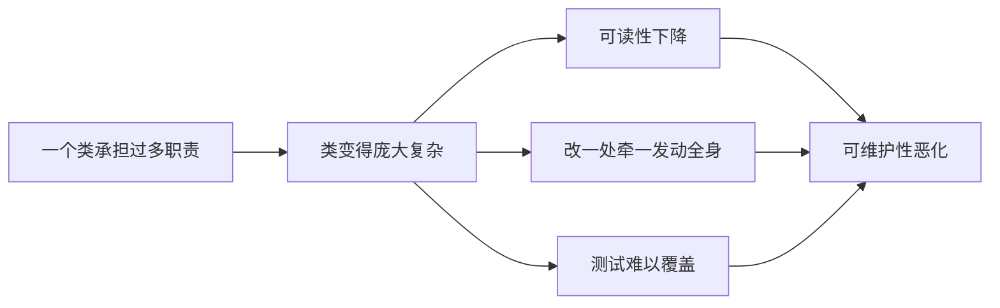
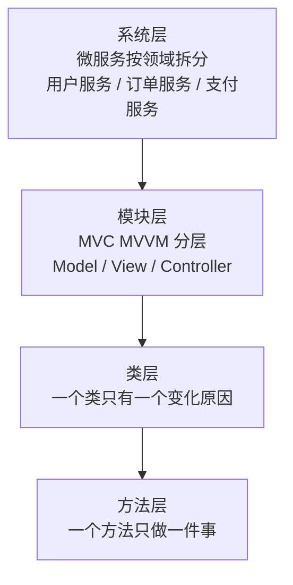

# 第二卷第2章：单一职责原则详解

#### 目录介绍
- [1.工作中真实案例](#1工作中真实案例)
- [2.问题思考与分析](#2问题思考与分析)
- [3.单一职责原则介绍](#3单一职责原则介绍)
- [4.如何理解单一职责](#4如何理解单一职责)
- [5.遵守SRP之缘由](#5遵守srp之缘由)
- [6.方法层单一职责](#6方法层单一职责)
- [7.接口层单一职责](#7接口层单一职责)
- [8.类层面职责拆分法](#8类层面职责拆分法)
- [9.判断单一的模糊地](#9判断单一的模糊地)
- [10.SRP的五条信号](#10srp的五条信号)
- [11.SRP本质之内聚](#11srp本质之内聚)
- [12.SRP的落地层次](#12srp的落地层次)
- [13.开篇详情页再回顾](#13开篇详情页再回顾)
- [14.本篇收获总结](#14本篇收获总结)
- [15.课后思考练习](#15课后思考练习)
- [16.课后实战练习](#16课后实战练习)


## 1.工作中真实案例

做终端开发几乎都会遇到这样一类"详情页"：初版的"商品详情页" / "文章详情页" / "动态详情页"只有一个 `DetailController`（或 `DetailViewModel` / `DetailPresenter`）。

随着业务迭代，它陆续承担了：接口请求、字段转换、本地缓存读写、埋点上报、分享文案拼装、评论区分页、收藏按钮状态维护、悬浮广告轮播……

半年后，这一个类膨胀到 **2000 多行**。改一个"埋点字段"也要打开这个类滚半天鼠标才找到位置；两个人同时改这个文件 100% 会冲突；新同学第一次看到它的第一反应是"我怎么可能读懂它"。

### 1.1 代码风格差之问

很多人第一反应是："这是新人写得乱、是 Code Review 不严格"。先别急着下结论，我们做一个**反向思想实验**：假设当初写这个类的就是团队最资深的工程师，他依然会写成这样吗？

答案是，**很可能依然会**。原因不在人，而在**类的边界**：

- 第一周需求是"展示详情"，写一个 `DetailController` 没毛病；
- 第二周加"缓存"，"反正都和详情有关，加进去吧"；
- 第三周加"埋点"，"也和详情有关，加进去吧"；
- 每一次单独看都"合理"，**叠加起来就成了灾难**。

这说明问题的根源不是"写得差"，而是**没有一个明确的判据告诉我们：什么东西该进这个类、什么东西不该进**。本篇要给的，就是这个判据，**单一职责原则（SRP）**。

### 1.2 本篇三问的应答

带着这三个问题往下读，会比直接看定义清晰得多：

1. **怎么识别**"职责过多"？，靠感觉？还是有可量化的信号？
2. **怎么拆**到"刚刚好"？，拆得太粗等于没拆，拆得太细等于自残；
3. **拆到什么程度就停**？，什么时候"再拆一刀"反而让代码更糟？

读完本篇再回看这个 2000 行的详情页，你会清晰地知道它应该被拆成哪几块、每一块的边界在哪、为什么这么拆。

## 2.问题思考与分析

在给出 SRP 定义之前，先用四个问题逼自己思考一下。**带着疑问去读定义，比直接被灌输定义有用 10 倍**：

1.如何理解"类的单一职责"？"单一"二字到底是怎么评判的？是按方法数量？按代码行数？还是按别的？

2.看懂了 SRP，但实际开发中怎么用？能否给出一个"前后对比"，不遵守它会怎样、遵守它后又怎样？

3.是不是职责拆得越细越好？拆到极致之后，代码会变好还是变更难维护？为什么？

4.SRP 除了应用在"类"上，还能延伸到哪些层面？方法行不行？接口行不行？模块行不行？微服务行不行？

**这四个问题就是本篇的主线**。后面每一节都对应在回答其中一个问题，读完后你应该能用自己的话给同事讲清楚 SRP，而不是只会背"一个类只做一件事"这句话。

## 3.单一职责原则介绍

### 3.1 SRP标准定义

单一职责原则（Single Responsibility Principle，SRP）是面向对象设计中的核心原则。英文定义：A class or module should have a single responsibility.

翻译过来：**一个类或者模块只负责完成一个职责（或者功能）**。

### 3.2 定义简单用好难

看起来简单，但"看懂"和"会用"是两回事，"用好"更是难上加难。**为什么会这样**？因为定义里有一个最致命的隐含变量，"**职责**"。

- 在产品视角："展示详情"是一个职责；
- 在架构师视角："展示详情"包含"取数 / 转换 / 渲染 / 上报"四个职责；
- 在团队视角："展示详情"被前端、数据、运营三个团队各改一遍，是三个职责。

**同一段代码，站在不同视角，"职责"的颗粒度完全不同**。这就是为什么很多同事拿着 SRP 这把尺子，量出来的结果千差万别，因为他们手里的尺子刻度根本不一样。

所以本篇接下来要做的不是反复重复"一个类一个职责"这句口号，而是**一步一步把"职责"这把模糊的尺子，校准成一把可量化的工具**。

## 4.如何理解单一职责

### 4.1 SRP作用对象

SRP 描述的对象有两个：**类**（class）和**模块**（module）。

一种理解：模块是比类更抽象的概念，类也可以看作模块；另一种理解：模块是比类更粗粒度的代码块，一个模块包含多个类。

不管哪种理解，SRP 应用到这两个对象时道理相通。下文主要从"类"的角度展开，"模块"可自行引申。

### 4.2 一句话解SRP

**一句话 SRP**：如果一个类包含两个或以上**业务不相干**的功能，就说它"职责不够单一"，应该拆成多个粒度更细、功能更单一的类。

这里有一个**关键词需要展开**，"业务不相干"。

- 一个 `User` 类里有 `getName()` 和 `getEmail()`，相干；
- 一个 `User` 类里有 `getName()` 和 `sendEmail()`，**不相干**，一个是数据访问，一个是行为发送，完全是两个变化方向；
- 一个 `OrderService` 里有 `createOrder()` 和 `notifyWeChat()`，**不相干**，一个是订单领域，一个是通知渠道。

**判断"相不相干"的诀窍**：如果一个职责未来变化时，另一个职责完全不会跟着改，那它们就是不相干的，应当拆开。

### 4.3 通俗案例理解

用最通俗的话说就是："一个类/模块只做一件事，别当万金油"。翻译成人话："别让一个类或模块干所有活，各司其职"

❌ 坏设计（违反单一职责）

餐厅只有一个厨师叫老王，他一个人干所有活：

```text
老王的工作：
1. 洗菜
2. 切菜
3. 炒菜
4. 洗碗
5. 端盘子
6. 收银
7. 扫地
8. 接电话订餐
```

问题： 1.老王生病了 → 餐厅瘫痪 ；2.老王炒菜时，电话响了 → 菜糊了 ；3.老王洗碗时，客人要结账 → 碗摔了 ；4.想换更好的厨师 → 但没人会洗碗收银

✅ 好设计（符合单一职责）

每个人只做一件事：

```text
洗菜工：只负责洗菜
切菜工：只负责切菜
炒菜师傅：只负责炒菜
洗碗工：只负责洗碗
服务员：只负责端盘子
收银员：只负责收银
保洁阿姨：只负责扫地
前台：只负责接电话
```

好处： 1.炒菜师傅生病了 → 换个炒菜师傅就行，不影响其他人 ；2.想换更好的炒菜师傅 → 直接换，不用管洗碗的事 ；3.每个人专注做自己的事，效率更高。

## 5.遵守SRP之缘由

### 5.1 不遵守会怎样

在讲"遵守后有什么好处"之前，先看"不遵守会怎样"，这是一种**反向论证**，付出多大代价才能让人真正记住原则。



上面这张图不是拍脑袋画出来的，是**详情页 2000 行这个真实代码**走过的路：从「庞大」到「难读」、从「难读」到「难改」、从「难改」到「难测」、从「难测」到「只敢动不敢拆」，一条选不遵守 SRP 的必然快递。

### 5.2 遵守的三大收益

拆分到"职责单一"带来的直接好处：

1. **提高类的可维护性和可读性**：职责少了，复杂度降低，代码自然好读。
2. **提高系统的可维护性**：每个类可维护性高，整个系统的可维护性自然高。
3. **降低变更风险**：职责越多，变更概率越大，变更带来的风险也越大。

这三条看起来面熟，但**为什么能带来这三条收益**是关键：本质在于拆分后，"一次代码修改只会被局限在一个类里"，变更点突然从"一片"变成了"一点"，这才是 SRP 价值的根源。

## 6.方法层单一职责

### 6.1 看似简单的需求

需求：修改用户名或密码。

看到这个需求，年轻开发者几乎本能反应："都是改用户信息嘛，一个方法传个类型参数不就行了？"这就是下面的方式 1。表面上代码量少、看起来"复用了一个方法"，似乎还振振有词。

### 6.2 两种写法对比

**方式 1：把两件事塑进一个方法**

```java
public enum OperateEnum { UPDATE_USERNAME, UPDATE_PASSWORD }

public class UserOperateImpl {
    public void updateUserInfo(OperateEnum type, UserInfo info) {
        if (type == OperateEnum.UPDATE_USERNAME) {
            // 修改用户名
        } else if (type == OperateEnum.UPDATE_PASSWORD) {
            // 修改密码
        }
    }
}
```

**方式 2：拆成两个方法**

```java
public class UserOperateImpl {
    public void updateUserName(UserInfo info)     { /* 修改用户名 */ }
    public void updateUserPassword(UserInfo info) { /* 修改密码   */ }
}
```

### 6.3 为何方式二更优

这个选择不能拍脑袋，要过三道问题才能下结论：

**问题一：两者的调用意图哪个更清晰？**

```java
// 方式 1 的调用点
userOperate.updateUserInfo(OperateEnum.UPDATE_USERNAME, info);
// 方式 2 的调用点
userOperate.updateUserName(info);
```
调用方看后者，不用看枚举、不用看实现，名字本身就在讲意图。

**问题二：哪种写法传错了参数会出 Bug？**

方式 1 传错枚举会静默走到错误分支，编译器不会报错；方式 2 调错方法名会被编译器拦住。**一个是运行期崩，一个是编译期拦**，代价不是一个量级。

**问题三：未来加一个"修改邮箱"的需求哪个代价小？**

方式 1 要加枚举、还要加 if/else，修改了原有函数，估计还要 review 原有那三个分支；方式 2 只需加一个独立方法，原有代码完全不动。

**三个问题面前，方式 2 全胜**。本质原因是：修改用户名与修改密码是**两个独立变化的职责**（密码为什么独立变化？因为安全需求一变它就要加加密/词典验证/历史密码检查，这些都与修改用户名无关）。**方式 2 才符合 SRP**，这是方法层面的体现。

## 7.接口层单一职责

### 7.1 生活场景示例

场景：张三扫地，李四买菜。

为什么拿家务举例？因为它能让问题**脱离业务术语的干扰**，露出设计本质：多个角色干不同的事，能不能被塑在同一个接口里？

### 7.2 接口设计大对比

**方式 1：一个大接口揽下所有家务**

```java
public interface HouseWork {
    void sweepFloor();
    void shopping();
}

public class Zhangsan implements HouseWork {
    public void sweepFloor() { /* 扫地 */ }
    public void shopping()   { /* 张三被迫实现一个空方法 */ }
}

public class Lisi implements HouseWork {
    public void sweepFloor() { /* 李四被迫实现一个空方法 */ }
    public void shopping()   { /* 买菜 */ }
}
```

问题出在哪？张三明明不买菜也要实现 `shopping()`；李四要新增"做饭"就得改接口，张三跟着受波及，**修改一处影响了其他不需要修改的地方**。这会产生三个连锁损害：

1. **虑假实现**：空方法本身就是代码垃圾，还可能被调用方调到；
2. **伪多态**：你拿到一个 `HouseWork`，你不知道能不能调 `shopping()`；
3. **澏招修改**：接口一变，所有实现者全遵守。

**方式 2：按角色拆成多个小接口**

```java
public interface HouseWork {}

public interface SweepFloor extends HouseWork { void sweepFloor(); }
public interface Shopping   extends HouseWork { void shopping();   }
public interface Cooking    extends HouseWork { void cooking();    }

public class Zhangsan implements SweepFloor {
    public void sweepFloor() { /* 张三扫地 */ }
}

public class Lisi implements Shopping, Cooking {
    public void shopping() { /* 李四买菜 */ }
    public void cooking()  { /* 李四做饭 */ }
}
```

### 7.3 为何这样拆是对

新增"做饭"只影响李四，张三毫无感知。这不是偶然，背后是一个重要的设计思想：

> **接口代表的是"能力契约"，而"能力"应该以最小粒度描述**。

能力粒度越小，组合越灵活；能力粒度越大，被迫接受不需要的能力越多。拆接口 = 让每个实现者只接过自己需要的能力。

**这就是接口层面的 SRP**，也是下一篇 ISP（接口隔离）的雏形。事实上：

- 接口层面的 SRP 描述的是"一个接口只代表一种能力"；
- ISP 描述的是"使用者不应被迫依赖他不需要的接口"。

同一件事的两面。

## 8.类层面职责拆分法

### 8.1 类层面难一刀切

类层面的拆分没有接口那么"一刀清晰"，往往要结合业务判断。为什么？

- 接口描述的是"能力"，能力在理论上是可以原子拆分的；
- 类描述的是"实体"，实体是业务概念的映射，业务会跟着阶段变化；
- 同一组职责是否该拆，往往取决于"**未来它们是不是会一起变**"，而未来是未知的。

举个"登录注册"的例子，看看这个“判断”怎么做。

### 8.2 两种方案的设计

**方案 1：集中一个类**

```java
public interface UserOperate {
    void login(UserInfo info);
    void register(UserInfo info);
    void logout(UserInfo info);
}

public class UserOperateImpl implements UserOperate {
    public void login(UserInfo i)    { /* 登录 */ }
    public void register(UserInfo i) { /* 注册 */ }
    public void logout(UserInfo i)   { /* 登出 */ }
}
```

**方案 2：按动作拆类**

```java
public interface Login    { void login(UserInfo i);    }
public interface Register { void register(UserInfo i); }
public interface Logout   { void logout(UserInfo i);   }

public class LoginImpl    implements Login    { public void login(UserInfo i)    { /* ... */ } }
public class RegisterImpl implements Register { public void register(UserInfo i) { /* ... */ } }
public class LogoutImpl   implements Logout   { public void logout(UserInfo i)   { /* ... */ } }
```

### 8.3 场景选择与推论

谁更好？**没有绝对答案**，但这个"没答案"不是和稀泥，是有推理路径的：

**推理一：按变化频率**

- 初期：登录/注册/登出就是三个轻量方法，年之不变 → **方案 1 更简洁**；
- 成熟期：注册加邀请码/验证码/实名认证；登录加验证码/第三方/风控临检/设备指纹，三者各自独立迭代 → **方案 2 胜出**。

**推理二：按团队边界**

- 一个人负责用户体系→ **方案 1 足够**；
- 拆为账号组 + 注册增长组 + 登录安全组三个团队 → **方案 2 能避免代码冲突**。

### 8.4 关键的区别点

总结起来就是一句话：**类层面的 SRP 是相对的，靠业务判断；接口层面的 SRP 是绝对的，角色不同必须拆**。

为什么会有这个区别？因为接口面向的是"能力使用者"，多一个能力就多一份耖运；类面向的是"业务实现者"，多一个方法未必多一份价。**代价不对称决定了原则的绝对性**，这个思路下一篇 ISP 还会看到。

## 9.判断单一的模糊地

### 9.1 一个犯难的例子

看一个更贴近实际的例子。社交产品中用 `UserInfo` 记录用户信息：

```java
public class UserInfo {
    private long userId;
    private String username;
    private String email;
    private String telephone;
    private long createTime;
    private long lastLoginTime;
    private String avatarUrl;
    private String provinceOfAddress;   // 省
    private String cityOfAddress;       // 市
    private String regionOfAddress;     // 区
    private String detailedAddress;     // 详细地址
    // ...
}
```

### 9.2 两种判断的冲突

`UserInfo` 满足 SRP 吗？在代码评审现场这个问题能摄出两派学者：

1. 所有属性都隶属"用户"这一个业务模型，满足 SRP；
2. 地址信息占比不小，应当拆成独立的 `UserAddress`，两个类职责更单一。

两边样子都有道理。争到最后会发现这不是代码问题，是**问题本身问得不完整**。

### 9.3 场景才是评判据

**哪种对**？**离开业务场景没有答案**。理由如下：

- 如果地址只是展示用，仅在个人资料页出现一次：跟名字、邮箱一起被渲染，一起变动，放一起反而高内聚 → `UserInfo` 现在的设计就是合理的；
- 如果产品后来加入了电商模块，地址会参与物流、多收货地址、拆为默认地址与临时地址…… 变化的"驱动者"从资料页变成了订单领域 → 那就该拆成 `UserAddress`。

**同一个类，在不同场景、不同阶段的需求背景下，是否满足 SRP 的结论可能不同**。

这个结论是有实践意义的：**不要为了"价购未来变化"而提前拆**。Martin Fowler 的原话是"You Aren't Gonna Need It" (YAGNI)，你甚至不能用他到。在业务还未育变到需要拆的那一天之前，提前拆反而增加了跳转成本，是**过度设计**。

## 10.SRP的五条信号

### 10.1 为何需辅助信号

既然 SRP 本身比较主观，那怎么让判断变得客观一点？答案是，**不直接判断"职责多不多"，而是看一些可量化的表象**。这是工程领域常用的思路：直接指标难量 → 用代理指标。就像医生测不出"健康度"，但能测血压、胆固醇、血糖。

下面 5 条就是 SRP 的"体检指标"。**命中越多，越值得拆**。

### 10.2 五个体检指标

1. 类中的**代码行数、函数或属性过多**，影响可读性与可维护性；
2. 类**依赖的其他类过多**，或者**被依赖的其他类过多**，不符合高内聚低耦合；
3. **私有方法过多**，考虑抽成新类让其他地方也能复用；
4. **难以给类起一个合适的名字**，只能用 `Manager`、`Context`、`Helper` 这种笼统词，说明职责定义不清晰；
5. **大量方法集中操作某几个属性**，这几个属性和对应方法本身就是一个"小类"，应该拆出来。

### 10.3 为何五条能有效

这五条不是拍脑袋拼凑出来的，背后都有依据：

- **行数/函数数**是表象，职责多必然体积大，这是物理表现；
- **依赖多/被依赖多**是交互表象，职责多必然要跟更多合作者打交道；
- **私有方法多**是能力表象，私有方法本质是"不需要暴露的子能力"，过多说明能力讜变了；
- **起名难**是语义表象，名字是职责的凝练，职责不单一名字自然凝练不出来；
- **方法集中一部分属性**是结构表象，这是"隐藏的子类"在叫你拆。

**五条在各自的维度上独立作用，合起来能很准确地推出"职责不单一"**。这也是为什么 SRP 虽然主观，但调优、反复实践后能得出较稳定结论的原因。

## 11.SRP本质之内聚

### 11.1 从职责到内聚

前面十节都在谈"职责单一"。但"职责"这个词本身在工程上还是不够锐利。如果要追问到软件工程的本质层，它其实只是两个哲学词的塑装，**内聚与变化**。

### 11.2 功能内聚之说


| 内聚类型 | 描述 | 是否满足 SRP |
|---|---|---|
| 偶然内聚 | 模块内元素毫无关系 | 严重违反 |
| 逻辑内聚 | 执行逻辑上相似的功能（"处理所有输入"） | 通常违反 |
| 时间内聚 | 因在同一时间执行而聚合（"初始化模块"） | 可能违反 |
| 功能内聚 | 所有元素共同完成**一个且仅一个**功能 | **满足** |

为什么是"功能内聚"而不是别的？因为只有它能保证"代码与总一起变"这件事**同发**，未来你改动这个类的原因只会有一个。其他内聚都是"现在看起来在一起"，不是"未来会一起变"。

### 11.3 变化原因的含义

Robert C. Martin 对 SRP 的精确定义是：

> A class should have only one reason to change.

这里的"reason to change"指的是**不同的利益相关者（stakeholder）或角色（actor）**。

```java
// ❌ 违反：三个角色驱动同一个类的变化
class Employee {
    double calcPay()    { /* CFO  财务部驱动 */ return 0; }
    int    reportHrs()  { /* COO  运营部驱动 */ return 0; }
    void   save()       { /* CTO  技术部驱动 */ }
}
```

```java
// ✅ 拆成三个类，每个类只被一个角色驱动
class PayCalculator { double calcPay(Employee e)    { return 0; } } // CFO
class HourReporter  { int    reportHrs(Employee e)  { return 0; } } // COO
class EmployeeRepo  { void   save(Employee e)       { }          } // CTO
```

### 11.4 看变化来源而非功能

这是本篇最关键的**一个认知拐点**：不是看"功能数量"，而是看"**变化来源数量**"。

举个反例就明白：一个 `Vector` 类有 `add/get/remove/clear/size/isEmpty` 六个方法，看起来"职责一堆"，但背后只有一个角色会要求它变，"容器使用者"。谁会让它改？只有"集合语义要调整"（比如从计数变为去重）。所以它满足 SRP。

反之上面的 `Employee`，只有三个方法，但背后是财务、运营、技术三个部门。**任何一个部门提需求都会造成这个类的修改，三方会发生代码冲突**。这才是 SRP 要避免的眯眼场景。

一句话总结：**"只有一个角色会要求它变" → 职责单一；"多个互不相关的角色会要求它变" → 职责多**。

这个角度能解释为什么 `UserInfo` 在社交 App 里满足 SRP，到了电商 App 就不满足了，**带了电商，"地址"就多了一个"订单领域"的驱动者**。

## 12.SRP的落地层次

### 12.1 四层次的全景图



### 12.2 拆分粒度三原则

面对任何一层，拆与不拆都有同一套准则：

1. **变化频率**：两个功能总是一起变 → 放一起；独立变 → 拆开；
2. **复用需求**：某段逻辑其他地方要用 → 拆出来；
3. **团队边界**：不同团队负责不同功能 → 按团队边界拆分。

**这三个原则是同一件事的三个侧面**：它们本质上都是在问"谁会让这部分变"。变化频率看的是"同一调用者是否同节奏驱动"；复用需求看的是"是否出现了第二个调用者"；团队边界看的是"调用者背后的组织护锡边界是否一致"。三个问题都指向一个起点，**变化源**。

### 12.3 避免类爆炸问题

```
❌ 过度拆分
UserNameValidator / UserEmailValidator / UserPasswordValidator
UserNameFormatter / UserEmailNormalizer / ...  20 个小类

✅ 合理粒度
UserValidator    验证职责
UserFormatter    格式化职责
UserRepository   持久化职责
```

SRP 不是"能拆就拆"，而是"**同一角色驱动的放一起，不同角色驱动的拆开**"。

**为什么过度拆反而不好**？三个原因该被记住：

1. **调用链变长**：原本 `userValidator.validate(u)` 一行搞定，现在变成 `nameValidator.validate(u) + emailValidator.validate(u) + passwordValidator.validate(u)`；
2. **跳转成本高**：达到"验证用户"这个语义点要看 3 个文件，IDE 极限玄越；
3. **偎损内聚**：这几个 Validator 本身就属于"验证"这个同一职责，拆开之后反而让你看不出"他们属于同一件事"。


## 13.开篇详情页再回顾

### 13.1 用本篇工具拆解详情页

开篇那个 2000 行的详情页，用本篇的几条判断挨个过一遍。关键问这几个问题：

- 哪些东西在"一起变"？
- 哪些东西背后是不同的"角色"？
- 拆完之后，谁该被保留在主类里？

### 13.2 拆分结果对照表

| 原先塞进一个类 | 实际驱动它变化的"角色" | 该不该拆 |
|---|---|---|
| 接口请求 + 字段转换 | 后端接口变 | 拆成 `DetailRepository` |
| 本地缓存读写 | 产品要求"二次进入秒开" | 拆成 `DetailCache`（或合并进 Repository） |
| 埋点上报 | 数据团队要加/改字段 | 拆成 `DetailTracker` |
| 分享文案拼装 | 运营改分享话术 | 拆成 `ShareContentBuilder` |
| UI 状态（收藏 / 悬浮广告） | 交互改版 | 留在 `DetailController`，这是它本来的职责 |

拆完后 `DetailController` 只剩下"协调上面几位朋友 + 把结果扔给 UI"，行数从 2000 缩到 300。

### 13.3 拆分后的真正价值

价值不是"代码变短"，而是"**未来的变更路径变了**"：

- 两人同时改不再冲突 → 后端接口改"动 Repository"，运营改文案"动 ShareBuilder"，互不干扰；
- 新同学能 30 分钟读完 → 主类只有 300 行且只体现"协调者"一个职责；
- 改埋点只进 `Tracker`、改缓存只进 `Repository` → 影响面清晰、可控、可纯净在一个文件里补上三个单测。

**这才是 SRP 的实用价值**：不是让你"拆得多"，而是让你"**每一次改动只碰一个类**"。该为某件事负责的人只需要在他负责的那个类里作战，他人不打扰他，他也不涌入别人的领域。

## 14.本篇收获总结

1. **一个精确定义**：SRP 不是"一个类只做一件事"，而是"**一个类只被一个角色驱动变化**"。看"变化来源"而不是"功能数量"是本篇最重要的认知拐点。
2. **四个层次的落地**：方法层 → 接口层 → 类层 → 模块/服务层，粒度逐级上升。接口层是**绝对的**，类层是**相对的**，这个区别是容易踩坑的点。
3. **五个实用信号**：代码行数/属性过多、依赖或被依赖过多、私有方法过多、难以起名、方法集中操作某几个属性，命中其一就考虑拆。
4. **一个反向约束**：**不是越细越好**。"类爆炸"让调用链变长、可读性反而下降，变化频率相同的东西应当在一起。
5. **一个应用路径**：遇到一个不确定该不该拆的类时 → 先问"过去 3 个月哪些角色让它改过"，超过一个角色 = 拆。


## 15.课后思考练习

1. **识别题**：`UserInfo` 里同时有 `username / email / 省市区 / 发货人姓名 / 发货人手机`。在"只做展示"的社交 App 里它满足 SRP 吗？在"加了电商模块"的 App 里呢？同一个类在不同上下文里，职责单一性会变吗？
2. **辨析题**：SRP 和"函数要短"是一回事吗？一个 500 行但只被一个角色驱动的类，违反 SRP 吗？一个 30 行但被三个角色驱动的类呢？
3. **权衡题**：有人主张"凡是能拆的都要拆"，结果项目里出现了 `UserNameValidator`、`UserEmailValidator`、`UserPhoneValidator`…… 20 个 Validator。这是 SRP 的胜利还是失败？如何定一个"拆到此为止"的判据？


## 16.课后实战练习

在你当前项目里挑**一个你最怕打开的类**（行数最多、或最容易冲突的那个）：

1. **列角色**：列出近 3 个月里，有哪些"人或团队"提过让它变化的需求（产品、后端、数据、运营、安全……）。每一个都是一个"角色"。
2. **画拆分方案**：把当前的方法、属性按角色分组画一张表。每组未来拆成一个新类，给出新类名，**名字起不出来就说明职责还不单一**。
3. **拆一刀**：只挑其中**职责耦合最严重的一对**做一次最小拆分（例如把"埋点上报"从主类抽到 `Tracker`，其余暂时不动）。跑一遍回归，确认外部行为不变。

做完，带着"剩下那 80% 没拆的部分"进入下一篇《03.开闭原则详细介绍》，你会发现"拆开"只是第一步，"让它拥抱未来的变化"才是第二步。


