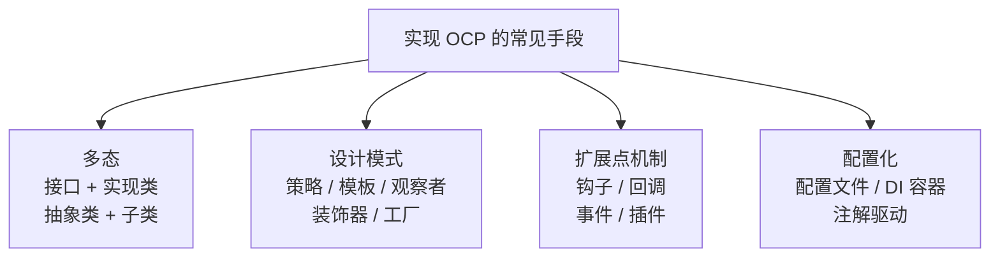
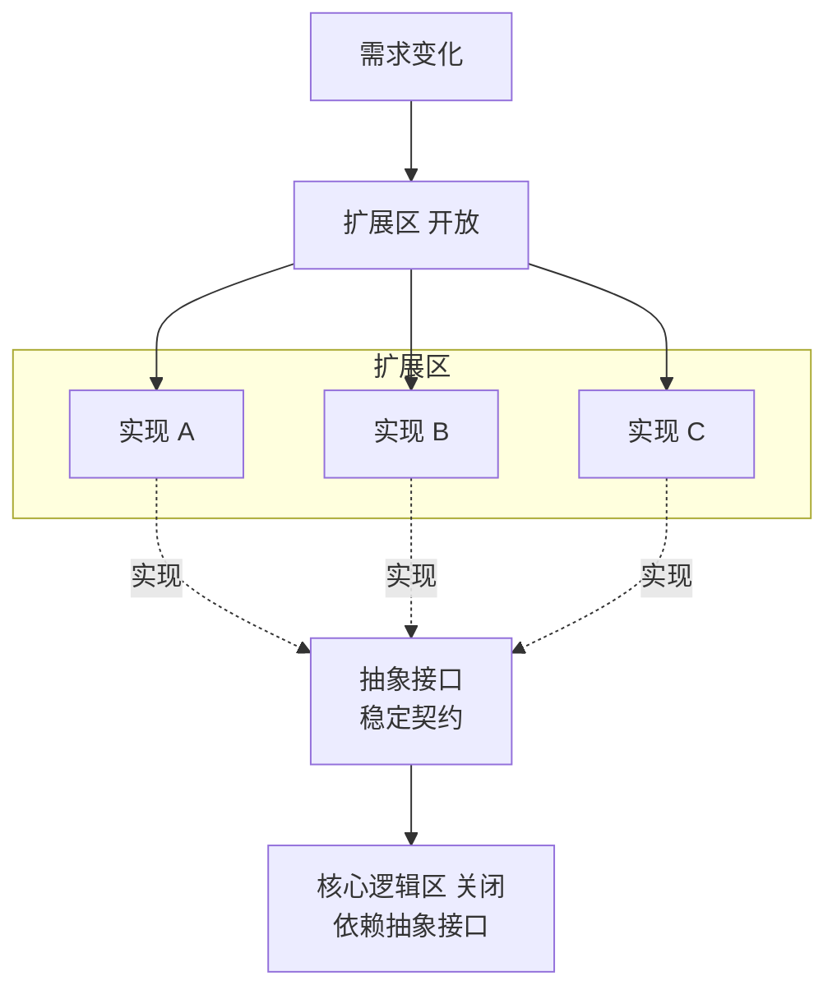

# 第二卷第3章：开闭原则详细介绍

#### 目录介绍
- [1.工作中真实案例](#1工作中真实案例)
- [2.问题思考与分析](#2问题思考与分析)
- [3.如何理解开闭原则](#3如何理解开闭原则)
- [4.开闭原则提出背景](#4开闭原则提出背景)
- [5.OCP为何最难学](#5ocp为何最难学)
- [6.实现开闭之手段](#6实现开闭之手段)
- [7.画图形案例分析](#7画图形案例分析)
- [8.银行业务案例分析](#8银行业务案例分析)
- [9.OCP隔离变化点](#9ocp隔离变化点)
- [10.工业框架中OCP](#10工业框架中ocp)
- [11.开闭原则的利弊](#11开闭原则的利弊)
- [12.开篇促销再回顾](#12开篇促销再回顾)
- [13.本篇收获总结](#13本篇收获总结)
- [14.课后思考练习](#14课后思考练习)
- [15.课后实战练习](#15课后实战练习)


## 1.工作中真实案例

### 1.1 促销代码演变史

终端开发在"促销活动 / 运营模块"里几乎一定会遇到下面这段心路历程：

- V1：只有一种折扣 → `price * 0.8`，写在 `OrderPresenter` 里。
- V2：运营要"满 99 减 10"，加一个 `if (total >= 99) total -= 10;`
- V3：要"会员 7 折"，再加一个 `if (isVip) total = total * 0.7;`
- V4：大促期间"满减 + 会员折上折 + 新人券"叠加，又加了一堆嵌套 if-else，还要小心顺序不能反。
- V5：某次紧急上线，把两个 if 的先后顺序写反了，导致**全量用户多扣钱**。

每加一种运营玩法就要**打开**同一段代码改一次，**每一次修改都有机会把以前的逻辑改坏**，这不是业务复杂，而是**代码不能"不改就扩展"**。

### 1.2 非业务复杂之因

这里需要一个**反向思考**：如果运营只要 1 种折扣、一辈子不变，V1 那些 `price * 0.8` 的写法有错吗？没错。

那问题发生在哪一步？发生在**从 V1 到 V2** 那一刷代码。你不是"加了一个折扣"，你是"把一个原本不需要变的类变成了会随运营玩法一起变动的类"。

本质问题是，**原本"稳定的计算器"被背上了"会随运营变动的动机"**，这两者本来应该被隔开。

上一篇 SRP 解决了"一堆东西塞一个类"的问题；但就算每件事都只塞了一个类，新需求来了还是要"**改那一个类**"。

本篇要解决的就是这一步，**开闭原则（OCP）**：对扩展开放、对修改关闭。读完本篇再回头看那堆促销 if-else，你会知道它本来应该长成什么样、下次大促加一种新玩法**只需要"加一个文件，不动任何旧文件"**

## 2.问题思考与分析

还是那个习惯，**带着问题去读定义**。本篇会团团转这几个问题：

**1.什么叫开闭原则**？它的主要用途是什么？为什么不是"远离修改"而是"另外一种修改方式"？

**2.如何做到"对扩展开放、对修改关闭"**？结合案例说一下怎么实现？为什么这么实现才能达到"对扩展开放"？

**3.你平常是如何理解开闭原则的**？判断的标准是什么？怎么区分"违反了 OCP"跟"只是还没抽象"？

这三个问题看似面似，本质是要让你考虑三次 **"为什么"**：为什么要有 OCP、为什么那么实现、什么时候才该上 OCP。不考虑这三次"为什么"，只会背一句"对扩展开放"是没用的。

## 3.如何理解开闭原则

### 3.1 OCP标准定义

开闭原则（Open-Closed Principle，OCP）英文定义： `Software entities (modules, classes, functions, etc.) should be open for extension, but closed for modification.`

翻译成中文：**软件实体（模块、类、方法等）应该对扩展开放、对修改关闭**。

更详细一点：**添加一个新功能应该是在已有代码基础上扩展（新增模块/类/方法），而非修改已有代码**。

### 3.2 为何容易被误读

这句话背下来很容易变成一句"不能改代码"的口号。实际上并不是，要拆联在一起看：

**对修改关闭**关闭的不是所有代码，是稳定的核心逻辑；**对扩展开放**"开放的也不是任意扩展，是预留好的扩展点。

三个调用者谁也别动原计算器的脸，但所有调用者可以随意插件化定义计算中可被作为变量的那一部分（折扣策略）。**这才是 OCP**。

### 3.3 通俗案例理解

❌ 坏设计：每次新促销 → 改这段代码 → 容易出bug

```
结账(商品) {
    if (今天是周一) { 打9折 }
    else if (今天是周二) { 打8折 }
    else if (顾客是会员) { 打7折 }
    else if (商品是水果) { 打85折 }
}
```

✅ 好设计：加新促销 → 新增一个策略类 → 不用改老代码。

```
接口 打折策略 {
    计算折扣(商品)
}

周一打折策略 { 计算折扣() { 打9折 } }
周二打折策略 { 计算折扣() { 打8折 } }
会员打折策略 { 计算折扣() { 打7折 } }
水果打折策略 { 计算折扣() { 打85折 } }

// 核心结账代码不用改
结账(商品, 打折策略 s) {
    s.计算折扣(商品)
}
```

从上面坏设计演变到好设计，就是典型的开闭原则！

## 4.开闭原则提出背景

### 4.1 为何出现这条原则

在软件的生命周期内，因为变化、升级和维护等原因需要对原有代码进行修改时，可能会把错误引入到原本已经测试过的旧代码里，破坏原有系统。

因此当软件需要变化时，应该尽量**通过扩展的方式**来实现变化，而不是通过修改已有代码来实现。

### 4.2 改旧代码为何代价高

这里要问一个问题：为什么"修改旧代码"代价远远高于"新增代码"？三个原因：

**1.已验证路径被污染**：旧代码已经跑过上千万次、过了几轮迭代的考验，本质是"验证过的路径"；修改后，这部分代码在运行时走的是一条新路径，重新变成"未验证路径"。

**2.隐藏调用者众多**：一个使用了三年的类，被多少上游依赖是你不知道的。改一个后果超出当初设计预期是常态。

**3.回测成本高**：一次全量回归成本远高于仅验证新增部分。

### 4.3 现实中应用考量

现实开发中"只通过继承来升级"只是一个理想愿景，修改原有代码和扩展代码往往是同时存在的。软件开发最不变的就是"变化"本身，产品一直在升级，修改旧代码就会带来引入 Bug 的风险，**答案就是尽量遵守开闭原则**。

这里有个重要衡量点：**不要为了"遵守 OCP"而遵守 OCP**。如果某个点并不会变化，那为它抽一堆抽象反而是负担。下一节会讲这个点。

## 5.OCP为何最难学

### 5.1 三处难点的来源

OCP 是 SOLID 中**最难理解、最难掌握、也最有用**的一条：

**1.难理解**：怎样的代码改动算"扩展"？怎样的算"修改"？修改就一定违反 OCP 吗？

**2.难掌握**：如何做到"对扩展开放、对修改关闭"？如何在追求扩展性的同时不让代码过于复杂？

**3.最有用**：扩展性是代码质量最重要的衡量标准之一。**23 种经典设计模式中，大部分都是为了解决扩展性问题**，遵循的主要就是 OCP。

### 5.2 初学者两大坑

加一点实证经验：

**1.坑一：什么都抽接口**。看到 SRP、OCP 之后兴奋不已，所有代码都加一层接口，代码量翻倍，却只多了一个实现类 → **这是过度设计**。

**2.坑二：抱死一套抽象不改**。业务已经变了、当初设计的抽象不适合了，还硬要在原有抽象上加接口 / 加默认方法去兼容 → **抽象本身也应该被重构**。

**初学者不难看出 OCP 说了什么，难的是"什么时候上 OCP、什么时候不上"**。本篇后面的案例会反复玩这个平衡。

## 6.实现开闭之手段

### 6.1 四类常见手段



### 6.2 为何皆能实现之

上面四种手段看似不同，本质上在做同一件事：**抽出一个稳定的约定点，让变化部分从约定点接入**。这也是下面要理解的 OCP 三要素：

1. **稳定点**：谁不变？，接口 / 抽象类 / 抽象函数类型 / 扩展点定义；
2. **接入点**：怎么插进去？，多态调用 / 注册表 / 事件总线 / DI 容器 / 配置加载；
3. **变化点**：谁会变？，业务实现类 / 插件 / Lambda / 配置项。

**记住这三点，所有手段只是表现形式的不同**。下面两个案例中会一一看到这三点是怎么落实的。

## 7.画图形案例分析

### 7.1 初版违反开闭

图形绘制程序要支持矩形、圆形、三角形等。初版设计：

```java
public class GraphicEditor {

    public void draw(Shape shape) {
        if (shape.type == 1)       drawRectangle();
        else if (shape.type == 2)  drawCircle();
    }

    public void drawRectangle() { System.out.println("画长方形"); }
    public void drawCircle()    { System.out.println("画圆形"); }

    static class Shape     { int type; }
    static class Rectangle extends Shape { Rectangle() { type = 1; } }
    static class Circle    extends Shape { Circle()    { type = 2; } }
}
```

要增加一种三角形：① 加 `Triangle` 类 ② 加 `drawTriangle()` 方法 ③ 改 `draw()` 加个 `if`，**每增加一种类型就要改 3 处**。这违反了 OCP。

### 7.2 为何此写法不可接受

"改 3 处"看似可接受，实际上背后隐藏了三个越走越远的代价：

1. **调用点集中炸裂**：`draw()` 是中心调用点，每加一种形状都要进这里改，项目迭代 3 年后 这个函数会变成 if-else 坟；
2. **类型安全反转**：`int type` 是魔法数字，多一个类型要定义一个常量；编译期你报不出"招不住这个类型"的错，完全靠运行期推亚；
3. **并发修改冲突**：两个人同时加两种形状，必冲突。

这是"该多态的地方用了判断"的典型代码坏味道。

### 7.3 遵循开闭的版本

```java
public interface Shape {
    void draw();
}

public class Rectangle implements Shape {
    public void draw() { System.out.println("画矩形"); }
}

public class Circle implements Shape {
    public void draw() { System.out.println("画圆形"); }
}

public class GraphicEditor {
    public void draw(Shape shape) { shape.draw(); }
}
```

各种形状自己规范自己的行为，`GraphicEditor.draw()` 只负责转发。新增三角形时：

```java
public class Triangle implements Shape {
    public void draw() { System.out.println("画三角形"); }
}
```

**`GraphicEditor` 一行都不用动**，这就是 OCP。

### 7.4 背后设计思想谈

为什么同一个需求，两种写法未来的可维护性差距这么大？本质区别是两种不同的**职责划分方向**：

初版是"**平台推业务**"，`GraphicEditor` 的 `draw()` 主动了解所有子类、所有类型都该怎么画；

OCP 版是"**业务反向告诉平台**"，每个子类告诉 `GraphicEditor`："我会画，不需要你管怎么画"。

**职责从"中心"转移到"各个子类"**，这就是多态背后真正的恍然点。以后读设计模式会反复看到这个思想。

## 8.银行业务案例分析

### 8.1 违反开闭之初版

银行业务：存钱、取钱、转账。

```java
public class BankBusiness {
    public void operate(int type) {
        if (type == 1)      save();
        else if (type == 2) take();
        else if (type == 3) transfer();
    }
    public void save()     { System.out.println("存钱"); }
    public void take()     { System.out.println("取钱"); }
    public void transfer() { System.out.println("转账"); }
}
```

新增"理财"业务 → 新增方法 → 改 `operate()`。**典型的 OCP 违反**。

### 8.2 违反后的隐性代价

生产环境中这样的代码会出什么事？举三个真实发生过的场景：

- 加"理财"要改 `operate()`，同一函数上个季度刚被安全会计过一轮，这次改了又得重新走一遍合规审；
- 上线后发现"理财"逻辑里一个分支写错，修复。但修复这个分支时不小心动了一个公共变量 → **存钱、取钱也一起出事了**；
- 某个分行定制"多人联合取钱"，取钱分支被改出一个分支。后来发现"转账"产品被连带影响了。

**共同点是什么？不同业务的代码被与调者装进了同一个函数**，其中一个出事会环影响其他。这才是"违反 OCP"最可怕的地方，**不是代码难看，是改代码时会伤及不该被伤及的人**。

### 8.3 遵循开闭的版本

```java
public interface Business {
    void operate();
}

public class Save     implements Business { public void operate() { System.out.println("存钱业务"); } }
public class Take     implements Business { public void operate() { System.out.println("取钱业务"); } }
public class Transfer implements Business { public void operate() { System.out.println("转账业务"); } }

public class BankBusiness {
    public void operate(Business business) {
        System.out.println("处理银行业务");
        business.operate();
    }
}
```

新增"理财"：

```java
public class Finance implements Business {
    public void operate() { System.out.println("理财业务"); }
}
```

原有代码一行未改。

### 8.4 何时该上这个抽象

上一节警告过"不要什么都抽"，那什么时候才该上 OCP？这里给个可量化的经验法则，**Rule of Three**：

- 1 个实现：不抽象，直接写。
- 2 个实现：考虑要不要抽，有点重复就先抽，纯幸运重复就先不抽。
- 3 个以上：抽。

业务写多了就会发现：**业务增加到 3 个的时候，就该停下来想"怎么写才能让它方便扩展"**。Rule of Three 与 YAGNI 不矛盾：前者是"什么时候上抽象"，后者是"不要为可能不会发生的事提前抽象"。


## 9.OCP隔离变化点

### 9.1 变化点模型

OCP 的真正含义不是"永远不改代码"，而是**识别变化点，将变化封装在扩展中**。关键是区分：哪些代码是稳定的（关闭修改），哪些是易变的（开放扩展）。



### 9.2 Meyer与Martin

OCP 最早由 Bertrand Meyer 在 1988 年的《Object-Oriented Software Construction》中提出，但他的定义与今天的通用理解有重要区别：

| 维度 | Meyer 的 OCP（1988） | Martin 的 OCP（2000s） |
|---|---|---|
| 扩展方式 | 通过**继承**实现 | 通过**抽象 + 多态 + 组合**实现 |
| "关闭"含义 | 发布后模块不再修改源码 | 核心逻辑不因新增功能而改动 |
| 实现手段 | 继承为主 | 接口、策略模式、插件机制 |

**关键演进**：现代 OCP 更推荐**组合优于继承**。过度继承会让类层次膨胀，应更多使用接口 + 组合。

**为什么会有这个演进**？因为 Meyer 那个年代类型体系不面向接口编程、泛型也不成熟，"继承"是只能选的手段。进入 Java/C# 代后"继承严重耦合"的问题越发凸显，业界转向"用接口描述契约、用组合描述实现"，OCP 的落地手段也随之迁移。这提醒我们：**原则是稳定的，实现应随语言能力的增长不断进化**。

### 9.3 策略改造折扣

```java
// 抽象：折扣策略（稳定契约）
public interface DiscountStrategy {
    double calculate(double price);
    String name();
}

// 实现 1：无折扣
public class NoDiscount implements DiscountStrategy {
    public double calculate(double price) { return price; }
    public String name() { return "无折扣"; }
}

// 实现 2：百分比折扣
public class PercentageDiscount implements DiscountStrategy {
    private final double percent;
    public PercentageDiscount(double percent) { this.percent = percent; }
    public double calculate(double price) { return price * (1 - percent / 100); }
    public String name() { return percent + "% 折扣"; }
}

// 实现 3：满减
public class FullReductionDiscount implements DiscountStrategy {
    private final double threshold, reduction;
    public FullReductionDiscount(double t, double r) { this.threshold = t; this.reduction = r; }
    public double calculate(double price) {
        return price >= threshold ? price - reduction : price;
    }
    public String name() { return "满 " + threshold + " 减 " + reduction; }
}

// 核心逻辑（对修改关闭）
public class OrderCalculator {
    public double calculateTotal(double price, DiscountStrategy discount) {
        double finalPrice = discount.calculate(price);
        System.out.println("原价 " + price + "，策略：" + discount.name() + "，折后 " + finalPrice);
        return finalPrice;
    }
}
```

新增"VIP 七折"策略？加一个文件就行，`OrderCalculator` 毫无感知：

```java
public class VipDiscount implements DiscountStrategy {
    public double calculate(double price) { return price * 0.7; }
    public String name() { return "VIP 七折"; }
}
```

### 9.4 此乃本质之因

为什么说隔离变化点才是 OCP 的本质，而不是"多态""策略"这些具体手段？因为：

- 所有设计模式只是**隔离变化点的不同手段**。策略隔离"计算方式"的变化，装饰器隔离"额外处理"的变化，观察者隔离"事件响应者"的变化。
- 不考虑变化点去上 OCP 是费动。不会变的部分上抽象只增加代码量，不创造价值。

一句话记住：**先找变化点，再选隔离手段。​不是反过来**。


## 10.工业框架中OCP

### 10.1 五个框架实践

| 框架/系统 | OCP 体现 | 扩展机制 |
|---|---|---|
| Spring Boot | 不修改框架，通过注解和配置扩展 | `@Bean`、`@Configuration`、`BeanPostProcessor` |
| Gin (Go) | 不修改框架，通过中间件扩展 | `router.Use(middleware)` |
| Webpack | 不修改核心，通过 Plugin/Loader 扩展 | `plugins: [new MyPlugin()]` |
| VSCode | 不修改编辑器，通过插件扩展 | Extension API |
| Linux 内核 | 不修改内核，通过模块扩展 | `insmod / modprobe` |

**结论**：优秀的框架设计本身就是 OCP 的最佳实践，稳定的核心 + 丰富的扩展点，用户通过扩展而非修改来满足需求。

### 10.2 从框架反推代码

这个表背后隐藏一个反向思考：**为什么你能用这些框架而不需要看源码**？因为它们提前为你预留了足够多的扩展点，你只需要 implement 一个接口、写一个中间件、发一个事件。

转过来问你自己的代码：

- 你的主流程代码能不能被别人"使用而不修改"？
- 你给调用者预留了几个扩展点？
- 你的接口足够稳定、能避免调用者被迫跟随你的修改吗？

三个问题有一个回答"不能"，代码的 OCP 就还有提升空间。


## 11.开闭原则的利弊

### 11.1 三大优势特点

1. **可维护性与复用性**：扩展而不改源码，不影响其他模块；
2. **可扩展性**：方便添加新功能、改进现有功能；
3. **可测试性**：降低耦合度，测试更容易，只需要测试新增的代码。

### 11.2 三大缺陷问题

1. **对设计能力要求高**：需要良好的抽象和封装，设计不好反而会让代码更复杂；
2. **可能增加代码量**：扩展会带来更多的类和接口；
3. **可能带来设计上的限制**：引入更多抽象层会限制表达灵活性。

### 11.3 衡量是否该上

优缺点列出来不够，**一个实用权衡公式**是：

> 应上 OCP 的代价 = 抽象设计成本 + 多出来的类文件跳转成本
>
> 不上 OCP 的代价 = 未来每一次修改中心代码的风险 + 回归成本

当"不上"的代价与频率 × 严重程度大于"上"的代价，就上，否则不上。他不是一个紅³的公式，但他能让你进入思考应不应上、不是一拍脑袋就抽象。

## 12.开篇促销再回顾

### 12.1 用本篇重新看

回头看 V1→V5 那段 if-else 进化史：

| 版本 | 本来的改法 | 遵循 OCP 后的改法 |
|---|---|---|
| 加"满减" | 改 `OrderPresenter`，新增 if | 新建 `FullReductionDiscount` 实现 `DiscountStrategy`，注册进去 |
| 加"会员折扣" | 再改 `OrderPresenter`，新增 if | 新建 `VipDiscount`，注册 |
| 加"新人券" | 又改 `OrderPresenter` | 新建 `NewUserCoupon`，注册 |
| 促销叠加 | 在 if-else 里写优先级 | 新建 `CompositeDiscount`，内部按顺序组合策略 |

业务侧的实际效果：**新增一种玩法 = 新建一个文件 + 改一行注册代码**。`OrderPresenter` 自此"关闭修改"，你再也不会因为加新活动而把老活动改坏。

**这正是开闭原则的威力：让稳定的核心和易变的扩展彻底分开**。

### 12.2 加文件而非改代码

那为什么 OCP 版还要加一个 `NewUserCoupon` 文件？按 "对修改关闭" 是不是"一行都不能加"？

不是。这里有个最常被误读的点：

> **OCP 说的 "闭" 是"闭于修改"，不是"闭于加文件"**。

"加一个新文件" 本身就是 "扩展"。不造成原代码上下文变动、不需要重跑原有回归、不存在 "一人修改另一人被迫看"的问题，这是 "加" 跟 "改" 本质的区别。

**"加文件" 是 OCP 鼓励的行为；"改进原有主流代码" 是 OCP 要消灭的行为**。


## 13.本篇收获总结

1. **一句话本质**：OCP 不是"永远不改代码"，而是"**识别变化点，把变化封装在扩展中**"，核心逻辑稳定、扩展区开放。
2. **一条实现主路**：抽象接口（稳定契约）+ 具体实现（可增删）+ 依赖注入/注册。策略模式 / 模板方法 / 观察者 / 插件机制都是这条主路的不同姿态。
3. **一条反向约束**：**不是所有代码都值得 OCP**。先有"会频繁变"的证据，再抽扩展点；否则就是过度设计，违反 YAGNI。
4. **一组健康信号**：加功能时手在哪里？如果基本只在"新增文件"上，OCP 良好；如果每次都要回老类里加 `if`，就已经在违反 OCP 了。


## 14.课后思考练习

1. **识别题**：你最近一次加需求改动了几个文件？其中有几个是"新增"、几个是"修改"？修改 vs 新增的比例越高，违反 OCP 越严重。给自己打个分。
2. **辨析题**：如果一个功能只有一种实现、而且未来几乎不会变，还要不要为它抽接口走 OCP？提示：参考 YAGNI 与 Rule of Three。
3. **权衡题**：策略模式能用继承实现，也能用函数（Lambda / `Function<T,R>`）实现。在 Java 8+ 里，你会选哪种？为什么？


## 15.课后实战练习

在你当前项目里挑一处**你最讨厌的 if-else / switch** 做改造：

1. **找变化点**：把所有 case 列出来，问自己"这几个 case 以后还会再加吗？"。如果会，它就是值得 OCP 化的变化点。
2. **抽抽象**：为这组 case 抽一个接口（或策略契约），给它取一个能说清楚"它约定了什么"的名字。
3. **换实现**：每个 case 写成一个实现类/函数。原先的 if-else 改成"根据 key 从注册表取策略 → 执行"。
4. **加新 case**：再加一个新的业务 case，验证你能**不改老代码**，只新增一个文件就搞定。

做完，再进入下一篇《04.里式替换原则介绍》，一旦开始用"抽象 + 多种实现"，立刻会面对一个新问题：**这些子类真的能互相替换吗？行为一致吗？**

