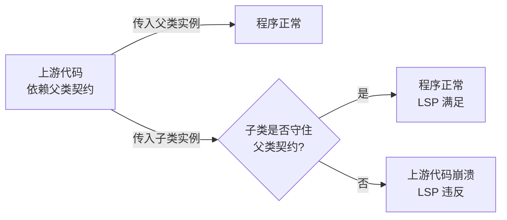
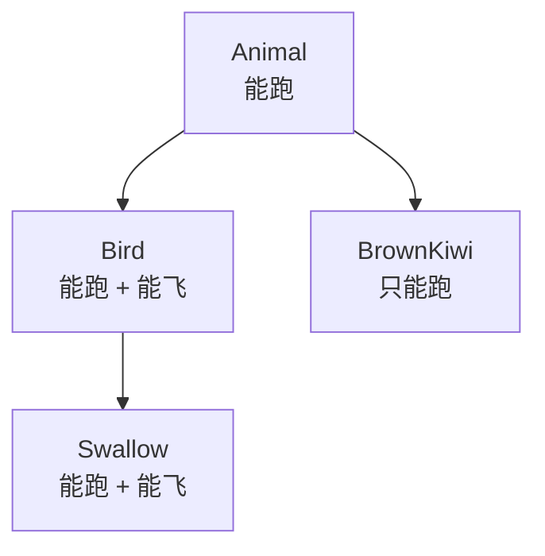
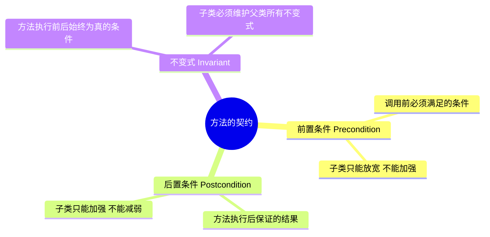
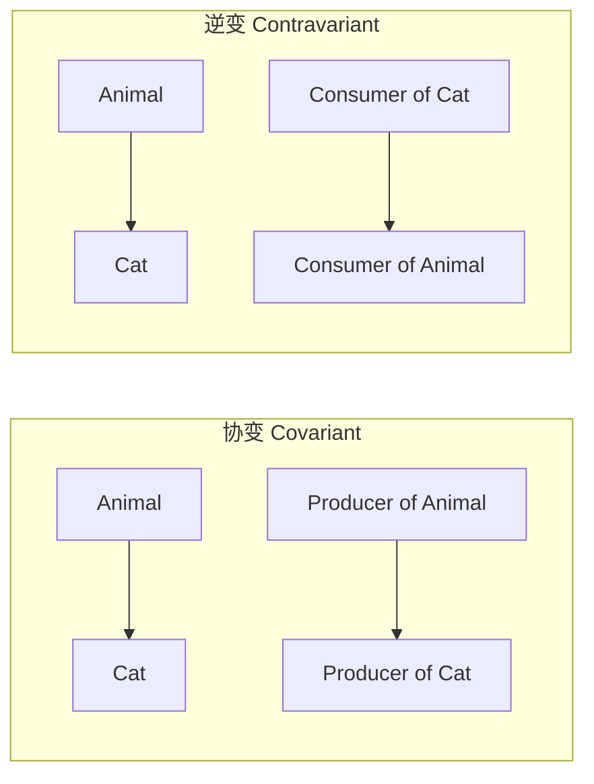

# 第二卷第4章：里式替换原则介绍

#### 目录介绍
- [1.工作中真实案例](#1工作中真实案例)
- [2.问题思考与分析](#2问题思考与分析)
- [3.里式替换原则描述](#3里式替换原则描述)
- [4.理解里式替换原则](#4理解里式替换原则)
- [5.支付案例演变过程](#5支付案例演变过程)
- [6.鸟类飞行演变过程](#6鸟类飞行演变过程)
- [7.LSP的理论根基](#7lsp的理论根基)
- [8.LSP的四条核心](#8lsp的四条核心)
- [9.正方非长方形例](#9正方非长方形例)
- [10.LSP的协变逆变](#10lsp的协变逆变)
- [11.LSP检查清单](#11lsp检查清单)
- [12.里氏替换的利弊](#12里氏替换的利弊)
- [13.里氏多态之区别](#13里氏多态之区别)
- [14.开篇控件回顾](#14开篇控件回顾)
- [15.本篇收获总结](#15本篇收获总结)
- [16.课后思考练习](#16课后思考练习)
- [17.课后实战练习](#17课后实战练习)
- [18.更多内容推荐](#18更多内容推荐)


## 1.工作中真实案例

做过终端 UI 框架的同学一定体会过这个坑：项目里有一个自研的基础控件 `BaseInput`，负责"接受输入 + 校验 + 派发变更事件"。某次业务同学写了一个 `PhoneInput` 继承它，在内部重写了"文本变更"逻辑——遇到非数字就直接把 `text` 置空，并**静默吞掉变更事件**。

几周后，一个用到这个输入框的表单页突然出现"用户填了东西却提交不了"，查了三天才定位到：表单页的上层代码完全按 `BaseInput` 的约定写的（"任何输入都会派发变更事件"），但 `PhoneInput` 悄悄破坏了这条约定。

这是一起典型的 **LSP 违反事故**：`PhoneInput` "看上去"是 `BaseInput` 的子类，能编译、能跑，但把父类承诺的"**变更事件一定会被派发**"这条契约给改了，于是所有依赖父类的上游代码就都成了定时炸弹。

本篇要解决的就是这类问题——**里式替换原则（LSP）**：**子类替换父类的地方，行为和契约必须保持不变**。读完本篇，你能诊断自己的继承体系是不是"看着合理，其实处处是坑"。

## 2.问题思考与分析

围绕这条原则，先带着三个问题进入正文：

1. 什么是里氏替换原则，如何理解这一原则？
2. 哪些场景满足里氏替换原则？
3. 它跟多态有什么区别？

在面向对象编程中，继承是一种重要的机制，它允许我们创建一个子类来继承父类的属性和行为。子类通过继承父类可以重用父类的代码，并且可以添加或修改一些特定的行为。

然而，当使用继承时，必须确保子类可以无缝地替换父类，而不会破坏原有的程序功能。**这就是里式替换原则的背景**。

## 3.里式替换原则描述

### 3.1 官方描述

里式替换原则的英文是 Liskov Substitution Principle，缩写为 LSP。这个原则最早是在 1986 年由 Barbara Liskov 提出：

> If S is a subtype of T, then objects of type T may be replaced with objects of type S, without breaking the program.

1996 年，Robert Martin 在 SOLID 原则中重新描述了这个原则：

> Functions that use pointers of references to base classes must be able to use objects of derived classes without knowing it.

综合两者的描述，用中文表达：

> **子类对象能够替换程序中父类对象出现的任何地方，并且保证原来程序的逻辑行为不变，以及正确性不被破坏。**

### 3.2 一句话理解

通俗地说：子类不是"差不多像父类就行"，而是要能"无缝接班"——接替之后，一切还得按父类承诺的规则正常工作。

## 4.理解里式替换原则

### 4.1 通俗案例举例

🐧 最通俗的案例：鸟会飞吗？

❌ 违反里氏替换原则。Bird的公开 API 暗示了"所有鸟都会飞"，但企鹅打破了这条契约。违反原则： 子类（企鹅）不能替换父类（鸟）。

```
class Bird {
    public void fly() {
        System.out.println("我在天上飞 ✈️");
    }
}

class Penguin extends Bird {
    @Override
    public void fly() {
        throw new UnsupportedOperationException("企鹅不会飞 😢");
    }
}
```

✅ 正确设计。把"飞"从 Bird 的通用承诺中剥离出来，所有"会飞的鸟"都能替换"会飞的鸟"父类，企鹅不会飞，所以不在"会飞的鸟"体系里。

```java
abstract class Bird {
    // 鸟的基本共性：有名字、会呼吸……
}

interface Flyable {
    void fly();
}

class Sparrow extends Bird implements Flyable {
    public void fly() { System.out.println("麻雀飞啦"); }
}

class TianE extends Bird implements Flyable {
    public void fly() { System.out.println("天鹅飞啦"); }
}

class Penguin extends Bird {
    // 企鹅就是 Bird，但不实现 Flyable —— 没人会误以为它能飞
}
```

### 4.2 里氏替换原则说明

里氏替换原则是设计模式六大原则之一，核心有两点：

1. **子类必须能够替换父类**：子类对象可以替换父类对象，程序的行为不会发生变化。
2. **保证行为一致性**：子类在扩展父类功能的同时，不能改变父类原有的行为。

通俗地说，如果程序中使用的是一个基类对象，那么在不修改程序的前提下，用它的子类对象替换这个基类对象，程序应该仍然可以正常运行。



## 5.支付案例演变过程

### 5.1 有缺陷的代码

假设电商系统中设计了一个支付类 `Payment`，有一个子类 `CreditCardPayment` 用于处理信用卡支付：

```java
class Payment {
    public void pay(double amount) {
        // 支付逻辑
    }
}

class CreditCardPayment extends Payment {
    @Override
    public void pay(double amount) {
        if (amount > 1000) {
            throw new IllegalArgumentException("信用卡支付金额不能超过1000元");
        }
        // 信用卡支付逻辑
    }
}
```

此时在系统中使用 `Payment` 基类对象进行支付：

```java
Payment payment = new CreditCardPayment();
payment.pay(1200);   // 运行时抛异常
```

由于 `CreditCardPayment` 加了自己的限制（>1000 就抛异常），**父类允许的输入在子类里却不被允许**——这就是典型的"子类前置条件被加强"，违反了里式替换原则。

### 5.2 遵守里氏替换法

为了遵循 LSP，应该确保子类扩展父类功能时，保持父类的行为一致性。可以在父类中把通用约束先声明清楚：

```java
class Payment {
    public void pay(double amount) {
        if (amount <= 0) {
            throw new IllegalArgumentException("支付金额必须大于0");
        }
        // 通用支付逻辑
    }
}

class CreditCardPayment extends Payment {
    @Override
    public void pay(double amount) {
        super.pay(amount);     // 保持父类的约束
        // 信用卡特有逻辑
    }
}
```

子类继承了父类的行为，并且在支付逻辑之前调用 `super.pay(amount)`，确保所有支付金额都符合父类的约束。这样无论是使用基类对象还是子类对象，程序的行为都保持一致，遵循了里氏替换原则。

## 6.鸟类飞行演变过程

### 6.1 未守里氏替换

鸟一般都会飞行，如燕子的飞行速度大概是每小时 120 千米。但是新西兰的几维鸟由于翅膀退化无法飞行。假如要设计一个实例，计算这两种鸟飞行 300 千米要花费的时间：

```java
class Bird {
    double flySpeed;
    public void setSpeed(double speed) { this.flySpeed = speed; }
    public double getFlyTime(double distance) { return distance / flySpeed; }
}

class Swallow extends Bird { }

class BrownKiwi extends Bird {
    @Override
    public void setSpeed(double speed) {
        this.flySpeed = 0;     // 几维鸟不会飞，速度被强制改成 0
    }
}

// 调用方按父类契约使用
Bird bird = new BrownKiwi();
bird.setSpeed(120);
bird.getFlyTime(300);   // 除零！
```

拿燕子测试能算出飞行时间；但拿几维鸟测试，结果会是除零异常或无穷大，明显不符合预期。

**问题定位**：几维鸟类重写了鸟类的 `setSpeed()` 方法，让它对"设置速度"这个动作的语义失效了，违背了里式替换原则。几维鸟的飞行不是正常鸟类的功能，**父类抽取的共性有问题**，应该抽取更具共性的能力。

### 6.2 遵里氏替换法

取消几维鸟对 `Bird` 的继承，定义一个更一般的父类 `Animal`（拥有奔跑能力），`Bird` 在 `Animal` 基础上扩展"飞行"能力，几维鸟直接继承 `Animal`：

```java
class Animal {
    double runSpeed;
    public void setRunSpeed(double speed) { this.runSpeed = speed; }
    public double getRunTime(double distance) { return distance / runSpeed; }
}

class Bird extends Animal {
    double flySpeed;
    public void setFlySpeed(double speed) { this.flySpeed = speed; }
    public double getFlyTime(double distance) { return distance / flySpeed; }
}

class Swallow extends Bird { }      // 燕子：既能跑也能飞
class BrownKiwi extends Animal { }  // 几维鸟：只能跑
```

调整后，调用方按 `Animal` 契约使用时两类都能正常工作；按 `Bird` 契约使用时，只有"真的会飞的鸟"才能被传入——继承层级的抽象边界，被调整到了**所有子类都能守住契约**的位置。



## 7.LSP的理论根基

**疑惑**：里氏替换原则和简单的"子类继承父类"有什么本质区别？

LSP 的理论基础是 Bertrand Meyer 提出的**契约式设计（Design by Contract, DbC）**。每个方法都有一个隐含的"契约"，包含三个要素：



用数学语言表达：

```
若 P 是父类方法的前置条件, Q 是父类方法的后置条件
则子类方法必须满足:
    P_sub ⊇ P_parent  (子类前置条件 ⊇ 父类前置条件，即更宽松)
    Q_sub ⊆ Q_parent  (子类后置条件 ⊆ 父类后置条件，即更严格)
```

## 8.LSP的四条核心

### 8.1 前置不可加强

```java
// 父类：金额必须>0
class Payment {
    public void pay(double amount) {
        if (amount <= 0) throw new IllegalArgumentException("金额必须>0");
    }
}

// 违反 LSP：子类额外加了上限
class CreditCardPayment extends Payment {
    @Override
    public void pay(double amount) {
        if (amount <= 0 || amount > 1000)    // 更严格！
            throw new IllegalArgumentException("金额范围 1-1000");
    }
}

// 遵循 LSP：不加强前置条件
class CreditCardPayment2 extends Payment {
    @Override
    public void pay(double amount) {
        super.pay(amount);
        // 信用卡特有逻辑
    }
}
```

### 8.2 后置不可减弱

```java
// 父类约定：返回"从小到大"排序的结果
class Sorter {
    public int[] sort(int[] data) {
        int[] copy = data.clone();
        Arrays.sort(copy);
        return copy;
    }
}

// 违反 LSP：子类返回未排序的结果
class BrokenSorter extends Sorter {
    @Override
    public int[] sort(int[] data) { return data; }   // 没排序
}

// 遵循 LSP：实现方式可以不同，但结果仍是有序的
class QuickSorter extends Sorter {
    @Override
    public int[] sort(int[] data) {
        // 用快排实现，结果仍然有序
        return quickSort(data.clone());
    }
    private int[] quickSort(int[] a) { /* ... */ return a; }
}
```

### 8.3 不抛未声明异常

```java
// 父类：只声明了 IOException
class FileLoader {
    public String read(String path) throws IOException { return ""; }
}

// 违反 LSP：子类多抛了一个父类没承诺的异常
class NetworkFileLoader extends FileLoader {
    @Override
    public String read(String path) throws IOException, SecurityException {
        return "";
    }
}

// 遵循 LSP：异常统一包装为父类声明的类型
class NetworkFileLoader2 extends FileLoader {
    @Override
    public String read(String path) throws IOException { return ""; }
}
```

### 8.4 不改变语义描述

```java
// 父类契约：Count() 返回集合中的元素数量
interface Collection {
    void add(Object item);
    int count();
}

// 正确实现
class SimpleList implements Collection {
    private List<Object> items = new ArrayList<>();
    public void add(Object item) { items.add(item); }
    public int count() { return items.size(); }
}

// 违反 LSP：count() 语义被改成了"访问次数"
class BrokenList implements Collection {
    private List<Object> items = new ArrayList<>();
    private int accessCount = 0;
    public void add(Object item) { items.add(item); }
    public int count() { return ++accessCount; }   // 不是元素数量！
}
```

## 9.正方非长方形例

> **疑惑**：数学上正方形是特殊的长方形，编程中正方形能继承长方形吗？

这是 LSP 最经典的反例。

```java
class Rectangle {
    protected double width, height;
    public void setWidth(double w)  { this.width = w;  }
    public void setHeight(double h) { this.height = h; }
    public double area() { return width * height; }
}

class Square extends Rectangle {
    @Override
    public void setWidth(double w)  { this.width = w; this.height = w; }
    @Override
    public void setHeight(double h) { this.width = h; this.height = h; }
}

// 客户端代码依赖 Rectangle 的契约："宽高可独立设置"
void testArea(Rectangle rect) {
    rect.setWidth(5);
    rect.setHeight(4);
    assert rect.area() == 20;
}

testArea(new Rectangle());   // 通过
testArea(new Square());      // 失败！面积是 16 而不是 20
```

**分析**：正方形虽然在数学上"is-a"长方形，但在编程中不满足 LSP——`Rectangle` 的契约允许独立修改宽高，而 `Square` 破坏了这个契约。

**正确的设计**：抽出更一般的 `Shape`，让正方形和长方形**平级**存在：

```java
interface Shape {
    double area();
}

class Rectangle implements Shape {
    private double width, height;
    public Rectangle(double w, double h) { this.width = w; this.height = h; }
    public double area() { return width * height; }
}

class Square implements Shape {
    private double side;
    public Square(double side) { this.side = side; }
    public double area() { return side * side; }
}
```

## 10.LSP的协变逆变

> **疑惑**：什么是协变和逆变？它们和 LSP 有什么关系？

协变和逆变是类型系统对 LSP 的形式化表达。假设 `Cat` 是 `Animal` 的子类：



- **协变**（方向一致）：返回值方向，`Producer<Cat>` 是 `Producer<Animal>` 的子类型。
- **逆变**（方向相反）：参数方向，`Consumer<Animal>` 是 `Consumer<Cat>` 的子类型。
- **不变**：Java 泛型默认不变，`List<Animal>` 和 `List<Cat>` 之间没有继承关系。

**Java 通配符中的实际意义**：

```java
// 协变：? extends T（只读/生产者）
List<? extends Animal> animals = new ArrayList<Cat>();
Animal a = animals.get(0);       // 可以读
// animals.add(new Cat());       // 不能写

// 逆变：? super T（只写/消费者）
List<? super Cat> cats = new ArrayList<Animal>();
cats.add(new Cat());             // 可以写
// Cat c = cats.get(0);          // 不能安全读
```

这就是 **PECS 原则（Producer Extends, Consumer Super）**——LSP 在 Java 泛型中的具体应用。

## 11.LSP检查清单

| 检查项 | 描述 | 违反后果 |
| :--- | :--- | :--- |
| 前置条件 | 子类方法是否要求了更多的输入约束？ | 调用者在父类可用，但换成子类就报错 |
| 后置条件 | 子类方法是否保证了更少的输出约束？ | 调用者依赖的结果不可靠 |
| 不变式   | 子类是否破坏了父类的状态约束？     | 对象进入非法状态 |
| 异常     | 子类是否抛出了意料之外的异常？     | 调用者未做异常处理，直接崩溃 |
| 语义     | 子类方法的行为含义是否改变？       | 最隐蔽的违反，难以排查 |

## 12.里氏替换的利弊

子类应该能够替代父类并且表现出相同的行为，而不需要修改原有的程序逻辑。遵循 LSP 的好处：

1. **可扩展性**：可以通过添加新的子类来扩展系统的功能，而不需要修改现有的代码。
2. **可维护性**：当需要修改系统的行为时，只需要修改子类的代码，其他相关代码不动。
3. **可重用性**：可以通过使用父类的对象来处理子类的对象，从而提高代码的重用性。

也存在一些潜在的限制：

1. **过度设计**：为了确保子类能够无缝替换父类，可能需要在子类中添加许多条件和限制，增加代码复杂度。
2. **难以满足所有情况**：特定的业务需求可能导致无法完全满足 LSP 的要求，需要在设计中做出权衡。
3. **可能引入不必要的抽象**：为了满足 LSP，可能需要额外的抽象层，增加理解难度。

## 13.里氏多态之区别

虽然从定义描述和代码实现上看，多态和里式替换有点像，但它们关注的角度是不一样的：

| 维度 | 多态 | 里氏替换原则 |
| :--- | :--- | :--- |
| 性质 | 面向对象编程的语言特性 | 面向对象设计的原则 |
| 关注点 | 语法层面：子类可以替换父类，调用时执行子类实现 | 设计层面：子类替换父类时不破坏程序正确性 |
| 方向 | "能不能这么写" | "该不该这么写" |

一句话记忆：**多态是语法，里氏替换是契约**。

## 14.开篇控件回顾

开篇那个 `PhoneInput` 静默吞事件的问题，放到 LSP 四条规则下一看就很明白：

| 父类 `BaseInput` 的契约 | `PhoneInput` 实际做了什么 | 违反了哪条 |
| :--- | :--- | :--- |
| 任何输入都会派发变更事件 | 非数字时**不派发** | 后置条件被减弱 |
| 异常时仍返回统一错误状态 | 直接吞掉         | 改变了语义 |
| 不限制字符集               | 静默拒绝非数字   | 前置条件被加强 |

正确的改法有两种思路：

1. **不要继承 `BaseInput`**：`PhoneInput` 和 `BaseInput` 只是"长得像"，关系应当是"组合"而不是"继承"——`PhoneInput` 内部持有一个 `BaseInput`，上层直接拿 `PhoneInput` 的专属接口用。
2. **保留继承但不破坏契约**：允许输入任何字符，但在 `PhoneInput` 里**多暴露一个** `isValidPhone()` 给调用方判断，而不是偷偷改变父类原有行为。

记住这句话：**"子类可以做得更多，但不能做得更少，更不能改变含义"**。这就是 LSP 的全部。

## 15.本篇收获总结

1. **一条核心标准**：继承不是"语法上能写"就叫正确，关键看**契约是否保持**。契约 = 前置条件 + 后置条件 + 不变式 + 异常声明 + 语义。
2. **四条可操作规则**：前置条件不能加强；后置条件不能减弱；不能抛父类未声明的异常；不能改变方法语义。
3. **一个经典反例**：正方形不是长方形——数学上成立不代表编程上成立，判断"是不是 is-a"要从契约出发而不是从现实世界出发。
4. **一个实用工具箱**：协变/逆变、PECS 原则（Java 泛型）、契约式设计（DbC），都是 LSP 在类型系统中的延伸。
5. **一个反向约束**：LSP 告诉你**继承该不该用**。很多"用了多态却频繁出问题"的场景，真正的答案是"应该用组合而不是继承"。

## 16.课后思考练习

1. **识别题**：在你当前项目里找一条继承链（超过两层的），画一张"契约检查表"：父类方法的前置/后置条件/异常分别是什么？子类有没有改？如果子类默默改了，**多久之后会出第一个 Bug**？
2. **辨析题**：你认为"把 `throw new UnsupportedOperationException()` 作为某些子类方法的实现"是 LSP 的灵活应用，还是违反？（提示：`Collections.unmodifiableList()` 就是这么做的）
3. **权衡题**：在一个动态语言项目（Python/JS）里，编译期不会检查类型，LSP 还有意义吗？如果有，它以什么形式起作用？

## 17.课后实战练习

在你当前项目里找一条 **"父类 + 3 个以上子类"** 的继承链：

1. **写契约**：用一句话写清父类关键方法的"前置/后置/异常"三要素。
2. **对照子类**：给每个子类打勾或打叉，看它是否守住这三要素。凡是打叉的，就是 LSP 违反点。
3. **二选一修复**：挑一处最严重的违反，做下列二选一的修复：
   - 保留继承：把子类违反的地方改回去，或把父类的契约放宽让它能容纳子类；
   - 废掉继承：改成"组合 + 单独接口"。
4. **跑一遍上游测试**：LSP 问题的特征是"**改子类会把父类调用方跑挂**"，修复后上游所有原有测试都应当绿。

做完，再进入下一篇《05.接口隔离原则介绍》——你会发现，很多 LSP 违反其实是因为一开始"接口就设计得太大、太全"，子类根本没法全部满足。
