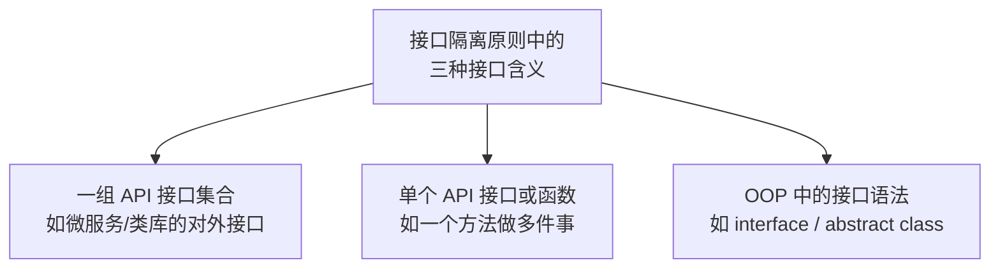
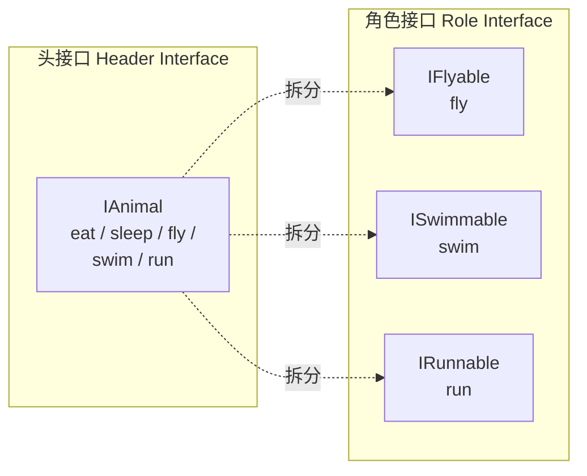

# 第二卷第5章：接口隔离原则介绍

#### 目录介绍
- [1.工作中的真实案例](#1工作中的真实案例)
- [2.问题思考与分析](#2问题思考与分析)
- [3.本篇学习目标](#3本篇学习目标)
- [4.理解接口隔离原则](#4理解接口隔离原则)
- [5.接口隔离之思想](#5接口隔离之思想)
- [6.API接口集合例](#6api接口集合例)
- [7.单个API接口或函数](#7单个api接口或函数)
- [8.角色与头接口](#8角色与头接口)
- [9.ISP在API设计](#9isp在api设计)
- [10.ISP的度量标准](#10isp的度量标准)
- [11.接口与单责区别](#11接口与单责区别)
- [12.开篇分享再回顾](#12开篇分享再回顾)
- [13.本篇收获总结](#13本篇收获总结)
- [14.课后思考练习](#14课后思考练习)
- [15.课后实战练习](#15课后实战练习)
- [16.更多内容推荐](#16更多内容推荐)


## 1.工作中的真实案例

### 1.1 胖SDK的真痛点

做过终端的同学一定对"胖 SDK"不陌生，团队里有一个"分享 SDK"，对外暴露了一个 `IShare` 接口：`shareToWeChat / shareToQQ / shareToWeibo / shareToSystem / preloadImage / reportExposure / getChannelIcon / getInstalledApps / ...` 一共 **30 多个方法**。

新业务只用到"分享到微信 + 上报曝光"两个方法，却必须实现全部 30 个，哪怕是空实现或直接抛异常。某天 SDK 新增了一个 `shareToRedNote()` 方法，全项目十几个 `IShare` 的实现类**全部编译失败**，改起来让人头禿。

### 1.2 胖接口的设计错

为什么一个看似合理的"把分享相关的都集中在一起"，会在三年后变成一枚炸弹？本质问题是：

- 设计者是从"我（SDK）能提供什么"出发的，而不是"调用者（业务）需要什么"出发；
- 业务实际上被拆成三个角色："调起分享面板的人"、"只要一键分享的人"、"只要推业务接取的人"——三者需求完全不同，却被一个 `IShare` 捆绑。

这就是 **接口隔离原则（ISP）** 要解决的问题：**客户端不应该被迫依赖它不用的方法**。胖接口会把"扩展"变成"炸弹"——你只是想加一个方法，却炸穿了所有下游代码。

### 1.3 本篇要解答问题

本篇读完，你会知道：

- 接口应该多"瘦"才合适？完全不能胖？还是有所谓的"合理胖度"？
- 怎么按"客户端角色"切分接口，而不是按"我这个类某个实体是啥"切分？
- ISP 和 SRP 看起来都是"单一"，他们到底不同在哪？什么时候用 SRP、什么时候用 ISP？

## 2.问题思考与分析

还是要带着几个问题进入正文。本篇会围绕他们走：

1. 什么叫作接口隔离法则？它不是一句“接口要瘦”那么简单。
2. 它和面向对象中的"接口"有何区别？这里的"接口"指的到底是 Java/C# 里的 `interface`，还是另有所指？
3. 在哪些场景需要注意接口隔离原则？怎么识别"这里该上 ISP"跟"这里不需要"？

这三个问题是递进的：先弄清他是什么，再弄清“接口”这个词的多重含义，最后才能谈什么时候用。

## 3.本篇学习目标

学习了 SOLID 原则中的单一职责、开闭原则和里式替换原则，本篇继续学习接口隔离原则，它对应 SOLID 中的字母 **I**。

对于这个原则，最关键就是理解其中"接口"的含义。针对"接口"，不同的理解方式，对应在原则上也有不同的解读方式。除此之外，接口隔离原则跟我们之前讲到的单一职责原则还有点儿类似，所以本篇也会具体讲一下它们之间的区别和联系。

## 4.理解接口隔离原则

### 4.1 ISP的标准定义

接口隔离原则的英文是 Interface Segregation Principle，缩写为 ISP。Robert Martin 在 SOLID 原则中是这样定义它的：

> Clients should not be forced to depend upon interfaces that they do not use.

直译成中文：**客户端不应该强迫依赖它不需要的接口**。其中"客户端"可以理解为接口的调用者或者使用者。

简单来说，这个原则鼓励将庞大而臃肿的接口拆分为更小、更具体的接口，以便客户端只需依赖它们所需的接口。

### 4.2 接口的三重义

定义看起来不难，但难点在于“**接口**”这个词。在软件工程里，“接口”是一个多义词。**如果不先弄清这三重含义，ISP 就永远是一句口号**：



这三重含义**在不同层面应用 ISP**：

- 项目架构师在设计服务间 API 集合时应用含义一；
- 应用开发者在写函数参数时应用含义二；
- 面向对象设计者在定义 `interface` 时应用含义三。

这些接口定义了类或模块与外部的交互方式，接口可以是抽象类、`interface` 或具体类中的公共方法，它们定义了类或模块的行为和功能，供其他类或模块进行调用和使用。

## 5.接口隔离之思想

### 5.1 先说遇到的问题

在早期的软件开发中，常常使用大而全的接口来定义类之间的交互方式。这些接口通常包含了各种方法，无论是否被实际使用。这种设计方式存在以下问题：

1. **接口臃肿**：大而全的接口包含很多方法，其中有些方法对于某些类来说是不必要的，导致接口冗余和庞大。
2. **强迫实现**：当一个类实现一个接口时，它必须实现接口中的所有方法，即使某些方法对于该类来说是无意义的，形成冗余的实现代码。
3. **脆弱性**：当接口发生变化时，所有实现该接口的类都需要进行相应的修改，即使这些变化对某些类来说是不相关的，增加了耦合性和维护成本。

### 5.2 设计之思想

ISP 的核心思想：

1. **接口要小而专一**：接口不应包含太多功能，应该拆分成多个小接口，每个接口只定义客户端需要的方法。
2. **避免臃肿接口**：如果接口定义了过多的方法，某些客户端可能只需要其中一部分功能，会导致不必要的依赖，增加代码复杂度。

理解 ISP 的关键点如下：

1. **接口应该精简**：接口只包含客户端所需的方法，不强迫客户端实现它们不需要的方法。
2. **接口应该独立**：接口独立于具体的实现细节，便于在不影响客户端的情况下修改和扩展。
3. **接口应该可扩展**：容易扩展，避免对现有接口进行破坏性的修改。

### 5.3 实现接口的隔离

1. **拆分大接口**：将大而全的接口拆分为更小、更具体的接口，每个接口只包含相关的方法。
2. **定义细化接口**：根据不同的使用场景，定义细化的接口，以满足各个类或模块的特定需求。
3. **接口继承**：把通用方法定义在父接口中，然后派生出更具体的子接口。
4. **接口组合**：把多个小接口组合成一个更大的接口（有点像 Go 的 `io.ReadWriteCloser`），类按需实现。
### 5.4 手段为何有效的

这五个手段看似不同，背后是同一个思路：**让调用者选择他需要的能力，不要把不需要的塑给他**。

- 拆大接口 = 把能力原子化；
- 定义细化接口 = 按场景选能力原子；
- 继承 = “默认能力 + 个别能力”的递归实现；
- 组合 = 调用者负责拼能力；
- 依赖注入 = 调用者指明他要哪个能力。

**谁选能力？调用者**。这是 ISP 与 SRP 的本质起点差别。

## 6.API接口集合例

### 6.1 错误示范案例

假设我们在电商系统中设计了一个用户操作接口 `UserOperations`，包含了用户的所有操作：

```java
interface UserOperations {
    void createOrder();
    void cancelOrder();
    void browseProducts();
    void manageAccount();
    void applyDiscount();
}
```

在这个设计中，所有用户操作都集中在一个接口中，但并不是所有用户都需要所有这些操作。比如普通用户只需要浏览商品、创建订单和管理账户，而管理员用户则更关注应用折扣和订单管理。这种设计违反了 ISP，客户端依赖了很多不需要的方法，增加了系统的复杂性和维护成本。

**为什么这个设计会出问题**？不是代码本身不走（实际上这些代码能跑），而是表面上 `NormalUser implements UserOperations` 报不出任何错，但犹如一个定时炸弹：

- 如果接口未来加了 `applyDiscount()` 之外的新方法，所有实现者都要进去改；
- 在代码 review 时，一个同学看到 `NormalUser.applyDiscount()` 存在，可能会误以为这里也能被调用，走进了一个限制看不出来的状态；
- 集成测试要验证 `applyDiscount()` 在“使用者是普通用户”时是否被错误调用。

问题不是现在量化的，是未来量化的。**这是胖接口最坑人的地方**。

### 6.2 正确示范案例

为了遵循 ISP，我们可以将 `UserOperations` 拆分成多个更小、更专一的接口：

```java
interface OrderOperations {
    void createOrder();
    void cancelOrder();
}
interface ProductOperations { void browseProducts(); }
interface AccountOperations { void manageAccount();  }
interface AdminOperations   { void applyDiscount();  }
```

然后根据不同的用户类型，实现各自所需的接口：

```java
class NormalUser implements OrderOperations, ProductOperations, AccountOperations {
    public void createOrder()     { /* ... */ }
    public void cancelOrder()     { /* ... */ }
    public void browseProducts()  { /* ... */ }
    public void manageAccount()   { /* ... */ }
}

class AdminUser implements AdminOperations, OrderOperations {
    public void applyDiscount()   { /* ... */ }
    public void createOrder()     { /* ... */ }
    public void cancelOrder()     { /* ... */ }
}
```

这种设计把接口职责进行了合理的划分，每个接口只包含客户端真正需要的方法，符合 ISP 的要求。

**为什么这样设计是对的**？三个关键改进：

1. **实现者接过的仅是他需要的**，未来任何一个接口加了新方法都只影响那个接口的实现者。
2. **调用者可以描述他需要的能力**：`OrderService(OrderOperations op)` 拍发出他只要看起订单；`AdminService(AdminOperations admin)` 表达他要管理。
3. **能力在实际使用点上装载**：一个同学接手，不需要看什么老接口，只看 `OrderOperations` 就能明白“这里只负责订单”。

### 6.3 电商案例总结

- **问题**：接口臃肿，客户端在实现时必须实现所有方法，即使某些方法在当前场景中不需要使用。
- **解决**：将大接口拆分成多个小接口，每个接口只包含相关的方法，提高代码的可维护性和灵活性，减少不必要的依赖。

## 7.单个API接口或函数

### 7.1 函数职责的问题

把"接口"理解为单个函数时，ISP 就可以理解为：**函数的设计要功能单一，不要把多个不同的功能逻辑塞进一个函数**。看一个例子：

```java
public class Statistics {
    private Long max, min, average, sum, percentile99, percentile999;
    // 省略 getter/setter
}

public Statistics count(Collection<Long> dataSet) {
    Statistics s = new Statistics();
    // 省略：一口气计算最大/最小/均值/求和/99 分位/99.9 分位
    return s;
}
```

`count()` 函数做的事情不够单一：它同时求最大值、最小值、平均值、99 分位等等。按 ISP，应该拆成粒度更小的函数：

```java
public Long max(Collection<Long> dataSet)     { /* ... */ }
public Long min(Collection<Long> dataSet)     { /* ... */ }
public Long average(Collection<Long> dataSet) { /* ... */ }
// 其他统计函数
```

### 7.2 差异依场景判

你可能会问：`count()` 做的事都跟统计相关，算不算职责单一？**判定功能是否单一，除了主观性，还需要结合场景**：

- 如果项目中每个统计需求都会用到 `Statistics` 里的全部指标，那 `count()` 就是合理的。
- 如果每个需求只用到其中一部分（比如只要 `max/min/average`），那 `count()` 每次把所有指标都算一遍就是做了无用功，应该按 ISP 拆成更细的函数。

### 7.3 与函数短冲突吗

不会。"函数要短"是从可读性出发，ISP 是从调用者依赖出发。这里存在一个思想点：

> **一个 200 行的函数也可能是 ISP 的。只要调用者只需要他提供的一个输出**。

反过来，一个 30 行的 `count()` 如果同时计算 6 个代码只要一个的指标，他也是违反 ISP 的。**问题的重点不在函数是否长，而在调用者是否被迫接了他不需要的输出**。

## 8.角色与头接口

### 8.1 扎心的好问题

> 接口拆得越小越好吗？拆到什么程度？

ISP 的核心不是"越小越好"，而是**从客户端角色的角度来设计接口**。Martin Fowler 将接口分为两类：



**角色接口**才是 ISP 推荐的方式——每个接口代表一个"角色"或"能力"，类根据自己具备的能力来实现对应的接口。

### 8.2 播放器的案例

```java
// 违反 ISP：一个大接口
interface MediaPlayer {
    void playAudio(String file);
    void playVideo(String file);
    void streamOnline(String url);
    void record();
}

// 简单的音频播放器被迫实现不需要的方法
class SimpleAudioPlayer implements MediaPlayer {
    public void playAudio(String file)    { /* 播放 */ }
    public void playVideo(String file)    { throw new UnsupportedOperationException(); }
    public void streamOnline(String url)  { throw new UnsupportedOperationException(); }
    public void record()                  { throw new UnsupportedOperationException(); }
}
```

按角色接口重构：

```java
interface AudioPlayable { void playAudio(String file); }
interface VideoPlayable { void playVideo(String file); }
interface Streamable    { void streamOnline(String url); }
interface Recordable    { void record(); }

// 每个类只实现自己需要的接口
class SimpleAudioPlayer implements AudioPlayable {
    public void playAudio(String file) { /* ... */ }
}

class FullMediaPlayer implements AudioPlayable, VideoPlayable, Streamable, Recordable {
    public void playAudio(String file)   { /* ... */ }
    public void playVideo(String file)   { /* ... */ }
    public void streamOnline(String url) { /* ... */ }
    public void record()                 { /* ... */ }
}
```

### 8.3 为何角色胜出

重构后的代码不仅代码量不多，更重要的是面对未来变化时的表现：

- 增加一个“转码”能力？只需要多加一个 `Transcodable` 接口，`SimpleAudioPlayer` 不动；
- 发现 `record()` 实现错了？只需要改 `Recordable` 的实现者；
- 某个客户端只需 `AudioPlayable`？他只看这个接口、只依赖这个接口。

**这背后的思想是：接口描述的是“能力”，不是“实体”**。能力是可以原子化、可以自由组合的；实体是业务表现，应当“拼”能力、不该“震增”能力。Java/C# 学者对这一点近些年才逐渐出个共识，而 Go 从语言出生那一天就是这么设计的，这也是为什么 Go 的 `interface` 理论上能被看作 ISP 的现身。

> **延伸洞察**：Go 语言的接口设计哲学就是 ISP 的最佳实践——小接口、隐式实现、按需组合。`io.Reader`、`io.Writer`、`io.Closer` 都是单方法接口，再通过 `io.ReadWriter`、`io.ReadWriteCloser` 进行组合。Go 标准库中最大的接口也不过 3-4 个方法。

## 9.ISP在API设计

### 9.1 大小端点对比

```
违反 ISP 的 API 设计：一个大而全的端点
  GET /api/user?include=profile,orders,payments,reviews,settings

遵循 ISP 的 API 设计：按需拆分
  GET /api/user/profile     用户信息
  GET /api/user/orders      订单信息
  GET /api/user/payments    支付信息
  GET /api/user/reviews     评价信息
  GET /api/user/settings    设置信息
```

### 9.2 为何拆分能赢

拆分后能获得三重收益：

- **网络传输降**：客户端只请求需要的数据，减少下行带宽、提升首屏渲染速度；
- **服务端负载降**：不需要总是为某个字段去查一次表，可按需启动子查询；
- **耦合度降**：客户端 A 的需求变化不会魔隐影响客户端 B（原本只需 profile 的业务不会被 payments 字段的调整所炼坐）。

这也是 GraphQL 流行的原因之一——客户端自己决定查什么字段，本质上是**把 ISP 的拆分决策从派发者转交给调用者**。

### 9.3 何时不适合拆

不是所有 API 都一拆就胜。以下三种场景拆到太细反而必须退一步才合适：

1. **客户端几乎总是同时请求多个资源**：拆完以后反而产生 N 个请求，这时应使用 BFF（Backend for Frontend）或资源聚合。
2. **资源间存在强事务一致性**：拆了以后你得在多个接口之间推一致性。
3. **拆分边界遵循业务者意愿但却不遵循调用者依赖机柄**。

## 10.ISP的度量标准

### 10.1 四个量化信号

| 指标 | 健康范围 | 信号 |
| :--- | :--- | :--- |
| 接口方法数 | 1~5 个 | >7 个需要考虑拆分 |
| 空实现方法数 | 0 个 | >0 说明接口过胖 |
| 接口被实现次数 | ≥2 次 | 只有 1 个实现可能过度设计 |
| 客户端使用方法比 | >80% | <50% 说明依赖了不需要的方法 |

### 10.2 指标背后逻辑

这四个指标不是拍脑袋拍出来的，背后有明确逻辑：

- **"接口方法数”的低限**是 1，上限是 5：低于 1 会变成标记接口 (`Serializable`)，高于 5 则难以保证所有调用者都能用。
- **“空实现方法数”是最严重的信号**：出现一个空实现说明调用者被迫依赖了不需要的方法，这是 ISP 的明确违反。
- **“实现次数 ≥2”是防过度设计**：只有一个实现者的接口可能是“接口为了接口”，不是为了隔离。
- **“客户端使用方法比 >80%”是验收指标**：补充前三项。如果空实现=0，但调用者只用了 30%，还是拆得不够。

## 11.接口与单责区别

### 11.1 两者的本质

ISP 跟单一职责原则（SRP）有点类似，但关注点不同。

| 维度 | 单一职责原则（SRP） | 接口隔离原则（ISP） |
| :--- | :--- | :--- |
| 关注点 | 类/模块本身**职责是否单一** | **调用者**是否被迫依赖不需要的方法 |
| 范围   | 类、模块级别 | 接口级别 |
| 目的   | 提高**内聚** | 降低**耦合**、提升灵活性 |
| 判断角度 | 从类的变化原因看 | 从调用者如何使用接口间接判定 |

简言之：**SRP 从"类本身"看内聚，ISP 从"调用者"看依赖**。ISP 提供了一种判断接口是否单一的标准——如果调用者只使用部分接口，那接口就不够单一。

### 11.2 两者可并立

这里有个必要的提醒：**同一个类可以同时 SRP 成立、ISP 不成立**，反之亦然。例子：

- 一个 `UserService` 类里面所有方法都跟用户相关 → SRP 成立（职责都是"用户”）；但业务 A 只用查询、业务 B 只用修改 → ISP 不成立（调用者 A 被迫依赖修改能力）。
- 一个 `Logger` 接口只有 `log()` 一个方法 → ISP 成立；但实现类 `FileLogger` 同时负责“写文件 + 压缩 + 上传” → SRP 不成立。

**这说明 SRP 和 ISP 是两个独立的检查点**，需要各自验、不能以一掩其二。

## 12.开篇分享再回顾

### 12.1 按能力拆接口

重回那个 30 方法胖接口的现场。按 ISP 的"角色接口"思路拆一下：

| 角色/能力 | 小接口 | 谁会用 |
| :--- | :--- | :--- |
| 单纯的分享能力 | `Shareable`（`share(channel, content)`） | 99% 的业务 |
| 渠道查询 | `ChannelQueryable`（`isInstalled / icon`） | 分享面板 UI |
| 预加载 | `Preloadable`（`preload(images)`） | 性能敏感页面 |
| 埋点上报 | `ShareReporter`（`reportExposure / reportClick`） | 数据团队的 AB 实验 |

```java
interface Shareable       { void share(String channel, ShareContent content); }
interface ChannelQueryable{ boolean isInstalled(String channel); String icon(String channel); }
interface Preloadable     { void preload(List<String> images); }
interface ShareReporter   { void reportExposure(String channel); void reportClick(String channel); }
```

SDK 新增一个渠道 `shareToRedNote()` 时，只会动到 `Shareable` 的具体实现，**旧的十几个调用方不再被强迫跟进**。某页面只用分享 + 埋点，就只实现两个小接口，再也不用写 20 个空方法。

### 12.2 胖接口之根因

胖接口的问题不是"方法多"本身，而是"**把不相关的角色绑在一起**"。一旦按角色拆开，新增一个方法只影响需要这个角色的客户端。

这里有一个常被徽略的后果：**胖接口让 ISP 看似进入了一个“隔离”局面，但质量却走上了反面**。如果你看到一个叫 `IShareImpl` 的类报了 30 个方法，表面看它象个“隔离点”了，但调用者依然依赖了 30 个方法的 `IShare` 接口。隔离发生在接口层，不是实现层。**ISP 是调用者依赖什么的原则，不是“代码集中不集中”的原则**。

## 13.本篇收获总结

1. **一条清晰定义**：ISP = **客户端不应依赖它不使用的方法**。衡量标准是"一个实现类里，有多少方法是空的/强行实现的？"
2. **一个关键概念**：角色接口（Role Interface） > 头接口（Header Interface）。按"谁在用"拆，而不是按"我这个类有啥"拆。
3. **三个表现层次**：一组 API 集合（按使用者拆接口）；单个 API 的参数设计（函数只做一件事）；OOP 语法接口（小而专）。
4. **Go 给的一记启示**：Go 标准库接口几乎都 1~3 个方法。小接口 + 隐式实现 + 按需组合，是 ISP 的天然最佳实践。
5. **ISP vs SRP**：SRP 从**类本身**看内聚；ISP 从**调用者**看依赖。同一个类可能 SRP 满足但 ISP 不满足（方法都相关，但不同客户只用其中一部分）。

## 14.课后思考练习

1. **识别题**：`java.util.List` 接口有几十个方法。如果你只写一个"遍历者"，是不是也得依赖所有这些方法？Java 后来推出的 `Iterable`、`Collection` 分层接口，对应 ISP 的哪种做法？
2. **辨析题**：有人说"接口越小越好，极端情况是每个方法一个接口"。你同意吗？ISP 要防的是"胖"，会不会反向滑进"碎"？给一个你心目中的健康范围。
3. **权衡题**：REST API 设计里，一个 `/api/user` 返回的大 JSON 和一组 `/api/user/profile`、`/api/user/orders` 小端点，哪个更符合 ISP？GraphQL 在这个光谱上又占什么位置？

另外可以想想：`AtomicInteger.getAndIncrement()` 的设计——"自增并返回旧值"——是否符合 SRP 和 ISP？为什么？

## 15.课后实战练习

在你当前项目里找一个**你觉得"每次加方法都会炸一圈"** 的接口/协议/基类：

1. **画客户端矩阵**：把这个接口的所有实现类列成行，方法列成列。每个实现类真正用到的方法打勾，没用到的打叉。
2. **数一数空实现**：统计打叉的比例。>20% 就需要按 ISP 拆。
3. **按角色切**：把打勾模式相近的方法归一组，给这组方法起一个"角色名"（能力名），抽成小接口。
4. **迁移**：让原有实现类改成"implements 多个小接口"，观察编译器的反馈——那些曾经的空实现现在直接消失了。

做完，进入下一篇《06.依赖倒置原则介绍》。上一步你是在**改接口怎么定义**；下一步你要解决**谁来决定接口长什么样**——这就是"依赖方向"的问题。

