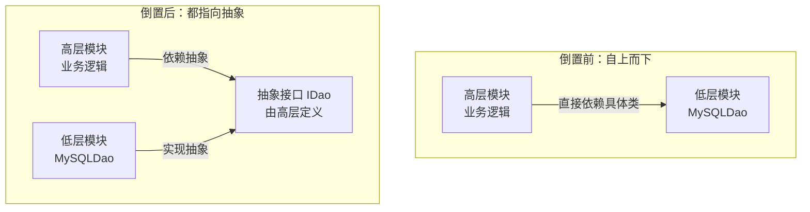

# 第二卷第6章：依赖倒置原则介绍

#### 目录介绍
- [1.工作中的真实案例](#1工作中的真实案例)
- [2.问题思考与分析](#2问题思考与分析)
- [3.本篇学习目标](#3本篇学习目标)
- [4.理解依赖倒置原则](#4理解依赖倒置原则)
- [5.倒置到底倒的是什么](#5倒置到底倒的是什么)
- [6.DIP的三个层次](#6dip的三个层次)
- [7.多数据库的案例](#7多数据库的案例)
- [8.购买家电的案例](#8购买家电的案例)
- [9.发送消息的案例](#9发送消息的案例)
- [10.依赖倒置与注入](#10依赖倒置与注入)
- [11.IoC容器之实现](#11ioc容器之实现)
- [12.DIP的边界与限制](#12dip的边界与限制)
- [13.在设计模式中体现](#13在设计模式中体现)
- [14.依赖倒置的利弊](#14依赖倒置的利弊)
- [15.开篇网络库回顾](#15开篇网络库回顾)
- [16.本篇收获总结](#16本篇收获总结)
- [17.课后思考练习](#17课后思考练习)
- [18.课后实战练习](#18课后实战练习)
- [19.更多内容推荐](#19更多内容推荐)

依赖倒置原则（DIP）是 SOLID 中的 **D**，强调高层模块不应依赖低层模块，两者都应依赖于抽象。本文由"换一个第三方库要改 380 处"的真实痛点入手，逐步讲清"倒置"倒的是什么、三个层次的落地、典型案例、与依赖注入的区别、IoC 容器的工业实现与边界把握，最后回到开篇给出工程化的修复姿势。

## 1.工作中的真实案例

### 1.1 换库改三百八处

做终端的同学大概都经历过这种"换底层被迫牵动全身"的苦：

> 项目最早使用了某个第三方网络库 A。所有业务代码都直接 `import` 了 A 的 `HttpClient`、`Request`、`Response`。
>
> 两年后，A 不再维护、或者官方建议迁到一个新库 B、或者要统一接入公司内部网关 C——不管是哪一种，你打开 IDE，`Find Usage` 显示 **380 处引用**，改造工作要持续两个月，而且每改一个页面就可能把它的回调链、错误处理、取消逻辑全部打坏。

换一个"不是主线但属于底层"的模块（日志、缓存、埋点、存储、推送、支付、图片库……），你会在职业生涯里不止一次遇到这种场景。

问题的本质不是"第三方库不好"，而是**业务代码直接依赖了具体实现**——依赖方向搞反了。业务是"高层，稳定"，库是"低层，多变"，你却让稳定的人依赖了多变的人。

### 1.2 倒置为何是刚需

本篇要解决的就是这个问题——**依赖倒置原则（DIP）**：**高层和低层都依赖抽象，而且抽象由高层来定义**。

读完本篇，你就知道下次集成第三方能力时的正确姿势，以及为什么大公司都在推"整洁架构 / 六边形架构"。

## 2.问题思考与分析

单一职责原则和开闭原则的原理比较简单，但想要在实践中用好却比较难。依赖倒置原则正好相反：用起来比较简单，但概念理解起来比较难。带着这两个问题进入正文：

1. "依赖倒置"这个概念指的是"谁跟谁"的"什么依赖"被反转了？"倒置"两个字该如何理解？
2. 经常听到另外一个概念：依赖注入。这两个概念跟"依赖倒置"有什么区别和联系？它们说的是同一个事情吗？

## 3.本篇学习目标

1. 搞懂依赖倒置原则为什么重要，以及它如何帮助我们构建灵活、可扩展和可维护的系统。
2. 掌握依赖倒置的实现方式：依赖注入、工厂模式、策略模式等常见手段，以及优缺点和适用场景。
3. 应用依赖倒置到实际项目：通过项目练习和实践，把 DIP 落到真实代码中。

## 4.理解依赖倒置原则

依赖倒置原则的定义：

1. **高层模块不应该依赖于低层模块**，两者都应该依赖于抽象。
2. **抽象不应该依赖于细节**，细节应该依赖于抽象。

换句话说，设计中应当依赖于接口或抽象类，而不是依赖于具体实现。这种设计有助于减少模块之间的耦合，增加系统的灵活性和可维护性。

DIP 的核心思想是**面向抽象编程而不是面向具体编程**。通过依赖抽象层次（接口、抽象类），可以让高层模块不依赖具体的实现细节，从而使系统更具扩展性和灵活性。

## 5.倒置到底倒的是什么

### 5.1 从词本身发问

> **疑惑**：为什么叫"倒置"？正常的依赖方向是什么？倒置后变成什么？

在传统的过程式编程中，依赖方向是"自上而下"的——业务直接依赖基础设施。DIP 的核心改动不是"加一个接口"那么简单，而是**让接口由高层定义、低层来实现**，于是依赖方向被反过来了。



**关键的"倒置"发生在**：抽象接口由高层模块定义（而非低层模块定义），低层模块反过来依赖高层定义的抽象。不是业务求着库，而是库适配业务——这就是"倒置"二字的真正含义。

### 5.2 为何抽象交高层

为什么不能让低层提供抽象？这里有三个本质原因：

1. **语义控制权**：业务需要 `getOrderBy(userId)`、库提供的可能是 `query(SQL)`，谁定抽象，谁就能决定语义颗粒度。交上面定，能护住业务语言。
2. **变化频率**：抽象由变化频率低的一方定义，才不会被变化频率高的一方拖走。业务逻辑变动低、底层库变动高。
3. **领域完整性**：业务抽象反映业务领域全貌，低层定义会让抽象被拆碎、领域语义丢失。

## 6.DIP的三个层次

```mermaid
flowchart TD
    A[DIP 的三个落地层次]
    A --> B[层次1 代码层<br/>变量声明用接口类型<br/>List&lt;String&gt; list = new ArrayList&lt;&gt;&#40;&#41;]
    A --> C[层次2 模块层<br/>模块间通过接口通信<br/>Service → Repository 接口 ← MySQL/Redis 实现]
    A --> D[层次3 架构层<br/>整洁架构 / 六边形架构<br/>依赖方向从外向内]
```



- **层次 1（代码层）**：变量声明用接口而非具体类型。`List<String> list = new ArrayList<>();` 好过 `ArrayList<String> list = new ArrayList<>();`。
- **层次 2（模块层）**：模块间通过接口通信。`Service` 层依赖 `Repository` 接口，具体是 MySQL 还是 Redis 实现都无所谓。
- **层次 3（架构层）**：整洁架构 / 六边形架构的依赖方向"从外向内"——外层（Web 框架、数据库驱动）依赖内层（业务用例、领域实体），核心业务不知道外层的存在。

## 7.多数据库的案例

### 7.1 违反依赖倒置

假设我们有一个 `UserService` 类，它直接依赖 `MySQLDatabase` 来进行数据操作：

```java
class MySQLDatabase {
    public void saveUser(String username) {
        System.out.println("Saving " + username + " to MySQL database.");
    }
}

class UserService {
    private MySQLDatabase database = new MySQLDatabase();   // 直接 new 具体类
    public void addUser(String username) { database.saveUser(username); }
}
```

`UserService` 直接依赖 `MySQLDatabase`，是对具体实现的依赖。如果要换成 PostgreSQL 或者 AliSQL，必须修改 `UserService` 本身，耦合度高、改造风险大。

### 7.2 遵循依赖倒置

通过引入一个抽象层：

```java
// 抽象层：由业务侧定义
interface Database {
    void saveUser(String username);
}

// 具体实现：MySQL
class MySQLDatabase implements Database {
    public void saveUser(String username) { /* 存 MySQL */ }
}

// 具体实现：PostgreSQL
class PostgreSQLDatabase implements Database {
    public void saveUser(String username) { /* 存 PostgreSQL */ }
}

// 高层模块：依赖抽象接口，而不是具体实现
class UserService {
    private final Database database;
    public UserService(Database database) { this.database = database; }   // 依赖注入
    public void addUser(String username) { database.saveUser(username); }
}
```

想换数据库，只需要传入不同的实现类，`UserService` 本身完全不动。这就把**耦合点从"具体类"挪到了"接口"**。

## 8.购买家电的案例

### 8.1 违反依赖倒置

顾客要买冰箱、洗衣机、电视……如果 `Customer` 为每种商品单独开一个方法：

```java
public class Customer {
    public void buyFridge()     { System.out.println("购买冰箱"); }
    public void buyTelevision() { System.out.println("购买电视"); }
    public void buyWashMachine(){ System.out.println("购买洗衣机"); }
    // 再加一种商品就得改 Customer……
}
```

`Customer` 直接依赖了每一种具体商品，新增商品必须修改 `Customer`。

### 8.2 遵循依赖倒置

抽一个 `IGood` 接口，`Customer` 只依赖它：

```java
public interface IGood {
    void buy();
}

public class FridgeGood       implements IGood { public void buy() { System.out.println("购买冰箱"); } }
public class TelevisionGood   implements IGood { public void buy() { System.out.println("购买电视"); } }
public class WashMachineGood  implements IGood { public void buy() { System.out.println("购买洗衣机"); } }

public class Customer {
    public void buy(IGood good) { good.buy(); }
}

// 使用
Customer customer = new Customer();
customer.buy(new FridgeGood());
customer.buy(new TelevisionGood());
customer.buy(new WashMachineGood());
```

新增一种商品，只需要新增一个 `IGood` 实现类，`Customer` 完全不用动——这就是 OCP 的味道，而支撑它的正是 DIP。

## 9.发送消息的案例

### 9.1 违反依赖倒置

用户可以通过邮件、短信、站内信发送消息。下面这种写法很不友好：

```java
public class Notification {
    public void email  (String to, String msg) { /* 发邮件 */ }
    public void message(String to, String msg) { /* 发短信 */ }
    public void letter (String to, String msg) { /* 发站内信 */ }
}
```

每加一种通道就要改 `Notification`，把所有通道硬编码在一起。

### 9.2 遵循依赖倒置

抽出 `MessageSender` 接口，`Notification` 依赖它：

```java
public interface MessageSender {
    void send(String to, String message);
}

public class EmailSender implements MessageSender { public void send(String to, String msg) { /* ... */ } }
public class SmsSender   implements MessageSender { public void send(String to, String msg) { /* ... */ } }
public class InboxSender implements MessageSender { public void send(String to, String msg) { /* ... */ } }

public class Notification {
    private final MessageSender sender;
    public Notification(MessageSender sender) { this.sender = sender; }   // 构造函数注入
    public void sendMessage(String to, String msg) { sender.send(to, msg); }
}
```

新增一种通道时，`Notification` 完全不变，只需要写一个新的 `MessageSender` 实现。

## 10.依赖倒置与注入

### 10.1 理解依赖注入

依赖注入（Dependency Injection, DI）是一种设计模式，把对象的依赖关系从对象内部转移到外部管理，从而降低类之间的耦合度，提高代码的可维护性和可测试性。

### 10.2 依赖注入四法

1. **构造函数注入**：通过构造函数传入依赖。最常见、推荐的方式。
2. **Setter 方法注入**：通过 setter 方法在对象创建后设置依赖，更灵活，但也更容易在依赖缺失时被误用。
3. **接口注入**：定义一个注入依赖的接口，由类自己实现这个接口来接收依赖。较少使用。
4. **属性注入**（字段注入）：通过 `@Autowired` 等注解直接给字段赋值，可能让对象在没有依赖的情况下被创建。

### 10.3 两者有何区别

DIP 和 DI 是面向对象设计中两个相关但不同的概念：

| 维度 | 依赖倒置原则（DIP） | 依赖注入（DI） |
| :--- | :--- | :--- |
| 性质 | **设计原则** | **实现技术** |
| 关注点 | 依赖方向——依赖抽象而非实现 | 如何把依赖对象"交给"类 |
| 关系 | 目标 | 实现 DIP 的常见手段之一 |

**依赖注入是实现依赖倒置原则的一种常见方式**，但并不是唯一方式。DIP 还可以通过工厂模式、策略模式、服务定位器等其他设计模式来实现。

### 10.4 不误读其起点

这里有个常见误读需要提醒：**“用了 @Autowired 就是满足了 DIP”** —— 这个说法是错的。@Autowired 只是让你获得了依赖注入的能力，但是如果你 `@Autowired private MySQLDao dao`，你还是在依赖具体类！

**DIP 考验的是“变量声明的类型”：DI 提供的是“创建这个变量的手段”**。两者同时达成，才是真正的 DIP 实践。

## 11.IoC容器之实现

> **疑惑**：每次都手动 `new` 并传入依赖，项目大了怎么办？

这就是 IoC（控制反转）容器的用武之地：

```
手动依赖注入：
  repo    = new MySQLUserRepo(db);
  service = new UserService(repo);
  handler = new UserHandler(service);
  // 需要手动管理所有对象的创建和组装

IoC 容器自动管理：
  container.register(UserRepository.class, MySQLUserRepo.class);
  container.register(UserService.class);
  container.register(UserHandler.class);
  handler = container.resolve(UserHandler.class);   // 自动注入所有依赖
```

| 语言/框架 | IoC 容器 |
| :--- | :--- |
| Java / Spring | `ApplicationContext` + `@Autowired` |
| Python / FastAPI | `Depends()` 依赖注入系统 |
| Go / Wire | Google Wire（编译期依赖注入） |
| TypeScript / NestJS | `@Injectable()` + Module |
| C# / .NET | `IServiceCollection` + `AddScoped` |

一个可以演示业务侧 `UserService` 自由切换不同缓存实现的小例子：

```java
interface CacheStore {
    Object get(String key);
    void   set(String key, Object value, int ttlSeconds);
    void   delete(String key);
}

class MemoryCache implements CacheStore {
    private final Map<String, Object> store = new HashMap<>();
    public Object get(String key)                         { return store.get(key); }
    public void   set(String key, Object v, int ttl)      { store.put(key, v); }
    public void   delete(String key)                      { store.remove(key); }
}

class RedisCache implements CacheStore {
    public Object get(String key)                         { /* Redis 调用 */ return null; }
    public void   set(String key, Object v, int ttl)      { /* Redis 调用 */ }
    public void   delete(String key)                      { /* Redis 调用 */ }
}

// 业务侧只依赖 CacheStore
class UserService {
    private final CacheStore cache;
    public UserService(CacheStore cache) { this.cache = cache; }
    // 查询时先查缓存、未命中再回源……
}

// 开发环境：注入内存实现
UserService dev  = new UserService(new MemoryCache());
// 生产环境：注入 Redis 实现
UserService prod = new UserService(new RedisCache());
```

## 12.DIP的边界与限制

不是所有依赖都值得抽象。过度倒置会把简单事情复杂化，滑进"为了加接口而加接口"。

| 场景 | 是否需要 DIP | 原因 |
| :--- | :--- | :--- |
| 稳定的标准库（如 `String`、`List`） | 不需要 | 极少变化，无需抽象 |
| 只有一种实现且未来也不会变 | 谨慎使用 | YAGNI 原则 |
| 原型 / MVP 阶段 | 不需要 | 先跑通再优化 |
| 外部依赖（数据库、网络、文件系统） | **需要** | 易变且需要 mock 来测试 |
| 多团队协作的模块边界 | **需要** | 用接口先定义契约 |

## 13.在设计模式中体现

1. **工厂模式**：定义抽象工厂接口，让具体工厂实现该接口，把"创建"与"使用"解耦。高层只依赖抽象工厂，不依赖具体产品类。
2. **观察者模式**：观察者依赖被观察者的抽象接口而非具体类，变化发生时观察者通过接口接收通知。
3. **策略模式**：定义抽象策略接口，具体策略类实现该接口，高层调用者依赖抽象策略，而不依赖具体策略类。

共同点：**都通过抽象接口或基类，把高层模块与具体实现解耦**，让高层依赖抽象而非具体实现。

## 14.依赖倒置的利弊

**优点**：

1. **降低耦合性**：高层和低层通过抽象解耦，避免对具体实现的依赖。
2. **增强可扩展性**：要替换或扩展具体实现，不需要修改高层模块。
3. **提高可维护性**：修改某个模块的实现不会影响到其他模块。
4. **提高可测试性**：给高层注入 mock/stub 实现即可进行单元测试，不需要真数据库、真网络。

**缺点**：

1. **增加系统复杂度**：通常需要引入额外的抽象层次，初看会"多一层"。
2. **可能导致过度设计**：在简单系统中过度使用 DIP，会带来不必要的复杂性。

## 15.开篇网络库回顾

### 15.1 假如初设倒置

回头看开篇那段"380 处直接用 A 库"的惨剧。如果**一开始**就遵循 DIP：

1. **由业务定义抽象**：在业务模块里定义 `HttpService`（包含 `get / post / cancel / ...`），**接口长什么样由业务说了算**。
2. **库实现抽象**：第三方 A 用一个薄适配层 `AHttpService implements HttpService`；将来要切 B，再加一个 `BHttpService implements HttpService`。
3. **业务只依赖抽象**：所有业务代码只 `import HttpService`，完全不知道 A 或 B 的存在。

于是换库这件事变成：**只写一个新的适配实现，在 IoC 容器 / 启动入口换一处注册代码**。380 处业务代码一处都不用动。

```mermaid
flowchart LR
    B[业务模块<br/>依赖 HttpService] --> I[HttpService<br/>由业务定义]
    I <-- 实现 --- A[AHttpService<br/>包第三方 A]
    I <-- 实现 --- Bk[BHttpService<br/>包第三方 B]
    I <-- 实现 --- C[CHttpService<br/>包公司网关 C]
```

这就是"**倒置**"二字的真正含义：**让低层反过来依赖高层定义的抽象**。不是业务求着库，而是库适配业务。

### 15.2 可获期望收益

“倒置”带来三件事：

1. **费用仅一次**：公司仅需要在项目启动中选一个 HttpService 的实现；
2. **未来避改中间人**：联调第三方仅需要修改适配层，不会鬧进业务代码；
3. **可以面 mock 取代连联**：身份代上 `MockHttpService`，单测可以不依赖网络。

这三件事不是附加价值，是跳过 if/else 迫使的主价值。

## 16.本篇收获总结

1. **一句精确定义**：DIP = 高层 + 低层都依赖抽象；**且抽象由高层定义**（这才是"倒置"的要点）。
2. **三个层次落地**：代码层（变量声明用接口类型）→ 模块层（模块间通过接口通信）→ 架构层（整洁架构 / 六边形架构，依赖方向从外向内）。
3. **一组可操作手段**：依赖注入（构造函数注入最佳）、工厂模式、策略模式、IoC 容器。
4. **DIP vs DI**：DIP 是**原则**，DI 是实现 DIP 的**一种技术手段**（但不是唯一）。
5. **一条边界**：不是所有依赖都要倒置。**易变的 + 需要 mock 测试的 + 跨团队边界的** 才值得；稳定的标准库、值类型、简单 DTO 就不必。

## 17.课后思考练习

1. **识别题**：打开你当前项目的任意一个 Service/业务类的 `import` 列表，数一下：有多少是"抽象"（接口/协议），有多少是"具体实现类"（带有厂商/库/平台信息的名字）？后者越多，DIP 违反越严重。
2. **辨析题**：在 Android / iOS 里，业务直接依赖系统框架的 `Activity / ViewController` 算不算违反 DIP？如果算，整洁架构要怎么处理？（提示：让"用例层"不依赖 UI 框架）
3. **权衡题**："所有类都通过接口暴露 + IoC 容器管理依赖"——小项目也要这么做吗？边界在哪？可以结合"可测试性需求"来讨论。

## 18.课后实战练习

在你当前项目里找一个**你最怕未来要换掉的"底层组件"**（网络库、图片库、缓存、日志、埋点、数据库 SDK 都可以）：

1. **扫引用**：用 IDE 的 `Find Usage` 统计它被直接引用的次数。这个数字，就是未来换它要改的文件数。
2. **设计抽象**：站在业务角度写一个接口（**不要照着现有库的 API 抄！** 要写"业务需要什么"），哪怕只有 3~5 个方法。
3. **写薄适配**：写一个 `XxxAdapter implements YourInterface`，内部包一下现有库。
4. **灰度替换**：挑**一个**调用点，把直接依赖替换成依赖抽象。确认行为不变。
5. **估算收益**：如果项目里所有 380 处调用都迁到抽象上，未来换库的工作量会从 2 个月缩减到多久？写下这个数字，就是你为项目争取到的未来时间。

做完，进入下一篇《07.迪米特原则介绍》。至此你已经会"拆 (SRP) → 扩 (OCP) → 继承守契约 (LSP) → 拆接口 (ISP) → 倒置依赖 (DIP)"，最后一条是"**模块之间怎么说话**"，也就是 LOD。

