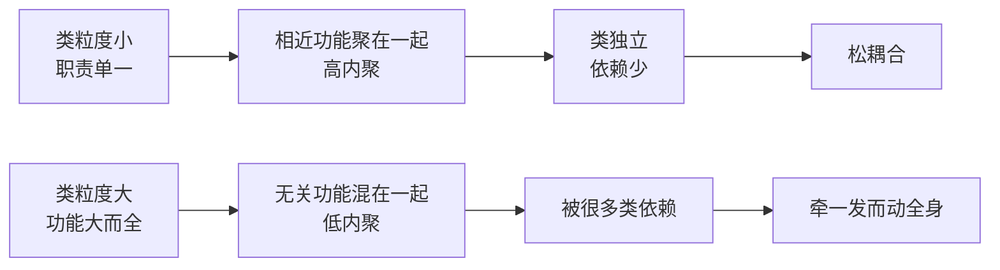
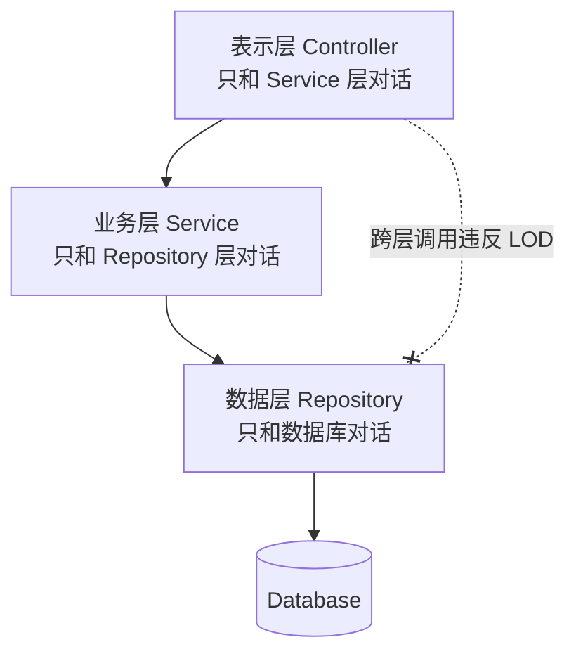

# 第二卷第7章：迪米特原则介绍

#### 目录介绍
- [1.工作中的真实案例](#1工作中的真实案例)
- [2.问题思考与分析](#2问题思考与分析)
- [3.本篇学习目标](#3本篇学习目标)
- [4.理解迪米特原则](#4理解迪米特原则)
- [5.高内聚与松耦合](#5高内聚与松耦合)
- [6.迪米特原则思想](#6迪米特原则思想)
- [7.朋友的形式化定义](#7朋友的形式化定义)
- [8.火车残骸反模式](#8火车残骸反模式)
- [9.集团公司员工案例](#9集团公司员工案例)
- [10.老师与体育委员案例](#10老师与体育委员案例)
- [11.门面模式经典落地](#11门面模式经典落地)
- [12.迪米特与分层架构](#12迪米特与分层架构)
- [13.LOD度量清单](#13lod度量清单)
- [14.迪米特原则优缺点](#14迪米特原则优缺点)
- [15.在设计模式中体现](#15在设计模式中体现)
- [16.开篇链式再回顾](#16开篇链式再回顾)
- [17.本篇收获总结](#17本篇收获总结)
- [18.课后思考练习](#18课后思考练习)
- [19.课后实战练习](#19课后实战练习)
- [20.更多内容推荐](#20更多内容推荐)

迪米特法则（LOD）又叫最少知识原则，强调一个对象只和它的"直接朋友"说话。本文由"一条链式调用改 31 个文件"的真实事故切入，给出"朋友"的形式化定义，讲清火车残骸反模式，再通过两个经典案例（集团员工、老师与体育委员）演示如何重构，最后回到开篇给出一条可执行的修复路径。

## 1.工作中的真实案例

做终端开发（Android / iOS / Web / 小程序都一样），链式"点 `.` 到底"的代码随处可见：

```java
// 订单页要展示收货城市
String city = order.getUser().getAddress().getCity().getName();

// 分享按钮要展示头像
String url  = viewModel.getShareInfo().getAuthor().getAvatar().getUrl();

// 推送点击跳转
String id   = activity.getIntent().getExtras().getBundle("data").getString("targetId");
```

某次版本，后端改了 `Address` 的数据结构，把 `City` 从对象换成了字符串 ID（需要二次查询）。结果我在仓库里搜了一下，**发现同样那一串 `getUser().getAddress().getCity()...` 被复制到了 31 个文件里**——从订单页、发票页、详情页、地址选择器、分享卡片，一路到埋点 SDK。修复花了整整 4 天：漏改、NPE、空城市、埋点上报错……每一种坑都踩了一遍。

返工复盘时大家都在问同一句话：

> "订单页凭什么要知道 `User` 里面有 `Address`、`Address` 里面有 `City`、`City` 里面有 `name` 这四层结构？"

本篇要解决的问题是：**当调用者"顺着点号"把别人的内部结构穿成一条链时，凭什么要付这么大的改动成本？有没有办法让它只认它该认识的那一层？** 答案就是**迪米特法则（LOD / 最少知识原则）**。

## 2.问题思考与分析

带着下面三个问题进入正文：

1. 什么是迪米特原则？这个原则如何理解，如何运用到实际开发中？
2. 什么是高内聚、松耦合？能否举例说明？
3. 哪些代码设计是明显违背迪米特法则的？对此该如何重构？

迪米特法则不像 SOLID、KISS、DRY 那样人尽皆知，但它非常实用——利用这个原则，能够帮我们实现代码的"高内聚、松耦合"。

## 3.本篇学习目标

迪米特原则（Law of Demeter）又叫最少知识原则（Principle of Least Knowledge），是面向对象设计中一个重要原则。学习目标：

1. 清晰理解迪米特法则的思想。
2. 能识别典型违反场景，并用合适的手段重构。
3. 理解它与 SRP、DIP、ISP 的协作关系——它们共同服务于"高内聚、松耦合"。

## 4.理解迪米特原则

迪米特法则的英文原文：

> Each unit should have only limited knowledge about other units: only units "closely" related to the current unit. Or: Each unit should only talk to its friends; Don't talk to strangers.

直译：**每个模块只应该了解那些与它关系密切的模块的有限知识；每个模块只和自己的朋友"说话"，不和陌生人"说话"**。

它的由来也很直白：类与类之间的关系越密切，耦合度越大；当一个类发生改变时，对另一个类的影响也越大。此时就要降低类之间的耦合。

## 5.高内聚与松耦合

"高内聚"有助于"松耦合"，反过来"低内聚"也会导致"紧耦合"。



- **高内聚**：相近的功能应该放到同一个类中，不相近的功能不要放到同一个类中。相近的功能往往会被同时修改，放在一起修改比较集中。
- **松耦合**：类与类之间的依赖关系简单清晰，即使两个类有依赖关系，一个类的改动也不会或很少导致依赖类的代码改动。

在这个设计思想中，"**高内聚**"用来指导**类本身**的设计，"**松耦合**"用来指导**类与类之间**依赖关系的设计。很多设计原则（SRP、ISP、DIP……）都以"高内聚、松耦合"为目的。

## 6.迪米特原则思想

迪米特原则的核心：**类之间的解耦尽量做到弱耦合**。耦合程度越低，类的复用率才能提高。它通过**封装**和**信息隐藏**来实现对象之间的松耦合——每个对象只需要知道与之直接交互的对象的接口，而不需要了解对象的内部实现细节。

## 7.朋友的形式化定义

> **疑惑**：什么是"直接朋友"？如何精确判断？

对于一个对象 O 中的方法 M，M 只能调用以下对象的方法：

```mermaid
flowchart TD
    A[方法 M 的合法朋友]
    A --> B[1. O 本身 this]
    A --> C[2. M 的参数对象]
    A --> D[3. M 中创建的局部对象]
    A --> E[4. O 的成员变量 <br/>直接依赖的对象]
    A --> F[5. O 可访问的全局对象<br/>谨慎使用]
    X[不是朋友] --> X1[朋友的朋友<br/>链式调用 a.b&#40;&#41;.c&#40;&#41;.d&#40;&#41;]
    X --> X2[方法返回值的内部对象]
    X --> X3[集合中元素的内部细节]
```



一句话记忆：**朋友 = 我能看见的对象；朋友的朋友 = 不是我的朋友**。

## 8.火车残骸反模式

> **疑惑**：`order.getCustomer().getAddress().getCity().getName()` 有什么问题？

这被称为"火车残骸"（Train Wreck）或"链式调用"反模式，严重违反迪米特法则：

```java
// 火车残骸：调用者了解了太多内部结构
String cityName = order.getCustomer().getAddress().getCity().getName();
```

问题出在：调用者需要知道 `Order` 里有 `Customer`、`Customer` 里有 `Address`、`Address` 里有 `City`、`City` 里有 `name`——**任何一层结构变化，调用者都要改**。

遵循迪米特法则的写法是：**让每一层只暴露业务意义的方法**：

```java
class Order {
    private Customer customer;
    public String getShippingCityName() {     // 只暴露业务需要的信息
        return customer == null ? "" : customer.getCityName();
    }
}

class Customer {
    private Address address;
    public String getCityName() {             // 只暴露必要的信息
        return address == null ? "" : address.getCityName();
    }
}

class Address {
    private City city;
    public String getCityName() { return city.getName(); }
}

// 调用者只和直接朋友 Order 通信
String city = order.getShippingCityName();
```

这也是**"Tell, Don't Ask"**原则的体现：不要"向对象询问信息然后自己做决定"，而是"告诉对象你的意图"，让对象自己决定怎么处理。

## 9.集团公司员工案例

集团公司下属有分公司和直属部门，现在要求打印出所有下属单位的员工 ID。先看一版**违反迪米特法则**的设计：

```java
class Employee    { private String id; /* getter/setter 略 */ }
class SubEmployee { private String id; /* getter/setter 略 */ }

// 分公司管理
class SubCompanyManager {
    public List<SubEmployee> getAllEmployee() {
        List<SubEmployee> list = new ArrayList<>();
        for (int i = 1; i < 5; i++) {
            SubEmployee e = new SubEmployee();
            e.setId("分公司" + i);
            list.add(e);
        }
        return list;
    }
}

// 总公司管理
class CompanyManager {
    public List<Employee> getAllEmployee() { /* 略 */ return null; }

    public void printAllEmployee(SubCompanyManager subMgr) {
        // ❌ 总公司跑到分公司内部，把分公司员工一个个打印
        for (SubEmployee e : subMgr.getAllEmployee()) {
            System.out.println(e.getId());
        }
        for (Employee e : getAllEmployee()) {
            System.out.println(e.getId());
        }
    }
}
```

问题在 `CompanyManager.printAllEmployee()`：`SubEmployee` 并不是 `CompanyManager` 的直接朋友（以局部变量出现的耦合不属于直接朋友）。从业务逻辑讲，总公司只应该与分公司耦合，**与分公司的员工没有任何联系**。

按迪米特法则重构——让分公司自己打印自己的员工：

```java
class SubCompanyManager {
    public List<SubEmployee> getAllEmployee() { /* 略 */ return null; }

    public void printSubCompany() {                   // ✅ 分公司自己管自己
        for (SubEmployee e : getAllEmployee()) {
            System.out.println(e.getId());
        }
    }
}

class CompanyManager {
    public List<Employee> getAllEmployee() { /* 略 */ return null; }

    public void printAllEmployee(SubCompanyManager subMgr) {
        subMgr.printSubCompany();                     // ✅ 只和分公司说话
        for (Employee e : getAllEmployee()) {
            System.out.println(e.getId());
        }
    }
}
```

总公司不再穿透分公司去碰分公司的员工，耦合收敛到了直接朋友这一层。

## 10.老师与体育委员案例

体育老师要体育委员清点女生人数。先看一版**违反迪米特法则**的设计：

```java
class Girl { }

class Teacher {
    public void command(GroupLeader leader) {
        List<Girl> girls = new ArrayList<>();
        for (int i = 0; i < 20; i++) girls.add(new Girl());   // ❌ Teacher 和 Girl 发生了通信
        leader.countGirls(girls);
    }
}

class GroupLeader {
    public void countGirls(List<Girl> girls) {
        System.out.println("女生人数是：" + girls.size());
    }
}
```

`Teacher` 只有一个朋友 `GroupLeader`，`Girl` 不是它的朋友。但代码中 `Teacher` 在初始化 `Girl` 群体，**和陌生人说话了**。

按迪米特法则重构——把 `Girl` 的初始化从 `Teacher` 里搬走，`Girl` 由外部注入给 `GroupLeader`：

```java
class Teacher {
    public void command(GroupLeader leader) {
        leader.countGirls();                     // ✅ 只告诉体育委员：去清点
    }
}

class GroupLeader {
    private final List<Girl> girls;
    public GroupLeader(List<Girl> girls) { this.girls = girls; }
    public void countGirls() {
        System.out.println("女生人数是：" + girls.size());
    }
}

// 场景入口
List<Girl> girls = new ArrayList<>();
for (int i = 0; i < 20; i++) girls.add(new Girl());
new Teacher().command(new GroupLeader(girls));
```

`Teacher` 只和 `GroupLeader` 打交道，`Girl` 的"组装"交给场景类——避开了对陌生类的访问，系统更加健壮。

## 11.门面模式经典落地

当一个客户端要和多个子系统打交道时，最典型的 LOD 落地方式就是**门面模式（Facade Pattern）**——让客户端只认识一个"门面"，由门面代理它和一众子系统的通信。

```java
// 内部子系统（客户端不直接接触）
class InventoryService { public boolean checkStock(String pid)  { return true; } }
class PaymentService   { public boolean charge(String uid, double amt) { return true; } }
class ShippingService  { public boolean arrange(String oid, String addr) { return true; } }

// 门面：客户端的唯一朋友
class OrderFacade {
    private final InventoryService inventory = new InventoryService();
    private final PaymentService   payment   = new PaymentService();
    private final ShippingService  shipping  = new ShippingService();

    public boolean placeOrder(String uid, String pid, String addr, double amt) {
        if (!inventory.checkStock(pid))          return false;
        if (!payment.charge(uid, amt))           return false;
        if (!shipping.arrange(pid, addr))        return false;
        return true;
    }
}

// 客户端只和 OrderFacade 这一个"朋友"打交道
new OrderFacade().placeOrder("user001", "prod001", "北京市朝阳区", 99.9);
```

## 12.迪米特与分层架构

典型的分层架构正是迪米特法则的宏观体现：



规则：**每一层只和相邻层通信**。`Controller` 直接访问 `Repository` 属于跨层调用，违反迪米特法则。

## 13.LOD度量清单

| 检查项 | 信号 | 改进方向 |
| :--- | :--- | :--- |
| 方法链长度 > 2 | `a.b().c().d()` | 在中间层添加委托方法 |
| 类的直接依赖数 > 5 | 构造函数参数过多 | 引入门面或中介者 |
| 跨层调用 | `Controller` 直接访问 DAO | 补一个 Service 层 |
| 频繁的 getter 链 | 获取对象内部的内部 | 改用 "Tell, Don't Ask" |

## 14.迪米特原则优缺点

**优点**：

1. **降低耦合度**：提升模块的相对独立性。
2. **提高可复用性与可扩展性**：每个模块的边界更清晰。
3. **保护隐私信息**：对象不把自己的内部结构暴露给陌生人。
4. **提高代码可维护性**：结构清晰，理解/调试/修改更容易。

**缺点**：

1. **可能产生大量中介/委托方法**：过度使用会让系统多出一堆"什么都不做、只转发"的中间人类，反而增加复杂度。
2. **权衡不易**：要在"高内聚、松耦合"与"结构清晰"之间反复权衡。

另外在类设计上还有一些广义的迪米特体现：优先考虑不变类、降低类的访问权限、谨慎使用 `Serializable`、降低成员的访问权限。

## 15.在设计模式中体现

LOD 在多个经典设计模式里都有体现：

1. **外观模式（Facade Pattern）**：提供一个简化的接口，把复杂子系统的细节挡在客户端之外。
2. **中介者模式（Mediator Pattern）**：引入中介者对象，把多方通信集中处理，减少对象之间的直接交互。
3. **迭代器模式（Iterator Pattern）**：用统一的迭代接口隐藏集合的内部结构，让客户端无需了解集合的具体实现。

它们的共同点：**通过减少对象之间的直接依赖关系来降低耦合**，这正是 LOD 的设计主张。

## 16.开篇链式再回顾

回到开篇那条 `order.getUser().getAddress().getCity().getName()`。把本篇学到的东西套进去：

**第一步：识别"不是朋友"**

| 调用者 | 直接朋友（可以 talk） | 陌生人（不该 talk） |
| :--- | :--- | :--- |
| OrderPage   | `Order`     | `User` / `Address` / `City` |
| ShareCard   | `ShareInfo` | `Author` / `Avatar` |
| PushHandler | `Intent`    | `Bundle` 里嵌套的 `Bundle` |

**第二步：在直接朋友身上补一个"业务含义"的方法（Tell, Don't Ask）**

```java
// 改之前：调用者穿透了 4 层内部结构
String city = order.getUser().getAddress().getCity().getName();

// 改之后：调用者只问"订单要送到哪个城市"
String city = order.getShippingCityName();
```

**第三步：结构改变时，改一处足矣**

| 场景 | 改之前 | 改之后 |
| :--- | :--- | :--- |
| `City` 对象 → ID | 改 31 个文件 | 只改 `Address.getCityName()` |
| 匿名用户下 `Address=null` | 31 处都要加 null 判断 | 只在 `Order.getShippingCityName()` 兜底一次 |
| 需要用"新接口"二次查询 | 31 处都要改调用链 | 只在 `Address` 内部替换实现 |

本质：**"调用者改动数 = 坏味道的度量"**。迪米特法则把改动收敛到"直接朋友"这一层，上层只看"业务语义"，不看"内部结构"——4 天返工变 4 分钟。

## 17.本篇收获总结

1. **"朋友"是有精确定义的**：只有 `this`、方法参数、方法内创建的局部对象、成员变量、可访问的全局对象才是"合法朋友"，链式调用的中间返回值**不是朋友**。
2. **识别火车残骸的信号**：方法链长度 > 2 就是红线——`a.b().c()` 可以容忍，`a.b().c().d()` 必须停下来重构。
3. **"Tell, Don't Ask" 是落地手段**：不要"问到数据自己判断"，而是"告诉朋友你的意图"，让朋友自己决定怎么处理。
4. **高内聚、松耦合是结果不是目的**：迪米特只是手段之一——相近职责放一起（SRP）、依赖抽象（DIP）、接口精简（ISP）共同促成这个结果。
5. **三大武器**：门面、中介者、事件总线，分别对应"子系统太复杂"、"多方通信"、"模块完全不认识彼此"三种典型解耦场景。
6. **分层架构是 LOD 的宏观体现**：Controller 不能越过 Service 直接摸 Repository。
7. **过度 LOD 会催生"中间人"坏味道**：全是委托方法、什么业务都不做的类要合并/删除——LOD 不是越严越好，而是"恰到好处"。

## 18.课后思考练习

**思考题 1**：下面这段代码，到底哪一行违反了迪米特？

```java
public void process(Order order) {
    Customer c = order.getCustomer();            // ①
    if (c.isVip()) {                             // ②
        String city = c.getAddress().getCity();  // ③
        notify(city);
    }
}
```

- 提示：① 取成员变量，`Order` 的 `Customer` 是它的"内脏"吗？② 在 `c` 这个局部变量上调用方法，算不算朋友？③ 链长 = 2，算不算穿透？
- 参考答向：② 合法（`c` 是方法里得到的局部对象，对局部对象调用自身方法是允许的）；③ 违反（在 `c` 的返回值 `Address` 上又调了 `getCity`）；① 本身不违反，但很容易引诱写出 ③。**正确姿势：让 `Customer` 暴露 `getCityName()`**。

**思考题 2**：团队里有人说："Java Stream 链式写法 `list.stream().filter(...).map(...).collect(...)` 方法链都 > 4 了，难道它违反了迪米特？"你怎么反驳？

- 提示：迪米特针对的是"在一个对象的返回值上调用另一个对象的方法"（对象图穿透），而 Stream 是**同一个流式抽象上的连续转换**——每一步的返回值都是 `Stream<T>` 这个**同一个朋友**。所以 Stream、Builder、Optional 这种"流畅接口/fluent API"并不算违反。判断标准是"**类型是否穿透**"，而不是"点号数量"。

**思考题 3**：某同学为了"避免火车残骸"，在 `Order` 里加了 `getCustomerAddressCityName()`、`getCustomerAddressCityId()`、`getCustomerAddressStreet()`、`getCustomerAddressZipCode()`……一下加了 12 个方法。这算不算好的重构？

- 提示：不算。这是把"朋友的朋友"全搬到了自己身上，造成了新的坏味道——"中介者/上帝对象"。正确做法是在 **Address 上做聚合**（比如 `getFormattedAddress()`、`getCity()`、`getZipCode()`），然后 `Order` 只暴露业务意图明确的方法（如 `getShippingAddress()` 返回 `Address`），而**不是把 `Address` 的每个字段都转发一次**。

## 19.课后实战练习

**作业 1（识别阶段，建议 30 分钟）**

在你自己的项目里全局搜索正则 `\.\w+\(\)\.\w+\(\)\.\w+\(\)`（三层以上点调用），把命中点按出现次数排序。**只要同一条链出现超过 3 次，就是本次作业的重构目标**。

**作业 2（分析阶段，建议 1 小时）**

选 1 条链，画一张"穿透图"：

```
调用者 ──→ 朋友A ──→ 朋友A的字段B ──→ B的字段C ──→ C的字段D
           ↑直接朋友↑       ↑——————穿透 3 层———————↑
```

写清楚：直接朋友是谁？穿透了几层？这些被穿透的对象里，有多少是"真正的内部结构"（只有这一个调用者用），有多少是"共享模型"（别处也在用）？

**作业 3（重构阶段，建议 2 小时）**

对上面选中的链做三种重构，对比效果：

1. **办法 A**：在直接朋友上补 `get业务语义()` 委托方法（最常用、风险最低）。
2. **办法 B**：改成"Tell, Don't Ask"——不再问数据，直接告诉对象要做什么（比如 `order.shipTo(address)` 而不是 `shipping.send(order.getAddress())`）。
3. **办法 C**：在多方通信场景下，引入事件总线或中介者（对应"通知子系统"类场景）。

**作业 4（度量阶段，建议 30 分钟）**

统计重构前后两个指标：

- **调用者数量**：有多少文件在调这条链？
- **层数**：最长的点链是几层？

贴出改动前后的数据对比，证明 LOD 让你的"潜在改动半径"变小了。

**作业 5（边界阶段，建议 20 分钟）**

在项目里找一个**看似违反实则合理**的场景（比如 Stream / Builder / Optional / 测试用的 Mock 链），把它和"真火车残骸"并排贴出来，写清楚为什么前者不算违反 LOD。这个作业是为了避免你从"点号恐惧症"走到另一个极端。

做完，进入下一篇《08.项目重构演进之路》——六大原则学完之后，如何在已有项目里**成体系地**把这些原则落下去，就是下一篇的主题。

