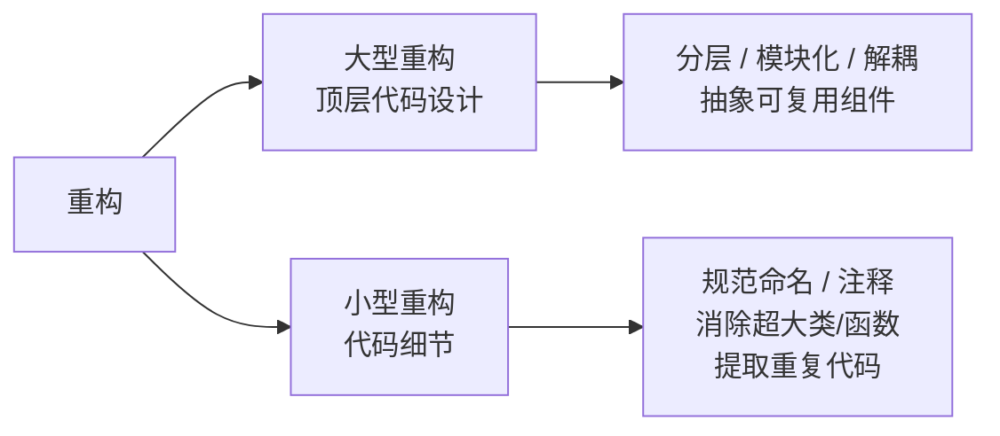
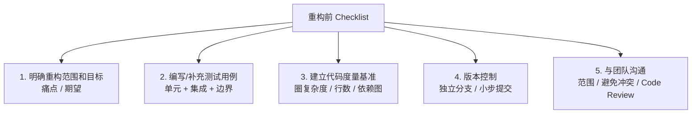

# 第二卷第8章：项目重构演进之路

#### 目录介绍
- [1.工作中的真实案例](#1工作中的真实案例)
- [2.重构背景目的与目标](#2重构背景目的与目标)
- [3.大重构与小重构](#3大重构与小重构)
- [4.持续重构大爆炸](#4持续重构大爆炸)
- [5.坏味道清单](#5坏味道清单)
- [6.圈复杂度体温计](#6圈复杂度体温计)
- [7.重构技术手段](#7重构技术手段)
- [8.安全重构核心法](#8安全重构核心法)
- [9.避免重构陷阱](#9避免重构陷阱)
- [10.原则手法映射](#10原则手法映射)
- [11.架构的三原则](#11架构的三原则)
- [12.开篇tab复盘记](#12开篇tab复盘记)
- [13.本篇收获总结](#13本篇收获总结)
- [14.课后思考练习](#14课后思考练习)
- [15.课后实战练习](#15课后实战练习)
- [16.更多内容推荐](#16更多内容推荐)

作为六大原则专栏的收尾篇，本文不讲新原则，而是回答两个最务实的问题：**为什么要重构、怎么重构不翻车**。从一个"改 tab 花 4 天"的真实事故切入，系统讲清重构定义、时机、手法、坏味道清单、圈复杂度度量，以及设计原则到具体重构手法的映射，最后给出一份可执行的 Checklist。

## 1.工作中的真实案例

做终端开发，几乎每个老项目里都有这么一个类：

- 文件名通常叫 `MainActivity` / `HomeViewController` / `app.vue` / `index.js`
- 行数在 **3000~8000 行**之间
- 写了快 5 年，经过 7 个人的手，最早的那位早就离职了
- 注释里能看到 `// 临时兼容 iOS 10`、`// TODO: 等后端改完删掉`、`// 别动这段，会崩`、`// 谁加的？？`

某次接了个需求："首页 tab 从 4 个改成 5 个"。本来以为是一小时的活，实际做了 4 天：

1. **第 1 天**：发现 tab 数量是硬编码 `4`，散落在 17 个地方——有些写的是数字，有些写的是 `list.size() - 1`，有些写的是 `for (int i = 0; i < 4; i++)`。
2. **第 2 天**：改完 tab 数量后，红点逻辑挂了——原来红点是跟 tab index 绑死的，第 5 个 tab 没有对应的红点配置，直接 NPE。
3. **第 3 天**：改完红点，埋点报错——原来埋点 id 也是写死的 `tab_1 / tab_2 / tab_3 / tab_4`。
4. **第 4 天**：上线前夜，发现深色模式下新 tab 的图标是纯黑的——原来资源适配表也是写死的 4 项。

回头看，这个需求本质上只是"改一个数字从 4 到 5"，但因为**一处配置被抄了 17 份**，变成了要改 17 个地方的战役。团队里有人提议："我们要不要停下来重构一次？"——然后被 PM 一句"下个需求还赶着呢"挡了回去。半年后又来了 "tab 改成 6 个"，再战一次。

这就是终端同学的日常：**不是没时间重构，是没把"持续重构"放进每个迭代里，结果债滚债，最后滚到谁都不敢动**。本篇要回答：

- 哪些"代码坏味道"在预警却没人听？
- **到底应该什么时候重构？**（答案不是"等没需求的时候"——那一天永远不会来）
- 如何度量"代码有多烂"？如何度量"重构有没有效果"？
- 有没有一份"可执行的 Checklist"，不至于越重构越崩？

## 2.重构背景目的与目标

### 2.1 背景说明

- 项目的代码往往牵一发而动全身，业务逻辑耦合严重。
- 当初设计的架构让项目的依赖关系越来越复杂，维护成本越来越高。

对大的架构重构一定要谨慎——**原则是把重构融合在每次迭代中，逐步优化代码结构**，持续做下去，而不是"大干一场"。

### 2.2 对工程师要求

1. **识别代码的坏味道**：洞察结构性问题，不是只看到"命名乱"这种表层。
2. **会用设计思想/原则/模式解决问题**：光会"提炼方法"还不够，要知道什么时候该用策略模式、什么时候该隐藏委托。
3. **提高代码质量**：可读性、可扩展性、可维护性。
4. **多问自己"为什么这样设计"**：如果你解释不清楚这次重构为什么值得做，多半就是过度设计。

### 2.3 重构的定义

> Martin Fowler：**重构是一种对软件内部结构的改善，目的是在不改变软件的可见行为的情况下，使其更易理解、修改成本更低**。

两个关键点：

- **不改变外部可见行为**：这是判断"是不是重构"的第一道关卡。改行为的不叫重构，叫优化 / 改 bug / 换功能。
- **提升内部结构**：可读性、可扩展性、可维护性。

### 2.4 重构设计目标

围绕"解耦、拓展、维护"，一次重构通常锁定下面几个目标：

- 清晰划分各模块的角色；
- 明确架构层级及模块所在层级；
- 提升横向扩展的能力；
- 各模块独立开发，面向接口和协议编程；
- 提高可维护性和可读性。

## 3.大重构与小重构

按规模，重构可以分为两类：



- **大型重构**：顶层代码设计——系统、模块、代码结构、类与类之间的关系。手段：分层、模块化、解耦、抽象可复用组件。工具：设计思想、原则、模式。改动范围大、耗时长、风险高。
- **小型重构**：代码细节——类、函数、变量层面的规范化。工具：编码规范。改动集中、可操作性强、风险低。

## 4.持续重构大爆炸

两个反对意见先立在这：

1. **反对平时不注重代码质量、等实在维护不了才大刀阔斧重构或重写**。
2. **寄希望于"代码烂到一定程度再集中重构"是不现实的**——越烂越难改，越改越心虚。

最佳实践是：

- **童子军法则**：每次改代码时，顺手改善接触到的代码质量。离开时让营地比你来时更干净。
- **借助静态分析工具**：SonarQube / PMD / SpotBugs / ESLint / cppcheck / golangci-lint……这些能帮你发现"肉眼看不到"的问题。
- **随时做小型重构**：规模小、改动集中、可操作性强，随做随上。
- **大型重构分阶段进行**：分步提交、分步测试、分步上线，代码仓库始终处于可运行、逻辑正确的状态。

## 5.坏味道清单

> **疑惑**：怎么知道代码需要重构？有没有系统性的判断标准？

Martin Fowler 在《重构》一书中总结了 22 种"代码坏味道（Code Smells）"，是重构的信号灯。

**类/模块级别的坏味道**：

| 坏味道 | 描述 | 常用重构手法 | 违反的设计原则 |
| :--- | :--- | :--- | :--- |
| 过大的类 | 一个类做了太多事情 | 提炼类、提炼接口 | SRP |
| 过长的方法 | 方法超过 20~30 行 | 提炼方法 | SRP |
| 过长的参数列表 | 参数超过 3 个 | 引入参数对象 | ISP |
| 散弹式修改 | 改一个功能要动多个类 | 搬移方法、内联类 | SRP |
| 发散式变化 | 一个类因多个原因改变 | 提炼类 | SRP |
| 依恋情结 | 方法过多使用其他类的数据 | 搬移方法 | LOD |
| 数据泥团 | 多处出现相同的数据组合 | 提炼类 | SRP |
| 基本类型偏执 | 用基本类型代替小对象 | 以对象取代数据值 | — |
| switch/if-else 堆积 | 大量条件分支 | 多态替代条件 | OCP |
| 平行继承体系 | 加子类必须在另一体系也加 | 搬移方法/字段 | DIP |
| 冗赘类 | 类做的事太少 | 内联类 | 过度设计 |
| 夸夸其谈的未来性 | 为将来做的过度设计 | 移除 | YAGNI |

**方法级别的坏味道**：

| 坏味道 | 描述 | 常用重构手法 |
| :--- | :--- | :--- |
| 重复代码 | 相同代码出现在多处 | 提炼方法、提炼超类 |
| 死代码 | 永远不会执行 | 直接删除 |
| 过度耦合的消息链 | `a.b().c().d()` | 隐藏委托 |
| 中间人 | 大量方法只是委托 | 移除中间人 |
| 注释过多 | 用注释掩盖糟糕的代码 | 重命名 + 提炼方法 |

## 6.圈复杂度体温计

**圈复杂度（Cyclomatic Complexity）**：衡量代码中独立路径数量的指标。

```
圈复杂度 = 判断节点数 + 1
每个 if / else / for / while / case / catch 各算一个判断节点
```

| 圈复杂度 | 风险等级 | 建议 |
| :--- | :--- | :--- |
| 1 ~ 10 | 低 | 简单，无需重构 |
| 11 ~ 20 | 中 | 考虑简化 |
| 21 ~ 50 | 高 | 必须重构 |
| > 50 | 极高 | 不可维护，立即重构 |

Java 示例：计算下面这个方法的圈复杂度，并做一次"以多态取代条件"的重构。

```java
public int calcPrice(Order o) {
    int price = o.getBase();                        // +1 (基础)
    if (o.isVip()) {                                // +1
        if (o.getAmount() > 1000) price -= 200;     // +1
        else if (o.getAmount() > 500) price -= 100; // +1
        else price -= 50;                           // +1
    }
    if (o.getCoupon() != null) {                    // +1
        if (o.getCoupon().isValid())                // +1
            price -= o.getCoupon().getValue();
    }
    if (o.isNewUser()) price -= 30;                 // +1
    return price;
}
// 圈复杂度 = 8，已触及"中等风险"
```

重构方向：

```java
interface DiscountRule {
    int apply(Order o, int currentPrice);
}

class VipDiscount implements DiscountRule {
    public int apply(Order o, int p) {
        if (!o.isVip()) return p;
        if (o.getAmount() > 1000) return p - 200;
        if (o.getAmount() > 500)  return p - 100;
        return p - 50;
    }
}

class CouponDiscount implements DiscountRule {
    public int apply(Order o, int p) {
        return (o.getCoupon() != null && o.getCoupon().isValid())
                ? p - o.getCoupon().getValue() : p;
    }
}

class NewUserDiscount implements DiscountRule {
    public int apply(Order o, int p) { return o.isNewUser() ? p - 30 : p; }
}

// 应用方
public int calcPrice(Order o, List<DiscountRule> rules) {
    int price = o.getBase();
    for (DiscountRule r : rules) price = r.apply(o, price);
    return price;
}
```

重构后每个 `DiscountRule` 的圈复杂度回到 1~2，`calcPrice` 本身变成一条直线——更重要的是：**新增一种折扣规则只需要再写一个类**，满足 OCP。

各语言圈复杂度分析工具：

| 语言/平台 | 推荐工具 |
| :--- | :--- |
| Java | SonarQube、SpotBugs、PMD、CheckStyle |
| Python | pylint、flake8、radon、SonarQube |
| Go | golangci-lint、go vet、staticcheck |
| JavaScript/TypeScript | ESLint、SonarQube、Complexity Report |
| C/C++ | cppcheck、clang-tidy、SonarQube |
| 通用 | CodeClimate、Codacy |

## 7.重构技术手段

保证重构不出错，需要熟练掌握设计原则、思想、模式，加上对业务和代码的足够了解。除此之外，最可落地的保障手段就是**单元测试（Unit Testing）**——新代码仍能通过原有单元测试，就说明外部行为未被破坏。

一次典型的大型重构路径：

- **第一步**：面向接口编程。根据业务抽取抽象接口，接口是对功能需求的抽象，不依赖具体实现。
- **第二步**：层级划分与角色划分。总体分为三层：底层、组件层、应用层。
- **第三步**：除了接口，还可以设计一套内部通讯协议，用于应用内部易变、灵活、简单的通讯。
- **第四步**：抽离功能模块——公共视图模块、公共业务模块、产线业务模块。

配套动作：

1. **编写详细的测试用例**：粒度越小越好；先保证主流程畅通，再写边界测试。把"持续重构"作为开发的一部分，写单元测试本身就是一次 Code Review——发现设计问题（比如代码不可测）和编码问题（比如边界处理不当）。
2. **mock 业务数据**：尤其对有接口请求的业务，mock 本地 json 来模拟各种场景。
3. **积极发现 bug**：自测清单罗列出来，做一项勾一项。
4. **优化编码方式**（常见敌人 + 具体操作）：
   - **敌人**：臃肿的类、臃肿的方法、参数过多、层层嵌套的判断、满篇跑常量值、模棱两可的命名。
   - **操作**：分拆大函数、封装到父类、方法迁移、搬移字段、提炼类、提升/降低方法与字段、重复代码的提炼、重命名、补加注释。

## 8.安全重构核心法

| 重构手法 | 描述 | 风险 | 适用场景 |
| :--- | :--- | :--- | :--- |
| 重命名 | 改变量/方法/类名 | 极低 | 命名不清晰 |
| 提炼方法 | 将代码块提取为方法 | 低 | 方法过长 |
| 内联方法 | 将方法体放回调用处 | 低 | 方法过于简单 |
| 搬移方法 | 将方法移到更合适的类 | 中 | 依恋情结 |
| 提炼类 | 将类的部分职责拆出 | 中 | 类过大 |
| 引入接口 | 将具体类型抽象为接口 | 中 | 依赖具体实现 |
| 以多态取代条件 | 用多态替代 if-else | 高 | 条件分支过多 |
| 改变继承为组合 | 把 is-a 改为 has-a | 高 | 继承层次过深 |

**重构前必做事项**：



**日常持续重构的工作流**：

```
发现坏味道 → 评估影响 → 小步重构 → 运行测试 → 提交代码
   │                                      │
   └─────  童子军法则  ─────────  绿灯才提交  ─────┘
```

**重构效果评估**：

- 定量：圈复杂度是否降低？类/方法平均行数是否减少？依赖数是否减少？测试覆盖率是否提高？Bug 回归率是否降低？
- 定性：新功能开发速度是否加快？新成员理解代码的时间是否缩短？Code Review 的效率是否提高？团队对代码质量的信心是否增强？

## 9.避免重构陷阱

> **疑惑**：为什么有些重构项目反而越改越乱？

| 陷阱 | 描述 | 正确做法 |
| :--- | :--- | :--- |
| 大爆炸重构 | 试图一次性重写所有代码 | 小步迭代，持续重构 |
| 无测试重构 | 没有测试保护就开始改 | 先补测试，再重构 |
| 为技术而重构 | "这个用设计模式更优雅" | 从业务痛点出发 |
| 重构不提交 | 堆积大量改动一次提交 | 每个小步骤一次提交 |
| 改变外部行为 | 重构过程中偷偷改了功能 | 严格保持外部行为不变 |
| 脱离团队 | 一个人闷头重构 | Code Review + 团队同步 |

另外还要特别注意三点：

1. **能否给充足理由？** 如果自己讲不清楚这次重构"解决了什么压倒性的问题"，基本可以断定是过度设计。
2. **不要乱套设计模式**：看见场景相似就套上去，最后用"满足开闭原则"搪塞——这恰恰是为了设计而设计。
3. **先有问题再改造**：从问题讲起，一步步展示为什么要用某个设计模式，而不是一开始就告诉你最终的设计。

## 10.原则手法映射

这是"知道原则"通往"会改代码"的桥梁：

| 设计原则 | 对应的重构手法 |
| :--- | :--- |
| SRP（单一职责） | 提炼类、提炼方法、搬移方法 |
| OCP（开闭原则） | 以多态取代条件、引入策略模式 |
| LSP（里氏替换） | 重新设计继承体系、提炼超类 |
| ISP（接口隔离） | 拆分接口、提炼接口 |
| DIP（依赖倒置） | 引入接口、依赖注入改造 |
| LOD（迪米特法则） | 隐藏委托、引入门面 |

这就是为什么学习设计原则和学习重构要同步进行——**设计原则告诉你"好代码长什么样"，重构告诉你"怎么把坏代码变好"**。

## 11.架构的三原则

为什么要做架构设计？不是"让项目看起来更有技术含量"，也不是"大家都做我也做"。架构设计的目标是**解决当前项目的痛点**，如果当前项目没有痛点，就先别急着设计。

三个基本原则（**有优先级**）：

1. **合适优于先进**：适合自己当前业务就好。用户量 100 万的 App 不要对标微信的架构。
2. **演进优于一步到位**：可扩展性要考虑，但你不是神，预测未来总会失算。优先解决当下问题，后续再演进。
3. **简单优于复杂**：越简单的架构越容易看懂和维护。该复杂时再复杂（比如确实需要面对高并发）。

优先级是：**合适 > 演进 > 简单**。

## 12.开篇tab复盘记

把本篇学到的东西套进去复盘一遍。

**第一步：为什么会滚到这个地步？（对照坏味道清单）**

| 症状 | 对应坏味道 | 违反的原则 |
| :--- | :--- | :--- |
| tab 数量硬编码 17 处 | 重复代码 + 数据泥团 | DRY、SRP |
| 红点、埋点、资源都按 index 对齐 | 散弹式修改（改 1 件事要动 N 处） | SRP |
| `MainActivity` 8000 行 | 过大的类 | SRP |
| 注释"别动这段，会崩" | 缺少测试 | 无测试重构陷阱 |

**第二步：正确的重构方向——把数据泥团聚合成对象**

```java
// 重构前：四套平行的"硬编码表"
int TAB_COUNT = 4;
int[]    redDotConfig = { R.id.tab1_dot, R.id.tab2_dot, R.id.tab3_dot, R.id.tab4_dot };
String[] eventIds     = { "tab_1", "tab_2", "tab_3", "tab_4" };
int[]    iconDark     = { R.drawable.ic_tab1_dark, /* ... */ };

// 重构后：把"一个 tab 的全部配置"聚合成一个对象
class TabConfig {
    String  id;
    String  eventId;
    int     iconLight;
    int     iconDark;
    boolean supportsRedDot;
}
List<TabConfig> tabs = loadFromResource();   // 数量、顺序、配置全交给数据
```

**第三步：改动范围对比**

| 场景 | 重构前 | 重构后 |
| :--- | :--- | :--- |
| 加一个 tab | 改 17 处硬编码 + 4 张平行表 | 在资源文件里多加一项 |
| 调整 tab 顺序 | 改所有 index | 拖动资源顺序 |
| 埋点 id 换命名 | 改 `eventIds` 数组 + 所有调用点 | 改数据源一个字段 |
| 给红点配置加规则 | 改 `redDotConfig` + if-else 兜底 | 在 `TabConfig` 上加字段 |

**第四步：什么时候做这次重构？**

最佳时机不是"下个迭代专门抽两周"（抽不出来），而是**这次改 tab 的需求里顺手做**——"童子军法则"：

1. 先把 tab 数量从硬编码抽成一个常量（1 小时）→ 提交；
2. 再把红点逻辑按 `tabId` 查而不是按 index（半天）→ 提交；
3. 埋点同理（1 小时）→ 提交；
4. 资源配置抽成 `TabConfig`（半天）→ 提交。

**每步都有可回滚的提交**，每步都在完成业务需求的同时顺手清理一块。4 天里有 3 天在"还债"，但下一次改 tab 数量只需要 10 分钟——债还完了。

## 13.本篇收获总结

1. **重构的定义**：在**不改变外部可见行为**的前提下优化内部结构。不是重写，不是加新功能，也不是换框架。
2. **重构的时机**：不是"等项目闲下来"，而是**每次改业务时顺手做童子军法则**。大型重构只在小型重构积累后、确实撑不住时出手。
3. **重构的前提是测试**：没有测试网就重构 = 蒙眼修高压电。
4. **22 种坏味道是重构的"路牌"**：看到"过大的类"想到 SRP，看到"if-else 堆积"想到 OCP，看到"链式调用"想到 LOD。
5. **圈复杂度是重构的"体温计"**：> 10 要警惕，> 20 必须重构，> 50 不可维护。用工具体检，比"感觉烂"靠谱得多。
6. **重构有 Checklist**：前置准备、安全手法、效果评估——不凭感觉，照表执行。
7. **警惕 6 大陷阱**：大爆炸、无测试、为技术而重构、不提交、改外部行为、脱离团队。
8. **设计原则 ↔ 重构手法 的对应表**：这张映射是从"知道原则"到"会改代码"的桥梁。

## 14.课后思考练习

**思考题 1**：你的 PM 说："这个功能下周就要上线，没时间重构。"你怎么回答？

- 提示：这是个伪命题。"重构"不是一个需要单独申请排期的事，而是融合在每次改动中的动作。关键点：
  1. 告诉 PM："我不是要抽时间做重构，我是在完成这个需求的同时，顺手清理我改到的那一小块。"
  2. 给出量化数据："上次改 tab 花了 4 天，其中 3 天是清理老账；如果老账一直留着，下次还是 4 天；顺手清理后，下次只要 4 小时。"
  3. **真正该拒绝的是"大爆炸重构"**——专门抽两周停下来重写一个模块。这个确实该排期。

**思考题 2**：下面这个 Java 方法，圈复杂度是多少？如何重构？

```java
public int calcPrice(Order o) {
    int price = o.getBase();                        // +1
    if (o.isVip()) {                                // +1
        if (o.getAmount() > 1000) price -= 200;     // +1
        else if (o.getAmount() > 500) price -= 100; // +1
        else price -= 50;                           // +1
    }
    if (o.getCoupon() != null) {                    // +1
        if (o.getCoupon().isValid())                // +1
            price -= o.getCoupon().getValue();
    }
    if (o.isNewUser()) price -= 30;                 // +1
    return price;
}
```

- 提示：圈复杂度 = 8，触及中等风险。重构方向：
  1. **以多态/策略取代条件**：VIP 折扣、优惠券、新人补贴分别抽成 `DiscountRule`，顺序应用（本篇第 6 节已经写过完整代码）。
  2. **消除数据泥团**：`vip / amount / coupon / newUser` 一起出现 = 抽成 `CustomerProfile`。
  3. 重构后每个方法的圈复杂度回到 1~2，`calcPrice` 退化成 `rules.forEach(r -> r.apply(...))`。

**思考题 3**：有人把 `ArrayList` 改成了 `LinkedList`，说是"重构性能优化"。这个说法对吗？

- 提示：**不对**。这是"性能优化"不是"重构"——重构的定义是"不改变外部可见行为下优化内部结构"，而性能优化一般会改变"吞吐/延迟"这类可观察行为。两者都要做，但要分清楚：
  - **重构** = 不改行为，提高可读性/可维护性
  - **优化** = 改行为（让它变快/变省内存）
  - **改 bug** = 改行为（让错的变对）

  这三件事要分**三次提交**，出问题时才能二分定位。

## 15.课后实战练习

**作业 1（建基准，建议 1 小时）**

选你项目里**最大的一个文件**（可能是 `MainActivity` / `XxxManager` / `XxxService`），跑一次工具检测，产出：

- [ ] 总行数 / 最长方法行数 / 方法数量
- [ ] 圈复杂度报告（SonarLint / SpotBugs / gocyclo / radon）
- [ ] 对照 22 种坏味道清单，列出这个文件**至少 5 种坏味道**

**作业 2（小步重构，建议 3 小时）**

从作业 1 的坏味道清单里挑**最简单的一种**（通常是"重命名"或"提炼方法"），做一次完整重构：

1. 先写/补充针对这段代码的测试（至少覆盖 3 个场景）
2. 在独立分支重构
3. 每一步一次提交，提交信息写清楚是"重命名"还是"提炼方法"
4. 运行测试，全绿才合并

**作业 3（映射表实战，建议 2 小时）**

选一个你项目里**最长的 if-else / switch**（圈复杂度 > 10 的），按"以多态取代条件"的手法改造：

- [ ] 改造前的圈复杂度是多少？
- [ ] 改造后每个策略类的圈复杂度是多少？
- [ ] 改造后如果要新加一种分支，改动范围是什么？（对照 OCP 检查）

**作业 4（Checklist 自查，建议 30 分钟）**

把上面三个作业的过程对照**"重构前的准备清单"** + **"重构中常见的 6 大陷阱"**，逐条打勾/打叉，写一份自查报告：

- 哪些前置清单你漏做了？（比如没建立度量基准、没提前写测试）
- 哪些陷阱你踩了？（比如大爆炸、不提交、偷改行为）

**作业 5（持续重构承诺，建议 10 分钟）**

在你的团队周会或个人 TODO 里，加一条**永久存在**的提醒：

> 本周每次改代码时，至少做一次"童子军式"的小重构（重命名一个变量 / 抽一个常量 / 拆一个方法都算）。并在 commit message 里用 `refactor:` 前缀标记出来。

**目标不是"做完"这个作业，而是把"持续重构"变成你的日常习惯**。一个月后回头数一下：带 `refactor:` 前缀的 commit 有多少条？

