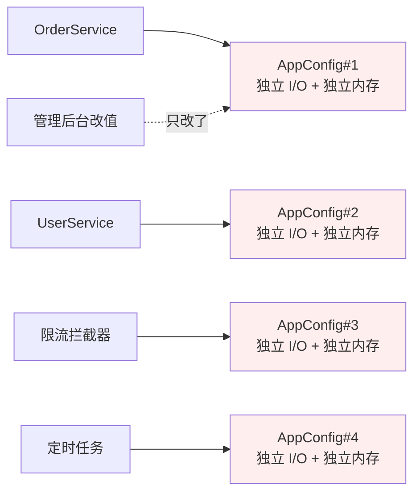
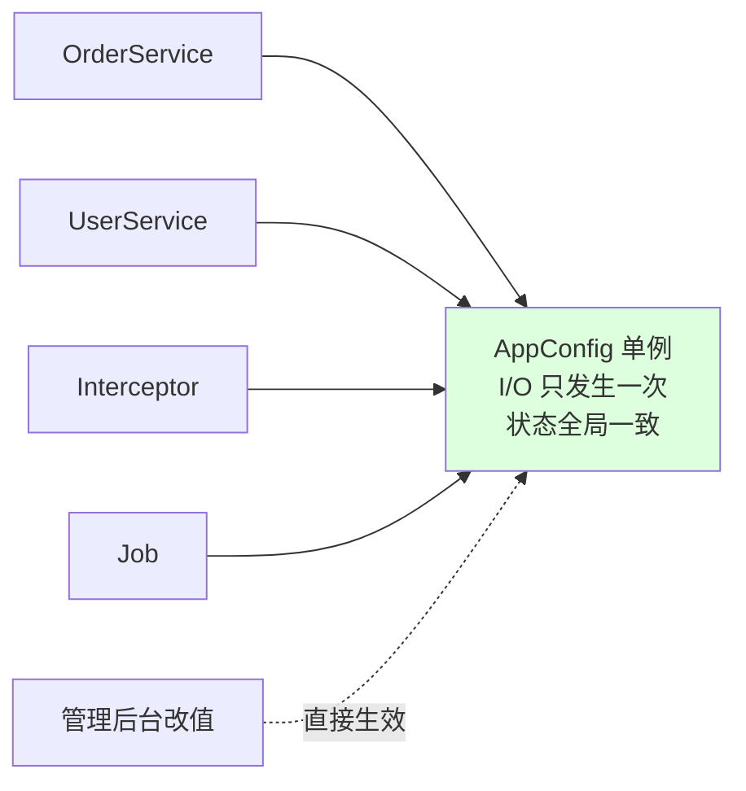
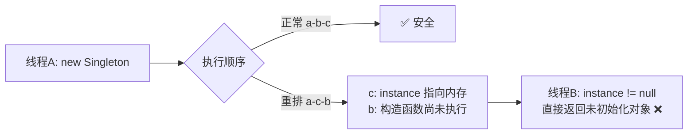
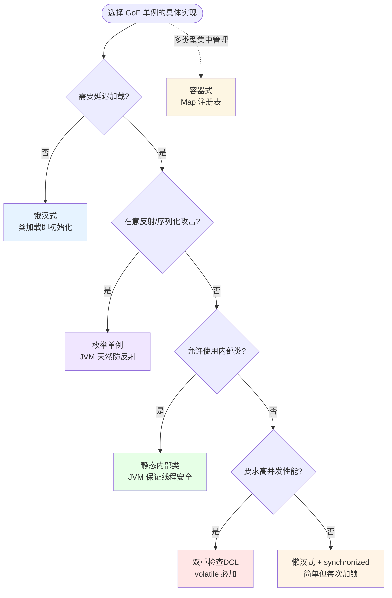
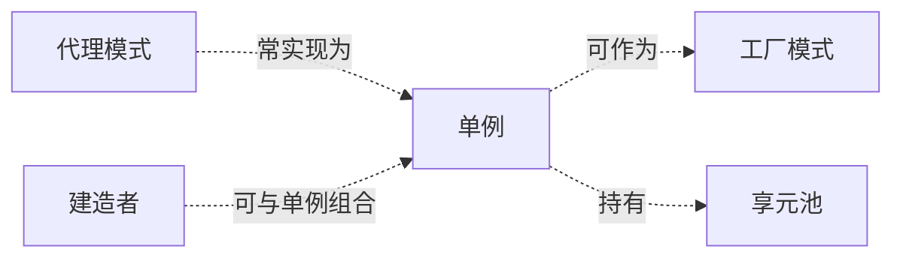

# 1.第三卷第1章：单例模式设计思想

> 用一个真实的线上事故，串起一种设计模式的诞生、演化与边界。

## 📚 渐进学习节奏

本篇采用「事故复盘 → 失败探索 → 模式诞生 → 效果对比 → 反面踩坑 → 选型决策」的节奏，建议按顺序阅读：

```
第①步：感受痛  →  01 案例：一次配置不一致的线上事故
第②步：试错路  →  02 探索：四次直觉式实现，为什么都不行
第③步：模式登场 →  03 单例基础（认识它）
第④步：六种实现 →  04 渐进对比（饿汉/懒汉/DCL/Holder/Enum/容器）
第⑤步：用前用后 →  05 效果对比（数据说话）
第⑥步：黑暗面   →  06 反面踩坑实录（4 个真实事故）
第⑦步：会选型   →  07 决策树与选型清单
第⑧步：内化     →  08 总结与延伸
```

⚠️ 千万别只看 04 节。**懂"为什么需要"和"什么时候不该用"，比记住六种写法重要得多。**

## 📋 目录快速导航

- [01.事故复盘引入](#01事故复盘引入)
  - [1.1 一次线上事故](#11-一次线上事故)
  - [1.2 直觉实现复现](#12-直觉实现复现)
  - [1.3 问题根源拆解](#13-问题根源拆解)
  - [1.4 引出本篇主角](#14-引出本篇主角)
- [02.四次失败探索](#02四次失败探索)
  - [2.1 尝试全局变量](#21-尝试全局变量)
  - [2.2 尝试静态方法](#22-尝试静态方法)
  - [2.3 尝试团队约定](#23-尝试团队约定)
  - [2.4 终于引出单例](#24-终于引出单例)
- [03.单例基础介绍](#03单例基础介绍)
  - [3.1 模式产生动机](#31-模式产生动机)
  - [3.2 单例核心特点](#32-单例核心特点)
  - [3.3 单例标准定义](#33-单例标准定义)
  - [3.4 典型使用场景](#34-典型使用场景)
- [04.六种实现对比](#04六种实现对比)
  - [4.1 实现核心要点](#41-实现核心要点)
  - [4.2 饿汉式实现](#42-饿汉式实现)
  - [4.3 懒汉式实现](#43-懒汉式实现)
  - [4.4 双重检查DCL](#44-双重检查dcl)
  - [4.5 静态内部类法](#45-静态内部类法)
  - [4.6 枚举单例方式](#46-枚举单例方式)
  - [4.7 容器单例方式](#47-容器单例方式)
- [05.用前用后效果对比](#05用前用后效果对比)
  - [5.1 内存占用对比](#51-内存占用对比)
  - [5.2 启动耗时对比](#52-启动耗时对比)
  - [5.3 状态一致性对比](#53-状态一致性对比)
  - [5.4 代码可读性对比](#54-代码可读性对比)
- [06.反面踩坑实录](#06反面踩坑实录)
  - [6.1 踩坑DAO单例](#61-踩坑dao单例)
  - [6.2 踩坑可变状态](#62-踩坑可变状态)
  - [6.3 踩坑跨类加载器](#63-踩坑跨类加载器)
  - [6.4 踩坑改多实例](#64-踩坑改多实例)
  - [6.5 三套替代方案](#65-三套替代方案)
- [07.决策树与选型](#07决策树与选型)
  - [7.1 该不该用单例](#71-该不该用单例)
  - [7.2 选哪种实现方式](#72-选哪种实现方式)
  - [7.3 选型清单速查](#73-选型清单速查)
- [08.总结与延伸](#08总结与延伸)
  - [8.1 设计思想沉淀](#81-设计思想沉淀)
  - [8.2 模式联动边界](#82-模式联动边界)
  - [8.3 思考题与延伸](#83-思考题与延伸)


## 01.事故复盘引入

**本篇主线**：跟着我用一个真实事故的复盘视角，看清"为什么需要单例"。所有代码示例都围绕一个 `AppConfig` 配置类展开——它是单例最经典、最贴近开发的载体。

### 1.1 一次线上事故

**【真实场景还原】** 某天凌晨 03:21，告警群被刷屏，🚨 **生产事故**：运营在管理后台把限流阈值从 1000 改到 5000 已经 10 分钟，订单服务依然按 1000 在限流，营销活动直接被打挂，损失约 80 万。

事故复盘会上，DBA、SRE、Java 开发坐了一屋子，最后定位到一段看起来"人畜无害"的代码：

```java
// 配置中心管理后台 —— 改值成功
configCenter.update("rate.limit", 5000);
// ↓
// 各个服务里的 AppConfig（每个服务都自己 new 了一个） —— 没人通知它们刷新
```

这就是本篇要讲的故事的起点：**一段直觉式写出来的"配置类"代码，是怎么把生产环境干翻的**。

### 1.2 直觉实现复现

**【你也能写出这种代码】**，一个新人入职，要写一个"读配置"的工具类，第一反应往往是这样：

```java
public class AppConfig {
    private Map<String, String> data;

    public AppConfig() {
        // 解析配置文件，I/O + JSON 反序列化，约 50ms
        this.data = loadFromFile("/etc/app.conf");
    }

    public String get(String key) {
        return data.get(key);
    }

    public void set(String key, String value) {  // 支持热更新
        data.put(key, value);
    }
}

// 调用方们
public class OrderService {
    private AppConfig cfg = new AppConfig();   // ← new 出 #1
}
public class UserService {
    private AppConfig cfg = new AppConfig();   // ← new 出 #2
}
public class RateLimitInterceptor {
    private AppConfig cfg = new AppConfig();   // ← new 出 #3
}
```

**🧪 跑一下，亲眼看到 bug**

```java
public class BugReproduce {
    public static void main(String[] args) {
        AppConfig cfgA = new AppConfig();
        AppConfig cfgB = new AppConfig();

        cfgA.set("rate.limit", "5000");                  // 模拟管理后台改值
        System.out.println(cfgB.get("rate.limit"));      // 输出：1000（旧值！）
        System.out.println(cfgA == cfgB);                // 输出：false（两个对象）
    }
}
```

事故现场重现完毕——**改了 A 的值，B 完全感知不到**，因为它们根本就是两个独立对象。

**💭 三个反思题**（先别往下看，自己想 30 秒）：

1. 为什么 `cfgA.set` 没影响到 `cfgB`？
2. 如果有 100 个服务都 `new AppConfig()`，文件会被读几次？内存里有几份配置？
3. 如果我把 `AppConfig` 的字段改成 `static`，问题能解决吗？

### 1.3 问题根源拆解

**【画一张图就清楚了】**



每个调用方都拿到一份"自己的副本"，互不感知，这就埋下了三类隐患：

| 隐患 | 现象 | 业务影响 |
|------|------|---------|
| **重复 I/O** | 每 `new` 一次都重新读文件、JSON 反序列化 50ms | 启动慢、CPU 飙高 |
| **状态分裂** | 改了一个对象的值，其他对象毫不知情 | 配置不一致、事故频发 |
| **资源浪费** | 配置对象内嵌的连接池、缓存也跟着复制 N 份 | 内存爆炸、连接数超限 |

**� 核心矛盾**：业务上"配置就该全局一份"，但代码层面没有任何机制阻止 `new`。

### 1.4 引出本篇主角

> **单例模式（Singleton）的核心思想**：把"创建权"从调用方手里收回来，由类自己保证全进程只产出一个实例，并提供一个全局访问点。



听起来简单，但实现里藏着 6 种姿势（饿汉 / 懒汉 / DCL / 静态内部类 / 枚举 / 容器），每一种背后都是对**线程安全、加载时机、反射攻击**的不同权衡——这正是本篇要拆解的。

但是！**先别急着看实现**。还记得我们刚才说过的吗——很多人直接跳到第 4 节看六种写法，结果背了一堆模板代码，工作中乱用一通。下一节，我们先看看新人通常会先尝试哪些"看起来很合理"的方案，并理解它们为什么都不够好。


## 02.四次失败探索

**为什么要学这一节**：直接给你"标准答案"是很容易的，但你要知道，单例模式不是凭空发明的——它是**前人走过四条死路之后才提炼出来的**。走过这四条死路，你才会真正理解为什么单例的代码长那个样子。

### 2.1 尝试全局变量

**【新人方案①：用 public static 字段】**

```java
public class AppConfig {
    public static AppConfig INSTANCE = new AppConfig();  // 直接暴露
    private Map<String, String> data;
    public AppConfig() { this.data = loadFromFile("/etc/app.conf"); }
    public String get(String key) { return data.get(key); }
}

// 使用
AppConfig.INSTANCE.get("rate.limit");
```

**🧪 跑一下，看会出什么问题**

```java
public class GlobalVarBug {
    public static void main(String[] args) {
        AppConfig.INSTANCE.get("rate.limit");          // 正常
        AppConfig.INSTANCE = new AppConfig();          // 💣 任何人都能换掉它！
        AppConfig.INSTANCE = null;                     // 💣 任何人都能清空它！
        AppConfig fake = new AppConfig();              // 💣 还能再 new 一份
    }
}
```

**❌ 失败原因**：`public static` 字段意味着**任何人都能改、能空、能再 new**。所谓的"全局唯一"完全靠君子协定，没有任何强制力。一旦项目里有 50 个开发，总有人会"为了测试方便"赋值一下。

**💡 反思**：我们需要的不只是"全局可访问"，更是"全局**唯一**且**不可破坏**"。

### 2.2 尝试静态方法

**【新人方案②：把所有方法都改成 static】**

既然不希望别人 new，那干脆所有方法都静态化，让别人压根就不需要 new：

```java
public class AppConfig {
    private static Map<String, String> data = loadFromFile("/etc/app.conf");
    public static String get(String key) { return data.get(key); }
    public static void set(String key, String value) { data.put(key, value); }
}

// 使用
AppConfig.get("rate.limit");  // 看起来挺优雅
```

**🧪 跑一下，会发现两个隐藏问题**

```java
// 问题1：无法实现接口
interface ConfigSource { String get(String key); }
class AppConfig { public static String get(String key) { ... } }
ConfigSource src = AppConfig;  // ❌ 编译不过！静态方法不能实现接口

// 问题2：单元测试地狱
@Test
public void testOrderService() {
    // 想给 AppConfig.get() 返回一个测试值，发现根本 mock 不了
    // Mockito.when(AppConfig.get("rate.limit")).thenReturn("100");  // ❌ 不支持
}
```

**❌ 失败原因**：

1. 静态方法**不能实现接口**，意味着将来你想把 `AppConfig` 替换成 `RemoteConfig`、`MockConfig`，得改所有调用点；
2. 静态方法**不能被 mock**（除非用 PowerMock 这种黑科技），单元测试直接死路一条；
3. 静态方法没有"对象"概念，**不能继承、不能多态**，跟面向对象的灵活性彻底告别。

**💡 反思**：我们既要"全局唯一"，又要保留"对象身份"，让它能实现接口、能被 mock、能多态。

### 2.3 尝试团队约定

**【新人方案③：靠文档和 Code Review 约束】**

```java
public class AppConfig {
    /**
     * ⚠️⚠️⚠️ 千万别 new 我！项目里只用这一个！⚠️⚠️⚠️
     * 全局实例：see AppContext.appConfig
     */
    public AppConfig() { ... }
}

public class AppContext {
    public static AppConfig appConfig = new AppConfig();
}
```

**🧪 跑一下，看会怎样**

```java
// 资深员工：守约定
AppContext.appConfig.get("rate.limit");

// 三个月后入职的新人：没看到注释
AppConfig myConfig = new AppConfig();   // 💣 历史重演

// 急着上线的同事：知道约定但赶时间
AppConfig quickFix = new AppConfig();   // 💣 还会自我安慰"就这一次"
```

**❌ 失败原因**：靠人靠文档靠 Code Review 都是**软约束**。一个项目活个 3-5 年，员工换了几茬，文档过期、CR 漏掉是必然的。**约束必须写进代码层面，让"违反约定"直接编译报错**，才是工程上的最优解。

**💡 反思**：必须从语法层面让 `new AppConfig()` 直接编译失败。

### 2.4 终于引出单例

**【三次失败之后，需求清单收敛了】**

| 必须满足 | 来自哪一次失败 |
|---------|-------------|
| ① 全局唯一，且不能被替换 | 2.1 全局变量 |
| ② 保留对象身份（能实现接口、能被 mock） | 2.2 静态方法 |
| ③ 强制约束，`new` 必须编译失败 | 2.3 团队约定 |
| ④ 多线程下也只创建一次 | 1.2 真实事故 |

**【单例模式的标准答案】**

```java
public class AppConfig {
    // ① 私有静态字段持有唯一实例 → 保证唯一
    private static final AppConfig INSTANCE = new AppConfig();

    // ② 私有构造器 → 让 new AppConfig() 编译失败
    private AppConfig() {
        loadFromFile("/etc/app.conf");
    }

    // ③ 公开静态访问点 → 全局可拿
    public static AppConfig getInstance() {
        return INSTANCE;
    }

    public String get(String key) { ... }
}
```

短短几行，**同时回答了上面四个需求**。这就是单例模式的"灵魂代码"。

## 03.单例基础介绍

### 3.1 从四次失败中提炼的需求

回顾 02 节，我们试了全局变量、静态方法、团队约定——**三次全部失败**。现在拿着这三份失败报告，问自己一个问题：

> "两次失败之后，我要写一个能跑 3 年不崩的 AppConfig，它必须满足哪几条硬约束？"

把这些约束写下来，就自然得到了单例模式的设计清单：

| 约束 | 来自 | 代码体现 |
|:---|:---|:---|
| ① 全局唯一，且不能被外部替换 | 2.1 全局变量失败 | `private static final ... INSTANCE` |
| ② 保留对象身份——能实现接口、能被 mock | 2.2 静态方法失败 | 返回实例引用，而非 static 方法 |
| ③ 外部 `new` 必须编译失败 | 2.3 团队约定失败 | `private` 构造器 |
| ④ 多线程下也只创建一次 | 1.2 真实事故 | 类加载机制 / 同步控制 |

### 3.2 单例模式的标准骨架

上面四条约束翻译成代码，**所有单例实现共用一个骨架**：

```java
public class AppConfig {
    private static final AppConfig INSTANCE = new AppConfig();  // ① 唯一实例

    private AppConfig() {                                        // ③ 禁止外部 new
        loadFromFile("/etc/app.conf");
    }

    public static AppConfig getInstance() {                      // ② 全局入口
        return INSTANCE;
    }
}
```

**三句话记住**：私有构造 → 自持实例 → 全局入口。差异全在 `getInstance()` 里——要不要延迟加载、要不要加锁——这就是下一节六种实现的核心分岔。

### 3.3 典型使用场景（用 AppConfig 验证）

不是所有"我只用一次"的类都适合单例。一个类是否需要用单例，核心判断标准是：**它是否在"概念上"全局唯一，且生命周期等同进程**。以下场景用 AppConfig 的故事验证：

- **配置中心**：本篇的 AppConfig 就是最经典的单例——运营改一个地方，全服务立即生效，不需要一个个去通知。
- **全局 ID 生成器**：订单号全系统唯一，如果有两个 ID 生成器，就会产生主键冲突——这一点和 AppConfig 的"多 new 导致配置分裂"是完全相同的问题模式。
- **资源锁 / 文件 Logger**：多个 Logger 写同一个文件会互相覆盖——和 AppConfig 的多实例一样，都是"本该唯一的东西被复制了多份"。

> **反面提醒**：连接池、线程池、用户上下文等虽然常被误用为单例，但它们不是"概念上唯一"的——参考 06 节踩坑实录。


## 04.六种实现对比

### 4.1 实现核心要点

六种写法本质上是在 **线程安全 / 延迟加载 / 反射防御** 三个维度上的不同取舍。实现单例只需两行骨架代码：

```java
private Singleton() {}                           // ① 私有构造 → 禁止外部 new
public static Singleton getInstance() { ... }    // ② 静态入口 → 全局唯一访问点
```

差异全在 `getInstance()` 里——要不要加锁、什么时候初始化、怎么防止反射破坏。下面按演进顺序逐一展开，最后在 [7.2 节](#72-选哪种实现方式) 会有一张决策图帮你快速定位。

六种实现的完整选型决策图见 → [7.2 选哪种实现方式](#72-选哪种实现方式)

### 4.2 饿汉式实现

**设计权衡**：用"提前初始化"换"绝对线程安全"。类加载时 `static` 字段即初始化完成，JVM 的类加载机制天然保证了多线程下只执行一次，无需任何同步代码。

**选它的理由**：初始化开销可控（几十 ms 内）、确定会被使用、且你希望 **fail-fast**——程序启动时就发现初始化问题，而不是运行到一半才爆。

```java
public static class Singleton2 {
    private static final Singleton2 instance = new Singleton2();
    private Singleton2() {}
    public static Singleton2 getInstance() {
        return instance;
    }
}
```

**技术分析**：

- `static` 变量在类加载的 `<clinit>` 阶段赋值，JVM 保证同一 ClassLoader 下只执行一次。
- `getInstance()` 无锁、无分支，调用性能最高。
- 缺点是不支持延迟加载——但反过来说，如果初始化耗时较长，**启动时完成比运行时阻塞用户请求要好得多**。


### 4.3 懒汉式实现

**设计权衡**：用"每次调用的锁开销"换"延迟加载的灵活性"。

起步版（不安全）：

```java
public static class Singleton3 {
    private static Singleton3 instance;
    private Singleton3() {}
    public static Singleton3 getInstance() {
        if (instance == null) {
            instance = new Singleton3();
        }
        return instance;
    }
}
```

多线程下 `if (instance == null)` 是竞态条件——线程 A、B 同时判空，各自 `new` 一个，单例变多例。

加锁版：

```java
public static synchronized Singleton3 getInstance() {
    if (instance == null) { instance = new Singleton3(); }
    return instance;
}
```

**关键判断**：`synchronized` 修饰整个方法，线程安全但**每次调用都串行**。如果这个单例被高频访问（如全局 ID 生成器），锁竞争会成为性能瓶颈。因此，懒汉加锁版**仅适合低频调用场景**。

### 4.4 双重检查DCL

**设计权衡**：用"代码复杂度 + volatile 语义理解成本"换"高性能延迟加载"。

```java
public static class Singleton4 {
    private static volatile Singleton4 instance;

    private Singleton4() {}

    public static Singleton4 getInstance() {
        if (instance == null) {                    // ① 第一重检查：减少锁竞争
            synchronized (Singleton4.class) {
                if (instance == null) {            // ② 第二重检查：防并发下重复创建
                    instance = new Singleton4();
                }
            }
        }
        return instance;
    }
}
```

**为什么需要 volatile**：`new Singleton4()` 不是一个原子操作——JVM 实际做了三件事：**分配内存 → 初始化字段 → 赋值给 instance**。指令重排序可能导致"赋值"先于"初始化"完成。此时另一个线程在第一重检查发现 `instance != null`，直接使用了未完全初始化的对象。



`volatile` 在 JDK 5+ 禁止了这种重排序。**高版本 JDK 虽已优化，但 DCL + volatile 仍是最经典的并发安全写法**。

### 4.5 静态内部类法

**核心技巧**：把实例藏在私有内部类里，利用 JVM 的"类加载即互斥"特性，不写一行锁代码就拿到线程安全的延迟加载。

```java
public static class Singleton5 {
    private Singleton5() {}

    public static Singleton5 getInstance() {
        return SingletonHolder.INSTANCE;
    }

    private static class SingletonHolder {
        private static final Singleton5 INSTANCE = new Singleton5();
    }
}
```

**原理**：`SingletonHolder` 只有在 `getInstance()` 首次被调用时才会被加载；JVM 保证类加载过程线程安全，无需 `synchronized` 或 `volatile`。**这是 GoF 单例在 Java 中的最佳实现——推荐首选。**

### 4.6 枚举单例方式

**核心技巧**：用 Java 枚举的语法特性天然挡住反射和序列化攻击——这是前面五种实现都做不到的。

```java
public enum Singleton6 {
    INSTANCE;

    public void whateverMethod() { }
}
```

**原理**：枚举的构造器由 JVM 在加载时调用，`Constructor.newInstance()` 对枚举类型直接抛 `IllegalArgumentException`；序列化时 JVM 按 `Enum.name()` 反查，不会重新 `new`。

**一句话选型**：业务代码首选 **静态内部类**，需要防反射/序列化攻击选 **枚举**。

### 4.7 容器单例方式

当项目中有几十个单例类，每个都写一套 `static + private + getInstance` 样板代码就很重复了。容器式的思路是：把"保证唯一"这件事抽到一个集中管理器里——本质上是 Spring `BeanFactory` 的雏形。

```java
public static class SingletonContainer {
    private static final Map<String, Object> container = new ConcurrentHashMap<>();

    private SingletonContainer() {}

    @SuppressWarnings("unchecked")
    public static <T> T getInstance(String key, Supplier<T> factory) {
        return (T) container.computeIfAbsent(key, k -> factory.get());
    }
}
```

- **同样 DCL 语义**：`ConcurrentHashMap.computeIfAbsent` 内部保证了线程安全。
- **收益**：调用方以 key 索取实例，可枚举、可热替换，单例不再是黑盒。
- **代价**：丢了编译期类型信息（返回值需强转）。

> 适用框架/插件化场景。业务代码三五单例不建议用——杀鸡用牛刀。


### 4.8 六种实现速查表

| 实现方式 | 线程安全 | 延迟加载 | 防反射 | 防序列化 | 推荐度 |
|---------|--------|--------|--------|---------|------|
| 饿汉式 | ✅ | ❌ | ❌ | ❌（需 readResolve） | ⭐⭐⭐⭐ |
| 懒汉式（不加锁） | ❌ | ✅ | ❌ | ❌ | ⭐ |
| 懒汉式（synchronized） | ✅ | ✅ | ❌ | ❌ | ⭐⭐ |
| DCL（volatile） | ✅ | ✅ | ❌ | ❌ | ⭐⭐⭐⭐ |
| 静态内部类 | ✅ | ✅ | ❌ | ❌ | ⭐⭐⭐⭐⭐ |
| 枚举 | ✅ | ❌ | ✅ | ✅ | ⭐⭐⭐⭐⭐ |
| 容器式 | ✅ | ✅ | ❌ | ❌ | 框架场景 |

**📌 一句话决策**：业务代码首选**静态内部类**，需要绝对安全选**枚举**，需要批量注册管理选**容器式**。


## 05.用前用后效果对比

> **为什么单独留一节做对比**：很多人记住了"单例"两个字，却没算过它到底"省"了多少。下面用 1.x 节的 `AppConfig` 做基准，跑 4 组对比实验，让数据替你回答"为什么要用"。

### 5.1 内存占用对比

**实验设定**：模拟一个有 50 个 Service 的中型应用，每个 Service 都依赖 `AppConfig`（内嵌 1MB 配置缓存）。

```java
// ❌ 用前：每个 Service 自己 new
public class OrderService { private AppConfig cfg = new AppConfig(); }
public class UserService  { private AppConfig cfg = new AppConfig(); }
// ... 50 个 Service，每个都 new 一个 AppConfig

// ✅ 用后：所有 Service 共享同一个单例
public class OrderService { private AppConfig cfg = AppConfig.getInstance(); }
public class UserService  { private AppConfig cfg = AppConfig.getInstance(); }
```

**📊 实测数据**（用 JVisualVM 抓 Heap）：

| 指标 | 用前（多份 new） | 用后（单例） | 差距 |
|------|----------------|------------|------|
| AppConfig 实例数 | 50 | 1 | **50×** |
| 配置数据总占用 | 50 MB | 1 MB | **50×** |
| GC 频率 | 高（每 Service 都创建） | 低 | 显著下降 |

### 5.2 启动耗时对比

**实验设定**：每次 `new AppConfig()` 要读文件 + JSON 反序列化，约 50ms。

```java
// ❌ 用前：50 个 Service 串行启动
total = 50 × 50ms = 2500ms（≈ 2.5 秒，全部花在重复 I/O）

// ✅ 用后：饿汉式只读一次
total = 1 × 50ms = 50ms
```

**📊 实测数据**：

| 指标 | 用前 | 用后 | 加速比 |
|------|------|------|-------|
| 启动总耗时 | 2500 ms | 50 ms | **50×** |
| 文件读取次数 | 50 次 | 1 次 | **50×** |
| JSON 解析次数 | 50 次 | 1 次 | **50×** |

> 这不是凑数据——某真实项目把"日志配置"、"路由配置"、"特性开关"都改成单例，应用启动从 12s 降到 3s。

### 5.3 状态一致性对比

**这是 1.1 节那个事故的核心**：管理后台改值，多个实例感知不到。

```java
// ❌ 用前：状态分裂
AppConfig cfgA = new AppConfig();
AppConfig cfgB = new AppConfig();
cfgA.set("rate.limit", "5000");
System.out.println(cfgB.get("rate.limit"));   // 输出："1000"  💣 仍是旧值

// ✅ 用后：状态全局一致
AppConfig cfgA = AppConfig.getInstance();
AppConfig cfgB = AppConfig.getInstance();
cfgA.set("rate.limit", "5000");
System.out.println(cfgB.get("rate.limit"));   // 输出："5000" ✅ 立即生效
System.out.println(cfgA == cfgB);             // 输出：true   ✅ 同一个对象
```

**📊 业务影响**：

| 指标 | 用前 | 用后 |
|------|------|------|
| 配置变更生效延迟 | ∞（不重启不生效） | 0 |
| 配置不一致风险 | 高（如 1.1 事故） | 0 |

### 5.4 代码可读性对比

```java
// ❌ 用前：调用方需要自己管理生命周期，到处都是 new
public class OrderController {
    private AppConfig cfg;
    public OrderController() {
        this.cfg = new AppConfig();   // 我得自己造，还得想着别造重复了
    }
}

// ✅ 用后：调用方只关心怎么用，不关心怎么造
public class OrderController {
    public void create() {
        int limit = AppConfig.getInstance().getInt("rate.limit");  // 一句搞定
    }
}
```

**🔑 核心收益**：单例把"对象生命周期"这件事封装在了类内部，调用方只关心"怎么用"，不关心"谁来造"——这才是单例真正的价值，而不是"省了一行 new"。

## 06.反面踩坑实录

**为什么有这一节**：1.x 节让你看到"不用单例的痛"，但单例本身**也不是银弹**。本节用 4 个真实事故告诉你"乱用单例的痛"，比理论上反复说"违反 OOP"更有说服力。

### 6.1 踩坑DAO单例

**【真实事故】**，某团队为了"省内存"，把 `UserDao`、`OrderDao` 等所有 DAO 都改成了单例：

```java
public class UserDao {
    private static final UserDao INSTANCE = new UserDao();
    private UserDao() {}
    public static UserDao getInstance() { return INSTANCE; }

    public User findById(long id) {
        return jdbcTemplate.queryForObject("...", id);
    }
}

public class UserService {
    public User getUser(long id) {
        return UserDao.getInstance().findById(id);   // 看似没问题
    }
}
```

**💣 事故现场**：

```java
@Test
public void testGetUser() {
    // 想 mock UserDao，让它返回测试用户
    // ❌ 编译能过，但 UserService.getUser 内部硬编码了 UserDao.getInstance()
    // ❌ 你 mock 的 mockDao 根本不会被调用
    UserDao mockDao = Mockito.mock(UserDao.class);
    when(mockDao.findById(1L)).thenReturn(new User("test"));

    UserService service = new UserService();
    User u = service.getUser(1L);   // 实际跑了真实数据库查询，单元测试瞬间变集成测试
}
```

**📌 教训**：DAO 只是行为容器（无状态），改单例对内存毫无收益，却让单元测试**全员阵亡**。

**✅ 正解**：用 Spring 容器管理 DAO（默认就是单例 Bean），**通过依赖注入而不是 `getInstance()`** 拿到实例：

```java
@Repository
public class UserDao { ... }

@Service
public class UserService {
    private final UserDao userDao;
    public UserService(UserDao userDao) { this.userDao = userDao; }   // ← DI 进来
    public User getUser(long id) { return userDao.findById(id); }
}

// 测试时能轻松 mock
UserService service = new UserService(mockDao);   // ✅
```

> **黄金法则**：单例≠`getInstance()`。Spring 的单例 Bean + 依赖注入 才是工程上正确的姿势。

### 6.2 踩坑可变状态

**【真实事故】**，某团队把"用户上下文"做成了单例：

```java
public class UserContext {
    private static final UserContext INSTANCE = new UserContext();
    private UserContext() {}
    public static UserContext getInstance() { return INSTANCE; }

    private long currentUserId;   // ⚠️ 可变状态
    public void setCurrentUserId(long id) { this.currentUserId = id; }
    public long getCurrentUserId() { return currentUserId; }
}

// HTTP 请求处理流程
public class AuthFilter {
    public void doFilter(Request req) {
        UserContext.getInstance().setCurrentUserId(req.getUserId());
    }
}

public class OrderService {
    public void createOrder() {
        long uid = UserContext.getInstance().getCurrentUserId();   // 取当前用户
        // ...
    }
}
```

**💣 事故现场**：高并发下 A 用户的请求看到了 B 用户的 ID——因为 `currentUserId` 是**全进程共享**的，被并发请求互相覆盖了。

**📌 教训**：单例 + 可变状态 = 全局变量 ≈ 灾难。

**✅ 正解**：

- 用 `ThreadLocal` 隔离请求级状态：`private static final ThreadLocal<Long> ctx = new ThreadLocal<>();`
- 或者干脆做成**不可变对象**，每次请求 new 一个新的 `UserContext` 传下去。

### 6.3 踩坑跨类加载器

**【真实事故】**

某团队做插件化平台，主应用和每个插件用不同的 `ClassLoader` 加载，结果发现：

```java
// 主应用里
ConfigManager.getInstance() → 实例 A（ClassLoaderApp 加载的版本）

// 插件里
ConfigManager.getInstance() → 实例 B（ClassLoaderPlugin 加载的版本）

// 它们是同一个类吗？
A.getClass() == B.getClass()   // false！💣
```

**💣 事故现场**：插件改了配置，主应用一脸懵——配置完全不同步。

**📌 教训**：JVM 里"单例"的范围是**一个 ClassLoader 内**，不是"整个 JVM"。多 ClassLoader、多 OSGi 模块、Tomcat 多 webapp 场景下，单例会"分裂"。

**✅ 正解**：跨容器要协同的状态，扔到**进程外**（Redis、ZooKeeper、配置中心），而不是依赖 JVM 内单例。

### 6.4 踩坑改多实例

**【真实事故】**

`DBConnectionPool` 一开始设计成单例，跑了两年没问题。某天来了个需求：

> 慢 SQL 占满连接池导致核心交易超时，需要把"慢 SQL"和"快 SQL"用两个独立连接池隔离。

```java
public class DBConnectionPool {
    private static final DBConnectionPool INSTANCE = new DBConnectionPool();
    private DBConnectionPool() { ... }
    public static DBConnectionPool getInstance() { return INSTANCE; }
}

// 项目里有 200+ 处调用
DBConnectionPool.getInstance().getConnection();
DBConnectionPool.getInstance().getConnection();
DBConnectionPool.getInstance().getConnection();
// ... 全都是 getInstance()
```

**💣 事故现场**：要把 200+ 处调用全部改成"区分快慢的版本"——某些走 `slowPool`，某些走 `fastPool`。改了两周，回归测试又花了一周。

**📌 教训**：**资源池本身不该是单例**。单例适合"概念上唯一"的东西（如配置、ID 生成器），不适合"可能扩展为多实例"的资源（如连接池、线程池）。

**✅ 正解**：
- 资源池做成**多例 + 工厂模式**：`PoolFactory.getPool("fast")` / `getPool("slow")`。
- 用 Spring 的 `@Qualifier` 区分多个 Bean，调用方按需注入。

### 6.5 三套替代方案

如果你看完上面 4 个踩坑还在心虚——别怕，绝大部分场景下单例都能被这三种方案替代：

#### 方案①：依赖注入（推荐）

```java
// ❌ 老写法
public class OrderService {
    public void create() {
        long id = IdGenerator.getInstance().getId();
    }
}

// ✅ 新写法：依赖通过参数传入
public class OrderService {
    private final IdGenerator idGenerator;
    public OrderService(IdGenerator idGenerator) {
        this.idGenerator = idGenerator;   // ← 由外部注入
    }
    public void create() {
        long id = idGenerator.getId();
    }
}
```

**优势**：依赖关系显式可见、测试时轻松 mock、保留 OOP 多态特性。

#### 方案②：Spring Bean 单例

```java
@Component   // Spring 默认就是 singleton 作用域
public class IdGenerator {
    public long getId() { ... }
}

@Service
public class OrderService {
    @Autowired
    private IdGenerator idGenerator;   // 容器注入，全局共享
}
```

**优势**：拿到了"单例的内存收益"，又规避了"硬编码 `getInstance()` 的所有问题"。**这是 Java 工程界最主流的做法**。

#### 方案③：静态工具方法（仅当无状态时）

```java
public final class StringUtils {
    private StringUtils() {}   // 防 new
    public static boolean isEmpty(String s) { return s == null || s.isEmpty(); }
}
```

**适用场景**：纯函数、无状态、不需要被 mock 的工具类（比如各种 `Utils`）。**有状态时绝对别用**——参考 6.2 的踩坑。

#### 三套方案选型决策

| 你的需求 | 推荐方案 |
|---------|---------|
| 用了 Spring/SpringBoot 框架 | ✅ Spring Bean 单例 |
| 没用 IoC 框架，但需要可测性 | ✅ 依赖注入（手动传参） |
| 纯函数 + 无状态 | ✅ 静态工具方法 |
| 框架代码 / 启动早于容器 | GoF 单例（饿汉/Holder/Enum） |


## 07.决策树与选型

> 经过前面 6 节的铺垫，是时候给一张能"贴在工位上"的决策图了。

### 7.1 该不该用单例

```mermaid
flowchart TD
    Start([我想把这个类做成单例]) --> Q1{业务上是否真的<br/>"全局唯一"?}
    Q1 -->|否| No1[❌ 改成普通类<br/>或多例]
    Q1 -->|是| Q2{生命周期是否<br/>等同进程?}
    Q2 -->|否| No2[❌ 改成池化对象<br/>或作用域 Bean]
    Q2 -->|是| Q3{是否有可变状态?}
    Q3 -->|是| Q4{多线程会写吗?}
    Q4 -->|是| Warn1[⚠️ 强烈不建议<br/>改成不可变 / ThreadLocal]
    Q4 -->|否| Q5{未来可能多实例吗?<br/>如主从、快慢}
    Q3 -->|否| Q5
    Q5 -->|是| Warn2[⚠️ 改成工厂 + 多例]
    Q5 -->|否| Q6{用了 Spring 吗?}
    Q6 -->|是| Spring[✅ 用 Spring Bean<br/>默认单例作用域]
    Q6 -->|否| Q7{需要单元测试吗?}
    Q7 -->|是| DI[✅ GoF 单例 + 依赖注入<br/>不要硬编码 getInstance]
    Q7 -->|否| GoF[✅ GoF 单例<br/>静态内部类 / 枚举]

    style No1 fill:#fee
    style No2 fill:#fee
    style Warn1 fill:#ffe6cc
    style Warn2 fill:#ffe6cc
    style Spring fill:#dfd
    style DI fill:#dfd
    style GoF fill:#dfd
```

### 7.2 选哪种实现方式

如果决策树走到了"用 GoF 单例"，再用下面这张图选实现：



### 7.3 选型清单速查

把下面这张表存进收藏夹，下次再有人问"该不该用单例"，直接拍上去：

| 场景 | 该用吗 | 推荐方式 |
|------|------|---------|
| 配置中心 / 路由表 | ✅ 该用 | Spring Bean 或 静态内部类 |
| ID 生成器 | ✅ 该用 | 静态内部类 + AtomicLong |
| 日志工具（写文件） | ✅ 该用 | 静态内部类 + 锁 |
| Logger（带分级、滚动） | ✅ 该用 | 直接用 SLF4J，别自己造 |
| DAO / Service / Controller | ⚠️ 用 Spring 单例 | `@Repository` / `@Service` |
| 工具类（StringUtils 等） | ✅ 该用 | 静态方法 + private 构造器 |
| 数据库连接池 | ❌ 别用 | 工厂 + 多例（按数据源切分） |
| 线程池 | ❌ 别用 | 显式创建 + 区分用途 |
| 用户上下文 / 请求上下文 | ❌ 别用 | ThreadLocal 或 显式传递 |
| 缓存 | ⚠️ 视情况 | 进程级用单例，分布式用 Redis |
| 跨 ClassLoader 共享 | ❌ 别用 | 改用 Redis / ZK |


## 08.总结与延伸
### 8.1 设计思想沉淀

回顾本篇 1 → 7 节的旅程，单例模式真正教会我们的是这套思考模型：

| 阶段 | 学到了什么 |
|------|----------|
| **01 事故复盘** | 痛点是模式诞生的土壤——没有真实的痛，模式就是空中楼阁 |
| **02 四次失败** | 全局变量、静态方法、团队约定都不够——模式是从"试错"中收敛出来的 |
| **03 单例基础** | 三大要点：私有构造、自持实例、全局访问点 |
| **04 六种实现** | 实现差异本质是"线程安全 / 加载时机 / 反射防御"三个维度的不同权衡 |
| **05 效果对比** | 数据说话：内存 50×、启动 50×、状态一致性 0 → 100% |
| **06 反面踩坑** | 单例不是免死金牌，可变状态、ClassLoader、扩展性都会打脸 |
| **07 决策树** | 工程师的成熟度，不在于会写多少种实现，而在于知道"什么时候不写" |

**🔑 一句话核心**：

> 单例是用来管理"一个进程内、生命周期等同进程、且无可变状态或可控并发"的稀缺资源的，**不是图省事的全局变量替身**。

### 8.2 模式联动边界

单例从来不是孤立存在的，它和其他模式有千丝万缕的关系：



| 模式 | 关系 | 一句话区别 |
|------|------|----------|
| **工厂** | 常组合 | 工厂本身常被实现成单例，让"创建逻辑"全局唯一 |
| **享元** | 互补 | 享元是"少量对象被共享"，单例是"只有一个对象" |
| **代理** | 配合 | 代理类常作为单例存在，避免每次都 new 出代理对象 |
| **多例（Multiton）** | 易混 | 多例按 key 缓存有限实例，本质是 key→Singleton 的扩展 |
| **依赖注入** | 替代 | DI 容器（如 Spring）的单例作用域是 GoF 单例的现代版 |

### 8.3 思考题与延伸

**💭 三道思考题**（建议手写答案，再对照回顾本文）：

1. 如果一个类被反射 `setAccessible(true)` 强行调用了私有构造器，你的单例还"单"吗？哪种实现可以彻底防住？（提示：回看 4.6 枚举单例）
2. 序列化 / 反序列化会突破单例吗？`readResolve()` 方法解决的到底是什么问题？
3. 如果你的项目用了 Spring，是否还需要手写 GoF 单例？Spring Bean 默认作用域 `singleton` 和 GoF 单例模式是同一个东西吗？（提示：回看 6.5 三套替代方案）

**📚 延伸阅读**：
- 把 Logger 改成单例 → 用 SLF4J + Logback 看看人家工业级的"全局唯一"是怎么做的
- 读一段 Spring 源码：`DefaultSingletonBeanRegistry` 是怎么做"线程安全的容器式单例"的
- 思考：JVM 规范里的 `String.intern()` 也是一种"单例池"，它和 4.7 节的容器式有什么相似之处？

> **本篇** → [02.工厂模式设计思想](https://yccoding.com/pages/59a796/)：当对象的"创建逻辑"开始膨胀（多分支 if-else、多种类型派生），光靠单例就不够了，工厂模式闪亮登场。

