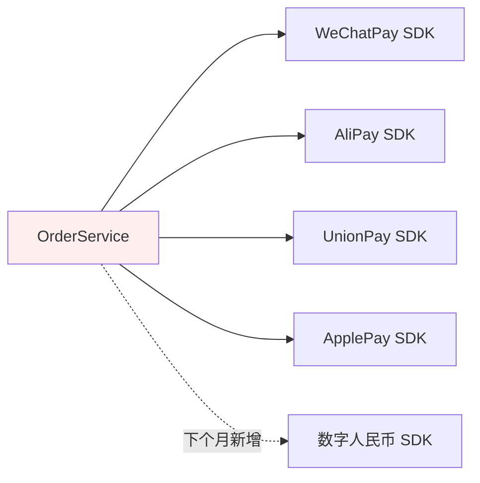
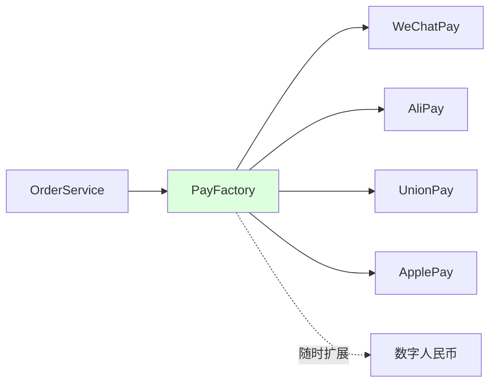
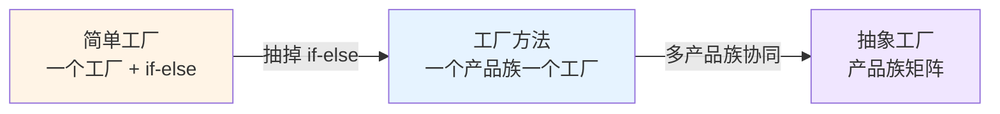
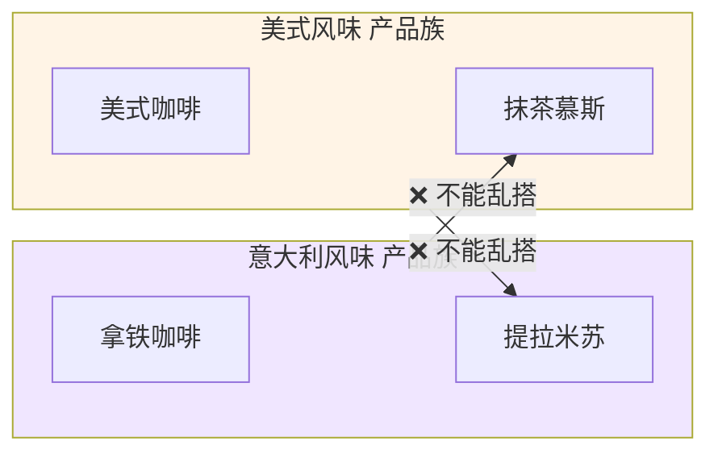
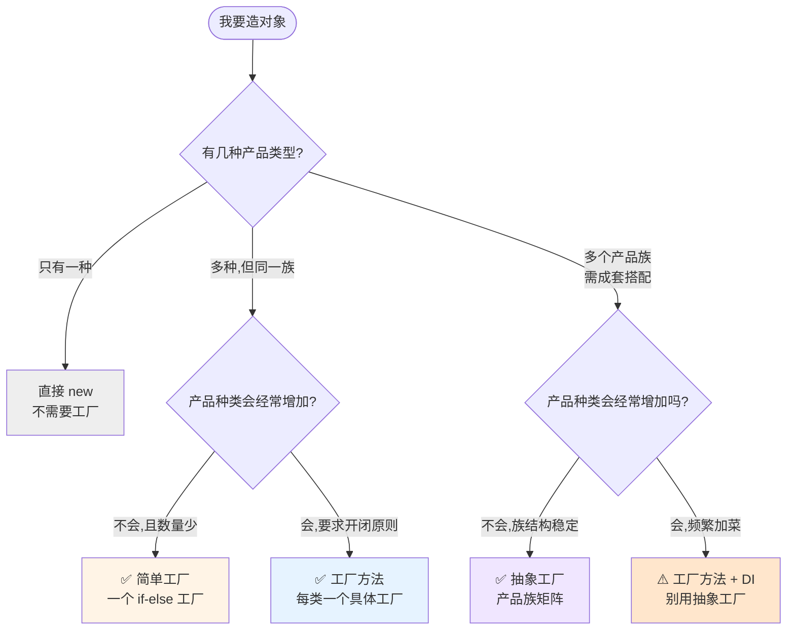
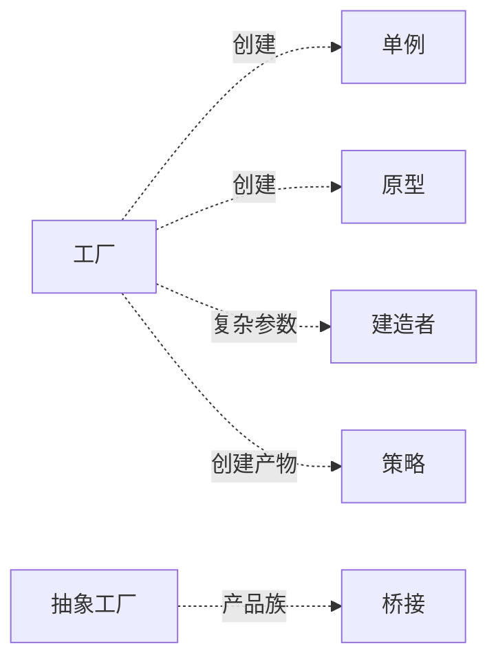

# 第三卷第2章：工厂模式设计思想

> **📚 本篇渐进学习节奏（建议按顺序食用）**
>
> 1. **第 01 节 · 案例引入** — 看一段"凌晨支付事故"的真实代码，先感受痛
> 2. **第 02 节 · 直觉探索** — 三种非工厂方案，为什么全翻了车
> 3. **第 03 节 · 简单工厂** — 把 if-else 抽出来，享受第一波红利
> 4. **第 04 节 · 工厂方法** — 简单工厂被开闭原则打脸，进化为多态
> 5. **第 05 节 · 抽象工厂** — 当产品"成族出现"，工厂方法也救不了
> 6. **第 06 节 · 效果对比** — 改造前后数据说话
> 7. **第 07 节 · 反面踩坑** — 过度工厂、奶茶陷阱
> 8. **第 08 节 · 总结决策** — 三种工厂如何选？什么时候不选？

#### 目录介绍
- [01.案例引入与思考](#01案例引入与思考)
    - [1.1 痛点场景](#11-痛点场景)
    - [1.2 它哪里不舒服](#12-它哪里不舒服)
    - [1.3 引出本篇主角](#13-引出本篇主角)
- [02.直觉方案探索](#02直觉方案探索)
    - [2.1 尝试直接在业务类里 if-else](#21-尝试直接在业务类里-if-else)
    - [2.2 尝试把创建逻辑挪到工具类](#22-尝试把创建逻辑挪到工具类)
    - [2.3 尝试用反射配置文件驱动](#23-尝试用反射配置文件驱动)
    - [2.4 三次失败之后需求清单收敛](#24-三次失败之后需求清单收敛)
- [03.简单工厂：集中创建](#03简单工厂集中创建)
    - [3.1 简单工厂背景](#31-简单工厂背景)
    - [3.2 简单工厂定义](#32-简单工厂定义)
    - [3.3 简单工厂结构](#33-简单工厂结构)
    - [3.4 简单工厂案例](#34-简单工厂案例)
    - [3.5 回到事故现场改造支付](#35-回到事故现场改造支付)
    - [3.6 简单工厂的代价](#36-简单工厂的代价)
    - [3.7 经典应用](#37-经典应用)
- [04.工厂方法：多态淘汰 if-else](#04工厂方法多态淘汰-if-else)
    - [4.1 探索简单工厂的墙角](#41-探索简单工厂的墙角)
    - [4.2 工厂方法定义](#42-工厂方法定义)
    - [4.3 工厂方法结构](#43-工厂方法结构)
    - [4.4 工厂方法案例](#44-工厂方法案例)
    - [4.5 论证工厂方法的收益与边界](#45-论证工厂方法的收益与边界)
- [05.抽象工厂：绑定产品族](#05抽象工厂绑定产品族)
    - [5.1 工厂方法在散架了](#51-工厂方法在散架了)
    - [5.2 关键概念产品族](#52-关键概念产品族)
    - [5.3 抽象工厂定义](#53-抽象工厂定义)
    - [5.4 抽象工厂结构](#54-抽象工厂结构)
    - [5.5 抽象工厂案例](#55-抽象工厂案例)
    - [5.6 论证与结论](#56-论证与结论)
    - [5.7 经典场景](#57-经典场景)
- [06.用前用后效果对比](#06用前用后效果对比)
    - [6.1 代码行数与修改影响面对比](#61-代码行数与修改影响面对比)
    - [6.2 测试成本对比](#62-测试成本对比)
    - [6.3 核心收益从改源码到加文件](#63-核心收益从改源码到加文件)
- [07.反面踩坑实录](#07反面踩坑实录)
    - [7.1 过度工厂化](#71-过度工厂化)
    - [7.2 抽象工厂的奶茶陷阱](#72-抽象工厂的奶茶陷阱)
    - [7.3 替代方案汇总](#73-替代方案汇总)
- [08.总结与延伸](#08总结与延伸)
    - [8.1 演化逻辑沉淀](#81-演化逻辑沉淀)
    - [8.2 决策树](#82-决策树)
    - [8.3 模式联动边界](#83-模式联动边界)
    - [8.4 真实开源代码中的工厂](#84-真实开源代码中的工厂)


## 01.案例引入与思考

> **本篇主线**：日常开发中最常见的"对象创建分支爆炸"

### 1.1 痛点场景

> **🔥 模拟事故复盘 · 双 11 凌晨 0:47**
>
> 大促首小时，运营紧急通知："Apple Pay 渠道密钥 30 分钟前过期了，必须立即接入苹果新发的 V2 SDK！"
> 接手的同事打开 `OrderService.pay()`，往里塞了第 5 个 `else if`，连带把"WeChatPay 用了 3 年的旧构造方式"一起改了。
> 1 分钟后灰度上线 — **微信支付雪崩，订单全量失败**。
> 排查发现：他在改 ApplePay 分支时，无意中把上面 WeChatPay 的 `setMchId` 顺序挪了一下，触发了 SDK 内部一个隐藏校验。
>
> **事故根因不在 ApplePay，而在"创建逻辑塞在业务类里，改一个动全身"。**

代码长这样（事故现场原貌）：

```java
public class OrderService {
    public void pay(String type, BigDecimal money) {
        if ("wechat".equals(type)) {
            WeChatPay pay = new WeChatPay();
            pay.setAppId("wx123");
            pay.setMchId("...");
            pay.connect();
            pay.charge(money);
        } else if ("alipay".equals(type)) {
            AliPay pay = new AliPay();
            pay.setAppId("ali123");
            pay.setPrivateKey("...");
            pay.connect();
            pay.charge(money);
        } else if ("unionpay".equals(type)) {
            // ... 又是 5 行初始化
        } else if ("applepay".equals(type)) {
            // ... 又是 5 行初始化
        }
    }
}
```

画一张依赖图，瞬间就能看出问题：



业务类被 4+ 个三方 SDK 紧紧绑死，每加一个就要回来改它 — 而**这里改一行，可能错在十米之外**。

### 1.2 它哪里不舒服

- ❌ **业务方背了创建逻辑**：`OrderService` 本来只关心"下单 + 调用支付"，结果把 4 种支付的 SDK 初始化、密钥、连接全揽下来了；
- ❌ **改一个就影响全员**：明天接入"数字人民币"，必须翻进 `OrderService` 加 `else if`，违反开闭原则；
- ❌ **测试灾难**：想测下单流程，必须把 4 个三方 SDK 一起 Mock，单元测试瞬间膨胀；
- ❌ **SDK 升级风险扩散**：`WeChatPay` 构造参数变了，所有写过 `new WeChatPay()` 的地方都要改。

> 这类 "**根据条件选择不同对象**、**对象创建过程复杂**、**调用方不该关心怎么造**" 的场景，正是工厂模式的主战场。

**🧪 复现一下事故根因**：

```java
// 模拟"改 ApplePay 时误伤 WeChatPay"的最小复现
public class AccidentReproduce {
    public static void main(String[] args) {
        OrderService svc = new OrderService();
        svc.pay("wechat", new BigDecimal("100"));  // 正常——但明天谁改 pay() 就不知道了
        // 问题本质：OrderService 直接 new 了 4 个 SDK——改一个 else 可能动到上面的代码
    }
}
```

> **结论**：`OrderService.pay()` 里的 if-else**不是"代码坏味道"，是"事故定时炸弹"**。四个 SDK 的创建逻辑和业务支付流程死死绑在一起——解耦是唯一的出路。

### 1.3 引出本篇主角

> **工厂模式的核心思想**：把"new 谁、怎么 new"这件事从业务里抽离，封装到一个专门的工厂里。调用方只说"我要哪一类"，剩下的留给工厂。



工厂模式不是一个模式，而是三件套——**简单工厂、工厂方法、抽象工厂**，它们沿着"灵活度↑ / 复杂度↑"的轴一步步演化。本篇按这条演化路径讲清楚每一步在解决什么、付出什么。



---

## 02.直觉方案探索

> **为什么要学这一节**：直接给你"简单工厂/工厂方法/抽象工厂"的标准答案是很容易的，但你要知道，工厂三件套不是凭空发明的——它们是**前人试过三条直觉式方案全都翻了车之后才收敛出来的**。走过这三条死路，你才会真正理解为什么工厂的代码长那个样子。

### 2.1 尝试：直接在业务类里 if-else

**【新人方案①：在 Service 里判 type 然后 new】**

这在 01 节已经看到了——`OrderService.pay()` 里 60+ 行 if-else。事故之后第一反应是"我就不该写这么多 else if"，于是换个写法：

```java
// 方案 A：把 4 种 SDK 的 else 分支写得更"整齐"
public class OrderService {
    private static final Map<String, Supplier<Pay>> registry = new HashMap<>();
    static {
        registry.put("wechat",   () -> setupWeChat());
        registry.put("alipay",   () -> setupAliPay());
        registry.put("applepay", () -> setupApplePay());
    }
    public void pay(String type, BigDecimal money) {
        registry.get(type).get().charge(money);
    }
}
```

**🧪 跑一下，看会出什么问题**

```java
// 看似整洁了——但新增数字人民币呢？
// ❌ 必须翻进 OrderService 改 static 块 → 类重新编译 → 回归测试
// ❌ OrderService 仍然持有 3 个 SDK 的 import
```

**❌ 失败原因**：if-else 变成了注册表，但注册表**仍在 OrderService 内部**。调用方被"如何创建"的细节污染这件事没有任何改善。

**💡 反思**：创建逻辑必须**从业务类里彻底挪出去**，不是一个文件里换个写法。

### 2.2 尝试：把创建逻辑挪到工具类

**【新人方案②：写一个 PayHelper，里面放所有 SDK 的创建】**

```java
// 方案 B：抽到独立的 Helper 类
public class PayHelper {
    public static Pay get(String type) {
        if ("wechat".equals(type))   return setupWeChat();
        if ("alipay".equals(type))   return setupAliPay();
        // ...
    }
}

// OrderService 干净了
public class OrderService {
    public void pay(String type, BigDecimal money) {
        PayHelper.get(type).charge(money);
    }
}
```

**🧪 跑一下，会发现隐藏问题**

```java
// 问题1：新增支付渠道——改 PayHelper → 一起回归
// 问题2：不同场景要不同 Pay 配置（国内/海外），PayHelper 怎么区分？
// 问题3：下个月 PayHelper 膨胀到 300 行，变成新的上帝类
```

**❌ 失败原因**：仅仅把 if-else 搬家，没有改变"创建逻辑集中修改"的本质。加新产品 → 必须改 PayHelper → 违反开闭原则。

**💡 反思**：我们需要一种机制：加新产品**只加类、不改旧代码**。换句话说，需要开闭原则。

### 2.3 尝试：用反射 + 配置文件驱动

**【新人方案③：类名写进 XML，运行时反射加载】**

```java
// 方案 C：application-pay.xml
// <pay channel="wechat" class="com.xxx.WeChatPay"/>
// <pay channel="alipay" class="com.xxx.AliPay"/>

public class PayFactory {
    public static Pay get(String type) {
        String className = config.get("pay." + type);
        return (Pay) Class.forName(className).newInstance();
    }
}
```

**🧪 跑一下，看会怎样**

```java
// ✅ 新增支付宝——只需加 jar + 改 XML，不改任何 Java 代码 ✅
// ❌ 但 WeChatPay 的构造函数有 4 个必填参数（appId/mchId/...），反射 newInstance 直接崩
// ❌ 每个 SDK 的初始化逻辑完全不同，有的要 setAppId，有的要 setPrivateKey，反射无解
```

**❌ 失败原因**：反射只能无参构造，而真实业务里每个对象的创建过程千差万别——有的要注入密钥、有的要建立连接、有的要线程池。**"创建"这件事不只是 `new`，还包括一连串的 `set` 和初始化**。

**💡 反思**：我们需要封装的不只是"创建哪个类"，而是**整个创建过程**（包括参数配置、连接、校验）。

### 2.4 三次失败之后——需求清单收敛

| 必须满足 | 来自哪一次失败 |
|---------|-------------|
| ① 创建逻辑从业务类中完全分离 | 2.1 业务 if-else 失败 |
| ② 加新产品只加类不改旧代码（开闭原则） | 2.2 工具类改旧代码失败 |
| ③ 封装整个创建过程（参数+初始化+连接） | 2.3 反射只 new 不够失败 |
| ④ 调用方只依赖抽象、不记具体类名 | 1.2 真实事故 |

**这三个需求结合起来**，就是工厂模式的设计原点——而 ③ 的"创建过程复杂度"不同，恰好催生了三种工厂的逐步演化。


## 03.简单工厂：集中创建

> 简单工厂是工厂三件套的起点——**把 if-else 从业务类搬到专门的工厂类**，解决需求 ① 和 ③。

### 3.1 简单工厂背景

**探索问题**：上一节 1.1 的支付案例里，`OrderService` 上背了 4 个 SDK 初始化。于是我们问一个问题："能不能把 *创建* 这件事抽走，剩下的谁都不管？"

考虑一个更抽象的场景：一个软件系统可以提供多个外观不同的按钮（如圆形按钮、矩形按钮、菱形按钮等），这些按钮都源自同一个基类，不同的子类修改了部分属性从而可以呈现不同外观。

调用方不想记住具体类名，只想传一个参数、拿一个按钮。这就是 "简单工厂" 要解决的原型场景——**这个工厂本质上是一张 "参数 → 实例" 的查找表**。

### 3.2 简单工厂定义

简单工厂模式(Simple Factory Pattern)：又称为静态工厂方法(Static Factory Method)模式，它属于类创建型模式。在简单工厂模式中，可以根据参数的不同返回不同类的实例。简单工厂模式专门定义一个类来负责创建其他类的实例，被创建的实例通常都具有共同的父类。

### 3.3 简单工厂结构

简单工厂模式包含如下角色：

1. Factory：工厂角色 。工厂角色负责实现创建所有实例的内部逻辑
2. Product：抽象产品角色 。抽象产品角色是所创建的所有对象的父类，负责描述所有实例所共有的公共接口
3. ConcreteProduct：具体产品角色 。具体产品角色是创建目标，所有创建的对象都充当这个角色的某个具体类的实例。


### 3.4 简单工厂案例

回到 1.1 的支付事故——`OrderService` 里有 4 个 if-else。先看"咖啡"这个更干净的案例：

```java
// 抽象产品：咖啡
public abstract class Coffee {
    public abstract String getName();
    public void addMilk()  { System.out.println("加奶..."); }
    public void addSugar() { System.out.println("加糖..."); }
}

// 具体产品
public class AmericanCoffee extends Coffee {
    public String getName() { return "美式咖啡"; }
}
public class LatteCoffee extends Coffee {
    public String getName() { return "拿铁咖啡"; }
}

// 工厂：参数驱动创建
public class SimpleFactory {
    public Coffee createCoffee(String type) {
        if ("american".equals(type)) return new AmericanCoffee();
        if ("latte".equals(type))    return new LatteCoffee();
        throw new RuntimeException("没有这种咖啡！");
    }
}

// 调用方：不知道自己拿的是哪个子类
CoffeeStore store = new CoffeeStore();
Coffee coffee = store.orderCoffee("american");   // 多态，工厂里已完成选择
```

**核心收益**：`CoffeeStore` 不再 `import` 任何具体咖啡类——它只认识 `Coffee` 和 `SimpleFactory`。新增一种咖啡，只改工厂里的 if-else，调用方一行不动。

> 回到支付事故现场：`OrderService` 从 60+ 行 if-else 变成"拿工厂、调 charge" 3 行，改 ApplePay 不再误伤 WeChatPay。

### 3.5 🧪 回到事故现场：用简单工厂改造支付

把开篇那场"凌晨 0:47 改 ApplePay 误伤 WeChatPay"的代码套进简单工厂：

```java
// 改造后：OrderService 不再直接接触任何 SDK
public class OrderService {
    public void pay(String type, BigDecimal money) {
        PayFactory.create(type).charge(money);    // 一行搞定
    }
}

// 工厂：把 4 个 SDK 的创建 + 初始化全部收进来
public class PayFactory {
    public static Pay create(String type) {
        if ("wechat".equals(type))   return setupWeChat();
        if ("alipay".equals(type))   return setupAliPay();
        if ("applepay".equals(type)) return setupApplePay();
        // ...
    }
}
```

**论证——改造前后对比**：

| 维度 | 改造前（事故现场） | 改造后（简单工厂） |
|------|---------|-----------|
| `OrderService` 行数 | 60+ 行 if-else | **1 行** |
| 改 ApplePay 影响范围 | 整个 `pay()` 方法，极易误伤 | **只动 PayFactory 的 ApplePay 分支** |
| 新增数字人民币 | 改 `OrderService` + 加 SDK 全链路 | 只在 `PayFactory` 加一个分支 |

> **结论**：简单工厂没消灭 if-else，但**把它从"业务高速公路"挪到了"工厂封闭车间"**——改错了不会撞到别的车。但工厂自身的 if-else 就成了新问题——下一节的工厂方法登场。

### 3.6 简单工厂的代价

简单工厂是"可读性 × 可维护性"的权衡——产品种类少且稳定时最香。一旦产品种类膨胀，工厂类的 if-else 就变成了"Hard Code 坟场"：加一种新咖啡 → 必须改工厂类 → 违反开闭原则。

### 3.7 经典应用

`java.text.DateFormat.getInstance()`、`KeyGenerator.getInstance("DESede")` 都是简单工厂——参数驱动，调用方只传字符串不记类名。


## 04.工厂方法：多态淘汰 if-else

> 简单工厂的 if-else 在产品种类膨胀时变成了"集中式修改点"。工厂方法用多态解决。"加新产品只加类、不改旧代码"。

### 4.1 🧪 探索：简单工厂在三天后被踢破的墙角

回到咖啡店——简单工厂上线三天后，老板要求新上"摩卡咖啡"。开发打开 `SimpleFactory.createCoffee()`，往里加了一个 `else if ("mocha")`。**改旧代码 → 回归测试 → 上线提心吊胆**。

这还没完——下周又来了"卡布奇诺"、"焦糖玛奇朵"……每出一种新品，都要翻进 `SimpleFactory` 改 if-else。**问题不再是"工厂能不能集中管理"，而是"集中管理的工厂本身就变成了瓶颈"**。

> **探索结论**：简单工厂的 if-else 在产品种类膨胀时变成了"集中式修改点"。我们需要一种"加新产品只加类、不改旧代码"的机制——这正是工厂方法。

### 4.2 工厂方法定义

定义一个创建对象的抽象接口，让子类决定实例化哪个具体产品——将产品类的实例化延迟到工厂子类中完成。

### 4.3 工厂方法结构

| 角色 | 职责 |
|:---|:---|
| Product（抽象产品） | 定义产品规范 |
| ConcreteProduct（具体产品） | 实现抽象产品，与具体工厂一一对应 |
| Factory（抽象工厂） | 声明创建产品的接口 |
| ConcreteFactory（具体工厂） | 实现抽象工厂，返回具体产品 |

### 4.4 工厂方法案例

产品类代码和简单工厂完全一样，无需改动。新增的是工厂体系：

```java
// 抽象工厂接口
public interface CoffeeFactory {
    Coffee createCoffee();
}

// 具体工厂——每个产品一个工厂
public class LatteCoffeeFactory implements CoffeeFactory {
    public Coffee createCoffee() { return new LatteCoffee(); }
}
public class AmericanCoffeeFactory implements CoffeeFactory {
    public Coffee createCoffee() { return new AmericanCoffee(); }
}

// CoffeeStore 依赖抽象工厂
public class CoffeeStore {
    private CoffeeFactory coffeeFactory;
    public void setCoffeeFactory(CoffeeFactory f) { this.coffeeFactory = f; }
    public Coffee orderCoffee() {
        Coffee coffee = coffeeFactory.createCoffee();
        coffee.addMilk(); coffee.addSugar();
        return coffee;
    }
}

// 新增摩卡咖啡——加两个类，原有代码一行不动
public class MochaCoffee extends Coffee {
    public String getName() { return "摩卡咖啡"; }
}
public class MochaCoffeeFactory implements CoffeeFactory {
    public Coffee createCoffee() { return new MochaCoffee(); }
}
```

### 4.5 🧪 论证：工厂方法的收益与边界

**收益验证**——新增摩卡咖啡只需加两个类，原有所有代码一行不动，完全满足开闭原则：

```java
// 只加不删——旧工厂、旧产品、旧调用方，全部不受影响
public class MochaCoffee extends Coffee { ... }
public class MochaCoffeeFactory implements CoffeeFactory { ... }
```

**代价验证**——产品品种每增加一个，类数量成对增长：

| 产品种类 | 类总数（产品 + 工厂） | IDE 可维护性 |
|:---|:---|:---|
| 3 种（拿铁/美式/摩卡） | 3 + 3 = 6 | ✅ 轻松 |
| 10 种 | 10 + 10 = 20 | ⚠️ 开始费力 |
| 30 种（某跨境电商支付渠道） | 30 + 30 = 60 | ❌ 新人劝退 |

**🚨 反面踩坑**：某电商接了 30 国支付渠道，严格按工厂方法写了 60 个类，新人入职第一周误改 `BrazilPaymentFactory` 返回了错误类型。

> **结论**：工厂方法用"类成对增长"的代价买到了开闭原则。产品 3~8 种时最优；更多时需引入反射注册表或 DI 容器。**但工厂方法还有一个盲区——它只处理"一类产品"。当多个产品必须"成套搭配"，工厂方法也无能为力**——这就引出了下一节的抽象工厂。


## 05.抽象工厂：绑定产品族

> 工厂方法只处理"一类产品"。当多类产品必须成套搭配，抽象工厂用一个工厂锁死一个产品族。

### 5.1 🧪 探索：工厂方法在"产品成族出现"时散架了

咖啡店做大之后，不仅卖咖啡还卖甜点，而且有**严格的搭配规则**——意大利风味 = 拿铁 + 提拉米苏，美式风味 = 美式咖啡 + 抹茶慕斯。**绝对不能出现"拿铁 + 抹茶慕斯"这种跨族混搭**。

如果用工厂方法强上：

```java
// ❌ 探索：工厂方法管不了"族"——调用方要自己保证搭配正确
CoffeeFactory coffeeFactory = new LatteCoffeeFactory();
DessertFactory dessertFactory = new TiramisuFactory();   // 两个独立工厂，谁来保证配对？
Coffee coffee = coffeeFactory.createCoffee();
Dessert dessert = dessertFactory.createDessert();        // 💣 万一写错了呢？

// 更糟的是——新人可能写成：
DessertFactory wrongFactory = new MatchaMousseFactory(); // 抹茶慕斯配拿铁，乱搭了！
```

**探索结论**：工厂方法每类产品独立一个工厂，没法强制"多类产品同一族"。需要一种"一个工厂管多个产品、且工厂本身代表一个族"的方案——抽象工厂。

### 5.2 关键概念——产品族

**产品族**是一组"必须成套出现、不可混搭"的产品。拿铁 + 提拉米苏是一族（意大利风味），美式咖啡 + 抹茶慕斯是另一族（美式风味）。



这个概念的工程意义在于：**给调用方一个"工厂对象"，就锁死了整个产品族**。调用方拿到 `ItalyDessertFactory` 之后，调用 `createCoffee()` 拿到的必定是拿铁、`createDessert()` 拿到的必定是提拉米苏。想换成美式风味？只需要把工厂对象换成 `AmericanDessertFactory`——**一行 setter 搞定，不会漏改、不会混搭**。

> 常见的产品族场景：UI 主题（亮色 = 白底 + 浅灰按钮 + 黑字，暗色 = 黑底 + 深灰按钮 + 白字）、ORM 方言族（MySQL 方言 = MySQL 语法 + MySQL 连接器）、加密套件（AES-128 = AES 密钥生成 + CBC 填充）。换个工厂对象，整套实现全换。

### 5.3 抽象工厂定义

提供一个创建**一系列相关或相互依赖对象**的接口，无需指定具体类。一个具体工厂绑定一个产品族，工厂内多个方法分别创建族内不同等级的产品。

### 5.4 抽象工厂结构

| 角色 | 职责 |
|:---|:---|
| AbstractFactory | 声明创建一族产品的多个方法 |
| ConcreteFactory | 实现一族产品的全部创建方法 |
| AbstractProduct | 定义一族中每个产品等级规范（多组） |
| ConcreteProduct | 具体产品，归某个具体工厂创建 |

### 5.5 抽象工厂案例

```java
// 两个产品族：咖啡 + 甜点 捆绑为一个"套餐"
public interface DessertFactory {
    Coffee createCoffee();
    Dessert createDessert();
}

// 意大利风味：拿铁 + 提拉米苏
public class ItalyDessertFactory implements DessertFactory {
    public Coffee createCoffee()   { return new LatteCoffee(); }
    public Dessert createDessert() { return new Tiramisu(); }
}

// 美式风味：美式咖啡 + 抹茶慕斯
public class AmericanDessertFactory implements DessertFactory {
    public Coffee createCoffee()   { return new AmericanCoffee(); }
    public Dessert createDessert() { return new MatchaMousse(); }
}
```

> 选一个工厂 = 锁定一个产品族。`ItalyDessertFactory` 绝对不可能产出抹茶慕斯——"乱搭"被编译期杜绝了。

### 5.6 🧪 论证与结论

**最大收益**：一个具体工厂锁定一个产品族，调用方拿到工厂后，后续所有产品来自同一族。

**核心代价**：开闭原则是**单向倾斜**的——加"产品族"（开新店）只加新工厂、不改旧代码 ✅；加"产品种类"（所有店加奶茶）抽象接口 + 所有工厂全得改 ❌。

**🚨 反面踩坑**：产品经理要求所有店上线奶茶 → `DessertFactory` 加 `createTea()` → 所有具体工厂被迫改。半年后又加"咖啡杯"、"包装袋"，接口膨胀成 8 个方法。

> **判断口诀**：业务横向扩张（多店、多主题）→ 抽象工厂；业务纵向加菜（新增产品种类）→ 别用抽象工厂，回退到工厂方法 + DI 容器。

### 5.7 经典场景

系统有多于一个产品族且不允许混搭——如 UI 主题切换（亮色主题 = 白底 + 浅灰按钮，暗色主题 = 黑底 + 深灰按钮）、跨数据库 ORM 方言族。

## 06.用前用后效果对比

> **为什么单独留一节做对比**：很多人记住了三种工厂的名字，却没算过它们到底"省"了多少。下面用 01 节的支付事故做基准，让数据说话。

### 6.1 代码行数与修改影响面对比

回到开篇那场"凌晨 0:47 改 ApplePay 误伤 WeChatPay"的事故代码：

```java
// ❌ 用前：事故现场——OrderService 背负 60+ 行 if-else
public class OrderService {
    public void pay(String type, BigDecimal money) {
        if ("wechat".equals(type))   { WeChatPay p = new WeChatPay(); p.setAppId(...); p.setMchId(...); p.connect(); p.charge(money); }
        else if ("alipay".equals(type)) { ... }
        // ... 4 个 else-if，每个 5-10 行
    }
}

// ✅ 用简单工厂后：1 行搞定
public class OrderService {
    public void pay(String type, BigDecimal money) {
        PayFactory.create(type).charge(money);
    }
}
```

**📊 改造前后对比**：

| 指标 | 事故现场 | 简单工厂后 |
|------|---------|-----------|
| `OrderService` 行数 | 60+ 行 | **3 行** |
| 改 ApplePay 误伤 WeChatPay 概率 | ⚠️ 同在 `pay()` 内极高 | ✅ 零（各自独立） |
| 新增数字人民币改动范围 | 改 `OrderService` + 全链路回归 | 只在 `PayFactory` 加一个分支 |

### 6.2 测试成本对比

```java
// ❌ 用前：测下单逻辑，必须 mock 4 个三方 SDK
@Test public void testOrder() {
    // 需要：mock(WeChatPay.class), mock(AliPay.class), mock(UnionPay.class)...
}

// ✅ 用后：mock 一个工厂就够了
@Test public void testOrder() {
    PayFactory.mock("wechat", new MockPay());
}
```

**📊 测试数据**：

| 指标 | 旧写法 | 工厂模式 |
|------|------|---------|
| 下单流程单测需 mock 的类数 | 4 个 SDK | **1 个工厂** |
| 改 WeChatPay 构造参数 → 要改的测试文件数 | 所有用过 `new WeChatPay()` 的测试 | **0**（只在工厂适配层改） |

### 6.3 核心收益——从"改源码"到"加文件"

**🔑 核心收益**：工厂模式把"new 谁、怎么 new"这件事从业务代码里彻底隔离。

用支付案例的演化路径验证这个结论——你的手在一次改动的动作，直接反映了模式是否学到位：

```java
// ❌ 阶段 0：无工厂 —— 改 OrderService 源码（60 行里挖一个 else if）
public class OrderService {
    public void pay(String type, BigDecimal money) {
        if ("wechat".equals(type)) { ... }     // 这段你不该碰
        else if ("applepay".equals(type)) {    // 这里要改
            // 但上面的 WeChatPay 是不是在同一个方法里？是 → 风险
        }
    }
}

// ✅ 阶段 1：简单工厂 —— 改 PayFactory（if-else 挪到了封闭车间）
// 手在 PayFactory 里加 else if，OrderService 一行不动

// ✅ 阶段 2：工厂方法 —— 只加文件，不改任何旧代码
// 手在 IDE 里 New → Java Class → MochaCoffeeFactory，写完提交

// ✅ 阶段 3：抽象工厂 —— 加新门店只需加一个工厂实现
// 手在 IDE 里 New → JapanDessertFactory，所有旧门店的代码原封不动
```

**三种工厂的递进演化，本质是在不同复杂度量级上回答同一个问题：创建逻辑归谁管、怎么管。** 从"改 60 行源码"到"加一个文件"，工厂模式的每一步进化都在降低改动半径。


## 07.反面踩坑实录

> **为什么有这一节**：01 节让你看到"不用工厂的痛"，但工厂本身也不是银弹。下面三种踩坑均来自真实项目。

### 7.1 过度工厂化：只一个实现也上工厂

某团队学了设计模式后热血上头，为项目里"只有一个实现的支付模块"也写了完整工厂方法：

```java
// ❌ 过度工厂：Pay 接口只有一个实现
public class PayFactoryImpl implements PayFactory {
    public Pay createPay() { return new PayImpl(); }  // 只有一个，工厂是噪声
}
```

**📌 教训**：只有一个具体类、未来也不会增加 → 直接 `new` 比工厂清晰。**Rule of Three：看到了第三个实现再抽工厂**。

### 7.2 抽象工厂的"奶茶陷阱"（来自 5.6 节复现）

`DessertFactory` 只支持 `createCoffee()` + `createDessert()`。产品经理要加奶茶 → 抽象接口 + 所有具体工厂全得改 → 半年后接口膨胀成 8 个方法。

**📌 教训**：抽象工厂的开闭原则单向倾斜。业务纵向加菜 → 别用抽象工厂，回退到工厂方法 + DI 容器。


### 7.3 替代方案汇总

绝大多数场景下，这三种方案比手写 GoF 工厂更实用：

#### 方案 A：Spring Bean（推荐）

```java
// 不用写任何 Factory 类——容器本身就是工厂
@Component
public class WeChatPay implements Pay { ... }

@Service
public class OrderService {
    @Autowired
    private Pay weChatPay;  // Spring 自动注入，作用域 singleton 默认就等价于"工厂方法返回的单例"
}
```

#### 方案 B：JDK 内置工厂（能用就用）

```java
// java.util.Calendar 就是工厂方法，你天天用却不自知
Calendar cal = Calendar.getInstance();              // JDK 根据 Locale 选择子类
DateFormat df = DateFormat.getDateInstance();        // JDK 简单工厂
```

#### 方案 C：SPI + 配置驱动（30+ 渠道场景）

```java
// payment.properties
// payment.wechat=com.xxx.WeChatPay
// payment.alipay=com.xxx.AliPay

public class PaymentRegistry {
    private static final Map<String, Pay> registry = new ConcurrentHashMap<>();
    static {
        ServiceLoader<Pay> loader = ServiceLoader.load(Pay.class);
        for (Pay p : loader) { registry.put(p.channel(), p); }
    }
    public static Pay get(String channel) { return registry.get(channel); }
}
```

| 你的需求 | 推荐方案 |
|---------|---------|
| 用了 Spring/SpringBoot | ✅ `@Component` + `@Autowired`，容器就是工厂 |
| 需要按参数创建不同对象 | ✅ 简单工厂（JDK 里 `Calendar.getInstance()` 就是） |
| 只有 1-2 个实现、不会增加 | ✅ 直接 `new`，不要抽象 |
| 30+ 支付渠道，每加一个要写一个工厂类 | ✅ 工厂方法 + SPI + 配置驱动 |


## 08.总结与延伸

### 8.1 演化逻辑沉淀

| 阶段 | 学到了什么 |
|------|----------|
| **01 支付事故** | 痛点是模式的土壤——创建逻辑塞在业务类 = 定时炸弹 |
| **02 三次失败** | 挪位置、用反射、写注册表——都不够，必须封装"整个创建过程" |
| **03 简单工厂** | 把 if-else 从业务公路搬到工厂车间，产品少且稳定时最优 |
| **04 工厂方法** | 用"成对的类"换"开闭原则"，产品 3-8 种时最佳 |
| **05 抽象工厂** | 用"产品族绑定"锁死搭配关系，但加产品种类极痛 |
| **06 效果对比** | 数据说话：行数 60+→3，误伤风险归零 |
| **07 反面踩坑** | 过度工厂、抽象工厂奶茶陷阱——模式不是银弹 |

**🔑 一句话核心**：

> 当 `new` 出现在 if-else 里，就是工厂模式的信号；当一组对象总是搭配出现，就是抽象工厂的信号。**其余时候，直接 `new` 更清晰。**

### 8.2 决策树



### 8.3 模式联动边界



| 模式 | 关系 | 一句话区别 |
|------|------|----------|
| **单例** | 互补 | 工厂常被实现为单例；产物本身也常是单例 |
| **建造者** | 易混 | 工厂关注"造哪个"，建造者关注"分步骤怎么造一个复杂的" |
| **原型** | 替代 | 创建成本极高时，用原型 clone 比工厂 new 更便宜 |
| **策略** | 配合 | 工厂返回的产物常常是某种 Strategy 实现 |
| **DI 容器** | 替代 | Spring `BeanFactory` 就是工业级的超级抽象工厂 |

### 8.4 真实开源代码中的工厂

模式不是 PPT 里的概念，下面这些都是你天天 import 却没意识到的工厂：

| 模式 | 出处 | 代码片段 | 它在解决什么 |
|------|------|---------|-----------|
| 简单工厂 | `java.text.DateFormat#getInstance()` | `DateFormat df = DateFormat.getInstance();` | 调用方不关心是 `SimpleDateFormat` 还是别的 |
| 简单工厂 | `javax.crypto.KeyGenerator#getInstance("AES")` | 传字符串拿密钥生成器 | 算法可插拔 |
| 工厂方法 | `java.util.Calendar#getInstance()` | 根据 Locale 返回 `GregorianCalendar` 或 `BuddhistCalendar` | 不同地区不同子类，调用方无感 |
| 工厂方法 | `java.util.concurrent.ThreadFactory` | 自定义线程命名/优先级 | JUC 线程池让你自己决定怎么造线程 |
| 抽象工厂 | `javax.xml.parsers.DocumentBuilderFactory` | XML 解析器一族（DOM/SAX/StAX） | 同族解析器一起切换 |
| 抽象工厂 | Spring `BeanFactory` / `ApplicationContext` | `ctx.getBean("xxx")` | 整个容器就是一个超级抽象工厂 |
| 工厂方法 + SPI | `java.sql.DriverManager#getConnection()` | 不同数据库厂商各自实现 `Driver` | 零代码切换 MySQL / PG / Oracle |

> **学习建议**：翻一眼 `Calendar.getInstance()` 的源码（10 来行）——工厂方法 + 简单工厂混用，比教科书还典型。

**⚠️ 什么时候不该用**：

- **只有一个具体类、未来也不会增加**：直接 `new` 比工厂清晰；
- **创建过程极其简单**（一行 `new` 搞定）：包一层工厂只是噪声；
- **抽象工厂的产品族不稳定**：每加一个新产品要改所有具体工厂，扩展性反而比工厂方法差；
- **DI 容器已托管**：Spring/Guice 已经是工业级工厂，自己再写一层是多余。

> 一句话：**当 `new` 出现在 if-else 里，就是工厂模式的信号**；当一组对象总是搭配出现，就是抽象工厂的信号。

**💭 思考题**：

1. 简单工厂 if-else 违反开闭原则，是不是必须改成工厂方法才"合规"？什么场景简单工厂反而更好？
2. Spring `BeanFactory` 是哪种工厂？为什么它能脱离类继承体系实现抽象工厂效果？
3. 30 种支付渠道每加一个要写一个工厂类，类爆炸怎么收？

> 上一篇 [01.单例](01.单例模式设计思想.md) → 本篇 → [03.建造者](03.建造者模式设计思想.md)<｜end▁of▁thinking｜>-

<｜｜DSML｜｜tool_calls>
<｜｜DSML｜｜invoke name="replace_in_file">
<｜｜DSML｜｜parameter name="filePath" string="true">/Users/yc/YCBookBlog/docs/08.编程/03.巧学设计模式/02.工厂模式设计思想.md

